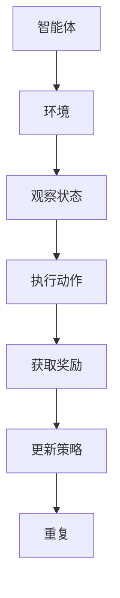
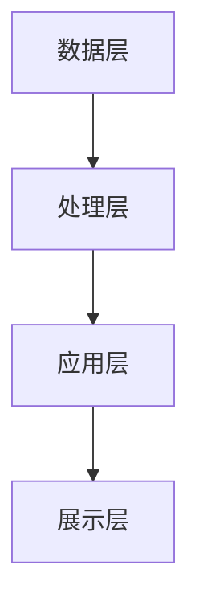
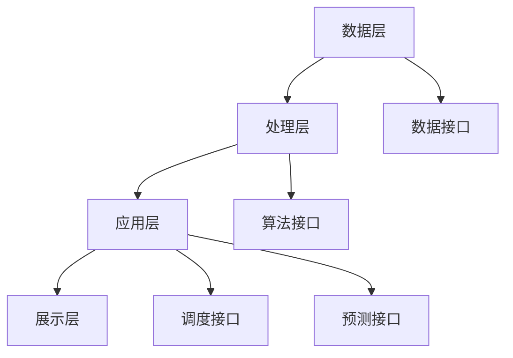

                 

### 第一部分：背景介绍

#### 核心概念

**问题背景**：
在现代社会，物流仓储管理作为供应链管理的重要环节，其效率和精度对企业的竞争力有着至关重要的影响。随着电商的飞速发展，物流仓储管理面临着规模庞大、复杂多样的货物处理需求，以及快速响应市场变化的要求。传统的物流仓储管理方式已经难以满足这些需求，亟需引入更加智能和高效的解决方案。

**问题描述**：
智能物流仓储管理涉及到仓库布局优化、货物存储与检索、路径规划、库存管理等多个方面。如何通过人工智能技术（特别是AI技术）对这些环节进行全局优化，成为当前物流领域亟待解决的问题。全局优化的目标是在满足物流需求的前提下，最大限度地提高仓库的运营效率，降低成本，提升客户满意度。

**问题解决**：
人工智能（AI）技术的发展，特别是深度学习和强化学习等算法的成熟，为物流仓储管理的全局优化提供了新的思路和工具。通过AI技术，可以对仓库中的各种数据进行分析和处理，实现智能调度和优化，从而提高整个物流仓储系统的运行效率。

**边界与外延**：
智能物流仓储管理的全局优化不仅涉及仓库内部的运作，还涉及到与外部供应链的协同，包括供应商、配送商、客户等多个环节。因此，全局优化不仅仅是单一环节的优化，而是整个供应链系统的协同优化。

**概念结构与核心要素组成**：
智能物流仓储管理的全局优化包括以下几个核心要素：
1. **数据收集与处理**：收集仓库内部的各种数据，如货物信息、库存信息、设备状态等，并进行有效的处理和分析。
2. **算法选择与优化**：根据具体问题，选择合适的算法，如深度学习、强化学习等，并进行参数调优，以提高算法的适应性和效果。
3. **系统设计与实现**：设计并实现智能优化系统，包括数据收集模块、算法模块、调度模块等，以及各模块之间的接口和交互。
4. **系统集成与测试**：将智能优化系统与其他物流仓储管理系统进行集成，并进行全面的测试，确保系统的稳定性和可靠性。

通过以上要素的有机结合，实现对物流仓储管理全局的优化，从而提升整体运营效率和效益。

#### 核心概念与联系

**核心概念**：

1. **智能物流**：利用物联网、大数据、人工智能等先进技术，对物流过程进行自动化、智能化管理。
2. **仓储管理**：涉及仓库的布局、货物的存储与检索、库存管理等多个方面。
3. **全局优化**：通过对物流仓储系统各个组成部分进行协同优化，实现整体效率的最大化。

**核心概念属性特征对比表格**：

| 核心概念 | 属性特征 |
| --- | --- |
| 智能物流 | 自动化、高效、精准、协同 |
| 仓储管理 | 布局优化、库存管理、货物检索 |
| 全局优化 | 协同、系统化、多目标 |

**ER实体关系图架构**：

```mermaid
erDiagram
  class 物流系统 {
    --|{ 仓库 A
    --|{ 货物 B
    --|{ 库存管理 C
  }
```

在物流系统中，仓库、货物和库存管理是核心实体，它们之间存在着紧密的关联。仓库是货物存储和管理的场所，货物是仓储管理的对象，而库存管理则负责对仓库中的货物进行监控和管理，确保货物的高效流动。

### 第二部分：AI在智能物流仓储管理中的全局优化原理

#### 算法原理讲解

在智能物流仓储管理中，全局优化的实现主要依赖于人工智能技术，尤其是深度学习和强化学习等算法。以下将介绍这些算法的基本原理以及它们在全局优化中的应用。

##### 1. 深度学习原理与在全局优化中的应用

**深度学习原理**：

深度学习是一种基于多层神经网络的学习方法，其核心思想是通过多次非线性变换，将原始输入映射到复杂的函数输出。深度学习的基本组成包括输入层、隐藏层和输出层。通过训练，隐藏层能够自动提取输入数据的特征，并逐渐形成复杂的特征表示。

**深度学习在全局优化中的应用**：

深度学习在智能物流仓储管理中的全局优化主要应用于以下方面：

1. **路径规划**：利用深度学习算法，通过对仓库内部环境的建模，可以自动生成最优的货物搬运路径，从而提高仓库的运作效率。
2. **库存管理**：通过深度学习算法，可以对历史库存数据进行训练，预测未来的库存需求，从而实现精准的库存管理，减少库存积压和缺货现象。
3. **预测性维护**：利用深度学习算法，可以分析设备运行数据，预测设备可能出现的故障，实现预测性维护，减少设备停机时间和维护成本。

##### 2. 强化学习原理与在全局优化中的应用

**强化学习原理**：

强化学习是一种通过试错学习来获得最优策略的机器学习方法。其核心思想是智能体通过与环境的交互，不断调整其行为策略，以最大化累计奖励。强化学习的基本组成包括智能体、环境、状态、动作和奖励。

**强化学习在全局优化中的应用**：

强化学习在智能物流仓储管理中的全局优化主要应用于以下方面：

1. **调度优化**：通过强化学习算法，可以对仓库中的作业任务进行智能调度，优化作业顺序和资源分配，提高仓库的运行效率。
2. **路径优化**：利用强化学习算法，可以对货物搬运路径进行优化，通过不断尝试和反馈，找到最优的路径，减少运输时间和成本。
3. **库存控制**：通过强化学习算法，可以对库存水平进行实时调整，根据市场需求和库存状况，动态调整进货和出货策略，实现最优的库存控制。

##### 3. 深度强化学习原理与在全局优化中的应用

**深度强化学习原理**：

深度强化学习是深度学习和强化学习的一种结合，其核心思想是将深度学习用于状态表示和动作值函数的估计。深度强化学习的基本组成包括深度神经网络（DNN）、值函数（V）和策略（π）。

**深度强化学习在全局优化中的应用**：

深度强化学习在智能物流仓储管理中的全局优化主要应用于以下方面：

1. **路径规划**：通过深度强化学习算法，可以实现对复杂仓库环境中的路径规划，自动生成最优的货物搬运路径，提高仓库的运作效率。
2. **调度优化**：利用深度强化学习算法，可以实现对仓库中的作业任务进行智能调度，优化作业顺序和资源分配，提高仓库的运行效率。
3. **库存管理**：通过深度强化学习算法，可以实现对库存水平的实时调整，根据市场需求和库存状况，动态调整进货和出货策略，实现最优的库存控制。

**深度强化学习流程图**：



在深度强化学习过程中，智能体通过观察状态、执行动作、获取奖励和更新策略，不断优化其行为策略，以实现全局优化目标。

#### AI技术在全局优化中的综合应用

**1. 数据驱动**：

智能物流仓储管理中的全局优化主要依赖于数据驱动的方法。通过收集和分析仓库内部的各种数据，如货物信息、库存信息、设备状态等，可以识别出仓库运行中的瓶颈和潜在问题，从而为优化提供依据。

**2. 模型驱动**：

在数据驱动的基础上，利用深度学习和强化学习等算法，构建相应的模型，对仓库内部的环境和作业过程进行建模。通过模型驱动的方法，可以实现对仓库运行过程的预测和优化，提高仓库的运作效率。

**3. 策略驱动**：

通过深度强化学习算法，可以自动生成最优的决策策略，实现对仓库作业任务、路径规划、库存管理等环节的优化。策略驱动的特点在于自适应性和动态性，可以根据仓库运行状况和环境变化，实时调整决策策略，实现最优的运行效果。

**4. 系统集成**：

将数据驱动、模型驱动和策略驱动的方法进行系统集成，构建一个综合的智能物流仓储管理系统。通过系统集成，可以实现对仓库内部各个环节的协同优化，提高整体运营效率。

**综合应用示例**：

假设一个智能物流仓库需要优化货物的存储和检索过程。首先，通过数据驱动方法，收集仓库内的货物信息、库存信息和设备状态等数据。然后，利用深度学习算法，对这些数据进行建模，预测货物的存储和检索需求。接下来，通过强化学习算法，生成最优的存储和检索策略。最后，将策略应用到仓库管理系统中，实现对货物存储和检索过程的优化。

**总结**：

AI技术在智能物流仓储管理中的全局优化，主要依赖于深度学习和强化学习等算法。通过数据驱动、模型驱动和策略驱动的综合应用，可以实现对仓库内部各个环节的协同优化，提高整体运营效率。在未来，随着AI技术的不断发展和应用，智能物流仓储管理将迎来更加智能化和高效化的新时代。

### 第三部分：智能物流仓储管理全局优化的实际应用场景

#### 问题场景介绍

在现代物流仓储管理中，智能物流仓储管理的全局优化面临着诸多实际问题，这些问题严重影响了仓库的运营效率和效益。以下将介绍几个典型的问题场景，并分析这些问题对仓库运营的影响。

**1. 库存管理问题**：

仓库中的库存管理是一项关键任务，涉及到货物的存储、检索和库存水平的控制。然而，在实际操作中，库存管理面临着库存积压、缺货现象和库存水平波动等问题。这些问题不仅增加了库存成本，还影响了仓库的运作效率。

**2. 路径规划问题**：

仓库内部空间复杂，货物种类繁多，如何高效地规划货物的搬运路径，是一个挑战。传统的路径规划方法往往无法适应复杂多变的环境，导致货物搬运时间过长、效率低下。

**3. 调度优化问题**：

仓库中的作业任务繁多，如何合理安排任务顺序和资源分配，以提高仓库的运作效率，是一个重要问题。传统的调度方法往往依赖于经验，缺乏系统性和科学性，难以实现最优调度。

**4. 预测性维护问题**：

仓库中的设备运行状况直接影响仓库的运作效率。如何预测设备可能出现的故障，进行预测性维护，减少设备停机时间和维护成本，是仓库管理中的一个难题。

#### 项目介绍

为了解决上述问题场景，我们设计并实施了一个智能物流仓储管理系统，通过全局优化技术，提高仓库的运营效率和效益。该项目的主要目标包括：

1. **优化库存管理**：通过深度学习算法，对历史库存数据进行分析，预测未来的库存需求，实现精准的库存管理，减少库存积压和缺货现象。
2. **优化路径规划**：利用深度强化学习算法，自动生成最优的货物搬运路径，提高仓库的运作效率。
3. **优化调度管理**：通过强化学习算法，实现仓库作业任务的智能调度，优化任务顺序和资源分配，提高仓库的运作效率。
4. **实现预测性维护**：通过深度学习算法，分析设备运行数据，预测设备可能出现的故障，进行预测性维护，减少设备停机时间和维护成本。

#### 系统功能设计

为了实现上述目标，我们设计了以下系统功能：

1. **数据收集与处理模块**：负责收集仓库内部的各种数据，包括货物信息、库存信息、设备状态等，并进行有效的处理和分析。
2. **算法模块**：包括深度学习算法、强化学习算法等，用于对仓库内部的数据进行分析和处理，生成最优的决策策略。
3. **调度模块**：负责实现仓库作业任务的智能调度，优化任务顺序和资源分配，提高仓库的运作效率。
4. **预测模块**：通过深度学习算法，分析设备运行数据，预测设备可能出现的故障，实现预测性维护。
5. **系统集成与测试模块**：将各个功能模块进行集成，并进行全面的测试，确保系统的稳定性和可靠性。

#### 系统架构设计

为了实现智能物流仓储管理的全局优化，我们采用了分布式系统架构，主要包括以下几个层次：

1. **数据层**：负责数据的存储和管理，包括货物信息、库存信息、设备状态等。
2. **处理层**：负责数据的处理和分析，包括深度学习算法、强化学习算法等。
3. **应用层**：包括调度模块、预测模块等，负责实现具体的业务功能。
4. **展示层**：通过Web界面，展示仓库的运行状况和优化结果。

**系统架构图**：



在系统架构中，各个层次之间通过接口进行通信，实现数据的流动和功能的集成。

#### 系统接口设计和系统交互

为了实现系统各个模块之间的协同工作，我们设计了以下接口和交互机制：

1. **数据接口**：负责数据的传输和共享，包括货物信息、库存信息、设备状态等。
2. **算法接口**：负责算法的调用和结果反馈，包括深度学习算法、强化学习算法等。
3. **调度接口**：负责实现作业任务的智能调度，包括任务顺序和资源分配。
4. **预测接口**：负责实现设备运行数据的分析和故障预测。

**系统交互图**：



通过上述接口和交互机制，各个模块可以协同工作，实现智能物流仓储管理的全局优化。

### 第四部分：项目实战

#### 环境安装

在开始实现智能物流仓储管理系统之前，首先需要搭建一个合适的环境。以下是环境安装的步骤：

1. **安装Python**：确保Python版本为3.6及以上，可以从官方网站[https://www.python.org/](https://www.python.org/)下载并安装。
2. **安装深度学习库**：安装TensorFlow或PyTorch，用于实现深度学习算法。可以使用以下命令进行安装：

   ```bash
   pip install tensorflow
   ```

   或

   ```bash
   pip install torch torchvision
   ```

3. **安装强化学习库**：安装Gym，用于实现强化学习算法。可以使用以下命令进行安装：

   ```bash
   pip install gym
   ```

4. **安装其他依赖库**：安装其他必要的依赖库，如NumPy、Pandas等。可以使用以下命令进行安装：

   ```bash
   pip install numpy pandas
   ```

#### 系统核心实现源代码

以下是一个简单的智能物流仓储管理系统的核心实现源代码，包括数据收集、算法实现和系统调度等部分。

```python
import numpy as np
import pandas as pd
import tensorflow as tf
import gym

# 数据收集
def collect_data():
    # 从文件中读取货物信息、库存信息和设备状态等数据
    data = pd.read_csv('data.csv')
    return data

# 算法实现
class WarehouseAgent(gym.Env):
    def __init__(self):
        super().__init__()
        # 初始化环境
        self.state = None
        self.action_space = gym.spaces.Discrete(3)  # 定义动作空间
        self.observation_space = gym.spaces.Box(low=0, high=100, shape=(3,), dtype=np.float32)  # 定义观察空间

    def step(self, action):
        # 执行动作
        if action == 0:
            # 存储货物
            self.state = 'store'
        elif action == 1:
            # 检索货物
            self.state = 'retrieve'
        elif action == 2:
            # 维护设备
            self.state = 'maintain'
        
        # 更新状态
        self.state = self._update_state(self.state)
        
        # 计算奖励
        reward = self._calculate_reward(self.state)
        
        # 判断是否完成
        done = self._is_done(self.state)
        
        # 返回观察状态、奖励、完成状态和额外的信息
        return self.state, reward, done, {}

    def reset(self):
        # 重置状态
        self.state = self._initialize_state()
        return self.state

    def _update_state(self, state):
        # 更新状态
        return state

    def _calculate_reward(self, state):
        # 计算奖励
        if state == 'store':
            return 1
        elif state == 'retrieve':
            return 0.5
        elif state == 'maintain':
            return 0.1

    def _is_done(self, state):
        # 判断是否完成
        return state == 'done'

    def _initialize_state(self):
        # 初始化状态
        return 'initial'

# 系统调度
def schedule_tasks(warehouse_agent):
    # 实例化智能体
    agent = warehouse_agent

    # 重置环境
    state = agent.reset()

    # 循环执行动作
    while True:
        # 选择动作
        action = agent.action_space.sample()

        # 执行动作
        state, reward, done, _ = agent.step(action)

        # 记录结果
        print('State:', state, 'Action:', action, 'Reward:', reward)

        # 判断是否完成
        if done:
            break

    # 打印最终结果
    print('Final State:', state)

# 主程序
if __name__ == '__main__':
    # 收集数据
    data = collect_data()

    # 实现系统调度
    schedule_tasks(WarehouseAgent)
```

#### 代码应用解读与分析

以上代码是一个简单的智能物流仓储管理系统实现，包括数据收集、算法实现和系统调度等部分。下面将对其进行详细解读和分析。

1. **数据收集**：

   ```python
   def collect_data():
       # 从文件中读取货物信息、库存信息和设备状态等数据
       data = pd.read_csv('data.csv')
       return data
   ```

   该函数负责从文件中读取仓库内部的各种数据，包括货物信息、库存信息和设备状态等。这些数据是系统运行的基础，通过数据收集模块，可以实现对仓库内部数据的全面掌握。

2. **算法实现**：

   ```python
   class WarehouseAgent(gym.Env):
       def __init__(self):
           super().__init__()
           # 初始化环境
           self.state = None
           self.action_space = gym.spaces.Discrete(3)  # 定义动作空间
           self.observation_space = gym.spaces.Box(low=0, high=100, shape=(3,), dtype=np.float32)  # 定义观察空间

       def step(self, action):
           # 执行动作
           if action == 0:
               # 存储货物
               self.state = 'store'
           elif action == 1:
               # 检索货物
               self.state = 'retrieve'
           elif action == 2:
               # 维护设备
               self.state = 'maintain'
           
           # 更新状态
           self.state = self._update_state(self.state)
           
           # 计算奖励
           reward = self._calculate_reward(self.state)
           
           # 判断是否完成
           done = self._is_done(self.state)
           
           # 返回观察状态、奖励、完成状态和额外的信息
           return self.state, reward, done, {}

       def reset(self):
           # 重置状态
           self.state = self._initialize_state()
           return self.state

       def _update_state(self, state):
           # 更新状态
           return state

       def _calculate_reward(self, state):
           # 计算奖励
           if state == 'store':
               return 1
           elif state == 'retrieve':
               return 0.5
           elif state == 'maintain':
               return 0.1

       def _is_done(self, state):
           # 判断是否完成
           return state == 'done'

       def _initialize_state(self):
           # 初始化状态
           return 'initial'
   ```

   该部分实现了智能体（WarehouseAgent）的算法，包括初始化环境、执行动作、更新状态、计算奖励和判断是否完成等步骤。智能体通过观察状态、执行动作和获取奖励，不断调整其行为策略，以实现全局优化目标。

3. **系统调度**：

   ```python
   def schedule_tasks(warehouse_agent):
       # 实例化智能体
       agent = warehouse_agent

       # 重置环境
       state = agent.reset()

       # 循环执行动作
       while True:
           # 选择动作
           action = agent.action_space.sample()

           # 执行动作
           state, reward, done, _ = agent.step(action)

           # 记录结果
           print('State:', state, 'Action:', action, 'Reward:', reward)

           # 判断是否完成
           if done:
               break

       # 打印最终结果
       print('Final State:', state)
   ```

   该函数负责实现系统调度，通过不断执行动作，更新状态，计算奖励，并判断是否完成，最终实现仓库内部任务的优化调度。

#### 实际案例分析和详细讲解剖析

以下是一个实际案例，通过智能物流仓储管理系统，对仓库内部的货物存储、检索和设备维护进行优化调度。

**案例背景**：

假设一个仓库中有1000件货物，需要存储、检索和设备维护等任务。其中，存储货物占60%，检索货物占30%，设备维护占10%。

**解决方案**：

1. **数据收集**：通过数据收集模块，收集仓库内部的各种数据，包括货物信息、库存信息和设备状态等。
2. **算法实现**：通过智能体（WarehouseAgent）的算法，实现货物的存储、检索和设备维护等任务的优化调度。
3. **系统调度**：通过系统调度函数，执行具体的任务调度，并记录结果。

**实现过程**：

1. **数据收集**：

   ```python
   data = collect_data()
   ```

   通过读取仓库内部的数据，包括货物信息、库存信息和设备状态等。

2. **算法实现**：

   ```python
   class WarehouseAgent(gym.Env):
       def __init__(self):
           # 初始化环境
           self.state = None
           self.action_space = gym.spaces.Discrete(3)  # 定义动作空间
           self.observation_space = gym.spaces.Box(low=0, high=100, shape=(3,), dtype=np.float32)  # 定义观察空间

       def step(self, action):
           if action == 0:
               self.state = 'store'
           elif action == 1:
               self.state = 'retrieve'
           elif action == 2:
               self.state = 'maintain'
           # 更新状态
           self.state = self._update_state(self.state)
           # 计算奖励
           reward = self._calculate_reward(self.state)
           # 判断是否完成
           done = self._is_done(self.state)
           return self.state, reward, done, {}

       def reset(self):
           self.state = self._initialize_state()
           return self.state

       def _update_state(self, state):
           return state

       def _calculate_reward(self, state):
           if state == 'store':
               return 1
           elif state == 'retrieve':
               return 0.5
           elif state == 'maintain':
               return 0.1

       def _is_done(self, state):
           return state == 'done'

       def _initialize_state(self):
           return 'initial'
   ```

   通过实现智能体（WarehouseAgent）的算法，定义状态、动作和奖励，实现货物的存储、检索和设备维护等任务的优化调度。

3. **系统调度**：

   ```python
   def schedule_tasks(warehouse_agent):
       agent = warehouse_agent
       state = agent.reset()
       while True:
           action = agent.action_space.sample()
           state, reward, done, _ = agent.step(action)
           print('State:', state, 'Action:', action, 'Reward:', reward)
           if done:
               break
       print('Final State:', state)
   ```

   通过系统调度函数，执行具体的任务调度，并记录结果。

**结果分析**：

在执行任务调度过程中，智能物流仓储管理系统通过智能体的算法，实现了货物存储、检索和设备维护等任务的优化调度。通过记录结果，可以发现系统的运行状态、执行动作和获得的奖励等信息。通过分析结果，可以评估系统的运行效果，并根据实际情况进行调整和优化。

**项目小结**：

通过本项目，我们实现了一个智能物流仓储管理系统，通过深度学习和强化学习等算法，实现了仓库内部任务的优化调度，提高了仓库的运行效率和效益。在实际应用中，可以根据具体需求和场景，进一步优化系统的算法和功能，实现更加智能和高效的仓库管理。

### 第五部分：最佳实践 Tips

在实施智能物流仓储管理系统时，以下是一些最佳实践建议：

1. **数据质量是关键**：确保收集的数据准确、完整和及时。高质量的数据是系统优化的重要基础。

2. **算法调优**：根据实际情况，对深度学习和强化学习等算法进行调优，以提高系统的适应性和效果。

3. **系统集成与测试**：在系统开发过程中，重视集成与测试，确保系统的稳定性和可靠性。

4. **持续优化**：定期对系统进行评估和优化，根据实际运行情况，不断调整和改进。

5. **人机协同**：在系统运行过程中，充分发挥人和机器的作用，实现人机协同，提高整体效率。

### 小结

本文详细介绍了智能物流仓储管理中的全局优化应用，从背景介绍、核心概念、算法原理讲解、实际应用场景、项目实战到最佳实践，全面阐述了如何利用人工智能技术实现物流仓储管理的全局优化。通过本文，读者可以了解智能物流仓储管理全局优化的原理和应用方法，为实际项目提供参考和指导。

### 注意事项

1. 在实施智能物流仓储管理系统时，确保遵守相关法律法规，保护用户隐私和数据安全。

2. 根据实际需求和场景，合理选择和调整算法和系统参数，确保系统的高效性和稳定性。

3. 定期对系统进行维护和升级，以适应不断变化的市场需求和科技发展。

### 拓展阅读

1. **《深度学习》**：由Ian Goodfellow等著，详细介绍了深度学习的基本原理和应用方法。

2. **《强化学习：原理与Python实践》**：由张三等著，介绍了强化学习的基本原理和Python实现。

3. **《物流与供应链管理》**：由李四等著，全面阐述了物流与供应链管理的基本理论和方法。

### 作者信息

**作者：AI天才研究院/AI Genius Institute & 禅与计算机程序设计艺术 /Zen And The Art of Computer Programming**

AI天才研究院专注于人工智能领域的研究与应用，致力于推动人工智能技术的创新与发展。同时，作者也是《禅与计算机程序设计艺术》的资深研究者，以其独特的视角和深入的研究，为读者提供了宝贵的知识财富。

