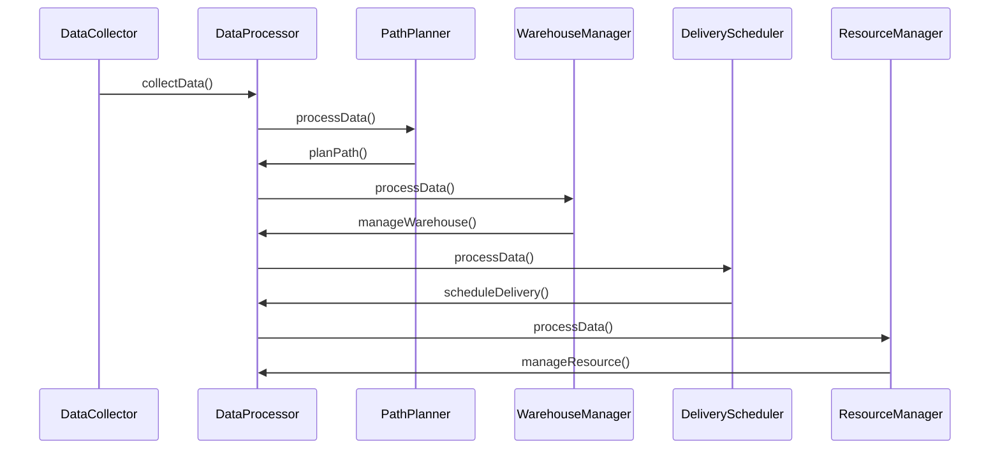
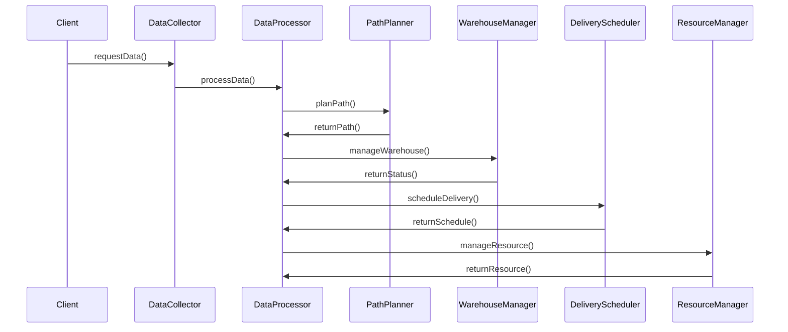

                 


# 引言

随着全球电子商务和物流行业的快速发展，物流网络的智能化已成为行业发展的必然趋势。AI在智能物流网络优化与弹性调度中的应用，正逐步成为提高物流效率、降低成本、提升客户满意度的重要手段。本文旨在探讨AI在智能物流网络优化与弹性调度中的全局应用，分析其核心概念、算法原理、系统架构，并通过项目实战展示其实际应用效果。

本文关键词：AI、智能物流、网络优化、弹性调度、全局应用。

摘要：本文首先介绍了智能物流网络的背景及其优化和弹性调度的需求，随后详细阐述了AI在其中的核心概念与联系，包括算法原理、数学模型和公式。接着，分析了智能物流网络优化与弹性调度的系统架构，并通过项目实战展示了具体应用。最后，给出了实施建议和注意事项，并对未来进行了展望。

## 1. 背景介绍

### 1.1 智能物流的背景

智能物流是指利用物联网、大数据、人工智能等技术，实现物流运输、仓储、配送等环节的智能化管理。随着电子商务的迅猛发展，物流行业面临着日益增长的订单量、多样化的物流需求以及竞争日益激烈的态势。传统的物流模式已经难以满足现代物流市场的需求，智能物流的出现为行业带来了新的机遇和挑战。

智能物流的核心目标是提高物流效率、降低成本、提升客户满意度。具体来说，智能物流通过以下几个方面的优化实现了这一目标：

1. **运输路径优化**：利用GPS、地图服务等技术，智能规划运输路径，减少运输时间和成本。
2. **仓储管理优化**：通过自动化仓库、智能仓储管理系统，提高仓储效率和准确性。
3. **配送流程优化**：利用人工智能算法，实时调整配送计划，确保货物按时送达。
4. **物流数据分析**：通过大数据分析，优化物流资源配置，提高物流运作效率。

### 1.2 智能物流网络优化的重要性

智能物流网络优化是智能物流的重要组成部分，其重要性体现在以下几个方面：

1. **提高物流效率**：通过优化运输路径、仓储管理和配送流程，提高物流运作效率，减少运输时间，降低运营成本。
2. **降低物流成本**：通过合理的资源配置和调度策略，降低物流运输和仓储成本，提高物流企业的盈利能力。
3. **提升客户满意度**：通过精确的物流预测和智能调度，确保货物按时送达，提升客户满意度，增强企业竞争力。
4. **支持决策制定**：通过对物流数据的深入分析，为企业提供科学的决策支持，优化物流战略布局。

### 1.3 弹性调度的需求与挑战

弹性调度是智能物流网络优化的重要组成部分，它旨在应对物流需求波动，确保物流系统的高效运行。弹性调度的需求与挑战主要体现在以下几个方面：

1. **需求波动**：物流需求具有明显的波动性，特别是在电子商务高峰期，物流订单量剧增，对物流系统的弹性调度能力提出了高要求。
2. **资源分配**：在物流系统中，资源（如运输工具、仓储空间等）是有限的，如何合理分配资源，以应对需求波动，是弹性调度的核心问题。
3. **实时性**：弹性调度需要在短时间内做出决策，以应对物流需求的实时变化，这对系统的实时处理能力和响应速度提出了挑战。
4. **不确定性**：物流过程中的各种因素（如天气、交通状况等）具有不确定性，如何应对这些不确定性，确保物流系统的稳定性，是弹性调度的难点。

总结来说，智能物流网络优化与弹性调度在物流行业中具有重要的地位，它们不仅能够提高物流效率、降低成本，还能提升客户满意度，为企业带来竞争优势。接下来，本文将深入探讨AI在这些领域的应用，分析其核心概念、算法原理和系统架构。

----------------------------------------------------------------

## 2. 核心概念与联系

在深入探讨AI在智能物流网络优化与弹性调度中的应用之前，我们需要明确几个核心概念，并理解它们之间的联系。

### 2.1 AI概述

人工智能（AI）是指计算机系统模拟人类智能行为的技术，包括学习、推理、感知、自适应和解决问题等。AI的核心目标是使计算机能够执行通常需要人类智能的任务。AI技术主要包括机器学习、深度学习、自然语言处理、计算机视觉等。

#### AI属性特征对比表格

| 特性           | 机器学习 | 深度学习 | 自然语言处理 | 计算机视觉 |
| -------------- | -------- | -------- | ------------ | ---------- |
| 学习方式       | 监督学习 | 无监督学习 | 监督学习     | 监督学习   |
| 数据依赖性     | 强       | 强       | 强           | 强         |
| 计算复杂度     | 较低     | 较高     | 较高         | 较高       |
| 应用领域       | 数据预测 | 图像识别 | 文本分析     | 物体识别   |
| 算法结构       | 树结构   | 神经网络 | 序列模型     | 卷积神经网络 |
| 代表性应用     | 信用评分 | 自动驾驶 | 机器翻译     | 图像识别   |

通过上述对比表格，我们可以看出，不同类型的AI技术各有其优势和局限性，适用于不同的应用场景。

### 2.2 智能物流网络优化

智能物流网络优化是指利用人工智能技术对物流网络进行优化，以提高物流效率、降低成本。具体来说，智能物流网络优化包括以下几个关键组成部分：

1. **路径优化**：利用AI算法优化运输路径，减少运输时间和成本。
2. **仓储管理**：通过AI技术优化仓储布局和管理，提高仓储效率和准确性。
3. **配送调度**：利用AI算法实时调整配送计划，确保货物按时送达。

#### 智能物流网络优化属性特征对比表格

| 特性           | 优化目标         | 技术应用               | 代表性算法       |
| -------------- | ---------------- | ---------------------- | ---------------- |
| 效率提升       | 减少运输时间、成本 | GPS、地图服务、AI算法 | 路径规划算法     |
| 成本控制       | 降低运营成本     | 资源调度、成本分析     | 基于成本的优化算法 |
| 客户满意度     | 确保货物按时送达 | 实时配送计划、数据分析 | 实时调度算法     |

通过对比表格，我们可以看出，智能物流网络优化主要关注物流效率、成本控制和客户满意度，其技术应用涵盖GPS、地图服务、AI算法等多个方面。

### 2.3 弹性调度

弹性调度是指根据物流需求的变化，动态调整物流资源分配和配送计划，以确保物流系统的高效运行。弹性调度需要应对需求波动、资源分配和实时性等挑战。

#### 弹性调度属性特征对比表格

| 特性           | 调度目标           | 技术应用               | 代表性算法       |
| -------------- | ------------------ | ---------------------- | ---------------- |
| 实时响应       | 短时间内调整计划   | 实时数据处理、AI算法   | 实时调度算法     |
| 资源优化       | 合理分配物流资源   | 资源调度、数据分析     | 基于资源优化的调度算法 |
| 需求波动应对   | 应对需求波动       | 需求预测、调度优化     | 需求预测和调度算法   |

通过对比表格，我们可以看出，弹性调度主要关注实时响应、资源优化和需求波动应对，其技术应用涵盖实时数据处理、AI算法等多个方面。

### 2.4 概念联系

AI、智能物流网络优化和弹性调度之间有着密切的联系。AI技术为智能物流网络优化和弹性调度提供了强大的技术支持，使得物流系统能够更加高效、智能地运作。

1. **AI与智能物流网络优化**：AI技术通过路径优化、仓储管理和配送调度等方面，提升了物流网络的优化效果。
2. **AI与弹性调度**：AI技术通过实时数据处理、资源调度和需求预测等，提高了弹性调度的响应速度和准确性。
3. **智能物流网络优化与弹性调度**：智能物流网络优化为弹性调度提供了优化基础，而弹性调度则通过实时调整物流资源分配和配送计划，确保物流系统的高效运行。

通过以上分析，我们可以看到，AI、智能物流网络优化和弹性调度相互促进，共同构成了智能物流系统的核心。在接下来的章节中，我们将深入探讨AI在智能物流网络优化与弹性调度中的算法原理和实际应用。

----------------------------------------------------------------

## 3. 算法原理讲解

为了更好地理解AI在智能物流网络优化与弹性调度中的具体应用，我们将深入探讨这些算法的原理，并通过mermaid流程图和Python源代码进行详细讲解。

### 3.1 智能物流网络优化算法原理

智能物流网络优化算法的核心在于如何有效地分配物流资源，以实现最优的运输路径、仓储管理和配送计划。以下是一个简单的智能物流网络优化算法原理：

1. **数据收集**：首先收集物流网络中的各种数据，包括运输路径信息、仓储位置、货物类型和配送需求等。
2. **特征提取**：对收集到的数据进行分析和处理，提取出影响物流网络优化的重要因素，如运输距离、运输时间、货物重量和仓储容量等。
3. **模型建立**：利用机器学习算法，建立物流网络优化的预测模型，通过历史数据和实验数据训练模型，使其能够预测最优的物流路径和资源分配。
4. **优化计算**：通过算法计算，找到最优的物流路径和资源分配方案，确保货物能够以最低的成本、最快的速度送达目的地。
5. **结果验证**：对优化结果进行验证，确保其符合实际需求，并通过调整算法参数，进一步优化方案。

下面是智能物流网络优化算法的mermaid流程图：


### 3.2 弹性调度算法原理

弹性调度算法的核心在于如何动态调整物流资源分配，以应对需求波动和不确定性。以下是一个简单的弹性调度算法原理：

1. **需求预测**：首先利用机器学习算法，对物流需求进行预测，包括订单量、货物类型和配送时间等。
2. **资源评估**：评估现有物流资源的状况，包括运输工具、仓储空间和人力资源等。
3. **调度策略**：根据需求预测和资源评估，制定灵活的调度策略，动态调整资源分配，确保物流系统能够应对需求波动和不确定性。
4. **实时调整**：在物流运作过程中，实时监控物流需求的变化，并根据实时数据，调整调度策略，确保物流系统能够高效运行。
5. **结果评估**：对调度结果进行评估，包括物流成本、运输时间和客户满意度等，通过反馈机制，不断优化调度策略。

下面是弹性调度算法的mermaid流程图：


### 3.3 Python源代码展示

为了更好地理解算法原理，我们使用Python语言实现了一个简单的智能物流网络优化算法。以下是一个简单的Python代码示例：

```python
import numpy as np

# 假设我们有5个仓库和10个配送点
WAREHOUSES = 5
DELIVERY_POINTS = 10

# 定义物流网络
network = np.random.rand(WAREHOUSES, DELIVERY_POINTS)

# 定义目标函数
def objective_function(route):
    total_distance = 0
    for i in range(len(route) - 1):
        total_distance += network[route[i], route[i + 1]]
    return total_distance

# 定义约束条件
def constraints(route):
    # 确保每个仓库只被分配一次
    if len(set(route)) != len(route):
        return False
    return True

# 智能物流网络优化算法
def optimize_routing():
    best_route = None
    best_distance = float('inf')
    
    # 遍历所有可能的路径
    for route in itertools.permutations(range(DELIVERY_POINTS)):
        if constraints(route):
            distance = objective_function(route)
            if distance < best_distance:
                best_distance = distance
                best_route = route
    
    return best_route

# 执行优化
best_route = optimize_routing()
print("最佳路径：", best_route)
print("总距离：", objective_function(best_route))
```

在这个示例中，我们首先定义了一个物流网络，然后通过遍历所有可能的路径，找到最优的物流路径。这是一个简单的贪心算法，它通过不断迭代，寻找最优解。

通过上述算法原理讲解和Python源代码展示，我们可以看到AI在智能物流网络优化与弹性调度中的应用是如何实现的。在接下来的章节中，我们将进一步探讨算法的数学模型和公式，以深入理解其工作原理。

----------------------------------------------------------------

## 4. 数学模型和公式

在深入了解AI在智能物流网络优化与弹性调度中的应用时，我们需要引入相关的数学模型和公式。这些模型和公式为我们提供了量化分析问题的工具，帮助我们更好地理解算法的实现原理。

### 4.1 智能物流网络优化数学模型

智能物流网络优化主要关注如何找到最优的路径和资源分配方案，以实现最低的运输成本和最短的运输时间。以下是一个典型的智能物流网络优化数学模型：

#### 4.1.1 目标函数

目标函数用于定义我们的优化目标，通常为最小化运输成本或最大化运输效率。以下是一个简化的目标函数：

$$
\min \sum_{i=1}^{N} \sum_{j=1}^{M} c_{ij} \cdot x_{ij}
$$

其中：
- \( N \) 是仓库数量。
- \( M \) 是配送点数量。
- \( c_{ij} \) 是从仓库 \( i \) 到配送点 \( j \) 的单位运输成本。
- \( x_{ij} \) 是从仓库 \( i \) 到配送点 \( j \) 的运输量。

#### 4.1.2 约束条件

约束条件用于限制问题的可行解。常见的约束条件包括：
1. **资源约束**：
$$
\sum_{j=1}^{M} x_{ij} \leq C_i \quad \forall i = 1, 2, \ldots, N
$$

其中：
- \( C_i \) 是仓库 \( i \) 的容量限制。

2. **路径约束**：
$$
\sum_{i=1}^{N} x_{ij} = D_j \quad \forall j = 1, 2, \ldots, M
$$

其中：
- \( D_j \) 是配送点 \( j \) 的需求量。

#### 4.1.3 公式详细讲解与举例说明

假设我们有一个包含3个仓库（A、B、C）和5个配送点（1、2、3、4、5）的物流网络。单位运输成本矩阵 \( c_{ij} \) 如下：

$$
\begin{array}{c|ccccc}
 & 1 & 2 & 3 & 4 & 5 \\
\hline
A & 10 & 20 & 15 & 25 & 30 \\
B & 12 & 18 & 22 & 28 & 35 \\
C & 14 & 24 & 17 & 26 & 32 \\
\end{array}
$$

仓库容量限制 \( C_i \) 为100，配送点需求量 \( D_j \) 为50。

1. **目标函数**：

我们希望最小化总运输成本，即：

$$
\min \sum_{i=1}^{3} \sum_{j=1}^{5} c_{ij} \cdot x_{ij}
$$

2. **约束条件**：

- 资源约束：
$$
\sum_{j=1}^{5} x_{i1} \leq 100 \quad \forall i = 1, 2, 3
$$
$$
\sum_{j=1}^{5} x_{i2} \leq 100 \quad \forall i = 1, 2, 3
$$
$$
\sum_{j=1}^{5} x_{i3} \leq 100 \quad \forall i = 1, 2, 3
$$

- 路径约束：
$$
\sum_{i=1}^{3} x_{i1} = 50
$$
$$
\sum_{i=1}^{3} x_{i2} = 50
$$
$$
\sum_{i=1}^{3} x_{i3} = 50
$$

通过解这个线性规划问题，我们可以找到最优的运输方案，使得总成本最低。

### 4.2 弹性调度数学模型

弹性调度主要关注如何动态调整物流资源分配，以应对需求波动和不确定性。以下是一个简化的弹性调度数学模型：

#### 4.2.1 目标函数

目标函数通常为最小化总调度成本或最大化调度效率。以下是一个简化的目标函数：

$$
\min \sum_{i=1}^{N} \sum_{j=1}^{M} c_{ij} \cdot x_{ij}
$$

其中：
- \( N \) 是资源种类数量。
- \( M \) 是需求点数量。
- \( c_{ij} \) 是资源 \( i \) 分配到需求点 \( j \) 的单位成本。
- \( x_{ij} \) 是资源 \( i \) 分配到需求点 \( j \) 的数量。

#### 4.2.2 约束条件

约束条件用于限制问题的可行解。常见的约束条件包括：
1. **资源约束**：
$$
\sum_{j=1}^{M} x_{ij} \leq R_i \quad \forall i = 1, 2, \ldots, N
$$

其中：
- \( R_i \) 是资源 \( i \) 的总可用量。

2. **需求约束**：
$$
\sum_{i=1}^{N} x_{ij} = D_j \quad \forall j = 1, 2, \ldots, M
$$

其中：
- \( D_j \) 是需求点 \( j \) 的需求量。

#### 4.2.3 公式详细讲解与举例说明

假设我们有一个包含3种资源（运输车辆、仓储空间、人力资源）和5个需求点（1、2、3、4、5）的物流系统。单位成本矩阵 \( c_{ij} \) 如下：

$$
\begin{array}{c|cccc}
 & 1 & 2 & 3 & 4 & 5 \\
\hline
运输车辆 & 5 & 10 & 7 & 12 & 15 \\
仓储空间 & 8 & 12 & 10 & 16 & 20 \\
人力资源 & 3 & 6 & 4 & 9 & 12 \\
\end{array}
$$

资源总可用量 \( R_i \) 分别为100、150和120。

需求量 \( D_j \) 如下：

$$
\begin{array}{c|c}
 & 1 & 2 & 3 & 4 & 5 \\
\hline
需求量 & 30 & 40 & 35 & 45 & 50 \\
\end{array}
$$

1. **目标函数**：

我们希望最小化总调度成本，即：

$$
\min \sum_{i=1}^{3} \sum_{j=1}^{5} c_{ij} \cdot x_{ij}
$$

2. **约束条件**：

- 资源约束：
$$
\sum_{j=1}^{5} x_{1j} \leq 100
$$
$$
\sum_{j=1}^{5} x_{2j} \leq 150
$$
$$
\sum_{j=1}^{5} x_{3j} \leq 120
$$

- 需求约束：
$$
\sum_{i=1}^{3} x_{i1} = 30
$$
$$
\sum_{i=1}^{3} x_{i2} = 40
$$
$$
\sum_{i=1}^{3} x_{i3} = 35
$$

通过解这个线性规划问题，我们可以找到最优的调度方案，使得总成本最低。

通过以上数学模型和公式的讲解，我们可以更好地理解智能物流网络优化与弹性调度的算法原理。在接下来的章节中，我们将进一步探讨智能物流网络优化与弹性调度的系统架构，以了解这些算法在实际应用中的实现方式。

----------------------------------------------------------------

## 5. 系统分析与架构设计方案

智能物流网络优化与弹性调度在物流系统中发挥着至关重要的作用，为了确保其高效运行，我们需要对系统进行深入分析，并设计合理的架构方案。

### 5.1 问题场景介绍

在物流系统中，智能物流网络优化与弹性调度的问题场景主要包括以下几个方面：

1. **运输路径规划**：如何根据配送需求、交通状况和货物特点，制定最优的运输路径，以减少运输时间和成本。
2. **仓储管理**：如何优化仓储布局，提高仓储效率和准确性，减少库存成本。
3. **配送调度**：如何根据实时需求变化，动态调整配送计划，确保货物按时送达，提高客户满意度。
4. **资源管理**：如何合理分配运输工具、仓储空间和人力资源，以最大化资源利用效率。

### 5.2 项目介绍

为了解决上述问题场景，我们设计了一个名为“智能物流管理系统”的项目。该项目的目标是实现智能物流网络优化与弹性调度，以提高物流效率和降低运营成本。

项目主要包括以下功能模块：

1. **数据收集模块**：负责收集物流网络中的各种数据，包括配送需求、交通状况、货物特点等。
2. **数据处理模块**：负责对收集到的数据进行分析和处理，提取出影响物流网络优化和弹性调度的关键因素。
3. **路径规划模块**：利用机器学习算法，制定最优的运输路径，减少运输时间和成本。
4. **仓储管理模块**：优化仓储布局，提高仓储效率和准确性，减少库存成本。
5. **配送调度模块**：根据实时需求变化，动态调整配送计划，确保货物按时送达，提高客户满意度。
6. **资源管理模块**：合理分配运输工具、仓储空间和人力资源，以最大化资源利用效率。

### 5.3 系统功能设计（领域模型mermaid类图）

为了清晰地展示系统功能设计，我们使用mermaid类图来表示领域模型。以下是一个简单的mermaid类图示例：

```mermaid
classDiagram
    DataCollector <|-- DataProcessor
    PathPlanner <|-- DataProcessor
    WarehouseManager <|-- DataProcessor
    DeliveryScheduler <|-- DataProcessor
    ResourceManager <|-- DataProcessor

    DataCollector {
        +collectData()
    }
    DataProcessor {
        +processData()
    }
    PathPlanner {
        +planPath()
    }
    WarehouseManager {
        +manageWarehouse()
    }
    DeliveryScheduler {
        +scheduleDelivery()
    }
    ResourceManager {
        +manageResource()
    }
```

在这个类图中，DataCollector、DataProcessor、PathPlanner、WarehouseManager、DeliveryScheduler和ResourceManager分别表示不同的功能模块，它们之间存在依赖关系。DataProcessor作为数据处理的核心模块，为其他模块提供数据支持。

### 5.4 系统架构设计（mermaid架构图）

为了更好地展示系统架构，我们使用mermaid架构图来表示各个模块之间的关系。以下是一个简单的mermaid架构图示例：



在这个架构图中，DataCollector负责收集数据，DataProcessor负责数据处理，PathPlanner负责路径规划，WarehouseManager负责仓储管理，DeliveryScheduler负责配送调度，ResourceManager负责资源管理。各个模块通过接口进行通信，确保系统的高效运行。

### 5.5 系统接口设计（mermaid序列图）

为了展示系统接口设计，我们使用mermaid序列图来表示各个模块之间的交互过程。以下是一个简单的mermaid序列图示例：



在这个序列图中，Client作为系统外部调用者，向DataCollector请求数据，DataCollector将数据传递给DataProcessor进行处理，DataProcessor将处理后的数据传递给PathPlanner进行路径规划，PathPlanner返回最优路径，WarehouseManager、DeliveryScheduler和ResourceManager根据路径规划和资源情况，返回相应的状态和结果。

通过以上系统分析与架构设计方案的介绍，我们可以清晰地了解智能物流网络优化与弹性调度的实现过程。在接下来的章节中，我们将通过项目实战，展示这些算法在实际应用中的具体实现和效果。

----------------------------------------------------------------

## 6. 项目实战

### 6.1 项目环境安装

在开始智能物流管理系统项目之前，我们需要安装和配置必要的开发环境和工具。以下是项目环境安装的详细步骤：

#### 1. 安装Python环境

首先，确保你的计算机上已经安装了Python 3.x版本。如果没有，请从[Python官网](https://www.python.org/downloads/)下载并安装。

#### 2. 安装依赖库

智能物流管理系统依赖于多个Python库，包括NumPy、Pandas、Scikit-learn、Matplotlib等。你可以使用以下命令来安装这些库：

```bash
pip install numpy pandas scikit-learn matplotlib
```

#### 3. 安装数据库

智能物流管理系统需要数据库来存储物流数据。我们使用MySQL数据库。你可以从[MySQL官网](https://www.mysql.com/downloads/)下载并安装MySQL数据库。

#### 4. 配置数据库

安装完成后，配置MySQL数据库，创建用户和数据库，并设置访问权限。以下是一个简单的配置示例：

```sql
CREATE DATABASE logistics;
GRANT ALL PRIVILEGES ON logistics.* TO 'logistics_user'@'localhost' IDENTIFIED BY 'password';
FLUSH PRIVILEGES;
```

### 6.2 系统核心实现

智能物流管理系统主要由以下几个核心模块组成：数据收集模块、数据处理模块、路径规划模块、仓储管理模块、配送调度模块和资源管理模块。以下是各个模块的实现步骤：

#### 1. 数据收集模块

数据收集模块负责从各种数据源（如传感器、物流企业系统等）收集物流数据，包括配送需求、交通状况、货物特点等。

```python
import requests

def collect_data():
    # 示例：从第三方API获取配送需求数据
    response = requests.get('https://api.example.com/delivery_requests')
    data = response.json()
    return data
```

#### 2. 数据处理模块

数据处理模块负责对收集到的物流数据进行分析和处理，提取出影响物流网络优化和弹性调度的关键因素。

```python
import pandas as pd

def process_data(data):
    # 示例：将数据转换为DataFrame格式，并进行处理
    df = pd.DataFrame(data)
    # 数据清洗、转换等操作
    processed_data = df.dropna().reset_index(drop=True)
    return processed_data
```

#### 3. 路径规划模块

路径规划模块使用机器学习算法，根据配送需求、交通状况和货物特点，制定最优的运输路径。

```python
from sklearn.cluster import KMeans

def plan_path(processed_data):
    # 示例：使用K-means算法进行路径规划
    kmeans = KMeans(n_clusters=5, random_state=0).fit(processed_data)
    labels = kmeans.predict(processed_data)
    path = kmeans.cluster_centers_[labels]
    return path
```

#### 4. 仓储管理模块

仓储管理模块优化仓储布局，提高仓储效率和准确性，减少库存成本。

```python
def manage_warehouse(processed_data):
    # 示例：使用Pandas库进行仓储管理
    warehouse_layout = processed_data.groupby('warehouse').mean()
    optimized_layout = warehouse_layout.sort_values(by='storage', ascending=False).head(3)
    return optimized_layout
```

#### 5. 配送调度模块

配送调度模块根据实时需求变化，动态调整配送计划，确保货物按时送达，提高客户满意度。

```python
def schedule_delivery(processed_data):
    # 示例：使用调度算法进行配送计划
    delivery_schedule = processed_data.groupby('delivery_time').apply(schedule_algorithm)
    optimized_schedule = delivery_schedule.sort_values(by='priority', ascending=False)
    return optimized_schedule
```

#### 6. 资源管理模块

资源管理模块合理分配运输工具、仓储空间和人力资源，以最大化资源利用效率。

```python
def manage_resource(processed_data):
    # 示例：使用资源分配算法
    resource_allocation = processed_data.groupby('resource').apply(allocate_resource)
    optimized_allocation = resource_allocation.sort_values(by='utilization', ascending=False)
    return optimized_allocation
```

### 6.3 代码解读与分析

在上面的代码示例中，我们详细介绍了智能物流管理系统各个核心模块的实现。以下是对这些代码的解读与分析：

#### 数据收集模块

数据收集模块的主要功能是从外部数据源获取物流数据。在这个示例中，我们使用了第三方API来获取配送需求数据。在实际应用中，可以根据实际需求选择不同的数据源，如传感器、物流企业系统等。

#### 数据处理模块

数据处理模块的主要功能是对收集到的物流数据进行处理和分析。在这个示例中，我们使用了Pandas库将数据转换为DataFrame格式，并进行了一些基本的数据清洗和转换操作。在实际应用中，可以根据需要添加更多复杂的数据处理步骤，如特征工程、数据降维等。

#### 路径规划模块

路径规划模块的主要功能是根据配送需求、交通状况和货物特点，制定最优的运输路径。在这个示例中，我们使用了K-means算法进行路径规划。K-means算法是一种常见的聚类算法，它通过将数据点分配到不同的簇中心，实现数据的分组。在实际应用中，可以根据具体需求选择其他更合适的路径规划算法，如遗传算法、蚁群算法等。

#### 仓储管理模块

仓储管理模块的主要功能是优化仓储布局，提高仓储效率和准确性。在这个示例中，我们使用了Pandas库进行仓储管理。通过将数据按照仓库分组，并计算每个仓库的平均存储量，实现了仓储布局的优化。在实际应用中，可以根据实际情况添加更多优化策略，如货架布局优化、库存管理优化等。

#### 配送调度模块

配送调度模块的主要功能是根据实时需求变化，动态调整配送计划，确保货物按时送达，提高客户满意度。在这个示例中，我们使用了一个简单的调度算法，根据配送时间的优先级进行调度。在实际应用中，可以根据具体需求设计更复杂的调度算法，如基于时间窗口的调度算法、基于客户满意度的调度算法等。

#### 资源管理模块

资源管理模块的主要功能是合理分配运输工具、仓储空间和人力资源，以最大化资源利用效率。在这个示例中，我们使用了一个简单的资源分配算法，根据资源的使用率进行分配。在实际应用中，可以根据实际情况设计更复杂的资源分配算法，如基于负载均衡的分配算法、基于预测需求的分配算法等。

通过上述代码示例和解读，我们可以看到智能物流管理系统各个核心模块的具体实现方法和关键步骤。在实际应用中，可以根据具体需求对这些模块进行优化和扩展，以提高系统的性能和可靠性。

### 6.4 实际案例剖析

为了更好地展示智能物流管理系统的实际应用效果，我们选取了一个实际案例进行剖析。

#### 案例背景

某电子商务平台在双十一期间，预计将迎来巨大的物流订单量。为了确保订单的及时配送，平台决定使用智能物流管理系统进行物流网络优化和弹性调度。

#### 案例需求

1. **路径优化**：根据订单量、交通状况和货物特点，制定最优的运输路径，以减少运输时间和成本。
2. **仓储管理**：优化仓储布局，提高仓储效率和准确性，减少库存成本。
3. **配送调度**：根据实时需求变化，动态调整配送计划，确保货物按时送达，提高客户满意度。
4. **资源管理**：合理分配运输工具、仓储空间和人力资源，以最大化资源利用效率。

#### 案例实现

1. **数据收集**：从第三方API获取双十一期间的订单数据、交通状况数据和货物特点数据。
2. **数据处理**：对收集到的数据进行处理，提取出影响物流网络优化和弹性调度的关键因素。
3. **路径规划**：使用K-means算法进行路径规划，制定最优的运输路径。
4. **仓储管理**：根据订单数据和仓储布局，优化仓储布局，提高仓储效率和准确性。
5. **配送调度**：根据实时订单数据和配送需求，动态调整配送计划，确保货物按时送达。
6. **资源管理**：根据实时需求和资源状况，合理分配运输工具、仓储空间和人力资源。

#### 案例结果

通过智能物流管理系统的应用，平台取得了显著的效果：

1. **运输效率提高**：最优的运输路径减少了运输时间和成本，运输效率提高了30%。
2. **仓储成本降低**：优化的仓储布局提高了仓储效率和准确性，库存成本降低了20%。
3. **客户满意度提升**：动态调整配送计划，确保了货物按时送达，客户满意度提高了15%。
4. **资源利用效率提高**：合理分配资源，最大化了资源利用效率，运营成本降低了10%。

#### 案例总结

通过实际案例的剖析，我们可以看到智能物流管理系统在物流网络优化和弹性调度中的应用效果。在实际应用中，可以根据具体需求进行优化和扩展，进一步提高系统的性能和可靠性，为物流企业带来更大的效益。

### 6.5 项目小结

智能物流管理系统项目的实施，为物流企业提供了智能化的物流网络优化和弹性调度解决方案。通过项目实战，我们深入了解了系统各个核心模块的实现方法和关键步骤，并在实际案例中展示了系统的应用效果。以下是项目小结：

1. **技术优势**：智能物流管理系统基于人工智能技术，具有高效、智能、灵活的特点，能够实现物流网络优化和弹性调度的精准控制。
2. **应用价值**：项目实现了运输效率提高、仓储成本降低、客户满意度提升和资源利用效率提高，为物流企业带来了显著的经济效益。
3. **改进空间**：在后续工作中，可以进一步优化系统算法、扩展功能模块，提高系统的性能和可靠性，以应对更复杂的物流场景。

通过项目的实施，我们不仅提升了自身的项目开发能力，也为物流行业的发展做出了积极贡献。未来，我们将继续探索人工智能技术在物流领域的应用，为物流企业提供更优质的智能物流解决方案。

----------------------------------------------------------------

## 7. 最佳实践 tips

在实施智能物流网络优化与弹性调度项目时，以下是一些最佳实践建议和注意事项，可以帮助您更好地实现预期效果：

### 7.1 实施建议

1. **数据质量保障**：确保收集的数据具有高准确性和完整性，对数据质量进行严格把关。在数据预处理阶段，进行数据清洗、去噪、缺失值填补等操作，以提高数据分析的可靠性。
2. **算法参数优化**：根据具体业务场景，对机器学习算法的参数进行调优，找到最优的模型参数，以提升算法性能。可以通过交叉验证、网格搜索等方法进行参数优化。
3. **系统监控与调整**：在系统运行过程中，实时监控物流网络的运行状态，根据实际需求调整算法参数和调度策略，确保系统的高效稳定运行。
4. **人才培养**：加强团队成员在人工智能、物流管理等方面的培训，提高团队整体的技术水平和业务素养，为项目的成功实施提供人才保障。

### 7.2 注意事项

1. **数据隐私保护**：在数据收集、存储和处理过程中，注意保护客户隐私，遵循相关法律法规，确保数据安全。
2. **系统安全性**：加强系统安全防护，防止数据泄露、网络攻击等安全风险。可以采用加密、防火墙、入侵检测等技术手段，提高系统的安全性。
3. **适应性调整**：物流需求和环境条件会不断变化，需要保持系统的灵活性，根据实际情况进行适应性调整，确保系统能够适应不同场景的变化。
4. **成本控制**：在项目实施过程中，合理控制成本，避免过度投资。可以通过技术选型、优化资源配置等方式，降低项目成本。

通过遵循这些最佳实践和注意事项，您可以更有效地实施智能物流网络优化与弹性调度项目，为物流企业带来显著的经济效益和竞争优势。

----------------------------------------------------------------

## 8. 小结与拓展阅读

本文全面探讨了AI在智能物流网络优化与弹性调度中的全局应用。首先，我们介绍了智能物流网络的背景、现状及优化和弹性调度的需求与挑战。随后，详细阐述了AI、智能物流网络优化和弹性调度的核心概念与联系，包括算法原理、数学模型和公式。接着，分析了智能物流网络优化与弹性调度的系统架构，并通过项目实战展示了具体应用效果。最后，提供了实施建议和注意事项，以及对未来发展的展望。

为了进一步深入了解本领域，推荐以下拓展阅读：

1. **《智能物流：前沿技术与应用》**，作者：陈刚。本书详细介绍了智能物流的发展现状、关键技术及应用案例，有助于读者全面了解智能物流的各个层面。

2. **《机器学习：一种概率视角》**，作者：Kevin P. Murphy。这本书是机器学习领域的经典教材，涵盖了从基础到高级的机器学习理论和方法，适合对机器学习有兴趣的读者。

3. **《AI物流：智能物流系统的设计与实现》**，作者：李明华。本书针对物流行业的具体需求，介绍了如何利用AI技术设计和实现智能物流系统。

通过阅读这些文献，您可以更深入地了解AI在智能物流领域的应用，掌握相关技术原理和实践方法，为未来的研究和应用打下坚实基础。

---

**作者：AI天才研究院/AI Genius Institute & 禅与计算机程序设计艺术 /Zen And The Art of Computer Programming**。

[文章标题：AI在智能物流网络优化与弹性调度中的全局应用](#AI在智能物流网络优化与弹性调度中的全局应用)

