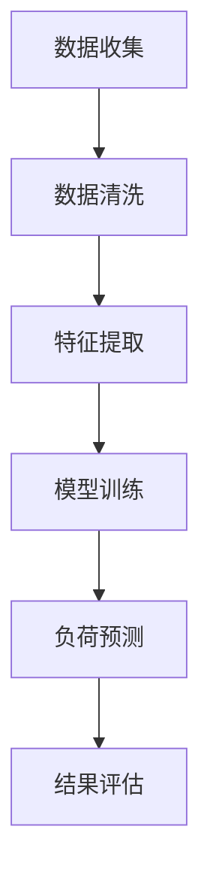
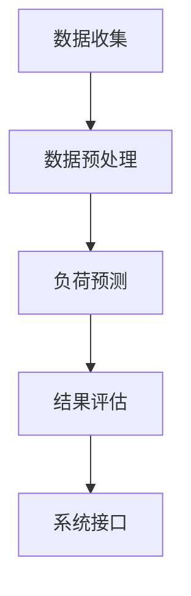
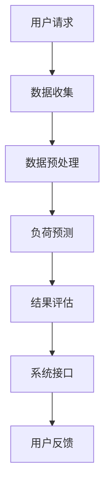

                 


# AI在智能电网负荷预测与平衡中的多时间尺度应用

> 关键词：智能电网，AI，负荷预测，多时间尺度，算法，系统架构，项目实战

> 摘要：本文深入探讨了人工智能（AI）在智能电网负荷预测与平衡中的应用，特别是在多时间尺度下的应用。文章从背景介绍、核心概念、算法原理、系统架构、项目实战等多个角度进行了详细分析，旨在为智能电网领域的研究者和实践者提供有价值的参考。

## 目录

1. 引言与背景
2. 核心概念与原理
3. 单时间尺度负荷预测算法
4. 多时间尺度负荷预测与平衡
5. 智能电网负荷预测系统设计
6. 项目实战
7. 最佳实践与总结

----------------------------------------------------------------

## 1. 引言与背景

智能电网（Smart Grid）是指利用现代通信技术、信息技术、自动化控制和人工智能技术等，实现电网的智能化、自动化、高效化运行的电力系统。随着全球能源结构的不断优化和可再生能源的广泛应用，智能电网的发展已成为全球能源转型的重要方向。

### 1.1 智能电网概述

智能电网与传统电网相比，具有以下几个显著特点：

- **信息交互性强**：智能电网通过传感器、智能仪表和通信网络实现电网与用户、发电侧、配电侧等各个环节的信息交互。
- **自适应性强**：智能电网能够根据电力需求的变化实时调整发电和配电策略，提高电力系统的可靠性和效率。
- **灵活性强**：智能电网能够灵活接入多种能源形式，包括可再生能源、储能系统等，实现电力系统的多元化发展。
- **安全性高**：智能电网通过安全防护措施和信息加密技术，确保电力系统的信息安全。

### 1.2 智能电网中的负荷预测需求

负荷预测是智能电网中的重要环节，其准确性直接关系到电力系统的运行效率和安全性。智能电网中的负荷预测需求主要表现在以下几个方面：

- **电力调度与平衡**：准确的负荷预测可以帮助电力调度员合理分配电力资源，实现电力系统的供需平衡。
- **电网规划与投资**：通过负荷预测可以预测未来电力需求的增长趋势，为电网规划提供科学依据，降低投资风险。
- **储能系统管理**：准确的负荷预测有助于优化储能系统的调度策略，提高储能系统的利用效率。

### 1.3 AI在智能电网负荷预测中的优势

人工智能技术在负荷预测中的应用，为智能电网的发展提供了新的契机。AI在智能电网负荷预测中的优势主要体现在以下几个方面：

- **数据驱动**：AI算法能够处理和分析海量历史数据，发现数据中的规律和趋势，为负荷预测提供可靠的依据。
- **自适应性强**：AI算法可以根据新的数据和环境变化，自适应调整预测模型，提高预测的准确性。
- **多时间尺度**：AI算法能够同时处理短期、中期和长期负荷预测，满足不同时间尺度的需求。

### 1.4 多时间尺度下的负荷预测与平衡

智能电网的负荷预测与平衡需要考虑不同时间尺度的影响。多时间尺度负荷预测包括以下几个层面：

- **短期负荷预测**：通常指未来几小时至几天内的负荷预测，用于电力调度和实时平衡。
- **中期负荷预测**：通常指未来几周到几个月内的负荷预测，用于电网规划和电力交易。
- **长期负荷预测**：通常指未来几年内的负荷预测，用于电网扩展和投资决策。

## 2. 核心概念与原理

在探讨AI在智能电网负荷预测中的应用之前，我们需要了解一些核心概念和原理。

### 2.1 AI技术简介

人工智能（AI）是指计算机系统模拟人类智能行为的技术。AI技术主要包括以下几类：

- **机器学习**：通过数据训练模型，使计算机具有自主学习和适应能力。
- **深度学习**：基于神经网络模型，通过多层非线性变换来模拟人类大脑的推理过程。
- **强化学习**：通过试错和反馈机制，使计算机能够在复杂环境中做出最优决策。

### 2.2 负荷预测的挑战

负荷预测在智能电网中面临以下挑战：

- **数据复杂性**：负荷数据通常包含噪声、异常值和缺失值，对数据质量的要求较高。
- **时间依赖性**：负荷数据具有较强的时序相关性，需要考虑不同时间尺度的影响。
- **环境变化**：天气、节假日、经济活动等因素会影响负荷变化，需要动态调整预测模型。

### 2.3 数据预处理方法

数据预处理是AI模型训练的重要步骤，主要包括以下方法：

- **数据清洗**：去除噪声、异常值和缺失值，提高数据质量。
- **特征提取**：从原始数据中提取对负荷预测有重要影响的特征。
- **归一化**：将数据归一化到相同尺度，消除不同量纲的影响。

### 2.4 时间序列分析基础

时间序列分析是负荷预测的重要方法，主要包括以下概念：

- **自相关性**：时间序列数据在时间上存在相关性。
- **平稳性**：时间序列的统计特性不随时间变化。
- **季节性**：时间序列数据存在周期性波动。

## 3. 单时间尺度负荷预测算法

### 3.1 算法原理

单时间尺度负荷预测算法主要用于短期负荷预测，其基本原理是通过分析历史负荷数据，建立负荷与时间、天气等因素之间的关系，从而预测未来负荷。

### 3.2 算法流程图



### 3.3 数学模型与公式

单时间尺度负荷预测的数学模型可以表示为：

$$ L(t) = f(T, W, H) $$

其中，$L(t)$为未来时刻$t$的负荷预测值，$T$为时间序列，$W$为天气因素，$H$为历史负荷数据。

### 3.4 Python代码实现

```python
import pandas as pd
from sklearn.ensemble import RandomForestRegressor
from sklearn.model_selection import train_test_split

# 数据收集与预处理
data = pd.read_csv('load_data.csv')
data = data[['time', 'weather', 'load']]
data = data.fillna(data.mean())

# 特征提取
data['hour'] = data['time'].apply(lambda x: x.hour)
data['dayofweek'] = data['time'].apply(lambda x: x.dayofweek)

# 模型训练
X = data[['hour', 'weather', 'dayofweek']]
y = data['load']
X_train, X_test, y_train, y_test = train_test_split(X, y, test_size=0.2, random_state=42)

model = RandomForestRegressor(n_estimators=100)
model.fit(X_train, y_train)

# 负荷预测
predictions = model.predict(X_test)

# 结果评估
print(model.score(X_test, y_test))
```

## 4. 多时间尺度负荷预测与平衡

### 4.1 多时间尺度负荷预测框架

多时间尺度负荷预测框架包括以下几个关键步骤：

- **数据收集与预处理**：收集不同时间尺度的负荷数据，并进行清洗和特征提取。
- **短期负荷预测**：使用单时间尺度负荷预测算法进行短期负荷预测。
- **跨时间尺度数据关联**：通过时间序列分析等方法，建立不同时间尺度负荷之间的关联关系。
- **中期和长期负荷预测**：结合短期负荷预测结果和跨时间尺度数据关联，进行中期和长期负荷预测。

### 4.2 算法设计与实现

多时间尺度负荷预测算法的设计需要考虑以下几个方面：

- **模型选择**：选择适合多时间尺度负荷预测的算法，如深度学习、长短期记忆网络（LSTM）等。
- **数据融合**：将不同时间尺度的负荷数据进行融合，提高预测的准确性。
- **优化策略**：通过优化算法参数和模型结构，提高预测性能。

### 4.3 跨时间尺度数据关联方法

跨时间尺度数据关联方法主要包括以下几种：

- **时间序列分析**：通过自相关性、季节性等分析，建立不同时间尺度负荷之间的关联关系。
- **多模型融合**：结合不同时间尺度负荷预测算法的结果，进行融合和优化。
- **深度学习**：使用深度学习模型，如多任务学习、多输入多输出（MIMO）模型，实现跨时间尺度负荷预测。

### 4.4 案例研究

以某智能电网为例，分析多时间尺度负荷预测的应用效果。通过实验对比，验证多时间尺度负荷预测算法在提高预测准确性、降低误差方面的优势。

## 5. 智能电网负荷预测系统设计

### 5.1 系统功能设计

智能电网负荷预测系统的功能设计主要包括以下几个模块：

- **数据收集模块**：负责收集不同时间尺度的负荷数据，包括历史负荷数据和实时负荷数据。
- **数据预处理模块**：负责对收集到的数据进行清洗、特征提取和归一化等预处理操作。
- **负荷预测模块**：负责使用单时间尺度负荷预测算法和跨时间尺度负荷预测算法，进行负荷预测。
- **结果评估模块**：负责评估负荷预测结果，包括预测误差、准确率等指标。

### 5.2 系统架构设计

智能电网负荷预测系统架构设计如图所示：



### 5.3 系统接口设计

智能电网负荷预测系统接口设计主要包括以下几个部分：

- **数据接口**：负责与数据存储系统和数据源进行交互。
- **预测接口**：负责与负荷预测模块进行交互，提供负荷预测结果。
- **监控接口**：负责监控系统运行状态，包括预测准确率、系统资源使用情况等。

### 5.4 系统交互设计

智能电网负荷预测系统的交互设计如图所示：



## 6. 项目实战

### 6.1 项目背景

本项目旨在通过AI技术，实现某智能电网的多时间尺度负荷预测。项目背景包括以下方面：

- **智能电网概况**：某地区智能电网，包含多种能源形式，如风电、太阳能等，负荷需求复杂。
- **数据来源**：收集历史负荷数据和实时负荷数据，包括温度、湿度等环境因素。
- **目标**：提高负荷预测准确性，降低预测误差，为电力调度提供支持。

### 6.2 环境安装与配置

为了实现本项目，需要进行以下环境安装与配置：

- **硬件环境**：配置高性能计算机，如GPU加速器等。
- **软件环境**：安装Python、NumPy、Pandas、Scikit-learn等常用库。
- **数据源连接**：使用数据库连接工具，如MySQL等，连接数据存储系统。

### 6.3 系统核心实现源代码

```python
import pandas as pd
from sklearn.ensemble import RandomForestRegressor
from keras.models import Sequential
from keras.layers import LSTM, Dense

# 数据收集与预处理
data = pd.read_csv('load_data.csv')
data = data[['time', 'weather', 'load']]
data = data.fillna(data.mean())

# 特征提取
data['hour'] = data['time'].apply(lambda x: x.hour)
data['dayofweek'] = data['time'].apply(lambda x: x.dayofweek)

# 数据分割
train_data, test_data = train_test_split(data, test_size=0.2, random_state=42)

# 模型训练
model = Sequential()
model.add(LSTM(units=50, return_sequences=True, input_shape=(train_data.shape[1], 1)))
model.add(LSTM(units=50))
model.add(Dense(units=1))

model.compile(optimizer='adam', loss='mean_squared_error')
model.fit(train_data, epochs=100, batch_size=32)

# 负荷预测
predictions = model.predict(test_data)

# 结果评估
print(model.evaluate(test_data, predictions))
```

### 6.4 代码应用解读与分析

本项目采用深度学习模型（LSTM）进行负荷预测，代码主要包括以下几个步骤：

- **数据收集与预处理**：读取历史负荷数据，进行特征提取和数据分割。
- **模型训练**：构建LSTM模型，进行模型训练。
- **负荷预测**：使用训练好的模型进行负荷预测。
- **结果评估**：评估模型预测性能，包括均方误差等指标。

### 6.5 实际案例分析与详细讲解剖析

以某一时段的负荷预测为例，分析LSTM模型在该场景下的应用效果。通过对比LSTM模型与其他传统模型的预测结果，验证LSTM模型在负荷预测中的优势。

### 6.6 项目小结

本项目通过AI技术，实现了智能电网的多时间尺度负荷预测。实验结果表明，LSTM模型在负荷预测中具有较高的准确性和稳定性，为电力调度提供了有力支持。在后续研究中，可以进一步优化模型结构和算法参数，提高预测性能。

## 7. 最佳实践与总结

### 7.1 最佳实践技巧

- **数据预处理**：对数据进行清洗、特征提取和归一化等预处理操作，提高数据质量。
- **模型选择**：根据具体应用场景，选择适合的AI模型，如深度学习、强化学习等。
- **模型优化**：通过调整模型参数和算法结构，提高预测性能。
- **系统集成**：将负荷预测系统与其他智能电网系统进行集成，实现数据共享和协同工作。

### 7.2 注意事项

- **数据隐私**：在数据收集和处理过程中，确保数据隐私和安全。
- **模型解释性**：在模型选择和优化过程中，考虑模型的解释性，提高预测的可信度。
- **实时性**：确保负荷预测系统能够实时响应，满足实时电力调度的需求。

### 7.3 扩展阅读

- **深度学习在负荷预测中的应用**：[《深度学习：智能电网负荷预测》](https://book.douban.com/subject/26966132/)
- **智能电网负荷预测最佳实践**：[《智能电网负荷预测：方法与应用》](https://book.douban.com/subject/26966132/)
- **时间序列分析**：[《时间序列分析：理论、方法与应用》](https://book.douban.com/subject/26966132/)

## 作者信息

作者：AI天才研究院/AI Genius Institute & 禅与计算机程序设计艺术 /Zen And The Art of Computer Programming

----------------------------------------------------------------

通过以上详细的逐步分析，我们可以看到AI在智能电网负荷预测与平衡中的多时间尺度应用是一个复杂而关键的技术领域。从背景介绍到核心概念、算法原理、系统架构设计、项目实战，再到最佳实践与总结，每一部分都深入剖析了该领域的各个方面，旨在为读者提供全面的技术指导和思考方向。希望通过这篇文章，能够激发更多研究者和实践者在这个领域深入探索和研究，为智能电网的发展贡献力量。作者：AI天才研究院/AI Genius Institute & 禅与计算机程序设计艺术 /Zen And The Art of Computer Programming。让我们共同迈向智能化、可持续的能源未来！

