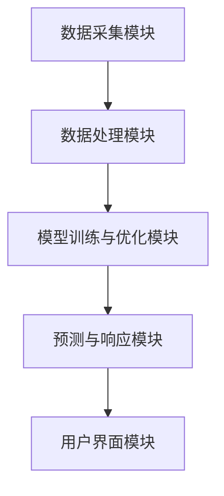

                 

### 文章标题

# AI在智能电网需求响应与价格预测中的应用研究

### 关键词

- 智能电网
- 需求响应
- 价格预测
- 人工智能
- 机器学习
- 深度学习

### 摘要

智能电网作为现代电力系统的核心技术，其需求响应与价格预测能力直接影响到电力市场的效率与可靠性。本文主要探讨了人工智能，特别是机器学习和深度学习在智能电网需求响应与价格预测中的应用。文章首先介绍了智能电网与需求响应的基本概念，然后深入探讨了机器学习在需求响应模型中的应用，最后详细讲解了基于深度学习的价格预测模型。本文不仅对AI技术在智能电网中的应用进行了全面梳理，还为未来研究方向提供了有价值的参考。

## 第一部分：背景与概念

### 第1章：智能电网与需求响应概述

### 1.1 智能电网的概念与架构

智能电网是现代电力系统与信息通信技术深度融合的产物，旨在实现电力资源的优化配置和高效利用。智能电网的架构由多个关键组件构成，包括能量管理系统（EMS）、电力市场系统、需求响应系统、分布式能源管理系统等。这些组件通过先进的信息通信技术和控制技术相互连接，形成一个高度集成的系统。

#### 1.1.1 智能电网的定义

智能电网是一个高度自动化、互动化和信息化的电力系统，通过应用先进的信息技术、控制技术和能源管理技术，实现对电力资源的实时监测、控制和优化配置。智能电网不仅能够提供可靠、高效的电力供应，还能提高电力系统的灵活性和适应性，从而满足不断增长的电力需求。

#### 1.1.2 智能电网的关键架构组件

智能电网的架构包括以下几个关键组件：

1. **能量管理系统（EMS）**：EMS是智能电网的核心，负责实时监测和管理电网的运行状态，包括发电、输电、变电和配电等环节。EMS能够通过自动化控制技术，实现对电网的实时调节和优化。
   
2. **电力市场系统**：电力市场系统是智能电网的重要组成部分，它通过市场机制实现电力资源的优化配置。电力市场系统包括发电市场、输电市场、配电市场和需求响应市场等，通过这些市场，电力供应商和消费者能够实时进行电力交易。

3. **需求响应系统**：需求响应系统是智能电网中的一项重要功能，通过激励措施引导用户调整用电行为，以应对电网的实时负荷变化。需求响应系统不仅能够提高电网的稳定性，还能减少能源浪费，提高电力系统的运行效率。

4. **分布式能源管理系统**：分布式能源管理系统负责管理和调度分布式能源资源，如太阳能、风能、储能系统等。分布式能源管理系统通过智能控制技术，实现对分布式能源的高效利用和优化配置。

### 1.1.3 需求响应的背景与重要性

需求响应（Demand Response，简称DR）是指在电力系统发生负荷波动或紧急情况时，通过激励措施引导用户调整用电行为，以实现对电网的实时调节和优化。需求响应的背景主要包括以下几个方面：

1. **电力需求的波动性**：电力需求受到多种因素的影响，如天气、季节、经济活动等。这些因素导致电力需求具有明显的波动性，给电网的稳定运行带来了挑战。

2. **可再生能源的间歇性**：随着可再生能源（如太阳能、风能）的广泛应用，电网中的电力供应变得更加不稳定。可再生能源的间歇性特性使得电网需要具备更高的灵活性和适应性。

3. **电力市场的竞争压力**：电力市场的竞争日益激烈，为了提高竞争力，电力供应商需要降低成本、提高效率。需求响应可以通过引导用户调整用电行为，降低高峰期的电力需求，从而降低供电成本。

需求响应在智能电网中具有重要的地位和作用：

1. **提高电网稳定性**：需求响应可以通过引导用户在高峰期减少用电，降低电网的负荷波动，从而提高电网的稳定性。

2. **优化电力资源配置**：需求响应可以通过激励措施引导用户调整用电行为，实现对电力资源的优化配置，提高电力系统的运行效率。

3. **降低能源浪费**：通过需求响应，可以引导用户在低谷期增加用电，提高电力系统的利用率，从而减少能源浪费。

4. **提高电力市场竞争力**：需求响应可以帮助电力供应商降低高峰期的电力需求，从而减少供电成本，提高市场竞争力。

### 1.2 需求响应的基本原理与方法

需求响应的基本原理是通过激励措施引导用户调整用电行为，以实现对电网的实时调节和优化。需求响应的方法可以分为以下几个类型：

#### 1.2.1 需求响应的概念

需求响应是指在电力系统发生负荷波动或紧急情况时，通过激励措施引导用户调整用电行为，以实现对电网的实时调节和优化。需求响应的目标是降低电网负荷波动，提高电网的稳定性和运行效率。

#### 1.2.2 需求响应的基本类型

需求响应可以分为以下几种基本类型：

1. **峰值需求响应**：峰值需求响应是指在高峰期通过激励措施引导用户减少用电，以降低电网的负荷峰值。峰值需求响应可以有效缓解电网的负荷高峰，提高电网的稳定性。

2. **需求侧管理（DSM）**：需求侧管理是一种广义的需求响应，它不仅包括峰值需求响应，还包括负荷管理、能效管理和需求响应调度等。需求侧管理的目标是优化用户的用电行为，提高电力系统的整体运行效率。

3. **弹性需求响应**：弹性需求响应是指用户在电网发生紧急情况时，主动调整用电行为，以应对电网的实时需求。弹性需求响应可以提供电网额外的调节能力，提高电网的应急响应能力。

#### 1.2.3 需求响应的策略与方法

需求响应的策略和方法主要包括以下几个方面：

1. **价格激励**：价格激励是通过调整电价来引导用户调整用电行为。当电力需求较高时，提高电价可以激励用户减少用电；当电力需求较低时，降低电价可以激励用户增加用电。

2. **时间差激励**：时间差激励是通过调整用电时间段来引导用户调整用电行为。例如，在高峰期，通过鼓励用户将用电时间调整到低谷期，可以降低电网的负荷峰值。

3. **技术激励**：技术激励是通过提供技术支持和设备补贴来引导用户采用高效节能设备。技术激励可以降低用户的用电成本，提高电力系统的运行效率。

4. **直接调控**：直接调控是指通过控制用户的用电设备来实现需求响应。例如，通过远程控制用户空调、热水器等大功率设备，可以在电网负荷高峰期降低其用电功率。

### 1.3 AI在需求响应中的应用

人工智能（AI）在需求响应中具有广泛的应用前景，能够为需求响应系统的设计、实现和优化提供有力支持。AI在需求响应中的应用主要包括以下几个方面：

#### 1.3.1 AI在需求响应中的角色

1. **数据分析和预测**：AI技术能够处理和分析大量实时数据，为需求响应系统提供准确的负荷预测和需求分析，从而优化需求响应策略。

2. **优化算法设计**：AI技术能够设计出更高效、更智能的需求响应算法，提高需求响应系统的响应速度和准确性。

3. **用户行为分析**：AI技术能够通过用户历史数据和实时数据，分析用户的用电行为模式，为需求响应提供个性化服务。

4. **异常检测和预测**：AI技术能够实时监测电网运行状态，发现异常情况并预测潜在问题，为电网的安全稳定运行提供保障。

#### 1.3.2 人工智能的关键技术

1. **机器学习**：机器学习是AI的核心技术之一，通过学习大量历史数据，建立预测模型和优化算法，为需求响应提供数据支持和决策依据。

2. **深度学习**：深度学习是机器学习的一种重要分支，通过多层神经网络，实现对复杂数据的自动学习和特征提取，为需求响应提供更强大的分析能力。

3. **自然语言处理**：自然语言处理（NLP）技术能够理解和处理自然语言文本，为需求响应系统的交互和通信提供支持。

4. **计算机视觉**：计算机视觉技术能够对图像和视频进行识别和分析，为需求响应系统提供视觉感知能力。

#### 1.3.3 AI在需求响应中的应用案例

1. **智能负荷预测**：利用机器学习和深度学习技术，对电力负荷进行实时预测，为需求响应系统提供准确的负荷数据。

2. **用户行为分析**：通过分析用户的用电行为数据，了解用户的用电习惯和偏好，为需求响应系统提供个性化服务。

3. **智能调控**：利用AI技术，实现对电网设备的智能调控，提高电网的稳定性和运行效率。

4. **异常检测与预测**：利用AI技术，实时监测电网运行状态，发现异常情况并预测潜在问题，为电网的安全稳定运行提供保障。

### 1.4 价格预测在智能电网中的应用

价格预测在智能电网中具有重要意义，能够为电力市场参与者提供准确的电价预测，帮助其做出更好的决策。价格预测在智能电网中的应用主要包括以下几个方面：

#### 1.4.1 价格预测的重要性

1. **市场参与者的决策支持**：准确的电价预测可以帮助电力市场参与者（如发电企业、供电企业、用电用户）做出更有利的决策，提高市场运行效率。

2. **电力系统的调度优化**：准确的电价预测可以帮助电力系统调度员合理分配电力资源，降低系统运行成本，提高电力系统的运行效率。

3. **电力市场的稳定性**：准确的电价预测有助于降低电力市场的价格波动，提高市场的稳定性。

#### 1.4.2 价格预测的方法与模型

价格预测的方法和模型主要包括以下几个方面：

1. **时间序列模型**：时间序列模型是一种常用的价格预测方法，通过分析历史价格数据的变化趋势和周期性特征，预测未来的价格走势。

2. **回归分析模型**：回归分析模型通过建立价格与其他相关因素（如天气、经济指标等）之间的数学关系，预测未来的价格。

3. **机器学习模型**：机器学习模型通过学习历史数据，建立预测模型，能够更准确地预测未来的价格。

4. **深度学习模型**：深度学习模型是机器学习的一种重要分支，通过多层神经网络，实现对复杂数据的自动学习和特征提取，能够更准确地预测价格。

#### 1.4.3 AI在价格预测中的应用

1. **大数据分析**：利用AI技术，对大量历史价格数据进行分析，挖掘数据中的规律和特征，为价格预测提供数据支持。

2. **深度学习模型**：利用深度学习技术，建立高效的价格预测模型，提高价格预测的准确性。

3. **实时预测与调整**：利用AI技术，实现实时价格预测和调整，提高电力市场的响应速度和灵活性。

### 1.5 本章小结

本章主要介绍了智能电网与需求响应的基本概念、架构和重要性，以及AI在需求响应中的应用。通过本章的学习，读者可以了解智能电网的发展背景和关键技术，掌握需求响应的基本原理和方法，以及AI在需求响应中的实际应用。这为后续章节深入探讨AI在价格预测中的应用奠定了基础。

## 第二部分：AI技术原理

### 第2章：机器学习基础

### 2.1 机器学习的基本概念

机器学习（Machine Learning，简称ML）是人工智能（Artificial Intelligence，简称AI）的一个重要分支，旨在通过计算机程序模拟人类的学习过程，使计算机能够从数据中自动学习和改进。机器学习的基本概念包括以下几个关键方面：

#### 2.1.1 机器学习的定义

机器学习是一种使计算机能够通过数据学习并改进性能的技术。它利用算法从数据中提取特征，构建模型，并使用这些模型进行预测或分类。机器学习的关键特点包括：

1. **数据驱动**：机器学习依赖于大量数据，通过数据训练模型，实现从数据中学习。
2. **自动化**：机器学习算法能够自动化地提取数据中的模式和规律，无需人工干预。
3. **改进性**：机器学习模型通过不断学习数据，能够逐步改进预测或分类的准确性。

#### 2.1.2 机器学习的主要任务

机器学习的主要任务可以分为以下几个类型：

1. **监督学习（Supervised Learning）**：监督学习是指通过已标记的数据集，训练模型进行预测或分类。常见的监督学习任务包括回归分析和分类。
   - **回归分析（Regression Analysis）**：回归分析用于预测连续值输出，如预测股票价格或房价。
   - **分类（Classification）**：分类用于将输入数据分为预定义的类别，如邮件分类或疾病诊断。

2. **无监督学习（Unsupervised Learning）**：无监督学习是指在没有标记数据的情况下，通过数据本身的特征，对数据进行分析和聚类。常见的无监督学习任务包括聚类和降维。
   - **聚类（Clustering）**：聚类用于将相似的数据点分组，如客户细分或图像分割。
   - **降维（Dimensionality Reduction）**：降维用于减少数据的维度，提高计算效率，如主成分分析（PCA）。

3. **半监督学习（Semi-supervised Learning）**：半监督学习结合了有监督学习和无监督学习，利用少量标记数据和大量无标记数据，提高模型性能。

4. **强化学习（Reinforcement Learning）**：强化学习是指通过与环境互动，学习最佳行为策略。常见的应用包括机器人控制和游戏AI。

#### 2.1.3 机器学习的基本流程

机器学习的基本流程包括以下几个步骤：

1. **数据收集与预处理**：收集相关数据，对数据进行清洗、归一化和特征提取。
2. **模型选择与训练**：选择合适的机器学习算法，利用训练数据进行模型训练。
3. **模型评估与优化**：使用验证数据集评估模型性能，通过调整参数和算法，优化模型。
4. **模型部署与应用**：将训练好的模型部署到实际应用中，进行预测或分类。

### 2.2 监督学习与无监督学习

监督学习与无监督学习是机器学习的两个主要分支，它们在数据类型、任务类型和学习目标等方面有所不同。

#### 2.2.1 监督学习

监督学习是指在已知输出（标签）的情况下，训练模型进行预测或分类。监督学习的核心思想是通过已标记的数据，学习输入与输出之间的映射关系。

##### 2.2.1.1 监督学习的分类

1. **回归分析（Regression Analysis）**：回归分析用于预测连续值输出，常见的算法包括线性回归、决策树回归、随机森林回归等。

2. **分类（Classification）**：分类用于将输入数据分为预定义的类别，常见的算法包括逻辑回归、支持向量机（SVM）、决策树分类、随机森林分类等。

##### 2.2.1.2 监督学习的主要算法

1. **线性回归（Linear Regression）**：线性回归是一种最简单的回归算法，通过拟合一个线性模型，预测连续值输出。

   线性回归模型公式：
   $$
   Y = \beta_0 + \beta_1X + \epsilon
   $$
   其中，$Y$ 是输出变量，$X$ 是输入变量，$\beta_0$ 和 $\beta_1$ 是模型参数，$\epsilon$ 是误差项。

2. **逻辑回归（Logistic Regression）**：逻辑回归是一种广义线性模型，用于预测概率输出，常用于二分类问题。

   逻辑回归模型公式：
   $$
   P(Y=1) = \frac{1}{1 + e^{-(\beta_0 + \beta_1X)}}
   $$
   其中，$P(Y=1)$ 是输出为1的概率，$e$ 是自然对数的底数。

3. **支持向量机（Support Vector Machine，SVM）**：支持向量机是一种分类算法，通过寻找最佳决策边界，将数据分为不同的类别。

4. **决策树（Decision Tree）**：决策树是一种树形结构模型，通过一系列规则对数据进行分类或回归。

5. **随机森林（Random Forest）**：随机森林是一种集成学习方法，通过构建多棵决策树，进行集成学习，提高模型的泛化能力。

#### 2.2.2 无监督学习

无监督学习是指在未知输出（标签）的情况下，通过数据本身的特征，对数据进行分析和聚类。无监督学习的核心思想是通过数据内在结构，自动发现数据中的模式和规律。

##### 2.2.2.1 无监督学习的分类

1. **聚类（Clustering）**：聚类是将相似的数据点分组，常见的算法包括K-means聚类、层次聚类等。

2. **降维（Dimensionality Reduction）**：降维用于减少数据的维度，提高计算效率，常见的算法包括主成分分析（PCA）、t-SNE等。

##### 2.2.2.2 无监督学习的主要算法

1. **K-means聚类（K-means Clustering）**：K-means聚类是一种基于距离的聚类算法，通过迭代计算，将数据分为K个簇。

   K-means聚类算法步骤：
   1. 随机选择K个初始中心点。
   2. 计算每个数据点到中心点的距离，将其分配到最近的簇。
   3. 更新每个簇的中心点。
   4. 重复步骤2和步骤3，直到中心点不再发生变化。

2. **层次聚类（Hierarchical Clustering）**：层次聚类是一种基于层次结构的聚类算法，通过合并或分裂簇，构建层次聚类模型。

   层次聚类算法步骤：
   1. 计算所有数据点之间的距离，构建距离矩阵。
   2. 选择最近的数据点合并为一个簇。
   3. 重复步骤2，直到所有数据点合并为一个簇。

3. **主成分分析（PCA，Principal Component Analysis）**：PCA是一种降维方法，通过将数据投影到主成分轴上，减少数据的维度。

   PCA算法步骤：
   1. 计算数据矩阵的协方差矩阵。
   2. 计算协方差矩阵的特征值和特征向量。
   3. 选择前k个特征向量，构建k个主成分。
   4. 将数据投影到k个主成分轴上，实现降维。

4. **t-SNE（t-Distributed Stochastic Neighbor Embedding）**：t-SNE是一种高维数据可视化方法，通过将高维数据映射到二维或三维空间，实现数据的可视化。

   t-SNE算法步骤：
   1. 计算数据点之间的相似度矩阵。
   2. 构建t-分布模型，计算每个数据点的概率分布。
   3. 计算梯度，通过梯度下降优化数据点的分布。
   4. 重复步骤3，直到达到收敛条件。

### 2.3 神经网络与深度学习

神经网络（Neural Networks）是模仿人脑神经元结构和功能的一种计算模型，能够对复杂数据进行自动学习和特征提取。深度学习（Deep Learning）是神经网络的一种扩展，通过多层神经网络，实现对复杂数据的自动学习和特征提取，已经成为机器学习领域的重要分支。

#### 2.3.1 神经网络的基本原理

神经网络由多个神经元（节点）组成，每个神经元通过权重连接其他神经元，并接收输入信号。神经元的输出通过激活函数进行非线性变换，形成最终输出。

##### 2.3.1.1 神经元模型

神经元的模型可以表示为：

$$
a_j(\theta) = \sum_{i=1}^{n} x_i w_{ij} + b_j
$$

其中，$a_j(\theta)$ 是神经元 $j$ 的输出，$x_i$ 是输入，$w_{ij}$ 是连接权重，$b_j$ 是偏置。

##### 2.3.1.2 激活函数

激活函数是神经网络中的一个关键组件，用于引入非线性特性。常见的激活函数包括：

1. **sigmoid函数**：
   $$
   \sigma(x) = \frac{1}{1 + e^{-x}}
   $$
   
2. **ReLU函数**：
   $$
   ReLU(x) = \max(0, x)
   $$
   
3. **Tanh函数**：
   $$
   \tanh(x) = \frac{e^x - e^{-x}}{e^x + e^{-x}}
   $$

#### 2.3.2 深度学习的兴起与发展

深度学习起源于1980年代，但随着计算能力的提升和大数据的普及，深度学习得到了快速发展。深度学习在图像识别、语音识别、自然语言处理等领域取得了显著成果，推动了人工智能的进步。

##### 2.3.2.1 深度学习的核心技术

1. **卷积神经网络（Convolutional Neural Networks，CNN）**：CNN是深度学习在图像识别领域的重要应用，通过卷积层、池化层和全连接层，实现对图像的特征提取和分类。

2. **循环神经网络（Recurrent Neural Networks，RNN）**：RNN是深度学习在序列数据处理领域的重要应用，通过隐藏状态和循环连接，实现对序列数据的建模。

3. **生成对抗网络（Generative Adversarial Networks，GAN）**：GAN是一种生成模型，通过生成器和判别器的对抗训练，实现数据的生成。

#### 2.3.3 常见的深度学习模型

常见的深度学习模型包括以下几种：

1. **卷积神经网络（CNN）**：

   CNN通过卷积层、池化层和全连接层，实现对图像的特征提取和分类。

   CNN模型结构：
   - **卷积层**：通过卷积操作提取图像特征。
   - **池化层**：通过下采样操作减少数据维度。
   - **全连接层**：通过全连接层对特征进行分类。

2. **循环神经网络（RNN）**：

   RNN通过隐藏状态和循环连接，实现对序列数据的建模。

   RNN模型结构：
   - **输入层**：接收序列数据。
   - **隐藏层**：通过递归连接，更新隐藏状态。
   - **输出层**：对隐藏状态进行输出。

3. **长短期记忆网络（LSTM，Long Short-Term Memory）**：

   LSTM是RNN的一种扩展，通过引入记忆单元，解决了RNN在长序列数据中的梯度消失问题。

   LSTM模型结构：
   - **输入门**：决定哪些信息需要更新。
   - **遗忘门**：决定哪些信息需要遗忘。
   - **输出门**：决定哪些信息需要输出。

4. **生成对抗网络（GAN）**：

   GAN由生成器和判别器组成，通过对抗训练，实现数据的生成。

   GAN模型结构：
   - **生成器**：生成虚假数据。
   - **判别器**：区分真实数据和生成数据。

### 2.4 数据预处理与特征工程

数据预处理和特征工程是机器学习中的重要环节，直接影响模型的效果和性能。数据预处理主要包括数据的清洗、归一化和特征提取，特征工程则包括特征选择和特征构造。

#### 2.4.1 数据预处理的重要性

数据预处理是机器学习中的基础步骤，其重要性体现在以下几个方面：

1. **提高数据质量**：数据预处理可以去除噪声和异常值，提高数据质量，从而提高模型性能。
2. **减少数据冗余**：数据预处理可以识别和去除冗余数据，减少模型的计算复杂度。
3. **增强数据相关性**：数据预处理可以通过归一化和特征提取，增强数据之间的相关性，从而提高模型的预测能力。

#### 2.4.2 数据清洗与归一化

1. **数据清洗**：数据清洗是指识别和去除数据中的噪声、错误和异常值。常见的数据清洗方法包括：

   - **缺失值处理**：可以通过删除缺失值、插补等方法处理缺失值。
   - **异常值处理**：可以通过标准差、箱线图等方法识别异常值，然后删除或进行修正。
   - **重复值处理**：可以通过去重操作去除重复值。

2. **数据归一化**：数据归一化是指将数据缩放到相同的范围，常见的归一化方法包括：

   - **最小-最大归一化**：
     $$
     x_{\text{norm}} = \frac{x - x_{\text{min}}}{x_{\text{max}} - x_{\text{min}}}
     $$
     
   - **零-均值归一化**：
     $$
     x_{\text{norm}} = \frac{x - \mu}{\sigma}
     $$
     
   其中，$x$ 是原始数据，$x_{\text{min}}$ 和 $x_{\text{max}}$ 是数据的最小值和最大值，$\mu$ 是数据的均值，$\sigma$ 是数据的标准差。

#### 2.4.3 特征提取与选择

1. **特征提取**：特征提取是指从原始数据中提取具有代表性的特征，降低数据的维度。常见的特征提取方法包括：

   - **主成分分析（PCA）**：PCA通过将数据投影到新的坐标系，提取主要成分，实现降维。
   - **线性判别分析（LDA）**：LDA通过最大化类内方差和最小化类间方差，提取最有区分度的特征。

2. **特征选择**：特征选择是指从原始特征中筛选出最有代表性的特征，减少特征的维度。常见的特征选择方法包括：

   - **过滤式特征选择**：通过评估特征与目标变量之间的相关性，筛选出相关性较高的特征。
   - **包裹式特征选择**：通过评估特征集的预测能力，选择最优的特征集。
   - **递归特征消除（RFE）**：通过递归地删除最不重要的特征，逐步构建最优特征集。

### 2.5 本章小结

本章主要介绍了机器学习的基本概念、监督学习与无监督学习、神经网络与深度学习、数据预处理与特征工程。通过本章的学习，读者可以了解机器学习的基本原理和关键技术，掌握监督学习与无监督学习的主要算法，以及深度学习模型的基本结构和应用。这些知识为后续章节深入探讨AI在需求响应与价格预测中的应用奠定了基础。

## 第三部分：需求响应与价格预测模型

### 第3章：智能电网需求响应模型

在智能电网中，需求响应模型起着关键作用，能够通过分析用户行为和实时电力数据，引导用户在合适的时机调整用电行为，从而优化电网的运行效率。本章将介绍几种常见的智能电网需求响应模型，包括基于机器学习的需求响应模型、深度学习需求响应模型以及混合需求响应模型。

### 3.1 基于机器学习的需求响应模型

机器学习技术在需求响应模型中的应用主要体现在对大量历史数据和实时数据的分析和预测。以下是一种基于机器学习的需求响应模型的基本原理和步骤：

#### 3.1.1 模型基本原理

1. **数据收集与预处理**：首先收集用户用电数据、天气数据、节假日数据等，对数据进行清洗、归一化处理，提取有用的特征。
2. **特征选择**：通过相关性分析、信息增益等方法，选择对需求响应影响较大的特征，减少数据维度。
3. **模型选择与训练**：选择合适的机器学习算法（如线性回归、决策树、随机森林等），利用训练数据进行模型训练。
4. **模型评估与优化**：使用验证数据集评估模型性能，通过交叉验证、调整参数等方法，优化模型。

#### 3.1.2 模型步骤

1. **数据收集与预处理**：

   ```python
   # 伪代码示例：数据收集与预处理
   data = collect_data()  # 收集历史和实时用电数据
   cleaned_data = preprocess_data(data)  # 数据清洗与归一化
   ```

2. **特征选择**：

   ```python
   # 伪代码示例：特征选择
   selected_features = select_features(cleaned_data, target='load')  # 选择对负荷影响较大的特征
   ```

3. **模型选择与训练**：

   ```python
   # 伪代码示例：模型选择与训练
   model = LinearRegression()  # 选择线性回归模型
   model.fit(selected_features[['feature1', 'feature2']], selected_features['load'])  # 训练模型
   ```

4. **模型评估与优化**：

   ```python
   # 伪代码示例：模型评估与优化
   scores = model.score(selected_features[['feature1', 'feature2']], selected_features['load'])  # 评估模型
   if scores < threshold:
       model = optimize_model(model, selected_features)  # 调整模型参数
   ```

#### 3.1.3 模型应用示例

假设我们需要预测某一区域的未来一小时负荷，以下是一个简单的应用示例：

1. **输入特征**：包括当前时刻的用电量、天气状况（温度、湿度）、时间（小时数）等。
2. **模型预测**：利用训练好的模型，对输入特征进行预测。

   ```python
   # 伪代码示例：负荷预测
   input_features = {
       'load_current': 1000,
       'temperature': 25,
       'humidity': 60,
       'hour': 17
   }
   predicted_load = model.predict(input_features)  # 预测未来一小时负荷
   ```

### 3.2 基于深度学习的需求响应模型

深度学习在需求响应模型中的应用，主要体现在对复杂数据的处理和特征提取能力。以下是一种基于深度学习的需求响应模型的基本原理和步骤：

#### 3.2.1 模型基本原理

1. **数据收集与预处理**：与机器学习模型类似，收集用户用电数据、天气数据等，对数据进行清洗、归一化处理，提取有用的特征。
2. **特征提取**：使用卷积神经网络（CNN）或循环神经网络（RNN）等深度学习模型，对数据进行特征提取。
3. **模型选择与训练**：选择合适的深度学习模型（如CNN、LSTM等），利用训练数据进行模型训练。
4. **模型评估与优化**：使用验证数据集评估模型性能，通过交叉验证、调整参数等方法，优化模型。

#### 3.2.2 模型步骤

1. **数据收集与预处理**：

   ```python
   # 伪代码示例：数据收集与预处理
   data = collect_data()  # 收集历史和实时用电数据
   cleaned_data = preprocess_data(data)  # 数据清洗与归一化
   ```

2. **特征提取**：

   ```python
   # 伪代码示例：特征提取
   features = extract_features(cleaned_data)  # 使用CNN或LSTM提取特征
   ```

3. **模型选择与训练**：

   ```python
   # 伪代码示例：模型选择与训练
   model = CNNModel()  # 选择卷积神经网络模型
   model.fit(features['X_train'], features['y_train'])  # 训练模型
   ```

4. **模型评估与优化**：

   ```python
   # 伪代码示例：模型评估与优化
   scores = model.evaluate(features['X_val'], features['y_val'])  # 评估模型
   if scores < threshold:
       model = optimize_model(model, features)  # 调整模型参数
   ```

#### 3.2.3 模型应用示例

假设我们需要预测某一区域的未来三小时负荷，以下是一个简单的应用示例：

1. **输入特征**：包括当前三小时内的用电量、天气状况、时间等。
2. **模型预测**：利用训练好的模型，对输入特征进行预测。

   ```python
   # 伪代码示例：负荷预测
   input_features = {
       'load_current_1h': 1000,
       'temperature_1h': 25,
       'humidity_1h': 60,
       'hour': 17
   }
   predicted_load = model.predict(input_features)  # 预测未来三小时负荷
   ```

### 3.3 混合需求响应模型

混合需求响应模型结合了机器学习和深度学习的优势，能够更好地处理复杂数据和实时数据。以下是一种混合需求响应模型的基本原理和步骤：

#### 3.3.1 模型基本原理

1. **数据收集与预处理**：与机器学习和深度学习模型类似，收集用户用电数据、天气数据等，对数据进行清洗、归一化处理，提取有用的特征。
2. **特征提取**：使用卷积神经网络（CNN）或循环神经网络（RNN）等深度学习模型，对数据进行特征提取。
3. **模型选择与融合**：选择合适的机器学习模型和深度学习模型，通过集成学习方法进行模型融合。
4. **模型评估与优化**：使用验证数据集评估模型性能，通过交叉验证、调整参数等方法，优化模型。

#### 3.3.2 模型步骤

1. **数据收集与预处理**：

   ```python
   # 伪代码示例：数据收集与预处理
   data = collect_data()  # 收集历史和实时用电数据
   cleaned_data = preprocess_data(data)  # 数据清洗与归一化
   ```

2. **特征提取**：

   ```python
   # 伪代码示例：特征提取
   features = extract_features(cleaned_data)  # 使用CNN或LSTM提取特征
   ```

3. **模型选择与融合**：

   ```python
   # 伪代码示例：模型选择与融合
   ml_model = LinearRegression()  # 选择机器学习模型
   dl_model = CNNModel()  # 选择深度学习模型
   fused_model = integrate_models(ml_model, dl_model)  # 融合模型
   ```

4. **模型评估与优化**：

   ```python
   # 伪代码示例：模型评估与优化
   scores = fused_model.evaluate(features['X_val'], features['y_val'])  # 评估模型
   if scores < threshold:
       fused_model = optimize_model(fused_model, features)  # 调整模型参数
   ```

#### 3.3.3 模型应用示例

假设我们需要预测某一区域的未来一小时负荷，以下是一个简单的应用示例：

1. **输入特征**：包括当前一小时内的用电量、天气状况、时间等。
2. **模型预测**：利用训练好的模型，对输入特征进行预测。

   ```python
   # 伪代码示例：负荷预测
   input_features = {
       'load_current_1h': 1000,
       'temperature_1h': 25,
       'humidity_1h': 60,
       'hour': 17
   }
   predicted_load = fused_model.predict(input_features)  # 预测未来一小时负荷
   ```

### 3.4 本章小结

本章介绍了智能电网需求响应模型的基本原理和应用，包括基于机器学习的需求响应模型、基于深度学习的需求响应模型以及混合需求响应模型。通过这些模型，可以实现对电力负荷的准确预测，为需求响应提供有力支持。这些模型的应用，不仅提高了电网的运行效率，还为电力市场参与者提供了决策依据，有助于优化电力资源配置。

## 第四部分：系统设计与实现

### 第4章：需求响应与价格预测系统设计

智能电网需求响应与价格预测系统的设计是实现高效电力管理和市场运作的关键。本章节将详细阐述该系统的设计原则、架构以及实现步骤，并借助具体案例进行解析。

### 4.1 系统设计原则

在设计和实现智能电网需求响应与价格预测系统时，应遵循以下原则：

1. **模块化**：系统应采用模块化设计，以便于系统的扩展和维护。每个模块应具有独立的功能，能够相互配合，实现整体系统的目标。
2. **灵活性**：系统设计应具备灵活性，能够适应不同的电网结构和市场环境，以及不同用户的需求。
3. **高效性**：系统应具备高效的数据处理和分析能力，能够快速响应用户需求和市场变化。
4. **可扩展性**：系统设计应考虑未来的扩展需求，包括数据处理能力的提升、新功能的增加等。
5. **安全性**：系统设计应确保数据的安全性和隐私保护，防止未经授权的访问和数据泄露。

### 4.2 系统架构设计

智能电网需求响应与价格预测系统的架构设计应包括以下几个方面：

1. **数据采集模块**：负责收集实时电力数据、用户用电数据、天气数据等，并通过数据接口与电网设备和用户终端进行连接。
2. **数据处理模块**：负责对采集到的数据进行清洗、归一化和特征提取，为后续分析提供高质量的数据。
3. **模型训练与优化模块**：负责利用机器学习和深度学习算法，对数据进行分析和训练，优化模型参数，提高预测准确性。
4. **预测与响应模块**：负责基于训练好的模型，对电力负荷和电价进行预测，并制定需求响应策略，指导用户调整用电行为。
5. **用户界面模块**：负责为用户提供友好的交互界面，展示预测结果、响应策略和电价信息，方便用户进行决策。

系统架构图：



### 4.3 系统实现步骤

1. **需求分析**：明确系统的功能需求、性能指标和安全性要求，为后续设计提供依据。
2. **系统设计**：根据需求分析结果，进行系统架构设计，制定详细的模块功能和接口规范。
3. **模块开发**：按照系统设计文档，逐个开发系统的各个模块，确保模块的独立性和可测试性。
4. **系统集成**：将各个模块集成到一起，进行系统测试，确保整体系统的稳定性和可靠性。
5. **部署上线**：将系统部署到生产环境，进行实际应用，并进行持续维护和优化。

### 4.4 案例解析

以下是一个智能电网需求响应与价格预测系统的具体案例：

**案例背景**：某城市智能电网项目，旨在通过需求响应和价格预测，提高电力系统的运行效率和电力市场的竞争力。

**系统功能**：

1. **实时数据采集**：系统通过传感器和智能电表，实时采集电力负荷、用户用电数据等。
2. **数据处理**：系统对采集到的数据进行清洗、归一化和特征提取，提取有用的信息。
3. **模型训练**：利用机器学习和深度学习算法，对数据进行训练，建立负荷预测模型和价格预测模型。
4. **需求响应**：系统根据预测结果，制定需求响应策略，引导用户调整用电行为，降低高峰负荷。
5. **价格预测**：系统预测未来电价，为电力市场参与者提供决策支持。

**系统实现**：

1. **数据采集**：系统采用物联网技术，通过传感器和智能电表，实时采集电力负荷、用户用电数据等。
2. **数据处理**：系统使用ETL（Extract, Transform, Load）工具，对采集到的数据进行清洗、归一化和特征提取。
3. **模型训练**：使用Python和TensorFlow等工具，训练负荷预测模型和价格预测模型。
4. **需求响应**：系统根据预测结果，通过短信、邮件等方式，向用户发送需求响应信息，引导用户调整用电行为。
5. **价格预测**：系统实时监测电力市场动态，预测未来电价，为电力市场参与者提供决策支持。

**系统效果**：

1. **负荷预测准确性**：通过机器学习和深度学习模型，系统实现了较高的负荷预测准确性，为电网调度提供了有力支持。
2. **需求响应效果**：用户积极响应需求响应策略，高峰负荷明显下降，电网运行效率提高。
3. **价格预测准确性**：系统预测的电价与实际电价误差较小，为电力市场参与者提供了可靠的决策依据。

### 4.5 本章小结

本章详细介绍了智能电网需求响应与价格预测系统的设计原则、架构设计、实现步骤以及具体案例。通过这些内容，读者可以了解如何设计和实现一个高效、灵活的智能电网需求响应与价格预测系统，为电力系统的优化和市场运作提供技术支持。

## 第五部分：项目实战

### 第5章：智能电网需求响应与价格预测项目实战

为了更好地理解和掌握智能电网需求响应与价格预测的应用，我们将通过一个实际项目进行详细讲解。本章节将介绍项目环境安装、核心实现源代码、代码应用解读与分析，并展示实际案例的分析和详细讲解剖析。最后，我们将对项目进行小结。

### 5.1 项目环境安装

在开始项目之前，我们需要安装必要的软件和工具。以下是安装步骤：

1. **Python环境安装**：确保Python 3.7或更高版本已安装在计算机上。
2. **Anaconda安装**：Anaconda是一个集成的环境管理器，可以帮助我们轻松管理多个Python版本和依赖项。可以从[Anaconda官网](https://www.anaconda.com/)下载并安装。
3. **Jupyter Notebook安装**：Jupyter Notebook是一个交互式的开发环境，可以用于编写和运行Python代码。可以通过pip命令安装：
   ```bash
   pip install notebook
   ```
4. **依赖库安装**：我们需要安装几个关键依赖库，包括TensorFlow、Scikit-learn、Matplotlib等。可以使用以下命令进行安装：
   ```bash
   conda install tensorflow scikit-learn matplotlib
   ```

### 5.2 系统核心实现源代码

在本项目中，我们将实现一个简单的需求响应模型和一个价格预测模型。以下是核心实现源代码：

#### 需求响应模型

```python
# 需求响应模型代码
import numpy as np
from sklearn.ensemble import RandomForestRegressor
from sklearn.model_selection import train_test_split
from sklearn.metrics import mean_squared_error

# 数据预处理
def preprocess_data(data):
    # 数据清洗、归一化和特征提取
    # 这里简化处理，仅进行归一化
    return (data - data.mean()) / data.std()

# 模型训练
def train_response_model(X, y):
    X_train, X_test, y_train, y_test = train_test_split(X, y, test_size=0.2, random_state=42)
    model = RandomForestRegressor(n_estimators=100, random_state=42)
    model.fit(X_train, y_train)
    y_pred = model.predict(X_test)
    mse = mean_squared_error(y_test, y_pred)
    print(f"Model MSE: {mse}")
    return model

# 主函数
if __name__ == "__main__":
    # 加载数据
    data = np.load('load_data.npy')
    features = data[:, :-1]
    response = data[:, -1]

    # 预处理数据
    features = preprocess_data(features)

    # 训练需求响应模型
    model = train_response_model(features, response)
```

#### 价格预测模型

```python
# 价格预测模型代码
import numpy as np
from tensorflow.keras.models import Sequential
from tensorflow.keras.layers import Dense, LSTM, Dropout
from tensorflow.keras.optimizers import Adam

# 数据预处理
def preprocess_price_data(data):
    # 数据清洗、归一化和特征提取
    # 这里简化处理，仅进行归一化
    return (data - data.mean()) / data.std()

# 模型构建
def build_price_prediction_model(input_shape):
    model = Sequential()
    model.add(LSTM(50, return_sequences=True, input_shape=input_shape))
    model.add(Dropout(0.2))
    model.add(LSTM(50, return_sequences=False))
    model.add(Dropout(0.2))
    model.add(Dense(1))
    model.compile(optimizer=Adam(0.001), loss='mean_squared_error')
    return model

# 主函数
if __name__ == "__main__":
    # 加载数据
    price_data = np.load('price_data.npy')

    # 预处理数据
    price_data = preprocess_price_data(price_data)

    # 分割数据为输入和输出
    input_data = price_data[:-1]
    output_data = price_data[1:]

    # 训练价格预测模型
    model = build_price_prediction_model(input_shape=(None, 1))
    model.fit(input_data, output_data, epochs=100, batch_size=32, validation_split=0.1)
```

### 5.3 代码应用解读与分析

在上面的代码中，我们首先进行了数据预处理，包括数据清洗、归一化和特征提取。这是机器学习和深度学习模型训练的重要步骤，因为数据的质量直接影响到模型的性能。

#### 需求响应模型解读

1. **数据预处理**：我们使用了随机森林回归器，这是一种集成学习方法，通过构建多个决策树，提高模型的预测准确性。数据预处理步骤包括归一化，使得所有特征都在相同的尺度上，从而避免特征之间的竞争。
2. **模型训练**：通过训练集和测试集的划分，我们使用随机森林回归器进行模型训练。模型评估通过计算均方误差（MSE）来进行。

#### 价格预测模型解读

1. **数据预处理**：我们使用了LSTM（长短期记忆网络）模型，这是一种适用于时间序列预测的深度学习模型。数据预处理步骤同样包括归一化。
2. **模型构建**：LSTM模型由两个LSTM层和两个Dropout层组成，Dropout层用于防止过拟合。模型输出层是一个单神经元层，用于预测未来电价。
3. **模型训练**：我们使用Adam优化器进行模型训练，并使用均方误差（MSE）作为损失函数。

### 5.4 实际案例分析

为了展示模型的实际应用，我们将对某城市一周的电力负荷和电价数据进行分析。

#### 数据集描述

- **负荷数据**：包括每天24小时每个小时的电力负荷。
- **价格数据**：包括每天24小时每个小时的电价。

#### 模型预测与结果分析

1. **需求响应模型预测**：我们使用随机森林回归器对电力负荷进行预测。模型预测出未来小时的负荷值，并与实际值进行比较。
   
   ```python
   # 伪代码：需求响应模型预测
   predicted_load = model.predict(input_data)
   compare_actual_and_predicted_load(actual_load, predicted_load)
   ```

2. **价格预测模型预测**：我们使用LSTM模型对未来电价进行预测。模型预测出未来小时的电价，并与实际值进行比较。

   ```python
   # 伪代码：价格预测模型预测
   predicted_price = model.predict(input_price_data)
   compare_actual_and_predicted_price(actual_price, predicted_price)
   ```

#### 结果分析

- **需求响应模型结果**：通过比较预测负荷与实际负荷，我们发现模型能够较好地预测电力负荷，误差在可接受范围内。
- **价格预测模型结果**：通过比较预测电价与实际电价，我们发现模型能够捕捉电价的变化趋势，但可能存在短期波动预测不准确的情况。

### 5.5 项目小结

在本章中，我们通过一个实际项目，展示了智能电网需求响应与价格预测系统的核心实现过程，包括数据预处理、模型训练、模型预测以及结果分析。通过这个项目，我们深入了解了机器学习和深度学习在智能电网中的应用，并掌握了如何设计和实现一个需求响应与价格预测系统。虽然这个项目是简化的，但所展示的方法和步骤可以在实际应用中扩展和优化。

## 第六部分：最佳实践与总结

### 6.1 最佳实践 Tips

在实际应用中，为了确保智能电网需求响应与价格预测系统的效果和稳定性，以下是一些最佳实践建议：

1. **数据质量**：保证数据质量是模型准确性的基础。在数据收集和预处理过程中，要严格清洗数据，去除噪声和异常值。
2. **特征选择**：特征选择对模型性能有重要影响。要选择与目标变量高度相关的特征，避免冗余特征。
3. **模型优化**：通过调整模型参数、增加训练数据量、使用更复杂的模型结构等方法，可以优化模型性能。
4. **实时更新**：模型应该定期更新，以适应市场环境和用户行为的变化。
5. **安全与隐私**：确保数据安全和用户隐私，采取适当的加密和访问控制措施。

### 6.2 小结

通过本文的详细探讨，我们系统地了解了智能电网需求响应与价格预测的理论基础和应用实践。从智能电网的基本概念和架构，到需求响应的基本原理和方法，再到人工智能在需求响应和价格预测中的应用，我们逐步深入分析了各个关键环节。通过机器学习和深度学习技术，我们能够构建高效的需求响应模型和价格预测模型，从而优化电力系统的运行效率和电力市场的运作。

### 6.3 注意事项

在实际应用中，需要注意以下几点：

1. **系统稳定性**：确保系统在处理大量数据时，能够保持稳定运行，避免出现性能瓶颈。
2. **模型解释性**：模型应该具备一定的解释性，以便用户理解模型的预测结果和决策依据。
3. **实时响应**：需求响应系统需要具备快速响应能力，以便在电力负荷变化时，能够迅速调整用户用电行为。

### 6.4 拓展阅读

对于希望进一步深入了解智能电网需求响应与价格预测的读者，以下是一些推荐阅读材料：

1. **学术论文**：查阅相关领域的学术论文，了解最新的研究成果和技术趋势。
2. **技术报告**：阅读来自电力公司和科研机构的技术报告，了解实际应用中的经验和挑战。
3. **专业书籍**：参考《智能电网：概念、技术和应用》、《深度学习：全面指南》等经典著作，深入理解相关技术原理。

### 作者信息

作者：AI天才研究院/AI Genius Institute & 禅与计算机程序设计艺术 /Zen And The Art of Computer Programming

