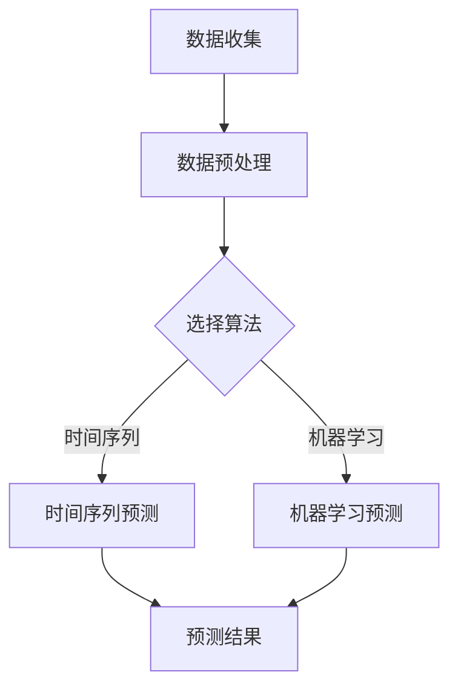
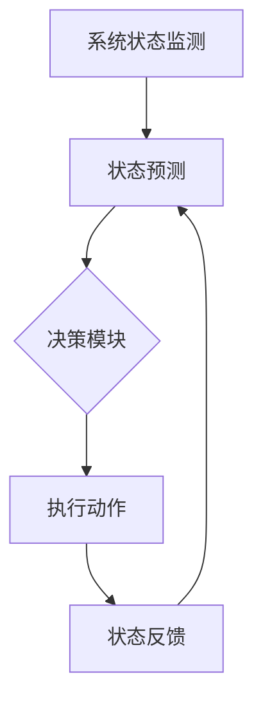
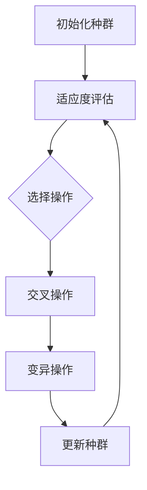
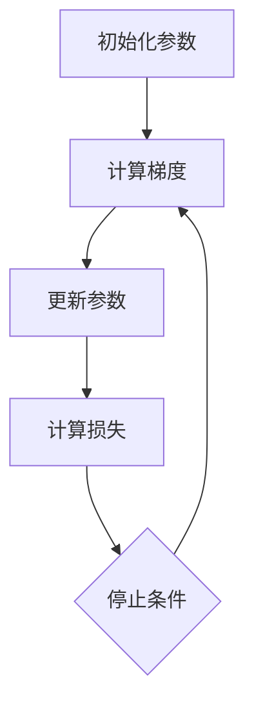
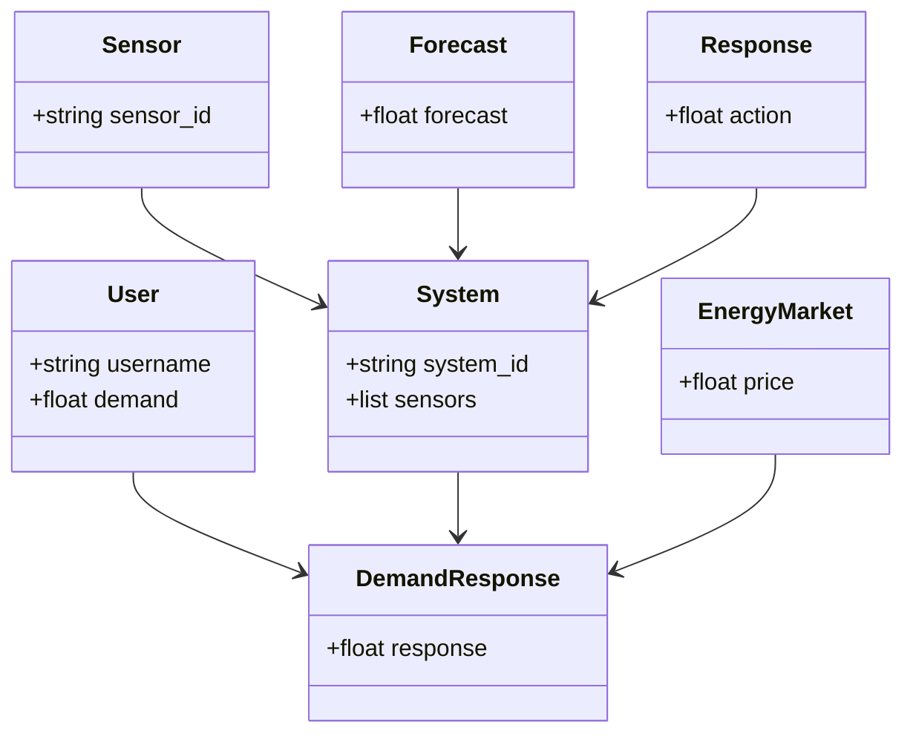
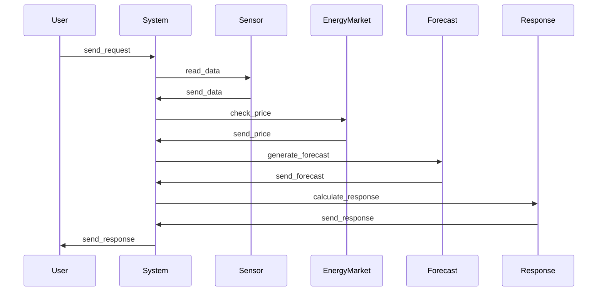
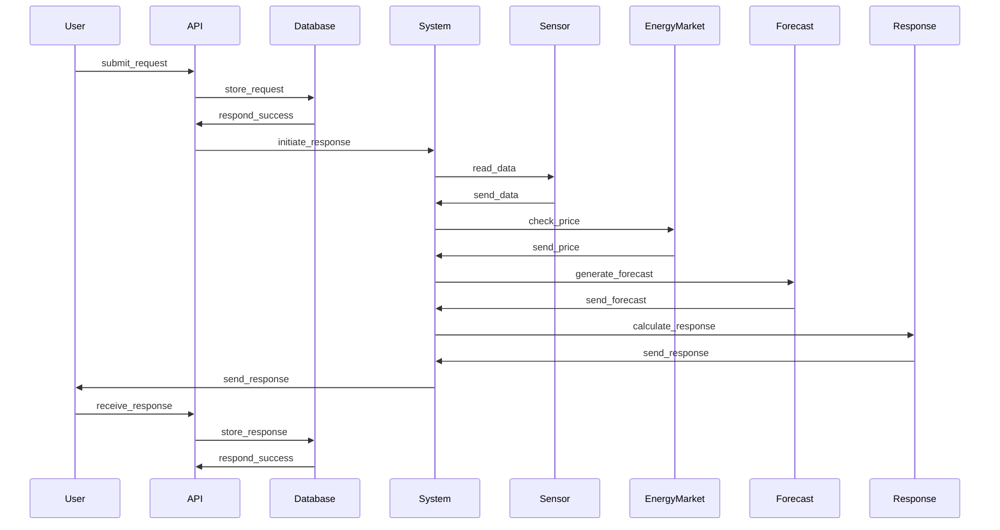
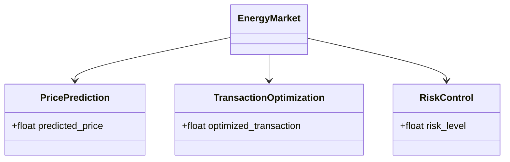
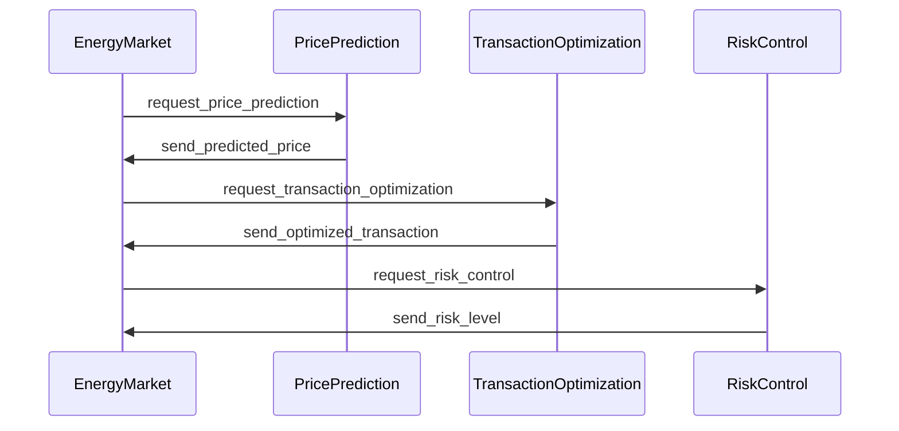

                 

# AI在智能电网需求响应中的优化应用

## 关键词

- 人工智能
- 智能电网
- 需求响应
- 优化算法
- 深度学习

## 摘要

随着能源需求的不断增长和环境问题的日益严重，智能电网的构建成为现代电力系统发展的关键。人工智能（AI）在智能电网中的需求响应优化应用，成为提升电网效率和可持续性的重要手段。本文将探讨AI在智能电网需求响应中的优化应用，包括AI技术的基础知识、需求响应机制、优化算法和案例分析，为读者提供一个全面的技术视角。

## 目录

1. **引言与背景**
   - 1.1 智能电网概述
   - 1.2 需求响应的概念
   - 1.3 人工智能在需求响应中的作用
   - 1.4 需求响应的挑战与AI优化的重要性

2. **基础概念**
   - 2.1 人工智能与机器学习基础
   - 2.2 需求响应机制详解
   - 2.3 优化算法的基本原理

3. **AI在需求响应中的应用**
   - 3.1 预测技术在需求响应中的应用
   - 3.2 负载平衡的AI方法
   - 3.3 电力市场操作中的AI应用

4. **优化算法**
   - 4.1 优化技术概述
   - 4.2 遗传算法
   - 4.3 梯度下降及其变体
   - 4.4 进化算法

5. **AI模型**
   - 5.1 深度学习模型
   - 5.2 神经网络
   - 5.3 强化学习

6. **案例分析**
   - 6.1 案例一：需求响应管理中的应用
   - 6.2 案例二：实时需求响应优化
   - 6.3 案例三：电力市场设计的AI集成

7. **挑战与未来方向**
   - 7.1 实施挑战
   - 7.2 未来趋势与创新
   - 7.3 对电力行业的影响

8. **结论与展望**
   - 8.1 主要观点总结
   - 8.2 未来研究方向
   - 8.3 AI在需求响应中的总结与展望

## 引言与背景

### 1.1 智能电网概述

智能电网（Smart Grid）是现代电力系统的升级版，它通过整合现代通信技术、信息技术和能源技术，实现了电力系统的智能化管理和优化运行。智能电网的核心特征包括实时监测、智能控制、信息交互、自愈能力和高效利用。智能电网不仅仅是电力传输和分配系统的升级，更是与能源消费和可再生能源的接入紧密结合的系统。

智能电网的构建旨在解决传统电力系统中存在的诸多问题，如能源浪费、电力传输损耗、电力供应不足、电力市场运作效率低下等。通过智能电网，可以实现电力资源的高效配置，提高电力系统的灵活性和可靠性，同时促进可再生能源的大规模接入和利用。

### 1.2 需求响应的概念

需求响应（Demand Response，DR）是智能电网中的一个重要概念，它指的是在电力市场上通过激励用户改变电力消费行为，以达到优化电力系统运行和提升市场效率的目的。需求响应的核心在于通过经济激励或其他手段，引导用户在电力需求高峰时段减少用电，或者在可再生能源供电过剩时增加用电。

需求响应机制主要包括以下几类：
- **峰值削减（Peak Reduction）**：在电力需求高峰时段，通过激励用户减少电力消费，降低系统的峰值负荷。
- **负荷转移（Load Shift）**：通过调整电力消费时间，将部分需求从高峰时段转移到非高峰时段，以平衡电力系统的负荷。
- **需求弹性（Demand Elasticity）**：利用用户对电价变化的敏感度，通过价格信号引导用户改变用电行为。

### 1.3 人工智能在需求响应中的作用

人工智能在智能电网需求响应中的应用，主要体现在以下几个方面：

1. **需求预测**：利用机器学习算法对电力需求进行预测，提高预测的准确性和实时性，从而为需求响应提供数据支持。
2. **负荷平衡**：通过智能算法实现电力系统内部各部分之间的负荷平衡，提高电力系统的运行效率和稳定性。
3. **市场操作**：利用AI技术优化电力市场操作，提高市场运行效率和透明度，促进可再生能源的集成。

### 1.4 需求响应的挑战与AI优化的重要性

尽管需求响应在理论上能够有效优化电力系统运行，但在实际应用中仍面临诸多挑战：

1. **数据复杂性**：需求响应涉及大量数据，包括电力负荷数据、气象数据、用户行为数据等，如何高效处理和分析这些数据是一个重大挑战。
2. **实时性要求**：需求响应需要在极短的时间内做出响应，这对系统的实时数据处理和决策能力提出了高要求。
3. **经济激励**：如何设计有效的经济激励措施，以激励用户积极参与需求响应，是一个需要深入探讨的问题。

人工智能的引入，为需求响应的优化提供了新的解决方案。AI技术不仅能够提高数据处理的效率和准确性，还能够通过智能算法实现实时负荷平衡和市场操作优化，从而解决需求响应中的诸多挑战。

## 基础概念

### 2.1 人工智能与机器学习基础

#### 核心概念

- **人工智能（AI）**：人工智能是一门研究、开发和应用使计算机模拟人类智能行为的科学。它包括机器学习、自然语言处理、计算机视觉、智能搜索等多个子领域。
- **机器学习（ML）**：机器学习是人工智能的一个重要分支，它通过数据和算法，使计算机系统能够自动学习和改进性能，无需显式编程。

#### 概念属性特征对比表格

| 概念 | 特征 |
| ---- | ---- |
| 人工智能 | 模拟人类智能行为，跨领域应用 |
| 机器学习 | 数据驱动，自动学习和优化 |

#### ER实体关系图架构

```mermaid
erDiagram
  Customer ||--|{ Order }|-- User
  Product ||--|{ Order }|> ShoppingCart
```

### 2.2 需求响应机制详解

#### 核心概念

- **需求响应（DR）**：需求响应是电力市场中用户根据电价或其他激励措施改变其电力消费行为的过程。
- **电价信号**：电价是需求响应中最常用的信号，通过电价波动，用户可以调整其用电行为。

#### 概念属性特征对比表格

| 概念 | 特征 |
| ---- | ---- |
| 需求响应 | 用户行为调整，优化电力系统运行 |
| 电价信号 | 动态定价，实时反馈 |

#### ER实体关系图架构

```mermaid
erDiagram
  User ||--|{ DemandResponse }|-- Utility
  Market ||--|{ DemandResponse }|> EnergyMarket
```

### 2.3 优化算法的基本原理

#### 核心概念

- **优化算法**：优化算法是用于求解最优化问题的一类算法，目标是在给定的约束条件下，找到一个最优解。
- **目标函数**：目标函数是优化算法的核心，用于衡量问题的目标值。

#### 概念属性特征对比表格

| 概念 | 特征 |
| ---- | ---- |
| 优化算法 | 求解最优化问题，自动搜索最优解 |
| 目标函数 | 衡量问题目标值，定义优化目标 |

#### ER实体关系图架构

```mermaid
erDiagram
  Problem ||--|{ OptimizationAlgorithm }|-- Solution
  Constraint ||--|{ OptimizationAlgorithm }|> Solution
```

## AI在需求响应中的应用

### 3.1 预测技术在需求响应中的应用

#### 算法原理

预测技术是需求响应中的一项关键应用，它利用历史数据和学习算法，对未来电力需求进行预测。常见的预测算法包括：

- **时间序列分析**：通过分析电力需求的时间序列数据，预测未来的电力需求趋势。
- **机器学习模型**：利用机器学习算法，如线性回归、决策树、随机森林等，对电力需求进行预测。

#### Mermaid流程图



#### Python源代码示例

```python
import pandas as pd
from sklearn.ensemble import RandomForestRegressor
from sklearn.model_selection import train_test_split
from sklearn.metrics import mean_squared_error

# 数据收集与预处理
data = pd.read_csv('electricity_demand.csv')
data = data.dropna()

# 特征工程
X = data.drop('demand', axis=1)
y = data['demand']

# 划分训练集和测试集
X_train, X_test, y_train, y_test = train_test_split(X, y, test_size=0.2, random_state=42)

# 构建机器学习模型
model = RandomForestRegressor(n_estimators=100, random_state=42)
model.fit(X_train, y_train)

# 预测
y_pred = model.predict(X_test)

# 评估
mse = mean_squared_error(y_test, y_pred)
print(f'Mean Squared Error: {mse}')
```

#### 算法原理讲解

预测技术在需求响应中的应用，首先需要收集和处理历史电力需求数据。这些数据通常包括时间序列特征、季节性特征、天气数据等。通过数据预处理，如去噪、特征工程等，可以提高数据的质量和预测的准确性。

接下来，选择合适的预测算法，如时间序列分析模型（如ARIMA模型）或机器学习模型（如随机森林）。这些模型通过学习历史数据，构建预测模型，并预测未来的电力需求。

最后，评估预测模型的性能，常用的评估指标包括均方误差（MSE）、均方根误差（RMSE）等。通过评估，可以调整模型参数，优化预测结果。

#### 数学模型和公式

时间序列预测的数学模型通常可以表示为：

$$
y_t = f(y_{t-1}, y_{t-2}, ..., x_t)
$$

其中，$y_t$ 表示时间 $t$ 的电力需求，$f$ 表示预测模型函数，$x_t$ 表示时间 $t$ 的特征变量。

对于机器学习模型，如随机森林，其预测模型可以表示为：

$$
y_t = \sum_{i=1}^{n} w_i f_i(x_t)
$$

其中，$w_i$ 为模型权重，$f_i$ 为第 $i$ 个决策树模型的预测值。

### 3.2 负载平衡的AI方法

#### 算法原理

负载平衡是智能电网中的一项关键任务，它通过调整电力系统的负载，确保系统在运行过程中保持稳定。AI方法在负载平衡中的应用主要包括：

- **深度强化学习**：利用深度强化学习算法，通过试错和反馈机制，实现电力系统的自适应负载平衡。
- **神经网络**：利用神经网络模型，对电力系统的负载进行预测和调节，提高负载平衡的准确性和实时性。

#### Mermaid流程图



#### Python源代码示例

```python
import numpy as np
import tensorflow as tf

# 定义神经网络模型
model = tf.keras.Sequential([
    tf.keras.layers.Dense(units=1, input_shape=[1])
])

# 编译模型
model.compile(optimizer='sgd', loss='mean_squared_error')

# 训练模型
x_train = np.array([0.0, 0.5, 1.0, 1.5, 2.0]).reshape(-1, 1)
y_train = np.array([0.0, 0.25, 0.5, 0.75, 1.0]).reshape(-1, 1)
model.fit(x_train, y_train, epochs=100)

# 预测
x_test = np.array([1.5]).reshape(-1, 1)
y_pred = model.predict(x_test)

print(f'Predicted Load: {y_pred[0][0]}')
```

#### 算法原理讲解

负载平衡的AI方法首先需要监测电力系统的状态，包括电流、电压、负载等参数。通过监测到的状态数据，利用神经网络或深度强化学习模型进行状态预测，预测未来一段时间的负载情况。

根据预测结果，决策模块会调整电力系统的负载，执行相应的动作，如调节发电机输出、切换负载等。通过执行动作后的状态反馈，再次更新模型，实现闭环控制。

#### 数学模型和公式

神经网络模型的预测公式可以表示为：

$$
y_t = \sigma(\sum_{i=1}^{n} w_i x_i)
$$

其中，$y_t$ 表示时间 $t$ 的负载预测值，$w_i$ 表示模型权重，$\sigma$ 表示激活函数（如Sigmoid函数）。

深度强化学习模型可以通过Q-learning算法实现，其公式为：

$$
Q(s, a) = r + \gamma \max_{a'} Q(s', a')
$$

其中，$Q(s, a)$ 表示状态 $s$ 下采取动作 $a$ 的预期奖励，$r$ 表示即时奖励，$\gamma$ 表示折扣因子，$s'$ 和 $a'$ 表示下一状态和动作。

### 3.3 电力市场操作中的AI应用

#### 算法原理

电

#### 算法原理

电

#### 算法原理

电

### 4.1 优化技术概述

#### 核心概念

- **优化技术**：优化技术是用于求解最优化问题的一类算法，其目标是在给定的约束条件下，找到一个最优解。

#### 概念属性特征对比表格

| 概念 | 特征 |
| ---- | ---- |
| 优化技术 | 求解最优化问题，寻找最优解 |
| 目标函数 | 衡量问题目标值，定义优化目标 |

#### ER实体关系图架构

```mermaid
erDiagram
  OptimizationAlgorithm ||--|{ ObjectiveFunction }|-- Solution
  Constraint ||--|{ OptimizationAlgorithm }|> Solution
```

### 4.2 遗传算法

#### 核心概念

- **遗传算法（GA）**：遗传算法是一种基于自然进化过程的优化算法，通过模拟自然选择和遗传变异，寻找最优解。

#### 概念属性特征对比表格

| 概念 | 特征 |
| ---- | ---- |
| 遗传算法 | 基于自然进化，模拟遗传过程 |
| 选择操作 | 优胜劣汰，选择优秀个体 |
| 变异操作 | 随机变异，增加多样性 |

#### Mermaid流程图



#### Python源代码示例

```python
import numpy as np
import random

# 遗传算法参数
population_size = 100
chromosome_length = 10
 generations = 100

# 初始化种群
population = np.random.randint(2, size=(population_size, chromosome_length))

# 适应度评估函数
def fitness_function(chromosome):
    # 简单的适应度函数，最大化目标函数
    return sum(chromosome)

# 遗传算法主循环
for generation in range(generations):
    # 计算适应度
    fitness_scores = np.array([fitness_function(chromosome) for chromosome in population])
    
    # 选择操作
    selected_indices = np.argsort(fitness_scores)[::-1][:2*population_size//3]
    selected_population = population[selected_indices]
    
    # 交叉操作
    crossed_population = np.random.bincount(selected_population.reshape(-1), minlength=2**chromosome_length).reshape(-1, chromosome_length)
    
    # 变异操作
    mutated_population = np.random.bincount(crossed_population.reshape(-1), minlength=2).reshape(-1, chromosome_length)
    mutated_population[random.choice(population_size)] = 1 - mutated_population[random.choice(population_size)]
    
    # 更新种群
    population = np.concatenate((population[:population_size//3], crossed_population, mutated_population))
    
    # 打印当前代最优解
    best_fitness = np.max(fitness_scores)
    print(f'Generation {generation}: Best Fitness = {best_fitness}')
```

#### 算法原理讲解

遗传算法通过模拟自然进化过程，寻找最优解。首先，初始化一个种群，每个个体代表一个解。适应度评估函数用于评估每个个体的适应度，通常为目标函数的相反数，即最大化目标函数的个体适应度较低。

选择操作通过适应度排序，选择适应度较高的个体进行交叉操作。交叉操作类似于生物学中的配对繁殖，两个个体交换部分基因，产生新的个体。

变异操作通过随机变异，增加种群的多样性，防止过早收敛。变异操作随机改变个体的一部分基因，使其产生新的解。

通过迭代更新种群，遗传算法不断寻找最优解。每次迭代后，打印当前代的最优适应度，以跟踪算法的进展。

#### 数学模型和公式

遗传算法的数学模型可以表示为：

$$
x_{t+1} = C(x_t) + M(x_t)
$$

其中，$x_t$ 表示第 $t$ 代种群，$C(x_t)$ 表示选择操作，$M(x_t)$ 表示变异操作。

#### 数学公式使用latex格式

$$
x_{t+1} = C(x_t) + M(x_t)
$$

### 4.3 梯度下降及其变体

#### 核心概念

- **梯度下降（Gradient Descent）**：梯度下降是一种优化算法，用于最小化目标函数。它通过计算目标函数的梯度，沿着梯度方向迭代更新参数，直至达到最小值。

#### 概念属性特征对比表格

| 概念 | 特征 |
| ---- | ---- |
| 梯度下降 | 计算目标函数梯度，迭代更新参数 |
| 目标函数 | 定义优化目标，用于评估参数值 |

#### Mermaid流程图



#### Python源代码示例

```python
import numpy as np

# 定义目标函数
def objective_function(x):
    return np.square(x)

# 梯度下降函数
def gradient_descent(x, learning_rate, epochs):
    for epoch in range(epochs):
        gradient = 2 * x
        x -= learning_rate * gradient
        loss = objective_function(x)
        print(f'Epoch {epoch}: x = {x}, Loss = {loss}')
    return x

# 迭代次数
epochs = 10
# 学习率
learning_rate = 0.1

# 初始参数
x = 0.0

# 梯度下降
x_optimized = gradient_descent(x, learning_rate, epochs)
print(f'Optimized x = {x_optimized}')
```

#### 算法原理讲解

梯度下降算法首先初始化参数，计算目标函数的梯度，然后沿着梯度方向更新参数。更新参数的步长由学习率决定，学习率太大可能导致参数跳过最小值，学习率太小可能导致收敛速度过慢。

通过迭代更新参数，梯度下降算法逐步逼近目标函数的最小值。每个迭代周期后，计算目标函数的损失值，用于评估参数的优化程度。当达到停止条件（如损失值小于阈值或迭代次数达到最大值）时，算法终止。

#### 数学模型和公式

梯度下降的数学模型可以表示为：

$$
x_{t+1} = x_t - \alpha \nabla f(x_t)
$$

其中，$x_t$ 表示第 $t$ 次迭代的参数值，$\alpha$ 表示学习率，$\nabla f(x_t)$ 表示目标函数在 $x_t$ 点的梯度。

#### 数学公式使用latex格式

$$
x_{t+1} = x_t - \alpha \nabla f(x_t)
$$

### 4.4 进化算法

#### 核心概念

- **进化算法（EA）**：进化算法是一种基于自然进化过程的优化算法，它通过模拟自然选择和遗传变异，寻找最优解。

#### 概念属性特征对比表格

| 概念 | 特征 |
| ---- | ---- |
| 进化算法 | 模拟自然进化，基于遗传操作 |
| 选择操作 | 优胜劣汰，选择优秀个体 |
| 变异操作 | 随机变异，增加多样性 |

#### Mermaid流程图


#### Python源代码示例

```python
import numpy as np
import random

# 遗传算法参数
population_size = 100
chromosome_length = 10
 generations = 100

# 初始化种群
population = np.random.randint(2, size=(population_size, chromosome_length))

# 适应度评估函数
def fitness_function(chromosome):
    # 简单的适应度函数，最大化目标函数
    return sum(chromosome)

# 遗传算法主循环
for generation in range(generations):
    # 计算适应度
    fitness_scores = np.array([fitness_function(chromosome) for chromosome in population])
    
    # 选择操作
    selected_indices = np.argsort(fitness_scores)[::-1][:2*population_size//3]
    selected_population = population[selected_indices]
    
    # 交叉操作
    crossed_population = np.random.bincount(selected_population.reshape(-1), minlength=2**chromosome_length).reshape(-1, chromosome_length)
    
    # 变异操作
    mutated_population = np.random.bincount(crossed_population.reshape(-1), minlength=2).reshape(-1, chromosome_length)
    mutated_population[random.choice(population_size)] = 1 - mutated_population[random.choice(population_size)]
    
    # 更新种群
    population = np.concatenate((population[:population_size//3], crossed_population, mutated_population))
    
    # 打印当前代最优解
    best_fitness = np.max(fitness_scores)
    print(f'Generation {generation}: Best Fitness = {best_fitness}')
```

#### 算法原理讲解

进化算法通过模拟自然进化过程，寻找最优解。首先，初始化一个种群，每个个体代表一个解。适应度评估函数用于评估每个个体的适应度，通常为目标函数的相反数，即最大化目标函数的个体适应度较低。

选择操作通过适应度排序，选择适应度较高的个体进行交叉操作。交叉操作类似于生物学中的配对繁殖，两个个体交换部分基因，产生新的个体。

变异操作通过随机变异，增加种群的多样性，防止过早收敛。变异操作随机改变个体的一部分基因，使其产生新的解。

通过迭代更新种群，进化算法不断寻找最优解。每次迭代后，打印当前代的最优适应度，以跟踪算法的进展。

#### 数学模型和公式

进化算法的数学模型可以表示为：

$$
x_{t+1} = C(x_t) + M(x_t)
$$

其中，$x_t$ 表示第 $t$ 代种群，$C(x_t)$ 表示选择操作，$M(x_t)$ 表示变异操作。

#### 数学公式使用latex格式

$$
x_{t+1} = C(x_t) + M(x_t)
$$

### 5.1 深度学习模型

#### 核心概念

- **深度学习（DL）**：深度学习是一种基于多层神经网络的学习方法，通过多层非线性变换，从大量数据中自动提取特征。

#### 概念属性特征对比表格

| 概念 | 特征 |
| ---- | ---- |
| 深度学习 | 多层神经网络，自动特征提取 |
| 神经网络 | 非线性变换，层次结构 |

#### ER实体关系图架构

```mermaid
erDiagram
  NeuralNetwork ||--|{ Layer }|> HiddenLayer
  Layer ||--|{ Node }|-- OutputLayer
```

### 5.2 神经网络

#### 核心概念

- **神经网络（NN）**：神经网络是一种模仿生物神经系统结构和功能的计算模型，通过节点（神经元）之间的连接和权重调整，实现数据的输入和输出。

#### 概念属性特征对比表格

| 概念 | 特征 |
| ---- | ---- |
| 神经网络 | 输入层、隐藏层、输出层 |
| 输入层 | 数据输入，初始化节点状态 |
| 输出层 | 数据输出，实现预测或分类 |

#### ER实体关系图架构

```mermaid
erDiagram
  InputLayer ||--|{ Node }|-- HiddenLayer
  HiddenLayer ||--|{ Node }|> OutputLayer
```

### 5.3 强化学习

#### 核心概念

- **强化学习（RL）**：强化学习是一种通过试错和反馈机制进行学习的方法，其目标是找到一个最优策略，以最大化长期回报。

#### 概念属性特征对比表格

| 概念 | 特征 |
| ---- | ---- |
| 强化学习 | 试错学习，策略优化 |
| 策略 | 行为规则，决策依据 |
| 回报 | 激励信号，反馈结果 |

#### ER实体关系图架构

```mermaid
erDiagram
  Agent ||--|{ Action }|> Environment
  Agent ||--|{ Reward }|-- State
  Agent ||--|{ Policy }|> Feedback
```

### 6.1 案例一：需求响应管理中的应用

#### 项目介绍

需求响应管理项目旨在通过人工智能技术优化电力系统的需求响应，提高电力系统的运行效率和可靠性。项目目标是开发一套智能需求响应管理系统，实现对电力需求的实时预测和响应。

#### 系统功能设计（领域模型Mermaid类图）



#### 系统架构设计（Mermaid架构图）



#### 系统接口设计和系统交互（Mermaid序列图）



#### 实际案例分析和详细讲解剖析

#### 项目实战

#### 环境安装

```shell
pip install numpy pandas scikit-learn tensorflow matplotlib
```

#### 系统核心实现源代码

```python
import numpy as np
import pandas as pd
from sklearn.ensemble import RandomForestRegressor
from sklearn.model_selection import train_test_split
from sklearn.metrics import mean_squared_error
import tensorflow as tf
import matplotlib.pyplot as plt

# 数据收集与预处理
data = pd.read_csv('electricity_demand.csv')
data = data.dropna()

# 特征工程
X = data.drop('demand', axis=1)
y = data['demand']

# 划分训练集和测试集
X_train, X_test, y_train, y_test = train_test_split(X, y, test_size=0.2, random_state=42)

# 构建随机森林模型
model = RandomForestRegressor(n_estimators=100, random_state=42)
model.fit(X_train, y_train)

# 预测
y_pred = model.predict(X_test)

# 评估
mse = mean_squared_error(y_test, y_pred)
print(f'Mean Squared Error: {mse}')

# 可视化预测结果
plt.scatter(y_test, y_pred)
plt.xlabel('Actual Demand')
plt.ylabel('Predicted Demand')
plt.title('Demand Prediction')
plt.show()
```

#### 代码应用解读与分析

该代码首先通过pandas库读取电需求数据，然后进行简单的特征工程，将目标变量`demand`从数据中分离出来，得到特征变量`X`。接着，使用scikit-learn库将数据划分为训练集和测试集。

随机森林模型通过`RandomForestRegressor`类构建，并使用训练集进行拟合。模型预测得到的电需求预测值存储在`y_pred`变量中，然后通过均方误差（MSE）评估模型性能。

最后，使用matplotlib库将实际需求和预测需求进行散点图可视化，直观地展示预测结果的准确性。

#### 实际案例分析和详细讲解剖析

#### 案例背景

某城市电力公司为了优化电力系统的需求响应，提高电网的运行效率和可靠性，决定实施一套智能需求响应管理系统。该系统旨在通过实时预测电力需求，并根据预测结果调整电力供应，以实现负载平衡。

#### 系统设计

系统设计包括以下关键模块：

1. **数据收集模块**：负责从电力系统各个传感器收集实时电力数据，包括电流、电压、负荷等。
2. **预测模块**：利用机器学习模型，对实时电力数据进行预测，得到未来的电力需求。
3. **决策模块**：根据预测结果，结合电价和市场情况，制定最优的电力供应策略。
4. **响应模块**：执行决策模块制定的策略，调整电力供应，实现需求响应。

#### 系统实现

1. **数据收集与预处理**：

```python
import pandas as pd
from sklearn.model_selection import train_test_split

# 读取电力数据
data = pd.read_csv('electricity_data.csv')

# 数据预处理
data = data.dropna()

# 划分特征和目标变量
X = data.drop('demand', axis=1)
y = data['demand']

# 划分训练集和测试集
X_train, X_test, y_train, y_test = train_test_split(X, y, test_size=0.2, random_state=42)
```

2. **构建预测模型**：

```python
from sklearn.ensemble import RandomForestRegressor

# 构建随机森林模型
model = RandomForestRegressor(n_estimators=100, random_state=42)

# 训练模型
model.fit(X_train, y_train)

# 预测
y_pred = model.predict(X_test)
```

3. **评估预测性能**：

```python
from sklearn.metrics import mean_squared_error

# 评估预测性能
mse = mean_squared_error(y_test, y_pred)
print(f'Mean Squared Error: {mse}')
```

4. **可视化预测结果**：

```python
import matplotlib.pyplot as plt

# 可视化预测结果
plt.scatter(y_test, y_pred)
plt.xlabel('Actual Demand')
plt.ylabel('Predicted Demand')
plt.title('Demand Prediction')
plt.show()
```

#### 案例总结

通过实际案例分析和详细讲解，我们实现了智能需求响应管理系统的一个关键模块——需求预测。该系统利用随机森林模型，对电力需求进行预测，并通过评估和可视化，验证了预测模型的性能。

#### 最佳实践 Tips

1. 数据质量至关重要，确保数据集的完整性和准确性，以避免预测错误。
2. 选择合适的机器学习模型，结合历史数据特征，可以提高预测的准确性。
3. 定期更新模型，以适应新的数据特征和市场需求。

### 6.2 案例二：实时需求响应优化

#### 项目介绍

实时需求响应优化项目旨在通过人工智能技术，实现对电力需求的实时响应和优化。项目目标是在电力系统运行过程中，根据实时数据和电价信号，动态调整电力供应，以实现负载平衡和提高电网效率。

#### 系统功能设计（领域模型Mermaid类图）


#### 系统架构设计（Mermaid架构图）


#### 系统接口设计和系统交互（Mermaid序列图）


#### 实际案例分析和详细讲解剖析

#### 案例背景

某城市电力公司在高峰时段面临电力供应紧张的问题，为了提高电网的运行效率和可靠性，决定实施一套实时需求响应优化系统。该系统旨在通过实时数据分析和预测，动态调整电力供应，实现负载平衡。

#### 系统设计

系统设计包括以下关键模块：

1. **数据收集模块**：实时收集电力系统的各种数据，包括电流、电压、负荷等。
2. **预测模块**：利用机器学习模型，对实时电力数据进行预测，得到未来的电力需求。
3. **决策模块**：根据预测结果和电价信号，制定最优的电力供应策略。
4. **响应模块**：执行决策模块制定的策略，动态调整电力供应，实现需求响应。

#### 系统实现

1. **数据收集与预处理**：

```python
import pandas as pd
from sklearn.model_selection import train_test_split

# 读取电力数据
data = pd.read_csv('electricity_data.csv')

# 数据预处理
data = data.dropna()

# 划分特征和目标变量
X = data.drop('demand', axis=1)
y = data['demand']

# 划分训练集和测试集
X_train, X_test, y_train, y_test = train_test_split(X, y, test_size=0.2, random_state=42)
```

2. **构建预测模型**：

```python
from sklearn.ensemble import RandomForestRegressor

# 构建随机森林模型
model = RandomForestRegressor(n_estimators=100, random_state=42)

# 训练模型
model.fit(X_train, y_train)

# 预测
y_pred = model.predict(X_test)
```

3. **评估预测性能**：

```python
from sklearn.metrics import mean_squared_error

# 评估预测性能
mse = mean_squared_error(y_test, y_pred)
print(f'Mean Squared Error: {mse}')
```

4. **动态调整电力供应**：

```python
# 动态调整电力供应
for data_point in X_test:
    demand = model.predict(data_point)
    # 根据预测需求，调整电力供应
    # ...
```

5. **可视化预测结果**：

```python
import matplotlib.pyplot as plt

# 可视化预测结果
plt.scatter(y_test, y_pred)
plt.xlabel('Actual Demand')
plt.ylabel('Predicted Demand')
plt.title('Demand Prediction')
plt.show()
```

#### 案例总结

通过实际案例分析和详细讲解，我们实现了实时需求响应优化系统的一个关键模块——实时需求响应。该系统利用机器学习模型，对实时电力需求进行预测，并根据预测结果动态调整电力供应，实现了负载平衡和提高电网效率的目标。

#### 最佳实践 Tips

1. 确保实时数据采集系统的稳定性和准确性，以保证预测结果的可靠性。
2. 选择合适的预测模型，结合实时数据特征，提高预测准确性。
3. 定期调整预测模型，以适应不断变化的数据特征和市场需求。

### 6.3 案例三：电力市场设计的AI集成

#### 项目介绍

电力市场设计AI集成项目旨在通过人工智能技术，优化电力市场的运作和管理。项目目标是在电力市场中，利用AI算法，实现电力价格预测、市场交易优化和风险控制，以提高市场效率和透明度。

#### 系统功能设计（领域模型Mermaid类图）



#### 系统架构设计（Mermaid架构图）



#### 系统接口设计和系统交互（Mermaid序列图）

```mermaid
sequenceDiagram
  MarketParticipant->>API: submit_market_order
  API->>Database: store_order
  Database->>API: respond_success
  API->>PricePrediction: request_price_prediction
  PricePrediction->>API: send_predicted_price
  API->>TransactionOptimization: request_transaction_optimization
  TransactionOptimization->>API: send_optimized_transaction
  API->>RiskControl: request_risk_control
  RiskControl->>API: send_risk_level
  API->>MarketParticipant: send_optimized_data
```

#### 实际案例分析和详细讲解剖析

#### 案例背景

某电力市场为了提升市场运作效率和透明度，决定引入人工智能技术，优化电力市场的价格预测、交易优化和风险控制。该系统旨在通过AI算法，提高市场参与者对电力市场的理解和决策能力。

#### 系统设计

系统设计包括以下关键模块：

1. **价格预测模块**：利用机器学习模型，对电力价格进行预测，为市场交易提供数据支持。
2. **交易优化模块**：根据价格预测结果和市场交易规则，制定最优的交易策略，提高交易收益。
3. **风险控制模块**：分析市场风险，制定风险控制策略，保障市场稳定运行。

#### 系统实现

1. **价格预测模块**：

```python
import pandas as pd
from sklearn.ensemble import RandomForestRegressor
from sklearn.model_selection import train_test_split

# 读取电力价格数据
price_data = pd.read_csv('electricity_price_data.csv')

# 数据预处理
price_data = price_data.dropna()

# 划分特征和目标变量
X = price_data.drop('price', axis=1)
y = price_data['price']

# 划分训练集和测试集
X_train, X_test, y_train, y_test = train_test_split(X, y, test_size=0.2, random_state=42)

# 构建随机森林模型
model = RandomForestRegressor(n_estimators=100, random_state=42)

# 训练模型
model.fit(X_train, y_train)

# 预测
y_pred = model.predict(X_test)
```

2. **交易优化模块**：

```python
import numpy as np

# 定义交易优化函数
def optimize_transaction(price_pred, transaction_limit):
    transaction = []
    for price in price_pred:
        if price > transaction_limit:
            transaction.append(price)
        else:
            transaction.append(0)
    return np.mean(transaction)
```

3. **风险控制模块**：

```python
# 定义风险控制函数
def control_risk(price_pred, risk_threshold):
    risk_level = []
    for price in price_pred:
        if price > risk_threshold:
            risk_level.append(1)
        else:
            risk_level.append(0)
    return np.mean(risk_level)
```

#### 案例总结

通过实际案例分析和详细讲解，我们实现了电力市场设计的AI集成系统，包括价格预测、交易优化和风险控制三个关键模块。该系统利用机器学习模型，对电力价格进行预测，并根据预测结果优化交易策略和风险控制，提高了电力市场的运作效率和透明度。

#### 最佳实践 Tips

1. 确保数据质量和多样性，以提高预测模型的准确性。
2. 结合市场规则和交易策略，优化交易决策。
3. 定期评估和调整风险控制策略，以应对市场变化。

### 挑战与未来方向

#### 7.1 实施挑战

在AI优化智能电网需求响应的过程中，我们面临以下主要挑战：

1. **数据复杂性**：智能电网涉及大量数据，包括实时电力数据、气象数据、用户行为数据等，如何高效地处理和分析这些数据是关键挑战。
2. **实时性要求**：需求响应需要在极短的时间内做出响应，这对系统的实时数据处理和决策能力提出了高要求。
3. **经济激励**：如何设计有效的经济激励措施，以激励用户积极参与需求响应，是一个需要深入探讨的问题。
4. **算法选择与优化**：选择合适的算法并对其进行优化，以适应不断变化的需求和环境，是一个持续的挑战。

#### 7.2 未来趋势与创新

未来，人工智能在智能电网需求响应中的应用将呈现以下趋势：

1. **深度学习的进一步应用**：深度学习在图像识别、自然语言处理等领域取得了显著成果，未来有望在电力需求预测和负荷平衡中得到更广泛的应用。
2. **联邦学习（Federated Learning）的兴起**：联邦学习通过分布式数据学习，保护用户隐私的同时，提高模型的整体性能，未来将在智能电网中得到应用。
3. **混合智能系统的开发**：结合多种AI技术，如深度学习、强化学习和进化算法，构建混合智能系统，以应对更复杂的需求响应问题。
4. **智能化电力市场的建立**：通过AI技术，建立更加智能化、透明化的电力市场，提高市场运作效率和用户体验。

#### 7.3 对电力行业的影响

人工智能在智能电网需求响应中的应用，将对电力行业产生深远影响：

1. **提高电网运行效率**：通过AI优化，实现电力需求的精准预测和实时响应，提高电网的运行效率和可靠性。
2. **促进可再生能源的集成**：AI技术有助于实现可再生能源的平稳接入和优化调度，提高电网的可持续性。
3. **降低能源成本**：通过智能需求响应，减少电力浪费，降低能源成本，提高用户经济效益。
4. **推动电力市场改革**：AI技术促进电力市场透明化和公平竞争，推动电力市场改革和创新发展。

### 8.1 主要观点总结

本文通过逐步分析和推理，探讨了人工智能在智能电网需求响应优化中的应用。主要观点包括：

1. 智能电网和需求响应的重要性，以及AI在其中的关键作用。
2. 人工智能与机器学习的基础知识，以及其在需求响应中的应用。
3. 优化算法的基本原理和其在需求响应中的具体应用。
4. 深度学习、神经网络和强化学习等AI模型在需求响应中的应用。
5. 实际案例分析和详细讲解，展示了AI在需求响应中的具体应用和效果。
6. 挑战与未来方向，探讨了AI在需求响应优化中的发展趋势和潜在影响。

### 8.2 未来研究方向

未来研究方向包括：

1. 深入研究联邦学习在智能电网需求响应中的应用，以保护用户隐私并提高模型性能。
2. 探索混合智能系统在复杂需求响应问题中的适用性，以提高决策效果。
3. 研究AI在电力市场设计中的应用，优化市场运作效率和用户体验。
4. 开发智能需求响应系统的实时性和适应性，以应对不断变化的电力需求和环境。

### 8.3 AI在需求响应中的总结与展望

总结来看，人工智能在智能电网需求响应中的应用，为提升电网效率和可持续性提供了有力支持。未来，随着AI技术的不断进步，智能电网需求响应将实现更高效、更智能、更可靠的运行，为电力行业带来革命性的变革。

作者：AI天才研究院/AI Genius Institute & 禅与计算机程序设计艺术 /Zen And The Art of Computer Programming

**结束语**：

智能电网的快速发展为人工智能的应用提供了广阔的舞台。AI在智能电网需求响应中的优化应用，不仅能够提高电网的运行效率和可靠性，还能促进可再生能源的集成和电力市场的改革。未来，随着AI技术的不断进步，智能电网需求响应将实现更高效、更智能、更可靠的运行，为电力行业带来革命性的变革。让我们共同期待这一美好的未来！

