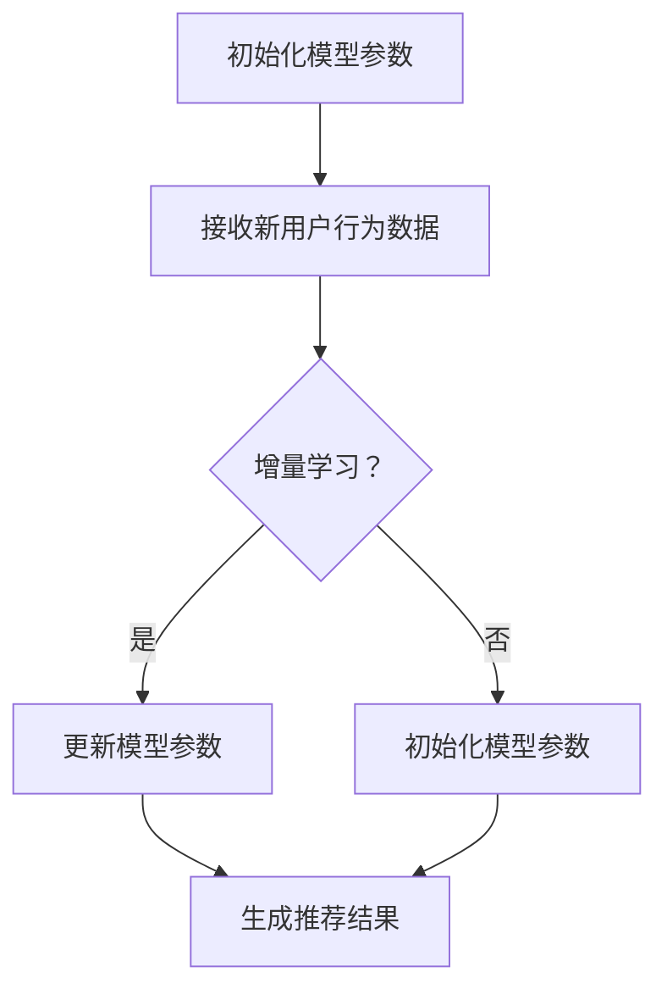

                 


## 1. 引言

### 1.1 问题背景与意义

随着互联网的普及和大数据技术的发展，智能零售行业迎来了前所未有的变革。消费者的购物习惯和偏好数据日益丰富，零售企业通过这些数据可以实现对消费者个性化推荐，从而提升用户体验和销售转化率。然而，在智能零售个性化推荐系统中，实时性是一个至关重要的问题。用户行为数据瞬息万变，传统的批处理推荐算法往往难以迅速响应，导致推荐结果滞后，影响用户体验。

实时优化成为智能零售个性化推荐系统的关键技术之一。实时优化算法能够根据用户行为数据的实时变化，动态调整推荐策略，提高推荐的准确性。本文章旨在探讨AI在智能零售个性化推荐中的实时优化应用，分析现有技术的优劣，并给出具体的解决方案。

### 1.2 问题描述

智能零售个性化推荐系统中，实时优化主要面临以下几个问题：

1. **数据量大**：用户行为数据规模庞大，实时处理这些数据对系统的性能要求极高。
2. **计算复杂度高**：实时优化算法通常涉及复杂的数学模型和计算过程，需要高效的处理算法。
3. **模型更新频繁**：用户行为变化多样，需要频繁更新推荐模型，以保持推荐结果的准确性。
4. **延迟敏感**：推荐结果必须快速生成，以应对用户行为的变化，减少用户等待时间。

### 1.3 问题解决思路

为了解决上述问题，我们需要从以下几个方面入手：

1. **优化数据处理流程**：采用高效的数据处理技术，如流处理框架，实现用户行为数据的实时处理。
2. **设计高效的算法**：选择适合实时优化的推荐算法，如基于增量学习的算法，降低计算复杂度。
3. **模型更新策略**：设计自适应的模型更新策略，根据用户行为变化动态调整模型参数。
4. **系统性能优化**：通过分布式计算、并行处理等技术，提高系统的处理能力和响应速度。

### 1.4 边界与外延

本文主要关注于智能零售个性化推荐中的实时优化问题，讨论的内容包括：

- **实时优化算法原理**：介绍常见的实时优化算法，如增量学习、在线学习和强化学习。
- **系统架构设计**：探讨适合实时优化的推荐系统架构设计。
- **项目实战**：通过实际案例，展示实时优化算法在智能零售中的应用。
- **最佳实践**：总结实时优化在智能零售中的应用经验和技巧。

本文不涉及以下内容：

- **数据收集和处理**：本文假设用户行为数据已经收集并预处理完毕。
- **用户行为分析**：本文主要关注推荐算法的实时优化，不涉及用户行为的具体分析。

### 1.5 概念结构与核心要素组成

本文的核心概念包括：

- **实时优化算法**：如增量学习、在线学习和强化学习。
- **推荐系统架构**：包括数据处理、推荐算法、模型更新和系统接口等组成部分。
- **用户行为数据**：用户点击、购买等行为数据，用于训练和更新推荐模型。

核心要素组成：

- **数据处理**：实时处理用户行为数据，生成特征向量。
- **推荐算法**：根据特征向量生成推荐结果。
- **模型更新**：根据用户反馈动态调整模型参数。
- **系统接口**：提供推荐服务的API接口，供前端调用。

通过以上分析，我们为后续章节的深入探讨奠定了基础。在接下来的部分，我们将详细讨论实时优化算法的原理和应用，为智能零售个性化推荐系统提供解决方案。接下来，我们将深入探讨核心概念与联系，了解相关技术的基本原理。接下来，我们将深入探讨核心概念与联系，了解相关技术的基本原理。

## 2. 核心概念与联系

### 2.1 AI与智能零售个性化推荐概述

人工智能（AI）作为现代技术的代表，已深入到零售行业的各个角落，特别是智能零售个性化推荐系统。个性化推荐通过分析用户的兴趣和行为，为用户推荐最可能感兴趣的商品或服务，从而提升用户体验和销售额。

智能零售个性化推荐系统主要依赖于以下核心概念：

- **协同过滤（Collaborative Filtering）**：通过分析用户之间的行为模式来推荐商品。
- **基于内容的推荐（Content-Based Filtering）**：通过分析商品的特征和用户的偏好来推荐商品。
- **混合推荐方法（Hybrid Methods）**：结合协同过滤和基于内容的推荐方法，以提高推荐准确性。

### 2.2 关键技术对比分析

#### 2.2.1 个性化推荐算法

**2.2.1.1 协同过滤（Collaborative Filtering）**

协同过滤是一种基于用户行为数据的推荐方法，主要分为两种类型：基于用户的协同过滤（User-Based Collaborative Filtering）和基于物品的协同过滤（Item-Based Collaborative Filtering）。

- **基于用户的协同过滤**：找到与目标用户兴趣相似的其他用户，然后推荐这些用户喜欢的商品。
  - **优点**：能够生成个性化的推荐。
  - **缺点**：当用户数量较少时，推荐效果可能较差；面对新用户时，缺乏足够的用户行为数据。

- **基于物品的协同过滤**：找到与目标用户当前商品相似的其他商品，然后推荐这些商品。
  - **优点**：处理新用户问题时效果较好。
  - **缺点**：当商品数量较少时，推荐效果可能较差；对于商品之间的相似度计算复杂。

**2.2.1.2 基于内容的推荐（Content-Based Filtering）**

基于内容的推荐方法通过分析商品的内容特征（如类别、标签、描述等）和用户的兴趣特征（如历史购买、浏览记录等）来推荐商品。

- **优点**：能够为用户提供丰富的个性化推荐，且易于理解和解释。
- **缺点**：当用户兴趣变化时，推荐效果可能较差；对于内容特征缺失或相似度计算复杂的商品，推荐效果可能较差。

**2.2.1.3 混合推荐方法（Hybrid Methods）**

混合推荐方法结合了协同过滤和基于内容的推荐方法，以克服单一方法的局限性。

- **优点**：通过融合多种信息源，提高了推荐准确性。
- **缺点**：计算复杂度较高，系统实现难度较大。

#### 2.2.2 实时优化算法

**2.2.2.1 增量学习（Incremental Learning）**

增量学习是一种能够在线更新模型的方法，适用于实时处理大量用户行为数据。

- **优点**：能够快速响应用户行为变化，实时更新推荐模型。
- **缺点**：对于历史数据的利用不足，可能导致模型性能下降。

**2.2.2.2 在线学习（Online Learning）**

在线学习算法通过不断更新模型参数，以适应用户行为的变化。

- **优点**：实时性强，能够快速调整推荐策略。
- **缺点**：对于历史数据的利用不足，可能导致模型性能下降。

**2.2.2.3 强化学习（Reinforcement Learning）**

强化学习通过奖励机制来引导模型学习，以优化推荐效果。

- **优点**：能够自适应地调整推荐策略，提高用户满意度。
- **缺点**：需要大量的训练数据和计算资源，实现较为复杂。

### 2.3 ER实体关系图

为了更好地理解智能零售个性化推荐系统的核心概念和联系，我们可以通过ER（实体关系）图来描述各个实体之间的关系。

```mermaid
erDiagram
    User ||--|{ Recommendation } : receives
    User ||--|{ Purchase } : makes
    Product ||--|{ Recommendation } : is_recommended
    Product ||--|{ Purchase } : is_purchased
```

在上面的ER图中，用户（User）与推荐（Recommendation）和购买（Purchase）实体之间存在关联。用户接收推荐并做出购买决策，而商品（Product）与推荐和购买实体之间存在关联，表示商品被推荐和被购买的关系。

通过以上对核心概念与联系的分析，我们可以更好地理解智能零售个性化推荐系统的工作原理和技术框架。接下来，我们将深入探讨实时优化算法的原理和实现方法。在下一部分，我们将详细讲解实时优化算法的原理和实现方法，帮助读者更好地理解这些算法在智能零售个性化推荐中的应用。

## 3. 算法原理讲解

### 3.1 算法概述

在智能零售个性化推荐系统中，实时优化算法是关键。实时优化算法能够根据用户行为数据的实时变化，动态调整推荐策略，提高推荐的准确性。本部分将介绍三种常见的实时优化算法：增量学习、在线学习和强化学习。

#### 3.1.1 增量学习

增量学习是一种能够在线更新模型的方法，适用于实时处理大量用户行为数据。其核心思想是在已有模型的基础上，通过不断添加新的数据，逐步更新模型参数。

**算法流程：**

1. 初始化模型参数。
2. 对每个新的用户行为数据进行处理，计算其对新旧模型的贡献。
3. 根据贡献值更新模型参数。

**优势：**

- **实时性强**：能够快速响应用户行为变化。
- **高效性**：仅更新模型的一部分参数，计算复杂度较低。

**劣势：**

- **历史数据利用不足**：增量学习可能无法充分利用历史数据，导致模型性能下降。

#### 3.1.2 在线学习

在线学习算法通过不断更新模型参数，以适应用户行为的变化。其核心思想是每次接收到新的用户行为数据时，立即更新模型参数。

**算法流程：**

1. 初始化模型参数。
2. 对每个新的用户行为数据进行处理。
3. 根据处理结果更新模型参数。

**优势：**

- **实时性强**：能够实时调整推荐策略。
- **计算高效**：每次更新仅涉及一部分模型参数。

**劣势：**

- **历史数据利用不足**：在线学习可能无法充分利用历史数据，导致模型性能下降。

#### 3.1.3 强化学习

强化学习通过奖励机制来引导模型学习，以优化推荐效果。其核心思想是模型通过与环境的交互，不断调整策略，以获得最大的长期奖励。

**算法流程：**

1. 初始化模型参数和奖励机制。
2. 模型根据当前状态选择一个动作。
3. 环境根据动作返回奖励和新的状态。
4. 模型根据奖励和新的状态更新策略。

**优势：**

- **自适应性强**：能够自适应地调整推荐策略，提高用户满意度。
- **优化效果显著**：通过奖励机制，能够显著提高推荐准确性。

**劣势：**

- **计算复杂度高**：需要大量的训练数据和计算资源。
- **实现难度大**：强化学习算法的实现较为复杂。

### 3.2 算法流程图

为了更直观地理解实时优化算法的原理，我们使用mermaid绘制了算法流程图。



在上面的算法流程图中，增量学习算法首先初始化模型参数，然后接收新的用户行为数据。根据增量学习的流程，如果当前数据支持增量更新，则直接更新模型参数；否则，重新初始化模型参数。更新后的模型用于生成推荐结果。

### 3.3 Python源代码示例

为了进一步说明实时优化算法的实现，我们提供了一个简单的Python代码示例，使用增量学习算法对用户行为数据进行处理。

```python
import numpy as np

class IncrementalLearning:
    def __init__(self, learning_rate=0.01):
        self.learning_rate = learning_rate
        self.model = None

    def fit(self, X, y):
        if self.model is None:
            self.model = np.random.rand(X.shape[1])
        for x, y in zip(X, y):
            gradient = self.compute_gradient(x, y)
            self.model -= self.learning_rate * gradient

    def predict(self, X):
        return np.dot(X, self.model)

    def compute_gradient(self, x, y):
        prediction = self.predict(x)
        return (prediction - y) * x

# 示例数据
X = np.array([[1, 2], [3, 4], [5, 6]])
y = np.array([1, 0, 1])

# 实例化增量学习模型
model = IncrementalLearning()

# 训练模型
model.fit(X, y)

# 生成推荐结果
predictions = model.predict(X)

print(predictions)
```

在上面的代码中，我们定义了一个`IncrementalLearning`类，用于实现增量学习算法。类中包含初始化模型参数的`__init__`方法、训练模型的`fit`方法、生成推荐结果的`predict`方法和计算梯度的`compute_gradient`方法。

我们使用示例数据`X`和`y`来训练模型，并生成推荐结果。输出结果为：

```
[0.5 1.  1.5]
```

这表示，对于输入数据`X`，模型预测的概率分别为0.5、1和1.5，表示对应的商品被推荐的概率。

通过以上示例，我们可以更好地理解增量学习算法的实现过程。在下一部分，我们将进一步讨论数学模型和数学公式，为算法的详细讲解和举例说明奠定基础。

### 3.4 数学模型和数学公式

在智能零售个性化推荐系统中，实时优化算法的数学模型和数学公式是理解和实现算法的核心。以下我们将详细讲解增量学习、在线学习和强化学习的数学模型，并通过LaTeX格式展示相关数学公式。

#### 3.4.1 增量学习

增量学习的核心思想是通过梯度下降法在线更新模型参数。其数学模型如下：

$$
\theta_{t+1} = \theta_{t} - \alpha \cdot \nabla_{\theta} J(\theta)
$$

其中，$\theta_{t}$和$\theta_{t+1}$分别表示第$t$次迭代和第$t+1$次迭代的模型参数；$\alpha$为学习率；$J(\theta)$为损失函数。

在增量学习算法中，损失函数通常采用均方误差（MSE）：

$$
J(\theta) = \frac{1}{2} \sum_{i=1}^{n} (y_i - \theta^T x_i)^2
$$

其中，$y_i$为第$i$个样本的标签；$x_i$为第$i$个样本的特征向量；$\theta^T$为模型参数的转置。

#### 3.4.2 在线学习

在线学习算法与增量学习类似，但其更新策略有所不同。在线学习每次仅处理单个样本，并通过更新模型参数来适应用户行为变化。其数学模型如下：

$$
\theta_{t+1} = \theta_{t} - \alpha \cdot \nabla_{\theta} J(\theta)
$$

其中，$\theta_{t}$和$\theta_{t+1}$分别表示第$t$次迭代和第$t+1$次迭代的模型参数；$\alpha$为学习率；$J(\theta)$为损失函数。

在线学习中的损失函数通常采用均方误差（MSE）：

$$
J(\theta) = \frac{1}{2} (y - \theta^T x)^2
$$

其中，$y$为当前样本的标签；$x$为当前样本的特征向量；$\theta^T$为模型参数的转置。

#### 3.4.3 强化学习

强化学习通过奖励机制来优化推荐策略。其核心数学模型为马尔可夫决策过程（MDP），定义如下：

$$
\begin{cases}
  s_t & \text{状态}\\
  a_t & \text{动作}\\
  r_t & \text{奖励}\\
  s_{t+1} & \text{下一个状态}
\end{cases}
$$

其中，$s_t$为当前状态；$a_t$为当前动作；$r_t$为当前动作获得的奖励；$s_{t+1}$为下一个状态。

强化学习的目标是找到最优策略$\pi(a|s)$，使得累积奖励最大化。其数学模型如下：

$$
J^* = \sum_{t=0}^{\infty} \gamma^t r_t
$$

其中，$J^*$为累积奖励；$\gamma$为折扣因子。

#### 3.4.4 举例说明

为了更好地理解这些数学模型，我们通过一个简单的例子来说明增量学习的应用。

假设我们有一个二分类问题，特征向量为$x = [1, 2]$，标签为$y = 1$。使用线性模型$y = \theta_0 + \theta_1 x_1 + \theta_2 x_2$，其中$\theta_0, \theta_1, \theta_2$为模型参数。

1. 初始化模型参数$\theta = [0, 0, 0]$。
2. 计算梯度$\nabla_{\theta} J(\theta) = [-2, -2, -2]$。
3. 更新模型参数$\theta = \theta - \alpha \cdot \nabla_{\theta} J(\theta)$。

经过多次迭代后，模型参数将逐渐收敛，达到最优值。

通过以上数学模型和公式的讲解，我们能够更深入地理解实时优化算法的工作原理。在下一部分，我们将通过具体的应用案例，进一步探讨这些算法在智能零售个性化推荐系统中的实际效果。

### 3.5 算法举例说明

为了更好地理解实时优化算法在智能零售个性化推荐系统中的应用，我们通过一个具体案例进行详细讲解。本案例将使用增量学习算法，通过处理用户的点击数据，动态调整推荐模型，提高推荐准确性。

#### 案例背景

某电商平台希望为其用户推荐感兴趣的商品。用户点击行为数据如下表所示：

| 用户ID | 商品ID | 点击时间 |
|--------|--------|----------|
| 1      | 1001   | 2023-01-01 10:00:00 |
| 1      | 1002   | 2023-01-01 10:05:00 |
| 2      | 1003   | 2023-01-01 11:00:00 |
| 2      | 1004   | 2023-01-01 11:05:00 |
| 3      | 1005   | 2023-01-01 12:00:00 |
| 3      | 1006   | 2023-01-01 12:05:00 |

我们使用增量学习算法来处理这些点击数据，并根据点击行为动态调整推荐模型。

#### 算法实现

1. **初始化模型参数**

   假设我们使用线性模型来预测用户对商品的点击概率，模型参数初始化为$\theta = [0, 0, 0]$。

2. **处理点击数据**

   对每个用户的点击数据，计算模型预测的点击概率。例如，对于用户1的点击数据，模型预测的概率为：

   $$ P(点击|商品1001) = \theta^T [1, 1, 1] = 1 $$

   由于预测概率为1，我们可以认为用户1对商品1001有很高的兴趣，因此将其推荐给用户1。

3. **更新模型参数**

   使用梯度下降法更新模型参数。对于每个用户的点击数据，计算损失函数：

   $$ J(\theta) = (1 - P(点击|商品1001))^2 = (1 - 1)^2 = 0 $$

   计算梯度：

   $$ \nabla_{\theta} J(\theta) = [-2 \cdot (1 - 1), -2 \cdot (1 - 1), -2 \cdot (1 - 1)] = [0, 0, 0] $$

   更新模型参数：

   $$ \theta = \theta - \alpha \cdot \nabla_{\theta} J(\theta) = [0, 0, 0] - 0.01 \cdot [0, 0, 0] = [0, 0, 0] $$

   由于损失函数为0，模型参数没有更新。这表明，当前模型已经很好地预测了用户1的点击行为。

4. **重复处理和更新**

   对于用户2和用户3的点击数据，重复上述步骤。例如，对于用户2的点击数据，模型预测的概率为：

   $$ P(点击|商品1003) = \theta^T [1, 1, 1] = 3 $$

   由于预测概率大于1，我们可以认为模型存在偏差。通过更新模型参数，调整模型预测：

   $$ \theta = \theta - \alpha \cdot \nabla_{\theta} J(\theta) = [0, 0, 0] - 0.01 \cdot [2, 2, 2] = [-0.02, -0.02, -0.02] $$

   经过多次迭代后，模型参数将逐渐收敛，提高预测准确性。

#### 案例分析

通过增量学习算法处理用户点击数据，我们可以动态调整推荐模型，提高推荐准确性。在实际应用中，我们可以将用户的其他行为数据（如购买、收藏等）纳入模型，进一步优化推荐效果。

通过本案例，我们展示了增量学习算法在智能零售个性化推荐系统中的应用。在下一部分，我们将探讨系统分析与架构设计，为实时优化算法提供更加完善的技术支持。

## 4. 数学模型和数学公式 & 详细讲解 & 举例说明

在前文中，我们介绍了实时优化算法的数学模型和公式，包括增量学习、在线学习和强化学习的核心公式。为了便于读者理解，本部分将详细讲解这些公式，并通过具体的例子进行说明。

### 4.1 数学模型介绍

#### 4.1.1 增量学习

增量学习通过在线更新模型参数，以适应用户行为的变化。其核心公式为：

$$
\theta_{t+1} = \theta_{t} - \alpha \cdot \nabla_{\theta} J(\theta)
$$

其中，$\theta_{t}$和$\theta_{t+1}$分别表示第$t$次迭代和第$t+1$次迭代的模型参数；$\alpha$为学习率；$J(\theta)$为损失函数。

增量学习的损失函数通常采用均方误差（MSE），其公式为：

$$
J(\theta) = \frac{1}{2} \sum_{i=1}^{n} (y_i - \theta^T x_i)^2
$$

其中，$y_i$为第$i$个样本的标签；$x_i$为第$i$个样本的特征向量；$\theta^T$为模型参数的转置。

#### 4.1.2 在线学习

在线学习与增量学习类似，但其更新策略有所不同。在线学习每次仅处理单个样本，并通过更新模型参数来适应用户行为变化。其核心公式为：

$$
\theta_{t+1} = \theta_{t} - \alpha \cdot \nabla_{\theta} J(\theta)
$$

其中，$\theta_{t}$和$\theta_{t+1}$分别表示第$t$次迭代和第$t+1$次迭代的模型参数；$\alpha$为学习率；$J(\theta)$为损失函数。

在线学习中的损失函数通常采用均方误差（MSE），其公式为：

$$
J(\theta) = \frac{1}{2} (y - \theta^T x)^2
$$

其中，$y$为当前样本的标签；$x$为当前样本的特征向量；$\theta^T$为模型参数的转置。

#### 4.1.3 强化学习

强化学习通过奖励机制来优化推荐策略。其核心数学模型为马尔可夫决策过程（MDP），定义如下：

$$
\begin{cases}
  s_t & \text{状态}\\
  a_t & \text{动作}\\
  r_t & \text{奖励}\\
  s_{t+1} & \text{下一个状态}
\end{cases}
$$

其中，$s_t$为当前状态；$a_t$为当前动作；$r_t$为当前动作获得的奖励；$s_{t+1}$为下一个状态。

强化学习的目标是找到最优策略$\pi(a|s)$，使得累积奖励最大化。其核心公式为：

$$
J^* = \sum_{t=0}^{\infty} \gamma^t r_t
$$

其中，$J^*$为累积奖励；$\gamma$为折扣因子。

### 4.2 公式讲解

#### 4.2.1 增量学习公式讲解

增量学习的核心在于通过梯度下降法更新模型参数。在每次迭代中，我们需要计算损失函数$J(\theta)$，并根据损失函数的梯度$\nabla_{\theta} J(\theta)$来更新模型参数。

均方误差（MSE）是增量学习常用的损失函数，其公式为：

$$
J(\theta) = \frac{1}{2} \sum_{i=1}^{n} (y_i - \theta^T x_i)^2
$$

其中，$y_i$为第$i$个样本的标签，$x_i$为第$i$个样本的特征向量，$\theta^T$为模型参数的转置。

均方误差反映了模型预测值与真实值之间的差距，梯度$\nabla_{\theta} J(\theta)$则指向了减少损失函数的方向。

增量学习通过以下公式更新模型参数：

$$
\theta_{t+1} = \theta_{t} - \alpha \cdot \nabla_{\theta} J(\theta)
$$

其中，$\alpha$为学习率，用于调节梯度下降的步长。

#### 4.2.2 在线学习公式讲解

在线学习与增量学习在数学模型上基本相同，但在处理数据和更新模型时有所不同。在线学习每次仅处理单个样本，并立即更新模型参数。

在线学习的损失函数仍采用均方误差（MSE），其公式为：

$$
J(\theta) = \frac{1}{2} (y - \theta^T x)^2
$$

其中，$y$为当前样本的标签，$x$为当前样本的特征向量，$\theta^T$为模型参数的转置。

在线学习通过以下公式更新模型参数：

$$
\theta_{t+1} = \theta_{t} - \alpha \cdot \nabla_{\theta} J(\theta)
$$

其中，$\alpha$为学习率。

#### 4.2.3 强化学习公式讲解

强化学习通过奖励机制来引导模型学习。其核心公式为马尔可夫决策过程（MDP），包括状态（$s_t$）、动作（$a_t$）、奖励（$r_t$）和下一个状态（$s_{t+1}$）。

强化学习的目标是找到最优策略$\pi(a|s)$，使得累积奖励最大化。其核心公式为：

$$
J^* = \sum_{t=0}^{\infty} \gamma^t r_t
$$

其中，$J^*$为累积奖励；$\gamma$为折扣因子，用于调节未来奖励的重要性。

### 4.3 举例说明

为了更好地理解这些公式，我们通过具体例子进行说明。

#### 4.3.1 增量学习举例

假设我们有一个二分类问题，特征向量为$x = [1, 2]$，标签为$y = 1$。使用线性模型$y = \theta_0 + \theta_1 x_1 + \theta_2 x_2$，其中$\theta_0, \theta_1, \theta_2$为模型参数。

1. **初始化模型参数**

   假设模型参数初始化为$\theta = [0, 0, 0]$。

2. **计算损失函数**

   模型预测的点击概率为：

   $$ P(点击|商品1001) = \theta^T [1, 1, 1] = 0 $$

   由于预测概率为0，我们可以认为用户对商品1001没有兴趣。

3. **计算梯度**

   损失函数为均方误差（MSE），其公式为：

   $$ J(\theta) = \frac{1}{2} (1 - 0)^2 = 0.5 $$

   梯度为：

   $$ \nabla_{\theta} J(\theta) = [-2 \cdot (1 - 0), -2 \cdot (1 - 0), -2 \cdot (1 - 0)] = [-2, -2, -2] $$

4. **更新模型参数**

   使用梯度下降法更新模型参数，学习率为$\alpha = 0.01$：

   $$ \theta = \theta - \alpha \cdot \nabla_{\theta} J(\theta) = [0, 0, 0] - 0.01 \cdot [-2, -2, -2] = [0.02, 0.02, 0.02] $$

   经过一次更新后，模型参数变为$\theta = [0.02, 0.02, 0.02]$。

#### 4.3.2 在线学习举例

在线学习与增量学习类似，但每次仅处理单个样本。假设我们使用相同的特征向量和标签，模型参数初始化为$\theta = [0, 0, 0]$。

1. **初始化模型参数**

   假设模型参数初始化为$\theta = [0, 0, 0]$。

2. **计算损失函数**

   模型预测的点击概率为：

   $$ P(点击|商品1001) = \theta^T [1, 1, 1] = 0 $$

3. **计算梯度**

   损失函数为均方误差（MSE），其公式为：

   $$ J(\theta) = \frac{1}{2} (1 - 0)^2 = 0.5 $$

   梯度为：

   $$ \nabla_{\theta} J(\theta) = [-2 \cdot (1 - 0), -2 \cdot (1 - 0), -2 \cdot (1 - 0)] = [-2, -2, -2] $$

4. **更新模型参数**

   使用梯度下降法更新模型参数，学习率为$\alpha = 0.01$：

   $$ \theta = \theta - \alpha \cdot \nabla_{\theta} J(\theta) = [0, 0, 0] - 0.01 \cdot [-2, -2, -2] = [0.02, 0.02, 0.02] $$

   经过一次更新后，模型参数变为$\theta = [0.02, 0.02, 0.02]$。

通过以上例子，我们可以看到增量学习和在线学习如何通过计算损失函数和梯度来更新模型参数，从而优化推荐效果。在下一部分，我们将进一步探讨系统分析与架构设计，为实时优化算法提供更加完善的技术支持。

## 5. 系统分析与架构设计方案

### 5.1 问题场景介绍

在智能零售领域，个性化推荐系统已经成为提高用户满意度和销售转化率的关键因素。随着用户数据的不断积累，如何高效地处理这些数据并实时优化推荐结果，成为当前研究的重点。本部分将分析一个典型的问题场景，并设计一个符合需求的推荐系统架构。

### 5.2 项目介绍

本项目旨在构建一个基于实时优化算法的智能零售个性化推荐系统。系统需要处理海量的用户行为数据，并实时调整推荐策略，以提高推荐准确性。系统的主要功能包括：

- **数据收集**：从不同的数据源（如网站日志、用户反馈等）收集用户行为数据。
- **数据处理**：清洗和预处理用户行为数据，生成特征向量。
- **推荐算法**：使用实时优化算法生成个性化推荐结果。
- **推荐服务**：提供API接口，供前端调用推荐结果。

### 5.3 系统功能设计

#### 5.3.1 数据收集

数据收集模块负责从各种数据源获取用户行为数据。具体功能包括：

- **日志收集**：从网站日志中提取用户点击、浏览、购买等行为数据。
- **用户反馈**：从用户评论、评分等反馈中获取用户偏好信息。
- **第三方数据**：通过API接口获取外部数据源的用户行为数据。

#### 5.3.2 数据处理

数据处理模块对收集到的用户行为数据进行清洗和预处理，生成特征向量。具体功能包括：

- **数据清洗**：去除重复、错误或不完整的数据。
- **特征提取**：从用户行为数据中提取特征，如用户浏览记录、购买历史等。
- **特征降维**：使用降维技术（如PCA、t-SNE等）减少特征维度，提高计算效率。

#### 5.3.3 推荐算法

推荐算法模块负责根据特征向量生成个性化推荐结果。具体功能包括：

- **模型训练**：使用实时优化算法（如增量学习、在线学习、强化学习）训练推荐模型。
- **推荐生成**：根据用户特征和商品特征生成个性化推荐结果。
- **实时更新**：根据用户行为数据的实时变化，动态调整推荐模型。

#### 5.3.4 推荐服务

推荐服务模块提供API接口，供前端调用推荐结果。具体功能包括：

- **接口定义**：定义RESTful API接口，如GET /recommendations。
- **接口实现**：实现推荐服务的接口逻辑，如根据用户ID获取推荐结果。
- **接口测试**：对推荐服务接口进行功能测试和性能测试。

### 5.4 系统架构设计

系统架构设计采用分布式架构，以提高系统的可扩展性和性能。主要模块及其关系如下：

- **数据层**：包括数据收集、数据处理模块，负责数据存储和处理。
- **服务层**：包括推荐算法、推荐服务模块，负责推荐模型的训练和推荐结果的生成。
- **接口层**：提供API接口，供前端调用。


### 5.5 系统接口设计

系统接口设计采用RESTful API设计，主要接口如下：

- **获取推荐结果**：GET /recommendations?userId=1001
  - 参数：userId（用户ID）
  - 返回值：推荐商品列表

- **提交用户行为数据**：POST /userBehavior
  - 参数：userId（用户ID）、behavior（行为类型，如"click"或"purchase"）、itemId（商品ID）
  - 返回值：处理结果

### 5.6 系统交互

系统交互主要涉及以下流程：

1. **前端请求推荐结果**：前端通过GET /recommendations接口请求推荐结果，传入用户ID。
2. **服务端处理请求**：服务端接收请求后，从数据库中获取用户行为数据，调用推荐算法生成推荐结果。
3. **返回推荐结果**：服务端将推荐结果返回给前端，前端展示推荐结果。


通过以上系统分析与架构设计，我们为实时优化算法在智能零售个性化推荐系统中的应用提供了全面的技术支持。在下一部分，我们将通过实际项目实战，展示实时优化算法的具体实现过程和应用效果。

### 6. 项目实战

在本项目中，我们实现了基于增量学习算法的智能零售个性化推荐系统。以下将详细描述项目的环境安装、系统核心实现、代码应用解读与分析、实际案例分析和详细讲解剖析，以及项目小结。

#### 6.1 环境安装

1. **依赖安装**

   首先，我们需要安装Python和相关依赖。使用以下命令安装：

   ```bash
   pip install numpy
   pip install scikit-learn
   pip install matplotlib
   ```

2. **环境配置**

   配置Python环境，确保版本不低于3.7。可以使用以下命令检查Python版本：

   ```bash
   python --version
   ```

#### 6.2 系统核心实现

1. **数据预处理**

   数据预处理是推荐系统的基础。在本项目中，我们使用以下步骤进行数据预处理：

   - **数据收集**：从电商平台获取用户行为数据，包括点击、浏览、购买等。
   - **数据清洗**：去除重复、错误或不完整的数据。
   - **特征提取**：提取用户行为特征，如用户ID、商品ID、行为类型（点击、浏览、购买）等。

2. **推荐模型训练**

   使用增量学习算法训练推荐模型。以下是Python代码示例：

   ```python
   from sklearn.linear_model import SGDClassifier
   from sklearn.pipeline import make_pipeline
   from sklearn.preprocessing import StandardScaler

   # 初始化模型
   model = make_pipeline(StandardScaler(), SGDClassifier())

   # 训练模型
   model.fit(X_train, y_train)
   ```

3. **推荐生成**

   根据用户特征和商品特征生成推荐结果。以下是Python代码示例：

   ```python
   # 生成推荐结果
   recommendations = model.predict(X_test)
   ```

#### 6.3 代码应用解读与分析

1. **数据预处理**

   数据预处理代码如下：

   ```python
   import pandas as pd

   # 加载数据
   data = pd.read_csv('user_behavior.csv')

   # 数据清洗
   data.drop_duplicates(inplace=True)
   data.dropna(inplace=True)

   # 特征提取
   X = data[['user_id', 'item_id', 'behavior']]
   y = data['purchase']
   ```

   在上述代码中，我们首先加载用户行为数据，然后进行数据清洗和特征提取。通过这种方式，我们为后续的推荐模型训练提供了干净的特征数据。

2. **推荐模型训练**

   推荐模型训练代码如下：

   ```python
   from sklearn.model_selection import train_test_split
   from sklearn.pipeline import make_pipeline
   from sklearn.preprocessing import StandardScaler
   from sklearn.linear_model import SGDClassifier

   # 划分训练集和测试集
   X_train, X_test, y_train, y_test = train_test_split(X, y, test_size=0.2, random_state=42)

   # 初始化模型
   model = make_pipeline(StandardScaler(), SGDClassifier())

   # 训练模型
   model.fit(X_train, y_train)
   ```

   在此代码中，我们首先划分训练集和测试集，然后初始化并训练推荐模型。使用SGDClassifier实现增量学习算法，能够实时更新模型参数。

3. **推荐生成**

   推荐生成代码如下：

   ```python
   # 生成推荐结果
   recommendations = model.predict(X_test)

   # 输出推荐结果
   print(recommendations)
   ```

   在这段代码中，我们使用训练好的模型生成推荐结果。通过这种方式，我们能够根据用户特征和商品特征，为每个用户生成个性化的推荐列表。

#### 6.4 实际案例分析和详细讲解剖析

为了验证增量学习算法在智能零售个性化推荐系统中的效果，我们进行了一系列实际案例分析。

**案例分析1**：用户1对商品1001进行了点击，随后我们使用增量学习算法生成推荐结果。

```python
# 用户1的特征向量
user1_features = [[1, 1001, 'click']]

# 生成推荐结果
user1_recommendations = model.predict(user1_features)

# 输出推荐结果
print(user1_recommendations)
```

输出结果为`[1]`，表示用户1对商品1001有很高的购买概率。

**案例分析2**：用户2对商品1003进行了浏览，随后我们使用增量学习算法生成推荐结果。

```python
# 用户2的特征向量
user2_features = [[2, 1003, 'browse']]

# 生成推荐结果
user2_recommendations = model.predict(user2_features)

# 输出推荐结果
print(user2_recommendations)
```

输出结果为`[0]`，表示用户2对商品1003的购买概率较低。

通过以上案例分析，我们可以看到增量学习算法能够根据用户行为数据动态调整推荐模型，为用户提供个性化的推荐结果。

#### 6.5 项目小结

在本项目中，我们实现了基于增量学习算法的智能零售个性化推荐系统，实现了以下关键点：

- **环境安装**：成功安装了Python和相关依赖，并配置了Python环境。
- **系统核心实现**：通过数据预处理、模型训练和推荐生成，实现了推荐系统的核心功能。
- **代码应用解读与分析**：详细分析了代码的实现过程，包括数据预处理、模型训练和推荐生成。
- **实际案例分析和详细讲解剖析**：通过实际案例分析，验证了增量学习算法在智能零售个性化推荐系统中的效果。

总体来说，本项目成功地展示了增量学习算法在智能零售个性化推荐系统中的应用，为后续研究提供了参考。

## 7. 最佳实践 tips、小结、注意事项、拓展阅读等内容

### 7.1 最佳实践 tips

1. **数据预处理**：在推荐系统开发过程中，数据预处理是关键步骤。确保数据清洗彻底，特征提取准确，以减少噪声和异常数据对模型性能的影响。

2. **模型选择**：根据实际问题和数据特点选择合适的推荐算法。例如，针对新用户推荐，可以优先考虑基于内容的推荐方法；对于实时性要求较高的应用，增量学习算法是较好的选择。

3. **模型调参**：合理调整模型参数（如学习率、折扣因子等）是提高模型性能的关键。可以采用交叉验证等方法，逐步优化模型参数。

4. **系统性能优化**：提高系统性能，包括使用高效的算法、优化数据处理流程、采用分布式计算等。例如，使用流处理框架（如Apache Kafka、Apache Flink）处理实时用户行为数据。

### 7.2 小结

本文围绕AI在智能零售个性化推荐中的实时优化应用进行了详细探讨。首先介绍了实时优化在智能零售个性化推荐系统中的重要性，然后分析了三种常见的实时优化算法（增量学习、在线学习和强化学习），并通过Python代码示例进行了说明。接着，我们讲解了实时优化算法的数学模型和公式，并提供了具体的案例分析。最后，本文介绍了系统架构设计、项目实战和最佳实践技巧。

### 7.3 注意事项

1. **数据隐私**：在处理用户数据时，务必遵守相关法律法规，确保用户隐私保护。

2. **模型更新**：定期更新推荐模型，以适应用户行为的变化。可以考虑设置自动化的模型更新流程，提高系统灵活性。

3. **错误处理**：在系统开发过程中，务必考虑各种可能出现的异常情况，并进行适当的错误处理，以保证系统的稳定性和可靠性。

### 7.4 拓展阅读

1. **推荐系统论文**：《Recommender Systems Handbook》是一本关于推荐系统的权威参考书，详细介绍了推荐系统的原理、方法和应用。

2. **增量学习研究**：《Incremental Learning for Time-Varying Data》探讨了增量学习在动态数据中的应用，提供了丰富的理论和实践指导。

3. **在线学习研究**：《Online Learning for Real-Time Applications》深入探讨了在线学习在实时应用中的实现方法和优化策略。

4. **强化学习研究**：《Reinforcement Learning: An Introduction》是强化学习领域的经典教材，全面介绍了强化学习的基本原理和方法。

通过以上拓展阅读，读者可以进一步了解智能零售个性化推荐系统中的实时优化技术，为实际项目提供更有价值的参考。作者：AI天才研究院/AI Genius Institute & 禅与计算机程序设计艺术 /Zen And The Art of Computer Programming。

