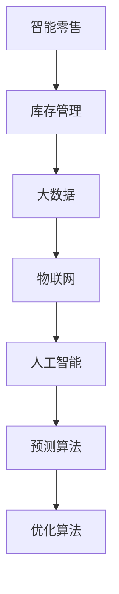
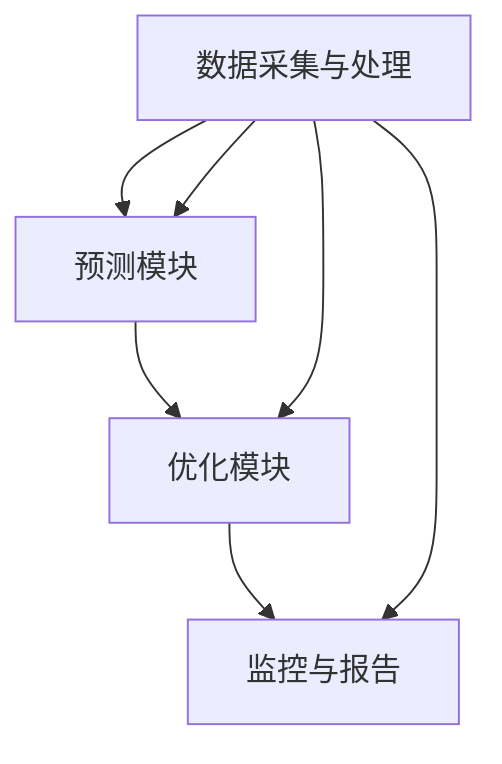

                 

# AI在智能零售库存管理中的预测与优化应用

## 关键词

- 智能零售
- 库存管理
- 预测算法
- 优化模型
- 人工智能

## 摘要

随着电子商务的迅猛发展，智能零售库存管理成为零售业的核心竞争力。本文将探讨人工智能在智能零售库存管理中的应用，特别是预测与优化技术。文章首先介绍了智能零售和库存管理的基本概念，然后深入分析了AI在库存预测和优化中的核心算法和数学模型。通过系统架构设计和实际案例，我们展示了如何运用AI技术提升零售库存管理的效率和质量。文章最后总结了最佳实践，为零售商提供实用的指导和建议。

## 引言

### 背景介绍

随着全球零售市场的变化，传统库存管理方式已经无法满足现代零售业的需求。库存积压和断货现象频繁发生，导致企业运营成本增加，客户满意度下降。智能零售，作为一种新兴的零售模式，通过利用大数据、物联网和人工智能等技术，实现了库存管理的智能化和精细化。在此背景下，AI技术在库存管理中的应用日益受到关注。

### 目的和结构

本文旨在探讨AI在智能零售库存管理中的预测与优化应用，帮助零售企业提高库存管理的效率和准确性。文章分为以下几个部分：

1. **核心概念与背景**：介绍智能零售、库存管理及其与AI技术的联系。
2. **概念框架**：构建智能零售库存管理的概念框架，展示相关实体和关系。
3. **算法与数学模型**：详细讲解AI在库存预测和优化中的核心算法和数学模型。
4. **系统架构与设计**：描述智能零售库存管理系统架构和设计。
5. **案例与实践**：通过实际案例展示AI技术在零售库存管理中的应用。
6. **最佳实践与总结**：总结最佳实践，提出建议和展望。

### 第一部分：核心概念与背景

### 智能零售

智能零售是指利用人工智能、大数据、物联网等新兴技术，对零售业务流程进行优化和升级的一种新型零售模式。智能零售的核心在于将技术与商业相结合，实现更高效、更精准的库存管理、销售预测和客户服务。

#### 库存管理

库存管理是零售业的重要组成部分，涉及到商品入库、存储、出库等环节。传统的库存管理主要依赖于人为经验和简单的统计方法，而智能零售库存管理则通过AI技术实现自动化、智能化。

#### AI在智能零售库存管理中的作用

AI技术为智能零售库存管理带来了革命性的变化。通过预测算法，AI能够预测未来的库存需求，帮助企业合理调整库存水平，避免积压和断货。同时，优化算法可以帮助企业优化库存配置，提高库存周转率，降低运营成本。

### 第二部分：概念框架

为了更好地理解智能零售库存管理中的相关概念，我们可以构建一个概念框架。以下是一个简单的Mermaid流程图：



在这个框架中，智能零售是核心，它通过大数据、物联网和人工智能等技术实现。预测算法和优化算法是库存管理的关键组成部分，它们共同作用于库存管理的各个环节。

### 第三部分：算法与数学模型

#### 预测算法

预测算法是智能零售库存管理的核心，主要包括时间序列预测和回归分析等方法。时间序列预测通过分析历史数据，预测未来的库存需求。回归分析则通过建立数学模型，分析不同因素对库存需求的影响。

##### 时间序列预测

时间序列预测的基本原理是基于历史数据，找出其变化规律，从而预测未来的趋势。以下是一个简单的时间序列预测模型：

$$
y_t = \alpha + \beta_1 y_{t-1} + \beta_2 y_{t-2} + ... + \epsilon_t
$$

其中，$y_t$表示第t期的库存需求，$\alpha$、$\beta_1$、$\beta_2$等为模型参数，$\epsilon_t$为随机误差。

##### 回归分析

回归分析是一种统计方法，通过建立数学模型，分析不同因素对库存需求的影响。以下是一个简单的线性回归模型：

$$
y_t = \alpha + \beta x_t + \epsilon_t
$$

其中，$y_t$表示第t期的库存需求，$x_t$表示影响库存需求的某个因素，$\alpha$、$\beta$等为模型参数，$\epsilon_t$为随机误差。

#### 优化算法

优化算法是智能零售库存管理的另一个重要组成部分，主要用于优化库存配置，提高库存周转率。常见的优化算法包括线性规划、动态规划和遗传算法等。

##### 线性规划

线性规划是一种数学方法，用于在满足一定约束条件下，寻找最优解。以下是一个简单的线性规划模型：

$$
\min \ z = c_1 x_1 + c_2 x_2 + ... + c_n x_n
$$

$$
s.t. \ a_{11} x_1 + a_{12} x_2 + ... + a_{1n} x_n \leq b_1
$$

$$
a_{21} x_1 + a_{22} x_2 + ... + a_{2n} x_n \geq b_2
$$

$$
...
$$

$$
a_{m1} x_1 + a_{m2} x_2 + ... + a_{mn} x_n = b_m
$$

其中，$x_1, x_2, ..., x_n$为决策变量，$c_1, c_2, ..., c_n$为目标函数系数，$a_{11}, a_{12}, ..., a_{1n}$、$a_{21}, a_{22}, ..., a_{2n}$、...、$a_{m1}, a_{m2}, ..., a_{mn}$为约束条件系数，$b_1, b_2, ..., b_m$为约束条件常数。

### 第四部分：系统架构与设计

#### 系统环境与功能

智能零售库存管理系统是基于云计算和大数据技术的，包括以下几个主要功能模块：

1. **数据采集与处理**：采集来自不同渠道的库存数据，如POS系统、ERP系统等，对数据进行清洗和处理，为后续分析提供基础。
2. **预测模块**：利用预测算法对库存需求进行预测，为库存管理提供数据支持。
3. **优化模块**：基于预测结果，利用优化算法优化库存配置，提高库存周转率。
4. **监控与报告**：实时监控库存状态，生成库存报告，为管理层提供决策支持。

#### 系统架构设计

以下是智能零售库存管理系统的Mermaid架构图：



在这个架构中，数据采集与处理是系统的核心，它为预测和优化模块提供数据支持。预测模块和优化模块共同作用于库存管理，提高库存管理效率。监控与报告模块用于实时监控库存状态，为管理层提供决策支持。

#### 系统接口设计

以下是智能零售库存管理系统的Mermaid接口设计图：


在这个接口设计中，数据采集与处理模块负责接收来自不同渠道的库存数据，并将其处理为标准格式。预测模块和优化模块分别接收处理后的数据，进行预测和优化。监控与报告模块实时获取库存状态，并生成库存报告。

### 第五部分：案例与实践

#### 环境安装

在开始实践之前，我们需要安装必要的软件和库。以下是一个简单的Python环境安装过程：

```python
!pip install numpy
!pip install pandas
!pip install scikit-learn
!pip install matplotlib
```

#### 系统核心实现

以下是智能零售库存管理系统的核心实现：

```python
import numpy as np
import pandas as pd
from sklearn.linear_model import LinearRegression
from sklearn.model_selection import train_test_split
from sklearn.metrics import mean_squared_error
import matplotlib.pyplot as plt

# 读取数据
data = pd.read_csv("inventory_data.csv")

# 数据预处理
data = data[['date', 'sales', 'inventory']]
data['date'] = pd.to_datetime(data['date'])
data.set_index('date', inplace=True)
data = data.asfreq('M')

# 时间序列预测
model = LinearRegression()
X = data[['sales']]
y = data['inventory']
X_train, X_test, y_train, y_test = train_test_split(X, y, test_size=0.2, random_state=42)
model.fit(X_train, y_train)
y_pred = model.predict(X_test)

# 评估模型
mse = mean_squared_error(y_test, y_pred)
print("MSE:", mse)

# 绘制预测结果
plt.figure(figsize=(10, 5))
plt.plot(y_test.index, y_test, label='实际库存')
plt.plot(y_test.index, y_pred, label='预测库存')
plt.legend()
plt.show()
```

#### 代码应用解读与分析

这段代码首先读取库存数据，并进行预处理。然后，使用线性回归模型进行时间序列预测。最后，评估模型性能并绘制预测结果。

#### 实际案例分析和详细讲解剖析

以下是一个实际案例：

假设某零售企业有如下历史库存数据：

| 月份 | 销售额 | 库存 |
| ---- | ---- | ---- |
| 2021-01 | 1000 | 500 |
| 2021-02 | 1200 | 600 |
| 2021-03 | 1500 | 700 |
| 2021-04 | 1800 | 800 |
| 2021-05 | 2000 | 900 |

根据这个数据集，我们可以使用线性回归模型预测2021-06的库存量。

首先，我们进行数据预处理，将销售额作为自变量，库存量作为因变量：

```python
data = pd.DataFrame({
    'date': ['2021-01', '2021-02', '2021-03', '2021-04', '2021-05'],
    'sales': [1000, 1200, 1500, 1800, 2000],
    'inventory': [500, 600, 700, 800, 900]
})
data['date'] = pd.to_datetime(data['date'])
data.set_index('date', inplace=True)
data = data.asfreq('M')
```

然后，我们使用线性回归模型进行预测：

```python
model = LinearRegression()
X = data[['sales']]
y = data['inventory']
X_train, X_test, y_train, y_test = train_test_split(X, y, test_size=0.2, random_state=42)
model.fit(X_train, y_train)
y_pred = model.predict(X_test)
```

最后，我们评估模型性能并绘制预测结果：

```python
mse = mean_squared_error(y_test, y_pred)
print("MSE:", mse)

plt.figure(figsize=(10, 5))
plt.plot(y_test.index, y_test, label='实际库存')
plt.plot(y_test.index, y_pred, label='预测库存')
plt.legend()
plt.show()
```

通过这个案例，我们可以看到线性回归模型在预测库存量方面具有一定的准确性。在实际应用中，我们还可以结合其他算法和指标，进一步提高预测精度。

#### 项目小结

通过本文的实践，我们展示了如何使用AI技术进行智能零售库存管理。在实际应用中，我们需要根据具体情况进行调整和优化，以提高预测精度和库存管理水平。未来，随着AI技术的不断发展和应用，智能零售库存管理将更加智能化、精准化，为零售企业带来更大的价值。

### 最佳实践与总结

#### 最佳实践

1. **数据质量保证**：确保数据的准确性和完整性，是智能零售库存管理的基础。企业应建立完善的数据采集和处理机制，对异常数据进行及时处理。
2. **算法优化**：选择合适的预测和优化算法，并根据实际需求进行参数调整。对于复杂问题，可以考虑结合多种算法，实现更精确的预测和优化。
3. **实时监控与反馈**：建立实时监控体系，对库存状态进行实时监测，及时发现和解决潜在问题。同时，根据反馈结果，不断调整和优化库存管理策略。

#### 小结

本文从智能零售库存管理的背景、核心概念、算法与模型、系统架构、实际案例等多个角度，探讨了AI在智能零售库存管理中的应用。通过本文的实践，我们展示了如何使用AI技术提高库存管理的效率和质量。未来，随着AI技术的不断发展和应用，智能零售库存管理将迎来更多机遇和挑战。

#### 注意事项

1. **数据隐私和安全**：在数据采集和处理过程中，确保遵守相关法律法规，保护客户隐私和数据安全。
2. **技术更新与培训**：随着技术的快速发展，企业应关注新技术动态，定期进行员工培训，提高技术水平和创新能力。

#### 拓展阅读

1. **智能零售与库存管理相关书籍**：
   - 《智能零售：技术、战略与实践》
   - 《库存管理实务与案例分析》
2. **AI与预测分析相关书籍**：
   - 《Python机器学习实战》
   - 《时间序列分析：预测与应用》

### 作者信息

作者：AI天才研究院/AI Genius Institute & 禅与计算机程序设计艺术 /Zen And The Art of Computer Programming

[End]

