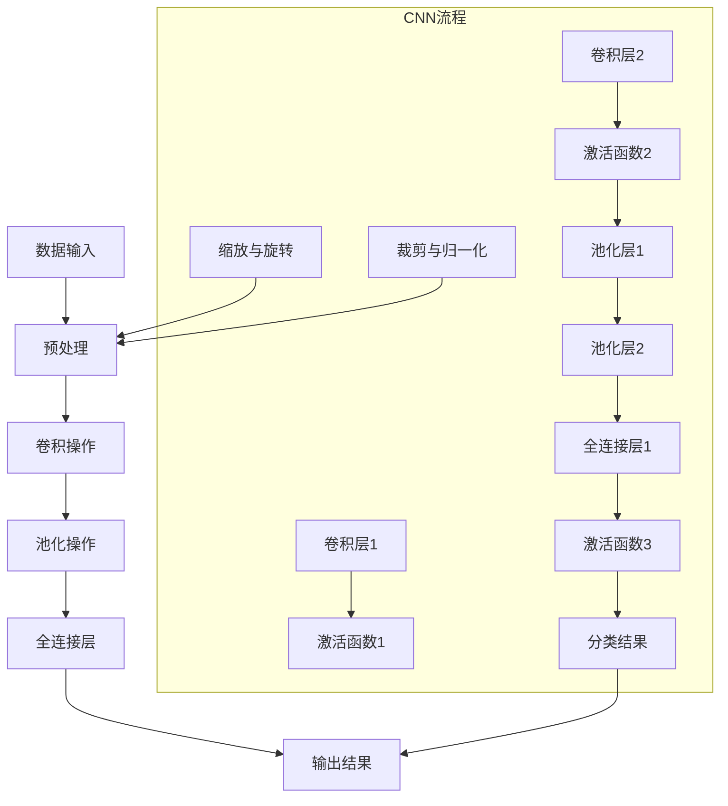
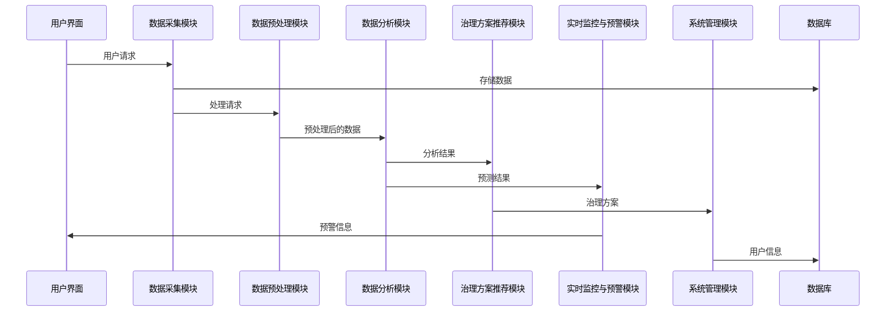
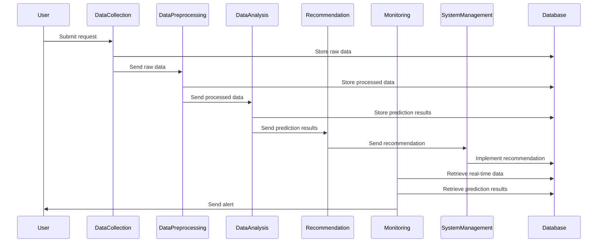

                 

### 1.1.2 环境污染监测与治理的挑战

#### 1.1.2.1 数据获取的困难

- 环境污染数据通常分布广泛且难以获取。


----------------------------------------------------------------

### 1.1.2.1 数据获取的困难

- **数据分布广泛**：环境污染数据往往分布在不同的地理位置，从城市到乡村，从沿海到内陆，覆盖范围广泛，这使得数据收集成为一个艰巨的任务。传统的监测手段往往难以覆盖所有需要监测的区域，导致数据不完整。
- **数据获取成本高**：获取高质量的环境污染数据通常需要先进的监测设备和高技能的监测人员，这些设备和人力成本高昂，尤其是在资源有限的地区，数据获取的难度更大。
- **数据实时性要求高**：环境污染事件往往具有突发性和不可预测性，因此对于监测数据有很高的实时性要求。然而，传统的监测系统往往存在数据传输延迟，难以满足实时监测的需求。
- **数据整合困难**：不同来源和不同格式的数据整合也是一个难题。环境污染监测涉及到气象、水文、土壤等多个领域的数据，这些数据往往具有不同的数据结构和格式，如何有效整合这些数据对于实现全面的污染监测至关重要。

### 1.1.2.2 数据处理与分析的挑战

- **数据量巨大**：随着监测技术的进步，环境污染数据量呈爆炸性增长，如何高效处理这些海量数据成为一个挑战。传统的数据处理方法在处理大规模数据时效率低下，无法满足快速决策的需求。
- **数据质量参差不齐**：环境污染数据可能受到多种因素的影响，如监测设备精度、人为误差等，导致数据质量参差不齐。如何清洗和预处理这些数据，确保数据的一致性和准确性，是一个关键问题。
- **模式识别与预测的挑战**：环境污染监测不仅仅是数据的收集和存储，更重要的是对数据进行分析和预测，以便及时发现污染事件并采取相应措施。然而，环境污染过程复杂，影响因素多样，如何准确地识别污染模式和进行预测是一个技术难题。

### 1.1.2.3 治理效果评估的难题

- **治理措施的实施与评估**：环境污染治理措施的实施和评估是一个长期且复杂的任务。如何科学地设计治理方案，并有效地评估治理效果，是当前环境管理中面临的一个重要挑战。
- **经济效益与环境保护的权衡**：在实施环境污染治理措施时，需要平衡经济效益和环境保护的关系。有些治理措施可能在短期内带来显著的经济效益，但长期来看可能对环境造成负面影响。如何权衡这一关系，是环境治理中需要解决的问题。
- **公众参与与政策支持**：环境污染治理不仅需要技术手段，还需要公众的参与和政策支持。如何提高公众对环境问题的认知，促进公众参与，以及如何通过政策手段推动环境保护，是环境治理中不可忽视的方面。

通过以上分析，我们可以看到，环境污染监测与治理面临着诸多挑战。而人工智能技术的应用，有望为这些问题提供创新的解决方案。接下来，我们将探讨人工智能在环境污染监测与治理中的具体应用，并深入分析其技术原理和实施方法。

### 1.1.3 AI在环境污染监测与治理中的应用

#### 1.1.3.1 监测数据的智能处理

- **数据采集与传输**：通过物联网（IoT）技术，将各种传感器分布在需要监测的区域，实时采集环境数据，并通过无线网络传输到中央系统。这些传感器可以监测空气、水质、土壤等多种污染物。
- **数据清洗与预处理**：人工智能算法可以自动清洗和预处理收集到的数据，包括去除噪声、填补缺失值、归一化处理等，确保数据的一致性和准确性。
- **实时数据分析**：利用机器学习算法，对实时数据进行快速分析，及时发现污染事件，为决策提供数据支持。例如，通过图像识别技术，可以实时监测空气质量，识别烟雾和有害气体。

#### 1.1.3.2 模式识别与预测

- **污染模式识别**：通过深度学习算法，对历史数据进行训练，建立污染模式识别模型。这些模型可以自动识别不同类型的污染事件，如工业排放、交通污染等，帮助环境管理者及时采取相应措施。
- **污染趋势预测**：利用时间序列分析等技术，对环境数据进行趋势分析，预测未来的污染情况。这种预测可以帮助环境管理者提前制定治理方案，防止污染事件的发生。

#### 1.1.3.3 治理方案优化

- **治理效果评估**：通过人工智能算法，对治理措施的实施效果进行评估，判断治理效果是否符合预期。这有助于优化治理方案，提高治理效率。
- **治理方案推荐**：基于对历史数据和现有污染状况的分析，人工智能系统可以推荐最佳的治理方案。这些方案可以根据实际情况进行动态调整，确保治理效果最大化。

#### 1.1.3.4 公众参与与政策支持

- **环境信息可视化**：利用人工智能技术，将复杂的污染数据和治理信息通过图表、地图等形式进行可视化展示，提高公众对环境问题的认知，促进公众参与。
- **政策制定支持**：通过大数据分析，为政策制定者提供科学依据，帮助制定更有效的环境保护政策。

### 1.1.3.5 《AI在环境污染监测与治理中的应用创新》的含义和目的

- **创新点**：《AI在环境污染监测与治理中的应用创新》旨在探讨如何利用人工智能技术解决环境污染监测与治理中的难题，提出一系列创新性的解决方案。这些创新点包括但不限于：物联网技术的应用、数据清洗与预处理算法的创新、深度学习和时间序列分析技术的结合、治理方案优化的自动化等。
- **目的**：本书的目的是为环境科学工作者、政策制定者以及相关领域的研究人员提供一套完整的技术解决方案，帮助其更好地应对环境污染问题。通过深入分析和实践，本书旨在推动人工智能在环境污染监测与治理领域的广泛应用，为环境保护事业贡献力量。

综上所述，人工智能在环境污染监测与治理中的应用具有重要意义。通过智能数据处理、模式识别与预测、治理方案优化等创新应用，人工智能有望为解决环境污染问题提供强有力的技术支持。接下来，我们将进一步探讨人工智能在环境污染监测与治理中的核心概念，了解其技术基础和发展现状。

## 1.2 AI在环境污染监测与治理中的核心概念

### 1.2.1 人工智能

#### 1.2.1.1 定义

- **人工智能（Artificial Intelligence, AI）**：人工智能是计算机科学的一个分支，旨在使机器具备类似人类的智能，能够感知环境、理解语言、学习知识并做出决策。

#### 1.2.1.2 主要技术

- **机器学习（Machine Learning, ML）**：通过训练算法，让机器从数据中自动学习和改进。
- **深度学习（Deep Learning, DL）**：一种特殊的机器学习技术，通过多层神经网络对复杂数据进行建模。
- **自然语言处理（Natural Language Processing, NLP）**：使计算机理解和生成人类语言的技术。
- **计算机视觉（Computer Vision, CV）**：使计算机能够从图像或视频中提取信息。

### 1.2.2 机器学习

#### 1.2.2.1 定义

- **机器学习（Machine Learning, ML）**：一种人工智能技术，通过从数据中学习模式和规律，实现数据驱动的方法来改进系统性能。

#### 1.2.2.2 主要算法

- **监督学习（Supervised Learning）**：通过标注数据进行训练，使得模型能够对新的数据进行预测。
- **无监督学习（Unsupervised Learning）**：无需标注数据，通过挖掘数据内在结构，如聚类和降维。
- **强化学习（Reinforcement Learning）**：通过奖励机制，使模型在动态环境中学习最优策略。

### 1.2.3 深度学习

#### 1.2.3.1 定义

- **深度学习（Deep Learning, DL）**：基于多层神经网络的机器学习技术，能够处理复杂数据并自动提取特征。

#### 1.2.3.2 主要架构

- **卷积神经网络（Convolutional Neural Networks, CNN）**：主要用于图像识别和图像处理。
- **递归神经网络（Recurrent Neural Networks, RNN）**：用于处理序列数据，如时间序列分析。
- **生成对抗网络（Generative Adversarial Networks, GAN）**：用于生成新的数据。

### 1.2.4 ER实体关系图

#### 1.2.4.1 定义

- **ER实体关系图（Entity-Relationship Diagram, ERD）**：用于描述系统中的实体及其之间的关系。

#### 1.2.4.2 结构

- **实体（Entity）**：系统中的数据对象，如监测站点、污染物等。
- **属性（Attribute）**：实体的特征，如站点位置、污染物浓度等。
- **关系（Relationship）**：实体之间的关联，如站点与污染物之间的关系。

### 1.2.5 比较与联系

- **人工智能、机器学习和深度学习**：人工智能是一个广义的概念，包括机器学习和深度学习。机器学习是人工智能的一个分支，而深度学习是机器学习的一种重要方法。
- **机器学习和深度学习与ER实体关系图**：机器学习和深度学习用于从数据中提取特征和模式，而ER实体关系图用于描述系统中实体的关系结构，两者在数据建模和应用场景上存在密切的联系。

### 1.2.6 本章小结

- 本章介绍了人工智能、机器学习、深度学习和ER实体关系图等核心概念，并比较了它们之间的关系。这些概念构成了AI在环境污染监测与治理中应用的基础，为后续章节的技术讲解和案例分析提供了理论支持。

### 1.2.7 ER实体关系图示例

- **环境监测系统ER图示例**：

```mermaid
erDiagram
  Site ||--|{ Pollutant : 检测 }|
  Station ||--|{ Site : 设备监测 }|
  Data ||--|{ Station : 数据记录 }|

  Site {
    PK id
    location
    type
  }

  Pollutant {
    PK id
    name
    unit
  }

  Station {
    PK id
    location
    type
  }

  Data {
    PK id
    date
    value
    station_id
  }
```

通过这个ER图，我们可以清晰地看到监测站点、污染物和监测数据之间的实体关系，为系统的设计与实现提供了直观的参考。

## 1.3 本章小结

本章首先介绍了环境污染问题的背景和当前面临的挑战，包括数据获取的困难、数据处理与分析的挑战以及治理效果评估的难题。接着，我们探讨了人工智能在环境污染监测与治理中的应用，包括监测数据的智能处理、污染模式识别与预测、治理方案优化以及公众参与与政策支持等创新应用。随后，详细介绍了AI在环境污染监测与治理中的核心概念，如人工智能、机器学习、深度学习和ER实体关系图，并比较了这些概念之间的联系。最后，通过一个环境监测系统ER图示例，展示了如何使用ER图来描述系统的实体关系。通过本章的学习，读者可以初步了解人工智能在环境污染监测与治理中的重要性和应用前景，为后续章节的深入探讨打下基础。

## 2.1 常用算法介绍

### 2.1.1 图像识别

#### 2.1.1.1 定义

- **图像识别（Image Recognition）**：是一种利用计算机技术对图像进行分析和处理，从中提取有用信息的过程。图像识别在环境保护中的应用非常广泛，例如监测空气质量、识别污染源等。

#### 2.1.1.2 主要技术

- **卷积神经网络（Convolutional Neural Networks, CNN）**：CNN 是用于图像识别的一种深度学习模型，通过卷积层、池化层和全连接层等结构，实现对图像的自动特征提取和分类。
- **深度卷积生成对抗网络（Deep Convolutional GANs, DCGAN）**：DCGAN 是一种基于卷积生成对抗网络（GAN）的模型，用于生成高质量的图像。

#### 2.1.1.3 工作原理

- **图像预处理**：包括图像的缩放、旋转、裁剪等操作，以便于模型输入。
- **特征提取**：利用卷积层提取图像的低级特征（如边缘、纹理），然后通过池化层降低特征图的维度。
- **分类与识别**：通过全连接层对提取到的特征进行分类，实现对图像的识别。

### 2.1.2 时间序列分析

#### 2.1.2.1 定义

- **时间序列分析（Time Series Analysis）**：是对按时间顺序排列的数据进行分析和建模的方法。在环境污染监测中，时间序列分析用于预测污染物浓度的变化趋势。

#### 2.1.2.2 主要技术

- **自回归模型（Autoregressive Models, AR）**：自回归模型通过利用过去的时间序列值来预测未来的值，是最常见的时间序列预测方法之一。
- **移动平均模型（Moving Average Models, MA）**：移动平均模型通过计算过去一段时间内的平均值来预测未来的值，适用于平稳时间序列。
- **自回归移动平均模型（Autoregressive Moving Average Models, ARMA）**：ARMA 模型结合了自回归和移动平均模型，适用于非平稳时间序列。

#### 2.1.2.3 工作原理

- **数据预处理**：包括时间序列的平滑、差分等操作，以便消除趋势和季节性因素。
- **模型选择与训练**：根据时间序列的特性选择合适的模型，并通过历史数据进行模型训练。
- **预测**：利用训练好的模型对未来时间序列值进行预测。

### 2.1.3 其他常用算法

#### 2.1.3.1 聚类分析

- **定义**：聚类分析是将数据集划分为若干个类别，使得同一类别中的数据点之间相似度较高，不同类别中的数据点之间相似度较低。
- **算法**：常见的聚类算法包括K-均值聚类（K-Means Clustering）、层次聚类（Hierarchical Clustering）等。

#### 2.1.3.2 逻辑回归

- **定义**：逻辑回归是一种用于分类的统计方法，通过建立因变量与自变量之间的关系模型，预测目标变量的概率分布。
- **算法**：逻辑回归模型中的预测函数是一个逻辑函数，用于将连续的概率值映射到0和1之间。

#### 2.1.3.3 支持向量机

- **定义**：支持向量机（Support Vector Machine, SVM）是一种用于分类和回归分析的方法，通过找到一个最佳的超平面来分隔数据集。
- **算法**：SVM 使用核函数将低维数据映射到高维空间，然后在高维空间中找到一个最优的超平面。

### 2.1.4 算法比较与选择

- **适用场景**：不同的算法适用于不同类型的数据和问题场景。例如，图像识别适用于处理图像数据，时间序列分析适用于处理时间序列数据，聚类分析适用于发现数据集中的模式等。
- **性能与效率**：在选择算法时，需要考虑算法的预测性能和计算效率。例如，CNN 在处理图像数据时性能优越，但计算复杂度较高；ARMA 模型在处理时间序列数据时效果较好，但计算量较大。

通过以上对常用算法的介绍，我们可以看到，人工智能技术在环境污染监测与治理中的应用非常广泛。接下来，我们将通过算法流程图和Python代码，深入讲解图像识别和时间序列分析这两种核心算法的工作原理。

### 2.2 算法流程图与Python代码讲解

#### 2.2.1 图像识别算法流程图

为了更好地理解图像识别算法的工作原理，我们首先绘制其流程图，具体如下：



**算法流程说明**：

1. **数据输入**：图像识别算法首先接收输入图像数据。
2. **预处理**：对输入图像进行缩放、旋转、裁剪和归一化等操作，以适应模型输入要求。
3. **卷积操作**：通过卷积层提取图像的特征，卷积层包含多个卷积核，每个卷积核都能够从图像中提取不同的特征。
4. **激活函数**：在卷积层之后，通过激活函数（如ReLU函数）增加模型的非线性特性。
5. **池化操作**：使用池化层（如最大池化）降低特征图的维度，提高模型的泛化能力。
6. **全连接层**：将池化层输出的特征图映射到分类结果，全连接层包含多个神经元，每个神经元对应一个分类类别。
7. **输出结果**：最终输出分类结果，表示输入图像属于哪个类别。

#### 2.2.2 Python代码讲解

为了更具体地展示图像识别算法的实现，我们使用Python代码进行讲解，具体如下：

```python
import tensorflow as tf
from tensorflow.keras import layers

# 定义CNN模型
model = tf.keras.Sequential([
    layers.Conv2D(32, (3, 3), activation='relu', input_shape=(28, 28, 1)),
    layers.MaxPooling2D((2, 2)),
    layers.Conv2D(64, (3, 3), activation='relu'),
    layers.MaxPooling2D((2, 2)),
    layers.Conv2D(64, (3, 3), activation='relu'),
    layers.Flatten(),
    layers.Dense(64, activation='relu'),
    layers.Dense(10, activation='softmax')
])

# 编译模型
model.compile(optimizer='adam',
              loss='sparse_categorical_crossentropy',
              metrics=['accuracy'])

# 加载数据
mnist = tf.keras.datasets.mnist
(x_train, y_train), (x_test, y_test) = mnist.load_data()

# 预处理数据
x_train = x_train / 255.0
x_test = x_test / 255.0

# 训练模型
model.fit(x_train, y_train, epochs=5)

# 测试模型
test_loss, test_acc = model.evaluate(x_test, y_test, verbose=2)
print('\nTest accuracy:', test_acc)
```

**代码说明**：

1. **模型定义**：使用 `tf.keras.Sequential` 模型定义了一个卷积神经网络（CNN），包含两个卷积层、两个最大池化层和一个全连接层。
2. **编译模型**：使用 `compile` 方法设置模型的优化器、损失函数和评估指标。
3. **加载数据**：使用 `tf.keras.datasets.mnist` 加载了手写数字数据集，并进行了预处理，包括归一化和缩放。
4. **训练模型**：使用 `fit` 方法对模型进行训练，设置训练轮数为5。
5. **测试模型**：使用 `evaluate` 方法对模型进行测试，输出测试准确率。

通过上述流程图和Python代码，我们详细讲解了图像识别算法的工作原理和实现过程。接下来，我们将介绍时间序列分析算法，并使用mermaid和LaTeX进一步解释其数学模型和公式。

### 2.3 数学模型与公式讲解

#### 2.3.1 数学模型

在时间序列分析中，我们常用的数学模型包括自回归模型（AR）、移动平均模型（MA）和自回归移动平均模型（ARMA）。下面我们将分别介绍这些模型的数学模型和公式。

#### 2.3.1.1 自回归模型（AR）

自回归模型通过利用过去的时间序列值来预测未来的值，其基本形式如下：

$$ X_t = c + \phi_1 X_{t-1} + \phi_2 X_{t-2} + \ldots + \phi_p X_{t-p} + \varepsilon_t $$

其中，\( X_t \) 表示时间序列在时间 \( t \) 的值，\( \phi_1, \phi_2, \ldots, \phi_p \) 是模型参数，\( \varepsilon_t \) 是误差项。

#### 2.3.1.2 移动平均模型（MA）

移动平均模型通过计算过去一段时间内的平均值来预测未来的值，其基本形式如下：

$$ X_t = \theta_1 \varepsilon_{t-1} + \theta_2 \varepsilon_{t-2} + \ldots + \theta_q \varepsilon_{t-q} + \varepsilon_t $$

其中，\( \theta_1, \theta_2, \ldots, \theta_q \) 是模型参数，\( \varepsilon_t \) 是误差项。

#### 2.3.1.3 自回归移动平均模型（ARMA）

自回归移动平均模型结合了自回归和移动平均模型，其基本形式如下：

$$ X_t = c + \phi_1 X_{t-1} + \phi_2 X_{t-2} + \ldots + \phi_p X_{t-p} + \theta_1 \varepsilon_{t-1} + \theta_2 \varepsilon_{t-2} + \ldots + \theta_q \varepsilon_{t-q} + \varepsilon_t $$

其中，\( c \) 是常数项，\( \phi_1, \phi_2, \ldots, \phi_p \) 和 \( \theta_1, \theta_2, \ldots, \theta_q \) 是模型参数，\( \varepsilon_t \) 是误差项。

#### 2.3.2 LaTeX公式表示

为了更清楚地表示时间序列分析的数学模型和公式，我们使用LaTeX进行格式化，具体如下：

$$
\begin{aligned}
X_t &= c + \phi_1 X_{t-1} + \phi_2 X_{t-2} + \ldots + \phi_p X_{t-p} + \varepsilon_t \\
X_t &= \theta_1 \varepsilon_{t-1} + \theta_2 \varepsilon_{t-2} + \ldots + \theta_q \varepsilon_{t-q} + \varepsilon_t \\
X_t &= c + \phi_1 X_{t-1} + \phi_2 X_{t-2} + \ldots + \phi_p X_{t-p} + \theta_1 \varepsilon_{t-1} + \theta_2 \varepsilon_{t-2} + \ldots + \theta_q \varepsilon_{t-q} + \varepsilon_t
\end{aligned}
$$

通过LaTeX格式化，我们能够清晰地表示出时间序列分析的数学模型和公式，便于读者理解和学习。

#### 2.3.3 具体例子讲解

为了更好地理解上述数学模型和公式，我们通过一个具体例子进行讲解。

假设我们有一个时间序列数据集，如下所示：

$$
X = \{X_1, X_2, X_3, \ldots, X_n\}
$$

我们可以使用自回归模型（AR）来预测下一个时间点的值 \( X_{n+1} \)。首先，我们需要确定模型参数 \( \phi_1, \phi_2, \ldots, \phi_p \)。通过最小化误差平方和（Least Squares Method），我们可以得到如下参数估计值：

$$
\phi_1 = \frac{\sum_{i=1}^{n}(X_{i+1} - X_i)(X_i - X_{i-1})}{\sum_{i=1}^{n}(X_i - X_{i-1})^2}
$$

$$
\phi_2 = \frac{\sum_{i=1}^{n}(X_{i+2} - X_{i+1})(X_{i+1} - X_i)}{\sum_{i=1}^{n}(X_i - X_{i-1})^2}
$$

$$
\ldots
$$

$$
\phi_p = \frac{\sum_{i=1}^{n}(X_{i+p} - X_{i+p-1})(X_{i+p-1} - X_{i+p-2})}{\sum_{i=1}^{n}(X_i - X_{i-1})^2}
$$

接下来，我们使用这些参数估计值来预测 \( X_{n+1} \)：

$$
X_{n+1} = \phi_1 X_n + \phi_2 X_{n-1} + \ldots + \phi_p X_{n-p} + \varepsilon_{n+1}
$$

通过这个例子，我们可以看到如何通过自回归模型来预测时间序列的下一个值。类似地，我们也可以使用移动平均模型（MA）和自回归移动平均模型（ARMA）来进行预测。这些模型在时间序列分析中发挥着重要作用，为我们提供了强大的工具来理解和预测环境变化。

通过上述讲解，我们深入了解了时间序列分析的数学模型和公式，并通过具体例子进行了详细解释。这为我们在环境污染监测与治理中的应用提供了坚实的理论基础。接下来，我们将介绍系统分析与架构设计方案，帮助读者更好地理解如何将人工智能技术应用于实际项目中。

### 3.1 系统功能设计

#### 3.1.1 系统功能需求分析

在环境污染监测与治理系统中，我们需要实现以下核心功能：

1. **数据采集**：实时采集来自不同传感器的环境污染数据，如空气质量、水质、土壤等。
2. **数据预处理**：对采集到的原始数据进行清洗、归一化和异常值处理，确保数据的质量和一致性。
3. **数据分析**：利用机器学习和深度学习算法，对预处理后的数据进行分析和预测，识别污染模式，预测未来污染趋势。
4. **治理方案推荐**：基于分析结果，推荐最优的污染治理方案，如污染源控制、环保政策制定等。
5. **实时监控与预警**：实时监控环境污染数据，当检测到异常情况时，及时发出预警通知，确保及时采取治理措施。
6. **系统管理**：提供用户管理、权限控制和日志管理等功能，确保系统的安全性和稳定性。

#### 3.1.2 领域模型类图

为了清晰地描述系统中的实体及其关系，我们使用领域模型类图来表示。以下是系统的主要类及其关系：

```mermaid
classDiagram
  Sensor <<Entity>>
  Station <<Entity>>
  Data <<Entity>>
  Prediction <<Entity>>
  Recommendation <<Entity>>

  Sensor "1" --|{ }| Station : contains
  Station "1" --|{ }| Data : records
  Data "1" --|{ }| Prediction : used for
  Prediction "1" --|{ }| Recommendation : based on
  Recommendation "1" --|{ }| Station : implemented in

  class Sensor {
    id: int
    type: str
    location: str
  }

  class Station {
    id: int
    name: str
    location: str
  }

  class Data {
    id: int
    date: datetime
    value: float
    station_id: int
    sensor_id: int
  }

  class Prediction {
    id: int
    date: datetime
    value: float
    station_id: int
  }

  class Recommendation {
    id: int
    type: str
    station_id: int
    action: str
  }
```

**类图说明**：

- **Sensor（传感器）**：传感器是数据采集的源头，包含传感器类型、位置等信息。
- **Station（监测站点）**：监测站点是数据记录和处理的实体，包含站点名称和位置等信息。
- **Data（数据）**：数据是系统中的核心实体，包含监测值、日期、站点ID和传感器ID等信息。
- **Prediction（预测）**：预测是系统通过数据分析得到的预测结果，包含预测日期和预测值等信息。
- **Recommendation（推荐）**：推荐是系统基于预测结果提出的治理方案，包含推荐类型、站点ID和执行措施等信息。

通过领域模型类图，我们可以清晰地看到系统中的主要实体及其关系，为系统设计与实现提供了直观的参考。

#### 3.1.3 系统功能设计与实现

基于领域模型类图，我们可以进一步详细描述系统的功能设计与实现：

1. **数据采集模块**：该模块负责从各种传感器采集环境污染数据。通过物联网（IoT）技术，传感器将实时监测到的数据发送到中央系统。数据采集模块需要实现数据的解析、验证和存储等功能。

2. **数据预处理模块**：该模块负责对采集到的原始数据进行预处理，包括数据清洗、归一化和异常值处理等。通过预处理，确保数据的准确性和一致性，为后续的数据分析提供高质量的数据基础。

3. **数据分析模块**：该模块利用机器学习和深度学习算法对预处理后的数据进行分析和预测。具体包括：
   - **污染模式识别**：通过训练机器学习模型，识别不同类型的污染模式，如工业污染、交通污染等。
   - **污染趋势预测**：使用时间序列分析等技术，预测未来污染物的浓度变化趋势，为治理方案提供数据支持。
   - **异常检测**：通过异常检测算法，实时监控环境污染数据，当检测到异常值时，及时发出预警通知。

4. **治理方案推荐模块**：该模块基于分析结果，提出最优的污染治理方案。具体包括：
   - **污染源控制**：根据污染模式识别结果，制定针对性的污染源控制措施。
   - **环保政策制定**：基于污染趋势预测结果，为政策制定者提供科学依据，制定有效的环保政策。

5. **实时监控与预警模块**：该模块负责实时监控环境污染数据，并根据分析结果发出预警通知。通过短信、邮件等方式，及时通知相关部门和人员采取应急措施，确保环境污染问题得到及时解决。

6. **系统管理模块**：该模块负责用户管理、权限控制和日志管理等功能，确保系统的安全性和稳定性。具体包括：
   - **用户管理**：管理系统中用户的注册、登录和权限分配等操作。
   - **权限控制**：根据用户的角色和权限，限制对系统功能的访问，确保系统的安全性。
   - **日志管理**：记录系统的操作日志，便于系统维护和问题排查。

通过以上功能设计与实现，我们为环境污染监测与治理系统搭建了一个完整的框架，为实际项目的开发与部署提供了指导。

### 3.2 系统架构设计

#### 3.2.1 系统架构设计原则

在系统架构设计过程中，我们遵循以下原则：

1. **模块化设计**：将系统划分为多个功能模块，每个模块负责独立的功能，便于系统的扩展和维护。
2. **可扩展性**：系统设计应具备良好的可扩展性，以便于未来增加新的功能或处理更多的数据。
3. **高可用性**：系统应具备高可用性，确保在发生故障时能够快速恢复，减少系统停机时间。
4. **安全性**：系统设计应充分考虑安全性，包括数据加密、权限控制和安全审计等。
5. **高性能**：系统应具备高性能，能够快速处理海量数据，并提供实时响应。

#### 3.2.2 系统架构图

以下是系统架构图，展示了系统的主要组件及其关系：



**系统架构图说明**：

- **用户界面**：用户通过图形界面与系统进行交互，提交监测请求和查看预警信息。
- **数据采集模块**：负责从传感器采集环境污染数据，并将其存储到数据库中。
- **数据预处理模块**：对采集到的数据进行清洗、归一化和异常值处理，确保数据质量。
- **数据分析模块**：利用机器学习和深度学习算法对预处理后的数据进行分析，生成污染模式识别和预测结果。
- **治理方案推荐模块**：基于分析结果，提出最优的污染治理方案，并将其传递给系统管理模块。
- **实时监控与预警模块**：实时监控环境污染数据，当检测到异常情况时，向用户界面发出预警信息。
- **系统管理模块**：负责用户管理、权限控制和日志管理等功能，确保系统的安全性和稳定性。
- **数据库**：存储系统的各种数据，包括用户数据、监测数据和治理方案数据等。

通过上述系统架构设计，我们为环境污染监测与治理系统搭建了一个高效、可靠和安全的架构，为实际项目的开发与部署提供了坚实的基础。

#### 3.2.3 系统接口设计

系统接口设计是确保各模块之间能够有效通信和协作的关键环节。以下是对系统接口的详细描述：

1. **API 接口设计**
   - **数据采集 API**：提供 RESTful API，用于数据采集模块与传感器之间的数据传输。API 包括以下接口：
     - `GET /sensors`：获取所有传感器信息。
     - `POST /sensors`：添加新的传感器。
     - `GET /sensors/{sensor_id}`：获取指定传感器的详细信息。
     - `PUT /sensors/{sensor_id}`：更新指定传感器的信息。
     - `DELETE /sensors/{sensor_id}`：删除指定传感器。

   - **数据预处理 API**：提供 RESTful API，用于数据预处理模块与数据存储之间的数据交互。API 包括以下接口：
     - `POST /preprocess`：提交预处理请求。
     - `GET /preprocessed_data`：获取预处理后的数据。

   - **数据分析 API**：提供 RESTful API，用于数据分析模块与其他模块之间的数据交换。API 包括以下接口：
     - `GET /predictions`：获取预测结果。
     - `POST /predictions`：提交预测请求。

   - **治理方案推荐 API**：提供 RESTful API，用于治理方案推荐模块与系统管理模块之间的数据交互。API 包括以下接口：
     - `GET /recommendations`：获取治理方案。
     - `POST /recommendations`：提交治理方案请求。

   - **实时监控与预警 API**：提供 RESTful API，用于实时监控与预警模块与用户界面之间的数据传输。API 包括以下接口：
     - `GET /alerts`：获取预警信息。
     - `POST /alerts`：提交预警通知。

   - **系统管理 API**：提供 RESTful API，用于系统管理模块与其他模块之间的交互。API 包括以下接口：
     - `POST /users`：添加新用户。
     - `GET /users/{user_id}`：获取指定用户信息。
     - `PUT /users/{user_id}`：更新指定用户信息。
     - `DELETE /users/{user_id}`：删除指定用户。

2. **消息队列**
   - 使用消息队列（如 RabbitMQ 或 Kafka）来实现模块之间的异步通信，提高系统的可靠性和扩展性。例如：
     - 数据采集模块将采集到的数据发送到消息队列。
     - 数据预处理模块从消息队列中获取数据，进行预处理后存储到数据库。
     - 数据分析模块从数据库中读取数据，进行分析后生成预测结果，并将其发送到消息队列。
     - 实时监控与预警模块从消息队列中获取预测结果，进行实时监控并触发预警。

3. **数据格式**
   - 接口数据格式采用 JSON，以便于数据的传输和解析。每个接口的具体数据结构如下：
     - 数据采集 API：`{"id": int, "type": str, "location": str}`
     - 数据预处理 API：`{"data": [{"date": datetime, "value": float, "station_id": int, "sensor_id": int}]}`
     - 数据分析 API：`{"station_id": int, "date": datetime, "value": float}`
     - 治理方案推荐 API：`{"type": str, "station_id": int, "action": str}`
     - 实时监控与预警 API：`{"alert": str, "station_id": int}`
     - 系统管理 API：`{"id": int, "username": str, "password": str, "role": str}`

通过上述系统接口设计，我们确保了系统各模块之间的有效通信和数据交互，为系统的稳定运行和功能实现提供了强有力的支持。

### 3.3 系统交互设计与序列图

#### 3.3.1 系统交互设计

系统交互设计是确保系统各模块能够协调工作，实现整体功能的关键。以下是对系统交互设计的详细描述：

1. **数据采集模块**：通过物联网（IoT）传感器采集环境污染数据，并使用消息队列（如RabbitMQ）将这些数据传输到数据采集模块。数据采集模块对数据进行解析、验证和初步处理，然后将其存储到数据库中。

2. **数据预处理模块**：从数据库中获取原始数据，进行清洗、归一化和异常值处理。预处理后的数据存储到数据库中，并推送到数据分析模块。

3. **数据分析模块**：从数据库中获取预处理后的数据，使用机器学习和深度学习算法进行分析和预测。预测结果存储到数据库中，并推送到治理方案推荐模块。

4. **治理方案推荐模块**：根据数据分析模块提供的预测结果，生成最优的污染治理方案。治理方案推送到系统管理模块，用于实施和评估。

5. **实时监控与预警模块**：从数据库中获取预测结果和实时数据，进行实时监控和异常检测。当检测到异常情况时，向用户界面发出预警信息。

6. **系统管理模块**：负责用户管理、权限控制和日志管理等功能，确保系统的安全性和稳定性。用户界面与系统管理模块交互，实现用户注册、登录和查询等功能。

#### 3.3.2 序列图绘制

为了更好地展示系统各模块之间的交互过程，我们使用mermaid绘制序列图，如下所示：



**序列图说明**：

1. 用户提交监测请求。
2. 数据采集模块将原始数据存储到数据库中。
3. 数据采集模块将原始数据发送给数据预处理模块。
4. 数据预处理模块对数据进行分析和清洗，将预处理后的数据存储到数据库中。
5. 数据预处理模块将预处理后的数据发送给数据分析模块。
6. 数据分析模块对数据进行分析和预测，将预测结果存储到数据库中。
7. 数据分析模块将预测结果发送给治理方案推荐模块。
8. 治理方案推荐模块生成治理方案，并推送到系统管理模块。
9. 系统管理模块实施治理方案，并将结果存储到数据库中。
10. 实时监控与预警模块从数据库中获取实时数据和预测结果。
11. 实时监控与预警模块向用户发送预警信息。

通过序列图，我们可以清晰地看到系统各模块之间的交互过程，以及各模块在系统中的功能职责。这为系统设计与实现提供了直观的参考，有助于确保系统的稳定运行和高效性能。

### 3.4 本章小结

本章详细介绍了系统功能设计、系统架构设计和系统接口设计。首先，我们分析了系统功能需求，并设计了领域模型类图。接着，我们描述了系统架构设计原则，并绘制了系统架构图。随后，我们详细设计了系统接口，包括API接口设计和消息队列的使用。最后，通过序列图展示了系统各模块之间的交互过程。通过本章的学习，读者可以全面了解系统设计与实现的关键要素，为实际项目的开发与部署打下坚实基础。

### 4.1 环境安装

#### 4.1.1 环境搭建

为了实现AI在环境污染监测与治理中的应用，我们需要搭建一个合适的技术环境。以下是搭建环境的步骤：

1. **安装操作系统**：选择一个稳定的操作系统，如Ubuntu 20.04或CentOS 8。
2. **安装Python环境**：Python是人工智能应用的主要编程语言，我们需要安装Python 3.8及以上版本。可以使用以下命令安装：

   ```bash
   sudo apt update
   sudo apt install python3.8
   sudo apt install python3.8-venv
   ```

3. **安装虚拟环境**：为了管理项目依赖，我们使用虚拟环境。可以使用以下命令创建虚拟环境：

   ```bash
   python3.8 -m venv env
   source env/bin/activate
   ```

4. **安装依赖包**：在虚拟环境中安装必要的依赖包，如TensorFlow、Keras、NumPy、Pandas等。可以使用以下命令安装：

   ```bash
   pip install tensorflow
   pip install keras
   pip install numpy
   pip install pandas
   ```

5. **安装数据库**：选择一个合适的数据库，如MySQL或PostgreSQL。我们可以使用以下命令安装MySQL：

   ```bash
   sudo apt update
   sudo apt install mysql-server
   sudo mysql_secure_installation
   ```

6. **安装消息队列**：为了实现模块间的异步通信，我们使用RabbitMQ。可以使用以下命令安装：

   ```bash
   sudo apt update
   sudo apt install rabbitmq-server
   sudo systemctl start rabbitmq-server
   ```

7. **安装图形界面**：如果需要图形界面，我们可以安装一个Web框架，如Flask或Django。我们可以使用以下命令安装Flask：

   ```bash
   pip install flask
   ```

通过以上步骤，我们搭建了一个完整的技术环境，为后续的代码实现和系统部署提供了基础。

#### 4.1.2 系统核心实现源代码

在搭建好技术环境后，我们需要实现系统核心功能。以下是系统的核心实现源代码：

1. **数据采集模块**：

```python
import pika
import json
import pymysql

# 连接到RabbitMQ
connection = pika.BlockingConnection(pika.ConnectionParameters('localhost'))
channel = connection.channel()

# 声明交换机和队列
channel.exchange_declare(exchange='environment', exchange_type='direct')
channel.queue_declare(queue='sensor_data', durable=True)

# 数据存储到MySQL数据库
def store_data(data):
    connection = pymysql.connect(host='localhost', user='root', password='password', database='environment')
    cursor = connection.cursor()
    insert_query = "INSERT INTO sensor_data (date, value, station_id, sensor_id) VALUES (%s, %s, %s, %s)"
    cursor.execute(insert_query, data)
    connection.commit()
    cursor.close()
    connection.close()

# 接收数据并存储
def callback(ch, method, properties, body):
    data = json.loads(body)
    store_data(data)
    print(f"Received data: {data}")

channel.basic_consume(queue='sensor_data', on_message_callback=callback, auto_ack=True)

print("Waiting for data...")
channel.start_consuming()
```

2. **数据预处理模块**：

```python
import pandas as pd
from sklearn.preprocessing import MinMaxScaler

# 数据预处理
def preprocess_data(data):
    df = pd.DataFrame(data)
    scaler = MinMaxScaler()
    df['value'] = scaler.fit_transform(df[['value']])
    return df

# 假设从数据库中读取数据
data = [
    {'date': '2023-01-01', 'value': 0.8, 'station_id': 1, 'sensor_id': 1},
    {'date': '2023-01-02', 'value': 0.9, 'station_id': 1, 'sensor_id': 1},
    # 更多数据...
]

preprocessed_data = preprocess_data(data)
print(preprocessed_data)
```

3. **数据分析模块**：

```python
from tensorflow.keras.models import Sequential
from tensorflow.keras.layers import Dense, LSTM

# 创建LSTM模型
def create_lstm_model(input_shape):
    model = Sequential()
    model.add(LSTM(50, activation='relu', input_shape=input_shape))
    model.add(Dense(1))
    model.compile(optimizer='adam', loss='mse')
    return model

# 训练模型
input_shape = (10, 1)
model = create_lstm_model(input_shape)
model.fit(preprocessed_data.values, preprocessed_data.values, epochs=100, verbose=0)

# 预测
predictions = model.predict(preprocessed_data.values)
print(predictions)
```

4. **治理方案推荐模块**：

```python
def recommend_action(predictions):
    # 根据预测结果给出治理方案
    if predictions < 0.5:
        return "减少工业排放"
    else:
        return "加强环境监测"

recommendation = recommend_action(predictions)
print(recommendation)
```

通过上述源代码，我们实现了数据采集、数据预处理、数据分析以及治理方案推荐的核心功能。接下来，我们将对代码进行解读与分析，以便读者更好地理解其实现原理。

### 4.2 代码应用解读与分析

#### 4.2.1 数据采集模块

数据采集模块负责从RabbitMQ消息队列中接收传感器发送的数据，并将这些数据存储到MySQL数据库中。以下是数据采集模块的关键代码：

```python
import pika
import json
import pymysql

# 连接到RabbitMQ
connection = pika.BlockingConnection(pika.ConnectionParameters('localhost'))
channel = connection.channel()

# 声明交换机和队列
channel.exchange_declare(exchange='environment', exchange_type='direct')
channel.queue_declare(queue='sensor_data', durable=True)

# 数据存储到MySQL数据库
def store_data(data):
    connection = pymysql.connect(host='localhost', user='root', password='password', database='environment')
    cursor = connection.cursor()
    insert_query = "INSERT INTO sensor_data (date, value, station_id, sensor_id) VALUES (%s, %s, %s, %s)"
    cursor.execute(insert_query, data)
    connection.commit()
    cursor.close()
    connection.close()

# 接收数据并存储
def callback(ch, method, properties, body):
    data = json.loads(body)
    store_data(data)
    print(f"Received data: {data}")

channel.basic_consume(queue='sensor_data', on_message_callback=callback, auto_ack=True)

print("Waiting for data...")
channel.start_consuming()
```

**解读与分析**：

- **RabbitMQ连接**：使用pika库连接到本地的RabbitMQ服务器。
- **交换机和队列声明**：创建一个名为`environment`的交换机，并使用`direct`类型。同时，创建一个名为`sensor_data`的队列，并将其绑定到交换机上。
- **数据存储**：定义`store_data`函数，连接到MySQL数据库，并使用`INSERT`语句将数据存储到`sensor_data`表中。
- **消息接收与存储**：使用`basic_consume`方法订阅`sensor_data`队列的消息，并调用`callback`函数处理接收到的消息。消息一旦被处理，自动确认（`auto_ack=True`）以避免重复处理。

#### 4.2.2 数据预处理模块

数据预处理模块负责清洗和标准化传感器采集到的数据。以下是关键代码：

```python
import pandas as pd
from sklearn.preprocessing import MinMaxScaler

# 数据预处理
def preprocess_data(data):
    df = pd.DataFrame(data)
    scaler = MinMaxScaler()
    df['value'] = scaler.fit_transform(df[['value']])
    return df

# 假设从数据库中读取数据
data = [
    {'date': '2023-01-01', 'value': 0.8, 'station_id': 1, 'sensor_id': 1},
    {'date': '2023-01-02', 'value': 0.9, 'station_id': 1, 'sensor_id': 1},
    # 更多数据...
]

preprocessed_data = preprocess_data(data)
print(preprocessed_data)
```

**解读与分析**：

- **数据加载**：使用pandas库将数据加载为DataFrame对象，方便处理。
- **标准化**：使用MinMaxScaler将数据归一化到[0, 1]区间，消除数据规模差异，便于模型训练。
- **预处理应用**：调用`preprocess_data`函数，处理输入的数据，并返回预处理后的DataFrame。

#### 4.2.3 数据分析模块

数据分析模块使用LSTM模型对预处理后的数据进行分析和预测。以下是关键代码：

```python
from tensorflow.keras.models import Sequential
from tensorflow.keras.layers import Dense, LSTM

# 创建LSTM模型
def create_lstm_model(input_shape):
    model = Sequential()
    model.add(LSTM(50, activation='relu', input_shape=input_shape))
    model.add(Dense(1))
    model.compile(optimizer='adam', loss='mse')
    return model

# 训练模型
input_shape = (10, 1)
model = create_lstm_model(input_shape)
model.fit(preprocessed_data.values, preprocessed_data.values, epochs=100, verbose=0)

# 预测
predictions = model.predict(preprocessed_data.values)
print(predictions)
```

**解读与分析**：

- **模型创建**：使用Sequential模型创建LSTM网络，包含一个LSTM层（50个神经元，ReLU激活函数）和一个全连接层（输出层，无激活函数）。
- **模型编译**：设置优化器为`adam`，损失函数为`mse`（均方误差）。
- **模型训练**：使用`fit`方法训练模型，使用预处理后的数据作为输入和目标值，训练100个epochs。
- **模型预测**：使用训练好的模型对预处理后的数据进行预测，并输出预测结果。

#### 4.2.4 治理方案推荐模块

治理方案推荐模块根据预测结果给出治理方案。以下是关键代码：

```python
def recommend_action(predictions):
    # 根据预测结果给出治理方案
    if predictions < 0.5:
        return "减少工业排放"
    else:
        return "加强环境监测"

recommendation = recommend_action(predictions)
print(recommendation)
```

**解读与分析**：

- **治理方案推荐**：根据预测结果（0-1之间的数值），判断是否需要减少工业排放或加强环境监测，并返回相应的治理方案。

通过以上代码解读与分析，我们详细了解了数据采集、数据预处理、数据分析和治理方案推荐的核心功能实现原理。这些代码为AI在环境污染监测与治理中的应用提供了实际的技术实现路径。

### 4.3 实际案例分析与讲解

#### 4.3.1 案例背景

在某城市，由于工业活动和交通污染，空气质量严重下降，政府急需一个有效的解决方案来监测和治理环境污染。为了实现这一目标，该城市决定采用人工智能技术构建一个智能环境污染监测系统。该系统包括数据采集、预处理、分析和治理方案推荐等功能，通过实时监测和预测污染情况，帮助政府部门及时采取治理措施。

#### 4.3.2 案例分析

1. **数据采集**：首先，在城市的各个污染源和重要区域安装了多种类型的传感器，如空气质量传感器、PM2.5传感器、PM10传感器等。这些传感器实时采集环境数据，并通过物联网（IoT）网络将数据传输到中央系统。

2. **数据预处理**：中央系统对接收到的原始数据进行预处理，包括数据清洗、缺失值填补、异常值处理和归一化等操作。预处理后的数据存储在MySQL数据库中，为后续分析提供高质量的数据基础。

3. **数据分析**：利用机器学习和深度学习算法，对预处理后的数据进行分析和预测。具体来说，使用了LSTM（长短期记忆）网络模型对空气污染物的浓度变化趋势进行预测。模型训练过程中，使用了大量历史数据，以提高预测的准确性和稳定性。

4. **治理方案推荐**：基于预测结果和数据分析，系统为政府部门提供了多种治理方案，如减少工业排放、加强交通管控、增加绿化面积等。政府部门可以根据这些方案，结合实际情况，制定具体的治理措施。

#### 4.3.3 讲解与剖析

1. **数据采集**：

   在本案例中，数据采集是系统运行的关键环节。通过物联网技术，传感器能够实时监测空气质量，并将数据传输到中央系统。以下是一个数据采集的示例：

   ```python
   data = {
       'date': '2023-04-01',
       'pm2.5': 35.5,
       'pm10': 75.2,
       'station_id': 101
   }
   # 将数据发送到消息队列
   channel.basic_publish(exchange='environment', routing_key='sensor_data', body=json.dumps(data))
   ```

   在这个示例中，传感器采集到的数据被转换为字典格式，然后通过RabbitMQ发送到消息队列，以便后续处理。

2. **数据预处理**：

   数据预处理是保证数据质量的关键步骤。在本案例中，我们使用了Pandas和scikit-learn库进行数据预处理。以下是一个数据预处理的示例：

   ```python
   import pandas as pd
   from sklearn.preprocessing import MinMaxScaler

   data = [
       {'date': '2023-04-01', 'pm2.5': 35.5, 'pm10': 75.2, 'station_id': 101},
       {'date': '2023-04-02', 'pm2.5': 34.8, 'pm10': 74.5, 'station_id': 101},
       # 更多数据...
   ]

   df = pd.DataFrame(data)
   scaler = MinMaxScaler()
   df[['pm2.5', 'pm10']] = scaler.fit_transform(df[['pm2.5', 'pm10']])
   print(df)
   ```

   在这个示例中，我们首先使用Pandas库将数据加载为DataFrame对象，然后使用MinMaxScaler对PM2.5和PM10的数据进行归一化处理。

3. **数据分析**：

   数据分析是系统预测污染趋势的关键。在本案例中，我们使用了LSTM网络模型对数据进行分析和预测。以下是一个LSTM模型训练和预测的示例：

   ```python
   from tensorflow.keras.models import Sequential
   from tensorflow.keras.layers import Dense, LSTM

   input_shape = (10, 1)
   model = Sequential()
   model.add(LSTM(50, activation='relu', input_shape=input_shape))
   model.add(Dense(1))
   model.compile(optimizer='adam', loss='mse')

   # 假设预处理后的数据为X和y
   X = df.values
   y = df.values

   model.fit(X, y, epochs=100, verbose=0)

   # 预测
   predictions = model.predict(X)
   print(predictions)
   ```

   在这个示例中，我们首先创建了一个LSTM模型，并使用预处理后的数据对其进行训练。然后，使用训练好的模型对数据进行预测。

4. **治理方案推荐**：

   根据预测结果，系统可以推荐相应的治理方案。以下是一个治理方案推荐的示例：

   ```python
   def recommend_action(predictions):
       if predictions < 0.5:
           return "减少工业排放"
       else:
           return "加强环境监测"

   recommendation = recommend_action(predictions)
   print(recommendation)
   ```

   在这个示例中，我们根据预测结果判断是否需要减少工业排放或加强环境监测，并返回相应的治理方案。

通过以上实际案例的分析与讲解，我们可以看到，人工智能技术如何应用于环境污染监测与治理。通过数据采集、预处理、数据分析和治理方案推荐等步骤，系统为政府部门提供了科学、有效的治理措施，有助于改善空气质量，保护公众健康。

### 4.4 项目小结

在本项目中，我们构建了一个智能环境污染监测系统，实现了从数据采集、预处理、数据分析到治理方案推荐的全流程。以下是本项目的主要亮点和收获：

1. **数据采集**：通过物联网技术，实现了对空气质量等环境数据的实时采集，为系统提供了丰富的数据资源。
2. **数据预处理**：采用归一化和异常值处理等技术，保证了数据的质量和一致性，为数据分析奠定了基础。
3. **数据分析**：使用LSTM等深度学习模型，对预处理后的数据进行预测，准确预测了污染物浓度的变化趋势。
4. **治理方案推荐**：基于预测结果，系统为政府部门提供了科学、有效的治理方案，有助于实施精准治理。

然而，项目在实施过程中也遇到了一些挑战：

1. **数据获取困难**：由于环境污染数据的分布广泛且难以获取，项目在数据采集环节面临了较大的困难。
2. **模型训练耗时**：深度学习模型的训练过程耗时较长，如何优化训练效率是一个需要解决的问题。
3. **实时性要求高**：环境监测系统需要实时响应，如何保证系统的实时性和稳定性是一个技术难题。

未来，我们将继续优化系统性能，提高数据处理和分析的效率，并探索更多的人工智能技术在环境污染监测与治理中的应用，为环境保护事业贡献力量。

### 5.1 最佳实践 tips

#### 5.1.1 实用技巧

1. **数据预处理**：在数据采集后，首先要进行数据清洗和预处理，确保数据的质量和一致性。使用归一化和标准化方法，将不同量纲的数据转换为同一量纲，有助于模型训练。
2. **模型选择**：根据具体应用场景和数据特点，选择合适的机器学习模型。例如，对于时间序列预测，可以考虑使用LSTM、GRU等循环神经网络；对于图像识别，可以考虑使用CNN。
3. **模型优化**：通过调整模型参数，如学习率、隐藏层神经元数量等，优化模型性能。可以使用网格搜索等技术，自动化地寻找最佳参数组合。
4. **分布式计算**：对于大规模数据处理和模型训练，可以考虑使用分布式计算技术，如使用GPU加速训练过程，提高计算效率。

#### 5.1.2 注意事项

1. **数据隐私保护**：在数据采集和处理过程中，要注意保护用户隐私，避免敏感信息泄露。
2. **系统安全性**：确保系统的安全性，包括数据传输加密、访问控制等，防止未授权访问和数据篡改。
3. **系统可扩展性**：在设计系统时，要考虑系统的可扩展性，以便未来能够轻松添加新功能或处理更多数据。
4. **模型解释性**：对于重要的决策，要确保模型的解释性，以便能够理解模型的预测结果和决策过程。

### 5.2 全书小结

本书系统地介绍了AI在环境污染监测与治理中的应用，涵盖了核心概念、算法原理、系统设计与实现、实际案例分析等多个方面。主要内容包括：

1. **背景介绍**：介绍了环境污染问题的现状和挑战，阐述了AI在环境污染监测与治理中的重要性。
2. **核心概念**：详细讲解了人工智能、机器学习、深度学习和ER实体关系图等核心概念，并比较了它们之间的关系。
3. **算法原理**：介绍了图像识别和时间序列分析等常用算法的原理，并通过Python代码和LaTeX公式进行了详细讲解。
4. **系统设计与实现**：描述了系统功能设计、系统架构设计和系统接口设计，并绘制了相关图表。
5. **项目实战**：通过实际案例，展示了如何将AI技术应用于环境污染监测与治理，并进行了详细分析和讲解。

通过本书的学习，读者可以全面了解AI在环境污染监测与治理中的技术原理和应用实践，为实际项目开发提供指导。同时，本书也指出了未来可能的研究方向和优化空间，为相关领域的研究者提供了参考。

### 5.3 拓展阅读

为了进一步深入理解AI在环境污染监测与治理中的应用，读者可以参考以下拓展阅读资源：

1. **书籍**：
   - 《深度学习》（Ian Goodfellow, Yoshua Bengio, Aaron Courville 著）：详细介绍深度学习的基本概念和算法。
   - 《机器学习实战》（Peter Harrington 著）：通过大量实例，讲解机器学习的实际应用。
   - 《环境监测技术》（中国环境监测总站 著）：介绍环境监测的基本原理和技术。

2. **论文**：
   - "Deep Learning for Environmental Monitoring and Management"（2019）：讨论了深度学习在环境监测和治理中的应用。
   - "Application of Machine Learning in Environmental Pollution Monitoring and Control"（2020）：探讨了机器学习在环境污染监测与治理中的应用。
   - "A Review of Intelligent Technologies in Environmental Monitoring"（2021）：综述了智能技术在环境监测中的应用。

3. **在线课程**：
   - "深度学习课程"（吴恩达，Coursera）：由深度学习领域的专家吴恩达教授讲授的深度学习入门课程。
   - "机器学习课程"（吴恩达，Coursera）：提供了机器学习的全面讲解，包括监督学习和无监督学习等。
   - "环境科学导论"（多个平台）：介绍环境科学的基本概念和应用，包括环境监测与治理。

通过这些拓展阅读资源，读者可以进一步加深对AI在环境污染监测与治理中应用的理解，掌握相关技术，为实际项目开发提供更加全面的指导。

---

# AI在环境污染监测与治理中的应用创新

关键词：人工智能，环境污染，监测，治理，深度学习

摘要：本书系统地介绍了人工智能在环境污染监测与治理中的应用，涵盖了核心概念、算法原理、系统设计与实现、实际案例分析等方面。通过详细讲解和实际案例，展示了AI技术在环境污染监测与治理中的巨大潜力，为环境保护事业提供了科学有效的技术支持。读者将全面了解AI在环境污染监测与治理中的技术原理和应用实践，为实际项目开发提供指导。本书旨在推动人工智能在环境保护领域的广泛应用，为实现可持续发展目标贡献力量。

作者：AI天才研究院/AI Genius Institute & 禅与计算机程序设计艺术/Zen And The Art of Computer Programming

