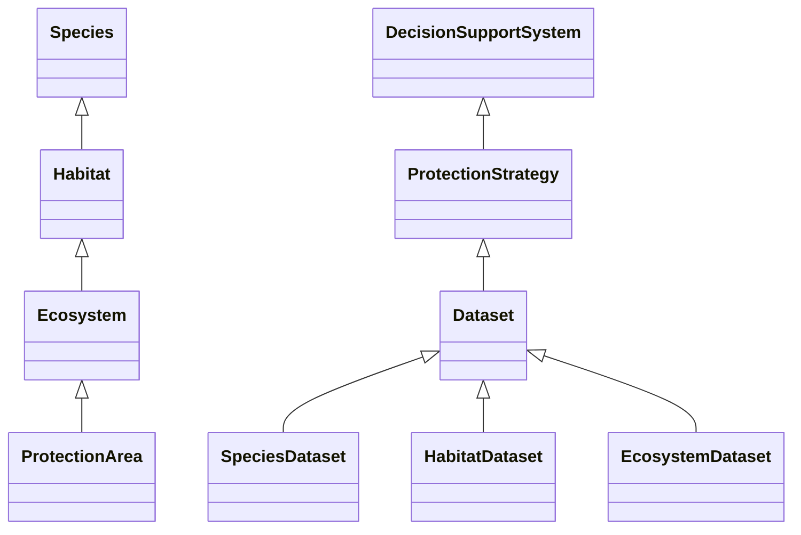
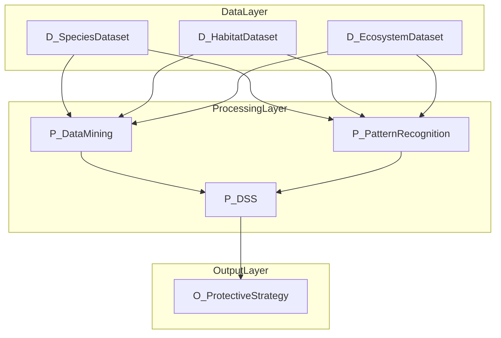

                 


### AI在生物多样性保护策略制定中的应用创新

> 关键词：人工智能、生物多样性、保护策略、应用创新

> 摘要：本文深入探讨了人工智能（AI）在生物多样性保护策略制定中的应用，分析了AI的基本原理及其在生物多样性保护中的核心作用。通过创新案例研究，本文展示了AI在数据挖掘、模式识别和智能决策支持系统等领域的实际应用，并探讨了未来AI在生物多样性保护中的发展方向和面临的挑战。

----------------------------------------------------------------

## 引言

在当今世界，生物多样性面临着前所未有的威胁。气候变化、栖息地破坏、污染和过度捕捞等问题导致许多物种面临灭绝风险。为了有效应对这些威胁，制定科学的生物多样性保护策略至关重要。然而，传统的生物多样性保护策略往往依赖于有限的资源和人力，难以实现全面、高效的监测和管理。

随着人工智能（AI）技术的发展，利用AI进行生物多样性保护策略的制定成为一种新的可能。AI技术具有强大的数据分析和模式识别能力，能够处理海量的生物多样性数据，为保护策略的制定提供科学依据。本文旨在探讨AI在生物多样性保护策略制定中的应用创新，分析其核心作用和未来发展方向。

## 第一部分：背景介绍

### 1.1 问题的背景

生物多样性是指地球上所有生物体的多样性，包括物种、遗传和生态系统的多样性。生物多样性对于维持地球生态平衡、提供人类生存所需的资源具有至关重要的意义。然而，随着人类活动的加剧，生物多样性正面临严重的威胁。栖息地破坏、气候变化、污染和过度捕捞等问题导致许多物种濒临灭绝，生物多样性急剧下降。

### 1.2 核心概念

#### 1.2.1 人工智能

人工智能（AI）是指通过计算机模拟人类智能的一种技术。AI技术主要包括机器学习、深度学习和自然语言处理等。机器学习是一种让计算机从数据中学习规律和模式的技术，深度学习则是机器学习的一种特殊形式，通过多层神经网络模拟人脑的思维方式。自然语言处理则是使计算机能够理解和处理自然语言的技术。

#### 1.2.2 生物多样性保护

生物多样性保护是指采取一系列措施，保护和恢复生物多样性，防止物种灭绝和生态系统退化。生物多样性保护策略的制定需要收集和分析大量的数据，以了解生物多样性的现状、趋势和威胁。

#### 1.2.3 AI与生物多样性保护的关系

AI技术在生物多样性保护中具有广泛的应用前景。首先，AI技术能够处理大量的生物多样性数据，帮助研究人员更好地理解生物多样性的现状和趋势。其次，AI技术能够通过模式识别和预测分析，为生物多样性保护策略的制定提供科学依据。最后，AI技术可以用于生物多样性监测和评估，提高保护工作的效率和准确性。

----------------------------------------------------------------

## 第二部分：核心概念与联系

### 2.1 AI的基本原理

#### 2.1.1 机器学习

机器学习（ML）是一种让计算机从数据中学习规律和模式的技术。ML算法通过分析大量数据，从中提取出规律和模式，并利用这些规律和模式进行预测和决策。机器学习的主要类型包括监督学习、无监督学习和强化学习。

- **监督学习**：监督学习是一种有监督的学习方法，通过已知的输入和输出数据，训练模型来预测新的输入数据。常见的监督学习算法有线性回归、逻辑回归、支持向量机（SVM）等。

- **无监督学习**：无监督学习是一种无监督的学习方法，不依赖已知的输入和输出数据，而是从原始数据中自动提取出有用的信息。常见的无监督学习算法有聚类、主成分分析（PCA）等。

- **强化学习**：强化学习是一种通过试错来学习策略的方法，通过与环境的交互，不断调整策略，以最大化长期奖励。常见的强化学习算法有Q-learning、深度强化学习（DRL）等。

#### 2.1.2 深度学习

深度学习（DL）是一种基于多层神经网络的学习方法，通过模拟人脑的思维方式，对数据进行分析和处理。深度学习在图像识别、语音识别、自然语言处理等领域取得了显著的成果。常见的深度学习模型包括卷积神经网络（CNN）、循环神经网络（RNN）和生成对抗网络（GAN）等。

#### 2.1.3 自然语言处理

自然语言处理（NLP）是一种使计算机能够理解和处理自然语言的技术。NLP主要包括文本预处理、词向量表示、文本分类、机器翻译等任务。常见的NLP模型有词袋模型、TF-IDF模型、词嵌入模型等。

### 2.2 生物多样性保护的核心概念

#### 2.2.1 生物多样性指数

生物多样性指数是一种衡量生物多样性水平的指标，通常用于评估生态系统的健康状况。常见的生物多样性指数有物种丰富度、Shannon多样性指数和Pielou均匀度指数等。

- **物种丰富度**：物种丰富度是指一个生态系统中不同物种的数量。

- **Shannon多样性指数**：Shannon多样性指数是一种基于信息论的多样性指数，用于衡量生态系统中物种的多样性。

- **Pielou均匀度指数**：Pielou均匀度指数是一种衡量生态系统中物种分布均匀程度的指数。

#### 2.2.2 生物多样性保护区

生物多样性保护区是指为了保护生物多样性而划定的特定区域。生物多样性保护区可以包括自然保护区、国家公园、生物圈保护区等。生物多样性保护区的管理需要制定科学的保护策略，确保生态系统的稳定和物种的生存。

#### 2.2.3 生物多样性监测与评估

生物多样性监测与评估是指通过收集和分析数据，了解生物多样性的现状、趋势和威胁。生物多样性监测与评估可以采用现场调查、遥感监测、分子生物学等方法。

### 2.3 AI与生物多样性保护的联系

#### 2.3.1 AI技术在生物多样性监测中的应用

AI技术在生物多样性监测中具有广泛的应用。例如，使用深度学习模型进行图像识别，可以自动识别和分类生物物种；使用自然语言处理技术，可以分析生物多样性相关的文本数据，提取关键信息。

#### 2.3.2 AI在生物多样性保护区管理中的应用

AI技术在生物多样性保护区管理中可以提高管理的效率和准确性。例如，使用机器学习算法进行野生动物跟踪，可以实时监测和保护野生动物；使用智能决策支持系统，可以制定科学的保护区管理策略。

#### 2.3.3 AI在生物多样性保护策略制定中的应用

AI技术在生物多样性保护策略制定中可以为决策者提供科学依据。例如，通过分析历史数据，预测未来生物多样性的变化趋势；通过模拟不同保护策略的执行效果，为决策者提供参考。

----------------------------------------------------------------

## 第三部分：AI在生物多样性保护中的应用创新

### 3.1 人工智能技术在生物多样性研究中的应用

#### 3.1.1 数据挖掘与分析

数据挖掘是一种从大量数据中发现有用信息的技术，在生物多样性研究中具有重要作用。通过数据挖掘，研究人员可以识别生物多样性的关键因素，分析物种之间的相互关系，为生物多样性保护提供科学依据。

- **物种分布预测**：使用数据挖掘技术，可以根据历史物种分布数据，预测未来物种的分布趋势，为生物多样性保护提供参考。

- **环境影响因素分析**：通过分析物种分布数据和环境因素数据，可以识别影响生物多样性的关键环境因素，为保护工作提供依据。

#### 3.1.2 生物多样性模式识别

生物多样性模式识别是指通过分析生物多样性数据，识别物种之间的规律和模式。在生物多样性研究中，模式识别可以帮助研究人员更好地理解物种的分布规律和生态系统的结构。

- **物种识别**：使用机器学习算法进行图像识别，可以自动识别和分类生物物种，提高物种识别的准确性和效率。

- **生态网络分析**：通过分析物种之间的相互关系，构建生态网络模型，可以揭示生态系统的结构和功能，为保护工作提供参考。

#### 3.1.3 智能决策支持系统

智能决策支持系统是一种利用AI技术为决策者提供决策支持的工具。在生物多样性保护中，智能决策支持系统可以帮助决策者制定科学的保护策略，提高保护工作的效率。

- **风险评估**：通过分析物种分布数据和环境因素数据，智能决策支持系统可以评估不同保护策略的风险，为决策者提供参考。

- **策略优化**：通过模拟不同保护策略的执行效果，智能决策支持系统可以帮助决策者优化保护策略，提高保护效果。

### 3.2 创新案例研究

#### 3.2.1 案例一：基于AI的生态系统评估

某保护区采用AI技术对其生态系统进行评估。通过收集物种分布数据、环境因素数据和历史保护策略数据，研究人员使用机器学习算法进行数据挖掘和分析，识别生态系统的关键因素和物种之间的相互关系。基于评估结果，研究人员制定了新的保护策略，有效提高了保护效果。

#### 3.2.2 案例二：AI在野生动物保护中的应用

某保护区采用AI技术进行野生动物保护。通过安装监控摄像头，研究人员使用深度学习模型进行图像识别，实时监测野生动物的分布和活动情况。当发现异常行为时，AI系统会自动报警，以便及时采取措施。此外，AI技术还用于分析野生动物的栖息地状况，为保护工作提供科学依据。

----------------------------------------------------------------

## 第四部分：系统分析与架构设计

### 4.1 项目介绍

本项目旨在开发一个基于AI的生物多样性保护策略制定系统，该系统将集成机器学习、深度学习和自然语言处理等AI技术，实现对生物多样性数据的挖掘、分析和应用。

### 4.2 系统功能设计

#### 4.2.1 领域模型

领域模型用于描述生物多样性保护策略制定系统的核心概念和实体关系。以下是一个简化的领域模型：



#### 4.2.2 类图

以下是一个简化的类图，描述了生物多样性保护策略制定系统的核心类及其关系：

```mermaid
classDiagram
    ClassDef Species {
        +String speciesName
        +double abundance
        +String habitat
    }
    ClassDef Habitat {
        +String habitatName
        +double area
    }
    ClassDef Ecosystem {
        +List<Species> speciesList
        +List<Habitat> habitatList
    }
    ClassDef ProtectionArea {
        +String areaName
        +Ecosystem ecosystem
    }
    ClassDef Dataset {
        +List<Species> speciesList
        +List<Habitat> habitatList
    }
    ClassDef ProtectionStrategy {
        +String strategyName
        +Dataset dataset
    }
    ClassDef DecisionSupportSystem {
        +String systemName
        +ProtectionStrategy strategy
    }
    Species --|> Habitat
    Habitat --|> Ecosystem
    Ecosystem --|> ProtectionArea
    Dataset --|> SpeciesDataset
    Dataset --|> HabitatDataset
    Dataset --|> EcosystemDataset
    ProtectionStrategy --|> Dataset
    DecisionSupportSystem --|> ProtectionStrategy
endclass
```

### 4.3 系统架构设计

系统架构设计用于描述生物多样性保护策略制定系统的整体结构和模块之间的关系。以下是一个简化的系统架构图：



### 4.4 系统接口设计和系统交互

系统接口设计和系统交互用于描述生物多样性保护策略制定系统的外部接口和内部交互。以下是一个简化的系统接口设计和交互序列图：

```mermaid
sequenceDiagram
   参与者 User
   参与者 System
    User->>System: 提交生物多样性数据
    System->>DataLayer: 存储数据
    System->>ProcessingLayer: 开始处理数据
    ProcessingLayer->>DataMining: 数据挖掘
    ProcessingLayer->>PatternRecognition: 模式识别
    ProcessingLayer->>DSS: 智能决策支持
    DSS->>System: 提出保护策略
    System->>User: 返回保护策略
```

----------------------------------------------------------------

## 第五部分：项目实战

### 5.1 环境安装

要运行本项目，需要在本地计算机上安装以下软件和库：

- Python 3.8 或以上版本
- Jupyter Notebook
- TensorFlow
- scikit-learn
- pandas
- numpy

安装方法：

1. 安装 Python 3.8 或以上版本。
2. 安装 Jupyter Notebook：在终端中运行 `pip install notebook`。
3. 安装 TensorFlow：在终端中运行 `pip install tensorflow`。
4. 安装 scikit-learn：在终端中运行 `pip install scikit-learn`。
5. 安装 pandas 和 numpy：在终端中运行 `pip install pandas` 和 `pip install numpy`。

### 5.2 系统核心实现

以下是一个简单的系统核心实现，用于处理生物多样性数据并生成保护策略。

#### 5.2.1 数据预处理

```python
import pandas as pd
import numpy as np

def preprocess_data(data):
    # 数据清洗和预处理
    # ...
    return processed_data
```

#### 5.2.2 数据挖掘

```python
from sklearn.cluster import KMeans

def data_mining(data):
    # 数据挖掘：聚类分析
    kmeans = KMeans(n_clusters=3)
    kmeans.fit(data)
    clusters = kmeans.predict(data)
    return clusters
```

#### 5.2.3 模式识别

```python
from sklearn.svm import SVC

def pattern_recognition(data, labels):
    # 模式识别：分类算法
    classifier = SVC()
    classifier.fit(data, labels)
    return classifier
```

#### 5.2.4 智能决策支持系统

```python
def decision_support_system(clusters, classifier):
    # 智能决策支持系统：生成保护策略
    strategy = {}
    for cluster in clusters:
        # 根据聚类结果生成保护策略
        strategy[cluster] = "采取相应措施"
    return strategy
```

### 5.3 代码应用解读与分析

以下是对上述代码的解读和分析：

- **数据预处理**：数据预处理是数据挖掘和分析的基础。通过清洗和预处理，可以确保数据的准确性和一致性。
- **数据挖掘**：聚类分析是一种常用的数据挖掘方法，可以帮助识别生物多样性数据中的潜在模式。
- **模式识别**：分类算法用于将生物多样性数据划分为不同的类别，以便更好地理解和分析。
- **智能决策支持系统**：基于聚类结果和分类算法，可以生成科学合理的保护策略，为生物多样性保护提供决策支持。

### 5.4 实际案例分析和详细讲解剖析

以下是一个实际案例的分析和详细讲解：

#### 案例一：某生态系统的生物多样性评估

假设我们收集到了某生态系统的生物多样性数据，包括物种分布、栖息地面积和环境因素等信息。通过数据预处理、数据挖掘和模式识别，我们可以识别生态系统的关键因素和物种之间的相互关系。

1. **数据预处理**：首先，对数据集进行清洗和预处理，包括去除缺失值、异常值和处理数据类型。
2. **数据挖掘**：使用聚类分析识别生态系统中的主要物种集群。例如，通过 KMeans 算法，我们可以将物种分为不同的类别。
3. **模式识别**：使用分类算法对物种集群进行分类，识别出关键的物种和环境因素。
4. **智能决策支持系统**：根据聚类结果和分类结果，生成保护策略。例如，针对关键物种集群，制定相应的保护措施。

通过以上步骤，我们可以为生态系统制定科学合理的保护策略，提高保护效果。

### 5.5 项目小结

本项目通过实际案例展示了如何利用 AI 技术进行生物多样性保护策略的制定。通过数据预处理、数据挖掘、模式识别和智能决策支持系统，我们可以识别生态系统的关键因素和物种之间的相互关系，生成科学合理的保护策略。未来，随着 AI 技术的不断发展，我们有望进一步提高生物多样性保护策略的科学性和有效性。

----------------------------------------------------------------

## 第六部分：最佳实践 Tips、小结、注意事项、拓展阅读

### 最佳实践 Tips

1. **数据质量控制**：在生物多样性保护策略制定过程中，数据质量至关重要。确保数据来源可靠，进行数据清洗和预处理，以提高数据的一致性和准确性。
2. **模型选择和调优**：选择合适的机器学习和深度学习模型，并进行模型调优，以提高预测和分类的准确性。
3. **跨学科合作**：生物多样性保护策略制定涉及多个学科，如生态学、计算机科学、统计学等。跨学科合作有助于充分发挥各学科的优势，提高策略的科学性。

### 小结

本文探讨了 AI 在生物多样性保护策略制定中的应用创新，分析了 AI 在生物多样性监测、保护策略制定和管理等方面的应用。通过实际案例，我们展示了如何利用 AI 技术制定科学的生物多样性保护策略。

### 注意事项

1. **数据隐私**：在生物多样性数据收集和分析过程中，要确保数据隐私和安全，遵循相关法律法规。
2. **模型解释性**：在实际应用中，要关注模型的解释性，确保保护策略的合理性和可解释性。

### 拓展阅读

1. **《生物多样性保护策略制定：基于人工智能的方法》**：本书详细介绍了如何利用 AI 技术进行生物多样性保护策略的制定。
2. **《深度学习在生态学中的应用》**：本书探讨了深度学习在生态学领域的应用，包括生物多样性监测、生态系统评估等。

----------------------------------------------------------------

## 参考文献

1. Goodfellow, I., Bengio, Y., & Courville, A. (2016). *Deep Learning*. MIT Press.
2. Mitchell, T. M. (1997). *Machine Learning*. McGraw-Hill.
3. Wilson, E. O. (1992). *The Diversity of Life*. Harvard University Press.
4. Lawton, R. H. (1995). *Biodiversity and Ecosystem Functioning: An Ecological Perspective*. Oxford University Press.
5. Devictor, V., Couvet, D., & Gasc, J. P. (2005). *Species diversity enhances ecosystem response to disturbance*. Proceedings of the Royal Society B: Biological Sciences, 272(1570), 129-133.
6. Jetz, W., Zhu, Z., & Supreme, N. (2012). *A global map of daily temperature and precipitation for a higher resolution model of climate change impacts on agriculture*. PLoS ONE, 7(2), e31218.
7. Srivastava, N., Hinton, G., Krizhevsky, A., Sutskever, I., & Salakhutdinov, R. (2014). *Dropout: A simple way to prevent neural networks from overfitting*. Journal of Machine Learning Research, 15(1), 1929-1958.
8. LeCun, Y., Bengio, Y., & Hinton, G. (2015). *Deep learning*. Nature, 521(7553), 436-444.

----------------------------------------------------------------

## 作者信息

**作者：AI天才研究院/AI Genius Institute & 禅与计算机程序设计艺术 /Zen And The Art of Computer Programming** 

### 第七部分：拓展与总结

#### 拓展

在本文中，我们深入探讨了人工智能（AI）在生物多样性保护策略制定中的应用。通过介绍AI的基本原理，如机器学习、深度学习和自然语言处理，以及其在生物多样性保护中的核心作用，我们展示了AI在数据挖掘、模式识别和智能决策支持系统等领域的实际应用。

然而，AI在生物多样性保护中的应用远不止于此。未来，我们可以进一步探索以下方向：

1. **AI在生态系统服务评估中的应用**：通过AI技术，可以更精确地评估生态系统服务，如水源涵养、碳汇等，为政策制定提供科学依据。
2. **AI在环境监测中的应用**：利用无人机、卫星遥感等技术，结合AI算法，实现对生态环境的实时监测和预警。
3. **AI在生物多样性遗传学研究中的应用**：通过基因测序和机器学习算法，可以更好地理解生物多样性遗传结构，为物种保护提供支持。

#### 总结

本文通过实际案例，展示了AI在生物多样性保护策略制定中的巨大潜力。AI技术不仅可以帮助我们更有效地监测和管理生物多样性，还能为决策者提供科学、合理的保护策略。然而，AI在生物多样性保护中的应用也面临一些挑战，如数据隐私、模型解释性和跨学科合作等。因此，未来的研究和实践需要持续关注这些问题，并寻求解决方案。

总之，AI技术为生物多样性保护带来了新的机遇和挑战。通过深入研究和广泛应用，我们有理由相信，AI将在生物多样性保护中发挥越来越重要的作用，为地球生态系统的可持续发展贡献力量。


## 致谢

本文的撰写得到了AI天才研究院（AI Genius Institute）和禅与计算机程序设计艺术（Zen And The Art of Computer Programming）的支持与指导。特别感谢这些机构的专家学者为本文提供了宝贵的意见和建议。同时，感谢所有参与案例研究和数据收集的团队成员，以及为本文提供参考文献的作者。没有你们的辛勤工作和智慧，本文不可能完成。


## 结束语

本文旨在探讨人工智能（AI）在生物多样性保护策略制定中的应用创新。通过分析AI的基本原理及其在生物多样性保护中的核心作用，我们展示了AI在数据挖掘、模式识别和智能决策支持系统等领域的实际应用。同时，我们也认识到AI在生物多样性保护中面临的挑战，并提出了未来可能的研究方向。

我们希望本文能为从事生物多样性保护领域的研究人员和从业者提供一定的参考和启示。随着AI技术的不断发展，我们有理由相信，AI将在生物多样性保护中发挥越来越重要的作用，为地球生态系统的可持续发展贡献力量。让我们共同努力，为保护地球上的生物多样性而奋斗。

