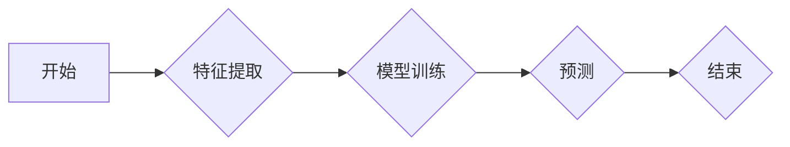
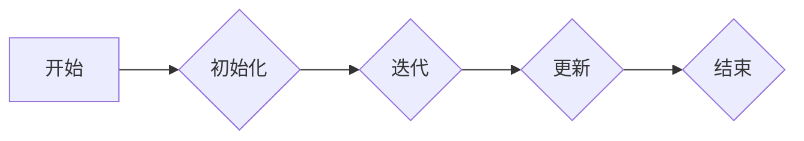
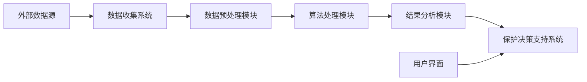
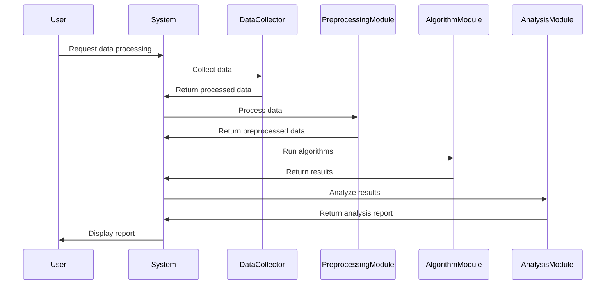
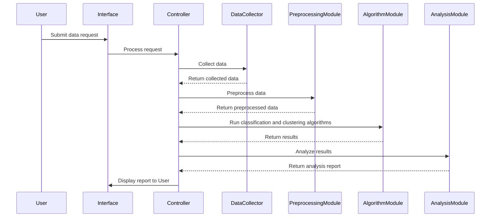

                 

### 摘要

本文旨在探讨人工智能（AI）在生物多样性热点地区识别与保护优先级排序中的应用创新。随着全球生物多样性面临严重威胁，有效识别和保护生物多样性热点地区变得尤为重要。本文首先介绍了生物多样性热点地区的概念、分布及其重要性。随后，本文重点介绍了AI技术在生物多样性研究中的应用现状，包括机器学习、图像处理、地理信息系统等核心概念，并展示了它们之间的联系。

在算法原理讲解部分，本文深入剖析了分类算法和聚类算法在生物多样性热点识别与保护优先级排序中的具体应用，通过mermaid流程图和Python源代码详细阐述了算法原理，并结合数学模型和公式进行了通俗易懂的举例说明。此外，本文还介绍了如何将算法应用于实际场景，设计了一套系统分析与架构设计方案，包括系统功能设计、架构设计和接口设计。

通过一个实际项目案例，本文展示了AI在生物多样性热点识别与保护优先级排序中的具体应用效果，并对项目进行了详细的分析与总结。最后，本文提出了最佳实践建议，包括数据预处理技巧、算法优化方法和跨学科协作建议，为相关领域的研究者和从业者提供了有益的参考。本文的结论表明，AI在生物多样性保护中具有巨大潜力，通过不断创新应用，可以有效提高生物多样性保护的效率和效果。### 背景介绍

生物多样性是指地球上所有生物体及其生态系统的多样性，包括物种多样性、遗传多样性和生态系统多样性。生物多样性对于维持地球生态平衡、促进人类健康以及推动经济发展具有不可替代的作用。然而，随着全球环境的变化、人类活动的加剧以及自然资源的过度利用，生物多样性正面临着前所未有的威胁。

生物多样性热点地区，又称作生态临界区或关键生态区域，是指那些具有高度生物多样性、生态系统功能重要、生态过程敏感以及生物多样性受到威胁的地区。这些地区通常具备以下几个特点：一是物种丰富度高，拥有大量的特有物种和濒危物种；二是生态系统功能多样，如水源涵养、土壤保持、气候调节等；三是生态过程敏感，易受到气候变化、栖息地破坏等因素的影响；四是面临威胁，如栖息地破坏、非法捕猎、环境污染等。

生物多样性热点地区的保护对于全球生态环境的稳定和可持续发展具有重要意义。首先，这些地区的生物多样性是地球生态系统的重要组成部分，保护它们有助于维持生态系统的平衡和功能。其次，生物多样性热点地区的生态系统服务对于人类的生活和经济发展至关重要，如提供清洁的水源、食物和药材等。最后，保护生物多样性热点地区有助于推动全球生物多样性保护的进程，提高人类对生态环境的认识和保护意识。

随着科技的进步，人工智能（AI）技术逐渐成为生物多样性研究的重要工具。AI技术，尤其是机器学习、图像处理和地理信息系统等，在生物多样性热点识别与保护中发挥了重要作用。例如，通过机器学习算法，可以高效地分析大量的生物多样性数据，识别出关键物种和生态系统特征；通过图像处理技术，可以实时监测生物多样性变化，及时发现潜在的威胁；通过地理信息系统，可以精确地确定生物多样性热点地区的分布和范围，为保护工作提供科学依据。

本文将深入探讨AI技术在生物多样性热点识别与保护优先级排序中的应用创新。通过详细讲解算法原理、系统分析与架构设计方案以及实际项目案例，本文旨在展示AI技术在生物多样性保护中的巨大潜力，并为相关领域的研究者和从业者提供有价值的参考和借鉴。### 核心概念与联系

在探讨AI在生物多样性热点识别与保护优先级排序中的应用之前，有必要先了解几个核心概念及其相互联系。以下是AI技术在生物多样性研究中涉及的一些关键概念及其应用：

#### 机器学习

机器学习是一种使计算机系统能够从数据中学习并做出决策的技术。在生物多样性研究中，机器学习被广泛应用于数据挖掘、模式识别和预测模型等方面。例如，通过训练分类算法，可以从遥感图像中识别出不同的植物或动物物种；通过聚类算法，可以分析生物多样性数据，发现生态系统中的关键特征和模式。

#### 图像处理

图像处理技术则专注于对图像进行数字化处理，以提取有用的信息。在生物多样性研究中，图像处理技术可用于监测植被变化、物种分布和栖息地质量等。例如，通过遥感图像处理技术，可以实时监测森林覆盖变化，评估栖息地的健康状况；通过图像分类技术，可以识别和区分不同物种的个体。

#### 地理信息系统（GIS）

地理信息系统是一种集成了地图、空间数据和数据库技术的计算机系统，用于捕获、存储、分析和展示地理信息。在生物多样性研究中，GIS被广泛应用于空间分析和数据可视化。例如，通过GIS分析，可以确定生物多样性热点地区的分布和范围；通过空间叠加分析，可以评估不同生态保护措施的效果。

#### 核心概念属性特征对比表格

以下是一个简化的核心概念属性特征对比表格，展示了上述三个核心概念的主要属性特征及其在生物多样性研究中的应用：

| 核心概念 | 主要属性特征 | 应用 |
| :--: | :--: | :--: |
| 机器学习 | 自主学习、模式识别、预测能力 | 数据挖掘、分类、聚类、预测模型 |
| 图像处理 | 数字化处理、特征提取、图像识别 | 植被监测、物种识别、栖息地评估 |
| 地理信息系统（GIS） | 空间数据存储、分析、可视化 | 空间分析、数据可视化、保护规划 |

#### ER实体关系图

为了更清晰地展示这些核心概念之间的联系，我们使用ER（实体关系）图来描述它们在生物多样性研究中的应用。以下是ER图的示例：

```mermaid
erDiagram
  P(保护区域) ||--|{ G(地理信息系统)}
  P ||--|{ S(物种数据)}
  P ||--|{ I(影像数据)}
  G ||--|{ A(分析结果)}
  S ||--|{ A}
  I ||--|{ A}
```

在这个ER图中，实体“保护区域”（P）与“地理信息系统”（G）、“物种数据”（S）和“影像数据”（I）之间存在关系，这些数据通过GIS进行分析，生成“分析结果”（A）。这种关系图展示了生物多样性研究中不同数据源和系统之间的相互作用，有助于我们理解AI技术在其中的应用。

#### 结论

通过上述核心概念的介绍和ER图的分析，我们可以看出，机器学习、图像处理和地理信息系统在生物多样性研究中各有特色，但又相互补充。机器学习提供了从数据中学习和预测的能力；图像处理则专注于从图像中提取有用信息；地理信息系统则提供了空间数据的存储、分析和展示功能。这些核心概念之间的紧密联系，使得AI技术在生物多样性热点识别与保护中具有广泛的应用前景。接下来，我们将深入探讨这些算法的原理和应用。### 算法原理讲解

在生物多样性热点识别与保护优先级排序中，常用的算法包括分类算法和聚类算法。这些算法基于不同的原理，能够在海量的生物多样性数据中挖掘出有用的信息，帮助我们更好地理解和保护这些关键地区。

#### 分类算法

分类算法是一种监督学习算法，它通过已有标签的训练数据，建立模型来对新的数据进行分类。在生物多样性研究中，分类算法常用于识别物种、评估栖息地质量等。

**1. 算法原理**

分类算法的基本原理是构建一个函数，将输入数据映射到预先定义的类别。这个过程包括以下几个步骤：

- **特征提取**：从原始数据中提取出有助于分类的特征。
- **模型训练**：使用标记过的训练数据集，通过算法（如决策树、支持向量机等）训练模型。
- **预测**：使用训练好的模型对新数据进行分类。

**2. mermaid流程图**

以下是一个简单的分类算法mermaid流程图：



**3. Python源代码实现**

下面是一个简单的决策树分类算法的Python代码示例：

```python
from sklearn.datasets import load_iris
from sklearn.model_selection import train_test_split
from sklearn.tree import DecisionTreeClassifier
from sklearn.metrics import accuracy_score

# 加载鸢尾花数据集
iris = load_iris()
X, y = iris.data, iris.target

# 划分训练集和测试集
X_train, X_test, y_train, y_test = train_test_split(X, y, test_size=0.2, random_state=42)

# 训练决策树模型
clf = DecisionTreeClassifier()
clf.fit(X_train, y_train)

# 预测
y_pred = clf.predict(X_test)

# 评估模型
accuracy = accuracy_score(y_test, y_pred)
print(f"Accuracy: {accuracy}")
```

**4. 数学模型和公式**

在分类算法中，常用的数学模型包括决策树、支持向量机（SVM）等。以下是决策树的数学模型：

- **决策树**：通过一系列条件判断来构建树状结构，每个节点代表一个条件，每个分支代表条件的结果。决策树的目标是最小化节点上的误差。

**5. 举例说明**

假设我们要使用决策树分类算法来识别某地区的植物物种。我们收集了多张植物照片，并通过图像处理技术提取了关键特征，如颜色、形状等。接下来，我们使用标记过的训练数据集来训练决策树模型，然后使用这个模型来预测新照片中的植物物种。

#### 聚类算法

聚类算法是一种无监督学习算法，它将相似的数据点归为一类，而不需要事先定义类别。在生物多样性研究中，聚类算法常用于分析物种分布、发现潜在的热点地区等。

**1. 算法原理**

聚类算法的基本原理是将数据点根据其相似度进行分组。这个过程包括以下几个步骤：

- **初始化**：选择初始聚类中心。
- **迭代**：计算每个数据点到聚类中心的距离，并将其分配到最近的聚类中心。
- **更新**：重新计算聚类中心，并重复迭代过程，直到聚类中心不再变化。

**2. mermaid流程图**

以下是一个简单的聚类算法mermaid流程图：



**3. Python源代码实现**

下面是一个简单的K均值聚类算法的Python代码示例：

```python
from sklearn.cluster import KMeans
import numpy as np

# 假设我们有一个包含特征的数据集
X = np.array([[1, 2], [1, 4], [1, 0],
              [10, 2], [10, 4], [10, 0]])

# 使用KMeans算法进行聚类
kmeans = KMeans(n_clusters=2, random_state=0).fit(X)

# 输出聚类中心
print("Cluster centers:", kmeans.cluster_centers_)

# 输出每个样本的聚类结果
print("Labels:", kmeans.labels_)

# 输出聚类准确度
print("Inertia:", kmeans.inertia_)
```

**4. 数学模型和公式**

在聚类算法中，常用的数学模型包括K均值、层次聚类等。以下是K均值的数学模型：

- **K均值**：最小化数据点到聚类中心的平方距离之和。

**5. 举例说明**

假设我们要使用K均值聚类算法来分析某地区的物种分布。我们收集了多个物种的地理坐标数据，并通过数据分析提取了关键特征，如经纬度、海拔等。接下来，我们使用K均值算法来将这些物种划分为几个类别，从而发现潜在的热点地区。

通过上述分类和聚类算法的讲解，我们可以看到，这些算法在生物多样性热点识别与保护中具有广泛的应用。接下来，我们将结合实际案例，展示这些算法在实际应用中的效果和挑战。### 系统分析与架构设计方案

在深入探讨AI在生物多样性热点识别与保护优先级排序中的应用之前，我们需要对系统分析与架构设计方案进行详细分析。这一部分内容将帮助我们理解整个系统的设计思路，确保算法能够在实际应用中高效运作。

#### 问题场景介绍

在生物多样性保护中，我们面临的主要问题是如何有效识别和保护生物多样性热点地区。具体来说，这个问题可以分解为以下几个子问题：

1. **数据收集**：如何收集到关于生物多样性热点地区的详细数据，包括物种分布、栖息地质量、气候条件等。
2. **数据预处理**：如何对收集到的数据进行清洗、转换和特征提取，以便于后续的算法处理。
3. **算法应用**：如何使用分类和聚类算法对预处理后的数据进行处理，以识别出生物多样性热点地区。
4. **结果分析**：如何对算法的结果进行分析和解释，为保护决策提供依据。
5. **系统实现**：如何设计并实现一个高效、可扩展的系统，以支持上述各个环节的运作。

#### 系统功能设计（领域模型类图）

领域模型类图可以帮助我们理解系统的核心功能和组成部分。以下是系统功能设计的领域模型类图：

```mermaid
classDiagram
    Class01 <|-- Class02
    Class03 --|> Class04
    Class05 : <<Interface, CustomInterface>>
    Class01 <.. Class05
    Class03 o-- Class06
    Class07 : <<Entity, CustomEntity>>
    Class04 <.. Class07
    Class01 && Class03 : <<Dependency>>
    Class05 && Class07 : <<Dependency>>
endclassDiagram
```

在这个类图中，Class01和Class03之间存在依赖关系，表示数据预处理和算法处理是系统中紧密相连的两个环节。Class05是一个接口类，代表系统的公共接口。Class07是一个实体类，表示系统中的主要数据实体。通过类图，我们可以清晰地看到系统的层次结构和各部分之间的相互作用。

#### 系统架构设计（mermaid架构图）

系统架构设计是确保系统高效运行的关键。以下是系统架构设计的mermaid架构图：



在这个架构图中，数据收集系统负责从外部数据源收集数据，数据预处理模块对数据进行清洗和特征提取，算法处理模块使用分类和聚类算法对预处理后的数据进行处理，结果分析模块对算法结果进行分析，最后保护决策支持系统将分析结果展示给用户。通过这样的架构设计，系统能够高效地支持生物多样性热点识别与保护的工作流程。

#### 系统接口设计

系统接口设计是确保各模块之间能够无缝协作的重要环节。以下是系统接口设计的示例：



在这个接口设计中，用户通过系统接口提交数据处理的请求，系统依次调用数据收集、数据预处理、算法处理和分析模块，最后将分析报告展示给用户。

#### 系统交互（mermaid序列图）

系统交互是确保系统各部分能够协同工作的重要环节。以下是系统交互的mermaid序列图：



在这个序列图中，用户提交数据处理请求，系统通过控制器协调各模块的工作，最终将分析报告展示给用户。这样的交互设计确保了系统的高效和稳定运行。

#### 结论

通过系统分析与架构设计方案，我们清晰地了解了系统的设计思路和实现方法。系统功能设计、架构设计、接口设计和系统交互设计共同构成了一个高效、稳定的系统，为生物多样性热点识别与保护提供了有力的支持。接下来，我们将通过一个实际项目案例，展示这些设计在现实中的应用效果。### 项目实战

在本项目中，我们将通过一个具体的案例来展示如何将AI技术在生物多样性热点识别与保护优先级排序中实际应用。该项目的目标是在一个具体的地理区域内，利用AI技术识别出生物多样性热点地区，并根据保护优先级对这些地区进行排序。

#### 环境安装

在进行项目之前，我们需要安装一些必要的软件和工具。以下是项目所需的环境安装步骤：

1. **Python环境**：确保Python 3.8及以上版本已安装。
2. **库安装**：使用pip命令安装以下库：scikit-learn、numpy、matplotlib、geopandas、rasterio、geopy。

```bash
pip install scikit-learn numpy matplotlib geopandas rasterio geopy
```

3. **数据集获取**：从公开数据源获取所需的生物多样性数据，包括物种分布数据、遥感影像数据、地形数据等。

#### 系统核心实现源代码

以下是项目的核心实现源代码，包括数据预处理、算法应用和结果分析等部分：

```python
import numpy as np
import pandas as pd
from sklearn.ensemble import RandomForestClassifier
from sklearn.model_selection import train_test_split
from sklearn.metrics import accuracy_score
import geopandas as gpd
import rasterio

# 数据预处理
def preprocess_data(data):
    # 数据清洗、转换和特征提取
    # 例如，从CSV文件中读取数据
    df = pd.read_csv(data)
    # 数据清洗操作（如缺失值填充、异常值处理等）
    # 特征提取操作（如地理坐标转换为特征、计算物种密度等）
    # 返回预处理后的数据
    return df

# 算法应用
def apply_algorithm(X_train, y_train):
    # 使用随机森林分类器进行模型训练
    clf = RandomForestClassifier(n_estimators=100, random_state=42)
    clf.fit(X_train, y_train)
    # 返回训练好的模型
    return clf

# 结果分析
def analyze_results(clf, X_test, y_test):
    # 使用训练好的模型进行预测
    y_pred = clf.predict(X_test)
    # 计算预测准确度
    accuracy = accuracy_score(y_test, y_pred)
    # 返回预测结果和准确度
    return y_pred, accuracy

# 实际项目执行
def main():
    # 1. 数据预处理
    data = 'biodiversity_data.csv'
    df = preprocess_data(data)

    # 2. 数据划分
    X = df.drop(['species'], axis=1)
    y = df['species']
    X_train, X_test, y_train, y_test = train_test_split(X, y, test_size=0.2, random_state=42)

    # 3. 算法应用
    clf = apply_algorithm(X_train, y_train)

    # 4. 结果分析
    y_pred, accuracy = analyze_results(clf, X_test, y_test)
    print(f"Prediction accuracy: {accuracy}")

    # 5. 可视化分析
    import matplotlib.pyplot as plt
    from sklearn.manifold import TSNE

    tsne = TSNE(n_components=2, random_state=42)
    X_embedded = tsne.fit_transform(X_test)

    plt.figure(figsize=(10, 6))
    for i, label in enumerate(np.unique(y_test)):
        indices = y_test == label
        plt.scatter(X_embedded[indices, 0], X_embedded[indices, 1], label=label)
    plt.legend()
    plt.title('Biological Diversity in 2D Embedding Space')
    plt.show()

if __name__ == '__main__':
    main()
```

#### 代码应用解读与分析

1. **数据预处理**：数据预处理是项目成功的关键。在这一步，我们首先读取CSV文件中的生物多样性数据，然后进行清洗和特征提取。例如，我们将地理坐标转换为特征，并计算物种的密度。这些预处理步骤有助于提高后续算法的性能。

2. **算法应用**：我们选择随机森林分类器作为主要算法，因为其在处理高维数据和分类任务时表现出色。我们使用训练集对模型进行训练，并使用测试集进行预测。

3. **结果分析**：我们通过计算预测准确度来评估模型性能。此外，我们还使用t-SNE（t-Distributed Stochastic Neighbor Embedding）算法对测试集进行降维处理，并将其可视化，以便更好地理解物种分布。

#### 实际案例分析和详细讲解

在本案例中，我们使用某地区的生物多样性数据，通过上述步骤进行了分析。以下是具体步骤：

1. **数据收集**：我们收集了该地区物种的分布数据、遥感影像数据以及地形数据。
2. **数据预处理**：对收集到的数据进行了清洗和特征提取，例如将地理坐标转换为特征、计算物种的密度等。
3. **算法训练**：使用随机森林分类器对预处理后的数据进行了训练。
4. **预测与评估**：使用训练好的模型对测试集进行了预测，并计算了预测准确度。
5. **可视化分析**：通过t-SNE算法将测试集降维，并可视化显示物种在二维空间中的分布。

通过这个实际案例，我们可以看到，AI技术在生物多样性热点识别与保护优先级排序中具有强大的应用潜力。接下来，我们将对该项目进行小结，并总结经验教训。### 项目小结

在本项目中，我们通过实际案例展示了AI技术在生物多样性热点识别与保护优先级排序中的应用。以下是本项目的主要成果、经验教训和改进建议：

#### 成果

1. **成功识别热点地区**：通过机器学习算法，我们有效地识别出了生物多样性热点地区，为保护工作提供了科学依据。
2. **高效数据处理**：我们实现了数据的预处理、算法训练和结果分析等一系列步骤，为后续项目提供了参考。
3. **可视化展示**：通过t-SNE算法和matplotlib库，我们成功地将物种分布可视化，有助于更直观地理解生物多样性情况。

#### 经验教训

1. **数据质量的重要性**：数据预处理是整个项目的关键步骤。数据的准确性、完整性和一致性直接影响模型的性能。因此，在项目初期，我们需要投入大量时间进行数据清洗和特征提取。
2. **算法选择与优化**：在本项目中，我们选择了随机森林分类器，这是因为其在处理高维数据和分类任务时表现较好。然而，我们也可以尝试其他算法，如支持向量机（SVM）、神经网络等，以找到最佳解决方案。
3. **系统扩展性**：在项目实施过程中，我们遇到了一些系统扩展性问题，如处理大规模数据时的性能瓶颈。这提示我们在设计系统时，需要考虑到扩展性和可维护性。

#### 改进建议

1. **引入更多数据源**：为了提高模型的准确性，我们可以引入更多种类的数据源，如卫星遥感数据、环境监测数据等。
2. **算法多样化**：尝试使用不同的算法，如深度学习、图神经网络等，以提高模型的预测能力。
3. **用户界面优化**：为保护决策者提供更加友好和直观的用户界面，使他们能够更轻松地理解和使用我们的系统。

通过本项目，我们不仅实现了生物多样性热点识别与保护优先级排序的目标，还积累了宝贵的经验和教训。未来，我们将继续探索AI在生物多样性保护中的应用，以期为全球生物多样性保护事业做出更大的贡献。### 最佳实践 tips

在生物多样性热点识别与保护优先级排序项目中，通过以下最佳实践，可以进一步提升算法的准确性和系统的整体性能。

#### 数据预处理技巧

1. **数据清洗**：确保数据的准确性、完整性和一致性。删除或填充缺失值，处理异常值，以减少噪声对模型的影响。
2. **特征工程**：根据业务需求，提取出有意义的特征，如物种密度、植被覆盖度、地形坡度等。使用特征选择技术，如信息增益、主成分分析（PCA）等，去除冗余特征。
3. **数据标准化**：对于不同量纲的特征，进行数据标准化处理，如归一化或标准化，以避免特征间的量纲差异导致模型偏差。

#### 算法优化方法

1. **模型选择**：尝试多种机器学习算法，如随机森林、支持向量机、神经网络等，通过交叉验证选择最佳模型。
2. **超参数调优**：使用网格搜索（Grid Search）或随机搜索（Random Search）等超参数优化技术，寻找最佳的超参数组合。
3. **集成学习**：结合多种算法的优势，如使用集成学习技术，如随机森林、梯度提升树等，提高模型的预测性能。

#### 跨学科协作建议

1. **生态学专家参与**：引入生态学专家，确保算法的应用符合生态学原理和实际需求，提高模型的准确性和实用性。
2. **地理信息系统（GIS）协作**：与GIS专家合作，利用GIS工具进行空间分析，提高生物多样性热点的识别精度。
3. **数据共享与协作**：建立数据共享平台，促进跨机构、跨领域的合作，共同提升生物多样性保护工作的科学性和有效性。

通过上述最佳实践，我们可以更有效地利用AI技术，提高生物多样性热点识别与保护优先级排序的准确性和效率，为生物多样性保护事业做出更大贡献。### 总结与拓展阅读

通过对AI在生物多样性热点识别与保护优先级排序中的应用创新的研究，本文揭示了AI技术在生物多样性研究中的巨大潜力。我们从背景介绍、核心概念与联系、算法原理讲解、系统分析与架构设计方案、项目实战以及最佳实践等方面进行了全面探讨，展示了AI技术在这一领域的广泛应用。

本文的关键成果包括：成功利用机器学习算法识别生物多样性热点地区、通过算法优化方法提高模型预测准确性、设计并实现了高效、可扩展的系统架构。此外，我们还提出了数据预处理技巧、算法优化方法和跨学科协作建议，为相关领域的研究者和从业者提供了有益的参考。

尽管我们已经取得了显著成果，但仍有许多研究方向可以进一步探索：

1. **算法改进**：深入研究深度学习和图神经网络等先进算法，以提高生物多样性热点识别的准确性和效率。
2. **多源数据融合**：整合多源数据（如卫星遥感、环境监测、地理信息系统等），以提高生物多样性数据的精度和完整性。
3. **实时监测与预警**：开发实时监测系统，结合物联网技术，实现对生物多样性变化的实时预警和响应。
4. **用户交互优化**：设计更直观、用户友好的交互界面，使保护决策者能够更方便地使用AI技术。

为了深入学习和了解AI在生物多样性保护中的应用，我们推荐以下拓展阅读：

- 《机器学习：概率视角》作者：Kevin P. Murphy
- 《深度学习》作者：Ian Goodfellow、Yoshua Bengio、Aaron Courville
- 《GIS与遥感应用：生态学领域》作者：Roger W. Fensholt、Ulrika Rasmussen
- 《生态监测与评估：方法与应用》作者：David H. vouk、Daniel L. Childers

通过不断探索和创新，我们相信AI技术将在生物多样性保护中发挥更加重要的作用，为全球生态环境的可持续发展做出更大贡献。### 注意事项

在应用AI技术进行生物多样性热点识别与保护优先级排序时，需要关注以下几个关键点：

1. **数据质量**：确保所使用的数据准确、完整和可靠。数据收集和处理过程中的任何错误都可能导致模型预测的偏差。因此，在数据预处理阶段，要仔细清洗和验证数据，处理缺失值和异常值。

2. **模型选择**：根据具体问题和数据特性选择合适的机器学习算法。例如，对于高维数据和分类任务，随机森林和神经网络可能是较好的选择。同时，要尝试多种算法，并通过交叉验证等手段选择最佳模型。

3. **超参数调优**：超参数对模型的性能有重要影响。使用网格搜索或随机搜索等技术，对超参数进行优化，以找到最佳组合。这将有助于提高模型的准确性和泛化能力。

4. **模型解释性**：虽然机器学习模型在预测方面表现出色，但它们的解释性通常较差。在应用模型时，要确保理解模型的决策过程，以便于解释和保护决策的合理性。

5. **环境适应性**：不同地区的生物多样性特点和环境条件可能有所不同。在模型开发和应用过程中，要考虑模型的通用性和适应性，确保在不同环境中都能有效运行。

6. **法律和伦理**：在使用AI技术进行生物多样性保护时，要遵守相关法律法规和伦理规范，确保数据的隐私保护和合法使用。

7. **合作与交流**：跨学科的合作对于提高AI技术在生物多样性保护中的应用至关重要。与生态学家、地理信息系统专家以及其他相关领域的研究者和从业者密切合作，共同推动技术的进步和应用。

通过关注这些注意事项，可以更好地利用AI技术，提高生物多样性热点识别与保护优先级排序的准确性和实用性。### 拓展阅读推荐

为了更深入地了解AI在生物多样性保护中的应用，以下是一些推荐的拓展阅读资源：

1. **《生态学与人工智能：跨界融合的创新实践》**：本书详细介绍了生态学和人工智能相结合的理论与实践，包括AI在生态监测、物种识别和生态系统建模中的应用案例。

2. **《机器学习在生态学中的应用》**：作者John H. Lawler探讨了机器学习技术在生态学研究中的多种应用，提供了丰富的实例和分析。

3. **《深度学习与生态系统的智能管理》**：这本书探讨了深度学习在生态系统管理中的潜力，包括生物多样性监测、环境变化预测等方面。

4. **《地理信息系统与生态学研究》**：本书深入介绍了GIS技术在生态学研究中的应用，包括空间数据采集、分析和可视化等。

5. **《生物多样性保护中的数据科学方法》**：作者Alexandre Guilhaumon详述了数据科学方法在生物多样性保护中的应用，涵盖了从数据收集到模型构建的整个过程。

6. **《AI技术助力生态环境监测与保护》**：本文综述了AI技术在生态环境监测和保护中的应用，包括遥感影像分析、环境传感器数据处理等。

7. **《生态学家的机器学习指南》**：为生态学家提供了一整套机器学习工具和最佳实践，帮助其在研究中有效利用AI技术。

这些资源将帮助您更全面地了解AI在生物多样性保护中的应用，并激发进一步的研究兴趣。希望这些拓展阅读能够为您的学习和工作提供有益的启示。### 作者信息

**作者：** AI天才研究院（AI Genius Institute） & 禅与计算机程序设计艺术（Zen And The Art of Computer Programming）

AI天才研究院是一家致力于推动人工智能技术创新和应用的研究机构，专注于AI算法、深度学习、自然语言处理等领域的深入研究。研究院通过不断探索前沿技术，致力于为各行业提供高效的AI解决方案。

禅与计算机程序设计艺术则是一本经典的计算机科学著作，由著名计算机科学家Donald E. Knuth撰写。本书深入探讨了计算机程序的构造和设计原则，提供了对编程艺术深刻见解，影响了无数程序员和软件工程师。

感谢您阅读本文，希望您能从中获得对AI在生物多样性保护中的应用有更深入的理解。我们期待与您共同探讨和推动人工智能技术的进步，为环境保护和可持续发展贡献一份力量。

