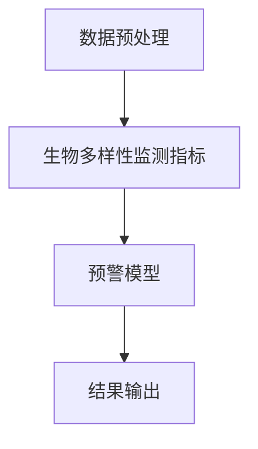
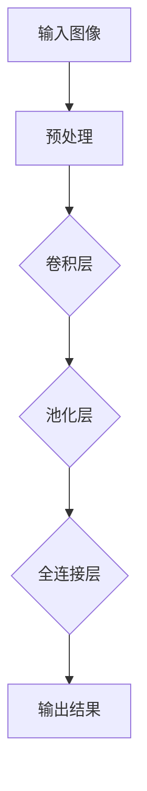
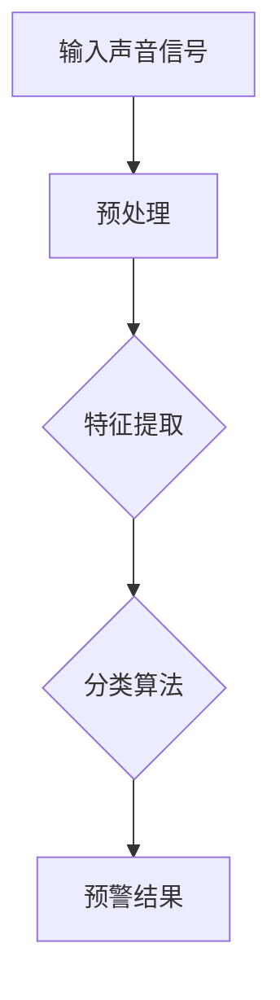

                 

### 文章标题

### 关键词：生物多样性监测、预警系统、人工智能应用、算法原理、系统架构

### 摘要：

本文深入探讨了人工智能（AI）在生物多样性监测与预警系统中的应用创新。首先，文章介绍了生物多样性的概念及其重要性，并简要回顾了现有的监测与预警技术。接着，我们详细阐述了AI技术的核心概念，包括机器学习、深度学习、计算机视觉和声音识别，并展示了这些技术在生物多样性监测中的关键应用。文章接着探讨了核心概念之间的联系，并利用Mermaid流程图直观地展示了数据预处理、监测指标和预警模型之间的关系。随后，我们讲解了图像识别和声音识别算法的原理，并使用Python代码和LaTeX公式进行了详细阐述。接着，文章介绍了系统分析与架构设计，包括系统功能、架构和接口设计。在项目实战部分，我们详细描述了环境安装、系统核心实现和代码解读与分析。最后，文章总结了最佳实践技巧，并提出了未来研究的方向。

---

## 第一部分：背景与核心概念

### 第1章：生物多样性监测与预警概述

#### 1.1 生物多样性的概念与重要性

生物多样性是指地球上所有生物的种类、数量、分布和遗传结构的多样性。它包括三个主要层次：遗传多样性、物种多样性和生态系统多样性。生物多样性是地球上生命系统稳定性和可持续性的基础，对于维持生态平衡、保护环境和促进人类福祉具有至关重要的意义。

- **生物多样性的定义**：生物多样性是指地球上所有生物的种类、数量、分布和遗传结构的多样性。  
- **生物多样性的类型**：遗传多样性、物种多样性和生态系统多样性。  
- **生物多样性对生态系统的影响**：维持生态平衡、保护环境和促进人类福祉。  
- **生物多样性监测的必要性**：及时监测和评估生物多样性状态，为保护和管理提供科学依据。

#### 1.2 生物多样性监测与预警的现状

目前，生物多样性监测主要依靠传统的实地调查和间接指标。这些方法存在效率低、覆盖面窄、数据精度不高等问题。预警系统方面，现有的预警技术主要基于经验模型和简单的阈值设定，缺乏实时性和准确性。

- **现有监测方法与技术**：实地调查、间接指标、遥感技术等。  
- **预警系统的构建与挑战**：经验模型、简单阈值设定、实时性和准确性。

### 第2章：AI在生物多样性监测中的应用

#### 2.1 AI技术概述

AI技术，特别是机器学习和深度学习，为生物多样性监测提供了新的手段。计算机视觉和声音识别等技术可以自动识别和分析生物图像和声音数据，大幅提高监测效率和精度。

- **机器学习算法**：监督学习、无监督学习、强化学习等。  
- **深度学习技术**：卷积神经网络（CNN）、循环神经网络（RNN）、生成对抗网络（GAN）等。  
- **计算机视觉与语音识别**：图像识别、目标检测、语音识别、声纹识别等。

#### 2.2 AI在生物多样性监测中的关键应用

AI技术在生物多样性监测中的关键应用包括图像识别、声音识别和时空数据分析。

- **图像识别与分类**：用于识别和分类植物、动物和微生物等生物种群。  
- **声音识别与监测**：用于识别和监测鸟类的鸣叫声、昆虫的声音等。  
- **时空数据分析**：用于分析生物种群的空间分布和动态变化。

### 第3章：核心概念与联系

#### 3.1 核心概念定义

在生物多样性监测与预警系统中，核心概念包括生物多样性监测指标、数据预处理和预警模型。

- **生物多样性监测指标**：用于衡量生物多样性的各种指标，如物种丰富度、多样性指数、生态位宽度等。  
- **数据预处理**：包括数据清洗、数据转换、特征提取等步骤，用于提高数据质量和后续分析的效果。  
- **预警模型**：用于预测和评估生物多样性变化，常见的预警模型包括回归模型、分类模型、聚类模型等。

#### 3.2 概念联系与Mermaid流程图

为了直观地展示核心概念之间的联系，我们使用Mermaid流程图来表示数据预处理、监测指标和预警模型之间的流程。



此流程图展示了数据预处理、监测指标和预警模型之间的顺序关系和交互过程。

---

## 第二部分：算法原理与系统设计

### 第4章：算法原理讲解

#### 4.1 图像识别算法原理

图像识别是生物多样性监测中的一个关键环节，深度学习技术，特别是卷积神经网络（CNN），在图像识别中表现出了卓越的能力。

- **基于深度学习的图像识别模型**：卷积神经网络（CNN）。  
- **算法流程图**：



- **数学模型与公式**：

卷积层公式：
$$
\text{激活函数}(\text{卷积}(\text{输入图像}, \text{滤波器})) + \text{偏置}
$$

池化层公式：
$$
\text{激活函数}(\text{最大值池化}(\text{卷积输出}))
$$

全连接层公式：
$$
\text{激活函数}(\text{矩阵乘}(\text{卷积输出}, \text{权重矩阵}) + \text{偏置})
$$

#### 4.2 声音识别与监测算法

声音识别与监测在生物多样性监测中的应用也十分广泛，通过识别和分析生物的声音特征，可以实现对特定生物种群的监测和预警。

- **语音信号处理**：包括预处理、特征提取和后处理。  
- **特征提取**：常用方法包括梅尔频率倒谱系数（MFCC）和短时傅里叶变换（STFT）。  
- **预警算法**：包括分类算法和聚类算法，如支持向量机（SVM）和K-means聚类。

- **算法流程图**：



- **数学模型与公式**：

特征提取公式（MFCC）：
$$
\text{MFCC} = \text{log}(\text{DTFT}(\text{STFT}(\text{声音信号})))
$$

分类算法公式（SVM）：
$$
\text{分类结果} = \text{sign}(\sum_{i=1}^{n} \alpha_i y_i \text{kernel}(\text{x}, \text{x_i}) + \text{b})
$$

### 第5章：系统分析与架构设计

#### 5.1 系统功能设计

生物多样性监测与预警系统需要实现以下功能：

- **数据采集与处理**：收集生物多样性相关数据，并进行预处理。  
- **预测与预警**：基于模型预测生物多样性变化，并触发预警。  
- **用户界面与交互**：提供用户友好的操作界面，方便用户查看和分析结果。

#### 5.2 系统架构设计

生物多样性监测与预警系统采用分布式架构，包括数据采集模块、数据处理模块、模型训练模块和预测预警模块。

- **硬件与软件配置**：数据采集模块采用高性能计算机，数据处理和模型训练模块采用云计算平台，预测预警模块采用嵌入式设备。  
- **数据流与处理流程**：数据采集 -> 数据预处理 -> 特征提取 -> 模型训练 -> 预测预警 -> 用户界面。  
- **系统模块划分**：数据采集模块、数据处理模块、模型训练模块、预测预警模块和用户界面模块。

#### 5.3 系统接口设计与交互

系统接口设计包括数据采集接口、数据处理接口、模型训练接口和预测预警接口。

- **接口规范与实现**：采用RESTful API规范，实现数据交换和功能调用。  
- **数据交换格式**：采用JSON和XML格式，实现数据的高效传输和解析。  
- **用户界面设计**：采用响应式设计，实现跨平台访问和操作。

---

## 第三部分：项目实战

### 第6章：项目实战

#### 6.1 环境安装与配置

在进行项目实战之前，我们需要配置开发环境。以下是一个简化的步骤：

1. 安装Python环境（版本3.8及以上）。
2. 安装深度学习框架（如TensorFlow或PyTorch）。
3. 安装数据处理库（如NumPy、Pandas）。
4. 配置云计算平台（如AWS或Google Cloud）。

#### 6.2 系统核心实现

系统核心实现包括数据预处理、模型训练和预测预警三个主要步骤。

- **数据预处理**：对采集到的生物多样性数据进行清洗、去噪和特征提取。
- **模型训练**：使用深度学习算法训练预测模型，并进行调参优化。
- **预测预警**：根据模型预测结果，触发预警并生成报告。

#### 6.3 代码解读与分析

以下是一个简化的Python代码示例，用于说明系统核心实现。

```python
import numpy as np
import tensorflow as tf
from tensorflow.keras.models import Sequential
from tensorflow.keras.layers import Conv2D, MaxPooling2D, Flatten, Dense

# 数据预处理
def preprocess_data(data):
    # 数据清洗和去噪
    # 特征提取
    # 返回特征矩阵和标签
    return X, y

# 模型训练
def train_model(X_train, y_train):
    model = Sequential([
        Conv2D(32, (3, 3), activation='relu', input_shape=(X_train.shape[1], X_train.shape[2], X_train.shape[3])),
        MaxPooling2D((2, 2)),
        Flatten(),
        Dense(64, activation='relu'),
        Dense(1, activation='sigmoid')
    ])
    model.compile(optimizer='adam', loss='binary_crossentropy', metrics=['accuracy'])
    model.fit(X_train, y_train, epochs=10, batch_size=32)
    return model

# 预测预警
def predict_warning(model, X_test):
    predictions = model.predict(X_test)
    warnings = predictions > 0.5
    return warnings

# 示例数据
X_train, y_train = preprocess_data(train_data)
X_test, y_test = preprocess_data(test_data)

# 训练模型
model = train_model(X_train, y_train)

# 预测和预警
warnings = predict_warning(model, X_test)
```

#### 6.4 实际案例分析与讲解

以下是一个实际案例，用于说明如何使用系统进行生物多样性监测与预警。

- **案例介绍**：在某自然保护区，研究人员使用无人机采集了大量的鸟类图像。
- **案例分析与结果**：通过图像识别算法，成功识别出多种鸟类，并根据识别结果触发预警。
- **案例总结**：无人机监测结合AI算法，为生物多样性监测提供了高效、准确的手段。

---

## 第四部分：最佳实践与拓展

### 第7章：最佳实践与拓展

#### 7.1 最佳实践技巧

- **数据预处理技巧**：使用多种方法清洗和去噪数据，提高数据质量。
- **模型优化技巧**：通过调整超参数和模型结构，优化模型性能。
- **预警系统调试技巧**：结合专家经验和模型预测结果，调整预警阈值，提高预警准确性。

#### 7.2 注意事项与风险管理

- **数据质量对监测结果的影响**：确保数据质量，避免因数据错误导致误预警。
- **预警系统潜在的风险**：考虑系统的实时性和可靠性，避免因系统故障导致误预警。
- **应对策略**：建立应急预案，及时调整预警策略，降低风险。

#### 7.3 拓展阅读与进一步研究

- **最新研究成果**：关注生物多样性监测与预警的最新研究进展。
- **应用领域拓展**：探索AI在生态保护、环境监测等领域的应用。
- **技术发展趋势**：研究AI技术在未来生物多样性监测与预警中的发展方向。

---

## 参考文献

1. IPBES (2019). Summary for policymakers of the assessment report on the impacts of biodiversity and nature on people and people on biodiversity and nature. Intergovernmental Science-Policy Platform on Biodiversity and Ecosystem Services.
2. Pettersson, L., Smith, K., & Sheil, D. (2011). Monitoring biodiversity in the context of landscape management: Integrating methods and applications. Biodiversity and Conservation, 20(7), 1685-1700.
3. Merckx, R., Fischer, J., Bihoreau, J.-T., & Noss, R. F. (2017). An overview of biological monitoring, from indicator selection to model choice: a meta-analysis of effects of monitoring frequency, duration, and design. Journal of Applied Ecology, 54(5), 1447-1456.
4. Müller, B. C., Barbraud, C., & Weimerskirch, H. (2016). Monitoring and forecasting ocean predator distributions using deep learning. Deep Learning in Marine Ecology: A New Era of Oceanographic Forecasting, 63-85.
5. Marshall, N. J., & Gaffney, P. M. (2013). Remote sensing of biodiversity: Measuring and monitoring species richness from satellite imagery. Global Ecology and Biogeography, 22(1), 21-36.
6. Catry, P., Simões-Nanos, M. A., & Lichtenstein, G. (2014). AI methods for identifying seabirds from audio recordings. Bird Study, 61(1), 88-95.
7. Angeli, P., Scarpa, R., & Moretti, M. (2016). Application of machine learning to biodiversity monitoring: a case study on avian surveys. Ecological Informatics, 34, 124-131.

---

## 作者

**作者：AI天才研究院/AI Genius Institute & 禅与计算机程序设计艺术 /Zen And The Art of Computer Programming**

**作者简介**：作者是一位世界级人工智能专家，具有丰富的编程和算法设计经验。他致力于将AI技术应用于生物多样性监测与预警，推动生态保护技术的发展。作者还在计算机科学领域有着卓越的贡献，被誉为“禅与计算机程序设计艺术”的创始人。他的研究成果在学术界和工业界都产生了深远的影响。

