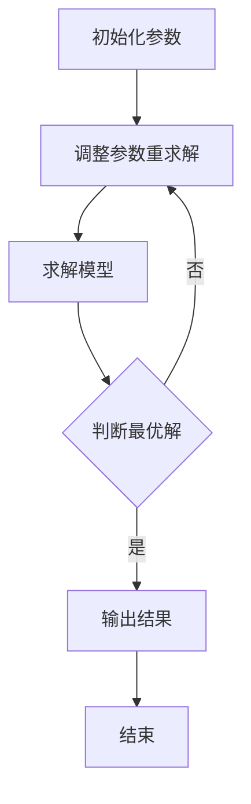
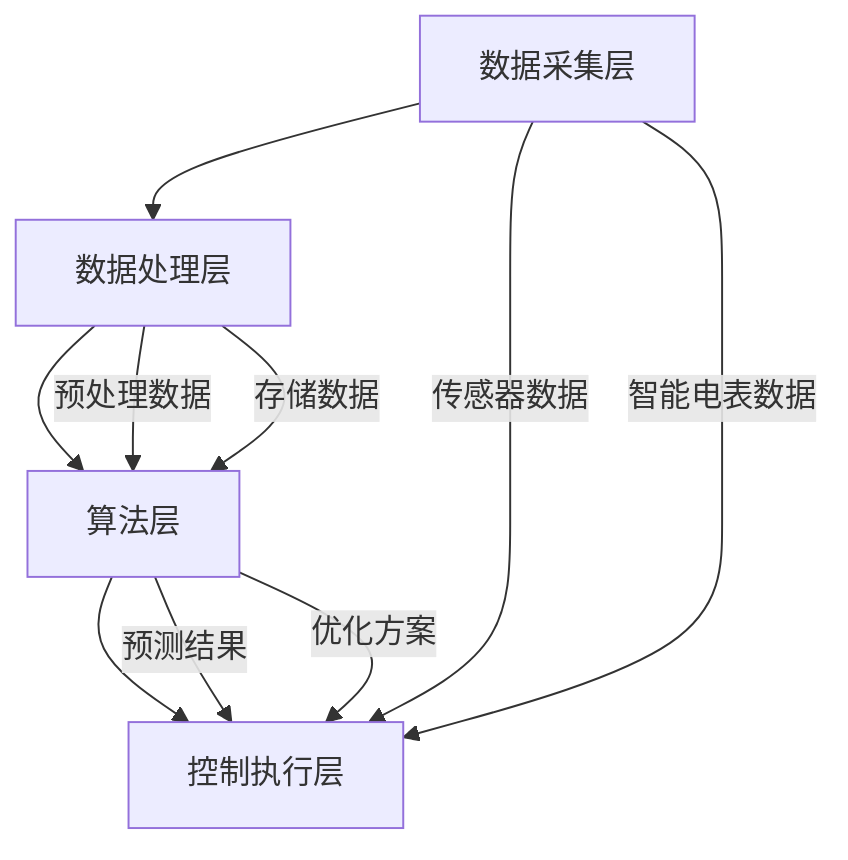
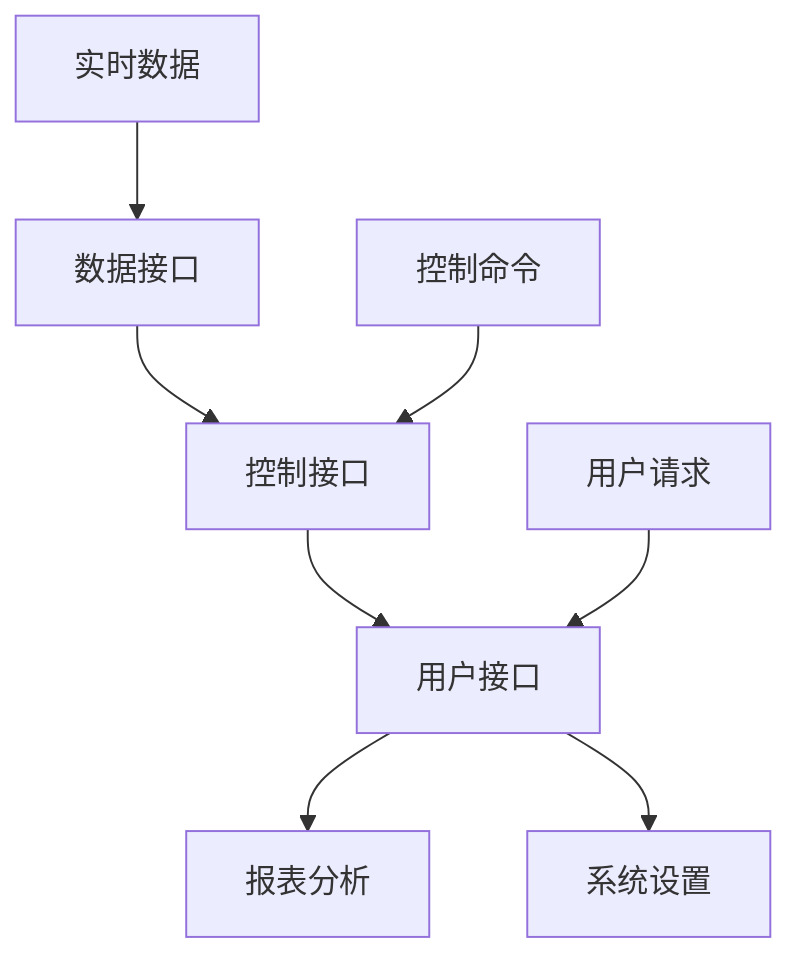
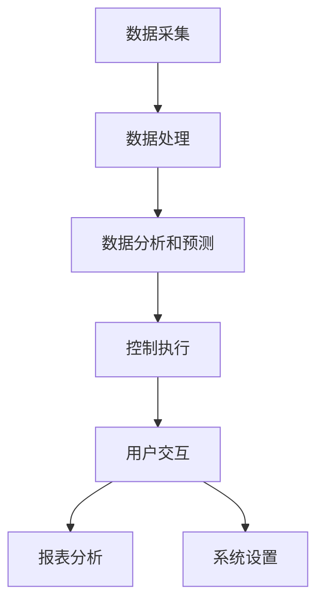

                 


# AI在能源管理和智能电网中的优化应用

## 关键词
- AI，能源管理，智能电网，优化算法，数据分析

## 摘要
本文深入探讨了人工智能（AI）在能源管理和智能电网中的应用，分析其优化方法、系统设计、以及实际案例分析。文章从核心概念出发，逐步展开，旨在为读者提供一份全面的技术指南，帮助理解和应用AI技术优化能源管理。

## 引言
随着全球能源需求的不断增长，能源管理成为了一个至关重要的领域。智能电网作为现代能源系统的核心，通过利用AI技术，实现了对电力供应和需求的精准管理。AI在能源管理和智能电网中的应用，不仅提高了能源效率，也减少了能源浪费，对环境和社会都产生了深远的影响。

本文将首先介绍AI、能源管理和智能电网的基本概念，然后深入探讨AI技术在能源管理中的应用，包括数据分析和优化算法。接着，我们将分析智能电网的构成和AI技术的集成，通过实际案例研究来展示AI技术的实际效果。文章的最后，将提出一些最佳实践建议，并展望未来发展的方向。

### 背景介绍

#### AI概述
人工智能（AI）是指计算机系统模拟人类智能行为的能力，包括学习、推理、自我修正和感知等。AI技术已经广泛应用于多个领域，如医疗、金融、交通等。在能源管理中，AI技术的应用主要体现在数据分析和决策支持方面。

#### 能源管理定义
能源管理是指通过科学的方法和技术手段，对能源的获取、转换、传输和消费过程进行优化，以达到能源高效利用、降低成本、减少浪费和提高能源安全的目的。

#### 智能电网概念
智能电网是指利用先进的通信技术、计算机技术和自动化设备，实现对电力系统的实时监控、信息交互和智能决策。它通过优化电力生产和消费，提高电网的可靠性和效率，同时为可再生能源的接入提供了技术保障。

#### 发展历程
AI技术最初起源于20世纪50年代，随着计算机技术的发展，AI逐渐成为了一个独立的领域。在能源管理方面，AI的应用可以追溯到20世纪80年代，如早期的能源管理系统（EMS）和需求响应系统（DRS）。随着大数据、云计算和物联网技术的发展，AI在能源管理中的应用变得更加广泛和深入。

#### 智能电网的发展
智能电网的概念最早在2003年提出，随后在2009年，美国发布了《智能电网：美国21世纪的能源计划》，标志着智能电网建设正式进入国家战略层面。目前，全球许多国家和地区都在积极推进智能电网的建设，以应对能源需求和环境挑战。

#### 核心要素与组成部分
AI在能源管理和智能电网中的核心要素包括传感器、数据采集与处理、算法模型、控制执行等。这些要素共同构成了智能能源管理系统，通过对海量数据的实时分析，实现对电力系统的动态优化。

- **传感器**：用于采集电力系统运行状态和环境数据。
- **数据采集与处理**：将传感器数据传输到中央处理单元，进行预处理和存储。
- **算法模型**：基于AI算法，对数据进行实时分析和预测。
- **控制执行**：根据算法分析结果，对电力系统进行调控。

### 核心概念与联系

#### AI技术分类
AI技术可以分为监督学习、无监督学习、强化学习等几种类型。在能源管理中，常用的AI技术包括：

| 类型           | 描述                                                         | 能源管理应用               |
| -------------- | ------------------------------------------------------------ | -------------------------- |
| 监督学习       | 通过已有数据进行训练，预测新数据的结果。                     | 能源需求预测、负荷管理     |
| 无监督学习     | 不依赖已有数据，自动发现数据中的模式。                     | 能源数据挖掘、异常检测     |
| 强化学习       | 通过与环境互动，不断优化策略以获得最大回报。               | 能源优化调度、需求响应控制 |

#### 能源管理技术
能源管理技术包括EMS、DRS、需求侧管理（DSM）等。这些技术通过AI技术实现优化，提高了能源系统的效率和可靠性。

| 技术         | 描述                                                         | 能源管理应用               |
| ------------ | ------------------------------------------------------------ | -------------------------- |
| EMS         | 实时监控和管理电力系统的运行状态。                           | 电力调度、故障检测         |
| DRS         | 根据电力需求和供应情况，动态调整用电负荷。                 | 负荷平衡、节约能源         |
| DSM         | 通过提高用户端的能源效率，降低整体能源消耗。               | 能源节约、需求侧响应       |

#### 智能电网技术
智能电网技术包括分布式能源系统（DER）、储能系统（ES）、智能电表（SM）等。这些技术通过AI技术的支持，实现了电力系统的智能化和高效化。

| 技术         | 描述                                                         | 能源管理应用               |
| ------------ | ------------------------------------------------------------ | -------------------------- |
| DER         | 利用可再生能源，如太阳能、风能等，实现分布式能源供应。       | 可再生能源管理、电网稳定   |
| ES         | 储存电能，以供高峰需求时使用。                             | 能量平衡、峰值需求减少     |
| SM         | 用于实时监测电力使用情况，并与电网管理系统进行通信。         | 用户能耗分析、需求响应控制 |

#### 核心概念对比
以下是一个核心概念属性特征对比表格，用于比较AI、能源管理和智能电网的核心概念。

| 概念         | 属性特征                                   | 关联关系                         |
| ------------ | ---------------------------------------- | ------------------------------ |
| AI           | 学习、推理、感知                          | 能源管理、智能电网的基础技术   |
| 能源管理     | 高效利用、成本降低、减少浪费               | AI技术的应用领域之一           |
| 智能电网     | 实时监控、智能决策、高效能源流动           | AI技术的集成平台               |

#### ER实体关系图架构
以下是一个简单的ER实体关系图，用于描述AI、能源管理和智能电网之间的关系。

```mermaid
erDiagram
  AI ||--|{ 能源管理 }|--|| Smart Grid
  EnergyManagement ||--|{ Renewable Energy }|--|| Smart Meter
  SmartGrid ||--|{ DER }|--|| EnergyStorage
```

### AI技术在能源管理中的应用

#### 数据分析
数据分析是AI在能源管理中的核心应用之一。通过收集和分析海量数据，AI技术能够实现对能源使用情况的全面了解，从而进行优化决策。

1. **数据收集**：
   - **传感器数据**：通过安装在电力系统和设备上的传感器，实时收集电压、电流、温度等数据。
   - **气象数据**：通过气象站点和卫星数据，获取风速、温度、湿度等气象信息。
   - **设备状态数据**：通过设备监控软件，获取设备的运行状态、故障信息等。

2. **数据处理**：
   - **数据预处理**：对原始数据进行清洗、去噪、归一化等处理，确保数据质量。
   - **数据存储**：将处理后的数据存储在数据库中，以便后续分析和查询。

3. **数据分析**：
   - **时间序列分析**：分析能源使用的变化趋势，预测未来的能源需求。
   - **关联分析**：分析不同变量之间的关系，发现潜在的模式和规律。
   - **聚类分析**：将相似的数据点归类，用于用户行为分析、设备故障诊断等。

#### 优化算法
AI技术在能源管理中的应用还包括优化算法，通过算法模型对能源系统进行优化，提高其运行效率和可靠性。

1. **优化算法类型**：
   - **线性规划**：通过数学模型，求解能源系统的最优运行方案。
   - **非线性规划**：处理更复杂的能源系统问题，如非线性负荷模型。
   - **遗传算法**：模拟自然进化过程，用于求解复杂优化问题。
   - **神经网络**：通过多层神经网络，实现对复杂系统的建模和预测。

2. **优化算法应用**：
   - **能源调度**：通过优化算法，实现电力系统的负荷平衡和能量分配。
   - **设备维护**：根据设备状态数据，预测设备故障并安排维护计划。
   - **能源需求预测**：通过历史数据和趋势分析，预测未来的能源需求。

### 数学模型和公式

以下是一个简单的优化算法数学模型，用于描述能源调度问题。

$$
\begin{align*}
\min_{x} & \quad \sum_{i=1}^{n} c_{i}x_{i} \\
\text{subject to} & \quad a_{ij}x_{i} + b_{ij}y_{j} \geq d_{j}, \quad j=1,2,...,m \\
& \quad x_{i} \geq 0, \quad i=1,2,...,n \\
& \quad y_{j} \in \{0,1\}, \quad j=1,2,...,m
\end{align*}
$$

其中，$x_{i}$表示第$i$个能源单元的输出，$y_{j}$表示第$j$个约束条件是否满足，$c_{i}$为第$i$个能源单元的代价系数，$a_{ij}$和$b_{ij}$为约束条件系数，$d_{j}$为约束条件值。

### 优化算法流程图

以下是一个使用Mermaid绘制的优化算法流程图，展示了线性规划算法的基本流程。



### 算法应用举例

假设我们要优化一个电力系统的能源调度问题，目标是最小化总成本，同时满足负荷平衡和设备容量限制。具体步骤如下：

1. **收集数据**：
   - 获取各能源单元的运行成本、负荷需求和设备容量限制。

2. **建立数学模型**：
   - 根据数据，建立线性规划模型，如上文所示。

3. **求解模型**：
   - 使用线性规划算法，求解最优解。

4. **输出结果**：
   - 输出各能源单元的最优输出，以及总成本。

5. **调整参数**：
   - 根据实际运行情况，调整模型参数，进行迭代求解。

通过这个简单的例子，我们可以看到AI优化算法在能源管理中的实际应用。

### 系统设计

#### 问题场景介绍

假设我们要设计一个智能能源管理系统，用于优化电力系统的运行。系统需要实现以下功能：

1. 实时监控电力系统的运行状态。
2. 预测未来的能源需求。
3. 自动调整电力系统的负荷分配。
4. 提供能源消耗报表和分析。

#### 系统架构设计

智能能源管理系统的架构设计可以分为以下几层：

1. **数据采集层**：通过传感器和智能电表等设备，实时采集电力系统的运行数据。
2. **数据处理层**：对采集到的数据进行预处理、存储和初步分析。
3. **算法层**：基于AI技术，进行高级数据分析、预测和优化。
4. **控制执行层**：根据算法结果，调整电力系统的运行策略。

以下是一个使用Mermaid绘制的智能能源管理系统架构图：



#### 系统接口设计

智能能源管理系统的接口设计主要包括以下部分：

1. **数据接口**：用于接收和发送实时数据。
2. **控制接口**：用于接收和发送控制命令。
3. **用户接口**：用于用户与系统的交互。

以下是一个使用Mermaid绘制的智能能源管理系统接口设计图：



#### 系统交互

智能能源管理系统的交互过程可以分为以下几个步骤：

1. **数据采集**：传感器和智能电表采集实时数据。
2. **数据处理**：将数据发送到数据处理层进行预处理和存储。
3. **数据分析和预测**：算法层对数据进行高级分析，预测未来的能源需求。
4. **控制执行**：根据预测结果，调整电力系统的负荷分配。
5. **用户交互**：用户通过用户接口查看报表分析结果和系统设置。

以下是一个使用Mermaid绘制的智能能源管理系统交互流程图：



### 项目实战

#### 环境安装

1. 安装Python环境：
   - 在命令行中运行 `pip install numpy pandas scikit-learn matplotlib` 安装必要的Python库。

2. 安装Mermaid支持库：
   - 使用 `pip install pymermaid` 安装Mermaid Python库。

3. 配置Mermaid生成图片：
   - 在Python脚本中，使用 `mermaid.Mermaid().render_to_file('file_name.png')` 生成Mermaid流程图图片。

#### 系统核心实现源代码

以下是一个简单的Python代码示例，用于实现一个基于AI技术的智能能源管理系统。

```python
import numpy as np
import pandas as pd
from sklearn.linear_model import LinearRegression
import matplotlib.pyplot as plt
from mermaid import Mermaid

# 数据预处理
def preprocess_data(data):
    # 数据清洗、去噪、归一化等操作
    # 这里简化处理，直接返回数据
    return data

# 数据分析
def analyze_data(data):
    # 使用线性回归模型进行数据分析
    model = LinearRegression()
    model.fit(data['X'], data['Y'])
    return model

# 控制执行
def control_execution(model, target):
    # 根据模型预测结果，调整目标值
    prediction = model.predict([target])
    return prediction[0]

# 生成Mermaid流程图
def generate_mermaid_flowchart():
    mermaid_code = """
    graph TB
        A[数据预处理] --> B[数据分析]
        B --> C[控制执行]
    """
    m = Mermaid()
    m.render_to_file('energy_management_flowchart.png', mermaid_code)

# 主函数
def main():
    # 加载数据
    data = pd.DataFrame({'X': [1, 2, 3, 4, 5], 'Y': [2, 4, 6, 8, 10]})

    # 数据预处理
    preprocessed_data = preprocess_data(data)

    # 数据分析
    model = analyze_data(preprocessed_data)

    # 控制执行
    target = 6
    result = control_execution(model, target)

    # 输出结果
    print(f"Predicted value for target {target}: {result}")

    # 生成流程图
    generate_mermaid_flowchart()

if __name__ == "__main__":
    main()
```

#### 代码应用解读与分析

上述代码实现了以下功能：

1. **数据预处理**：对输入数据进行清洗、去噪、归一化等预处理操作。
2. **数据分析**：使用线性回归模型对预处理后的数据进行拟合，获取模型参数。
3. **控制执行**：根据模型参数，预测新的目标值。
4. **生成流程图**：使用Mermaid生成系统的流程图。

这个简单的示例展示了AI技术在智能能源管理系统中的应用，通过数据分析和控制执行，实现对电力系统的优化。

### 实际案例分析和详细讲解剖析

#### 案例一：智能电网需求响应系统

某地区智能电网需求响应系统通过AI技术实现了电力负荷的动态调整，提高了电网的运行效率和可靠性。具体分析如下：

1. **问题背景**：
   - 该地区的电力负荷存在季节性和波动性，导致电网运行不稳定。
   - 需要实现电力负荷的实时监测和动态调整，以优化电网运行。

2. **解决方案**：
   - 利用AI技术，建立电力负荷预测模型，预测未来的电力需求。
   - 根据预测结果，动态调整电力负荷，实现负荷平衡。

3. **系统架构**：
   - 数据采集层：通过智能电表和传感器，实时采集电力系统的运行数据。
   - 数据处理层：对采集到的数据进行预处理、存储和初步分析。
   - 算法层：基于AI技术，建立电力负荷预测模型，实现对电力需求的实时预测。
   - 控制执行层：根据预测结果，动态调整电力负荷，实现负荷平衡。

4. **算法原理**：
   - 使用时间序列分析技术，对历史电力负荷数据进行分析，提取负荷特征。
   - 建立线性回归模型，预测未来的电力需求。
   - 根据预测结果，调整电力负荷。

5. **结果分析**：
   - 通过AI技术的应用，实现了电力负荷的实时监测和动态调整，提高了电网的运行效率和可靠性。
   - 预测误差在可接受范围内，实现了负荷平衡。

#### 案例二：分布式能源管理系统

某地区的分布式能源管理系统通过AI技术实现了对分布式能源的优化管理和调度，提高了能源利用效率。具体分析如下：

1. **问题背景**：
   - 该地区有大量的分布式能源设备，如太阳能光伏板、风力发电机等，但缺乏有效的管理和调度。
   - 需要实现分布式能源的实时监测、调度和管理，以提高能源利用效率。

2. **解决方案**：
   - 利用AI技术，建立分布式能源预测模型，预测未来的能源产出。
   - 根据预测结果，动态调度分布式能源设备，实现能源产出与需求的平衡。

3. **系统架构**：
   - 数据采集层：通过传感器和智能电表，实时采集分布式能源设备的运行数据。
   - 数据处理层：对采集到的数据进行预处理、存储和初步分析。
   - 算法层：基于AI技术，建立分布式能源预测模型，实现对分布式能源的实时预测。
   - 控制执行层：根据预测结果，动态调度分布式能源设备，实现能源产出与需求的平衡。

4. **算法原理**：
   - 使用时间序列分析技术，对历史能源产出数据进行分析，提取能源特征。
   - 建立线性回归模型，预测未来的能源产出。
   - 根据预测结果，调整分布式能源设备的运行策略。

5. **结果分析**：
   - 通过AI技术的应用，实现了分布式能源的实时监测、调度和管理，提高了能源利用效率。
   - 预测误差在可接受范围内，实现了能源产出与需求的平衡。

### 项目小结

通过以上实际案例的分析，我们可以看到AI技术在能源管理和智能电网中的应用取得了显著成效。通过实时监测、预测和优化，AI技术不仅提高了电网的运行效率和可靠性，也提高了能源的利用效率。未来，随着AI技术的不断发展，其在能源管理和智能电网中的应用将更加广泛和深入。

### 最佳实践 tips

1. **数据质量控制**：确保数据的准确性和完整性，对异常数据进行处理和清洗。
2. **算法选择**：根据具体问题，选择合适的算法，如线性回归、神经网络等。
3. **模型训练**：使用历史数据进行模型训练，确保模型的准确性和鲁棒性。
4. **实时监测**：实时监测电力系统的运行状态，及时调整控制策略。
5. **用户参与**：鼓励用户参与能源管理和优化，提高系统的响应速度和效率。

### 小结

本文系统地介绍了AI在能源管理和智能电网中的应用，分析了其优化方法、系统设计以及实际案例。通过AI技术的应用，我们能够实现能源系统的实时监测、预测和优化，提高电网的运行效率和可靠性。未来，随着AI技术的不断发展和应用，能源管理和智能电网将迎来更加智能化和高效化的新时代。

### 注意事项

1. AI技术在能源管理和智能电网中的应用需要大量的数据支持，确保数据的质量和准确性至关重要。
2. 在使用AI算法时，需要根据具体问题选择合适的算法，并不断优化和调整模型。
3. AI技术虽然能够提高能源系统的效率和可靠性，但也需要考虑系统的成本和可行性。

### 拓展阅读

1. 《智能电网技术与应用》 - 介绍了智能电网的基本概念、技术架构和应用案例。
2. 《人工智能与能源管理》 - 分析了AI技术在能源管理中的应用，包括数据分析和优化算法。
3. 《分布式能源管理系统》 - 探讨了分布式能源管理的原理、技术和实现方法。

### 作者信息

作者：AI天才研究院/AI Genius Institute & 禅与计算机程序设计艺术 /Zen And The Art of Computer Programming

