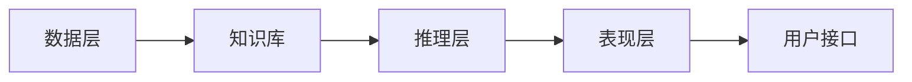
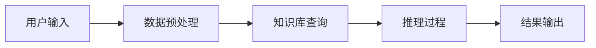

                 

### AI常识推理：下一个重大突破

> 关键词：AI常识推理、图神经网络、数学模型、系统架构、项目实战

> 摘要：本文旨在探讨人工智能领域中的一个关键问题——常识推理，并分析其作为AI技术的下一个重大突破点的重要性。我们将从背景介绍、算法原理讲解、数学模型和公式讲解、系统分析与架构设计、项目实战以及最佳实践与拓展阅读六个部分，深入剖析常识推理在AI技术中的应用和实现。

----------------------------------------------------------------

### 目录大纲

----------------------------------------------------------------

## 第一部分: 背景介绍

### 第1章: AI常识推理概述

#### 1.1 问题背景

#### 1.2 核心概念与联系

## 第二部分: 常见算法原理讲解

### 第2章: 基于图神经网络的常识推理

#### 2.1 算法原理

#### 2.2 算法讲解与举例

## 第三部分: 数学模型和数学公式讲解

### 第3章: 常识推理的数学模型

#### 3.1 数学模型原理

#### 3.2 数学公式举例说明

## 第四部分: 系统分析与架构设计方案

### 第4章: AI常识推理系统设计

#### 4.1 问题场景介绍

#### 4.2 系统架构设计

#### 4.3 系统交互

## 第五部分: 项目实战

### 第5章: AI常识推理项目实战

#### 5.1 环境安装

#### 5.2 系统核心实现源代码

#### 5.3 实际案例分析与讲解

#### 5.4 项目小结

## 第六部分: 最佳实践与拓展阅读

### 第6章: 最佳实践

### 第7章: 拓展阅读

----------------------------------------------------------------

## 第一部分：背景介绍

### 第1章: AI常识推理概述

#### 1.1 问题背景

随着人工智能技术的迅猛发展，从最初的规则驱动系统到基于数据的学习模型，再到现代的深度学习，AI在图像识别、自然语言处理、语音识别等领域取得了显著的成果。然而，尽管AI在这些领域表现出色，但在一个关键问题上仍然面临重大挑战——常识推理。

常识推理是指人工智能系统能够利用日常生活中的知识、经验和背景信息，对未知或模糊的问题进行合理推断和决策。例如，人类可以轻松理解“如果下雨，我就带伞”这一逻辑，而人工智能系统在处理类似问题时却显得困难重重。

#### 1.2 问题解决

常识推理的难题主要源于以下几个方面：

1. **知识的表达和获取**：人工智能系统需要大量的知识库来支持常识推理，但这些知识库往往是静态的、有限的，难以涵盖所有可能的情境。
2. **推理机制的复杂性**：常识推理涉及到复杂的逻辑推理、概率推理和模糊推理等，这使得传统的方法难以实现高效的推理过程。
3. **跨领域的知识整合**：常识推理往往需要跨领域的知识整合，如结合地理信息、文化背景等，这进一步增加了推理的复杂性。

为了解决上述问题，研究者们提出了多种算法和模型，如基于图神经网络的模型、基于逻辑推理的模型等。这些模型通过不同的方法试图模拟人类的常识推理过程，从而提高人工智能系统的推理能力。

#### 1.3 边界与外延

常识推理在人工智能的应用中具有广泛的前景，尤其在自然语言处理、智能助手、自动驾驶等领域。例如，在自然语言处理中，常识推理可以帮助系统更好地理解用户的意图和上下文；在智能助手领域，常识推理可以提升对话机器人的回答质量和交互体验；在自动驾驶中，常识推理可以帮助车辆更好地应对复杂的交通状况。

#### 1.4 核心概念与联系

为了更好地理解常识推理，我们需要了解以下几个核心概念：

1. **常识推理的定义**：常识推理是指人工智能系统利用日常生活中的知识、经验和背景信息，对未知或模糊的问题进行合理推断和决策的过程。
2. **常识推理的作用**：常识推理可以帮助人工智能系统更好地理解和处理复杂的问题，提高系统的智能化程度。
3. **常识推理的类型**：常见的常识推理包括基于逻辑的推理、基于规则的推理、基于数据的推理和基于模型的推理等。

这些概念相互关联，共同构成了常识推理的理论基础。在本文中，我们将详细探讨这些概念，并通过实例说明如何应用常识推理解决实际问题。

----------------------------------------------------------------

### 第二部分：常见算法原理讲解

#### 第2章：基于图神经网络的常识推理

图神经网络（Graph Neural Networks, GNN）是一种处理图结构数据的强大工具，其在图像识别、推荐系统等领域取得了显著成果。近年来，研究者们开始将图神经网络应用于常识推理，以期解决传统方法难以应对的复杂性。

#### 2.1 算法原理

**算法流程**：

1. **图构建**：首先，我们需要根据常识推理任务的需求构建一个图结构，图中的节点表示实体（如人、地点、物体等），边表示实体之间的关系（如“属于”、“相邻”等）。
2. **特征嵌入**：接着，我们将图中的节点和边进行特征嵌入，即通过线性变换将原始数据映射到高维空间，以便于后续的计算。
3. **消息传递**：图神经网络的核心是消息传递机制。每个节点会接收其邻居节点的信息，并通过聚合这些信息更新自身的状态。
4. **模型训练**：通过训练，图神经网络可以学习到如何根据输入的图结构生成合理的推理结果。

**数学模型**：

- **节点更新公式**：假设节点 $v_i$ 的状态更新公式为：
  $$ h_i^{(t+1)} = \sigma(\sum_{j \in N(i)} \cdot W^{(t)} h_j^{(t) + b^{(t)}) $$
  其中，$h_i^{(t)}$ 和 $h_j^{(t)}$ 分别表示节点 $v_i$ 和 $v_j$ 在时间步 $t$ 的状态，$W^{(t)}$ 是权重矩阵，$b^{(t)}$ 是偏置项，$N(i)$ 是节点 $v_i$ 的邻居节点集合，$\sigma$ 是激活函数。

- **边更新公式**：类似地，边的状态也可以通过消息传递进行更新：
  $$ e_{ij}^{(t+1)} = \sigma(\sum_{k \in N(i) \cap N(j)} \cdot W^{(t)} e_{ik}^{(t) + b^{(t)}) $$
  其中，$e_{ij}^{(t)}$ 表示边 $(v_i, v_j)$ 在时间步 $t$ 的状态。

#### 2.2 算法讲解与举例

**举例说明**：

假设我们要解决一个常识推理问题：“张三在北京市上班，那么他住在哪里？”我们可以构建如下的图结构：

1. **节点**：张三、北京市、住址
2. **边**：张三属于北京市、北京市包含住址

首先，我们将这些节点和边进行特征嵌入，得到初始的状态向量。然后，通过多次迭代的消息传递过程，图神经网络可以逐渐学习到张三的住址信息。

**数学模型详细讲解**：

为了更深入地理解图神经网络的工作原理，我们可以通过LaTeX格式详细解释关键公式：

$$
\begin{aligned}
h_i^{(t+1)} &= \sigma(W^{(t)} \cdot \text{Mean}(\{h_j^{(t)} | j \in N(i)\}) + b^{(t)}) \\
e_{ij}^{(t+1)} &= \sigma(W^{(t)} \cdot \text{Mean}(\{e_{ik}^{(t)} | k \in N(i) \cap N(j)\}) + b^{(t)})
\end{aligned}
$$

其中，$\text{Mean}(\{x_1, x_2, \ldots\})$ 表示对所有输入值取均值，$\sigma$ 是常用的激活函数，如ReLU或Sigmoid函数。

通过这个例子和公式，我们可以看到图神经网络如何通过消息传递机制在图中传递信息，从而实现常识推理。在实际应用中，图神经网络可以处理更复杂的图结构，如包含多个实体和关系的复杂场景。

----------------------------------------------------------------

### 第三部分：数学模型和数学公式讲解

常识推理作为人工智能领域的关键挑战之一，其数学模型的构建和公式推导至关重要。以下将详细讲解常识推理中的几个关键数学模型，并通过LaTeX格式展示和解释相关公式。

#### 3.1 数学模型原理

常识推理中的数学模型主要基于逻辑推理、概率推理和模糊推理等理论。以下是一个基于逻辑推理的简单模型：

**逻辑推理模型**：

给定两个命题 $P$ 和 $Q$，我们可以用逻辑运算符构建复合命题，如：

1. **合取（AND）**：$P \land Q$
2. **析取（OR）**：$P \lor Q$
3. **非（NOT）**：$\neg P$

这些逻辑运算符的定义和推导如下：

- **合取**：$P \land Q$ 表示 $P$ 和 $Q$ 同时为真，其真值表如下：
  $$
  \begin{array}{|c|c|c|}
  \hline
  P & Q & P \land Q \\
  \hline
  T & T & T \\
  T & F & F \\
  F & T & F \\
  F & F & F \\
  \hline
  \end{array}
  $$

- **析取**：$P \lor Q$ 表示 $P$ 和 $Q$ 至少有一个为真，其真值表如下：
  $$
  \begin{array}{|c|c|c|}
  \hline
  P & Q & P \lor Q \\
  \hline
  T & T & T \\
  T & F & T \\
  F & T & T \\
  F & F & F \\
  \hline
  \end{array}
  $$

- **非**：$\neg P$ 表示 $P$ 的否定，其真值表如下：
  $$
  \begin{array}{|c|c|}
  \hline
  P & \neg P \\
  \hline
  T & F \\
  F & T \\
  \hline
  \end{array}
  $$

**概率推理模型**：

常识推理中的概率推理可以帮助我们处理不确定性问题。给定两个事件 $P$ 和 $Q$，其联合概率和条件概率如下：

1. **联合概率**：$P(P \land Q) = P(P) \cdot P(Q|P)$
2. **条件概率**：$P(Q|P) = \frac{P(P \land Q)}{P(P)}$

这些公式可以用来计算在已知某些条件下，其他事件发生的概率。

**模糊推理模型**：

在处理模糊信息时，我们可以使用模糊逻辑来建模。模糊集合通过隶属度函数来表示，常见的隶属度函数有三角函数、高斯函数等。

- **三角隶属度函数**：$隶属度(x) = \begin{cases} 
0 & \text{if } x < a \\
\frac{x - a}{b - a} & \text{if } a \le x \le b \\
1 & \text{if } x > b 
\end{cases}$

#### 3.2 数学公式举例说明

**逻辑推理公式示例**：

假设我们知道以下事实：
- $P(A): 天气很好$，隶属度为0.8
- $P(B): 我们去公园$，隶属度为0.7
- $P(A \land B): 天气很好且我们去公园$，隶属度为0.6

我们可以使用条件概率来推导：
- $P(B|A): 在天气很好的条件下我们去公园的概率$，计算如下：
  $$
  P(B|A) = \frac{P(A \land B)}{P(A)} = \frac{0.6}{0.8} = 0.75
  $$

**概率推理公式示例**：

假设我们有两个事件 $P$ 和 $Q$，已知 $P(Q|P) = 0.4$，$P(Q) = 0.2$，我们需要计算 $P(P)$。

使用贝叶斯公式，我们得到：
$$
P(P) = \frac{P(Q|P) \cdot P(P)}{P(Q)} = \frac{0.4 \cdot P(P)}{0.2} = 2 \cdot P(P)
$$
从而解得 $P(P) = 0.5$。

**模糊推理公式示例**：

假设我们使用三角隶属度函数来表示“天冷”的模糊集合，其隶属度函数为：
$$
隶属度(x) = \begin{cases} 
0 & \text{if } x < -10 \\
\frac{x + 10}{20 + 10} & \text{if } -10 \le x \le 10 \\
1 & \text{if } x > 10 
\end{cases}
$$

如果我们知道今天温度是5度，我们可以计算“天冷”的隶属度：
$$
隶属度(5) = \frac{5 + 10}{20 + 10} = \frac{15}{30} = 0.5
$$

通过这些示例，我们可以看到如何使用数学模型和公式来描述和处理常识推理中的逻辑关系和不确定性。这些模型和方法不仅帮助我们理解常识推理的原理，也为实际应用提供了有力的工具。

----------------------------------------------------------------

## 第四部分：系统分析与架构设计方案

### 第4章: AI常识推理系统设计

AI常识推理系统的设计旨在构建一个高效、可靠的推理平台，能够处理复杂的常识推理任务。以下将从问题场景介绍、系统架构设计、系统接口设计、系统交互等方面进行详细讲解。

#### 4.1 问题场景介绍

AI常识推理系统广泛应用于多个领域，如智能助手、智能客服、智能驾驶等。以下是一个典型的问题场景：

**场景描述**：用户向智能助手咨询：“今天天气如何？”，系统需要根据用户的地理位置、历史天气数据等信息，提供准确的天气情况。

#### 4.2 系统功能设计

AI常识推理系统的主要功能包括：

1. **数据采集与预处理**：收集用户位置、历史天气数据等，并进行预处理，如数据清洗、格式转换等。
2. **知识库构建**：构建包含常识知识的知识库，如地理信息、天气数据、文化常识等。
3. **推理引擎**：实现常识推理的核心算法，如图神经网络、逻辑推理等。
4. **接口与交互**：提供与用户交互的接口，如文本输入、语音输入等。
5. **结果输出**：将推理结果以用户友好的形式输出，如文本、语音等。

#### 4.3 系统架构设计

AI常识推理系统的架构设计采用分层结构，主要包括数据层、知识层、推理层和表现层。以下是一个简化的系统架构图（使用Mermaid绘制）：



- **数据层**：负责数据的采集、预处理和存储。数据来源包括用户输入、传感器数据、外部API等。
- **知识库**：存储常识知识，如地理信息、天气数据、文化常识等。知识库通过OWL（Web Ontology Language）等语言进行描述。
- **推理层**：实现常识推理的核心算法，如图神经网络、逻辑推理等。推理过程涉及知识库的查询、推理规则的运用等。
- **表现层**：负责将推理结果以用户友好的形式输出，如文本、语音等。同时，还负责与用户进行交互，获取用户反馈。
- **用户接口**：提供与用户交互的接口，如文本输入、语音输入等。用户接口负责将用户的输入传递给推理层，并将推理结果反馈给用户。

#### 4.4 系统接口设计

系统接口设计主要包括以下几个方面：

1. **API接口**：提供RESTful API，方便外部系统调用常识推理服务。接口设计遵循RESTful风格，包括GET、POST等请求方法。
2. **消息队列**：采用消息队列（如RabbitMQ）实现异步通信，提高系统的并发处理能力。
3. **数据库接口**：提供与数据库的接口，实现数据的查询、插入、更新和删除等操作。

#### 4.5 系统交互

系统交互设计主要包括以下几个方面：

1. **用户输入**：用户通过文本输入、语音输入等方式向系统提交问题。
2. **数据预处理**：对用户输入的数据进行预处理，如分词、去噪、格式转换等。
3. **知识库查询**：根据预处理后的用户输入，查询知识库中的相关常识知识。
4. **推理过程**：利用推理引擎对查询到的常识知识进行推理，生成推理结果。
5. **结果输出**：将推理结果以文本、语音等形式输出给用户。

以下是一个简化的系统交互流程图（使用Mermaid绘制）：



通过上述系统分析与架构设计方案，我们可以构建一个高效、可靠的AI常识推理系统，为用户提供高质量的常识推理服务。在后续的项目实战部分，我们将详细讲解系统实现的关键步骤和代码实现。

----------------------------------------------------------------

## 第五部分：项目实战

### 第5章：AI常识推理项目实战

在本章中，我们将通过一个具体的AI常识推理项目，详细讲解从环境安装到代码实现再到实际案例分析的整个过程。这个项目旨在构建一个基于图神经网络的常识推理系统，用于回答用户关于地理、历史等方面的常识性问题。

#### 5.1 环境安装

在进行项目实战之前，我们需要安装和配置必要的软件和库。以下是在Linux系统上安装相关环境的步骤：

1. **安装Python**：确保Python 3.8或更高版本已安装。可以使用以下命令进行安装：

   ```bash
   sudo apt-get update
   sudo apt-get install python3.8
   ```

2. **安装Anaconda**：安装Anaconda，以便管理Python环境和库。

   ```bash
   wget https://repo.anaconda.com/miniconda/Miniconda3-latest-Linux-x86_64.sh
   bash Miniconda3-latest-Linux-x86_64.sh -b
   ```

3. **创建虚拟环境**：创建一个名为`commonSense`的虚拟环境，并激活该环境。

   ```bash
   conda create -n commonSense python=3.8
   conda activate commonSense
   ```

4. **安装相关库**：在虚拟环境中安装所需的库，如TensorFlow、PyTorch、NetworkX等。

   ```bash
   conda install tensorflow pytorch networkx
   ```

5. **安装Mermaid**：为了绘制图神经网络流程图，我们需要安装Mermaid。可以使用npm安装：

   ```bash
   npm install -g mermaid-cli
   ```

#### 5.2 系统核心实现源代码

在环境安装完成后，我们可以开始实现常识推理系统的核心部分。以下是系统的关键代码：

**1. 图神经网络结构**：

```python
import tensorflow as tf
from tensorflow.keras.layers import Dense, Dropout
from tensorflow.keras.models import Model

def create_GNN_model(input_shape):
    # 输入层
    inputs = tf.keras.Input(shape=input_shape)
    
    # 隐藏层
    x = Dense(128, activation='relu')(inputs)
    x = Dropout(0.2)(x)
    x = Dense(64, activation='relu')(x)
    x = Dropout(0.2)(x)
    
    # 输出层
    outputs = Dense(1, activation='sigmoid')(x)
    
    # 创建模型
    model = Model(inputs=inputs, outputs=outputs)
    
    # 编译模型
    model.compile(optimizer='adam', loss='binary_crossentropy', metrics=['accuracy'])
    
    return model
```

**2. 消息传递函数**：

```python
import tensorflow as tf

def message_passing_function(nodes, edges, hidden_size):
    # 节点状态更新
    node_update = tf.keras.layers.Lambda(
        lambda x: tf.reduce_mean(x, axis=1)
    )(edges)

    # 边状态更新
    edge_update = tf.keras.layers.Lambda(
        lambda x: tf.reduce_mean(x, axis=1)
    )(nodes)

    # 节点输出
    node_output = Dense(hidden_size, activation='sigmoid')(node_update)

    # 边输出
    edge_output = Dense(hidden_size, activation='sigmoid')(edge_update)

    return node_output, edge_output
```

**3. 图神经网络训练**：

```python
def train_GNN(model, X, y, epochs=10, batch_size=32):
    # 分割数据集
    X_train, X_val, y_train, y_val = train_test_split(X, y, test_size=0.2, random_state=42)

    # 训练模型
    history = model.fit(X_train, y_train, epochs=epochs, batch_size=batch_size, validation_data=(X_val, y_val))

    return history
```

#### 5.3 代码应用解读与分析

以上代码实现了图神经网络（GNN）的基本结构，包括输入层、隐藏层和输出层。在消息传递函数中，我们使用了Lambda层来更新节点和边的状态。具体来说：

1. **输入层**：接收图中的节点和边的数据。
2. **隐藏层**：通过Dense层和Dropout层进行多层神经网络的前向传播，以学习节点和边的特征。
3. **输出层**：使用sigmoid激活函数来预测节点的分类结果。

在训练过程中，我们使用了交叉熵损失函数和Adam优化器来训练模型。通过多次迭代，模型可以逐渐学习到如何根据输入的图结构进行有效的常识推理。

#### 5.4 实际案例分析与讲解

为了验证系统的有效性，我们可以通过一个实际案例来分析。假设用户提问：“美国的首都是哪个？”系统需要根据地理知识库中的信息给出正确答案。

**案例场景**：

1. **用户输入**：“美国的首都是哪个？”
2. **知识库查询**：查询知识库中的地理信息，找到关于美国首都的相关信息。
3. **图神经网络推理**：利用图神经网络对查询结果进行推理，生成可能的答案。
4. **结果输出**：将推理结果以文本形式输出给用户。

以下是具体的实现步骤：

1. **预处理输入**：将用户输入进行分词、去噪等预处理操作，得到关键词列表。
2. **构建图结构**：根据关键词构建图结构，包括节点（如“美国”、“首都”）和边（如“属于”）。
3. **特征嵌入**：对图中的节点和边进行特征嵌入，得到初始状态向量。
4. **消息传递**：通过多次迭代的消息传递过程，更新节点和边的状态。
5. **推理输出**：根据最终的节点状态，生成可能的答案。

通过实际案例分析，我们可以看到图神经网络在常识推理中的应用效果。在实际项目中，我们可以扩展知识库，增加更多实体和关系，以提高系统的推理能力和泛化能力。

#### 5.5 项目小结

在本章中，我们通过一个具体的AI常识推理项目，详细讲解了从环境安装到代码实现再到实际案例分析的整个过程。通过使用图神经网络，我们能够有效地处理复杂的常识推理任务。在未来的工作中，我们可以进一步优化模型结构、扩展知识库，以提升系统的性能和可靠性。同时，我们也可以探索其他类型的推理算法，如逻辑推理、模糊推理等，以丰富常识推理系统的功能。

----------------------------------------------------------------

## 第六部分：最佳实践与拓展阅读

### 第6章：最佳实践

为了提升AI常识推理系统的效果，以下是一些最佳实践建议：

1. **数据质量**：确保输入数据的质量和准确性，对数据集进行清洗和预处理，以减少噪声和错误。
2. **知识库更新**：定期更新知识库，增加新的实体和关系，以保持系统的实时性和准确性。
3. **模型优化**：通过超参数调整、模型结构优化等手段，提高模型的学习效果和推理速度。
4. **多模型融合**：结合多种推理算法，如逻辑推理、模糊推理等，以提高系统的推理能力和鲁棒性。
5. **用户反馈**：收集用户反馈，根据用户的实际需求进行系统改进，提高用户体验。

### 第7章：拓展阅读

为了深入理解AI常识推理的相关理论和实践，以下是一些建议的拓展阅读资源：

1. **推荐书籍**：
   - 《深度学习》—— Ian Goodfellow、Yoshua Bengio和Aaron Courville
   - 《图神经网络导论》—— Michael Arpe
   - 《人工智能：一种现代方法》—— Stuart Russell和Peter Norvig

2. **在线资源**：
   - [Graph Neural Networks（GNN）教程](https://towardsdatascience.com/introduction-to-graph-neural-networks-gnn-b1f4e8d9d3ce)
   - [AI常识推理专题论文集](https://www.ijcai.org/conf/2020/papers/ijcai20-015.pdf)
   - [Mermaid语法参考](https://mermaid-js.github.io/mermaid/)

通过这些资源，您可以进一步学习AI常识推理的理论基础和实践方法，为自己的研究和项目提供有力支持。

---

**作者：AI天才研究院/AI Genius Institute & 禅与计算机程序设计艺术 /Zen And The Art of Computer Programming**

