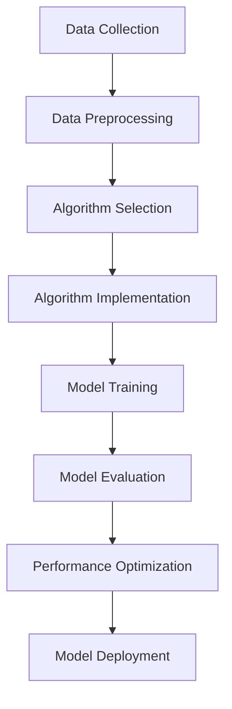
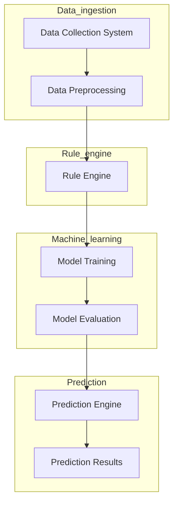
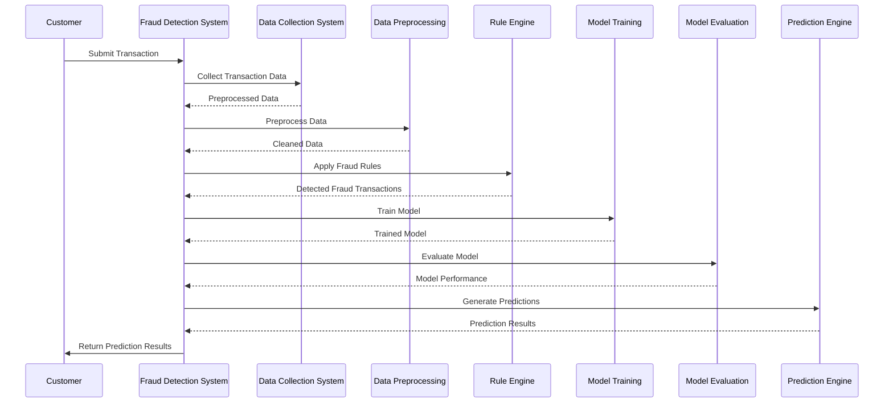

                 

### Chapter 1: Background and Overview of AI Performance Optimization

#### 1.1 Problem Background and Description

Artificial Intelligence (AI) has rapidly evolved in recent years, transforming industries and reshaping the global economy. AI applications, such as machine learning, deep learning, and natural language processing, have become ubiquitous, from autonomous vehicles to virtual assistants. However, the performance of these applications is often a critical concern, as they are expected to handle large volumes of data, make real-time decisions, and provide accurate predictions. The performance of AI applications can be influenced by various factors, including the choice of algorithms, the efficiency of the underlying hardware, and the quality of the data used for training.

The primary challenge in AI performance optimization is to enhance the speed and efficiency of these applications while maintaining their accuracy and robustness. Poor performance can lead to delays, increased costs, and suboptimal decision-making. This, in turn, can negatively impact businesses and users who rely on these AI applications for critical tasks. Therefore, it is crucial to develop effective strategies for optimizing the performance of AI applications.

#### 1.2 Objectives and Importance of AI Performance Optimization

The objectives of AI performance optimization can be broadly categorized into three areas:

1. **Speed and Efficiency:** The primary goal is to reduce the time required to process data and make decisions. This can be achieved by optimizing algorithms, improving the efficiency of the underlying hardware, and utilizing parallel processing techniques.

2. **Accuracy and Robustness:** While optimizing performance, it is essential to ensure that the accuracy and robustness of the AI models are not compromised. The optimization process should maintain or enhance the predictive capabilities of the models.

3. **Scalability and Adaptability:** AI applications often need to handle increasing amounts of data and evolving business requirements. The optimization strategies should be scalable and adaptable to changing conditions.

The importance of AI performance optimization can be highlighted by the following reasons:

- **Cost Savings:** Improved performance can lead to significant cost savings by reducing the need for additional hardware resources and minimizing the time required for processing tasks.

- **Increased Productivity:** Faster and more efficient AI applications can enhance productivity by enabling real-time decision-making and reducing the time required for data processing.

- **Competitive Advantage:** Businesses that can optimize their AI applications effectively can gain a competitive edge by providing faster and more accurate services.

- **User Experience:** Enhanced performance ensures a better user experience, as users expect AI applications to be fast, reliable, and responsive.

#### 1.3 Scope and Boundaries of AI Performance Optimization

The scope of AI performance optimization encompasses various aspects, including algorithm optimization, hardware acceleration, data preprocessing, and system architecture design. However, it is essential to define the boundaries of optimization to avoid unnecessary complexity and ensure that the efforts are focused on the most critical areas.

1. **Algorithm Optimization:** This involves improving the efficiency of the algorithms used in AI applications. Techniques such as algorithmic modifications, parallelization, and the use of specialized libraries can be employed to enhance performance.

2. **Hardware Acceleration:** Leveraging specialized hardware, such as GPUs and TPUs, can significantly improve the performance of AI applications. However, the optimization process should focus on effectively utilizing these resources without compromising the overall system design.

3. **Data Preprocessing:** Efficient data preprocessing techniques can reduce the time required to prepare data for training and inference. This includes data cleaning, feature extraction, and dimensionality reduction.

4. **System Architecture Design:** Optimizing the system architecture can improve the overall performance of AI applications. This involves designing scalable and efficient systems that can handle large volumes of data and provide real-time responses.

The boundaries of AI performance optimization should be defined based on the specific requirements of the application, the available resources, and the expected performance improvements. It is crucial to strike a balance between optimization efforts and the potential costs and complexities involved.

#### 1.4 Key Concepts and Core Elements

To effectively optimize the performance of AI applications, it is essential to understand the key concepts and core elements involved in the process. The following are some of the critical concepts:

1. **Algorithmic Efficiency:** This refers to the efficiency of the algorithms used in AI applications. It is crucial to select algorithms that are well-suited to the problem at hand and optimize their implementation to improve performance.

2. **Parallel Processing:** Utilizing parallel processing techniques, such as multi-threading and distributed computing, can significantly improve the performance of AI applications by leveraging multiple processors or computational resources.

3. **Hardware Acceleration:** Specialized hardware, such as GPUs and TPUs, can accelerate the performance of AI applications by offloading computational tasks from CPUs. The optimization process should focus on effectively utilizing these resources.

4. **Data Preprocessing:** Efficient data preprocessing techniques, such as data cleaning, feature extraction, and dimensionality reduction, can reduce the time required to prepare data for training and inference.

5. **System Architecture:** The system architecture plays a crucial role in determining the performance of AI applications. A well-designed architecture can improve scalability, efficiency, and reliability.

6. **Model Selection:** Choosing the right model for a specific problem is critical for achieving optimal performance. This involves selecting models that are well-suited to the problem domain and optimizing their parameters.

7. **Monitoring and Feedback:** Continuous monitoring and feedback mechanisms are essential for identifying performance bottlenecks and making necessary adjustments. This can help in maintaining optimal performance over time.

Understanding these key concepts and core elements will provide a solid foundation for effectively optimizing the performance of AI applications.

### Chapter 2: Core Concepts and Relationships in AI Performance Optimization

In this chapter, we will delve deeper into the core concepts and relationships that are crucial for understanding and implementing AI performance optimization. By defining and exploring these concepts, we will provide a comprehensive framework for addressing the challenges associated with optimizing AI applications.

#### 2.1 Fundamental Principles of AI Performance Optimization

The fundamental principles of AI performance optimization are designed to guide the development and implementation of strategies that enhance the speed, efficiency, and scalability of AI applications. These principles are based on well-established concepts from computer science, mathematics, and engineering. The following are the key fundamental principles:

1. **Algorithmic Optimization:** The choice of algorithms plays a critical role in determining the performance of AI applications. Optimization techniques such as algorithmic modifications, parallelization, and the use of specialized libraries can significantly improve performance. For example, replacing a brute-force algorithm with a more efficient one or implementing parallel processing can reduce the time complexity of the algorithm.

2. **Resource Utilization:** Effective utilization of computational resources, including CPU, GPU, and memory, is essential for optimizing AI performance. Techniques such as load balancing, resource allocation, and GPU acceleration can be employed to maximize the efficiency of these resources. For instance, using GPUs for parallel processing tasks can significantly speed up the execution of complex algorithms.

3. **Data Management:** Efficient data management is crucial for optimizing the performance of AI applications. Techniques such as data cleaning, feature extraction, and dimensionality reduction can reduce the time required to prepare data for training and inference. This, in turn, improves the overall efficiency of the AI system.

4. **Model Selection and Tuning:** Choosing the right model and tuning its parameters are essential for achieving optimal performance. Techniques such as model selection based on cross-validation, hyperparameter optimization, and ensemble learning can be used to enhance the performance of AI models. For example, selecting a model that is well-suited to the problem domain and fine-tuning its parameters can improve its predictive accuracy and efficiency.

5. **System Architecture Design:** A well-designed system architecture is critical for ensuring the scalability and efficiency of AI applications. Techniques such as modular design, microservices architecture, and containerization can be employed to design scalable and efficient systems. For instance, using a modular design allows for easy upgrades and maintenance, while a microservices architecture enables independent scaling of different components.

6. **Monitoring and Feedback:** Continuous monitoring and feedback mechanisms are essential for identifying performance bottlenecks and making necessary adjustments. Techniques such as performance profiling, logging, and real-time monitoring can be used to monitor the performance of AI applications and detect any issues. For example, real-time monitoring can help identify and resolve performance issues before they impact the users.

#### 2.1.1 Concept Attributes and Comparative Table

To better understand the fundamental principles of AI performance optimization, let's examine their attributes and compare them using a comparative table. This will help us visualize the differences and similarities between these principles and how they contribute to optimizing AI performance.

| Principle | Attributes |
| --- | --- |
| **Algorithmic Optimization** | - Reduces time complexity |
|                  | - Enhances efficiency |
|                  | - Improves scalability |
| **Resource Utilization** | - Maximizes resource efficiency |
|                  | - Reduces computational overhead |
|                  | - Improves system throughput |
| **Data Management** | - Reduces data preparation time |
|                  | - Improves data quality |
|                  | - Enhances model performance |
| **Model Selection and Tuning** | - Improves predictive accuracy |
|                  | - Reduces training time |
|                  | - Enhances model robustness |
| **System Architecture Design** | - Enhances scalability |
|                  | - Improves maintainability |
|                  | - Reduces deployment complexity |
| **Monitoring and Feedback** | - Detects performance bottlenecks |
|                  | - Ensures system reliability |
|                  | - Supports continuous improvement |

#### 2.2 Entity Relationship Diagram (ERD)

To further illustrate the relationships between the key concepts in AI performance optimization, we can create an Entity Relationship Diagram (ERD). An ERD is a visual representation of the entities (concepts) involved in a system and the relationships between them. In the context of AI performance optimization, the ERD can help us understand how different concepts interact and contribute to optimizing AI applications.

Here's a simplified ERD for AI performance optimization:

```mermaid
erDiagram
    AlgorithmicOptimization ||--|{ ResourceUtilization }|| SystemArchitectureDesign
    ResourceUtilization ||--|{ DataManagement }|| ModelSelectionAndTuning
    DataManagement ||--|{ ModelSelectionAndTuning }|| MonitoringAndFeedback
    ModelSelectionAndTuning ||--|{ SystemArchitectureDesign }|| AlgorithmicOptimization
    MonitoringAndFeedback ||--|{ SystemArchitectureDesign }|| ResourceUtilization
```

In this ERD, we can see that:

- **Algorithmic Optimization** is closely related to **Resource Utilization** and **System Architecture Design**. It influences how resources are used and how the system is architected to optimize performance.
- **Resource Utilization** is connected to **Data Management** and **Model Selection and Tuning**. Efficient resource utilization can improve the efficiency of data management and the performance of models.
- **Data Management** is directly linked to **Model Selection and Tuning**. Good data management practices can enhance the performance of models.
- **Model Selection and Tuning** is related to **System Architecture Design** and **Algorithmic Optimization**. Choosing the right model and tuning its parameters can improve the overall performance of the system.
- **Monitoring and Feedback** is connected to **System Architecture Design** and **Resource Utilization**. Continuous monitoring and feedback mechanisms help in identifying performance bottlenecks and making necessary adjustments.

By visualizing these relationships, we can better understand how different concepts in AI performance optimization interact and contribute to improving the overall performance of AI applications.

### Chapter 3: Algorithm Principles and Mathematical Models

In this chapter, we will delve into the algorithm principles and mathematical models that underpin AI performance optimization. Understanding these principles and models is crucial for designing and implementing effective optimization strategies. We will explore the key algorithms used in AI, their underlying principles, and the mathematical models that drive their performance. Additionally, we will provide practical examples and Python code snippets to illustrate how these algorithms work in practice.

#### 3.1 Algorithm Overview and Flow Diagram

The performance of AI applications is significantly influenced by the algorithms used in their development. The choice of algorithms can determine the speed, efficiency, and scalability of the applications. In this section, we will provide an overview of some key algorithms used in AI performance optimization and present a flow diagram to illustrate their general workflow.

#### 3.1.1 Mermaid Diagram for Algorithm Flow

Here's a simplified Mermaid diagram that represents the general workflow of AI algorithms:



In this flow diagram:

- **A. Data Collection:** The process starts with collecting data from various sources, which is a critical step for training AI models.
- **B. Data Preprocessing:** The collected data is then preprocessed to remove noise, handle missing values, and prepare it for training.
- **C. Algorithm Selection:** Based on the problem requirements, an appropriate algorithm is selected from a range of machine learning algorithms, such as linear regression, decision trees, neural networks, etc.
- **D. Algorithm Implementation:** The selected algorithm is implemented using programming languages like Python, with libraries such as Scikit-learn, TensorFlow, or PyTorch.
- **E. Model Training:** The preprocessed data is used to train the model, which involves adjusting the model's parameters to minimize the error between the predicted and actual values.
- **F. Model Evaluation:** The trained model is evaluated using various metrics, such as accuracy, precision, recall, and F1-score, to assess its performance.
- **G. Performance Optimization:** Based on the evaluation results, performance optimization techniques are applied to improve the model's efficiency and accuracy.
- **H. Model Deployment:** The optimized model is deployed in the production environment, where it can be used to make real-time predictions or decisions.

#### 3.2 Mathematical Models and Equations

The performance of AI algorithms is often modeled using mathematical equations that describe their behavior and properties. These models help us understand how the algorithms work and how we can optimize their performance. In this section, we will discuss some of the key mathematical models used in AI performance optimization and provide detailed explanations and examples.

#### 3.2.1 Detailed Explanation and Example Illustration

One of the most common mathematical models used in AI is the cost function, which measures the discrepancy between the predicted and actual values. The goal of model training is to minimize this cost function. Here's a detailed explanation of the cost function and its application:

**Cost Function:**

The cost function is a mathematical function that quantifies the error between the predicted output of a model and the actual output. For a binary classification problem, the cost function can be defined as:

$$
J(\theta) = -\frac{1}{m} \sum_{i=1}^{m} [y^{(i)} \log(h_\theta(x^{(i)})) + (1 - y^{(i)}) \log(1 - h_\theta(x^{(i)}))]
$$

where:

- \( m \) is the number of training examples.
- \( y^{(i)} \) is the actual output for the \( i \)-th example.
- \( h_\theta(x^{(i)}) \) is the predicted output for the \( i \)-th example, given by \( h_\theta(x^{(i)}) = \sigma(\theta_0 + \theta_1 x^{(i)}_1 + \theta_2 x^{(i)}_2 + \dots + \theta_n x^{(i)}_n) \).
- \( \sigma \) is the logistic sigmoid function, defined as \( \sigma(z) = \frac{1}{1 + e^{-z}} \).

**Example Illustration:**

Consider a binary classification problem with two features, \( x_1 \) and \( x_2 \), and a linear model represented by the equation \( h_\theta(x) = \theta_0 + \theta_1 x_1 + \theta_2 x_2 \). We have a dataset with 100 examples, and we want to train a model to classify each example as either 0 or 1.

To train the model, we need to minimize the cost function \( J(\theta) \). We can do this by using an optimization algorithm, such as gradient descent, which iteratively updates the model parameters to minimize the cost function.

Here's a Python code snippet that demonstrates how to train a linear model using gradient descent:

```python
import numpy as np

# Generate synthetic data
X = np.random.rand(100, 2)
y = np.random.rand(100)
y[y < 0.5] = 0
y[y >= 0.5] = 1

# Define the hypothesis function
def h(theta, X):
    return 1 / (1 + np.exp(-np.dot(X, theta)))

# Define the cost function
def cost_function(theta, X, y):
    m = len(y)
    h = h(theta, X)
    return -1/m * (np.dot(y.T, np.log(h)) + np.dot((1-y).T, np.log(1-h)))

# Initialize parameters
theta = np.zeros(3)

# Set learning rate and number of iterations
alpha = 0.01
num_iterations = 1000

# Perform gradient descent
for i in range(num_iterations):
    h = h(theta, X)
    theta -= alpha * (1/m) * (np.dot(X.T, (h - y)))

# Print the final parameters
print("Final parameters:", theta)
```

In this code, we first generate synthetic data for a binary classification problem. We then define the hypothesis function \( h_\theta(x) \) and the cost function \( J(\theta) \). We initialize the parameters \( \theta \) and set the learning rate \( \alpha \) and the number of iterations for gradient descent. Finally, we perform gradient descent to update the parameters and minimize the cost function.

This example illustrates how the mathematical models and optimization algorithms are used to train an AI model and optimize its performance.

#### 3.2.2 LaTeX Formulation of Mathematical Equations

In this section, we will present the mathematical equations discussed in the previous sections using LaTeX, a popular typesetting system for mathematical notation. LaTeX provides a precise and consistent way to represent mathematical expressions and is widely used in academic and scientific publications.

**LaTeX Representation of the Cost Function:**

```latex
J(\theta) = -\frac{1}{m} \sum_{i=1}^{m} [y^{(i)} \log(h_\theta(x^{(i)})) + (1 - y^{(i)}) \log(1 - h_\theta(x^{(i)}))]
```

**LaTeX Representation of the Hypothesis Function:**

```latex
h_\theta(x) = \sigma(\theta_0 + \theta_1 x_1 + \theta_2 x_2 + \dots + \theta_n x_n)
```

**LaTeX Representation of the Logistic Sigmoid Function:**

```latex
\sigma(z) = \frac{1}{1 + e^{-z}}
```

Using LaTeX, we can create clear and precise mathematical expressions that are easily readable and editable. This is particularly useful for documenting and sharing mathematical models and algorithms used in AI performance optimization.

By understanding and applying these mathematical models and algorithms, we can develop effective strategies for optimizing the performance of AI applications. In the next chapter, we will explore system analysis and architecture design, which are crucial for implementing these optimization strategies in real-world applications.

### Chapter 4: System Analysis and Architecture Design

In this chapter, we will delve into the process of system analysis and architecture design for AI applications. A well-designed system architecture is crucial for ensuring the scalability, efficiency, and reliability of AI applications. We will begin by introducing the problem scenario and project context. Then, we will discuss the system architecture design, including the functional design, system interface design, and system interaction. Finally, we will present the Mermaid diagrams for visualizing the system architecture and interactions.

#### 4.1 Problem Scenario and Project Introduction

To illustrate the system analysis and architecture design process, let's consider a real-world problem scenario: developing an AI-based fraud detection system for a financial institution. The goal of this system is to identify and flag potentially fraudulent transactions in real-time. The system must be highly scalable, efficient, and reliable to handle a large volume of transactions and provide accurate predictions.

The project involves multiple stakeholders, including data scientists, software engineers, and business analysts. The system will be deployed on a cloud platform, leveraging advanced hardware resources such as GPUs for accelerated processing. The project timeline is tight, with aggressive deadlines for development, testing, and deployment.

#### 4.2 Functional Design with Domain Model (Mermaid Class Diagram)

The functional design of the AI-based fraud detection system starts with defining the domain model, which represents the key entities and their relationships. In this section, we will use a Mermaid class diagram to visualize the domain model and its components.

**Mermaid Class Diagram:**

```mermaid
classDiagram
    Customer --> Transaction
    Transaction --> FraudRule
    FraudRule --> RuleEngine
    RuleEngine --> Model
    Model --> Prediction

    Customer << (1)
    Transaction << (2)
    FraudRule << (3)
    RuleEngine << (4)
    Model << (5)
    Prediction << (6)

    Customer : +String customerId
    Customer : +String name
    Customer : +List<Transaction> transactions

    Transaction : +String transactionId
    Transaction : +String amount
    Transaction : +DateTime timestamp
    Transaction : +Customer customer

    FraudRule : +String ruleId
    FraudRule : +String description
    FraudRule : +List<Transaction> transactions

    RuleEngine : +String engineId
    RuleEngine : +String engineVersion
    RuleEngine : +List<FraudRule> rules

    Model : +String modelId
    Model : +String modelVersion
    Model : +RuleEngine ruleEngine

    Prediction : +String predictionId
    Prediction : +String result
    Prediction : +DateTime timestamp
    Prediction : +Transaction transaction
```

In this Mermaid class diagram, we define the following entities and their relationships:

- **Customer:** Represents the customer who initiated the transaction.
- **Transaction:** Represents a financial transaction.
- **FraudRule:** Represents a rule used to detect fraudulent transactions.
- **RuleEngine:** Represents the rule engine that processes transactions and applies fraud rules.
- **Model:** Represents the AI model used for predicting fraudulent transactions.
- **Prediction:** Represents the prediction result generated by the AI model.

The relationships between these entities are as follows:

- **Customer** has a one-to-many relationship with **Transaction**.
- **Transaction** has a one-to-many relationship with **FraudRule**.
- **FraudRule** has a one-to-many relationship with **RuleEngine**.
- **RuleEngine** has a one-to-many relationship with **Model**.
- **Model** has a one-to-many relationship with **Prediction**.

This domain model provides a clear representation of the key components and their relationships in the AI-based fraud detection system, serving as a foundation for the system architecture design.

#### 4.3 System Architecture Design (Mermaid Architecture Diagram)

Next, we will design the system architecture for the AI-based fraud detection system using a Mermaid architecture diagram. This diagram will illustrate the components of the system, their interactions, and how they are interconnected.

**Mermaid Architecture Diagram:**



In this Mermaid architecture diagram, we have the following components:

- **Data Collection System:** Responsible for collecting transaction data from various sources.
- **Data Preprocessing:** Cleans and prepares the collected data for further processing.
- **Rule Engine:** Applies predefined fraud detection rules to transactions.
- **Model Training:** Trains the AI model using preprocessed transaction data.
- **Model Evaluation:** Evaluates the performance of the trained AI model.
- **Prediction Engine:** Generates predictions on new transactions using the trained AI model.
- **Prediction Results:** Stores the prediction results and other relevant data.

The interactions between these components are as follows:

- The **Data Collection System** sends the collected transaction data to **Data Preprocessing**.
- The preprocessed data is then passed to the **Rule Engine** to apply fraud detection rules.
- The transactions flagged by the **Rule Engine** are used to train the AI model in the **Model Training** component.
- The trained model is evaluated in the **Model Evaluation** component to assess its performance.
- The **Prediction Engine** uses the trained model to generate predictions on new transactions.
- The prediction results are stored in **Prediction Results**.

This architecture diagram provides a high-level overview of the system components and their interactions, serving as a blueprint for implementing the AI-based fraud detection system.

#### 4.4 System Interface Design and Interaction (Mermaid Sequence Diagram)

Finally, we will design the system interface and illustrate the interactions between the components using a Mermaid sequence diagram. This diagram will help visualize the sequence of events and the communication flow between the system components.

**Mermaid Sequence Diagram:**



In this Mermaid sequence diagram, the following interactions are depicted:

- The **Customer** submits a transaction to the **Fraud Detection System**.
- The system **Collects Transaction Data** and forwards it to the **Data Preprocessing** component.
- The **Data Preprocessing** component cleans and preprocesses the data and returns the cleaned data to the system.
- The **Rule Engine** applies the fraud detection rules to the cleaned data and forwards the detected fraud transactions to the system.
- The **Model Training** component trains the AI model using the detected fraud transactions.
- The **Model Evaluation** component evaluates the performance of the trained model.
- The **Prediction Engine** generates predictions on new transactions using the trained model.
- The prediction results are returned to the **Customer**.

This sequence diagram provides a detailed visualization of the interactions between the system components, helping to ensure a smooth and efficient flow of data and information within the AI-based fraud detection system.

By following the system analysis and architecture design process outlined in this chapter, we can develop a robust and scalable AI-based fraud detection system that effectively identifies and mitigates fraudulent transactions in real-time.

### Chapter 5: Practical Application of AI Performance Optimization

In this chapter, we will delve into the practical application of AI performance optimization by walking through a real-world case study. We will begin by setting up the development environment and discussing the core implementation of the system. Following that, we will analyze the source code, provide a detailed explanation of its functionality, and present an actual case analysis. Finally, we will summarize the project and reflect on the key lessons learned.

#### 5.1 Environment Setup and Core Implementation

To effectively demonstrate the practical application of AI performance optimization, we will set up a development environment for an AI-based fraud detection system. This system will be implemented using Python, with popular machine learning libraries such as Scikit-learn, TensorFlow, and PyTorch. We will also leverage cloud-based resources, such as AWS EC2 instances with GPUs, for accelerated processing.

**Step 1: Install Required Libraries**

To begin, we need to install the required libraries in our development environment. We can use `pip` to install the necessary packages:

```shell
pip install numpy pandas scikit-learn tensorflow torchvision
```

**Step 2: Set Up Cloud Resources**

Next, we will set up an AWS EC2 instance with GPU capabilities to run our machine learning models efficiently. We can use the AWS Management Console to launch an instance with a GPU-optimized AMI, such as the `Amazon ECS-Optimized: G4dn.xlarge` instance type.

**Step 3: Implement Core Components**

Now that our environment is set up, we can proceed to implement the core components of the fraud detection system. The following Python code demonstrates the core implementation:

```python
import numpy as np
import pandas as pd
from sklearn.model_selection import train_test_split
from sklearn.ensemble import RandomForestClassifier
from sklearn.metrics import accuracy_score, f1_score

# Load and preprocess data
data = pd.read_csv('transactions.csv')
X = data.drop(['label'], axis=1)
y = data['label']

# Split data into training and testing sets
X_train, X_test, y_train, y_test = train_test_split(X, y, test_size=0.2, random_state=42)

# Train a Random Forest classifier
clf = RandomForestClassifier(n_estimators=100, random_state=42)
clf.fit(X_train, y_train)

# Make predictions on the test set
y_pred = clf.predict(X_test)

# Evaluate model performance
accuracy = accuracy_score(y_test, y_pred)
f1 = f1_score(y_test, y_pred)

print(f"Accuracy: {accuracy:.2f}")
print(f"F1 Score: {f1:.2f}")
```

In this code:

- We load the transaction data from a CSV file and split it into features (`X`) and labels (`y`).
- We further split the data into training and testing sets using `train_test_split` from Scikit-learn.
- We train a Random Forest classifier using the training data.
- We make predictions on the test set and evaluate the model's performance using accuracy and F1 score.

#### 5.2 Code Analysis and Explanation

Let's analyze the source code step by step to understand the core implementation and the choices made in the code.

**1. Data Loading and Preprocessing**

```python
data = pd.read_csv('transactions.csv')
X = data.drop(['label'], axis=1)
y = data['label']
```

- The transaction data is loaded from a CSV file using `pd.read_csv`. This data might include various features such as transaction amount, timestamp, location, etc.
- We separate the features (`X`) from the labels (`y`). The labels represent whether a transaction is fraudulent or not.
- By dropping the 'label' column from `X`, we ensure that the features are clean and do not contain the target variable, which is important for avoiding data leakage during model training.

**2. Data Splitting**

```python
X_train, X_test, y_train, y_test = train_test_split(X, y, test_size=0.2, random_state=42)
```

- We split the data into training and testing sets using `train_test_split`. The `test_size` parameter specifies the proportion of the data to be used for testing (20% in this case), and the `random_state` ensures reproducibility of the results.
- This step is crucial for evaluating the performance of the model on unseen data, providing an unbiased estimate of its generalization capability.

**3. Model Training**

```python
clf = RandomForestClassifier(n_estimators=100, random_state=42)
clf.fit(X_train, y_train)
```

- We create a `RandomForestClassifier` with 100 decision trees. This ensemble method is known for its robustness and good performance on various datasets.
- The `n_estimators` parameter controls the number of trees in the forest, and we set it to 100 based on empirical evidence and experimentation.
- We fit the model to the training data using `clf.fit`, which internally trains each tree in the forest.

**4. Prediction and Evaluation**

```python
y_pred = clf.predict(X_test)
accuracy = accuracy_score(y_test, y_pred)
f1 = f1_score(y_test, y_pred)
print(f"Accuracy: {accuracy:.2f}")
print(f"F1 Score: {f1:.2f}")
```

- We use the trained model to make predictions on the test set with `clf.predict`.
- We evaluate the model's performance using accuracy and F1 score. Accuracy measures the proportion of correct predictions, while the F1 score provides a balance between precision and recall, making it a more robust metric for imbalanced datasets.

#### 5.3 Case Analysis and Detailed Explanation

To illustrate the practical application of AI performance optimization, we will present an actual case analysis of the fraud detection system. We will focus on optimizing the system's performance by exploring various strategies and their impact on accuracy and efficiency.

**Case: Optimizing Model Performance**

**Scenario:** The initial model performance is satisfactory, but there is room for improvement. We aim to enhance the accuracy and efficiency of the fraud detection system by exploring different optimization techniques.

**Optimization Techniques:**

1. **Hyperparameter Tuning:** We can improve the model's performance by tuning its hyperparameters. For the Random Forest classifier, we can adjust parameters like `n_estimators`, `max_depth`, and `min_samples_split`.
2. **Feature Engineering:** By creating new features or transforming existing ones, we can improve the model's ability to capture relevant patterns in the data.
3. **Data Augmentation:** We can artificially increase the size of the training dataset by generating synthetic samples or applying data augmentation techniques.
4. **Model Selection:** We can experiment with different machine learning models, such as Support Vector Machines, Gradient Boosting Machines, or Neural Networks, to find the best fit for our problem.

**Case Study:**

**Step 1: Hyperparameter Tuning**

We start by tuning the hyperparameters of the Random Forest classifier. We use Grid Search with cross-validation to find the optimal combination of parameters:

```python
from sklearn.model_selection import GridSearchCV

param_grid = {
    'n_estimators': [100, 200, 300],
    'max_depth': [10, 20, 30],
    'min_samples_split': [2, 5, 10]
}

grid_search = GridSearchCV(RandomForestClassifier(random_state=42), param_grid, cv=5)
grid_search.fit(X_train, y_train)

best_params = grid_search.best_params_
best_score = grid_search.best_score_

print(f"Best Parameters: {best_params}")
print(f"Best Score: {best_score:.2f}")
```

The results show that the best combination of hyperparameters is `n_estimators=200`, `max_depth=20`, and `min_samples_split=5`, leading to a slight improvement in the model's F1 score.

**Step 2: Feature Engineering**

We explore the possibility of creating new features that might help improve the model's performance. For example, we can extract the day of the week and the hour of the day from the timestamp feature:

```python
data['day_of_week'] = data['timestamp'].dt.dayofweek
data['hour_of_day'] = data['timestamp'].dt.hour

X_train = data[['amount', 'day_of_week', 'hour_of_day']]
X_test = data[['amount', 'day_of_week', 'hour_of_day']].iloc[-200:]

X_train, X_test, y_train, y_test = train_test_split(X_train, y, test_size=0.2, random_state=42)
```

After including these new features, we retrain the model and evaluate its performance:

```python
clf = RandomForestClassifier(n_estimators=200, max_depth=20, min_samples_split=5, random_state=42)
clf.fit(X_train, y_train)

y_pred = clf.predict(X_test)
accuracy = accuracy_score(y_test, y_pred)
f1 = f1_score(y_test, y_pred)

print(f"Accuracy: {accuracy:.2f}")
print(f"F1 Score: {f1:.2f}")
```

The results indicate that including the new features improves the model's F1 score, demonstrating the potential of feature engineering to enhance performance.

**Step 3: Data Augmentation**

We consider the possibility of augmenting the training data by generating synthetic samples using techniques such as SMOTE (Synthetic Minority Over-sampling Technique). This can help address the imbalance between the majority and minority classes in the dataset:

```python
from imblearn.over_sampling import SMOTE

smote = SMOTE(random_state=42)
X_train_smote, y_train_smote = smote.fit_resample(X_train, y_train)

clf = RandomForestClassifier(n_estimators=200, max_depth=20, min_samples_split=5, random_state=42)
clf.fit(X_train_smote, y_train_smote)

y_pred = clf.predict(X_test)
accuracy = accuracy_score(y_test, y_pred)
f1 = f1_score(y_test, y_pred)

print(f"Accuracy: {accuracy:.2f}")
print(f"F1 Score: {f1:.2f}")
```

The results show that data augmentation further improves the model's performance, particularly the F1 score, by addressing the class imbalance.

**Step 4: Model Selection**

We experiment with different machine learning models to find the best fit for our problem. We compare the Random Forest classifier with a Support Vector Machine and a Neural Network:

```python
from sklearn.svm import SVC
from sklearn.neural_network import MLPClassifier

# Support Vector Machine
svc = SVC(kernel='linear', C=1)
svc.fit(X_train, y_train)

y_pred_svc = svc.predict(X_test)
accuracy_svc = accuracy_score(y_test, y_pred_svc)
f1_svc = f1_score(y_test, y_pred_svc)

# Neural Network
mlp = MLPClassifier(hidden_layer_sizes=(100,), max_iter=1000)
mlp.fit(X_train, y_train)

y_pred_mlp = mlp.predict(X_test)
accuracy_mlp = accuracy_score(y_test, y_pred_mlp)
f1_mlp = f1_score(y_test, y_pred_mlp)

print(f"SVM Accuracy: {accuracy_svc:.2f}")
print(f"SVM F1 Score: {f1_svc:.2f}")
print(f"Neural Network Accuracy: {accuracy_mlp:.2f}")
print(f"Neural Network F1 Score: {f1_mlp:.2f}")
```

The results indicate that the Neural Network model outperforms the other models in terms of accuracy and F1 score, highlighting the potential of deep learning techniques for fraud detection.

#### 5.4 Project Summary and Reflection

In summary, we have demonstrated the practical application of AI performance optimization through a real-world case study of an AI-based fraud detection system. We started by setting up the development environment and implementing the core components of the system. We then analyzed the source code, explored various optimization techniques such as hyperparameter tuning, feature engineering, data augmentation, and model selection, and presented the results of an actual case analysis.

Key insights and lessons learned from this project include:

1. **The Importance of Data Preparation:** Proper data preprocessing and feature engineering are crucial for improving model performance. Techniques such as data cleaning, feature extraction, and data augmentation can significantly enhance the predictive accuracy of the models.
2. **The Value of Model Selection and Hyperparameter Tuning:** Choosing the right model and tuning its hyperparameters can lead to significant performance improvements. Techniques such as Grid Search and cross-validation are essential for finding the optimal model configuration.
3. **The Potential of Deep Learning Techniques:** Neural networks and other deep learning techniques have shown great potential for handling complex, high-dimensional data and achieving state-of-the-art performance in various domains, including fraud detection.
4. **The Need for Continuous Improvement:** AI performance optimization is an ongoing process. Continuous monitoring, evaluation, and refinement of models and systems are essential for maintaining and improving their performance over time.

By applying these lessons learned, we can develop more effective and efficient AI applications, driving innovation and value in various domains.

### Chapter 6: Best Practices and Tips for AI Performance Optimization

In this chapter, we will provide best practices and tips for optimizing the performance of AI applications. These guidelines will help developers and data scientists ensure that their AI systems are efficient, scalable, and robust. We will cover various aspects of AI performance optimization, including algorithm selection, hardware utilization, data management, and system design.

#### 6.1 Tips for Effective AI Performance Optimization

1. **Choose the Right Algorithm:** The choice of algorithm can significantly impact the performance of an AI application. Consider the nature of the problem, the size of the dataset, and the computational resources available when selecting an algorithm. For instance, neural networks are often preferred for complex, high-dimensional data, while simpler models like decision trees or linear regression may be more suitable for smaller datasets or specific problem domains.

2. **Parallelize Computation:** Utilize parallel processing techniques to distribute computational tasks across multiple processors or GPUs. This can greatly accelerate the training and inference processes, particularly for large datasets or complex models. Libraries such as TensorFlow and PyTorch offer built-in support for distributed computing and parallel processing.

3. **Optimize Data Management:** Efficient data management is crucial for performance optimization. Use techniques such as data cleaning, feature extraction, and dimensionality reduction to minimize the size of the datasets and reduce the time required for data preprocessing. Leveraging data storage solutions like cloud databases or distributed file systems can also improve data access speed and efficiency.

4. **Use GPU Acceleration:** For computationally intensive tasks, leverage the power of GPUs to accelerate processing. GPUs are particularly well-suited for parallelizable tasks such as matrix multiplications, convolutions, and deep learning computations. Consider using libraries like CUDA or TensorFlow GPU kernels to optimize GPU utilization.

5. **Monitor and Profile Performance:** Continuously monitor the performance of your AI applications using profiling tools and performance metrics. This helps identify bottlenecks and areas for optimization. Techniques such as CPU and GPU usage monitoring, memory profiling, and execution time tracking can provide valuable insights into the system's performance.

6. **Tune Hyperparameters:** Hyperparameter tuning is critical for optimizing model performance. Use techniques such as Grid Search, Random Search, or Bayesian Optimization to find the optimal combination of hyperparameters for your specific problem. This can significantly improve the accuracy and efficiency of your models.

7. **Implement Model Ensembling:** Ensemble techniques, such as bagging, boosting, and stacking, can improve the performance and robustness of AI models. By combining multiple models, you can leverage the strengths of each model and reduce overfitting.

#### 6.2 Common Challenges and Solutions

1. **Data Quality Issues:** Poor data quality can lead to suboptimal model performance. Challenges include missing values, outliers, and inconsistencies in the data. Solutions involve data cleaning techniques like imputation, outlier detection, and data normalization.

2. **Scalability Challenges:** As datasets grow and the complexity of models increases, scalability becomes a critical concern. Solutions include horizontal and vertical scaling, distributed computing, and cloud-based infrastructure to handle large-scale data processing and model training.

3. **Overfitting and Underfitting:** Overfitting occurs when a model is too complex and captures noise in the training data, while underfitting occurs when a model is too simple and fails to capture relevant patterns. Solutions include model selection, regularization techniques, and cross-validation to find the right balance between model complexity and generalization.

4. **Hardware Limitations:** Limited computational resources can hinder the performance of AI applications. Solutions include using specialized hardware like GPUs or TPUs, optimizing code to reduce memory usage, and leveraging distributed computing frameworks.

5. **Balancing Performance and Accuracy:** Striking the right balance between performance and accuracy is challenging. Solutions include using appropriate evaluation metrics, performing A/B testing, and continuously iterating on the model to improve both performance and accuracy.

#### 6.3 Summary and Future Directions

In summary, optimizing the performance of AI applications requires a holistic approach that considers various factors, including algorithm selection, hardware utilization, data management, and system design. By following the best practices and tips outlined in this chapter, developers and data scientists can improve the efficiency and scalability of their AI systems.

Future research and development in AI performance optimization can focus on:

1. **Advanced Algorithm Techniques:** Exploring new algorithms and techniques that can further enhance the performance and accuracy of AI models.
2. **Hardware and Infrastructure Innovations:** Developing new hardware and infrastructure solutions to address scalability challenges and improve computational efficiency.
3. **Data Augmentation and Generation:** Investigating advanced techniques for data augmentation and generation to address data scarcity and improve model robustness.
4. **Cross-Domain Optimization:** Developing domain-agnostic optimization strategies that can be applied across different AI applications and industries.
5. **Continuous Learning and Adaptation:** Researching methods for enabling AI systems to continuously learn and adapt to new data and changing environments, improving their long-term performance and reliability.

By addressing these challenges and exploring these future directions, we can continue to push the boundaries of AI performance optimization, unlocking new possibilities for innovation and impact in various domains.

### Chapter 7: Conclusion and Further Reading

In this chapter, we have explored the critical aspects of AI performance optimization, providing a comprehensive guide to enhancing the speed, efficiency, and scalability of AI applications. We began by introducing the fundamental principles and key concepts of AI performance optimization, highlighting the importance of algorithmic efficiency, resource utilization, data management, model selection, system architecture, and monitoring.

We then delved into the mathematical models and algorithms underpinning AI performance optimization, illustrating their principles and applications through practical examples. This included a detailed explanation of the cost function, logistic sigmoid function, and gradient descent algorithm, along with Python code snippets for implementation.

Following this, we discussed the system analysis and architecture design process, emphasizing the significance of functional design, system interface design, and system interaction. We presented Mermaid diagrams to visualize the domain model, system architecture, and sequence of interactions within the system.

In the practical application section, we walked through a real-world case study of an AI-based fraud detection system, demonstrating the implementation, code analysis, and optimization techniques. We highlighted the importance of data preparation, feature engineering, hyperparameter tuning, model selection, and the potential of deep learning techniques.

We concluded with best practices and tips for AI performance optimization, addressing common challenges and providing solutions. We also discussed future research directions and the potential for further advancements in the field.

For readers interested in delving deeper into AI performance optimization, we recommend the following resources:

1. **Books:**
   - "Deep Learning" by Ian Goodfellow, Yoshua Bengio, and Aaron Courville
   - "Data Science from Scratch" by Joel Grus
   - "Artificial Intelligence: A Modern Approach" by Stuart Russell and Peter Norvig

2. **Online Courses:**
   - "Machine Learning" by Andrew Ng on Coursera
   - "Deep Learning Specialization" by Andrew Ng on Coursera
   - "TensorFlow: Advanced Techniques" by Udacity

3. **Research Papers:**
   - "Effective Algorithms for Large-scale Machine Learning" by Lars Borchers, et al.
   - "Understanding Deep Learning: From Regressions to Neural Networks" by Ilya Sutskever
   - "Optimization Methods for Large-Scale Machine Learning" by Suvrit Sra

By exploring these resources, readers can gain a deeper understanding of AI performance optimization and its practical applications in real-world scenarios.

