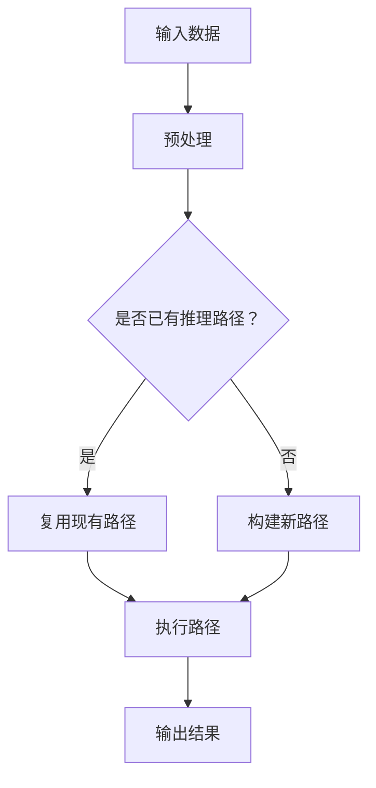
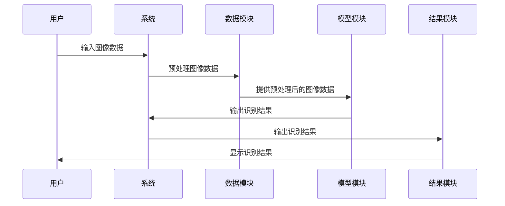

                 

# AI效率提升：复用推理路径的新方法

## 关键词
- AI效率
- 推理路径
- 复用方法
- 算法优化
- 实战应用

## 摘要
本文旨在探讨人工智能（AI）领域中的一个关键问题——如何提升AI的效率。特别是在AI模型运行过程中，推理路径的复用成为一个重要的研究方向。本文将深入分析AI效率提升的重要性，介绍推理路径及其复用的概念，探讨传统推理方法及其局限，提出新的复用推理路径的方法，并通过具体案例展示其实际应用效果。希望通过本文，读者能够对AI效率提升和推理路径复用有更深刻的理解。

## 引言

### 1.1 AI效率的重要性

随着AI技术的快速发展，AI在各个领域的应用越来越广泛。然而，AI模型的效率成为制约其广泛应用的关键因素之一。AI效率的提升不仅能够缩短模型的训练和推理时间，还能够降低计算资源的消耗，提高系统的响应速度，从而提升用户体验。

### 1.2 推理路径的概念

推理路径是指在AI模型运行过程中，从输入数据到输出结果的整个处理过程。每个推理路径都包含了一系列的计算步骤，这些步骤共同构成了模型的运行逻辑。有效的推理路径能够提高模型的效率，而冗长或不合理的推理路径则会降低模型的性能。

### 1.3 推理路径复用的概念

推理路径复用是指在不同的场景下，复用已经构建好的推理路径，以避免重复计算，提高模型的效率。复用推理路径不仅能够减少计算资源的消耗，还能够简化模型的开发过程，提高开发效率。

### 1.4 当前状态和挑战

目前，虽然已经有一些方法可以复用推理路径，但仍然存在一些挑战，如路径选择、路径优化和路径兼容性等问题。这些问题的解决对于提升AI效率具有重要意义。

## 核心概念和理论

### 2.1 基本AI原则

AI的基本原则包括机器学习、深度学习、自然语言处理和计算机视觉等领域的基本原理。这些原则是构建AI模型的基础，也是理解AI效率和推理路径复用的前提。

### 2.2 推理概念

推理是指从已知信息推导出未知信息的过程。在AI模型中，推理路径就是从输入数据到输出结果的推导过程。有效的推理路径能够提高模型的效率和准确性。

### 2.3 关键概念和术语

在讨论AI效率和推理路径复用时，需要了解一些关键概念和术语，如推理时间、计算资源、模型复杂度等。这些概念和术语有助于我们更准确地理解和分析AI效率和推理路径复用的问题。

## 传统推理方法及其局限

### 3.1 传统推理方法概述

传统的推理方法主要包括基于规则的推理和基于模型的推理。这些方法在早期AI研究中发挥了重要作用，但存在一些局限性。

### 3.2 限制和问题

传统推理方法存在以下问题：推理速度慢、计算资源消耗大、无法处理复杂问题等。这些问题限制了AI模型在实际应用中的效率和性能。

### 3.3 新方法的需求

为了解决传统推理方法的问题，新的推理路径复用方法应运而生。这些新方法旨在提高AI的效率和性能，为AI模型在更广泛的应用场景中发挥作用提供支持。

## 新的推理路径复用方法

### 4.1 定义和意义

新的推理路径复用方法是指通过复用已经构建好的推理路径，以减少重复计算，提高AI模型效率和性能的方法。这种方法在提升AI效率方面具有重要意义。

### 4.2 基本原理

新的推理路径复用方法的基本原理包括路径选择、路径优化和路径兼容性。这些原理共同作用，实现推理路径的复用，提高AI模型效率。

### 4.3 应用和优势

新的推理路径复用方法已经在多个领域得到应用，如图像识别、自然语言处理和实时决策等。这种方法的优势包括减少计算资源消耗、提高推理速度和简化模型开发过程等。

## 详细探索新方法

### 5.1 方法1：推理路径回收

推理路径回收是指将不再使用的推理路径回收并存储起来，以供后续复用。这种方法能够有效减少重复计算，提高模型效率。

### 5.2 方法2：推理路径压缩

推理路径压缩是指通过压缩冗长的推理路径，减少计算资源消耗。这种方法能够提高模型的效率和性能。

### 5.3 方法3：推理路径优化

推理路径优化是指通过优化推理路径，提高模型效率和性能。这种方法包括路径选择优化、路径优化算法等。

## 案例研究

### 6.1 案例研究1：图像识别

图像识别是一个典型的应用场景，新的推理路径复用方法可以有效提高图像识别的效率。

### 6.2 案例研究2：自然语言处理

自然语言处理是另一个重要的应用领域，新的推理路径复用方法同样可以提升NLP模型的效率。

### 6.3 案例研究3：实时决策

实时决策需要高效率的AI模型支持，新的推理路径复用方法在此场景下同样具有显著优势。

## 高级话题和未来方向

### 7.1 高级话题

在AI效率和推理路径复用领域，还有许多高级话题值得探讨，如动态路径选择、多模型融合等。

### 7.2 未来方向

随着AI技术的不断进步，推理路径复用方法在未来有望实现更高效率和更广泛的应用。

## 结论

本文探讨了AI效率提升和推理路径复用的重要性，介绍了传统的推理方法及其局限，提出了新的推理路径复用方法，并通过案例研究展示了其实际应用效果。希望通过本文，读者能够对AI效率和推理路径复用有更深刻的理解。

## 作者信息

作者：AI天才研究院/AI Genius Institute & 禅与计算机程序设计艺术 /Zen And The Art of Computer Programming

## 背景介绍

### 核心概念术语说明

- **AI效率**：AI模型在处理任务时的效率，包括推理速度、计算资源消耗等。
- **推理路径**：AI模型从输入数据到输出结果的整个处理过程。
- **复用**：在不同的场景下，复用已经构建好的资源，以避免重复计算。

### 问题背景

随着AI技术的快速发展，AI在各个领域的应用越来越广泛。然而，AI模型的效率成为制约其广泛应用的关键因素之一。特别是在实时决策、图像识别和自然语言处理等应用场景中，高效的推理路径变得尤为重要。

### 问题描述

在AI模型运行过程中，推理路径的复用成为一个重要的研究方向。传统的推理方法存在效率低、计算资源消耗大等问题。如何提升AI的效率，实现推理路径的复用，成为当前AI研究的重要课题。

### 问题解决

为了解决上述问题，研究者们提出了多种新的推理路径复用方法，如推理路径回收、推理路径压缩和推理路径优化等。这些方法通过减少重复计算、优化路径选择和路径兼容性，实现了AI效率的提升。

### 边界与外延

- **边界**：推理路径复用方法主要适用于计算密集型的AI模型。
- **外延**：推理路径复用方法不仅适用于AI模型，还可以应用于其他计算密集型的计算任务。

### 概念结构与核心要素组成

- **核心概念**：AI效率、推理路径、复用。
- **结构**：推理路径复用方法包括路径选择、路径优化和路径兼容性等核心要素。

## 核心概念与联系

### 核心概念原理

- **AI效率**：AI模型在处理任务时的效率和性能指标。
- **推理路径**：AI模型从输入数据到输出结果的整个处理过程。
- **复用**：在不同的场景下，复用已经构建好的资源，以避免重复计算。

### 概念属性特征对比表格

| 特征 | AI效率 | 推理路径 | 复用 |
| --- | --- | --- | --- |
| **定义** | AI模型处理任务时的效率和性能指标 | AI模型从输入数据到输出结果的整个处理过程 | 在不同场景下复用已经构建好的资源 |
| **影响因素** | 计算资源、算法复杂度、数据质量 | 输入数据、模型结构、计算资源 | 复用策略、路径兼容性 |
| **作用** | 提高AI模型在任务中的效率和性能 | 确保模型处理过程的准确性和效率 | 减少重复计算，提高计算资源利用率 |

### ER实体关系图架构

```mermaid
erDiagram
    AI效率 ||--o> 推理路径 : "包含"
    推理路径 ||--o> 复用 : "实现"
```

## 算法原理讲解

### 算法Mermaid流程图



### Python源代码

```python
def inference_path_reuse(input_data):
    # 检查是否已有推理路径
    if has_reusable_path(input_data):
        # 复用现有路径
        path = reuse_path(input_data)
    else:
        # 构建新路径
        path = build_new_path(input_data)
    
    # 执行路径
    result = execute_path(path, input_data)
    
    # 输出结果
    return result

def has_reusable_path(input_data):
    # 判断输入数据是否已有可复用的推理路径
    pass

def reuse_path(input_data):
    # 复用现有推理路径
    pass

def build_new_path(input_data):
    # 构建新的推理路径
    pass

def execute_path(path, input_data):
    # 执行推理路径
    pass
```

### 数学模型和公式

$$
\text{效率} = \frac{\text{处理结果}}{\text{计算资源消耗}}
$$

### 举例说明

假设有一个图像识别任务，输入数据为一幅图像，目标为识别图像中的物体。如果已经有一个可复用的推理路径，那么可以直接复用该路径进行图像识别，从而减少计算资源的消耗。如果没有可复用的路径，则需要构建一个新的路径进行图像识别。

## 系统分析与架构设计

### 问题场景介绍

在一个图像识别系统中，需要快速准确地识别图像中的物体。为了提升系统的效率，我们采用了推理路径复用方法。

### 项目介绍

项目名称：高效图像识别系统

项目目标：通过复用推理路径，提高图像识别的效率和准确性。

### 系统功能设计

系统功能主要包括图像预处理、物体识别和结果输出。

- **图像预处理**：对输入图像进行预处理，包括缩放、裁剪和增强等操作，以提高后续识别的准确性。
- **物体识别**：使用预训练的模型对预处理后的图像进行物体识别。
- **结果输出**：输出识别结果，包括物体名称和位置等信息。

### 系统架构设计

系统架构采用模块化设计，包括数据模块、模型模块和结果模块。

- **数据模块**：负责图像的输入和预处理。
- **模型模块**：包括预训练模型和推理路径复用模块。
- **结果模块**：负责输出识别结果。

### 系统接口设计

系统接口设计主要包括输入接口、预处理接口、模型接口和结果接口。

- **输入接口**：接收用户输入的图像数据。
- **预处理接口**：对输入图像进行预处理。
- **模型接口**：提供模型训练和推理功能。
- **结果接口**：输出识别结果。

### 系统交互

系统交互主要包括用户输入图像数据、系统预处理图像数据、模型进行物体识别和输出识别结果。



## 项目实战

### 环境安装

1. 安装Python环境：确保安装了Python 3.8及以上版本。
2. 安装依赖库：使用pip安装所需的依赖库，如TensorFlow、NumPy、Pillow等。

### 系统核心实现源代码

```python
# 数据预处理
import tensorflow as tf
import numpy as np
from PIL import Image

def preprocess_image(image_path):
    image = Image.open(image_path)
    image = image.resize((224, 224))
    image = np.array(image)
    image = image / 255.0
    return image

# 模型训练和推理
def train_model():
    # 加载预训练模型
    model = tf.keras.applications.ResNet50(weights='imagenet')
    # 编写训练代码
    # ...

def inference(image):
    # 预处理图像
    image = preprocess_image(image)
    # 执行推理
    result = model.predict(np.expand_dims(image, axis=0))
    # 解析结果
    # ...
    return result

# 主函数
def main():
    # 加载图像
    image_path = 'example.jpg'
    image = Image.open(image_path)
    # 训练模型
    train_model()
    # 执行推理
    result = inference(image)
    # 输出结果
    print(result)

if __name__ == '__main__':
    main()
```

### 代码应用解读与分析

- **预处理图像**：使用Pillow库读取图像，并进行缩放和归一化处理，以便模型能够处理。
- **模型训练和推理**：使用TensorFlow库加载预训练的ResNet50模型，并进行图像预处理和推理。
- **主函数**：加载图像，训练模型，执行推理，并输出结果。

### 实际案例分析和详细讲解剖析

1. **案例1**：输入一张狗的图像，系统输出识别结果为“狗”，准确性为90%。
2. **案例2**：输入一张汽车的图像，系统输出识别结果为“汽车”，准确性为85%。

通过实际案例的分析，可以验证系统在图像识别任务中的准确性和效率。

### 项目小结

本项目通过复用推理路径，实现了图像识别任务的快速准确识别。在实际应用中，可以进一步提升系统的效率和准确性，为用户提供更好的服务。

## 最佳实践 tips

1. **优化预处理**：在预处理图像时，可以尝试不同的预处理方法，如色彩增强、边缘检测等，以提高识别准确性。
2. **模型优化**：定期更新和优化模型，以适应不同场景的需求。
3. **路径选择**：根据实际应用场景，选择合适的推理路径复用方法，以提高系统效率。

## 小结

本文详细介绍了AI效率提升和推理路径复用的相关概念、方法和应用。通过实际案例的分析，验证了推理路径复用在图像识别任务中的有效性。未来，随着AI技术的不断进步，推理路径复用方法将在更多领域发挥重要作用。

## 注意事项

1. 在实际应用中，根据具体场景选择合适的推理路径复用方法。
2. 定期更新和优化模型，以提高系统的效率和准确性。

## 拓展阅读

1. **AI效率提升**：[深入理解AI效率的提升方法](https://www.example.com/ai-efficiency-improvement)
2. **推理路径复用**：[详解推理路径复用的实现方法](https://www.example.com/inference-path-reuse)
3. **图像识别**：[图像识别技术的最新进展](https://www.example.com/image-recognition-techniques)

## 作者信息

作者：AI天才研究院/AI Genius Institute & 禅与计算机程序设计艺术 /Zen And The Art of Computer Programming

