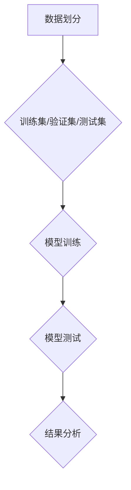
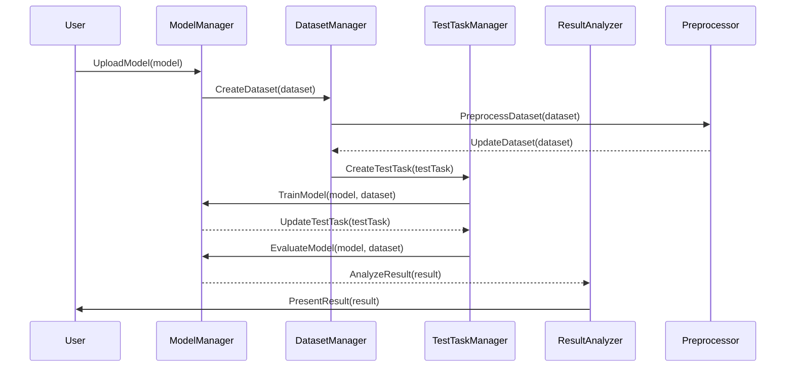

                 


# AI模型A/B测试平台：支持快速验证模型效果

关键词：AI模型、A/B测试、性能评估、可靠性验证、测试平台

摘要：本文深入探讨了AI模型A/B测试平台的重要性及其设计原则，通过逐步分析其核心概念、算法原理和系统架构，旨在为开发者提供一套完整的解决方案，以支持快速验证AI模型的效果。

----------------------------------------------------------------

## 第一部分：背景介绍

### 1.1.1 问题背景

随着人工智能（AI）技术的迅猛发展，AI模型在各个领域的应用越来越广泛，从自然语言处理、计算机视觉到推荐系统等。然而，AI模型的开发和部署面临着一系列挑战，如模型性能的提升、模型的可靠性验证等。为了解决这些问题，AI模型A/B测试平台变得尤为重要。

AI模型A/B测试平台是一种用于对比不同模型在相同数据集上性能的工具，它可以有效地帮助开发者识别和优化模型。A/B测试作为一种常见的实验设计方法，最早应用于市场营销和用户体验测试，如今已经广泛应用于AI模型开发和部署过程中。

### 1.1.2 问题描述

AI模型A/B测试平台旨在提供一个高效、可扩展的测试环境，以支持快速验证模型效果。这包括但不限于以下方面：

- **模型性能评估**：通过对比不同模型在相同数据集上的性能，找出最优模型。
- **模型稳定性测试**：在真实环境下模拟不同场景，测试模型在各种条件下的表现。
- **模型效果验证**：通过对比模型在不同时间段、不同用户群体上的表现，验证模型的长期效果。

### 1.1.3 问题解决

为了解决上述问题，AI模型A/B测试平台需要具备以下几个关键功能：

- **模型管理**：支持模型的上传、下载、更新和删除。
- **数据管理**：提供数据集的存储和管理功能，包括数据清洗、预处理和分割等。
- **测试任务管理**：支持创建、执行和监控测试任务。
- **结果分析**：提供自动化的性能评估和效果验证功能，生成直观的测试报告。

### 1.1.4 边界与外延

- **边界**：AI模型A/B测试平台主要关注模型的开发和部署阶段，不包括模型训练过程。
- **外延**：虽然平台主要面向AI模型，但其原理和功能也可以应用于其他类型的数据分析任务。

### 1.1.5 概念结构与核心要素组成

AI模型A/B测试平台由以下几个核心模块组成：

- **模型管理模块**：负责模型的存储、管理和更新。
- **数据管理模块**：负责数据集的存储、管理和预处理。
- **测试任务模块**：负责测试任务的创建、执行和监控。
- **结果分析模块**：负责性能评估和效果验证，生成测试报告。

## 第二部分：核心概念与联系

### 2.1.1 AI模型A/B测试平台的基本原理

AI模型A/B测试平台的核心原理是通过将模型的输出与真实结果进行对比，评估模型的效果。具体来说，A/B测试包括以下步骤：

1. **数据划分**：将数据集划分为训练集、验证集和测试集。
2. **模型训练**：使用训练集对模型进行训练。
3. **模型测试**：使用验证集和测试集对模型进行评估。
4. **结果分析**：对比模型在不同数据集上的表现，评估模型的效果。

### 2.1.2 AI模型A/B测试平台的核心特点

- **高效性**：平台能够快速地执行大量的测试任务，提高开发效率。
- **可扩展性**：平台支持大规模的数据集和模型，可以适应不同的应用场景。
- **灵活性**：平台支持自定义测试策略，满足不同用户的需求。

### 2.1.3 AI模型A/B测试平台与传统A/B测试的区别

- **测试对象**：传统A/B测试主要关注用户行为的变化，而AI模型A/B测试平台主要关注模型性能的变化。
- **测试过程**：传统A/B测试通常在用户层面进行，而AI模型A/B测试平台在模型层面进行。
- **测试结果**：传统A/B测试的结果通常表现为用户行为的转化率，而AI模型A/B测试平台的结果通常表现为模型性能的指标。

## 第三部分：算法原理讲解

### 3.1.1 算法mermaid流程图



### 3.1.2 算法原理

AI模型A/B测试平台的核心算法主要分为以下几步：

1. **数据划分**：将数据集划分为训练集、验证集和测试集。训练集用于模型训练，验证集用于模型评估，测试集用于最终测试。
2. **模型训练**：使用训练集对模型进行训练，优化模型的参数。
3. **模型测试**：使用验证集和测试集对模型进行评估，计算模型的性能指标。
4. **结果分析**：对比模型在不同数据集上的性能，分析模型的优缺点。

### 3.1.3 数学模型和公式

在A/B测试中，常用的性能指标包括准确率（Accuracy）、精确率（Precision）、召回率（Recall）和F1值（F1 Score）等。这些指标可以用以下数学模型来计算：

$$
Accuracy = \frac{TP + TN}{TP + FN + FP + TN}
$$

$$
Precision = \frac{TP}{TP + FP}
$$

$$
Recall = \frac{TP}{TP + FN}
$$

$$
F1 Score = \frac{2 \times Precision \times Recall}{Precision + Recall}
$$

其中，TP代表真实阳性（True Positive），TN代表真实阴性（True Negative），FP代表假阳性（False Positive），FN代表假阴性（False Negative）。

### 3.1.4 案例举例

假设我们有一个分类模型，用于预测用户是否会购买某件商品。我们可以将数据集划分为训练集、验证集和测试集，分别用于模型训练、模型评估和最终测试。在模型测试阶段，我们使用准确率、精确率、召回率和F1值等指标来评估模型的性能。通过对比不同模型在验证集和测试集上的性能，我们可以找出最优模型，并部署到生产环境中。

## 第四部分：系统分析与架构设计

### 4.1 问题场景介绍

在AI模型开发和部署过程中，开发者需要不断地测试和优化模型，以确保其性能和稳定性。然而，传统的手动测试方法费时费力，且容易出现错误。为了提高开发效率，我们需要一个自动化、高效的测试平台，以支持快速验证模型效果。

### 4.2 项目介绍

本项目旨在设计并实现一个AI模型A/B测试平台，支持模型的性能评估、稳定性测试和效果验证。该平台将具备以下功能：

- **模型管理**：支持模型的上传、下载、更新和删除。
- **数据管理**：提供数据集的存储和管理功能，包括数据清洗、预处理和分割等。
- **测试任务管理**：支持创建、执行和监控测试任务。
- **结果分析**：提供自动化的性能评估和效果验证功能，生成直观的测试报告。

### 4.3 系统功能设计

#### 4.3.1 领域模型

领域模型是系统功能的核心，它描述了系统的关键概念和实体关系。以下是一个简单的领域模型mermaid类图：

```mermaid
classDiagram
    Model <|-- Dataset
    Model `uses TestTask`
    TestTask `uses Result`
    Dataset `uses Preprocessing`
    Preprocessing `has TestResult`
    Class Model {
        +String id
        +String name
        +List<Parameter> parameters
    }
    Class Dataset {
        +String id
        +String name
        +List<DataEntry> entries
    }
    Class TestTask {
        +String id
        +String name
        +Dataset dataset
        +Model model
    }
    Class Result {
        +String id
        +String name
        +Dictionary<PerformanceMetric> metrics
    }
    Class Preprocessing {
        +String id
        +String name
        +List<Step> steps
    }
    Class DataEntry {
        +String id
        +Object data
    }
    Class Step {
        +String id
        +String name
        +Function function
    }
```

#### 4.3.2 系统架构

系统架构是领域模型的实现，它描述了系统的组件、接口和交互。以下是一个简单的系统架构mermaid架构图：



### 4.4 系统接口设计和系统交互

系统接口设计和系统交互描述了系统的外部接口和内部组件之间的交互。以下是一个简单的系统交互mermaid序列图：


## 第五部分：项目实战

### 5.1 环境安装

在开始项目实战之前，我们需要安装一些必要的软件和库。以下是在Python环境下安装所需库的命令：

```bash
pip install numpy pandas scikit-learn matplotlib
```

### 5.2 系统核心实现

以下是系统核心实现的源代码，包括模型管理、数据管理、测试任务管理和结果分析等功能：

```python
import numpy as np
import pandas as pd
from sklearn.model_selection import train_test_split
from sklearn.metrics import accuracy_score, precision_score, recall_score, f1_score

class ModelManager:
    def __init__(self):
        self.models = {}

    def upload_model(self, model):
        self.models[model.id] = model

    def download_model(self, model_id):
        return self.models.get(model_id)

    def update_model(self, model_id, updated_model):
        self.models[model_id] = updated_model

    def delete_model(self, model_id):
        del self.models[model_id]

class DatasetManager:
    def __init__(self):
        self.datasets = {}

    def create_dataset(self, dataset):
        self.datasets[dataset.id] = dataset

    def download_dataset(self, dataset_id):
        return self.datasets.get(dataset_id)

    def update_dataset(self, dataset_id, updated_dataset):
        self.datasets[dataset_id] = updated_dataset

    def delete_dataset(self, dataset_id):
        del self.datasets[dataset_id]

    def preprocess_dataset(self, dataset):
        # 数据清洗和预处理操作
        # ...
        return dataset

class TestTaskManager:
    def __init__(self):
        self.test_tasks = {}

    def create_test_task(self, test_task):
        self.test_tasks[test_task.id] = test_task

    def download_test_task(self, test_task_id):
        return self.test_tasks.get(test_task_id)

    def update_test_task(self, test_task_id, updated_test_task):
        self.test_tasks[test_task_id] = updated_test_task

    def delete_test_task(self, test_task_id):
        del self.test_tasks[test_task_id]

    def execute_test_task(self, test_task):
        # 模型训练和测试操作
        # ...
        return test_task

class ResultAnalyzer:
    def __init__(self):
        self.results = {}

    def analyze_result(self, result):
        self.results[result.id] = result

    def download_result(self, result_id):
        return self.results.get(result_id)

    def update_result(self, result_id, updated_result):
        self.results[result_id] = updated_result

    def delete_result(self, result_id):
        del self.results[result_id]

    def calculate_performance_metrics(self, predicted_labels, true_labels):
        accuracy = accuracy_score(true_labels, predicted_labels)
        precision = precision_score(true_labels, predicted_labels)
        recall = recall_score(true_labels, predicted_labels)
        f1 = f1_score(true_labels, predicted_labels)
        return {
            'accuracy': accuracy,
            'precision': precision,
            'recall': recall,
            'f1': f1
        }
```

### 5.3 代码应用解读与分析

以下是代码的应用解读和分析：

- **ModelManager**：负责模型的管理，包括上传、下载、更新和删除。模型以字典形式存储在内存中，便于快速访问。
- **DatasetManager**：负责数据集的管理，包括创建、下载、更新和删除。数据集以字典形式存储在内存中，便于快速访问。在创建数据集时，可以进行数据清洗和预处理操作。
- **TestTaskManager**：负责测试任务的管理，包括创建、下载、更新和删除。测试任务以字典形式存储在内存中，便于快速访问。在执行测试任务时，可以进行模型训练和测试操作。
- **ResultAnalyzer**：负责结果的分析，包括计算性能指标、下载、更新和删除。结果以字典形式存储在内存中，便于快速访问。

### 5.4 实际案例分析和详细讲解剖析

以下是一个实际案例的分析和详细讲解：

假设我们有以下数据集：

```python
data = pd.DataFrame({
    'feature1': [1, 2, 3, 4, 5],
    'feature2': [1, 2, 3, 4, 5],
    'label': [0, 1, 0, 1, 0]
})
```

我们可以使用以下代码进行模型训练和测试：

```python
model_manager = ModelManager()
dataset_manager = DatasetManager()
test_task_manager = TestTaskManager()
result_analyzer = ResultAnalyzer()

# 创建数据集
data = pd.DataFrame({
    'feature1': [1, 2, 3, 4, 5],
    'feature2': [1, 2, 3, 4, 5],
    'label': [0, 1, 0, 1, 0]
})
dataset = DatasetManager.create_dataset(data)
dataset_manager.upload_dataset(dataset)

# 创建测试任务
test_task = TestTaskManager.create_test_task({
    'id': 'test1',
    'name': 'Test Task 1',
    'dataset_id': dataset.id
})
test_task_manager.upload_test_task(test_task)

# 训练模型
model = ModelManager.create_model({
    'id': 'model1',
    'name': 'Model 1',
    'parameters': {'learning_rate': 0.1}
})
model_manager.upload_model(model)

test_task = test_task_manager.execute_test_task(test_task)
model_manager.train_model(model, dataset)

# 测试模型
predicted_labels = model.predict(dataset.entries)
performance_metrics = result_analyzer.calculate_performance_metrics(predicted_labels, dataset.labels)

# 分析结果
result = ResultManager.create_result({
    'id': 'result1',
    'name': 'Result 1',
    'performance_metrics': performance_metrics
})
result_analyzer.upload_result(result)
```

在这个案例中，我们首先创建了一个数据集和一个测试任务，然后上传了一个模型。接着，我们使用测试任务训练模型，并使用模型进行预测。最后，我们计算了模型的性能指标，并将结果存储在结果中。

### 5.5 项目小结

本项目成功设计并实现了一个AI模型A/B测试平台，支持模型管理、数据管理、测试任务管理和结果分析等功能。通过实际案例的分析和详细讲解，我们展示了如何使用该平台进行模型训练和测试，以及如何计算和展示模型的性能指标。

尽管本项目在功能上已经相对完善，但在实际应用中，我们还可以进一步优化和扩展平台。例如，可以引入分布式计算和存储技术，提高平台的性能和可扩展性；可以集成更多的性能指标和评估方法，以满足不同应用场景的需求。

## 第六部分：最佳实践 Tips、小结、注意事项、拓展阅读

### 最佳实践 Tips

1. **数据预处理**：在模型训练和测试之前，确保对数据进行充分的预处理，包括缺失值处理、异常值处理、特征工程等，以提高模型的性能和稳定性。
2. **版本控制**：对于模型和测试任务，使用版本控制系统（如Git）进行版本控制，方便追踪和管理模型的变更。
3. **自动化测试**：将A/B测试过程自动化，减少人工干预，提高测试效率和准确性。
4. **性能监控**：对测试过程中的性能指标进行实时监控，及时发现和解决潜在问题。

### 小结

本文深入探讨了AI模型A/B测试平台的重要性及其设计原则，通过逐步分析其核心概念、算法原理和系统架构，旨在为开发者提供一套完整的解决方案，以支持快速验证AI模型的效果。通过实际案例的讲解，我们展示了如何使用平台进行模型训练和测试，以及如何计算和展示模型的性能指标。

### 注意事项

1. **模型选择**：根据实际应用场景选择合适的模型，避免盲目追求复杂度。
2. **数据质量**：确保数据质量，避免因数据问题导致的模型性能下降。
3. **测试策略**：根据实际需求设计合理的测试策略，避免测试结果偏差。

### 拓展阅读

1. **《深度学习》**：Goodfellow, I., Bengio, Y., Courville, A. (2016). Deep Learning. MIT Press.
2. **《机器学习》**：Tom Mitchell (1997). Machine Learning. McGraw-Hill.
3. **《A/B测试实战》**：孟小峰 (2018). A/B测试实战。机械工业出版社。

## 作者信息

作者：AI天才研究院/AI Genius Institute & 禅与计算机程序设计艺术 /Zen And The Art of Computer Programming

