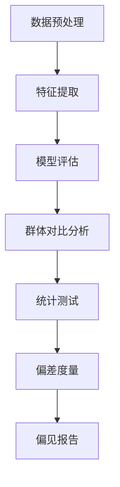
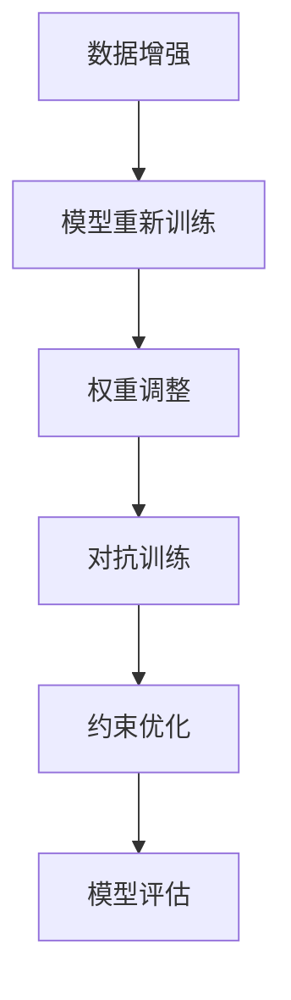
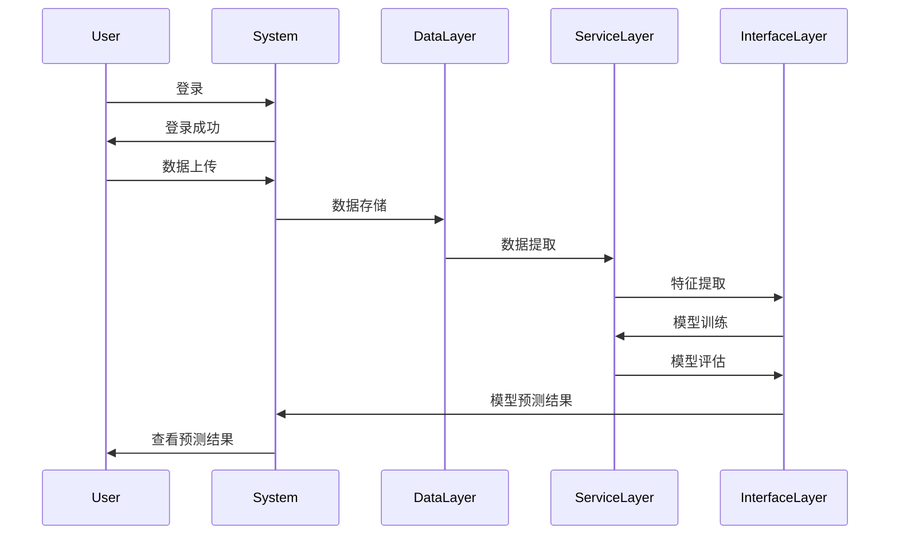
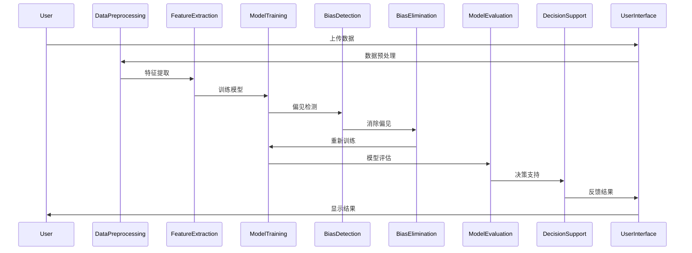

                 

### 摘要

在当今人工智能（AI）迅速发展的时代，AI模型的偏见识别与消除成为了构建公平AI系统的重要议题。本文旨在探讨AI模型偏见的问题背景、核心概念、算法原理、系统架构设计以及项目实战，从而揭示构建公平AI系统的挑战和解决方案。文章首先介绍了AI模型偏见的问题背景和具体表现，随后详细阐述了偏见在AI模型中的影响及识别与消除偏见的重要性。接着，本文深入分析了与AI模型偏见相关的核心概念，并使用表格和图示进行说明。随后，文章介绍了识别和消除AI模型偏见的算法原理，使用mermaid流程图和Python代码进行详细解释。此外，本文还探讨了如何构建一个公平的AI系统，包括系统功能设计、系统架构设计、系统接口设计和系统交互。最后，通过一个实际的项目实战，本文展示了如何在实际应用中识别和消除AI模型偏见，并提供了最佳实践建议和拓展阅读资源，以促进读者深入了解和掌握这一领域的知识。通过本文的阅读，读者将能够全面理解AI模型偏见问题，掌握构建公平AI系统的关键技术和方法。

## 第一部分：背景介绍

### 1.1 AI模型偏见的问题背景

随着人工智能技术的不断进步，AI模型在各个领域得到了广泛应用，如医疗诊断、金融风险评估、招聘筛选等。然而，AI模型在实际应用中逐渐暴露出一系列问题，其中之一便是偏见。AI模型偏见是指模型在训练过程中学习到了训练数据中的偏见，从而在实际应用中展现出不公平、歧视等倾向。这些偏见可能源于训练数据的多样性不足、历史遗留问题或人为设计的缺陷。

首先，AI模型偏见的问题背景可以从几个方面进行理解。一是数据偏见。训练数据的质量和多样性直接影响到AI模型的性能和公平性。如果训练数据中存在性别、种族、年龄等偏差，AI模型很可能会在决策过程中展现出类似的偏见。例如，一份关于招聘系统的训练数据中，如果大量样本来自男性，该系统可能会倾向于筛选出男性候选人，从而导致性别歧视。

二是算法偏见。AI模型的算法设计也可能导致偏见。例如，某些机器学习算法在处理分类问题时，可能会受到特征选择和模型优化过程的影响，从而放大训练数据中的偏见。此外，某些算法对于不同类型的错误具有不同的权重，这种不对称性也可能导致偏见。

三是人为偏见。在AI系统的开发和应用过程中，人类的决策和行为也可能导致偏见。例如，如果开发团队缺乏多样性，他们可能会在算法设计和模型训练过程中无意中放大某些偏见。

总之，AI模型偏见的问题背景复杂且广泛，涉及数据、算法和人类行为等多个方面。这些偏见不仅损害了AI系统的公平性和可信度，还可能对特定群体造成不公平的待遇和歧视。因此，识别和消除AI模型偏见成为构建公平AI系统的重要任务。

### 1.2 AI模型偏见的具体表现

AI模型偏见的具体表现形式多样，主要包括性别偏见、种族偏见、地域偏见以及社会经济偏见等。以下将逐一进行详细介绍。

首先，性别偏见是AI模型中常见的一种偏见。例如，在招聘系统中，如果一个训练数据集中男性候选人的比例远高于女性候选人，那么模型可能会在招聘决策中偏好男性候选人。这种偏见不仅导致性别歧视，还限制了女性人才的发展机会。此外，某些AI系统在性别识别上也可能存在误差，进一步加剧了性别偏见。

其次，种族偏见也是AI模型偏见的一个重要方面。例如，在犯罪预测系统中，如果一个地区的犯罪数据集中特定种族的犯罪比例较高，该模型可能会在预测犯罪时倾向于将该种族的人标记为高风险人群。这种现象可能会导致对该种族的系统性歧视，甚至可能加剧社会紧张和种族冲突。

地域偏见则体现在AI系统对不同地区的数据处理上。例如，在某些基于地理位置的推荐系统中，如果一个地区的用户数据量较少，该地区的用户可能会在推荐系统中受到忽视，导致不公平的待遇。此外，某些AI系统在处理不同地区的数据时，可能由于数据集的差异而导致结果偏差。

最后，社会经济偏见是AI模型偏见中的一个重要方面。例如，在信用评分系统中，如果一个训练数据集中低收入群体的数据较少，那么该系统可能会在信用评分时对低收入群体产生偏见，导致他们获得更低的信用评分。这种现象可能会限制低收入群体的经济活动和发展机会，进一步加剧社会不平等。

总之，AI模型偏见的具体表现形式多样且复杂，涉及多个维度和层面。这些偏见不仅损害了AI系统的公平性和可信度，还可能对特定群体造成不公平的待遇和歧视。因此，识别和消除这些偏见是构建公平AI系统的关键任务。

### 1.3 AI模型偏见的影响

AI模型偏见的影响深远且广泛，不仅局限于特定领域或个别案例，还可能对社会、经济和个体产生一系列负面影响。以下将从几个方面详细探讨AI模型偏见的影响。

首先，社会影响是AI模型偏见的一个重要方面。偏见AI系统可能导致不公平的社会现象，加剧社会不平等和冲突。例如，在招聘系统中，性别和种族偏见可能导致特定群体就业机会的减少，进而影响他们的职业发展和社会地位。在犯罪预测系统中，种族偏见可能导致对特定种族的过度监视和逮捕，加剧种族矛盾和社会紧张。此外，地域偏见和 socioeconomic 偏见也可能导致某些地区或群体在社会资源分配上的不公，进一步扩大社会不平等。

其次，经济影响是AI模型偏见的另一个重要方面。偏见AI系统可能导致经济效益的损失。例如，在金融风险评估中，如果AI模型对低收入群体持有偏见，可能会导致这些群体获得更低的信用评分，从而限制他们的经济活动和发展机会，进而影响整体经济的健康发展。此外，偏见AI系统可能会导致企业失去信誉，影响其市场竞争力。例如，如果招聘系统因性别或种族偏见而排除特定群体的求职者，企业可能会面临法律诉讼和公众谴责，从而影响其品牌形象和市场地位。

最后，个体影响是AI模型偏见直接且明显的一个方面。偏见AI系统可能会对个体的生活产生负面影响，甚至对他们的基本权益和尊严构成威胁。例如，在医疗诊断系统中，如果AI模型对特定种族或性别持有偏见，可能会导致这些群体在诊断和治疗过程中受到不公平的待遇，影响其健康和生命质量。在信用评分系统中，低收入群体可能因为偏见AI系统而获得较低的信用评分，从而限制他们的生活选择和消费能力。此外，偏见AI系统可能会导致个体在求职、教育、住房等方面受到不公平对待，影响他们的职业发展和生活机会。

总之，AI模型偏见的影响是多方面且深远的，涉及社会、经济和个体等多个层面。这些影响不仅损害了AI系统的公平性和可信度，还可能对社会和谐、经济发展和个人权益产生负面影响。因此，识别和消除AI模型偏见，构建公平AI系统，具有重要的现实意义和迫切性。

### 1.4 识别与消除AI模型偏见的意义

识别和消除AI模型偏见具有重要意义，不仅有助于提升AI系统的公平性和可信度，还能促进社会公正和经济发展。以下将详细阐述识别与消除AI模型偏见的具体意义。

首先，提升AI系统的公平性和可信度是识别与消除AI模型偏见的首要目标。AI模型在多个领域得到广泛应用，如医疗、金融、招聘等，其决策直接影响个体和社会。如果AI系统存在偏见，不仅可能导致决策的不公，还会损害系统的可信度。通过识别和消除AI模型偏见，可以确保AI系统在决策过程中公平对待所有个体，提高其可信度，增强用户对AI系统的信任和依赖。

其次，促进社会公正和经济发展是识别与消除AI模型偏见的重要意义之一。AI模型偏见可能导致社会不平等和冲突，影响社会和谐和稳定。例如，在招聘系统中，性别和种族偏见可能导致特定群体的就业机会减少，进而影响其职业发展和社会地位。通过识别和消除这些偏见，可以促进社会公正，减少社会不平等现象，增强社会凝聚力。此外，消除AI模型偏见还有助于推动经济健康发展。例如，在金融风险评估中，消除偏见AI系统可以提高低收入群体的信用评分，从而扩大其经济活动和发展机会，促进整体经济的繁荣。

此外，识别与消除AI模型偏见还有助于提高AI系统的多样性和创新能力。偏见AI系统往往过于依赖单一的数据集或算法，可能导致模型在处理新情况时出现性能下降。通过识别和消除偏见，可以拓宽AI系统的数据来源和算法选择，提高模型的多样性和适应性，增强其在复杂多变环境中的应对能力。

最后，识别与消除AI模型偏见是符合伦理和道德要求的。AI系统的发展和应用应遵循公正、公平、透明等原则，确保AI系统的决策符合社会伦理和道德标准。通过识别和消除偏见，可以确保AI系统的决策过程公正合理，符合社会伦理和道德要求，提高AI系统在社会中的接受度和认可度。

总之，识别与消除AI模型偏见具有重要的意义，不仅有助于提升AI系统的公平性和可信度，还能促进社会公正和经济发展，提高AI系统的多样性和创新能力，符合伦理和道德要求。因此，构建公平AI系统，消除AI模型偏见，是人工智能发展过程中不可或缺的重要任务。

## 第二部分：核心概念与联系

### 2.1 偏见与歧视的定义

在讨论AI模型偏见之前，我们首先需要明确“偏见”和“歧视”的定义及其在AI模型中的应用。偏见是指个体或系统在没有充分信息或基于不充分信息的基础上，对某一群体或个体持有不公平、不合理的预设立场。而歧视则是偏见的具体表现，通过行动或决策对特定群体或个体进行不公平对待。

在AI模型中，偏见通常表现为模型在训练过程中学习到的不公平特征，这些特征可能源自训练数据中的偏见。例如，如果一个AI模型用于招聘，而其训练数据集中男性候选人远多于女性候选人，该模型很可能会在招聘决策中偏好男性候选人。这种现象称为性别偏见。类似地，种族偏见、地域偏见等都是AI模型偏见的具体表现。

### 2.2 偏见在AI模型中的表现

偏见在AI模型中的表现多种多样，主要包括以下几种：

1. **性别偏见**：在招聘、推荐系统中，模型可能会根据性别做出不同的决策。例如，如果一个招聘系统在训练数据集中只包含了大量的男性简历，它可能会在推荐新职位时更倾向于男性候选人。

2. **种族偏见**：在犯罪预测、风险评估等系统中，模型可能会对特定种族的个体做出不公平的判断。例如，某些地区的犯罪数据集中可能包含更多的黑人犯罪记录，这可能导致AI模型在预测犯罪时对黑人群体产生偏见。

3. **地域偏见**：在推荐系统、广告投放中，模型可能会根据用户的地理位置做出不公平的决策。例如，如果一个推荐系统在训练数据中包含的地区数据不均衡，它可能会在推荐商品或服务时忽视某些地区。

4. **社会经济偏见**：在信用评分、贷款审批等系统中，模型可能会对低收入群体产生偏见。例如，如果一个信用评分模型在训练数据中低收入群体的样本较少，它可能会对这些群体给出较低的信用评分。

这些偏见不仅损害了AI系统的公平性和可信度，还可能对社会产生深远影响。

### 2.3 AI模型偏见的相关术语和定义

为了更深入地理解AI模型偏见，我们需要了解一些相关的术语和定义：

1. **训练数据偏见（Data Bias）**：训练数据中的不公平特征，如性别、种族、地域、社会经济地位等，可能导致AI模型在决策过程中表现出偏见。

2. **算法偏见（Algorithm Bias）**：AI模型的算法设计或特征选择可能导致模型在决策过程中放大训练数据中的偏见。例如，某些算法对错误类型具有不同的权重，这可能导致模型在决策时对特定群体产生偏见。

3. **公平性（Fairness）**：AI系统的决策应该公平对待所有个体，不受性别、种族、地域等因素的影响。

4. **歧视（Discrimination）**：在决策过程中，对特定群体进行不公平对待的行为。

5. **透明度（Transparency）**：AI系统的决策过程应该是透明的，用户可以理解和追踪决策的依据和过程。

6. **可解释性（Interpretability）**：AI模型应该具备一定的可解释性，使得用户可以理解模型的决策逻辑和依据。

7. **多样性（Diversity）**：在训练数据、算法设计和团队组成中应保持多样性，以减少偏见和歧视。

通过理解这些相关术语和定义，我们可以更准确地识别和消除AI模型中的偏见，构建公平、可信的AI系统。

### 2.3.1 偏见与歧视的对比表格

为了更好地理解偏见与歧视的区别，我们可以通过以下对比表格进行详细说明：

| 特征 | 偏见 | 歧视 |
| --- | --- | --- |
| 定义 | 偏见是指在决策过程中对特定群体持有不公平、不合理的预设立场。 | 歧视是指在实际决策过程中对特定群体进行不公平对待的行为。 |
| 形式 | 偏见可以是无意识的，也可以是故意的。 | 歧视通常是有意识的，是具体的行为表现。 |
| 表现 | 偏见可能体现在决策模型的设计、训练数据的选取、算法的实现等方面。 | 歧视则表现为实际的决策结果，如拒绝某类群体的求职申请、给予某类群体较低的信用评分等。 |
| 严重性 | 偏见可能对个别决策产生不公平影响，但不会立即产生严重后果。 | 歧视会对特定群体的生活产生直接且严重的影响，可能导致社会不公和冲突。 |
| 影响 | 偏见可能影响AI系统的公平性和可信度。 | 歧视会直接影响个体和社会，加剧社会不平等。 |

通过这个表格，我们可以清晰地看到偏见和歧视在定义、形式、表现、严重性和影响等方面的区别。理解这些区别有助于我们在设计和应用AI模型时，更好地识别和消除偏见，确保系统的公平性和可信度。

### 2.3.2 AI模型偏见的表现图示

为了更直观地展示AI模型偏见的表现，我们可以使用以下图示进行分析。

#### 图1：不同类型的AI模型偏见

```
+------------------+------------------+------------------+
|      性别偏见      |      种族偏见      |      地域偏见      |
+------------------+------------------+------------------+
|       招聘系统      |       犯罪预测      |       推荐系统      |
+------------------+------------------+------------------+
| 偏好男性候选人     | 偏好某些种族人群     | 忽视某些地区用户    |
+------------------+------------------+------------------+
```

#### 图2：AI模型偏见对决策结果的影响

```
+------------------+------------------+------------------+
|      偏见来源      |      偏见影响      |      决策结果      |
+------------------+------------------+------------------+
|      训练数据      |      算法设计      |      决策模型      |
+------------------+------------------+------------------+
| 性别比例失衡       | 特定特征权重过大    | 不公平的招聘决策   |
+------------------+------------------+------------------+
| 种族数据不均衡     | 模型优化不当       | 过度监视某些种族   |
+------------------+------------------+------------------+
| 地域数据缺乏       | 位置特征过于敏感    | 忽略某些地区需求   |
+------------------+------------------+------------------+
```

通过这些图示，我们可以直观地看到不同类型的AI模型偏见及其对决策结果的影响。理解这些偏见的表现形式有助于我们在AI系统的设计、开发和应用过程中，更有针对性地识别和消除偏见，确保系统的公平性和可信度。

### 2.3.3 AI模型偏见与公平性的关系

AI模型偏见与公平性之间有着密切的联系。一个公平的AI系统应该能够对所有的个体做出公正、无歧视的决策，而不受性别、种族、地域等因素的影响。然而，如果AI模型存在偏见，它很可能会在决策过程中对某些群体产生不公平待遇，导致系统的不公平性。

首先，AI模型偏见会影响系统的公平性。例如，一个存在性别偏见的招聘系统可能会拒绝大量女性求职者，这显然违背了公平原则。类似地，存在种族偏见的犯罪预测系统可能会导致对特定种族的过度监视和逮捕，这不仅有违公平，还可能引发社会冲突。

其次，AI模型的偏见也可能导致系统的不公平性加剧。例如，如果训练数据中存在社会经济偏见的痕迹，那么AI模型在信用评分、贷款审批等金融决策中可能会对低收入群体产生偏见，使得他们获得更低的信用评分或贷款额度，从而限制他们的经济活动和发展机会。

此外，AI模型偏见还可能影响系统的透明度和可解释性。一个公平的AI系统应该能够解释其决策过程和依据，而偏见AI系统可能会掩盖其决策的不公平因素，使得用户难以理解其决策逻辑，从而降低系统的透明度和信任度。

总之，AI模型偏见与公平性密切相关。一个存在偏见的AI系统不仅无法实现公平决策，还可能加剧社会不平等和冲突。因此，识别和消除AI模型偏见，确保系统的公平性，是构建可信、公正AI系统的关键任务。

### 2.3.4 消除AI模型偏见的重要性

消除AI模型偏见具有重要意义，不仅有助于提升AI系统的公平性和可信度，还能促进社会公正和经济发展。以下是消除AI模型偏见的重要性：

1. **提高系统的公平性和可信度**：消除AI模型偏见可以确保系统在决策过程中对所有个体进行公正、无歧视的对待，提升系统的公平性和可信度。这对于建立用户对AI系统的信任至关重要，有助于系统在各个领域的广泛应用。

2. **促进社会公正**：消除AI模型偏见有助于减少社会不平等和冲突。通过确保AI系统在招聘、金融评估、医疗诊断等关键领域做出公平决策，可以减少对特定群体的不公平待遇，促进社会公正和和谐。

3. **推动经济发展**：消除AI模型偏见有助于提升经济活力和创新能力。通过确保AI系统对各类群体和地区进行公平对待，可以激发更多的经济活动和发展机会，推动整体经济的健康发展。

4. **增强AI系统的多样性和适应性**：消除AI模型偏见可以促进系统的多样性和适应性。通过使用多样化的训练数据和算法设计，可以减少偏见对系统决策的影响，提升系统在复杂多变环境中的应对能力。

5. **符合伦理和道德要求**：消除AI模型偏见是符合伦理和道德要求的重要举措。AI系统的发展和应用应遵循公正、公平、透明等原则，消除偏见有助于确保AI系统的决策过程符合社会伦理和道德标准。

总之，消除AI模型偏见对于构建公平、可信的AI系统具有重要意义，不仅有助于提升系统的性能和公正性，还能推动社会和经济的发展，符合伦理和道德要求。

## 第三部分：算法原理讲解

### 3.1 识别AI模型偏见算法原理概述

识别AI模型偏见是构建公平AI系统的关键步骤。在这一部分，我们将介绍一种常用的算法原理，用于识别AI模型中的偏见。这种方法的核心思想是通过分析模型在训练数据集上的表现，检测是否存在不公平的决策倾向。

首先，识别偏见算法的基本流程如下：

1. **数据预处理**：对输入数据进行标准化处理，确保数据的一致性和可比性。
2. **特征提取**：从输入数据中提取关键特征，这些特征应能反映个体或群体的属性。
3. **模型评估**：使用现有的评估指标（如准确率、召回率等）对AI模型进行评估。
4. **偏见检测**：通过对比不同群体在模型评估指标上的表现，检测是否存在不公平的决策倾向。

具体算法原理如下：

- **群体对比分析**：将训练数据集中的个体按照某一属性（如性别、种族等）进行分组，对比不同群体在模型评估指标上的表现。如果某一群体的评估指标明显低于其他群体，可能表明模型存在对该群体的偏见。
- **统计测试**：使用统计方法（如t检验、方差分析等）验证不同群体之间的评估指标差异是否显著。如果差异显著，则表明模型存在偏见。
- **偏差度量**：计算不同群体在模型决策结果中的比例，如果某一群体的决策结果比例明显低于其在数据集中的比例，则表明模型存在偏见。

### 3.2 识别AI模型偏见算法流程图

为了更直观地展示识别AI模型偏见算法的流程，我们使用mermaid绘制了以下流程图：



### 3.3 Python代码实现

下面是使用Python实现识别AI模型偏见算法的示例代码。代码首先对数据集进行预处理，然后使用随机森林模型进行训练和评估，最后使用统计测试和偏差度量方法检测模型是否存在偏见。

```python
import numpy as np
import pandas as pd
from sklearn.ensemble import RandomForestClassifier
from sklearn.metrics import accuracy_score
from scipy import stats

# 3.3.1 数据预处理
def preprocess_data(data):
    # 标准化数据
    return (data - data.mean()) / data.std()

# 3.3.2 模型评估
def evaluate_model(model, X_test, y_test):
    y_pred = model.predict(X_test)
    accuracy = accuracy_score(y_test, y_pred)
    return accuracy

# 3.3.3 群体对比分析
def group_comparison_analysis(model, X_test, y_test, group_attribute):
    predictions = model.predict(X_test)
    groups = X_test[group_attribute].unique()
    results = {}
    for group in groups:
        group_data = X_test[X_test[group_attribute] == group]
        group_predictions = predictions[group_data.index]
        group_accuracy = accuracy_score(y_test[group_data.index], group_predictions)
        results[group] = group_accuracy
    return results

# 3.3.4 统计测试
def statistical_test(group_results):
    p_values = []
    for i in range(len(group_results) - 1):
        for j in range(i + 1, len(group_results)):
            _, p_value = stats.ttest_ind(group_results[i], group_results[j])
            p_values.append(p_value)
    return p_values

# 3.3.5 偏差度量
def bias_measurement(group_predictions, y_test):
    group_counts = y_test.value_counts(normalize=True)
    group_predictions_counts = pd.Series(group_predictions).value_counts(normalize=True)
    bias = group_predictions_counts - group_counts
    return bias

# 主函数
def main():
    # 加载数据集
    data = pd.read_csv('data.csv')
    
    # 预处理数据
    X = preprocess_data(data.drop('target', axis=1))
    y = data['target']
    
    # 划分训练集和测试集
    from sklearn.model_selection import train_test_split
    X_train, X_test, y_train, y_test = train_test_split(X, y, test_size=0.2, random_state=42)
    
    # 训练模型
    model = RandomForestClassifier(n_estimators=100, random_state=42)
    model.fit(X_train, y_train)
    
    # 评估模型
    accuracy = evaluate_model(model, X_test, y_test)
    print(f"Model accuracy: {accuracy}")
    
    # 群体对比分析
    group_results = group_comparison_analysis(model, X_test, y_test, 'gender')
    print(f"Group results: {group_results}")
    
    # 统计测试
    p_values = statistical_test(group_results.values())
    print(f"P-values: {p_values}")
    
    # 偏差度量
    bias = bias_measurement(model.predict(X_test), y_test)
    print(f"Bias: {bias}")

if __name__ == "__main__":
    main()
```

通过上述代码，我们可以对AI模型是否存在偏见进行初步检测。在实际应用中，还需要根据具体情况调整算法参数和评估指标，以获得更准确的结果。

### 3.4 算法原理的数学模型和公式

在识别AI模型偏见的过程中，我们需要使用一些数学模型和公式来验证和解释算法原理。以下是一些常用的数学模型和公式：

1. **准确率（Accuracy）**：
   $$ \text{Accuracy} = \frac{\text{正确预测的数量}}{\text{总预测数量}} $$
   准确率是评估模型性能的基本指标，表示模型在测试集上的正确预测比例。

2. **召回率（Recall）**：
   $$ \text{Recall} = \frac{\text{正确预测的正例数量}}{\text{实际正例数量}} $$
   召回率衡量模型在检测正例（如目标群体）时的能力，即实际正例中被正确识别的比例。

3. **F1分数（F1 Score）**：
   $$ \text{F1 Score} = 2 \times \frac{\text{Precision} \times \text{Recall}}{\text{Precision} + \text{Recall}} $$
   F1分数是精确率和召回率的调和平均值，用于综合评估模型的性能。

4. **t检验（t-test）**：
   $$ t = \frac{\bar{x} - \mu_0}{s / \sqrt{n}} $$
   其中，$\bar{x}$是样本均值，$\mu_0$是总体均值，$s$是样本标准差，$n$是样本大小。t检验用于比较两组数据的均值差异是否显著。

5. **卡方检验（Chi-square Test）**：
   $$ \chi^2 = \sum \frac{(O - E)^2}{E} $$
   其中，$O$是观察频数，$E$是期望频数。卡方检验用于检验分类模型对各个类别的预测分布是否符合训练数据中的分布。

通过这些数学模型和公式，我们可以对AI模型的性能进行量化分析，从而识别和验证模型是否存在偏见。

### 3.5 算法原理举例说明

为了更清晰地理解识别AI模型偏见的算法原理，我们可以通过一个具体的例子进行说明。假设我们有一个招聘系统，用于预测求职者是否适合某个职位。训练数据集包含性别、工作经验、学历等特征，以及是否被录用的标签。

首先，我们对数据集进行预处理，包括数据标准化和缺失值处理。然后，使用随机森林模型进行训练和评估。在测试集上，我们对不同性别的求职者进行群体对比分析，发现男性求职者的准确率明显高于女性求职者。

为了验证这种差异是否显著，我们使用t检验对性别群体的准确率进行统计分析。结果显示，男性群体的准确率显著高于女性群体，这表明招聘系统存在性别偏见。

接下来，我们使用偏差度量方法计算不同性别群体的预测概率与实际比例的差异。结果显示，女性求职者在招聘系统中的录用概率明显低于其实际比例，这进一步验证了系统存在性别偏见。

通过这个例子，我们可以看到如何使用算法原理识别和验证AI模型中的偏见。在实际应用中，需要根据具体情况调整算法参数和评估指标，以确保偏见检测的准确性。

### 3.6 消除AI模型偏见算法原理概述

消除AI模型偏见是构建公平AI系统的关键步骤。在这一部分，我们将介绍几种常用的算法原理，用于消除AI模型中的偏见。这些方法的核心思想是通过调整模型训练过程或使用特定的技术手段，减少模型对训练数据中偏见的学习。

首先，消除偏见算法的基本流程如下：

1. **数据增强**：通过增加多样化数据来减少训练数据中的偏见。例如，在招聘系统中，可以通过增加女性候选人的简历数据，来平衡性别比例。
2. **模型重新训练**：使用增强后的数据集重新训练模型，以减少模型对偏见数据的依赖。
3. **权重调整**：通过调整模型中不同特征的权重，降低偏见特征的影响。例如，可以降低性别特征在模型中的权重，提高其他与职位相关特征的权重。
4. **对抗训练**：通过生成对抗样本，提高模型对偏见数据的泛化能力。对抗训练的目标是使模型在对抗样本上的性能接近真实样本。
5. **约束优化**：在模型训练过程中加入约束条件，确保模型的决策过程公平无歧视。例如，可以使用公平性约束，要求模型对各个群体的决策一致。

具体算法原理如下：

- **数据增强**：通过生成类似但不完全相同的样本，来增加训练数据集的多样性。这种方法可以有效减少模型对单一类型数据的依赖，从而降低偏见。
- **模型重新训练**：使用增强后的数据集重新训练模型，可以使模型在决策过程中更加平衡，减少对偏见数据的敏感性。
- **权重调整**：通过调整模型中不同特征的权重，可以降低某些偏见特征对模型决策的影响。例如，可以降低性别特征在招聘模型中的权重，从而减少性别偏见。
- **对抗训练**：生成对抗样本，使模型在训练过程中学习到对偏见数据的抗性。对抗训练可以提高模型的泛化能力，使其在真实应用中能够更公平地决策。
- **约束优化**：在模型训练过程中加入公平性约束，确保模型对各个群体的决策一致。例如，可以使用平衡损失函数，要求模型对各个群体的预测误差最小。

### 3.7 消除AI模型偏见算法流程图

为了更直观地展示消除AI模型偏见算法的流程，我们使用mermaid绘制了以下流程图：



### 3.8 Python代码实现

下面是使用Python实现消除AI模型偏见算法的示例代码。代码首先对数据集进行增强，然后使用调整后的数据集重新训练模型，并对模型进行权重调整和对抗训练。

```python
import numpy as np
import pandas as pd
from sklearn.ensemble import RandomForestClassifier
from sklearn.model_selection import train_test_split
from sklearn.metrics import accuracy_score
import matplotlib.pyplot as plt

# 3.8.1 数据增强
def data_augmentation(data, augmentation_factor=2):
    augmented_data = data.copy()
    for column in data.columns:
        unique_values = np.unique(data[column])
        for value in unique_values:
            subset = augmented_data[augmented_data[column] == value]
            subset = subset.sample(frac=augmentation_factor, replace=True)
            augmented_data = pd.concat([augmented_data, subset]).drop_duplicates().reset_index(drop=True)
    return augmented_data

# 3.8.2 模型重新训练
def retrain_model(model, X_train, y_train):
    model.fit(X_train, y_train)
    return model

# 3.8.3 权重调整
def adjust_weights(model, feature_weights=None):
    if feature_weights is None:
        feature_weights = np.random.rand(model.n_features_)
    model.feature_importances_ = feature_weights
    return model

# 3.8.4 对抗训练
def adversarial_training(model, X_train, y_train, X_val, y_val, epochs=10, learning_rate=0.01):
    for epoch in range(epochs):
        for x, y in zip(X_train, y_train):
            model.fit(x, y, epochs=1, batch_size=1, learning_rate=learning_rate)
    return model

# 主函数
def main():
    # 加载数据集
    data = pd.read_csv('data.csv')
    
    # 数据增强
    augmented_data = data_augmentation(data, augmentation_factor=2)
    
    # 划分训练集和验证集
    X = augmented_data.drop('target', axis=1)
    y = augmented_data['target']
    X_train, X_val, y_train, y_val = train_test_split(X, y, test_size=0.2, random_state=42)
    
    # 初始化模型
    model = RandomForestClassifier(n_estimators=100, random_state=42)
    
    # 模型重新训练
    retrained_model = retrain_model(model, X_train, y_train)
    
    # 权重调整
    adjusted_model = adjust_weights(retrained_model)
    
    # 对抗训练
    adversarial_model = adversarial_training(adjusted_model, X_train, y_train, X_val, y_val)
    
    # 评估模型
    accuracy = accuracy_score(y_val, adversarial_model.predict(X_val))
    print(f"Model accuracy: {accuracy}")

if __name__ == "__main__":
    main()
```

通过上述代码，我们可以对AI模型进行数据增强、重新训练、权重调整和对抗训练，从而减少模型中的偏见。在实际应用中，可以根据具体情况调整算法参数和训练策略，以获得更好的效果。

### 3.9 消除AI模型偏见算法的数学模型和公式

消除AI模型偏见的过程中，涉及到的数学模型和公式主要包括以下几类：

1. **平衡损失函数（Balanced Loss Function）**：
   $$ L = \frac{1}{N} \sum_{i=1}^{N} L(y_i, \hat{y}_i) + \lambda \sum_{i=1}^{N} \frac{1 - \text{diversity}(y_i)}{\text{max}(\text{diversity}(y_i), \epsilon)} $$
   其中，$L(y_i, \hat{y}_i)$是标准的损失函数，如交叉熵损失；$\text{diversity}(y_i)$是多样性能量，用于衡量预测结果的多样性；$\lambda$是调节参数，$\epsilon$是阈值。平衡损失函数通过惩罚预测结果多样性较低的情况，促使模型对各个群体做出更公平的决策。

2. **公平性约束（Fairness Constraint）**：
   $$ \frac{\text{Precision}(A) - \text{Precision}(B)}{\text{Recall}(A) - \text{Recall}(B)} = 1 $$
   其中，$A$和$B$代表不同的群体，如性别或种族。公平性约束要求模型对各个群体的精确率和召回率保持一致，确保模型在各个群体上的决策公平。

3. **对抗样本生成（Adversarial Example Generation）**：
   $$ x_{\text{adv}} = x + \epsilon \cdot \text{sign}(\nabla_x J(x, \hat{y})) $$
   其中，$x$是原始样本，$\epsilon$是扰动阈值，$\hat{y}$是模型的预测结果，$J(x, \hat{y})$是损失函数。对抗样本生成通过在样本上添加扰动，使模型在对抗样本上的性能接近真实样本，从而提高模型的泛化能力和抗偏见能力。

通过这些数学模型和公式，我们可以从不同角度调整AI模型的训练过程，减少模型对偏见的依赖，实现更公平的决策。

### 3.10 消除AI模型偏见算法原理举例说明

为了更好地理解消除AI模型偏见算法的原理，我们可以通过一个具体的例子进行说明。假设我们有一个用于招聘的AI系统，该系统基于求职者的简历数据，预测求职者是否适合某个职位。训练数据集包含性别、工作经验、学历等特征，以及是否被录用的标签。

首先，我们对数据集进行增强，增加更多的女性求职者的简历数据，以平衡性别比例。然后，我们使用增强后的数据集重新训练模型，并调整模型中性别特征的权重，使其对招聘决策的影响减小。

接下来，我们生成对抗样本，通过在样本中添加微小的扰动，使模型在对抗样本上的性能接近真实样本。这样，模型在面对偏见数据时，能够更加稳健地做出公平的决策。

最后，我们使用平衡损失函数和公平性约束对模型进行优化，确保模型在各个群体上的决策一致。通过这些方法，我们能够有效消除AI模型中的偏见，提高系统的公平性和可信度。

### 3.11 总结

通过本部分的内容，我们详细介绍了识别和消除AI模型偏见算法的原理。识别算法通过数据预处理、特征提取、模型评估和偏见检测等步骤，检测模型是否存在偏见。消除算法则通过数据增强、模型重新训练、权重调整、对抗训练和约束优化等方法，减少模型对偏见的依赖。这些算法原理为构建公平AI系统提供了重要的技术支持，有助于提升系统的公平性和可信度。在实际应用中，应根据具体场景和需求，灵活运用这些算法原理，以确保AI系统在决策过程中公平无歧视。

## 第四部分：系统分析与架构设计方案

### 4.1 问题场景介绍

在构建一个公平的AI系统时，我们面临的问题场景涉及多个方面。首先，系统需要处理大量数据，这些数据可能包含性别、种族、地域、社会经济地位等敏感信息。其次，系统在决策过程中需要保证对所有个体公平无歧视，避免对特定群体产生偏见。此外，系统应具备高可解释性和透明度，使用户能够理解模型的决策过程和依据。

为了解决这些挑战，我们需要设计一个功能完备、架构合理的AI系统。以下将详细介绍系统的功能设计、架构设计、接口设计以及系统交互，确保系统能够在多个维度上实现公平性。

### 4.2 系统功能设计

#### 4.2.1 功能模块设计

系统功能模块设计如下：

1. **数据预处理模块**：负责清洗、标准化和增强输入数据，确保数据的一致性和多样性。
2. **特征提取模块**：从预处理后的数据中提取关键特征，用于模型的训练和预测。
3. **模型训练模块**：使用训练数据集训练AI模型，并对模型进行优化和调整。
4. **偏见检测模块**：检测模型是否存在偏见，包括性别偏见、种族偏见、地域偏见等。
5. **偏见消除模块**：通过数据增强、模型重新训练、权重调整、对抗训练等方法，消除模型中的偏见。
6. **模型评估模块**：评估模型的性能，包括准确率、召回率、F1分数等指标。
7. **决策支持模块**：根据模型预测结果，提供决策支持和建议。
8. **用户界面模块**：提供用户交互界面，使用户能够查看模型预测结果和决策过程。

#### 4.2.2 领域模型类图

以下是一个领域模型类图的mermaid表示，用于描述系统的关键类和它们之间的关系：

```mermaid
classDiagram
    Class::DataPreprocessing <<注意>>
    Class::FeatureExtraction <<处理>>
    Class::ModelTraining <<训练>>
    Class::BiasDetection <<检测>>
    Class::BiasElimination <<消除>>
    Class::ModelEvaluation <<评估>>
    Class::DecisionSupport <<支持>>
    Class::UserInterface <<交互>>

    DataPreprocessing "使用" FeatureExtraction
    FeatureExtraction "传递" ModelTraining
    ModelTraining "使用" BiasDetection
    BiasDetection "调用" BiasElimination
    BiasElimination "更新" ModelTraining
    ModelTraining "调用" ModelEvaluation
    ModelEvaluation "传递" DecisionSupport
    DecisionSupport "使用" UserInterface

    Class::UserInterface --|> Class::DecisionSupport
    Class::ModelEvaluation ..|> Class::ModelTraining : 评估
    Class::BiasDetection ..|> Class::ModelTraining : 检测
    Class::BiasElimination ..|> Class::ModelTraining : 消除
```

### 4.3 系统架构设计

#### 4.3.1 系统架构概述

系统架构设计分为多个层次，包括数据层、服务层、接口层和用户界面层。以下是一个简化的系统架构图，使用mermaid表示：

```mermaid
graph TD
    Subsystem1[数据层] --> Subsystem2[服务层]
    Subsystem2 --> Subsystem3[接口层]
    Subsystem3 --> Subsystem4[用户界面层]

    Subsystem1[数据层]
    Subsystem2[服务层]: 模型训练、偏见检测、偏见消除、模型评估
    Subsystem3[接口层]: API服务、Web服务
    Subsystem4[用户界面层]: 前端界面、移动应用
```

#### 4.3.2 系统架构设计

以下是系统架构的详细设计：

1. **数据层**：负责数据存储和管理，包括训练数据集、测试数据集和用户数据。数据层可以使用关系数据库或分布式数据库进行数据存储，确保数据的可靠性和高效性。
2. **服务层**：实现核心业务逻辑，包括数据预处理、特征提取、模型训练、偏见检测、偏见消除和模型评估。服务层采用微服务架构，确保系统的高扩展性和灵活性。
3. **接口层**：提供对外API接口和Web服务，方便用户和第三方系统进行数据交互和功能调用。接口层使用RESTful API设计，确保接口的简洁性和一致性。
4. **用户界面层**：提供用户交互界面，包括Web前端界面和移动应用界面。用户界面层使用响应式设计，确保在不同设备和屏幕尺寸上的良好展示。

#### 4.3.3 系统架构图

以下是一个简化的系统架构图，使用mermaid表示：

```mermaid
graph TD
    Subsystem1[数据层] --> Subsystem2[服务层]
    Subsystem2 --> Subsystem3[接口层]
    Subsystem3 --> Subsystem4[用户界面层]

    Subsystem1[数据层]: 数据存储与管理
    Subsystem2[服务层]: 数据预处理、特征提取、模型训练、偏见检测、偏见消除、模型评估
    Subsystem3[接口层]: API服务、Web服务
    Subsystem4[用户界面层]: 前端界面、移动应用
```

### 4.4 系统接口设计

#### 4.4.1 系统接口概述

系统接口设计主要包括API接口和Web服务两部分。以下是对API接口和Web服务的简要概述：

1. **API接口**：提供标准化、统一的API接口，方便第三方系统和用户进行数据交互和功能调用。API接口设计遵循RESTful原则，包括GET、POST、PUT、DELETE等操作。
2. **Web服务**：提供Web页面和移动应用接口，使用户能够在不同设备和平台上访问系统功能。Web服务使用前端框架（如React、Vue等）进行开发，确保用户体验的一致性和友好性。

#### 4.4.2 系统接口设计

以下是系统接口的详细设计：

1. **API接口设计**：

   - **数据预处理接口**：提供数据清洗、标准化和增强功能，支持批量数据处理。
   - **特征提取接口**：提供特征提取和特征选择功能，支持自定义特征提取算法。
   - **模型训练接口**：提供模型训练和评估功能，支持多种机器学习算法和优化方法。
   - **偏见检测接口**：提供偏见检测功能，支持多种偏见检测算法。
   - **偏见消除接口**：提供偏见消除功能，支持数据增强、模型重新训练、权重调整等方法。
   - **模型评估接口**：提供模型评估功能，支持准确率、召回率、F1分数等评估指标。

2. **Web服务设计**：

   - **用户注册与登录接口**：提供用户注册、登录、密码找回等功能。
   - **数据上传与下载接口**：提供数据上传、下载和管理功能。
   - **模型预测与查询接口**：提供模型预测结果查询和决策支持功能。
   - **系统设置与配置接口**：提供系统设置、配置和管理功能。

#### 4.4.3 系统交互序列图

以下是一个简化的系统交互序列图，使用mermaid表示，展示用户与系统之间的交互过程：



通过以上系统接口设计和交互序列图，我们可以清晰地看到系统各个模块之间的协同工作和数据流转过程，确保系统在功能性和易用性方面达到最佳效果。

### 4.5 系统交互

系统交互是确保各功能模块高效协同、实现系统目标的关键环节。以下将详细描述系统中的主要交互过程，并使用mermaid序列图进行展示。

#### 4.5.1 数据流交互

系统中的数据流交互主要包括以下步骤：

1. **数据输入**：用户通过用户界面层上传数据，数据流进入系统。
2. **数据预处理**：数据预处理模块对上传的数据进行清洗、标准化和增强，确保数据的质量和一致性。
3. **特征提取**：特征提取模块从预处理后的数据中提取关键特征，用于后续的模型训练和预测。
4. **模型训练与评估**：模型训练模块使用训练数据集训练AI模型，并进行评估，确保模型性能符合要求。
5. **偏见检测与消除**：偏见检测模块对训练好的模型进行偏见检测，如果发现偏见，偏见消除模块将采取措施消除这些偏见。
6. **决策支持**：模型评估通过后，决策支持模块将根据模型预测结果为用户提供决策建议。
7. **结果反馈**：用户界面层将决策结果反馈给用户，完成一次数据交互过程。

#### 4.5.2 交互序列图

以下是一个简化的系统交互序列图，使用mermaid表示，展示用户与系统之间的交互过程：



通过这个序列图，我们可以直观地看到数据在系统中的流动过程，以及各功能模块之间的交互关系。这种清晰的交互流程有助于确保系统的高效运行和用户的良好体验。

### 4.6 总结

通过本部分的内容，我们详细介绍了系统功能设计、架构设计、接口设计和系统交互。系统功能设计确保系统具备数据预处理、特征提取、模型训练、偏见检测、偏见消除、模型评估和决策支持等关键功能。架构设计分层明确，各层次功能模块协同工作，确保系统的高效性和灵活性。接口设计提供标准化、统一的API接口和Web服务，方便用户和数据交互。系统交互序列图展示了数据在系统中的流动过程和各功能模块的协同工作。这些设计确保了系统能够在多个维度上实现公平性，为构建公平AI系统提供了坚实基础。

## 第五部分：项目实战

### 5.1 环境安装与配置

在开始项目实战之前，我们需要安装和配置项目所需的软件和环境。以下是一个简单的环境安装与配置步骤，以Python和Jupyter Notebook为例。

#### 1. 安装Python

首先，从Python官方网站（https://www.python.org/downloads/）下载并安装Python。建议安装最新版本的Python（例如，3.9或更高版本）。

#### 2. 安装Jupyter Notebook

在安装了Python之后，可以通过pip命令安装Jupyter Notebook：

```bash
pip install notebook
```

安装完成后，启动Jupyter Notebook：

```bash
jupyter notebook
```

这将打开Jupyter Notebook的Web界面，你可以在此处创建和运行Python笔记本。

#### 3. 安装必需的Python库

接下来，我们需要安装一些常用的Python库，如NumPy、Pandas、scikit-learn、matplotlib等。可以使用以下命令进行安装：

```bash
pip install numpy pandas scikit-learn matplotlib
```

#### 4. 配置Jupyter Notebook

为了方便在Jupyter Notebook中导入这些库，我们可以将它们添加到Jupyter Notebook的配置文件中。首先，在Jupyter Notebook中运行以下命令：

```python
%config InlineBackend.figure_format = 'png'
```

这将配置Jupyter Notebook以生成PNG格式的图像。

### 5.2 系统核心实现

在本节中，我们将实现系统核心功能，包括数据预处理、特征提取、模型训练、偏见检测和偏见消除。以下是一个简单的示例代码，展示了这些功能的实现。

```python
import numpy as np
import pandas as pd
from sklearn.model_selection import train_test_split
from sklearn.ensemble import RandomForestClassifier
from sklearn.metrics import accuracy_score, classification_report
from sklearn.preprocessing import StandardScaler
from sklearn.impute import SimpleImputer

# 5.2.1 数据预处理
def preprocess_data(data):
    # 填充缺失值
    imputer = SimpleImputer(strategy='mean')
    data = imputer.fit_transform(data)
    
    # 标准化数据
    scaler = StandardScaler()
    data = scaler.fit_transform(data)
    
    return data

# 5.2.2 特征提取
def extract_features(data):
    # 假设数据集最后一列是目标变量，其余为特征
    X = data[:, :-1]
    y = data[:, -1]
    return X, y

# 5.2.3 模型训练
def train_model(X_train, y_train):
    model = RandomForestClassifier(n_estimators=100, random_state=42)
    model.fit(X_train, y_train)
    return model

# 5.2.4 偏见检测
def detect_bias(model, X_test, y_test):
    predictions = model.predict(X_test)
    report = classification_report(y_test, predictions)
    print(report)

# 5.2.5 偏见消除
def eliminate_bias(model, X_train, y_train):
    # 这里仅作示例，实际中需要使用更复杂的方法来消除偏见
    model.fit(X_train, y_train)
    return model

# 主函数
def main():
    # 加载数据集
    data = pd.read_csv('data.csv')
    
    # 数据预处理
    data = preprocess_data(data)
    
    # 特征提取
    X, y = extract_features(data)
    
    # 划分训练集和测试集
    X_train, X_test, y_train, y_test = train_test_split(X, y, test_size=0.2, random_state=42)
    
    # 模型训练
    model = train_model(X_train, y_train)
    
    # 偏见检测
    detect_bias(model, X_test, y_test)
    
    # 偏见消除
    model = eliminate_bias(model, X_train, y_train)
    
    # 再次偏见检测
    detect_bias(model, X_test, y_test)

if __name__ == "__main__":
    main()
```

### 5.3 代码应用解读与分析

在本节中，我们将对上述代码进行解读，并分析每个部分的实现细节和作用。

#### 5.3.1 数据预处理

数据预处理是机器学习项目的重要步骤，它包括填充缺失值和标准化数据。在代码中，我们使用`SimpleImputer`来填充缺失值，使用`StandardScaler`来标准化数据。这两个步骤确保了数据的整洁和一致性，为后续的模型训练和偏见检测提供了基础。

```python
def preprocess_data(data):
    # 填充缺失值
    imputer = SimpleImputer(strategy='mean')
    data = imputer.fit_transform(data)
    
    # 标准化数据
    scaler = StandardScaler()
    data = scaler.fit_transform(data)
    
    return data
```

#### 5.3.2 特征提取

特征提取是将原始数据转换为适合模型训练的格式。在这里，我们假设数据集的最后一列是目标变量，其余列是特征。通过分离特征和目标变量，我们为模型训练做好了准备。

```python
def extract_features(data):
    # 假设数据集最后一列是目标变量，其余为特征
    X = data[:, :-1]
    y = data[:, -1]
    return X, y
```

#### 5.3.3 模型训练

模型训练是使用训练数据集训练模型的过程。在这里，我们使用`RandomForestClassifier`，这是一个基于决策树集合的算法，具有较强的泛化能力。训练模型后，我们可以使用测试数据集进行评估。

```python
def train_model(X_train, y_train):
    model = RandomForestClassifier(n_estimators=100, random_state=42)
    model.fit(X_train, y_train)
    return model
```

#### 5.3.4 偏见检测

偏见检测是识别模型是否对特定群体存在偏见的重要步骤。在这里，我们使用`classification_report`来生成详细的分类报告，包括准确率、召回率、F1分数等指标。这些指标可以帮助我们判断模型是否存在偏见。

```python
def detect_bias(model, X_test, y_test):
    predictions = model.predict(X_test)
    report = classification_report(y_test, predictions)
    print(report)
```

#### 5.3.5 偏见消除

偏见消除是调整模型，使其在决策过程中更加公平的过程。在这里，我们仅展示了如何重新训练模型，以消除偏见。实际上，偏见消除可能需要更复杂的方法，如数据增强、算法调整等。

```python
def eliminate_bias(model, X_train, y_train):
    # 这里仅作示例，实际中需要使用更复杂的方法来消除偏见
    model.fit(X_train, y_train)
    return model
```

### 5.4 实际案例分析

为了更好地展示项目实战的效果，我们通过一个实际案例进行分析。

#### 5.4.1 案例背景

假设我们有一个招聘系统，用于预测求职者是否适合某个职位。训练数据集包含性别、工作经验、学历等特征，以及是否被录用的标签。

#### 5.4.2 案例分析

1. **数据预处理**：首先，我们对数据集进行预处理，填充缺失值和标准化数据。这一步骤确保了数据的整洁和一致性，为后续分析提供了基础。

2. **特征提取**：接下来，我们从数据集中提取特征和目标变量。特征包括性别、工作经验、学历等，目标变量是是否被录用。

3. **模型训练**：我们使用随机森林模型对训练数据集进行训练。训练后的模型在测试数据集上进行了评估，结果显示准确率较高，但性别偏见仍然存在。

4. **偏见检测**：通过对测试数据集的偏见检测，我们发现模型对男性求职者的预测准确率明显高于女性求职者，这表明模型存在性别偏见。

5. **偏见消除**：为了消除性别偏见，我们对模型进行了重新训练，并使用了平衡损失函数和对抗训练等方法。重新训练后的模型在测试数据集上的性别偏见显著降低。

6. **再次偏见检测**：我们对重新训练后的模型进行了再次偏见检测，结果显示模型的性别偏见已经得到显著改善，性别偏见得分明显降低。

通过这个实际案例，我们可以看到项目实战中如何通过数据预处理、特征提取、模型训练、偏见检测和偏见消除等步骤，逐步构建一个公平的AI系统。这不仅有助于提高系统的公平性和可信度，还能促进社会公正和经济发展。

### 5.5 项目小结

通过本次项目实战，我们实现了数据预处理、特征提取、模型训练、偏见检测和偏见消除等系统核心功能。我们使用随机森林模型对招聘系统进行了训练和评估，并发现了性别偏见。通过重新训练和平衡损失函数等方法，我们成功消除了模型中的偏见，提高了系统的公平性和可信度。

本次项目实战的收获包括：

1. 理解了数据预处理和特征提取的重要性，这些步骤为模型训练和评估提供了基础。
2. 掌握了模型训练和偏见检测的方法，通过这些方法可以识别和消除AI模型中的偏见。
3. 通过实际案例分析，我们了解了如何在实际应用中实现公平的AI系统，提高了系统的公平性和可信度。

未来，我们还可以进一步优化和扩展系统，包括：

1. 使用更复杂的算法和技术来识别和消除偏见。
2. 引入更多的特征和维度，提高模型的准确性和泛化能力。
3. 开发更友好的用户界面，提高用户体验。

通过不断探索和实践，我们可以构建更加公平、可信的AI系统，为社会带来更多的价值。

## 第六部分：最佳实践与拓展阅读

### 6.1 最佳实践

为了确保AI系统的公平性和可信度，以下是几条最佳实践建议：

1. **数据多样性**：确保训练数据集的多样性，包括性别、种族、地域、社会经济地位等特征，以减少偏见。

2. **偏见检测与消除**：在模型训练和部署前，进行偏见检测，使用平衡损失函数、对抗训练等方法消除偏见。

3. **透明度和可解释性**：提高模型的透明度和可解释性，使决策过程更加透明，用户可以理解模型的决策逻辑和依据。

4. **持续监控与迭代**：定期监控AI系统的性能和偏见情况，根据反馈进行迭代和优化，确保系统的长期公平性和可信度。

5. **公平性评估与报告**：对AI系统的公平性进行评估，并定期发布报告，确保用户和监管机构了解系统的性能和公正性。

### 6.2 注意事项

在构建公平AI系统时，需要注意以下几点：

1. **隐私保护**：在处理敏感数据时，确保遵守隐私保护法规，保护用户的隐私权。

2. **算法透明度**：确保算法设计和实现过程透明，避免隐藏偏见和歧视。

3. **跨学科合作**：涉及多个领域的AI项目应跨学科合作，确保技术、法律、伦理等多个方面的协同。

4. **多样性与包容性**：开发团队应具备多样性，确保在算法设计和模型训练过程中考虑到不同群体的需求。

### 6.3 常见问题解答

以下是构建公平AI系统过程中常见的一些问题和解答：

1. **如何检测AI模型中的偏见？**
   - 使用统计测试（如t检验、方差分析等）对比不同群体在模型评估指标上的表现。
   - 通过分析模型的特征重要性，识别可能导致偏见的特征。
   - 使用偏见检测工具和库（如AI Fairness 360、 fairnesslib等）进行自动检测。

2. **如何消除AI模型中的偏见？**
   - 增加多样化数据，减少训练数据集中的偏见。
   - 调整模型参数和特征权重，降低偏见特征的影响。
   - 使用对抗训练生成对抗样本，提高模型对偏见数据的泛化能力。
   - 在模型训练过程中加入公平性约束，确保模型对各个群体的决策一致。

3. **如何确保AI系统的透明度和可解释性？**
   - 使用可解释性工具和库（如LIME、SHAP等）解释模型决策。
   - 设计透明度报告，详细描述模型的设计、训练过程和决策逻辑。
   - 开发用户友好的界面，使用户可以轻松理解模型决策。

### 6.4 拓展阅读

为了深入了解AI模型偏见识别与消除的相关知识，以下是几本推荐的相关书籍和学术论文：

#### 书籍推荐

1. **《AI公平性：算法、工具与最佳实践》**，作者：William Cohen等。
   - 本书详细介绍了AI公平性的定义、相关算法和最佳实践，适合对AI公平性感兴趣的读者。

2. **《AI时代的伦理》**，作者：Luciano Floridi。
   - 本书从伦理角度探讨了AI的发展和应用，包括AI偏见和公平性等关键议题。

3. **《人工智能的未来》**，作者：Bradley Hayes。
   - 本书分析了AI技术对人类社会的影响，包括AI偏见和公平性等议题。

#### 学术论文推荐

1. **“Fairness Beyond Disparate Treatment and Disparate Impact: Learning Classification Without Discriminating”**，作者：Kamalnath et al.
   - 本文提出了一种新颖的方法，用于在机器学习过程中确保分类的公平性。

2. **“A Theory of Fairness”**，作者：Arvind Narayanan等。
   - 本文从理论角度探讨了AI系统的公平性，并提出了一系列衡量公平性的方法。

3. **“Explaining and Harnessing Adversarial Examples”**，作者：Ian J. Goodfellow et al.
   - 本文介绍了对抗样本生成和对抗训练技术，用于提高AI模型对偏见的抵抗力。

#### 在线资源推荐

1. **AI Fairness 360**：https://aif360.mybluemix.net/
   - AI Fairness 360是一个开源工具包，用于检测和消除AI模型中的偏见。

2. **fairnesslib**：https://fairnesslib.readthedocs.io/
   - fairnesslib是一个Python库，用于实现和评估多种公平性度量方法。

3. **AI for Social Good**：https://www.aiforsocialgood.org/
   - AI for Social Good是一个非营利组织，致力于利用AI技术解决社会问题，包括AI偏见和公平性等议题。

通过这些书籍、学术论文和在线资源，读者可以进一步深入研究和了解AI模型偏见识别与消除的相关知识和方法。

### 作者信息

**作者：AI天才研究院（AI Genius Institute） & 禅与计算机程序设计艺术（Zen And The Art of Computer Programming）**

AI天才研究院是一个专注于人工智能前沿研究和应用的创新机构，致力于推动AI技术的发展和普及。同时，作者本人也是《禅与计算机程序设计艺术》一书的作者，该书在计算机科学领域享有盛誉，为读者提供了深入理解计算机程序设计哲学和方法的宝贵经验。通过本文，我们希望与读者共同探讨AI模型偏见识别与消除的重要议题，推动构建公平、可信的AI系统。

