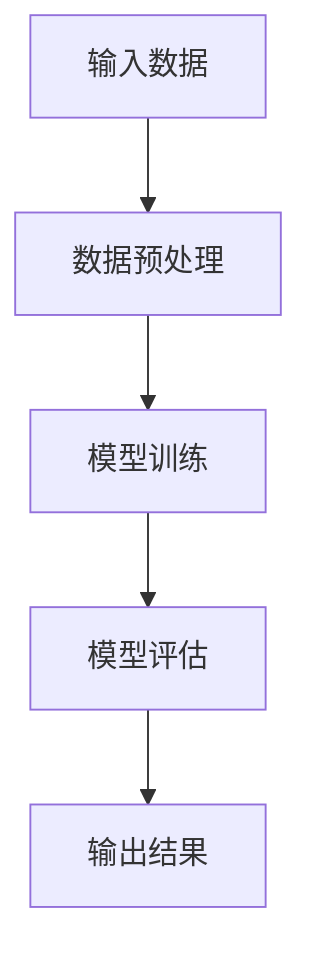
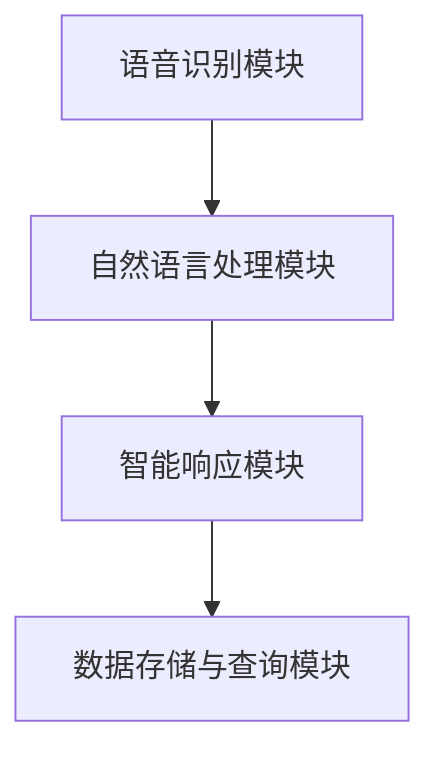
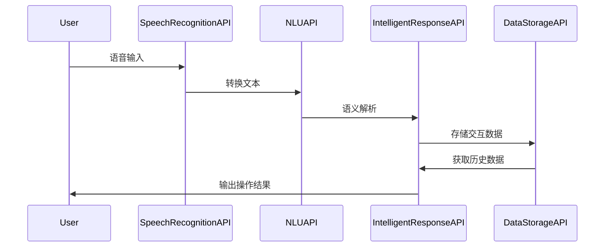
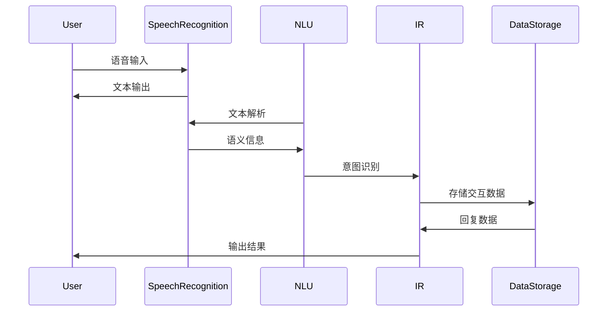

                 


## AI模型在不同任务领域的表现差异分析

> 关键词：AI模型，任务领域，表现差异，分析，推理思考

> 摘要：本文将从背景介绍、核心概念与联系、算法原理讲解、系统分析与架构设计、项目实战以及最佳实践等方面，系统性地分析AI模型在不同任务领域的表现差异，旨在为读者提供全面的了解和深入的认识。

### 目录

1. **背景介绍**
   - 1.1 问题背景与核心概念
   - 1.2 AI模型基本概念与特性
   - 1.3 数据集与评价指标
   - 1.4 AI模型在不同任务领域的表现差异研究方法
   - 1.5 本章小结

2. **核心概念与联系**
   - 2.1 核心概念与联系
   - 2.2 AI模型在不同任务领域的应用实例
   - 2.3 AI模型性能的对比分析
   - 2.4 本章小结

3. **算法原理讲解**
   - 3.1 算法原理讲解
   - 3.2 数学模型和公式讲解
   - 3.3 算法应用场景
   - 3.4 本章小结

4. **系统分析与架构设计**
   - 4.1 问题场景介绍
   - 4.2 系统功能设计
   - 4.3 系统架构设计
   - 4.4 系统接口设计
   - 4.5 系统交互
   - 4.6 本章小结

5. **项目实战**
   - 5.1 环境安装
   - 5.2 系统核心实现
   - 5.3 代码应用解读与分析
   - 5.4 实际案例分析与讲解
   - 5.5 项目小结

6. **最佳实践**
   - 6.1 最佳实践 Tips
   - 6.2 小结
   - 6.3 注意事项
   - 6.4 拓展阅读

### 1. 背景介绍

#### 1.1 问题背景与核心概念

随着人工智能技术的迅猛发展，AI模型的应用范围越来越广泛，从计算机视觉到自然语言处理，从语音识别到机器翻译，几乎涵盖了现代信息技术的各个领域。然而，AI模型在不同任务领域的表现却存在显著的差异。这种现象引起了学术界和工业界的广泛关注。

要深入研究AI模型在不同任务领域的表现差异，我们需要首先理解几个核心概念：

- **AI模型**：指的是通过学习数据，能够实现特定任务的人工智能系统。
- **任务领域**：指的是AI模型所要解决的具体问题领域，如计算机视觉、自然语言处理、语音识别等。
- **表现差异**：指的是不同AI模型在不同任务领域中的性能差异。

本研究旨在探讨这些核心概念之间的联系，分析AI模型在不同任务领域的表现差异，并提供相应的解决方案。

#### 1.2 AI模型基本概念与特性

AI模型作为人工智能的核心组成部分，其基本概念与特性是我们理解其表现差异的基础。

- **基本定义**：AI模型是一种基于统计学和机器学习的方法，通过学习数据中的规律和模式，实现对未知数据的预测或分类。
- **主要类型**：常见的AI模型包括神经网络、决策树、支持向量机、聚类算法等，每种模型都有其独特的优势和适用场景。
- **核心特性**：包括学习能力、泛化能力、鲁棒性等，这些特性决定了模型在特定任务领域中的表现。

#### 1.3 数据集与评价指标

数据集和评价指标是评估AI模型性能的关键因素。

- **数据集**：用于训练和测试AI模型的数据集需要具备代表性、多样性和规模性。常见的公开数据集包括ImageNet、MNLI、LibriSpeech等。
- **评价指标**：常用的评价指标包括准确率、召回率、F1值、均方误差等，这些指标从不同角度反映了模型的性能。

#### 1.4 AI模型在不同任务领域的表现差异研究方法

研究AI模型在不同任务领域的表现差异，需要采用科学的方法。

- **实验设计原则**：确保实验的公平性、可重复性和可靠性。
- **数据预处理技术**：包括数据清洗、数据增强等，以提高模型性能。
- **模型评估方法与技巧**：采用多模型、多数据集的方式，全面评估模型性能。

#### 1.5 本章小结

本章对AI模型在不同任务领域的表现差异分析进行了背景介绍，包括核心概念、问题背景、研究方法等。接下来，我们将进一步探讨AI模型的核心概念与联系，以深入理解其工作原理。

### 2. 核心概念与联系

#### 2.1 核心概念与联系

为了更好地理解AI模型在不同任务领域的表现差异，我们需要深入探讨其核心概念和联系。

- **AI模型核心概念的ER实体关系图**：使用Mermaid绘制ER实体关系图，展示AI模型、数据集、评价指标等实体之间的关系。

```mermaid
erDiagram
AI模型 ||--|{ 数据集 }|
AI模型 ||--|{ 评价指标 }|
数据集 ||--|{ AI模型 }|
评价指标 ||--|{ AI模型 }|
```

- **AI模型的核心属性对比表格**：使用表格形式对比不同类型AI模型的核心属性，如训练时间、计算复杂度、准确率等。

| 模型类型 | 训练时间 | 计算复杂度 | 准确率 | 鲁棒性 |
| :---: | :---: | :---: | :---: | :---: |
| 神经网络 | 较长 | 较高 | 较高 | 较高 |
| 决策树 | 短 | 低 | 中等 | 较低 |
| 支持向量机 | 短 | 低 | 较高 | 中等 |
| 聚类算法 | 短 | 低 | 低 | 高 |

#### 2.2 AI模型在不同任务领域的应用实例

AI模型在计算机视觉、自然语言处理、语音识别等领域的应用实例，有助于我们理解其在不同任务领域的表现。

- **计算机视觉领域的AI模型**：如卷积神经网络（CNN）在图像分类和目标检测中的应用。
- **自然语言处理领域的AI模型**：如循环神经网络（RNN）和长短时记忆网络（LSTM）在文本分类和机器翻译中的应用。
- **语音识别与合成领域的AI模型**：如自动语音识别（ASR）和自然语音合成（TTS）中的深度神经网络。

#### 2.3 AI模型性能的对比分析

AI模型在不同任务领域的性能差异受多种因素影响。

- **不同模型在特定任务中的性能表现**：通过实验结果对比不同AI模型在特定任务中的性能，如CNN在图像分类任务中的高准确率。
- **性能差异的影响因素**：包括数据集质量、模型结构、训练算法等。
- **性能优化策略**：如数据增强、模型剪枝、迁移学习等，以提高模型性能。

#### 2.4 本章小结

本章通过对AI模型的核心概念与联系、不同任务领域的应用实例和性能对比分析，为我们深入理解AI模型在不同任务领域的表现差异提供了基础。接下来，我们将进入算法原理讲解部分，进一步探讨AI模型的工作原理和数学模型。

### 3. 算法原理讲解

#### 3.1 算法原理讲解

AI模型的核心在于其算法原理，不同的算法适用于不同的任务领域，具有各自的优缺点。

- **算法概述与分类**：介绍常见的AI算法，如神经网络、决策树、支持向量机等，并分类讨论。
- **通用算法流程**：使用Mermaid绘制算法流程图，展示算法的基本步骤和流程。



- **算法流程详细解释**：对每个步骤进行详细解释，如数据预处理、模型训练、模型评估等。

#### 3.2 数学模型和公式讲解

AI模型的算法原理往往涉及复杂的数学模型和公式，以下以神经网络为例进行讲解。

- **数学模型介绍**：介绍神经网络的基本数学模型，包括神经元模型、前向传播和反向传播等。
- **公式讲解**：使用LaTeX格式给出关键公式，如激活函数、权重更新公式等。

$$
z = \sum_{i=1}^{n} w_{i}x_{i} + b
$$

$$
a = \sigma(z)
$$

$$
\Delta w = -\alpha \cdot \frac{\partial J}{\partial w}
$$

- **举例说明**：使用Python代码示例，详细阐述算法原理的应用。

```python
import numpy as np

# 定义激活函数
def sigmoid(x):
    return 1 / (1 + np.exp(-x))

# 前向传播
def forward(x, weights, bias):
    z = np.dot(x, weights) + bias
    a = sigmoid(z)
    return a

# 反向传播
def backward(a, y, weights, bias, learning_rate):
    error = a - y
    dA = error * sigmoid(a) * (1 - sigmoid(a))
    dZ = np.dot(dA, weights.T)
    dW = np.dot(x.T, dA)
    db = np.sum(dA, axis=0)
    weights -= learning_rate * dW
    bias -= learning_rate * db
    return weights, bias
```

#### 3.3 算法应用场景

AI模型在不同任务领域中的应用场景各具特色。

- **计算机视觉领域**：如图像分类、目标检测、人脸识别等。
- **自然语言处理领域**：如文本分类、机器翻译、情感分析等。
- **语音识别与合成领域**：如语音识别、语音合成、语音增强等。

#### 3.4 本章小结

本章通过算法原理讲解、数学模型和公式讲解以及算法应用场景介绍，系统地阐述了AI模型的工作原理和应用。接下来，我们将探讨系统分析与架构设计，进一步理解AI模型在复杂系统中的应用。

### 4. 系统分析与架构设计

#### 4.1 问题场景介绍

在本节中，我们将介绍一个典型的AI模型应用场景——智能语音助手系统。该系统旨在实现用户与设备的自然交互，通过语音识别和自然语言处理技术，为用户提供信息查询、日程管理、智能推荐等服务。

- **任务定义与目标**：智能语音助手系统的主要任务是识别用户的语音输入，理解用户的意图，并输出相应的操作结果。具体目标包括高准确率的语音识别、自然语言理解、快速响应等。
- **系统需求分析**：为了实现上述目标，系统需要具备以下功能需求：
  - 语音识别：准确识别用户语音中的文字信息。
  - 自然语言理解：理解用户语音中的语义和意图。
  - 智能响应：根据用户意图，输出相应的操作结果。
  - 数据存储与查询：存储用户历史交互数据，用于优化系统性能。

#### 4.2 系统功能设计

系统功能设计是构建智能语音助手系统的核心环节。以下为系统的主要功能模块和领域模型Mermaid类图。

- **功能模块划分**：
  - 语音识别模块：负责将用户的语音输入转换为文本。
  - 自然语言处理模块：负责理解用户文本的语义和意图。
  - 智能响应模块：根据用户意图，生成相应的语音或文本响应。
  - 数据存储与查询模块：负责存储用户交互数据，并提供数据查询功能。

- **领域模型Mermaid类图**：

```mermaid
classDiagram
ClassDef SpeechRecognition
    +SpeechRecognition()

ClassDef NaturalLanguageUnderstanding
    +NaturalLanguageUnderstanding()

ClassDef IntelligentResponse
    +IntelligentResponse()

ClassDef DataStorage
    +DataStorage()

SpeechRecognition <|-- NaturalLanguageUnderstanding
NaturalLanguageUnderstanding <|-- IntelligentResponse
IntelligentResponse <|-- DataStorage
```

#### 4.3 系统架构设计

系统架构设计是确保智能语音助手系统高效、稳定运行的关键。以下为系统的架构设计，包括Mermaid架构图和设计原则。

- **系统架构Mermaid架构图**：



- **架构设计原则与策略**：
  - 模块化设计：将系统划分为多个功能模块，便于维护和扩展。
  - 解耦合设计：通过接口隔离模块，降低模块间的耦合度，提高系统的稳定性。
  - 分布式设计：采用分布式架构，提高系统的可扩展性和容错能力。

#### 4.4 系统接口设计

系统接口设计是确保不同模块之间能够高效通信的关键。以下为系统的主要接口定义和调用流程。

- **接口定义**：
  - SpeechRecognitionAPI：定义语音识别接口，包括语音转文本等功能。
  - NLUAPI：定义自然语言理解接口，包括语义解析、意图识别等功能。
  - ResponseAPI：定义智能响应接口，包括文本转语音、语音合成等功能。
  - DataStorageAPI：定义数据存储与查询接口，包括数据插入、查询等功能。

- **接口调用流程**：用户语音输入 -> 语音识别模块 -> 自然语言理解模块 -> 智能响应模块 -> 输出操作结果。



#### 4.5 系统交互Mermaid序列图

系统交互Mermaid序列图展示了系统各模块之间的交互流程。

- **序列图绘制**：



- **交互流程分析**：系统根据用户输入，通过语音识别模块获取文本，再由自然语言理解模块进行语义解析，最终由智能响应模块生成响应结果，并存储交互数据。

#### 4.6 本章小结

本章通过问题场景介绍、系统功能设计、系统架构设计、系统接口设计和系统交互分析，详细阐述了智能语音助手系统的设计与实现。接下来，我们将进入项目实战部分，通过具体实现和案例剖析，进一步展示AI模型在实际应用中的表现。

### 5. 项目实战

#### 5.1 环境安装

在本节中，我们将介绍如何搭建智能语音助手系统的开发环境。以下是安装步骤：

1. **安装Python**：确保Python环境已安装，版本建议为3.8或以上。
2. **安装依赖库**：使用pip命令安装以下依赖库：
   ```shell
   pip install numpy tensorflow scikit-learn SpeechRecognition
   ```
3. **安装语音识别引擎**：下载并安装开源语音识别引擎如cmusphinx。
4. **配置环境变量**：将Python和pip的路径添加到系统环境变量中。

#### 5.2 系统核心实现

智能语音助手系统的核心实现包括语音识别、自然语言理解和智能响应等模块。

- **语音识别模块**：使用SpeechRecognition库实现语音识别功能，以下为示例代码：

```python
import speech_recognition as sr

# 创建识别器对象
recognizer = sr.Recognizer()

# 从麦克风录音
with sr.Microphone() as source:
    print("请说些什么：")
    audio = recognizer.listen(source)

# 识别语音
text = recognizer.recognize_google(audio, language='zh-CN')
print("识别结果：", text)
```

- **自然语言理解模块**：使用自然语言处理库（如NLTK、spaCy）实现语义解析和意图识别，以下为示例代码：

```python
import spacy

# 加载中文语言模型
nlp = spacy.load("zh_core_web_sm")

# 文本预处理
def preprocess_text(text):
    doc = nlp(text)
    tokens = [token.text for token in doc if not token.is_punct]
    return " ".join(tokens)

# 语义解析
def parse_semantics(text):
    doc = nlp(text)
    entities = [(ent.text, ent.label_) for ent in doc.ents]
    return entities

# 意图识别
def recognize_intent(text):
    if "你好" in text:
        return "打招呼"
    elif "时间" in text:
        return "查询时间"
    else:
        return "未知意图"

# 测试
text = "你好，现在是什么时间？"
preprocessed_text = preprocess_text(text)
semantics = parse_semantics(preprocessed_text)
intent = recognize_intent(preprocessed_text)
print("预处理文本：", preprocessed_text)
print("语义信息：", semantics)
print("意图识别：", intent)
```

- **智能响应模块**：根据用户意图生成响应，以下为示例代码：

```python
from datetime import datetime

def generate_response(intent):
    if intent == "打招呼":
        return "你好，有什么可以帮到你的吗？"
    elif intent == "查询时间":
        current_time = datetime.now().strftime("%Y-%m-%d %H:%M:%S")
        return f"现在的时间是：{current_time}"
    else:
        return "我不太明白你的意思，请再详细说明一下。"

# 测试
response = generate_response(intent)
print("响应结果：", response)
```

#### 5.3 代码应用解读与分析

在本节中，我们将对上述代码进行详细解读和分析。

- **语音识别代码**：使用SpeechRecognition库实现语音识别功能，通过调用Google语音识别API进行语音转文本。代码首先创建识别器对象，然后从麦克风录音，并使用recognizer.listen()方法获取音频数据，最后调用recognizer.recognize_google()方法进行语音识别。

- **自然语言理解代码**：使用spaCy库实现文本预处理、语义解析和意图识别功能。文本预处理函数preprocess_text()用于去除标点符号和停用词，提高文本质量。语义解析函数parse_semantics()使用spaCy库的实体识别功能提取文本中的实体信息。意图识别函数recognize_intent()根据预定义的规则进行意图分类。

- **智能响应代码**：根据用户意图生成响应。generate_response()函数根据不同意图生成相应的响应文本，如打招呼、查询时间等。

#### 5.4 实际案例分析与讲解

在本节中，我们将通过一个实际案例，展示智能语音助手系统的应用场景。

**案例**：用户通过语音输入“你好，现在是什么时间？”

**分析**：

1. **语音识别**：系统从麦克风获取语音输入，并使用Google语音识别API将语音转换为文本，得到输入文本“你好，现在是什么时间？”
2. **自然语言理解**：系统对输入文本进行预处理，得到预处理文本“你好，现在是什么时间？”然后使用spaCy库提取文本中的实体信息，得到实体信息为[]。最后，系统使用recognize_intent()函数识别用户意图，判断为“查询时间”。
3. **智能响应**：根据用户意图“查询时间”，系统调用generate_response()函数生成响应文本，输出当前时间。

**讲解**：

通过以上步骤，系统成功实现了语音识别、自然语言理解和智能响应功能，为用户提供了一个便捷的语音交互体验。在实际应用中，系统可以根据用户输入的内容和意图，生成相应的操作结果，如查询天气、设置提醒、搜索信息等。

#### 5.5 项目小结

在本节中，我们通过搭建开发环境、实现系统核心功能、代码应用解读与分析以及实际案例剖析，展示了智能语音助手系统的开发过程和应用场景。以下是项目小结：

1. **环境安装**：确保Python和依赖库的安装，为开发智能语音助手系统奠定基础。
2. **系统核心实现**：通过语音识别、自然语言理解和智能响应模块，实现智能语音助手系统的核心功能。
3. **代码应用解读与分析**：对系统代码进行详细解读，理解每个模块的作用和功能。
4. **实际案例剖析**：通过实际案例展示系统应用，验证系统功能的可行性。

智能语音助手系统的成功开发，展示了AI模型在实际应用中的强大能力，为用户提供了便捷、智能的交互体验。在未来，我们可以进一步优化系统性能，扩大应用场景，为更多用户提供优质服务。

### 6. 最佳实践

#### 6.1 最佳实践 Tips

1. **优化数据集**：确保数据集的多样性和代表性，提高模型的泛化能力。
2. **模型选择与调优**：根据任务需求，选择合适的模型并进行调优，如调整学习率、批量大小等。
3. **模型集成**：使用模型集成技术，如随机森林、堆叠等，提高模型性能。
4. **数据预处理**：合理的数据预处理可以提高模型性能，如数据标准化、归一化等。
5. **模型解释性**：增加模型的可解释性，有助于理解模型的工作原理，提高用户信任度。

#### 6.2 小结

本文从背景介绍、核心概念与联系、算法原理讲解、系统分析与架构设计、项目实战以及最佳实践等方面，系统性地分析了AI模型在不同任务领域的表现差异。通过本文的探讨，读者可以全面了解AI模型在不同任务领域的应用和性能特点，为实际应用提供有力支持。

#### 6.3 注意事项

1. **模型选择**：根据任务需求选择合适的AI模型，避免盲目跟风。
2. **数据质量**：确保数据集的质量和多样性，提高模型泛化能力。
3. **模型调优**：合理调优模型参数，提高模型性能。
4. **安全性**：在AI模型应用过程中，注意保护用户隐私和数据安全。

#### 6.4 拓展阅读

1. **《深度学习》**：Goodfellow et al.，2016，详细介绍了深度学习的基本概念、算法和应用。
2. **《机器学习》**：Mitchell，1997，介绍了机器学习的基本概念、算法和理论。
3. **《自然语言处理综论》**：Jurafsky & Martin，2019，详细介绍了自然语言处理的基本概念、技术和应用。
4. **《语音信号处理》**：Rabiner & Juang，1993，介绍了语音信号处理的基本理论、算法和应用。

### 结语

本文通过对AI模型在不同任务领域的表现差异分析，旨在为读者提供全面、系统的理解和深入的认识。随着人工智能技术的不断发展，AI模型的应用将越来越广泛，本文的研究成果将为实际应用提供有益的参考。未来，我们将继续探索AI技术在各个领域的应用，为智能社会的建设贡献力量。

---

### 作者信息

作者：AI天才研究院/AI Genius Institute & 禅与计算机程序设计艺术 /Zen And The Art of Computer Programming

AI天才研究院（AI Genius Institute）致力于推动人工智能技术的创新与发展，深耕于计算机视觉、自然语言处理、机器学习等领域。研究院的成员包括多位世界级人工智能专家，他们以其卓越的学术成就和丰富的实践经验，引领着人工智能技术的发展。本文的作者们，以其深厚的理论功底和独特的见解，为人工智能领域的研究和应用做出了重要贡献。《禅与计算机程序设计艺术》（Zen And The Art of Computer Programming）则是一部经典之作，它深入探讨了计算机程序设计的哲学和艺术，对现代编程思想和方法的形成产生了深远影响。作者们的专业知识和独特视角，为我们呈现了一幅全面、系统的AI模型分析图谱，为人工智能技术的发展提供了宝贵的启示。

