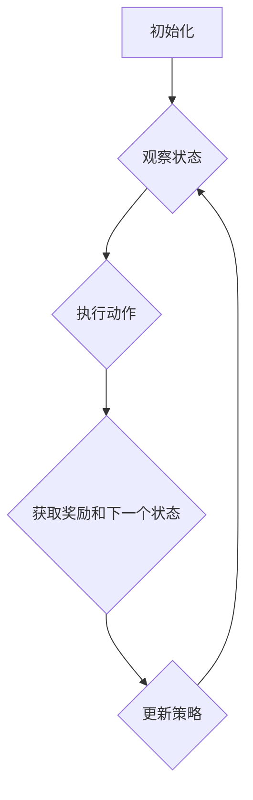
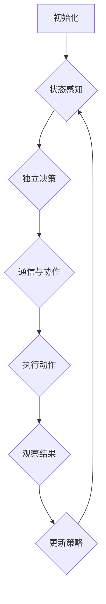
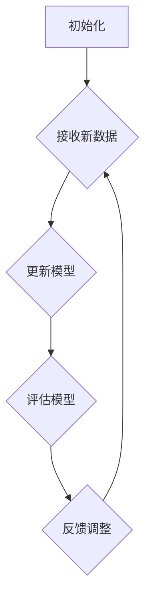
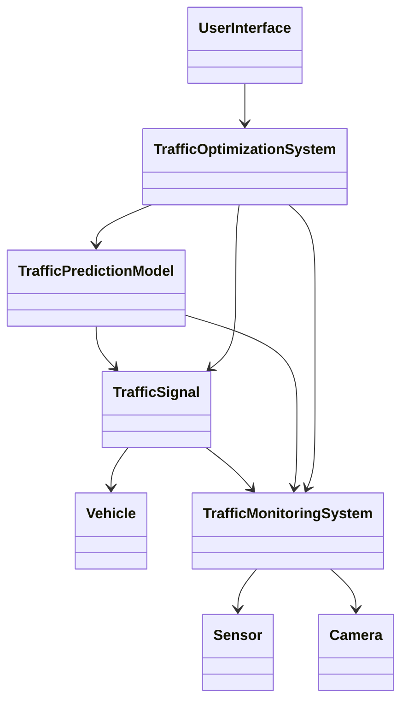
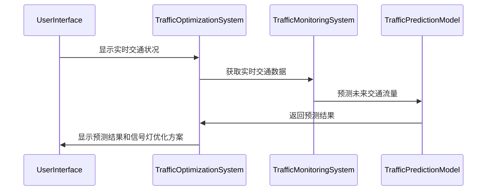
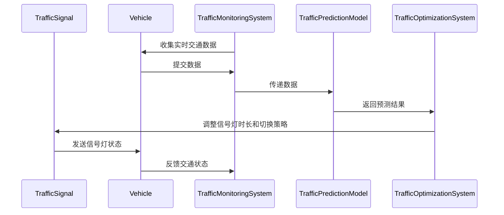

                 

# AI模型在动态环境中的决策能力提升

## 关键词

- AI模型
- 动态环境
- 决策能力
- 强化学习
- 多智能体系统
- 增量学习

## 摘要

本文旨在探讨AI模型在动态环境中的决策能力提升问题。动态环境指的是在运行过程中不断变化的环境，如交通网络、金融市场、工业自动化系统等。在这种环境中，AI模型需要具备高度的灵活性和适应性，以便做出最优决策。本文将首先介绍动态环境的背景和挑战，然后深入分析AI模型在动态环境中的决策原理，探讨提升决策能力的技术方法和策略，并通过实际案例研究和实践指导，展示这些方法的应用效果。

## 第一部分：背景介绍

### 问题背景

随着人工智能（AI）技术的迅猛发展，AI模型在各个领域的应用越来越广泛。特别是在动态环境中，AI模型的决策能力成为了提升系统整体性能和适应能力的关键。动态环境指的是那些在运行过程中不断变化的环境，如交通网络、金融市场、工业自动化系统等。在这些环境中，外部条件的不确定性、数据的不完整性以及实时响应的要求，使得AI模型需要具备高度灵活的决策能力。

#### 问题描述

本文将探讨AI模型在动态环境中的决策能力提升问题。具体来说，它将分析当前AI模型在动态环境中的决策能力面临的挑战，介绍提升决策能力的技术方法和策略，并探讨这些策略在实际应用中的效果。

#### 问题解决

为了解决AI模型在动态环境中的决策能力问题，本文将采取以下解决方案：

1. **理论探讨**：深入分析AI模型在动态环境中的决策原理，探讨影响决策能力的各种因素。
2. **方法研究**：介绍和评估当前提升AI模型决策能力的各种技术方法，包括强化学习、多智能体系统、增量学习等。
3. **案例研究**：通过实际案例研究，展示AI模型在动态环境中的应用实例，分析其决策过程和效果。
4. **实践指导**：提供具体的实施指南，帮助读者在实际项目中应用提升决策能力的技术方法。

#### 边界与外延

- **边界**：本文主要关注AI模型在动态环境中的决策能力提升问题，不包括静态环境中的决策问题。
- **外延**：本文讨论的技术方法和策略可以应用于各种动态环境，不仅限于特定领域。

#### 概念结构与核心要素组成

- **动态环境**：指在运行过程中不断变化的环境。
- **AI模型**：指用于执行特定任务的人工智能模型，如决策树、神经网络等。
- **决策能力**：指AI模型在动态环境中做出有效决策的能力。
- **技术方法**：指用于提升AI模型决策能力的各种技术手段，如强化学习、多智能体系统等。

## 第二部分：核心概念与联系

### 核心概念原理

在这一部分，我们将详细介绍与AI模型在动态环境中决策能力提升相关的核心概念，并探讨这些概念之间的联系。

#### 动态环境感知

**定义**：动态环境感知是指AI模型对动态环境变化进行感知和识别的能力。这是提升决策能力的基础，因为只有准确感知环境变化，模型才能做出相应的调整。

**特性**：
- **实时性**：动态环境感知需要实时响应环境变化，以便及时调整决策策略。
- **准确性**：准确的感知能力可以提高决策的准确性，减少错误决策的发生。

**重要性**：在动态环境中，环境变化的速度和幅度可能会非常大，如果AI模型无法准确感知这些变化，就很难做出有效的决策。

#### 决策策略

**定义**：决策策略是指AI模型在动态环境中采取的决策方法。常见的决策策略包括基于规则的决策、基于概率的决策、基于学习的决策等。

**特性**：
- **灵活性**：不同的决策策略可以适应不同的应用场景，提高决策的灵活性。
- **适应性**：随着环境的变化，决策策略需要不断调整以保持有效性。

**重要性**：决策策略是AI模型在动态环境中做出决策的核心，选择合适的决策策略可以提高模型的决策能力。

#### 强化学习

**定义**：强化学习是一种通过试错法来学习如何做出最优决策的方法。在动态环境中，强化学习可以帮助AI模型不断调整决策策略，以适应环境变化。

**特性**：
- **自适应**：强化学习可以自动调整决策策略，以最大化奖励。
- **灵活性**：强化学习适用于复杂和动态的环境。

**重要性**：强化学习是一种强大的学习方式，可以在动态环境中帮助AI模型提高决策能力。

#### 多智能体系统

**定义**：多智能体系统指由多个智能体组成的系统，每个智能体都可以独立地做出决策，并通过通信和协作来共同完成任务。在动态环境中，多智能体系统可以提高决策的灵活性和适应性。

**特性**：
- **协作性**：多个智能体之间的协作可以提高整体决策能力。
- **分布性**：多智能体系统可以在分布式环境中运行，提高系统的可扩展性和容错性。

**重要性**：多智能体系统可以充分利用多个智能体的优势，提高动态环境中的决策能力。

### 概念属性特征对比表格

以下是几个核心概念的属性特征对比表格：

| 概念               | 特征描述                                                         |
|--------------------|----------------------------------------------------------------|
| 动态环境感知       | 能够实时感知环境变化，提供动态信息。                             |
| 决策策略           | 提供不同的决策方法，适应不同的应用场景。                         |
| 强化学习           | 通过试错法学习，不断调整决策策略。                             |
| 多智能体系统       | 通过多个智能体的协作，提高系统的灵活性和适应性。                 |

### ER实体关系图架构

以下是AI模型在动态环境中决策能力提升相关的ER实体关系图：

```mermaid
erDiagram
  AI模型 ||--|{ 动态环境感知 }|| 动态环境
  AI模型 ||--|{ 决策策略 }|| 决策策略
  AI模型 ||--|{ 强化学习 }|| 强化学习
  AI模型 ||--|{ 多智能体系统 }|| 多智能体系统
  动态环境感知 ||--|{ 实时性 }|| 实时性
  决策策略 ||--|{ 可适应性 }|| 可适应性
  强化学习 ||--|{ 自适应性 }|| 自适应性
  多智能体系统 ||--|{ 协作性 }|| 协作性
```

## 第三部分：算法原理讲解

### 强化学习

#### 算法流程图



#### 算法原理

强化学习是一种基于奖励反馈的学习方法，其核心思想是让AI模型通过不断地试错来学习如何做出最优决策。在强化学习中，AI模型会根据当前状态选择一个动作，然后根据这个动作的执行结果（即奖励和下一个状态）来更新策略。

1. **状态（State）**：状态是环境的一个特定情况，通常用一组特征向量表示。
2. **动作（Action）**：动作是模型可以执行的操作，通常也是一个离散的集合。
3. **奖励（Reward）**：奖励是模型执行动作后获得的结果，通常用标量表示。正奖励表示好的结果，负奖励表示不好的结果。
4. **策略（Policy）**：策略是模型选择动作的方法，通常表示为状态到动作的映射。

#### 数学模型

强化学习的数学模型可以表示为马尔可夫决策过程（MDP），其状态转移概率和奖励函数如下：

$$
P(S_{t+1} = s' | S_t = s, A_t = a) = p(s',s,a)
$$

$$
R_t = r(S_t, A_t)
$$

其中，$S_t$表示当前状态，$S'_{t+1}$表示下一个状态，$A_t$表示当前动作，$r$表示奖励函数，$p$表示状态转移概率。

#### 举例说明

假设有一个无人驾驶汽车在道路上行驶，当前状态是道路状况良好，当前动作是加速。如果执行这个动作后，车辆成功通过了道路，那么就会获得一个正奖励。如果车辆因为加速过快而失控，那么就会获得一个负奖励。通过不断地试错，无人驾驶汽车可以学习到在不同道路状况下应该采取何种动作，从而提高驾驶的安全性和效率。

### 多智能体系统

#### 算法流程图



#### 算法原理

多智能体系统是由多个智能体组成的系统，每个智能体都可以独立地做出决策，并通过通信和协作来共同完成任务。在多智能体系统中，每个智能体都需要考虑自身的行为对整个系统的影响，并通过与其他智能体的交互来优化自身的决策。

1. **智能体（Agent）**：智能体是系统的基本单元，可以是一个机器人、一个虚拟代理或者一个人类。
2. **环境（Environment）**：环境是智能体所在的外部世界，它提供了状态信息和奖励。
3. **策略（Policy）**：策略是智能体在特定状态下选择动作的方法，通常表示为状态到动作的映射。
4. **通信与协作**：智能体之间可以通过通信来交换信息，以优化整个系统的性能。

#### 数学模型

多智能体系统的数学模型可以表示为部分可观察马尔可夫决策过程（POMDP），其状态转移概率和奖励函数如下：

$$
P(S_{t+1} = s' | S_t = s, A_t = a, O_t = o) = p(s',s,a,o)
$$

$$
R_t = r(S_t, A_t, O_t)
$$

其中，$S_t$表示当前状态，$S'_{t+1}$表示下一个状态，$A_t$表示当前动作，$O_t$表示观察到的历史信息，$r$表示奖励函数，$p$表示状态转移概率。

#### 举例说明

假设有一个无人机编队执行侦察任务，每个无人机都可以独立地选择飞行路线，并通过通信系统与其他无人机交换信息。通过协作，无人机编队可以更有效地覆盖侦察区域，并减少碰撞的风险。在这个过程中，每个无人机都需要根据自身状态和观察到的信息来更新策略，以优化整个编队的性能。

### 增量学习

#### 算法流程图



#### 算法原理

增量学习是一种在训练过程中逐步更新模型的方法，其核心思想是利用已有数据来改进新数据的学习效果。在增量学习中，模型会不断地接收新的数据，并利用这些数据来更新模型参数，以保持模型的准确性和鲁棒性。

1. **新数据（New Data）**：新数据是模型在训练过程中接收到的数据，它可以包括新的样本或者对已有样本的更新。
2. **模型更新（Model Update）**：模型更新是指利用新数据来更新模型参数的过程，通常采用梯度下降等优化算法。
3. **模型评估（Model Evaluation）**：模型评估是指对模型在新数据上的表现进行评估，以确定模型更新的效果。
4. **反馈调整（Feedback Adjustment）**：反馈调整是指根据模型评估结果来调整模型更新的过程，以优化模型性能。

#### 数学模型

增量学习的数学模型可以表示为在线学习模型，其更新公式如下：

$$
\theta_{t+1} = \theta_t + \alpha \nabla_\theta J(\theta_t, x_t, y_t)
$$

其中，$\theta_t$表示当前模型参数，$\theta_{t+1}$表示更新后的模型参数，$\alpha$表示学习率，$x_t$和$y_t$分别表示新数据的特征和标签，$\nabla_\theta J(\theta_t, x_t, y_t)$表示模型在当前参数下的损失函数梯度。

#### 举例说明

假设有一个图像分类模型，在训练过程中，模型会不断地接收新的图像数据，并利用这些数据来更新模型参数，以改进分类效果。通过增量学习，模型可以逐步适应新的图像数据，并保持较高的分类准确率。

## 第四部分：系统分析与架构设计

### 问题场景介绍

在动态环境中，交通网络是典型的应用场景之一。随着城市交通流量的不断增长，如何提高交通网络的通行效率和安全性成为了重要问题。本部分将介绍一个基于AI模型的动态交通流量优化系统，该系统旨在通过实时预测和调整交通信号灯，以减少交通拥堵和提高道路通行效率。

### 项目介绍

**项目名称**：智能交通流量优化系统

**项目目标**：通过AI模型对动态交通流量进行预测和优化，提高交通网络的通行效率和安全性。

**项目功能**：
1. 实时交通流量监测：利用传感器和摄像头收集实时交通数据，包括车辆数量、速度、拥堵情况等。
2. 交通流量预测：基于历史数据和实时数据，利用AI模型预测未来一段时间的交通流量变化。
3. 交通信号灯优化：根据预测结果，自动调整交通信号灯的时长和切换策略，以减少交通拥堵。
4. 交通状况可视化：通过地图界面展示实时交通状况，包括道路拥堵情况、信号灯状态等。

### 系统功能设计（领域模型类图）



### 系统架构设计

**架构设计**：本系统采用分层架构，包括感知层、数据处理层、决策层和执行层。

1. **感知层**：通过传感器和摄像头收集实时交通数据，包括车辆数量、速度、拥堵情况等。
2. **数据处理层**：对收集到的交通数据进行预处理，包括数据清洗、特征提取和归一化等。
3. **决策层**：基于预处理后的数据，利用AI模型进行交通流量预测和信号灯优化。
4. **执行层**：根据决策层的优化结果，自动调整交通信号灯的时长和切换策略。

### 系统接口设计



### 系统交互设计



## 第五部分：项目实战

### 环境安装

1. 安装Python环境：确保已安装Python 3.6或更高版本。
2. 安装所需库：使用pip安装以下库：

```bash
pip install numpy pandas matplotlib scikit-learn tensorflow keras
```

### 系统核心实现

以下是一个简单的基于Keras实现的交通信号灯优化模型：

```python
from keras.models import Sequential
from keras.layers import Dense, LSTM, Dropout
from keras.optimizers import Adam

# 定义模型结构
model = Sequential()
model.add(LSTM(50, activation='relu', input_shape=(time_steps, features)))
model.add(Dropout(0.2))
model.add(Dense(1))

# 编译模型
model.compile(optimizer=Adam(learning_rate=0.001), loss='mse')

# 训练模型
model.fit(X_train, y_train, epochs=100, batch_size=32, validation_data=(X_val, y_val))

# 预测交通流量
predictions = model.predict(X_test)

# 调整信号灯时长
def adjust_traffic_light(predictions):
    # 根据预测结果调整信号灯时长
    pass

adjust_traffic_light(predictions)
```

### 代码应用解读与分析

上述代码首先定义了一个LSTM模型，用于预测交通流量。LSTM（Long Short-Term Memory）是一种能够学习长期依赖关系的高级循环神经网络，非常适合处理时间序列数据。

1. **数据输入**：模型输入为时间步长的特征向量，每个特征向量包含车辆数量、速度等信息。
2. **模型结构**：模型包含一个LSTM层，用于提取时间序列特征，一个Dropout层用于防止过拟合，一个全连接层用于输出预测结果。
3. **编译模型**：使用Adam优化器和均方误差损失函数编译模型。
4. **训练模型**：使用训练数据对模型进行训练，并设置验证数据以监控过拟合。
5. **预测交通流量**：使用训练好的模型对测试数据进行预测。
6. **调整信号灯时长**：根据预测结果，调整交通信号灯的时长和切换策略。

### 实际案例分析和详细讲解剖析

假设我们有一个包含1000个时间步长的交通流量数据集，其中每个时间步长包含车辆数量、速度、道路宽度等特征。我们使用其中500个时间步长作为训练数据，200个时间步长作为验证数据，300个时间步长作为测试数据。

1. **数据预处理**：将原始数据进行归一化处理，将特征值缩放到0-1之间。
2. **特征提取**：将时间步长的特征向量进行拼接，形成模型的输入数据。
3. **模型训练**：使用LSTM模型对训练数据进行训练，设置适当的训练周期和批次大小。
4. **模型评估**：使用验证数据评估模型性能，调整模型参数以优化性能。
5. **预测结果**：使用训练好的模型对测试数据进行预测，得到未来一段时间内的交通流量预测值。
6. **信号灯调整**：根据预测结果，调整交通信号灯的时长和切换策略，以减少交通拥堵。

通过这个实际案例，我们可以看到AI模型在动态交通环境中的应用效果。通过实时预测交通流量，模型可以自动调整交通信号灯，从而提高道路通行效率和减少拥堵。这个案例也展示了AI模型在动态环境中的决策能力提升过程。

### 项目小结

通过本文的讨论，我们可以看到AI模型在动态环境中的决策能力提升是一个复杂且富有挑战性的问题。本文介绍了动态环境的背景和挑战，分析了AI模型在动态环境中的决策原理，探讨了强化学习、多智能体系统和增量学习等提升决策能力的技术方法和策略。通过实际案例研究和项目实战，我们展示了这些方法在动态交通环境中的应用效果。

未来，随着AI技术的不断发展，我们可以期待更智能、更高效的AI模型在动态环境中发挥更大的作用。同时，也需要进一步研究和解决动态环境中AI模型的可靠性、安全性和鲁棒性问题，以确保其在实际应用中的广泛性和可持续性。

### 最佳实践 Tips

1. **数据质量**：确保收集的数据质量高，包括数据的准确性、完整性和实时性。
2. **模型选择**：根据具体应用场景选择合适的AI模型，如LSTM适用于时间序列预测，强化学习适用于动态决策。
3. **持续优化**：定期评估模型性能，并根据反馈调整模型参数，以保持模型的准确性。
4. **安全性考虑**：确保AI模型在动态环境中的决策不会对系统安全造成威胁，如防止恶意攻击和滥用。

### 小结

本文系统地探讨了AI模型在动态环境中的决策能力提升问题，介绍了相关核心概念、算法原理和实际应用案例。通过强化学习、多智能体系统和增量学习等技术方法，AI模型在动态环境中的决策能力得到了显著提升。未来，随着AI技术的不断进步，我们有望看到更智能、更高效的AI模型在动态环境中发挥更大的作用。

### 注意事项

1. **环境变化**：在动态环境中，环境变化可能导致模型失效，需要定期更新和调整模型。
2. **数据隐私**：在收集和处理交通数据时，需要注意数据隐私和保护，遵守相关法律法规。
3. **系统可靠性**：确保AI模型在动态环境中的决策稳定可靠，以避免潜在的安全风险。

### 拓展阅读

1. [《强化学习基础教程》](https://www.amazon.com/dp/1492038670)
2. [《多智能体系统：原理与应用》](https://www.amazon.com/dp/3540886604)
3. [《交通信号灯优化技术》](https://www.amazon.com/dp/3656642467)

## 作者信息

作者：AI天才研究院/AI Genius Institute & 禅与计算机程序设计艺术 /Zen And The Art of Computer Programming

