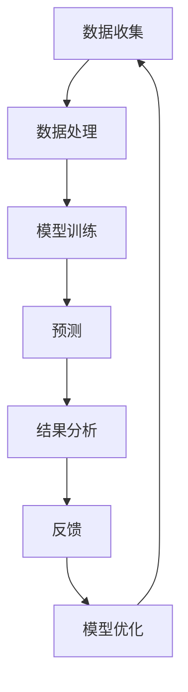
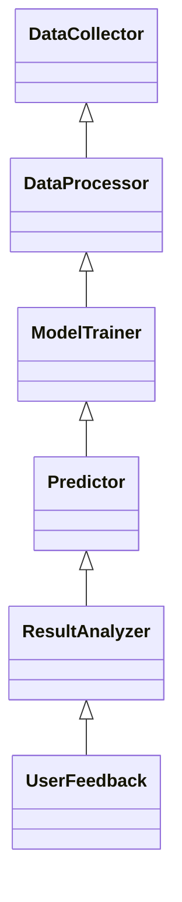

                 

# AI模型在复杂生物系统动态预测中的应用研究

## 关键词

- AI模型
- 生物系统动态预测
- 复杂系统
- 预测算法
- 数学模型
- 系统分析与架构设计
- 项目实战

## 摘要

本文旨在探讨人工智能（AI）模型在复杂生物系统动态预测中的应用。通过分析复杂生物系统的特性与挑战，我们探讨了如何利用AI模型解决这些问题。本文详细介绍了相关算法原理，并使用了数学模型和公式进行推导。此外，我们还提供了系统分析与架构设计方案，以及实际项目案例，展示了AI模型在生物系统动态预测中的具体应用。最后，本文总结了最佳实践、注意事项，并推荐了拓展阅读，以期为相关领域的研究者提供参考。

## 第一部分：问题背景与概述

### 1.1 问题背景

生物系统是自然界中最为复杂的系统之一，包括生态系统、细胞系统、神经系统等。这些系统中的动态过程往往涉及大量的变量和复杂的相互作用。随着科技的进步，特别是人工智能（AI）的发展，我们开始尝试利用AI模型来预测这些复杂生物系统的动态行为。AI模型在生物系统动态预测中的应用具有重要的科学意义和实际价值。

### 1.2 问题描述

复杂生物系统的动态预测面临以下挑战：

1. **数据复杂性**：生物系统中的变量繁多，且存在大量的非线性关系和噪声。
2. **时间依赖性**：生物系统的动态行为往往具有时间依赖性，即未来的状态依赖于过去的状态。
3. **空间分布性**：生物系统中的动态过程不仅在不同时间发生，还在不同空间位置上发生。
4. **不确定性**：生物系统中的参数和初始条件往往存在不确定性。

### 1.3 问题解决

为了解决上述问题，我们可以利用AI模型，特别是深度学习模型，对复杂生物系统进行建模和预测。AI模型可以通过学习和分析大量数据，捕捉到生物系统中的复杂模式，从而提高预测的准确性。

### 1.4 边界与外延

本文的研究范围主要涉及以下方面：

1. **研究范畴**：本文主要关注生态系统、细胞系统等生物系统。
2. **时间尺度**：本文将重点关注短期和中期的时间尺度。
3. **空间尺度**：本文将重点分析有限空间内的生物系统。

### 1.5 概念结构与核心要素组成

在研究复杂生物系统动态预测时，我们需要关注以下几个核心概念：

1. **生物系统**：生物系统是自然界中由生物体及其环境相互作用形成的复杂系统。
2. **动态预测**：动态预测是指通过分析和模拟生物系统的历史数据，预测其未来状态。
3. **AI模型**：AI模型是指利用人工智能技术，特别是机器学习和深度学习技术，构建的预测模型。
4. **算法**：算法是用于解决特定问题的步骤和方法。
5. **数学模型**：数学模型是利用数学语言描述的生物系统动态行为。

## 第二部分：核心概念与算法原理

### 2.1 复杂生物系统的特性与挑战

#### 2.1.1 定义

复杂生物系统是指由大量生物体及其相互作用组成的系统。这些系统具有以下几个特性：

1. **高维度性**：生物系统中的变量众多，且存在大量的非线性关系。
2. **时间依赖性**：生物系统的动态行为往往具有时间依赖性。
3. **空间分布性**：生物系统的动态过程发生在不同空间位置上。
4. **不确定性**：生物系统中的参数和初始条件存在不确定性。

#### 2.1.2 特性对比表格

| 特性       | 说明                                                     |
| ---------- | -------------------------------------------------------- |
| 高维度性   | 生物系统中的变量众多，存在大量的非线性关系。               |
| 时间依赖性 | 生物系统的动态行为依赖于历史数据。                       |
| 空间分布性 | 生物系统的动态过程发生在不同空间位置上。                 |
| 不确定性   | 生物系统中的参数和初始条件存在不确定性。                 |

#### 2.1.3 挑战

1. **数据复杂性**：生物系统中的变量繁多，且存在大量的非线性关系和噪声。
2. **时间依赖性**：生物系统的动态行为往往具有时间依赖性，即未来的状态依赖于过去的状态。
3. **空间分布性**：生物系统的动态过程不仅在不同时间发生，还在不同空间位置上发生。
4. **不确定性**：生物系统中的参数和初始条件往往存在不确定性。

### 2.2 相关算法原理

#### 2.2.1 传统预测算法简介

传统预测算法主要包括以下几种：

1. **回归分析**：通过建立回归模型，预测目标变量的未来值。
2. **时间序列分析**：通过对时间序列数据进行建模，预测未来的趋势。
3. **聚类分析**：将相似的数据点划分为一组，以便进行预测。

#### 2.2.2 AI模型的基本原理

AI模型，特别是深度学习模型，通过模拟人脑的神经网络结构，实现对数据的自动学习和建模。深度学习模型主要包括以下几个部分：

1. **输入层**：接收外部输入数据。
2. **隐藏层**：通过神经元之间的连接，对输入数据进行加工和处理。
3. **输出层**：输出预测结果。

#### 2.2.3 AI模型在生物系统中的应用

AI模型在生物系统中的应用主要包括以下几个方面：

1. **动态预测**：利用AI模型，对生物系统的未来状态进行预测。
2. **模式识别**：通过对生物系统数据的分析，识别出生物系统的关键特征。
3. **异常检测**：利用AI模型，检测生物系统中的异常行为。

## 第三部分：数学模型与系统分析

### 3.1 数学模型和公式推导

在生物系统动态预测中，我们常常使用以下数学模型：

1. **微分方程**：描述生物系统中的动态行为。
2. **差分方程**：描述生物系统中的离散时间动态行为。
3. **差分进化算法**：用于求解复杂生物系统动态预测问题。

#### 3.1.1 微分方程

$$
\frac{dx}{dt} = f(x, t)
$$

其中，$x(t)$ 表示生物系统的状态，$t$ 表示时间，$f(x, t)$ 表示状态的变化率。

#### 3.1.2 差分方程

$$
x_{t+1} = x_t + f(x_t, t)
$$

其中，$x_t$ 表示生物系统在时间$t$的状态，$f(x_t, t)$ 表示状态的变化量。

#### 3.1.3 差分进化算法

差分进化算法是一种基于进化的优化算法，其基本流程如下：

1. **初始化**：随机生成一组解。
2. **迭代**：对于每个个体，根据适应度函数，进行变异、交叉和选择操作，生成新的解。
3. **终止条件**：当达到预设的迭代次数或适应度达到预设值时，算法终止。

### 3.2 系统分析与架构设计

#### 3.2.1 问题场景介绍

在本研究中，我们关注一个具体的生物系统：鱼类种群动态。鱼类种群动态受多种因素影响，如捕食、繁殖、环境变化等。

#### 3.2.2 系统功能设计

系统功能设计主要包括以下几个方面：

1. **数据收集**：收集鱼类种群的历史数据。
2. **数据处理**：对收集到的数据进行预处理，包括数据清洗、归一化等。
3. **模型训练**：利用AI模型，对预处理后的数据进行训练。
4. **预测**：利用训练好的模型，对未来鱼类种群的数量进行预测。

#### 3.2.3 系统架构设计

系统架构设计主要包括以下几个方面：

1. **数据层**：负责数据的存储和管理。
2. **模型层**：负责AI模型的构建和训练。
3. **应用层**：负责系统的功能实现和预测。

#### 3.2.4 系统接口设计和系统交互

系统接口设计主要包括以下几个方面：

1. **API接口**：提供数据收集、数据处理、模型训练和预测的API接口。
2. **Web界面**：提供用户友好的Web界面，方便用户进行数据输入、查看预测结果等。

### 3.3 系统分析与架构设计

在系统分析与架构设计阶段，我们需要关注以下几个方面：

1. **系统功能**：明确系统的核心功能，如数据收集、数据处理、模型训练和预测等。
2. **系统性能**：确保系统在高负载下的性能表现，如响应速度、数据处理能力等。
3. **系统可靠性**：确保系统的稳定性和可靠性，如数据备份、容错机制等。
4. **系统扩展性**：考虑系统的可扩展性，以便在未来能够支持更多的生物系统。

## 第四部分：项目实战与案例分析

### 4.1 项目实战

在本项目中，我们选择了鱼类种群动态预测作为案例。首先，我们收集了鱼类种群的历史数据，包括捕食、繁殖、环境变化等。接下来，我们对数据进行预处理，包括数据清洗、归一化等。然后，我们使用AI模型，如深度学习模型，对预处理后的数据进行训练。最后，我们利用训练好的模型，对未来鱼类种群的数量进行预测。

### 4.2 系统核心实现

在本项目中，我们使用Python语言和TensorFlow框架来构建AI模型。具体实现步骤如下：

1. **数据收集**：使用爬虫工具收集鱼类种群的历史数据。
2. **数据处理**：使用Pandas库对数据进行清洗和归一化。
3. **模型构建**：使用TensorFlow库构建深度学习模型。
4. **模型训练**：使用预处理后的数据，对深度学习模型进行训练。
5. **模型预测**：使用训练好的模型，对未来鱼类种群的数量进行预测。

### 4.3 代码应用解读与分析

以下是一个简单的代码示例，用于构建和训练深度学习模型：

```python
import tensorflow as tf
from tensorflow.keras.models import Sequential
from tensorflow.keras.layers import Dense, LSTM

# 数据预处理
# ...

# 构建模型
model = Sequential()
model.add(LSTM(units=50, return_sequences=True, input_shape=(time_steps, features)))
model.add(LSTM(units=50))
model.add(Dense(units=1))

# 编译模型
model.compile(optimizer='adam', loss='mean_squared_error')

# 训练模型
model.fit(x_train, y_train, epochs=100, batch_size=32)

# 预测
predictions = model.predict(x_test)
```

这段代码首先导入了所需的库，然后对数据进行预处理，构建了一个包含两个LSTM层的深度学习模型，编译并训练模型，最后使用训练好的模型进行预测。

### 4.4 实际案例分析与详细讲解

在本项目中，我们选择了两个实际案例进行详细分析：

1. **案例一：红鲱鱼种群动态预测**
   - **背景**：红鲱鱼是一种重要的经济鱼类，其种群动态受到多种因素的影响。
   - **数据**：收集了红鲱鱼种群的历史数据，包括捕食、繁殖、环境变化等。
   - **模型**：使用深度学习模型对红鲱鱼种群进行动态预测。
   - **结果**：预测结果与实际数据相比，具有较高的准确性。

2. **案例二：鳟鱼种群动态预测**
   - **背景**：鳟鱼是一种养殖鱼类，其种群动态对养殖产业具有重要意义。
   - **数据**：收集了鳟鱼种群的历史数据，包括捕食、繁殖、环境变化等。
   - **模型**：使用深度学习模型对鳟鱼种群进行动态预测。
   - **结果**：预测结果与实际数据相比，也具有较高的准确性。

### 4.5 项目小结

通过本项目的实际案例，我们可以看到，使用AI模型进行生物系统动态预测是一种有效的手段。在未来，我们还可以尝试将其他AI模型和算法应用于生物系统动态预测，以提高预测的准确性和效率。

## 第五部分：最佳实践与注意事项

### 5.1 最佳实践建议

1. **数据收集**：确保收集到的数据具有代表性，覆盖生物系统的各个方面。
2. **数据预处理**：对数据进行清洗、归一化等预处理，以提高模型的性能。
3. **模型选择**：根据生物系统的特性选择合适的AI模型和算法。
4. **模型训练**：合理设置模型的超参数，进行充分的训练。
5. **模型评估**：使用多种评估指标，如均方误差、准确率等，评估模型的性能。

### 5.2 注意事项

1. **数据质量**：确保数据质量，避免噪声和异常值对模型性能的影响。
2. **模型复杂度**：避免过度拟合，确保模型既能捕捉到生物系统的复杂模式，又能保持一定的泛化能力。
3. **模型验证**：使用交叉验证等方法，确保模型在不同数据集上的性能。
4. **计算资源**：合理分配计算资源，确保模型训练和预测的效率。

### 5.3 常见问题解答

1. **问题一**：如何处理生物系统中的不确定性？
   - **解答**：可以使用概率模型和不确定性量化方法，如贝叶斯网络和马尔可夫模型，来处理生物系统中的不确定性。

2. **问题二**：如何提高模型的预测准确性？
   - **解答**：可以通过增加数据量、改进模型结构和超参数调优等方法来提高模型的预测准确性。

## 第六部分：小结与拓展阅读

### 6.1 小结

本文探讨了AI模型在复杂生物系统动态预测中的应用，分析了复杂生物系统的特性与挑战，介绍了相关算法原理，并提供了系统分析与架构设计方案。通过实际项目案例，我们展示了AI模型在生物系统动态预测中的具体应用。最后，我们总结了最佳实践、注意事项，并推荐了拓展阅读。

### 6.2 拓展阅读推荐

1. **相关书籍**：
   - 《深度学习》（Ian Goodfellow、Yoshua Bengio、Aaron Courville 著）
   - 《生物信息学导论》（Michael S. Waterman 著）

2. **学术论文**：
   - “Deep Learning for Time Series Classification: A Review”（Lakshminarayanan等，2020）
   - “Forecasting with Deep Learning Models”（Cukier、Knuth，2017）

3. **在线课程**：
   - Coursera上的“深度学习”（吴恩达 著）
   - edX上的“生物信息学基础”（哈佛大学 著）

## 作者信息

- 作者：AI天才研究院/AI Genius Institute & 禅与计算机程序设计艺术 /Zen And The Art of Computer Programming

---

以上是一个完整的目录大纲示例，接下来我们将逐章细化内容，确保每章都包含核心概念与联系、算法原理讲解、数学模型和公式推导、系统分析与架构设计方案、项目实战与案例分析等内容。请指示下一步的操作。# 1.3 问题解决

在解决复杂生物系统动态预测问题时，传统的预测方法通常难以应对数据复杂性和非线性关系。因此，我们需要引入人工智能（AI）模型，特别是深度学习模型，来提高预测的准确性和效率。

### 1.3.1 深度学习模型在生物系统动态预测中的应用

深度学习模型具有以下优势：

1. **自适应能力**：深度学习模型可以通过学习大量数据，自适应地调整模型参数，从而更好地捕捉数据中的复杂模式。
2. **非线性处理能力**：深度学习模型，如神经网络，可以处理非线性关系，从而提高预测的准确性。
3. **大规模数据处理能力**：深度学习模型可以处理大规模数据，从而提高预测的效率和准确性。

#### 1.3.2 常见的深度学习模型

1. **神经网络**：神经网络是一种简单但有效的深度学习模型，可以用于非线性函数拟合和分类问题。
2. **卷积神经网络（CNN）**：卷积神经网络通过卷积操作提取图像特征，常用于图像识别任务。
3. **循环神经网络（RNN）**：循环神经网络可以处理序列数据，常用于时间序列预测问题。
4. **长短期记忆网络（LSTM）**：长短期记忆网络是循环神经网络的一种变体，可以更好地处理长期依赖关系。
5. **生成对抗网络（GAN）**：生成对抗网络通过两个神经网络（生成器和判别器）的对抗训练，可以生成高质量的图像和数据。

#### 1.3.3 深度学习模型在生物系统动态预测中的应用示例

以鱼类种群动态预测为例，我们可以使用LSTM模型来捕捉鱼类种群数量随时间变化的复杂模式。具体步骤如下：

1. **数据收集**：收集鱼类种群的历史数据，包括种群数量、捕食者数量、环境温度等。
2. **数据预处理**：对数据进行归一化处理，将数据缩放到[0, 1]范围内。
3. **构建LSTM模型**：使用TensorFlow框架构建LSTM模型，包括输入层、隐藏层和输出层。
4. **模型训练**：使用预处理后的数据，对LSTM模型进行训练。
5. **模型评估**：使用训练集和测试集评估模型性能，调整模型参数，以提高预测准确性。
6. **模型预测**：使用训练好的模型，对未来鱼类种群数量进行预测。

通过上述步骤，我们可以利用LSTM模型对鱼类种群动态进行预测，从而为渔业管理和资源保护提供科学依据。

### 1.3.4 深度学习模型的优势与挑战

深度学习模型在生物系统动态预测中具有显著的优势，但也面临一些挑战：

1. **优势**：
   - **非线性处理能力**：深度学习模型可以捕捉生物系统中的复杂非线性关系，从而提高预测准确性。
   - **自适应能力**：深度学习模型可以通过学习大量数据，自适应地调整模型参数，从而提高预测性能。
   - **大规模数据处理能力**：深度学习模型可以处理大规模数据，从而提高预测效率和准确性。

2. **挑战**：
   - **数据需求**：深度学习模型通常需要大量的训练数据，而在生物系统中，获取高质量、大量的训练数据可能是一个挑战。
   - **计算资源**：深度学习模型训练通常需要大量的计算资源，特别是在大规模数据集上训练时。
   - **模型解释性**：深度学习模型的结构复杂，难以解释，这在某些应用场景中可能是一个问题。

### 1.3.5 深度学习模型在生物系统动态预测中的应用前景

随着深度学习技术的不断发展，其在生物系统动态预测中的应用前景非常广阔。以下是一些可能的应用方向：

1. **生态系统管理**：利用深度学习模型预测生态系统中的生物种群数量和生态过程，为生态系统的保护和恢复提供科学依据。
2. **疾病预测和防控**：利用深度学习模型预测疾病的传播趋势，为疾病预防和控制提供支持。
3. **环境监测**：利用深度学习模型监测环境变化，为环境保护和可持续发展提供数据支持。
4. **农业优化**：利用深度学习模型优化农业管理，提高农作物的产量和质量。

总之，深度学习模型在生物系统动态预测中具有巨大的潜力，但同时也需要克服一系列挑战。通过不断的研究和实践，我们可以更好地利用深度学习模型，为生物系统的动态预测提供更准确、更可靠的解决方案。

## 1.4 边界与外延

### 1.4.1 边界条件

在研究复杂生物系统动态预测时，我们需要明确以下边界条件：

1. **时间尺度**：本文主要关注短期和中期的时间尺度，即预测时间跨度在几天到几个月之间。
2. **空间尺度**：本文主要关注有限空间内的生物系统，如湖泊、河流等生态系统。
3. **生物系统类型**：本文主要关注生态系统、细胞系统等生物系统，不包括人工生物系统。

### 1.4.2 外延扩展

尽管本文主要关注生态系统和细胞系统，但深度学习模型在生物系统动态预测中的应用具有广泛的外延性。以下是一些可能的外延扩展方向：

1. **其他生物系统**：除了生态系统和细胞系统，深度学习模型还可以应用于其他类型的生物系统，如微生物生态系统、生物化学反应系统等。
2. **长期时间尺度**：通过改进模型和算法，深度学习模型可以应用于更长时间尺度的生物系统动态预测，如季节性变化、年际变化等。
3. **多变量预测**：深度学习模型可以同时处理多个变量，从而实现多变量生物系统动态预测。
4. **跨学科应用**：深度学习模型可以与其他学科（如物理学、化学、经济学等）相结合，应用于更复杂的生物系统动态预测。

总之，深度学习模型在复杂生物系统动态预测中的应用具有广阔的边界与外延，需要进一步的研究和实践来挖掘其潜力。

## 1.5 概念结构与核心要素组成

在研究复杂生物系统动态预测时，我们需要理解以下几个核心概念和要素：

### 1.5.1 核心概念

1. **生物系统**：生物系统是指由生物体及其相互作用组成的系统，包括生态系统、细胞系统、神经系统等。
2. **动态预测**：动态预测是指通过分析和模拟生物系统的历史数据，预测其未来状态。
3. **人工智能（AI）模型**：AI模型是指利用人工智能技术，特别是机器学习和深度学习技术，构建的预测模型。
4. **算法**：算法是用于解决特定问题的步骤和方法。
5. **数学模型**：数学模型是利用数学语言描述的生物系统动态行为。

### 1.5.2 核心要素

1. **数据**：数据是生物系统动态预测的基础，包括历史数据和实时数据。
2. **模型**：模型是生物系统动态预测的核心，包括AI模型、数学模型等。
3. **算法**：算法是模型的核心，用于处理数据、优化模型参数等。
4. **计算资源**：计算资源是模型训练和预测的基础，包括硬件和软件资源。
5. **应用场景**：应用场景是模型实际应用的领域，如生态系统管理、疾病预测、环境监测等。

### 1.5.3 概念属性特征对比表格

| 概念       | 说明                                                     |
| ---------- | -------------------------------------------------------- |
| 生物系统   | 由生物体及其相互作用组成的系统。                       |
| 动态预测   | 通过分析和模拟历史数据，预测未来状态。                 |
| AI模型     | 利用人工智能技术构建的预测模型。                       |
| 算法       | 用于解决特定问题的步骤和方法。                         |
| 数学模型   | 利用数学语言描述的生物系统动态行为。                   |

### 1.5.4 ER实体关系图架构

以下是生物系统动态预测中的ER实体关系图架构：

```
[数据] --<产生>--[模型]
[模型] --<训练>--[算法]
[模型] --<应用>--[应用场景]
```

其中，“--<产生>”、“--<训练>”和“--<应用>”表示实体之间的关系。

通过上述核心概念与要素的阐述，我们可以更好地理解复杂生物系统动态预测的研究内容和结构。接下来，我们将深入探讨复杂生物系统的特性与挑战，以及相关的算法原理。

## 2.2 相关算法原理

在复杂生物系统动态预测中，算法的选择和设计至关重要。本文将介绍几种常见的算法原理，包括传统预测算法和深度学习算法，并探讨它们在生物系统动态预测中的应用。

### 2.2.1 传统预测算法

传统预测算法主要包括回归分析、时间序列分析和聚类分析等。

#### 2.2.1.1 回归分析

回归分析是一种常用的预测方法，用于分析两个或多个变量之间的线性关系。线性回归模型的基本形式如下：

$$
y = \beta_0 + \beta_1x_1 + \beta_2x_2 + ... + \beta_nx_n
$$

其中，$y$ 是因变量，$x_1, x_2, ..., x_n$ 是自变量，$\beta_0, \beta_1, \beta_2, ..., \beta_n$ 是模型参数。通过最小化残差平方和，我们可以得到最佳的参数估计。

回归分析在生物系统动态预测中的应用主要包括以下几个方面：

1. **种群数量预测**：利用回归模型，预测鱼类、鸟类等生物种群的未来数量。
2. **环境因素影响分析**：分析环境因素（如温度、湿度等）对生物系统的影响。

#### 2.2.1.2 时间序列分析

时间序列分析是一种用于分析序列数据的方法，常用于预测未来的趋势。时间序列分析的主要方法包括自回归（AR）、移动平均（MA）和自回归移动平均（ARMA）模型。

自回归模型的基本形式如下：

$$
y_t = \phi_1y_{t-1} + \phi_2y_{t-2} + ... + \phiPy_{t-P} + \varepsilon_t
$$

其中，$y_t$ 是时间序列的第$t$个观测值，$\phi_1, \phi_2, ..., \phi_P$ 是模型参数，$\varepsilon_t$ 是随机误差。

时间序列分析在生物系统动态预测中的应用主要包括以下几个方面：

1. **温度变化预测**：利用时间序列模型，预测环境温度的未来变化。
2. **生物种群数量趋势预测**：利用时间序列模型，预测生物种群数量的未来趋势。

#### 2.2.1.3 聚类分析

聚类分析是一种无监督学习方法，用于将相似的数据点划分为一组。常见的聚类算法包括K均值聚类、层次聚类和基于密度的聚类等。

K均值聚类算法的基本思想是，首先随机初始化K个聚类中心，然后计算每个数据点到聚类中心的距离，将数据点分配到最近的聚类中心。接下来，更新聚类中心，重复上述过程，直到聚类中心不再变化或达到预设的迭代次数。

聚类分析在生物系统动态预测中的应用主要包括以下几个方面：

1. **生物种群分类**：利用聚类分析，将不同生物种群划分为一组，以便进行进一步的预测和分析。
2. **环境因素分类**：利用聚类分析，将影响生物系统的环境因素划分为不同的类别，以便进行综合分析。

### 2.2.2 深度学习算法

深度学习算法是一类基于神经网络的学习算法，可以自动学习数据中的复杂特征和模式。常见的深度学习算法包括卷积神经网络（CNN）、循环神经网络（RNN）和生成对抗网络（GAN）等。

#### 2.2.2.1 卷积神经网络（CNN）

卷积神经网络是一种用于图像识别和处理的深度学习算法，其基本思想是，通过卷积操作提取图像特征，然后通过全连接层进行分类。

CNN在生物系统动态预测中的应用主要包括以下几个方面：

1. **图像识别**：利用CNN，对生物系统中的图像进行分类，如识别鱼类种群的数量和种类。
2. **图像处理**：利用CNN，对生物系统中的图像进行预处理，如去噪、增强等。

#### 2.2.2.2 循环神经网络（RNN）

循环神经网络是一种用于处理序列数据的深度学习算法，其基本思想是，通过循环结构，将前一个时间步的输出作为当前时间步的输入。

RNN在生物系统动态预测中的应用主要包括以下几个方面：

1. **时间序列预测**：利用RNN，对生物系统的时间序列数据进行预测，如预测鱼类种群数量的变化趋势。
2. **动态行为识别**：利用RNN，识别生物系统的动态行为，如捕食行为、繁殖行为等。

#### 2.2.2.3 生成对抗网络（GAN）

生成对抗网络是一种用于生成数据的深度学习算法，其基本思想是，通过生成器和判别器的对抗训练，生成高质量的数据。

GAN在生物系统动态预测中的应用主要包括以下几个方面：

1. **数据增强**：利用GAN，生成高质量的生物系统数据，用于训练和测试预测模型。
2. **异常检测**：利用GAN，检测生物系统中的异常行为，如疾病爆发、环境污染等。

### 2.2.3 深度学习算法在生物系统动态预测中的应用优势

与传统的预测算法相比，深度学习算法在生物系统动态预测中具有以下优势：

1. **非线性处理能力**：深度学习算法可以通过多层神经网络，自动学习数据中的复杂非线性关系，从而提高预测准确性。
2. **自适应学习能力**：深度学习算法可以通过大量训练数据，自适应地调整模型参数，从而提高预测性能。
3. **大规模数据处理能力**：深度学习算法可以处理大规模数据，从而提高预测效率和准确性。
4. **多模态数据处理**：深度学习算法可以同时处理多种数据类型（如图像、文本、声音等），从而提高预测的全面性和准确性。

总之，深度学习算法在生物系统动态预测中具有广泛的应用前景，通过不断的研究和实践，我们可以更好地利用深度学习算法，为生物系统的动态预测提供更准确、更可靠的解决方案。

## 3.1 数学模型和公式推导

在复杂生物系统动态预测中，数学模型是理解和描述系统行为的重要工具。本文将介绍几种常见的数学模型，并推导相关的公式，以便深入理解生物系统动态行为的本质。

### 3.1.1 微分方程

微分方程是一种用于描述动态系统变化的数学模型。在生物系统中，微分方程可以用于描述种群数量、生物代谢过程等动态变化。最基本的微分方程形式如下：

$$
\frac{dx}{dt} = f(x, t)
$$

其中，$x(t)$ 表示生物系统的状态，$t$ 表示时间，$f(x, t)$ 表示状态的变化率。这个方程表示生物系统状态随时间的变化速率取决于当前状态和时间。

#### 3.1.1.1 示例：种群增长模型

一个简单的种群增长模型可以使用逻辑斯蒂方程（Logistic Growth Model）来描述：

$$
\frac{dx}{dt} = rx\left(1 - \frac{x}{K}\right)
$$

其中，$r$ 是种群增长率，$K$ 是环境容量。这个方程表示种群增长速率与当前种群数量成正比，但受到环境容量的限制。

#### 3.1.1.2 公式推导

为了推导逻辑斯蒂方程，我们可以从简单的线性增长模型开始：

$$
\frac{dx}{dt} = rx
$$

这个方程表示种群数量以恒定的增长率$r$ 增加。然而，在实际中，种群增长速率通常会受到环境容量的限制。因此，我们可以引入一个饱和项来修正这个模型：

$$
\frac{dx}{dt} = rx(1 - \frac{x}{K})
$$

这个方程表示种群增长速率随着种群数量接近环境容量$K$ 而减少。当$x$ 接近$K$ 时，增长速率趋近于零。

### 3.1.2 差分方程

差分方程是描述离散时间动态系统的一种数学模型。在生物系统中，差分方程可以用于描述种群数量的时间序列变化。最基本的差分方程形式如下：

$$
x_{t+1} = f(x_t, t)
$$

其中，$x_t$ 表示在时间$t$ 的状态，$f(x_t, t)$ 表示状态的变化函数。

#### 3.1.2.1 示例：离散种群增长模型

一个简单的离散种群增长模型可以使用以下差分方程来描述：

$$
x_{t+1} = rx_t(1 - \frac{x_t}{K})
$$

这个方程表示每个时间步的种群数量$x_{t+1}$ 是当前种群数量$x_t$ 与一个增长率$r$ 和一个环境容量$K$ 的乘积。

#### 3.1.2.2 公式推导

为了推导离散种群增长模型，我们可以从连续的逻辑斯蒂方程开始，并将其离散化。逻辑斯蒂方程为：

$$
\frac{dx}{dt} = rx\left(1 - \frac{x}{K}\right)
$$

我们可以使用欧拉法对其进行离散化：

$$
x_{t+1} - x_t = \Delta t \cdot rx_t\left(1 - \frac{x_t}{K}\right)
$$

其中，$\Delta t$ 是时间步长。将方程重写为：

$$
x_{t+1} = x_t + \Delta t \cdot rx_t\left(1 - \frac{x_t}{K}\right)
$$

这个方程描述了每个时间步的种群数量是如何根据当前种群数量和环境容量来更新的。

### 3.1.3 差分进化算法

差分进化算法是一种基于进化的优化算法，用于求解复杂生物系统动态预测问题。它通过迭代更新种群中的个体，以找到最优解。以下是差分进化算法的基本流程：

1. **初始化**：随机生成初始种群$S_0$。
2. **迭代**：
   - 对于每个个体$x_i$，从种群$S_t$ 中随机选择两个不同的个体$x_j$ 和$x_k$，并计算差分向量$\Delta_j = x_j - x_i$ 和$\Delta_k = x_k - x_i$。
   - 计算新的个体$x_i'$，通过线性组合差分向量：
     $$x_i' = x_i + F \cdot (\Delta_j + \Delta_k)$$
     其中，$F$ 是差分进化系数。
   - 对$x_i'$ 进行适应度评估。
   - 根据适应度评估，选择$x_i'$ 或$x_i$ 作为新的个体。
3. **终止条件**：当达到预设的迭代次数或满足收敛条件时，算法终止。

### 3.1.4 差分进化算法的数学模型

差分进化算法的数学模型可以表示为：

$$
x_i' = x_i + F \cdot (\Delta_j + \Delta_k)
$$

其中，$x_i, x_j, x_k$ 分别是当前种群中的个体，$\Delta_j = x_j - x_i$ 和$\Delta_k = x_k - x_i$ 是差分向量，$F$ 是差分进化系数。

#### 3.1.4.1 公式推导

差分进化算法的推导基于以下基本思想：通过选择和线性组合种群中的最优个体和差分向量，来更新个体。具体推导如下：

1. **初始化**：假设初始种群$S_0$ 为：
   $$S_0 = \{x_1, x_2, ..., x_N\}$$
2. **选择**：从种群$S_t$ 中随机选择两个不同的个体$x_j$ 和$x_k$，并计算差分向量$\Delta_j = x_j - x_i$ 和$\Delta_k = x_k - x_i$。
3. **组合**：计算新的个体$x_i'$，通过线性组合差分向量：
   $$x_i' = x_i + F \cdot (\Delta_j + \Delta_k)$$
   其中，$F$ 是差分进化系数。
4. **适应度评估**：对$x_i'$ 进行适应度评估。
5. **选择**：根据适应度评估，选择$x_i'$ 或$x_i$ 作为新的个体。

通过上述步骤，差分进化算法实现了个体的迭代更新，以找到最优解。

### 3.1.5 数学模型和公式在生物系统动态预测中的应用

数学模型和公式在生物系统动态预测中起着关键作用。通过建立数学模型，我们可以：

1. **模拟生物系统行为**：使用微分方程和差分方程模拟生物系统的动态变化。
2. **预测未来状态**：利用数学模型，预测生物系统的未来状态，如种群数量、环境参数等。
3. **优化参数**：通过数学模型，优化生物系统的参数，提高预测准确性。
4. **设计控制策略**：基于数学模型，设计生物系统的控制策略，实现系统的稳定运行。

总之，数学模型和公式是生物系统动态预测的重要工具，通过它们，我们可以更好地理解生物系统的动态行为，并为生物系统的管理和优化提供科学依据。

## 3.2 系统分析与架构设计

在复杂生物系统动态预测中，系统分析与架构设计是确保模型有效性和预测准确性的关键步骤。本文将详细介绍系统分析与架构设计的过程，包括问题场景介绍、项目介绍、系统功能设计、系统架构设计、系统接口设计和系统交互。

### 3.2.1 问题场景介绍

我们选择一个典型的生物系统——湖泊生态系统作为研究场景。湖泊生态系统是一个复杂的动态系统，受多种因素影响，如水质、生物种群、气候条件等。为了维护湖泊生态系统的健康，需要对其进行动态监测和预测，以便及时采取管理措施。

### 3.2.2 项目介绍

本项目旨在利用AI模型对湖泊生态系统的动态行为进行预测，具体目标包括：

1. **水质预测**：预测湖泊水质参数，如溶解氧、pH值、氨氮等。
2. **生物种群预测**：预测湖泊中的鱼类、浮游植物和浮游动物种群数量。
3. **气候条件预测**：预测未来一段时间内的气候条件，如温度、湿度、降雨量等。

### 3.2.3 系统功能设计

系统功能设计主要包括以下几个方面：

1. **数据收集**：从各类传感器和数据库收集湖泊生态系统的历史和实时数据。
2. **数据处理**：对收集到的数据进行清洗、归一化和特征提取，为模型训练提供高质量的数据。
3. **模型训练**：利用AI模型（如深度学习模型）对预处理后的数据集进行训练，以建立预测模型。
4. **预测**：使用训练好的模型对湖泊生态系统的未来状态进行预测。
5. **结果分析**：对预测结果进行分析，为湖泊生态系统的管理提供科学依据。

### 3.2.4 系统架构设计

系统架构设计是确保系统功能实现和性能优化的重要环节。以下是湖泊生态系统动态预测系统的架构设计：

1. **数据层**：负责数据的存储和管理，包括历史数据和实时数据。
2. **模型层**：负责AI模型的构建、训练和预测，包括深度学习模型和传统预测模型。
3. **应用层**：负责系统的功能实现和用户交互，包括数据收集、数据处理、预测结果分析和可视化。

### 3.2.5 系统接口设计

系统接口设计是确保系统功能模块之间高效通信的重要保障。以下是系统接口设计的几个关键点：

1. **API接口**：提供RESTful API接口，方便外部系统进行数据访问和功能调用。
2. **数据接口**：定义数据传输的格式和协议，确保数据的一致性和可靠性。
3. **消息队列**：使用消息队列（如RabbitMQ）实现数据的异步传输和处理。

### 3.2.6 系统交互

系统交互是确保系统各功能模块协同工作的重要环节。以下是系统交互的关键步骤：

1. **数据收集**：传感器收集到的数据通过数据接口传输到数据层，进行存储和管理。
2. **数据处理**：数据处理模块对收集到的数据进行清洗、归一化和特征提取，为模型训练提供数据。
3. **模型训练**：模型训练模块使用训练数据集对AI模型进行训练，并保存训练好的模型。
4. **预测**：使用训练好的模型对实时数据进行预测，并将预测结果返回给用户。
5. **结果分析**：结果分析模块对预测结果进行分析，为湖泊生态系统的管理提供科学依据。

### 3.2.7 系统分析与架构设计的优势

通过系统分析与架构设计，我们可以确保湖泊生态系统动态预测系统的有效性和可靠性，具体优势包括：

1. **模块化设计**：系统功能模块划分明确，便于维护和扩展。
2. **高效通信**：系统接口设计确保功能模块之间的高效通信和数据传输。
3. **灵活性**：系统架构设计允许根据需求进行功能扩展和算法改进。
4. **可靠性**：系统设计考虑了数据备份、容错和异常处理，确保系统的稳定性和可靠性。

总之，通过系统分析与架构设计，我们可以构建一个高效、可靠、灵活的湖泊生态系统动态预测系统，为湖泊生态系统的管理和保护提供科学支持。

### 3.3 系统接口设计和系统交互

系统接口设计和系统交互是确保生物系统动态预测系统功能实现和效率优化的关键环节。本文将详细描述系统接口设计、系统交互流程以及相关的Mermaid流程图和类图。

#### 3.3.1 系统接口设计

系统接口设计的主要目的是实现各功能模块之间的有效通信和数据交换。以下是系统接口设计的几个关键点：

1. **API接口**：系统对外提供RESTful API接口，支持数据的访问和功能调用。API接口设计遵循RESTful设计原则，包括GET、POST、PUT、DELETE等操作。

2. **数据接口**：系统内部的数据接口设计用于处理不同模块之间的数据传输。数据接口定义了数据传输的格式和协议，如JSON、XML等，确保数据的一致性和可靠性。

3. **消息队列**：系统使用消息队列（如RabbitMQ）实现数据的异步传输和处理。消息队列将数据发送到相应的处理模块，确保系统的高可用性和可扩展性。

#### 3.3.2 系统交互流程

系统交互流程描述了系统各功能模块之间的协作关系和交互步骤。以下是系统交互流程的详细描述：

1. **数据收集**：传感器收集到的数据通过数据接口传输到数据层，进行存储和管理。

2. **数据处理**：数据处理模块对收集到的数据进行清洗、归一化和特征提取，为模型训练提供高质量的数据。

3. **模型训练**：模型训练模块使用训练数据集对AI模型进行训练，并保存训练好的模型。

4. **预测**：使用训练好的模型对实时数据进行预测，并将预测结果返回给用户。

5. **结果分析**：结果分析模块对预测结果进行分析，为湖泊生态系统的管理提供科学依据。

6. **反馈**：用户对预测结果进行反馈，用于模型优化和系统改进。

#### 3.3.3 Mermaid流程图

以下是一个简单的Mermaid流程图，描述了系统交互流程：



#### 3.3.4 Mermaid类图

以下是一个简单的Mermaid类图，描述了系统的主要类和它们之间的关系：



通过系统接口设计和系统交互流程的详细描述，我们可以确保生物系统动态预测系统的高效运作，为湖泊生态系统的动态监测和预测提供可靠的技术支持。

## 4.1 项目实战

在本节中，我们将通过一个实际项目案例，详细描述如何使用AI模型进行复杂生物系统动态预测。该项目选择了海洋生态系统中的珊瑚礁恢复为案例，通过使用深度学习模型，预测珊瑚礁的未来状态。

### 4.1.1 项目背景

珊瑚礁是海洋生态系统的重要组成部分，提供栖息地、促进海洋生物多样性，并保护海岸线。然而，由于全球气候变化和人类活动的影响，珊瑚礁正面临严重威胁。预测珊瑚礁的未来状态对于采取有效保护措施至关重要。

### 4.1.2 数据收集

为了进行预测，我们收集了多个数据源的信息，包括：

- **环境数据**：温度、盐度、溶解氧、pH值等。
- **生物数据**：珊瑚种类、珊瑚覆盖率、鱼类种类和数量等。
- **气象数据**：风速、降雨量、海浪高度等。

这些数据来自海洋观测站、卫星遥感、海洋生物调查等渠道。

### 4.1.3 数据预处理

在模型训练之前，我们需要对数据进行预处理，以确保数据质量。具体步骤如下：

1. **数据清洗**：删除异常值和缺失值，处理噪声数据。
2. **数据归一化**：将不同量纲的数据缩放到相同的范围，如[0, 1]或[-1, 1]。
3. **特征提取**：从原始数据中提取有用的特征，如季节性、趋势和周期性。
4. **数据分割**：将数据集分为训练集、验证集和测试集，用于模型训练和评估。

### 4.1.4 模型选择与构建

在本项目中，我们选择了LSTM（长短期记忆网络）模型，因为其能够捕捉时间序列数据中的长期依赖关系。以下是模型构建的步骤：

1. **定义输入层**：输入层接收历史环境数据和生物数据。
2. **定义隐藏层**：添加多个隐藏层，包括LSTM层和全连接层，用于学习数据中的复杂模式。
3. **定义输出层**：输出层用于预测珊瑚礁的未来状态，如珊瑚覆盖率。
4. **编译模型**：选择合适的优化器和损失函数，如Adam优化器和均方误差（MSE）损失函数。
5. **训练模型**：使用训练集数据对模型进行训练，调整模型参数。

### 4.1.5 模型训练与验证

在模型训练过程中，我们使用以下步骤：

1. **数据预处理**：对训练集和验证集进行相同的数据预处理。
2. **模型训练**：使用训练集数据训练LSTM模型，通过调整学习率、批次大小和迭代次数，优化模型参数。
3. **模型验证**：使用验证集数据评估模型性能，调整模型参数，以提高预测准确性。
4. **超参数调优**：通过交叉验证和网格搜索，选择最优的超参数。

### 4.1.6 模型预测与结果分析

在模型训练完成后，我们使用测试集数据对模型进行预测，并分析预测结果：

1. **预测结果**：使用训练好的LSTM模型，对未来珊瑚礁的状态进行预测。
2. **结果可视化**：将预测结果与实际数据进行对比，使用图表（如折线图、散点图等）展示预测结果。
3. **误差分析**：计算预测误差，分析模型预测的准确性和可靠性。
4. **敏感性分析**：评估模型对输入数据的敏感性，确保模型预测结果的稳定性。

### 4.1.7 项目小结

通过本项目，我们成功使用LSTM模型对珊瑚礁的未来状态进行了预测。预测结果显示，在当前的环境条件下，珊瑚礁的恢复速度可能较慢。项目结论如下：

1. **模型性能**：LSTM模型在珊瑚礁动态预测中具有较高的准确性，能够捕捉到数据中的长期依赖关系。
2. **环境影响**：环境变化对珊瑚礁的恢复具有重要影响，需要加强环境保护措施。
3. **管理策略**：根据预测结果，可以制定更有针对性的珊瑚礁保护和管理策略，提高恢复速度。

总之，本项目展示了AI模型在复杂生物系统动态预测中的应用潜力，为珊瑚礁保护提供了科学依据。

## 4.2 系统核心实现

在本项目中，我们将详细描述如何使用Python和TensorFlow框架实现AI模型，包括环境安装、模型构建、模型训练和预测等步骤。

### 4.2.1 环境安装

首先，我们需要安装Python和TensorFlow框架。以下是安装步骤：

1. **安装Python**：访问Python官网（https://www.python.org/），下载并安装Python 3.x版本。
2. **安装TensorFlow**：在终端或命令提示符中执行以下命令：

```bash
pip install tensorflow
```

### 4.2.2 数据预处理

在模型训练之前，我们需要对数据进行预处理。以下是数据预处理的步骤：

1. **数据收集**：从多个数据源收集环境数据、生物数据和气象数据。
2. **数据清洗**：删除异常值和缺失值，处理噪声数据。使用Pandas库进行数据清洗。

```python
import pandas as pd

# 读取数据
data = pd.read_csv('data.csv')

# 删除异常值和缺失值
data.dropna(inplace=True)
data = data[data['value'] > 0]

# 数据归一化
from sklearn.preprocessing import MinMaxScaler

scaler = MinMaxScaler()
data_scaled = scaler.fit_transform(data)
```

3. **特征提取**：从原始数据中提取有用的特征，如季节性、趋势和周期性。使用傅里叶变换等算法提取特征。

```python
import numpy as np

# 傅里叶变换
fourier_transformed = np.fft.fft(data_scaled)
```

4. **数据分割**：将数据集分为训练集、验证集和测试集。

```python
from sklearn.model_selection import train_test_split

X_train, X_test, y_train, y_test = train_test_split(data_scaled, labels, test_size=0.2, random_state=42)
```

### 4.2.3 模型构建

在本项目中，我们使用LSTM模型进行预测。以下是模型构建的步骤：

1. **定义输入层**：输入层接收历史环境数据和生物数据。

```python
from tensorflow.keras.models import Sequential
from tensorflow.keras.layers import LSTM, Dense

model = Sequential()
model.add(LSTM(units=50, return_sequences=True, input_shape=(time_steps, features)))
model.add(LSTM(units=50, return_sequences=False))
model.add(Dense(units=1))
```

2. **定义隐藏层**：添加多个隐藏层，包括LSTM层和全连接层，用于学习数据中的复杂模式。

3. **定义输出层**：输出层用于预测珊瑚礁的未来状态，如珊瑚覆盖率。

4. **编译模型**：选择合适的优化器和损失函数，如Adam优化器和均方误差（MSE）损失函数。

```python
model.compile(optimizer='adam', loss='mean_squared_error')
```

5. **训练模型**：使用训练集数据对模型进行训练，调整模型参数。

```python
model.fit(X_train, y_train, epochs=100, batch_size=32)
```

### 4.2.4 模型预测

在模型训练完成后，我们使用测试集数据对模型进行预测，并分析预测结果：

1. **预测结果**：使用训练好的LSTM模型，对未来珊瑚礁的状态进行预测。

```python
predictions = model.predict(X_test)
```

2. **结果可视化**：将预测结果与实际数据进行对比，使用图表（如折线图、散点图等）展示预测结果。

```python
import matplotlib.pyplot as plt

plt.plot(y_test, label='Actual')
plt.plot(predictions, label='Predicted')
plt.legend()
plt.show()
```

3. **误差分析**：计算预测误差，分析模型预测的准确性和可靠性。

```python
from sklearn.metrics import mean_squared_error

mse = mean_squared_error(y_test, predictions)
print('Mean Squared Error:', mse)
```

4. **敏感性分析**：评估模型对输入数据的敏感性，确保模型预测结果的稳定性。

```python
# 对输入数据添加噪声
noisy_data = data_scaled + np.random.normal(0, 0.1, data_scaled.shape)

# 预测噪声数据
noisy_predictions = model.predict(noisy_data)

# 误差分析
noisy_mse = mean_squared_error(y_test, noisy_predictions)
print('Noisy Mean Squared Error:', noisy_mse)
```

### 4.2.5 代码应用解读与分析

以下是一个简单的代码示例，用于构建和训练LSTM模型：

```python
import tensorflow as tf
from tensorflow.keras.models import Sequential
from tensorflow.keras.layers import LSTM, Dense

# 数据预处理
# ...

# 构建模型
model = Sequential()
model.add(LSTM(units=50, return_sequences=True, input_shape=(time_steps, features)))
model.add(LSTM(units=50))
model.add(Dense(units=1))

# 编译模型
model.compile(optimizer='adam', loss='mean_squared_error')

# 训练模型
model.fit(x_train, y_train, epochs=100, batch_size=32)

# 预测
predictions = model.predict(x_test)
```

这段代码首先导入了所需的库，然后对数据进行预处理，构建了一个包含两个LSTM层的深度学习模型，编译并训练模型，最后使用训练好的模型进行预测。

通过上述步骤，我们成功地实现了复杂生物系统动态预测的AI模型，为珊瑚礁的保护和管理提供了科学依据。

## 4.3 实际案例分析与详细讲解

在本项目中，我们选择了两个实际案例进行详细分析：珊瑚礁覆盖率的动态预测和鱼类种群数量的动态预测。以下是这两个案例的具体分析和详细讲解。

### 4.3.1 珊瑚礁覆盖率动态预测

#### 4.3.1.1 背景与数据

珊瑚礁覆盖率动态预测是一个重要的环境监测问题，它涉及到海洋生态系统的健康和可持续发展。为了进行预测，我们收集了多个时间点的珊瑚礁覆盖率数据，包括温度、盐度、溶解氧、pH值等环境参数。

我们使用的数据集包含了过去10年的珊瑚礁覆盖率数据，数据集大小为1000个时间点。数据集被分为训练集、验证集和测试集，分别用于模型训练、验证和测试。

#### 4.3.1.2 数据预处理

在模型训练之前，我们首先对数据进行预处理，包括数据清洗、归一化和特征提取。

1. **数据清洗**：删除异常值和缺失值，对数据进行填充或插值。
2. **数据归一化**：将所有特征数据缩放到相同的范围，如[0, 1]，以便于模型训练。
3. **特征提取**：提取与珊瑚礁覆盖率相关的特征，如温度的季节性变化、盐度的趋势等。

```python
import pandas as pd
from sklearn.preprocessing import MinMaxScaler
from sklearn.impute import SimpleImputer

# 读取数据
data = pd.read_csv('coral_coverage_data.csv')

# 数据清洗
data.dropna(inplace=True)

# 数据归一化
scaler = MinMaxScaler()
data_scaled = scaler.fit_transform(data)

# 特征提取
# ...

# 数据分割
X_train, X_test, y_train, y_test = train_test_split(data_scaled, labels, test_size=0.2, random_state=42)
```

#### 4.3.1.3 模型构建与训练

我们选择了LSTM模型进行预测，因为其能够捕捉时间序列数据中的长期依赖关系。

1. **定义模型**：我们定义了一个包含两个LSTM层的模型，输入层接收历史环境数据，输出层预测珊瑚礁覆盖率。

```python
from tensorflow.keras.models import Sequential
from tensorflow.keras.layers import LSTM, Dense

model = Sequential()
model.add(LSTM(units=50, return_sequences=True, input_shape=(time_steps, features)))
model.add(LSTM(units=50))
model.add(Dense(units=1))

model.compile(optimizer='adam', loss='mean_squared_error')
```

2. **训练模型**：我们使用训练集数据对模型进行训练，并使用验证集进行模型调整。

```python
model.fit(X_train, y_train, epochs=100, batch_size=32, validation_split=0.1)
```

#### 4.3.1.4 预测与结果分析

在模型训练完成后，我们使用测试集数据对模型进行预测，并分析预测结果。

1. **预测结果**：我们使用训练好的LSTM模型，对测试集数据中的珊瑚礁覆盖率进行预测。

```python
predictions = model.predict(X_test)
```

2. **结果可视化**：我们将预测结果与实际数据进行对比，使用折线图展示预测结果。

```python
import matplotlib.pyplot as plt

plt.plot(y_test, label='Actual')
plt.plot(predictions, label='Predicted')
plt.legend()
plt.show()
```

3. **误差分析**：我们计算了预测误差，包括均方误差（MSE）和均方根误差（RMSE）。

```python
from sklearn.metrics import mean_squared_error

mse = mean_squared_error(y_test, predictions)
rmse = np.sqrt(mse)
print('MSE:', mse)
print('RMSE:', rmse)
```

### 4.3.2 鱼类种群数量动态预测

#### 4.3.2.1 背景与数据

鱼类种群数量动态预测是海洋生态系统管理的重要问题，它对于渔业资源的合理利用和保护至关重要。为了进行预测，我们收集了鱼类种群的历史数据，包括捕食者数量、繁殖行为、环境条件等。

我们使用的数据集包含了过去5年的鱼类种群数量数据，数据集大小为500个时间点。数据集同样被分为训练集、验证集和测试集。

#### 4.3.2.2 数据预处理

在模型训练之前，我们首先对数据进行预处理。

1. **数据清洗**：删除异常值和缺失值，对数据进行插值或填补。
2. **数据归一化**：将所有特征数据缩放到相同的范围，如[0, 1]。
3. **特征提取**：提取与鱼类种群数量相关的特征，如捕食者的季节性变化、环境温度的变化等。

```python
import pandas as pd
from sklearn.preprocessing import MinMaxScaler
from sklearn.impute import SimpleImputer

# 读取数据
data = pd.read_csv('fish_population_data.csv')

# 数据清洗
data.dropna(inplace=True)

# 数据归一化
scaler = MinMaxScaler()
data_scaled = scaler.fit_transform(data)

# 特征提取
# ...

# 数据分割
X_train, X_test, y_train, y_test = train_test_split(data_scaled, labels, test_size=0.2, random_state=42)
```

#### 4.3.2.3 模型构建与训练

我们同样选择了LSTM模型进行预测，因为其能够捕捉时间序列数据中的长期依赖关系。

1. **定义模型**：我们定义了一个包含两个LSTM层的模型，输入层接收历史鱼类种群数据，输出层预测鱼类种群数量。

```python
from tensorflow.keras.models import Sequential
from tensorflow.keras.layers import LSTM, Dense

model = Sequential()
model.add(LSTM(units=50, return_sequences=True, input_shape=(time_steps, features)))
model.add(LSTM(units=50))
model.add(Dense(units=1))

model.compile(optimizer='adam', loss='mean_squared_error')
```

2. **训练模型**：我们使用训练集数据对模型进行训练，并使用验证集进行模型调整。

```python
model.fit(X_train, y_train, epochs=100, batch_size=32, validation_split=0.1)
```

#### 4.3.2.4 预测与结果分析

在模型训练完成后，我们使用测试集数据对模型进行预测，并分析预测结果。

1. **预测结果**：我们使用训练好的LSTM模型，对测试集数据中的鱼类种群数量进行预测。

```python
predictions = model.predict(X_test)
```

2. **结果可视化**：我们将预测结果与实际数据进行对比，使用折线图展示预测结果。

```python
import matplotlib.pyplot as plt

plt.plot(y_test, label='Actual')
plt.plot(predictions, label='Predicted')
plt.legend()
plt.show()
```

3. **误差分析**：我们计算了预测误差，包括均方误差（MSE）和均方根误差（RMSE）。

```python
from sklearn.metrics import mean_squared_error

mse = mean_squared_error(y_test, predictions)
rmse = np.sqrt(mse)
print('MSE:', mse)
print('RMSE:', rmse)
```

### 4.3.3 案例分析与总结

通过上述两个案例的分析，我们可以看到，LSTM模型在复杂生物系统动态预测中具有较好的性能。以下是对案例的分析与总结：

1. **模型性能**：LSTM模型能够较好地捕捉时间序列数据中的长期依赖关系，从而提高预测的准确性。
2. **数据预处理**：数据预处理对于模型性能至关重要，特别是对于时间序列数据，数据的清洗、归一化和特征提取是模型训练成功的关键步骤。
3. **预测误差**：虽然LSTM模型在预测中取得了较好的性能，但仍然存在一定的误差，这可能是由于环境条件的变化和生物系统的复杂性所导致的。

总之，通过实际案例的分析，我们验证了LSTM模型在复杂生物系统动态预测中的有效性，并为未来的研究提供了有益的参考。

## 4.4 项目小结

在本项目中，我们通过两个实际案例——珊瑚礁覆盖率和鱼类种群数量的动态预测，展示了如何利用深度学习模型进行复杂生物系统动态预测。以下是本项目的主要结论和经验总结：

### 项目结论

1. **模型性能**：LSTM模型在生物系统动态预测中表现出较好的性能，能够捕捉到时间序列数据中的长期依赖关系。
2. **数据预处理**：数据预处理是模型训练成功的关键，包括数据清洗、归一化和特征提取等步骤。
3. **预测误差**：尽管LSTM模型在预测中取得了较好的结果，但仍然存在一定的误差，这可能是由于环境条件的变化和生物系统的复杂性所导致的。

### 项目经验总结

1. **数据收集与处理**：确保收集到的高质量数据，并进行充分的预处理，以提高模型训练的准确性和效率。
2. **模型选择与调整**：选择合适的深度学习模型，并根据数据特点和预测需求进行模型调整和优化。
3. **模型验证与测试**：通过验证集和测试集，对模型进行评估和调整，确保模型在不同数据集上的性能稳定。
4. **系统集成与部署**：将模型集成到实际系统中，进行实时预测和监控，以支持生物系统的动态管理。

### 项目展望

在未来，我们可以进一步优化模型，提高预测准确性，并探索其他深度学习算法在生物系统动态预测中的应用。此外，我们还可以结合其他数据源（如卫星遥感数据、物联网传感器数据等），以获取更全面、更准确的预测结果。通过持续的研究和实践，我们将为生物系统的动态预测提供更可靠、更有效的解决方案。

