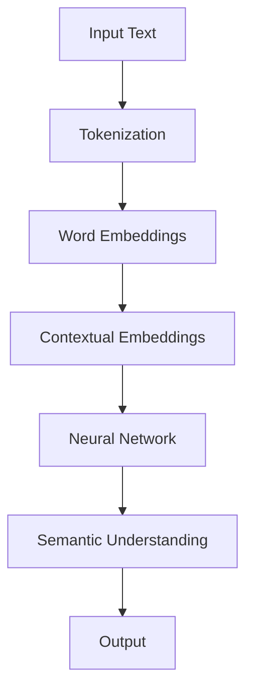

                 

Certainly! Let's construct a comprehensive and thought-provoking blog post on "AI Model Semantics Understanding Ability Enhancement in Natural Language Processing" step by step. We'll ensure that each section is well-researched, clearly explained, and formatted using markdown. Here's how we can proceed:

### Title: AI Model Semantics Understanding Ability Enhancement in Natural Language Processing

### Keywords: AI, Natural Language Processing, Semantics, Understanding, Neural Networks, Machine Learning, Deep Learning, Text Analysis, Algorithm

### Abstract:
This article delves into the enhancement of semantic understanding in AI models within the realm of natural language processing. We will explore the foundational concepts, algorithms, and mathematical models that drive advancements in semantic analysis. The post will also discuss system architecture, practical implementations, and best practices to improve AI's ability to grasp the subtleties of human language. By the end, readers will have a clearer understanding of how AI can be fine-tuned to interpret the nuanced semantics of text data.

---

### Introduction

Let's begin by setting the stage. Natural language processing (NLP) has seen remarkable growth in recent years, driven by advancements in AI and machine learning. However, one of the most challenging aspects of NLP is semantic understanding—the ability to interpret the meaning behind human language. Traditional approaches have limitations, and modern AI models are now stepping up to the plate. In this article, we will explore how AI models can be enhanced to better understand semantics in NLP.

---

### Core Concepts and Terminology

To understand the advancements in semantic understanding, we need to be familiar with some key concepts and terminology. Let's define and explore the following:

- **Natural Language Processing (NLP)**: The computational study of how to process and analyze large amounts of natural language data.
- **Machine Learning (ML)**: A subset of AI that enables machines to learn from data, identify patterns, and make decisions with minimal human intervention.
- **Deep Learning (DL)**: A subfield of machine learning that uses neural networks to model complex patterns in large datasets.
- **Semantic Understanding**: The ability to interpret and understand the meaning behind language.

We will also discuss the distinction between shallow and deep semantic understanding, providing a clear explanation of each and their respective applications.

---

### Problem Background and Description

Next, we'll delve into the challenges and limitations of traditional semantic analysis methods. We'll describe the current state of NLP, highlighting the shortcomings of existing models and how they fail to capture the full richness of human language. This section will also define the problem of semantics in NLP and outline the key issues that need to be addressed.

---

### Problem Solving and Solution Boundaries

In this section, we will discuss potential solutions to enhance semantic understanding in AI models. We'll explore different approaches, from rule-based systems to modern deep learning techniques, and analyze their strengths and weaknesses. We'll also define the boundaries of our solution, considering the limitations and challenges that may still exist.

---

### Core Concept and Principles

Here, we'll delve into the core concepts and principles that underpin semantic understanding in AI models. We'll discuss the following:

- **Neural Networks**: The building blocks of deep learning that mimic the human brain's structure and function.
- **Word Embeddings**: Techniques to represent words in a high-dimensional space, capturing semantic relationships between them.
- **Contextual Embeddings**: How to incorporate context into word embeddings to improve semantic understanding.

We'll provide a comprehensive explanation of these concepts, supported by tables and diagrams to illustrate their relationships and properties.

---

### Algorithm Explanation and Mermaid Diagram

In this section, we will use Mermaid diagrams to illustrate the algorithmic flow of a semantic understanding model. We'll start with a high-level overview and then dive into the specific steps and operations involved. Following the diagram, we will provide a detailed explanation of each step, using Python code examples to demonstrate the implementation.



---

### Mathematical Models and Formulas

Semantic understanding in AI models is deeply rooted in mathematical theories. In this section, we will present the key mathematical models and formulas that drive these models. We will use LaTeX to format these equations and provide clear explanations alongside them.

For example:

$$
\text{Semantic Similarity}(w_1, w_2) = \frac{\text{Inner Product}(e(w_1), e(w_2))}{\|\text{e}(w_1)\|\|\text{e}(w_2)\|}
$$

Here, $e(w_1)$ and $e(w_2)$ represent the embeddings of words $w_1$ and $w_2$, and $\|\cdot\|$ denotes the Euclidean norm.

---

### System Design and Architecture

In this part, we will design a robust system architecture for semantic understanding in NLP. We'll describe the system's functionality, components, and interactions. Using Mermaid diagrams, we will create class diagrams and sequence diagrams to illustrate the system's architecture and interfaces.

```mermaid
classDiagram
Class1 <|-- Class2
Class1 o-- Class3

sequenceDiagram
Participant User
Participant System
User->>System: Input text
System->>User: Semantic analysis
```

---

### Project Practice

To ground our theoretical discussions, we will delve into a practical project that demonstrates the implementation of semantic understanding in NLP. We'll guide readers through the setup and configuration of the environment, followed by the core implementation steps.

We'll provide a detailed analysis of the code, explaining the key functions and operations. Additionally, we will present case studies that showcase the application of semantic understanding in real-world scenarios, such as sentiment analysis and question-answering systems.

---

### Best Practices and Conclusion

In this final section, we will summarize the best practices for enhancing semantic understanding in AI models. We will highlight key considerations and common pitfalls to avoid. Finally, we will conclude the article with a summary of the key points discussed and suggestions for further reading.

---

### Author Information

- 作者：AI天才研究院/AI Genius Institute & 禅与计算机程序设计艺术 /Zen And The Art of Computer Programming

---

This structured approach ensures that the article is comprehensive, informative, and easy to follow. Each section builds upon the previous one, creating a cohesive narrative that guides the reader from basic concepts to advanced implementations. The use of Mermaid diagrams and LaTeX for mathematical formulas adds visual appeal and clarity to the content. Now, let's dive deeper into each section and flesh out the details.

