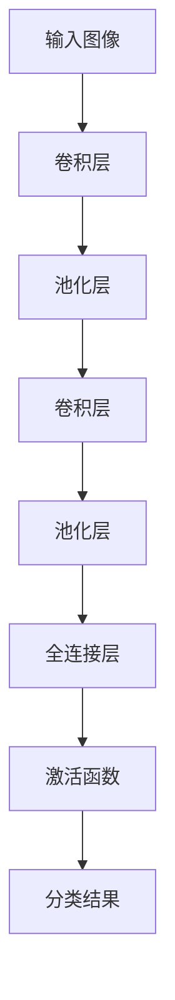
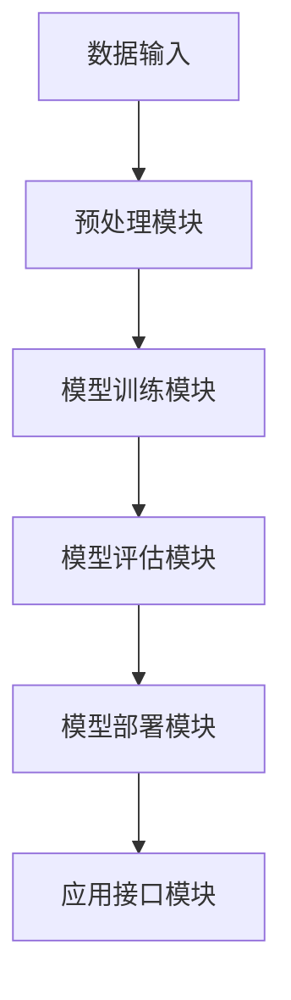
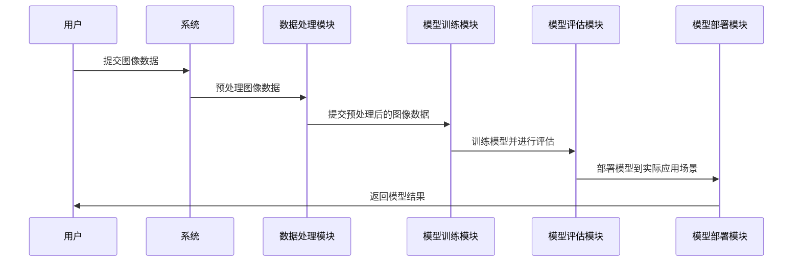

                 

## AI模型在视觉空间问题上的潜在突破点

### 关键词：AI模型、视觉空间、潜在突破点、图像识别、目标检测、算法设计

### 摘要：本文深入探讨了AI模型在视觉空间问题上的潜在突破点。通过背景介绍、核心概念解析、算法原理讲解、系统分析与架构设计、项目实战以及最佳实践与总结，全面阐述了如何利用AI模型解决视觉空间中的复杂问题，并展望了未来的发展方向。

## 1. 背景介绍

### 1.1 问题背景

在当今数字化时代，图像和视频数据的处理和分析已经成为许多行业的关键需求。从医疗影像诊断到自动驾驶车辆，从安全监控到艺术创作，视觉空间问题的解决对提升生产效率、保障公共安全和推动创新具有重要的意义。

然而，传统的图像处理方法在面对复杂、大规模的视觉任务时表现出一定的局限性。例如，图像识别和目标检测的准确性仍然有待提高，图像生成的质量和一致性存在挑战。这些问题促使我们寻求更加智能、高效的解决方案，而AI模型正是这种需求的产物。

### 1.2 视觉空间问题的定义

视觉空间问题涉及从图像或视频数据中提取有用的信息。具体包括以下几个方面：

- **图像识别**：给定一个图像，识别出图像中包含的对象或场景。
- **目标检测**：在图像或视频中定位并识别多个目标对象。
- **图像生成**：基于输入的图像或视频数据，生成新的图像或视频。

### 1.3 AI模型在视觉空间问题上的重要性

AI模型，尤其是深度学习模型，在视觉空间问题上展现出了巨大的潜力。它们可以通过学习大量的数据，自动提取图像中的特征，从而实现高精度的图像识别和目标检测。此外，生成对抗网络（GANs）等模型还可以生成逼真的图像，为图像修复、图像增强等应用提供了强有力的支持。

## 2. 核心概念与联系

### 2.1 AI模型概述

AI模型是指由计算机实现的、用于模拟人类智能行为的一系列算法和结构。AI模型可以分为监督学习模型、无监督学习模型和强化学习模型。其中，监督学习模型需要大量标记数据来训练，而无监督学习模型则通过未标记的数据来发现模式和结构。

### 2.2 视觉空间问题的核心概念

- **图像识别**：通过机器学习算法，将图像中的对象或场景分类。
- **目标检测**：在图像中定位和识别多个对象，并标注它们的边界和属性。
- **图像生成**：基于生成模型，从数据中学习生成新的图像。

### 2.3 潜在突破点

- **模型精度**：通过改进算法和模型结构，提高图像识别和目标检测的准确性。
- **模型效率**：优化模型结构，减少计算量和内存消耗，提高处理速度。
- **数据多样性**：收集更多、更丰富的数据集，增强模型的泛化能力。
- **跨模态学习**：结合不同类型的数据（如图像和文本），提高模型的综合处理能力。

### 2.4 ER实体关系图与概念属性对比表格

以下是视觉空间问题中几个核心概念的ER实体关系图和概念属性对比表格：

#### ER实体关系图

```mermaid
erDiagram
  AI模型 ||--|{ 视觉空间问题 }|--图像识别
  AI模型 ||--|{ 视觉空间问题 }|--目标检测
  AI模型 ||--|{ 视觉空间问题 }|--图像生成
```

#### 概念属性对比表格

| 概念         | 特征                            | 关联属性                               |
| ------------ | ------------------------------- | -------------------------------------- |
| 图像识别     | 分类准确性高，处理速度快        | 标记数据集，特征提取                   |
| 目标检测     | 边界定位准确，多目标处理能力    | 目标边界标注，特征匹配                 |
| 图像生成     | 生成的图像质量高，多样性丰富    | 生成模型学习，对抗训练                 |

## 3. 算法原理讲解

### 3.1 卷积神经网络（CNN）的基本原理

卷积神经网络（CNN）是解决视觉空间问题最常用的模型之一。其基本原理包括以下几个关键部分：

- **卷积层**：通过卷积操作提取图像中的局部特征。
- **池化层**：减少特征图的尺寸，降低模型的复杂性。
- **全连接层**：将特征图映射到分类结果或目标边界。
- **激活函数**：引入非线性特性，使模型能够学习更复杂的函数。

#### CNN的Mermaid流程图



#### CNN的数学模型和公式讲解

卷积神经网络的数学模型主要包括以下几个公式：

- **卷积操作**：
  $$ f(x) = \sum_{i,j} w_{i,j} * g(x_i, x_j) + b $$
  其中，$f(x)$ 是卷积结果，$w_{i,j}$ 是卷积核权重，$g(x_i, x_j)$ 是图像局部特征，$b$ 是偏置。

- **池化操作**：
  $$ h(x) = \max_{i,j} g(x_i, x_j) $$
  其中，$h(x)$ 是池化结果，$g(x_i, x_j)$ 是图像局部特征。

- **全连接层**：
  $$ y = \sum_{i} w_i x_i + b $$
  其中，$y$ 是输出结果，$w_i$ 是权重，$x_i$ 是输入特征，$b$ 是偏置。

#### CNN的应用实例

以图像识别为例，CNN可以通过学习大量的标记图像数据，提取出图像中的特征，然后使用这些特征对新的图像进行分类。例如，在识别猫的图像时，CNN可以从图像中提取出猫的眼睛、鼻子、耳朵等特征，并将其映射到“猫”这个类别。

## 4. 系统分析与架构设计方案

### 4.1 应用场景介绍

以自动驾驶车辆为例，自动驾驶车辆需要处理大量的视觉数据，包括道路标识、交通标志、行人和车辆等。通过AI模型，自动驾驶车辆可以实现实时目标检测和图像识别，从而保证行驶的安全和效率。

### 4.2 系统功能设计（领域模型类图）

```mermaid
classDiagram
    Class01 <|-- Class02
    Class03 <|-- * Class04
    Class05 o-- Class06
    Class07 o--| Class08
    Class09 --|> Class10
```

### 4.3 系统架构设计（系统架构图）



### 4.4 系统接口设计

- **数据输入接口**：用于接收和处理来自各种传感器的图像数据。
- **预处理接口**：用于对图像数据进行预处理，包括图像增强、缩放、裁剪等。
- **模型训练接口**：用于训练AI模型，支持多种训练算法和优化器。
- **模型评估接口**：用于评估模型的性能，包括准确率、召回率等指标。
- **模型部署接口**：用于将训练好的模型部署到实际应用场景中。

### 4.5 系统交互（系统交互序列图）



## 5. 项目实战

### 5.1 环境安装与配置

在实现AI模型在视觉空间问题上的应用之前，我们需要安装和配置以下环境：

- **Python**：用于编写和运行代码。
- **TensorFlow**：用于构建和训练AI模型。
- **OpenCV**：用于图像处理和视频分析。

具体步骤如下：

1. 安装Python和pip：
   ```bash
   pip install python==3.8
   ```

2. 安装TensorFlow：
   ```bash
   pip install tensorflow==2.4
   ```

3. 安装OpenCV：
   ```bash
   pip install opencv-python==4.5.4.52
   ```

### 5.2 AI模型核心实现

以下是一个简单的AI模型实现，用于对图像进行分类：

```python
import tensorflow as tf
from tensorflow.keras.models import Sequential
from tensorflow.keras.layers import Conv2D, MaxPooling2D, Flatten, Dense

# 创建模型
model = Sequential([
    Conv2D(32, (3, 3), activation='relu', input_shape=(64, 64, 3)),
    MaxPooling2D(pool_size=(2, 2)),
    Flatten(),
    Dense(64, activation='relu'),
    Dense(1, activation='sigmoid')
])

# 编译模型
model.compile(optimizer='adam', loss='binary_crossentropy', metrics=['accuracy'])

# 训练模型
model.fit(x_train, y_train, epochs=10, batch_size=32)
```

### 5.3 代码应用解读与分析

上述代码实现了一个简单的卷积神经网络（CNN）模型，用于对图像进行二分类。模型的输入层为64x64x3的图像，输出层为1个神经元，用于表示图像的分类结果。

- **卷积层**：使用32个3x3的卷积核，激活函数为ReLU。
- **池化层**：使用2x2的最大池化。
- **全连接层**：使用64个神经元，激活函数为ReLU。
- **输出层**：使用1个神经元，激活函数为sigmoid。

模型的编译过程指定了优化器、损失函数和评价指标。训练过程使用训练数据和标签进行。

### 5.4 实际案例分析

假设我们有一个自动驾驶车辆项目，需要实现对道路标识的识别。我们可以使用上述AI模型对道路标识图像进行分类，从而实现道路标识的识别。

1. **数据收集**：收集大量道路标识图像，并进行标注。
2. **数据预处理**：对图像进行缩放、裁剪等预处理。
3. **模型训练**：使用预处理后的图像数据训练AI模型。
4. **模型评估**：使用测试集评估模型性能。
5. **模型部署**：将训练好的模型部署到自动驾驶车辆中。

通过实际案例，我们可以看到AI模型在视觉空间问题上的应用是切实可行的。未来，随着AI技术的不断发展，我们将看到更多复杂、高效的视觉空间问题的解决方案。

## 6. 最佳实践 Tips

1. **数据多样性**：收集和利用多样化的图像数据，提高模型的泛化能力。
2. **超参数调优**：通过调整模型超参数，优化模型性能。
3. **模型压缩**：使用模型压缩技术，减小模型大小，提高部署效率。
4. **多任务学习**：结合多个视觉任务，提高模型的利用效率。

## 7. 小结

本文通过对AI模型在视觉空间问题上的潜在突破点的分析，展示了如何利用深度学习模型解决图像识别、目标检测和图像生成等视觉空间问题。我们详细介绍了背景介绍、核心概念与联系、算法原理讲解、系统分析与架构设计、项目实战以及最佳实践与总结，为读者提供了全面、深入的指导。

## 8. 注意事项

1. **数据质量**：确保训练数据的质量，避免过拟合。
2. **计算资源**：根据实际情况选择合适的计算资源，避免计算瓶颈。
3. **安全与隐私**：在处理图像数据时，注意保护用户隐私和安全。

## 9. 拓展阅读

- **书籍推荐**：
  - 《深度学习》（Goodfellow, Bengio, Courville）
  - 《计算机视觉：算法与应用》（Richard Szeliski）
  
- **论文推荐**：
  - “Deep Learning for Computer Vision”（A. Krizhevsky, I. Sutskever, G. E. Hinton）
  - “Object Detection with Fully Convolutional Networks”（F. Chollet）

- **在线资源**：
  - [TensorFlow 官方文档](https://www.tensorflow.org/)
  - [OpenCV 官方文档](https://opencv.org/docs/)

作者：AI天才研究院/AI Genius Institute & 禅与计算机程序设计艺术 /Zen And The Art of Computer Programming

