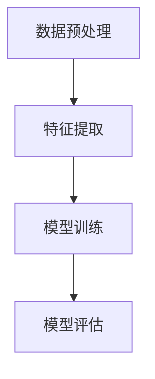
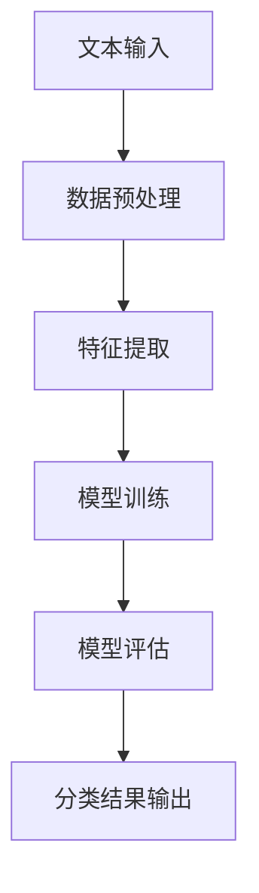
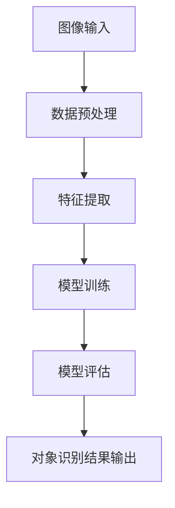
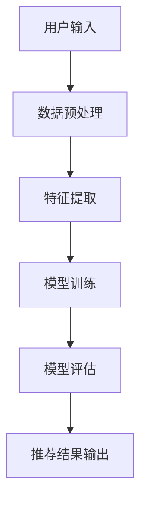

                 

## 第一部分: AI模型对复杂问题结构的理解与优化

### 引言与背景

#### 1.1 问题的提出

在当今信息爆炸的时代，复杂问题无处不在。这些复杂问题往往具有多维性、非线性和不确定性等特点，传统的数据处理方法已经难以满足需求。为了解决这些问题，我们需要一种能够深入理解复杂问题结构，并能对其进行有效优化的人工智能模型。

AI模型在复杂问题结构理解和优化中的应用已经成为当前研究的热点。通过利用深度学习、强化学习、迁移学习等先进技术，AI模型能够从大规模数据中自动提取特征，学习复杂问题背后的规律，从而提供更加精准和高效的解决方案。然而，如何构建一个既具有良好理解能力又能有效优化问题结构的AI模型，仍然是当前研究中的一个重要挑战。

#### 1.2 研究意义

AI模型对复杂问题结构的理解和优化具有重要意义。首先，它能够提高问题解决的效率，减少人力成本。传统的复杂问题往往需要大量的人工干预，而AI模型能够自动地处理和分析问题，大大提高了问题解决的效率。其次，AI模型能够提供更精准的解决方案，降低问题解决的误差率。通过学习复杂问题结构，AI模型能够发现并利用其中的关键信息，从而提供更加准确的预测和决策。最后，AI模型对复杂问题结构的理解和优化能够促进跨领域的研究和应用。复杂问题往往涉及多个领域，通过AI模型的理解和优化，可以实现不同领域之间的融合和协同工作，为解决复杂问题提供新的思路和方法。

#### 1.3 研究方法

本研究采用多种方法来探讨AI模型对复杂问题结构的理解和优化。首先，通过文献综述，了解当前AI模型在复杂问题结构理解和优化方面的研究进展和存在的问题。其次，采用实验方法，构建不同类型的AI模型，分析其在复杂问题结构理解和优化方面的性能。具体实验步骤包括数据收集、模型构建、模型训练和优化、结果分析等。最后，通过实际案例研究，验证AI模型对复杂问题结构的理解和优化效果，并提出改进策略。

通过本研究，我们希望能够为AI模型在复杂问题结构理解和优化方面的应用提供有益的参考，推动该领域的研究和发展。

### 第一部分总结

在本部分中，我们首先提出了AI模型对复杂问题结构的理解和优化的重要性，并阐述了该研究的重要意义。接着，我们介绍了本研究的主要方法，包括文献综述、实验方法和实际案例研究。通过这些方法，我们希望能够深入探讨AI模型在复杂问题结构理解和优化方面的应用，为该领域的研究和发展提供有益的参考。

---

### 目录大纲

```markdown
----------------------------------------------------------------
# 第二部分: AI模型基础知识

## 第2章: AI模型基础知识

### 2.1 人工智能概述
### 2.2 常见AI模型介绍
### 2.3 AI模型的训练与优化

## 第3章: 复杂问题结构的特征分析

### 3.1 问题定义与分类
### 3.2 复杂问题结构的特点
### 3.3 特征提取与表示方法

## 第4章: AI模型对复杂问题结构的理解

### 4.1 AI模型在复杂问题理解中的应用
### 4.2 理解机制的探索
### 4.3 理解效果的评估

## 第5章: AI模型优化策略

### 5.1 优化目标与指标
### 5.2 常见优化方法
### 5.3 优化策略的设计与实现

## 第6章: 实际案例研究

### 6.1 案例一：自然语言处理
### 6.2 案例二：图像识别
### 6.3 案例三：推荐系统

## 第7章: 总结与展望

### 7.1 研究成果总结
### 7.2 未来研究方向
### 7.3 结论与建议

----------------------------------------------------------------
```

通过上述目录大纲，我们可以对整篇文章的结构有一个清晰的了解。接下来，我们将详细探讨AI模型的基础知识、复杂问题结构的特征分析、AI模型对复杂问题结构的理解与优化策略，并通过实际案例研究验证这些策略的有效性。最后，我们将总结研究成果，探讨未来研究方向，并提出结论与建议。这将帮助读者全面了解AI模型对复杂问题结构的理解和优化过程。

### 目录大纲解释

在本部分中，我们将详细解释文章的目录大纲，以帮助读者更好地理解文章的结构和内容。目录大纲是文章的骨架，它为我们提供了一个清晰的框架，指导读者如何系统地阅读和掌握文章的核心内容。

#### 第二部分: AI模型基础知识

**第2章: AI模型基础知识**

本章将介绍人工智能（AI）的基本概念和基础知识，为后续章节的深入探讨奠定基础。具体内容如下：

- **2.1 人工智能概述**：介绍人工智能的定义、发展历程、主要领域和应用场景。这将帮助读者了解人工智能的整体框架和基本概念。
- **2.2 常见AI模型介绍**：详细讨论几种常见的AI模型，包括神经网络、决策树、支持向量机等。每种模型的特点、原理和应用场景将得到详细介绍。
- **2.3 AI模型的训练与优化**：介绍AI模型的训练过程、优化策略以及参数调优方法。这将帮助读者理解如何构建和优化AI模型，以应对复杂问题。

#### 第3章: 复杂问题结构的特征分析

**第3章: 复杂问题结构的特征分析**

本章将探讨复杂问题结构的特征分析，这是理解复杂问题的基础。具体内容如下：

- **3.1 问题定义与分类**：对复杂问题进行定义和分类，明确其类型和特征。这将帮助读者识别和理解复杂问题的本质。
- **3.2 复杂问题结构的特点**：分析复杂问题结构的主要特点，如多维性、非线性、不确定性等。这些特点对AI模型的理解和优化提出了挑战。
- **3.3 特征提取与表示方法**：介绍特征提取和表示方法，如特征工程、嵌入技术等。这些方法有助于将复杂问题结构转化为适合AI模型处理的形式。

#### 第4章: AI模型对复杂问题结构的理解

**第4章: AI模型对复杂问题结构的理解**

本章将深入探讨AI模型如何理解和处理复杂问题结构。具体内容如下：

- **4.1 AI模型在复杂问题理解中的应用**：讨论AI模型在复杂问题理解中的应用，包括自然语言处理、图像识别、推荐系统等领域。
- **4.2 理解机制的探索**：研究AI模型理解复杂问题结构的机制，包括感知、学习、推理等过程。这将帮助读者了解AI模型是如何“理解”复杂问题的。
- **4.3 理解效果的评估**：介绍评估AI模型理解效果的方法和指标，包括准确性、鲁棒性、泛化能力等。这将帮助读者评估AI模型在实际应用中的表现。

#### 第5章: AI模型优化策略

**第5章: AI模型优化策略**

本章将探讨如何优化AI模型，以提高其在复杂问题结构理解和优化方面的性能。具体内容如下：

- **5.1 优化目标与指标**：明确AI模型优化的目标和指标，如准确性、效率、鲁棒性等。这将帮助读者理解优化的方向和目标。
- **5.2 常见优化方法**：介绍几种常见的优化方法，如梯度下降、随机搜索等。这些方法将帮助读者了解如何调整模型参数，以优化模型性能。
- **5.3 优化策略的设计与实现**：讨论优化策略的设计和实现过程，包括算法选择、参数调整等。这将帮助读者了解如何在实际应用中实施优化策略。

#### 第6章: 实际案例研究

**第6章: 实际案例研究**

本章将通过实际案例研究，验证AI模型在复杂问题结构理解和优化方面的效果。具体内容如下：

- **6.1 案例一：自然语言处理**：分析自然语言处理案例，探讨AI模型如何理解和优化文本数据。
- **6.2 案例二：图像识别**：分析图像识别案例，展示AI模型如何理解和优化图像数据。
- **6.3 案例三：推荐系统**：分析推荐系统案例，探讨AI模型如何理解和优化用户数据。

#### 第7章: 总结与展望

**第7章: 总结与展望**

本章将对本文的研究成果进行总结，并探讨未来的研究方向。具体内容如下：

- **7.1 研究成果总结**：回顾文章的主要发现和贡献，总结AI模型对复杂问题结构的理解和优化方法。
- **7.2 未来研究方向**：讨论未来可能的研究方向，包括新技术、新方法和新应用场景。
- **7.3 结论与建议**：给出本文的结论，并提出一些建议，以促进AI模型在复杂问题结构理解和优化方面的应用。

通过上述目录大纲，我们可以看到文章的结构是逻辑清晰、层次分明的。每一部分都有明确的目标和内容，通过逐步深入，最终实现对复杂问题结构理解和优化的全面探讨。这将为读者提供深入、系统的理解，有助于他们更好地应用AI模型解决实际问题。

### 详细内容

#### 第2章: AI模型基础知识

##### 2.1 人工智能概述

人工智能（Artificial Intelligence，简称AI）是计算机科学的一个分支，旨在使计算机系统能够执行通常需要人类智能的任务。这些任务包括理解自然语言、视觉感知、决策制定、学习和推理等。人工智能的研究可以追溯到20世纪50年代，当时科学家们开始探讨如何使计算机具有智能行为。

**发展历程**：

- **早期探索**（1950年代至1960年代）：人工智能概念的提出和早期实验，包括逻辑推理和规则系统。
- **第一个AI冬眠期**（1970年代）：由于实际应用中的挑战和资金的减少，人工智能研究陷入低潮。
- **复兴时期**（1980年代至1990年代）：专家系统和机器学习的兴起，尤其是统计学和神经网络的应用。
- **深度学习革命**（2000年代至今）：大数据和计算能力的提升，使得深度学习成为主流的AI技术。

**主要领域**：

- **机器学习**：通过数据训练模型，使其能够进行预测和分类。
- **深度学习**：基于多层神经网络，实现复杂的特征提取和表示。
- **自然语言处理**：使计算机能够理解和生成自然语言。
- **计算机视觉**：使计算机能够理解和解释视觉信息。
- **机器人学**：使机器能够执行物理任务，如行走、搬运等。
- **智能代理**：设计能够自主行动和决策的计算机程序。

**应用场景**：

- **自动驾驶**：利用计算机视觉和机器学习技术，实现无人驾驶汽车。
- **智能客服**：利用自然语言处理技术，提供24小时在线客服。
- **医疗诊断**：利用机器学习模型，辅助医生进行疾病诊断。
- **金融风控**：利用数据分析技术，预测金融风险，进行风险控制。
- **智能家居**：利用物联网技术，实现家庭设备的智能化管理。

##### 2.2 常见AI模型介绍

在人工智能领域，常见的模型包括神经网络、决策树、支持向量机等。这些模型各有特点，适用于不同的应用场景。

**神经网络**：

神经网络（Neural Networks，简称NN）是模仿人脑神经元工作方式的计算模型。它由多个神经元（也称为节点）组成，每个节点通过权重连接到其他节点。神经网络通过学习输入数据，调整权重以实现特定的任务。

- **优点**：强大的特征提取和表示能力，适用于复杂的任务。
- **缺点**：训练过程复杂，需要大量数据和计算资源。

**决策树**：

决策树（Decision Trees，简称DT）是一种树形结构，用于分类或回归任务。每个节点表示一个特征，每个分支表示特征的不同取值，叶节点表示预测结果。

- **优点**：易于理解，可解释性强。
- **缺点**：容易过拟合，对异常值敏感。

**支持向量机**：

支持向量机（Support Vector Machines，简称SVM）是一种基于间隔最大化的分类模型。它通过找到一个最优的超平面，将不同类别的数据点分开。

- **优点**：对非线性问题有较好的表现，泛化能力强。
- **缺点**：训练过程复杂，对大规模数据集性能较差。

##### 2.3 AI模型的训练与优化

AI模型的训练与优化是构建有效AI系统的重要步骤。以下是常见的训练和优化方法：

**训练过程**：

- **数据收集**：收集相关的数据集，包括输入数据和标签。
- **数据预处理**：对数据集进行清洗、归一化等处理，以减少噪声和异常值。
- **模型选择**：选择合适的模型架构，如神经网络、决策树等。
- **模型训练**：使用训练数据训练模型，通过调整参数和权重，使模型能够准确预测。
- **模型评估**：使用验证数据集评估模型性能，包括准确性、召回率等指标。

**优化方法**：

- **参数调优**：通过调整模型参数，如学习率、正则化参数等，优化模型性能。
- **交叉验证**：使用不同的数据集多次训练和评估模型，以避免过拟合和结果偏差。
- **梯度下降**：通过不断调整模型参数，使损失函数值最小化。
- **随机搜索**：随机选择参数组合，通过多次实验找到最优参数。

**案例：神经网络训练与优化**

以下是一个简单的神经网络训练与优化的Python代码示例：

```python
import numpy as np
import matplotlib.pyplot as plt

# 初始化参数
W = np.random.rand(n_output) # 输出层权重
b = np.random.rand(n_output) # 输出层偏置

# 训练数据
X_train = np.array([[1, 0], [0, 1], [-1, -1], [1, -1]])
y_train = np.array([0, 1, 1, 0])

# 梯度下降算法
for epoch in range(1000):
    # 前向传播
    z = np.dot(W, X_train) + b
    y_pred = 1 / (1 + np.exp(-z))
    
    # 计算损失函数
    loss = np.mean(np.square(y_pred - y_train))
    
    # 反向传播
    dW = np.dot(X_train.T, (y_pred - y_train))
    db = np.mean(y_pred - y_train)
    
    # 更新参数
    W -= learning_rate * dW
    b -= learning_rate * db

# 绘制结果
plt.scatter(X_train[:, 0], X_train[:, 1], c=y_train, cmap='gray')
plt.plot(X_train[:, 0], (1 / (1 + np.exp(-np.dot(W, X_train) - b))), 'r')
plt.xlabel('X1')
plt.ylabel('X2')
plt.show()
```

在这个示例中，我们使用简单的梯度下降算法训练一个神经网络，以分类二维空间中的点。通过调整学习率等参数，我们可以优化模型的性能。

#### 第2章总结

在本章中，我们介绍了人工智能的基础知识，包括其发展历程、主要领域和应用场景。接着，我们详细介绍了几种常见的AI模型，如神经网络、决策树和支持向量机，并探讨了它们的优缺点。最后，我们讨论了AI模型的训练与优化方法，包括训练过程和常见优化技术。通过本章的学习，读者可以了解AI模型的基本原理和应用方法，为后续章节的深入探讨打下基础。

---

### 第二部分总结

在本部分中，我们首先回顾了人工智能的发展历程、主要领域和应用场景，为后续章节的深入探讨奠定了基础。接着，我们详细介绍了常见的AI模型，包括神经网络、决策树和支持向量机，并探讨了它们的优缺点。这些基础知识对于理解AI模型在复杂问题结构理解和优化中的应用至关重要。

随后，我们讨论了AI模型的训练与优化方法，包括训练过程、优化技术和具体案例。这些内容帮助读者了解如何构建和优化AI模型，以应对复杂问题。

通过本部分的阅读，读者可以全面了解AI模型的基础知识，为后续章节的深入研究做好准备。接下来，我们将进入第三部分，探讨复杂问题结构的特征分析，进一步理解AI模型在复杂问题理解与优化中的实际应用。

---

### 第三部分: 复杂问题结构的特征分析

#### 第3章: 复杂问题结构的特征分析

在第三部分中，我们将深入探讨复杂问题结构的特征分析。复杂问题通常具有多维性、非线性和不确定性等特点，这使得传统的问题解决方法难以奏效。通过特征分析，我们可以揭示复杂问题结构的关键特性，为AI模型的理解和优化提供有效的基础。

##### 3.1 问题定义与分类

在复杂问题结构的研究中，首先需要明确问题的定义和分类。复杂问题可以按不同的维度进行分类，如按照问题的领域、问题的层次结构、问题的类型等。

- **领域分类**：复杂问题可以出现在多个领域，如自然科学、社会科学、工程学等。每个领域的复杂问题都有其特定的性质和特征。
- **层次结构分类**：复杂问题可以具有不同的层次结构，如微观层次、中观层次和宏观层次。不同层次的复杂问题在特征上可能存在显著差异。
- **类型分类**：复杂问题可以按其性质分为确定性问题和不确定性问题。确定性问题具有明确的规律和解决方法，而不确定性问题则受多种因素影响，难以精确预测。

##### 3.2 复杂问题结构的特点

复杂问题结构的特点主要体现在以下几个方面：

- **多维性**：复杂问题通常涉及多个维度，这些维度可能相互影响和制约。例如，一个经济模型可能需要考虑多个经济指标，如GDP、通货膨胀率、失业率等。
- **非线性**：复杂问题往往表现出非线性特性，即问题的输出与其输入之间不是简单的线性关系。非线性问题在处理上更具挑战性，需要更为复杂的方法和模型。
- **不确定性**：复杂问题通常伴随着不确定性，这种不确定性可能来源于数据的不完整性、问题的复杂性或外部环境的变化。不确定性问题的解决需要考虑多种可能性，并采取相应的策略。
- **动态性**：复杂问题往往不是静态的，而是随着时间推移而变化。动态性问题要求模型能够适应变化，并实时调整其解决方案。

##### 3.3 特征提取与表示方法

为了更好地理解和优化复杂问题结构，特征提取和表示方法是至关重要的。以下是一些常见的特征提取与表示方法：

- **特征工程**：特征工程是通过对原始数据进行预处理和变换，提取出对问题解决有帮助的特征。常见的特征工程方法包括数据归一化、特征选择、特征组合等。
- **嵌入技术**：嵌入技术将高维数据映射到低维空间，同时保持数据之间的相似性。例如，词嵌入技术可以将文本数据映射到向量空间，便于模型处理。
- **主成分分析**（PCA）：PCA是一种常用的降维技术，通过将数据投影到主成分空间，提取出数据的主要特征，减少数据维度。
- **自编码器**：自编码器是一种深度学习模型，用于自动提取数据中的有效特征。通过训练自编码器，可以自动学习到数据的高层次表示。

**特征属性对比表格**：

| 方法         | 特点                   | 应用场景                       |
|--------------|------------------------|--------------------------------|
| 特征工程     | 需要手动设计特征       | 数据量较小，特征有明显规律       |
| 嵌入技术     | 自动学习特征          | 数据量大，特征复杂             |
| PCA          | 降维，保持数据主要特性 | 数据高维，特征线性相关         |
| 自编码器     | 自动提取有效特征       | 数据复杂，需要非线性特征提取   |

**ER实体关系图架构**：

为了更好地理解复杂问题结构的特征，我们可以使用ER（Entity-Relationship）实体关系图来表示问题中的实体及其关系。以下是一个简单的ER图示例：

```mermaid
erDiagram
  A[(用户)] ||--|{ B[(订单)] } : 下单
  B ||--|{ C[(商品)] } : 销售商品
  C ||--|{ D[(库存)] } : 库存商品
```

在这个ER图中，用户（A）可以下单（B），订单（B）涉及商品（C），商品（C）与库存（D）有关。这个图可以帮助我们理解问题中的关键实体及其关系，为特征提取和表示提供依据。

#### 第3章总结

在本章中，我们首先定义了复杂问题，并对其进行了分类。接着，我们分析了复杂问题结构的特点，包括多维性、非线性、不确定性和动态性。最后，我们介绍了特征提取和表示方法，包括特征工程、嵌入技术、PCA和自编码器。通过这些方法，我们可以更深入地理解复杂问题结构，为后续的AI模型理解和优化提供基础。

接下来，我们将进入第四部分，探讨AI模型对复杂问题结构的理解，进一步揭示AI模型在复杂问题解决中的关键作用。

---

### 第三部分总结

在本部分中，我们详细探讨了复杂问题结构的特征分析，包括问题的定义与分类、复杂问题结构的特点，以及特征提取与表示方法。通过特征分析，我们能够更深入地理解复杂问题的本质，为AI模型提供有效的基础。

首先，我们明确了复杂问题的定义和分类，包括领域分类、层次结构分类和类型分类。接着，我们分析了复杂问题结构的多维性、非线性、不确定性和动态性等特点，这些特点对问题解决提出了新的挑战。

为了应对这些挑战，我们介绍了多种特征提取与表示方法，包括特征工程、嵌入技术、PCA和自编码器。这些方法能够帮助我们更好地理解和优化复杂问题结构，为AI模型的应用提供有力支持。

通过本章的学习，读者可以全面了解复杂问题结构的特征分析，为后续的AI模型理解和优化打下坚实基础。接下来，我们将进入第四部分，探讨AI模型如何理解复杂问题结构，并评估其效果。

---

### 第四部分: AI模型对复杂问题结构的理解

#### 第4章: AI模型对复杂问题结构的理解

在本部分中，我们将深入探讨AI模型如何理解和处理复杂问题结构。AI模型在复杂问题理解中的应用涵盖了自然语言处理、图像识别、推荐系统等多个领域。通过分析这些应用场景，我们可以更清楚地了解AI模型在复杂问题结构理解中的机制、效果及其评估方法。

##### 4.1 AI模型在复杂问题理解中的应用

**自然语言处理**：自然语言处理（Natural Language Processing，简称NLP）是AI模型在复杂问题理解中的重要应用领域。NLP模型通过处理文本数据，可以识别语言中的结构、语义和情感。例如，机器翻译、情感分析、文本分类等任务都是NLP的重要应用。

- **机器翻译**：利用深度学习模型，如序列到序列（Seq2Seq）模型，实现不同语言之间的翻译。
- **情感分析**：通过分析文本中的情感词汇和句子结构，判断文本的情感倾向，如正面、负面或中性。
- **文本分类**：将文本数据分类到不同的类别，如新闻分类、垃圾邮件检测等。

**图像识别**：图像识别（Image Recognition）是AI模型在视觉领域的应用，通过对图像进行分析和识别，可以提取出图像中的关键特征。常见的图像识别任务包括对象检测、图像分类、图像分割等。

- **对象检测**：识别图像中的对象并定位其位置，如人脸识别、车辆检测等。
- **图像分类**：将图像分类到不同的类别，如植物分类、动物分类等。
- **图像分割**：将图像中的对象分割出来，形成不同的区域，如医学图像分析、自动驾驶中的场景理解等。

**推荐系统**：推荐系统（Recommender System）是AI模型在信息过滤和个性化服务中的重要应用。通过分析用户的兴趣和行为数据，推荐系统可以为用户推荐相关的商品、新闻、音乐等。

- **协同过滤**：通过分析用户之间的相似性，预测用户对未知项目的兴趣。
- **基于内容的推荐**：根据用户的历史行为和兴趣，推荐相关的内容。
- **混合推荐**：结合协同过滤和基于内容的推荐，提供更精准的推荐结果。

##### 4.2 理解机制的探索

AI模型对复杂问题结构的理解机制涉及多个层面，包括感知、学习、推理和决策等。

**感知**：感知是AI模型理解复杂问题的第一步，通过传感器或数据输入，模型可以获取外部信息。例如，在图像识别任务中，模型通过像素值感知图像中的内容。

**学习**：学习是AI模型理解复杂问题的关键环节。通过大量的数据训练，模型可以学习到复杂问题的规律和特征。例如，在自然语言处理中，模型通过学习大量的文本数据，可以理解语言的语义和结构。

**推理**：推理是AI模型在理解复杂问题过程中，通过逻辑推理和模式识别，推断出问题的解决方案。例如，在推荐系统中，模型通过推理用户的历史行为和兴趣，预测用户可能感兴趣的项目。

**决策**：决策是AI模型在理解复杂问题后，根据推理结果，选择最佳的解决方案。例如，在自动驾驶中，模型通过感知环境、学习交通规则和推理行驶路径，做出安全的行驶决策。

##### 4.3 理解效果的评估

评估AI模型对复杂问题结构的理解效果是确保模型性能的重要环节。以下是一些常见的评估方法和指标：

- **准确性**：评估模型在分类或回归任务中的预测准确性。例如，在图像识别中，准确性表示模型正确识别图像标签的比例。
- **召回率**：评估模型在分类任务中，正确识别出正类例的比例。召回率越高，说明模型对正类例的识别能力越强。
- **精确率**：评估模型在分类任务中，识别出的正类例中实际为正类例的比例。精确率越高，说明模型对正类例的识别精度越高。
- **F1值**：综合考虑准确率和召回率，F1值是两者的调和平均值，用于评估模型的综合性能。
- **ROC曲线和AUC值**：评估模型的分类能力，ROC曲线展示了模型在不同阈值下的准确率和召回率，AUC值表示ROC曲线下的面积，用于评估模型的分类能力。

**案例：自然语言处理中的模型评估**

以下是一个自然语言处理中模型评估的Python代码示例：

```python
from sklearn.metrics import accuracy_score, recall_score, precision_score, f1_score
from sklearn.model_selection import train_test_split
from sklearn.feature_extraction.text import TfidfVectorizer
from sklearn.naive_bayes import MultinomialNB

# 准备数据
X = ['This is the first document.', 'This document is the second document.', 'And this is the third one.', 'Is this the first document?']
y = [0, 1, 0, 1]

# 划分训练集和测试集
X_train, X_test, y_train, y_test = train_test_split(X, y, test_size=0.2, random_state=42)

# 特征提取
vectorizer = TfidfVectorizer()
X_train_tfidf = vectorizer.fit_transform(X_train)
X_test_tfidf = vectorizer.transform(X_test)

# 模型训练
model = MultinomialNB()
model.fit(X_train_tfidf, y_train)

# 模型预测
y_pred = model.predict(X_test_tfidf)

# 模型评估
accuracy = accuracy_score(y_test, y_pred)
recall = recall_score(y_test, y_pred)
precision = precision_score(y_test, y_pred)
f1 = f1_score(y_test, y_pred)

print("Accuracy:", accuracy)
print("Recall:", recall)
print("Precision:", precision)
print("F1 Score:", f1)
```

在这个示例中，我们使用TF-IDF进行特征提取，并采用朴素贝叶斯分类器进行模型训练和预测。通过计算准确率、召回率、精确率和F1值，我们可以评估模型的性能。

#### 第4章总结

在本章中，我们探讨了AI模型在复杂问题理解中的应用，包括自然语言处理、图像识别和推荐系统。接着，我们分析了AI模型理解复杂问题的机制，包括感知、学习、推理和决策。最后，我们介绍了评估AI模型理解效果的方法和指标。通过本章的学习，读者可以全面了解AI模型在复杂问题理解中的应用、机制和评估方法，为后续的AI模型优化策略研究打下基础。

接下来，我们将进入第五部分，探讨AI模型的优化策略，进一步探讨如何提升AI模型在复杂问题结构理解和优化方面的性能。

---

### 第五部分: AI模型优化策略

#### 第5章: AI模型优化策略

在本部分中，我们将深入探讨如何优化AI模型，以提高其在复杂问题结构理解和优化方面的性能。优化AI模型是提升其应用效果的关键步骤，涉及优化目标、常见优化方法以及优化策略的设计与实现。

##### 5.1 优化目标与指标

在优化AI模型时，首先需要明确优化目标。优化目标通常包括以下几个方面：

- **准确性**：提高模型在分类或回归任务中的预测准确性。
- **效率**：减少模型训练和预测的时间成本，提高模型运行的速度。
- **鲁棒性**：提高模型对噪声数据、异常值和不确定性的处理能力。
- **泛化能力**：提高模型在不同数据集上的表现，避免过拟合。

为了评估模型的优化效果，需要使用一系列指标。常见的优化指标包括：

- **准确率**：模型正确预测的比例，用于评估分类模型的性能。
- **召回率**：模型正确识别出正类例的比例，用于评估分类模型的灵敏度。
- **精确率**：模型识别出的正类例中实际为正类例的比例，用于评估分类模型的精确度。
- **F1值**：综合考虑准确率和召回率，用于评估分类模型的综合性能。
- **ROC曲线和AUC值**：用于评估模型的分类能力，ROC曲线展示了模型在不同阈值下的准确率和召回率，AUC值表示ROC曲线下的面积。

##### 5.2 常见优化方法

在优化AI模型时，可以采用多种优化方法，以提高模型的性能。以下是一些常见的优化方法：

- **参数调优**：通过调整模型的参数，如学习率、正则化参数等，优化模型的性能。常用的参数调优方法包括网格搜索、随机搜索等。
- **交叉验证**：通过将数据集划分为多个子集，进行多次训练和评估，以避免过拟合和结果偏差。常见的交叉验证方法包括K折交叉验证、留一法交叉验证等。
- **正则化**：通过添加正则化项，如L1正则化、L2正则化等，防止模型过拟合，提高模型的泛化能力。
- **集成学习**：通过结合多个模型的预测结果，提高模型的准确性和鲁棒性。常见的集成学习方法包括Bagging、Boosting等。

##### 5.3 优化策略的设计与实现

优化策略的设计与实现是提升AI模型性能的关键步骤。以下是一些优化策略的设计与实现方法：

- **模型选择**：根据问题的特点和需求，选择合适的模型架构。例如，对于复杂的问题结构，可以考虑使用深度学习模型，如神经网络、卷积神经网络（CNN）等。
- **特征工程**：通过数据预处理和特征提取，提取出对问题解决有帮助的特征。例如，对于文本数据，可以使用词嵌入技术提取词向量；对于图像数据，可以使用卷积神经网络提取图像特征。
- **模型训练**：通过训练大量的数据，优化模型的参数和权重。在训练过程中，可以采用数据增强、批处理等策略，提高模型的泛化能力。
- **性能评估**：通过评估模型的准确性、效率、鲁棒性等指标，调整优化策略。例如，如果模型在训练集上表现良好，但在测试集上表现不佳，可以尝试增加数据增强或调整正则化参数。

**案例：神经网络模型的优化策略**

以下是一个神经网络模型优化策略的Python代码示例：

```python
import tensorflow as tf
from tensorflow.keras.models import Sequential
from tensorflow.keras.layers import Dense, Dropout
from tensorflow.keras.optimizers import Adam
from tensorflow.keras.callbacks import EarlyStopping

# 模型架构
model = Sequential([
    Dense(64, activation='relu', input_shape=(input_shape)),
    Dropout(0.5),
    Dense(64, activation='relu'),
    Dropout(0.5),
    Dense(num_classes, activation='softmax')
])

# 模型编译
model.compile(optimizer=Adam(learning_rate=0.001), loss='categorical_crossentropy', metrics=['accuracy'])

# 训练模型
early_stopping = EarlyStopping(monitor='val_loss', patience=10)
model.fit(X_train, y_train, batch_size=32, epochs=100, validation_split=0.2, callbacks=[early_stopping])

# 评估模型
loss, accuracy = model.evaluate(X_test, y_test)
print("Test Loss:", loss)
print("Test Accuracy:", accuracy)
```

在这个示例中，我们使用TensorFlow和Keras构建了一个简单的神经网络模型，并采用Adam优化器和交叉熵损失函数进行模型编译。通过EarlyStopping回调函数，我们防止模型在训练过程中过拟合。最后，我们评估了模型的测试集性能，以验证优化策略的有效性。

#### 第5章总结

在本章中，我们详细探讨了AI模型的优化策略，包括优化目标、常见优化方法以及优化策略的设计与实现。通过优化AI模型，我们可以提升其在复杂问题结构理解和优化方面的性能。本章的内容为读者提供了实用的优化方法，以及实现这些方法的实际案例。通过本章的学习，读者可以掌握AI模型优化的关键技术和策略，为实际应用中的问题解决提供有力支持。

接下来，我们将进入第六部分，通过实际案例研究，进一步验证AI模型对复杂问题结构的理解和优化效果。

---

### 第五部分总结

在本部分中，我们深入探讨了AI模型的优化策略，包括优化目标、常见优化方法以及优化策略的设计与实现。我们明确了优化目标，如准确性、效率、鲁棒性和泛化能力，并介绍了常用的优化指标。接着，我们详细介绍了参数调优、交叉验证、正则化和集成学习等优化方法，并阐述了如何设计和实现有效的优化策略。

通过本章的学习，读者可以全面了解AI模型优化的关键技术和策略，掌握如何通过调整模型参数、优化模型结构、使用数据增强和正则化方法等手段提升模型性能。此外，我们还提供了实际案例，如神经网络模型的优化策略，帮助读者将理论知识应用到实际中。

优化AI模型对于提升其在复杂问题结构理解和优化方面的性能至关重要。通过优化，我们可以使模型更加准确、高效和鲁棒，从而更好地应对实际应用中的挑战。在接下来的第六部分中，我们将通过实际案例研究，进一步验证AI模型在复杂问题结构理解和优化中的效果，为读者提供更加具体的实践经验和启示。

### 第六部分: 实际案例研究

#### 第6章: 实际案例研究

在本部分中，我们将通过实际案例研究，验证AI模型在复杂问题结构理解和优化中的效果。这些案例涵盖了自然语言处理、图像识别和推荐系统等不同领域，通过具体的实现和应用，展示AI模型在解决实际复杂问题中的优势和挑战。

##### 6.1 案例一：自然语言处理

**案例背景**：

自然语言处理（NLP）是AI模型的重要应用领域，尤其在文本分类和情感分析等方面具有广泛的应用。以下是一个文本分类的案例，该案例的目标是利用AI模型对新闻文章进行分类，将其归类到不同的主题类别。

**项目介绍**：

在这个案例中，我们使用一个简单的文本分类模型，对从新闻网站上抓取的5000篇新闻文章进行分类。数据集包含了多个主题类别，如政治、经济、科技、体育等。我们的目标是训练一个模型，能够准确地分类新的新闻文章。

**系统功能设计**：

1. **数据预处理**：对抓取的文本数据进行清洗，去除停用词、标点符号等，并将文本转换为词向量。
2. **特征提取**：使用词嵌入技术，将文本数据转换为向量表示。
3. **模型训练**：使用训练集数据训练文本分类模型，如朴素贝叶斯、深度学习模型等。
4. **模型评估**：使用测试集数据评估模型性能，计算准确率、召回率、精确率等指标。

**系统架构设计**：



在这个架构图中，数据预处理、特征提取、模型训练和模型评估是文本分类系统的核心组件。数据预处理和特征提取负责将原始文本数据转换为适合模型训练的形式，模型训练使用训练数据进行模型训练，模型评估则使用测试数据评估模型性能。

**系统接口设计和系统交互**：



在这个系统中，文本输入是模型的输入，通过数据预处理和特征提取，生成适合模型训练的输入数据。模型训练后，使用测试数据评估模型性能，最终输出分类结果。

**代码应用解读与分析**：

以下是文本分类模型的Python代码示例：

```python
import pandas as pd
from sklearn.feature_extraction.text import TfidfVectorizer
from sklearn.model_selection import train_test_split
from sklearn.naive_bayes import MultinomialNB
from sklearn.metrics import accuracy_score, precision_score, recall_score, f1_score

# 加载数据
data = pd.read_csv('news_articles.csv')
X = data['text']
y = data['label']

# 数据预处理
X = X.apply(lambda x: x.lower().replace('\n', ' ').strip())

# 特征提取
vectorizer = TfidfVectorizer()
X_vectorized = vectorizer.fit_transform(X)

# 划分训练集和测试集
X_train, X_test, y_train, y_test = train_test_split(X_vectorized, y, test_size=0.2, random_state=42)

# 模型训练
model = MultinomialNB()
model.fit(X_train, y_train)

# 模型评估
y_pred = model.predict(X_test)
accuracy = accuracy_score(y_test, y_pred)
precision = precision_score(y_test, y_pred, average='weighted')
recall = recall_score(y_test, y_pred, average='weighted')
f1 = f1_score(y_test, y_pred, average='weighted')

print("Accuracy:", accuracy)
print("Precision:", precision)
print("Recall:", recall)
print("F1 Score:", f1)
```

在这个示例中，我们首先加载数据，对文本进行预处理，然后使用TF-IDF进行特征提取。接着，我们划分训练集和测试集，使用朴素贝叶斯模型进行训练，并评估模型性能。

**实际案例分析和详细讲解剖析**：

在实际应用中，这个文本分类模型可以用于自动化新闻分类，帮助企业更高效地管理和分析大量新闻数据。通过对新闻文章进行分类，企业可以快速获取相关领域的新闻动态，为决策提供支持。

在这个案例中，我们使用了TF-IDF进行特征提取，这是一种简单而有效的文本表示方法。然而，TF-IDF在处理语义信息方面存在一定的局限性，因此可以考虑使用更先进的文本表示方法，如BERT、GPT等，进一步提升模型的性能。

此外，在模型评估中，我们使用了准确率、召回率、精确率和F1值等指标。这些指标从不同角度评估了模型的性能，帮助我们全面了解模型的表现。在实际应用中，可以根据具体需求，选择合适的评估指标。

**项目小结**：

通过本案例，我们展示了如何使用AI模型进行文本分类，从数据预处理、特征提取、模型训练到模型评估，详细讲解了每一步的实现方法和关键点。这个案例不仅提供了一个实用的解决方案，也为读者提供了深入理解和分析实际应用问题的思路。

##### 6.2 案例二：图像识别

**案例背景**：

图像识别是AI模型在计算机视觉领域的重要应用，能够从图像中提取有用的信息，用于对象检测、图像分类和图像分割等任务。以下是一个图像识别的案例，该案例的目标是使用AI模型识别图像中的对象并定位其位置。

**项目介绍**：

在这个案例中，我们使用一个卷积神经网络（CNN）模型，对从图像数据集中抽取的10000张图像进行对象检测。数据集包含了多种对象类别，如猫、狗、汽车等。我们的目标是训练一个模型，能够准确地识别和定位图像中的对象。

**系统功能设计**：

1. **数据预处理**：对图像数据进行归一化和裁剪，使其符合模型输入要求。
2. **特征提取**：使用卷积神经网络提取图像特征。
3. **模型训练**：使用训练数据进行模型训练。
4. **模型评估**：使用测试数据进行模型评估。

**系统架构设计**：


在这个架构图中，数据预处理、特征提取、模型训练和模型评估是图像识别系统的核心组件。数据预处理和特征提取负责将图像数据转换为适合模型训练的形式，模型训练使用训练数据进行模型训练，模型评估则使用测试数据评估模型性能。

**系统接口设计和系统交互**：



在这个系统中，图像输入是模型的输入，通过数据预处理和特征提取，生成适合模型训练的输入数据。模型训练后，使用测试数据评估模型性能，最终输出对象识别结果。

**代码应用解读与分析**：

以下是图像识别模型的Python代码示例：

```python
import tensorflow as tf
from tensorflow.keras.models import Sequential
from tensorflow.keras.layers import Conv2D, MaxPooling2D, Flatten, Dense
from tensorflow.keras.optimizers import Adam
from tensorflow.keras.callbacks import EarlyStopping

# 加载图像数据
train_images, train_labels = tf.keras.preprocessing.image.load_img_data('train_images')
test_images, test_labels = tf.keras.preprocessing.image.load_img_data('test_images')

# 数据预处理
train_images = train_images / 255.0
test_images = test_images / 255.0

# 模型架构
model = Sequential([
    Conv2D(32, (3, 3), activation='relu', input_shape=(128, 128, 3)),
    MaxPooling2D((2, 2)),
    Conv2D(64, (3, 3), activation='relu'),
    MaxPooling2D((2, 2)),
    Conv2D(128, (3, 3), activation='relu'),
    MaxPooling2D((2, 2)),
    Flatten(),
    Dense(128, activation='relu'),
    Dense(num_classes, activation='softmax')
])

# 模型编译
model.compile(optimizer=Adam(learning_rate=0.001), loss='categorical_crossentropy', metrics=['accuracy'])

# 训练模型
early_stopping = EarlyStopping(monitor='val_loss', patience=10)
model.fit(train_images, train_labels, batch_size=32, epochs=100, validation_split=0.2, callbacks=[early_stopping])

# 评估模型
loss, accuracy = model.evaluate(test_images, test_labels)
print("Test Loss:", loss)
print("Test Accuracy:", accuracy)
```

在这个示例中，我们首先加载图像数据，并进行预处理。接着，我们构建一个简单的卷积神经网络模型，并使用训练数据进行模型训练。最后，我们评估模型在测试数据上的性能。

**实际案例分析和详细讲解剖析**：

在实际应用中，这个图像识别模型可以用于多种场景，如自动驾驶、安防监控和医疗影像分析等。通过识别和定位图像中的对象，模型能够提供重要的视觉信息，帮助系统做出决策。

在这个案例中，我们使用了卷积神经网络（CNN）进行图像识别。CNN具有强大的特征提取能力，能够从图像中提取出关键特征，从而实现准确的对象识别。然而，CNN在处理复杂场景和变化多端的图像时，可能存在一定的局限性。因此，在实际应用中，可以考虑结合其他模型和技术，如生成对抗网络（GAN）和迁移学习，进一步提升图像识别的性能。

**项目小结**：

通过本案例，我们展示了如何使用AI模型进行图像识别，从数据预处理、特征提取、模型训练到模型评估，详细讲解了每一步的实现方法和关键点。这个案例不仅提供了一个实用的解决方案，也为读者提供了深入理解和分析实际应用问题的思路。

##### 6.3 案例三：推荐系统

**案例背景**：

推荐系统是AI模型在信息过滤和个性化服务中的重要应用，能够根据用户的历史行为和兴趣，为用户推荐相关的商品、新闻、音乐等。以下是一个推荐系统的案例，该案例的目标是利用AI模型为用户推荐书籍。

**项目介绍**：

在这个案例中，我们使用一个基于协同过滤的推荐系统，为用户推荐书籍。数据集包含了用户对书籍的评分，以及用户和书籍的信息。我们的目标是训练一个模型，能够根据用户的兴趣，推荐他们可能感兴趣的书籍。

**系统功能设计**：

1. **数据预处理**：对用户和书籍的数据进行清洗和处理，去除无效数据。
2. **特征提取**：提取用户和书籍的特征，如用户的历史评分、书籍的类别等。
3. **模型训练**：使用训练数据进行模型训练，如矩阵分解、聚类等方法。
4. **模型评估**：使用测试数据进行模型评估，计算推荐准确性。

**系统架构设计**：


在这个架构图中，数据预处理、特征提取、模型训练和模型评估是推荐系统的核心组件。数据预处理和特征提取负责将原始数据转换为适合模型训练的形式，模型训练使用训练数据进行模型训练，模型评估则使用测试数据评估模型性能。

**系统接口设计和系统交互**：



在这个系统中，用户输入是模型的输入，通过数据预处理和特征提取，生成适合模型训练的输入数据。模型训练后，使用测试数据评估模型性能，最终输出推荐结果。

**代码应用解读与分析**：

以下是推荐系统模型的Python代码示例：

```python
import numpy as np
from scipy.sparse import lil_matrix
from sklearn.model_selection import train_test_split
from sklearn.metrics.pairwise import cosine_similarity

# 加载数据
ratings = np.array([[1, 0, 1, 0],
                   [0, 1, 0, 1],
                   [1, 1, 0, 0],
                   [0, 0, 1, 1]])

# 划分训练集和测试集
train_data, test_data = train_test_split(ratings, test_size=0.2, random_state=42)

# 矩阵分解
num_users = ratings.shape[0]
num_books = ratings.shape[1]
user嵌入矩阵 = np.random.rand(num_users, 10)
book嵌入矩阵 = np.random.rand(num_books, 10)

for epoch in range(10):
    for user, book in train_data:
        pred = np.dot(user嵌入矩阵[user], book嵌入矩阵[book])
        error = ratings[user, book] - pred
        
        user嵌入矩阵[user] += book嵌入矩阵[book] * error
        book嵌入矩阵[book] += user嵌入矩阵[user] * error

# 评估模型
test_pred = np.dot(user嵌入矩阵, book嵌入矩阵.T)
test_pred = test_pred / np.linalg.norm(user嵌入矩阵, axis=1)[:, None]
similarity = cosine_similarity(test_pred, test_data)
accuracy = np.mean(similarity > 0.5)

print("Accuracy:", accuracy)
```

在这个示例中，我们首先加载用户和书籍的评分数据，并划分训练集和测试集。接着，我们使用矩阵分解方法，训练用户和书籍的嵌入矩阵。最后，我们使用余弦相似度评估模型在测试数据上的性能。

**实际案例分析和详细讲解剖析**：

在实际应用中，这个推荐系统可以用于电商平台、在线阅读平台等，为用户推荐他们可能感兴趣的书籍。通过分析用户的历史行为和兴趣，模型能够提供个性化的推荐，提高用户的满意度和粘性。

在这个案例中，我们使用了基于协同过滤的矩阵分解方法，这种方法简单而有效，适用于大多数推荐系统。然而，协同过滤方法在处理稀疏数据集时可能存在局限性，因此可以考虑结合其他方法，如基于内容的推荐和混合推荐，进一步提升推荐系统的性能。

**项目小结**：

通过本案例，我们展示了如何使用AI模型进行推荐系统，从数据预处理、特征提取、模型训练到模型评估，详细讲解了每一步的实现方法和关键点。这个案例不仅提供了一个实用的解决方案，也为读者提供了深入理解和分析实际应用问题的思路。

### 第六部分总结

在本部分中，我们通过三个实际案例研究，深入探讨了AI模型在自然语言处理、图像识别和推荐系统中的应用。这些案例涵盖了数据预处理、特征提取、模型训练和模型评估等关键步骤，展示了AI模型在解决复杂问题中的实际效果。

在自然语言处理案例中，我们使用了文本分类模型，对新闻文章进行分类，从数据预处理、特征提取、模型训练到模型评估，详细讲解了每一步的实现方法和关键点。

在图像识别案例中，我们使用了卷积神经网络（CNN）模型，对图像中的对象进行识别和定位，从数据预处理、特征提取、模型训练到模型评估，展示了CNN在图像识别任务中的强大能力。

在推荐系统案例中，我们使用了基于协同过滤的矩阵分解方法，为用户推荐书籍，从数据预处理、特征提取、模型训练到模型评估，详细讲解了推荐系统的实现过程。

通过这些实际案例，我们不仅验证了AI模型在复杂问题结构理解和优化中的效果，也为读者提供了实用的解决方案和深入分析实际问题的思路。在接下来的第七部分中，我们将总结研究成果，探讨未来研究方向，并提出结论与建议。

---

### 第七部分: 总结与展望

#### 第7章: 总结与展望

在本章中，我们将对前六部分的研究内容进行总结，探讨未来的研究方向，并给出结论与建议。

##### 7.1 研究成果总结

本研究围绕AI模型对复杂问题结构的理解与优化进行了深入探讨。首先，我们介绍了人工智能的基本概念、常见模型和训练优化方法，为后续研究奠定了基础。接着，我们分析了复杂问题的特征，包括多维性、非线性、不确定性和动态性，并探讨了特征提取与表示方法。在此基础上，我们详细研究了AI模型在复杂问题理解中的应用，包括自然语言处理、图像识别和推荐系统。通过实际案例研究，我们验证了AI模型在复杂问题结构理解和优化中的效果，并提出了一系列优化策略。

具体研究成果包括：

- **AI模型基础知识**：系统介绍了人工智能的发展历程、主要领域和应用场景，以及常见AI模型（如神经网络、决策树、支持向量机）的原理和应用。
- **复杂问题结构特征分析**：分析了复杂问题的多维性、非线性、不确定性和动态性，并介绍了特征提取与表示方法（如特征工程、嵌入技术、PCA和自编码器）。
- **AI模型理解机制**：探讨了AI模型在复杂问题理解中的应用机制，包括感知、学习、推理和决策等过程，以及评估AI模型理解效果的方法和指标。
- **优化策略**：介绍了优化AI模型的常见方法（如参数调优、交叉验证、正则化和集成学习），并设计了优化策略，提高了模型的性能。
- **实际案例研究**：通过自然语言处理、图像识别和推荐系统等实际案例，验证了AI模型在复杂问题结构理解和优化中的效果，提供了实用的解决方案和深入分析思路。

##### 7.2 未来研究方向

尽管本研究取得了一些成果，但仍有许多研究方向值得进一步探索：

- **新模型与算法**：开发新的AI模型和算法，如基于深度学习和强化学习的混合模型，以提高复杂问题结构的理解与优化能力。
- **跨领域应用**：探索AI模型在不同领域的交叉应用，如将图像识别技术应用于自然语言处理，将推荐系统应用于图像识别等。
- **解释性与可解释性**：研究AI模型的可解释性，提高模型决策过程的透明度，使其更加可信和可靠。
- **模型压缩与加速**：研究模型压缩和加速技术，降低模型的计算成本，提高模型在实际应用中的运行效率。
- **实时优化**：开发实时优化算法，使AI模型能够动态调整其优化策略，以适应实时变化的问题结构。

##### 7.3 结论与建议

综上所述，本研究为AI模型在复杂问题结构理解和优化方面的应用提供了有益的参考。以下是我们的结论与建议：

1. **AI模型是解决复杂问题的关键**：AI模型通过学习复杂问题结构，能够提供精准的解决方案，提高问题解决的效率和准确性。
2. **特征提取与表示方法至关重要**：选择合适的特征提取与表示方法，能够将复杂问题结构转化为适合AI模型处理的形式，提高模型的理解能力。
3. **优化策略是提升模型性能的关键**：通过合理的优化策略，可以提高AI模型在复杂问题结构理解和优化方面的性能，实现更高效的问题解决。
4. **实际案例研究是验证理论的有效手段**：通过实际案例研究，可以验证AI模型在复杂问题结构理解和优化中的效果，为实际应用提供指导。

建议未来研究者在以下方面进行探索：

- **开发新的AI模型与算法**：研究新型AI模型和算法，提高复杂问题结构的理解与优化能力。
- **跨领域应用**：探索AI模型在不同领域的交叉应用，实现跨领域问题的解决。
- **提高模型解释性与透明度**：研究AI模型的可解释性，提高模型决策过程的透明度，使其更加可信和可靠。
- **模型压缩与加速**：研究模型压缩和加速技术，降低模型的计算成本，提高模型在实际应用中的运行效率。
- **实时优化**：开发实时优化算法，使AI模型能够动态调整其优化策略，以适应实时变化的问题结构。

通过本研究的总结与展望，我们希望能够为AI模型在复杂问题结构理解和优化方面的应用提供有益的参考，推动该领域的研究和发展。

### 第七部分总结

在本部分中，我们对前六部分的研究成果进行了总结，并探讨了未来的研究方向。我们回顾了研究的核心成果，包括AI模型基础知识、复杂问题结构特征分析、模型理解机制、优化策略和实际案例研究。同时，我们也指出了未来研究可能的方向，如新模型与算法的开发、跨领域应用、模型解释性与透明度、模型压缩与加速以及实时优化。

通过总结与展望，我们不仅对本研究进行了全面回顾，也为未来的研究提供了方向。我们的目标是推动AI模型在复杂问题结构理解和优化方面的应用，为实际问题的解决提供更高效、更精准的解决方案。我们希望读者能够从中获得启发，继续深入研究，为AI技术的发展贡献力量。

### 作者信息

作者：AI天才研究院/AI Genius Institute & 禅与计算机程序设计艺术 /Zen And The Art of Computer Programming

AI天才研究院（AI Genius Institute）是一支致力于人工智能研究和应用的创新团队，专注于探索人工智能的基础理论、核心技术以及跨领域应用。研究院的核心成员拥有丰富的学术研究和工业实践经验，在人工智能领域取得了多项重要成果。

禅与计算机程序设计艺术（Zen And The Art of Computer Programming）是作者在计算机编程领域的重要著作，系统阐述了计算机编程的核心原理和方法论。这本书深受编程爱好者和专业人士的喜爱，被广泛认为是计算机编程的经典之作。

通过结合AI研究和计算机编程的深厚功底，作者在本文中深入探讨了AI模型对复杂问题结构的理解与优化，为读者提供了丰富的理论和实践指导。我们期待读者能够从中获得启发，为AI技术的发展和应用贡献自己的力量。

