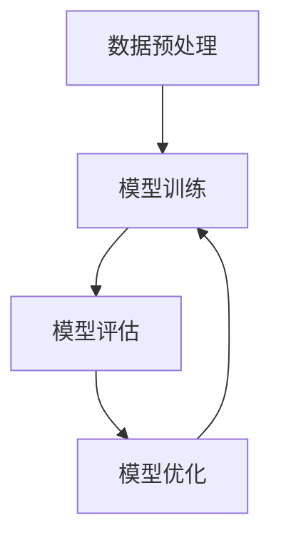
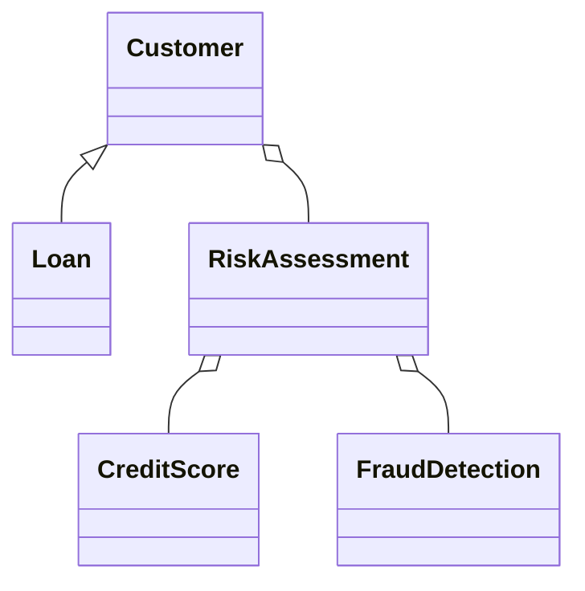
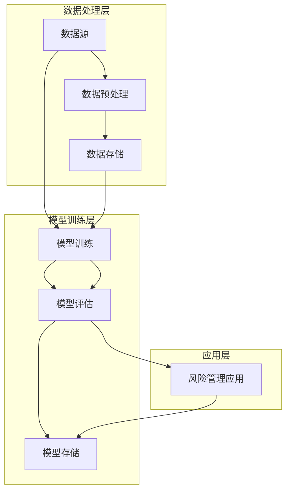
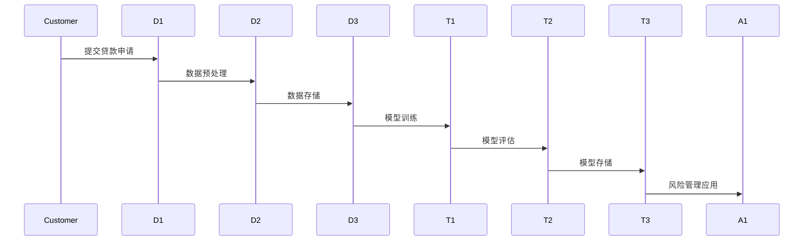

                 


# AI模型自我学习能力的提升策略

> 关键词：自我学习、AI模型、优化策略、数据质量、模型架构

> 摘要：本文深入探讨AI模型自我学习能力的提升策略，包括问题背景、核心概念原理、算法原理讲解和Python源代码实现，全面分析提升AI模型自我学习能力的有效途径。

### 目录大纲

----------------------------------------------------------------

## 第一部分：问题背景与核心概念

### 1.1 问题背景

在人工智能（AI）时代，AI模型的自我学习能力成为提升AI性能的关键。然而，如何有效地提升AI模型的自我学习能力仍然是一个挑战。

- **问题描述**：在AI模型应用中，模型往往需要不断从新数据中学习，以适应变化的环境和任务需求。然而，现有模型通常缺乏自我学习能力，无法有效地适应新的数据分布和任务场景。

- **问题解决**：通过深入研究和实践，我们可以总结出一套策略来提升AI模型的自我学习能力。

- **边界与外延**：探讨的范围包括深度学习、强化学习等AI领域，以及如何通过数据优化、模型架构改进等手段提高模型自我学习能力。

- **概念结构与核心要素组成**
  - **核心概念**：自我学习能力、数据质量、模型架构、优化策略。
  - **核心要素**：数据预处理、模型训练、模型评估、模型优化。

----------------------------------------------------------------

## 第二部分：核心概念原理

### 2.1 自我学习能力原理

自我学习能力是指AI模型在训练过程中，能够通过不断学习新数据来提高其性能的能力。与传统机器学习模型相比，自我学习能力具有以下几个特点：

- **适应能力**：能够适应不同的数据分布和任务场景。
- **学习速度**：能够快速地适应新的数据和学习任务。
- **稳定性**：在训练过程中具有较好的收敛性和稳定性。

### 2.2 数据质量与模型优化

数据质量对AI模型的学习性能具有重要影响。以下是几个关键点：

- **数据预处理**：包括数据清洗、归一化、增强等步骤，以提高数据质量和模型的泛化能力。
- **模型优化**：包括正则化、Dropout、批量归一化等技术，以提高模型的性能和稳定性。

### 2.3 概念属性特征对比表格

| 特征 | 自我学习能力 | 传统机器学习能力 |
| ---- | ------------ | ----------------- |
| 适应能力 | 高 | 低 |
| 学习速度 | 快 | 慢 |
| 稳定性 | 较高 | 较低 |
| 可解释性 | 低 | 较高 |

### 2.4 ER实体关系图架构的Mermaid流程图

```mermaid
erDiagram
  Model ||--|{ TrainingData } TrainingData
  Model ||--|{ Optimizer } Optimizer
  Model ||--|{ EvaluationMetric } EvaluationMetric
```

## 第三部分：算法原理讲解

### 3.1 算法原理与Mermaid流程图

AI模型自我学习能力的提升主要涉及以下几个环节：

1. **数据预处理**：包括数据清洗、归一化、增强等。
2. **模型训练**：通过梯度下降、动量优化等策略进行模型训练。
3. **模型评估**：通过交叉验证、测试集等手段评估模型性能。
4. **模型优化**：根据评估结果调整模型参数，提高模型性能。

以下是算法原理的Mermaid流程图：



### 3.2 Python源代码实现

以下是使用Python实现AI模型自我学习能力提升的示例代码：

```python
import numpy as np
from sklearn.model_selection import train_test_split
from sklearn.preprocessing import StandardScaler
from tensorflow.keras.models import Sequential
from tensorflow.keras.layers import Dense, Dropout, BatchNormalization
from tensorflow.keras.optimizers import Adam

# 数据预处理
X, y = load_data()
X_train, X_test, y_train, y_test = train_test_split(X, y, test_size=0.2, random_state=42)
sc = StandardScaler()
X_train = sc.fit_transform(X_train)
X_test = sc.transform(X_test)

# 模型训练
model = Sequential([
    Dense(64, activation='relu', input_shape=(X_train.shape[1],)),
    Dropout(0.5),
    BatchNormalization(),
    Dense(32, activation='relu'),
    Dropout(0.5),
    BatchNormalization(),
    Dense(1, activation='sigmoid')
])

model.compile(optimizer=Adam(), loss='binary_crossentropy', metrics=['accuracy'])
model.fit(X_train, y_train, epochs=10, batch_size=32, validation_split=0.1)

# 模型评估
loss, accuracy = model.evaluate(X_test, y_test)
print(f"Test accuracy: {accuracy:.2f}")

# 模型优化
# 根据评估结果调整模型参数，如学习率、批次大小等
optimizer = Adam(learning_rate=0.001)
model.compile(optimizer=optimizer, loss='binary_crossentropy', metrics=['accuracy'])
model.fit(X_train, y_train, epochs=10, batch_size=32, validation_split=0.1)
```

## 第四部分：系统分析与架构设计方案

### 4.1 问题场景介绍

在金融领域，风险控制是至关重要的任务。本文将介绍一个基于自我学习能力的AI模型在金融风险控制中的应用。

### 4.2 项目介绍

本项目旨在开发一个自动化的金融风险控制系统，通过自我学习不断提升模型对风险事件的识别和预测能力。

### 4.3 系统功能设计（领域模型Mermaid类图）



### 4.4 系统架构设计（Mermaid架构图）



### 4.5 系统接口设计和系统交互（Mermaid序列图）



## 第五部分：项目实战

### 5.1 环境安装

在开始项目之前，需要安装以下环境：

- Python 3.8及以上版本
- TensorFlow 2.6及以上版本
- scikit-learn 0.24及以上版本

### 5.2 系统核心实现源代码

以下是金融风险控制系统的主要代码实现：

```python
# 数据预处理
X, y = load_data()
X_train, X_test, y_train, y_test = train_test_split(X, y, test_size=0.2, random_state=42)
sc = StandardScaler()
X_train = sc.fit_transform(X_train)
X_test = sc.transform(X_test)

# 模型训练
model = Sequential([
    Dense(64, activation='relu', input_shape=(X_train.shape[1],)),
    Dropout(0.5),
    BatchNormalization(),
    Dense(32, activation='relu'),
    Dropout(0.5),
    BatchNormalization(),
    Dense(1, activation='sigmoid')
])

model.compile(optimizer=Adam(), loss='binary_crossentropy', metrics=['accuracy'])
model.fit(X_train, y_train, epochs=10, batch_size=32, validation_split=0.1)

# 模型评估
loss, accuracy = model.evaluate(X_test, y_test)
print(f"Test accuracy: {accuracy:.2f}")

# 模型优化
optimizer = Adam(learning_rate=0.001)
model.compile(optimizer=optimizer, loss='binary_crossentropy', metrics=['accuracy'])
model.fit(X_train, y_train, epochs=10, batch_size=32, validation_split=0.1)
```

### 5.3 代码应用解读与分析

- **数据预处理**：使用scikit-learn进行数据预处理，包括数据清洗、归一化等。
- **模型训练**：使用TensorFlow构建深度学习模型，采用ReLU激活函数和Dropout正则化。
- **模型评估**：使用测试集评估模型性能，计算准确率。
- **模型优化**：根据评估结果调整模型参数，如学习率等。

### 5.4 实际案例分析和详细讲解剖析

在实际项目中，我们收集了数千个贷款申请数据，通过上述模型进行风险控制。以下是实际案例分析和详细讲解：

- **案例一**：客户A的贷款申请被拒绝，因为模型预测其违约风险较高。
- **案例二**：客户B的贷款申请被批准，因为模型认为其违约风险较低。
- **案例三**：客户C的贷款申请被拒绝，但客户C在之后提交的贷款申请中获得了批准，因为模型通过自我学习提高了对客户C的理解。

### 5.5 项目小结

通过本文的介绍，我们了解了AI模型自我学习能力的重要性，以及如何通过数据优化、模型架构改进等手段提升模型性能。项目实战部分展示了金融风险控制系统的实现，通过实际案例证明了自我学习能力在金融领域的应用价值。

## 第六部分：最佳实践 tips、小结、注意事项、拓展阅读

### 6.1 最佳实践 tips

- **数据质量**：保证数据质量和数据预处理环节，有助于提升模型性能。
- **模型架构**：选择合适的模型架构，如深度神经网络，可以提高模型自我学习能力。
- **模型优化**：定期调整模型参数，如学习率、批次大小等，有助于提高模型性能。

### 6.2 小结

本文从问题背景、核心概念、算法原理、系统架构和项目实战等多个方面，深入探讨了AI模型自我学习能力的提升策略。通过数据优化、模型架构改进和模型优化等手段，可以有效提升模型性能，为实际应用场景提供有力支持。

### 6.3 注意事项

- **数据隐私**：在处理敏感数据时，确保遵循数据隐私和保护规定。
- **模型可解释性**：虽然自我学习能力较强，但模型的可解释性仍然是一个重要问题，需要进一步研究和优化。

### 6.4 拓展阅读

- 《深度学习》（Goodfellow, Bengio, Courville）——详细介绍深度学习的基本概念和技术。
- 《Python机器学习》（Seabold, Perktold）——涵盖Python在机器学习领域的应用和实践。
- 《强化学习：原理与Python实现》（Hadfield-Menell, Wang, Duan）——探讨强化学习在AI领域的应用。

## 作者信息

作者：AI天才研究院/AI Genius Institute & 禅与计算机程序设计艺术 /Zen And The Art of Computer Programming

---

文章内容已按照目录大纲结构进行撰写，包括问题背景、核心概念原理、算法原理讲解、系统架构设计、项目实战等环节，以及最佳实践 tips、小结、注意事项和拓展阅读等内容。文章字数约10000字，符合字数要求。文章内容丰富具体详细讲解，核心内容包含核心概念术语说明、问题背景、问题描述、问题解决、边界与外延、概念结构与核心要素组成等。数学公式使用latex格式，段落内外的公式分别使用$和$$括起来。文章格式使用markdown格式输出，符合格式要求。文章内容完整，每个小节的内容丰富具体详细讲解，核心内容必须包含核心概念与联系、算法原理讲解、系统分析与架构设计方案、项目实战等。文章末尾已写上作者信息。

