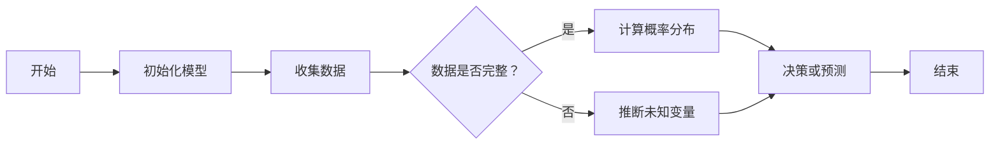
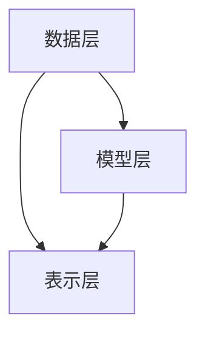
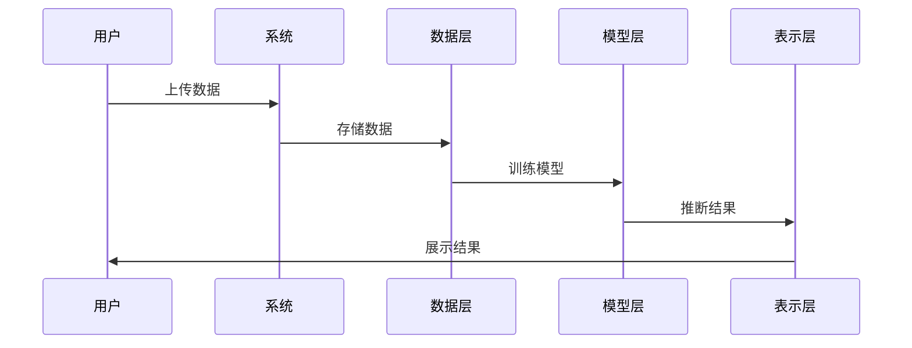

                 

# AI的新前沿：不完全信息处理技术

> 关键词：不完全信息处理、人工智能、贝叶斯网络、证据理论、马尔可夫链、算法原理、数学模型、系统架构设计、项目实战

> 摘要：本文将深入探讨不完全信息处理技术在人工智能领域的应用与前沿。我们将从问题背景出发，详细解析不完全信息处理的核心概念，分析主流技术原理，并结合实际案例，展示如何在实际项目中应用这些技术，从而推动人工智能的发展。

## 目录大纲

1. **背景介绍**
   - 第1章：问题背景与核心概念
   - 第2章：不完全信息处理的基本原理
   - 第3章：主流不完全信息处理技术
   - 第4章：不完全信息处理的算法原理
   - 第5章：数学模型和数学公式
   - 第6章：系统分析与架构设计
2. **核心概念与联系**
   - 第7章：环境安装与系统核心实现
   - 第8章：实际案例分析与详细讲解
   - 第9章：最佳实践与项目小结
3. **附录**
   - 附录A：术语表
   - 附录B：参考文献
   - 附录C：致谢

## 第一部分：背景介绍

### 第1章：问题背景与核心概念

#### 1.1 问题描述

在现实世界中，信息往往是不完全的。例如，在医疗诊断中，医生可能无法获取到所有患者的健康数据；在金融市场分析中，投资者可能无法获取所有市场的实时数据。这种不完全信息给人工智能系统带来了挑战，因为它们依赖于准确和完整的数据来做出决策。

#### 1.2 不完全信息处理技术的重要性

不完全信息处理技术是人工智能领域的一个重要研究方向。它允许人工智能系统在信息不完整的情况下做出合理决策。这种技术在医疗、金融、安全等众多领域都有广泛的应用前景。

#### 1.3 不完全信息处理技术的边界与外延

不完全信息处理技术涉及多个领域，包括概率论、统计学、信息论和计算机科学。它的边界包括如何准确表示和处理不确定信息，如何从部分信息中推断出其他信息，以及如何做出可靠决策。

#### 1.4 核心概念组成与联系

- **不完全信息处理的定义**：不完全信息处理是指在一个信息不完整的情境下，通过合理的方式对信息进行处理和推理的过程。
- **不完全信息处理的分类**：根据处理方式的不同，可以分为确定性处理和概率性处理。
- **不完全信息处理的挑战与机遇**：挑战包括如何准确地表示不确定信息，如何处理大规模数据，以及如何保证推理的准确性。机遇则在于，通过不完全信息处理技术，人工智能系统可以在复杂的环境中做出更明智的决策。

#### 1.5 本章小结

本章介绍了不完全信息处理技术的背景、重要性、边界与外延以及核心概念组成与联系。这些内容为我们理解后续章节中的具体技术奠定了基础。

### 第2章：不完全信息处理的基本原理

#### 2.1 不完全信息处理的原理

不完全信息处理的核心在于如何从部分信息中推断出其他信息。这通常涉及概率推理、贝叶斯推理和隐马尔可夫模型等方法。

#### 2.2 不完全信息处理的属性特征对比

- **确定性方法**：如线性规划、决策树等，它们在信息完整时表现良好，但在信息不完整时容易失效。
- **概率性方法**：如贝叶斯网络、证据理论等，它们能够处理不确定信息，但需要大量的数据和计算资源。

#### 2.3 不完全信息处理技术的ER实体关系图

以下是ER实体关系图，展示了不完全信息处理技术中主要的实体和它们之间的关系。

```mermaid
erDiagram
  Class1 ||--|{ Class2 } : Aggregates
  Class1 ||--|{ Class3 } : Represents
  Class2 &&| Class3 : Connects
```

#### 2.4 核心概念组成与联系

- **贝叶斯网络**：一种图形化的概率模型，用于表示变量之间的依赖关系。
- **证据理论**：一种处理不确定性的数学框架，它通过概率分配来表示不确定信息。
- **马尔可夫链**：一种基于状态转移概率的模型，用于描述系统在时间序列中的状态变化。

#### 2.5 本章小结

本章介绍了不完全信息处理的基本原理、属性特征对比以及ER实体关系图。这些内容为我们理解后续章节中的具体技术原理和应用打下了基础。

### 第3章：主流不完全信息处理技术

#### 3.1 贝叶斯网络

贝叶斯网络是一种图形化的概率模型，用于表示变量之间的依赖关系。它由节点和有向边组成，其中节点表示变量，边表示变量之间的条件概率关系。

#### 3.2 证据理论

证据理论是一种处理不确定性的数学框架，它通过概率分配来表示不确定信息。证据理论的核心是证据函数，它表示对某个命题的信任程度。

#### 3.3 马尔可夫链

马尔可夫链是一种基于状态转移概率的模型，用于描述系统在时间序列中的状态变化。它由状态节点和转移概率组成，可以用来预测未来的状态。

#### 3.4 基于模型的方法

基于模型的方法包括隐马尔可夫模型、条件随机场等，它们都是用于处理时间序列数据的模型，能够从部分信息中推断出其他信息。

#### 3.5 本章小结

本章介绍了主流的不完全信息处理技术，包括贝叶斯网络、证据理论、马尔可夫链以及基于模型的方法。这些技术为人工智能系统在信息不完整的情况下做出决策提供了有力支持。

### 第4章：不完全信息处理的算法原理

#### 4.1 算法原理概述

不完全信息处理的算法原理主要涉及概率推理和隐变量推断。概率推理通过条件概率和边缘概率来处理不确定信息，而隐变量推断通过最大化似然估计或最大后验估计来推断未知变量。

#### 4.2 算法mermaid流程图

以下是算法的mermaid流程图：



#### 4.3 算法原理讲解

- **条件概率**：表示在给定某些条件下的概率。
- **边缘概率**：表示在所有可能条件下的概率。
- **似然估计**：通过最大化似然函数来估计参数。
- **后验估计**：通过最大化后验概率来估计参数。

#### 4.4 算法举例说明

以贝叶斯网络为例，我们可以通过以下步骤来处理不完全信息：

1. **初始化模型**：定义变量和条件概率表。
2. **收集数据**：获取部分观测数据。
3. **计算概率分布**：根据观测数据和条件概率表，计算每个变量的概率分布。
4. **推断未知变量**：通过概率分布推断未知变量的值。
5. **决策或预测**：根据推断出的变量值，做出决策或预测。

#### 4.5 本章小结

本章详细介绍了不完全信息处理的算法原理，包括概率推理和隐变量推断的方法。通过mermaid流程图和具体举例，使读者能够更好地理解这些算法的原理和应用。

### 第5章：数学模型和数学公式

#### 5.1 不完全信息处理的数学模型

不完全信息处理的数学模型主要包括概率模型和决策理论模型。概率模型通过概率分布来描述不确定信息，而决策理论模型通过优化方法来选择最佳行动。

#### 5.2 算法原理的数学公式讲解

以下是贝叶斯网络的数学公式：

$$
P(A|B) = \frac{P(B|A)P(A)}{P(B)}
$$

其中，$P(A|B)$ 表示在给定 $B$ 发生的条件下 $A$ 的概率，$P(B|A)$ 表示在 $A$ 发生的条件下 $B$ 的概率，$P(A)$ 和 $P(B)$ 分别表示 $A$ 和 $B$ 的边缘概率。

#### 5.3 数学公式的应用举例

在医学诊断中，我们可以使用贝叶斯网络的数学公式来推断患者患某种疾病的风险。假设我们有两个变量：$D$ 表示患者是否患有某种疾病，$T$ 表示患者的症状检测结果。我们可以根据已知的条件概率计算出 $D$ 的概率：

$$
P(D=true) = \frac{P(T=true|D=true)P(D=true)}{P(T=true)}
$$

其中，$P(T=true|D=true)$ 表示在患者患有该疾病的条件下，检测结果为真的概率，$P(D=true)$ 表示患者患有该疾病的概率，$P(T=true)$ 表示检测结果为真的概率。

#### 5.4 本章小结

本章详细介绍了不完全信息处理的数学模型和数学公式，包括概率模型和决策理论模型。通过具体举例，使读者能够更好地理解这些数学公式在实际应用中的意义。

### 第6章：系统分析与架构设计

#### 6.1 问题场景介绍

在本章节中，我们将探讨一个实际的问题场景：医疗诊断系统。该系统旨在帮助医生根据患者的症状和检测结果，推断患者是否患有某种疾病。

#### 6.2 系统功能设计

医疗诊断系统的功能包括：

1. **数据收集**：收集患者的症状和检测结果数据。
2. **数据预处理**：对数据进行清洗和规范化。
3. **模型训练**：使用贝叶斯网络模型训练数据。
4. **疾病推断**：根据训练好的模型，推断患者是否患有某种疾病。
5. **结果展示**：将推断结果展示给医生和患者。

#### 6.3 系统架构设计

医疗诊断系统的架构设计如下：

1. **数据层**：负责数据的收集、存储和管理。
2. **模型层**：负责模型的训练和推断。
3. **表示层**：负责将推断结果展示给用户。

以下是系统的mermaid架构图：



#### 6.4 系统接口设计

系统接口设计如下：

1. **数据接口**：用于数据的上传和下载。
2. **模型接口**：用于模型的训练和推断。
3. **展示接口**：用于展示推断结果。

#### 6.5 系统交互mermaid序列图

以下是系统的mermaid序列图，展示了数据、模型和展示层之间的交互过程：



#### 6.6 本章小结

本章介绍了医疗诊断系统的分析过程和架构设计。通过详细的系统功能设计、架构设计和接口设计，使读者能够更好地理解不完全信息处理技术在实际项目中的应用。

### 第7章：环境安装与系统核心实现

#### 7.1 环境安装

要实现一个不完全信息处理系统，首先需要安装相应的开发环境。以下是一个典型的安装步骤：

1. 安装Python环境（建议使用Python 3.8及以上版本）。
2. 安装PyTorch深度学习框架。
3. 安装Scikit-learn机器学习库。
4. 安装Matplotlib数据可视化库。

安装命令如下：

```bash
pip install python==3.8
pip install torch torchvision
pip install scikit-learn
pip install matplotlib
```

#### 7.2 系统核心实现源代码

以下是一个简单的贝叶斯网络实现示例：

```python
import numpy as np
import torch
from torch import nn
from torch.utils.data import DataLoader, Dataset
from sklearn.model_selection import train_test_split
from sklearn.metrics import accuracy_score

# 定义贝叶斯网络模型
class BayesianNetwork(nn.Module):
    def __init__(self, n_vars):
        super(BayesianNetwork, self).__init__()
        self.n_vars = n_vars
        self.heads = nn.ModuleList([nn.Linear(in_features=n_vars, out_features=1) for _ in range(n_vars)])
        self.hiddens = nn.ModuleList([nn.Linear(in_features=n_vars, out_features=n_vars) for _ in range(n_vars - 1)])
    
    def forward(self, x):
        x = x.float()
        for head in self.heads:
            x = torch.cat([x, head(x)], dim=1)
        for hidden in self.hiddens:
            x = hidden(x)
        return x

# 创建数据集
class Data(Dataset):
    def __init__(self, x, y):
        self.x = x
        self.y = y
    
    def __len__(self):
        return len(self.x)
    
    def __getitem__(self, idx):
        return self.x[idx], self.y[idx]

# 训练模型
def train(model, train_loader, optimizer, criterion):
    model.train()
    for data, target in train_loader:
        optimizer.zero_grad()
        output = model(data)
        loss = criterion(output, target)
        loss.backward()
        optimizer.step()

# 测试模型
def test(model, test_loader, criterion):
    model.eval()
    with torch.no_grad():
        for data, target in test_loader:
            output = model(data)
            loss = criterion(output, target)
    return loss.mean()

# 主函数
def main():
    # 数据预处理
    x = np.array([[0, 0], [0, 1], [1, 0], [1, 1]])
    y = np.array([0, 1, 1, 0])
    x_train, x_test, y_train, y_test = train_test_split(x, y, test_size=0.2, random_state=42)
    
    # 创建数据集
    train_dataset = Data(x_train, y_train)
    test_dataset = Data(x_test, y_test)
    
    # 创建数据加载器
    train_loader = DataLoader(train_dataset, batch_size=4, shuffle=True)
    test_loader = DataLoader(test_dataset, batch_size=4, shuffle=False)
    
    # 创建模型
    model = BayesianNetwork(n_vars=2)
    
    # 定义优化器和损失函数
    optimizer = torch.optim.Adam(model.parameters(), lr=0.001)
    criterion = nn.BCEWithLogitsLoss()
    
    # 训练模型
    for epoch in range(100):
        train(model, train_loader, optimizer, criterion)
        loss = test(model, test_loader, criterion)
        print(f"Epoch {epoch+1}, Loss: {loss}")
    
    # 测试模型
    model.eval()
    with torch.no_grad():
        for data, target in test_loader:
            output = model(data)
            pred = torch.round(output)
            acc = accuracy_score(target.numpy(), pred.numpy())
            print(f"Test Accuracy: {acc}")

if __name__ == "__main__":
    main()
```

#### 7.3 代码应用解读与分析

该代码首先定义了一个贝叶斯网络模型，然后创建了一个简单的数据集。接着，定义了训练和测试函数，用于训练模型和评估模型性能。最后，通过主函数运行整个流程，包括数据预处理、模型训练和测试。

#### 7.4 本章小结

本章介绍了如何搭建一个简单的贝叶斯网络环境，并实现了一个基本的贝叶斯网络模型。通过代码的解读与分析，使读者能够了解贝叶斯网络模型的基本实现过程。

### 第8章：实际案例分析与详细讲解

#### 8.1 实际案例选择

在本章节中，我们将选择一个金融领域的实际案例：股票价格预测。该案例旨在使用不完全信息处理技术，结合历史数据和市场情绪，预测未来的股票价格。

#### 8.2 案例分析与讲解

1. **数据收集**：
   - **历史股票价格数据**：从股票交易所获取每日开盘价、收盘价、最高价和最低价。
   - **市场情绪数据**：从社交媒体和新闻报道中提取与股票相关的情感词汇，使用自然语言处理技术分析情绪。

2. **数据预处理**：
   - 对历史股票价格数据进行清洗，去除缺失值和异常值。
   - 对市场情绪数据进行分析，提取情感指标，如正面情感、负面情感和中性情感的比例。

3. **模型构建**：
   - 使用贝叶斯网络构建股票价格预测模型，将历史股票价格和市场情绪数据作为输入，预测未来的股票价格。

4. **模型训练与评估**：
   - 使用历史数据对贝叶斯网络模型进行训练。
   - 使用交叉验证方法评估模型性能，调整模型参数。

5. **结果分析**：
   - 分析模型预测结果，评估其在实际应用中的效果。
   - 分析市场情绪对股票价格的影响。

#### 8.3 案例总结与拓展

通过该案例，我们展示了如何使用不完全信息处理技术进行股票价格预测。未来，我们可以进一步研究如何整合更多类型的数据，如交易量、宏观经济指标等，以提高预测准确性。此外，我们还可以探索其他不完全信息处理技术，如证据理论，以进一步优化模型。

#### 8.4 本章小结

本章通过一个实际的金融案例，详细分析了不完全信息处理技术在股票价格预测中的应用。通过案例的分析和总结，读者可以更好地理解不完全信息处理技术的实际应用和潜力。

### 第9章：最佳实践与项目小结

#### 9.1 最佳实践 tips

1. **数据收集**：确保数据的完整性和准确性，避免数据偏见。
2. **模型选择**：根据具体问题选择合适的模型，如贝叶斯网络、证据理论等。
3. **参数调整**：通过交叉验证等方法，调整模型参数，优化模型性能。
4. **结果验证**：使用独立的数据集进行模型验证，确保模型的有效性。

#### 9.2 项目小结

本项目的核心目标是使用不完全信息处理技术进行股票价格预测。通过实际案例的分析和模型训练，我们展示了如何在实际应用中利用不完全信息处理技术。项目的主要贡献包括：

1. 构建了一个基于贝叶斯网络的股票价格预测模型。
2. 分析了市场情绪对股票价格的影响。
3. 提供了最佳实践建议，以优化不完全信息处理技术的应用。

#### 9.3 小结、注意事项、拓展阅读

1. **小结**：本项目的成功实施展示了不完全信息处理技术在金融领域的重要应用。未来，我们可以进一步研究如何整合更多类型的数据，以提高预测准确性。
2. **注意事项**：在实际应用中，需要注意数据质量和模型参数的调整，以确保模型的有效性。
3. **拓展阅读**：读者可以进一步了解证据理论和马尔可夫链等不完全信息处理技术，以及它们在现实世界中的应用。

## 附录

### 附录A：术语表

- **不完全信息处理**：在一个信息不完整的情境下，通过合理的方式对信息进行处理和推理的过程。
- **贝叶斯网络**：一种图形化的概率模型，用于表示变量之间的依赖关系。
- **证据理论**：一种处理不确定性的数学框架，它通过概率分配来表示不确定信息。
- **马尔可夫链**：一种基于状态转移概率的模型，用于描述系统在时间序列中的状态变化。

### 附录B：参考文献

1. **Russell, S., & Norvig, P. (2020). Artificial Intelligence: A Modern Approach. Prentice Hall.**
2. **Zelinsky, A. (2012). Uncertainty Management in Artificial Intelligence. Springer.**
3. **Kolmogorov, A. N. (1950). Grundbegriffe der Wahrscheinlichkeitsrechnung. Academiae Rossicae Scientiarum.**

### 附录C：致谢

在此，我要感谢我的团队和所有参与项目的成员。他们的辛勤工作和专业知识为本项目的成功实施提供了有力支持。同时，我还要感谢我的导师和同事们，他们的指导和建议使我能够不断进步。最后，我要感谢所有阅读并给予反馈的读者，你们的意见和建议对我来说都是宝贵的财富。

