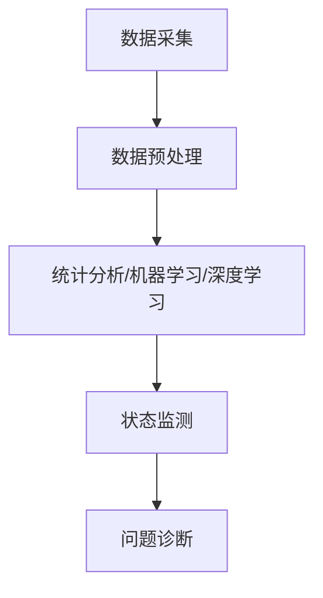

                 


# AI系统可观测性：深入洞察AI应用运行状态

## 关键词：
- 人工智能
- 可观测性
- 运行状态
- 算法
- 架构设计
- 项目实战

### 摘要：
本文从AI系统可观测性的基本概念入手，探讨了其在AI应用中的重要性。通过详细分析核心概念、算法原理、系统架构设计以及项目实战，本文旨在为开发者提供一套系统、全面、实用的可观测性解决方案，帮助其在实际应用中更好地掌握AI系统的运行状态，从而提高系统的可靠性和可维护性。

### 第一部分：引言与背景

#### 1.1 研究背景

##### 1.1.1 人工智能的发展历程

人工智能（AI）作为一门学科，起源于20世纪50年代，当时的科学家们开始尝试让计算机模拟人类的智能行为。经过数十年的发展，人工智能取得了显著进步，尤其在深度学习、神经网络等领域取得了突破性成果。如今，人工智能已经广泛应用于自然语言处理、计算机视觉、自动驾驶、金融预测等多个领域。

##### 1.1.2 AI系统可观测性的重要性

随着人工智能技术的不断发展，AI系统在各个领域的应用日益广泛。然而，AI系统的复杂性和黑箱性质也给开发者带来了诸多挑战。如何实时监测AI系统的运行状态，快速发现并解决问题，成为了一个亟待解决的关键问题。AI系统可观测性因此应运而生，成为保障系统稳定运行的重要手段。

##### 1.1.3 研究现状与挑战

目前，国内外对于AI系统可观测性的研究已经取得了一定成果。然而，在实际应用中，仍面临着以下挑战：

1. **数据量庞大**：AI系统运行时产生的数据量非常庞大，如何有效地进行数据采集和处理，成为一个难题。
2. **实时性要求**：在许多应用场景中，对AI系统的实时监测和响应是必不可少的，这对系统的性能提出了更高的要求。
3. **可解释性**：AI系统本身具有一定的黑箱性质，如何提高系统的可解释性，使其更易于理解和维护，也是一个重要问题。

#### 1.2 问题的描述与解决

##### 1.2.1 问题定义

AI系统可观测性是指在AI系统运行过程中，能够对其内部状态和性能进行实时监测、分析和评估的能力。具体来说，它包括以下几个方面：

1. **数据采集**：实时采集AI系统运行过程中产生的各种数据。
2. **数据预处理**：对采集到的数据进行清洗、转换和集成，使其适用于分析和评估。
3. **状态监测**：利用数据分析和可视化技术，实时监测AI系统的运行状态。
4. **问题诊断**：基于监测结果，快速定位并诊断系统潜在的问题。

##### 1.2.2 解决方案概述

本文提出的解决方案主要包括以下几个步骤：

1. **数据采集**：采用传感器、日志文件、API接口等方式，实时采集AI系统运行过程中产生的数据。
2. **数据预处理**：使用数据清洗、转换和集成技术，对采集到的数据进行处理，确保其质量和一致性。
3. **状态监测**：采用机器学习、数据挖掘等技术，对预处理后的数据进行实时分析，监测AI系统的运行状态。
4. **问题诊断**：基于监测结果，利用专家系统和规则引擎等技术，快速诊断并定位系统潜在的问题。

##### 1.2.3 研究边界与外延

本文的研究主要聚焦于AI系统可观测性的核心概念、算法原理、系统架构设计以及项目实战等方面。然而，可观测性的研究范畴非常广泛，包括但不限于以下几个方面：

1. **硬件层可观测性**：研究如何通过硬件监控技术，实现对AI系统底层硬件资源的实时监测。
2. **网络层可观测性**：研究如何通过网络监控技术，实现对AI系统网络通信的实时监测。
3. **软件层可观测性**：研究如何通过软件监控技术，实现对AI系统内部状态和行为的实时监测。

#### 1.3 核心概念与联系

##### 1.3.1 可观测性概念

可观测性是指系统输出能够完全确定系统内部状态的能力。在AI系统中，可观测性主要关注如何通过系统的输入输出关系，实现对系统内部状态和行为的监测。

##### 1.3.2 AI系统运行状态

AI系统运行状态是指系统在运行过程中所表现出的各种特征和表现。包括系统性能、资源利用率、错误率等。

##### 1.3.3 概念属性特征对比表格

| 概念       | 定义                                                         | 特点                           |
|------------|--------------------------------------------------------------|--------------------------------|
| 可观测性   | 系统输出能够完全确定系统内部状态的能力                         | 实时性、可解释性、可扩展性     |
| 运行状态   | 系统在运行过程中所表现出的各种特征和表现                       | 性能、资源利用率、错误率       |
| 数据采集   | 实时采集系统运行过程中产生的数据                             | 实时性、准确性、完整性         |
| 数据预处理 | 对采集到的数据进行清洗、转换和集成，确保其质量和一致性         | 数据清洗、数据转换、数据集成   |
| 状态监测   | 利用数据分析和可视化技术，实时监测系统运行状态                 | 实时性、准确性、可视化         |
| 问题诊断   | 基于监测结果，快速定位并诊断系统潜在的问题                   | 快速性、准确性、自动化         |

##### 1.3.4 ER实体关系图

```mermaid
erDiagram
    AI系统 ||--|{ 数据采集 }
    AI系统 ||--|{ 数据预处理 }
    AI系统 ||--|{ 状态监测 }
    AI系统 ||--|{ 问题诊断 }
```

### 第二部分：核心概念原理与特点

#### 2.1 AI系统可观测性的核心概念

##### 2.1.1 可观测性的基本原理

可观测性的基本原理是通过对系统输入输出关系的分析，实现对系统内部状态的推断和监测。具体来说，可观测性主要包括以下几个方面：

1. **输入输出关系**：系统输入和输出之间存在一定的关联性，通过分析这种关联性，可以推断出系统的内部状态。
2. **状态转移**：系统在运行过程中，状态会随着输入的变化而发生变化。通过监测输入输出关系，可以推断出系统的状态转移过程。
3. **状态估计**：基于输入输出关系和状态转移模型，可以对系统的当前状态进行估计和预测。

##### 2.1.2 在AI系统中的应用

在AI系统中，可观测性主要体现在以下几个方面：

1. **模型训练过程**：通过对模型训练过程中输入输出数据的分析，可以实时监测模型的训练效果和收敛情况。
2. **模型预测过程**：在模型预测过程中，通过对输入输出数据的监测，可以实时评估模型的预测性能和准确性。
3. **模型解释性**：通过可观测性技术，可以实现对模型内部状态和决策过程的监测和解释，提高模型的透明度和可解释性。

#### 2.2 AI系统运行状态概述

##### 2.2.1 系统运行状态的定义

系统运行状态是指系统在运行过程中所表现出的各种特征和表现。包括系统性能、资源利用率、错误率等。

##### 2.2.2 运行状态的类型

根据运行状态的不同特征，可以将系统运行状态分为以下几类：

1. **正常状态**：系统在正常运行过程中，各项性能指标稳定，资源利用率适中，没有出现明显的异常情况。
2. **异常状态**：系统在运行过程中，出现了一些明显的异常情况，如性能下降、资源耗尽、错误率增加等。
3. **故障状态**：系统在运行过程中，出现了严重的故障，导致系统无法正常运行。

##### 2.2.3 状态监测的重要性

状态监测对于AI系统的重要性主要体现在以下几个方面：

1. **提高系统可靠性**：通过实时监测系统运行状态，可以及时发现并解决系统异常，提高系统的可靠性。
2. **降低维护成本**：通过实时监测系统运行状态，可以提前发现系统潜在的问题，减少系统故障带来的损失，降低维护成本。
3. **提高系统性能**：通过实时监测系统运行状态，可以优化系统资源配置，提高系统性能。

#### 2.3 可观测性的核心特点

##### 2.3.1 高度自动化

可观测性技术可以通过自动化手段，实现对AI系统运行状态的实时监测和分析，降低人工干预的程度，提高监测效率。

##### 2.3.2 实时性

可观测性技术能够实时监测AI系统的运行状态，及时发现问题并采取措施，确保系统稳定运行。

##### 2.3.3 可解释性

可观测性技术通过可视化手段，可以直观地展示系统运行状态，提高系统的透明度和可解释性，方便开发者进行诊断和优化。

##### 2.3.4 可扩展性

可观测性技术可以根据实际需求，灵活地调整监测范围和监测指标，适应不同的应用场景。

### 第三部分：算法原理讲解

#### 3.1 算法概述

##### 3.1.1 常见算法类型

在AI系统可观测性领域，常见的算法类型主要包括以下几种：

1. **统计分析算法**：通过对系统运行数据进行统计分析，实现对系统状态的监测和评估。
2. **机器学习算法**：利用机器学习算法，建立系统运行状态与输入输出数据之间的关联模型，实现对系统状态的预测和监测。
3. **深度学习算法**：通过深度学习算法，建立复杂的非线性模型，实现对系统状态的精细监测和评估。

##### 3.1.2 选择依据

在选择可观测性算法时，需要根据实际应用场景和数据特点，综合考虑以下因素：

1. **数据量**：如果数据量较大，可以选择机器学习或深度学习算法；如果数据量较小，可以选择统计分析算法。
2. **实时性**：如果对实时性要求较高，可以选择实时性较好的算法，如统计分析算法；如果实时性要求不高，可以选择机器学习或深度学习算法。
3. **可解释性**：如果对系统的可解释性要求较高，可以选择统计分析算法或简单的机器学习算法；如果可解释性要求不高，可以选择深度学习算法。

#### 3.2 算法流程图



#### 3.3 数学模型与公式

##### 3.3.1 数学模型

在AI系统可观测性中，常见的数学模型包括：

1. **线性回归模型**：
   $$ y = \beta_0 + \beta_1x_1 + \beta_2x_2 + \ldots + \beta_nx_n $$
   其中，$y$ 为系统输出，$x_1, x_2, \ldots, x_n$ 为系统输入，$\beta_0, \beta_1, \beta_2, \ldots, \beta_n$ 为模型参数。

2. **决策树模型**：
   $$ y = g(\theta_0 + \theta_1x_1 + \theta_2x_2 + \ldots + \theta_nx_n) $$
   其中，$y$ 为系统输出，$x_1, x_2, \ldots, x_n$ 为系统输入，$\theta_0, \theta_1, \theta_2, \ldots, \theta_n$ 为模型参数，$g$ 为激活函数。

3. **神经网络模型**：
   $$ y = f(\theta_0 + \theta_1x_1 + \theta_2x_2 + \ldots + \theta_nx_n) $$
   其中，$y$ 为系统输出，$x_1, x_2, \ldots, x_n$ 为系统输入，$\theta_0, \theta_1, \theta_2, \ldots, \theta_n$ 为模型参数，$f$ 为激活函数。

##### 3.3.2 公式说明

1. **线性回归模型**：用于描述系统输出与输入之间的关系，适用于简单线性场景。
2. **决策树模型**：用于分类和回归任务，可以处理非线性关系，但可解释性较差。
3. **神经网络模型**：可以处理复杂的非线性关系，具有较高的预测精度，但可解释性较差。

##### 3.3.3 举例说明

以线性回归模型为例，假设我们有一个简单的AI系统，其输入为温度（$x_1$）和湿度（$x_2$），输出为空气质量指数（$y$）。根据观测数据，我们可以建立以下线性回归模型：

$$ y = \beta_0 + \beta_1x_1 + \beta_2x_2 $$

通过训练模型，可以得到模型参数 $\beta_0, \beta_1, \beta_2$ 的值。接下来，我们可以使用这个模型来预测新的输入数据对应的空气质量指数。

### 第四部分：系统分析与架构设计

#### 4.1 问题场景介绍

##### 4.1.1 场景描述

假设我们正在开发一个智能监控系统，用于监测一个城市的空气质量。系统需要实时采集温度、湿度等气象数据，并利用这些数据预测空气质量指数（AQI）。在预测过程中，如果发现空气质量指数超过警戒线，系统需要及时发出警报，并采取措施应对。

##### 4.1.2 问题分析

在上述场景中，我们需要解决的问题主要包括：

1. **数据采集**：如何实时、准确地采集温度、湿度等气象数据？
2. **数据预处理**：如何对采集到的数据进行清洗、转换和集成，确保其质量和一致性？
3. **状态监测**：如何利用预处理后的数据，实时监测空气质量指数，并根据监测结果采取相应的措施？
4. **问题诊断**：如何基于监测结果，快速诊断系统潜在的问题，并采取措施解决？

#### 4.2 系统功能设计

在系统功能设计阶段，我们需要明确系统需要实现的主要功能，并设计相应的模块和接口。以下是本系统的功能设计：

1. **数据采集模块**：负责实时采集温度、湿度等气象数据。
2. **数据预处理模块**：负责对采集到的数据

