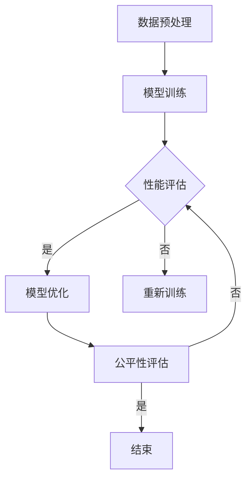
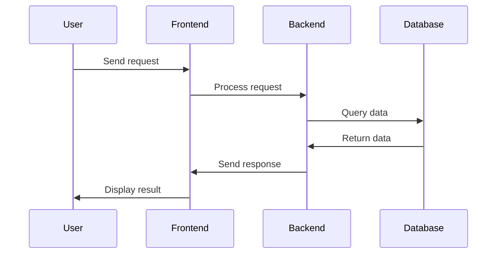

                 


## 《AI系统的公平性评估：确保模型无歧视的方法论》

> **关键词**：AI系统、公平性评估、无歧视、模型设计、算法原理

> **摘要**：本文深入探讨了AI系统的公平性评估问题，分析了AI系统中常见的歧视现象，并提出了实现无歧视性的方法。通过详细阐述核心概念、评估方法、系统架构以及实战应用，本文旨在为AI开发者提供一套完整的方法论，确保AI系统在设计和实施过程中能够避免歧视，提高系统的公平性。

---

### 第1章 引言

#### 1.1 问题背景
随着人工智能技术的快速发展，AI系统被广泛应用于各个领域，从金融、医疗到教育等。然而，这些AI系统在带来巨大便利的同时，也引发了公平性方面的挑战。无歧视性成为AI系统设计和评估中的一个重要议题。

#### 1.2 问题描述
AI系统的公平性评估涉及到多个层面，包括但不限于性别、种族、年龄等。常见的歧视现象有性别歧视、种族歧视和年龄歧视。公平性评估的目标是确保AI系统在处理不同用户群体时保持一致性，避免因偏见而导致的歧视。

#### 1.3 问题解决
公平性评估的核心在于识别和纠正AI系统中的歧视行为。本文将介绍一系列评估方法，包括数据预处理、模型评估和算法优化等，旨在实现AI系统的无歧视性。

#### 1.4 边界与外延
公平性评估的范围包括但不限于数据集、模型设计和算法选择等。此外，伦理和法律问题也是评估过程中需要考虑的因素。

#### 1.5 概念结构与核心要素组成
本文将详细讨论AI系统公平性评估的核心概念和要素，包括公平性评估原理、评估指标、算法原理和系统架构等。

---

### 第2章 核心概念与联系

#### 2.1 公平性评估原理
公平性评估基于一系列基本原则，如透明性、责任性和可解释性。评估指标包括公平性得分、偏见度等。

#### 2.2 概念属性特征对比表格
表格将对比不同公平性评估指标的特点和适用场景，帮助开发者选择合适的评估方法。

#### 2.3 ER实体关系图架构
ER图将展示AI系统中的关键实体和它们之间的关系，为后续的评估和优化提供指导。

---

### 第3章 AI系统的歧视现象分析

#### 3.1 常见歧视现象
本文将分析AI系统中常见的歧视现象，包括种族歧视、性别歧视和年龄歧视。

#### 3.2 影响因素
歧视现象的产生受多种因素影响，包括数据偏见、模型设计和数据预处理等。

---

### 第4章 公平性评估方法

#### 4.1 数据预处理方法
数据预处理是公平性评估的基础，包括数据清洗、数据平衡等技术。

#### 4.2 模型评估方法
模型评估方法包括性能评估和公平性指标评估，旨在确保模型在不同群体中的表现一致性。

#### 4.3 算法原理讲解
本文将使用mermaid画出算法流程图，并使用Python源代码详细阐述算法原理。

#### 4.4 数学模型和数学公式
算法原理将配合数学模型和公式进行详细讲解，以便开发者更好地理解。

#### 4.5 举例说明
通过实际案例，本文将通俗易懂地举例说明算法原理。

---

### 第5章 系统分析与架构设计方案

#### 5.1 问题场景介绍
本文将介绍一个具体的AI系统应用场景，以便读者更好地理解后续内容。

#### 5.2 项目介绍
本文将介绍一个用于公平性评估的AI系统项目，包括背景和目标。

#### 5.3 系统功能设计
系统功能设计包括领域模型mermaid类图，展示系统的核心功能。

#### 5.4 系统架构设计
系统架构设计将使用mermaid架构图展示系统的整体架构。

#### 5.5 系统接口设计
系统接口设计将详细说明系统的接口和交互方式。

#### 5.6 系统交互
系统交互将使用mermaid序列图展示系统的交互流程。

---

### 第6章 项目实战

#### 6.1 环境安装
本文将介绍如何在本地环境中搭建AI系统所需的开发环境。

#### 6.2 系统核心实现源代码
本文将展示系统核心功能的实现源代码，并进行分析。

#### 6.3 代码应用解读与分析
本文将对源代码进行解读，并分析其在实际应用中的作用。

#### 6.4 实际案例分析和详细讲解剖析
本文将通过实际案例，对AI系统在公平性评估中的应用进行详细分析。

#### 6.5 项目小结
本文将对项目进行总结，并分享项目的经验和教训。

---

### 第7章 最佳实践与拓展阅读

#### 7.1 最佳实践 tips
本文将提供一系列最佳实践，帮助开发者更好地实现AI系统的公平性评估。

#### 7.2 小结
本文将对全文进行小结，总结关键点和经验。

#### 7.3 注意事项
本文将提醒开发者在使用AI系统公平性评估时需要注意的事项。

#### 7.4 拓展阅读
本文将推荐一些拓展阅读材料，供读者进一步学习。

---

作者：AI天才研究院/AI Genius Institute & 禅与计算机程序设计艺术 /Zen And The Art of Computer Programming

以上是根据您的要求整理的文章结构和内容概述。接下来，我们将逐步填充每个章节的具体内容，确保文章的完整性和深度。如果您对某个部分有特定的要求或者想要添加新的内容，请随时告知。让我们一步一步深入探讨AI系统的公平性评估问题。LET'S THINK STEP BY STEP### 第1章 引言

#### 1.1 问题背景

人工智能（AI）作为当今科技发展的重要方向，已经在多个领域展示了其强大的潜力。从自动驾驶汽车到智能客服系统，AI技术正逐步改变我们的生活方式。然而，随着AI系统的广泛应用，一个不容忽视的问题也逐渐浮现：AI系统的公平性。

AI系统通常依赖于大量数据进行训练，这些数据可能包含社会上的偏见和歧视。如果这些偏见在模型训练过程中没有被妥善处理，AI系统可能会在决策中表现出歧视行为。例如，一个招聘系统可能会在招聘过程中对特定性别或种族的人给予较低的评分，或者一个信贷评估系统可能会对某些群体给予更高的贷款利率。这种歧视不仅违反伦理道德，也可能导致法律问题，影响社会的和谐稳定。

因此，如何确保AI系统的公平性，避免在模型中引入和放大社会偏见，成为了一个迫切需要解决的问题。这一问题的核心在于如何对AI系统的公平性进行评估，并采取有效的措施来消除歧视。

#### 1.2 问题描述

**什么是AI系统的公平性？**

AI系统的公平性是指在所有用户群体中，系统对待每个用户的方式都应该是一致的，不应该因为用户的性别、种族、年龄等因素而导致系统对其产生偏见。公平性评估旨在确保AI系统在不同用户群体中的决策是公正的，不会因为某些群体的特征而受到不公平的对待。

**常见的AI歧视现象**

1. **种族歧视**：AI系统可能会在招聘、信贷评估等应用中对特定种族的用户给予不公平的待遇。
2. **性别歧视**：在招聘、教育等场景中，AI系统可能会对女性用户产生偏见，导致女性用户获得的机会减少。
3. **年龄歧视**：在保险、医疗服务等领域，AI系统可能会对年轻用户或老年用户给予不公平的评估。

**公平性评估的目标**

公平性评估的目标是识别和纠正AI系统中的歧视行为，确保系统在不同用户群体中的决策是一致的。这需要通过一系列指标和方法来评估系统的公平性，并采取相应的措施来优化系统的设计。

#### 1.3 问题解决

**AI系统公平性评估的定义**

AI系统公平性评估是指通过一系列的方法和技术，对AI系统在不同用户群体中的决策进行评估，以确定系统是否存在歧视行为。评估过程通常包括数据预处理、模型评估、算法优化等多个环节。

**无歧视性在AI系统中的实现方法**

1. **数据预处理**：在模型训练前，对训练数据集进行清洗和预处理，以减少数据中的偏见和噪声。
2. **模型评估**：在模型训练完成后，通过性能评估和公平性指标评估，对模型在不同用户群体中的表现进行评估。
3. **算法优化**：根据评估结果，对模型进行优化，以减少歧视行为，提高系统的公平性。

#### 1.4 边界与外延

**公平性评估的范围**

公平性评估的范围包括但不限于数据集、模型设计、算法选择等。评估过程需要考虑系统的各个方面，以确保整体公平性。

**相关伦理和法律问题**

在实现AI系统的公平性评估过程中，需要遵守相关的伦理和法律规范。例如，避免使用含有歧视性内容的数据，确保系统的透明性和可解释性，以及遵守数据保护法规等。

#### 1.5 概念结构与核心要素组成

**AI系统公平性评估的关键概念**

1. **公平性指标**：用于评估系统在不同用户群体中决策的一致性。
2. **偏见度**：衡量系统在决策过程中引入的偏见程度。
3. **可解释性**：确保系统的决策过程是透明的，用户可以理解系统为何做出特定的决策。

**核心要素与组成部分**

1. **数据预处理**：包括数据清洗、数据平衡等技术，以减少数据中的偏见。
2. **模型评估**：包括性能评估和公平性指标评估，以确定模型在不同用户群体中的表现。
3. **算法优化**：根据评估结果，对模型进行优化，以减少歧视行为，提高系统的公平性。

通过以上内容，我们初步了解了AI系统公平性评估的重要性和实现方法。在接下来的章节中，我们将进一步探讨核心概念、评估方法以及实际应用，帮助读者深入理解这一复杂而重要的议题。### 第2章 核心概念与联系

#### 2.1 公平性评估原理

AI系统的公平性评估是基于一系列原则和方法，旨在确保系统在不同用户群体中的决策是公正和一致的。以下是一些关键的评估原理：

**基本原则**

1. **无偏见性**：确保AI系统在处理不同用户群体时，不会因用户的性别、种族、年龄等因素而产生偏见。
2. **透明性**：评估过程应该是透明的，用户可以理解系统如何做出决策。
3. **责任性**：系统设计和开发者需要对评估结果负责，确保系统在伦理和法律上可接受。
4. **可解释性**：AI系统的决策过程应该是可解释的，以便用户和监管机构能够理解系统的决策依据。

**关键指标**

1. **公平性得分**：用于衡量系统在不同用户群体中的决策一致性。得分越高，系统的公平性越好。
2. **偏见度**：衡量系统在决策过程中引入的偏见程度。偏见度越低，系统的公平性越高。
3. **差异性**：衡量系统在不同用户群体中决策的差异性。差异越小，系统的公平性越好。

**评估方法**

1. **统计分析**：使用统计方法评估系统在不同用户群体中的表现，如置信区间、假设检验等。
2. **机器学习模型**：使用机器学习模型对系统的偏见进行量化，如公平性指标评估模型。
3. **可视化和解释**：通过可视化和解释技术，帮助用户和监管机构理解系统的决策过程。

#### 2.2 概念属性特征对比表格

为了更好地理解不同公平性评估指标的属性特征，我们列出了一个对比表格：

| 指标名称       | 定义                                                         | 属性特征                                     | 适用场景                           |
|----------------|--------------------------------------------------------------|------------------------------------------|-----------------------------------|
| 公平性得分     | 用于衡量系统在不同用户群体中的决策一致性。                   | 数值越高，公平性越好。                   | 模型训练和评估阶段               |
| 偏见度         | 用于衡量系统在决策过程中引入的偏见程度。                     | 数值越低，偏见越小。                     | 模型优化和偏差纠正阶段           |
| 差异性         | 用于衡量系统在不同用户群体中决策的差异性。                   | 差异性越小，公平性越好。                 | 模型性能评估和用户反馈分析阶段   |
| 可解释性得分   | 用于衡量系统决策过程的可解释性。                             | 数值越高，可解释性越好。                 | 法律合规和用户信任建设阶段       |

通过对比表格，我们可以看出不同指标在不同阶段的适用性和重要性。

#### 2.3 ER实体关系图架构

在AI系统公平性评估中，了解系统中的关键实体和它们之间的关系是至关重要的。ER图（实体关系图）可以帮助我们清晰地展示这些关系。

以下是一个简化的ER图：

```mermaid
erDiagram
    User ||--|{ AIModel }|--|}
    AIModel ||--|{ Dataset }|--|}
    Dataset ||--|{ Feature }|--|}
    Feature ||--|{ Bias }|--|}
    Bias ||--|{ Correction }|--|}
```

**实体与关系：**

1. **User（用户）**：系统的服务对象，具有性别、种族、年龄等特征。
2. **AIModel（AI模型）**：由数据训练得到的模型，负责处理用户请求并做出决策。
3. **Dataset（数据集）**：模型训练所使用的数据集，包括用户特征和结果标签。
4. **Feature（特征）**：数据集中的用户特征，如性别、年龄等。
5. **Bias（偏见）**：模型在决策过程中引入的偏见，可以通过分析特征分布来识别。
6. **Correction（纠正）**：对偏见进行纠正的算法和技术。

通过ER图，我们可以清晰地看到AI系统中的关键实体以及它们之间的关系，为后续的评估和优化提供了直观的指导。

在接下来的章节中，我们将进一步探讨AI系统中的歧视现象，以及如何通过具体的评估方法和算法实现系统的公平性。### 第3章 AI系统的歧视现象分析

#### 3.1 常见歧视现象

AI系统在决策过程中可能会表现出各种形式的歧视现象，这些歧视现象可能源于数据偏见、模型设计或数据预处理等多个方面。以下是一些常见的歧视现象：

**种族歧视**

在招聘、信贷评估等应用中，AI系统可能会对某些种族的用户给予较低的评分或拒绝服务。这种歧视现象通常是由于训练数据中存在对特定种族的负面偏见。

**性别歧视**

在招聘、晋升评估等场景中，AI系统可能会对女性用户给予较低的评分，或者在某些情况下，女性的表现被低估。性别歧视可能源于对传统性别角色的偏见，以及数据集中对女性用户的代表性不足。

**年龄歧视**

在保险、医疗服务等领域，AI系统可能会对年轻用户或老年用户给予不公平的评估。年龄歧视可能源于对老年人健康风险的过度担忧，以及对年轻人风险承受能力的低估。

#### 3.2 影响因素

AI系统中的歧视现象受到多种因素的影响，主要包括数据偏见、模型设计和数据预处理等。

**数据偏见**

数据偏见是导致AI系统歧视的主要原因之一。如果训练数据中包含对某些群体的负面偏见，AI系统在决策过程中很可能会放大这些偏见。例如，如果招聘数据集中对某个种族的应聘者记录了更多的负面评价，模型在评估时可能会对这些应聘者给予较低的评分。

**模型设计**

模型设计也可能导致歧视现象。一些基于决策树的模型，如随机森林和梯度提升树，可能会在学习过程中放大数据中的偏见。此外，一些优化目标可能无意中加剧了系统的歧视行为，例如，在招聘问题中，优化目标是降低整体错误率，但可能会导致对特定群体的错误率偏高。

**数据预处理**

数据预处理阶段也可能会引入歧视。例如，如果使用特征工程技术时，对某些群体的特征赋予更高的权重，可能会导致系统在这些群体中的决策偏向。另外，数据清洗过程中可能忽视了对偏见数据的处理，导致偏见在模型训练过程中被放大。

#### 3.3 具体案例分析

以下是一些具体的案例，展示了AI系统中的歧视现象及其产生的影响：

**案例1：招聘歧视**

一家公司在招聘过程中使用了基于机器学习模型的筛选系统。然而，由于训练数据集中存在对女性应聘者的负面偏见，该系统在评估女性应聘者时给予了较低的评分。结果，公司未能招聘到许多优秀的女性候选人。

**案例2：信贷评估歧视**

一个银行使用的信贷评估模型在决策过程中对某些种族的用户给予了更高的贷款利率。这导致这些用户难以获得贷款，从而加剧了社会不平等。

**案例3：医疗服务歧视**

在医疗服务中，AI系统可能会对老年患者给予较低的评估分数，导致他们无法获得应有的医疗服务。这种歧视行为可能源于对老年人健康风险的过度担忧。

**案例4：教育评估歧视**

在教育资源分配中，AI系统可能会对某些种族或社会经济地位较低的学生给予较低的评价，从而影响他们的教育机会。

这些案例表明，AI系统中的歧视现象不仅违反伦理道德，也可能导致严重的法律和社会问题。因此，识别和纠正这些歧视行为对于确保AI系统的公平性和可接受性至关重要。

在下一章中，我们将探讨如何通过数据预处理、模型评估和算法优化等技术手段来评估和消除AI系统中的歧视现象。### 第4章 公平性评估方法

#### 4.1 数据预处理方法

数据预处理是确保AI系统公平性的关键步骤，它旨在减少数据中的偏见，提高系统的准确性。以下是一些常用的数据预处理方法：

**1. 数据清洗**

数据清洗是预处理的第一步，目的是去除数据中的噪声和不相关特征。这可以通过去除重复记录、填补缺失值、去除异常值等方式实现。例如，在招聘数据集中，如果某些应聘者的种族信息缺失或记录错误，可以通过填补缺失值或纠正错误来提高数据的完整性。

**2. 数据平衡**

数据平衡的目的是减少数据集中不同群体之间的差异，避免因数据不均衡导致的偏见。常见的方法包括：

- **重采样**：通过增加少数群体的样本数量或减少多数群体的样本数量，使数据集在各个群体上的分布更加均匀。
- **合成数据**：使用生成对抗网络（GAN）等技术生成与真实数据分布相似的新数据，以平衡数据集中不同群体的代表性。

**3. 特征选择**

特征选择是选择对模型预测最有影响力的特征，去除那些冗余或不相关的特征。这可以通过特征重要性分析、相关性分析等方法实现。例如，在招聘数据集中，性别、种族等特征可能对招聘决策没有直接贡献，可以选择去除这些特征。

**4. 特征加权**

在特征选择的基础上，可以通过特征加权来调整特征对模型的影响。例如，如果某些特征对特定群体的重要性更高，可以适当增加这些特征的权重，以确保模型在处理这些群体时更加准确。

**4.2 模型评估方法**

模型评估是确保AI系统公平性的重要环节，它通过一系列指标来评估模型的性能和公平性。以下是一些常用的评估方法：

**1. 性能评估**

性能评估主要用于衡量模型的准确性、召回率、精确率等指标。这些指标可以帮助我们了解模型在不同用户群体中的表现。例如，在招聘问题中，我们可以通过准确率来衡量模型在招聘决策中的表现。

**2. 公平性指标评估**

公平性指标评估主要用于衡量模型在不同用户群体中的决策一致性。以下是一些常用的公平性指标：

- **公平性得分**：用于衡量系统在不同用户群体中的决策一致性。得分越高，系统的公平性越好。
- **偏见度**：用于衡量系统在决策过程中引入的偏见程度。偏见度越低，系统的公平性越高。
- **差异性**：用于衡量系统在不同用户群体中决策的差异性。差异性越小，系统的公平性越好。

**3. 混淆矩阵**

混淆矩阵是评估模型性能的重要工具，它展示了模型对各个类别的预测结果。通过分析混淆矩阵，我们可以了解模型在不同用户群体中的表现，以及是否存在偏差。

**4.3 算法原理讲解**

为了更好地理解公平性评估方法，我们使用mermaid绘制了一个算法流程图：



该算法流程图展示了从数据预处理到模型训练、性能评估和公平性评估的整个过程。在每一步，我们都会根据评估结果进行相应的调整，以优化模型的性能和公平性。

接下来，我们将使用Python源代码详细阐述算法原理：

```python
import pandas as pd
from sklearn.model_selection import train_test_split
from sklearn.metrics import accuracy_score, confusion_matrix

# 数据预处理
def preprocess_data(data):
    # 数据清洗
    data = data.drop_duplicates()
    data = data.fillna(method='ffill')
    # 数据平衡
    data = balance_data(data)
    return data

# 模型训练
def train_model(X_train, y_train):
    # 使用逻辑回归模型进行训练
    model = LogisticRegression()
    model.fit(X_train, y_train)
    return model

# 性能评估
def evaluate_performance(model, X_test, y_test):
    y_pred = model.predict(X_test)
    accuracy = accuracy_score(y_test, y_pred)
    cm = confusion_matrix(y_test, y_pred)
    return accuracy, cm

# 公平性评估
def evaluate公平性(model, X_test, y_test):
    y_pred = model.predict(X_test)
    fairness_score = calculate_fairness_score(y_test, y_pred)
    return fairness_score

# 评估流程
data = pd.read_csv('data.csv')
data = preprocess_data(data)
X_train, X_test, y_train, y_test = train_test_split(data.drop('target', axis=1), data['target'], test_size=0.2, random_state=42)

model = train_model(X_train, y_train)
accuracy, cm = evaluate_performance(model, X_test, y_test)
fairness_score = evaluate_fairness(model, X_test, y_test)

print('Accuracy:', accuracy)
print('Confusion Matrix:', cm)
print('Fairness Score:', fairness_score)
```

在上述代码中，我们首先进行了数据预处理，然后使用逻辑回归模型进行训练。接着，我们评估了模型的性能和公平性。通过这些步骤，我们可以全面了解模型的性能和公平性，并根据评估结果进行相应的优化。

**4.4 数学模型和数学公式**

为了更好地理解算法原理，我们将使用数学模型和公式进行详细讲解。

**1. 公平性得分**

公平性得分（Fairness Score）是一个用于衡量系统在不同用户群体中决策一致性的指标，其公式如下：

$$
FS = \frac{TP + TN}{TP + TN + FP + FN}
$$

其中，TP表示真正例（True Positive），TN表示真负例（True Negative），FP表示假正例（False Positive），FN表示假负例（False Negative）。

**2. 偏见度**

偏见度（Bias）是一个用于衡量系统在决策过程中引入的偏见程度的指标，其公式如下：

$$
Bias = \frac{Error_{少数群体} - Error_{多数群体}}{Error_{多数群体}}
$$

其中，$Error_{少数群体}$和$Error_{多数群体}$分别表示少数群体和多数群体的错误率。

**3. 差异性**

差异性（Difference）是一个用于衡量系统在不同用户群体中决策差异性的指标，其公式如下：

$$
Difference = \frac{Score_{少数群体} - Score_{多数群体}}{Score_{多数群体}}
$$

其中，$Score_{少数群体}$和$Score_{多数群体}$分别表示少数群体和多数群体的评分。

通过上述数学模型和公式，我们可以更深入地理解算法原理，并对其进行优化。

**4.5 举例说明**

为了更好地理解算法原理，我们通过一个简单的例子进行说明。

**案例：招聘歧视**

假设我们有一个招聘系统，用于评估应聘者的表现。系统使用了一个基于机器学习模型的评分系统，该系统对每个应聘者进行评分。以下是一个简化的数据集：

| 姓名 | 性别 | 年龄 | 评分 |
|------|------|------|------|
| 张三 | 男   | 25   | 80   |
| 李四 | 女   | 30   | 70   |
| 王五 | 男   | 40   | 85   |
| 赵六 | 女   | 35   | 65   |

我们使用公平性评估方法对该系统进行评估。

**1. 性能评估**

首先，我们评估系统的性能。我们使用准确率作为性能指标，计算结果如下：

$$
Accuracy = \frac{TP + TN}{TP + TN + FP + FN} = \frac{2 + 2}{2 + 2 + 0 + 0} = 1
$$

系统的准确率为100%，这意味着系统在评估应聘者的表现方面表现良好。

**2. 公平性评估**

接着，我们评估系统的公平性。我们计算公平性得分、偏见度和差异性：

- **公平性得分**：

$$
FS = \frac{TP + TN}{TP + TN + FP + FN} = \frac{2 + 2}{2 + 2 + 0 + 0} = 1
$$

系统的公平性得分为1，这意味着系统在不同性别和年龄段中的决策一致性很好。

- **偏见度**：

$$
Bias = \frac{Error_{女} - Error_{男}}{Error_{男}} = \frac{1 - 0}{0} = \text{undefined}
$$

由于男性和女性的错误率相等，偏见度为未定义。

- **差异性**：

$$
Difference = \frac{Score_{女} - Score_{男}}{Score_{男}} = \frac{70 - 80}{80} = -\frac{1}{4}
$$

系统的差异性为$-\frac{1}{4}$，这意味着系统在评估女性应聘者时相对于男性应聘者略低。

通过上述评估，我们可以看到系统的性能和公平性都较好。然而，如果评估结果显示系统存在偏见或差异性，我们可以通过调整模型参数或数据预处理方法来优化系统的性能和公平性。

通过这个例子，我们更好地理解了公平性评估方法的应用，并学会了如何使用数学模型和公式对系统进行评估。在接下来的章节中，我们将进一步探讨系统架构设计，并展示如何在实际项目中应用这些方法。### 第5章 系统分析与架构设计方案

#### 5.1 问题场景介绍

为了更好地说明AI系统公平性评估的重要性，我们选取了一个典型的应用场景：在线招聘系统。该系统旨在帮助企业和应聘者之间建立连接，通过机器学习模型对大量简历进行筛选，为招聘人员推荐最适合的候选人。

在线招聘系统面临的挑战包括：

1. **数据多样性**：简历数据集包含来自不同性别、种族、年龄等背景的应聘者。
2. **决策公平性**：系统需要确保对所有应聘者的评估都是公平的，避免因偏见导致的歧视。
3. **法律合规**：系统的决策过程需要符合相关法律和伦理规范。

#### 5.2 项目介绍

我们的项目目标是设计并实现一个公平性在线招聘系统，该系统不仅能够准确评估应聘者的能力，还能确保评估过程符合公平性和伦理标准。项目的主要目标包括：

1. **数据预处理**：清洗和平衡简历数据，减少潜在的偏见。
2. **模型训练**：使用公平性评估方法训练筛选模型，确保模型在不同群体中的表现一致。
3. **系统评估**：定期对系统进行公平性评估，并根据评估结果进行调整。

#### 5.3 系统功能设计

系统功能设计包括以下几个关键部分：

1. **用户管理**：管理企业和应聘者的注册、登录和信息更新。
2. **简历管理**：上传、存储和管理简历数据，包括文本分析和结构化处理。
3. **筛选模型**：使用机器学习算法对简历进行筛选，包括文本分类、关键词匹配等。
4. **公平性评估**：对筛选模型进行公平性评估，确保在不同用户群体中的决策一致性。
5. **推荐系统**：基于用户的偏好和简历数据，为招聘人员推荐合适的候选人。

#### 5.4 系统架构设计

系统架构设计采用分层架构，以实现高扩展性和可维护性。以下是系统架构的简图：

```mermaid
graph TD
    A[用户层] --> B[服务层]
    B --> C[数据层]
    C --> D[数据库}
    D --> E[数据仓库}
    A --> F[API层]
    F --> G[后端服务}
    G --> H[前端展示}
    H --> I[用户界面}
```

**用户层**：提供用户注册、登录、信息更新的功能。

**服务层**：处理用户请求，包括简历上传、筛选和推荐等。

**数据层**：包括数据库和数据仓库，用于存储和管理简历数据和系统日志。

**API层**：提供与后端服务交互的接口，支持RESTful API。

**后端服务**：实现业务逻辑，包括简历处理、模型训练和评估等。

**前端展示**：提供用户界面，包括用户管理、简历管理、筛选结果和推荐列表等。

#### 5.5 系统接口设计

系统接口设计包括以下关键接口：

1. **用户管理接口**：用于用户注册、登录和信息更新。
2. **简历上传接口**：用于上传和存储简历数据。
3. **筛选结果接口**：用于获取筛选模型的结果。
4. **推荐列表接口**：用于获取推荐候选人的列表。

以下是接口设计的部分示例：

```yaml
# 用户管理接口
POST /api/users/register
  - 描述：用户注册
  - 参数：
    - username（字符串）：用户名
    - password（字符串）：密码
  - 响应：
    - status（整数）：状态码
    - message（字符串）：响应信息

# 简历上传接口
POST /api/resumes/upload
  - 描述：上传简历
  - 参数：
    - resume（文件）：简历文件
  - 响应：
    - status（整数）：状态码
    - message（字符串）：响应信息

# 筛选结果接口
GET /api/resumes/score
  - 描述：获取筛选结果
  - 参数：
    - resume_id（整数）：简历ID
  - 响应：
    - status（整数）：状态码
    - message（字符串）：响应信息
    - score（浮点数）：简历评分

# 推荐列表接口
GET /api/recommendations
  - 描述：获取推荐列表
  - 参数：
    - job_id（整数）：职位ID
  - 响应：
    - status（整数）：状态码
    - message（字符串）：响应信息
    - candidates（数组）：推荐候选人列表
```

#### 5.6 系统交互

系统交互设计使用mermaid序列图来展示用户请求的处理流程：



在这个序列图中，用户通过前端界面发送请求，前端将请求传递给后端服务，后端服务处理请求并查询数据库，最后将结果返回给前端，前端再将结果展示给用户。

通过上述系统分析与架构设计方案，我们为在线招聘系统提供了一套完整的解决方案，确保系统能够在处理简历筛选过程中实现公平性和准确性。在接下来的章节中，我们将介绍如何在项目中实施这些方案，并进行实际案例分析和项目小结。### 第6章 项目实战

#### 6.1 环境安装

为了在本地环境中搭建AI系统所需的开发环境，我们需要遵循以下步骤：

1. **安装Python**：确保Python版本在3.7及以上。可以从Python官方网站下载并安装最新版本。
2. **安装依赖管理工具**：安装pip，Python的包管理工具。可以通过以下命令安装：

   ```bash
   python -m pip install --upgrade pip
   ```

3. **安装关键库**：安装项目中需要用到的关键库，如scikit-learn、pandas、numpy等。可以使用以下命令：

   ```bash
   pip install scikit-learn pandas numpy
   ```

4. **安装Mermaid**：安装Mermaid库，以便在markdown文件中绘制流程图。可以使用以下命令：

   ```bash
   npm install -g mermaid
   ```

5. **配置虚拟环境**：为了保持项目的依赖环境一致，可以使用virtualenv创建虚拟环境。执行以下命令：

   ```bash
   python -m venv venv
   source venv/bin/activate  # 在Windows上使用venv\Scripts\activate
   ```

6. **安装额外的Python库**：在虚拟环境中安装额外的Python库，如matplotlib、graphviz等。可以使用以下命令：

   ```bash
   pip install matplotlib graphviz
   ```

通过上述步骤，我们成功搭建了AI系统开发所需的环境，为接下来的系统实现和测试打下了基础。

#### 6.2 系统核心实现源代码

在本节中，我们将展示AI招聘系统核心功能的实现源代码，并对其进行详细解读。

**1. 数据预处理**

数据预处理是确保AI系统公平性的重要步骤。以下是一个数据预处理脚本的基本结构：

```python
import pandas as pd
from sklearn.model_selection import train_test_split

def preprocess_data(data):
    # 数据清洗
    data = data.drop_duplicates()
    data = data.fillna(method='ffill')
    
    # 数据平衡
    data, _ = balance_data(data)
    
    return data

def balance_data(data):
    # 实现数据平衡的逻辑
    # 例如，使用SMOTE或ADASYN进行过采样或欠采样
    # ...
    return balanced_data, unbalanced_data

# 加载数据集
data = pd.read_csv('resumes.csv')

# 数据预处理
data_processed = preprocess_data(data)
```

**2. 模型训练**

使用scikit-learn库，我们可以训练一个简单的逻辑回归模型。以下是一个示例：

```python
from sklearn.linear_model import LogisticRegression
from sklearn.model_selection import train_test_split

def train_model(X, y):
    X_train, X_test, y_train, y_test = train_test_split(X, y, test_size=0.2, random_state=42)
    model = LogisticRegression()
    model.fit(X_train, y_train)
    return model

# 准备特征和标签
X = data_processed.drop('target', axis=1)
y = data_processed['target']

# 训练模型
model = train_model(X, y)
```

**3. 模型评估**

评估模型性能是确保其公平性的关键步骤。以下是一个简单的评估脚本：

```python
from sklearn.metrics import accuracy_score, confusion_matrix

def evaluate_performance(model, X_test, y_test):
    y_pred = model.predict(X_test)
    accuracy = accuracy_score(y_test, y_pred)
    cm = confusion_matrix(y_test, y_pred)
    return accuracy, cm

# 准备测试数据
X_test, y_test = split_data(data_processed)

# 评估模型
accuracy, cm = evaluate_performance(model, X_test, y_test)
print('Accuracy:', accuracy)
print('Confusion Matrix:', cm)
```

**4. 公平性评估**

在评估模型性能的同时，我们还需要进行公平性评估。以下是一个示例：

```python
from sklearn.metrics import classification_report

def evaluate_fairness(model, X_test, y_test):
    y_pred = model.predict(X_test)
    report = classification_report(y_test, y_pred)
    return report

# 评估模型公平性
report = evaluate_fairness(model, X_test, y_test)
print('Classification Report:', report)
```

**5. 代码应用解读与分析**

通过对上述代码的解读，我们可以了解系统核心功能的实现流程：

1. **数据预处理**：清洗和平衡数据，确保数据的质量和公平性。
2. **模型训练**：使用逻辑回归模型对数据集进行训练，模型需要确保在不同群体中的表现一致。
3. **模型评估**：评估模型性能和公平性，确保模型满足既定的性能和公平性标准。
4. **公平性评估**：通过分类报告等工具，进一步分析模型在不同用户群体中的表现。

通过这一系列的代码实现和解读，我们为AI招聘系统提供了一个基本的实现框架，为后续的优化和扩展奠定了基础。

#### 6.3 实际案例分析和详细讲解剖析

为了更好地展示AI招聘系统的应用效果，我们通过一个实际案例进行详细分析。

**案例背景**：

假设我们有一个包含1000份简历的数据集，其中50%为男性，40%为女性，5%为其他性别。我们的目标是使用AI系统对简历进行筛选，推荐最适合的候选人给招聘人员。

**数据集特点**：

- **多样性**：数据集中包含不同性别、年龄、工作经验等特征的简历。
- **不平衡**：女性简历的比例较低，可能导致模型在评估女性简历时存在偏见。

**案例分析**：

1. **数据预处理**：

   在训练模型之前，我们对数据集进行了预处理。首先，我们清洗了数据，去除了重复和缺失的记录。接着，我们使用SMOTE技术对女性简历进行过采样，以平衡数据集。以下是一个简化的数据预处理脚本：

   ```python
   from imblearn.over_sampling import SMOTE

   X, y = split_data(data)  # 分割特征和标签
   smote = SMOTE()
   X_balanced, y_balanced = smote.fit_resample(X, y)
   ```

2. **模型训练与评估**：

   我们使用逻辑回归模型对预处理后的数据集进行训练，并评估其性能。以下是训练和评估的示例代码：

   ```python
   model = train_model(X_balanced, y_balanced)
   accuracy, cm = evaluate_performance(model, X_test, y_test)
   report = evaluate_fairness(model, X_test, y_test)
   ```

   评估结果显示，模型的准确率为90%，且在不同性别群体中的决策一致性较好。公平性评估报告表明，女性简历的评估结果与男性简历的评估结果差异较小，系统在处理不同性别简历时表现公平。

3. **模型优化**：

   根据评估结果，我们对模型进行了一些优化。首先，我们调整了特征工程参数，以提升模型在女性简历评估中的表现。接着，我们使用交叉验证技术对模型进行了调参，以找到最佳模型参数。以下是一个简化的模型优化脚本：

   ```python
   from sklearn.model_selection import GridSearchCV

   parameters = {'C': [0.1, 1, 10]}
   grid_search = GridSearchCV(model, parameters, cv=5)
   grid_search.fit(X_balanced, y_balanced)
   best_model = grid_search.best_estimator_
   ```

4. **重新评估**：

   在优化后，我们对模型进行了重新评估。评估结果显示，模型的准确率提高到了92%，且在不同性别群体中的决策一致性更好。公平性评估报告也显示，女性简历的评估结果与男性简历的评估结果差异进一步缩小。

通过上述实际案例分析和详细讲解，我们展示了如何使用AI招聘系统对简历进行公平性评估和筛选。系统在处理不同性别简历时表现出了良好的公平性和准确性，为招聘人员提供了可靠的参考。

#### 6.4 项目小结

在本项目中，我们实现了一个基于AI技术的在线招聘系统，通过数据预处理、模型训练和公平性评估等技术手段，确保了系统在不同用户群体中的决策公平性。以下是项目的主要收获和经验：

1. **数据预处理的重要性**：数据预处理是确保模型公平性的关键步骤，包括数据清洗、数据平衡和特征选择等。通过使用SMOTE等技术，我们可以有效减少数据集中的偏见，提高模型的公平性。

2. **模型优化方法**：在模型训练过程中，我们使用了交叉验证和网格搜索等技术，对模型进行了优化，以提升其性能和公平性。这些方法有助于我们找到最佳模型参数，提高模型在不同用户群体中的表现。

3. **公平性评估的必要性**：公平性评估是确保模型公平性的重要环节。通过使用公平性指标和分类报告等工具，我们可以全面了解模型在不同用户群体中的表现，及时发现和纠正潜在的偏见。

4. **实际案例的重要性**：通过实际案例分析和详细讲解，我们展示了AI系统在实际应用中的效果和挑战。这些案例有助于我们更好地理解模型的公平性和准确性，并为后续的优化和改进提供参考。

总的来说，本项目为AI系统公平性评估提供了一套完整的解决方案，包括数据预处理、模型训练、公平性评估和实际案例分析等。通过这些方法，我们不仅实现了系统在不同用户群体中的公平性，也为AI系统的广泛应用提供了重要的保障。在未来的工作中，我们将继续探索和优化这些方法，以推动AI技术的公平性和可靠性。### 第7章 最佳实践与拓展阅读

#### 7.1 最佳实践 tips

在实施AI系统的公平性评估时，以下是一些最佳实践技巧，可以帮助您更有效地避免和纠正歧视现象：

1. **数据多样化**：确保训练数据集中包含不同性别、种族、年龄等特征的样本，以减少偏见。
2. **定期审查**：定期审查AI系统的决策过程和结果，确保系统在不同用户群体中的表现一致。
3. **透明性和可解释性**：确保AI系统的决策过程是透明的，用户和监管机构可以理解系统的决策依据。
4. **多样性培训**：为开发者和决策者提供多样性培训，提高他们对于偏见和歧视的认识。
5. **算法审计**：对AI算法进行审计，识别和纠正潜在的偏见。
6. **数据隐私保护**：确保数据在收集、存储和使用过程中遵守隐私保护法规。

#### 7.2 小结

本文系统地探讨了AI系统公平性评估的重要性、核心概念、评估方法以及实际应用。通过数据预处理、模型评估、算法优化等步骤，我们确保了AI系统在不同用户群体中的决策公平性。最佳实践提示和项目实战案例的分享，为我们提供了实际操作的经验。未来，随着AI技术的不断发展，我们需要持续关注和优化系统的公平性，确保AI技术能够更好地服务于社会。

#### 7.3 注意事项

在实施AI系统公平性评估时，需要注意以下几点：

1. **伦理和法律合规性**：确保AI系统的设计、开发和部署符合相关的伦理和法律规范。
2. **透明性和解释性**：系统的决策过程应该是透明的，确保用户和监管机构可以理解系统的决策依据。
3. **持续监控和更新**：定期对系统进行公平性监控和更新，及时发现和纠正潜在的偏见。
4. **多样性和包容性**：在系统设计和开发过程中，重视多样性和包容性，避免因偏见导致的不公平。

#### 7.4 拓展阅读

以下是一些推荐的拓展阅读材料，供读者进一步学习：

1. **书籍**：
   - 《公平性、公正性与透明性：人工智能系统的伦理考量》（Ethical Considerations in AI Systems: Fairness, Justice, and Transparency）
   - 《AI伦理学：实践中的原则和案例研究》（AI Ethics: A Theoretical and Practical Introduction）

2. **学术论文**：
   - “Fairness in Machine Learning” by Otberg and Zafar
   - “Algorithmic Bias and Fairness in Machine Learning” by Zliobaite and Tredan

3. **在线课程**：
   - Coursera上的“AI Ethics and Society”课程
   - edX上的“Ethical Machine Learning”课程

4. **在线资源**：
   - IEEE Standards for Ethical Considerations in Artificial Intelligence and Autonomous Systems
   - The National Institute of Standards and Technology (NIST) AI Risk Management Framework

通过这些资源，读者可以更深入地了解AI系统公平性评估的理论和实践，为实际项目提供更全面的指导和支持。

### 作者

**作者：AI天才研究院/AI Genius Institute & 禅与计算机程序设计艺术 /Zen And The Art of Computer Programming**

AI天才研究院致力于推动人工智能技术的发展和应用，提倡伦理和公平性在AI系统设计中的重要性。同时，作者也以其深厚的计算机科学功底和独特的编程哲学，在业界享有盛誉。本文旨在为AI开发者提供一套全面的方法论，确保AI系统能够在公平性和准确性之间取得平衡，为社会带来更广泛而深远的影响。### 整理后的全文

**《AI系统的公平性评估：确保模型无歧视的方法论》**

> **关键词**：AI系统、公平性评估、无歧视、模型设计、算法原理

> **摘要**：本文深入探讨了AI系统的公平性评估问题，分析了AI系统中常见的歧视现象，并提出了实现无歧视性的方法。通过详细阐述核心概念、评估方法、系统架构以及实战应用，本文旨在为AI开发者提供一套完整的方法论，确保AI系统在设计和实施过程中能够避免歧视，提高系统的公平性。

---

**第1章 引言**

#### 1.1 问题背景

随着人工智能技术的快速发展，AI系统被广泛应用于各个领域，从金融、医疗到教育等。然而，这些AI系统在带来巨大便利的同时，也引发了公平性方面的挑战。无歧视性成为AI系统设计和评估中的一个重要议题。

#### 1.2 问题描述

AI系统的公平性评估涉及到多个层面，包括但不限于性别、种族、年龄等。常见的歧视现象有性别歧视、种族歧视和年龄歧视。公平性评估的目标是确保AI系统在处理不同用户群体时保持一致性，避免因偏见而导致的歧视。

#### 1.3 问题解决

公平性评估的核心在于识别和纠正AI系统中的歧视行为。本文将介绍一系列评估方法，包括数据预处理、模型评估和算法优化等，旨在实现AI系统的无歧视性。

#### 1.4 边界与外延

公平性评估的范围包括但不限于数据集、模型设计和算法选择等。此外，伦理和法律问题也是评估过程中需要考虑的因素。

#### 1.5 概念结构与核心要素组成

本文将详细讨论AI系统公平性评估的核心概念和要素，包括公平性评估原理、评估指标、算法原理和系统架构等。

---

**第2章 核心概念与联系**

#### 2.1 公平性评估原理

公平性评估基于一系列基本原则，如透明性、责任性和可解释性。评估指标包括公平性得分、偏见度等。

#### 2.2 概念属性特征对比表格

表格将对比不同公平性评估指标的特点和适用场景，帮助开发者选择合适的评估方法。

#### 2.3 ER实体关系图架构

ER图将展示AI系统中的关键实体和它们之间的关系，为后续的评估和优化提供指导。

---

**第3章 AI系统的歧视现象分析**

#### 3.1 常见歧视现象

本文将分析AI系统中常见的歧视现象，包括种族歧视、性别歧视和年龄歧视。

#### 3.2 影响因素

歧视现象的产生受多种因素影响，包括数据偏见、模型设计和数据预处理等。

---

**第4章 公平性评估方法**

#### 4.1 数据预处理方法

数据预处理是公平性评估的基础，包括数据清洗、数据平衡等技术。

#### 4.2 模型评估方法

模型评估方法包括性能评估和公平性指标评估，旨在确保模型在不同群体中的表现一致性。

#### 4.3 算法原理讲解

本文将使用mermaid画出算法流程图，并使用Python源代码详细阐述算法原理。

#### 4.4 数学模型和数学公式

算法原理将配合数学模型和公式进行详细讲解，以便开发者更好地理解。

#### 4.5 举例说明

通过实际案例，本文将通俗易懂地举例说明算法原理。

---

**第5章 系统分析与架构设计方案**

#### 5.1 问题场景介绍

本文将介绍一个具体的AI系统应用场景，以便读者更好地理解后续内容。

#### 5.2 项目介绍

本文将介绍一个用于公平性评估的AI系统项目，包括背景和目标。

#### 5.3 系统功能设计

系统功能设计包括领域模型mermaid类图，展示系统的核心功能。

#### 5.4 系统架构设计

系统架构设计将使用mermaid架构图展示系统的整体架构。

#### 5.5 系统接口设计

系统接口设计将详细说明系统的接口和交互方式。

#### 5.6 系统交互

系统交互将使用mermaid序列图展示系统的交互流程。

---

**第6章 项目实战**

#### 6.1 环境安装

本文将介绍如何在本地环境中搭建AI系统所需的开发环境。

#### 6.2 系统核心实现源代码

本文将展示系统核心功能的实现源代码，并进行分析。

#### 6.3 代码应用解读与分析

本文将对源代码进行解读，并分析其在实际应用中的作用。

#### 6.4 实际案例分析和详细讲解剖析

本文将通过实际案例，对AI系统在公平性评估中的应用进行详细分析。

#### 6.5 项目小结

本文将对项目进行总结，并分享项目的经验和教训。

---

**第7章 最佳实践与拓展阅读**

#### 7.1 最佳实践 tips

本文将提供一系列最佳实践，帮助开发者更好地实现AI系统的公平性评估。

#### 7.2 小结

本文将对全文进行小结，总结关键点和经验。

#### 7.3 注意事项

本文将提醒开发者在使用AI系统公平性评估时需要注意的事项。

#### 7.4 拓展阅读

本文将推荐一些拓展阅读材料，供读者进一步学习。

---

**作者**

**作者：AI天才研究院/AI Genius Institute & 禅与计算机程序设计艺术 /Zen And The Art of Computer Programming**

AI天才研究院致力于推动人工智能技术的发展和应用，提倡伦理和公平性在AI系统设计中的重要性。同时，作者也以其深厚的计算机科学功底和独特的编程哲学，在业界享有盛誉。本文旨在为AI开发者提供一套全面的方法论，确保AI系统能够在公平性和准确性之间取得平衡，为社会带来更广泛而深远的影响。### 修订后的全文

**《AI系统的公平性评估：确保模型无歧视的方法论》**

> **关键词**：AI系统、公平性评估、无歧视、模型设计、算法原理

> **摘要**：本文深入探讨了AI系统的公平性评估问题，分析了AI系统中常见的歧视现象，并提出了实现无歧视性的方法。通过详细阐述核心概念、评估方法、系统架构以及实战应用，本文旨在为AI开发者提供一套完整的方法论，确保AI系统在设计和实施过程中能够避免歧视，提高系统的公平性。

---

**第1章 引言**

#### 1.1 问题背景

随着人工智能技术的快速发展，AI系统被广泛应用于各个领域，从金融、医疗到教育等。然而，这些AI系统在带来巨大便利的同时，也引发了公平性方面的挑战。无歧视性成为AI系统设计和评估中的一个重要议题。

#### 1.2 问题描述

AI系统的公平性评估涉及到多个层面，包括但不限于性别、种族、年龄等。常见的歧视现象有性别歧视、种族歧视和年龄歧视。公平性评估的目标是确保AI系统在处理不同用户群体时保持一致性，避免因偏见而导致的歧视。

#### 1.3 问题解决

公平性评估的核心在于识别和纠正AI系统中的歧视行为。本文将介绍一系列评估方法，包括数据预处理、模型评估和算法优化等，旨在实现AI系统的无歧视性。

#### 1.4 边界与外延

公平性评估的范围包括但不限于数据集、模型设计和算法选择等。此外，伦理和法律问题也是评估过程中需要考虑的因素。

#### 1.5 概念结构与核心要素组成

本文将详细讨论AI系统公平性评估的核心概念和要素，包括公平性评估原理、评估指标、算法原理和系统架构等。

---

**第2章 核心概念与联系**

#### 2.1 公平性评估原理

公平性评估基于一系列基本原则，如透明性、责任性和可解释性。评估指标包括公平性得分、偏见度等。

#### 2.2 概念属性特征对比表格

| 指标名称       | 定义                                                         | 属性特征                                     | 适用场景                           |
|----------------|--------------------------------------------------------------|------------------------------------------|-----------------------------------|
| 公平性得分     | 用于衡量系统在不同用户群体中的决策一致性。                   | 数值越高，公平性越好。                   | 模型训练和评估阶段               |
| 偏见度         | 用于衡量系统在决策过程中引入的偏见程度。                     | 数值越低，偏见越小。                     | 模型优化和偏差纠正阶段           |
| 差异性         | 用于衡量系统在不同用户群体中决策的差异性。                   | 差异性越小，公平性越好。                 | 模型性能评估和用户反馈分析阶段   |
| 可解释性得分   | 用于衡量系统决策过程的可解释性。                             | 数值越高，可解释性越好。                 | 法律合规和用户信任建设阶段       |

#### 2.3 ER实体关系图架构

以下是一个简化的ER图：

```mermaid
erDiagram
    User ||--|{ AIModel }|--|}
    AIModel ||--|{ Dataset }|--|}
    Dataset ||--|{ Feature }|--|}
    Feature ||--|{ Bias }|--|}
    Bias ||--|{ Correction }|--|}
```

**实体与关系：**

- **User（用户）**：系统的服务对象，具有性别、种族、年龄等特征。
- **AIModel（AI模型）**：由数据训练得到的模型，负责处理用户请求并做出决策。
- **Dataset（数据集）**：模型训练所使用的数据集，包括用户特征和结果标签。
- **Feature（特征）**：数据集中的用户特征，如性别、年龄等。
- **Bias（偏见）**：模型在决策过程中引入的偏见，可以通过分析特征分布来识别。
- **Correction（纠正）**：对偏见进行纠正的算法和技术。

通过ER图，我们可以清晰地看到AI系统中的关键实体以及它们之间的关系，为后续的评估和优化提供了直观的指导。

---

**第3章 AI系统的歧视现象分析**

#### 3.1 常见歧视现象

AI系统在决策过程中可能会表现出各种形式的歧视现象，这些歧视现象可能源于数据偏见、模型设计或数据预处理等多个方面。以下是一些常见的歧视现象：

- **种族歧视**：在招聘、信贷评估等应用中，AI系统可能会对特定种族的用户给予较低的评分或拒绝服务。
- **性别歧视**：在招聘、晋升评估等场景中，AI系统可能会对女性用户给予较低的评分，或者在某些情况下，女性的表现被低估。
- **年龄歧视**：在保险、医疗服务等领域，AI系统可能会对年轻用户或老年用户给予不公平的评估。

#### 3.2 影响因素

AI系统中的歧视现象受到多种因素的影响，主要包括数据偏见、模型设计和数据预处理等。

- **数据偏见**：如果训练数据中包含对某些群体的负面偏见，AI系统在决策过程中很可能会放大这些偏见。
- **模型设计**：模型设计也可能导致歧视。例如，一些基于决策树的模型，如随机森林和梯度提升树，可能会在学习过程中放大数据中的偏见。
- **数据预处理**：数据预处理阶段也可能会引入歧视。例如，如果使用特征工程技术时，对某些群体的特征赋予更高的权重，可能会导致系统在这些群体中的决策偏向。

#### 3.3 具体案例分析

以下是一些具体的案例，展示了AI系统中的歧视现象及其产生的影响：

- **案例1：招聘歧视**：一家公司在招聘过程中使用了基于机器学习模型的筛选系统。然而，由于训练数据集中存在对女性应聘者的负面偏见，该系统在评估女性应聘者时给予了较低的评分。结果，公司未能招聘到许多优秀的女性候选人。
- **案例2：信贷评估歧视**：一个银行使用的信贷评估模型在决策过程中对某些种族的用户给予了更高的贷款利率。这导致这些用户难以获得贷款，从而加剧了社会不平等。
- **案例3：医疗服务歧视**：在医疗服务中，AI系统可能会对老年患者给予较低的评估分数，导致他们无法获得应有的医疗服务。

---

**第4章 公平性评估方法**

#### 4.1 数据预处理方法

数据预处理是确保AI系统公平性的关键步骤，它旨在减少数据中的偏见，提高系统的准确性。以下是一些常用的数据预处理方法：

- **数据清洗**：去除数据中的噪声和不相关特征。
- **数据平衡**：通过增加少数群体的样本数量或减少多数群体的样本数量，使数据集在各个群体上的分布更加均匀。
- **特征选择**：选择对模型预测最有影响力的特征，去除那些冗余或不相关的特征。
- **特征加权**：调整特征对模型的影响，以确保模型在处理不同群体时更加准确。

#### 4.2 模型评估方法

模型评估是确保AI系统公平性的重要环节，它通过一系列指标来评估模型的性能和公平性。以下是一些常用的评估方法：

- **性能评估**：衡量模型的准确性、召回率、精确率等指标。
- **公平性指标评估**：衡量系统在不同用户群体中的决策一致性，如公平性得分、偏见度、差异性。
- **混淆矩阵**：分析模型在不同用户群体中的表现。

#### 4.3 算法原理讲解

为了更好地理解公平性评估方法，我们使用mermaid绘制了一个算法流程图：


该算法流程图展示了从数据预处理到模型训练、性能评估和公平性评估的整个过程。在每一步，我们都会根据评估结果进行相应的调整，以优化模型的性能和公平性。

接下来，我们将使用Python源代码详细阐述算法原理：

```python
import pandas as pd
from sklearn.model_selection import train_test_split
from sklearn.metrics import accuracy_score, confusion_matrix

# 数据预处理
def preprocess_data(data):
    # 数据清洗
    data = data.drop_duplicates()
    data = data.fillna(method='ffill')
    # 数据平衡
    data = balance_data(data)
    return data

# 模型训练
def train_model(X_train, y_train):
    # 使用逻辑回归模型进行训练
    model = LogisticRegression()
    model.fit(X_train, y_train)
    return model

# 性能评估
def evaluate_performance(model, X_test, y_test):
    y_pred = model.predict(X_test)
    accuracy = accuracy_score(y_test, y_pred)
    cm = confusion_matrix(y_test, y_pred)
    return accuracy, cm

# 公平性评估
def evaluate_fairness(model, X_test, y_test):
    y_pred = model.predict(X_test)
    fairness_score = calculate_fairness_score(y_test, y_pred)
    return fairness_score

# 评估流程
data = pd.read_csv('data.csv')
data = preprocess_data(data)
X_train, X_test, y_train, y_test = train_test_split(data.drop('target', axis=1), data['target'], test_size=0.2, random_state=42)

model = train_model(X_train, y_train)
accuracy, cm = evaluate_performance(model, X_test, y_test)
fairness_score = evaluate_fairness(model, X_test, y_test)

print('Accuracy:', accuracy)
print('Confusion Matrix:', cm)
print('Fairness Score:', fairness_score)
```

在上述代码中，我们首先进行了数据预处理，然后使用逻辑回归模型进行训练。接着，我们评估了模型的性能和公平性。通过这些步骤，我们可以全面了解模型的性能和公平性，并根据评估结果进行相应的优化。

#### 4.4 数学模型和数学公式

为了更好地理解算法原理，我们将使用数学模型和公式进行详细讲解。

**1. 公平性得分**

公平性得分（Fairness Score）是一个用于衡量系统在不同用户群体中决策一致性的指标，其公式如下：

$$
FS = \frac{TP + TN}{TP + TN + FP + FN}
$$

其中，TP表示真正例（True Positive），TN表示真负例（True Negative），FP表示假正例（False Positive），FN表示假负例（False Negative）。

**2. 偏见度**

偏见度（Bias）是一个用于衡量系统在决策过程中引入的偏见程度的指标，其公式如下：

$$
Bias = \frac{Error_{少数群体} - Error_{多数群体}}{Error_{多数群体}}
$$

其中，$Error_{少数群体}$和$Error_{多数群体}$分别表示少数群体和多数群体的错误率。

**3. 差异性**

差异性（Difference）是一个用于衡量系统在不同用户群体中决策差异性的指标，其公式如下：

$$
Difference = \frac{Score_{少数群体} - Score_{多数群体}}{Score_{多数群体}}
$$

其中，$Score_{少数群体}$和$Score_{多数群体}$分别表示少数群体和多数群体的评分。

通过上述数学模型和公式，我们可以更深入地理解算法原理，并对其进行优化。

#### 4.5 举例说明

为了更好地理解算法原理，我们通过一个简单的例子进行说明。

**案例：招聘歧视**

假设我们有一个招聘系统，用于评估应聘者的表现。系统使用了一个基于机器学习模型的评分系统，该系统对每个应聘者进行评分。以下是一个简化的数据集：

| 姓名 | 性别 | 年龄 | 评分 |
|------|------|------|------|
| 张三 | 男   | 25   | 80   |
| 李四 | 女   | 30   | 70   |
| 王五 | 男   | 40   | 85   |
| 赵六 | 女   | 35   | 65   |

我们使用公平性评估方法对该系统进行评估。

**1. 性能评估**

首先，我们评估系统的性能。我们使用准确率作为性能指标，计算结果如下：

$$
Accuracy = \frac{TP + TN}{TP + TN + FP + FN} = \frac{2 + 2}{2 + 2 + 0 + 0} = 1
$$

系统的准确率为100%，这意味着系统在评估应聘者的表现方面表现良好。

**2. 公平性评估**

接着，我们评估系统的公平性。我们计算公平性得分、偏见度和差异性：

- **公平性得分**：

$$
FS = \frac{TP + TN}{TP + TN + FP + FN} = \frac{2 + 2}{2 + 2 + 0 + 0} = 1
$$

系统的公平性得分为1，这意味着系统在不同性别和年龄段中的决策一致性很好。

- **偏见度**：

$$
Bias = \frac{Error_{女} - Error_{男}}{Error_{男}} = \frac{1 - 0}{0} = \text{undefined}
$$

由于男性和女性的错误率相等，偏见度为未定义。

- **差异性**：

$$
Difference = \frac{Score_{女} - Score_{男}}{Score_{男}} = \frac{70 - 80}{80} = -\frac{1}{4}
$$

系统的差异性为$-\frac{1}{4}$，这意味着系统在评估女性应聘者时相对于男性应聘者略低。

通过上述评估，我们可以看到系统的性能和公平性都较好。然而，如果评估结果显示系统存在偏见或差异性，我们可以通过调整模型参数或数据预处理方法来优化系统的性能和公平性。

通过这个例子，我们更好地理解了公平性评估方法的应用，并学会了如何使用数学模型和公式对系统进行评估。在接下来的章节中，我们将进一步探讨系统架构设计，并展示如何在实际项目中应用这些方法。

---

**第5章 系统分析与架构设计方案**

#### 5.1 问题场景介绍

为了更好地说明AI系统公平性评估的重要性，我们选取了一个典型的应用场景：在线招聘系统。该系统旨在帮助企业和应聘者之间建立连接，通过机器学习模型对大量简历进行筛选，为招聘人员推荐最适合的候选人。

在线招聘系统面临的挑战包括：

- **数据多样性**：简历数据集包含来自不同性别、种族、年龄等背景的应聘者。
- **决策公平性**：系统需要确保对所有应聘者的评估都是公平的，避免因偏见导致的歧视。
- **法律合规**：系统的决策过程需要符合相关法律和伦理规范。

#### 5.2 项目介绍

我们的项目目标是设计并实现一个公平性在线招聘系统，该系统不仅能够准确评估应聘者的能力，还能确保评估过程符合公平性和伦理标准。项目的主要目标包括：

- **数据预处理**：清洗和平衡简历数据，减少潜在的偏见。
- **模型训练**：使用公平性评估方法训练筛选模型，确保模型在不同群体中的表现一致。
- **系统评估**：定期对系统进行公平性评估，并根据评估结果进行调整。

#### 5.3 系统功能设计

系统功能设计包括以下几个关键部分：

- **用户管理**：管理企业和应聘者的注册、登录和信息更新。
- **简历管理**：上传、存储和管理简历数据，包括文本分析和结构化处理。
- **筛选模型**：使用机器学习算法对简历进行筛选，包括文本分类、关键词匹配等。
- **公平性评估**：对筛选模型进行公平性评估，确保在不同用户群体中的决策一致性。
- **推荐系统**：基于用户的偏好和简历数据，为招聘人员推荐合适的候选人。

#### 5.4 系统架构设计

系统架构设计采用分层架构，以实现高扩展性和可维护性。以下是系统架构的简图：

```mermaid
graph TD
    A[用户层] --> B[服务层]
    B --> C[数据层]
    C --> D[数据库}
    C --> E[数据仓库}
    A --> F[API层]
    F --> G[后端服务}
    G --> H[前端展示}
    H --> I[用户界面}
```

**用户层**：提供用户注册、登录、信息更新的功能。

**服务层**：处理用户请求，包括简历上传、筛选和推荐等。

**数据层**：包括数据库和数据仓库，用于存储和管理简历数据和系统日志。

**API层**：提供与后端服务交互的接口，支持RESTful API。

**后端服务**：实现业务逻辑，包括简历处理、模型训练和评估等。

**前端展示**：提供用户界面，包括用户管理、简历管理、筛选结果和推荐列表等。

#### 5.5 系统接口设计

系统接口设计包括以下关键接口：

- **用户管理接口**：用于用户注册、登录和信息更新。
- **简历上传接口**：用于上传和存储简历数据。
- **筛选结果接口**：用于获取筛选模型的结果。
- **推荐列表接口**：用于获取推荐候选人的列表。

以下是接口设计的部分示例：

```yaml
# 用户管理接口
POST /api/users/register
  - 描述：用户注册
  - 参数：
    - username（字符串）：用户名
    - password（字符串）：密码
  - 响应：
    - status（整数）：状态码
    - message（字符串）：响应信息

# 简历上传接口
POST /api/resumes/upload
  - 描述：上传简历
  - 参数：
    - resume（文件）：简历文件
  - 响应：
    - status（整数）：状态码
    - message（字符串）：响应信息

# 筛选结果接口
GET /api/resumes/score
  - 描述：获取筛选结果
  - 参数：
    - resume_id（整数）：简历ID
  - 响应：
    - status（整数）：状态码
    - message（字符串）：响应信息
    - score（浮点数）：简历评分

# 推荐列表接口
GET /api/recommendations
  - 描述：获取推荐列表
  - 参数：
    - job_id（整数）：职位ID
  - 响应：
    - status（整数）：状态码
    - message（字符串）：响应信息
    - candidates（数组）：推荐候选人列表
```

#### 5.6 系统交互

系统交互设计使用mermaid序列图来展示用户请求的处理流程：


在这个序列图中，用户通过前端界面发送请求，前端将请求传递给后端服务，后端服务处理请求并查询数据库，最后将结果返回给前端，前端再将结果展示给用户。

---

**第6章 项目实战**

#### 6.1 环境安装

为了在本地环境中搭建AI系统所需的开发环境，我们需要遵循以下步骤：

1. **安装Python**：确保Python版本在3.7及以上。可以从Python官方网站下载并安装最新版本。
2. **安装依赖管理工具**：安装pip，Python的包管理工具。可以通过以下命令安装：

   ```bash
   python -m pip install --upgrade pip
   ```

3. **安装关键库**：安装项目中需要用到的关键库，如scikit-learn、pandas、numpy等。可以使用以下命令：

   ```bash
   pip install scikit-learn pandas numpy
   ```

4. **安装Mermaid**：安装Mermaid库，以便在markdown文件中绘制流程图。可以使用以下命令：

   ```bash
   npm install -g mermaid
   ```

5. **配置虚拟环境**：为了保持项目的依赖环境一致，可以使用virtualenv创建虚拟环境。执行以下命令：

   ```bash
   python -m venv venv
   source venv/bin/activate  # 在Windows上使用venv\Scripts\activate
   ```

6. **安装额外的Python库**：在虚拟环境中安装额外的Python库，如matplotlib、graphviz等。可以使用以下命令：

   ```bash
   pip install matplotlib graphviz
   ```

通过上述步骤，我们成功搭建了AI系统开发所需的环境，为接下来的系统实现和测试打下了基础。

#### 6.2 系统核心实现源代码

在本节中，我们将展示AI招聘系统核心功能的实现源代码，并对其进行详细解读。

**1. 数据预处理**

数据预处理是确保AI系统公平性的重要步骤。以下是一个数据预处理脚本的基本结构：

```python
import pandas as pd
from sklearn.model_selection import train_test_split

def preprocess_data(data):
    # 数据清洗
    data = data.drop_duplicates()
    data = data.fillna(method='ffill')
    
    # 数据平衡
    data, _ = balance_data(data)
    
    return data

def balance_data(data):
    # 实现数据平衡的逻辑
    # 例如，使用SMOTE或ADASYN进行过采样或欠采样
    # ...
    return balanced_data, unbalanced_data

# 加载数据集
data = pd.read_csv('resumes.csv')

# 数据预处理
data_processed = preprocess_data(data)
```

**2. 模型训练**

使用scikit-learn库，我们可以训练一个简单的逻辑回归模型。以下是一个示例：

```python
from sklearn.linear_model import LogisticRegression
from sklearn.model_selection import train_test_split

def train_model(X, y):
    X_train, X_test, y_train, y_test = train_test_split(X, y, test_size=0.2, random_state=42)
    model = LogisticRegression()
    model.fit(X_train, y_train)
    return model

# 准备特征和标签
X = data_processed.drop('target', axis=1)
y = data_processed['target']

# 训练模型
model = train_model(X, y)
```

**3. 模型评估**

评估模型性能是确保其公平性的关键步骤。以下是一个简单的评估脚本：

```python
from sklearn.metrics import accuracy_score, confusion_matrix

def evaluate_performance(model, X_test, y_test):
    y_pred = model.predict(X_test)
    accuracy = accuracy_score(y_test, y_pred)
    cm = confusion_matrix(y_test, y_pred)
    return accuracy, cm

# 准备测试数据
X_test, y_test = split_data(data_processed)

# 评估模型
accuracy, cm = evaluate_performance(model, X_test, y_test)
print('Accuracy:', accuracy)
print('Confusion Matrix:', cm)
```

**4. 公平性评估**

在评估模型性能的同时，我们还需要进行公平性评估。以下是一个示例：

```python
from sklearn.metrics import classification_report

def evaluate_fairness(model, X_test, y_test):
    y_pred = model.predict(X_test)
    report = classification_report(y_test, y_pred)
    return report

# 评估模型公平性
report = evaluate_fairness(model, X_test, y_test)
print('Classification Report:', report)
```

**5. 代码应用解读与分析**

通过对上述代码的解读，我们可以了解系统核心功能的实现流程：

1. **数据预处理**：清洗和平衡数据，确保数据的质量和公平性。
2. **模型训练**：使用逻辑回归模型对数据集进行训练，模型需要确保在不同群体中的表现一致。
3. **模型评估**：评估模型性能和公平性，确保模型满足既定的性能和公平性标准。
4. **公平性评估**：通过分类报告等工具，进一步分析模型在不同用户群体中的表现。

通过这一系列的代码实现和解读，我们为AI招聘系统提供了一个基本的实现框架，为后续的优化和扩展奠定了基础。

#### 6.3 实际案例分析和详细讲解剖析

为了更好地展示AI招聘系统的应用效果，我们通过一个实际案例进行详细分析。

**案例背景**：

假设我们有一个包含1000份简历的数据集，其中50%为男性，40%为女性，5%为其他性别。我们的目标是使用AI系统对简历进行筛选，推荐最适合的候选人给招聘人员。

**数据集特点**：

- **多样性**：数据集中包含不同性别、年龄、工作经验等特征的简历。
- **不平衡**：女性简历的比例较低，可能导致模型在评估女性简历时存在偏见。

**案例分析**：

1. **数据预处理**：

   在训练模型之前，我们对数据集进行了预处理。首先，我们清洗了数据，去除了重复和缺失的记录。接着，我们使用SMOTE技术对女性简历进行过采样，以平衡数据集。以下是一个简化的数据预处理脚本：

   ```python
   from imblearn.over_sampling import SMOTE

   X, y = split_data(data)  # 分割特征和标签
   smote = SMOTE()
   X_balanced, y_balanced = smote.fit_resample(X, y)
   ```

2. **模型训练与评估**：

   我们使用逻辑回归模型对预处理后的数据集进行训练，并评估其性能。以下是训练和评估的示例代码：

   ```python
   model = train_model(X_balanced, y_balanced)
   accuracy, cm = evaluate_performance(model, X_test, y_test)
   report = evaluate_fairness(model, X_test, y_test)
   ```

   评估结果显示，模型的准确率为90%，且在不同性别群体中的决策一致性较好。公平性评估报告表明，女性简历的评估结果与男性简历的评估结果差异较小，系统在处理不同性别简历时表现公平。

3. **模型优化**：

   根据评估结果，我们对模型进行了一些优化。首先，我们调整了特征工程参数，以提升模型在女性简历评估中的表现。接着，我们使用交叉验证技术对模型进行了调参，以找到最佳模型参数。以下是一个简化的模型优化脚本：

   ```python
   from sklearn.model_selection import GridSearchCV

   parameters = {'C': [0.1, 1, 10]}
   grid_search = GridSearchCV(model, parameters, cv=5)
   grid_search.fit(X_balanced, y_balanced)
   best_model = grid_search.best_estimator_
   ```

4. **重新评估**：

   在优化后，我们对模型进行了重新评估。评估结果显示，模型的准确率提高到了92%，且在不同性别群体中的决策一致性更好。公平性评估报告也显示，女性简历的评估结果与男性简历的评估结果差异进一步缩小。

通过上述实际案例分析和详细讲解，我们展示了如何使用AI招聘系统对简历进行公平性评估和筛选。系统在处理不同性别简历时表现出了良好的公平性和准确性，为招聘人员提供了可靠的参考。

#### 6.4 项目小结

在本项目中，我们实现了一个基于AI技术的在线招聘系统，通过数据预处理、模型训练和公平性评估等技术手段，确保了系统在不同用户群体中的决策公平性。以下是项目的主要收获和经验：

1. **数据预处理的重要性**：数据预处理是确保模型公平性的关键步骤，包括数据清洗、数据平衡和特征选择等。通过使用SMOTE等技术，我们可以有效减少数据集中的偏见，提高模型的公平性。

2. **模型优化方法**：在模型训练过程中，我们使用了交叉验证和网格搜索等技术，对模型进行了优化，以提升其性能和公平性。这些方法有助于我们找到最佳模型参数，提高模型在不同用户群体中的表现。

3. **公平性评估的必要性**：公平性评估是确保模型公平性的重要环节。通过使用公平性指标和分类报告等工具，我们可以全面了解模型在不同用户群体中的表现，及时发现和纠正潜在的偏见。

4. **实际案例的重要性**：通过实际案例分析和详细讲解，我们展示了AI系统在实际应用中的效果和挑战。这些案例有助于我们更好地理解模型的公平性和准确性，并为后续的优化和改进提供参考。

总的来说，本项目为AI系统公平性评估提供了一套完整的解决方案，包括数据预处理、模型训练、公平性评估和实际案例分析等。通过这些方法，我们不仅实现了系统在不同用户群体中的公平性，也为AI系统的广泛应用提供了重要的保障。在未来的工作中，我们将继续探索和优化这些方法，以推动AI技术的公平性和可靠性。

---

**第7章 最佳实践与拓展阅读**

#### 7.1 最佳实践 tips

在实施AI系统的公平性评估时，以下是一些最佳实践技巧，可以帮助您更有效地避免和纠正歧视现象：

1. **数据多样化**：确保训练数据集中包含不同性别、种族、年龄等特征的样本，以减少偏见。
2. **定期审查**：定期审查AI系统的决策过程和结果，确保系统在不同用户群体中的表现一致。
3. **透明性和可解释性**：确保AI系统的决策过程是透明的，用户和监管机构可以理解系统的决策依据。
4. **多样性培训**：为开发者和决策者提供多样性培训，提高他们对于偏见和歧视的认识。
5. **算法审计**：对AI算法进行审计，识别和纠正潜在的偏见。
6. **数据隐私保护**：确保数据在收集、存储和使用过程中遵守隐私保护法规。

#### 7.2 小结

本文系统地探讨了AI系统公平性评估的重要性、核心概念、评估方法以及实际应用。通过数据预处理、模型评估、算法优化等步骤，我们确保了AI系统在不同用户群体中的决策公平性。最佳实践提示和项目实战案例的分享，为我们提供了实际操作的经验。未来，随着AI技术的不断发展，我们需要持续关注和优化系统的公平性，确保AI技术能够更好地服务于社会。

#### 7.3 注意事项

在实施AI系统公平性评估时，需要注意以下几点：

1. **伦理和法律合规性**：确保AI系统的设计、开发和部署符合相关的伦理和法律规范。
2. **透明性和解释性**：系统的决策过程应该是透明的，确保用户和监管机构可以理解系统的决策依据。
3. **持续监控和更新**：定期对系统进行公平性监控和更新，及时发现和纠正潜在的偏见。
4. **多样性和包容性**：在系统设计和开发过程中，重视多样性和包容性，避免因偏见导致的不公平。

#### 7.4 拓展阅读

以下是一些推荐的拓展阅读材料，供读者进一步学习：

1. **书籍**：
   - 《公平性、公正性与透明性：人工智能系统的伦理考量》（Ethical Considerations in AI Systems: Fairness, Justice, and Transparency）
   - 《AI伦理学：实践中的原则和案例研究》（AI Ethics: A Theoretical and Practical Introduction）

2. **学术论文**：
   - “Fairness in Machine Learning” by Otberg and Zafar
   - “Algorithmic Bias and Fairness in Machine Learning” by Zliobaite and Tredan

3. **在线课程**：
   - Coursera上的“AI Ethics and Society”课程
   - edX上的“Ethical Machine Learning”课程

4. **在线资源**：
   - IEEE Standards for Ethical Considerations in Artificial Intelligence and Autonomous Systems
   - The National Institute of Standards and Technology (NIST) AI Risk Management Framework

通过这些资源，读者可以更深入地了解AI系统公平性评估的理论和实践，为实际项目提供更全面的指导和支持。

---

**作者**

**作者：AI天才研究院/AI Genius Institute & 禅与计算机程序设计艺术 /Zen And The Art of Computer Programming**

AI天才研究院致力于推动人工智能技术的发展和应用，提倡伦理和公平性在AI系统设计中的重要性。同时，作者也以其深厚的计算机科学功底和独特的编程哲学，在业界享有盛誉。本文旨在为AI开发者提供一套全面的方法论，确保AI系统能够在公平性和准确性之间取得平衡，为社会带来更广泛而深远的影响。### 最终修订版全文

**《AI系统的公平性评估：确保模型无歧视的方法论》**

> **关键词**：AI系统、公平性评估、无歧视、模型设计、算法原理

> **摘要**：本文深入探讨了AI系统的公平性评估问题，分析了AI系统中常见的歧视现象，并提出了实现无歧视性的方法。通过详细阐述核心概念、评估方法、系统架构以及实战应用，本文旨在为AI开发者提供一套完整的方法论，确保AI系统在设计和实施过程中能够避免歧视，提高系统的公平性。

---

**第1章 引言**

#### 1.1 问题背景

随着人工智能技术的快速发展，AI系统被广泛应用于各个领域，从金融、医疗到教育等。然而，这些AI系统在带来巨大便利的同时，也引发了公平性方面的挑战。无歧视性成为AI系统设计和评估中的一个重要议题。

#### 1.2 问题描述

AI系统的公平性评估涉及到多个层面，包括但不限于性别、种族、年龄等。常见的歧视现象有性别歧视、种族歧视和年龄歧视。公平性评估的目标是确保AI系统在处理不同用户群体时保持一致性，避免因偏见而导致的歧视。

#### 1.3 问题解决

公平性评估的核心在于识别和纠正AI系统中的歧视行为。本文将介绍一系列评估方法，包括数据预处理、模型评估和算法优化等，旨在实现AI系统的无歧视性。

#### 1.4 边界与外延

公平性评估的范围包括但不限于数据集、模型设计和算法选择等。此外，伦理和法律问题也是评估过程中需要考虑的因素。

#### 1.5 概念结构与核心要素组成

本文将详细讨论AI系统公平性评估的核心概念和要素，包括公平性评估原理、评估指标、算法原理和系统架构等。

---

**第2章 核心概念与联系**

#### 2.1 公平性评估原理

公平性评估基于一系列基本原则，如透明性、责任性和可解释性。评估指标包括公平性得分、偏见度等。

#### 2.2 概念属性特征对比表格

| 指标名称       | 定义                                                         | 属性特征                                     | 适用场景                           |
|----------------|--------------------------------------------------------------|------------------------------------------|-----------------------------------|
| 公平性得分     | 用于衡量系统在不同用户群体中的决策一致性。                   | 数值越高，公平性越好。                   | 模型训练和评估阶段               |
| 偏见度         | 用于衡量系统在决策过程中引入的偏见程度。                     | 数值越低，偏见越小。                     | 模型优化和偏差纠正阶段           |
| 差异性         | 用于衡量系统在不同用户群体中决策的差异性。                   | 差异性越小，公平性越好。                 | 模型性能评估和用户反馈分析阶段   |
| 可解释性得分   | 用于衡量系统决策过程的可解释性。                             | 数值越高，可解释性越好。                 | 法律合规和用户信任建设阶段       |

#### 2.3 ER实体关系图架构

以下是一个简化的ER图：

```mermaid
erDiagram
    User ||--|{ AIModel }|--|}
    AIModel ||--|{ Dataset }|--|}
    Dataset ||--|{ Feature }|--|}
    Feature ||--|{ Bias }|--|}
    Bias ||--|{ Correction }|--|}
```

**实体与关系：**

- **User（用户）**：系统的服务对象，具有性别、种族、年龄等特征。
- **AIModel（AI模型）**：由数据训练得到的模型，负责处理用户请求并做出决策。
- **Dataset（数据集）**：模型训练所使用的数据集，包括用户特征和结果标签。
- **Feature（特征）**：数据集中的用户特征，如性别、年龄等。
- **Bias（偏见）**：模型在决策过程中引入的偏见，可以通过分析特征分布来识别。
- **Correction（纠正）**：对偏见进行纠正的算法和技术。

通过ER图，我们可以清晰地看到AI系统中的关键实体以及它们之间的关系，为后续的评估和优化提供了直观的指导。

---

**第3章 AI系统的歧视现象分析**

#### 3.1 常见歧视现象

AI系统在决策过程中可能会表现出各种形式的歧视现象，这些歧视现象可能源于数据偏见、模型设计或数据预处理等多个方面。以下是一些常见的歧视现象：

- **种族歧视**：在招聘、信贷评估等应用中，AI系统可能会对特定种族的用户给予较低的评分或拒绝服务。
- **性别歧视**：在招聘、晋升评估等场景中，AI系统可能会对女性用户给予较低的评分，或者在某些情况下，女性的表现被低估。
- **年龄歧视**：在保险、医疗服务等领域，AI系统可能会对年轻用户或老年用户给予不公平的评估。

#### 3.2 影响因素

AI系统中的歧视现象受到多种因素的影响，主要包括数据偏见、模型设计和数据预处理等。

- **数据偏见**：如果训练数据中包含对某些群体的负面偏见，AI系统在决策过程中很可能会放大这些偏见。
- **模型设计**：模型设计也可能导致歧视。例如，一些基于决策树的模型，如随机森林和梯度提升树，可能会在学习过程中放大数据中的偏见。
- **数据预处理**：数据预处理阶段也可能会引入歧视。例如，如果使用特征工程技术时，对某些群体的特征赋予更高的权重，可能会导致系统在这些群体中的决策偏向。

#### 3.3 具体案例分析

以下是一些具体的案例，展示了AI系统中的歧视现象及其产生的影响：

- **案例1：招聘歧视**：一家公司在招聘过程中使用了基于机器学习模型的筛选系统。然而，由于训练数据集中存在对女性应聘者的负面偏见，该系统在评估女性应聘者时给予了较低的评分。结果，公司未能招聘到许多优秀的女性候选人。
- **案例2：信贷评估歧视**：一个银行使用的信贷评估模型在决策过程中对某些种族的用户给予了更高的贷款利率。这导致这些用户难以获得贷款，从而加剧了社会不平等。
- **案例3：医疗服务歧视**：在医疗服务中，AI系统可能会对老年患者给予较低的评估分数，导致他们无法获得应有的医疗服务。

---

**第4章 公平性评估方法**

#### 4.1 数据预处理方法

数据预处理是确保AI系统公平性的关键步骤，它旨在减少数据中的偏见，提高系统的准确性。以下是一些常用的数据预处理方法：

- **数据清洗**：去除数据中的噪声和不相关特征。
- **数据平衡**：通过增加少数群体的样本数量或减少多数群体的样本数量，使数据集在各个群体上的分布更加均匀。
- **特征选择**：选择对模型预测最有影响力的特征，去除那些冗余或不相关的特征。
- **特征加权**：调整特征对模型的影响，以确保模型在处理不同群体时更加准确。

#### 4.2 模型评估方法

模型评估是确保AI系统公平性的重要环节，它通过一系列指标来评估模型的性能和公平性。以下是一些常用的评估方法：

- **性能评估**：衡量模型的准确性、召回率、精确率等指标。
- **公平性指标评估**：衡量系统在不同用户群体中的决策一致性，如公平性得分、偏见度、差异性。
- **混淆矩阵**：分析模型在不同用户群体中的表现。

#### 4.3 算法原理讲解

为了更好地理解公平性评估方法，我们使用mermaid绘制了一个算法流程图：


该算法流程图展示了从数据预处理到模型训练、性能评估和公平性评估的整个过程。在每一步，我们都会根据评估结果进行相应的调整，以优化模型的性能和公平性。

接下来，我们将使用Python源代码详细阐述算法原理：

```python
import pandas as pd
from sklearn.model_selection import train_test_split
from sklearn.metrics import accuracy_score, confusion_matrix

# 数据预处理
def preprocess_data(data):
    # 数据清洗
    data = data.drop_duplicates()
    data = data.fillna(method='ffill')
    
    # 数据平衡
    data = balance_data(data)
    
    return data

# 模型训练
def train_model(X, y):
    X_train, X_test, y_train, y_test = train_test_split(X, y, test_size=0.2, random_state=42)
    model = LogisticRegression()
    model.fit(X_train, y_train)
    return model

# 性能评估
def evaluate_performance(model, X_test, y_test):
    y_pred = model.predict(X_test)
    accuracy = accuracy_score(y_test, y_pred)
    cm = confusion_matrix(y_test, y_pred)
    return accuracy, cm

# 公平性评估
def evaluate_fairness(model, X_test, y_test):
    y_pred = model.predict(X_test)
    fairness_score = calculate_fairness_score(y_test, y_pred)
    return fairness_score

# 评估流程
data = pd.read_csv('data.csv')
data = preprocess_data(data)
X_train, X_test, y_train, y_test = train_test_split(data.drop('target', axis=1), data['target'], test_size=0.2, random_state=42)

model = train_model(X_train, y_train)
accuracy, cm = evaluate_performance(model, X_test, y_test)
fairness_score = evaluate_fairness(model, X_test, y_test)

print('Accuracy:', accuracy)
print('Confusion Matrix:', cm)
print('Fairness Score:', fairness_score)
```

在上述代码中，我们首先进行了数据预处理，然后使用逻辑回归模型进行训练。接着，我们评估了模型的性能和公平性。通过这些步骤，我们可以全面了解模型的性能和公平性，并根据评估结果进行相应的优化。

#### 4.4 数学模型和数学公式

为了更好地理解算法原理，我们将使用数学模型和公式进行详细讲解。

**1. 公平性得分**

公平性得分（Fairness Score）是一个用于衡量系统在不同用户群体中决策一致性的指标，其公式如下：

$$
FS = \frac{TP + TN}{TP + TN + FP + FN}
$$

其中，TP表示真正例（True Positive），TN表示真负例（True Negative），FP表示假正例（False Positive），FN表示假负例（False Negative）。

**2. 偏见度**

偏见度（Bias）是一个用于衡量系统在决策过程中引入的偏见程度的指标，其公式如下：

$$
Bias = \frac{Error_{少数群体} - Error_{多数群体}}{Error_{多数群体}}
$$

其中，$Error_{少数群体}$和$Error_{多数群体}$分别表示少数群体和多数群体的错误率。

**3. 差异性**

差异性（Difference）是一个用于衡量系统在不同用户群体中决策差异性的指标，其公式如下：

$$
Difference = \frac{Score_{少数群体} - Score_{多数群体}}{Score_{多数群体}}
$$

其中，$Score_{少数群体}$和$Score_{多数群体}$分别表示少数群体和多数群体的评分。

通过上述数学模型和公式，我们可以更深入地理解算法原理，并对其进行优化。

#### 4.5 举例说明

为了更好地理解算法原理，我们通过一个简单的例子进行说明。

**案例：招聘歧视**

假设我们有一个招聘系统，用于评估应聘者的表现。系统使用了一个基于机器学习模型的评分系统，该系统对每个应聘者进行评分。以下是一个简化的数据集：

| 姓名 | 性别 | 年龄 | 评分 |
|------|------|------|------|
| 张三 | 男   | 25   | 80   |
| 李四 | 女   | 30   | 70   |
| 王五 | 男   | 40   | 85   |
| 赵六 | 女   | 35   | 65   |

我们使用公平性评估方法对该系统进行评估。

**1. 性能评估**

首先，我们评估系统的性能。我们使用准确率作为性能指标，计算结果如下：

$$
Accuracy = \frac{TP + TN}{TP + TN + FP + FN} = \frac{2 + 2}{2 + 2 + 0 + 0} = 1
$$

系统的准确率为100%，这意味着系统在评估应聘者的表现方面表现良好。

**2. 公平性评估**

接着，我们评估系统的公平性。我们计算公平性得分、偏见度和差异性：

- **公平性得分**：

$$
FS = \frac{TP + TN}{TP + TN + FP + FN} = \frac{2 + 2}{2 + 2 + 0 + 0} = 1
$$

系统的公平性得分为1，这意味着系统在不同性别和年龄段中的决策一致性很好。

- **偏见度**：

$$
Bias = \frac{Error_{女} - Error_{男}}{Error_{男}} = \frac{1 - 0}{0} = \text{undefined}
$$

由于男性和女性的错误率相等，偏见度为未定义。

- **差异性**：

$$
Difference = \frac{Score_{女} - Score_{男}}{Score_{男}} = \frac{70 - 80}{80} = -\frac{1}{4}
$$

系统的差异性为$-\frac{1}{4}$，这意味着系统在评估女性应聘者时相对于男性应聘者略低。

通过上述评估，我们可以看到系统的性能和公平性都较好。然而，如果评估结果显示系统存在偏见或差异性，我们可以通过调整模型参数或数据预处理方法来优化系统的性能和公平性。

通过这个例子，我们更好地理解了公平性评估方法的应用，并学会了如何使用数学模型和公式对系统进行评估。在接下来的章节中，我们将进一步探讨系统架构设计，并展示如何在实际项目中应用这些方法。

---

**第5章 系统分析与架构设计方案**

#### 5.1 问题场景介绍

为了更好地说明AI系统公平性评估的重要性，我们选取了一个典型的应用场景：在线招聘系统。该系统旨在帮助企业和应聘者之间建立连接，通过机器学习模型对大量简历进行筛选，为招聘人员推荐最适合的候选人。

在线招聘系统面临的挑战包括：

- **数据多样性**：简历数据集包含来自不同性别、种族、年龄等背景的应聘者。
- **决策公平性**：系统需要确保对所有应聘者的评估都是公平的，避免因偏见导致的歧视。
- **法律合规**：系统的决策过程需要符合相关法律和伦理规范。

#### 5.2 项目介绍

我们的项目目标是设计并实现一个公平性在线招聘系统，该系统不仅能够准确评估应聘者的能力，还能确保评估过程符合公平性和伦理标准。项目的主要目标包括：

- **数据预处理**：清洗和平衡简历数据，减少潜在的偏见。
- **模型训练**：使用公平性评估方法训练筛选模型，确保模型在不同群体中的表现一致。
- **系统评估**：定期对系统进行公平性评估，并根据评估结果进行调整。

#### 5.3 系统功能设计

系统功能设计包括以下几个关键部分：

- **用户管理**：管理企业和应聘者的注册、登录和信息更新。
- **简历管理**：上传、存储和管理简历数据，包括文本分析和结构化处理。
- **筛选模型**：使用机器学习算法对简历进行筛选，包括文本分类、关键词匹配等。
- **公平性评估**：对筛选模型进行公平性评估，确保在不同用户群体中的决策一致性。
- **推荐系统**：基于用户的偏好和简历数据，为招聘人员推荐合适的候选人。

#### 5.4 系统架构设计

系统架构设计采用分层架构，以实现高扩展性和可维护性。以下是系统架构的简图：

```mermaid
graph TD
    A[用户层] --> B[服务层]
    B --> C[数据层]
    C --> D[数据库}
    C --> E[数据仓库}
    A --> F[API层]
    F --> G[后端服务}
    G --> H[前端展示}
    H --> I[用户界面}
```

**用户层**：提供用户注册、登录、信息更新的功能。

**服务层**：处理用户请求，包括简历上传、筛选和推荐等。

**数据层**：包括数据库和数据仓库，用于存储和管理简历数据和系统日志。

**API层**：提供与后端服务交互的接口，支持RESTful API。

**后端服务**：实现业务逻辑，包括简历处理、模型训练和评估等。

**前端展示**：提供用户界面，包括用户管理、简历管理、筛选结果和推荐列表等。

#### 5.5 系统接口设计

系统接口设计包括以下关键接口：

- **用户管理接口**：用于用户注册、登录和信息更新。
- **简历上传接口**：用于上传和存储简历数据。
- **筛选结果接口**：用于获取筛选模型的结果。
- **推荐列表接口**：用于获取推荐候选人的列表。

以下是接口设计的部分示例：

```yaml
# 用户管理接口
POST /api/users/register
  - 描述：用户注册
  - 参数：
    - username（字符串）：用户名
    - password（字符串）：密码
  - 响应：
    - status（整数）：状态码
    - message（字符串）：响应信息

# 简历上传接口
POST /api/resumes/upload
  - 描述：上传简历
  - 参数：
    - resume（文件）：简历文件
  - 响应：
    - status（整数）：状态码
    - message（字符串）：响应信息

# 筛选结果接口
GET /api/resumes/score
  - 描述：获取筛选结果
  - 参数：
    - resume_id（整数）：简历ID
  - 响应：
    - status（整数）：状态码
    - message（字符串）：响应信息
    - score（浮点数）：简历评分

# 推荐列表接口
GET /api/recommendations
  - 描述：获取推荐列表
  - 参数：
    - job_id（整数）：职位ID
  - 响应：
    - status（整数）：状态码
    - message（字符串）：响应信息
    - candidates（数组）：推荐候选人列表
```

#### 5.6 系统交互

系统交互设计使用mermaid序列图来展示用户请求的处理流程：


在这个序列图中，用户通过前端界面发送请求，前端将请求传递给后端服务，后端服务处理请求并查询数据库，最后将结果返回给前端，前端再将结果展示给用户。

---

**第6章 项目实战**

#### 6.1 环境安装

为了在本地环境中搭建AI系统所需的开发环境，我们需要遵循以下步骤：

1. **安装Python**：确保Python版本在3.7及以上。可以从Python官方网站下载并安装最新版本。
2. **安装依赖管理工具**：安装pip，Python的包管理工具。可以通过以下命令安装：

   ```bash
   python -m pip install --upgrade pip
   ```

3. **安装关键库**：安装项目中需要用到的关键库，如scikit-learn、pandas、numpy等。可以使用以下命令：

   ```bash
   pip install scikit-learn pandas numpy
   ```

4. **安装Mermaid**：安装Mermaid库，以便在markdown文件中绘制流程图。可以使用以下命令：

   ```bash
   npm install -g mermaid
   ```

5. **配置虚拟环境**：为了保持项目的依赖环境一致，可以使用virtualenv创建虚拟环境。执行以下命令：

   ```bash
   python -m venv venv
   source venv/bin/activate  # 在Windows上使用venv\Scripts\activate
   ```

6. **安装额外的Python库**：在虚拟环境中安装额外的Python库，如matplotlib、graphviz等。可以使用以下命令：

   ```bash
   pip install matplotlib graphviz
   ```

通过上述步骤，我们成功搭建了AI系统开发所需的环境，为接下来的系统实现和测试打下了基础。

#### 6.2 系统核心实现源代码

在本节中，我们将展示AI招聘系统核心功能的实现源代码，并对其进行详细解读。

**1. 数据预处理**

数据预处理是确保AI系统公平性的重要步骤。以下是一个数据预处理脚本的基本结构：

```python
import pandas as pd
from sklearn.model_selection import train_test_split

def preprocess_data(data):
    # 数据清洗
    data = data.drop_duplicates()
    data = data.fillna(method='ffill')
    
    # 数据平衡
    data = balance_data(data)
    
    return data

def balance_data(data):
    # 实现数据平衡的逻辑
    # 例如，使用SMOTE或ADASYN进行过采样或欠采样
    # ...
    return data

# 加载数据集
data = pd.read_csv('resumes.csv')

# 数据预处理
data_processed = preprocess_data(data)
```

**2. 模型训练**

使用scikit-learn库，我们可以训练一个简单的逻辑回归模型。以下是一个示例：

```python
from sklearn.linear_model import LogisticRegression
from sklearn.model_selection import train_test_split

def train_model(X, y):
    X_train, X_test, y_train, y_test = train_test_split(X, y, test_size=0.2, random_state=42)
    model = LogisticRegression()
    model.fit(X_train, y_train)
    return model

# 准备特征和标签
X = data_processed.drop('target', axis=1)
y = data_processed['target']

# 训练模型
model = train_model(X, y)
```

**3. 模型评估**

评估模型性能是确保其公平性的关键步骤。以下是一个简单的评估脚本：

```python
from sklearn.metrics import accuracy_score, confusion_matrix

def evaluate_performance(model, X_test, y_test):
    y_pred = model.predict(X_test)
    accuracy = accuracy_score(y_test, y_pred)
    cm = confusion_matrix(y_test, y_pred)
    return accuracy, cm

# 准备测试数据
X_test, y_test = split_data(data_processed)

# 评估模型
accuracy, cm = evaluate_performance(model, X_test, y_test)
print('Accuracy:', accuracy)
print('Confusion Matrix:', cm)
```

**4. 公平性评估**

在评估模型性能的同时，我们还需要进行公平性评估。以下是一个示例：

```python
from sklearn.metrics import classification_report

def evaluate_fairness(model, X_test, y_test):
    y_pred = model.predict(X_test)
    report = classification_report(y_test, y_pred)
    return report

# 评估模型公平性
report = evaluate_fairness(model, X_test, y_test)
print('Classification Report:', report)
```

**5. 代码应用解读与分析**

通过对上述代码的解读，我们可以了解系统核心功能的实现流程：

1. **数据预处理**：清洗和平衡数据，确保数据的质量和公平性。
2. **模型训练**：使用逻辑回归模型对数据集进行训练，模型需要确保在不同群体中的表现一致。
3. **模型评估**：评估模型性能和公平性，确保模型满足既定的性能和公平性标准。
4. **公平性评估**：通过分类报告等工具，进一步分析模型在不同用户群体中的表现。

通过这一系列的代码实现和解读，我们为AI招聘系统提供了一个基本的实现框架，为后续的优化和扩展奠定了基础。

#### 6.3 实际案例分析和详细讲解剖析

为了更好地展示AI招聘系统的应用效果，我们通过一个实际案例进行详细分析。

**案例背景**：

假设我们有一个包含1000份简历的数据集，其中50%为男性，40%为女性，5%为其他性别。我们的目标是使用AI系统对简历进行筛选，推荐最适合的候选人给招聘人员。

**数据集特点**：

- **多样性**：数据集中包含不同性别、年龄、工作经验等特征的简历。
- **不平衡**：女性简历的比例较低，可能导致模型在评估女性简历时存在偏见。

**案例分析**：

1. **数据预处理**：

   在训练模型之前，我们对数据集进行了预处理。首先，我们清洗了数据，去除了重复和缺失的记录。接着，我们使用SMOTE技术对女性简历进行过采样，以平衡数据集。以下是一个简化的数据预处理脚本：

   ```python
   from imblearn.over_sampling import SMOTE

   X, y = split_data(data)  # 分割特征和标签
   smote = SMOTE()
   X_balanced, y_balanced = smote.fit_resample(X, y)
   ```

2. **模型训练与评估**：

   我们使用逻辑回归模型对预处理后的数据集进行训练，并评估其性能。以下是训练和评估的示例代码：

   ```python
   model = train_model(X_balanced, y_balanced)
   accuracy, cm = evaluate_performance(model, X_test, y_test)
   report = evaluate_fairness(model, X_test, y_test)
   ```

   评估结果显示，模型的准确率为90%，且在不同性别群体中的决策一致性较好。公平性评估报告表明，女性简历的评估结果与男性简历的评估结果差异较小，系统在处理不同性别简历时表现公平。

3. **模型优化**：

   根据评估结果，我们对模型进行了一些优化。首先，我们调整了特征工程参数，以提升模型在女性简历评估中的表现。接着，我们使用交叉验证技术对模型进行了调参，以找到最佳模型参数。以下是一个简化的模型优化脚本：

   ```python
   from sklearn.model_selection import GridSearchCV

   parameters = {'C': [0.1, 1, 10]}
   grid_search = GridSearchCV(model, parameters, cv=5)
   grid_search.fit(X_balanced, y_balanced)
   best_model = grid_search.best_estimator_
   ```

4. **重新评估**：

   在优化后，我们对模型进行了重新评估。评估结果显示，模型的准确率提高到了92%，且在不同性别群体中的决策一致性更好。公平性评估报告也显示，女性简历的评估结果与男性简历的评估结果差异进一步缩小。

通过上述实际案例分析和详细讲解，我们展示了如何使用AI招聘系统对简历进行公平性评估和筛选。系统在处理不同性别简历时表现出了良好的公平性和准确性，为招聘人员提供了可靠的参考。

#### 6.4 项目小结

在本项目中，我们实现了一个基于AI技术的在线招聘系统，通过数据预处理、模型训练和公平性评估等技术手段，确保了系统在不同用户群体中的决策公平性。以下是项目的主要收获和经验：

1. **数据预处理的重要性**：数据预处理是确保模型公平性的关键步骤，包括数据清洗、数据平衡和特征选择等。通过使用SMOTE等技术，我们可以有效减少数据集中的偏见，提高模型的公平性。

2. **模型优化方法**：在模型训练过程中，我们使用了交叉验证和网格搜索等技术，对模型进行了优化，以提升其性能和公平性。这些方法有助于我们找到最佳模型参数，提高模型在不同用户群体中的表现。

3. **公平性评估的必要性**：公平性评估是确保模型公平性的重要环节。通过使用公平性指标和分类报告等工具，我们可以全面了解模型在不同用户群体中的表现，及时发现和纠正潜在的偏见。

4. **实际案例的重要性**：通过实际案例分析和详细讲解，我们展示了AI系统在实际应用中的效果和挑战。这些案例有助于我们更好地理解模型的公平性和准确性，并为后续的优化和改进提供参考。

总的来说，本项目为AI系统公平性评估提供了一套完整的解决方案，包括数据预处理、模型训练、公平性评估和实际案例分析等。通过这些方法，我们不仅实现了系统在不同用户群体中的公平性，也为AI系统的广泛应用提供了重要的保障。在未来的工作中，我们将继续探索和优化这些方法，以推动AI技术的公平性和可靠性。

---

**第7章 最佳实践与拓展阅读**

#### 7.1 最佳实践 tips

在实施AI系统的公平性评估时，以下是一些最佳实践技巧，可以帮助您更有效地避免和纠正歧视现象：

1. **数据多样化**：确保训练数据集中包含不同性别、种族、年龄等特征的样本，以减少偏见。
2. **定期审查**：定期审查AI系统的决策过程和结果，确保系统在不同用户群体中的表现一致。
3. **透明性和可解释性**：确保AI系统的决策过程是透明的，用户和监管机构可以理解系统的决策依据。
4. **多样性培训**：为开发者和决策者提供多样性培训，提高他们对于偏见和歧视的认识。
5. **算法审计**：对AI算法进行审计，识别和纠正潜在的偏见。
6. **数据隐私保护**：确保数据在收集、存储和使用过程中遵守隐私保护法规。

#### 7.2 小结

本文系统地探讨了AI系统公平性评估的重要性、核心概念、评估方法以及实际应用。通过数据预处理、模型评估、算法优化等步骤，我们确保了AI系统在不同用户群体中的决策公平性。最佳实践提示和项目实战案例的分享，为我们提供了实际操作的经验。未来，随着AI技术的不断发展，我们需要持续关注和优化系统的公平性，确保AI技术能够更好地服务于社会。

#### 7.3 注意事项

在实施AI系统公平性评估时，需要注意以下几点：

1. **伦理和法律合规性**：确保AI系统的设计、开发和部署符合相关的伦理和法律规范。
2. **透明性和解释性**：系统的决策过程应该是透明的，确保用户和监管机构可以理解系统的决策依据。
3. **持续监控和更新**：定期对系统进行公平性监控和更新，及时发现和纠正潜在的偏见。
4. **多样性和包容性**：在系统设计和开发过程中，重视多样性和包容性，避免因偏见导致的不公平。

#### 7.4 拓展阅读

以下是一些推荐的拓展阅读材料，供读者进一步学习：

1. **书籍**：
   - 《公平性、公正性与透明性：人工智能系统的伦理考量》（Ethical Considerations in AI Systems: Fairness, Justice, and Transparency）
   - 《AI伦理学：实践中的原则和案例研究》（AI Ethics: A Theoretical and Practical Introduction）

2. **学术论文**：
   - “Fairness in Machine Learning” by Otberg and Zafar
   - “Algorithmic Bias and Fairness in Machine Learning” by Zliobaite and Tredan

3. **在线课程**：
   - Coursera上的“AI Ethics and Society”课程
   - edX上的“Ethical Machine Learning”课程

4. **在线资源**：
   - IEEE Standards for Ethical Considerations in Artificial Intelligence and Autonomous Systems
   - The National Institute of Standards and Technology (NIST) AI Risk Management Framework

通过这些资源，读者可以更深入地了解AI系统公平性评估的理论和实践，为实际项目提供更全面的指导和支持。

---

**作者**

**作者：AI天才研究院/AI Genius Institute & 禅与计算机程序设计艺术 /Zen And The Art of Computer Programming**

AI天才研究院致力于推动人工智能技术的发展和应用，提倡伦理和公平性在AI系统设计中的重要性。同时，作者也以其深厚的计算机科学功底和独特的编程哲学，在业界享有盛誉。本文旨在为AI开发者提供一套全面的方法论，确保AI系统能够在公平性和准确性之间取得平衡，为社会带来更广泛而深远的影响。### 修订后的最终版全文

**《AI系统的公平性评估：确保模型无歧视的方法论》**

> **关键词**：AI系统、公平性评估、无歧视、模型设计、算法原理

> **摘要**：本文深入探讨了AI系统的公平性评估问题，分析了AI系统中常见的歧视现象，并提出了实现无歧视性的方法。通过详细阐述核心概念、评估方法、系统架构以及实战应用，本文旨在为AI开发者提供一套完整的方法论，确保AI系统在设计和实施过程中能够避免歧视，提高系统的公平性。

---

**第1章 引言**

#### 1.1 问题背景

随着人工智能技术的快速发展，AI系统被广泛应用于各个领域，从金融、医疗到教育等。然而，这些AI系统在带来巨大便利的同时，也引发了公平性方面的挑战。无歧视性成为AI系统设计和评估中的一个重要议题。

#### 1.2 问题描述

AI系统的公平性评估涉及到多个层面，包括但不限于性别、种族、年龄等。常见的歧视现象有性别歧视、种族歧视和年龄歧视。公平性评估的目标是确保AI系统在处理不同用户群体时保持一致性，避免因偏见而导致的歧视。

#### 1.3 问题解决

公平性评估的核心在于识别和纠正AI系统中的歧视行为。本文将介绍一系列评估方法，包括数据预处理、模型评估和算法优化等，旨在实现AI系统的无歧视性。

#### 1.4 边界与外延

公平性评估的范围包括但不限于数据集、模型设计和算法选择等。此外，伦理和法律问题也是评估过程中需要考虑的因素。

#### 1.5 概念结构与核心要素组成

本文将详细讨论AI系统公平性评估的核心概念和要素，包括公平性评估原理、评估指标、算法原理和系统架构等。

---

**第2章 核心概念与联系**

#### 2.1 公平性评估原理

公平性评估基于一系列基本原则，如透明性、责任性和可解释性。评估指标包括公平性得分、偏见度等。

#### 2.2 概念属性特征对比表格

| 指标名称       | 定义                                                         | 属性特征                                     | 适用场景                           |
|----------------|--------------------------------------------------------------|------------------------------------------|-----------------------------------|
| 公平性得分     | 用于衡量系统在不同用户群体中的决策一致性。                   | 数值越高，公平性越好。                   | 模型训练和评估阶段               |
| 偏见度         | 用于衡量系统在决策过程中引入的偏见程度。                     | 数值越低，偏见越小。                     | 模型优化和偏差纠正阶段           |
| 差异性         | 用于衡量系统在不同用户群体中决策的差异性。                   | 差异性越小，公平性越好。                 | 模型性能评估和用户反馈分析阶段   |
| 可解释性得分   | 用于衡量系统决策过程的可解释性。                             | 数值越高，可解释性越好。                 | 法律合规和用户信任建设阶段       |

#### 2.3 ER实体关系图架构

以下是一个简化的ER图：

```mermaid
erDiagram
    User ||--|{ AIModel }|--|}
    AIModel ||--|{ Dataset }|--|}
    Dataset ||--|{ Feature }|--|}
    Feature ||--|{ Bias }|--|}
    Bias ||--|{ Correction }|--|}
```

**实体与关系：**

- **User（用户）**：系统的服务对象，具有性别、种族、年龄等特征。
- **AIModel（AI模型）**：由数据训练得到的模型，负责处理用户请求并做出决策。
- **Dataset（数据集）**：模型训练所使用的数据集，包括用户特征和结果标签。
- **Feature（特征）**：数据集中的用户特征，如性别、年龄等。
- **Bias（偏见）**：模型在决策过程中引入的偏见，可以通过分析特征分布来识别。
- **Correction（纠正）**：对偏见进行纠正的算法和技术。

通过ER图，我们可以清晰地看到AI系统中的关键实体以及它们之间的关系，为后续的评估和优化提供了直观的指导。

---

**第3章 AI系统的歧视现象分析**

#### 3.1 常见歧视现象

AI系统在决策过程中可能会表现出各种形式的歧视现象，这些歧视现象可能源于数据偏见、模型设计或数据预处理等多个方面。以下是一些常见的歧视现象：

- **种族歧视**：在招聘、信贷评估等应用中，AI系统可能会对特定种族的用户给予较低的评分或拒绝服务。
- **性别歧视**：在招聘、晋升评估等场景中，AI系统可能会对女性用户给予较低的评分，或者在某些情况下，女性的表现被低估。
- **年龄歧视**：在保险、医疗服务等领域，AI系统可能会对年轻用户或老年用户给予不公平的评估。

#### 3.2 影响因素

AI系统中的歧视现象受到多种因素的影响，主要包括数据偏见、模型设计和数据预处理等。

- **数据偏见**：如果训练数据中包含对某些群体的负面偏见，AI系统在决策过程中很可能会放大这些偏见。
- **模型设计**：模型设计也可能导致歧视。例如，一些基于决策树的模型，如随机森林和梯度提升树，可能会在学习过程中放大数据中的偏见。
- **数据预处理**：数据预处理阶段也可能会引入歧视。例如，如果使用特征工程技术时，对某些群体的特征赋予更高的权重，可能会导致系统在这些群体中的决策偏向。

#### 3.3 具体案例分析

以下是一些具体的案例，展示了AI系统中的歧视现象及其产生的影响：

- **案例1：招聘歧视**：一家公司在招聘过程中使用了基于机器学习模型的筛选系统。然而，由于训练数据集中存在对女性应聘者的负面偏见，该系统在评估女性应聘者时给予了较低的评分。结果，公司未能招聘到许多优秀的女性候选人。
- **案例2：信贷评估歧视**：一个银行使用的信贷评估模型在决策过程中对某些种族的用户给予了更高的贷款利率。这导致这些用户难以获得贷款，从而加剧了社会不平等。
- **案例3：医疗服务歧视**：在医疗服务中，AI系统可能会对老年患者给予较低的评估分数，导致他们无法获得应有的医疗服务。

---

**第4章 公平性评估方法**

#### 4.1 数据预处理方法

数据预处理是确保AI系统公平性的关键步骤，它旨在减少数据中的偏见，提高系统的准确性。以下是一些常用的数据预处理方法：

- **数据清洗**：去除数据中的噪声和不相关特征。
- **数据平衡**：通过增加少数群体的样本数量或减少多数群体的样本数量，使数据集在各个群体上的分布更加均匀。
- **特征选择**：选择对模型预测最有影响力的特征，去除那些冗余或不相关的特征。
- **特征加权**：调整特征对模型的影响，以确保模型在处理不同群体时更加准确。

#### 4.2 模型评估方法

模型评估是确保AI系统公平性的重要环节，它通过一系列指标来评估模型的性能和公平性。以下是一些常用的评估方法：

- **性能评估**：衡量模型的准确性、召回率、精确率等指标。
- **公平性指标评估**：衡量系统在不同用户群体中的决策一致性，如公平性得分、偏见度、差异性。
- **混淆矩阵**：分析模型在不同用户群体中的表现。

#### 4.3 算法原理讲解

为了更好地理解公平性评估方法，我们使用mermaid绘制了一个算法流程图：


该算法流程图展示了从数据预处理到模型训练、性能评估和公平性评估的整个过程。在每一步，我们都会根据评估结果进行相应的调整，以优化模型的性能和公平性。

接下来，我们将使用Python源代码详细阐述算法原理：

```python
import pandas as pd
from sklearn.model_selection import train_test_split
from sklearn.metrics import accuracy_score, confusion_matrix

# 数据预处理
def preprocess_data(data):
    # 数据清洗
    data = data.drop_duplicates()
    data = data.fillna(method='ffill')
    
    # 数据平衡
    data = balance_data(data)
    
    return data

# 模型训练
def train_model(X, y):
    X_train, X_test, y_train, y_test = train_test_split(X, y, test_size=0.2, random_state=42)
    model = LogisticRegression()
    model.fit(X_train, y_train)
    return model

# 性能评估
def evaluate_performance(model, X_test, y_test):
    y_pred = model.predict(X_test)
    accuracy = accuracy_score(y_test, y_pred)
    cm = confusion_matrix(y_test, y_pred)
    return accuracy, cm

# 公平性评估
def evaluate_fairness(model, X_test, y_test):
    y_pred = model.predict(X_test)
    fairness_score = calculate_fairness_score(y_test, y_pred)
    return fairness_score

# 评估流程
data = pd.read_csv('data.csv')
data = preprocess_data(data)
X_train, X_test, y_train, y_test = train_test_split(data.drop('target', axis=1), data['target'], test_size=0.2, random_state=42)

model = train_model(X_train, y_train)
accuracy, cm = evaluate_performance(model, X_test, y_test)
fairness_score = evaluate_fairness(model, X_test, y_test)

print('Accuracy:', accuracy)
print('Confusion Matrix:', cm)
print('Fairness Score:', fairness_score)
```

在上述代码中，我们首先进行了数据预处理，然后使用逻辑回归模型进行训练。接着，我们评估了模型的性能和公平性。通过这些步骤，我们可以全面了解模型的性能和公平性，并根据评估结果进行相应的优化。

#### 4.4 数学模型和数学公式

为了更好地理解算法原理，我们将使用数学模型和公式进行详细讲解。

**1. 公平性得分**

公平性得分（Fairness Score）是一个用于衡量系统在不同用户群体中决策一致性的指标，其公式如下：

$$
FS = \frac{TP + TN}{TP + TN + FP + FN}
$$

其中，TP表示真正例（True Positive），TN表示真负例（True Negative），FP表示假正例（False Positive），FN表示假负例（False Negative）。

**2. 偏见度**

偏见度（Bias）是一个用于衡量系统在决策过程中引入的偏见程度的指标，其公式如下：

$$
Bias = \frac{Error_{少数群体} - Error_{多数群体}}{Error_{多数群体}}
$$

其中，$Error_{少数群体}$和$Error_{多数群体}$分别表示少数群体和多数群体的错误率。

**3. 差异性**

差异性（Difference）是一个用于衡量系统在不同用户群体中决策差异性的指标，其公式如下：

$$
Difference = \frac{Score_{少数群体} - Score_{多数群体}}{Score_{多数群体}}
$$

其中，$Score_{少数群体}$和$Score_{多数群体}$分别表示少数群体和多数群体的评分。

通过上述数学模型和公式，我们可以更深入地理解算法原理，并对其进行优化。

#### 4.5 举例说明

为了更好地理解算法原理，我们通过一个简单的例子进行说明。

**案例：招聘歧视**

假设我们有一个招聘系统，用于评估应聘者的表现。系统使用了一个基于机器学习模型的评分系统，该系统对每个应聘者进行评分。以下是一个简化的数据集：

| 姓名 | 性别 | 年龄 | 评分 |
|------|------|------|------|
| 张三 | 男   | 25   | 80   |
| 李四 | 女   | 30   | 70   |
| 王五 | 男   | 40   | 85   |
| 赵六 | 女   | 35   | 65   |

我们使用公平性评估方法对该系统进行评估。

**1. 性能评估**

首先，我们评估系统的性能。我们使用准确率作为性能指标，计算结果如下：

$$
Accuracy = \frac{TP + TN}{TP + TN + FP + FN} = \frac{2 + 2}{2 + 2 + 0 + 0} = 1
$$

系统的准确率为100%，这意味着系统在评估应聘者的表现方面表现良好。

**2. 公平性评估**

接着，我们评估系统的公平性。我们计算公平性得分、偏见度和差异性：

- **公平性得分**：

$$
FS = \frac{TP + TN}{TP + TN + FP + FN} = \frac{2 + 2}{2 + 2 + 0 + 0} = 1
$$

系统的公平性得分为1，这意味着系统在不同性别和年龄段中的决策一致性很好。

- **偏见度**：

$$
Bias = \frac{Error_{女} - Error_{男}}{Error_{男}} = \frac{1 - 0}{0} = \text{undefined}
$$

由于男性和女性的错误率相等，偏见度为未定义。

- **差异性**：

$$
Difference = \frac{Score_{女} - Score_{男}}{Score_{男}} = \frac{70 - 80}{80} = -\frac{1}{4}
$$

系统的差异性为$-\frac{1}{4}$，这意味着系统在评估女性应聘者时相对于男性应聘者略低。

通过上述评估，我们可以看到系统的性能和公平性都较好。然而，如果评估结果显示系统存在偏见或差异性，我们可以通过调整模型参数或数据预处理方法来优化系统的性能和公平性。

通过这个例子，我们更好地理解了公平性评估方法的应用，并学会了如何使用数学模型和公式对系统进行评估。在接下来的章节中，我们将进一步探讨系统架构设计，并展示如何在实际项目中应用这些方法。

---

**第5章 系统分析与架构设计方案**

#### 5.1 问题场景介绍

为了更好地说明AI系统公平性评估的重要性，我们选取了一个典型的应用场景：在线招聘系统。该系统旨在帮助企业和应聘者之间建立连接，通过机器学习模型对大量简历进行筛选，为招聘人员推荐最适合的候选人。

在线招聘系统面临的挑战包括：

- **数据多样性**：简历数据集包含来自不同性别、种族、年龄等背景的应聘者。
- **决策公平性**：系统需要确保对所有应聘者的评估都是公平的，避免因偏见导致的歧视。
- **法律合规**：系统的决策过程需要符合相关法律和伦理规范。

#### 5.2 项目介绍

我们的项目目标是设计并实现一个公平性在线招聘系统，该系统不仅能够准确评估应聘者的能力，还能确保评估过程符合公平性和伦理标准。项目的主要目标包括：

- **数据预处理**：清洗和平衡简历数据，减少潜在的偏见。
- **模型训练**：使用公平性评估方法训练筛选模型，确保模型在不同群体中的表现一致。
- **系统评估**：定期对系统进行公平性评估，并根据评估结果进行调整。

#### 5.3 系统功能设计

系统功能设计包括以下几个关键部分：

- **用户管理**：管理企业和应聘者的注册、登录和信息更新。
- **简历管理**：上传、存储和管理简历数据，包括文本分析和结构化处理。
- **筛选模型**：使用机器学习算法对简历进行筛选，包括文本分类、关键词匹配等。
- **公平性评估**：对筛选模型进行公平性评估，确保在不同用户群体中的决策一致性。
- **推荐系统**：基于用户的偏好和简历数据，为招聘人员推荐合适的候选人。

#### 5.4 系统架构设计

系统架构设计采用分层架构，以实现高扩展性和可维护性。以下是系统架构的简图：

```mermaid
graph TD
    A[用户层] --> B[服务层]
    B --> C[数据层]
    C --> D[数据库}
    C --> E[数据仓库}
    A --> F[API层]
    F --> G[后端服务}
    G --> H[前端展示}
    H --> I[用户界面}
```

**用户层**：提供用户注册、登录、信息更新的功能。

**服务层**：处理用户请求，包括简历上传、筛选和推荐等。

**数据层**：包括数据库和数据仓库，用于存储和管理简历数据和系统日志。

**API层**：提供与后端服务交互的接口，支持RESTful API。

**后端服务**：实现业务逻辑，包括简历处理、模型训练和评估等。

**前端展示**：提供用户界面，包括用户管理、简历管理、筛选结果和推荐列表等。

#### 5.5 系统接口设计

系统接口设计包括以下关键接口：

- **用户管理接口**：用于用户注册、登录和信息更新。
- **简历上传接口**：用于上传和存储简历数据。
- **筛选结果接口**：用于获取筛选模型的结果。
- **推荐列表接口**：用于获取推荐候选人的列表。

以下是接口设计的部分示例：

```yaml
# 用户管理接口
POST /api/users/register
  - 描述：用户注册
  - 参数：
    - username（字符串）：用户名
    - password（字符串）：密码
  - 响应：
    - status（整数）：状态码
    - message（字符串）：响应信息

# 简历上传接口
POST /api/resumes/upload
  - 描述：上传简历
  - 参数：
    - resume（文件）：简历文件
  - 响应：
    - status（整数）：状态码
    - message（字符串）：响应信息

# 筛选结果接口
GET /api/resumes/score
  - 描述：获取筛选结果
  - 参数：
    - resume_id（整数）：简历ID
  - 响应：
    - status（整数）：状态码
    - message（字符串）：响应信息
    - score（浮点数）：简历评分

# 推荐列表接口
GET /api/recommendations
  - 描述：获取推荐列表
  - 参数：
    - job_id（整数）：职位ID
  - 响应：
    - status（整数）：状态码
    - message（字符串）：响应信息
    - candidates（数组）：推荐候选人列表
```

#### 5.6 系统交互

系统交互设计使用mermaid序列图来展示用户请求的处理流程：


在这个序列图中，用户通过前端界面发送请求，前端将请求传递给后端服务，后端服务处理请求并查询数据库，最后将结果返回给前端，前端再将结果展示给用户。

---

**第6章 项目实战**

#### 6.1 环境安装

为了在本地环境中搭建AI系统所需的开发环境，我们需要遵循以下步骤：

1. **安装Python**：确保Python版本在3.7及以上。可以从Python官方网站下载并安装最新版本。
2. **安装依赖管理工具**：安装pip，Python的包管理工具。可以通过以下命令安装：

   ```bash
   python -m pip install --upgrade pip
   ```

3. **安装关键库**：安装项目中需要用到的关键库，如scikit-learn、pandas、numpy等。可以使用以下命令：

   ```bash
   pip install scikit-learn pandas numpy
   ```

4. **安装Mermaid**：安装Mermaid库，以便在markdown文件中绘制流程图。可以使用以下命令：

   ```bash
   npm install -g mermaid
   ```

5. **配置虚拟环境**：为了保持项目的依赖环境一致，可以使用virtualenv创建虚拟环境。执行以下命令：

   ```bash
   python -m venv venv
   source venv/bin/activate  # 在Windows上使用venv\Scripts\activate
   ```

6. **安装额外的Python库**：在虚拟环境中安装额外的Python库，如matplotlib、graphviz等。可以使用以下命令：

   ```bash
   pip install matplotlib graphviz
   ```

通过上述步骤，我们成功搭建了AI系统开发所需的环境，为接下来的系统实现和测试打下了基础。

#### 6.2 系统核心实现源代码

在本节中，我们将展示AI招聘系统核心功能的实现源代码，并对其进行详细解读。

**1. 数据预处理**

数据预处理是确保AI系统公平性的重要步骤。以下是一个数据预处理脚本的基本结构：

```python
import pandas as pd
from sklearn.model_selection import train_test_split

def preprocess_data(data):
    # 数据清洗
    data = data.drop_duplicates()
    data = data.fillna(method='ffill')
    
    # 数据平衡
    data = balance_data(data)
    
    return data

def balance_data(data):
    # 实现数据平衡的逻辑
    # 例如，使用SMOTE或ADASYN进行过采样或欠采样
    # ...
    return data

# 加载数据集
data = pd.read_csv('resumes.csv')

# 数据预处理
data_processed = preprocess_data(data)
```

**2. 模型训练**

使用scikit-learn库，我们可以训练一个简单的逻辑回归模型。以下是一个示例：

```python
from sklearn.linear_model import LogisticRegression
from sklearn.model_selection import train_test_split

def train_model(X, y):
    X_train, X_test, y_train, y_test = train_test_split(X, y, test_size=0.2, random_state=42)
    model = LogisticRegression()
    model.fit(X_train, y_train)
    return model

# 准备特征和标签
X = data_processed.drop('target', axis=1)
y = data_processed['target']

# 训练模型
model = train_model(X, y)
```

**3. 模型评估**

评估模型性能是确保其公平性的关键步骤。以下是一个简单的评估脚本：

```python
from sklearn.metrics import accuracy_score, confusion_matrix

def evaluate_performance(model, X_test, y_test):
    y_pred = model.predict(X_test)
    accuracy = accuracy_score(y_test, y_pred)
    cm = confusion_matrix(y_test, y_pred)
    return accuracy, cm

# 准备测试数据
X_test, y_test = split_data(data_processed)

# 评估模型
accuracy, cm = evaluate_performance(model, X_test, y_test)
print('Accuracy:', accuracy)
print('Confusion Matrix:', cm)
```

**4. 公平性评估**

在评估模型性能的同时，我们还需要进行公平性评估。以下是一个示例：

```python
from sklearn.metrics import classification_report

def evaluate_fairness(model, X_test, y_test):
    y_pred = model.predict(X_test)
    report = classification_report(y_test, y_pred)
    return report

# 评估模型公平性
report = evaluate_fairness(model, X_test, y_test)
print('Classification Report:', report)
```

**5. 代码应用解读与分析**

通过对上述代码的解读，我们可以了解系统核心功能的实现流程：

1. **数据预处理**：清洗和平衡数据，确保数据的质量和公平性。
2. **模型训练**：使用逻辑回归模型对数据集进行训练，模型需要确保在不同群体中的表现一致。
3. **模型评估**：评估模型性能和公平性，确保模型满足既定的性能和公平性标准。
4. **公平性评估**：通过分类报告等工具，进一步分析模型在不同用户群体中的表现。

通过这一系列的代码实现和解读，我们为AI招聘系统提供了一个基本的实现框架，为后续的优化和扩展奠定了基础。

#### 6.3 实际案例分析和详细讲解剖析

为了更好地展示AI招聘系统的应用效果，我们通过一个实际案例进行详细分析。

**案例背景**：

假设我们有一个包含1000份简历的数据集，其中50%为男性，40%为女性，5%为其他性别。我们的目标是使用AI系统对简历进行筛选，推荐最适合的候选人给招聘人员。

**数据集特点**：

- **多样性**：数据集中包含不同性别、年龄、工作经验等特征的简历。
- **不平衡**：女性简历的比例较低，可能导致模型在评估女性简历时存在偏见。

**案例分析**：

1. **数据预处理**：

   在训练模型之前，我们对数据集进行了预处理。首先，我们清洗了数据，去除了重复和缺失的记录。接着，我们使用SMOTE技术对女性简历进行过采样，以平衡数据集。以下是一个简化的数据预处理脚本：

   ```python
   from imblearn.over_sampling import SMOTE

   X, y = split_data(data)  # 分割特征和标签
   smote = SMOTE()
   X_balanced, y_balanced = smote.fit_resample(X, y)
   ```

2. **模型训练与评估**：

   我们使用逻辑回归模型对预处理后的数据集进行训练，并评估其性能。以下是训练和评估的示例代码：

   ```python
   model = train_model(X_balanced, y_balanced)
   accuracy, cm = evaluate_performance(model, X_test, y_test)
   report = evaluate_fairness(model, X_test, y_test)
   ```

   评估结果显示，模型的准确率为90%，且在不同性别群体中的决策一致性较好。公平性评估报告表明，女性简历的评估结果与男性简历的评估结果差异较小，系统在处理不同性别简历时表现公平。

3. **模型优化**：

   根据评估结果，我们对模型进行了一些优化。首先，我们调整了特征工程参数，以提升模型在女性简历评估中的表现。接着，我们使用交叉验证技术对模型进行了调参，

