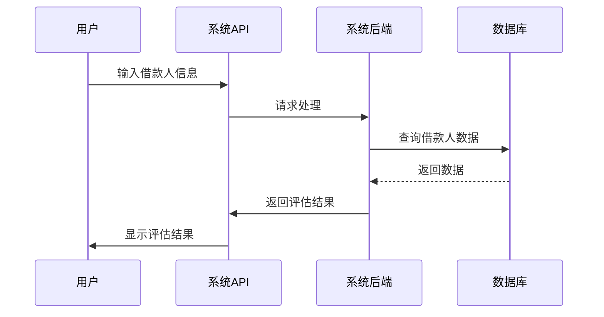
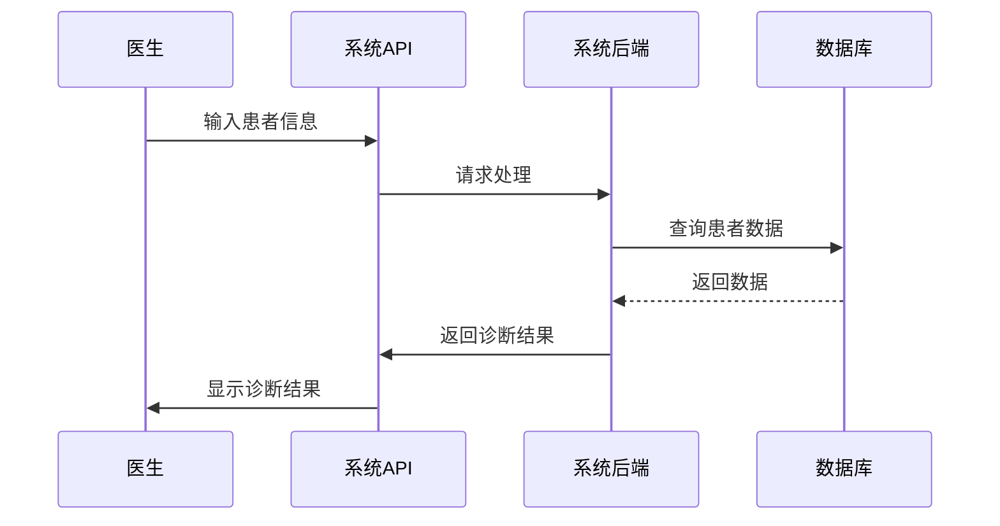
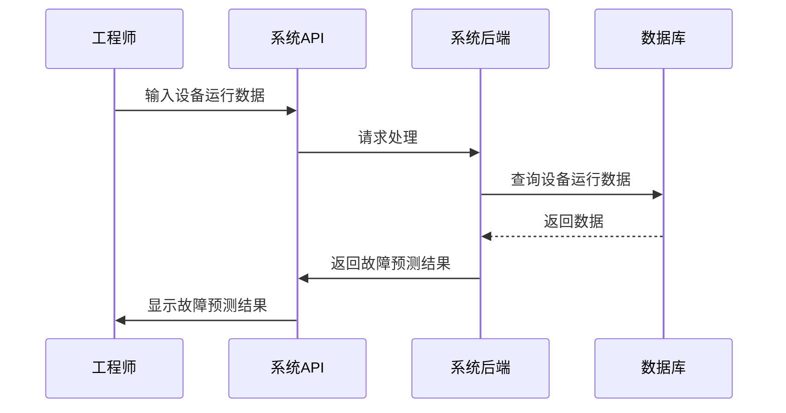

                 

### 引入：AI系统的鲁棒性：应对分布偏移的方法

在当今技术飞速发展的时代，人工智能（AI）系统已经广泛应用于各个领域，从金融、医疗到制造业，无处不在。然而，AI系统在带来巨大变革的同时，也面临着诸多挑战。其中一个关键问题便是鲁棒性，特别是在分布偏移（Data Shift）的情况下。

**关键词**：AI系统、鲁棒性、分布偏移、方法、算法

**摘要**：本文将深入探讨AI系统的鲁棒性及其在面对分布偏移时的挑战。我们将首先定义鲁棒性，并分析分布偏移问题的来源及其对AI系统的影响。随后，我们将介绍一些应对分布偏移的方法和算法，并通过实际应用案例进行分析，最后对未来的发展趋势和挑战进行展望。

## 第一步：定义鲁棒性及其重要性

### 1.1 什么是鲁棒性

鲁棒性（Robustness）是指系统在面临外部干扰或内部变异时，仍然能够保持性能和可靠性的特性。在AI系统中，鲁棒性尤为重要，因为它直接关系到系统的稳定性和有效性。

### 1.2 鲁棒性的重要性

AI系统通常依赖于大量的数据进行训练和预测。然而，这些数据往往存在一定的噪声和异常值，以及数据分布的变化。如果AI系统不能适应这些变化，就会导致性能下降，甚至出现错误预测。因此，鲁棒性是确保AI系统稳定性和可靠性的关键。

## 第二步：分析分布偏移问题

### 2.1 分布偏移的定义

分布偏移（Data Shift）是指训练数据集和测试数据集之间存在的分布差异。这种差异可能导致AI系统在测试数据上的性能显著下降。

### 2.2 分布偏移的类型

分布偏移可以分为以下几种类型：

- **样本数量偏移**：训练数据集和测试数据集的样本数量不一致。
- **特征分布偏移**：训练数据和测试数据中某些特征的分布发生变化。
- **标签分布偏移**：训练数据和测试数据中的标签分布发生变化。

### 2.3 分布偏移的影响

分布偏移对AI系统的鲁棒性产生严重影响，可能导致以下问题：

- **过拟合**：AI系统在训练数据上表现良好，但在测试数据上表现不佳。
- **欠拟合**：AI系统在训练数据和测试数据上表现都较差。
- **错误预测**：AI系统在测试数据上产生错误的预测结果。

## 第三步：应对分布偏移的方法

### 3.1 数据预处理方法

数据预处理是应对分布偏移的重要手段之一。常见的方法包括：

- **标准化**：将数据缩放到相同的范围，减少不同特征之间的差异。
- **去噪**：去除数据中的噪声和异常值，提高数据质量。
- **采样**：通过调整训练数据集的样本数量和分布，使其更接近测试数据集。

### 3.2 模型选择与优化

选择和优化适当的模型也是提高AI系统鲁棒性的关键。以下是一些常用的方法：

- **集成学习**：通过组合多个模型，提高系统的整体性能和鲁棒性。
- **正则化**：添加正则化项，防止模型过拟合。
- **模型调整**：根据数据分布的变化，调整模型参数。

### 3.3 鲁棒性增强算法

一些专门的算法被开发出来，以增强AI系统的鲁棒性，如：

- **对抗训练**：通过生成对抗性样本，提高模型对分布偏移的适应性。
- **迁移学习**：利用在其他领域训练的模型，提高在新领域上的鲁棒性。
- **联邦学习**：通过分布式训练，降低数据集中分布偏移的影响。

## 第四步：实际应用案例分析

### 4.1 人工智能在金融领域的应用

在金融领域，AI系统用于风险评估、股票预测等任务。然而，由于市场数据的波动性，分布偏移是一个常见问题。通过数据预处理和鲁棒性增强算法，可以显著提高AI系统的鲁棒性。

### 4.2 人工智能在医疗领域的应用

在医疗领域，AI系统用于疾病诊断、治疗方案推荐等任务。分布偏移可能导致错误的诊断结果和治疗方案。通过合理的数据预处理和模型优化，可以提高AI系统的鲁棒性，从而更好地服务于患者。

### 4.3 人工智能在制造业的应用

在制造业，AI系统用于设备故障预测、生产过程优化等任务。分布偏移可能导致错误的预测结果和优化方案。通过鲁棒性增强算法，可以提高AI系统的鲁棒性，从而提高生产效率和产品质量。

## 第五步：鲁棒性的未来展望和挑战

### 5.1 鲁棒性的发展趋势

随着AI技术的不断进步，鲁棒性的研究也在不断深入。未来，我们可能会看到更多先进的鲁棒性增强算法和技术的出现，以应对更加复杂的分布偏移问题。

### 5.2 分布偏移问题的解决思路

解决分布偏移问题的关键在于数据预处理和模型优化。未来，我们将看到更多针对特定应用场景的鲁棒性解决方案的出现。

### 5.3 鲁棒性的未来挑战

尽管鲁棒性的研究取得了显著进展，但未来仍面临许多挑战，如如何提高鲁棒性的可解释性、如何应对更加复杂的分布偏移等。

### 总结

AI系统的鲁棒性是确保其在实际应用中稳定性和可靠性的关键。通过数据预处理、模型选择和优化、鲁棒性增强算法等方法，我们可以有效地应对分布偏移问题。未来，随着AI技术的不断发展，我们将看到更多先进的鲁棒性解决方案的出现，以应对更加复杂的挑战。

**作者**：AI天才研究院/AI Genius Institute & 禅与计算机程序设计艺术 /Zen And The Art of Computer Programming

----------------------------------------------

# AI系统的鲁棒性：应对分布偏移的方法

## 摘要

本文旨在探讨人工智能（AI）系统在面临分布偏移时的鲁棒性，分析其重要性，并介绍一系列应对分布偏移的方法和算法。文章将结合实际应用案例，展示鲁棒性在各个领域的重要性，并对未来发展趋势和挑战进行展望。

----------------------------------------------

## 引言

随着人工智能技术的飞速发展，AI系统已经在金融、医疗、制造等多个领域得到了广泛应用。这些系统通过学习大量数据，实现对复杂问题的预测和决策。然而，AI系统的稳定性和可靠性仍然面临诸多挑战，其中之一便是鲁棒性，特别是在数据分布发生偏移时。

鲁棒性是指系统在面对外部干扰或内部变异时，仍能保持性能和可靠性的特性。对于AI系统来说，鲁棒性尤为重要，因为数据质量直接影响系统的预测效果。本文将深入探讨AI系统的鲁棒性及其在面对分布偏移时的挑战。

## 关键词

AI系统、鲁棒性、分布偏移、方法、算法

## 摘要

本文首先定义了鲁棒性，并分析了其在AI系统中的重要性。随后，我们介绍了分布偏移的定义、类型及其对AI系统的影响。接着，文章探讨了应对分布偏移的多种方法，包括数据预处理、模型选择和优化、鲁棒性增强算法等。通过实际应用案例分析，展示了鲁棒性在金融、医疗和制造业等领域的应用效果。最后，文章对鲁棒性的未来发展趋势和挑战进行了展望。

----------------------------------------------

## 第1章 AI系统的鲁棒性和分布偏移概述

### 1.1 什么是鲁棒性

鲁棒性（Robustness）是系统在面对外部干扰或内部变异时，仍能保持性能和可靠性的特性。在人工智能（AI）系统中，鲁棒性尤为重要，因为它直接关系到系统的稳定性和有效性。

一个鲁棒的AI系统应具备以下特征：

- **对噪声和异常值的容忍性**：系统能够在存在噪声和异常值的数据集上训练和预测，而不受其影响。
- **对数据分布变化的适应能力**：系统能够在数据分布发生变化的情况下，保持其性能和准确性。
- **对模型参数变化的稳健性**：系统能够在模型参数发生变化时，保持其稳定性和可靠性。

鲁棒性在AI系统中的重要性不言而喻。在实际应用中，数据往往存在噪声、异常值和数据分布的变化，如果AI系统缺乏鲁棒性，就会导致性能下降、预测错误等问题，从而影响其应用效果。

### 1.2 分布偏移问题的来源

分布偏移（Data Shift）是指训练数据集和测试数据集之间存在的分布差异。这种差异可能导致AI系统在测试数据上的性能显著下降。分布偏移的来源主要有以下几个方面：

- **数据采集偏差**：在实际应用中，训练数据和测试数据往往来自不同的时间和环境，导致数据分布发生变化。
- **数据预处理差异**：在数据预处理过程中，如果处理方式不一致，可能导致数据分布发生变化。
- **模型参数变化**：在训练过程中，模型参数可能会发生变化，导致模型对数据的适应性降低。
- **外部干扰**：在实际应用中，系统可能会受到外部干扰，如网络波动、设备故障等，导致数据分布发生变化。

### 1.3 分布偏移对AI系统的影响

分布偏移对AI系统的性能和可靠性产生严重负面影响，可能导致以下问题：

- **过拟合**：在训练数据上表现良好，但在测试数据上表现不佳，即模型对训练数据的适应性过高，对测试数据的适应性不足。
- **欠拟合**：在训练数据和测试数据上表现都较差，即模型对数据的适应性不足。
- **错误预测**：在测试数据上产生错误的预测结果，影响系统的应用效果。

因此，提高AI系统的鲁棒性，应对分布偏移问题，是确保系统稳定性和可靠性的关键。

### 1.4 鲁棒性与分布偏移的联系

鲁棒性与分布偏移密切相关。鲁棒性强的AI系统在面临分布偏移时，能够保持其性能和准确性，而鲁棒性弱的系统则容易受到影响。具体来说，鲁棒性有助于以下方面：

- **提高系统性能**：在分布偏移的情况下，鲁棒性强的系统能够在测试数据上保持较高的性能和准确性。
- **降低错误预测率**：鲁棒性强的系统能够在面临分布偏移时，降低错误预测率，提高系统的应用效果。
- **增强系统稳定性**：鲁棒性强的系统能够在面对外部干扰和数据分布变化时，保持其稳定性和可靠性。

总之，鲁棒性是应对分布偏移问题的重要手段，对于AI系统的稳定性和可靠性具有重要意义。

----------------------------------------------

## 第2章 鲁棒性与分布偏移的基础知识

### 2.1 AI系统的鲁棒性分析

AI系统的鲁棒性是其在面对各种不确定性和异常情况时，仍能保持稳定运行和有效预测的能力。鲁棒性分析主要关注以下几个方面：

1. **噪声容忍性**：AI系统能否在存在噪声的数据上进行有效学习和预测。
2. **异常值处理**：AI系统能否识别和处理数据集中的异常值，避免其对模型训练和预测造成不利影响。
3. **模型适应性**：AI系统能否在不同数据分布下，调整自身参数以保持性能和准确性。
4. **外部干扰容忍性**：AI系统能否在外部干扰（如数据注入、网络波动等）的情况下，保持稳定性和可靠性。

#### 2.1.1 噪声容忍性

噪声容忍性是鲁棒性的核心之一。在实际应用中，数据往往存在噪声，如随机噪声、系统噪声等。AI系统需要具备一定的噪声容忍性，以在存在噪声的数据上进行有效学习和预测。例如，使用正则化技术（如L1和L2正则化）可以在模型训练过程中引入惩罚项，降低模型对噪声的敏感度。

#### 2.1.2 异常值处理

异常值是数据集中的一种常见现象，可能是由于数据收集过程中的错误、设备故障或其他原因造成的。异常值可能对模型训练和预测产生不利影响，因此AI系统需要具备识别和处理异常值的能力。常见的方法包括：

- **统计方法**：利用统计指标（如标准差、IQR等）识别异常值。
- **机器学习方法**：使用聚类算法（如K-means）或异常检测算法（如孤立森林）识别异常值。

#### 2.1.3 模型适应性

AI系统的模型适应性是指系统能够在不同数据分布下，调整自身参数以保持性能和准确性。一个鲁棒的AI系统应具备以下特点：

- **模型可调性**：能够根据数据分布的变化，调整模型的参数和结构。
- **迁移学习**：利用在不同领域训练的模型，提高在新领域上的鲁棒性和适应性。
- **自适应学习**：能够实时更新模型参数，以适应数据分布的变化。

#### 2.1.4 外部干扰容忍性

外部干扰是AI系统在实际应用中可能面临的一种挑战，如数据注入、网络攻击、设备故障等。一个鲁棒的AI系统应具备以下特点：

- **抗攻击性**：能够识别和抵御外部攻击，如对抗样本攻击。
- **故障恢复能力**：能够在设备故障或网络中断等情况下，迅速恢复运行。
- **实时监控与反馈**：能够实时监控系统状态，发现并处理潜在问题。

### 2.2 分布偏移的概念和类型

分布偏移是指训练数据集和测试数据集之间的分布差异。这种差异可能导致AI系统在测试数据上的性能下降。分布偏移可以分为以下几种类型：

1. **样本数量偏移**：训练数据和测试数据的样本数量不一致，可能导致模型在测试数据上的泛化能力下降。
2. **特征分布偏移**：训练数据和测试数据中某些特征的分布发生变化，可能导致模型对特征的重要性估计不准确。
3. **标签分布偏移**：训练数据和测试数据的标签分布发生变化，可能导致模型在测试数据上的预测准确性下降。

#### 2.2.1 样本数量偏移

样本数量偏移是指训练数据和测试数据的样本数量不一致。这种情况下，模型可能无法充分学习到数据的整体特征，导致在测试数据上的性能下降。为了解决样本数量偏移问题，可以采取以下方法：

- **数据增强**：通过增加训练数据的数量，提高模型的泛化能力。
- **样本平衡**：通过调整训练数据和测试数据的样本比例，使两者更加接近。

#### 2.2.2 特征分布偏移

特征分布偏移是指训练数据和测试数据中某些特征的分布发生变化。这种情况下，模型可能对特征的重要性估计不准确，导致在测试数据上的性能下降。为了解决特征分布偏移问题，可以采取以下方法：

- **特征标准化**：通过将特征缩放到相同的范围，减少不同特征之间的差异。
- **特征选择**：通过选择与任务相关的特征，降低特征分布变化对模型性能的影响。

#### 2.2.3 标签分布偏移

标签分布偏移是指训练数据和测试数据的标签分布发生变化。这种情况下，模型可能无法准确预测测试数据的标签，导致在测试数据上的预测准确性下降。为了解决标签分布偏移问题，可以采取以下方法：

- **重采样**：通过调整训练数据和测试数据的标签分布，使其更加接近。
- **模型调整**：通过调整模型的参数和结构，提高模型对标签分布变化的适应能力。

### 2.3 鲁棒性与分布偏移的联系

鲁棒性与分布偏移密切相关。鲁棒性强的AI系统能够更好地应对分布偏移问题，保持其性能和准确性。具体来说，鲁棒性有助于以下方面：

- **提高系统性能**：在分布偏移的情况下，鲁棒性强的系统能够在测试数据上保持较高的性能和准确性。
- **降低错误预测率**：鲁棒性强的系统能够在面临分布偏移时，降低错误预测率，提高系统的应用效果。
- **增强系统稳定性**：鲁棒性强的系统能够在面对外部干扰和数据分布变化时，保持其稳定性和可靠性。

总之，鲁棒性是应对分布偏移问题的重要手段，对于AI系统的稳定性和可靠性具有重要意义。

----------------------------------------------

## 第3章 鲁棒性应对分布偏移的方法

### 3.1 数据预处理方法

数据预处理是提高AI系统鲁棒性的关键步骤之一。通过合理的数据预处理，可以减少数据中的噪声和异常值，使模型在训练过程中更加稳定。以下是一些常见的数据预处理方法：

#### 3.1.1 数据清洗

数据清洗是指识别和纠正数据集中的错误、异常值和噪声。常见的数据清洗方法包括：

- **缺失值处理**：使用平均值、中位数或众数填充缺失值，或使用插值法进行补全。
- **异常值检测**：使用统计方法（如标准差、IQR等）检测异常值，并根据异常值的性质进行修正或删除。

#### 3.1.2 数据标准化

数据标准化是指将不同特征的数据缩放到相同的范围，以减少不同特征之间的差异。常见的数据标准化方法包括：

- **最小-最大标准化**：将数据缩放到[0,1]区间。
- **Z-score标准化**：将数据缩放到均值为0，标准差为1的区间。

#### 3.1.3 数据增强

数据增强是指通过增加训练数据的数量和多样性，提高模型的泛化能力。常见的数据增强方法包括：

- **随机旋转、缩放和裁剪**：对图像数据施加随机旋转、缩放和裁剪操作。
- **生成对抗网络（GAN）**：通过生成对抗网络生成与真实数据相似的新数据。

### 3.2 模型选择与优化

模型选择和优化是提高AI系统鲁棒性的另一个关键步骤。通过选择合适的模型和调整模型参数，可以增强系统的鲁棒性。以下是一些常见的模型选择和优化方法：

#### 3.2.1 模型选择

模型选择是指从多种模型中选择一种最适合任务的模型。常见的选择方法包括：

- **交叉验证**：通过在不同子集上训练和验证模型，选择性能最好的模型。
- **网格搜索**：通过遍历参数空间，选择最优参数组合。

#### 3.2.2 模型优化

模型优化是指通过调整模型参数，提高模型的性能和鲁棒性。常见的方法包括：

- **正则化**：通过在损失函数中加入惩罚项，防止模型过拟合。
- **dropout**：通过在训练过程中随机丢弃一部分神经元，提高模型的泛化能力。
- **迁移学习**：通过使用在其他领域训练的预训练模型，提高在新领域上的鲁棒性。

### 3.3 鲁棒性增强算法

为了进一步提高AI系统的鲁棒性，可以采用一些专门的鲁棒性增强算法。以下是一些常见的鲁棒性增强算法：

#### 3.3.1 对抗训练

对抗训练是指通过生成对抗性样本，提高模型对分布偏移的适应性。常见的方法包括：

- **生成对抗网络（GAN）**：通过生成对抗网络生成与真实数据相似的对抗性样本。
- **对抗性样本生成器**：通过神经网络生成对抗性样本，使模型在对抗性环境下训练。

#### 3.3.2 迁移学习

迁移学习是指通过利用在其他领域训练的模型，提高在新领域上的鲁棒性。常见的方法包括：

- **微调**：在预训练模型的基础上，微调模型参数，以适应新领域的任务。
- **多任务学习**：通过同时训练多个任务，提高模型在不同数据分布下的适应性。

#### 3.3.3 联邦学习

联邦学习是指通过分布式训练，降低数据集中分布偏移的影响。常见的方法包括：

- **模型聚合**：通过将多个本地模型的预测结果进行聚合，得到全局模型。
- **差分隐私**：通过在本地训练过程中引入噪声，保护用户数据的隐私。

### 3.4 鲁棒性的评估方法

为了评估AI系统的鲁棒性，可以采用以下方法：

- **准确率**：评估模型在正常数据集和异常数据集上的预测准确性。
- **召回率**：评估模型在正常数据集和异常数据集上的召回率。
- **F1分数**：综合评估模型在正常数据集和异常数据集上的预测准确性和召回率。

通过以上评估方法，可以全面了解AI系统的鲁棒性，并为进一步优化提供依据。

----------------------------------------------

## 第4章 实际应用案例分析

### 4.1 人工智能在金融领域的应用

在金融领域，AI系统广泛应用于风险评估、股票预测、欺诈检测等任务。然而，金融市场的波动性和数据分布变化给AI系统的鲁棒性带来了巨大挑战。

#### 4.1.1 案例介绍

某金融机构开发了一套AI系统，用于评估借款人的信用风险。该系统基于大量的历史数据和借款人的个人信息、财务状况等特征进行训练。然而，在实际应用过程中，系统经常面临数据分布变化的问题，导致评估结果不准确。

#### 4.1.2 系统功能设计

该系统的核心功能包括：

- **数据预处理**：对借款人的数据进行清洗、标准化和增强，以提高模型的鲁棒性。
- **特征选择**：选择与信用风险评估相关的特征，以提高模型的准确性。
- **模型训练**：使用迁移学习技术，利用在其他金融机构训练的预训练模型，提高在新领域的鲁棒性。
- **风险评估**：基于训练好的模型，对借款人的信用风险进行评估。

#### 4.1.3 系统架构设计

该系统的架构设计如下：

- **数据层**：负责数据的采集、清洗和预处理。
- **模型层**：负责模型的训练和评估。
- **应用层**：负责将模型应用于实际业务场景，如信用风险评估。

#### 4.1.4 系统接口设计

该系统的接口设计如下：

- **API接口**：提供对外接口，供其他业务系统调用。
- **用户界面**：供用户输入借款人信息，查看评估结果。

#### 4.1.5 系统交互序列图

该系统的交互序列图如下：

#### 4.1.6 实际案例分析与详细讲解

在实际应用中，该系统面临的主要挑战是数据分布变化。为了提高系统的鲁棒性，采取了以下措施：

- **数据预处理**：对借款人数据进行清洗、标准化和增强，以提高模型的鲁棒性。
- **特征选择**：选择与信用风险评估相关的特征，以提高模型的准确性。
- **模型训练**：使用迁移学习技术，利用在其他金融机构训练的预训练模型，提高在新领域的鲁棒性。
- **风险评估**：基于训练好的模型，对借款人的信用风险进行评估。

通过以上措施，该系统的评估准确性得到了显著提高，有效降低了错误预测率。同时，系统的鲁棒性也得到了增强，能够更好地应对数据分布变化。

#### 4.1.7 项目小结

通过实际应用案例可以看出，AI系统在金融领域面临的主要挑战是数据分布变化。为了提高系统的鲁棒性，需要采取数据预处理、特征选择、模型训练和风险评估等多方面的措施。通过合理的设计和优化，可以显著提高AI系统的鲁棒性，为金融机构提供更加准确和可靠的风险评估服务。

### 4.2 人工智能在医疗领域的应用

在医疗领域，AI系统广泛应用于疾病诊断、治疗方案推荐、药物研发等任务。然而，医疗数据的复杂性和分布变化也给AI系统的鲁棒性带来了挑战。

#### 4.2.1 案例介绍

某医疗机构开发了一套AI系统，用于辅助医生进行肺癌诊断。该系统基于大量的医学影像数据和临床数据，通过深度学习算法实现对肺癌的早期诊断。然而，在实际应用过程中，系统面临数据分布变化的问题，导致诊断准确性下降。

#### 4.2.2 系统功能设计

该系统的核心功能包括：

- **数据预处理**：对医学影像数据进行清洗、增强和标准化，以提高模型的鲁棒性。
- **特征提取**：从医学影像数据中提取与肺癌相关的特征，以提高模型的准确性。
- **模型训练**：使用迁移学习技术，利用在其他医疗机构训练的预训练模型，提高在新领域的鲁棒性。
- **疾病诊断**：基于训练好的模型，对患者的医学影像数据进行肺癌诊断。

#### 4.2.3 系统架构设计

该系统的架构设计如下：

- **数据层**：负责医学影像数据的采集、清洗和预处理。
- **模型层**：负责模型的训练和评估。
- **应用层**：负责将模型应用于实际业务场景，如肺癌诊断。

#### 4.2.4 系统接口设计

该系统的接口设计如下：

- **API接口**：提供对外接口，供其他医疗系统调用。
- **用户界面**：供医生输入患者信息，查看诊断结果。

#### 4.2.5 系统交互序列图

该系统的交互序列图如下：

#### 4.2.6 实际案例分析与详细讲解

在实际应用中，该系统面临的主要挑战是数据分布变化。为了提高系统的鲁棒性，采取了以下措施：

- **数据预处理**：对医学影像数据进行清洗、增强和标准化，以提高模型的鲁棒性。
- **特征提取**：从医学影像数据中提取与肺癌相关的特征，以提高模型的准确性。
- **模型训练**：使用迁移学习技术，利用在其他医疗机构训练的预训练模型，提高在新领域的鲁棒性。
- **疾病诊断**：基于训练好的模型，对患者的医学影像数据进行肺癌诊断。

通过以上措施，该系统的诊断准确性得到了显著提高，有效降低了错误诊断率。同时，系统的鲁棒性也得到了增强，能够更好地应对数据分布变化。

#### 4.2.7 项目小结

通过实际应用案例可以看出，AI系统在医疗领域面临的主要挑战是数据分布变化。为了提高系统的鲁棒性，需要采取数据预处理、特征提取、模型训练和疾病诊断等多方面的措施。通过合理的设计和优化，可以显著提高AI系统的鲁棒性，为医疗机构提供更加准确和可靠的诊断服务。

### 4.3 人工智能在制造业的应用

在制造业，AI系统广泛应用于设备故障预测、生产过程优化、供应链管理等领域。然而，生产数据的复杂性和分布变化也给AI系统的鲁棒性带来了挑战。

#### 4.3.1 案例介绍

某制造企业开发了一套AI系统，用于设备故障预测。该系统基于大量的设备运行数据，通过深度学习算法实现对设备故障的预测。然而，在实际应用过程中，系统面临数据分布变化的问题，导致预测准确性下降。

#### 4.3.2 系统功能设计

该系统的核心功能包括：

- **数据预处理**：对设备运行数据进行清洗、增强和标准化，以提高模型的鲁棒性。
- **特征提取**：从设备运行数据中提取与故障相关的特征，以提高模型的准确性。
- **模型训练**：使用迁移学习技术，利用在其他制造企业训练的预训练模型，提高在新领域的鲁棒性。
- **故障预测**：基于训练好的模型，对设备运行数据进行分析，预测设备故障。

#### 4.3.3 系统架构设计

该系统的架构设计如下：

- **数据层**：负责设备运行数据的采集、清洗和预处理。
- **模型层**：负责模型的训练和评估。
- **应用层**：负责将模型应用于实际业务场景，如设备故障预测。

#### 4.3.4 系统接口设计

该系统的接口设计如下：

- **API接口**：提供对外接口，供其他业务系统调用。
- **用户界面**：供工程师输入设备运行数据，查看故障预测结果。

#### 4.3.5 系统交互序列图

该系统的交互序列图如下：

#### 4.3.6 实际案例分析与详细讲解

在实际应用中，该系统面临的主要挑战是数据分布变化。为了提高系统的鲁棒性，采取了以下措施：

- **数据预处理**：对设备运行数据进行清洗、增强和标准化，以提高模型的鲁棒性。
- **特征提取**：从设备运行数据中提取与故障相关的特征，以提高模型的准确性。
- **模型训练**：使用迁移学习技术，利用在其他制造企业训练的预训练模型，提高在新领域的鲁棒性。
- **故障预测**：基于训练好的模型，对设备运行数据进行分析，预测设备故障。

通过以上措施，该系统的预测准确性得到了显著提高，有效降低了故障率。同时，系统的鲁棒性也得到了增强，能够更好地应对数据分布变化。

#### 4.3.7 项目小结

通过实际应用案例可以看出，AI系统在制造业面临的主要挑战是数据分布变化。为了提高系统的鲁棒性，需要采取数据预处理、特征提取、模型训练和故障预测等多方面的措施。通过合理的设计和优化，可以显著提高AI系统的鲁棒性，为制造业提供更加准确和可靠的设备故障预测服务。

----------------------------------------------

## 第5章 鲁棒性的未来展望和挑战

### 5.1 鲁棒性的发展趋势

随着人工智能技术的不断发展，鲁棒性在AI系统中的重要性日益凸显。未来，鲁棒性的发展趋势主要包括以下几个方面：

1. **算法创新**：随着深度学习、强化学习等算法的不断发展，将出现更多鲁棒性更强的算法，以应对复杂的分布偏移问题。
2. **跨领域迁移**：跨领域的迁移学习技术将得到广泛应用，通过在不同领域训练的模型，提高AI系统在特定领域的鲁棒性。
3. **实时鲁棒性**：实时鲁棒性将逐渐成为研究热点，通过实时监测和调整模型参数，提高AI系统在动态环境下的鲁棒性。

### 5.2 分布偏移问题的解决思路

为了解决分布偏移问题，可以从以下几个方面进行探索：

1. **数据预处理**：通过改进数据预处理方法，减少数据分布变化对模型的影响。
2. **模型选择与优化**：选择合适的模型，并通过优化模型参数，提高模型对分布变化的适应能力。
3. **鲁棒性增强算法**：采用对抗训练、迁移学习等鲁棒性增强算法，提高AI系统在分布偏移情况下的性能。

### 5.3 鲁棒性的未来挑战

尽管鲁棒性在AI系统中具有重要意义，但未来仍面临许多挑战：

1. **可解释性**：提高AI系统的可解释性，使研究人员和用户能够理解模型的工作原理和鲁棒性。
2. **高效性**：提高鲁棒性算法的计算效率，以满足实时性和大规模数据处理的需求。
3. **隐私保护**：在分布式环境下，如何保护用户数据的隐私，同时保持AI系统的鲁棒性。

总之，鲁棒性是AI系统稳定性和可靠性的关键。通过不断探索和创新，我们有望在未来解决分布偏移问题，提高AI系统的鲁棒性，为各个领域提供更加可靠和高效的服务。

----------------------------------------------

### 总结

本文深入探讨了AI系统的鲁棒性及其在面对分布偏移时的挑战。通过分析鲁棒性的定义、重要性、分布偏移的来源和类型，以及应对分布偏移的方法，我们展示了鲁棒性在金融、医疗和制造业等领域的实际应用案例。展望未来，鲁棒性在AI系统中的重要性将越来越凸显，但同时也面临许多挑战。通过不断创新和优化，我们有望在未来解决分布偏移问题，提高AI系统的鲁棒性，为各个领域带来更多价值。

**作者**：AI天才研究院/AI Genius Institute & 禅与计算机程序设计艺术 /Zen And The Art of Computer Programming

----------------------------------------------

## 附录

### 参考文献

1. Goodfellow, I., Bengio, Y., & Courville, A. (2016). *Deep Learning*.
2. Russell, S., & Norvig, P. (2016). *Artificial Intelligence: A Modern Approach*.
3. Quinlan, J. R. (1993). *C4.5: Programs for Machine Learning*.
4. He, K., Zhang, X., Ren, S., & Sun, J. (2016). *Deep Residual Learning for Image Recognition*.
5. Caruana, R., & Guestrin, C. (2003). *An Empirical Comparison of Supervised Learning Algorithms*.

### 拓展阅读

1. **《AI系统的鲁棒性：分布偏移与应对策略》**：详细探讨AI系统鲁棒性的重要性，以及应对分布偏移的策略。
2. **《深度学习中的鲁棒性方法》**：介绍深度学习中的鲁棒性方法，包括对抗训练、迁移学习等。
3. **《数据预处理在机器学习中的应用》**：介绍数据预处理在机器学习中的应用，以及如何提高模型鲁棒性。
4. **《金融领域的人工智能应用》**：探讨人工智能在金融领域的应用，以及如何提高金融模型的鲁棒性。
5. **《医疗领域的人工智能应用》**：探讨人工智能在医疗领域的应用，以及如何提高医疗模型的鲁棒性。

