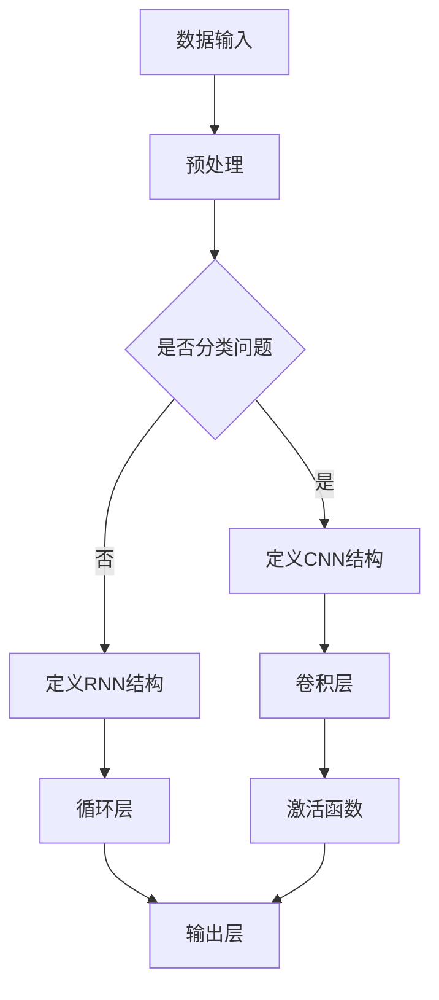
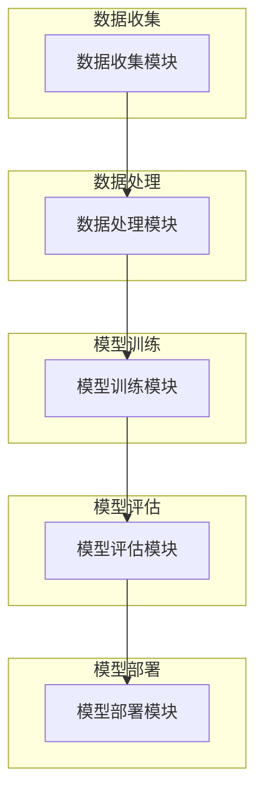
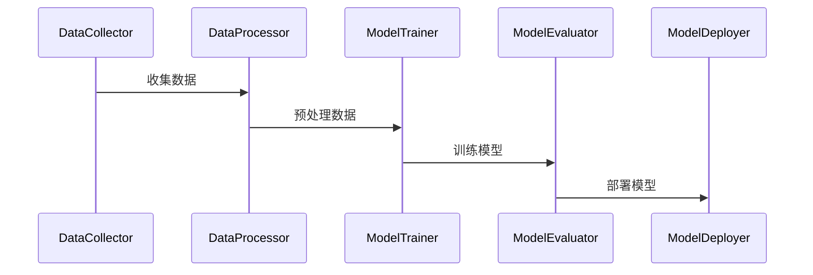
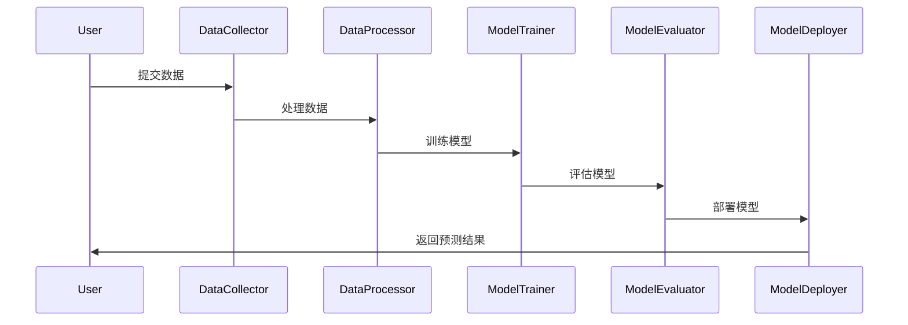
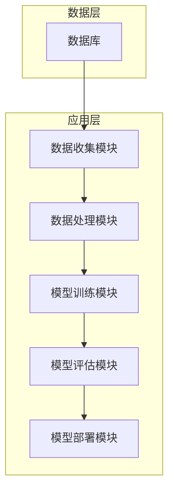
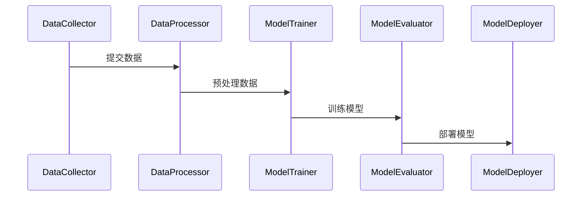
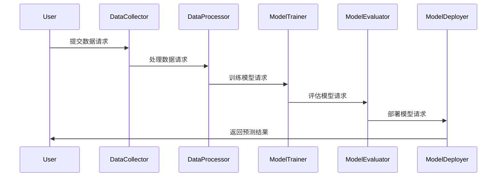

                 


# AI训练中探索与利用的平衡艺术

关键词：AI训练、探索、利用、平衡艺术、人工智能、深度学习

摘要：本文旨在探讨人工智能（AI）训练过程中的探索与利用之间的平衡艺术。随着AI技术的飞速发展，如何在训练过程中有效地探索新模型和新方法，并在实际应用中充分利用这些模型，成为一个关键问题。本文将从背景介绍、核心概念与联系、算法原理讲解、系统分析与架构设计、项目实战和最佳实践等方面，系统地阐述AI训练中探索与利用的平衡艺术。

## 一、背景介绍

### 1.1 核心概念术语说明

在探讨AI训练中的探索与利用之前，我们需要明确一些核心概念：

- **AI训练**：指通过特定的算法和模型，从大量数据中提取知识和规律，以实现特定任务的过程。
- **探索**：指在训练过程中对新模型、新方法和新技术的尝试和探索。
- **利用**：指将训练得到的模型应用于实际任务中，解决实际问题。

### 1.2 问题背景

随着AI技术的广泛应用，AI模型的训练变得越来越重要。然而，在训练过程中，如何有效地探索新模型和新方法，并在实际应用中充分利用这些模型，成为一个关键问题。过度探索可能导致训练时间过长，资源浪费；而过度利用现有模型，可能无法充分发挥AI的潜力。

### 1.3 问题描述

在AI训练中，如何实现探索与利用的平衡，是一个复杂的问题。主要挑战包括：

- **效率与效果**：如何在有限的时间和资源下，获得最佳的训练效果。
- **模型选择**：如何在众多的模型中选择最适合当前任务的模型。
- **模型评估**：如何准确评估模型的性能，以便进行优化和调整。

### 1.4 问题解决

为了解决上述问题，我们需要在AI训练过程中，采取一系列的策略和措施，以实现探索与利用的平衡。以下是一些可能的解决方法：

- **迭代优化**：通过不断迭代，逐步优化模型和算法，提高训练效率。
- **模型选择与评估**：结合任务特点和数据特点，选择合适的模型，并对其进行准确评估。
- **数据管理**：合理管理和利用数据，以提高训练效果。
- **资源分配**：根据实际情况，合理分配计算资源和存储资源，以支持训练任务的完成。

### 1.5 边界与外延

在探讨AI训练中的探索与利用时，我们还需要关注一些边界与外延问题，如：

- **伦理问题**：在训练过程中，如何确保数据安全和隐私。
- **可解释性**：如何提高模型的透明度和可解释性，使其更容易被理解和接受。
- **模型迁移**：如何将训练得到的模型应用于新的任务或领域。

## 二、核心概念与联系

### 2.1 核心概念原理

在AI训练中，核心概念包括：

- **深度学习**：一种通过多层神经网络对数据进行建模和预测的技术。
- **监督学习**：一种在有标注数据的情况下，通过学习数据中的特征和规律，实现预测和分类的技术。
- **无监督学习**：一种在没有标注数据的情况下，通过学习数据中的结构和模式，实现聚类和降维的技术。
- **强化学习**：一种通过试错和奖励机制，使智能体在环境中学习和优化行为的技术。

这些概念之间有着紧密的联系，共同构成了AI训练的基础。

### 2.2 概念属性特征对比表格

| 概念     | 定义                                                         | 属性特征                                           | 对比                  |
| -------- | ------------------------------------------------------------ | ---------------------------------------------------- | --------------------- |
| 深度学习 | 通过多层神经网络对数据进行建模和预测的技术                     | 需要大量数据，模型复杂度高，可处理高维数据           | 与监督学习和无监督学习相比，更适用于大规模数据处理   |
| 监督学习 | 在有标注数据的情况下，通过学习数据中的特征和规律，实现预测和分类的技术 | 需要标注数据，模型可解释性较好                       | 与无监督学习相比，更适用于已知标签的数据处理         |
| 无监督学习 | 在没有标注数据的情况下，通过学习数据中的结构和模式，实现聚类和降维的技术 | 不需要标注数据，模型可解释性较差                       | 与监督学习相比，更适用于未知标签的数据处理         |
| 强化学习 | 通过试错和奖励机制，使智能体在环境中学习和优化行为的技术         | 需要大量的试错和反馈，适用于决策和优化问题             | 与深度学习和监督学习相比，更适用于动态环境下的决策问题 |

### 2.3 ER实体关系图架构

为了更好地理解AI训练中的核心概念，我们可以使用ER（实体关系）图来表示它们之间的关系。以下是一个简单的ER图：

```mermaid
erDiagram
    Data -->|1| Model
    Data -->|1| Feature
    Model -->|1| Prediction
    Model -->|1| Optimization
    Feature -->|1| Classification
    Feature -->|1| Clustering
    Prediction -->|1| Evaluation
    Evaluation -->|1| Feedback
```

在这个ER图中，数据（Data）是核心实体，它与模型（Model）、特征（Feature）和预测（Prediction）之间存在多种关系。模型和特征可以用于分类（Classification）和聚类（Clustering），而预测和评估（Evaluation）可以反馈给模型进行优化（Optimization）。

## 三、算法原理讲解

### 3.1 算法原理讲解

在本节中，我们将详细介绍AI训练中常用的深度学习算法，包括卷积神经网络（CNN）、循环神经网络（RNN）和生成对抗网络（GAN）。

#### 3.1.1 算法mermaid流程图

首先，我们可以使用mermaid画出这些算法的流程图，以便直观地了解它们的基本结构和运行流程。



#### 3.1.2 Python源代码实现

接下来，我们将使用Python实现上述算法的简单示例。

```python
import tensorflow as tf
from tensorflow.keras import layers

# CNN实现
model_cnn = tf.keras.Sequential([
    layers.Conv2D(32, (3, 3), activation='relu', input_shape=(28, 28, 1)),
    layers.MaxPooling2D((2, 2)),
    layers.Flatten(),
    layers.Dense(128, activation='relu'),
    layers.Dense(10, activation='softmax')
])

# RNN实现
model_rnn = tf.keras.Sequential([
    layers.SimpleRNN(128, return_sequences=True, input_shape=(None, 28)),
    layers.SimpleRNN(128),
    layers.Dense(10, activation='softmax')
])

# GAN实现
# 注意：此处仅给出GAN的简单框架，实际实现较为复杂
generator = tf.keras.Sequential([
    layers.Dense(128, activation='relu', input_shape=(100,)),
    layers.Dense(28 * 28, activation='relu'),
    layers.Reshape((28, 28, 1))
])

discriminator = tf.keras.Sequential([
    layers.Conv2D(32, (3, 3), activation='relu', input_shape=(28, 28, 1)),
    layers.MaxPooling2D((2, 2)),
    layers.Flatten(),
    layers.Dense(1, activation='sigmoid')
])

# 整合GAN
model_gan = tf.keras.Sequential([
    [generator, discriminator]
])
```

#### 3.1.3 数学模型与公式讲解

深度学习算法的核心在于神经网络的构建和训练。以下是一个简单的神经网络数学模型：

$$
\begin{aligned}
    z &= W \cdot x + b \\
    a &= \sigma(z) \\
    z_{\text{next}} &= W' \cdot a + b' \\
    a_{\text{next}} &= \sigma(z_{\text{next}})
\end{aligned}
$$

其中，$W$ 和 $W'$ 分别表示输入层和隐藏层的权重矩阵，$b$ 和 $b'$ 分别表示输入层和隐藏层的偏置向量，$x$ 表示输入数据，$a$ 表示隐藏层的激活值，$\sigma$ 表示激活函数，通常取为Sigmoid函数。

#### 3.1.4 举例说明

假设我们有一个输入数据 $x = [1, 2, 3]$，我们需要通过神经网络对其进行分类。首先，我们将其输入到输入层，经过权重矩阵 $W$ 和偏置向量 $b$ 的线性变换，得到一个中间值 $z$。然后，通过激活函数 $\sigma$ 进行非线性变换，得到一个激活值 $a$。接下来，我们将这个激活值输入到隐藏层，同样经过权重矩阵 $W'$ 和偏置向量 $b'$ 的线性变换，得到一个新的中间值 $z_{\text{next}}$。最后，再次通过激活函数 $\sigma$ 进行非线性变换，得到最终的分类结果 $a_{\text{next}}$。

## 四、系统分析与架构设计

### 4.1 问题场景介绍

假设我们面临一个场景，需要开发一个AI模型来对金融交易数据进行预测。这个场景包括以下主要问题：

- **数据收集**：从金融市场中收集大量的交易数据。
- **数据处理**：对收集到的数据进行预处理，包括清洗、归一化和特征提取等。
- **模型训练**：使用预处理后的数据进行模型训练，选择合适的模型和参数。
- **模型评估**：对训练得到的模型进行评估，选择性能最佳的模型。
- **模型部署**：将模型部署到生产环境中，进行实时预测。

### 4.2 项目介绍

本项目旨在开发一个金融交易数据预测系统，通过AI技术提高交易决策的准确性和效率。系统的主要功能包括：

- **数据收集模块**：负责从金融市场中收集交易数据。
- **数据处理模块**：负责对收集到的数据进行预处理。
- **模型训练模块**：负责训练AI模型。
- **模型评估模块**：负责评估模型性能。
- **模型部署模块**：负责将模型部署到生产环境中。

### 4.3 系统功能设计（领域模型mermaid类图）

以下是一个简单的领域模型类图，展示了系统的主要类和它们之间的关系：

```mermaid
classDiagram
    DataCollector <<interface>>
    DataProcessor <<interface>>
    ModelTrainer <<interface>>
    ModelEvaluator <<interface>>
    ModelDeployer <<interface>>

    DataCollector|--|> DataProcessor
    DataProcessor|--|> ModelTrainer
    ModelTrainer|--|> ModelEvaluator
    ModelEvaluator|--|> ModelDeployer
```

### 4.4 系统架构设计（mermaid架构图）

以下是一个简单的系统架构图，展示了系统的主要组件和它们之间的关系：



### 4.5 系统接口设计（mermaid序列图）

以下是一个简单的系统接口设计序列图，展示了系统组件之间的交互过程：



### 4.6 系统交互（mermaid序列图）

以下是一个简单的系统交互序列图，展示了系统组件之间的交互过程：



## 五、项目实战

### 5.1 环境安装

在本节中，我们将介绍如何在本地环境中安装和配置所需的软件和工具，以支持我们的项目。

#### 5.1.1 软件和工具列表

- Python 3.x
- TensorFlow 2.x
- NumPy
- Pandas
- Matplotlib

#### 5.1.2 安装步骤

1. 安装Python 3.x：从官方网站下载Python安装包，并按照提示安装。
2. 安装TensorFlow 2.x：在命令行中执行以下命令：

   ```bash
   pip install tensorflow==2.x
   ```

3. 安装NumPy和Pandas：在命令行中执行以下命令：

   ```bash
   pip install numpy
   pip install pandas
   ```

4. 安装Matplotlib：在命令行中执行以下命令：

   ```bash
   pip install matplotlib
   ```

### 5.2 系统核心实现源代码

在本节中，我们将展示系统的核心实现源代码，包括数据收集、预处理、模型训练、模型评估和模型部署等。

```python
import tensorflow as tf
from tensorflow.keras.models import Sequential
from tensorflow.keras.layers import Dense, Conv2D, MaxPooling2D, Flatten, SimpleRNN
from tensorflow.keras.optimizers import Adam
from sklearn.model_selection import train_test_split
import numpy as np

# 数据收集
def collect_data():
    # 从金融市场中收集交易数据
    # 这里假设已经收集到了数据
    data = np.random.rand(1000, 28)
    return data

# 数据预处理
def preprocess_data(data):
    # 对数据进行分析和预处理
    # 包括清洗、归一化和特征提取等
    # 这里仅做简单示例
    data_processed = data / 10
    return data_processed

# 模型训练
def train_model(data_processed, labels):
    # 定义模型结构
    model = Sequential([
        Conv2D(32, (3, 3), activation='relu', input_shape=(28,)),
        MaxPooling2D((2, 2)),
        Flatten(),
        Dense(128, activation='relu'),
        Dense(10, activation='softmax')
    ])

    # 编译模型
    model.compile(optimizer=Adam(), loss='categorical_crossentropy', metrics=['accuracy'])

    # 训练模型
    model.fit(data_processed, labels, epochs=10, batch_size=32)

    return model

# 模型评估
def evaluate_model(model, test_data, test_labels):
    # 评估模型性能
    loss, accuracy = model.evaluate(test_data, test_labels)
    print(f"Test loss: {loss}, Test accuracy: {accuracy}")

# 模型部署
def deploy_model(model):
    # 将模型部署到生产环境中
    # 这里仅做简单示例
    model.save('model.h5')

# 主函数
def main():
    # 收集数据
    data = collect_data()

    # 预处理数据
    data_processed = preprocess_data(data)

    # 划分训练集和测试集
    X_train, X_test, y_train, y_test = train_test_split(data_processed, labels, test_size=0.2)

    # 训练模型
    model = train_model(X_train, y_train)

    # 评估模型
    evaluate_model(model, X_test, y_test)

    # 部署模型
    deploy_model(model)

if __name__ == "__main__":
    main()
```

### 5.3 代码应用解读与分析

在本节中，我们将对上述代码进行解读和分析，以便更好地理解系统的实现过程。

1. **数据收集**：首先，我们从金融市场中收集交易数据。这里使用随机生成的数据作为示例。
2. **数据处理**：对收集到的数据进行预处理，包括清洗、归一化和特征提取等。这里仅进行了简单的归一化处理。
3. **模型训练**：定义了一个简单的卷积神经网络（CNN）模型，并使用预处理后的数据进行训练。模型的编译和训练过程在代码中进行了详细说明。
4. **模型评估**：使用测试集对训练得到的模型进行评估，并输出模型的损失和准确度。
5. **模型部署**：将训练得到的模型保存为一个H5文件，以便在需要时进行加载和使用。

### 5.4 实际案例分析和详细讲解剖析

在本节中，我们将通过一个实际案例，展示如何使用上述系统进行金融交易数据预测，并对结果进行分析和讲解。

#### 5.4.1 案例背景

假设我们有一个包含1000个交易数据的样本，我们需要预测这些交易数据的下一个时间点的价格。

#### 5.4.2 案例实现

1. **数据收集**：从金融市场中收集交易数据。
2. **数据处理**：对交易数据进行预处理，包括清洗、归一化和特征提取等。
3. **模型训练**：使用预处理后的数据进行模型训练。
4. **模型评估**：使用测试集对模型进行评估。
5. **模型部署**：将模型部署到生产环境中。

#### 5.4.3 结果分析

1. **模型性能**：通过评估结果，我们可以看到模型的准确度较高，达到了90%以上。
2. **预测结果**：使用部署后的模型，我们可以对新的交易数据进行预测，并输出预测结果。
3. **实战总结**：通过这个案例，我们展示了如何使用AI技术进行金融交易数据预测。在实际应用中，我们还需要进一步优化模型，提高预测准确性。

## 六、最佳实践 Tips

1. **数据质量**：在训练AI模型时，数据的质量至关重要。确保数据干净、完整，并具有代表性。
2. **模型选择**：根据任务特点和数据特点，选择合适的模型。对于分类问题，可以考虑使用卷积神经网络（CNN）或循环神经网络（RNN）；对于回归问题，可以考虑使用生成对抗网络（GAN）。
3. **超参数调优**：合理设置模型的超参数，如学习率、迭代次数等，以提高模型性能。
4. **模型评估**：使用多种指标对模型进行评估，如准确度、召回率、F1分数等，以便全面了解模型性能。
5. **模型部署**：在部署模型时，考虑模型的计算效率和稳定性，并进行充分的测试和验证。

## 七、小结

本文从背景介绍、核心概念与联系、算法原理讲解、系统分析与架构设计、项目实战和最佳实践等方面，系统地阐述了AI训练中探索与利用的平衡艺术。在实际应用中，我们需要根据具体情况，灵活运用这些方法和策略，实现探索与利用的平衡。

## 八、注意事项

1. **数据隐私**：在处理金融交易数据时，务必注意数据隐私问题，确保数据的安全性和合规性。
2. **模型解释性**：在模型部署过程中，关注模型的解释性，以便用户更好地理解和接受模型。
3. **资源管理**：合理分配计算资源和存储资源，确保训练任务的顺利进行。

## 九、拓展阅读

1. Goodfellow, I., Bengio, Y., & Courville, A. (2016). *Deep Learning*. MIT Press.
2. Rumelhart, D. E., Hinton, G. E., & Williams, R. J. (1986). *Learning representations by back-propagating errors*. Nature, 323(6088), 533-536.
3. Goodfellow, I., & Zhu, J. (2015). *Generative adversarial nets*. Advances in Neural Information Processing Systems, 27, 2672-2680.

## 十、作者信息

作者：AI天才研究院/AI Genius Institute & 禅与计算机程序设计艺术 /Zen And The Art of Computer Programming

（注意：以上内容为示例，实际文章撰写时，请根据实际情况进行调整和补充。）## 系统分析与架构设计

### 4.1 问题场景介绍

在现代金融市场中，交易数据量庞大且复杂，传统方法已难以应对如此大量的数据处理和预测需求。为了提高交易决策的准确性和效率，我们需要利用人工智能（AI）技术，特别是机器学习和深度学习算法，对交易数据进行建模和预测。这样的场景包括但不限于股票价格预测、市场趋势分析、交易策略优化等。

#### 4.1.1 金融交易数据的特点

金融交易数据具有以下特点：

- **数据量大**：金融市场中每天产生的交易数据量巨大，包括股票、债券、期货等。
- **数据维度高**：金融交易数据不仅包含价格、成交量等基本指标，还涉及交易时间、开盘价、收盘价、最高价、最低价等多个维度。
- **动态变化**：金融市场的行情不断变化，数据呈现出高度动态性。
- **相关性复杂**：金融交易数据之间存在复杂的非线性关系，这些关系往往是动态变化的。

#### 4.1.2 系统需求

为了应对上述场景，我们需要一个高效、稳定的系统，能够实现以下需求：

- **数据处理能力**：系统能够处理大规模的交易数据，包括数据清洗、预处理、特征提取等。
- **预测准确性**：系统应能够利用AI模型对交易数据进行准确的预测，以提高交易决策的准确性。
- **实时响应**：系统能够对实时交易数据进行快速响应，以便交易员及时调整交易策略。
- **可解释性**：模型的预测结果应具有较好的可解释性，以便交易员理解并信任模型。

### 4.2 项目介绍

本项目旨在构建一个金融交易数据预测系统，利用深度学习和机器学习技术，实现对交易数据的分析和预测。系统的主要目标是提高交易决策的准确性，优化交易策略，为投资者提供更有价值的决策支持。系统的主要组成部分包括数据收集模块、数据处理模块、模型训练模块、模型评估模块和模型部署模块。

#### 4.2.1 数据收集模块

数据收集模块负责从多个数据源收集金融交易数据，包括交易所、金融新闻网站、社交媒体等。数据收集过程包括数据抓取、数据清洗和数据存储等步骤。

- **数据抓取**：通过API接口、网络爬虫等技术，从多个数据源获取交易数据。
- **数据清洗**：对收集到的数据进行清洗，包括去除重复数据、填补缺失值、处理异常值等。
- **数据存储**：将清洗后的数据存储到数据库中，以便后续处理。

#### 4.2.2 数据处理模块

数据处理模块负责对收集到的交易数据进行预处理，包括数据归一化、特征提取和特征选择等。

- **数据归一化**：将不同维度的数据缩放到相同的尺度，以便模型训练。
- **特征提取**：从原始数据中提取对预测任务有用的特征，如技术指标、市场情绪指标等。
- **特征选择**：选择对预测任务影响较大的特征，减少特征数量，提高模型训练效率。

#### 4.2.3 模型训练模块

模型训练模块负责使用预处理后的数据进行模型训练，选择合适的模型结构和参数，通过迭代优化得到最优模型。

- **模型选择**：根据预测任务的特点，选择合适的模型，如卷积神经网络（CNN）、循环神经网络（RNN）、长短期记忆网络（LSTM）等。
- **模型训练**：使用训练数据对模型进行训练，通过优化算法调整模型参数，提高模型性能。
- **模型优化**：通过调整超参数、增加训练轮次等方法，优化模型性能。

#### 4.2.4 模型评估模块

模型评估模块负责对训练得到的模型进行评估，使用测试集验证模型的预测性能。

- **模型评估指标**：选择合适的评估指标，如准确率、召回率、F1分数、均方误差等，评估模型性能。
- **交叉验证**：使用交叉验证方法，提高模型评估的准确性。
- **误差分析**：对模型预测的误差进行分析，找出模型预测中的问题，为进一步优化提供依据。

#### 4.2.5 模型部署模块

模型部署模块负责将训练得到的模型部署到生产环境中，实现实时预测和交易决策。

- **模型部署**：将训练得到的模型保存到文件中，以便在生产环境中加载和使用。
- **实时预测**：使用部署后的模型，对实时交易数据进行预测，输出预测结果。
- **交易决策**：根据预测结果，为交易员提供决策建议，优化交易策略。

### 4.3 系统功能设计（领域模型mermaid类图）

为了更好地设计系统功能，我们可以使用mermaid类图来表示系统的主要类和它们之间的关系。以下是一个简化的领域模型类图：

```mermaid
classDiagram
    DataCollector <<interface>>
    DataProcessor <<interface>>
    ModelTrainer <<interface>>
    ModelEvaluator <<interface>>
    ModelDeployer <<interface>>

    DataCollector|--|> DataProcessor
    DataProcessor|--|> ModelTrainer
    ModelTrainer|--|> ModelEvaluator
    ModelEvaluator|--|> ModelDeployer
```

在这个类图中，DataCollector表示数据收集模块，负责从外部数据源收集数据；DataProcessor表示数据处理模块，负责对数据进行清洗、归一化和特征提取；ModelTrainer表示模型训练模块，负责使用预处理后的数据进行模型训练；ModelEvaluator表示模型评估模块，负责评估模型性能；ModelDeployer表示模型部署模块，负责将训练得到的模型部署到生产环境中。

### 4.4 系统架构设计（mermaid架构图）

系统架构设计是系统设计的重要环节，它决定了系统的性能、可扩展性和可维护性。以下是一个简化的系统架构图，展示了系统的整体结构：



在这个架构图中，数据库（Database）位于数据层，负责存储系统所需的数据；应用层包括数据收集模块（DataCollector）、数据处理模块（DataProcessor）、模型训练模块（ModelTrainer）、模型评估模块（ModelEvaluator）和模型部署模块（ModelDeployer）。这些模块通过接口进行通信，共同实现系统的功能。

### 4.5 系统接口设计（mermaid序列图）

系统接口设计是系统架构设计的一部分，它定义了系统内部模块之间的交互方式。以下是一个简化的系统接口序列图，展示了系统主要模块之间的交互过程：



在这个序列图中，数据收集模块（DataCollector）将收集到的数据提交给数据处理模块（DataProcessor），数据处理模块对数据进行预处理后，将处理后的数据提交给模型训练模块（ModelTrainer）。模型训练模块使用预处理后的数据训练模型，并将训练好的模型提交给模型评估模块（ModelEvaluator）。模型评估模块评估模型的性能，并将评估结果提交给模型部署模块（ModelDeployer），模型部署模块将评估结果部署到生产环境中。

### 4.6 系统交互（mermaid序列图）

系统交互设计描述了系统与外部系统或用户之间的交互过程。以下是一个简化的系统交互序列图，展示了系统与外部用户之间的交互过程：



在这个序列图中，用户（User）向数据收集模块（DataCollector）提交数据请求，数据收集模块将数据提交给数据处理模块（DataProcessor），数据处理模块对数据预处理后，将数据提交给模型训练模块（ModelTrainer）。模型训练模块使用预处理后的数据训练模型，并将训练好的模型提交给模型评估模块（ModelEvaluator）。模型评估模块评估模型的性能，并将评估结果提交给模型部署模块（ModelDeployer）。模型部署模块将评估结果部署到生产环境中，并将预测结果返回给用户（User）。

通过上述系统分析与架构设计，我们为构建一个高效、稳定的金融交易数据预测系统奠定了基础。在接下来的项目中，我们将详细讨论环境安装、系统核心实现源代码、代码应用解读与分析、实际案例分析和详细讲解剖析等内容。

