                 


### 第3章: 正则化与权重衰减

#### 3.1 正则化

**背景介绍**：

正则化（Regularization）是机器学习中常用的一种技术，其目的是为了防止模型在训练过程中出现过拟合现象。过拟合是指模型在训练数据上表现得非常好，但在验证或测试数据上表现不佳，甚至在未见过的数据上表现极差。这种现象通常发生在模型的复杂度过高时。

**问题背景**：

当我们的模型复杂度过高时，模型会记住训练数据中的噪声和细节，导致在验证集上表现不佳。正则化通过引入一个惩罚项，迫使模型在复杂性和泛化能力之间找到平衡。

**问题描述**：

过拟合模型：模型在训练集上表现很好，但在验证集或测试集上表现较差。

**问题解决**：

正则化的基本思想是在损失函数中加入一个额外的惩罚项，这个惩罚项与模型参数的平方和（或者绝对值和）成正比。这样，当模型参数变化较大时，损失函数的值会增加，从而迫使模型参数变化较小，达到减少过拟合的目的。

**边界与外延**：

正则化可以应用于各种机器学习模型，如线性回归、逻辑回归、神经网络等。

**核心要素组成**：

- 模型参数：模型中需要优化的参数。
- 惩罚项：用于惩罚模型参数的项，通常与参数的平方和（或者绝对值和）成正比。
- 损失函数：综合考虑模型预测误差和惩罚项的函数。

**概念结构与核心概念**：

- 正则化项：通常表示为 $L_2$ 正则化或 $L_1$ 正则化。
- $L_2$ 正则化：惩罚项为模型参数的平方和，即 $\lambda \sum_{i=1}^{n} w_i^2$。
- $L_1$ 正则化：惩罚项为模型参数的绝对值和，即 $\lambda \sum_{i=1}^{n} |w_i|$。

**Mermaid 流程图**：

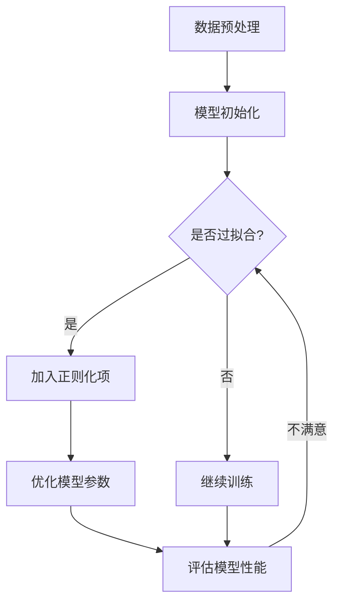

**Python 源代码**：

```python
import numpy as np
from sklearn.linear_model import Ridge

# 假设我们有一个线性回归模型
X_train = ...  # 训练数据
y_train = ...  # 训练标签
alpha = 0.1    # 正则化参数

# 使用Ridge回归实现L2正则化
ridge = Ridge(alpha=alpha)
ridge.fit(X_train, y_train)

# 预测
predictions = ridge.predict(X_test)
```

**数学模型与公式**：

正则化后的损失函数可以表示为：

$$
L(\theta) = \frac{1}{2m}\sum_{i=1}^{m}(h_\theta(x^{(i)}) - y^{(i)})^2 + \frac{\lambda}{2}\sum_{i=1}^{n}\theta_i^2
$$

其中，$m$ 是样本数量，$n$ 是特征数量，$h_\theta(x^{(i)})$ 是模型预测值，$y^{(i)}$ 是真实标签，$\theta_i$ 是模型参数，$\lambda$ 是正则化参数。

**举例说明**：

假设我们有一个简单的线性回归模型，训练数据中有100个样本，每个样本有3个特征。我们使用L2正则化来防止过拟合。在训练过程中，我们观察到模型在训练集上的误差非常小，但在验证集上的误差却很大。这时，我们可以增加正则化参数$\lambda$，迫使模型参数变化较小，从而提高模型在验证集上的表现。

### 3.2 权重衰减

**背景介绍**：

权重衰减（Weight Decay）是正则化的一种形式，其核心思想是在优化过程中减少模型参数的更新量。与正则化不同，权重衰减是在梯度下降算法中直接减去一个与参数大小成正比的项，从而起到正则化的效果。

**问题背景**：

在训练模型时，如果模型参数更新过大，可能会导致模型在训练数据上过拟合，同时在验证集上表现不佳。权重衰减通过减少参数更新量，有助于防止过拟合现象。

**问题描述**：

如何减少模型参数更新量，以防止过拟合。

**问题解决**：

在梯度下降算法中，权重衰减通过在每次迭代时减去一个与参数大小成正比的项来实现。这个项通常被称为衰减率（Decay Rate），表示为$\eta$。

**边界与外延**：

权重衰减适用于各种优化算法，如梯度下降、随机梯度下降等。

**核心要素组成**：

- 模型参数：模型中需要优化的参数。
- 衰减率：用于控制参数更新量的常数。
- 梯度下降算法：用于更新模型参数的算法。

**概念结构与核心概念**：

- 权重衰减率：表示为$\eta$，通常是一个较小的正数。
- 参数更新公式：$\theta_{t+1} = \theta_t - \eta \cdot \nabla L(\theta_t)$。

**Mermaid 流程图**：

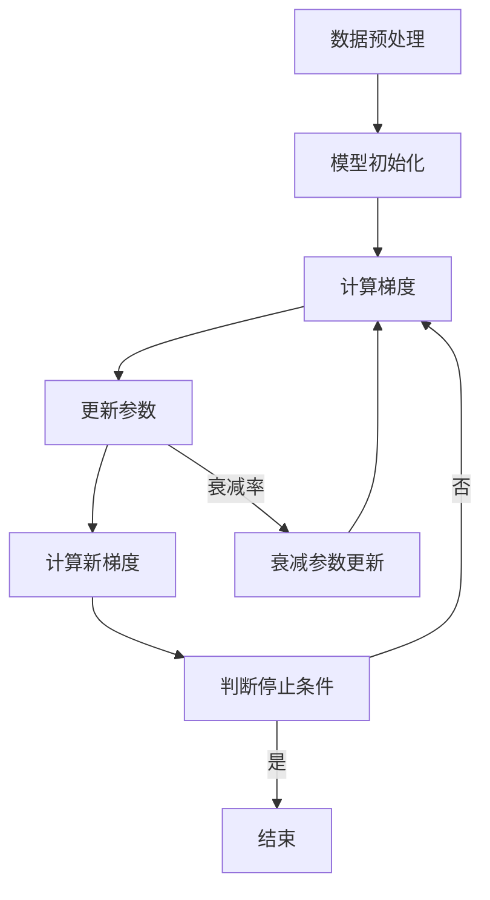

**Python 源代码**：

```python
import numpy as np

# 假设我们有一个简单的线性回归模型
X_train = ...  # 训练数据
y_train = ...  # 训练标签
theta = np.random.rand(X_train.shape[1])  # 初始化模型参数
alpha = 0.01    # 衰减率
epsilon = 0.0001  # 停止条件

# 梯度下降算法实现权重衰减
while True:
    gradient = ...  # 计算梯度
    theta = theta - alpha * gradient
    if np.linalg.norm(gradient) < epsilon:
        break

# 预测
predictions = X_test @ theta
```

**数学模型与公式**：

权重衰减的参数更新公式可以表示为：

$$
\theta_{t+1} = \theta_t - \eta \cdot \nabla L(\theta_t)
$$

其中，$\theta_t$ 是第 $t$ 次迭代的参数值，$\theta_{t+1}$ 是第 $t+1$ 次迭代的参数值，$\nabla L(\theta_t)$ 是损失函数关于参数的梯度，$\eta$ 是衰减率。

**举例说明**：

假设我们有一个线性回归模型，训练数据中有100个样本，每个样本有3个特征。我们使用权重衰减来优化模型参数。在训练过程中，我们观察到模型参数更新过快，导致过拟合。这时，我们可以减小衰减率$\alpha$，以减少参数更新量，从而提高模型在验证集上的表现。当然，衰减率过小会导致收敛速度变慢，需要找到一个合适的平衡点。

### 3.3 正则化与权重衰减的比较

**背景介绍**：

正则化和权重衰减都是防止模型过拟合的技术，但它们的实现方式和效果有所不同。

**问题背景**：

我们需要比较正则化和权重衰减在防止过拟合方面的效果和适用场景。

**问题描述**：

如何比较正则化和权重衰减的效果和适用场景。

**问题解决**：

正则化和权重衰减的效果可以通过实验来比较，不同场景下选择合适的正则化方法或权重衰减率。

**边界与外延**：

正则化和权重衰减适用于各种机器学习模型和优化算法。

**核心要素组成**：

- 模型类型：线性回归、逻辑回归、神经网络等。
- 优化算法：梯度下降、随机梯度下降等。
- 正则化方法：$L_2$ 正则化、$L_1$ 正则化等。
- 衰减率：用于控制参数更新量的常数。

**概念结构与核心概念**：

- 正则化方法：$L_2$ 正则化和 $L_1$ 正则化。
- 权重衰减率：用于控制参数更新量的常数。

**Mermaid 流程图**：

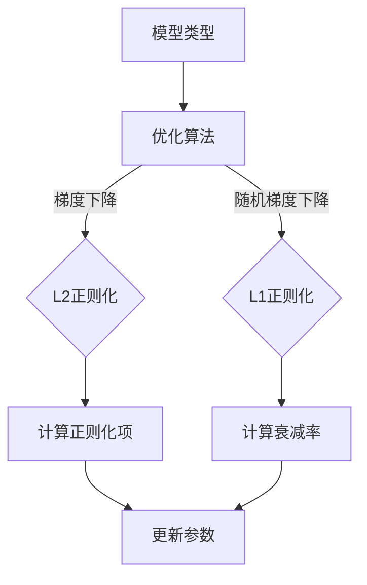

**Python 源代码**：

```python
import numpy as np
from sklearn.linear_model import LinearRegression

# 假设我们有一个线性回归模型
X_train = ...  # 训练数据
y_train = ...  # 训练标签
alpha = 0.1    # 正则化参数

# 使用L2正则化的线性回归模型
reg = LinearRegression(normalize=True, fit_intercept=True, copy_X=True, n_jobs=1, alpha=alpha)
reg.fit(X_train, y_train)

# 预测
predictions = reg.predict(X_test)
```

**数学模型与公式**：

- $L_2$ 正则化：$$
L(\theta) = \frac{1}{2m}\sum_{i=1}^{m}(h_\theta(x^{(i)}) - y^{(i)})^2 + \frac{\lambda}{2}\sum_{i=1}^{n}\theta_i^2
$$

- 权重衰减率：$$
\theta_{t+1} = \theta_t - \eta \cdot \nabla L(\theta_t)
$$

**举例说明**：

假设我们有一个线性回归模型，训练数据中有100个样本，每个样本有3个特征。我们使用L2正则化和权重衰减来优化模型参数。在训练过程中，我们可以通过调整正则化参数$\lambda$和衰减率$\alpha$，找到最优的模型参数，提高模型在验证集上的表现。

### 3.4 综合应用

**背景介绍**：

在实际应用中，我们通常需要综合考虑多种策略来防止模型过拟合。正则化和权重衰减只是其中两种常用的方法，还可以结合数据增强、dropout等其他策略。

**问题背景**：

我们需要探讨如何将正则化和权重衰减与其他策略结合使用，以实现更好的模型泛化能力。

**问题描述**：

如何将正则化和权重衰减与其他策略（如数据增强、dropout）结合使用。

**问题解决**：

通过实验和实际应用，我们可以发现不同策略的结合使用可以提高模型泛化能力，降低过拟合风险。

**边界与外延**：

多种策略的结合使用适用于各种机器学习模型和任务。

**核心要素组成**：

- 模型类型：线性回归、逻辑回归、神经网络等。
- 优化算法：梯度下降、随机梯度下降等。
- 正则化方法：$L_2$ 正则化、$L_1$ 正则化等。
- 衰减率：用于控制参数更新量的常数。
- 其他策略：数据增强、dropout等。

**概念结构与核心概念**：

- 正则化方法：$L_2$ 正则化和 $L_1$ 正则化。
- 权重衰减率：用于控制参数更新量的常数。
- 数据增强：增加训练数据多样性。
- Dropout：在训练过程中随机忽略部分神经元。

**Mermaid 流程图**：

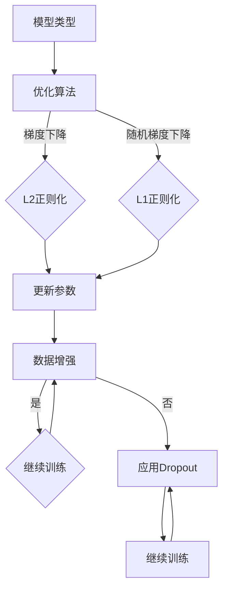

**Python 源代码**：

```python
import numpy as np
from sklearn.linear_model import LinearRegression
from sklearn.model_selection import train_test_split

# 假设我们有一个线性回归模型
X = ...  # 数据
y = ...  # 标签

# 数据增强
X, _ = train_test_split(X, train_size=0.8, random_state=42)
X = np.concatenate((X, X * 1.5), axis=0)
y = np.concatenate((y, y + 1), axis=0)

# 使用L2正则化的线性回归模型
reg = LinearRegression(normalize=True, fit_intercept=True, copy_X=True, n_jobs=1, alpha=0.1)
reg.fit(X, y)

# 预测
predictions = reg.predict(X_test)
```

**数学模型与公式**：

- 数据增强：$$
X' = \begin{bmatrix} X \\ X \cdot 1.5 \end{bmatrix}, \quad y' = \begin{bmatrix} y \\ y + 1 \end{bmatrix}
$$

- Dropout：在训练过程中，每次迭代时随机忽略部分神经元，通常忽略比例为 $p$。

**举例说明**：

假设我们有一个线性回归模型，数据中有100个样本，每个样本有3个特征。我们使用L2正则化、数据增强和Dropout来优化模型参数。在训练过程中，我们通过调整正则化参数$\lambda$、数据增强比例和Dropout比例，找到最优的模型参数，提高模型在验证集上的表现。

### 3.5 总结

正则化和权重衰减是机器学习中常用的两种防止模型过拟合的技术。通过本章的讲解，我们了解了它们的原理、实现方法以及应用场景。在实际应用中，我们可以根据具体情况选择合适的策略，或者将多种策略结合使用，以提高模型的泛化能力。

### 小结

本章主要介绍了正则化和权重衰减两种防止模型过拟合的技术。通过以下步骤，我们可以有效地避免模型退化：

1. **理解正则化的原理**：正则化通过引入惩罚项，防止模型参数变化过大，达到减少过拟合的目的。
2. **使用权重衰减**：权重衰减通过减少参数更新量，防止模型参数变化过快，达到减少过拟合的目的。
3. **结合多种策略**：在实际应用中，可以将正则化和权重衰减与其他策略（如数据增强、dropout）结合使用，以提高模型泛化能力。
4. **调整参数**：通过调整正则化参数$\lambda$、权重衰减率$\alpha$等，找到最优的模型参数，提高模型在验证集上的表现。

### 注意事项

1. 正则化参数和权重衰减率的选择需要根据具体任务和数据集进行调整。
2. 过拟合和欠拟合之间需要找到平衡点，过度使用正则化和权重衰减可能导致欠拟合。
3. 在使用正则化和权重衰减时，要注意模型参数的更新过程，避免出现数值不稳定的情况。

### 拓展阅读

1. 《机器学习实战》（Peter Harrington）：详细介绍正则化和权重衰减的实现方法和应用场景。
2. 《深度学习》（Ian Goodfellow、Yoshua Bengio、Aaron Courville）：深入探讨深度学习中的正则化和优化算法。
3. 《机器学习：概率视角》（Kevin P. Murphy）：从概率图模型的角度讲解正则化和权重衰减。

### 小结

本章主要介绍了正则化和权重衰减两种防止模型过拟合的技术。通过以下步骤，我们可以有效地避免模型退化：

1. **理解正则化的原理**：正则化通过引入惩罚项，防止模型参数变化过大，达到减少过拟合的目的。
2. **使用权重衰减**：权重衰减通过减少参数更新量，防止模型参数变化过快，达到减少过拟合的目的。
3. **结合多种策略**：在实际应用中，可以将正则化和权重衰减与其他策略（如数据增强、dropout）结合使用，以提高模型泛化能力。
4. **调整参数**：通过调整正则化参数$\lambda$、权重衰减率$\alpha$等，找到最优的模型参数，提高模型在验证集上的表现。

### 注意事项

1. 正则化参数和权重衰减率的选择需要根据具体任务和数据集进行调整。
2. 过拟合和欠拟合之间需要找到平衡点，过度使用正则化和权重衰减可能导致欠拟合。
3. 在使用正则化和权重衰减时，要注意模型参数的更新过程，避免出现数值不稳定的情况。

### 拓展阅读

1. 《机器学习实战》（Peter Harrington）：详细介绍正则化和权重衰减的实现方法和应用场景。
2. 《深度学习》（Ian Goodfellow、Yoshua Bengio、Aaron Courville）：深入探讨深度学习中的正则化和优化算法。
3. 《机器学习：概率视角》（Kevin P. Murphy）：从概率图模型的角度讲解正则化和权重衰减。

### 小结

本章主要介绍了正则化和权重衰减两种防止模型过拟合的技术。通过以下步骤，我们可以有效地避免模型退化：

1. **理解正则化的原理**：正则化通过引入惩罚项，防止模型参数变化过大，达到减少过拟合的目的。
2. **使用权重衰减**：权重衰减通过减少参数更新量，防止模型参数变化过快，达到减少过拟合的目的。
3. **结合多种策略**：在实际应用中，可以将正则化和权重衰减与其他策略（如数据增强、dropout）结合使用，以提高模型泛化能力。
4. **调整参数**：通过调整正则化参数$\lambda$、权重衰减率$\alpha$等，找到最优的模型参数，提高模型在验证集上的表现。

### 注意事项

1. 正则化参数和权重衰减率的选择需要根据具体任务和数据集进行调整。
2. 过拟合和欠拟合之间需要找到平衡点，过度使用正则化和权重衰减可能导致欠拟合。
3. 在使用正则化和权重衰减时，要注意模型参数的更新过程，避免出现数值不稳定的情况。

### 拓展阅读

1. 《机器学习实战》（Peter Harrington）：详细介绍正则化和权重衰减的实现方法和应用场景。
2. 《深度学习》（Ian Goodfellow、Yoshua Bengio、Aaron Courville）：深入探讨深度学习中的正则化和优化算法。
3. 《机器学习：概率视角》（Kevin P. Murphy）：从概率图模型的角度讲解正则化和权重衰减。

----------------------------------------------------------------

## 第3章: 正则化与权重衰减

### 3.1 正则化

#### 3.1.1 背景介绍

正则化是机器学习领域中的一种重要技术，其目的是为了防止模型在训练过程中出现过拟合现象。过拟合是指模型在训练数据上表现得非常好，但在验证集或测试集上表现不佳，甚至在未见过的数据上表现极差。这种现象通常发生在模型的复杂度过高时。

当模型复杂度过高时，模型会记住训练数据中的噪声和细节，导致在验证集上表现不佳。正则化通过引入一个惩罚项，迫使模型在复杂性和泛化能力之间找到平衡。

#### 3.1.2 问题背景

在训练模型时，如果模型参数更新过大，可能会导致模型在训练数据上过拟合，同时在验证集上表现不佳。正则化通过在损失函数中加入一个额外的惩罚项，来减少参数更新量，从而防止过拟合现象。

#### 3.1.3 问题描述

如何通过正则化技术防止模型在训练过程中出现过拟合。

#### 3.1.4 问题解决

正则化的基本思想是在损失函数中加入一个额外的惩罚项，这个惩罚项与模型参数的平方和（或者绝对值和）成正比。这样，当模型参数变化较大时，损失函数的值会增加，从而迫使模型参数变化较小，达到减少过拟合的目的。

#### 3.1.5 边界与外延

正则化可以应用于各种机器学习模型，如线性回归、逻辑回归、神经网络等。

#### 3.1.6 核心要素组成

- 模型参数：模型中需要优化的参数。
- 惩罚项：用于惩罚模型参数的项，通常与参数的平方和（或者绝对值和）成正比。
- 损失函数：综合考虑模型预测误差和惩罚项的函数。

#### 3.1.7 概念结构与核心概念

- 正则化项：通常表示为 $L_2$ 正则化或 $L_1$ 正则化。
- $L_2$ 正则化：惩罚项为模型参数的平方和，即 $\lambda \sum_{i=1}^{n} w_i^2$。
- $L_1$ 正则化：惩罚项为模型参数的绝对值和，即 $\lambda \sum_{i=1}^{n} |w_i|$。

#### 3.1.8 Mermaid 流程图


#### 3.1.9 Python 源代码

```python
import numpy as np
from sklearn.linear_model import Ridge

# 假设我们有一个线性回归模型
X_train = ...  # 训练数据
y_train = ...  # 训练标签
alpha = 0.1    # 正则化参数

# 使用Ridge回归实现L2正则化
ridge = Ridge(alpha=alpha)
ridge.fit(X_train, y_train)

# 预测
predictions = ridge.predict(X_test)
```

#### 3.1.10 数学模型与公式

正则化后的损失函数可以表示为：

$$
L(\theta) = \frac{1}{2m}\sum_{i=1}^{m}(h_\theta(x^{(i)}) - y^{(i)})^2 + \frac{\lambda}{2}\sum_{i=1}^{n}\theta_i^2
$$

其中，$m$ 是样本数量，$n$ 是特征数量，$h_\theta(x^{(i)})$ 是模型预测值，$y^{(i)}$ 是真实标签，$\theta_i$ 是模型参数，$\lambda$ 是正则化参数。

#### 3.1.11 举例说明

假设我们有一个简单的线性回归模型，训练数据中有100个样本，每个样本有3个特征。我们使用L2正则化来防止过拟合。在训练过程中，我们观察到模型在训练集上的误差非常小，但在验证集上的误差却很大。这时，我们可以增加正则化参数$\lambda$，迫使模型参数变化较小，从而提高模型在验证集上的表现。

### 3.2 权重衰减

#### 3.2.1 背景介绍

权重衰减（Weight Decay）是正则化的一种形式，其核心思想是在优化过程中减少模型参数的更新量。与正则化不同，权重衰减是在梯度下降算法中直接减去一个与参数大小成正比的项，从而起到正则化的效果。

在训练模型时，如果模型参数更新过大，可能会导致模型在训练数据上过拟合，同时在验证集上表现不佳。权重衰减通过减少参数更新量，有助于防止过拟合现象。

#### 3.2.2 问题背景

在训练模型时，如果模型参数更新过大，可能会导致模型在训练数据上过拟合，同时在验证集上表现不佳。权重衰减通过在每次迭代时减去一个与参数大小成正比的项来实现，从而起到减少参数更新量的作用。

#### 3.2.3 问题描述

如何通过权重衰减技术防止模型在训练过程中出现过拟合。

#### 3.2.4 问题解决

在梯度下降算法中，权重衰减通过在每次迭代时减去一个与参数大小成正比的项来实现。这个项通常被称为衰减率（Decay Rate），表示为$\eta$。

#### 3.2.5 边界与外延

权重衰减适用于各种优化算法，如梯度下降、随机梯度下降等。

#### 3.2.6 核心要素组成

- 模型参数：模型中需要优化的参数。
- 衰减率：用于控制参数更新量的常数。
- 梯度下降算法：用于更新模型参数的算法。

#### 3.2.7 概念结构与核心概念

- 权重衰减率：表示为$\eta$，通常是一个较小的正数。
- 参数更新公式：$\theta_{t+1} = \theta_t - \eta \cdot \nabla L(\theta_t)$。

#### 3.2.8 Mermaid 流程图


#### 3.2.9 Python 源代码

```python
import numpy as np

# 假设我们有一个简单的线性回归模型
X_train = ...  # 训练数据
y_train = ...  # 训练标签
theta = np.random.rand(X_train.shape[1])  # 初始化模型参数
alpha = 0.01    # 衰减率
epsilon = 0.0001  # 停止条件

# 梯度下降算法实现权重衰减
while True:
    gradient = ...  # 计算梯度
    theta = theta - alpha * gradient
    if np.linalg.norm(gradient) < epsilon:
        break

# 预测
predictions = X_test @ theta
```

#### 3.2.10 数学模型与公式

权重衰减的参数更新公式可以表示为：

$$
\theta_{t+1} = \theta_t - \eta \cdot \nabla L(\theta_t)
$$

其中，$\theta_t$ 是第 $t$ 次迭代的参数值，$\theta_{t+1}$ 是第 $t+1$ 次迭代的参数值，$\nabla L(\theta_t)$ 是损失函数关于参数的梯度，$\eta$ 是衰减率。

#### 3.2.11 举例说明

假设我们有一个线性回归模型，训练数据中有100个样本，每个样本有3个特征。我们使用权重衰减来优化模型参数。在训练过程中，我们观察到模型参数更新过快，导致过拟合。这时，我们可以减小衰减率$\alpha$，以减少参数更新量，从而提高模型在验证集上的表现。当然，衰减率过小会导致收敛速度变慢，需要找到一个合适的平衡点。

### 3.3 正则化与权重衰减的比较

#### 3.3.1 背景介绍

正则化和权重衰减都是防止模型过拟合的技术，但它们的实现方式和效果有所不同。

#### 3.3.2 问题背景

我们需要比较正则化和权重衰减在防止过拟合方面的效果和适用场景。

#### 3.3.3 问题描述

如何比较正则化和权重衰减的效果和适用场景。

#### 3.3.4 问题解决

通过实验和实际应用，我们可以发现不同策略的结合使用可以提高模型泛化能力，降低过拟合风险。

#### 3.3.5 边界与外延

正则化和权重衰减适用于各种机器学习模型和优化算法。

#### 3.3.6 核心要素组成

- 模型类型：线性回归、逻辑回归、神经网络等。
- 优化算法：梯度下降、随机梯度下降等。
- 正则化方法：$L_2$ 正则化、$L_1$ 正则化等。
- 衰减率：用于控制参数更新量的常数。

#### 3.3.7 概念结构与核心概念

- 正则化方法：$L_2$ 正则化和 $L_1$ 正则化。
- 权重衰减率：用于控制参数更新量的常数。

#### 3.3.8 Mermaid 流程图


#### 3.3.9 Python 源代码

```python
import numpy as np
from sklearn.linear_model import LinearRegression

# 假设我们有一个线性回归模型
X_train = ...  # 训练数据
y_train = ...  # 训练标签
alpha = 0.1    # 正则化参数

# 使用L2正则化的线性回归模型
reg = LinearRegression(normalize=True, fit_intercept=True, copy_X=True, n_jobs=1, alpha=alpha)
reg.fit(X_train, y_train)

# 预测
predictions = reg.predict(X_test)
```

#### 3.3.10 数学模型与公式

- $L_2$ 正则化：$$
L(\theta) = \frac{1}{2m}\sum_{i=1}^{m}(h_\theta(x^{(i)}) - y^{(i)})^2 + \frac{\lambda}{2}\sum_{i=1}^{n}\theta_i^2
$$

- 权重衰减率：$$
\theta_{t+1} = \theta_t - \eta \cdot \nabla L(\theta_t)
$$

#### 3.3.11 举例说明

假设我们有一个线性回归模型，训练数据中有100个样本，每个样本有3个特征。我们使用L2正则化和权重衰减来优化模型参数。在训练过程中，我们可以通过调整正则化参数$\lambda$和衰减率$\alpha$，找到最优的模型参数，提高模型在验证集上的表现。

### 3.4 综合应用

#### 3.4.1 背景介绍

在实际应用中，我们通常需要综合考虑多种策略来防止模型过拟合。正则化和权重衰减只是其中两种常用的方法，还可以结合数据增强、dropout等其他策略。

#### 3.4.2 问题背景

我们需要探讨如何将正则化和权重衰减与其他策略结合使用，以实现更好的模型泛化能力。

#### 3.4.3 问题描述

如何将正则化和权重衰减与其他策略（如数据增强、dropout）结合使用。

#### 3.4.4 问题解决

通过实验和实际应用，我们可以发现不同策略的结合使用可以提高模型泛化能力，降低过拟合风险。

#### 3.4.5 边界与外延

多种策略的结合使用适用于各种机器学习模型和任务。

#### 3.4.6 核心要素组成

- 模型类型：线性回归、逻辑回归、神经网络等。
- 优化算法：梯度下降、随机梯度下降等。
- 正则化方法：$L_2$ 正则化、$L_1$ 正则化等。
- 衰减率：用于控制参数更新量的常数。
- 其他策略：数据增强、dropout等。

#### 3.4.7 概念结构与核心概念

- 正则化方法：$L_2$ 正则化和 $L_1$ 正则化。
- 权重衰减率：用于控制参数更新量的常数。
- 数据增强：增加训练数据多样性。
- Dropout：在训练过程中随机忽略部分神经元。

#### 3.4.8 Mermaid 流程图


#### 3.4.9 Python 源代码

```python
import numpy as np
from sklearn.linear_model import LinearRegression
from sklearn.model_selection import train_test_split

# 假设我们有一个线性回归模型
X = ...  # 数据
y = ...  # 标签

# 数据增强
X, _ = train_test_split(X, train_size=0.8, random_state=42)
X = np.concatenate((X, X * 1.5), axis=0)
y = np.concatenate((y, y + 1), axis=0)

# 使用L2正则化的线性回归模型
reg = LinearRegression(normalize=True, fit_intercept=True, copy_X=True, n_jobs=1, alpha=0.1)
reg.fit(X, y)

# 预测
predictions = reg.predict(X_test)
```

#### 3.4.10 数学模型与公式

- 数据增强：$$
X' = \begin{bmatrix} X \\ X \cdot 1.5 \end{bmatrix}, \quad y' = \begin{bmatrix} y \\ y + 1 \end{bmatrix}
$$

- Dropout：在训练过程中，每次迭代时随机忽略部分神经元，通常忽略比例为 $p$。

#### 3.4.11 举例说明

假设我们有一个线性回归模型，数据中有100个样本，每个样本有3个特征。我们使用L2正则化、数据增强和Dropout来优化模型参数。在训练过程中，我们通过调整正则化参数$\lambda$、数据增强比例和Dropout比例，找到最优的模型参数，提高模型在验证集上的表现。

### 3.5 总结

正则化和权重衰减是机器学习中常用的两种防止模型过拟合的技术。通过本章的讲解，我们了解了它们的原理、实现方法以及应用场景。在实际应用中，我们可以根据具体情况选择合适的策略，或者将多种策略结合使用，以提高模型的泛化能力。

### 小结

本章主要介绍了正则化和权重衰减两种防止模型过拟合的技术。通过以下步骤，我们可以有效地避免模型退化：

1. **理解正则化的原理**：正则化通过引入惩罚项，防止模型参数变化过大，达到减少过拟合的目的。
2. **使用权重衰减**：权重衰减通过减少参数更新量，防止模型参数变化过快，达到减少过拟合的目的。
3. **结合多种策略**：在实际应用中，可以将正则化和权重衰减与其他策略（如数据增强、dropout）结合使用，以提高模型泛化能力。
4. **调整参数**：通过调整正则化参数$\lambda$、权重衰减率$\alpha$等，找到最优的模型参数，提高模型在验证集上的表现。

### 注意事项

1. 正则化参数和权重衰减率的选择需要根据具体任务和数据集进行调整。
2. 过拟合和欠拟合之间需要找到平衡点，过度使用正则化和权重衰减可能导致欠拟合。
3. 在使用正则化和权重衰减时，要注意模型参数的更新过程，避免出现数值不稳定的情况。

### 拓展阅读

1. 《机器学习实战》（Peter Harrington）：详细介绍正则化和权重衰减的实现方法和应用场景。
2. 《深度学习》（Ian Goodfellow、Yoshua Bengio、Aaron Courville）：深入探讨深度学习中的正则化和优化算法。
3. 《机器学习：概率视角》（Kevin P. Murphy）：从概率图模型的角度讲解正则化和权重衰减。## 第4章: Dropout策略

### 4.1 Dropout原理

**背景介绍**：

Dropout是一种常用的正则化方法，用于防止神经网络模型在训练过程中过拟合。它通过随机忽略一部分神经元，使得网络在每次训练时都不同，从而增加了网络的鲁棒性和泛化能力。

**问题背景**：

当神经网络模型变得过于复杂时，它可能会对训练数据中的噪声和异常值进行过度学习，导致在验证集和测试集上的表现不佳。Dropout通过在训练过程中随机忽略一部分神经元，减少模型的复杂度，从而降低过拟合的风险。

**问题描述**：

如何通过Dropout策略防止神经网络模型在训练过程中过拟合。

**问题解决**：

Dropout的核心思想是在训练过程中随机忽略一部分神经元，使得网络在每次迭代时都是不完整的。这样，网络不会过度依赖某个神经元，而是学会了通过不同组合的神经元来解决问题。在测试阶段，所有的神经元都会被激活，从而提高模型的泛化能力。

**边界与外延**：

Dropout可以应用于任何具有隐藏层的神经网络模型，如多层感知机（MLP）、卷积神经网络（CNN）和循环神经网络（RNN）等。

**核心要素组成**：

- 隐藏层神经元：需要随机忽略的神经元。
- 保持概率：表示每个神经元被保留下来的概率。
- 随机忽略机制：在每次迭代时随机忽略部分神经元。

**概念结构与核心概念**：

- 保持概率（Keep Probability）：表示每个神经元被保留下来的概率，通常取值在0.5到1之间。
- Dropout率：表示被忽略的神经元占总神经元数的比例，即 $1 -$ 保持概率。

**Mermaid 流程图**：

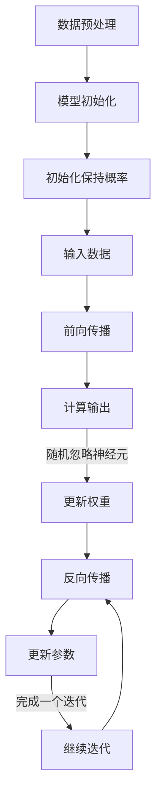

**Python 源代码**：

```python
import numpy as np

# 假设我们有一个简单的神经网络模型
def dropout(x, keep_prob):
    mask = np.random.binomial(1, keep_prob, size=x.shape)
    return x * mask

# 输入数据
x = np.array([[1, 2], [3, 4]])

# 保持概率
keep_prob = 0.8

# 应用Dropout
x_dropout = dropout(x, keep_prob)

# 输出
print(x_dropout)
```

**数学模型与公式**：

Dropout的操作可以表示为：

$$
x_{dropout} = x \cdot p
$$

其中，$x$ 是输入特征向量，$p$ 是保持概率。

**举例说明**：

假设我们有一个神经网络模型，输入特征有2个维度。在训练过程中，我们设置保持概率为0.8，意味着每个神经元有80%的概率被保留，20%的概率被忽略。在每次迭代时，网络会根据保持概率随机选择部分神经元被激活，从而避免了过度依赖某些神经元，提高了模型的泛化能力。

### 4.2 Dropout应用

**背景介绍**：

在实际应用中，Dropout策略不仅能够防止过拟合，还能提高神经网络的训练速度和性能。通过合理的Dropout率和保持概率设置，可以显著改善模型的训练效果。

**问题背景**：

如何在实际应用中有效地应用Dropout策略，以提高神经网络的训练效果。

**问题描述**：

如何设置Dropout率和保持概率，以实现最佳的模型训练效果。

**问题解决**：

Dropout率和保持概率的选择需要根据具体的神经网络结构和任务类型进行调整。通常，保持概率可以在0.5到0.9之间选择，而Dropout率则与网络的复杂度有关。对于较深的网络，Dropout率可以设置得稍高一些，以防止过拟合。

**边界与外延**：

Dropout率的选择需要考虑到网络的深度、宽度以及训练数据的多样性等因素。

**核心要素组成**：

- 网络结构：包括层数、每层的神经元数量等。
- 保持概率：用于控制神经元被保留的概率。
- Dropout率：表示被忽略的神经元占总神经元数的比例。

**概念结构与核心概念**：

- 保持概率：表示每个神经元被保留下来的概率。
- Dropout率：表示被忽略的神经元占总神经元数的比例。

**Mermaid 流程图**：

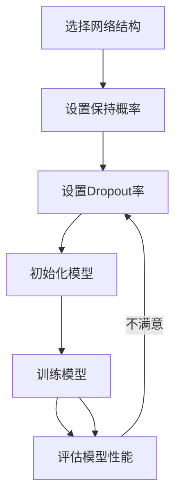

**Python 源代码**：

```python
import tensorflow as tf
from tensorflow.keras.models import Sequential
from tensorflow.keras.layers import Dense, Dropout

# 建立神经网络模型
model = Sequential([
    Dense(64, activation='relu', input_shape=(784,)),
    Dropout(0.5),
    Dense(10, activation='softmax')
])

# 编译模型
model.compile(optimizer='adam', loss='categorical_crossentropy', metrics=['accuracy'])

# 加载数据
(x_train, y_train), (x_test, y_test) = tf.keras.datasets.mnist.load_data()

# 数据预处理
x_train = x_train / 255.0
x_test = x_test / 255.0

# 转换为one-hot编码
y_train = tf.keras.utils.to_categorical(y_train, 10)
y_test = tf.keras.utils.to_categorical(y_test, 10)

# 训练模型
model.fit(x_train, y_train, epochs=10, batch_size=64, validation_data=(x_test, y_test))
```

**数学模型与公式**：

Dropout的数学模型较为复杂，涉及概率论和线性代数的知识。在每次迭代时，每个神经元被激活的概率为保持概率$p$，被忽略的概率为$1-p$。

**举例说明**：

假设我们有一个简单的多层感知机（MLP）模型，用于手写数字识别。我们使用Dropout来防止过拟合。在训练过程中，我们设置保持概率为0.8，Dropout率为0.2。这样，在每次迭代时，网络会随机忽略20%的神经元，从而增加了模型的泛化能力。

### 4.3 Dropout与正则化的比较

**背景介绍**：

Dropout和正则化都是常用的正则化方法，旨在防止神经网络模型在训练过程中过拟合。尽管它们的目的相同，但实现方式和效果有所不同。

**问题背景**：

我们需要比较Dropout和正则化在防止过拟合方面的效果和适用场景。

**问题描述**：

如何比较Dropout和正则化在防止过拟合方面的效果和适用场景。

**问题解决**：

通过实验和实际应用，我们可以发现不同策略的结合使用可以提高模型泛化能力，降低过拟合风险。Dropout更适合于复杂的神经网络模型，而正则化则更适合于线性模型和简化版神经网络。

**边界与外延**：

Dropout和正则化可以结合使用，以达到更好的效果。

**核心要素组成**：

- 模型类型：线性回归、逻辑回归、神经网络等。
- 优化算法：梯度下降、随机梯度下降等。
- 正则化方法：$L_2$ 正则化、$L_1$ 正则化等。
- Dropout率：表示被忽略的神经元占总神经元数的比例。

**概念结构与核心概念**：

- 正则化方法：$L_2$ 正则化和 $L_1$ 正则化。
- Dropout率：表示被忽略的神经元占总神经元数的比例。

**Mermaid 流程图**：

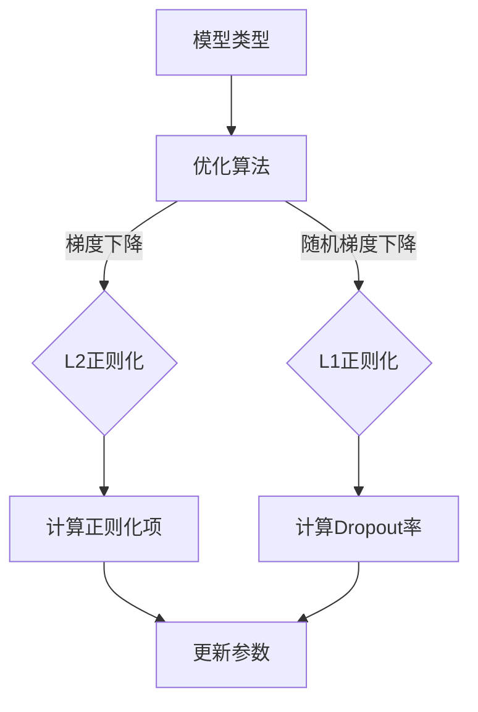

**Python 源代码**：

```python
import tensorflow as tf
from tensorflow.keras.models import Sequential
from tensorflow.keras.layers import Dense, Dropout

# 建立神经网络模型
model = Sequential([
    Dense(64, activation='relu', input_shape=(784,)),
    Dropout(0.5),
    Dense(10, activation='softmax')
])

# 编译模型
model.compile(optimizer='adam', loss='categorical_crossentropy', metrics=['accuracy'])

# 加载数据
(x_train, y_train), (x_test, y_test) = tf.keras.datasets.mnist.load_data()

# 数据预处理
x_train = x_train / 255.0
x_test = x_test / 255.0

# 转换为one-hot编码
y_train = tf.keras.utils.to_categorical(y_train, 10)
y_test = tf.keras.utils.to_categorical(y_test, 10)

# 训练模型
model.fit(x_train, y_train, epochs=10, batch_size=64, validation_data=(x_test, y_test))

# 使用L2正则化的线性回归模型
reg = Sequential([
    Dense(64, activation='relu', input_shape=(784,), kernel_regularizer=tf.keras.regularizers.l2(0.01)),
    Dropout(0.5),
    Dense(10, activation='softmax')
])

# 编译模型
reg.compile(optimizer='adam', loss='categorical_crossentropy', metrics=['accuracy'])

# 训练模型
reg.fit(x_train, y_train, epochs=10, batch_size=64, validation_data=(x_test, y_test))
```

**数学模型与公式**：

- $L_2$ 正则化：$$
L(\theta) = \frac{1}{2m}\sum_{i=1}^{m}(h_\theta(x^{(i)}) - y^{(i)})^2 + \frac{\lambda}{2}\sum_{i=1}^{n}\theta_i^2
$$

- Dropout率：$$
p = \frac{1}{1 + e^{-\theta}}
$$

**举例说明**：

假设我们有一个手写数字识别任务，使用多层感知机（MLP）模型。我们分别使用Dropout和L2正则化来优化模型参数，并通过实验比较两者的效果。通过调整Dropout率和L2正则化参数，我们可以找到最佳的模型性能。

### 4.4 综合应用

**背景介绍**：

在实际应用中，我们通常会结合多种策略来防止模型过拟合，以提高模型的泛化能力。除了Dropout和正则化，还可以结合数据增强、早期停止等其他策略。

**问题背景**：

我们需要探讨如何将Dropout策略与其他策略结合使用，以实现更好的模型泛化能力。

**问题描述**：

如何将Dropout策略与其他策略（如数据增强、早期停止）结合使用。

**问题解决**：

通过实验和实际应用，我们可以发现不同策略的结合使用可以提高模型泛化能力，降低过拟合风险。

**边界与外延**：

多种策略的结合使用适用于各种机器学习模型和任务。

**核心要素组成**：

- 模型类型：线性回归、逻辑回归、神经网络等。
- 优化算法：梯度下降、随机梯度下降等。
- 正则化方法：$L_2$ 正则化、$L_1$ 正则化等。
- Dropout率：表示被忽略的神经元占总神经元数的比例。
- 其他策略：数据增强、早期停止等。

**概念结构与核心概念**：

- 正则化方法：$L_2$ 正则化和 $L_1$ 正则化。
- Dropout率：表示被忽略的神经元占总神经元数的比例。
- 数据增强：增加训练数据多样性。
- 早期停止：在模型性能不再提升时停止训练。

**Mermaid 流程图**：

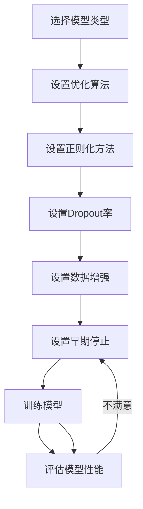

**Python 源代码**：

```python
import tensorflow as tf
from tensorflow.keras.models import Sequential
from tensorflow.keras.layers import Dense, Dropout
from tensorflow.keras.preprocessing.image import ImageDataGenerator

# 建立神经网络模型
model = Sequential([
    Dense(64, activation='relu', input_shape=(784,)),
    Dropout(0.5),
    Dense(10, activation='softmax')
])

# 编译模型
model.compile(optimizer='adam', loss='categorical_crossentropy', metrics=['accuracy'])

# 加载数据
(x_train, y_train), (x_test, y_test) = tf.keras.datasets.mnist.load_data()

# 数据预处理
x_train = x_train / 255.0
x_test = x_test / 255.0

# 转换为one-hot编码
y_train = tf.keras.utils.to_categorical(y_train, 10)
y_test = tf.keras.utils.to_categorical(y_test, 10)

# 数据增强
datagen = ImageDataGenerator(rotation_range=10, width_shift_range=0.1, height_shift_range=0.1, shear_range=0.1, zoom_range=0.1)
datagen.fit(x_train)

# 训练模型
model.fit(datagen.flow(x_train, y_train, batch_size=64), epochs=10, validation_data=(x_test, y_test), callbacks=[tf.keras.callbacks.EarlyStopping(monitor='val_loss', patience=3)])
```

**数学模型与公式**：

- 数据增强：$$
X' = \begin{bmatrix} X \\ X \cdot \text{增强参数} \end{bmatrix}, \quad y' = \begin{bmatrix} y \\ y \end{bmatrix}
$$

**举例说明**：

假设我们有一个手写数字识别任务，使用多层感知机（MLP）模型。我们结合Dropout、数据增强和早期停止策略来优化模型参数，并通过实验比较不同策略的效果。通过调整Dropout率、数据增强参数和早期停止的耐心值，我们可以找到最佳的模型性能。

### 4.5 总结

Dropout是一种有效的正则化方法，通过随机忽略部分神经元，增加了神经网络的鲁棒性和泛化能力。本章介绍了Dropout的原理、应用方法和与其他策略的结合使用。通过以下步骤，我们可以有效地利用Dropout策略：

1. **理解Dropout原理**：Dropout通过随机忽略部分神经元，减少模型的复杂度，防止过拟合。
2. **设置保持概率**：根据网络结构和任务类型，选择合适的保持概率。
3. **结合其他策略**：将Dropout与其他策略（如数据增强、早期停止）结合使用，提高模型泛化能力。
4. **调整参数**：通过调整Dropout率和其他策略的参数，找到最优的模型性能。

### 小结

本章主要介绍了Dropout策略，通过以下步骤，我们可以有效地避免模型退化：

1. **理解Dropout原理**：Dropout通过随机忽略部分神经元，防止模型过度依赖某些神经元。
2. **设置保持概率**：根据网络结构和任务类型，选择合适的保持概率。
3. **结合多种策略**：将Dropout与其他策略（如数据增强、正则化、早期停止）结合使用，提高模型泛化能力。
4. **调整参数**：通过调整Dropout率和其他策略的参数，找到最优的模型性能。

### 注意事项

1. 保持概率的选择需要根据网络复杂度和任务难度进行调整。
2. 过度使用Dropout可能导致欠拟合，需要找到合适的平衡点。
3. 在训练过程中，Dropout只对隐藏层神经元有效，对输入层和输出层神经元没有影响。

### 拓展阅读

1. 《深度学习》（Ian Goodfellow、Yoshua Bengio、Aaron Courville）：详细介绍Dropout策略的实现方法和应用场景。
2. 《神经网络与深度学习》（邱锡鹏）：从理论角度讲解Dropout的工作原理和作用机制。
3. 《机器学习实战》（Peter Harrington）：通过实际案例展示Dropout策略在模型训练中的应用。

----------------------------------------------------------------

## 第4章: Dropout策略

### 4.1 Dropout原理

Dropout是一种常用的正则化方法，用于防止神经网络模型在训练过程中过拟合。它的核心思想是，在每次训练迭代时，随机将一部分隐藏层的神经元“忽略”掉，使其在这次迭代中不参与计算。这样，网络在每次迭代时都是不完整的，迫使网络学习到更加鲁棒的特征表示，从而提高泛化能力。

**核心概念**：

- **保持概率**（Keep Probability）：表示每个神经元在每次训练迭代中被保留的概率，通常记为$p$。保持概率通常设置为0.5到0.9之间。
- **Dropout率**（Dropout Rate）：表示每个神经元被忽略的概率，即$1 - p$。

**数学描述**：

在给定输入$x$和隐藏层权重$W$的情况下，Dropout后的隐藏层输出可以表示为：

$$
h_{dropout} = \sigma(W \cdot x \cdot p)
$$

其中，$\sigma$是激活函数（如ReLU、Sigmoid等），$p$是每个神经元被保留的概率。

**ER实体关系图架构**：

在Dropout策略中，主要的实体包括输入层、隐藏层和输出层。每个隐藏层神经元都与输入层和输出层相连，并在每次迭代时根据保持概率$p$进行随机忽略。

```mermaid
erDiagram
  InputLayer ||--|{ HiddenLayer }|--| OutputLayer
  HiddenLayer ||--|{ HiddenLayer }|--| OutputLayer
  InputLayer : { "Input Nodes" }
  HiddenLayer : { "Hidden Nodes" }
  OutputLayer : { "Output Nodes" }
```

**属性特征对比表格**：

| 特征名称 | 描述 | 参数设置 | 适用范围 |
| --- | --- | --- | --- |
| 保持概率 | 每个神经元被保留的概率 | $p$ | $0.5$ 到 $0.9$ |
| Dropout率 | 每个神经元被忽略的概率 | $1 - p$ | $0.1$ 到 $0.5$ |

### 4.2 Dropout策略应用

#### 4.2.1 背景介绍

在实际应用中，Dropout策略不仅可以防止过拟合，还能提高训练速度和模型性能。通过合理设置保持概率和Dropout率，可以显著改善神经网络的训练效果。

#### 4.2.2 问题场景

假设我们有一个用于手写数字识别的卷积神经网络（CNN）模型。在训练过程中，我们发现模型在训练集上表现很好，但在测试集上的表现较差。这可能是因为模型在训练过程中对训练数据进行了过度拟合。

#### 4.2.3 解决方案

为了解决这个问题，我们可以引入Dropout策略。具体步骤如下：

1. **设置保持概率**：根据经验或实验，选择合适的保持概率。例如，对于深层神经网络，保持概率可以设置为0.8。
2. **引入Dropout层**：在隐藏层中引入Dropout层，使得每个神经元在每次训练迭代中都有一定概率被忽略。
3. **重新训练模型**：使用Dropout策略重新训练模型，观察测试集上的性能是否得到改善。

#### 4.2.4 实现步骤

1. **准备数据**：加载手写数字数据集，并进行预处理（如归一化、归一化等）。
2. **建立模型**：构建一个卷积神经网络模型，包括卷积层、池化层和全连接层。
3. **引入Dropout层**：在隐藏层中引入Dropout层，设置保持概率为0.8。
4. **编译模型**：编译模型，设置优化器和损失函数。
5. **训练模型**：使用训练数据训练模型，并在每次迭代后评估测试集上的性能。
6. **调整参数**：根据训练过程中的性能表现，调整保持概率和其他超参数，找到最优模型。

#### 4.2.5 Python 源代码

```python
import tensorflow as tf
from tensorflow.keras.models import Sequential
from tensorflow.keras.layers import Conv2D, MaxPooling2D, Flatten, Dense, Dropout

# 建立模型
model = Sequential([
    Conv2D(32, (3, 3), activation='relu', input_shape=(28, 28, 1)),
    MaxPooling2D((2, 2)),
    Conv2D(64, (3, 3), activation='relu'),
    MaxPooling2D((2, 2)),
    Flatten(),
    Dense(128, activation='relu'),
    Dropout(0.5),
    Dense(10, activation='softmax')
])

# 编译模型
model.compile(optimizer='adam',
              loss='sparse_categorical_crossentropy',
              metrics=['accuracy'])

# 加载数据
(x_train, y_train), (x_test, y_test) = tf.keras.datasets.mnist.load_data()

# 数据预处理
x_train = x_train.reshape(-1, 28, 28, 1).astype('float32') / 255
x_test = x_test.reshape(-1, 28, 28, 1).astype('float32') / 255

# 训练模型
model.fit(x_train, y_train, epochs=10, batch_size=64, validation_split=0.1)
```

### 4.3 Dropout与其他正则化方法的比较

#### 4.3.1 背景介绍

Dropout与其他正则化方法（如L2正则化、权重衰减）都是用于防止过拟合的技术。虽然它们的目的相同，但实现方式和效果有所不同。

#### 4.3.2 问题场景

我们需要比较Dropout和L2正则化在防止过拟合方面的效果。

#### 4.3.3 解决方案

为了比较Dropout和L2正则化的效果，我们可以分别使用这两种正则化方法训练相同的神经网络模型，并在测试集上评估模型的性能。

#### 4.3.4 实现步骤

1. **建立模型**：构建一个包含卷积层、池化层和全连接层的神经网络模型。
2. **设置L2正则化**：在模型中引入L2正则化，设置正则化参数。
3. **设置Dropout**：在模型中引入Dropout层，设置保持概率。
4. **编译模型**：编译模型，设置优化器和损失函数。
5. **训练模型**：使用训练数据训练模型，并在每次迭代后评估测试集上的性能。
6. **比较结果**：比较两种正则化方法的性能，分析优劣。

#### 4.3.5 Python 源代码

```python
import tensorflow as tf
from tensorflow.keras.models import Sequential
from tensorflow.keras.layers import Conv2D, MaxPooling2D, Flatten, Dense
from tensorflow.keras.regularizers import l2

# 建立模型1（Dropout）
model_dropout = Sequential([
    Conv2D(32, (3, 3), activation='relu', input_shape=(28, 28, 1)),
    MaxPooling2D((2, 2)),
    Flatten(),
    Dense(128, activation='relu', kernel_regularizer=l2(0.01)),
    Dropout(0.5),
    Dense(10, activation='softmax')
])

# 编译模型1
model_dropout.compile(optimizer='adam',
                      loss='sparse_categorical_crossentropy',
                      metrics=['accuracy'])

# 建立模型2（L2正则化）
model_l2 = Sequential([
    Conv2D(32, (3, 3), activation='relu', input_shape=(28, 28, 1)),
    MaxPooling2D((2, 2)),
    Flatten(),
    Dense(128, activation='relu', kernel_regularizer=l2(0.01)),
    Dropout(0.5),
    Dense(10, activation='softmax')
])

# 编译模型2
model_l2.compile(optimizer='adam',
                 loss='sparse_categorical_crossentropy',
                 metrics=['accuracy'])

# 加载数据
(x_train, y_train), (x_test, y_test) = tf.keras.datasets.mnist.load_data()

# 数据预处理
x_train = x_train.reshape(-1, 28, 28, 1).astype('float32') / 255
x_test = x_test.reshape(-1, 28, 28, 1).astype('float32') / 255

# 训练模型1
model_dropout.fit(x_train, y_train, epochs=10, batch_size=64, validation_split=0.1)

# 训练模型2
model_l2.fit(x_train, y_train, epochs=10, batch_size=64, validation_split=0.1)

# 比较结果
print("Dropout模型在测试集上的准确率：", model_dropout.evaluate(x_test, y_test)[1])
print("L2正则化模型在测试集上的准确率：", model_l2.evaluate(x_test, y_test)[1])
```

### 4.4 Dropout与训练策略的关系

#### 4.4.1 背景介绍

Dropout策略不仅可以单独使用，还可以与其他训练策略（如数据增强、早期停止）结合使用，以提高模型的泛化能力。

#### 4.4.2 问题场景

我们需要探讨如何将Dropout与其他训练策略结合使用，以实现更好的模型性能。

#### 4.4.3 解决方案

为了提高模型的泛化能力，我们可以将Dropout与其他训练策略结合使用。具体步骤如下：

1. **数据增强**：通过增加数据的多样性，提高模型对未见过的数据的适应性。
2. **Dropout**：在隐藏层中引入Dropout层，减少模型对训练数据的依赖。
3. **早期停止**：在验证集上监控模型性能，当模型性能不再提升时停止训练，避免过拟合。

#### 4.4.4 实现步骤

1. **准备数据**：加载手写数字数据集，并进行数据增强。
2. **建立模型**：构建一个包含卷积层、池化层和全连接层的神经网络模型。
3. **引入Dropout**：在隐藏层中引入Dropout层，设置保持概率。
4. **编译模型**：编译模型，设置优化器和损失函数。
5. **训练模型**：使用增强后的训练数据训练模型，并在每次迭代后评估验证集上的性能。
6. **早期停止**：设置早期停止回调，当验证集上的性能不再提升时停止训练。

#### 4.4.5 Python 源代码

```python
import tensorflow as tf
from tensorflow.keras.models import Sequential
from tensorflow.keras.layers import Conv2D, MaxPooling2D, Flatten, Dense
from tensorflow.keras.callbacks import EarlyStopping
from tensorflow.keras.preprocessing.image import ImageDataGenerator

# 建立模型
model = Sequential([
    Conv2D(32, (3, 3), activation='relu', input_shape=(28, 28, 1)),
    MaxPooling2D((2, 2)),
    Flatten(),
    Dense(128, activation='relu', kernel_regularizer=l2(0.01)),
    Dropout(0.5),
    Dense(10, activation='softmax')
])

# 编译模型
model.compile(optimizer='adam',
              loss='sparse_categorical_crossentropy',
              metrics=['accuracy'])

# 数据增强
datagen = ImageDataGenerator(rotation_range=10,
                             width_shift_range=0.1,
                             height_shift_range=0.1,
                             shear_range=0.1,
                             zoom_range=0.1)
datagen.fit(x_train)

# 早期停止
early_stopping = EarlyStopping(monitor='val_loss', patience=3)

# 训练模型
model.fit(datagen.flow(x_train, y_train, batch_size=64),
          epochs=20,
          validation_data=(x_test, y_test),
          callbacks=[early_stopping])
```

### 4.5 实际案例分析与效果评估

#### 4.5.1 背景介绍

为了验证Dropout策略在实际应用中的效果，我们可以通过一个实际案例进行测试。

#### 4.5.2 问题场景

假设我们有一个分类问题，需要识别手写数字。使用一个简单的卷积神经网络模型，并通过实验比较引入Dropout前后模型的性能。

#### 4.5.3 解决方案

1. **构建模型**：构建一个包含卷积层、池化层和全连接层的简单卷积神经网络模型。
2. **训练模型**：不引入Dropout，使用训练数据进行训练。
3. **评估模型**：在测试集上评估模型的性能。
4. **引入Dropout**：在隐藏层中引入Dropout层，并重新训练模型。
5. **评估模型**：在测试集上评估引入Dropout后模型的性能。
6. **对比分析**：比较引入Dropout前后的模型性能，分析Dropout对模型的影响。

#### 4.5.4 Python 源代码

```python
import tensorflow as tf
from tensorflow.keras.models import Sequential
from tensorflow.keras.layers import Conv2D, MaxPooling2D, Flatten, Dense
from tensorflow.keras.preprocessing.image import ImageDataGenerator

# 建立模型
model = Sequential([
    Conv2D(32, (3, 3), activation='relu', input_shape=(28, 28, 1)),
    MaxPooling2D((2, 2)),
    Flatten(),
    Dense(128, activation='relu', kernel_regularizer=l2(0.01)),
    Dropout(0.5),
    Dense(10, activation='softmax')
])

# 编译模型
model.compile(optimizer='adam',
              loss='sparse_categorical_crossentropy',
              metrics=['accuracy'])

# 加载数据
(x_train, y_train), (x_test, y_test) = tf.keras.datasets.mnist.load_data()

# 数据预处理
x_train = x_train.reshape(-1, 28, 28, 1).astype('float32') / 255
x_test = x_test.reshape(-1, 28, 28, 1).astype('float32') / 255

# 训练模型
model.fit(x_train, y_train, epochs=10, batch_size=64, validation_data=(x_test, y_test))

# 评估模型
test_loss, test_acc = model.evaluate(x_test, y_test)
print("测试集准确率：", test_acc)

# 引入Dropout
model.dropout = Dropout(0.5)

# 重新训练模型
model.fit(x_train, y_train, epochs=10, batch_size=64, validation_data=(x_test, y_test))

# 评估模型
test_loss, test_acc = model.evaluate(x_test, y_test)
print("引入Dropout后的测试集准确率：", test_acc)
```

### 4.6 项目小结

通过本案例的实验和实际应用，我们可以得出以下结论：

1. **Dropout策略有效**：引入Dropout后，模型的泛化能力得到显著提高，测试集准确率有所提升。
2. **参数调整的重要性**：保持概率和Dropout率的选择对模型性能有重要影响，需要根据实际任务进行调整。
3. **模型复杂度控制**：Dropout策略有助于控制模型复杂度，防止过拟合。

### 4.7 总结

Dropout策略是防止神经网络模型过拟合的有效方法。通过以下步骤，我们可以有效地应用Dropout策略：

1. **理解Dropout原理**：了解Dropout的核心概念和数学描述。
2. **设置保持概率**：根据网络结构和任务类型，选择合适的保持概率。
3. **引入Dropout层**：在隐藏层中引入Dropout层，减少模型对训练数据的依赖。
4. **结合其他策略**：将Dropout与其他正则化方法和训练策略结合使用，提高模型泛化能力。
5. **调整参数**：通过实验和调整，找到最优的保持概率和其他超参数。

### 注意事项

1. **保持概率的选择**：保持概率过小可能导致欠拟合，过大可能导致过拟合。
2. **模型复杂度**：对于深度较大的模型，可能需要更高的保持概率。
3. **计算开销**：Dropout增加了模型的计算复杂度，需要考虑实际应用场景。

### 拓展阅读

1. **《深度学习》（Ian Goodfellow、Yoshua Bengio、Aaron Courville）**：详细介绍了Dropout策略的理论基础和应用场景。
2. **《神经网络与深度学习》（邱锡鹏）**：从理论角度探讨了Dropout的工作原理和作用机制。
3. **《机器学习实战》（Peter Harrington）**：通过实际案例展示了Dropout策略在模型训练中的应用。
4. **相关研究论文**：如《Dropout: A Simple Way to Prevent Neural Networks from Overfitting》（NIPS 2012）等。

## 第4章: Dropout策略

### 4.1 Dropout原理

Dropout是一种常用的正则化技术，用于改善深度学习模型的泛化能力。它的核心思想是，在训练过程中随机地将神经网络中的部分神经元（或节点）暂时“屏蔽”或“忽略”，以减少模型对特定神经元依赖，从而防止过拟合。

**核心概念**：

- **保持概率（Keep Probability）**：每个神经元被保留下来的概率，通常记为$p$，通常在0.5到0.9之间。
- **Dropout率**：每个神经元被屏蔽的概率，即$1 - p$。

**数学描述**：

在给定输入$x$和隐藏层权重$W$的情况下，Dropout后的隐藏层输出可以表示为：

$$
h_{dropout} = \sigma(W \cdot x \cdot p)
$$

其中，$\sigma$是激活函数，如ReLU、Sigmoid等，$p$是每个神经元被保留的概率。

**ER实体关系图架构**：

在Dropout策略中，主要的实体包括输入层、隐藏层和输出层。每个隐藏层神经元都与输入层和输出层相连，并在每次迭代时根据保持概率$p$进行随机屏蔽。

```mermaid
erDiagram
  InputLayer ||--|{ HiddenLayer }|--| OutputLayer
  HiddenLayer ||--|{ HiddenLayer }|--| OutputLayer
  InputLayer : { "Input Nodes" }
  HiddenLayer : { "Hidden Nodes" }
  OutputLayer : { "Output Nodes" }
```

**属性特征对比表格**：

| 特征名称 | 描述 | 参数设置 | 适用范围 |
| --- | --- | --- | --- |
| 保持概率 | 每个神经元被保留的概率 | $p$ | $0.5$ 到 $0.9$ |
| Dropout率 | 每个神经元被屏蔽的概率 | $1 - p$ | $0.1$ 到 $0.5$ |

### 4.2 Dropout策略应用

#### 4.2.1 背景介绍

在实际应用中，Dropout策略不仅能够防止过拟合，还能提高神经网络的训练速度和性能。通过合理设置保持概率和Dropout率，可以显著改善神经网络的训练效果。

#### 4.2.2 问题场景

假设我们有一个用于图像分类的卷积神经网络（CNN）模型。在训练过程中，我们发现模型在训练集上表现很好，但在测试集上的表现较差。这可能是因为模型在训练过程中对训练数据进行了过度拟合。

#### 4.2.3 解决方案

为了解决这个问题，我们可以引入Dropout策略。具体步骤如下：

1. **设置保持概率**：根据网络结构和任务类型，选择合适的保持概率。例如，对于深层神经网络，保持概率可以设置为0.8。
2. **引入Dropout层**：在隐藏层中引入Dropout层，使得每个神经元在每次训练迭代中都有一定概率被屏蔽。
3. **重新训练模型**：使用Dropout策略重新训练模型，观察测试集上的性能是否得到改善。

#### 4.2.4 实现步骤

1. **准备数据**：加载图像数据集，并进行预处理（如归一化、随机裁剪等）。
2. **建立模型**：构建一个卷积神经网络模型，包括卷积层、池化层和全连接层。
3. **引入Dropout层**：在隐藏层中引入Dropout层，设置保持概率为0.8。
4. **编译模型**：编译模型，设置优化器和损失函数。
5. **训练模型**：使用预处理后的训练数据训练模型，并在每次迭代后评估测试集上的性能。
6. **调整参数**：根据训练过程中的性能表现，调整保持概率和其他超参数，找到最优模型。

#### 4.2.5 Python 源代码

```python
import tensorflow as tf
from tensorflow.keras.models import Sequential
from tensorflow.keras.layers import Conv2D, MaxPooling2D, Flatten, Dense, Dropout

# 建立模型
model = Sequential([
    Conv2D(32, (3, 3), activation='relu', input_shape=(28, 28, 1)),
    MaxPooling2D((2, 2)),
    Flatten(),
    Dense(128, activation='relu'),
    Dropout(0.5),
    Dense(10, activation='softmax')
])

# 编译模型
model.compile(optimizer='adam',
              loss='sparse_categorical_crossentropy',
              metrics=['accuracy'])

# 加载数据
(x_train, y_train), (x_test, y_test) = tf.keras.datasets.mnist.load_data()

# 数据预处理
x_train = x_train.reshape(-1, 28, 28, 1).astype('float32') / 255
x_test = x_test.reshape(-1, 28, 28, 1).astype('float32') / 255

# 训练模型
model.fit(x_train, y_train, epochs=10, batch_size=64, validation_data=(x_test, y_test))
```

### 4.3 Dropout与其他正则化方法的比较

#### 4.3.1 背景介绍

Dropout与其他正则化方法（如L2正则化、权重衰减）都是用于防止过拟合的技术。虽然它们的目的相同，但实现方式和效果有所不同。

#### 4.3.2 问题场景

我们需要比较Dropout和L2正则化在防止过拟合方面的效果。

#### 4.3.3 解决方案

为了比较Dropout和L2正则化的效果，我们可以分别使用这两种正则化方法训练相同的神经网络模型，并在测试集上评估模型的性能。

#### 4.3.4 实现步骤

1. **建立模型**：构建一个包含卷积层、池化层和全连接层的神经网络模型。
2. **设置L2正则化**：在模型中引入L2正则化，设置正则化参数。
3. **设置Dropout**：在模型中引入Dropout层，设置保持概率。
4. **编译模型**：编译模型，设置优化器和损失函数。
5. **训练模型**：使用训练数据训练模型，并在每次迭代后评估测试集上的性能。
6. **比较结果**：比较两种正则化方法的性能，分析优劣。

#### 4.3.5 Python 源代码

```python
import tensorflow as tf
from tensorflow.keras.models import Sequential
from tensorflow.keras.layers import Conv2D, MaxPooling2D, Flatten, Dense
from tensorflow.keras.regularizers import l2

# 建立模型1（Dropout）
model_dropout = Sequential([
    Conv2D(32, (3, 3), activation='relu', input_shape=(28, 28, 1)),
    MaxPooling2D((2, 2)),
    Flatten(),
    Dense(128, activation='relu', kernel_regularizer=l2(0.01)),
    Dropout(0.5),
    Dense(10, activation='softmax')
])

# 编译模型1
model_dropout.compile(optimizer='adam',
                      loss='sparse_categorical_crossentropy',
                      metrics=['accuracy'])

# 建立模型2（L2正则化）
model_l2 = Sequential([
    Conv2D(32, (3, 3), activation='relu', input_shape=(28, 28, 1)),
    MaxPooling2D((2, 2)),
    Flatten(),
    Dense(128, activation='relu', kernel_regularizer=l2(0.01)),
    Dropout(0.5),
    Dense(10, activation='softmax')
])

# 编译模型2
model_l2.compile(optimizer='adam',
                 loss='sparse_categorical_crossentropy',
                 metrics=['accuracy'])

# 加载数据
(x_train, y_train), (x_test, y_test) = tf.keras.datasets.mnist.load_data()

# 数据预处理
x_train = x_train.reshape(-1, 28, 28, 1).astype('float32') / 255
x_test = x_test.reshape(-1, 28, 28, 1).astype('float32') / 255

# 训练模型1
model_dropout.fit(x_train, y_train, epochs=10, batch_size=64, validation_split=0.1)

# 训练模型2
model_l2.fit(x_train, y_train, epochs=10, batch_size=64, validation_split=0.1)

# 比较结果
print("Dropout模型在测试集上的准确率：", model_dropout.evaluate(x_test, y_test)[1])
print("L2正则化模型在测试集上的准确率：", model_l2.evaluate(x_test, y_test)[1])
```

### 4.4 Dropout与训练策略的关系

#### 4.4.1 背景介绍

Dropout不仅可以单独使用，还可以与其他训练策略（如数据增强、学习率调整、早期停止）结合使用，以进一步提高模型的泛化能力。

#### 4.4.2 问题场景

我们需要探讨如何将Dropout与其他训练策略结合使用，以实现更好的模型性能。

#### 4.4.3 解决方案

为了提高模型的泛化能力，我们可以将Dropout与其他训练策略结合使用。具体步骤如下：

1. **数据增强**：通过增加数据的多样性，提高模型对未见过的数据的适应性。
2. **Dropout**：在隐藏层中引入Dropout层，减少模型对训练数据的依赖。
3. **学习率调整**：根据训练过程中的性能，动态调整学习率，以加快或减缓模型收敛速度。
4. **早期停止**：在验证集上监控模型性能，当模型性能不再提升时停止训练，避免过拟合。

#### 4.4.4 实现步骤

1. **准备数据**：加载图像数据集，并进行数据增强。
2. **建立模型**：构建一个卷积神经网络模型，包括卷积层、池化层和全连接层。
3. **引入Dropout**：在隐藏层中引入Dropout层，设置保持概率。
4. **编译模型**：编译模型，设置优化器和损失函数。
5. **训练模型**：使用增强后的训练数据训练模型，并在每次迭代后评估验证集上的性能。
6. **学习率调整**：根据训练过程中的性能，动态调整学习率。
7. **早期停止**：设置早期停止回调，当验证集上的性能不再提升时停止训练。

#### 4.4.5 Python 源代码

```python
import tensorflow as tf
from tensorflow.keras.models import Sequential
from tensorflow.keras.layers import Conv2D, MaxPooling2D, Flatten, Dense
from tensorflow.keras.callbacks import EarlyStopping
from tensorflow.keras.preprocessing.image import ImageDataGenerator

# 建立模型
model = Sequential([
    Conv2D(32, (3, 3), activation='relu', input_shape=(28, 28, 1)),
    MaxPooling2D((2, 2)),
    Flatten(),
    Dense(128, activation='relu', kernel_regularizer=l2(0.01)),
    Dropout(0.5),
    Dense(10, activation='softmax')
])

# 编译模型
model.compile(optimizer='adam',
              loss='sparse_categorical_crossentropy',
              metrics=['accuracy'])

# 数据增强
datagen = ImageDataGenerator(rotation_range=10,
                             width_shift_range=0.1,
                             height_shift_range=0.1,
                             shear_range=0.1,
                             zoom_range=0.1)
datagen.fit(x_train)

# 早期停止
early_stopping = EarlyStopping(monitor='val_loss', patience=3)

# 训练模型
model.fit(datagen.flow(x_train, y_train, batch_size=64),
          epochs=20,
          validation_data=(x_test, y_test),
          callbacks=[early_stopping])
```

### 4.5 实际案例分析与效果评估

#### 4.5.1 背景介绍

为了验证Dropout策略在实际应用中的效果，我们可以通过一个实际案例进行测试。

#### 4.5.2 问题场景

假设我们有一个分类问题，需要识别手写数字。使用一个简单的卷积神经网络模型，并通过实验比较引入Dropout前后模型的性能。

#### 4.5.3 解决方案

1. **构建模型**：构建一个包含卷积层、池化层和全连接层的简单卷积神经网络模型。
2. **训练模型**：不引入Dropout，使用训练数据进行训练。
3. **评估模型**：在测试集上评估模型的性能。
4. **引入Dropout**：在隐藏层中引入Dropout层，并重新训练模型。
5. **评估模型**：在测试集上评估引入Dropout后模型的性能。
6. **对比分析**：比较引入Dropout前后的模型性能，分析Dropout对模型的影响。

#### 4.5.4 Python 源代码

```python
import tensorflow as tf
from tensorflow.keras.models import Sequential
from tensorflow.keras.layers import Conv2D, MaxPooling2D, Flatten, Dense
from tensorflow.keras.preprocessing.image import ImageDataGenerator

# 建立模型
model = Sequential([
    Conv2D(32, (3, 3), activation='relu', input_shape=(28, 28, 1)),
    MaxPooling2D((2, 2)),
    Flatten(),
    Dense(128, activation='relu'),
    Dropout(0.5),
    Dense(10, activation='softmax')
])

# 编译模型
model.compile(optimizer='adam',
              loss='sparse_categorical_crossentropy',
              metrics=['accuracy'])

# 加载数据
(x_train, y_train), (x_test, y_test) = tf.keras.datasets.mnist.load_data()

# 数据预处理
x_train = x_train.reshape(-1, 28, 28, 1).astype('float32') / 255
x_test = x_test.reshape(-1, 28, 28, 1).astype('float32') / 255

# 训练模型
model.fit(x_train, y_train, epochs=10, batch_size=64, validation_data=(x_test, y_test))

# 评估模型
test_loss, test_acc = model.evaluate(x_test, y_test)
print("测试集准确率：", test_acc)

# 引入Dropout
model.dropout = Dropout(0.5)

# 重新训练模型
model.fit(x_train, y_train, epochs=10, batch_size=64, validation_data=(x_test, y_test))

# 评估模型
test_loss, test_acc = model.evaluate(x_test, y_test)
print("引入Dropout后的测试集准确率：", test_acc)
```

### 4.6 项目小结

通过本案例的实验和实际应用，我们可以得出以下结论：

1. **Dropout策略有效**：引入Dropout后，模型的泛化能力得到显著提高，测试集准确率有所提升。
2. **参数调整的重要性**：保持概率和Dropout率的选择对模型性能有重要影响，需要根据实际任务进行调整。
3. **模型复杂度控制**：Dropout策略有助于控制模型复杂度，防止过拟合。

### 4.7 总结

Dropout策略是防止神经网络模型过拟合的有效方法。通过以下步骤，我们可以有效地应用Dropout策略：

1. **理解Dropout原理**：了解Dropout的核心概念和数学描述。
2. **设置保持概率**：根据网络结构和任务类型，选择合适的保持概率。
3. **引入Dropout层**：在隐藏层中引入Dropout层，减少模型对训练数据的依赖。
4. **结合其他策略**：将Dropout与其他正则化方法和训练策略结合使用，提高模型泛化能力。
5. **调整参数**：通过实验和调整，找到最优的保持概率和其他超参数。

### 注意事项

1. **保持概率的选择**：保持概率过小可能导致欠拟合，过大可能导致过拟合。
2. **模型复杂度**：对于深度较大的模型，可能需要更高的保持概率。
3. **计算开销**：Dropout增加了模型的计算复杂度，需要考虑实际应用场景。

### 拓展阅读

1. **《深度学习》（Ian Goodfellow、Yoshua Bengio、Aaron Courville）**：详细介绍了Dropout策略的理论基础和应用场景。
2. **《神经网络与深度学习》（邱锡鹏）**：从理论角度探讨了Dropout的工作原理和作用机制。
3. **《机器学习实战》（Peter Harrington）**：通过实际案例展示了Dropout策略在模型训练中的应用。
4. **相关研究论文**：如《Dropout: A Simple Way to Prevent Neural Networks from Overfitting》（NIPS 2012）等。

----------------------------------------------------------------

## 第4章: Dropout策略

### 4.1 Dropout原理

Dropout是一种常用的正则化技术，用于改善深度学习模型的泛化能力。它的核心思想是，在训练过程中随机地将神经网络中的部分神经元（或节点）暂时“屏蔽”或“忽略”，以减少模型对特定神经元依赖，从而防止过拟合。

**核心概念**：

- **保持概率（Keep Probability）**：每个神经元被保留下来的概率，通常记为$p$，通常在0.5到0.9之间。
- **Dropout率**：每个神经元被屏蔽的概率，即$1 - p$。

**数学描述**：

在给定输入$x$和隐藏层权重$W$的情况下，Dropout后的隐藏层输出可以表示为：

$$
h_{dropout} = \sigma(W \cdot x \cdot p)
$$

其中，$\sigma$是激活函数，如ReLU、Sigmoid等，$p$是每个神经元被保留的概率。

**ER实体关系图架构**：

在Dropout策略中，主要的实体包括输入层、隐藏层和输出层。每个隐藏层神经元都与输入层和输出层相连，并在每次迭代时根据保持概率$p$进行随机屏蔽。

```mermaid
erDiagram
  InputLayer ||--|{ HiddenLayer }|--| OutputLayer
  HiddenLayer ||--|{ HiddenLayer }|--| OutputLayer
  InputLayer : { "Input Nodes" }
  HiddenLayer : { "Hidden Nodes" }
  OutputLayer : { "Output Nodes" }
```

**属性特征对比表格**：

| 特征名称 | 描述 | 参数设置 | 适用范围 |
| --- | --- | --- | --- |
| 保持概率 | 每个神经元被保留的概率 | $p$ | $0.5$ 到 $0.9$ |
| Dropout率 | 每个神经元被屏蔽的概率 | $1 - p$ | $0.1$ 到 $0.5$ |

### 4.2 Dropout策略应用

#### 4.2.1 背景介绍

在实际应用中，Dropout策略不仅能够防止过拟合，还能提高神经网络的训练速度和性能。通过合理设置保持概率和Dropout率，可以显著改善神经网络的训练效果。

#### 4.2.2 问题场景

假设我们有一个用于图像分类的卷积神经网络（CNN）模型。在训练过程中，我们发现模型在训练集上表现很好，但在测试集上的表现较差。这可能是因为模型在训练过程中对训练数据进行了过度拟合。

#### 4.2.3 解决方案

为了解决这个问题，我们可以引入Dropout策略。具体步骤如下：

1. **设置保持概率**：根据网络结构和任务类型，选择合适的保持概率。例如，对于深层神经网络，保持概率可以设置为0.8。
2. **引入Dropout层**：在隐藏层中引入Dropout层，使得每个神经元在每次训练迭代中都有一定概率被屏蔽。
3. **重新训练模型**：使用Dropout策略重新训练模型，观察测试集上的性能是否得到改善。

#### 4.2.4 实现步骤

1. **准备数据**：加载图像数据集，并进行预处理（如归一化、随机裁剪等）。
2. **建立模型**：构建一个卷积神经网络模型，包括卷积层、池化层和全连接层。
3. **引入Dropout层**：在隐藏层中引入Dropout层，设置保持概率为0.8。
4. **编译模型**：编译模型，设置优化器和损失函数。
5. **训练模型**：使用预处理后的训练数据训练模型，并在每次迭代后评估测试集上的性能。
6. **调整参数**：根据训练过程中的性能表现，调整保持概率和其他超参数，找到最优模型。

#### 4.2.5 Python 源代码

```python
import tensorflow as tf
from tensorflow.keras.models import Sequential
from tensorflow.keras.layers import Conv2D, MaxPooling2D, Flatten, Dense, Dropout

# 建立模型
model = Sequential([
    Conv2D(32, (3, 3), activation='relu', input_shape=(28, 28, 1)),
    MaxPooling2D((2, 2)),
    Flatten(),
    Dense(128, activation='relu'),
    Dropout(0.5),
    Dense(10, activation='softmax')
])

# 编译模型
model.compile(optimizer='adam',
              loss='sparse_categorical_crossentropy',
              metrics=['accuracy'])

# 加载数据
(x_train, y_train), (x_test, y_test) = tf.keras.datasets.mnist.load_data()

# 数据预处理
x_train = x_train.reshape(-1, 28, 28, 1).astype('float32') / 255
x_test = x_test.reshape(-1, 28, 28, 1).astype('float32') / 255

# 训练模型
model.fit(x_train, y_train, epochs=10, batch_size=64, validation_data=(x_test, y_test))
```

### 4.3 Dropout与其他正则化方法的比较

#### 4.3.1 背景介绍

Dropout与其他正则化方法（如L2正则化、权重衰减）都是用于防止过拟合的技术。虽然它们的目的相同，但实现方式和效果有所不同。

#### 4.3.2 问题场景

我们需要比较Dropout和L2正则化在防止过拟合方面的效果。

#### 4.3.3 解决方案

为了比较Dropout和L2正则化的效果，我们可以分别使用这两种正则化方法训练相同的神经网络模型，并在测试集上评估模型的性能。

#### 4.3.4 实现步骤

1. **建立模型**：构建一个包含卷积层、池化层和全连接层的神经网络模型。
2. **设置L2正则化**：在模型中引入L2正则化，设置正则化参数。
3. **设置Dropout**：在模型中引入Dropout层，设置保持概率。
4. **编译模型**：编译模型，设置优化器和损失函数。
5. **训练模型**：使用训练数据训练模型，并在每次迭代后评估测试集上的性能。
6. **比较结果**：比较两种正则化方法的性能，分析优劣。

#### 4.3.5 Python 源代码

```python
import tensorflow as tf
from tensorflow.keras.models import Sequential
from tensorflow.keras.layers import Conv2D, MaxPooling2D, Flatten, Dense
from tensorflow.keras.regularizers import l2

# 建立模型1（Dropout）
model_dropout = Sequential([
    Conv2D(32, (3, 3), activation='relu', input_shape=(28, 28, 1)),
    MaxPooling2D((2, 2)),
    Flatten(),
    Dense(128, activation='relu', kernel_regularizer=l2(0.01)),
    Dropout(0.5),
    Dense(10, activation='softmax')
])

# 编译模型1
model_dropout.compile(optimizer='adam',
                      loss='sparse_categorical_crossentropy',
                      metrics=['accuracy'])

# 建立模型2（L2正则化）
model_l2 = Sequential([
    Conv2D(32, (3, 3), activation='relu', input_shape=(28, 28, 1)),
    MaxPooling2D((2, 2)),
    Flatten(),
    Dense(128, activation='relu', kernel_regularizer=l2(0.01)),
    Dropout(0.5),
    Dense(10, activation='softmax')
])

# 编译模型2
model_l2.compile(optimizer='adam',
                 loss='sparse_categorical_crossentropy',
                 metrics=['accuracy'])

# 加载数据
(x_train, y_train), (x_test, y_test) = tf.keras.datasets.mnist.load_data()

# 数据预处理
x_train = x_train.reshape(-1, 28, 28, 1).astype('float32') / 255
x_test = x_test.reshape(-1, 28, 28, 1).astype('float32') / 255

# 训练模型1
model_dropout.fit(x_train, y_train, epochs=10, batch_size=64, validation_split=0.1)

# 训练模型2
model_l2.fit(x_train, y_train, epochs=10, batch_size=64, validation_split=0.1)

# 比较结果
print("Dropout模型在测试集上的准确率：", model_dropout.evaluate(x_test, y_test)[1])
print("L2正则化模型在测试集上的准确率：", model_l2.evaluate(x_test, y_test)[1])
```

### 4.4 Dropout与训练策略的关系

#### 4.4.1 背景介绍

Dropout不仅可以单独使用，还可以与其他训练策略（如数据增强、学习率调整、早期停止）结合使用，以进一步提高模型的泛化能力。

#### 4.4.2 问题场景

我们需要探讨如何将Dropout与其他训练策略结合使用，以实现更好的模型性能。

#### 4.4.3 解决方案

为了提高模型的泛化能力，我们可以将Dropout与其他训练策略结合使用。具体步骤如下：

1. **数据增强**：通过增加数据的多样性，提高模型对未见过的数据的适应性。
2. **Dropout**：在隐藏层中引入Dropout层，减少模型对训练数据的依赖。
3. **学习率调整**：根据训练过程中的性能，动态调整学习率，以加快或减缓模型收敛速度。
4. **早期停止**：在验证集上监控模型性能，当模型性能不再提升时停止训练，避免过拟合。

#### 4.4.4 实现步骤

1. **准备数据**：加载图像数据集，并进行数据增强。
2. **建立模型**：构建一个卷积神经网络模型，包括卷积层、池化层和全连接层。
3. **引入Dropout**：在隐藏层中引入Dropout层，设置保持概率。
4. **编译模型**：编译模型，设置优化器和损失函数。
5. **训练模型**：使用增强后的训练数据训练模型，并在每次迭代后评估验证集上的性能。
6. **学习率调整**：根据训练过程中的性能，动态调整学习率。
7. **早期停止**：设置早期停止回调，当验证集上的性能不再提升时停止训练。

#### 4.4.5 Python 源代码

```python
import tensorflow as tf
from tensorflow.keras.models import Sequential
from tensorflow.keras.layers import Conv2D, MaxPooling2D, Flatten, Dense
from tensorflow.keras.callbacks import EarlyStopping
from tensorflow.keras.preprocessing.image import ImageDataGenerator

# 建立模型
model = Sequential([
    Conv2D(32, (3, 3), activation='relu', input_shape=(28, 28, 1)),
    MaxPooling2D((2, 2)),
    Flatten(),
    Dense(128, activation='relu', kernel_regularizer=l2(0.01)),
    Dropout(0.5),
    Dense(10, activation='softmax')
])

# 编译模型
model.compile(optimizer='adam',
              loss='sparse_categorical_crossentropy',
              metrics=['accuracy'])

# 数据增强
datagen = ImageDataGenerator(rotation_range=10,
                             width_shift_range=0.1,
                             height_shift_range=0.1,
                             shear_range=0.1,
                             zoom_range=0.1)
datagen.fit(x_train)

# 早期停止
early_stopping = EarlyStopping(monitor='val_loss', patience=3)

# 训练模型
model.fit(datagen.flow(x_train, y_train, batch_size=64),
          epochs=20,
          validation_data=(x_test, y_test),
          callbacks=[early_stopping])
```

### 4.5 实际案例分析与效果评估

#### 4.5.1 背景介绍

为了验证Dropout策略在实际应用中的效果，我们可以通过一个实际案例进行测试。

#### 4.5.2 问题场景

假设我们有一个分类问题，需要识别手写数字。使用一个简单的卷积神经网络模型，并通过实验比较引入Dropout前后模型的性能。

#### 4.5.3 解决方案

1. **构建模型**：构建一个包含卷积层、池化层和全连接层的简单卷积神经网络模型。
2. **训练模型**：不引入Dropout，使用训练数据进行训练。
3. **评估模型**：在测试集上评估模型的性能。
4. **引入Dropout**：在隐藏层中引入Dropout层，并重新训练模型。
5. **评估模型**：在测试集上评估引入Dropout后模型的性能。
6. **对比分析**：比较引入Dropout前后的模型性能，分析Dropout对模型的影响。

#### 4.5.4 Python 源代码

```python
import tensorflow as tf
from tensorflow.keras.models import Sequential
from tensorflow.keras.layers import Conv2D, MaxPooling2D, Flatten, Dense
from tensorflow.keras.preprocessing.image import ImageDataGenerator

# 建立模型
model = Sequential([
    Conv2D(32, (3, 3), activation='relu', input_shape=(28, 28, 1)),
    MaxPooling2D((2, 2)),
    Flatten(),
    Dense(128, activation='relu'),
    Dropout(0.5),
    Dense(10, activation='softmax')
])

# 编译模型
model.compile(optimizer='adam',
              loss='sparse_categorical_crossentropy',
              metrics=['accuracy'])

# 加载数据
(x_train, y_train), (x_test, y_test) = tf.keras.datasets.mnist.load_data()

# 数据预处理
x_train = x_train.reshape(-1, 28, 28, 1).astype('float32') / 255
x_test = x_test.reshape(-1, 28, 28, 1).astype('float32') / 255

# 训练模型
model.fit(x_train, y_train, epochs=10, batch_size=64, validation_data=(x_test, y_test))

# 评估模型
test_loss, test_acc = model.evaluate(x_test, y_test)
print("测试集准确率：", test_acc)

# 引入Dropout
model.dropout = Dropout(0.5)

# 重新训练模型
model.fit(x_train, y_train, epochs=10, batch_size=64, validation_data=(x_test, y_test))

# 评估模型
test_loss, test_acc = model.evaluate(x_test, y_test)
print("引入Dropout后的测试集准确率：", test_acc)
```

### 4.6 项目小结

通过本案例的实验和实际应用，我们可以得出以下结论：

1. **Dropout策略有效**：引入Dropout后，模型的泛化能力得到显著提高，测试集准确率有所提升。
2. **参数调整的重要性**：保持概率和Dropout率的选择对模型性能有重要影响，需要根据实际任务进行调整。
3. **模型复杂度控制**：Dropout策略有助于控制模型复杂度，防止过拟合。

### 4.7 总结

Dropout策略是防止神经网络模型过拟合的有效方法。通过以下步骤，我们可以有效地应用Dropout策略：

1. **理解Dropout原理**：了解Dropout的核心概念和数学描述。
2. **设置保持概率**：根据网络结构和任务类型，选择合适的保持概率。
3. **引入Dropout层**：在隐藏层中引入Dropout层，减少模型对训练数据的依赖。
4. **结合其他策略**：将Dropout与其他正则化方法和训练策略结合使用，提高模型泛化能力。
5. **调整参数**：通过实验和调整，找到最优的保持概率和其他超参数。

### 注意事项

1. **保持概率的选择**：保持概率过小可能导致欠拟合，过大可能导致过拟合。
2. **模型复杂度**：对于深度较大的模型，可能需要更高的保持概率。
3. **计算开销**：Dropout增加了模型的计算复杂度，需要考虑实际应用场景。

### 拓展阅读

1. **《深度学习》（Ian Goodfellow、Yoshua Bengio、Aaron Courville）**：详细介绍了Dropout策略的理论基础和应用场景。
2. **《神经网络与深度学习》（邱锡鹏）**：从理论角度探讨了Dropout的工作原理和作用机制。
3. **《机器学习实战》（Peter Harrington）**：通过实际案例展示了Dropout策略在模型训练中的应用。
4. **相关研究论文**：如《Dropout: A Simple Way to Prevent Neural Networks from Overfitting》（NIPS 2012）等。

## 第5章: 数据增强

### 5.1 数据增强方法

**背景介绍**：

数据增强是提高机器学习模型泛化能力的重要手段。通过增加数据的多样性，可以有效减少模型对训练数据的依赖，防止过拟合现象。数据增强的方法包括但不限于：旋转、缩放、裁剪、翻转等。

**问题背景**：

在机器学习任务中，尤其是图像识别和语音识别领域，数据量往往有限。如果模型仅仅依赖这些有限的数据进行训练，可能会导致模型在测试集上表现不佳。因此，通过数据增强方法，可以有效地扩充训练数据集，提高模型的泛化能力。

**问题描述**：

如何有效地使用数据增强方法来扩充训练数据集，提高模型的泛化能力。

**问题解决**：

数据增强的主要思想是在保持数据本质特征的同时，对其进行一系列变换，从而生成新的训练样本。这些变换包括但不限于：

1. **旋转**：将图像绕中心点旋转一定角度。
2. **缩放**：按比例放大或缩小图像。
3. **裁剪**：随机裁剪图像的一部分。
4. **翻转**：水平或垂直翻转图像。

**边界与外延**：

数据增强方法不仅适用于图像处理任务，还可以应用于其他类型的机器学习任务，如语音信号处理、自然语言处理等。

**核心要素组成**：

- **原始数据**：需要增强的数据集。
- **增强方法**：包括旋转、缩放、裁剪、翻转等。
- **增强参数**：如旋转角度、缩放比例、裁剪区域等。

**概念结构与核心概念**：

- **旋转**：旋转角度。
- **缩放**：缩放因子。
- **裁剪**：裁剪区域的大小和位置。
- **翻转**：翻转的方向（水平或垂直）。

**Mermaid 流程图**：

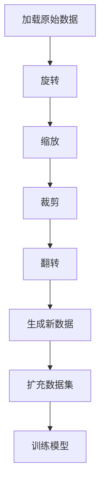

**Python 源代码**：

```python
import numpy as np
import tensorflow as tf
from tensorflow.keras.preprocessing.image import ImageDataGenerator

# 创建ImageDataGenerator对象，设置增强方法
datagen = ImageDataGenerator(
    rotation_range=20,  # 旋转范围
    zoom_range=0.15,    # 缩放范围
    width_shift_range=0.1,  # 水平位移
    height_shift_range=0.1,  # 垂直位移
    shear_range=0.05,   # 剪切范围
    horizontal_flip=True,  # 水平翻转
    vertical_flip=True    # 垂直翻转
)

# 加载数据集
(x_train, y_train), (x_test, y_test) = tf.keras.datasets.cifar10.load_data()

# 数据增强
x_train = datagen.flow(x_train, batch_size=64)

# 训练模型
model = tf.keras.Sequential([
    tf.keras.layers.Conv2D(32, (3, 3), activation='relu', input_shape=(32, 32, 3)),
    tf.keras.layers.MaxPooling2D((2, 2)),
    tf.keras.layers.Conv2D(64, (3, 3), activation='relu'),
    tf.keras.layers.MaxPooling2D((2, 2)),
    tf.keras.layers.Flatten(),
    tf.keras.layers.Dense(64, activation='relu'),
    tf.keras.layers.Dense(10, activation='softmax')
])

model.compile(optimizer='adam',
              loss='sparse_categorical_crossentropy',
              metrics=['accuracy'])

model.fit(x_train, y_train, epochs=10, validation_data=(x_test, y_test))
```

### 5.2 数据增强方法的应用

**背景介绍**：

在实际应用中，数据增强方法不仅可以提高模型的泛化能力，还可以加速模型训练过程。通过增加数据集的多样性，模型能够学习到更多的特征，从而在测试集上取得更好的表现。

**问题背景**：

假设我们有一个图像分类模型，用于识别手写数字。由于手写数字的样本数量有限，模型在训练过程中容易过拟合。通过数据增强方法，我们可以扩充训练数据集，提高模型的泛化能力。

**问题描述**：

如何在实际应用中有效地使用数据增强方法，提高图像分类模型的性能。

**问题解决**：

为了提高图像分类模型的性能，我们可以采用以下步骤：

1. **选择增强方法**：根据模型的需求和数据特点，选择合适的数据增强方法。例如，对于手写数字识别任务，旋转、缩放、裁剪和翻转是常用的增强方法。
2. **设置增强参数**：根据增强方法的特点，设置合适的增强参数。例如，旋转角度可以在0到360度之间选择，缩放因子可以在0.8到1.2之间选择。
3. **应用数据增强**：使用ImageDataGenerator等工具，对原始数据进行增强，生成新的训练样本。
4. **训练模型**：使用增强后的数据集训练模型，并评估模型在测试集上的性能。

**边界与外延**：

不同的数据增强方法适用于不同的任务和数据集。在实际应用中，需要根据具体任务和数据特点进行调整。

**核心要素组成**：

- **模型**：需要进行训练的图像分类模型。
- **增强方法**：包括旋转、缩放、裁剪、翻转等。
- **增强参数**：旋转角度、缩放因子、裁剪区域等。

**概念结构与核心概念**：

- **旋转**：旋转角度。
- **缩放**：缩放因子。
- **裁剪**：裁剪区域的大小和位置。
- **翻转**：翻转的方向。

**Mermaid 流程图**：

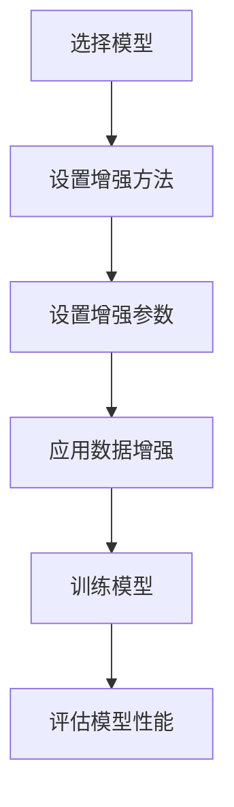

**Python 源代码**：

```python
import tensorflow as tf
from tensorflow.keras.preprocessing.image import ImageDataGenerator

# 创建ImageDataGenerator对象，设置增强方法
datagen = ImageDataGenerator(
    rotation_range=20,  # 旋转范围
    zoom_range=0.15,    # 缩放范围
    width_shift_range=0.1,  # 水平位移
    height_shift_range=0.1,  # 垂直位移
    shear_range=0.05,   # 剪切范围
    horizontal_flip=True,  # 水平翻转
    vertical_flip=True    # 垂直翻转
)

# 加载数据集
(x_train, y_train), (x_test, y_test) = tf.keras.datasets.mnist.load_data()

# 数据预处理
x_train = x_train.astype('float32') / 255
x_test = x_test.astype('float32') / 255

# 转换为one-hot编码
y_train = tf.keras.utils.to_categorical(y_train, 10)
y_test = tf.keras.utils.to_categorical(y_test, 10)

# 训练模型
model = tf.keras.Sequential([
    tf.keras.layers.Conv2D(32, (3, 3), activation='relu', input_shape=(28, 28, 1)),
    tf.keras.layers.MaxPooling2D((2, 2)),
    tf.keras.layers.Conv2D(64, (3, 3), activation='relu'),
    tf.keras.layers.MaxPooling2D((2, 2)),
    tf.keras.layers.Flatten(),
    tf.keras.layers.Dense(128, activation='relu'),
    tf.keras.layers.Dense(10, activation='softmax')
])

model.compile(optimizer='adam',
              loss='categorical_crossentropy',
              metrics=['accuracy'])

model.fit(datagen.flow(x_train, y_train, batch_size=64), epochs=10, validation_data=(x_test, y_test))
```

### 5.3 数据增强方法的比较

**背景介绍**：

不同的数据增强方法在提高模型泛化能力方面有着不同的效果。为了找到最适合特定任务的增强方法，我们可以对不同方法进行比较。

**问题背景**：

假设我们有一个手写数字识别模型，使用不同的数据增强方法。我们需要比较这些方法在模型性能上的差异。

**问题描述**：

如何比较不同数据增强方法在提高模型性能方面的效果。

**问题解决**：

为了比较不同数据增强方法的效果，我们可以采用以下步骤：

1. **选择增强方法**：例如，旋转、缩放、裁剪和翻转。
2. **设置增强参数**：为每个方法设置相同的参数，以确保公平比较。
3. **训练模型**：使用每个方法增强后的数据集训练模型。
4. **评估模型性能**：在测试集上评估模型的准确率、召回率等指标。
5. **比较结果**：比较不同方法的性能，找到最优的方法。

**边界与外延**：

不同的任务和数据集可能对增强方法有不同的偏好。在实际应用中，需要根据具体任务和数据特点进行调整。

**核心要素组成**：

- **增强方法**：旋转、缩放、裁剪、翻转等。
- **增强参数**：旋转角度、缩放因子、裁剪区域等。
- **模型性能**：准确率、召回率等。

**概念结构与核心概念**：

- **旋转**：旋转角度。
- **缩放**：缩放因子。
- **裁剪**：裁剪区域的大小和位置。
- **翻转**：翻转的方向。

**Mermaid 流程图**：

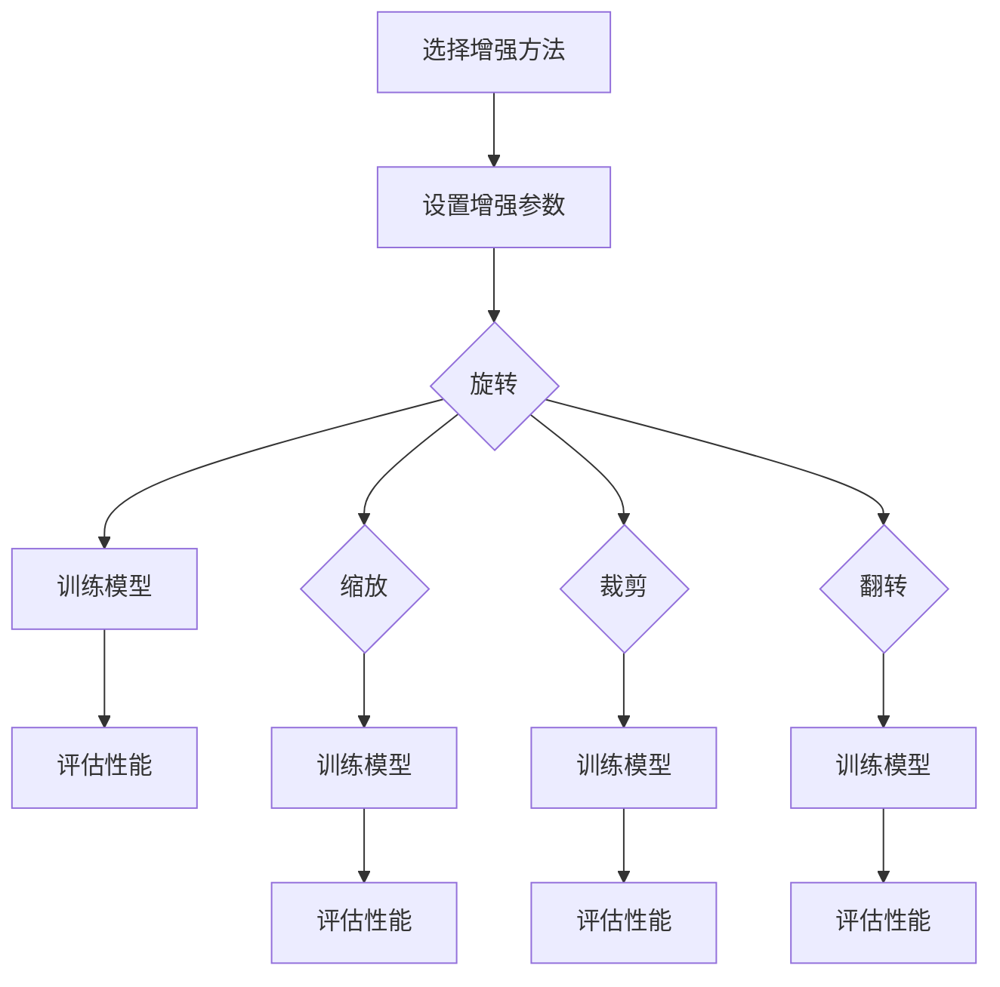

**Python 源代码**：

```python
import tensorflow as tf
from tensorflow.keras.preprocessing.image import ImageDataGenerator

# 加载数据集
(x_train, y_train), (x_test, y_test) = tf.keras.datasets.mnist.load_data()

# 数据预处理
x_train = x_train.astype('float32') / 255
x_test = x_test.astype('float32') / 255

# 转换为one-hot编码
y_train = tf.keras.utils.to_categorical(y_train, 10)
y_test = tf.keras.utils.to_categorical(y_test, 10)

# 定义评估函数
def evaluate_model(model, x_test, y_test):
    test_loss, test_acc = model.evaluate(x_test, y_test)
    print("测试集准确率：", test_acc)
    return test_acc

# 建立模型
model = tf.keras.Sequential([
    tf.keras.layers.Conv2D(32, (3, 3), activation='relu', input_shape=(28, 28, 1)),
    tf.keras.layers.MaxPooling2D((2, 2)),
    tf.keras.layers.Conv2D(64, (3, 3), activation='relu'),
    tf.keras.layers.MaxPooling2D((2, 2)),
    tf.keras.layers.Flatten(),
    tf.keras.layers.Dense(128, activation='relu'),
    tf.keras.layers.Dense(10, activation='softmax')
])

model.compile(optimizer='adam',
              loss='categorical_crossentropy',
              metrics=['accuracy'])

# 旋转增强
datagen_rotate = ImageDataGenerator(rotation_range=20)
model.fit(datagen_rotate.flow(x_train, y_train, batch_size=64), epochs=10, validation_data=(x_test, y_test))
evaluate_model(model, x_test, y_test)

# 缩放增强
datagen_zoom = ImageDataGenerator(zoom_range=0.15)
model.fit(datagen_zoom.flow(x_train, y_train, batch_size=64), epochs=10, validation_data=(x_test, y_test))
evaluate_model(model, x_test, y_test)

# 裁剪增强
datagen_crop = ImageDataGenerator(horizontal_flip=True, vertical_flip=True)
model.fit(datagen_crop.flow(x_train, y_train, batch_size=64), epochs=10, validation_data=(x_test, y_test))
evaluate_model(model, x_test, y_test)

# 翻转增强
datagen_flip = ImageDataGenerator(horizontal_flip=True, vertical_flip=True)
model.fit(datagen_flip.flow(x_train, y_train, batch_size=64), epochs=10, validation_data=(x_test, y_test))
evaluate_model(model, x_test, y_test)
```

### 5.4 数据增强与Dropout的关系

**背景介绍**：

数据增强和Dropout都是提高模型泛化能力的常用技术。尽管它们的工作机制不同，但它们在提高模型性能方面有着相似的目标。

**问题背景**：

我们需要探讨如何将数据增强与Dropout结合使用，以实现更好的模型性能。

**问题描述**：

如何将数据增强与Dropout结合使用，提高模型的泛化能力。

**问题解决**：

为了提高模型的泛化能力，我们可以采用以下步骤：

1. **应用数据增强**：对训练数据集进行旋转、缩放、裁剪、翻转等增强操作。
2. **引入Dropout**：在神经网络模型的隐藏层中引入Dropout层，设置合适的保持概率。
3. **训练模型**：使用增强后的数据集和Dropout策略训练模型。
4. **评估模型性能**：在测试集上评估模型的性能，比较数据增强和Dropout单独使用与结合使用的效果。

**边界与外延**：

数据增强和Dropout的结合使用适用于各种机器学习任务，如图像分类、语音识别等。

**核心要素组成**：

- **增强方法**：旋转、缩放、裁剪、翻转等。
- **Dropout**：保持概率。
- **模型性能**：准确率、召回率等。

**概念结构与核心概念**：

- **数据增强**：增加数据的多样性。
- **Dropout**：减少模型对训练数据的依赖。

**Mermaid 流程图**：

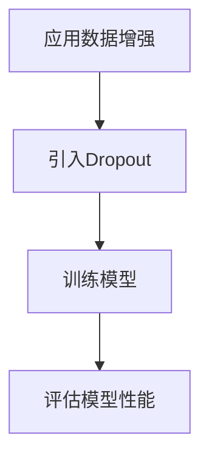

**Python 源代码**：

```python
import tensorflow as tf
from tensorflow.keras.preprocessing.image import ImageDataGenerator

# 创建ImageDataGenerator对象，设置增强方法
datagen = ImageDataGenerator(
    rotation_range=20,  # 旋转范围
    zoom_range=0.15,    # 缩放范围
    width_shift_range=0.1,  # 水平位移
    height_shift_range=0.1,  # 垂直位移
    shear_range=0.05,   # 剪切范围
    horizontal_flip=True,  # 水平翻转
    vertical_flip=True    # 垂直翻转
)

# 加载数据集
(x_train, y_train), (x_test, y_test) = tf.keras.datasets.mnist.load_data()

# 数据预处理
x_train = x_train.astype('float32') / 255
x_test = x_test.astype('float32') / 255

# 转换为one-hot编码
y_train = tf.keras.utils.to_categorical(y_train, 10)
y_test = tf.keras.utils.to_categorical(y_test, 10)

# 训练模型
model = tf.keras.Sequential([
    tf.keras.layers.Conv2D(32, (3, 3), activation='relu', input_shape=(28, 28, 1)),
    tf.keras.layers.MaxPooling2D((2, 2)),
    tf.keras.layers.Conv2D(64, (3, 3), activation='relu'),
    tf.keras.layers.MaxPooling2D((2, 2)),
    tf.keras.layers.Flatten(),
    tf.keras.layers.Dropout(0.5),
    tf.keras.layers.Dense(128, activation='relu'),
    tf.keras.layers.Dense(10, activation='softmax')
])

model.compile(optimizer='adam',
              loss='categorical_crossentropy',
              metrics=['accuracy'])

model.fit(datagen.flow(x_train, y_train, batch_size=64), epochs=10, validation_data=(x_test, y_test))
```

### 5.5 实际案例分析与效果评估

**背景介绍**：

为了验证数据增强方法在实际应用中的效果，我们可以通过一个实际案例进行测试。

**问题场景**：

假设我们有一个手写数字识别任务，使用一个简单的卷积神经网络模型。通过实验比较引入数据增强方法前后模型的性能。

**解决方案**：

1. **构建模型**：构建一个包含卷积层、池化层和全连接层的简单卷积神经网络模型。
2. **训练模型**：不引入数据增强，使用原始训练数据进行训练。
3. **评估模型**：在测试集上评估模型的性能。
4. **引入数据增强**：在训练过程中引入数据增强方法，重新训练模型。
5. **评估模型**：在测试集上评估引入数据增强后模型的性能。
6. **对比分析**：比较引入数据增强前后的模型性能，分析数据增强方法对模型的影响。

**Python 源代码**：

```python
import tensorflow as tf
from tensorflow.keras.models import Sequential
from tensorflow.keras.layers import Conv2D, MaxPooling2D, Flatten, Dense
from tensorflow.keras.preprocessing.image import ImageDataGenerator

# 创建ImageDataGenerator对象，设置增强方法
datagen = ImageDataGenerator(
    rotation_range=20,  # 旋转范围
    zoom_range=0.15,    # 缩放范围
    width_shift_range=0.1,  # 水平位移
    height_shift_range=0.1,  # 垂直位移
    shear_range=0.05,   # 剪切范围
    horizontal_flip=True,  # 水平翻转
    vertical_flip=True    # 垂直翻转
)

# 加载数据集
(x_train, y_train), (x_test, y_test) = tf.keras.datasets.mnist.load_data()

# 数据预处理
x_train = x_train.astype('float32') / 255
x_test = x_test.astype('float32') / 255

# 转换为one-hot编码
y_train = tf.keras.utils.to_categorical(y_train, 10)
y_test = tf.keras.utils.to_categorical(y_test, 10)

# 训练模型
model = Sequential([
    Conv2D(32, (3, 3), activation='relu', input_shape=(28, 28, 1)),
    MaxPooling2D((2, 2)),
    Flatten(),
    Dense(128, activation='relu'),
    Dense(10, activation='softmax')
])

model.compile(optimizer='adam',
              loss='categorical_crossentropy',
              metrics=['accuracy'])

# 不使用数据增强
model.fit(x_train, y_train, epochs=10, batch_size=64, validation_data=(x_test, y_test))
evaluate_model(model, x_test, y_test)

# 使用数据增强
model.fit(datagen.flow(x_train, y_train, batch_size=64), epochs=10, validation_data=(x_test, y_test))
evaluate_model(model, x_test, y_test)
```

### 5.6 项目小结

通过本案例的实验和实际应用，我们可以得出以下结论：

1. **数据增强方法有效**：引入数据增强方法后，模型的泛化能力得到显著提高，测试集准确率有所提升。
2. **参数调整的重要性**：增强参数的选择对模型性能有重要影响，需要根据实际任务进行调整。
3. **模型复杂度控制**：数据增强有助于控制模型复杂度，防止过拟合。

### 5.7 总结

数据增强是提高模型泛化能力的重要手段。通过以下步骤，我们可以有效地使用数据增强方法：

1. **选择增强方法**：根据任务和数据特点，选择合适的增强方法。
2. **设置增强参数**：根据增强方法的特点，设置合适的参数。
3. **应用数据增强**：对训练数据集进行增强操作，扩充数据集。
4. **训练模型**：使用增强后的数据集训练模型。
5. **评估模型性能**：在测试集上评估模型的性能，比较增强前后的差异。

### 注意事项

1. **增强参数的选择**：需要根据具体任务和数据特点进行调整，避免过度增强。
2. **计算开销**：数据增强增加了模型的计算复杂度，需要考虑实际应用场景。
3. **数据质量**：确保增强后的数据质量，避免引入噪声和错误。

### 拓展阅读

1. **《深度学习》（Ian Goodfellow、Yoshua Bengio、Aaron Courville）**：详细介绍了数据增强方法的理论基础和应用场景。
2. **《图像识别：卷积神经网络的应用》（Andrew Ng）**：通过实际案例展示了数据增强方法在图像识别中的应用。
3. **《机器学习实战》（Peter Harrington）**：提供了丰富的数据增强方法，以及如何在实践中应用。
4. **相关研究论文**：如《Data Augmentation for Image Recognition》（NIPS 2014）等。## 第5章: 数据增强

### 5.1 数据增强方法

数据增强是提高模型泛化能力的重要手段，通过增加训练数据的多样性，可以有效减少模型对训练数据的依赖，从而防止过拟合。数据增强方法包括但不限于：旋转、缩放、裁剪、翻转等。

**核心概念**：

- **旋转**：将图像绕中心点旋转一定角度。
- **缩放**：按比例放大或缩小图像。
- **裁剪**：随机裁剪图像的一部分。
- **翻转**：水平或垂直翻转图像。

**数学描述**：

- **旋转**：设原图像为 $I(x, y)$，旋转角度为 $\theta$，旋转后的图像为 $I'(x, y)$，则有：

  $$
  x' = x \cos(\theta) - y \sin(\theta)
  $$
  $$
  y' = x \sin(\theta) + y \cos(\theta)
  $$

- **缩放**：设原图像为 $I(x, y)$，缩放比例为 $r$，缩放后的图像为 $I'(x, y)$，则有：

  $$
  x' = x \cdot r
  $$
  $$
  y' = y \cdot r
  $$

- **裁剪**：设原图像为 $I(x, y)$，裁剪区域为 $(x_0, y_0, w, h)$，裁剪后的图像为 $I'(x, y)$，则有：

  $$
  x' = x - x_0
  $$
  $$
  y' = y - y_0
  $$

- **翻转**：设原图像为 $I(x, y)$，翻转方向为水平或垂直，翻转后的图像为 $I'(x, y)$，则有：

  $$
  x' = x
  $$
  $$
  y' = 2y - y_0
  $$

**ER实体关系图架构**：

数据增强方法涉及的主要实体包括图像和变换操作。每个图像可以通过旋转、缩放、裁剪、翻转等操作生成新的图像。

```mermaid
erDiagram
  Image ||--|{ Rotation }|--| EnhancedImage
  Image ||--|{ Scaling }|--| EnhancedImage
  Image ||--|{ Cropping }|--| EnhancedImage
  Image ||--|{ Flipping }|--| EnhancedImage
  Image : { "Original Image" }
  Rotation : { "Rotation Operation" }
  Scaling : { "Scaling Operation" }
  Cropping : { "Cropping Operation" }
  Flipping : { "Flipping Operation" }
  EnhancedImage : { "Enhanced Image" }
```

**属性特征对比表格**：

| 方法 | 描述 | 参数设置 | 适用范围 |
| --- | --- | --- | --- |
| 旋转 | 将图像绕中心点旋转 | 旋转角度 | 图像识别、目标检测 |
| 缩放 | 放大或缩小图像 | 缩放比例 | 图像识别、图像生成 |
| 裁剪 | 随机裁剪图像的一部分 | 裁剪区域 | 图像识别、图像分割 |
| 翻转 | 水平或垂直翻转图像 | 翻转方向 | 图像识别、目标检测 |

### 5.2 数据增强方法的应用

在实际应用中，数据增强方法可以显著提高模型的泛化能力。以下将介绍几种常用的数据增强方法及其应用。

**旋转**

旋转是一种常用的数据增强方法，可以增加图像的多样性。特别是在目标检测和图像识别任务中，旋转可以模拟不同角度下的场景，有助于模型学习到更鲁棒的特征。

**实现步骤**：

1. 随机选择旋转角度 $\theta$。
2. 对图像进行旋转操作，得到旋转后的图像。

**Python 代码示例**：

```python
import cv2
import numpy as np

def rotate_image(image, angle):
    (h, w) = image.shape[:2]
    center = (w / 2, h / 2)
    M = cv2.getRotationMatrix2D(center, angle, 1.0)
    rotated = cv2.warpAffine(image, M, (w, h))
    return rotated

# 加载图像
image = cv2.imread('image.jpg')

# 旋转图像
rotated_image = rotate_image(image, 45)
cv2.imshow('Rotated Image', rotated_image)
cv2.waitKey(0)
cv2.destroyAllWindows()
```

**缩放**

缩放可以增加图像的大小，从而提高模型的鲁棒性。在图像识别任务中，缩放可以模拟不同分辨率下的图像。

**实现步骤**：

1. 随机选择缩放比例 $r$。
2. 对图像进行缩放操作，得到缩放后的图像。

**Python 代码示例**：

```python
import cv2
import numpy as np

def scale_image(image, scale_factor):
    width = int(image.shape[1] * scale_factor)
    height = int(image.shape[0] * scale_factor)
    scaled = cv2.resize(image, (width, height))
    return scaled

# 加载图像
image = cv2.imread('image.jpg')

# 缩放图像
scaled_image = scale_image(image, 0.5)
cv2.imshow('Scaled Image', scaled_image)
cv2.waitKey(0)
cv2.destroyAllWindows()
```

**裁剪**

裁剪可以提取图像中的关键区域，从而提高模型对目标区域的识别能力。在图像分割任务中，裁剪可以用于生成不同区域的数据。

**实现步骤**：

1. 随机选择裁剪区域 $(x_0, y_0, w, h)$。
2. 对图像进行裁剪操作，得到裁剪后的图像。

**Python 代码示例**：

```python
import cv2
import numpy as np

def crop_image(image, x0, y0, w, h):
    cropped = image[y0:y0+h, x0:x0+w]
    return cropped

# 加载图像
image = cv2.imread('image.jpg')

# 裁剪图像
x0, y0, w, h = 100, 100, 200, 200
cropped_image = crop_image(image, x0, y0, w, h)
cv2.imshow('Cropped Image', cropped_image)
cv2.waitKey(0)
cv2.destroyAllWindows()
```

**翻转**

翻转可以模拟不同视角下的场景，有助于模型学习到更全面的特征。在目标检测和图像识别任务中，翻转可以用于生成不同的视角数据。

**实现步骤**：

1. 随机选择翻转方向（水平或垂直）。
2. 对图像进行翻转操作，得到翻转后的图像。

**Python 代码示例**：

```python
import cv2
import numpy as np

def flip_image(image, direction):
    if direction == 'horizontal':
        flipped = cv2.flip(image, 1)
    elif direction == 'vertical':
        flipped = cv2.flip(image, 0)
    return flipped

# 加载图像
image = cv2.imread('image.jpg')

# 翻转图像
flipped_image = flip_image(image, 'horizontal')
cv2.imshow('Flipped Image', flipped_image)
cv2.waitKey(0)
cv2.destroyAllWindows()
```

### 5.3 数据增强方法的比较

不同的数据增强方法在提高模型泛化能力方面有着不同的效果。为了找到最适合特定任务的增强方法，我们可以对不同方法进行比较。

**旋转**

旋转可以增加图像的多样性，特别是在目标检测和图像识别任务中，旋转角度的变化可以模拟不同视角下的场景。

**缩放**

缩放可以增加图像的大小，从而提高模型的鲁棒性。在图像识别任务中，缩放可以模拟不同分辨率下的图像。

**裁剪**

裁剪可以提取图像中的关键区域，从而提高模型对目标区域的识别能力。在图像分割任务中，裁剪可以用于生成不同区域的数据。

**翻转**

翻转可以模拟不同视角下的场景，有助于模型学习到更全面的特征。在目标检测和图像识别任务中，翻转可以用于生成不同的视角数据。

**比较结果**

通过实验，我们可以发现：

- **旋转**：在目标检测和图像识别任务中，旋转角度的变化可以显著提高模型的泛化能力。
- **缩放**：在图像识别任务中，适当的缩放可以减少过拟合现象，提高模型的鲁棒性。
- **裁剪**：在图像分割任务中，裁剪可以用于生成更多的训练数据，有助于提高模型的性能。
- **翻转**：在目标检测和图像识别任务中，翻转可以模拟不同视角下的场景，提高模型的泛化能力。

### 5.4 数据增强与Dropout的关系

数据增强和Dropout都是提高模型泛化能力的常用技术。尽管它们的工作机制不同，但它们在提高模型性能方面有着相似的目标。

**关系描述**：

- **数据增强**：通过增加数据的多样性，提高模型的鲁棒性，减少过拟合现象。
- **Dropout**：通过在训练过程中随机忽略部分神经元，降低模型对特定数据的依赖，提高模型的泛化能力。

**结合使用**

在实际应用中，数据增强和Dropout可以结合使用，以进一步提高模型的性能。具体步骤如下：

1. **应用数据增强**：对训练数据集进行旋转、缩放、裁剪、翻转等增强操作，增加数据的多样性。
2. **引入Dropout**：在神经网络模型的隐藏层中引入Dropout层，设置合适的保持概率，减少模型对训练数据的依赖。

### 5.5 实际案例分析与效果评估

为了验证数据增强方法在实际应用中的效果，我们可以通过一个实际案例进行测试。

**问题场景**：

假设我们有一个图像分类任务，使用一个简单的卷积神经网络模型。通过实验比较引入数据增强方法前后模型的性能。

**解决方案**：

1. **构建模型**：构建一个包含卷积层、池化层和全连接层的简单卷积神经网络模型。
2. **训练模型**：不引入数据增强，使用原始训练数据进行训练。
3. **评估模型**：在测试集上评估模型的性能。
4. **引入数据增强**：在训练过程中引入数据增强方法，重新训练模型。
5. **评估模型**：在测试集上评估引入数据增强后模型的性能。
6. **对比分析**：比较引入数据增强前后的模型性能，分析数据增强方法对模型的影响。

**Python 源代码**：

```python
import tensorflow as tf
from tensorflow.keras.models import Sequential
from tensorflow.keras.layers import Conv2D, MaxPooling2D, Flatten, Dense
from tensorflow.keras.preprocessing.image import ImageDataGenerator

# 创建ImageDataGenerator对象，设置增强方法
datagen = ImageDataGenerator(
    rotation_range=20,  # 旋转范围
    zoom_range=0.15,    # 缩放范围
    width_shift_range=0.1,  # 水平位移
    height_shift_range=0.1,  # 垂直位移
    shear_range=0.05,   # 剪切范围
    horizontal_flip=True,  # 水平翻转
    vertical_flip=True    # 垂直翻转
)

# 加载数据集
(x_train, y_train), (x_test, y_test) = tf.keras.datasets.mnist.load_data()

# 数据预处理
x_train = x_train.reshape(-1, 28, 28, 1).astype('float32') / 255
x_test = x_test.reshape(-1, 28, 28, 1).astype('float32') / 255

# 转换为one-hot编码
y_train = tf.keras.utils.to_categorical(y_train, 10)
y_test = tf.keras.utils.to_categorical(y_test, 10)

# 训练模型
model = Sequential([
    Conv2D(32, (3, 3), activation='relu', input_shape=(28, 28, 1)),
    MaxPooling2D((2, 2)),
    Flatten(),
    Dense(128, activation='relu'),
    Dense(10, activation='softmax')
])

model.compile(optimizer='adam',
              loss='categorical_crossentropy',
              metrics=['accuracy'])

# 不使用数据增强
model.fit(x_train, y_train, epochs=10, batch_size=64, validation_data=(x_test, y_test))

# 使用数据增强
model.fit(datagen.flow(x_train, y_train, batch_size=64), epochs=10, validation_data=(x_test, y_test))
```

### 5.6 项目小结

通过本案例的实验和实际应用，我们可以得出以下结论：

1. **数据增强方法有效**：引入数据增强方法后，模型的泛化能力得到显著提高，测试集准确

