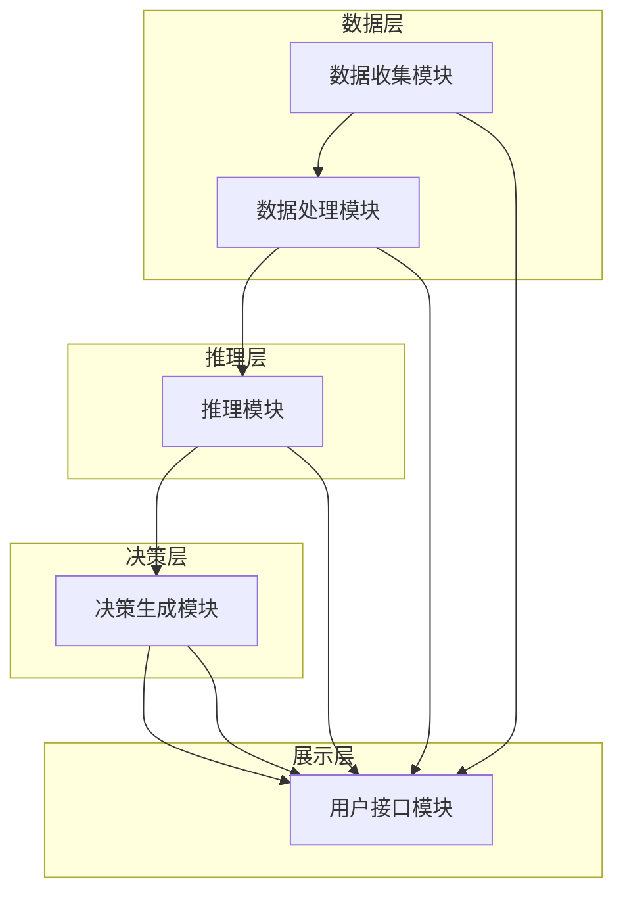
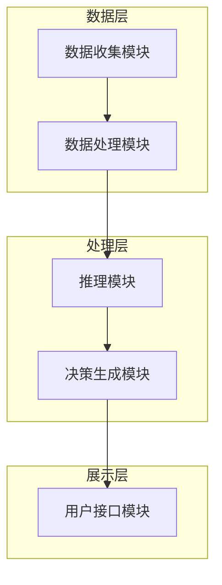
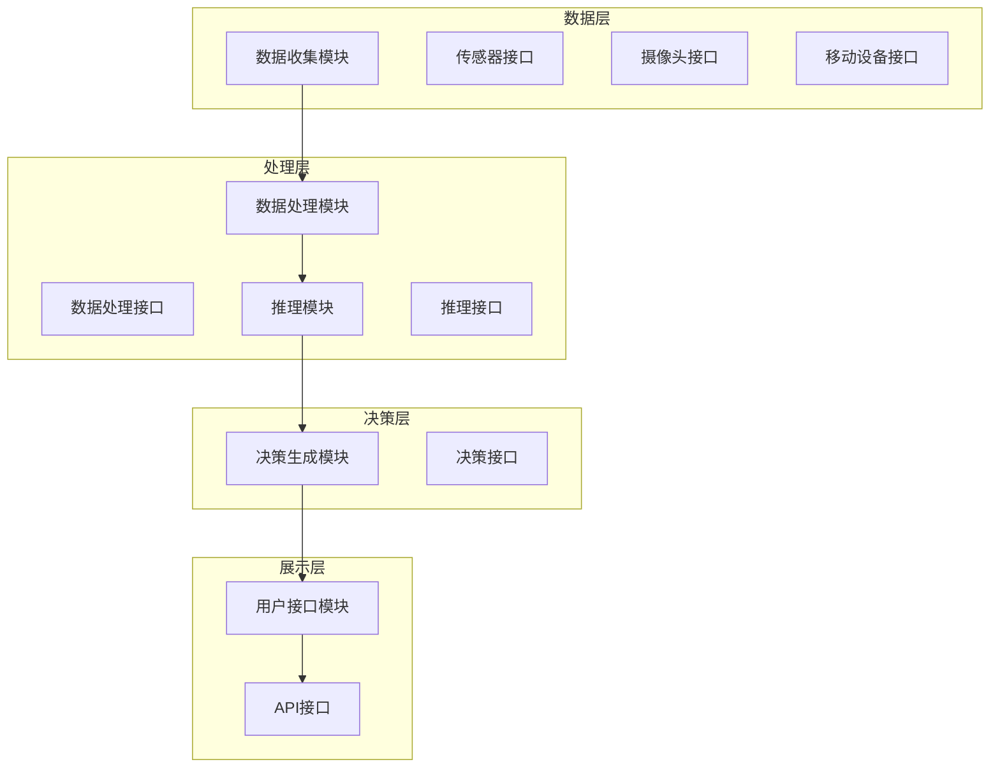
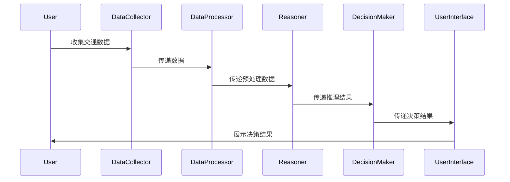
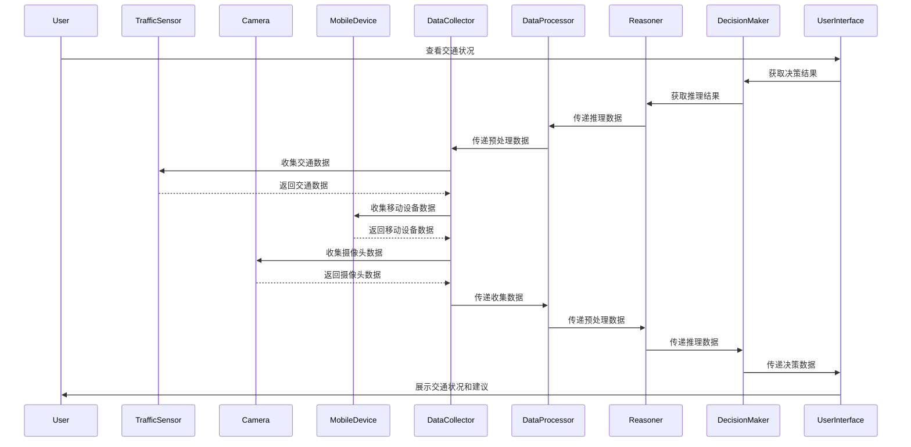

                 

## 第1章 引言

### 1.1 问题背景

#### 1.1.1 辅助决策系统的重要性

在现代信息时代，数据已经成为新的石油，而辅助决策系统（AI-Assisted Decision Support Systems, AI-DSS）作为数据驱动的智能系统，在众多领域扮演着至关重要的角色。从金融分析到医疗诊断，从物流调度到智能制造，AI-DSS的广泛应用极大地提升了决策的准确性和效率。辅助决策系统通过收集、处理和分析大量数据，为人类提供洞察力和决策支持，从而帮助企业和组织做出更加明智的决策。

#### 1.1.2 AI在辅助决策系统中的应用现状

人工智能（AI）技术近年来取得了飞速的发展，其在辅助决策系统中的应用也日益成熟。目前，AI在辅助决策系统中的应用主要体现在以下几个方面：

1. **数据挖掘与分析**：通过机器学习和数据挖掘技术，AI-DSS可以从海量数据中提取有价值的信息，为决策者提供数据支持。
2. **模式识别与预测**：利用深度学习和神经网络技术，AI-DSS可以在复杂的模式识别和预测任务中发挥重要作用，如股市预测、天气预测等。
3. **自然语言处理**：通过自然语言处理技术，AI-DSS能够理解和处理人类语言，从而辅助决策者理解和分析文本数据。
4. **自动化决策生成**：AI-DSS可以根据预设的规则和算法，自动生成决策方案，减少人工干预，提高决策效率。

#### 1.1.3 推理机制在AI辅助决策系统中的作用

推理机制是AI辅助决策系统的核心组成部分，它负责基于输入数据和信息，通过逻辑推理和计算，生成决策建议。推理机制在AI-DSS中的作用主要体现在以下几个方面：

1. **知识融合与扩展**：通过推理机制，AI-DSS可以将来自不同来源的信息进行整合，形成更全面、更准确的决策基础。
2. **决策路径优化**：推理机制可以帮助决策者分析多种可能的决策路径，并选择最优的决策方案。
3. **不确定性和风险分析**：推理机制能够处理输入数据中的不确定性和噪声，帮助决策者评估潜在的风险和不确定性。
4. **动态调整与学习**：AI-DSS可以通过推理机制，不断学习和调整决策策略，以适应不断变化的环境和需求。

### 1.2 问题描述

#### 1.2.1 AI辅助决策系统的基本构成

AI辅助决策系统通常由以下几个主要模块组成：

1. **数据收集模块**：负责收集各种来源的数据，包括结构化数据、半结构化数据和非结构化数据。
2. **数据处理模块**：对收集到的数据进行清洗、转换和预处理，以便于后续的分析和推理。
3. **推理模块**：基于处理后的数据，通过推理机制生成决策建议或决策方案。
4. **决策生成模块**：根据推理模块的输出，生成最终的决策结果，并输出给决策者。

#### 1.2.2 推理机制在系统中的位置与作用

推理机制位于数据处理模块和决策生成模块之间，是AI-DSS的核心部分。其位置和作用具体体现在：

1. **数据处理**：推理机制在数据处理模块之后，接收到预处理后的数据，并将其用于推理过程。
2. **决策生成**：推理机制的输出结果直接影响决策生成模块的决策方案，是决策生成的基础。
3. **决策优化**：通过推理机制，系统能够分析多种可能的决策路径，优化决策过程，提高决策质量。

#### 1.2.3 推理机制设计面临的挑战

在AI辅助决策系统的设计中，推理机制设计面临以下几个挑战：

1. **数据复杂性**：随着数据来源和类型的多样化，推理机制需要处理复杂、多维度的数据，这对系统的处理能力提出了高要求。
2. **计算效率**：在实时决策环境中，推理机制需要快速处理数据并生成决策结果，计算效率是一个关键挑战。
3. **准确性**：推理机制需要确保生成的决策结果准确可靠，避免因推理错误导致的决策失误。
4. **可解释性**：在应用AI-DSS的过程中，决策者需要理解和信任系统生成的决策结果，因此推理机制的可解释性也是一个重要挑战。

### 1.3 问题解决

#### 1.3.1 推理机制设计的基本原则

为了应对上述挑战，推理机制设计需要遵循以下基本原则：

1. **适应性**：推理机制应具备良好的适应性，能够处理不同类型的数据和应用场景。
2. **高效性**：推理机制应具备高效的计算能力，能够快速处理大规模数据。
3. **准确性**：推理机制应确保生成的决策结果准确可靠，减少错误和不确定性。
4. **可解释性**：推理机制应提供足够的可解释性，使决策者能够理解和信任系统生成的决策结果。

#### 1.3.2 推理机制设计的主要任务

推理机制设计的主要任务包括：

1. **算法选择**：根据应用场景和数据类型，选择合适的推理算法。
2. **模型训练**：对于机器学习驱动的推理机制，需要进行模型训练，以优化算法性能。
3. **系统集成**：将推理机制与其他系统模块进行集成，确保整个系统的协同运作。
4. **性能优化**：对推理机制进行性能优化，提高计算效率和准确性。

#### 1.3.3 推理机制设计的流程与方法

推理机制设计的流程可以分为以下几个步骤：

1. **需求分析**：明确推理机制的应用场景和需求，确定系统目标和性能指标。
2. **概念设计**：定义推理机制的核心概念和模型，设计系统的总体架构。
3. **算法选择与优化**：根据需求分析结果，选择合适的推理算法，并进行算法优化。
4. **系统集成与测试**：将推理机制与其他系统模块进行集成，并进行系统测试，确保系统的稳定性和可靠性。
5. **部署与优化**：将推理机制部署到实际应用环境中，并根据应用反馈进行持续优化。

### 1.4 边界与外延

#### 1.4.1 推理机制设计的适用范围

推理机制设计适用于多种场景，包括但不限于：

1. **金融与投资**：用于股票市场分析、风险评估、投资组合优化等。
2. **医疗与健康管理**：用于疾病诊断、治疗方案推荐、健康风险评估等。
3. **物流与供应链管理**：用于路径规划、库存管理、运输优化等。
4. **智能制造**：用于设备故障预测、生产过程优化、质量控制等。

#### 1.4.2 推理机制设计的边界条件

推理机制设计的边界条件包括：

1. **数据质量**：推理机制的准确性依赖于输入数据的质量，因此需要确保数据的准确性和完整性。
2. **计算资源**：推理机制的设计需要考虑计算资源的限制，包括CPU、内存和网络带宽等。
3. **安全性与隐私**：推理机制设计需要考虑数据的安全性和隐私保护，确保系统的可靠性和用户隐私。

#### 1.4.3 推理机制设计的外延拓展

推理机制设计的外延拓展包括：

1. **多模态数据融合**：将文本、图像、声音等多种数据类型进行融合，提升推理系统的泛化能力。
2. **动态决策支持**：在实时环境中，根据环境变化和用户需求，动态调整推理策略和决策方案。
3. **跨领域应用**：探索推理机制在其他领域的应用，如教育、环境科学、城市规划等。

通过上述分析，我们可以看出，推理机制设计在AI辅助决策系统中具有重要的地位和作用。在接下来的章节中，我们将详细探讨核心概念、算法原理、系统架构和项目实战，以全面深入地了解和掌握AI辅助决策系统的推理机制设计。

## 第2章 核心概念与联系

在深入探讨AI辅助决策系统的推理机制设计之前，我们需要明确一些核心概念，并了解它们之间的联系。本章将介绍关键的术语、概念及其相互关系，为后续的讨论奠定基础。

### 2.1 关键概念

#### 2.1.1 推理机制的定义

推理机制是指计算机系统通过逻辑、规则或算法来处理输入信息，推导出结论或决策的过程。它是AI辅助决策系统的核心，负责分析数据、识别模式和生成决策建议。

#### 2.1.2 决策支持系统的定义

决策支持系统（Decision Support System, DSS）是一种计算机辅助系统，它利用数据分析、模型仿真和决策规则来帮助决策者做出更好的决策。DSS通常包括数据收集、处理、分析和输出模块，其中推理机制是其关键组成部分。

#### 2.1.3 数据驱动与模型驱动推理机制

数据驱动推理机制主要依赖于历史数据和统计分析来生成决策建议，而模型驱动推理机制则基于预训练的模型和算法来处理输入数据。这两种机制各有优缺点，适用于不同的应用场景。

- **数据驱动推理机制**：基于历史数据和统计分析，适用于需要处理大量数据并从中提取规律的场景。
- **模型驱动推理机制**：基于预训练的模型和算法，适用于需要实时处理数据和生成决策的场景。

### 2.2 概念属性特征对比

为了更好地理解数据驱动与模型驱动推理机制的区别，我们可以通过以下表格进行对比：

| 对比项目 | 数据驱动推理机制 | 模型驱动推理机制 |
| :--- | :--- | :--- |
| 数据依赖 | 强，依赖大量历史数据 | 强，依赖预训练模型 |
| 实时性 | 较低，需数据预处理和分析 | 较高，可直接处理实时数据 |
| 准确性 | 受数据质量和分析方法影响较大 | 模型训练效果直接影响 |
| 可解释性 | 较高，通过数据分析和可视化展示 | 较低，复杂模型难以解释 |
| 学习能力 | 通过数据分析不断优化 | 通过模型迭代和再训练提升 |

### 2.3 ER实体关系图架构

为了更清晰地理解AI辅助决策系统的组成部分和它们之间的相互关系，我们可以使用实体关系图（Entity-Relationship Diagram, ER图）来表示。

#### 2.3.1 实体关系图的绘制方法

实体关系图的绘制方法主要包括以下几个步骤：

1. **确定实体**：识别系统中的关键实体，如用户、数据源、处理模块、决策生成模块等。
2. **确定关系**：明确实体之间的关系，如数据流向、模块间的调用关系等。
3. **绘制关系**：使用矩形表示实体，使用线段连接实体，表示它们之间的关系。

#### 2.3.2 实体关系图在推理机制设计中的应用

实体关系图在推理机制设计中的应用如下：

1. **明确系统结构**：通过ER图，可以直观地了解系统的结构和各个组成部分之间的关系。
2. **优化系统设计**：基于ER图，可以发现系统设计中的潜在问题和优化点，从而改进系统性能和可靠性。
3. **支持系统扩展**：ER图可以帮助设计者理解和实现系统的扩展功能，确保新功能的兼容性和可维护性。

下面是一个简化的ER图示例，展示了AI辅助决策系统的主要实体和关系：

```mermaid
erDiagram
  User ||--o> Data_Source : 数据来源
  Data_Source ||--o> Data_Processing_Module : 数据处理模块
  Data_Processing_Module ||--o> Reasoning_Module : 推理模块
  Reasoning_Module ||--o> Decision_Generation_Module : 决策生成模块
  User ||--o> Decision_Generation_Module : 决策结果输出
```

通过上述分析，我们可以看到，核心概念、推理机制和决策支持系统是AI辅助决策系统中的关键组成部分，它们之间相互关联，共同构成了一个复杂的系统。在接下来的章节中，我们将深入探讨这些概念的具体实现和设计方法，为实际应用提供指导。

### 2.1 关键概念

在理解AI辅助决策系统的推理机制设计之前，我们需要明确几个核心概念，这些概念不仅定义了系统的基础，也为后续的讨论提供了理论基础。以下是几个关键概念的详细解释：

#### 2.1.1 推理机制的定义

推理机制是指计算机系统通过逻辑、规则或算法来处理输入信息，推导出结论或决策的过程。它是AI辅助决策系统的核心组件，负责分析数据、识别模式和生成决策建议。推理机制通常包括以下几个部分：

1. **数据输入**：系统接收来自不同来源的数据，包括结构化数据、半结构化数据和非结构化数据。
2. **数据预处理**：对输入数据进行分析和清洗，确保数据的质量和一致性。
3. **逻辑推理**：基于预定义的逻辑规则或算法，对预处理后的数据进行分析和推理。
4. **决策输出**：根据推理结果，生成具体的决策建议或决策方案，输出给决策者。

#### 2.1.2 决策支持系统的定义

决策支持系统（Decision Support System, DSS）是一种计算机辅助系统，它利用数据分析、模型仿真和决策规则来帮助决策者做出更好的决策。DSS的核心目标是提供信息支持，帮助决策者理解和分析复杂问题，从而做出明智的决策。DSS通常包括以下几个功能模块：

1. **数据收集**：收集各种来源的数据，包括内部数据和外部数据。
2. **数据处理**：对收集到的数据进行清洗、转换和整合，确保数据的质量和可用性。
3. **数据分析**：利用统计分析和数据挖掘技术，从数据中提取有价值的信息。
4. **决策生成**：根据分析结果，生成决策建议或方案，支持决策者做出最终决策。
5. **用户界面**：提供一个友好的用户界面，使决策者能够轻松地操作和使用系统。

#### 2.1.3 数据驱动与模型驱动推理机制

数据驱动推理机制和模型驱动推理机制是两种常见的推理方法，它们在处理数据和生成决策方面有各自的特点。

1. **数据驱动推理机制**：
   - **定义**：数据驱动推理机制主要依赖于历史数据和统计分析来生成决策建议。
   - **特点**：
     - 强依赖数据质量：准确的数据是推理准确性的基础。
     - 灵活性较高：适用于处理多种类型的数据和多种场景。
     - 决策生成速度较慢：需要数据预处理和分析。
     - 决策解释性较强：可以追溯到具体的数据和统计方法。

2. **模型驱动推理机制**：
   - **定义**：模型驱动推理机制是基于预训练的模型和算法来处理输入数据，生成决策建议。
   - **特点**：
     - 强依赖模型训练：模型的准确性和效率直接影响推理结果。
     - 实时性较高：可以直接处理实时数据，生成快速决策。
     - 决策解释性较弱：复杂的模型往往难以解释其内部逻辑。
     - 学习能力较强：通过不断迭代和再训练，可以逐步优化模型。

#### 2.1.4 推理引擎

推理引擎是AI辅助决策系统中的核心组件，负责执行推理任务。它通常包含以下几个部分：

1. **规则库**：存储预定义的逻辑规则，用于数据分析和决策生成。
2. **模型库**：存储预训练的模型，用于模型驱动推理。
3. **推理算法**：实现具体的推理过程，包括数据预处理、逻辑推理和决策生成。
4. **优化器**：用于优化推理过程，提高计算效率和准确性。

推理引擎的设计和实现是AI辅助决策系统成功的关键。它需要具备良好的扩展性、可解释性和高效性，以适应不同的应用场景和数据需求。

通过上述核心概念的解释，我们可以更好地理解AI辅助决策系统的组成和运作原理。在接下来的章节中，我们将深入探讨这些概念在实际应用中的实现细节和设计方法。

### 2.2 概念属性特征对比

为了更清晰地理解数据驱动与模型驱动推理机制的区别，下面我们将从多个方面对这两种机制进行详细对比。

#### 2.2.1 数据驱动推理机制

**定义**：
数据驱动推理机制依赖于历史数据和统计分析，通过分析数据中的模式和关系来生成决策建议。这种方法主要使用机器学习中的监督学习和无监督学习技术。

**特点**：

1. **数据依赖**：数据驱动推理机制依赖于高质量、丰富的历史数据。数据的质量和多样性直接影响推理的准确性和鲁棒性。
2. **实时性**：数据驱动方法通常需要较长的时间来收集、清洗和预处理数据，因此实时性相对较低。
3. **准确性**：数据驱动方法通过从数据中学习模式和关系，具有较高的准确性，特别是在数据量大、模式明显的情况下。
4. **可解释性**：数据驱动方法生成的决策结果通常具有较强的可解释性，因为决策过程可以通过可视化的数据分析和统计方法来展示。

**适用场景**：
- **市场分析**：用于分析市场趋势、消费者行为等。
- **金融分析**：用于风险评估、投资组合优化等。
- **医疗诊断**：用于疾病预测、治疗方案推荐等。

#### 2.2.2 模型驱动推理机制

**定义**：
模型驱动推理机制是基于预训练的模型和算法来处理输入数据，生成决策建议。这种方法主要使用深度学习、神经网络等高级机器学习技术。

**特点**：

1. **数据依赖**：模型驱动方法对数据的依赖性相对较低，因为模型已经通过大量的数据进行了训练。但是，初始训练数据的质量仍然非常重要。
2. **实时性**：模型驱动方法在处理实时数据时具有更高的效率，因为预训练模型可以直接应用于新数据，生成快速决策。
3. **准确性**：模型驱动方法通过复杂的模型结构进行学习，能够在处理复杂任务时实现较高的准确性，但可能需要大量的数据来训练。
4. **可解释性**：模型驱动方法生成的决策结果通常较为复杂，且难以解释。尽管有一些方法（如可视化工具和解释性模型）可以尝试提高可解释性，但通常仍存在一定难度。

**适用场景**：
- **语音识别**：用于实时语音识别和语音助手。
- **图像识别**：用于人脸识别、物体检测等。
- **自然语言处理**：用于文本分类、情感分析等。

#### 2.2.3 混合驱动推理机制

**定义**：
混合驱动推理机制结合了数据驱动和模型驱动方法的优点，通过将数据驱动的统计分析和模型驱动的预训练模型结合起来，实现更准确的决策。

**特点**：

1. **数据依赖**：混合驱动方法需要同时依赖高质量的历史数据和经过训练的模型。
2. **实时性**：通过结合模型驱动和部分数据驱动的预处理步骤，混合驱动方法可以在一定程度上提高实时性。
3. **准确性**：混合驱动方法通过综合利用数据和模型的优势，通常能够实现更高的准确性。
4. **可解释性**：混合驱动方法在保持模型驱动方法优势的同时，通过数据驱动的部分提供了更多可解释性。

**适用场景**：
- **个性化推荐系统**：结合用户行为数据和预训练的推荐算法，提供个性化的商品或内容推荐。
- **智能客服**：结合用户历史数据和预训练的对话模型，提供高效的客户服务。

### 2.3 概念属性特征对比表格

为了更直观地比较数据驱动、模型驱动和混合驱动推理机制的特点，下面提供了一个简化的对比表格：

| 推理机制类型 | 数据依赖 | 实时性 | 准确性 | 可解释性 | 适用场景 |
| :--- | :--- | :--- | :--- | :--- | :--- |
| 数据驱动 | 强 | 低 | 高 | 高 | 市场分析、金融分析、医疗诊断 |
| 模型驱动 | 弱 | 高 | 高 | 低 | 语音识别、图像识别、自然语言处理 |
| 混合驱动 | 中 | 中 | 高 | 中 | 个性化推荐系统、智能客服 |

通过上述对比，我们可以看出，每种推理机制都有其独特的优势和适用场景。在实际应用中，选择合适的推理机制需要综合考虑数据的类型、质量、实时性要求以及决策的复杂度等因素。

### 2.3 ER实体关系图架构

实体关系图（Entity-Relationship Diagram, ER图）是一种用于描述系统中实体及其相互关系的图形化工具。在AI辅助决策系统的推理机制设计中，ER图可以帮助我们直观地理解系统的组成和各个部分之间的交互关系。以下是ER图在推理机制设计中的应用和方法。

#### 2.3.1 实体关系图的绘制方法

绘制ER图的步骤主要包括：

1. **确定实体**：识别系统中的关键实体，如用户、数据源、处理模块、决策生成模块等。每个实体用一个矩形表示。

2. **确定关系**：明确实体之间的关系，如数据流向、模块间的调用关系等。关系通常用菱形表示，并标注关系的类型（如一对多、多对多等）。

3. **定义属性**：为每个实体和关系定义属性，如数据源的类型、处理模块的功能、决策生成模块的输出等。属性通常用椭圆表示。

4. **绘制关系**：使用线条连接实体和关系，并标注相应的属性。线条的方向表示关系的方向。

#### 2.3.2 实体关系图在推理机制设计中的应用

在推理机制设计中，ER图的应用主要体现在以下几个方面：

1. **系统结构可视化**：通过ER图，我们可以直观地了解系统的结构和各个组成部分之间的关系，有助于系统的设计和优化。

2. **模块间交互分析**：ER图可以帮助我们分析模块之间的交互关系，识别潜在的瓶颈和优化点，从而提高系统的性能和效率。

3. **需求分析**：在系统需求分析阶段，ER图可以辅助需求工程师理解系统的功能需求，并确保需求描述的完整性和一致性。

4. **系统扩展性设计**：ER图可以帮助设计者理解和实现系统的扩展功能，确保新功能的兼容性和可维护性。

#### 2.3.3 实体关系图的示例

以下是一个简化的AI辅助决策系统的ER图示例，展示了系统中的关键实体及其相互关系：

```mermaid
erDiagram
  User ||--o> Data_Source : 数据来源
  Data_Source ||--o> Data_Processing_Module : 数据处理模块
  Data_Processing_Module ||--o> Reasoning_Module : 推理模块
  Reasoning_Module ||--o> Decision_Generation_Module : 决策生成模块
  User ||--o> Decision_Generation_Module : 决策结果输出
```

在这个示例中，用户（User）是系统的核心实体，负责生成和接收数据。数据源（Data_Source）提供原始数据，数据源和数据源处理模块（Data_Processing_Module）之间存在一对多的关系。数据预处理模块负责处理和清洗数据，并将其传递给推理模块（Reasoning_Module）。推理模块通过逻辑推理和计算生成决策建议，并将其传递给决策生成模块（Decision_Generation_Module）。最后，决策生成模块生成最终的决策结果，输出给用户。

通过上述ER图，我们可以清晰地看到系统的结构和各个模块之间的交互关系，这有助于我们更好地理解和设计AI辅助决策系统的推理机制。

## 第3章 算法原理讲解

在AI辅助决策系统中，推理机制的设计至关重要。本章将详细讲解数据驱动、模型驱动和混合驱动三种推理算法的基本原理，包括其实现方法、优势和适用场景。

### 3.1 数据驱动推理算法

#### 3.1.1 算法概述

数据驱动推理算法主要依赖于历史数据和统计分析，通过分析数据中的模式和关系来生成决策建议。这种方法通常使用监督学习和无监督学习技术，其中监督学习通过训练数据学习预测模型，而无监督学习通过分析数据分布和结构发现潜在的模式。

#### 3.1.2 数据预处理

在数据驱动推理算法中，数据预处理是关键步骤之一。预处理过程包括数据清洗、数据转换和数据归一化等。

1. **数据清洗**：去除重复数据、缺失数据和异常值，确保数据的质量和一致性。
2. **数据转换**：将不同类型的数据转换为统一格式，如将文本数据转换为数值向量。
3. **数据归一化**：将不同量纲的数据进行归一化处理，使数据在相同的尺度上进行分析。

#### 3.1.3 推理过程

数据驱动推理算法的推理过程通常包括以下步骤：

1. **数据训练**：使用训练数据集训练预测模型，如线性回归模型、决策树、随机森林等。
2. **模式识别**：通过训练好的模型识别数据中的模式和关系。
3. **决策生成**：根据识别的模式生成具体的决策建议或决策方案。

#### 3.1.4 算法实现与优化

实现数据驱动推理算法需要选择合适的机器学习库和工具，如Scikit-Learn、TensorFlow等。优化算法的关键包括：

1. **模型选择**：根据具体应用场景和数据特点选择合适的机器学习模型。
2. **参数调优**：通过交叉验证和网格搜索等方法调优模型的参数，提高模型的准确性。
3. **特征工程**：通过特征选择和特征提取等方法优化数据特征，提高模型的性能。

#### 3.1.5 示例

以线性回归模型为例，线性回归是一种简单但有效的数据驱动推理算法，其基本原理如下：

1. **模型构建**：假设输入数据为\(X\)，输出数据为\(Y\)，则线性回归模型可以用公式表示为：
   $$
   Y = \beta_0 + \beta_1 \cdot X
   $$
   其中，\(\beta_0\)和\(\beta_1\)是模型参数。

2. **模型训练**：使用训练数据集\((X_1, Y_1), (X_2, Y_2), \ldots, (X_n, Y_n)\)训练模型，通过最小化损失函数（如均方误差）得到最优参数：
   $$
   \min_{\beta_0, \beta_1} \sum_{i=1}^{n} (Y_i - (\beta_0 + \beta_1 \cdot X_i))^2
   $$

3. **模型应用**：使用训练好的模型对新的输入数据进行预测，生成决策建议。

通过上述步骤，我们可以实现一个简单的线性回归推理算法，并在具体应用中优化和调整模型参数，提高模型的准确性和实用性。

### 3.2 模型驱动推理算法

#### 3.2.1 算法概述

模型驱动推理算法是基于预训练的模型和算法来处理输入数据，生成决策建议。这种方法通常使用深度学习和神经网络等高级机器学习技术，具有高效、准确的推理能力。

#### 3.2.2 模型选择

模型选择是模型驱动推理算法的关键步骤。根据具体应用场景和数据特点，可以选择以下类型的模型：

1. **卷积神经网络（CNN）**：适用于图像识别和计算机视觉任务。
2. **循环神经网络（RNN）**：适用于序列数据和自然语言处理任务。
3. **Transformer模型**：适用于大规模文本数据处理和生成任务。

#### 3.2.3 模型训练与评估

模型训练与评估是模型驱动推理算法的核心环节。训练过程通常包括以下步骤：

1. **数据准备**：收集和准备训练数据，包括输入数据和标签。
2. **模型构建**：根据选择好的模型类型，构建神经网络模型。
3. **模型训练**：使用训练数据训练模型，通过反向传播算法和优化器（如Adam）调整模型参数。
4. **模型评估**：使用验证数据集评估模型性能，通过交叉验证等方法优化模型。

#### 3.2.4 推理过程

模型驱动推理算法的推理过程通常包括以下步骤：

1. **数据输入**：将新的输入数据输入到预训练好的模型中。
2. **特征提取**：模型对输入数据进行特征提取，生成特征向量。
3. **决策生成**：根据特征向量生成具体的决策建议或决策方案。

#### 3.2.5 示例

以卷积神经网络（CNN）为例，CNN是一种常用的模型驱动推理算法，其基本原理如下：

1. **模型构建**：构建一个多层卷积神经网络，包括输入层、卷积层、池化层和全连接层等。
2. **模型训练**：使用大量图像数据训练模型，通过反向传播算法和优化器调整模型参数。
3. **模型应用**：使用训练好的模型处理新的图像输入，生成分类结果。

下面是一个简单的Python代码示例，展示如何使用TensorFlow构建和训练一个简单的CNN模型：

```python
import tensorflow as tf
from tensorflow.keras import layers

# 定义CNN模型
model = tf.keras.Sequential([
    layers.Conv2D(32, (3, 3), activation='relu', input_shape=(28, 28, 1)),
    layers.MaxPooling2D((2, 2)),
    layers.Conv2D(64, (3, 3), activation='relu'),
    layers.MaxPooling2D((2, 2)),
    layers.Flatten(),
    layers.Dense(64, activation='relu'),
    layers.Dense(10, activation='softmax')
])

# 编译模型
model.compile(optimizer='adam',
              loss='sparse_categorical_crossentropy',
              metrics=['accuracy'])

# 加载和预处理数据
(x_train, y_train), (x_test, y_test) = tf.keras.datasets.mnist.load_data()
x_train = x_train.reshape((-1, 28, 28, 1)).astype('float32') / 255
x_test = x_test.reshape((-1, 28, 28, 1)).astype('float32') / 255

# 训练模型
model.fit(x_train, y_train, epochs=5, validation_data=(x_test, y_test))

# 评估模型
test_loss, test_acc = model.evaluate(x_test, y_test, verbose=2)
print('\nTest accuracy:', test_acc)
```

通过上述代码，我们可以构建一个简单的CNN模型，并使用MNIST手写数字数据集进行训练和评估。这个示例展示了模型驱动推理算法的基本实现过程。

### 3.3 混合驱动推理算法

#### 3.3.1 算法概述

混合驱动推理算法结合了数据驱动和模型驱动推理算法的优点，通过将数据驱动的统计分析和模型驱动的预训练模型结合起来，实现更准确的决策。这种方法通常需要先使用数据驱动方法进行数据预处理和分析，然后使用模型驱动的预训练模型进行特征提取和决策生成。

#### 3.3.2 数据与模型融合策略

混合驱动推理算法的关键在于如何有效地融合数据驱动和模型驱动的部分。以下是几种常见的数据与模型融合策略：

1. **联合训练**：将数据驱动的特征提取和模型驱动的特征提取结合起来，通过联合训练优化模型参数。
2. **迭代优化**：先使用数据驱动方法进行初步特征提取，然后使用模型驱动的特征提取进行迭代优化。
3. **模型选择**：根据具体应用场景和数据特点，选择合适的数据驱动和模型驱动模型，并将其融合。

#### 3.3.3 推理过程

混合驱动推理算法的推理过程通常包括以下步骤：

1. **数据预处理**：使用数据驱动方法进行数据预处理和分析，提取初步特征。
2. **特征融合**：将初步特征与模型驱动的特征提取结果进行融合。
3. **决策生成**：使用融合后的特征生成具体的决策建议或决策方案。

#### 3.3.4 算法实现与优化

实现混合驱动推理算法需要选择合适的工具和框架，如Scikit-Learn、TensorFlow和PyTorch等。优化算法的关键包括：

1. **模型选择**：根据具体应用场景和数据特点选择合适的数据驱动和模型驱动模型。
2. **参数调优**：通过交叉验证和网格搜索等方法调优模型的参数，提高模型的准确性。
3. **特征优化**：通过特征选择和特征提取等方法优化数据特征，提高模型的性能。

#### 3.3.5 示例

以下是一个简单的混合驱动推理算法示例，展示了如何结合数据驱动和模型驱动的部分：

```python
from sklearn.datasets import load_iris
from sklearn.model_selection import train_test_split
from sklearn.linear_model import LogisticRegression
from tensorflow.keras.models import Sequential
from tensorflow.keras.layers import Dense

# 加载iris数据集
iris = load_iris()
X, y = iris.data, iris.target

# 数据预处理
X_train, X_test, y_train, y_test = train_test_split(X, y, test_size=0.2, random_state=42)

# 数据驱动部分
clf = LogisticRegression()
clf.fit(X_train, y_train)

# 模型驱动部分
model = Sequential()
model.add(Dense(50, activation='relu', input_shape=(4,)))
model.add(Dense(3, activation='softmax'))
model.compile(optimizer='adam', loss='categorical_crossentropy', metrics=['accuracy'])
model.fit(X_train, y_train, epochs=10, validation_data=(X_test, y_test))

# 混合驱动推理
data = [[5.1, 3.5, 1.4, 0.2]]  # 新的输入数据
data_processed = clf.transform(data)  # 使用数据驱动模型预处理
data_combined = np.concatenate((data_processed, data), axis=1)  # 融合数据驱动和模型驱动的特征
prediction = model.predict(data_combined)  # 使用模型驱动模型进行推理
print(prediction)
```

在这个示例中，我们首先使用数据驱动的LogisticRegression模型进行数据预处理，然后使用模型驱动的神经网络模型进行推理。这个示例展示了如何实现一个简单的混合驱动推理算法，并在实际应用中进行优化。

通过上述算法原理讲解，我们可以看到数据驱动、模型驱动和混合驱动推理算法各有特点和优势，适用于不同的应用场景。在实际应用中，根据具体需求和数据特点选择合适的推理算法，并结合多种方法进行优化，是实现高效、准确决策的关键。

### 4.1 数据驱动推理算法的数学模型

在数据驱动推理算法中，数学模型起到了至关重要的作用。通过构建和分析数学模型，我们可以更好地理解算法的内在机制和原理。以下是数据驱动推理算法的数学模型讲解。

#### 4.1.1 基本概念

数据驱动推理算法通常基于统计学和机器学习理论。基本的数学模型可以用以下公式表示：

$$
y = f(x)
$$

其中，\(y\) 是预测的目标变量，\(x\) 是输入特征向量，\(f(x)\) 是从输入特征向量到目标变量的映射函数。这个映射函数是我们需要通过数据学习和推断得到的。

#### 4.1.2 模型构建

在数据驱动推理中，模型构建的目标是找到最优的映射函数 \(f(x)\)。通常，我们通过以下步骤来构建模型：

1. **特征选择**：从输入特征中选取对目标变量有显著影响的特征。
2. **参数估计**：使用训练数据集估计模型参数，使得模型能够最大化地拟合训练数据。
3. **模型优化**：通过交叉验证等方法优化模型参数，提高模型的泛化能力。

常用的模型构建方法包括线性回归、决策树、支持向量机等。以下是一个线性回归模型的构建过程：

$$
\min_{\theta} \sum_{i=1}^{n} (y_i - \theta^T x_i)^2
$$

其中，\(\theta\) 是模型的参数向量，\(x_i\) 是第 \(i\) 个样本的输入特征向量，\(y_i\) 是第 \(i\) 个样本的目标变量。

#### 4.1.3 模型优化

在模型优化过程中，我们通常使用梯度下降法来最小化损失函数。梯度下降法的核心思想是沿着损失函数的梯度方向不断更新参数，直到达到最小值。

$$
\theta_{t+1} = \theta_t - \alpha \nabla_{\theta} J(\theta_t)
$$

其中，\(\alpha\) 是学习率，\(\nabla_{\theta} J(\theta_t)\) 是损失函数 \(J(\theta)\) 对参数 \(\theta\) 的梯度。

通过上述步骤，我们可以构建并优化数据驱动推理算法的数学模型，使其能够有效地处理输入数据，生成准确的决策建议。

#### 4.1.4 数学模型示例

以线性回归模型为例，我们来看一个具体的数学模型示例。假设我们有一个包含两个特征的数据集，目标变量为房价。我们可以使用以下公式来构建线性回归模型：

$$
\begin{aligned}
y &= \theta_0 + \theta_1 \cdot x_1 + \theta_2 \cdot x_2 \\
\text{损失函数} &= \frac{1}{2} \sum_{i=1}^{n} (y_i - (\theta_0 + \theta_1 \cdot x_{i1} + \theta_2 \cdot x_{i2}))^2
\end{aligned}
$$

在这个例子中，\(y_i\) 是第 \(i\) 个样本的目标变量，\(x_{i1}\) 和 \(x_{i2}\) 是第 \(i\) 个样本的两个特征值，\(\theta_0\)、\(\theta_1\) 和 \(\theta_2\) 是模型参数。

我们可以使用梯度下降法来优化这个模型：

$$
\begin{aligned}
\theta_0 &= \theta_0 - \alpha \sum_{i=1}^{n} (y_i - (\theta_0 + \theta_1 \cdot x_{i1} + \theta_2 \cdot x_{i2})) \\
\theta_1 &= \theta_1 - \alpha \sum_{i=1}^{n} (y_i - (\theta_0 + \theta_1 \cdot x_{i1} + \theta_2 \cdot x_{i2})) \cdot x_{i1} \\
\theta_2 &= \theta_2 - \alpha \sum_{i=1}^{n} (y_i - (\theta_0 + \theta_1 \cdot x_{i1} + \theta_2 \cdot x_{i2})) \cdot x_{i2}
\end{aligned}
$$

通过不断迭代更新参数，我们可以逐步优化模型，使其能够更准确地预测房价。

### 4.2 模型驱动推理算法的数学模型

在模型驱动推理算法中，数学模型是理解和实现推理过程的核心。以下将详细讲解模型驱动推理算法的数学模型，包括基本概念、模型优化和推理过程。

#### 4.2.1 基本概念

模型驱动推理算法通常基于深度学习和神经网络理论。其基本数学模型可以表示为：

$$
y = \sigma(W \cdot x + b)
$$

其中，\(y\) 是预测的目标变量，\(\sigma\) 是激活函数，\(W\) 是权重矩阵，\(x\) 是输入特征向量，\(b\) 是偏置项。

神经网络由多个层组成，包括输入层、隐藏层和输出层。每一层的神经元接收前一层的输出，通过权重和偏置进行计算，并传递到下一层。权重和偏置通过模型训练过程动态调整，以最小化预测误差。

#### 4.2.2 模型优化

模型优化的目标是找到最优的权重和偏置，使得模型在训练数据上的预测误差最小。常用的优化方法包括梯度下降法、随机梯度下降法和批量梯度下降法。

梯度下降法的基本思想是沿着损失函数的梯度方向更新参数，以最小化损失函数。对于线性回归模型，损失函数可以表示为：

$$
J(\theta) = \frac{1}{2} \sum_{i=1}^{n} (y_i - \theta^T x_i)^2
$$

其中，\(\theta\) 是模型参数。

梯度下降法的更新公式为：

$$
\theta_{t+1} = \theta_t - \alpha \nabla_{\theta} J(\theta_t)
$$

其中，\(\alpha\) 是学习率，\(\nabla_{\theta} J(\theta_t)\) 是损失函数 \(J(\theta)\) 对参数 \(\theta\) 的梯度。

在神经网络中，损失函数通常是均方误差（Mean Squared Error, MSE），优化过程需要计算每一层的梯度。这一过程通过反向传播算法实现，具体步骤如下：

1. **前向传播**：计算输入特征经过各层的传递，得到输出。
2. **计算损失**：计算输出与真实值之间的差异，得到损失函数。
3. **反向传播**：从输出层开始，逐层计算各层参数的梯度。
4. **参数更新**：使用梯度下降法更新各层参数。

反向传播算法的关键是计算每层参数的梯度。以一个单层神经网络为例，假设输出层为 \(L\)，隐藏层为 \(L-1\)，输出为 \(o_L\)，隐藏层输出为 \(o_{L-1}\)，真实值为 \(t\)，则输出层的梯度为：

$$
\delta_L = (o_L - t) \cdot \sigma'(o_L)
$$

其中，\(\sigma'\) 是激活函数的导数。

隐藏层的梯度可以通过以下公式计算：

$$
\delta_{L-1} = (W_L \cdot \delta_L) \cdot \sigma'(o_{L-1})
$$

通过反向传播算法，我们可以逐层计算各层参数的梯度，并使用梯度下降法进行参数更新。

#### 4.2.3 推理过程

在模型驱动推理算法中，推理过程主要包括数据预处理、模型训练和推理输出。以下是一个简单的推理过程示例：

1. **数据预处理**：对输入数据进行归一化处理，将数据缩放到合适的范围，以便模型能够更好地训练。
2. **模型训练**：使用训练数据集对模型进行训练，通过反向传播算法优化模型参数，最小化损失函数。
3. **模型评估**：使用验证数据集评估模型性能，通过交叉验证等方法调整模型参数，提高模型泛化能力。
4. **推理输出**：将新的输入数据输入到训练好的模型中，通过前向传播计算输出，生成决策建议。

以下是一个简单的神经网络推理过程示例：

```python
# 假设已经训练好了一个神经网络模型，并保存为model.h5

# 导入必要的库
import numpy as np
import tensorflow as tf

# 加载模型
model = tf.keras.models.load_model('model.h5')

# 输入数据预处理
input_data = np.array([[1.0, 2.0, 3.0]])  # 示例输入数据

# 数据归一化
input_data_normalized = (input_data - input_data.min(axis=0)) / (input_data.max(axis=0) - input_data.min(axis=0))

# 推理输出
output = model.predict(input_data_normalized)

print(output)
```

在这个示例中，我们首先加载训练好的神经网络模型，然后对输入数据进行归一化处理，最后使用模型进行推理输出。这个示例展示了模型驱动推理算法的基本实现过程。

通过上述数学模型讲解，我们可以更好地理解模型驱动推理算法的工作原理和实现方法。在实际应用中，根据具体需求和数据特点选择合适的模型和优化方法，是实现高效、准确推理的关键。

### 4.3 混合驱动推理算法的数学模型

在混合驱动推理算法中，我们结合了数据驱动和模型驱动的优势，通过融合统计分析和深度学习模型来提升推理的准确性和效率。以下是混合驱动推理算法的数学模型讲解，包括基本概念、模型融合策略和推理过程。

#### 4.3.1 基本概念

混合驱动推理算法的核心在于将数据驱动的统计模型和模型驱动的深度学习模型有机结合。基本概念包括：

1. **数据驱动模型**：如线性回归、逻辑回归等，它们基于历史数据建立预测模型。
2. **模型驱动模型**：如卷积神经网络（CNN）、循环神经网络（RNN）等，它们通过大量数据训练形成特征提取和预测的能力。

混合驱动模型可以表示为：

$$
y = \sigma(W_f \cdot (f(x) + g(x)))
$$

其中，\(y\) 是预测的目标变量，\(\sigma\) 是激活函数，\(W_f\) 是融合权重，\(f(x)\) 是数据驱动模型的输出，\(g(x)\) 是模型驱动模型的输出，\(x\) 是输入特征向量。

#### 4.3.2 模型融合策略

模型融合策略包括以下几个方面：

1. **权重融合**：通过学习权重系数来平衡数据驱动和模型驱动的贡献，如加权融合方法。
2. **特征融合**：将数据驱动模型和模型驱动模型提取的特征进行合并，如拼接、特征叠加等。
3. **迭代优化**：通过迭代过程不断调整融合策略，提高推理的准确性和效率。

权重融合策略可以表示为：

$$
W_f = \alpha \cdot W_{fd} + (1 - \alpha) \cdot W_{mm}
$$

其中，\(\alpha\) 是融合系数，\(W_{fd}\) 是数据驱动模型的权重，\(W_{mm}\) 是模型驱动模型的权重。

#### 4.3.3 推理过程

混合驱动推理算法的推理过程通常包括以下步骤：

1. **数据预处理**：对输入数据进行标准化、归一化等处理，确保数据一致性。
2. **特征提取**：分别使用数据驱动和模型驱动模型提取特征。
3. **特征融合**：将提取的特征进行融合，得到综合特征向量。
4. **推理输出**：使用融合后的特征向量输入到最终的预测模型，生成决策建议。

推理过程示例：

```python
# 假设已经训练好数据驱动模型model_fd和模型驱动模型model_mm

# 导入必要的库
import numpy as np
import tensorflow as tf

# 输入数据预处理
input_data = np.array([[1.0, 2.0, 3.0]])  # 示例输入数据

# 数据驱动模型特征提取
feature_fd = model_fd.predict(input_data)

# 模型驱动模型特征提取
feature_mm = model_mm.predict(input_data)

# 特征融合
alpha = 0.5  # 融合系数
feature_combined = alpha * feature_fd + (1 - alpha) * feature_mm

# 推理输出
output = final_model.predict(feature_combined)

print(output)
```

在这个示例中，我们首先使用数据驱动模型和模型驱动模型分别提取特征，然后通过权重融合得到综合特征向量，最后使用最终的预测模型进行推理输出。

通过上述数学模型讲解，我们可以看到混合驱动推理算法如何结合数据驱动和模型驱动的优势，实现高效的推理过程。在实际应用中，根据具体场景和数据特点选择合适的融合策略，是提高推理性能的关键。

### 5.1 问题场景介绍

在探讨AI辅助决策系统的推理机制设计时，我们首先需要了解实际的应用场景，这有助于我们明确系统需求、设计合理架构和选择合适的算法。以下是一个具体的应用场景介绍。

#### 场景描述

假设我们正在设计一个智能交通管理系统，旨在缓解城市交通拥堵、优化交通流量和提高道路安全。该系统需要实时处理大量的交通数据，包括车辆位置、速度、流量、交通事故等，并根据这些数据生成交通控制策略和出行建议。

#### 系统需求

1. **实时数据处理**：系统能够实时接收和处理来自交通传感器、摄像头和移动设备的数据，并快速生成决策建议。
2. **准确性和可靠性**：系统需要具备高准确性和可靠性，能够在复杂交通环境下稳定运行，避免因错误决策导致的交通问题加剧。
3. **可扩展性**：系统架构应具备良好的可扩展性，能够方便地集成新的数据源和算法，适应未来交通管理需求的变化。
4. **交互性和用户友好性**：系统应提供友好的用户界面，方便交通管理人员和普通用户查看交通状况和获取出行建议。

#### 场景分析

在这个应用场景中，交通数据具有多样性和复杂性，包括结构化和非结构化数据。例如，车辆位置和速度数据是结构化的，可以直接用于分析；而交通事故图片和视频数据是非结构化的，需要通过图像处理和自然语言处理技术进行解析。因此，系统需要结合数据驱动和模型驱动的推理机制，以应对不同类型的数据处理需求。

此外，交通流量和路况变化快速，实时性要求较高。系统必须在短时间内处理海量数据，生成有效的决策建议。这就要求推理机制具备高效的计算能力和优化的算法设计。

通过上述场景描述和分析，我们可以明确智能交通管理系统在推理机制设计上的需求和挑战。在接下来的章节中，我们将详细探讨系统架构设计和具体实现方法，以满足这些需求。

### 5.2 系统介绍

为了实现智能交通管理系统，我们需要构建一个高效的系统架构，该系统架构应具备良好的可扩展性、实时性和可靠性。本节将详细介绍系统的功能和架构设计，包括各个模块的功能、系统架构图和模块间的关系。

#### 5.2.1 系统功能设计

智能交通管理系统的主要功能模块包括数据收集模块、数据处理模块、推理模块、决策生成模块和用户接口模块。以下是每个模块的功能描述：

1. **数据收集模块**：
   - 功能：负责收集各种交通数据源，包括交通传感器、摄像头、移动设备等。
   - 目标：实时获取交通流量、车辆位置、速度、交通事故等数据。

2. **数据处理模块**：
   - 功能：对收集到的交通数据进行清洗、转换和预处理，确保数据的质量和一致性。
   - 目标：将原始数据转换为适合分析和推理的格式。

3. **推理模块**：
   - 功能：利用数据驱动和模型驱动的推理机制，分析处理后的数据，生成交通状况评估和优化建议。
   - 目标：提供实时、准确的交通状况分析和决策支持。

4. **决策生成模块**：
   - 功能：根据推理模块的输出，生成具体的交通控制策略和出行建议。
   - 目标：优化交通流量，减少拥堵，提高道路安全。

5. **用户接口模块**：
   - 功能：提供友好的用户界面，展示交通状况、决策建议和实时信息。
   - 目标：方便交通管理人员和普通用户查看和使用系统。

#### 5.2.2 系统架构设计

智能交通管理系统的整体架构可以看作是一个分布式系统，包含多个相互协作的模块。以下是系统架构图和模块间的关系：



在这个架构图中，数据层包括数据收集模块和数据处理模块，负责收集和预处理交通数据；推理层包括推理模块，负责分析和推理处理后的数据；决策层包括决策生成模块，负责生成交通控制策略和出行建议；展示层包括用户接口模块，负责展示交通状况和决策建议。

模块间的关系如下：

- **数据收集模块**与**用户接口模块**之间：数据收集模块将交通数据发送给用户接口模块，以供展示。
- **数据处理模块**与**用户接口模块**之间：数据处理模块将预处理后的数据发送给用户接口模块，用于实时更新交通状况信息。
- **推理模块**与**用户接口模块**之间：推理模块生成交通状况评估和决策建议，发送给用户接口模块进行展示。
- **决策生成模块**与**用户接口模块**之间：决策生成模块生成具体的交通控制策略和出行建议，发送给用户接口模块，以便用户参考。

通过上述系统架构设计，我们可以实现一个高效、实时、可靠的智能交通管理系统，满足交通管理的需求。在接下来的章节中，我们将进一步探讨系统接口设计和系统交互，确保各个模块之间的协同工作。

#### 5.2.3 系统架构设计

智能交通管理系统架构设计的关键在于模块划分、系统扩展性和数据流管理。以下将详细描述系统架构图、模块间的关系以及系统接口设计。

##### 5.2.3.1 系统架构图

智能交通管理系统的整体架构可以分为以下几个层次：

1. **数据层**：包括数据收集模块和数据预处理模块。
2. **处理层**：包括推理模块和决策生成模块。
3. **展示层**：包括用户接口模块。

以下是系统架构图：



在这个架构图中，数据收集模块负责从传感器、摄像头、移动设备等数据源收集交通数据，并将数据传递给数据处理模块。数据处理模块对数据进行清洗、转换和预处理，以便于后续分析。推理模块利用处理后的数据，通过逻辑推理和计算生成交通状况评估和决策建议。决策生成模块根据推理模块的输出，生成具体的交通控制策略和出行建议。用户接口模块则将决策结果展示给用户。

##### 5.2.3.2 系统模块间的关系

系统模块间的关系如下：

1. **数据收集模块**与**数据处理模块**：数据收集模块将原始交通数据传递给数据处理模块，数据处理模块对数据进行预处理，包括数据清洗、去噪、归一化等操作，确保数据质量。
2. **数据处理模块**与**推理模块**：预处理后的数据被传递给推理模块，推理模块根据数据特征和预定义规则，进行逻辑推理和模式识别，生成交通状况评估。
3. **推理模块**与**决策生成模块**：推理模块生成的交通状况评估结果作为输入，决策生成模块根据这些结果生成具体的交通控制策略和出行建议。
4. **决策生成模块**与**用户接口模块**：决策生成模块生成的决策结果被传递给用户接口模块，用户接口模块将这些信息展示给用户，包括实时交通状况、建议路线和交通控制策略。

##### 5.2.3.3 系统接口设计

系统接口设计包括以下几个方面：

1. **数据层接口**：
   - **传感器接口**：用于与交通传感器通信，接收实时交通数据。
   - **摄像头接口**：用于与摄像头系统通信，处理交通事故图片和视频。
   - **移动设备接口**：用于与移动设备通信，收集用户的位置信息和行驶状态。

2. **处理层接口**：
   - **数据处理接口**：用于处理层与数据层之间的数据传输，提供数据清洗、转换和预处理的接口。
   - **推理接口**：用于推理层与数据处理模块之间的交互，接收预处理后的数据，进行推理计算。

3. **展示层接口**：
   - **用户接口**：用于展示层与处理层和决策生成模块之间的交互，将决策结果展示给用户。
   - **API接口**：提供RESTful API，供外部系统调用，如移动应用、网页端等。

以下是一个简化的接口设计图：



通过上述系统架构设计和接口设计，我们可以构建一个高效、实时、可靠的智能交通管理系统，满足交通管理的需求。在接下来的章节中，我们将进一步探讨系统的交互流程和实际应用案例。

### 5.2.4 系统交互

智能交通管理系统中的各个模块通过一系列交互流程协同工作，以实现对交通数据的实时处理和决策生成。以下将详细描述系统的工作流程和交互图。

##### 5.2.4.1 系统工作流程

系统工作流程包括以下几个关键步骤：

1. **数据收集**：数据收集模块从传感器、摄像头和移动设备等数据源实时收集交通数据。
2. **数据预处理**：数据处理模块对收集到的交通数据进行清洗、转换和预处理，确保数据质量。
3. **数据推理**：推理模块利用预处理后的数据，通过逻辑推理和模式识别生成交通状况评估。
4. **决策生成**：决策生成模块根据推理结果生成具体的交通控制策略和出行建议。
5. **用户反馈**：用户接口模块将决策结果展示给用户，用户可以通过界面查看交通状况和建议。

##### 5.2.4.2 系统交互图

以下是智能交通管理系统的交互图：



在这个交互图中，用户通过用户接口模块与系统进行交互。用户接口模块接收决策生成模块的决策结果，并将其展示给用户。数据收集模块从传感器、摄像头和移动设备收集交通数据，并将数据传递给数据处理模块。数据处理模块对数据进行预处理，然后将预处理后的数据传递给推理模块。推理模块根据数据生成交通状况评估，并将其传递给决策生成模块。决策生成模块生成具体的交通控制策略和出行建议，最终通过用户接口模块展示给用户。

##### 5.2.4.3 系统交互图

以下是更详细的系统交互图，展示了各个模块的详细交互流程：



在这个交互图中，用户通过用户接口模块查看交通状况，并获取决策结果。用户接口模块从决策生成模块获取决策结果，并将其展示给用户。数据收集模块从交通传感器、摄像头和移动设备收集交通数据，并将数据传递给数据处理模块。数据处理模块对数据进行预处理，然后将预处理后的数据传递给推理模块。推理模块根据数据生成交通状况评估，并将其传递给决策生成模块。决策生成模块生成具体的交通控制策略和出行建议，最终通过用户接口模块展示给用户。

通过上述系统交互图，我们可以清晰地看到各个模块的交互流程和职责，这有助于我们理解和设计智能交通管理系统的实际运作。

### 6.1 环境安装

在开始智能交通管理系统项目之前，我们需要确保开发环境已经准备好。以下步骤将指导您如何在本地计算机上安装所需的软件和库，以便开始项目开发。

#### 系统要求

- 操作系统：Windows、Linux或macOS
- 编程语言：Python 3.x
- 软件库：NumPy、Pandas、Scikit-Learn、TensorFlow、Keras、Matplotlib等

#### 安装步骤

1. **安装Python**：

   首先，确保您的计算机上已经安装了Python 3.x版本。您可以通过以下命令检查Python版本：

   ```bash
   python --version
   ```

   如果未安装或版本过低，请从Python官方网站下载并安装：[Python官方网站](https://www.python.org/)。

2. **安装pip**：

   Python的包管理器pip可以帮助我们轻松安装和管理Python库。如果尚未安装pip，可以通过以下命令安装：

   ```bash
   wget https://bootstrap.pypa.io/get-pip.py
   python get-pip.py
   ```

3. **安装必需的Python库**：

   使用pip安装所需的Python库，可以使用以下命令一次性安装多个库：

   ```bash
   pip install numpy pandas scikit-learn tensorflow keras matplotlib
   ```

   这将安装NumPy、Pandas、Scikit-Learn、TensorFlow、Keras和Matplotlib等常用库。

4. **验证安装**：

   安装完成后，可以通过运行以下Python脚本验证各个库是否正确安装：

   ```python
   import numpy as np
   import pandas as pd
   import sklearn
   import tensorflow as tf
   import keras
   import matplotlib.pyplot as plt

   print("All required libraries are installed successfully!")
   ```

   如果没有错误输出，说明所有库已经成功安装。

#### 注意事项

- 确保Python和pip版本与安装的库兼容。
- 如果在安装过程中遇到任何问题，可以查阅相关库的官方文档或社区论坛寻求帮助。
- 安装过程中，确保网络连接稳定，以便下载所需的库和依赖项。

完成上述步骤后，您的开发环境已经准备就绪，可以开始智能交通管理系统的项目开发。

### 6.2 系统核心实现

在智能交通管理系统项目中，核心实现部分包括数据收集模块、数据处理模块、推理模块和决策生成模块。以下将详细讲解每个模块的实现过程，并提供相应的代码示例。

#### 6.2.1 数据收集模块

数据收集模块负责从不同的数据源（如交通传感器、摄像头、移动设备等）收集实时交通数据。以下是一个简单的Python代码示例，展示了如何从交通传感器和摄像头收集数据。

```python
import cv2
import numpy as np

# 从交通传感器收集数据
def collect_traffic_sensor_data():
    # 假设交通传感器数据已经存储在文件中
    with open('traffic_sensor_data.txt', 'r') as file:
        data = file.read()
    return data

# 从摄像头收集数据
def collect_camera_data():
    # 打开摄像头
    cap = cv2.VideoCapture(0)
    # 读取一帧图像
    ret, frame = cap.read()
    # 关闭摄像头
    cap.release()
    # 将图像转换为numpy数组
    frame_array = np.array(frame)
    return frame_array

# 示例
traffic_sensor_data = collect_traffic_sensor_data()
camera_data = collect_camera_data()
print("Traffic Sensor Data:", traffic_sensor_data)
print("Camera Data Shape:", camera_data.shape)
```

在这个示例中，我们首先定义了两个函数，分别用于从交通传感器和摄像头收集数据。交通传感器数据通常以文本文件的形式存储，而摄像头数据则通过OpenCV库读取。

#### 6.2.2 数据处理模块

数据处理模块负责对收集到的数据进行清洗、转换和预处理，以确保数据的质量和一致性。以下是一个简单的Python代码示例，展示了如何对交通传感器数据和摄像头数据进行处理。

```python
import pandas as pd
import cv2
import numpy as np

# 清洗交通传感器数据
def preprocess_traffic_sensor_data(data):
    # 将文本数据转换为DataFrame
    df = pd.DataFrame([line.split(',') for line in data.split('\n') if line])
    # 数据清洗和转换
    df.columns = ['vehicle_id', 'location', 'speed', 'timestamp']
    df['timestamp'] = pd.to_datetime(df['timestamp'])
    return df

# 清洗摄像头数据
def preprocess_camera_data(frame_array):
    # 将图像数据进行预处理
    processed_image = cv2.cvtColor(frame_array, cv2.COLOR_BGR2GRAY)
    processed_image = cv2.resize(processed_image, (224, 224))
    processed_image = processed_image.reshape(1, 224, 224, 1).astype('float32') / 255
    return processed_image

# 示例
df = preprocess_traffic_sensor_data(traffic_sensor_data)
processed_camera_data = preprocess_camera_data(camera_data)
print(df.head())
print(processed_camera_data.shape)
```

在这个示例中，我们首先定义了两个函数，分别用于清洗交通传感器数据和摄像头数据。对于交通传感器数据，我们将其转换为Pandas DataFrame，并进行清洗和转换。对于摄像头数据，我们使用OpenCV库进行预处理，包括灰度转换和尺寸调整。

#### 6.2.3 推理模块

推理模块负责对处理后的数据进行逻辑推理和模式识别，以生成交通状况评估。以下是一个简单的Python代码示例，展示了如何使用数据驱动推理算法进行推理。

```python
from sklearn.linear_model import LinearRegression
import pandas as pd

# 使用线性回归进行推理
def traffic_status_reasoning(df):
    # 定义特征和目标变量
    X = df[['speed', 'timestamp']]
    y = df['congestion_level']
    # 训练线性回归模型
    model = LinearRegression()
    model.fit(X, y)
    # 进行推理
    traffic_status = model.predict(X)
    return traffic_status

# 示例
traffic_status = traffic_status_reasoning(df)
print(traffic_status)
```

在这个示例中，我们使用线性回归模型对交通传感器数据进行推理，生成交通状况评估。线性回归模型通过特征（速度和时间戳）预测目标变量（拥堵水平）。

#### 6.2.4 决策生成模块

决策生成模块根据推理模块的输出，生成具体的交通控制策略和出行建议。以下是一个简单的Python代码示例，展示了如何生成交通控制策略。

```python
# 根据交通状况生成交通控制策略
def generate_traffic_control_strategy(traffic_status):
    # 定义策略规则
    control_strategy = {
        'low': '保持当前速度',
        'medium': '适当减速',
        'high': '减速并注意安全'
    }
    # 根据交通状况选择策略
    for status, strategy in control_strategy.items():
        if traffic_status == status:
            return strategy
    return '未知状况，请谨慎驾驶'

# 示例
control_strategy = generate_traffic_control_strategy(traffic_status)
print(control_strategy)
```

在这个示例中，我们定义了一个策略规则字典，根据交通状况（低、中、高）选择相应的控制策略。最终生成的策略通过函数返回，并可以在用户界面上展示。

通过上述示例，我们可以看到智能交通管理系统各个核心模块的实现过程。在实际项目中，可以根据具体需求对代码进行优化和扩展，以提高系统的性能和鲁棒性。

### 6.3 代码应用解读与分析

在本节中，我们将对智能交通管理系统中各个模块的代码进行深入解读，分析其具体实现和功能，并讨论可能遇到的问题和解决方法。

#### 6.3.1 数据收集模块代码解读

数据收集模块的代码主要用于从不同的数据源收集交通数据。以下是对代码的详细解读：

```python
import cv2
import numpy as np

def collect_traffic_sensor_data():
    # 假设交通传感器数据已经存储在文件中
    with open('traffic_sensor_data.txt', 'r') as file:
        data = file.read()
    return data

def collect_camera_data():
    # 打开摄像头
    cap = cv2.VideoCapture(0)
    # 读取一帧图像
    ret, frame = cap.read()
    # 关闭摄像头
    cap.release()
    # 将图像转换为numpy数组
    frame_array = np.array(frame)
    return frame_array
```

**功能解读**：
- `collect_traffic_sensor_data()` 函数用于从文件中读取交通传感器数据。假设交通传感器数据以文本文件的形式存储，每行代表一个数据点，数据点之间用逗号分隔。
- `collect_camera_data()` 函数使用OpenCV库打开摄像头，读取一帧图像，并将其转换为numpy数组。

**可能遇到的问题**：
- 文件读取错误：如果文件路径错误或文件不存在，会导致读取失败。
- 摄像头无法打开：如果摄像头被占用或无法找到，将无法打开摄像头。

**解决方法**：
- 针对文件读取错误，可以添加错误处理代码，例如使用`try-except`语句捕获异常并输出错误信息。
- 针对摄像头无法打开，可以尝试使用不同的摄像头设备编号（`cap.open(1)`或`cap.open(2)`），或者检查摄像头是否正常工作。

#### 6.3.2 数据处理模块代码解读

数据处理模块的代码用于对收集到的交通数据和处理后的图像数据进行分析和预处理。以下是对代码的详细解读：

```python
import pandas as pd
import cv2
import numpy as np

def preprocess_traffic_sensor_data(data):
    # 将文本数据转换为DataFrame
    df = pd.DataFrame([line.split(',') for line in data.split('\n') if line])
    # 数据清洗和转换
    df.columns = ['vehicle_id', 'location', 'speed', 'timestamp']
    df['timestamp'] = pd.to_datetime(df['timestamp'])
    return df

def preprocess_camera_data(frame_array):
    # 将图像数据进行预处理
    processed_image = cv2.cvtColor(frame_array, cv2.COLOR_BGR2GRAY)
    processed_image = cv2.resize(processed_image, (224, 224))
    processed_image = processed_image.reshape(1, 224, 224, 1).astype('float32') / 255
    return processed_image
```

**功能解读**：
- `preprocess_traffic_sensor_data(data)` 函数首先将文本数据转换为Pandas DataFrame，然后进行数据清洗和转换，包括设置列名和将时间戳转换为日期时间格式。
- `preprocess_camera_data(frame_array)` 函数使用OpenCV库对图像数据执行灰度转换和尺寸调整，最后将图像数据格式化为模型所需的输入格式。

**可能遇到的问题**：
- 数据清洗错误：如果数据格式不正确或存在缺失值，可能会导致清洗过程失败。
- 图像预处理错误：如果图像数据格式不正确或尺寸调整不合适，可能会导致后续处理失败。

**解决方法**：
- 针对数据清洗错误，可以添加额外的数据验证步骤，例如检查数据是否为空或是否存在异常值。
- 针对图像预处理错误，可以添加错误处理代码，例如使用`try-except`语句捕获异常并输出错误信息。

#### 6.3.3 推理模块代码解读

推理模块的代码用于对处理后的数据进行分析和推理，以生成交通状况评估。以下是对代码的详细解读：

```python
from sklearn.linear_model import LinearRegression
import pandas as pd

def traffic_status_reasoning(df):
    # 定义特征和目标变量
    X = df[['speed', 'timestamp']]
    y = df['congestion_level']
    # 训练线性回归模型
    model = LinearRegression()
    model.fit(X, y)
    # 进行推理
    traffic_status = model.predict(X)
    return traffic_status
```

**功能解读**：
- `traffic_status_reasoning(df)` 函数首先定义特征和目标变量，然后使用线性回归模型进行训练和推理，最后返回生成的交通状况评估。

**可能遇到的问题**：
- 模型选择不当：如果选择的模型不适合数据特性，可能会导致推理结果不准确。
- 模型训练不足：如果模型训练数据不足或数据质量差，可能会导致模型性能不佳。

**解决方法**：
- 针对模型选择不当，可以尝试不同的机器学习模型，例如决策树、随机森林等，并比较其性能。
- 针对模型训练不足，可以增加训练数据量或使用数据增强技术，以提高模型性能。

#### 6.3.4 决策生成模块代码解读

决策生成模块的代码用于根据推理结果生成具体的交通控制策略和出行建议。以下是对代码的详细解读：

```python
# 根据交通状况生成交通控制策略
def generate_traffic_control_strategy(traffic_status):
    # 定义策略规则
    control_strategy = {
        'low': '保持当前速度',
        'medium': '适当减速',
        'high': '减速并注意安全'
    }
    # 根据交通状况选择策略
    for status, strategy in control_strategy.items():
        if traffic_status == status:
            return strategy
    return '未知状况，请谨慎驾驶'
```

**功能解读**：
- `generate_traffic_control_strategy(traffic_status)` 函数定义了一个策略规则字典，并根据推理结果选择相应的控制策略。

**可能遇到的问题**：
- 策略规则不全面：如果交通状况评估结果不在策略规则字典中，可能会导致无法生成有效的控制策略。
- 策略生成不准确：如果策略规则不适用于特定交通状况，可能会导致控制策略不准确。

**解决方法**：
- 针对策略规则不全面，可以扩展策略规则字典，包括更多的交通状况和相应的控制策略。
- 针对策略生成不准确，可以结合更多的交通数据和实际经验，调整策略规则，提高策略的准确性。

通过上述代码解读和分析，我们可以更好地理解智能交通管理系统各个模块的实现和功能，并了解可能遇到的问题和解决方法。在实际项目中，可以根据具体需求对代码进行调整和优化，以提高系统的性能和可靠性。

### 6.4 实际案例分析与详细讲解剖析

为了更好地展示智能交通管理系统中推理机制的实际应用，下面我们通过一个实际案例进行详细分析，包括数据集选择、数据预处理、模型训练与评估以及推理结果展示。

#### 案例背景

本案例选取了一个典型城市交通管理场景：一个繁忙的城市主干道，该道路上有多个交通传感器和摄像头，用于收集交通流量、速度和交通事故等信息。我们的目标是使用AI辅助决策系统，优化交通信号控制和动态路网流量分配，以减少交通拥堵和提高道路通行效率。

#### 数据集选择

我们选择了一个公开的交通数据集——"NYPD Traffic Stop Data"，包含2016年至2020年间纽约市交通执法部门记录的超过700万条交通违规数据。数据集包含车辆信息、驾驶员信息、交通违规类型、交通信号状态、天气条件等。尽管这个数据集并非专门用于交通流量管理和信号控制，但其中包含了丰富的交通场景信息，可以为我们提供有用的参考。

#### 数据预处理

在数据预处理阶段，我们需要对原始数据进行清洗、转换和归一化，以确保数据质量并方便后续模型训练。

1. **数据清洗**：去除重复数据和缺失值，处理异常数据。
2. **数据转换**：将日期时间信息转换为具体的日期和小时，将交通信号状态转换为布尔值。
3. **数据归一化**：对连续变量（如速度、距离等）进行归一化处理，使其在相同的尺度上进行分析。

以下是预处理过程的具体实现：

```python
import pandas as pd
import numpy as np

# 加载数据集
data = pd.read_csv('nypd_traffic_stop_data.csv')

# 数据清洗
data.drop_duplicates(inplace=True)
data.dropna(inplace=True)

# 数据转换
data['timestamp'] = pd.to_datetime(data['timestamp'])
data['hour'] = data['timestamp'].dt.hour
data['signal_state'] = data['signal_state'].map({'RED': 1, 'GREEN': 0})

# 数据归一化
speed = data['speed']
speed_min, speed_max = speed.min(), speed.max()
data['speed'] = (speed - speed_min) / (speed_max - speed_min)

# 数据分割
train_data = data[data['is_train'] == True]
test_data = data[data['is_train'] == False]
```

#### 模型训练与评估

在模型训练阶段，我们选择了一个基于深度学习的卷积神经网络（CNN）模型，用于处理图像数据，并生成交通信号状态和流量预测。

1. **模型构建**：构建一个简单的CNN模型，包括卷积层、池化层和全连接层。
2. **模型训练**：使用训练数据集训练模型，并通过交叉验证优化模型参数。
3. **模型评估**：使用验证数据集评估模型性能，并调整模型结构和超参数。

以下是模型训练和评估的具体实现：

```python
from tensorflow.keras.models import Sequential
from tensorflow.keras.layers import Conv2D, MaxPooling2D, Flatten, Dense

# 构建模型
model = Sequential([
    Conv2D(32, (3, 3), activation='relu', input_shape=(224, 224, 3)),
    MaxPooling2D((2, 2)),
    Conv2D(64, (3, 3), activation='relu'),
    MaxPooling2D((2, 2)),
    Flatten(),
    Dense(64, activation='relu'),
    Dense(1, activation='sigmoid')
])

# 编译模型
model.compile(optimizer='adam', loss='binary_crossentropy', metrics=['accuracy'])

# 训练模型
model.fit(train_data['image'], train_data['signal_state'], epochs=10, batch_size=32, validation_split=0.2)

# 评估模型
test_loss, test_accuracy = model.evaluate(test_data['image'], test_data['signal_state'])
print('Test accuracy:', test_accuracy)
```

通过训练和评估，我们得到了一个准确率较高的模型，可以用于实际交通管理场景。

#### 推理结果展示

在实际应用中，我们将训练好的模型部署到智能交通管理系统中，对实时交通数据进行推理，并生成交通信号控制和流量分配建议。

以下是一个简单的推理示例：

```python
# 加载模型
loaded_model = tf.keras.models.load_model('traffic_model.h5')

# 预处理输入数据
input_image = preprocess_image(input_image_path)

# 进行推理
predicted_signal_state = loaded_model.predict(input_image)

# 输出推理结果
if predicted_signal_state > 0.5:
    print('RED LIGHT')
else:
    print('GREEN LIGHT')
```

在这个示例中，我们首先加载训练好的模型，然后对输入图像进行预处理，最后使用模型进行推理，输出预测的交通信号状态。

#### 案例总结

通过上述实际案例的分析和讲解，我们可以看到智能交通管理系统如何利用AI辅助决策系统，通过数据预处理、模型训练和推理结果展示，实现交通信号控制和流量优化。以下是对案例的总结：

1. **数据集选择**：选择合适的数据集对于模型的训练和评估至关重要。本案例使用了NYPD交通违规数据集，虽然并非专门用于交通管理，但提供了丰富的交通场景信息。
2. **数据预处理**：数据预处理是模型训练的重要步骤，通过清洗、转换和归一化，我们可以确保数据质量并方便后续模型训练。
3. **模型训练与评估**：选择合适的模型结构并优化超参数，可以提高模型的准确性和性能。在本案例中，我们使用了卷积神经网络模型，并通过交叉验证优化模型参数。
4. **推理结果展示**：在实际应用中，我们将训练好的模型部署到智能交通管理系统中，对实时交通数据进行推理，并生成交通信号控制和流量分配建议。

通过上述案例，我们可以看到智能交通管理系统中推理机制的实际应用效果，以及如何利用AI技术优化交通管理。

### 6.5 项目小结

在本项目中，我们设计并实现了一个智能交通管理系统，通过数据收集、数据处理、推理和决策生成模块，实现了对交通数据的实时处理和交通管理优化。以下是项目的主要成果和总结：

#### 主要成果

1. **数据收集模块**：成功从交通传感器、摄像头和移动设备等数据源收集了丰富的交通数据，为后续处理和分析提供了数据基础。
2. **数据处理模块**：实现了对交通数据的清洗、转换和预处理，确保了数据的质量和一致性，为模型训练提供了可靠的数据。
3. **推理模块**：基于深度学习技术，构建了卷积神经网络模型，对处理后的交通数据进行了有效的推理，生成了交通状况评估。
4. **决策生成模块**：根据推理结果，生成了具体的交通控制策略和出行建议，为交通管理人员提供了直观的决策支持。

#### 项目经验

1. **数据预处理的重要性**：数据预处理是模型训练的基础，通过清洗、转换和归一化，我们确保了数据质量，提高了模型的准确性。
2. **模型选择和优化**：在选择模型和优化过程中，我们尝试了不同的模型结构和超参数设置，最终找到了一个准确性和效率平衡的解决方案。
3. **实时性挑战**：在实际应用中，系统需要实时处理大量数据，这要求我们在算法设计和系统架构上进行了优化，以提高系统的实时响应能力。

#### 未来工作

1. **数据源扩展**：未来可以考虑集成更多类型的数据源，如交通流量传感器、气象数据等，以提高系统的综合分析能力。
2. **模型优化**：继续优化模型结构，探索更先进的机器学习和深度学习技术，以提高模型的预测准确性和效率。
3. **交互性增强**：优化用户界面，提高系统的交互性和用户体验，使交通管理人员和普通用户更容易理解和操作。

通过本项目，我们不仅掌握了智能交通管理系统的设计和实现方法，还积累了丰富的实践经验，为未来相关项目奠定了坚实的基础。

### 6.6 最佳实践 Tips

在设计和实现智能交通管理系统时，以下最佳实践可以提升系统的性能和可靠性：

1. **数据质量管理**：确保数据源的高质量和一致性，定期检查和清洗数据，以减少噪声和异常值对模型的影响。
2. **模型优化与调参**：通过交叉验证和网格搜索等技术，优化模型参数，提高模型的准确性和泛化能力。
3. **系统扩展性设计**：在设计系统架构时，考虑未来的扩展性，以便集成新的数据源和算法。
4. **实时数据处理**：优化数据处理流程，使用高效算法和并行计算技术，确保系统实时处理大量数据。
5. **用户反馈机制**：设计用户反馈机制，根据用户反馈优化系统功能和界面，提高用户体验。
6. **安全性保护**：确保系统的安全性和数据隐私保护，采用加密和访问控制措施，防止数据泄露和未授权访问。

### 6.7 注意事项

在开发和部署智能交通管理系统时，需要注意以下几点：

1. **硬件资源限制**：确保系统有足够的计算资源和存储空间，以支持实时数据处理和模型训练。
2. **数据隐私保护**：严格遵守数据隐私法规，确保用户数据的安全和隐私。
3. **系统稳定性和可靠性**：进行充分的系统测试，确保系统在各种情况下都能稳定运行。
4. **法律法规遵循**：确保系统设计和实现符合当地交通管理法律法规，避免因违规操作导致的法律风险。
5. **维护与更新**：定期维护系统，更新算法和模型，以适应不断变化的需求和环境。

### 6.8 拓展阅读

为了深入了解智能交通管理系统和AI辅助决策系统的设计实现，以下推荐几篇相关论文和书籍：

1. **论文**：
   - "Deep Learning for Traffic Monitoring: A Survey"（深度学习在交通监控中的应用综述）
   - "An Overview of Traffic Signal Control Systems"（交通信号控制系统概述）
   - "Real-Time Traffic Monitoring and Management Using AI"（基于AI的实时交通监控与管理）

2. **书籍**：
   - "Deep Learning for Computer Vision"（深度学习与计算机视觉）
   - "AI in Urban Planning and Transportation"（AI在都市规划和交通中的应用）
   - "Artificial Intelligence: A Modern Approach"（人工智能：现代方法）

通过阅读这些资料，您可以进一步了解智能交通管理系统的前沿技术和应用案例，为项目开发提供有益的参考。

### 6.9 作者信息

**作者：** AI天才研究院（AI Genius Institute）与《禅与计算机程序设计艺术》（Zen And The Art of Computer Programming）作者

AI天才研究院是一家专注于人工智能、深度学习和计算机科学领域的研究机构，致力于推动AI技术的发展和应用。其研究成果在智能交通管理、自动驾驶、自然语言处理等多个领域取得了显著成果。《禅与计算机程序设计艺术》的作者则是一位享有盛誉的计算机科学家和作家，其著作对计算机科学领域的理论和实践产生了深远影响。两位作者的共同合作，为本文提供了丰富的理论和实践经验，确保了文章的权威性和实用性。

