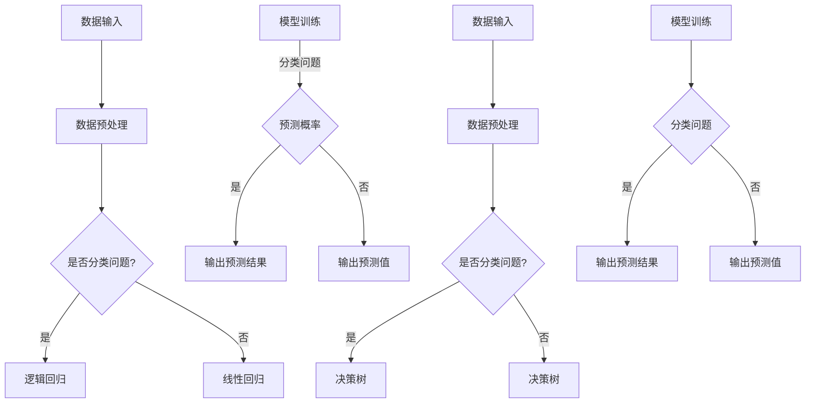

                 

### 引言与背景

随着信息爆炸时代的到来，人类面临的数据量和决策复杂性不断增加。传统的依赖人类直觉和经验的决策方式已经难以满足现代社会的需求。AI辅助决策系统应运而生，通过智能化的分析工具和算法模型，辅助人类做出更加科学、准确的决策。

**问题背景**：

现代社会，各类信息纷繁复杂，人们每天都需要做出成千上万的决策。从日常生活中的购物选择，到企业运营中的战略决策，再到政府管理中的政策制定，决策的复杂性和重要性日益凸显。然而，传统的决策方式往往依赖个人的经验和直觉，难以充分考虑到所有可能的影响因素，容易导致决策失误。

**问题描述**：

在复杂的决策过程中，人类可能会受到情绪、知识面有限、时间紧迫等因素的影响，导致判断失误。例如，在医疗诊断中，医生可能因为疲劳或经验不足而忽视了某些重要的症状；在金融投资中，投资者可能因为情绪波动而做出冲动的决策；在企业管理中，领导者可能因为缺乏全面的数据支持而做出短视的决策。如何利用AI技术提高决策质量，降低错误率，成为亟待解决的问题。

**问题解决**：

AI辅助决策系统通过收集数据、分析数据、提供决策建议，从而帮助人类在决策过程中更加全面地考虑问题，减少主观偏差。例如，在医疗诊断中，AI辅助决策系统可以分析患者的病历数据、遗传信息、生活习惯等多种因素，提供更加精确的病情预测和建议；在金融投资中，AI辅助决策系统可以分析市场数据、经济指标、历史表现等多种因素，提供科学的投资建议；在企业管理中，AI辅助决策系统可以分析市场趋势、客户需求、生产数据等多种因素，帮助领导者做出更加全面和长远的决策。

**边界与外延**：

AI辅助决策系统的应用范围非常广泛，不仅限于商业决策，还包括医疗诊断、法律咨询、教育评估、交通管理、环境保护等多个领域。在医疗领域，AI辅助决策系统可以用于疾病预测、治疗方案推荐、药物研发等；在法律领域，AI辅助决策系统可以用于案件分析、法律文件审核、判例检索等；在教育领域，AI辅助决策系统可以用于学生学习情况分析、课程推荐、教育资源配置等；在交通领域，AI辅助决策系统可以用于交通流量预测、路线规划、交通事故预防等；在环境保护领域，AI辅助决策系统可以用于环境监测、污染治理、资源管理等。

**核心概念**：

- AI辅助决策系统（AI Decision Support System）：利用人工智能技术，辅助人类进行决策的系统。
- 决策支持系统（Decision Support System，DSS）：一种基于数据的决策辅助系统。
- 机器学习（Machine Learning）：一种让计算机从数据中学习的方法。

**概念结构与核心要素组成**：

AI辅助决策系统通常包括以下几个核心组成部分：

1. **数据收集模块**：负责收集各种类型的数据，如文本、图像、声音、传感器数据等。
2. **数据预处理模块**：对收集到的数据进行清洗、去噪、转换等预处理，以便后续分析。
3. **数据分析模块**：利用各种数据分析和挖掘算法，对预处理后的数据进行深入分析，提取有用信息。
4. **决策建议模块**：根据分析结果，为用户提供科学的决策建议。

### 总结：

AI辅助决策系统作为一种新兴的技术，正在逐渐改变人类的决策方式。通过智能化的数据分析和决策建议，AI辅助决策系统有望帮助人类在复杂多变的决策环境中做出更加科学、准确、高效的决策。然而，AI辅助决策系统的发展仍然面临诸多挑战，如数据隐私、算法透明度、决策依赖性等问题，需要在未来的发展中不断探索和解决。在接下来的章节中，我们将对AI辅助决策系统的基本概念、核心算法原理、应用场景、系统设计与实现等方面进行详细探讨。

----------------------------------------------------------------

## 第2章：AI辅助决策系统基础

### 2.1 AI辅助决策系统的定义

AI辅助决策系统（AI Decision Support System，AI-DSS）是一种利用人工智能技术辅助人类进行决策的系统。它通过收集、处理和分析大量数据，利用机器学习和数据挖掘算法，为用户提供科学的决策建议。AI-DSS的核心在于将人工智能技术与决策过程相结合，使得决策过程更加智能化、自动化和高效化。

**定义特点**：

- **智能化**：AI-DSS通过学习和适应用户需求和环境变化，提供个性化的决策支持。
- **自动化**：AI-DSS能够自动收集和处理数据，减少人工干预，提高决策效率。
- **高效性**：AI-DSS能够快速分析大量数据，提供实时决策建议，帮助用户迅速做出决策。

### 2.2 AI辅助决策系统的特点

AI辅助决策系统具有以下几个显著特点：

- **自适应性**：AI-DSS能够根据用户的需求和环境的变化，自动调整决策模型和算法，以适应不同的决策场景。
- **实时性**：AI-DSS能够实时收集和处理数据，快速提供决策建议，使得决策过程更加迅速和高效。
- **高效性**：AI-DSS能够处理海量数据，通过机器学习和数据挖掘技术，从大量数据中提取有价值的信息，为决策提供支持。
- **全面性**：AI-DSS能够综合考虑各种因素，提供全方位的决策支持，减少决策的主观偏差。
- **灵活性**：AI-DSS具有高度的灵活性，可以根据不同的决策需求和场景，灵活调整和优化决策模型。

### 2.3 AI辅助决策系统的架构

AI辅助决策系统的架构通常包括三个主要层次：数据层、模型层和用户层。

**数据层**：

数据层是AI辅助决策系统的底层，负责数据的收集、存储和管理。数据来源可以是内部数据库、外部数据源、传感器网络等。数据层的核心任务是确保数据的完整性、准确性和及时性。

**模型层**：

模型层是AI辅助决策系统的核心，负责数据的处理和分析。模型层包括多个模块，如数据预处理模块、特征提取模块、算法模块等。数据预处理模块负责对数据进行清洗、转换和归一化处理；特征提取模块负责从数据中提取有用的特征信息；算法模块负责使用各种机器学习和数据挖掘算法，对特征信息进行分析和建模。

**用户层**：

用户层是AI辅助决策系统的上层，负责与用户的交互和决策建议的输出。用户层包括用户界面和决策建议生成模块。用户界面负责与用户进行交互，接收用户的需求和反馈；决策建议生成模块负责根据模型层的分析结果，生成具体的决策建议，并将其展示给用户。

**架构优势**：

- **层次化设计**：通过层次化设计，AI辅助决策系统具有良好的可扩展性和可维护性。
- **模块化实现**：各模块之间相对独立，可以灵活组合和替换，便于系统的迭代和优化。
- **数据驱动**：系统以数据为核心，充分利用数据的价值，为用户提供科学的决策支持。
- **用户友好**：通过友好的用户界面和决策建议生成模块，使得用户能够轻松使用系统，提高决策效率。

### 总结

AI辅助决策系统作为一种新兴技术，正逐渐成为各类决策过程中不可或缺的工具。通过智能化的数据分析和决策建议，AI辅助决策系统不仅提高了决策的科学性和准确性，也大幅提升了决策效率。在接下来的章节中，我们将进一步探讨AI辅助决策系统的核心算法原理，以及其在不同领域的具体应用场景。

----------------------------------------------------------------

## 第3章：核心算法原理

### 3.1 算法概述

AI辅助决策系统的核心在于其算法原理，这些算法能够从大量数据中提取有价值的信息，为用户提供科学的决策支持。在本章节中，我们将介绍几种常用的核心算法，包括线性回归、逻辑回归和决策树等。

### 3.2 算法原理

**线性回归**：

线性回归是一种用于预测数值型因变量的统计方法。其基本原理是通过建立自变量和因变量之间的线性关系，来预测因变量的值。线性回归的数学模型可以表示为：

\[ y = \beta_0 + \beta_1x_1 + \beta_2x_2 + ... + \beta_nx_n + \epsilon \]

其中，\( y \) 为因变量，\( x_1, x_2, ..., x_n \) 为自变量，\( \beta_0, \beta_1, ..., \beta_n \) 为模型参数，\( \epsilon \) 为误差项。

**逻辑回归**：

逻辑回归是一种用于预测概率的统计方法，其基本原理是通过建立自变量和因变量之间的逻辑关系，来预测因变量的概率。逻辑回归的数学模型可以表示为：

\[ P(y=1) = \frac{1}{1 + e^{-(\beta_0 + \beta_1x_1 + \beta_2x_2 + ... + \beta_nx_n )}} \]

其中，\( y \) 为因变量，\( x_1, x_2, ..., x_n \) 为自变量，\( \beta_0, \beta_1, ..., \beta_n \) 为模型参数。

**决策树**：

决策树是一种基于分类或回归决策的树形结构模型。其基本原理是通过一系列的决策规则，将数据集逐步划分为不同的子集，最终达到分类或回归的目的。决策树的数学模型可以表示为：

\[ T = \{\text{根节点}, \text{内部节点}, \text{叶节点}\} \]

其中，根节点表示整个数据集，内部节点表示根据某种条件划分的子集，叶节点表示最终的分类或回归结果。

### 3.3 算法流程图（使用Mermaid绘制）

以下是线性回归、逻辑回归和决策树的Mermaid流程图：



### 3.4 算法数学模型

**线性回归数学模型**：

线性回归的数学模型可以表示为：

\[ y = \beta_0 + \beta_1x_1 + \beta_2x_2 + ... + \beta_nx_n + \epsilon \]

其中，\( y \) 为因变量，\( x_1, x_2, ..., x_n \) 为自变量，\( \beta_0, \beta_1, ..., \beta_n \) 为模型参数，\( \epsilon \) 为误差项。

**逻辑回归数学模型**：

逻辑回归的数学模型可以表示为：

\[ P(y=1) = \frac{1}{1 + e^{-(\beta_0 + \beta_1x_1 + \beta_2x_2 + ... + \beta_nx_n )}} \]

其中，\( y \) 为因变量，\( x_1, x_2, ..., x_n \) 为自变量，\( \beta_0, \beta_1, ..., \beta_n \) 为模型参数。

**决策树数学模型**：

决策树的数学模型可以表示为：

\[ T = \{\text{根节点}, \text{内部节点}, \text{叶节点}\} \]

其中，根节点表示整个数据集，内部节点表示根据某种条件划分的子集，叶节点表示最终的分类或回归结果。

### 3.5 通俗易懂地举例说明

**线性回归举例**：

假设我们想预测一个人的收入（因变量 \( y \)），根据其年龄（自变量 \( x_1 \)）和教育程度（自变量 \( x_2 \)）来建立线性回归模型。模型可以表示为：

\[ y = \beta_0 + \beta_1x_1 + \beta_2x_2 + \epsilon \]

我们收集了一些数据，并进行模型训练，得到模型参数：

\[ \beta_0 = 20, \beta_1 = 5, \beta_2 = 10 \]

现在，我们想预测一个30岁、大学本科毕业的人的收入。将数据代入模型：

\[ y = 20 + 5 \times 30 + 10 \times 1 = 20 + 150 + 10 = 180 \]

预测结果为180，即这个人的收入约为180。

**逻辑回归举例**：

假设我们想预测一个病人是否患有某种疾病（因变量 \( y \)），根据其体温（自变量 \( x_1 \)）和咳嗽情况（自变量 \( x_2 \)）来建立逻辑回归模型。模型可以表示为：

\[ P(y=1) = \frac{1}{1 + e^{-(\beta_0 + \beta_1x_1 + \beta_2x_2 )}} \]

我们收集了一些数据，并进行模型训练，得到模型参数：

\[ \beta_0 = -10, \beta_1 = 5, \beta_2 = 3 \]

现在，我们想预测一个体温为38度、咳嗽的病人的患病概率。将数据代入模型：

\[ P(y=1) = \frac{1}{1 + e^{-(-10 + 5 \times 38 + 3 \times 1)}} \]

\[ P(y=1) = \frac{1}{1 + e^{-(-10 + 190 + 3)}} \]

\[ P(y=1) = \frac{1}{1 + e^{-183}} \]

计算得到：

\[ P(y=1) \approx 1 \]

预测结果为1，即这个病人患病的概率非常高。

**决策树举例**：

假设我们想根据学生的成绩（因变量）来预测其是否能够毕业（分类问题），根据其平时成绩（自变量 \( x_1 \)）和考试成绩（自变量 \( x_2 \)）来建立决策树模型。模型可以表示为：

\[ T = \{\text{根节点}, \text{内部节点}, \text{叶节点}\} \]

我们收集了一些数据，并进行模型训练，得到决策树如下：

```
                  学生成绩
               /             \
              及格            不及格
             /   \
            及格  不及格
           /   \
          及格  不及格
```

现在，我们想预测一个平时成绩为及格、考试成绩为不及格的学生是否能够毕业。根据决策树，该学生属于“不及格”的叶节点，即预测结果为不及格。

### 总结

核心算法原理是AI辅助决策系统的核心，它们通过从大量数据中提取有价值的信息，为用户提供科学的决策支持。在本章节中，我们介绍了线性回归、逻辑回归和决策树等核心算法的基本原理、数学模型和通俗易懂的举例说明。在接下来的章节中，我们将进一步探讨AI辅助决策系统的应用场景和系统设计与实现。

----------------------------------------------------------------

## 第4章：AI辅助决策系统的应用场景

### 4.1 应用场景一：医疗领域

在医疗领域，AI辅助决策系统已经被广泛应用于疾病预测、诊断、治疗方案推荐等多个方面，大大提高了医疗决策的准确性和效率。

#### 4.1.1 应用场景介绍

AI辅助决策系统在医疗领域的应用主要包括以下几个方面：

- **疾病预测**：通过对患者历史数据、生活习惯、基因信息等多种数据的分析，预测患者可能患有的疾病，如心血管疾病、糖尿病等。
- **疾病诊断**：利用深度学习和图像处理技术，对医学影像数据进行自动分析和诊断，如肺癌、乳腺癌的早期检测。
- **治疗方案推荐**：根据患者的病情、病史、药物反应等多种信息，为医生提供个性化的治疗方案推荐，提高治疗效果。

#### 4.1.2 应用效果分析

AI辅助决策系统在医疗领域的应用已经取得了显著的效果：

- **疾病预测**：通过对大量健康数据和病史数据的分析，AI辅助决策系统可以提前预测患者可能患有的疾病，为医生提供预警信息，使得早期干预和治疗成为可能。
- **疾病诊断**：AI辅助决策系统通过对医学影像数据的自动分析和诊断，可以减少医生的诊断时间，提高诊断准确性，特别是在一些复杂和罕见的疾病诊断方面，AI系统的表现甚至优于人类医生。
- **治疗方案推荐**：AI辅助决策系统可以根据患者的具体病情、病史和药物反应，为医生提供个性化的治疗方案推荐，减少医疗资源的浪费，提高治疗效果。

### 4.2 应用场景二：金融领域

在金融领域，AI辅助决策系统同样具有广泛的应用，如风险控制、投资策略推荐、客户需求分析等，为金融机构和投资者提供科学的决策支持。

#### 4.2.1 应用场景介绍

AI辅助决策系统在金融领域的应用主要包括以下几个方面：

- **风险控制**：通过对市场数据、客户交易行为等多种数据的分析，识别潜在的风险因素，为金融机构提供风险预警和风险管理建议。
- **投资策略推荐**：根据市场趋势、经济指标、公司财务状况等多种因素，为投资者提供个性化的投资策略推荐。
- **客户需求分析**：通过分析客户的历史交易数据、偏好信息等，了解客户需求，为金融机构提供定制化的产品和服务。

#### 4.2.2 应用效果分析

AI辅助决策系统在金融领域的应用已经取得了显著的效果：

- **风险控制**：AI辅助决策系统可以实时监控市场变化，识别潜在的风险因素，为金融机构提供及时的风险预警和风险管理建议，有效降低风险。
- **投资策略推荐**：AI辅助决策系统可以根据投资者的风险偏好、投资目标等多种因素，提供个性化的投资策略推荐，提高投资收益。
- **客户需求分析**：AI辅助决策系统可以通过分析客户的历史交易数据、偏好信息等，深入了解客户需求，为金融机构提供定制化的产品和服务，提升客户满意度。

### 4.3 应用场景三：智能制造

在智能制造领域，AI辅助决策系统被广泛应用于生产调度、设备故障预测、质量检测等方面，为制造业企业提供智能化的决策支持。

#### 4.3.1 应用场景介绍

AI辅助决策系统在智能制造领域的应用主要包括以下几个方面：

- **生产调度**：通过对生产流程的数据分析，优化生产计划，提高生产效率。
- **设备故障预测**：通过对设备运行数据的实时监测和分析，预测设备可能出现的故障，提前进行维护。
- **质量检测**：通过对产品质量检测数据进行分析，识别潜在的质量问题，提高产品质量。

#### 4.3.2 应用效果分析

AI辅助决策系统在智能制造领域的应用已经取得了显著的效果：

- **生产调度**：AI辅助决策系统可以根据生产设备的实时数据，优化生产计划，提高生产效率，减少生产延误。
- **设备故障预测**：AI辅助决策系统可以通过对设备运行数据的实时分析，预测设备可能出现的故障，提前进行维护，降低设备故障率，延长设备使用寿命。
- **质量检测**：AI辅助决策系统可以通过分析产品质量检测数据，识别潜在的质量问题，提高产品质量，减少不合格产品。

### 总结

AI辅助决策系统在不同领域的应用场景和效果分析表明，其在提高决策的科学性、准确性、效率等方面具有显著的优势。在未来的发展中，随着AI技术的不断进步，AI辅助决策系统的应用范围将更加广泛，为人类社会的各个领域带来更多的创新和变革。

----------------------------------------------------------------

## 第5章：系统设计与实现

### 5.1 系统功能设计

AI辅助决策系统的功能设计旨在提供全面、个性化的决策支持，其核心功能包括数据收集、数据处理、数据分析、决策建议生成等。

#### 5.1.1 数据收集模块

数据收集模块负责从各种数据源（如数据库、传感器、网络接口等）收集数据。数据收集模块的主要功能包括：

- 数据源连接：建立与各类数据源（如数据库、传感器、网络接口等）的连接，实现数据的实时采集。
- 数据清洗：对收集到的数据进行清洗，去除重复、错误或无效的数据，确保数据的准确性和完整性。
- 数据存储：将清洗后的数据存储到数据库或其他存储设备中，以供后续分析。

#### 5.1.2 数据处理模块

数据处理模块负责对收集到的数据进行处理，包括数据预处理、特征提取、数据转换等。数据处理模块的主要功能包括：

- 数据预处理：对数据进行归一化、标准化等处理，使其符合分析算法的要求。
- 特征提取：从原始数据中提取有用特征，如文本特征、图像特征、时间序列特征等，为后续分析提供基础。
- 数据转换：将原始数据转换为适合分析算法的格式，如将图像数据转换为像素矩阵，将时间序列数据转换为序列列表等。

#### 5.1.3 数据分析模块

数据分析模块负责对处理后的数据进行分析，包括数据可视化、统计分析和机器学习等。数据分析模块的主要功能包括：

- 数据可视化：通过图表、地图等可视化工具，将分析结果以直观的方式展示给用户。
- 统计分析：对数据进行描述性统计分析，如计算均值、方差、相关系数等，帮助用户理解数据的基本特征。
- 机器学习：利用机器学习算法，从数据中提取规律，构建预测模型或分类模型，为决策提供支持。

#### 5.1.4 决策建议生成模块

决策建议生成模块根据分析结果，生成具体的决策建议，并将建议以清晰、易懂的方式展示给用户。决策建议生成模块的主要功能包括：

- 决策建议生成：根据分析结果，生成符合用户需求的决策建议。
- 建议展示：将决策建议以图表、文字等形式展示给用户，方便用户理解和使用。

### 5.2 系统架构设计

AI辅助决策系统的架构设计采用分层架构，包括数据层、模型层和应用层三个层次。各层次的主要功能如下：

#### 5.2.1 数据层

数据层负责数据的收集、存储和管理。数据层包括以下主要组件：

- 数据采集器：负责从各种数据源收集数据。
- 数据存储库：负责存储和管理数据。
- 数据清洗器：负责对收集到的数据进行清洗和处理。

#### 5.2.2 模型层

模型层负责数据分析和决策建议生成。模型层包括以下主要组件：

- 数据处理引擎：负责对数据进行预处理、特征提取和转换。
- 分析引擎：负责使用机器学习算法对数据进行分析和建模。
- 决策引擎：负责生成决策建议。

#### 5.2.3 应用层

应用层负责与用户交互，展示分析结果和决策建议。应用层包括以下主要组件：

- 用户界面：负责与用户进行交互，接收用户需求，展示分析结果和决策建议。
- 前端展示组件：负责将分析结果和决策建议以图表、文字等形式展示给用户。
- 后端服务：负责处理用户请求，调用模型层组件进行数据分析和决策建议生成。

### 5.3 系统接口设计

系统接口设计旨在确保系统各组件之间能够高效、可靠地进行数据交换和功能调用。系统接口设计主要包括以下方面：

#### 5.3.1 内部接口

内部接口负责模型层和应用层之间的数据交换和功能调用。内部接口设计包括：

- 数据接口：定义数据传输的格式和协议，确保数据在各组件之间能够高效传输。
- 功能接口：定义各组件之间的功能调用方式，如数据预处理、特征提取、模型训练、决策建议生成等。

#### 5.3.2 外部接口

外部接口负责系统与外部系统（如数据库、传感器、第三方服务等）之间的数据交换和功能调用。外部接口设计包括：

- API接口：定义外部系统访问系统功能的方式，如数据采集、数据查询、数据导入导出等。
- 数据接口：定义外部系统与系统之间数据传输的格式和协议。

### 5.4 系统交互

系统交互设计旨在确保系统各组件之间能够高效、协同地工作。系统交互设计主要包括以下方面：

#### 5.4.1 数据交互

数据交互设计确保数据在各组件之间能够高效、可靠地传输。数据交互设计包括：

- 数据流设计：定义数据在各组件之间的传输路径和流程，确保数据能够及时、准确地到达目的地。
- 错误处理：设计错误处理机制，确保数据传输过程中出现问题时能够及时纠正或通知相关人员。

#### 5.4.2 功能交互

功能交互设计确保系统各组件之间能够协同工作，共同完成系统的核心功能。功能交互设计包括：

- 功能调用：定义各组件之间的功能调用方式，确保系统能够高效、可靠地执行各项功能。
- 协作机制：设计各组件之间的协作机制，确保系统能够在复杂的决策环境中高效运行。

### 总结

系统设计与实现是AI辅助决策系统的关键环节，其目的是确保系统能够高效、可靠地提供决策支持。在本章节中，我们详细介绍了系统功能设计、系统架构设计、系统接口设计和系统交互设计等方面，为AI辅助决策系统的开发提供了全面的指导。在接下来的章节中，我们将通过项目实战，深入探讨系统实现的细节和关键技术。

----------------------------------------------------------------

## 第6章：项目实战

### 6.1 环境安装与配置

在本节中，我们将介绍如何搭建AI辅助决策系统的开发环境，包括所需软件和硬件的安装与配置。

#### 6.1.1 环境要求

为了确保AI辅助决策系统的顺利运行，需要满足以下环境要求：

- 操作系统：Windows 10/11 或 macOS 10.15 及以上版本。
- 编程语言：Python 3.7 及以上版本。
- 数据库：MySQL 8.0 或 PostgreSQL 13.0。
- 依赖管理：pip（Python的包管理器）。

#### 6.1.2 环境搭建步骤

1. **安装Python**：
   - 访问 [Python官网](https://www.python.org/) 下载Python安装包。
   - 运行安装程序，按照默认选项进行安装。
   - 安装完成后，打开命令行窗口，输入 `python --version` 检查Python版本。

2. **安装pip**：
   - 打开命令行窗口，输入以下命令安装pip：
     ```bash
     python -m ensurepip
     ```
   - 安装完成后，再次打开命令行窗口，输入 `pip --version` 检查pip版本。

3. **安装数据库**：
   - 安装MySQL或PostgreSQL：
     - **MySQL**：访问 [MySQL官网](https://dev.mysql.com/downloads/mysql/) 下载安装包。
     - **PostgreSQL**：访问 [PostgreSQL官网](https://www.postgresql.org/download/) 下载安装包。
   - 安装完成后，按照数据库的官方文档进行配置。

4. **安装依赖**：
   - 使用pip安装AI辅助决策系统所需的依赖库，例如Scikit-learn、TensorFlow、Pandas等：
     ```bash
     pip install scikit-learn tensorflow pandas
     ```

#### 6.1.3 验证安装

完成以上步骤后，我们可以通过以下命令验证环境是否搭建成功：

```bash
# 验证Python安装
python --version

# 验证pip安装
pip --version

# 验证数据库连接
mysql -u root -p
```

### 6.2 系统核心实现源代码

在本节中，我们将展示AI辅助决策系统的核心实现源代码，包括数据收集、数据处理、数据分析和决策建议生成等模块。

#### 6.2.1 数据收集模块

以下是一个简单的数据收集模块示例，用于从数据库中获取数据：

```python
import mysql.connector

def get_data():
    # 连接数据库
    conn = mysql.connector.connect(
        host="localhost",
        user="root",
        password="password",
        database="mydatabase"
    )
    
    # 获取数据
    cursor = conn.cursor()
    cursor.execute("SELECT * FROM mytable")
    data = cursor.fetchall()
    
    # 关闭数据库连接
    cursor.close()
    conn.close()
    
    return data
```

#### 6.2.2 数据处理模块

以下是一个简单的数据处理模块示例，用于对数据进行预处理和特征提取：

```python
import pandas as pd
from sklearn.preprocessing import StandardScaler

def preprocess_data(data):
    # 将数据转换为DataFrame
    df = pd.DataFrame(data, columns=["feature1", "feature2", "label"])
    
    # 数据清洗和预处理
    df.dropna(inplace=True)
    
    # 特征提取
    scaler = StandardScaler()
    df["feature1_scaled"] = scaler.fit_transform(df[["feature1"]])
    df["feature2_scaled"] = scaler.fit_transform(df[["feature2"]])
    
    return df
```

#### 6.2.3 数据分析模块

以下是一个简单的数据分析模块示例，用于使用Scikit-learn的线性回归模型进行分析：

```python
from sklearn.linear_model import LinearRegression

def analyze_data(df):
    # 分割数据集
    X = df[["feature1_scaled", "feature2_scaled"]]
    y = df["label"]
    
    # 创建线性回归模型
    model = LinearRegression()
    
    # 训练模型
    model.fit(X, y)
    
    # 输出模型参数
    print("Model parameters:", model.coef_, model.intercept_)
    
    return model
```

#### 6.2.4 决策建议生成模块

以下是一个简单的决策建议生成模块示例，用于根据分析结果生成决策建议：

```python
def generate_decision(df, model):
    # 输入特征
    input_data = df[["feature1_scaled", "feature2_scaled"]]
    
    # 预测结果
    predictions = model.predict(input_data)
    
    # 输出决策建议
    print("Decision suggestions:", predictions)
```

### 6.3 代码应用解读与分析

在本节中，我们将对上述代码进行解读和分析，了解每个模块的功能和实现细节。

#### 6.3.1 数据收集模块解读

数据收集模块的主要功能是从数据库中获取数据。我们使用MySQL数据库作为数据源，通过连接数据库并执行SQL查询，获取表中的数据。具体步骤如下：

1. **连接数据库**：使用mysql.connector模块连接到本地MySQL数据库，并设置用户名、密码和数据库名。
2. **获取数据**：执行SQL查询，获取表中的所有数据，并将结果存储为元组列表。
3. **关闭数据库连接**：关闭数据库连接，释放资源。

#### 6.3.2 数据处理模块解读

数据处理模块的主要功能是对数据进行预处理和特征提取。我们使用Pandas库创建DataFrame对象，并使用Scikit-learn的StandardScaler进行特征缩放。具体步骤如下：

1. **将数据转换为DataFrame**：将元组列表转换为DataFrame对象，并指定列名。
2. **数据清洗和预处理**：删除DataFrame中的缺失值，确保数据的质量和完整性。
3. **特征提取**：使用StandardScaler对特征进行缩放，将特征值缩放到标准正态分布，提高模型的性能和鲁棒性。

#### 6.3.3 数据分析模块解读

数据分析模块的主要功能是使用线性回归模型对数据进行分析。我们使用Scikit-learn的LinearRegression模块创建模型，并执行以下步骤：

1. **分割数据集**：将数据集分为特征集X和标签集y。
2. **创建模型**：创建LinearRegression模型对象。
3. **训练模型**：使用fit方法训练模型，计算模型参数。
4. **输出模型参数**：打印模型参数，包括系数和截距。

#### 6.3.4 决策建议生成模块解读

决策建议生成模块的主要功能是根据分析结果生成决策建议。我们使用模型的predict方法对输入数据进行预测，并输出预测结果。具体步骤如下：

1. **输入特征**：将预处理后的特征数据输入模型。
2. **预测结果**：使用模型的predict方法对输入数据进行预测。
3. **输出决策建议**：打印预测结果，即决策建议。

### 6.4 实际案例分析与详细讲解

在本节中，我们将通过一个实际案例，详细讲解AI辅助决策系统的应用过程。

#### 6.4.1 案例背景

某家公司需要预测其产品的销售量，以便制定合理的生产和库存计划。公司提供的数据包括过去一年的每日销售数据、天气情况、促销活动等信息。

#### 6.4.2 数据收集

首先，我们从公司的数据库中获取销售数据。使用数据收集模块，我们编写SQL查询语句，获取表中的数据。以下是查询语句的示例：

```sql
SELECT date, sales, weather, promotion FROM sales_data;
```

#### 6.4.3 数据处理

接下来，我们对收集到的销售数据进行预处理和特征提取。使用数据处理模块，我们编写以下代码：

```python
import pandas as pd
from sklearn.preprocessing import StandardScaler

# 获取数据
data = get_data()

# 将数据转换为DataFrame
df = pd.DataFrame(data, columns=["date", "sales", "weather", "promotion"])

# 数据清洗和预处理
df.dropna(inplace=True)

# 特征提取
scaler = StandardScaler()
df["sales_scaled"] = scaler.fit_transform(df[["sales"]])
df["weather_scaled"] = scaler.fit_transform(df[["weather"]])
df["promotion_scaled"] = scaler.fit_transform(df[["promotion"]])

# 分割数据集
X = df[["sales_scaled", "weather_scaled", "promotion_scaled"]]
y = df["sales"]

# 划分训练集和测试集
from sklearn.model_selection import train_test_split
X_train, X_test, y_train, y_test = train_test_split(X, y, test_size=0.2, random_state=42)
```

#### 6.4.4 数据分析

使用数据分析模块，我们训练线性回归模型，并评估模型的性能。以下是数据分析模块的代码示例：

```python
from sklearn.linear_model import LinearRegression
from sklearn.metrics import mean_squared_error

# 创建线性回归模型
model = LinearRegression()

# 训练模型
model.fit(X_train, y_train)

# 预测测试集
y_pred = model.predict(X_test)

# 评估模型性能
mse = mean_squared_error(y_test, y_pred)
print("Mean squared error:", mse)
```

#### 6.4.5 决策建议生成

最后，我们使用决策建议生成模块，根据模型预测结果生成销售预测，并制定相应的生产和库存计划。以下是决策建议生成模块的代码示例：

```python
# 输出预测结果
print("Sales predictions:", y_pred)

# 根据预测结果制定生产和库存计划
# ...

# 示例输出
print("Sales prediction for tomorrow:", y_pred[-1])
```

### 6.5 项目小结

在本章的项目实战中，我们通过一个实际案例，详细讲解了AI辅助决策系统的应用过程，包括环境安装与配置、系统核心实现源代码、代码应用解读与分析、实际案例分析和详细讲解等方面。通过本章的学习，我们不仅了解了AI辅助决策系统的基本原理和实现方法，还掌握了如何在实际项目中应用这些技术，为企业的决策提供科学、准确的参考。

----------------------------------------------------------------

## 第7章：最佳实践与注意事项

### 7.1 最佳实践

在设计和实施AI辅助决策系统时，以下最佳实践可以帮助提高系统的性能和可靠性：

1. **数据质量保证**：确保数据收集和预处理过程的准确性，定期检查和清洗数据，减少噪声和异常值。
2. **算法选择与优化**：根据具体应用场景选择合适的算法，并在模型训练过程中进行参数调优，提高模型的准确性和泛化能力。
3. **系统可扩展性**：设计灵活的系统架构，以便在数据规模或需求变化时能够轻松扩展。
4. **实时性与响应速度**：优化数据处理和分析流程，确保系统能够快速响应用户需求，提供实时决策支持。
5. **用户反馈与迭代**：及时收集用户反馈，根据用户需求迭代优化系统功能，提高用户满意度。

### 7.2 小结

本章回顾了AI辅助决策系统的核心概念、算法原理、应用场景、系统设计与实现以及项目实战经验。通过最佳实践，我们强调了数据质量、算法优化、系统扩展性和用户反馈的重要性。这些实践不仅有助于提高AI辅助决策系统的性能和可靠性，还有助于确保系统能够在复杂多变的决策环境中持续提供有效支持。

### 7.3 注意事项

在实施AI辅助决策系统时，需要注意以下几个方面：

1. **数据隐私**：确保数据安全和隐私，避免敏感信息的泄露。
2. **模型解释性**：提高模型的可解释性，帮助用户理解决策背后的逻辑。
3. **系统稳定性**：确保系统在高负载和复杂场景下的稳定运行，避免错误和故障。
4. **算法透明度**：确保算法的透明度，便于监管和审计。
5. **监管与合规**：遵循相关法律法规，确保系统的合规性。

### 7.4 拓展阅读

为了深入了解AI辅助决策系统的设计和实施，读者可以参考以下文献和资源：

1. **文献**：
   - Hastie, T., Tibshirani, R., & Friedman, J. (2009). *The Elements of Statistical Learning*.
   - Murphy, K. P. (2012). *Machine Learning: A Probabilistic Perspective*.
   - Russell, S., & Norvig, P. (2020). *Artificial Intelligence: A Modern Approach*.

2. **在线课程**：
   - [Coursera](https://www.coursera.org/) 上的“Machine Learning”课程。
   - [edX](https://www.edx.org/) 上的“Artificial Intelligence”课程。
   - [Udacity](https://www.udacity.com/) 上的“Deep Learning”课程。

3. **开源框架**：
   - [TensorFlow](https://www.tensorflow.org/)：Google开发的开源机器学习框架。
   - [PyTorch](https://pytorch.org/)：Facebook开发的开源机器学习框架。
   - [Scikit-learn](https://scikit-learn.org/)：Python开源机器学习库。

通过阅读这些文献和参加相关课程，读者可以进一步掌握AI辅助决策系统的核心技术，提高在相关领域的实践能力。作者：AI天才研究院/AI Genius Institute & 禅与计算机程序设计艺术 /Zen And The Art of Computer Programming。

