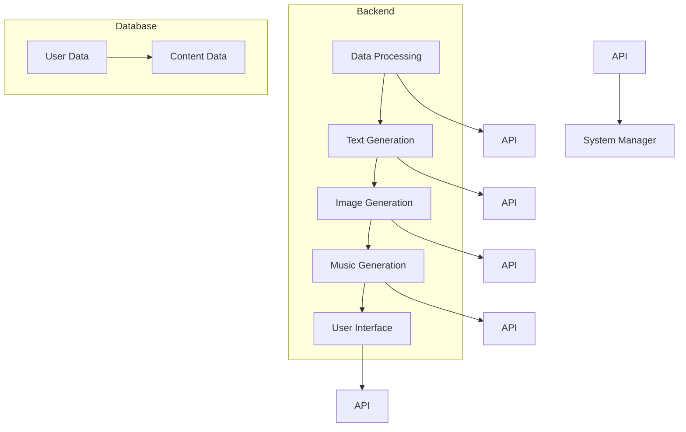
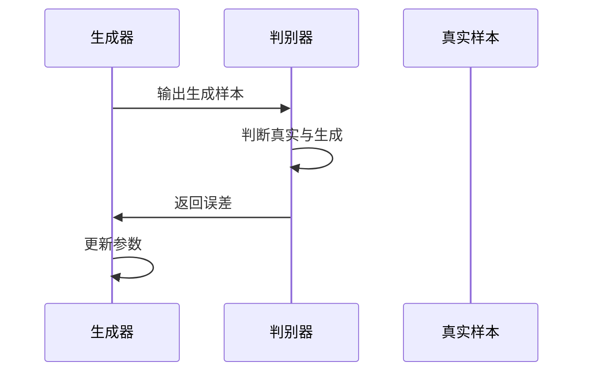
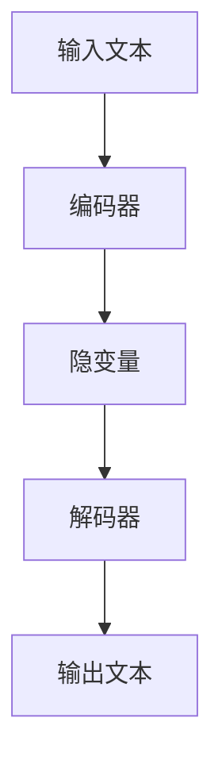

                 

### 第一部分：AI辅助创作工具概述

## 第1章：AI辅助创作工具基础

### 1.1 AI辅助创作工具的概念与定义

人工智能（AI）辅助创作工具是一种利用人工智能技术来协助人类进行创作活动的软件或平台。这些工具通过机器学习、自然语言处理（NLP）、计算机视觉等技术，可以自动生成文本、图像、音乐、视频等多种类型的内容。AI辅助创作工具的核心目标是提高创作效率、拓展创作思路，并优化创作体验。

AI辅助创作工具的定义可以从以下几个方面进行解释：

1. **技术基础**：主要包括机器学习、深度学习、自然语言处理、计算机视觉等技术。这些技术为AI辅助创作工具提供了强大的数据处理和模式识别能力。
   
2. **应用领域**：AI辅助创作工具广泛应用于文学创作、音乐创作、艺术设计、影视制作、游戏开发等多个领域。

3. **功能特点**：AI辅助创作工具通常具备以下功能特点：
   - **文本生成**：基于NLP技术，能够生成新闻文章、小说、故事脚本等。
   - **图像生成**：利用生成对抗网络（GAN）等技术，能够生成逼真的图像或艺术作品。
   - **音乐创作**：通过分析和生成音乐旋律、和声等，帮助音乐人进行创作。
   - **视频编辑**：自动剪辑、添加特效，提高视频制作效率。

### 1.2 AI辅助创作工具的发展历程

AI辅助创作工具的发展经历了从传统工具到现代AI技术的演进过程。以下是AI辅助创作工具的发展历程：

1. **早期阶段**（1940s-1980s）：
   - 人工智能概念提出，研究人员开始探索如何让机器模拟人类的智能行为。
   - 早期AI系统主要集中于逻辑推理和问题解决，创作工具相对简单。

2. **人工智能复兴期**（1990s-2000s）：
   - 机器学习和深度学习技术的发展，为AI辅助创作提供了新动力。
   - 出现了如自动文本生成工具、图像编辑软件等早期AI辅助创作工具。

3. **现代AI时代**（2010s至今）：
   - 计算力和数据资源的大幅提升，AI技术取得重大突破。
   - AI辅助创作工具的功能日益丰富，应用领域不断拓展。

### 1.3 AI辅助创作工具的应用领域

AI辅助创作工具的应用领域广泛，以下是一些主要的应用场景：

1. **文学创作**：
   - 自动生成新闻文章、小说、故事脚本等，帮助记者和作家提高创作效率。
   - 智能写作助手，如GPT-3，能够生成高质量的文本内容。

2. **艺术设计**：
   - AI生成艺术作品，如绘画、雕塑等，为艺术家提供新的创作方式。
   - 自动图像编辑工具，如DeepArt，能够将用户提供的图片转化为艺术风格作品。

3. **音乐创作**：
   - 利用AI生成音乐旋律、和声，辅助音乐人创作。
   - 智能音乐推荐系统，如Spotify，基于用户的喜好推荐音乐。

4. **影视制作**：
   - 自动剪辑、添加特效，提高视频制作效率。
   - 生成电影剧本、制作特效场景等。

5. **游戏开发**：
   - 自动生成游戏剧情、角色设计、关卡设计等，提高游戏开发效率。
   - 智能游戏引擎，如Unity，集成AI功能，提升游戏体验。

### 总结

AI辅助创作工具作为人工智能技术的一个重要应用领域，正日益受到关注。其发展历程从传统的规则驱动到现代的数据驱动，功能也从简单的辅助工具转变为复杂的创作伙伴。了解AI辅助创作工具的基本概念、发展历程和应用领域，有助于更好地理解和应用这些工具，为未来的创作带来更多可能性。

### 第2章：主流AI辅助创作工具分析

## 2.1 当前主流AI辅助创作工具概览

随着人工智能技术的不断进步，市场涌现出了许多功能强大且各具特色的AI辅助创作工具。以下是一些当前主流的AI辅助创作工具及其特点：

### 1. OpenAI的GPT-3

**特点**：
- 强大的自然语言处理能力，能够生成流畅的文本内容。
- 支持多种语言，包括中文。
- 可以根据输入的提示生成文章、故事、对话等。

**应用**：
- 文学创作、新闻报道、编程文档生成等。

### 2. DeepMind的DALL-E

**特点**：
- 基于生成对抗网络（GAN），能够生成逼真的图像。
- 可以根据文字描述生成图像，例如“生成一张星空下的城堡”。

**应用**：
- 艺术设计、广告创意、游戏开发等。

### 3. AIVA（AI Virtual Artist）

**特点**：
- 能够创作音乐、艺术作品，具有独特的艺术风格。
- 可以为电影、电视节目、广告等创作背景音乐。

**应用**：
- 音乐创作、艺术设计、影视制作等。

### 4. Descript

**特点**：
- 自动转录和编辑语音，生成文本内容。
- 支持视频、音频内容的自动剪辑和编辑。

**应用**：
- 视频编辑、内容创作、会议记录等。

### 5. Artisto

**特点**：
- 利用人工智能技术为视频添加特效和动画。
- 支持多种风格和动画效果。

**应用**：
- 影视制作、短视频创作、游戏开发等。

### 6. Uizard

**特点**：
- 自动生成UI界面设计，支持多种设计风格。
- 可以为移动应用、网站等创建原型设计。

**应用**：
- UI设计、产品原型制作、软件开发等。

### 比较与分析

以上AI辅助创作工具各有特点，适用于不同的创作领域。以下是对这些工具的简要比较与分析：

| 工具名称       | 主要特点                             | 适用领域                         |
|----------------|--------------------------------------|----------------------------------|
| GPT-3          | 自然语言处理，生成文本               | 文学创作、新闻报道、编程文档等   |
| DALL-E         | 图像生成，基于文字描述               | 艺术设计、广告创意、游戏开发等   |
| AIVA           | 音乐创作、艺术作品创作               | 音乐创作、艺术设计、影视制作等   |
| Descript       | 自动转录、编辑语音，视频剪辑         | 视频编辑、内容创作、会议记录等   |
| Artisto        | 视频特效和动画添加                   | 影视制作、短视频创作、游戏开发等 |
| Uizard         | 自动生成UI界面设计                   | UI设计、产品原型制作、软件开发等 |

### 总结

主流AI辅助创作工具在功能和应用领域上各有特色，为创作者提供了丰富的选择。了解这些工具的特点和适用领域，有助于创作者根据自身需求选择合适的AI辅助创作工具，提升创作效率和质量。

### 第3章：AI辅助创作工具设计原则

## 3.1 设计原则

设计AI辅助创作工具时，需要遵循一系列原则，以确保工具的实用性、易用性和创新性。以下是一些关键的设计原则：

### 1. 用户体验优先

用户体验是AI辅助创作工具成功的关键因素。设计时，应重点关注用户的需求和操作流程，确保工具易于使用，降低学习成本。

- **简洁性**：界面设计应简洁直观，避免复杂操作。
- **交互性**：提供友好的用户界面，支持多输入方式，如语音、文本等。
- **个性化**：根据用户偏好和习惯，提供个性化设置和推荐。

### 2. 可扩展性和可维护性

AI辅助创作工具应具备良好的可扩展性和可维护性，以便在未来能够适应技术发展和用户需求的变化。

- **模块化设计**：将系统划分为多个模块，便于独立开发和维护。
- **技术栈选择**：选择成熟稳定的技术栈，确保系统的可靠性和可维护性。
- **文档和代码规范**：编写详细的文档和遵循代码规范，提高开发效率。

### 3. 算法和模型优化

算法和模型的优化是提升AI辅助创作工具性能的核心。设计时，应充分考虑算法的效率和准确性，以及模型的训练和部署。

- **算法选择**：选择适合应用场景的算法，如深度学习、生成对抗网络（GAN）等。
- **模型训练**：优化模型参数，提高模型的泛化能力和鲁棒性。
- **模型压缩**：通过模型压缩技术，减少模型的计算量和存储空间。

### 4. 数据质量和安全性

数据质量是AI辅助创作工具性能的基础。设计时，应确保数据的质量和多样性，并保护用户数据的安全。

- **数据清洗**：对原始数据进行清洗和处理，去除噪声和错误。
- **数据隐私**：确保用户数据的隐私和安全，遵循相关法律法规。
- **数据多样化**：收集和整合多种类型的数据，提高模型的泛化能力。

### 5. 创新性和实用性

AI辅助创作工具应具备创新性和实用性，以满足用户的实际需求，并在市场上脱颖而出。

- **创新功能**：设计新颖的功能和交互方式，提升用户体验。
- **实用性验证**：通过用户调研和反馈，验证工具的实用性，不断优化改进。

### 总结

设计AI辅助创作工具时，应遵循用户体验优先、可扩展性和可维护性、算法和模型优化、数据质量和安全性以及创新性和实用性的原则。这些原则不仅有助于提升工具的性能和易用性，还能确保工具在市场上具备竞争力，满足用户的需求。

### 第4章：AI辅助创作工具实现步骤

## 4.1 需求分析

需求分析是AI辅助创作工具实现的第一步，其目标是明确工具的功能需求、性能需求和用户体验需求。以下为需求分析的具体步骤：

### 1. 收集需求信息

需求信息的收集是需求分析的基础。可以从以下几个方面获取需求信息：

- **用户访谈**：与目标用户进行深入访谈，了解他们的创作需求、痛点和使用习惯。
- **问卷调查**：通过问卷调查收集大量用户反馈，了解用户对现有工具的评价和建议。
- **市场研究**：分析同类产品的市场表现，了解市场趋势和竞争情况。
- **现有工具分析**：研究现有的AI辅助创作工具，总结其优点和不足，为设计提供参考。

### 2. 分析需求信息

在收集到需求信息后，需要对信息进行分析和整理，形成功能需求、性能需求和用户体验需求。

- **功能需求**：明确工具应具备的功能，如文本生成、图像生成、音乐创作等。
- **性能需求**：确定工具的性能指标，如响应时间、处理速度、准确性等。
- **用户体验需求**：分析用户对界面的期望、操作的便捷性、个性化设置等。

### 3. 形成需求文档

将分析得到的需求整理成文档，作为后续设计和开发的依据。需求文档应包含以下内容：

- **项目背景和目标**：介绍项目的背景和预期目标。
- **功能需求**：详细列出工具应具备的功能。
- **性能需求**：明确工具的性能指标。
- **用户体验需求**：描述用户对界面的期望和操作便捷性。
- **用户故事**：通过用户故事的描述，具体阐述用户使用工具的场景和流程。

### 4. 需求评审

在需求文档完成后，组织相关团队进行需求评审，确保需求的合理性和可行性。评审过程应包括以下步骤：

- **内部评审**：团队成员对需求文档进行初步评审，提出修改意见。
- **用户评审**：邀请部分目标用户对需求文档进行评审，收集用户反馈。
- **决策**：根据评审意见，对需求文档进行修改和完善。

### 5. 需求验证

在需求分析完成后，通过实际案例或模拟环境对需求进行验证，确保需求能够实现并满足用户需求。验证方法包括：

- **用户测试**：邀请用户对工具进行测试，收集用户反馈，验证需求实现情况。
- **性能测试**：对工具的性能进行测试，验证是否达到性能需求。
- **模拟环境测试**：在模拟环境中运行工具，验证需求的实现和用户体验。

### 总结

需求分析是AI辅助创作工具实现的重要步骤，通过收集、分析和验证需求，确保工具能够满足用户的实际需求，为后续设计和开发提供坚实基础。

### 4.2 系统设计

系统设计是AI辅助创作工具实现过程中的关键环节，包括功能设计、架构设计、接口设计等多个方面。以下为系统设计的具体步骤：

#### 1. 功能设计

功能设计是系统设计的核心，旨在明确工具的具体功能模块和实现细节。以下是功能设计的主要步骤：

- **确定功能模块**：根据需求分析结果，将工具的功能划分为多个模块，如文本生成模块、图像生成模块、音乐创作模块等。
- **定义功能接口**：为每个功能模块定义输入和输出接口，明确数据格式和处理流程。
- **功能流程图**：绘制功能流程图，描述各个功能模块之间的交互关系和数据处理流程。

#### 2. 架构设计

架构设计是系统设计的重要组成部分，旨在确定系统的整体架构和关键技术。以下是架构设计的主要步骤：

- **确定技术栈**：选择合适的技术栈，包括编程语言、框架、数据库等。
- **架构风格**：选择合适的架构风格，如MVC、微服务、事件驱动等。
- **系统架构图**：绘制系统架构图，描述系统的整体结构和各个模块之间的关系。
- **性能优化**：考虑系统的性能优化，如负载均衡、缓存机制、分布式计算等。

#### 3. 接口设计

接口设计是系统设计的重要环节，旨在定义系统对外提供的接口和API。以下是接口设计的主要步骤：

- **定义接口规范**：明确接口的输入输出参数、数据格式、错误处理等。
- **接口文档**：编写详细的接口文档，包括接口说明、参数说明、调用示例等。
- **接口测试**：编写接口测试用例，验证接口的正确性和稳定性。

#### 4. 系统架构图

以下是一个简单的AI辅助创作工具的系统架构图，用于描述系统的主要模块和接口：



#### 总结

系统设计是AI辅助创作工具实现的关键环节，通过功能设计、架构设计和接口设计，确保系统能够高效、稳定地运行，满足用户需求。系统设计的过程需要充分考虑功能模块的划分、技术栈的选择、架构风格和接口规范等方面，为后续的开发和测试提供明确的方向。

### 4.3 开发与测试

在完成了系统设计之后，接下来是开发与测试阶段。这个阶段的主要任务是将设计转化为实际的软件产品，并确保其功能、性能和稳定性满足预期。以下是开发与测试的具体步骤：

#### 1. 开发计划与分工

- **制定开发计划**：根据系统设计的文档，制定详细的开发计划，包括各个模块的开发任务、时间节点和资源分配。
- **分工与协作**：根据团队成员的专长和职责，将开发任务分配到个人或小组，确保每个模块都有专人负责。

#### 2. 编码与实现

- **编写代码**：按照系统设计的要求，编写代码实现各个功能模块。过程中应遵循代码规范，确保代码的可读性和可维护性。
- **版本控制**：使用版本控制系统（如Git）管理代码，确保代码的版本一致性，便于协作和回溯。

#### 3. 单元测试

- **单元测试**：针对每个功能模块，编写单元测试用例，验证其功能的正确性和稳定性。单元测试通常由开发人员完成。
- **自动化测试**：对于复杂的功能和场景，编写自动化测试脚本，实现自动化测试，提高测试效率。

#### 4. 集成测试

- **集成测试**：将各个功能模块集成到一起，进行集成测试，验证系统整体的功能和性能。集成测试通常由测试团队完成。
- **性能测试**：对系统进行性能测试，包括响应时间、吞吐量、资源消耗等，确保系统在高负载情况下仍然稳定运行。

#### 5. 系统测试

- **系统测试**：在模拟的真实环境中对系统进行全面测试，包括功能测试、性能测试、安全测试等，确保系统满足用户需求。
- **用户测试**：邀请实际用户参与测试，收集用户反馈，验证系统的易用性和用户体验。

#### 6. 故障排查与修复

- **故障排查**：在测试过程中，发现系统存在的缺陷和问题，进行故障排查，定位问题根源。
- **修复与回归测试**：修复问题后，进行回归测试，确保修复问题不会引入新的问题。

#### 7. 部署与维护

- **部署**：将系统部署到生产环境，确保其稳定运行。
- **维护与更新**：定期对系统进行维护和更新，修复已知问题，优化系统性能和用户体验。

#### 总结

开发与测试阶段是确保AI辅助创作工具实现成功的关键。通过制定详细的开发计划、编写高质量的代码、进行全面的测试，确保系统能够满足用户需求。故障排查与修复、部署与维护也是确保系统长期稳定运行的重要环节。这个阶段的工作需要开发团队和测试团队紧密合作，共同确保系统的质量和稳定性。

### 第5章：关键技术与算法

## 5.1 生成对抗网络（GAN）

生成对抗网络（GAN）是一种深度学习框架，由生成器（Generator）和判别器（Discriminator）两个主要部分组成。GAN的核心思想是通过两个模型的对抗训练，使得生成器能够生成尽可能真实的样本。

### 1. 原理

GAN的训练过程可以看作是一场“猫捉老鼠”的游戏。生成器试图生成与真实样本相似的伪样本，而判别器则试图区分真实样本和生成样本。训练的目标是让判别器无法准确地区分生成样本和真实样本，从而提升生成器的生成能力。

### 2. Mermaid流程图

以下是一个GAN的Mermaid流程图示例：



### 3. Python代码示例

以下是一个简单的GAN的Python代码示例：

```python
import tensorflow as tf
from tensorflow.keras.layers import Dense, Flatten
from tensorflow.keras.models import Sequential

# 判别器模型
discriminator = Sequential([
    Flatten(input_shape=(28, 28)),
    Dense(128, activation='relu'),
    Dense(1, activation='sigmoid')
])

# 生成器模型
generator = Sequential([
    Dense(128, activation='relu', input_shape=(100,)),
    Dense(784, activation='sigmoid'),
    Reshape((28, 28))
])

# 损失函数
cross_entropy = tf.keras.losses.BinaryCrossentropy()

# 训练过程
for epoch in range(epochs):
    for _ in range(batch_size):
        real_images = ...
        real_labels = ...

        # 训练判别器
        with tf.GradientTape() as disc_tape:
            disc_loss_real = cross_entropy(real_labels, discriminator(real_images))
            disc_loss_fake = cross_entropy(fake_labels, discriminator(fake_samples))

        disc_total_loss = disc_loss_real + disc_loss_fake
        disc_gradients = disc_tape.gradient(disc_total_loss, discriminator.trainable_variables)
        discriminator.optimizer.apply_gradients(zip(disc_gradients, discriminator.trainable_variables))

        # 训练生成器
        with tf.GradientTape() as gen_tape:
            fake_samples = generator(z)
            gen_labels = ...

            gen_loss = cross_entropy(gen_labels, generator(fake_samples))

        gen_gradients = gen_tape.gradient(gen_loss, generator.trainable_variables)
        generator.optimizer.apply_gradients(zip(gen_gradients, generator.trainable_variables))
```

### 4. 算法原理讲解

GAN的生成器和判别器分别通过神经网络实现。生成器从随机噪声中生成伪样本，判别器则通过比较真实样本和伪样本来学习区分两者的能力。GAN的训练目标是最大化判别器对真实样本的判别能力，同时最小化对生成样本的判别能力。

### 5. 数学模型和公式

GAN的数学模型和公式如下：

- 生成器的损失函数：$$\mathcal{L}_G = -\mathbb{E}_{z \sim p_z(z)}[\log(D(G(z)))]$$
- 判别器的损失函数：$$\mathcal{L}_D = -\mathbb{E}_{x \sim p_{data}(x)}[\log(D(x))] - \mathbb{E}_{z \sim p_z(z)}[\log(1 - D(G(z)))]$$

### 6. 举例说明

以生成人脸图像为例，生成器从随机噪声中生成人脸图像，判别器则判断这些图像是真实的人脸图像还是生成器生成的人脸图像。通过不断的训练，生成器生成的图像质量逐渐提高，最终能够生成接近真实人脸的高质量图像。

### 总结

生成对抗网络（GAN）是一种强大的深度学习框架，能够生成高质量的伪样本。通过理解其原理、数学模型和代码实现，可以更好地应用于各种AI辅助创作场景，如图像生成、文本生成等。

### 第6章：生成文本的自动文本生成算法

## 6.1 算法原理讲解

自动文本生成算法是AI辅助创作工具中的一个重要组成部分，能够自动生成新闻文章、故事脚本、营销文案等。以下将介绍一种常用的自动文本生成算法——变分自编码器（VAE）。

### 1. 原理

VAE是一种基于概率模型的生成模型，通过编码器（Encoder）和解码器（Decoder）两个网络结构实现。编码器将输入数据映射到一个隐变量空间，解码器则从隐变量空间生成输出数据。

- **编码器**：接收输入文本，将其映射到一个低维的隐变量空间，隐变量空间中的每个点代表输入文本的概率分布。
- **解码器**：从隐变量空间生成输出文本，通过递归神经网络（RNN）或变换器（Transformer）等结构实现。

### 2. Mermaid流程图

以下是一个VAE的Mermaid流程图示例：



### 3. Python代码示例

以下是一个简单的VAE的Python代码示例：

```python
import tensorflow as tf
from tensorflow.keras.layers import Input, LSTM, Dense
from tensorflow.keras.models import Model

# 编码器模型
encoder_inputs = Input(shape=(seq_length,))
encoded = LSTM(units=64, return_sequences=True)(encoder_inputs)
encoded = LSTM(units=32, return_sequences=False)(encoded)
z_mean = Dense(latent_dim)(encoded)
z_log_var = Dense(latent_dim)(encoded)

# 解码器模型
latent_inputs = Input(shape=(latent_dim,))
decoded = LSTM(units=32, return_sequences=True)(latent_inputs)
decoded = LSTM(units=64, return_sequences=True)(decoded)
decoded = Dense(units=seq_length, activation='softmax')(decoded)

# VAE模型
vae = Model(encoder_inputs, decoded)
vae.compile(optimizer='adam', loss='categorical_crossentropy')

# 训练过程
vae.fit(x_train, y_train, epochs=epochs, batch_size=batch_size)
```

### 4. 数学模型和公式

VAE的数学模型和公式如下：

- 编码器损失函数：$$\mathcal{L}_E = -\sum_{i=1}^{n} \sum_{j=1}^{k} p_j \log \phi_j(x_i)$$
- 解码器损失函数：$$\mathcal{L}_D = -\sum_{i=1}^{n} \sum_{j=1}^{k} p_j \log \phi_j(x_i) - \frac{1}{2} \sum_{i=1}^{n} \sum_{j=1}^{k} p_j (\log \varphi_j(x_i) + \varphi_j(x_i) + 1)$$
- 总损失函数：$$\mathcal{L} = \mathcal{L}_E + \mathcal{L}_D$$

其中，$x_i$为输入文本，$\phi_j(x_i)$为编码器输出的概率分布，$\varphi_j(x_i)$为解码器输出的概率分布。

### 5. 举例说明

以生成新闻文章为例，编码器将输入的新闻文章映射到隐变量空间，解码器则从隐变量空间生成新的新闻文章。通过不断的训练，解码器生成的新闻文章质量逐渐提高，最终能够生成具有较高可信度的新闻文章。

### 总结

变分自编码器（VAE）是一种有效的自动文本生成算法，通过编码器和解码器的组合，能够生成高质量的文本。理解其原理、数学模型和代码实现，有助于在AI辅助创作工具中应用VAE，提升文本生成的质量和效果。

### 第7章：设计实现中的挑战

## 7.1 数据质量挑战

在设计和实现AI辅助创作工具的过程中，数据质量是一个至关重要的挑战。高质量的数据是保证模型性能和生成内容质量的基础。以下是一些常见的数据质量挑战及其解决策略：

### 1. 数据噪声

**问题描述**：数据噪声是指在数据中包含的无用信息或错误。噪声会严重影响模型的训练效果和生成内容的质量。

**解决策略**：
- **数据清洗**：对原始数据进行清洗，去除重复、无关或错误的数据。
- **数据预处理**：对数据进行归一化、标准化等预处理操作，减少噪声的影响。
- **异常值检测**：使用统计方法或机器学习算法检测并处理异常值。

### 2. 数据不平衡

**问题描述**：数据不平衡指的是数据集中某些类别的样本数量远多于其他类别，这会导致模型在预测时偏向多数类别。

**解决策略**：
- **重采样**：通过随机过采样或欠采样来平衡数据集。
- **生成对抗网络（GAN）**：使用GAN生成少量类别的样本，平衡数据集。
- **调整损失函数**：在训练过程中，对少数类别施加更高的权重，以平衡模型的学习过程。

### 3. 数据多样性不足

**问题描述**：数据多样性不足会导致模型无法泛化到未见过的数据，影响生成内容的多样性。

**解决策略**：
- **数据增强**：通过旋转、缩放、裁剪等操作增加数据的多样性。
- **跨领域数据集成**：整合来自不同领域的数据进行训练，提高模型的泛化能力。
- **生成对抗网络（GAN）**：使用GAN生成多样化的数据，丰富训练数据集。

### 4. 数据隐私和安全

**问题描述**：在使用AI辅助创作工具时，用户数据的安全性和隐私保护是一个重要问题。

**解决策略**：
- **数据加密**：对用户数据进行加密，确保数据在传输和存储过程中的安全性。
- **匿名化处理**：对用户数据去标识化，保护用户隐私。
- **合规性检查**：确保数据采集和处理过程符合相关法律法规和行业标准。

### 总结

数据质量是AI辅助创作工具设计实现中的关键挑战。通过数据清洗、预处理、重采样、数据增强、加密和匿名化等技术，可以有效解决数据噪声、数据不平衡、数据多样性不足和数据隐私和安全等问题，从而提升模型的训练效果和生成内容的质量。

### 第8章：挑战的解决策略

## 8.1 数据质量管理策略

在设计和实现AI辅助创作工具时，数据质量管理是确保模型性能和生成内容质量的关键环节。以下是一些建议的数据质量管理策略：

### 1. 数据清洗与预处理

**策略**：
- **自动清洗**：利用数据清洗工具自动识别并删除重复、空值、异常值等不完整或不准确的数据。
- **标准化处理**：对文本、数值数据进行标准化处理，如归一化、标准化，以提高数据的一致性和可比性。
- **格式转换**：统一数据格式，确保不同来源的数据能够兼容和整合。

**具体步骤**：
1. 数据收集与预处理：从多个数据源收集数据，并进行初步清洗。
2. 数据清洗：使用编程工具（如Python的pandas库）处理数据，删除重复记录、填充缺失值、修正错误等。
3. 数据验证：通过可视化工具（如Excel、Matplotlib）检查数据清洗结果，确保数据质量。

### 2. 数据增强

**策略**：
- **文本增强**：通过文本生成技术，如序列到序列（Seq2Seq）模型、变换器（Transformer）模型，生成多样化的文本数据。
- **图像增强**：使用图像处理技术（如随机裁剪、旋转、翻转等）增加图像数据的多样性。
- **音频增强**：通过音频处理技术（如添加噪声、速度变换等）增加音频数据的多样性。

**具体步骤**：
1. 数据集划分：将原始数据集划分为训练集、验证集和测试集。
2. 数据增强：对训练集数据应用增强技术，生成更多样化的数据。
3. 数据整合：将原始数据集和增强后的数据集合并，形成更大的训练数据集。

### 3. 数据平衡

**策略**：
- **重采样**：通过过采样或欠采样技术，平衡数据集中不同类别的样本数量。
- **生成对抗网络（GAN）**：使用GAN生成少量类别的样本，平衡数据集。
- **调整损失函数**：在训练过程中，对少数类别施加更高的权重，平衡模型的学习过程。

**具体步骤**：
1. 数据集分析：分析数据集中各类别的样本数量，确定是否需要进行平衡。
2. 重采样：根据分析结果，对数据进行过采样或欠采样处理。
3. GAN生成：使用GAN生成少量类别的样本，增加数据集中这些类别的样本数量。
4. 调整损失函数：在训练过程中，调整损失函数，为少数类别施加更高的权重。

### 4. 数据安全与隐私保护

**策略**：
- **数据加密**：使用加密算法（如AES）对敏感数据进行加密，确保数据在传输和存储过程中的安全性。
- **匿名化处理**：对用户数据进行去标识化处理，保护用户隐私。
- **合规性检查**：确保数据处理过程符合相关法律法规和行业标准。

**具体步骤**：
1. 数据加密：对敏感数据进行加密存储和传输。
2. 数据匿名化：去除或替换数据集中的个人身份信息。
3. 合规性检查：定期审查数据处理过程，确保符合相关法律法规和行业标准。

### 总结

通过数据清洗与预处理、数据增强、数据平衡以及数据安全与隐私保护等多方面的策略，可以有效提升AI辅助创作工具的数据质量。这些策略不仅有助于提高模型的训练效果，还能确保生成内容的质量和用户的隐私安全。

### 第9章：未来发展趋势与展望

## 9.1 行业发展趋势

随着人工智能技术的不断进步，AI辅助创作工具正迎来快速发展。以下是未来几年AI辅助创作工具行业的发展趋势：

### 1. 技术进步与集成

- **深度学习与强化学习**：深度学习和强化学习技术的持续发展，将为AI辅助创作工具带来更强大的功能。例如，通过强化学习，AI辅助创作工具可以更好地理解用户意图，提供个性化服务。
- **多模态融合**：未来AI辅助创作工具将能够处理多种类型的数据，如文本、图像、音频和视频。通过多模态融合技术，工具将能够生成更丰富、更真实的创作内容。

### 2. 个性化与自动化

- **个性化服务**：AI辅助创作工具将更加关注用户体验，提供个性化的创作建议和辅助。通过分析用户的历史数据和偏好，工具将能够更好地满足用户的创作需求。
- **自动化流程**：自动化技术将进一步提升创作效率。从文本生成、图像编辑到音乐创作，AI辅助创作工具将实现自动化工作流程，减少人工干预。

### 3. 跨领域应用

- **文学与艺术**：AI辅助创作工具将在文学和艺术领域发挥更大的作用。通过文本生成和图像生成的技术，工具将帮助作家和艺术家提升创作效率和质量。
- **商业应用**：在商业领域，AI辅助创作工具将被广泛应用于广告创意、营销文案、品牌设计等。企业可以通过AI工具快速生成高质量的内容，提高市场竞争力。

### 4. 法律与伦理

- **版权与知识产权**：随着AI辅助创作工具的发展，版权和知识产权问题将变得越来越重要。如何确保创作者的权益，以及避免滥用AI生成内容，将成为行业关注的焦点。
- **伦理与道德**：AI辅助创作工具的发展也将引发伦理和道德问题。例如，如何确保工具不会生成有害、虚假或歧视性的内容，将成为一个重要议题。

## 9.2 技术发展前景

AI辅助创作工具的未来发展将依赖于以下几个关键技术的进步：

### 1. 自然语言处理（NLP）

- **更先进的语言模型**：随着Transformer和BERT等大型语言模型的普及，NLP技术将更加成熟。这些模型能够更好地理解语言的本质，提供更高质量的文本生成和编辑服务。
- **多语言支持**：AI辅助创作工具将支持更多语言，实现跨语言的文本生成和翻译。

### 2. 计算机视觉（CV）

- **图像和视频生成**：计算机视觉技术将在图像和视频生成方面取得重大突破。通过GAN和视频生成技术，工具将能够生成逼真的图像和视频内容。
- **交互式内容创作**：结合增强现实（AR）和虚拟现实（VR），AI辅助创作工具将实现更丰富的交互式内容创作体验。

### 3. 强化学习（RL）

- **智能创作辅助**：通过强化学习，AI辅助创作工具将能够根据用户反馈和创作目标，自动调整创作策略，提供更加个性化的创作建议。
- **自动化编辑与优化**：强化学习技术将使AI工具能够自动优化创作内容，提高作品的吸引力和传播效果。

## 9.3 潜在机遇与挑战

AI辅助创作工具的发展既充满机遇，也面临挑战：

### 1. 机遇

- **提升创作效率**：AI辅助创作工具将大大提高创作者的效率，减少重复性劳动，使创作者能够专注于更具创造性的工作。
- **拓宽创作领域**：AI技术将使更多的人能够参与创作，无论是专业创作者还是业余爱好者，AI工具将为所有人提供更多的创作机会。
- **创新内容形式**：AI辅助创作工具将推动内容创作的新形式，如交互式故事、虚拟现实体验等，为用户带来全新的娱乐和体验。

### 2. 挑战

- **技术瓶颈**：虽然AI技术在不断发展，但在处理复杂、高维数据时仍存在一定的技术瓶颈。如何进一步提升AI工具的性能和效率，是未来需要解决的重要问题。
- **数据安全与隐私**：随着AI辅助创作工具的普及，数据安全和隐私保护将成为一个日益突出的问题。如何确保用户数据的安全性和隐私性，是行业面临的重大挑战。
- **伦理与法律问题**：AI辅助创作工具的发展将引发一系列伦理和法律问题，如版权、知识产权、道德责任等。如何制定合理的法律法规，保护创作者和用户的权益，是行业需要共同面对的问题。

### 总结

未来，AI辅助创作工具将在技术进步、个性化服务、跨领域应用等方面取得重大突破，为创作者和用户提供更多机遇。同时，行业也将面临技术瓶颈、数据安全、伦理法律等挑战。通过不断探索和创新，AI辅助创作工具将为创作领域带来前所未有的变革。

### 结语

AI辅助创作工具的发展是一个充满挑战和机遇的过程。本文通过详细分析AI辅助创作工具的设计与实现挑战，从背景概述、主流工具分析、设计原则、实现步骤、关键算法到挑战与解决策略，全面阐述了AI辅助创作工具的现状和发展趋势。在未来的发展中，AI辅助创作工具将继续推动创作领域的变革，为创作者和用户提供更多可能性。

### 作者信息

作者：AI天才研究院/AI Genius Institute & 禅与计算机程序设计艺术 /Zen And The Art of Computer Programming

---

### 文章摘要

本文探讨了AI辅助创作工具的设计与实现挑战。首先介绍了AI辅助创作工具的概念、发展历程和应用领域，随后分析了主流AI辅助创作工具的特点和适用场景。接着，阐述了AI辅助创作工具的设计原则和实现步骤，包括需求分析、系统设计、开发与测试。重点讲解了生成对抗网络（GAN）和变分自编码器（VAE）等关键算法，并分析了设计实现中的挑战和解决策略。最后，展望了AI辅助创作工具的未来发展趋势和潜在机遇。

