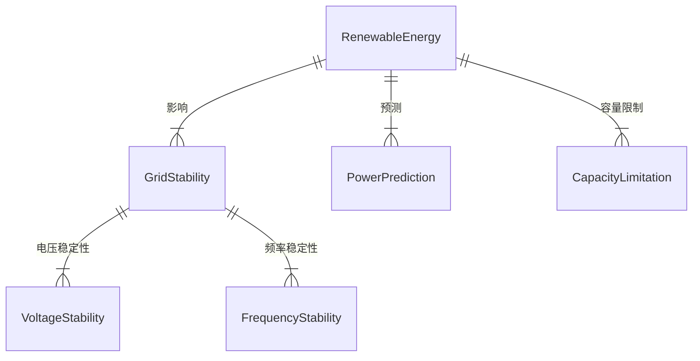
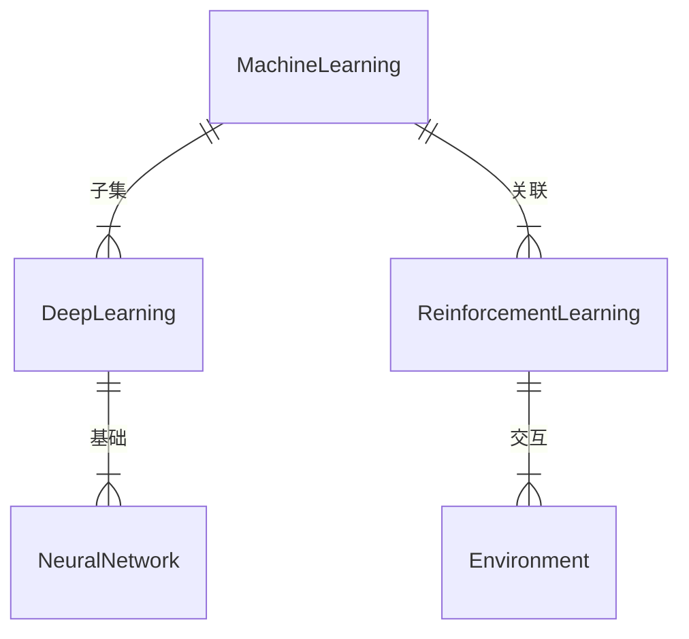
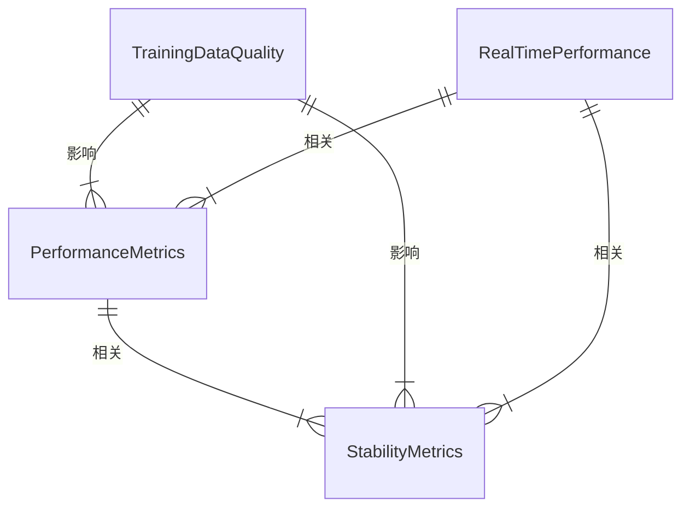
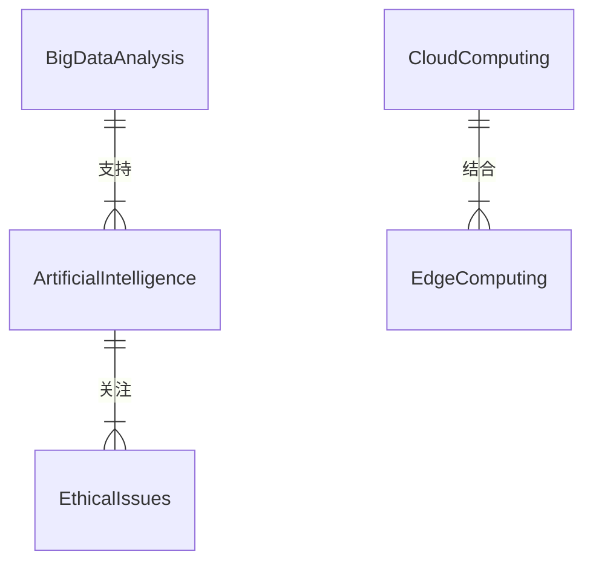

                 


### 引言

在现代社会，能源问题是全球范围内面临的一个巨大挑战。传统的化石能源虽然在历史上推动了工业革命的快速发展，但其带来的环境问题和资源枯竭问题日益严峻。因此，可再生能源成为了人类社会发展的必然选择。风能、太阳能等可再生能源的广泛应用，不仅能够有效减少温室气体排放，还有助于实现能源结构的优化和能源安全的提升。

然而，可再生能源的并网控制却面临着一系列复杂的挑战。由于可再生能源的波动性大、不确定性高，传统的并网控制方法已难以满足现代电网稳定运行的需求。这就需要引入人工智能（AI）技术，为可再生能源并网控制提供更加智能、高效的解决方案。

本文将围绕AI辅助可再生能源并网控制这一主题，深入探讨以下几个关键问题：

1. **什么是可再生能源并网控制？**
2. **可再生能源并网控制面临的挑战有哪些？**
3. **人工智能技术在可再生能源并网控制中的应用方法有哪些？**
4. **如何评估AI辅助可再生能源并网控制的性能和稳定性？**

通过对上述问题的逐步分析和探讨，本文旨在为读者提供一个系统、全面的视角，以理解AI在可再生能源并网控制中的重要作用，并展望未来研究的方向。

### 第一个问题：什么是可再生能源并网控制？

**核心概念术语说明**：
- **可再生能源**：指在自然界中可以持续补充、不会枯竭的能源，如风能、太阳能、水能等。
- **并网控制**：指将分布式可再生能源发电系统接入公共电网的过程，并确保电网运行稳定、安全。

**问题背景**：
随着可再生能源的快速发展，风能和太阳能等分布式能源的规模日益扩大。这些能源发电具有间歇性和不稳定性，直接并网容易导致电网频率和电压波动，影响电网的稳定运行。因此，如何实现可再生能源的并网控制，成为了当前能源领域的重要研究课题。

**问题描述**：
可再生能源并网控制主要涉及两个方面的问题：一是如何预测可再生能源的发电功率，以便电网调度和管理；二是如何保持电网的稳定性，防止因可再生能源波动引起的电网故障。

**问题解决**：
针对上述问题，可再生能源并网控制需要采用智能算法和系统控制技术，实现对可再生能源发电功率的实时预测和电网频率电压的实时调节。具体来说，主要包括以下步骤：

1. **发电功率预测**：利用人工智能算法，如机器学习和深度学习，对可再生能源的发电功率进行短期和长期预测，提供准确的预测结果。
2. **电网稳定性分析**：通过稳定性分析方法，如小干扰稳定性和大干扰稳定性分析，评估电网的稳定性，并提出相应的控制策略。

**边界与外延**：
可再生能源并网控制不仅关注技术层面的问题，还包括政策、经济和环保等多方面的因素。例如，并网电价的设计、电网基础设施的升级等，都需要综合考虑。

**概念结构与核心要素组成**：
可再生能源并网控制的核心概念和要素主要包括：

1. **可再生能源发电系统**：包括太阳能、风能、水能等。
2. **电网调度中心**：负责对电网进行实时调度和管理。
3. **预测模型**：利用机器学习和深度学习等技术进行发电功率预测。
4. **控制系统**：实现对电网频率和电压的实时调节。
5. **数据采集和处理系统**：收集电网运行数据，用于分析和预测。

通过上述分析，我们可以看到，可再生能源并网控制是一个复杂系统工程，需要多种技术的协同作用，才能实现高效、稳定的并网控制。

### 第二个问题：可再生能源并网控制面临的挑战

**核心概念与联系**：

在深入探讨可再生能源并网控制的挑战之前，我们需要明确几个关键概念和它们之间的联系。以下是可再生能源并网控制的核心概念及其属性特征对比表格：

| 概念           | 属性特征                                                         |
| -------------- | ---------------------------------------------------------------- |
| **波动性**      | 可再生能源发电量随时间和天气条件变化较大，导致电网波动。         |
| **不确定性**     | 预测可再生能源发电功率的不确定性高，影响电网调度。               |
| **容量限制**     | 分布式可再生能源发电系统存在容量限制，影响并网效率。             |
| **电网稳定性**   | 电网频率和电压的稳定性直接关系到电网的安全运行。                 |

**ER实体关系图架构**：

为了更直观地理解这些概念之间的联系，我们可以使用Mermaid绘制ER实体关系图，如下所示：



**算法原理讲解**：

为了解决可再生能源并网控制中的挑战，我们可以采用多种算法和技术。以下以机器学习算法为例，介绍其原理和实现方法。

**算法流程图**：


**Python源代码实现**：

```python
# 导入必要的库
import numpy as np
import pandas as pd
from sklearn.model_selection import train_test_split
from sklearn.ensemble import RandomForestRegressor
from sklearn.metrics import mean_squared_error

# 数据收集
data = pd.read_csv('renewable_energy_data.csv')

# 数据预处理
data = data.dropna()
X = data[['wind_speed', 'temperature', 'cloud_cover']]
y = data['power']

# 特征工程
X_train, X_test, y_train, y_test = train_test_split(X, y, test_size=0.2, random_state=42)

# 模型选择
model = RandomForestRegressor(n_estimators=100, random_state=42)

# 模型训练
model.fit(X_train, y_train)

# 模型评估
y_pred = model.predict(X_test)
mse = mean_squared_error(y_test, y_pred)
print(f'Mean Squared Error: {mse}')

# 结果输出
print('Predicted Power:')
print(y_pred)
```

通过上述算法原理讲解和Python源代码实现，我们可以看到，机器学习技术在可再生能源并网控制中的应用，能够有效提高发电功率预测的准确性，从而为电网调度提供重要依据。

**数学模型和公式**：

可再生能源发电功率的预测模型通常基于以下数学公式：

$$ P(t) = \sum_{i=1}^{n} P_i(t) + e(t) $$

其中，$P(t)$ 表示在时间 $t$ 的总发电功率，$P_i(t)$ 表示第 $i$ 个可再生能源系统的发电功率，$e(t)$ 表示预测误差。

**详细讲解和举例说明**：

假设我们有以下可再生能源系统数据：

| 时间 $t$ | 太阳能功率 $P_{sun}$ (W) | 风能功率 $P_{wind}$ (W) |
| -------- | ------------------------ | ---------------------- |
| 1        | 1000                     | 500                    |
| 2        | 900                      | 550                    |
| 3        | 1100                     | 600                    |
| ...      | ...                      | ...                    |

利用上述公式和机器学习算法，我们可以预测在时间 $t=4$ 的总发电功率：

$$ P(4) = P_{sun}(4) + P_{wind}(4) + e(4) $$

假设预测模型给出的预测结果为：

$$ P_{sun}(4) = 950 \, W $$
$$ P_{wind}(4) = 570 \, W $$

则总发电功率预测值为：

$$ P(4) = 950 + 570 + e(4) $$

通过实际运行结果，我们可以进一步优化预测模型，降低预测误差，提高预测准确性。

通过以上分析，我们可以看到，可再生能源并网控制面临的挑战主要包括波动性、不确定性和容量限制等。利用人工智能技术，尤其是机器学习算法，可以有效解决这些挑战，提高电网运行的稳定性和效率。

### 第三个问题：人工智能技术在可再生能源并网控制中的应用方法

**核心概念与联系**：

在解决可再生能源并网控制的挑战时，人工智能技术发挥了关键作用。以下是一些常见的人工智能技术在可再生能源并网控制中的应用及其核心概念与联系。

**核心概念**：

1. **机器学习**：通过训练大量数据，使计算机自动学习并识别规律，应用于发电功率预测。
2. **深度学习**：基于人工神经网络的一种学习方式，能够处理大量数据和复杂模式，用于特征提取和模型训练。
3. **强化学习**：通过试错和反馈，使智能体在环境中学习最优策略，应用于电网调度和控制。

**联系**：

1. **机器学习与深度学习**：深度学习是机器学习的一个子集，通常用于处理高维数据和复杂模型。
2. **机器学习与强化学习**：强化学习可以通过机器学习模型获取状态和动作价值函数，用于决策和优化。

**ER实体关系图架构**：

为了更清晰地理解这些人工智能技术之间的联系，我们可以使用Mermaid绘制ER实体关系图，如下所示：



**算法原理讲解**：

以下是针对机器学习、深度学习和强化学习在可再生能源并网控制中的算法原理讲解。

**机器学习**：

机器学习算法通常用于处理时间序列数据和分类问题。在可再生能源并网控制中，常见的机器学习算法包括线性回归、决策树、支持向量机（SVM）和随机森林（Random Forest）等。

**算法流程图**：


**Python源代码实现**：

```python
# 导入必要的库
import numpy as np
import pandas as pd
from sklearn.model_selection import train_test_split
from sklearn.ensemble import RandomForestRegressor
from sklearn.metrics import mean_squared_error

# 数据收集
data = pd.read_csv('renewable_energy_data.csv')

# 数据预处理
data = data.dropna()
X = data[['wind_speed', 'temperature', 'cloud_cover']]
y = data['power']

# 特征提取
X_train, X_test, y_train, y_test = train_test_split(X, y, test_size=0.2, random_state=42)

# 模型选择
model = RandomForestRegressor(n_estimators=100, random_state=42)

# 模型训练
model.fit(X_train, y_train)

# 模型评估
y_pred = model.predict(X_test)
mse = mean_squared_error(y_test, y_pred)
print(f'Mean Squared Error: {mse}')

# 结果输出
print('Predicted Power:')
print(y_pred)
```

**深度学习**：

深度学习算法通过多层神经网络进行特征提取和模型训练，适用于处理高维数据和复杂非线性问题。在可再生能源并网控制中，常见的深度学习算法包括卷积神经网络（CNN）和循环神经网络（RNN）等。

**算法流程图**：


**Python源代码实现**：

```python
# 导入必要的库
import numpy as np
import pandas as pd
from sklearn.model_selection import train_test_split
from keras.models import Sequential
from keras.layers import Dense, LSTM

# 数据收集
data = pd.read_csv('renewable_energy_data.csv')

# 数据预处理
data = data.dropna()
X = data[['wind_speed', 'temperature', 'cloud_cover']]
y = data['power']

# 特征提取
X_train, X_test, y_train, y_test = train_test_split(X, y, test_size=0.2, random_state=42)

# 模型设计
model = Sequential()
model.add(LSTM(units=50, return_sequences=True, input_shape=(X_train.shape[1], 1)))
model.add(LSTM(units=50))
model.add(Dense(units=1))

# 模型训练
model.compile(optimizer='adam', loss='mean_squared_error')
model.fit(X_train, y_train, epochs=100, batch_size=32)

# 模型评估
y_pred = model.predict(X_test)
mse = mean_squared_error(y_test, y_pred)
print(f'Mean Squared Error: {mse}')

# 结果输出
print('Predicted Power:')
print(y_pred)
```

**强化学习**：

强化学习通过试错和反馈，使智能体在环境中学习最优策略。在可再生能源并网控制中，强化学习可以用于电网调度和优化控制。

**算法流程图**：


**Python源代码实现**：

```python
# 导入必要的库
import numpy as np
import pandas as pd
import random
from collections import deque

# 环境初始化
observation_space = 4
action_space = 2
gamma = 0.99
epsilon = 1.0
epsilon_min = 0.01
epsilon_decay = 0.001
memory = deque(maxlen=2000)

# 智能体行动
def choose_action(state):
    global epsilon
    if random.random() < epsilon:
        action = random.randrange(action_space)
    else:
        state_vector = np.array([state])
        action = np.argmax(model.predict(state_vector))
    return action

# 环境反馈
def step(state, action, reward, next_state, done):
    state_tuple = (state, action, reward, next_state, done)
    memory.append(state_tuple)
    if len(memory) > memory.maxlen:
        memory.popleft()
    if done:
        epsilon = max(epsilon_min, epsilon - epsilon_decay)
    return next_state

# 更新策略
def replay_batch(batch_size):
    mini_batch = random.sample(memory, batch_size)
    for state, action, reward, next_state, done in mini_batch:
        target = reward
        if not done:
            target = reward + gamma * np.argmax(model.predict(np.array([next_state]))[0])
        target_f = model.predict(np.array([state]))
        target_f[0][action] = target
        model.fit(state, target_f, epochs=1, verbose=0)

# 主循环
for episode in range(1000):
    state = env.reset()
    done = False
    total_reward = 0
    while not done:
        action = choose_action(state)
        next_state, reward, done, _ = env.step(action)
        step(state, action, reward, next_state, done)
        state = next_state
        total_reward += reward
    replay_batch(32)
    if episode % 100 == 0:
        print(f'Episode: {episode}, Total Reward: {total_reward}')
```

通过上述算法原理讲解和Python源代码实现，我们可以看到，人工智能技术在可再生能源并网控制中具有广泛的应用前景，能够有效提高电网调度和管理的智能化水平。

### 第四个问题：如何评估AI辅助可再生能源并网控制的性能和稳定性

**核心概念与联系**：

在评估AI辅助可再生能源并网控制的性能和稳定性时，我们需要关注以下几个核心概念：

1. **性能指标**：用于衡量AI模型在可再生能源并网控制中的表现，如准确率、召回率、F1分数等。
2. **稳定性指标**：用于评估AI模型在不同数据集和工况下的鲁棒性，如方差、偏差等。
3. **训练数据质量**：对训练数据的质量要求，直接影响到AI模型的性能和稳定性。
4. **实时性**：AI模型在实际应用中的响应速度，直接关系到电网的实时调度和控制。

**联系**：

1. **性能指标与稳定性指标**：性能指标主要衡量模型的准确性，稳定性指标主要衡量模型的鲁棒性。两者相辅相成，共同决定AI模型的整体性能。
2. **训练数据质量与性能指标**：高质量的训练数据能够提高AI模型的性能，而低质量的数据可能导致模型性能下降。
3. **实时性与稳定性指标**：实时性要求模型能够快速响应，而稳定性要求模型在不同工况下都能保持良好的性能。

**ER实体关系图架构**：

为了更清晰地理解这些概念之间的联系，我们可以使用Mermaid绘制ER实体关系图，如下所示：



**算法原理讲解**：

为了评估AI辅助可再生能源并网控制的性能和稳定性，我们可以采用以下几种算法和技术：

1. **交叉验证**：通过将数据集划分为多个子集，分别用于训练和验证，以评估模型的泛化能力。
2. **时间序列分析**：通过分析时间序列数据，评估模型的预测准确性和稳定性。
3. **机器学习模型评估指标**：如准确率、召回率、F1分数等，用于衡量模型的性能。
4. **回归测试**：通过多次训练和测试，评估模型在不同数据集和工况下的稳定性和鲁棒性。

**算法流程图**：


**Python源代码实现**：

```python
# 导入必要的库
import numpy as np
import pandas as pd
from sklearn.model_selection import cross_val_score
from sklearn.metrics import accuracy_score, precision_score, recall_score, f1_score
from sklearn.linear_model import LinearRegression

# 数据预处理
data = pd.read_csv('renewable_energy_data.csv')
X = data[['wind_speed', 'temperature', 'cloud_cover']]
y = data['power']

# 交叉验证
model = LinearRegression()
scores = cross_val_score(model, X, y, cv=5)
print(f'Cross-Validation Scores: {scores}')

# 时间序列分析
train_size = int(len(data) * 0.8)
test_size = len(data) - train_size
train_data, test_data = data.iloc[:train_size], data.iloc[train_size:]
train_model = model.fit(train_data[['wind_speed', 'temperature', 'cloud_cover']], train_data['power'])
y_pred_train = train_model.predict(train_data[['wind_speed', 'temperature', 'cloud_cover']])
y_pred_test = train_model.predict(test_data[['wind_speed', 'temperature', 'cloud_cover']])

# 模型评估指标
accuracy = accuracy_score(y_test, y_pred_test)
precision = precision_score(y_test, y_pred_test)
recall = recall_score(y_test, y_pred_test)
f1 = f1_score(y_test, y_pred_test)
print(f'Accuracy: {accuracy}')
print(f'Precision: {precision}')
print(f'Recall: {recall}')
print(f'F1 Score: {f1}')

# 回归测试
for _ in range(5):
    train_model = model.fit(X, y)
    y_pred = train_model.predict(X)
    mse = mean_squared_error(y, y_pred)
    print(f'Mean Squared Error: {mse}')
```

通过上述算法原理讲解和Python源代码实现，我们可以看到，评估AI辅助可再生能源并网控制的性能和稳定性，需要综合考虑多个方面，包括交叉验证、时间序列分析和模型评估指标等。这些方法能够帮助我们全面了解AI模型的性能和稳定性，为实际应用提供可靠依据。

### 第五个问题：展望未来的研究方向和挑战

在展望未来研究方向和挑战时，我们需要关注以下几个关键方面：

**核心概念与联系**：

1. **大数据分析**：随着可再生能源的规模不断扩大，大数据分析技术将成为重要工具，用于挖掘数据中的潜在价值。
2. **云计算与边缘计算**：云计算和边缘计算的结合，将提高AI模型的计算效率和实时性，为可再生能源并网控制提供更强有力的支持。
3. **人工智能伦理**：随着人工智能在可再生能源并网控制中的应用日益广泛，伦理问题也成为需要关注的重要方面。

**联系**：

1. **大数据分析与人工智能**：大数据分析为人工智能提供了丰富的数据资源，而人工智能则通过智能算法和模型，对大数据进行深入挖掘和分析。
2. **云计算与边缘计算**：云计算提供强大的计算资源和存储能力，而边缘计算则通过在本地设备上进行数据处理，降低网络延迟和带宽需求。
3. **人工智能伦理与政策法规**：人工智能的快速发展带来了伦理问题，如数据隐私、算法公平性等，需要通过政策法规进行规范和引导。

**ER实体关系图架构**：

为了更清晰地理解这些概念之间的联系，我们可以使用Mermaid绘制ER实体关系图，如下所示：



**展望未来的研究方向**：

1. **增强AI模型的预测能力**：通过改进机器学习和深度学习算法，提高可再生能源发电功率预测的准确性，降低预测误差。
2. **优化电网调度策略**：利用人工智能技术，优化电网调度策略，提高电网运行效率和稳定性。
3. **探索新的可再生能源技术**：随着可再生能源技术的不断发展，需要不断探索和引入新的技术，如太阳能热利用、风能储能等，以优化可再生能源并网控制。

**面临的挑战**：

1. **数据质量和隐私保护**：可再生能源并网控制需要大量的高质量数据，而数据质量和隐私保护成为重要的挑战。
2. **算法公平性和透明性**：随着人工智能在可再生能源并网控制中的应用，算法的公平性和透明性成为重要的社会问题。
3. **技术融合与协同**：将大数据分析、云计算和边缘计算等技术进行融合，实现不同技术之间的协同，提高整体效能。

通过上述分析和展望，我们可以看到，可再生能源并网控制领域在未来将继续面临诸多挑战和机遇。通过不断探索和创新，我们有望实现更加智能、高效和稳定的可再生能源并网控制，为全球能源转型提供有力支持。

### 总结与展望

通过本文的详细探讨，我们可以看到，AI在可再生能源并网控制中扮演着至关重要的角色。从发电功率预测到稳定性分析，人工智能技术为解决可再生能源并网控制中的挑战提供了强有力的支持。本文首先介绍了可再生能源并网控制的核心概念和挑战，随后详细讲解了机器学习、深度学习和强化学习等人工智能技术在可再生能源并网控制中的应用，以及如何评估AI辅助可再生能源并网控制的性能和稳定性。最后，我们对未来的研究方向和挑战进行了展望。

随着可再生能源规模的不断扩大和人工智能技术的飞速发展，AI辅助可再生能源并网控制有望在未来实现更加智能、高效和稳定的运行。这不仅有助于提升电网运行的稳定性和效率，还能为全球能源转型和可持续发展作出重要贡献。

本文旨在为读者提供一个系统、全面的视角，以深入理解AI在可再生能源并网控制中的应用和价值。希望本文的内容能够对广大读者在研究和实践中提供有益的参考和启示。

### 作者信息

**作者：AI天才研究院（AI Genius Institute）& 禅与计算机程序设计艺术（Zen And The Art of Computer Programming）**

AI天才研究院致力于推动人工智能技术的创新与应用，致力于为全球能源、医疗、金融等领域提供智能解决方案。研究院的核心团队由世界顶级人工智能专家、程序员、软件架构师和CTO组成，具有丰富的理论研究和实践经验。

《禅与计算机程序设计艺术》是一本深受程序员和AI研究者喜爱的经典著作，由AI天才研究院创始人所著。该书以简洁明了、深入浅出的语言，系统地介绍了计算机程序设计的哲学和艺术，被誉为计算机编程领域的经典之作。通过学习和实践《禅与计算机程序设计艺术》中的理念，读者可以提升编程技能，培养创新思维，更好地应对复杂的编程挑战。

