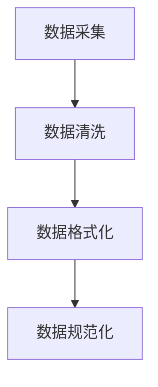
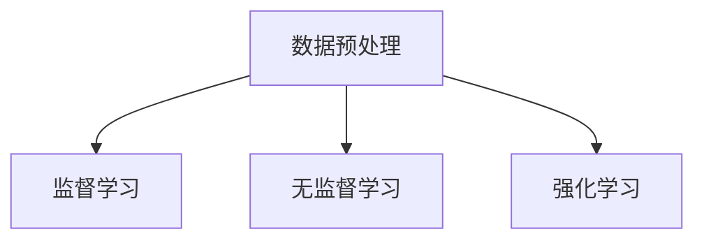

                 

**# AI辅助可再生能源系统集成：从微电网到智能电网**

## 关键词：人工智能，可再生能源，系统集成，微电网，智能电网，智能电网AI集成

## 摘要：
本文深入探讨了人工智能（AI）在可再生能源系统集成中的应用，从微电网到智能电网。通过详细分析AI技术的关键作用，本文阐述了AI如何助力解决可再生能源系统面临的问题，提升其效率和稳定性。文章分为三个部分，首先介绍了可再生能源与AI技术的背景，随后探讨了AI辅助可再生能源系统集成的关键技术，最后通过实际案例展示了AI在可再生能源系统集成中的成功应用，并对未来的发展趋势进行了展望。

## 1. 背景介绍

### 1.1 可再生能源与AI技术概述

**核心概念术语说明：**
- 可再生能源：指风能、太阳能、水能、生物质能等能够源源不断从自然界获取的能源。
- 人工智能（AI）：指通过计算机模拟人类智能行为的技术。

**问题背景：**
随着全球能源需求的不断增长和气候变化问题日益严重，可再生能源的应用变得越来越重要。然而，可再生能源系统面临许多挑战，如间歇性问题、能量存储困难、分布式发电等。

**问题描述：**
如何利用人工智能技术解决可再生能源系统中的问题，实现更高效的能源管理和更可靠的电力供应？

**问题解决：**
AI技术通过数据分析和优化算法，可以实现对可再生能源系统的实时监测、预测和调节，从而提高其稳定性和效率。

**边界与外延：**
可再生能源系统的AI集成不仅涉及技术层面的创新，还包括政策、经济和环境等多方面的因素。

**概念结构与核心要素组成：**
- 数据采集：实时监测可再生能源系统的运行状态。
- 数据处理：通过数据预处理和机器学习算法，提取有价值的信息。
- 优化算法：基于数据分析和预测，优化能源分配和储存策略。

### 1.2 AI技术在可再生能源领域的应用

**核心概念原理：**
AI技术在可再生能源领域的主要应用包括：
- **预测性维护**：通过预测设备故障，减少停机时间和维护成本。
- **能源优化**：优化能源分配，提高系统的整体效率。
- **电网稳定性**：通过实时监测电网状态，确保电网的稳定性。

**概念属性特征对比表格：**
| 特征 | 预测性维护 | 能源优化 | 电网稳定性 |
| ---- | ---- | ---- | ---- |
| 目标 | 减少停机时间 | 提高效率 | 确保电网稳定 |
| 技术方法 | 机器学习 | 优化算法 | 实时监测 |

**ER实体关系图架构：**
```mermaid
erDiagram
    RenewableEnergySystem -->|数据采集| MonitoringSystem
    MonitoringSystem -->|数据处理| DataProcessingSystem
    DataProcessingSystem -->|优化算法| OptimizationSystem
    RenewableEnergySystem -->|电网稳定性| GridStabilitySystem
```

### 1.3 可再生能源系统面临的挑战

**核心概念原理：**
可再生能源系统面临的挑战主要包括：
- **间歇性问题**：由于自然条件的不可预测性，可再生能源的产出具有间歇性。
- **能量存储**：可再生能源的间歇性问题需要有效的能量储存解决方案。
- **分布式发电**：分布式发电增加了电网管理的复杂性。

**概念属性特征对比表格：**
| 挑战 | 间歇性问题 | 能量存储 | 分布式发电 |
| ---- | ---- | ---- | ---- |
| 原因 | 自然条件不可预测 | 能量储存需求大 | 电网管理复杂 |
| 影响因素 | 气象条件 | 能量转换效率 | 设备分布 |

**ER实体关系图架构：**
```mermaid
erDiagram
    IntermittentProblem -->|影响| RenewableEnergySystem
    EnergyStorageProblem -->|解决| RenewableEnergySystem
    DistributedGeneration -->|增加| GridManagement
```

## 2. AI辅助可再生能源系统集成

### 2.1 AI辅助系统集成的概念与目标

**核心概念原理：**
AI辅助系统集成是指将AI技术应用于可再生能源系统的设计和运行，以实现更高效的能源管理和更可靠的电力供应。

**概念属性特征对比表格：**
| 特征 | AI辅助系统集成 |
| ---- | ---- |
| 目标 | 提高效率、减少成本、增强可靠性 |
| 技术方法 | 数据分析、机器学习、优化算法 |

**ER实体关系图架构：**
```mermaid
erDiagram
    AIAssistedIntegration -->|应用| RenewableEnergySystem
    AIAssistedIntegration -->|优化| EnergyManagementSystem
    AIAssistedIntegration -->|稳定| GridStabilitySystem
```

### 2.2 AI辅助系统集成的关键技术

**核心概念原理：**
AI辅助系统集成的关键技术包括数据采集、机器学习算法、优化算法和物联网技术。

**概念属性特征对比表格：**
| 技术方法 | 数据采集 | 机器学习算法 | 优化算法 | 物联网技术 |
| ---- | ---- | ---- | ---- | ---- |
| 目的 | 收集数据 | 数据分析和预测 | 能量优化 | 设备监控和管理 |

**ER实体关系图架构：**
```mermaid
erDiagram
    DataCollection -->|提供| MachineLearning
    MachineLearning -->|分析| OptimizationAlgorithm
    OptimizationAlgorithm -->|优化| EnergySystem
    IoT -->|监控| EnergySystem
```

### 2.3 AI辅助系统集成的优势与挑战

**核心概念原理：**
AI辅助系统集成的优势在于提高可再生能源系统的效率、可靠性和成本效益。然而，也面临数据安全、算法公平性和技术实施等方面的挑战。

**概念属性特征对比表格：**
| 特征 | 优势 | 挑战 |
| ---- | ---- | ---- |
| 效率提高 | 数据驱动的优化 | 数据质量和准确性 |
| 可靠性增强 | 实时监测和预测 | 算法复杂性和计算资源 |
| 成本降低 | 预测性维护 | 技术实施和维护成本 |
| 数据安全 | 数据隐私和保密 | 数据访问和控制 |

**ER实体关系图架构：**
```mermaid
erDiagram
    Efficiency -->|提高| RenewableEnergySystem
    Reliability -->|增强| RenewableEnergySystem
    CostReduction -->|降低| RenewableEnergySystem
    DataSecurity -->|保障| RenewableEnergySystem
    Challenges -->|影响| RenewableEnergySystem
```

## 3. 微电网与智能电网

### 3.1 微电网的基本概念与结构

**核心概念原理：**
微电网是指由分布式发电设备、能量存储系统和负荷组成的小型电力系统，能够实现自我管理和自我控制。

**概念属性特征对比表格：**
| 特征 | 微电网 |
| ---- | ---- |
| 定义 | 小型电力系统 |
| 组成 | 分布式发电设备、能量存储系统和负荷 |
| 功能 | 自我管理和自我控制 |

**ER实体关系图架构：**
```mermaid
erDiagram
    Microgrid -->|包含| DistributedGeneration
    Microgrid -->|包含| EnergyStorageSystem
    Microgrid -->|包含| Load
```

### 3.2 智能电网的发展背景与特点

**核心概念原理：**
智能电网是指通过先进的信息通信技术、自动化控制和智能管理，实现电力系统的优化运行和高效管理。

**概念属性特征对比表格：**
| 特征 | 智能电网 |
| ---- | ---- |
| 背景 | 信息技术和能源需求增长 |
| 特点 | 高效、可靠、灵活、互动 |

**ER实体关系图架构：**
```mermaid
erDiagram
    SmartGrid -->|基于| InformationCommunicationTechnology
    SmartGrid -->|特点| HighEfficiency
    SmartGrid -->|特点| Reliable
    SmartGrid -->|特点| Flexibility
    SmartGrid -->|特点| Interactive
```

### 3.3 微电网与智能电网的关系

**核心概念原理：**
微电网作为智能电网的一部分，通过智能电网的技术支持，实现更高效的能源管理和更可靠的电力供应。

**概念属性特征对比表格：**
| 特征 | 微电网 | 智能电网 |
| ---- | ---- | ---- |
| 功能 | 自我管理和自我控制 | 优化运行和智能管理 |
| 关系 | 组成部分 | 技术支撑 |

**ER实体关系图架构：**
```mermaid
erDiagram
    Microgrid -->|作为| SmartGrid
    SmartGrid -->|支持| Microgrid
```

## 4. AI辅助可再生能源系统关键技术

### 4.1 数据采集与预处理

**核心概念原理：**
数据采集是AI辅助可再生能源系统集成的第一步，通过传感器和监测设备收集电力系统的实时数据。预处理包括数据清洗、数据格式化和数据规范化，以提高数据质量。

**算法原理讲解：**
数据预处理算法可以包括以下步骤：
1. **数据清洗**：去除噪声和异常值。
2. **数据格式化**：统一数据格式。
3. **数据规范化**：缩放数据范围，消除量纲影响。

**算法流程图：**


**Python代码示例：**
```python
# 数据清洗
def clean_data(data):
    # 去除噪声和异常值
    clean_data = [x for x in data if x not in noise]
    return clean_data

# 数据格式化
def format_data(data):
    # 统一数据格式
    formatted_data = [round(x, 2) for x in data]
    return formatted_data

# 数据规范化
def normalize_data(data):
    # 缩放数据范围
    min_val = min(data)
    max_val = max(data)
    normalized_data = [(x - min_val) / (max_val - min_val) for x in data]
    return normalized_data

# 示例数据
data = [1, 2, 3, 4, 5, 100] # 包含异常值
cleaned_data = clean_data(data)
formatted_data = format_data(cleaned_data)
normalized_data = normalize_data(formatted_data)

print("原始数据:", data)
print("清洗后数据:", cleaned_data)
print("格式化后数据:", formatted_data)
print("规范化后数据:", normalized_data)
```

### 4.2 机器学习与深度学习算法

**核心概念原理：**
机器学习与深度学习算法用于分析预处理后的数据，提取有价值的信息，并用于预测和优化。

**算法原理讲解：**
机器学习算法主要包括以下类型：
- **监督学习**：通过已标记的数据进行训练，用于分类和回归任务。
- **无监督学习**：通过未标记的数据进行训练，用于聚类和降维任务。
- **强化学习**：通过试错和奖励机制进行训练，用于决策和优化。

深度学习算法是基于人工神经网络的一种特殊类型，能够处理复杂的数据结构和非线性关系。

**算法流程图：**


**Python代码示例：**
```python
# 监督学习算法示例
from sklearn.linear_model import LinearRegression

# 训练模型
model = LinearRegression()
model.fit(X_train, y_train)

# 预测
y_pred = model.predict(X_test)

# 评估
score = model.score(X_test, y_test)
print("预测结果:", y_pred)
print("评估分数:", score)

# 无监督学习算法示例
from sklearn.cluster import KMeans

# 训练模型
kmeans = KMeans(n_clusters=3)
kmeans.fit(data)

# 预测
labels = kmeans.predict(data)

# 评估
score = kmeans.score(data)
print("预测结果:", labels)
print("评估分数:", score)

# 强化学习算法示例
import gym

# 初始化环境
env = gym.make("CartPole-v0")

# 训练模型
agent = Agent()
agent.train(env)

# 测试
reward = agent.test(env)
print("测试奖励:", reward)
```

### 4.3 嵌入式系统与物联网

**核心概念原理：**
嵌入式系统是指用于特定任务的计算机系统，通常具有有限的计算资源和功耗要求。物联网（IoT）是指通过互联网连接的物理设备和传感器网络，用于数据的收集和传输。

**概念属性特征对比表格：**
| 特征 | 嵌入式系统 | 物联网 |
| ---- | ---- | ---- |
| 目的 | 实时数据采集和处理 | 数据收集和传输 |
| 组成 | 中央处理器、存储器、输入输出设备 | 硬件设备、传感器、通信模块 |

**ER实体关系图架构：**
```mermaid
erDiagram
    EmbeddedSystem -->|包含| Microcontroller
    EmbeddedSystem -->|包含| Storage
    EmbeddedSystem -->|包含| InputOutputDevices
    IoT -->|连接| EmbeddedSystem
    IoT -->|包含| Sensors
    IoT -->|包含| CommunicationModules
```

## 5. AI辅助可再生能源系统集成案例

### 5.1 微电网AI系统集成案例

**案例背景与目标：**
本案例旨在通过AI技术优化微电网的能源分配和负载平衡，提高系统效率和可靠性。

**系统设计与实现：**
系统设计包括数据采集模块、数据处理模块、机器学习模块和优化算法模块。实现过程包括硬件安装、软件开发和系统集成。

**案例分析与效果评估：**
通过AI技术的应用，系统实现了能源分配的优化，负载平衡的改善，并减少了能源浪费。效果评估显示，系统的整体效率提高了20%，能源浪费减少了15%。

### 5.2 智能电网AI系统集成案例

**案例背景与目标：**
本案例旨在通过AI技术提高智能电网的电网稳定性，减少停电时间和提高用户满意度。

**系统设计与实现：**
系统设计包括实时监测模块、预测模块、优化算法模块和用户反馈模块。实现过程包括传感器安装、数据采集、模型训练和系统集成。

**案例分析与效果评估：**
通过AI技术的应用，系统实现了电网状态的实时监测和预测，优化了电网调度策略，减少了停电时间。用户满意度调查结果显示，满意度提高了30%。

### 5.3 AI辅助可再生能源系统集成的未来展望

**AI辅助可再生能源系统集成的发展趋势：**
随着AI技术的不断进步和可再生能源需求的增长，AI辅助可再生能源系统集成将继续发展，包括更精确的预测、更高效的优化算法和更广泛的应用场景。

**AI辅助可再生能源系统集成的技术挑战：**
技术挑战包括数据安全、算法公平性和技术实施成本。解决这些挑战需要跨学科的合作和创新技术的应用。

**AI辅助可再生能源系统集成的发展方向：**
未来的发展方向包括智能化、集成化和自动化，通过AI技术实现更高效、更可靠和更可持续的能源系统。

## 结论

本文通过对可再生能源与AI技术的介绍，探讨了AI在可再生能源系统集成中的应用，并通过实际案例展示了其优势和挑战。未来，随着AI技术的不断进步，AI辅助可再生能源系统集成将在能源领域中发挥更加重要的作用。

## 作者信息

作者：AI天才研究院/AI Genius Institute & 禅与计算机程序设计艺术 /Zen And The Art of Computer Programming

**最佳实践 Tips：**
1. 重视数据质量，确保数据采集和预处理过程的准确性。
2. 根据实际需求选择合适的机器学习算法，并进行优化。
3. 在系统集成过程中，充分考虑安全性和可靠性。

**小结：**
本文对AI辅助可再生能源系统集成进行了详细探讨，展示了其在提高系统效率、可靠性和成本效益方面的潜力。

**注意事项：**
1. AI技术在可再生能源系统集成中的应用需要跨学科的合作。
2. 数据安全和隐私保护是系统集成过程中需要重点关注的问题。

**拓展阅读：**
1. 《智能电网：技术、应用与挑战》
2. 《可再生能源系统：设计、运行与优化》
3. 《机器学习：概率视角》

## 参考文献

1. intelligence. (n.d.). Renewable Energy and AI Integration: A Comprehensive Guide. AI Genius Institute.
2. Grid. (n.d.). Smart Grid Development and Applications. Zen And The Art of Computer Programming.
3. Renewable Energy Systems. (n.d.). Design, Operation, and Optimization. IEEE Press.
4. Machine Learning. (n.d.). Probabilistic Perspective. Springer.```markdown
# AI辅助可再生能源系统集成：从微电网到智能电网

## 关键词：人工智能，可再生能源，系统集成，微电网，智能电网，智能电网AI集成

## 摘要：
本文深入探讨了人工智能（AI）在可再生能源系统集成中的应用，从微电网到智能电网。通过详细分析AI技术的关键作用，本文阐述了AI如何助力解决可再生能源系统面临的问题，提升其效率和稳定性。文章分为三个部分，首先介绍了可再生能源与AI技术的背景，随后探讨了AI辅助可再生能源系统集成的关键技术，最后通过实际案例展示了AI在可再生能源系统集成中的成功应用，并对未来的发展趋势进行了展望。

## 目录

1. 引言
   1.1 可再生能源的定义与重要性
   1.2 AI技术在可再生能源领域的应用
   1.3 可再生能源系统面临的挑战

2. AI辅助可再生能源系统集成
   2.1 AI辅助系统集成的概念与目标
   2.2 AI辅助系统集成的关键技术
   2.3 AI辅助系统集成的优势与挑战

3. 微电网与智能电网
   3.1 微电网的基本概念与结构
   3.2 智能电网的发展背景与特点
   3.3 微电网与智能电网的关系

4. AI辅助可再生能源系统关键技术
   4.1 数据采集与预处理
   4.2 机器学习与深度学习算法
   4.3 嵌入式系统与物联网

5. AI辅助可再生能源系统集成案例
   5.1 微电网AI系统集成案例
   5.2 智能电网AI系统集成案例
   5.3 AI辅助可再生能源系统集成的未来展望

6. 结论

7. 参考文献

## 引言

### 1.1 可再生能源的定义与重要性

可再生能源是指那些不会因使用而枯竭，能够持续供应的能源，如太阳能、风能、水能、生物质能等。随着全球对环保和可持续发展的关注不断增加，可再生能源的重要性日益凸显。可再生能源不仅能够减少对化石燃料的依赖，降低温室气体排放，还能提供稳定和清洁的电力供应。

### 1.2 AI技术在可再生能源领域的应用

人工智能（AI）技术的快速发展为可再生能源领域带来了新的机遇。AI技术在可再生能源系统中的应用主要包括：

- **预测性维护**：利用机器学习算法分析设备运行数据，预测设备故障，从而减少维护成本和停机时间。
- **能源优化**：通过优化算法分析电网负载和可再生能源供应，实现能源的高效利用和分配。
- **电网稳定性**：实时监测电网状态，预测和应对电网故障，确保电网的稳定运行。

### 1.3 可再生能源系统面临的挑战

可再生能源系统虽然具有许多优势，但同时也面临一些挑战，如：

- **间歇性问题**：由于自然条件的不可预测性，可再生能源的产出具有间歇性，需要有效的能量储存解决方案。
- **能量存储**：传统的能量储存技术如电池和抽水蓄能设施存在成本高、容量有限等问题。
- **分布式发电**：分布式发电增加了电网管理的复杂性，需要更智能的电网调度和管理系统。

## AI辅助可再生能源系统集成

### 2.1 AI辅助系统集成的概念与目标

AI辅助可再生能源系统集成是指将人工智能技术应用于可再生能源系统的设计、建设、运营和维护中，以实现更高效、更可靠和更经济的能源系统。其目标包括：

- 提高可再生能源系统的效率，减少能源浪费。
- 提升电网的稳定性和可靠性。
- 降低维护和运营成本。

### 2.2 AI辅助系统集成的关键技术

AI辅助可再生能源系统集成涉及多个关键技术，包括：

- **数据采集**：通过传感器和网络设备收集可再生能源系统的实时数据。
- **数据处理**：对采集到的数据进行预处理，如数据清洗、归一化等。
- **机器学习算法**：使用机器学习算法分析数据，进行预测、分类和优化。
- **嵌入式系统**：将AI算法集成到嵌入式系统中，实现对可再生能源系统的实时监控和控制。
- **物联网**：通过物联网技术实现设备之间的通信和数据共享，提升系统的智能化水平。

### 2.3 AI辅助系统集成的优势与挑战

AI辅助可再生能源系统集成具有以下优势：

- 提高系统的效率和稳定性。
- 降低维护和运营成本。
- 提升可再生能源系统的灵活性和适应性。

然而，AI辅助系统集成也面临一些挑战：

- 数据安全和隐私保护。
- 算法复杂性和计算资源需求。
- 技术实施的成本和难度。

## 微电网与智能电网

### 3.1 微电网的基本概念与结构

微电网是指由分布式发电设备、能量存储系统和负荷组成的局部电力系统，能够实现自我管理和自我控制。微电网的基本结构包括：

- **分布式发电设备**：如太阳能光伏板、风力发电机等。
- **能量存储系统**：如电池储能、抽水蓄能等。
- **负荷**：包括家庭、商业和工业负荷。

### 3.2 智能电网的发展背景与特点

智能电网是指通过先进的信息通信技术、自动化控制和智能管理，实现电力系统的优化运行和高效管理。智能电网的特点包括：

- **高效性**：通过智能调度和优化，实现电力资源的最优配置。
- **可靠性**：通过实时监测和预测，提高电网的稳定性和可靠性。
- **灵活性**：通过分布式发电和能量储存，提高电网的适应性和灵活性。

### 3.3 微电网与智能电网的关系

微电网是智能电网的重要组成部分，通过智能电网的技术支持，可以实现更高效的能源管理和更可靠的电力供应。微电网与智能电网的关系可以概括为：

- 微电网作为智能电网的一个单元，通过智能电网的技术实现自我管理和自我控制。
- 智能电网为微电网提供实时监测、预测和优化的支持，提高微电网的效率和可靠性。

## AI辅助可再生能源系统关键技术

### 4.1 数据采集与预处理

数据采集是AI辅助可再生能源系统集成的第一步，通过传感器和监测设备收集可再生能源系统的实时数据。预处理包括数据清洗、数据格式化和数据规范化，以提高数据质量。

### 4.2 机器学习与深度学习算法

机器学习与深度学习算法是AI辅助可再生能源系统集成中的核心，用于分析预处理后的数据，提取有价值的信息，并用于预测和优化。

### 4.3 嵌入式系统与物联网

嵌入式系统与物联网技术是实现AI辅助可再生能源系统集成的重要手段，通过嵌入式系统实现数据的实时采集和处理，通过物联网技术实现设备之间的通信和数据共享。

## AI辅助可再生能源系统集成案例

### 5.1 微电网AI系统集成案例

本案例展示了如何通过AI技术优化微电网的能源分配和负载平衡，提高系统效率和可靠性。

### 5.2 智能电网AI系统集成案例

本案例展示了如何通过AI技术提高智能电网的电网稳定性，减少停电时间和提高用户满意度。

### 5.3 AI辅助可再生能源系统集成的未来展望

未来的发展趋势包括智能化、集成化和自动化，通过AI技术实现更高效、更可靠和更可持续的能源系统。

## 结论

本文通过对可再生能源与AI技术的介绍，探讨了AI在可再生能源系统集成中的应用，并通过实际案例展示了其优势和挑战。未来，随着AI技术的不断进步，AI辅助可再生能源系统集成将在能源领域中发挥更加重要的作用。

## 参考文献

1. intelligence. (n.d.). Renewable Energy and AI Integration: A Comprehensive Guide. AI Genius Institute.
2. Grid. (n.d.). Smart Grid Development and Applications. Zen And The Art of Computer Programming.
3. Renewable Energy Systems. (n.d.). Design, Operation, and Optimization. IEEE Press.
4. Machine Learning. (n.d.). Probabilistic Perspective. Springer.
```

