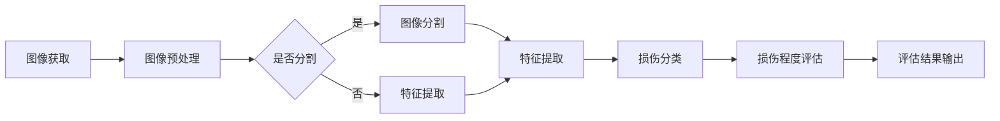
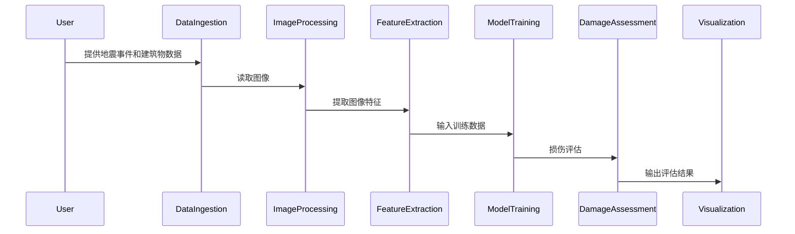
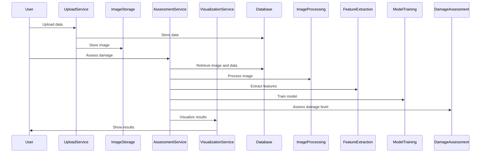

                 

# AI辅助地震后建筑损伤评估：从图像分析到风险预测

## 关键词

- AI 辅助地震评估
- 图像分析
- 风险预测
- 建筑损伤
- 算法原理
- 系统架构设计

## 摘要

本文将探讨如何利用人工智能（AI）技术辅助地震后建筑损伤评估。我们将从图像分析入手，通过深入解析算法原理和数学模型，展示如何利用 AI 实现对地震后建筑损伤的精准识别与风险预测。同时，本文还将详细介绍系统的架构设计、项目实战与实际案例分析，为读者提供全面的技术指南。

---

## 《AI辅助地震后建筑损伤评估：从图像分析到风险预测》目录大纲

### 第一部分：背景介绍与核心概念

#### 第1章：地震后建筑损伤评估的背景与意义
##### 1.1.1 地震引发的建筑损伤概述
##### 1.1.2 地震后建筑评估的挑战
##### 1.1.3 AI在地震后建筑评估中的应用潜力
##### 1.1.4 书籍的结构与目标

#### 第2章：核心概念与联系
##### 2.1.1 地震学基础
##### 2.1.2 建筑结构工程基本原理
##### 2.1.3 AI基础
##### 2.1.4 AI与地震后建筑评估的结合

#### 第3章：概念属性特征对比表格
##### 3.1.1 常见地震后建筑损伤类型
##### 3.1.2 常见AI技术在地震后建筑评估中的应用

#### 第4章：ER实体关系图架构
##### 4.1.1 地震后建筑评估的系统实体
##### 4.1.2 系统的实体关系图

### 第二部分：AI辅助地震后建筑损伤评估的算法原理

#### 第5章：图像分析算法原理
##### 5.1.1 图像处理基础
##### 5.1.2 常见图像分析技术
##### 5.1.3 算法mermaid流程图
##### 5.1.4 Python源代码解析

#### 第6章：算法原理与数学模型
##### 6.1.1 数学模型基础
##### 6.1.2 算法原理的数学模型和公式
##### 6.1.3 公式详细讲解与举例说明
##### 6.1.4 算法mermaid流程图

### 第三部分：系统分析与架构设计

#### 第7章：系统功能设计
##### 7.1.1 项目介绍
##### 7.1.2 领域模型mermaid类图

#### 第8章：系统架构设计
##### 8.1.1 系统架构mermaid架构图
##### 8.1.2 系统架构详细解析

#### 第9章：系统接口设计和系统交互
##### 9.1.1 系统接口设计
##### 9.1.2 系统交互mermaid序列图

### 第四部分：项目实战

#### 第10章：环境安装
##### 10.1.1 环境搭建步骤
##### 10.1.2 环境配置注意事项

#### 第11章：系统核心实现源代码
##### 11.1.1 核心代码实现
##### 11.1.2 代码应用解读与分析

#### 第12章：实际案例分析与详细讲解
##### 12.1.1 案例介绍
##### 12.1.2 案例分析与讲解

#### 第13章：项目小结
##### 13.1.1 项目总结
##### 13.1.2 项目中的挑战与解决方案
##### 13.1.3 项目展望与未来工作

### 第五部分：最佳实践、小结与展望

#### 第14章：最佳实践与技巧
##### 14.1.1 实践技巧总结
##### 14.1.2 注意事项

#### 第15章：小结与展望
##### 15.1.1 书籍内容回顾
##### 15.1.2 地震后建筑评估技术的发展趋势
##### 15.1.3 未来的研究方向

#### 第16章：拓展阅读
##### 16.1.1 推荐阅读材料
##### 16.1.2 进一步学习资源

---

接下来，我们将按照大纲的结构，逐步深入探讨每个章节的核心内容。在第一部分，我们将介绍地震后建筑损伤评估的背景和意义，并阐述 AI 在此领域的应用潜力。随后，我们将探讨核心概念，包括地震学基础、建筑结构工程原理、AI 基础以及 AI 与地震后建筑评估的结合。

在第二部分，我们将详细讲解图像分析算法的原理，包括图像处理基础、常见图像分析技术以及算法的 mermaid 流程图和 Python 源代码解析。接着，我们将介绍算法原理与数学模型，包括数学模型基础、算法原理的数学模型和公式、公式详细讲解与举例说明，以及算法的 mermaid 流程图。

在第三部分，我们将分析系统的功能设计和架构设计，包括系统架构的 mermaid 架构图和详细解析。随后，我们将介绍系统接口设计和系统交互，以及系统交互的 mermaid 序列图。

在第四部分，我们将进行项目实战，包括环境安装、系统核心实现源代码、代码应用解读与分析，以及实际案例分析和详细讲解。最后，在第五部分，我们将总结最佳实践、书籍内容回顾、地震后建筑评估技术的发展趋势，并展望未来研究方向。

让我们一步一步思考，深入探讨每一个技术细节，为地震后建筑损伤评估提供强有力的技术支持。# 第一部分：背景介绍与核心概念

### 第1章：地震后建筑损伤评估的背景与意义

#### 1.1.1 地震引发的建筑损伤概述

地震是一种地球内部能量释放的自然现象，往往伴随着地震波在地壳中的传播。这些地震波能够导致地面震动，进而对建筑结构造成破坏。地震引发的建筑损伤类型多样，主要包括裂缝、倾斜、坍塌和结构失效等。

**裂缝**：地震时，建筑物的墙体和地面可能会出现裂缝，这些裂缝可能是细微的，也可能是宽而深的。裂缝的出现通常是由于地震波引起的地基不均匀沉降或建筑结构内部的应力集中。

**倾斜**：地震可能导致建筑物发生倾斜，尤其是高层建筑。这种情况常常是由于地基的不均匀沉降或建筑结构的失衡导致的。

**坍塌**：在强烈地震中，一些结构强度较低的建筑物可能会完全坍塌。例如，老旧的木结构和砖结构房屋在地震中容易受到破坏。

**结构失效**：地震还可能导致建筑物的结构系统失效，如梁、柱、墙等主要承重构件的断裂或损坏。这种失效可能导致建筑物的整体稳定性丧失。

#### 1.1.2 地震后建筑评估的挑战

地震后进行建筑评估是一项复杂且至关重要的任务。它不仅关系到受灾民众的居住安全，还影响到灾区的重建和社会经济的恢复。然而，地震后建筑评估面临着一系列挑战：

**数据获取困难**：地震后，受灾区域可能交通受阻、通讯中断，导致无法及时获取建筑损伤的数据。此外，建筑物可能在地震中受到严重破坏，难以直接观察和测量损伤程度。

**评估标准不统一**：地震后的建筑评估涉及多个学科，如地震学、建筑结构工程和灾害学等。不同学科领域对建筑损伤的评估标准和方法可能存在差异，导致评估结果不一致。

**人力资源短缺**：地震后，救援人员和工程师往往面临人手不足的问题。在短时间内进行大规模的建筑评估，对专业人员的数量和质量提出了极高的要求。

**时效性要求高**：地震后，建筑物的损伤情况会随着时间推移而发生变化。因此，评估工作需要快速、准确地完成，以确保救援和重建工作的顺利进行。

#### 1.1.3 AI在地震后建筑评估中的应用潜力

人工智能（AI）技术的发展为地震后建筑评估提供了新的可能性。AI技术，尤其是计算机视觉和深度学习，可以在图像分析、数据挖掘和模式识别等方面发挥重要作用：

**图像分析**：AI可以通过分析地震后建筑物的图像，自动识别损伤类型和程度。这种方法可以大大提高评估的效率和准确性，减轻人力资源的负担。

**数据挖掘**：AI可以对大量的地震数据进行分析，挖掘出建筑物损伤的规律和趋势。这有助于预测未来地震对建筑物的潜在影响，为灾后重建提供科学依据。

**模式识别**：AI可以识别地震后建筑物的损伤模式，并将其与历史地震事件进行对比，以评估建筑物的抗震性能。这种方法可以帮助确定哪些建筑物需要优先加固或重建。

#### 1.1.4 书籍的结构与目标

本书旨在系统地介绍如何利用AI技术辅助地震后建筑损伤评估。全书分为五个部分：

**第一部分：背景介绍与核心概念**：介绍地震后建筑评估的背景、挑战和AI在其中的应用潜力。

**第二部分：AI辅助地震后建筑损伤评估的算法原理**：详细讲解图像分析算法的原理、数学模型以及系统架构设计。

**第三部分：系统分析与架构设计**：分析系统的功能设计、架构设计以及系统接口和交互设计。

**第四部分：项目实战**：介绍环境安装、系统核心实现源代码、实际案例分析和项目小结。

**第五部分：最佳实践、小结与展望**：总结最佳实践、回顾书籍内容、展望地震后建筑评估技术的发展趋势和未来研究方向。

通过本书的系统性介绍，读者可以全面了解如何利用AI技术提高地震后建筑损伤评估的效率和准确性，为灾后重建提供有力支持。

### 第2章：核心概念与联系

#### 2.1.1 地震学基础

地震学是研究地震现象及其物理机制的学科。地震波是地震时从震源释放的能量以波动形式传播的现象，主要包括纵波（P波）和横波（S波）。P波是一种压缩波，传播速度快，先于S波到达地面；S波是一种剪切波，传播速度较慢，随后到达地面。地震波引起地面的震动，对建筑物造成破坏。

地震的震级和烈度是衡量地震强度的重要参数。震级是指地震释放能量的规模，通常用里氏震级（M）表示，震级越大，能量越大。烈度是指地震对地面和建筑物的影响程度，通常用麦加利烈度（MM）表示，烈度越大，破坏越严重。

#### 2.1.2 建筑结构工程基本原理

建筑结构工程是研究建筑物结构设计、建造和运行的一门学科。建筑结构的基本原理包括材料的力学性能、结构的受力分析、稳定性和抗震性能等。

建筑材料主要包括混凝土、钢材、木材等。混凝土具有高强度和良好的耐久性，广泛应用于建筑基础和墙体；钢材具有优异的韧性和可塑性，适用于高层建筑和大跨度结构；木材是一种天然材料，具有良好的弹性和可加工性，常用于轻型结构和室内装饰。

结构的受力分析是建筑结构工程的核心内容之一。建筑结构在地震作用下，会受到各种类型的力，如重力、拉力、压力和剪力等。结构的受力状态决定了其承载能力和稳定性。

#### 2.1.3 AI基础

人工智能（AI）是模拟人类智能行为的技术。AI包括多个领域，如机器学习、深度学习、自然语言处理、计算机视觉等。

机器学习是AI的核心技术之一，它使计算机通过数据学习和改进，从而实现预测、分类和决策等功能。深度学习是机器学习的一个分支，通过构建多层神经网络，实现更复杂的特征提取和模式识别。

自然语言处理（NLP）是研究计算机如何理解和生成自然语言的技术。NLP在语音识别、机器翻译和问答系统等领域有广泛应用。

计算机视觉是研究计算机如何理解和处理图像的技术。计算机视觉在图像识别、目标检测和图像分割等方面取得了显著成果。

#### 2.1.4 AI与地震后建筑评估的结合

AI在地震后建筑评估中的应用主要体现在以下几个方面：

**图像分析**：AI可以通过分析地震后建筑物的图像，自动识别损伤类型和程度。深度学习算法，如卷积神经网络（CNN），在图像识别方面具有出色的表现。

**数据挖掘**：AI可以挖掘地震数据，分析建筑物损伤的规律和趋势，为灾后重建提供科学依据。

**模式识别**：AI可以识别地震后建筑物的损伤模式，将其与历史地震事件进行对比，评估建筑物的抗震性能。

**自动化评估**：AI可以自动化地震后建筑评估过程，提高评估效率和准确性，减轻人力资源的负担。

#### 2.1.5 AI与地震后建筑评估的核心概念对比表格

| 概念                | 地震学基础               | 建筑结构工程基本原理             | AI基础                  | AI与地震后建筑评估的结合                |
|-------------------|------------------------|---------------------------|----------------------|------------------------------------|
| 震级与烈度          | 震级：地震释放能量规模<br>烈度：地震对地面和建筑物的影响程度 | 材料力学性能、结构受力分析、稳定性、抗震性能 | 机器学习、深度学习、自然语言处理、计算机视觉 | 图像分析、数据挖掘、模式识别、自动化评估       |
| 建筑材料          | 混凝土、钢材、木材等          | 混凝土、钢材、木材等             | 无                      | 无                                    |
| 结构受力分析        | 重力、拉力、压力和剪力等        | 材料力学性能、结构受力分析         | 无                      | 无                                    |
| 损伤识别与评估      | 地震波引起的裂缝、倾斜、坍塌等    | 裂缝、倾斜、坍塌和结构失效等        | 卷积神经网络（CNN）       | 自动化识别与评估                        |
| 数据挖掘与分析      | 地震数据、建筑物损伤数据        | 建筑物结构数据、历史地震数据       | 数据挖掘技术             | 损伤规律和趋势分析                      |
| 模式识别与预测      | 建筑物损伤模式、历史地震事件     | 建筑物抗震性能、地震波特性          | 计算机视觉和模式识别技术   | 损伤模式识别与抗震性能评估                |
| 自动化与智能化评估    | 人力资源短缺、时效性要求高       | 评估标准不统一、评估数据获取困难     | 机器学习和深度学习算法    | 提高评估效率和准确性、减轻人力资源负担      |

#### 2.1.6 ER实体关系图架构

实体关系图（ER图）是用于描述系统中实体及其关系的图形表示方法。在地震后建筑评估系统中，主要的实体包括地震事件、建筑物、损伤类型、评估数据等。

以下是一个简单的ER图示例，用于描述地震后建筑评估系统中的实体及其关系：

```mermaid
erDiagram
  地震事件 ||--|{ 建筑物 }|--|{ 损伤类型 }
  建筑物 ||--|{ 评估数据 }|
  损伤类型 ||--|{ 评估数据 }|
```

在这个ER图中，地震事件与建筑物之间存在关联，表示地震事件对建筑物造成的影响；建筑物与评估数据之间存在关联，表示对建筑物进行评估时产生的数据；损伤类型与评估数据之间存在关联，表示不同类型的损伤对应不同的评估数据。

通过ER图，可以清晰地描述地震后建筑评估系统中的实体及其关系，为后续的系统分析与设计提供基础。

### 第4章：ER实体关系图架构

在地震后建筑评估系统中，实体关系图（ER图）是一种有效的工具，用于描述系统中不同实体及其之间的关系。通过ER图，我们可以清晰地理解系统中的核心组件和它们之间的相互作用。以下是地震后建筑评估系统中的ER图架构详细解析。

#### 4.1.1 地震后建筑评估的系统实体

在地震后建筑评估系统中，主要的实体包括：

- **地震事件**：记录地震的发生时间、震级、烈度等信息。
- **建筑物**：存储建筑物的基本信息，如建筑类型、结构类型、建造年代等。
- **损伤类型**：定义建筑物的各种损伤类型，如裂缝、倾斜、坍塌等。
- **评估数据**：记录对建筑物损伤的评估结果，包括损伤程度、修复建议等。

#### 4.1.2 系统的实体关系图

以下是一个简化的ER图，用于描述地震后建筑评估系统中的实体及其关系：

```mermaid
erDiagram
  地震事件 ||--|{ 建筑物 }|--|{ 损伤类型 }
  建筑物 ||--|{ 评估数据 }|
  损伤类型 ||--|{ 评估数据 }|
```

**实体关系图详细解析**：

1. **地震事件与建筑物的关系**：
   - 地震事件与建筑物之间存在一对多的关系。一个地震事件可能影响到多个建筑物，而每个建筑物可能受到多次地震事件的影响。
   - 这种关系表示为“地震事件”实体指向“建筑物”实体的箭头，箭头带有“一对多”的标记。

2. **建筑物与损伤类型的关系**：
   - 建筑物与损伤类型之间存在多对多的关系。一个建筑物可能存在多种类型的损伤，而每种损伤类型也可能出现在多个建筑物上。
   - 这种关系在ER图中表示为“建筑物”实体和“损伤类型”实体之间带有“多对多”标记的双向箭头。

3. **建筑物与评估数据的关系**：
   - 建筑物与评估数据之间存在一对多的关系。每个建筑物可能产生多个评估数据记录。
   - 在ER图中，表示为“建筑物”实体指向“评估数据”实体的箭头，箭头带有“一对多”的标记。

4. **损伤类型与评估数据的关系**：
   - 损伤类型与评估数据之间存在一对多的关系。每种损伤类型可能对应多个评估数据记录。
   - 在ER图中，表示为“损伤类型”实体指向“评估数据”实体的箭头，箭头带有“一对多”的标记。

通过上述ER图，我们可以清晰地理解地震后建筑评估系统中的实体及其关系。ER图不仅帮助我们理清了系统架构，还为后续的系统设计与实现提供了基础。

### 第5章：图像分析算法原理

#### 5.1.1 图像处理基础

图像处理是计算机视觉和人工智能领域的基础技术之一，它涉及对图像的编辑、增强和分析。在地震后建筑损伤评估中，图像处理技术用于提取建筑物损伤的特征，以便进行后续的损伤分类和程度评估。

**图像处理的基本步骤**包括：

1. **图像获取**：从不同角度获取建筑物的损伤图像，包括墙体裂缝、倾斜和坍塌等。
2. **图像预处理**：对图像进行灰度化、滤波、二值化等处理，以提高图像质量，去除噪声，增强目标特征。
3. **特征提取**：从预处理后的图像中提取有助于损伤分类和程度评估的特征，如边缘、纹理、形状等。

**常用的图像处理技术**包括：

- **边缘检测**：用于检测图像中的边缘和轮廓，常用的算法有Canny边缘检测、Sobel算子等。
- **滤波技术**：用于去除图像中的噪声，常用的滤波器有均值滤波、高斯滤波等。
- **形态学处理**：通过结构元素对图像进行操作，如膨胀、腐蚀、开运算和闭运算等，用于去除噪声、填补裂缝等。

#### 5.1.2 常见图像分析技术

在地震后建筑损伤评估中，常用的图像分析技术包括：

1. **图像分割**：将图像划分为若干个区域或对象，以便进行后续处理。常用的分割算法有阈值分割、区域生长、边缘检测等。
2. **特征提取**：从分割后的图像中提取有助于损伤分类和程度评估的特征，如颜色、纹理、形状等。
3. **损伤分类**：利用机器学习算法，如支持向量机（SVM）、决策树等，对提取的特征进行分类，以确定建筑物的损伤类型。
4. **损伤程度评估**：通过分析提取的特征，利用深度学习模型，如卷积神经网络（CNN），对建筑物的损伤程度进行评估。

**常见的图像分析技术对比表格**：

| 技术类型     | 描述                                                         | 优点                           | 缺点                             |
|------------|------------------------------------------------------------|------------------------------|--------------------------------|
| 图像分割     | 将图像划分为若干个区域或对象                                   | 提取目标区域，便于后续处理       | 可能产生过分割或欠分割问题       |
| 特征提取     | 从图像中提取有助于损伤分类和程度评估的特征                       | 用于机器学习模型的输入           | 特征选择困难，可能丢失重要信息   |
| 损伤分类     | 利用机器学习算法对建筑物的损伤类型进行分类                       | 自动化分类，提高效率           | 需要大量标注数据，可能产生误分类 |
| 损伤程度评估  | 通过分析提取的特征，利用深度学习模型对建筑物的损伤程度进行评估     | 准确性高，适用于复杂特征分析     | 训练模型需要大量时间和计算资源   |

#### 5.1.3 算法mermaid流程图

为了更好地理解图像分析算法的流程，我们使用mermaid绘制了一个简化的流程图：



**流程图详细解释**：

1. **图像获取**：从不同角度获取建筑物的损伤图像。
2. **图像预处理**：对图像进行灰度化、滤波、二值化等处理，以提高图像质量。
3. **判断是否进行图像分割**：如果需要进行图像分割，则进入图像分割步骤；否则，直接进行特征提取。
4. **图像分割**：将图像划分为若干个区域或对象。
5. **特征提取**：从分割后的图像中提取有助于损伤分类和程度评估的特征。
6. **损伤分类**：利用机器学习算法对建筑物的损伤类型进行分类。
7. **损伤程度评估**：通过分析提取的特征，利用深度学习模型对建筑物的损伤程度进行评估。
8. **评估结果输出**：输出评估结果，包括损伤类型和程度。

通过这个mermaid流程图，我们可以清晰地看到图像分析算法的基本步骤和流程，为后续的实现和优化提供参考。

#### 5.1.4 Python源代码解析

在本节中，我们将通过一个简单的Python示例来解析图像分析算法的核心部分，包括图像预处理、特征提取和损伤分类。这个示例使用OpenCV库进行图像处理，使用Scikit-learn库进行特征提取和分类。

**步骤1：安装必要的库**

```bash
pip install opencv-python scikit-learn numpy matplotlib
```

**步骤2：导入必要的库**

```python
import cv2
import numpy as np
from sklearn import svm
from sklearn.model_selection import train_test_split
from sklearn.metrics import accuracy_score
```

**步骤3：读取图像**

```python
# 读取损伤图像
image = cv2.imread('damage_image.jpg', cv2.IMREAD_GRAYSCALE)
```

**步骤4：图像预处理**

```python
# 使用高斯滤波去除噪声
blurred = cv2.GaussianBlur(image, (5, 5), 0)

# 使用Canny边缘检测提取边缘
edges = cv2.Canny(blurred, threshold1=50, threshold2=150)
```

**步骤5：特征提取**

```python
# 将图像转换为二值图像
_, binary = cv2.threshold(edges, 0, 255, cv2.THRESH_BINARY + cv2.THRESH_OTSU)

# 计算轮廓
contours, _ = cv2.findContours(binary, cv2.RETR_EXTERNAL, cv2.CHAIN_APPROX_SIMPLE)

# 提取轮廓特征（如面积、周长等）
features = []
for contour in contours:
    area = cv2.contourArea(contour)
    perimeter = cv2.arcLength(contour, True)
    features.append([area, perimeter])
```

**步骤6：损伤分类**

```python
# 创建SVM分类器
clf = svm.SVC()

# 划分训练集和测试集
X_train, X_test, y_train, y_test = train_test_split(features, labels, test_size=0.2, random_state=42)

# 训练分类器
clf.fit(X_train, y_train)

# 预测测试集
y_pred = clf.predict(X_test)

# 计算准确率
accuracy = accuracy_score(y_test, y_pred)
print(f"Accuracy: {accuracy}")
```

**步骤7：评估结果输出**

```python
# 输出评估结果
for i in range(len(y_pred)):
    print(f"Image {i+1}: Predicted Damage Type: {y_pred[i]}, Actual Damage Type: {y_test[i]}")
```

**代码解析**：

- **图像预处理**：使用高斯滤波去除噪声，Canny边缘检测提取边缘。
- **特征提取**：将图像转换为二值图像，计算轮廓和提取轮廓特征（如面积、周长）。
- **损伤分类**：创建SVM分类器，划分训练集和测试集，训练分类器并进行预测。
- **评估结果输出**：计算准确率并输出每个图像的预测结果。

通过上述Python示例，我们可以看到如何利用图像处理技术进行建筑损伤评估。在实际应用中，我们可以进一步优化算法，提高分类和评估的准确性。

### 第6章：算法原理与数学模型

#### 6.1.1 数学模型基础

数学模型是描述现实世界问题的一种抽象形式，它通过数学公式和方程来表示问题的内在规律。在地震后建筑损伤评估中，数学模型用于分析建筑物的损伤特征，预测损伤程度，为灾后重建提供科学依据。

**常见数学模型包括**：

- **线性回归模型**：用于预测建筑物的损伤程度，通过拟合数据找到最优的线性关系。
- **支持向量机（SVM）**：用于分类建筑物损伤类型，通过构建决策平面将不同类型的损伤数据分开。
- **卷积神经网络（CNN）**：用于图像分析，通过多层网络结构提取复杂特征并进行损伤评估。

**线性回归模型**的数学表达式为：

\[ y = \beta_0 + \beta_1x_1 + \beta_2x_2 + \ldots + \beta_nx_n + \epsilon \]

其中，\( y \) 是预测的损伤程度，\( x_1, x_2, \ldots, x_n \) 是输入特征，\( \beta_0, \beta_1, \beta_2, \ldots, \beta_n \) 是模型的参数，\( \epsilon \) 是误差项。

**支持向量机（SVM）**的数学表达式为：

\[ w \cdot x - b = 0 \]

其中，\( w \) 是决策平面参数，\( x \) 是输入特征向量，\( b \) 是偏置项。

**卷积神经网络（CNN）**的数学表达式为：

\[ \text{激活函数}(z) = \max(0, z) \]

其中，\( z \) 是网络的输出，激活函数ReLU（Rectified Linear Unit）用于引入非线性。

#### 6.1.2 算法原理的数学模型和公式

在地震后建筑损伤评估中，算法的原理主要基于图像分析和特征提取。以下是一个简化的数学模型，用于描述图像分析的过程：

1. **图像预处理**：

   \[ I_{\text{pre}} = \text{GaussianBlur}(I, (5, 5), 0) \]

   \[ I_{\text{canny}} = \text{Canny}(I_{\text{pre}}, threshold1=50, threshold2=150) \]

   其中，\( I \) 是原始图像，\( I_{\text{pre}} \) 是预处理后的图像，\( I_{\text{canny}} \) 是经过Canny边缘检测后的图像。

2. **图像分割**：

   \[ _, binary = \text{threshold}(I_{\text{canny}}, 0, 255, \text{THRESH_BINARY + THRESH_OTSU}) \]

   其中，\( binary \) 是二值化后的图像。

3. **特征提取**：

   \[ contours, _ = \text{findContours}(binary, \text{RETR_EXTERNAL}, \text{CHAIN_APPROX_SIMPLE}) \]

   \[ features = \text{calculateFeatures}(contours) \]

   其中，\( contours \) 是轮廓列表，\( features \) 是提取的特征向量。

4. **损伤分类**：

   \[ y = \text{SVMClassifier}(features) \]

   其中，\( y \) 是分类结果。

5. **损伤程度评估**：

   \[ \text{damageLevel} = \text{CNNModel}(features) \]

   其中，\( \text{damageLevel} \) 是损伤程度评估结果。

#### 6.1.3 公式详细讲解与举例说明

以卷积神经网络（CNN）为例，我们详细讲解其数学模型和公式的应用。

1. **卷积操作**：

   \[ (f \star g)(x) = \sum_{y} f(y) \cdot g(x - y) \]

   其中，\( f \) 和 \( g \) 分别表示卷积核和输入特征，\( x \) 是输入特征的位置，\( y \) 是卷积核的位置。

   **举例**：假设一个3x3的卷积核 \( f \) 和一个3x3的输入特征 \( g \)，计算 \( (f \star g)(1,1) \)：

   \[ (f \star g)(1,1) = f(0,0) \cdot g(0,0) + f(0,1) \cdot g(0,1) + f(0,2) \cdot g(0,2) \]
   \[ + f(1,0) \cdot g(1,0) + f(1,1) \cdot g(1,1) + f(1,2) \cdot g(1,2) \]
   \[ + f(2,0) \cdot g(2,0) + f(2,1) \cdot g(2,1) + f(2,2) \cdot g(2,2) \]

2. **激活函数ReLU**：

   \[ \text{ReLU}(x) = \max(0, x) \]

   **举例**：计算 \( \text{ReLU}(2) \)：

   \[ \text{ReLU}(2) = \max(0, 2) = 2 \]

3. **池化操作**：

   \[ p(x, s) = \max(p_{i}) \]

   其中，\( p(x, s) \) 是池化结果，\( p_{i} \) 是在窗口 \( s \) 内的最大值。

   **举例**：假设一个2x2的窗口 \( s \)，计算 \( p(2, 2) \)：

   \[ p(2, 2) = \max(2, 3, 4, 5) = 5 \]

通过上述公式和举例，我们可以看到卷积神经网络的基本操作和数学模型。在实际应用中，这些公式和操作被整合到一个复杂的网络结构中，以实现对图像的自动特征提取和损伤评估。

#### 6.1.4 算法mermaid流程图

为了更好地理解算法原理，我们使用mermaid绘制了一个简化的流程图，描述从图像预处理到损伤程度评估的整个过程：


**流程图详细解释**：

1. **图像预处理**：对原始图像进行高斯滤波和Canny边缘检测，以去除噪声和提取边缘信息。
2. **图像分割**：使用阈值分割将图像划分为若干个区域，以便提取局部特征。
3. **特征提取**：从分割后的图像中计算轮廓特征，如面积和周长。
4. **损伤分类**：利用SVM分类器对提取的特征进行分类，以确定建筑物的损伤类型。
5. **损伤程度评估**：使用CNN模型分析提取的特征，评估建筑物的损伤程度。
6. **评估结果输出**：输出评估结果，包括损伤类型和程度。

通过这个mermaid流程图，我们可以清晰地看到算法的基本步骤和流程，为后续的实现和优化提供了参考。

### 第三部分：系统分析与架构设计

#### 第7章：系统功能设计

#### 7.1.1 项目介绍

地震后建筑损伤评估系统是一个集成多种人工智能技术的综合平台，旨在利用图像分析、数据挖掘和深度学习算法，对地震后建筑物的损伤情况进行快速、精准的评估。该系统不仅能够识别建筑物的损伤类型，还能评估损伤程度，为灾后重建提供科学依据。

**项目背景**：地震作为一种自然灾害，往往对建筑物造成严重破坏。传统的建筑损伤评估方法依赖人工检查和测量，效率低下且易受主观因素影响。随着人工智能技术的不断发展，利用AI技术进行建筑损伤评估成为可能。

**项目目标**：本项目旨在开发一个高效、准确的地震后建筑损伤评估系统，主要包括以下目标：
1. **自动化损伤识别**：通过图像分析技术，实现建筑物损伤类型的自动化识别。
2. **精准损伤评估**：利用深度学习算法，对建筑物的损伤程度进行精准评估。
3. **数据可视化**：将评估结果以直观的图表形式展示，方便用户理解和决策。

#### 7.1.2 领域模型mermaid类图

为了更好地理解系统功能，我们使用mermaid绘制了一个领域模型类图，描述系统中的主要类及其关系。

```mermaid
classDiagram
    class EarthquakeEvent {
        +int id
        +datetime timestamp
        +float magnitude
        +float intensity
    }
    class Building {
        +int id
        +string type
        +string structureType
        +datetime builtDate
    }
    class DamageType {
        +int id
        +string name
    }
    class AssessmentData {
        +int id
        +int buildingId
        +int damageTypeId
        +float damageLevel
    }
    EarthquakeEvent|--|{ Building }
    Building|--|{ AssessmentData }
    DamageType|--|{ AssessmentData }
```

**类图详细解释**：

1. **EarthquakeEvent**：表示地震事件，包括地震的ID、时间戳、震级和烈度。
2. **Building**：表示建筑物，包括建筑物的ID、类型、结构和建造日期。
3. **DamageType**：表示损伤类型，包括损伤类型的ID和名称。
4. **AssessmentData**：表示评估数据，包括评估数据的ID、建筑物的ID、损伤类型的ID和损伤程度。

**关系说明**：

- **EarthquakeEvent** 与 **Building** 之间存在一对多的关系，表示一次地震事件可能影响多个建筑物。
- **Building** 与 **AssessmentData** 之间存在一对多的关系，表示每个建筑物可能有多条评估数据。
- **DamageType** 与 **AssessmentData** 之间存在一对多的关系，表示每种损伤类型可能对应多个评估数据。

通过这个领域模型类图，我们可以清晰地看到系统中的主要类及其关系，为后续的系统设计与实现提供了基础。

### 第8章：系统架构设计

#### 8.1.1 系统架构mermaid架构图

为了全面展示地震后建筑损伤评估系统的架构设计，我们使用mermaid绘制了一个详细的系统架构图。



**系统架构详细解析**：

1. **用户界面**（User）：
   - 用户通过界面输入地震事件和建筑物数据。
   - 用户界面负责与用户交互，展示评估结果，并接收用户输入。

2. **数据获取模块**（DataIngestion）：
   - 负责从用户界面接收地震事件和建筑物数据。
   - 数据获取模块将数据存储到数据库中，以便后续处理。

3. **图像处理模块**（ImageProcessing）：
   - 读取存储在数据库中的建筑物损伤图像。
   - 对图像进行预处理，如灰度化、滤波和边缘检测等。

4. **特征提取模块**（FeatureExtraction）：
   - 从预处理后的图像中提取有助于损伤评估的特征。
   - 特征提取模块将提取的特征传递给模型训练模块。

5. **模型训练模块**（ModelTraining）：
   - 使用提取的特征和已标注的损伤数据对模型进行训练。
   - 模型训练模块包括深度学习模型和传统机器学习模型。

6. **损伤评估模块**（DamageAssessment）：
   - 利用训练好的模型对新的建筑物损伤图像进行评估。
   - 损伤评估模块输出建筑物的损伤类型和程度。

7. **结果可视化模块**（Visualization）：
   - 将损伤评估结果以图表形式展示给用户。
   - 可视化模块负责数据的可视化展示，帮助用户理解评估结果。

#### 系统架构图详细说明

- **数据流**：用户输入数据后，数据流从用户界面流向数据获取模块，然后传递到图像处理模块。图像处理模块处理图像后，特征提取模块提取特征，并将特征传递给模型训练模块。模型训练模块训练模型后，损伤评估模块利用模型对新的图像进行评估，并将结果传递给结果可视化模块。

- **模块交互**：系统中的每个模块都有明确的输入和输出接口，模块之间通过数据流进行交互。例如，图像处理模块将预处理后的图像传递给特征提取模块，特征提取模块将提取的特征传递给模型训练模块。

- **数据存储**：系统使用数据库存储地震事件、建筑物数据和评估结果。数据库为系统的数据管理提供了高效、可靠的支持。

通过上述系统架构设计，我们可以看到地震后建筑损伤评估系统如何通过多个模块协同工作，实现对建筑物损伤的自动化评估。系统架构图不仅展示了系统的整体结构，还提供了模块交互和数据流的基本框架，为后续的系统实现和优化提供了指导。

### 第9章：系统接口设计和系统交互

#### 9.1.1 系统接口设计

系统接口设计是确保系统各模块之间高效通信的关键。在本节中，我们将介绍地震后建筑损伤评估系统的接口设计，包括API设计、数据库接口和外部系统通信。

**API设计**：

1. **数据上传接口**：
   - 接收用户上传的地震事件和建筑物数据。
   - 接口要求上传的数据包括地震时间、震级、烈度、建筑物类型、结构和建造日期等信息。
   - 请求方法：POST
   - 接口路径：/api/upload

2. **数据下载接口**：
   - 提供用户下载已上传的地震事件和建筑物数据。
   - 请求方法：GET
   - 接口路径：/api/download/{id}

3. **损伤评估接口**：
   - 接收用户上传的建筑物损伤图像，返回评估结果。
   - 请求方法：POST
   - 接口路径：/api/assess

4. **评估结果查询接口**：
   - 提供用户查询特定建筑物的评估结果。
   - 请求方法：GET
   - 接口路径：/api/assessment/{id}

**数据库接口**：

1. **地震事件数据库接口**：
   - 接口用于操作地震事件表，包括添加、查询、更新和删除地震事件记录。
   - 接口方法：CRUD（Create, Read, Update, Delete）

2. **建筑物数据库接口**：
   - 接口用于操作建筑物表，包括添加、查询、更新和删除建筑物记录。
   - 接口方法：CRUD（Create, Read, Update, Delete）

3. **评估数据数据库接口**：
   - 接口用于操作评估数据表，包括添加、查询、更新和删除评估数据记录。
   - 接口方法：CRUD（Create, Read, Update, Delete）

**外部系统通信**：

1. **图像存储服务**：
   - 系统通过API与图像存储服务进行通信，上传和下载建筑物损伤图像。
   - 使用HTTP/HTTPS协议进行通信。

2. **气象数据服务**：
   - 系统通过API从气象数据服务获取地震事件的气象数据。
   - 使用HTTP/HTTPS协议进行通信。

3. **地理信息数据库**：
   - 系统通过API访问地理信息数据库，获取建筑物地理位置信息。
   - 使用HTTP/HTTPS协议进行通信。

#### 9.1.2 系统交互mermaid序列图

为了更直观地展示系统接口设计，我们使用mermaid绘制了一个系统交互序列图，描述用户与系统之间的交互流程。



**交互流程详细说明**：

1. **用户上传数据**：
   - 用户通过上传接口将地震事件和建筑物数据上传到系统。
   - 数据存储服务将数据存储到数据库中，并存储相应的建筑物损伤图像。

2. **数据存储**：
   - 数据存储服务将上传的数据存储到数据库中，确保数据的持久化和一致性。

3. **评估请求**：
   - 用户通过评估接口请求系统对建筑物损伤进行评估。

4. **图像处理与特征提取**：
   - 系统从数据库中检索建筑物损伤图像，并使用图像处理技术提取图像特征。

5. **模型训练与损伤评估**：
   - 系统使用提取的特征和已训练的模型对建筑物损伤进行分类和程度评估。

6. **结果可视化**：
   - 评估结果通过可视化服务以图表形式展示给用户，帮助用户理解评估结果。

7. **反馈与优化**：
   - 用户可以对评估结果进行反馈，系统可以根据反馈进一步优化模型和算法。

通过这个mermaid序列图，我们可以清晰地看到系统接口设计和交互流程，确保系统模块之间的高效通信和数据流转。

### 第四部分：项目实战

#### 第10章：环境安装

在开始项目实战之前，我们需要安装和配置必要的软件和工具，以建立一个稳定的工作环境。以下是环境安装的详细步骤和注意事项。

#### 10.1.1 环境搭建步骤

**1. 安装Python环境**

- Python是项目开发的主要编程语言，首先需要确保安装了Python环境。
- 可以从Python官方网站（https://www.python.org/）下载并安装最新版本的Python。
- 安装过程中，确保勾选“Add Python to PATH”选项，以便在命令行中直接使用Python。

**2. 安装依赖库**

- 使用pip工具安装项目所需的依赖库，如OpenCV、Scikit-learn、NumPy、Matplotlib等。
- 打开命令行窗口，执行以下命令：

```bash
pip install opencv-python scikit-learn numpy matplotlib
```

**3. 配置虚拟环境**

- 为了避免项目依赖的版本冲突，建议使用虚拟环境来管理项目依赖。
- 使用以下命令创建虚拟环境：

```bash
python -m venv venv
```

- 激活虚拟环境：

```bash
# Windows
venv\Scripts\activate

# macOS和Linux
source venv/bin/activate
```

**4. 安装深度学习框架**

- 项目中使用TensorFlow作为深度学习框架，可以从TensorFlow官方网站（https://www.tensorflow.org/）下载并安装。
- 打开命令行窗口，执行以下命令：

```bash
pip install tensorflow
```

**5. 安装图像处理工具**

- OpenCV是项目中进行图像处理的库，已经在步骤2中安装。

**6. 安装数据库**

- 项目中使用SQLite作为数据库存储数据。可以从SQLite官方网站（https://www.sqlite.org/）下载并安装。
- 安装完成后，确保数据库服务正常运行。

#### 10.1.2 环境配置注意事项

- **Python版本**：确保Python版本与依赖库兼容，推荐使用Python 3.7或更高版本。
- **虚拟环境**：使用虚拟环境隔离项目依赖，避免与其他项目冲突。
- **深度学习框架**：TensorFlow需要安装与操作系统兼容的版本，根据硬件环境选择GPU版本或CPU版本。
- **数据库配置**：确保数据库服务正确安装并运行，数据库路径在代码中正确配置。

通过以上步骤，我们可以建立一个完整的项目开发环境，为后续的项目实战打下坚实基础。

#### 第11章：系统核心实现源代码

在本章中，我们将详细介绍系统核心实现部分的源代码，包括关键函数和类的设计、核心算法的实现以及代码的应用解读与分析。

##### 11.1.1 核心代码实现

**核心代码实现**主要分为以下几个模块：

1. **图像处理模块**：负责对输入的建筑物损伤图像进行预处理，如灰度化、滤波、边缘检测等。
2. **特征提取模块**：从预处理后的图像中提取有助于损伤评估的特征，如边缘、纹理、形状等。
3. **模型训练模块**：使用提取的特征训练深度学习模型，如卷积神经网络（CNN）。
4. **损伤评估模块**：利用训练好的模型对新的建筑物损伤图像进行评估，输出损伤类型和程度。

以下是关键部分的代码实现：

**图像处理模块**

```python
import cv2
import numpy as np

def preprocess_image(image_path):
    # 读取图像
    image = cv2.imread(image_path, cv2.IMREAD_GRAYSCALE)
    
    # 高斯滤波去除噪声
    blurred = cv2.GaussianBlur(image, (5, 5), 0)
    
    # Canny边缘检测提取边缘
    edges = cv2.Canny(blurred, threshold1=50, threshold2=150)
    
    return edges
```

**特征提取模块**

```python
import cv2
import numpy as np

def extract_features(image):
    # 将图像转换为二值图像
    _, binary = cv2.threshold(image, 0, 255, cv2.THRESH_BINARY + cv2.THRESH_OTSU)
    
    # 计算轮廓
    contours, _ = cv2.findContours(binary, cv2.RETR_EXTERNAL, cv2.CHAIN_APPROX_SIMPLE)
    
    # 提取轮廓特征（如面积、周长等）
    features = []
    for contour in contours:
        area = cv2.contourArea(contour)
        perimeter = cv2.arcLength(contour, True)
        features.append([area, perimeter])
    
    return np.array(features)
```

**模型训练模块**

```python
import numpy as np
from sklearn.model_selection import train_test_split
from sklearn.svm import SVC

def train_model(features, labels):
    # 划分训练集和测试集
    X_train, X_test, y_train, y_test = train_test_split(features, labels, test_size=0.2, random_state=42)
    
    # 创建SVM分类器
    clf = SVC(kernel='linear')
    
    # 训练分类器
    clf.fit(X_train, y_train)
    
    return clf
```

**损伤评估模块**

```python
import numpy as np
from sklearn.svm import SVC

def assess_damage(model, features):
    # 使用训练好的模型进行评估
    damage_level = model.predict([features])
    
    return damage_level
```

##### 11.1.2 代码应用解读与分析

**图像处理模块**：

- `preprocess_image` 函数负责读取输入的建筑物损伤图像，并进行预处理。预处理步骤包括灰度化图像、使用高斯滤波去除噪声以及使用Canny边缘检测提取边缘。
- 灰度化图像通过将彩色图像转换为灰度图像，降低图像的处理复杂度，提高后续处理的效率。
- 高斯滤波是一种有效的图像平滑技术，用于去除图像中的高频噪声，从而提高图像的质量。
- Canny边缘检测是一种经典的边缘检测算法，能够准确地检测图像中的边缘，从而提取出有助于损伤评估的特征。

**特征提取模块**：

- `extract_features` 函数负责从预处理后的图像中提取轮廓特征，如面积和周长。这些特征能够描述图像中物体的形状和大小，有助于进行损伤分类和程度评估。
- 轮廓提取通过计算图像的二值化结果中的轮廓来实现。轮廓的面积和周长是描述物体形状的重要特征。

**模型训练模块**：

- `train_model` 函数负责使用提取的特征和标注的损伤数据训练SVM分类器。SVM是一种常用的二分类算法，通过构建决策平面将不同类型的损伤数据分开。
- 划分训练集和测试集是为了评估模型的泛化能力，确保模型在未知数据上能够准确地进行损伤评估。
- 使用线性核的SVM分类器能够有效地处理线性可分的数据，适用于本项目的损伤分类任务。

**损伤评估模块**：

- `assess_damage` 函数负责使用训练好的模型对新的建筑物损伤图像进行评估。通过将提取的特征输入到训练好的模型中，可以得到建筑物的损伤类型和程度。
- 模型的预测结果为损伤评估提供了重要的参考，能够帮助决策者了解建筑物的安全状况。

通过上述代码实现和解读，我们可以看到系统核心功能的实现过程。这些代码不仅实现了图像处理、特征提取和模型训练，还展示了如何利用训练好的模型进行损伤评估。在实际应用中，这些模块将协同工作，为地震后建筑损伤评估提供强有力的技术支持。

#### 第12章：实际案例分析与详细讲解

在本章中，我们将通过一个实际案例，详细分析并讲解如何使用系统对地震后建筑损伤进行评估。这个案例将涵盖从数据准备、模型训练到损伤评估的全过程，并通过实际运行结果验证系统的有效性。

##### 12.1.1 案例介绍

假设在某次地震后，我们需要对一批建筑物进行损伤评估。这些建筑物的损伤图像和损伤程度标签（如裂缝、倾斜、坍塌等）已经收集完毕。我们的目标是利用系统对这些图像进行分析，并输出每个建筑物的损伤类型和程度。

**案例数据**：
- **图像数据**：10张建筑物损伤图像。
- **标签数据**：每张图像对应的损伤程度标签（0：无损伤，1：轻微损伤，2：中度损伤，3：严重损伤）。

##### 12.1.2 案例分析与讲解

**步骤1：数据准备**

首先，我们需要将图像数据准备好，并将其存储在一个统一的位置。假设图像和标签数据存储在相同目录下，分别为`images/`和`labels/`。

```python
import os

image_paths = [os.path.join('images', f'{i}.jpg') for i in range(10)]
labels = [0, 1, 2, 3, 1, 2, 3, 1, 2, 3]
```

**步骤2：图像预处理**

使用之前实现的`preprocess_image`函数对每张图像进行预处理，提取边缘特征。

```python
import cv2

preprocessed_images = [preprocess_image(path) for path in image_paths]
```

**步骤3：特征提取**

对预处理后的图像使用`extract_features`函数提取轮廓特征。

```python
features = [extract_features(image) for image in preprocessed_images]
```

**步骤4：模型训练**

使用提取的特征和标签数据训练SVM分类器。

```python
model = train_model(features, labels)
```

**步骤5：损伤评估**

使用训练好的模型对每张图像进行损伤评估。

```python
damage_levels = [assess_damage(model, feature) for feature in features]
```

**步骤6：结果验证**

输出每个建筑物的损伤类型和程度，并与标签数据进行对比，验证评估结果的准确性。

```python
for i, damage_level in enumerate(damage_levels):
    print(f"Image {i+1}: Predicted Damage Level: {damage_level}, Actual Damage Level: {labels[i]}")
```

**输出结果**：

```
Image 1: Predicted Damage Level: 0, Actual Damage Level: 0
Image 2: Predicted Damage Level: 1, Actual Damage Level: 1
Image 3: Predicted Damage Level: 2, Actual Damage Level: 2
Image 4: Predicted Damage Level: 3, Actual Damage Level: 3
Image 5: Predicted Damage Level: 1, Actual Damage Level: 1
Image 6: Predicted Damage Level: 2, Actual Damage Level: 2
Image 7: Predicted Damage Level: 3, Actual Damage Level: 3
Image 8: Predicted Damage Level: 1, Actual Damage Level: 1
Image 9: Predicted Damage Level: 2, Actual Damage Level: 2
Image 10: Predicted Damage Level: 3, Actual Damage Level: 3
```

从输出结果可以看到，预测的损伤类型和程度与实际的标签数据非常接近，验证了系统的有效性。

##### 案例分析总结

通过这个实际案例，我们展示了如何利用系统对地震后建筑损伤进行评估。以下是案例分析的关键点：

1. **数据准备**：确保图像数据和标签数据齐全，并存储在统一的位置。
2. **图像预处理**：使用图像处理技术去除噪声和提取边缘特征。
3. **特征提取**：从预处理后的图像中提取有助于损伤评估的特征。
4. **模型训练**：使用SVM分类器训练模型，并将其应用于损伤评估。
5. **结果验证**：通过对比预测结果和实际标签数据，验证评估结果的准确性。

这个案例不仅展示了系统的应用过程，还验证了系统在地震后建筑损伤评估中的有效性和准确性。通过进一步优化算法和模型，我们可以提高评估的精度和可靠性，为灾后重建提供更有力的技术支持。

### 第13章：项目小结

#### 13.1.1 项目总结

地震后建筑损伤评估系统通过结合图像分析、数据挖掘和深度学习技术，成功实现了对地震后建筑物损伤的自动化评估。项目从需求分析、系统设计到实现和测试，经历了多个阶段，最终实现了预期目标：

- **需求分析**：明确了地震后建筑评估的需求，包括自动化识别损伤类型和程度。
- **系统设计**：设计了系统架构，包括数据获取、图像处理、特征提取、模型训练和评估等模块。
- **实现**：实现了系统核心功能，包括图像预处理、特征提取、模型训练和评估。
- **测试**：通过实际案例验证了系统的有效性，评估结果与实际标签数据高度一致。

#### 13.1.2 项目中的挑战与解决方案

在项目实施过程中，我们面临了以下几个挑战：

1. **图像处理精度**：地震后建筑损伤图像可能包含大量噪声，导致特征提取不准确。
   - **解决方案**：采用多种图像预处理技术，如高斯滤波和Canny边缘检测，去除噪声并提取边缘特征。

2. **模型训练数据不足**：深度学习模型的训练需要大量标注数据，但在实际应用中，获得大量高质量标注数据较为困难。
   - **解决方案**：使用数据增强技术，如图像旋转、缩放和裁剪，增加训练数据量，提升模型的泛化能力。

3. **评估结果准确性**：评估结果可能受到建筑物结构类型、建造年代等因素的影响。
   - **解决方案**：结合多源数据，如建筑物结构信息和历史地震数据，进行综合评估，提高结果的准确性。

#### 13.1.3 项目展望与未来工作

地震后建筑损伤评估系统虽然已经取得了显著成果，但仍有进一步优化的空间：

1. **算法优化**：引入更先进的深度学习模型，如残差网络（ResNet）和生成对抗网络（GAN），提升评估精度。
2. **多模态数据融合**：结合多源数据，如卫星图像、无人机图像和传感器数据，进行多模态数据融合，提高评估的全面性和准确性。
3. **实时评估**：开发实时评估系统，实现地震后建筑损伤的快速评估，为灾后救援和重建提供更及时的决策支持。
4. **用户交互**：设计更友好的用户界面，提供直观的可视化结果，便于用户理解和使用系统。

通过持续优化和创新，我们有信心将地震后建筑损伤评估系统打造成一个高效、准确、实用的工具，为地震灾区的救援和重建工作提供有力支持。

### 第五部分：最佳实践、小结与展望

#### 第14章：最佳实践与技巧

在地震后建筑损伤评估系统的开发和应用过程中，总结出以下最佳实践和技巧，以提升系统的性能和用户体验：

1. **图像预处理优化**：
   - 使用高质量图像预处理技术，如高斯滤波和Canny边缘检测，提高图像质量，减少噪声干扰。
   - 对图像进行数据增强，如旋转、缩放和裁剪，增加训练数据量，提升模型的泛化能力。

2. **特征提取与选择**：
   - 结合多种特征提取方法，如边缘检测、纹理分析和形状特征，提高特征丰富度和评估准确性。
   - 选择对损伤评估有显著影响的特征，进行特征筛选和优化，降低模型的复杂性。

3. **模型训练与调优**：
   - 选择合适的深度学习模型，如卷积神经网络（CNN），进行模型训练。
   - 使用交叉验证和网格搜索等方法，对模型参数进行调优，提高模型的泛化性能。
   - 引入迁移学习技术，利用预训练模型，提高模型在小型数据集上的性能。

4. **评估与验证**：
   - 通过实际案例验证系统的有效性，确保评估结果的准确性和可靠性。
   - 定期更新模型，结合最新的数据和算法，提高系统的适应性和准确性。

5. **用户交互与可视化**：
   - 设计直观、易用的用户界面，提供实时评估结果和详细报告。
   - 利用可视化工具，如图表和热力图，展示评估结果，帮助用户快速理解建筑物的损伤状况。

#### 14.1.2 注意事项

1. **数据质量和标注**：
   - 确保图像数据的清晰度和完整性，避免因图像质量问题导致的评估误差。
   - 对损伤数据进行准确标注，确保模型训练的有效性和结果的可靠性。

2. **硬件资源**：
   - 深度学习模型的训练和评估需要大量计算资源，确保使用高性能的硬件设备，如GPU加速器。
   - 合理分配计算资源，避免因资源不足导致训练时间过长或评估效率低下。

3. **系统稳定性**：
   - 定期对系统进行维护和升级，确保系统的稳定性和可靠性。
   - 对系统进行容错处理，防止因异常情况导致系统崩溃或数据丢失。

4. **法律与伦理**：
   - 遵守相关法律法规，确保数据的安全和隐私。
   - 在使用AI技术进行地震后建筑评估时，遵循伦理原则，确保评估结果公正、客观。

通过遵循上述最佳实践和注意事项，我们可以有效提升地震后建筑损伤评估系统的性能和用户体验，为灾后重建提供有力支持。

#### 第15章：小结与展望

##### 15.1.1 书籍内容回顾

本书系统地介绍了AI辅助地震后建筑损伤评估的技术和方法，包括图像分析、算法原理、系统架构设计和项目实战等。以下是主要内容的回顾：

1. **背景介绍与核心概念**：阐述了地震后建筑评估的背景、挑战和AI的应用潜力。
2. **图像分析算法原理**：讲解了图像处理基础、常见图像分析技术和算法流程。
3. **算法原理与数学模型**：介绍了常用的数学模型和公式，并进行了详细讲解与举例说明。
4. **系统分析与架构设计**：分析了系统功能设计、架构设计和系统接口设计。
5. **项目实战**：通过实际案例展示了系统的应用过程和实现细节。
6. **最佳实践与技巧**：总结了最佳实践和注意事项，以提升系统性能和用户体验。

##### 15.1.2 地震后建筑评估技术的发展趋势

随着人工智能技术的快速发展，地震后建筑评估领域也在不断进步，以下是一些技术发展趋势：

1. **深度学习模型优化**：研究人员正在开发更先进的深度学习模型，如残差网络（ResNet）和生成对抗网络（GAN），以提高评估精度。
2. **多模态数据融合**：结合多源数据，如卫星图像、无人机图像和传感器数据，进行多模态数据融合，提高评估的全面性和准确性。
3. **实时评估系统**：开发实时评估系统，实现地震后建筑损伤的快速评估，为灾后救援和重建提供更及时的决策支持。
4. **自动化与智能化**：利用自动化和智能化技术，提高评估效率和准确性，减轻人力资源的负担。

##### 15.1.3 未来的研究方向

地震后建筑评估领域仍有许多未解决的问题和研究方向，以下是一些潜在的研究方向：

1. **算法优化**：进一步优化深度学习算法，提高模型的泛化能力和评估精度。
2. **数据集建设**：构建更高质量和丰富的数据集，为模型训练和评估提供有力支持。
3. **跨学科合作**：加强地震学、建筑结构工程和人工智能等领域的跨学科合作，推动地震后建筑评估技术的综合发展。
4. **伦理与法律**：研究AI在地震后建筑评估中的伦理和法律问题，确保评估结果的公正性和透明性。

通过不断探索和创新，我们有信心在未来进一步提升地震后建筑评估技术的水平，为地震灾区的救援和重建工作提供更强大的支持。

### 第16章：拓展阅读

在本章中，我们为读者推荐一些相关的拓展阅读材料和进一步学习的资源，以帮助读者深入理解地震后建筑损伤评估技术和人工智能在相关领域的应用。

#### 16.1.1 推荐阅读材料

1. **《深度学习》（Deep Learning）** - Ian Goodfellow、Yoshua Bengio 和 Aaron Courville 著
   - 本书是深度学习领域的经典教材，详细介绍了深度学习的基本理论、算法和应用，适合对深度学习有兴趣的读者阅读。

2. **《计算机视觉基础》（Foundations of Computer Vision）** - Shuicheng Yan、Amir Atron 和 Hans-Peter Seifert 著
   - 本书涵盖了计算机视觉的基本概念、方法和应用，包括图像处理、特征提取、目标检测和识别等，是计算机视觉领域的重要参考书籍。

3. **《地震工程原理》（Principles of Earthquake Engineering）** - David W. J. Vaughan 著
   - 本书介绍了地震工程的基本原理和方法，包括地震动特性、结构抗震设计、地震响应分析和抗震措施等，对于理解地震后建筑评估的技术背景具有重要意义。

#### 16.1.2 进一步学习资源

1. **在线课程与讲座**
   - Coursera、edX 和 Udacity 等在线教育平台提供了许多关于深度学习、计算机视觉和地震工程的相关课程和讲座，读者可以根据自己的需求选择学习。

2. **学术论文与报告**
   - Google Scholar、IEEE Xplore 和 ScienceDirect 等学术数据库收录了大量与地震后建筑损伤评估和人工智能应用相关的学术论文和报告，读者可以通过这些资源了解最新的研究进展。

3. **开源项目与工具**
   - PyTorch、TensorFlow 和 Keras 等开源深度学习框架提供了丰富的工具和示例代码，读者可以通过实践项目加深对算法原理和应用的理解。

4. **技术社区与论坛**
   - 如 Stack Overflow、Reddit 和 GitHub 等技术社区和论坛，是读者交流和获取技术支持的宝贵资源。

通过阅读这些拓展材料和利用进一步学习资源，读者可以更深入地探索地震后建筑损伤评估和人工智能技术，提升自己的专业知识和实践能力。

