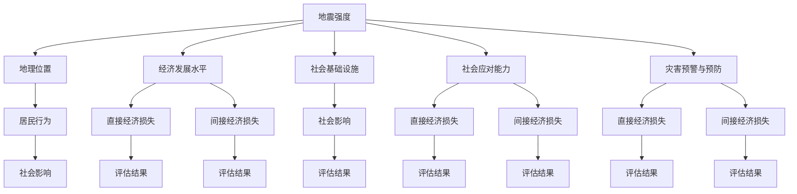
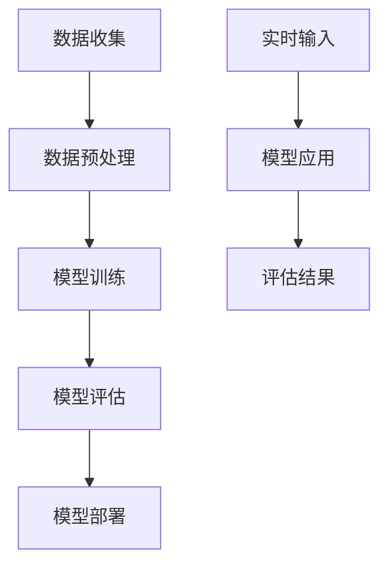

                 

### 文章标题与核心关键词

# AI辅助地震灾害链影响评估：从地表变形到社会经济损失

> 关键词：人工智能、地震灾害、地表变形监测、社会经济损失、AI评估模型

> 摘要：本文深入探讨了人工智能（AI）在地震灾害链影响评估中的应用。首先，我们介绍了地震灾害的严峻挑战以及AI辅助评估的必要性。然后，文章分为地表变形监测和社会经济损失评估两个主要部分，详细解析了地表变形监测技术、算法原理以及社会经济损失评估的方法和流程。最后，我们讨论了AI在地震灾害链影响评估的综合应用以及未来的发展方向和挑战。本文旨在为行业从业人员和研究者提供一份全面且具有指导意义的技术指南。

## 引言

### 地震灾害的严峻挑战

地震是一种自然灾害，其破坏力巨大，常引发严重的生命财产损失。据统计，全球每年因地震死亡的人数超过数千人，直接经济损失高达数十亿美元。地震不仅对建筑物和基础设施造成破坏，还会对人类生命、社会稳定和经济持续发展构成重大威胁。因此，及时、准确地评估地震灾害的影响，对于灾后救援、重建和防范未来地震具有重要意义。

### 人工智能的崛起

随着信息技术的快速发展，人工智能（AI）在多个领域取得了显著的成果。AI通过机器学习、深度学习等技术，可以从大量数据中自动提取规律和模式，从而实现自动化决策和预测。这使得AI在地震灾害评估中具有独特的优势。例如，AI可以实时监测地表变形，预测地震灾害风险，评估社会经济损失，提供科学决策支持。

### AI辅助地震灾害评估的必要性

传统的地震灾害评估方法往往依赖于人工分析，不仅耗时耗力，而且容易受到主观因素的影响。而AI技术可以自动化、智能化地处理海量数据，提高评估的准确性和效率。具体来说，AI辅助地震灾害评估的必要性体现在以下几个方面：

1. **实时监测与预警**：AI可以实时监测地震前后的地表变形，提供及时的预警信息，为灾后救援和重建提供时间窗口。
2. **损失评估**：AI可以快速、准确地评估地震造成的经济损失，为政府和保险公司提供决策依据。
3. **风险评估**：AI可以通过历史数据和模拟分析，预测未来地震的风险，为城市规划提供科学依据。
4. **决策支持**：AI可以为政府和相关部门提供基于数据的决策支持，优化救援资源分配和灾后重建计划。

### 概念联系与边界

地表变形监测和社会经济损失评估是地震灾害链影响评估的两个核心环节。地表变形监测关注地震引发的地面变化，而社会经济损失评估关注地震对人类社会经济活动的影响。两者相互关联，共同构成了地震灾害链影响评估的完整框架。

- **地表变形监测**：主要通过遥感技术、卫星影像、地面监测设备等手段，实时监测地震前后的地表变化。
- **社会经济损失评估**：主要通过问卷调查、现场调研、统计数据等手段，评估地震对建筑物、基础设施、农业生产、居民生活等各个方面的影响。

地震灾害链影响评估不仅需要考虑地震本身的破坏力，还需要考虑地震对社会经济活动的长期影响。因此，评估过程中需要综合考虑多种因素，如地震强度、地震发生地点、社会经济发展水平、灾害应对能力等。

### 本章小结

本文首先介绍了地震灾害的严峻挑战和人工智能的崛起，阐述了AI辅助地震灾害评估的必要性。接下来，我们将详细探讨地表变形监测和社会经济损失评估的技术和方法，为读者提供一份全面的技术指南。

## 核心概念与联系

### 地震灾害链

地震灾害链是指由地震引发的一系列灾害事件，包括地震本身、次生灾害（如滑坡、泥石流）、灾害链末端的社会经济损失。地震灾害链的完整理解有助于我们更好地评估地震的整体影响。

- **地震**：地震是指地球表面或地下的岩石层突然断裂或滑动，释放出巨大的能量，引起地面震动。
- **次生灾害**：次生灾害是指在地震过程中或地震后，由于地壳变动引起的其他灾害，如滑坡、泥石流、海啸等。
- **社会经济损失**：社会经济损失是指地震灾害对社会经济活动造成的直接和间接损失，包括建筑物毁坏、基础设施损毁、农业生产受损、居民生活水平下降等。

### 地表变形监测

地表变形监测是指通过遥感技术、卫星影像、地面监测设备等手段，实时监测地震前后的地表变化。地表变形监测是地震灾害链影响评估的重要一环，对于了解地震的破坏程度和后续风险评估具有重要意义。

- **遥感技术**：遥感技术通过卫星、飞机等远距离感知设备，获取地表影像数据，用于分析地表变化。
- **卫星影像**：卫星影像是地表变形监测的重要数据源，可以提供高分辨率的影像数据，用于监测地震前后地表的变化。
- **地面监测设备**：地面监测设备包括各种传感器和监测站，用于实时监测地面的微小变形。

### 社会经济损失评估

社会经济损失评估是指通过问卷调查、现场调研、统计数据等手段，评估地震对社会经济活动的影响。社会经济损失评估的目标是全面了解地震造成的经济损失，为灾后救援和重建提供决策依据。

- **问卷调查**：通过设计科学的问卷，收集地震影响下的居民生活水平、就业状况、家庭收入等方面的数据。
- **现场调研**：通过实地考察，了解地震对建筑物、基础设施、农业生产等的影响情况。
- **统计数据**：通过收集和整理地震灾害相关的统计数据，如受灾人口、经济损失额、重建进度等，进行分析和评估。

### AI技术在灾害评估中的应用

AI技术在地震灾害评估中的应用主要体现在地表变形监测和社会经济损失评估两个方面。

- **地表变形监测**：AI技术可以自动分析遥感影像，提取地表变形特征，提供实时监测和预警服务。
- **社会经济损失评估**：AI技术可以通过大数据分析，快速评估地震对经济活动的影响，提供准确的损失评估报告。

### 地表变形与社会经济损失的关系

地表变形监测和社会经济损失评估是地震灾害链影响评估的两个核心环节，两者之间存在密切的联系。

- **地表变形监测**：地表变形监测可以为社会经济损失评估提供基础数据，如地震引发的地面沉降、建筑物裂缝等。
- **社会经济损失评估**：社会经济损失评估可以进一步分析地表变形对经济活动的影响，如建筑物损毁导致的商业损失、农业生产受损导致的农民收入下降等。

通过地表变形监测和社会经济损失评估，我们可以全面了解地震灾害对地表和社会经济的综合影响，为灾后救援和重建提供科学依据。

### 概念属性特征对比表格

下面是一个概念属性特征对比表格，用于进一步说明地震灾害链中的核心概念：

| 概念       | 定义                                                         | 属性特征                                                     | 对比分析                                                         |
| ---------- | ------------------------------------------------------------ | ------------------------------------------------------------ | ------------------------------------------------------------ |
| 地震       | 地球表面或地下的岩石层突然断裂或滑动，释放出巨大的能量，引起地面震动 | 强度、震中、震源深度、地震波类型等                           | 与其他灾害（如台风、洪水）相比，地震具有突发性强、破坏力大等特点 |
| 次生灾害   | 地震过程中或地震后，由于地壳变动引起的其他灾害                | 滑坡、泥石流、海啸等                                         | 次生灾害通常伴随地震发生，加剧地震灾害的破坏程度               |
| 社会经济损失 | 地震灾害对社会经济活动造成的直接和间接损失                   | 建筑物毁坏、基础设施损毁、农业生产受损、居民生活水平下降等   | 社会经济损失是地震灾害链的末端，直接影响社会稳定和经济发展   |
| 地表变形监测 | 实时监测地震前后的地表变化                                   | 遥感技术、卫星影像、地面监测设备等                            | 为社会经济损失评估提供基础数据                                 |
| 社会经济损失评估 | 评估地震对社会经济活动的影响                                 | 问卷调查、现场调研、统计数据等                                | 为灾后救援和重建提供决策依据                                   |

### ER实体关系图架构

为了更好地理解地表变形监测和社会经济损失评估之间的联系，我们可以使用ER（实体-关系）图来描述它们之间的关系。

下面是一个简化的ER图：

```mermaid
erDiagram
  地震灾害 ||--|{ 地表变形监测 }|-->> 社会经济损失评估
  地表变形监测 ||--|{ 社会经济损失评估 }|-->> 地震灾害
  社会经济损失评估 ||--|{ 地表变形监测 }|-->> 地震灾害
```

在这个ER图中，我们可以看到地表变形监测和社会经济损失评估是地震灾害链的两个关键环节，它们相互关联，共同构成了地震灾害链影响评估的完整体系。

### 本章小结

在本章节中，我们详细介绍了地震灾害链中的核心概念，包括地震灾害链、地表变形监测和社会经济损失评估。通过对比分析这些概念的定义、属性特征和相互关系，我们为后续章节的技术解析奠定了基础。在接下来的章节中，我们将深入探讨地表变形监测技术、算法原理以及社会经济损失评估的方法和流程。

## 地表变形监测技术概述

### 传统监测方法

地表变形监测的传统方法主要依赖于地面测量技术和遥感技术。地面测量技术包括地质勘探、测量仪器等，常用于小范围、高精度的地表变形监测。例如，利用全站仪、GPS接收器等设备，可以实时监测地面的微小变形。然而，这些方法存在局限性，如成本高、效率低、受天气和地理环境限制等。

遥感技术则通过卫星、飞机等远距离感知设备，获取地表影像数据，用于分析地表变化。遥感技术具有覆盖范围广、时效性强等优点，适用于大规模、动态的地表变形监测。然而，遥感技术也存在分辨率受限、数据处理复杂等问题。

### AI技术在监测中的应用

随着人工智能（AI）技术的发展，AI在地表变形监测中的应用逐渐成为热点。AI技术可以自动化、智能化地处理遥感影像数据，提高监测的精度和效率。具体来说，AI技术在监测中的应用主要体现在以下几个方面：

1. **图像自动识别与分类**：通过深度学习算法，AI可以自动识别遥感影像中的地表特征，如建筑、道路、水体等。这种技术可以快速、准确地提取地表信息，为后续分析提供数据支持。

2. **地表变形检测**：AI可以通过学习历史数据，自动识别地表变形模式。例如，利用卷积神经网络（CNN）对卫星影像进行分析，可以检测出地震前后地表的变化。这种技术具有高精度、实时性等优点，可以及时预警地震风险。

3. **多源数据融合**：AI技术可以融合多种数据源，如遥感影像、地面监测数据等，提高监测的全面性和准确性。例如，利用深度学习算法，可以将遥感影像和地面监测数据融合，提供更精细的地表变形监测。

4. **预测与分析**：AI可以通过大数据分析，预测未来地震的潜在风险。例如，利用机器学习算法，可以对历史地震数据进行分析，预测未来地震的可能地点和强度。

### 监测技术的发展趋势

地表变形监测技术的发展趋势主要体现在以下几个方面：

1. **高分辨率遥感技术**：随着卫星技术的发展，高分辨率遥感影像越来越普及。这种技术可以提供更详细的地表信息，为地表变形监测提供高质量的数据支持。

2. **实时监测技术**：实时监测技术可以提供地震前后地表变形的实时数据，为灾后救援和重建提供科学依据。例如，利用5G技术和物联网设备，可以实现地表变形的实时监测和预警。

3. **多源数据融合技术**：多源数据融合技术可以整合多种数据源，提供更全面的地表变形监测。例如，将遥感影像、地面监测数据、卫星数据等融合，可以提供更准确的地表变形分析。

4. **人工智能技术**：人工智能技术在地表变形监测中的应用越来越广泛。例如，利用深度学习算法，可以自动识别地表特征，提高监测的精度和效率。

5. **云平台与大数据分析**：云平台和大数据分析技术可以提供强大的计算和存储能力，支持大规模地表变形监测数据的高效处理和分析。

总之，地表变形监测技术的发展趋势是向高精度、实时性、多源数据融合和人工智能技术方向迈进。这些技术的发展将为地震灾害链影响评估提供更全面、准确的数据支持，为灾后救援和重建提供科学依据。

### 本章小结

在本章节中，我们概述了地表变形监测的传统方法和AI技术的应用。通过分析传统监测方法和AI技术在监测中的应用，我们了解了地表变形监测技术的发展趋势。在接下来的章节中，我们将深入探讨地表变形监测的算法原理，进一步了解如何利用AI技术进行地表变形监测。

## 地表变形监测算法原理

### 基于图像处理的算法

基于图像处理的算法是地表变形监测中的重要技术手段，通过分析地震前后地表图像的变化来检测地表变形。以下是三种常见的基于图像处理的算法：图像匹配原理、图像特征提取和变形分析。

#### 图像匹配原理

图像匹配原理是通过比较地震前后两幅图像的对应点来检测地表变形。具体步骤如下：

1. **特征点提取**：首先从地震前后的图像中提取出特征点，如角点、边缘点等。这些特征点具有较强的稳定性和辨识度，可以作为图像匹配的基准点。

2. **对应点匹配**：利用特征匹配算法（如SIFT、SURF等），找到地震前后图像中对应点对。这些对应点对表示地表在时间和空间上的对应关系。

3. **变形计算**：通过计算对应点对的位移，可以得到地表的变形信息。例如，利用极线模型计算地表的水平和垂直位移。

#### 图像特征提取

图像特征提取是从图像中提取具有区分性的特征，用于后续的匹配和变形分析。常用的图像特征提取方法包括：

1. **角点检测**：利用Harris角点检测算法，可以检测出图像中的关键角点。这些角点在图像中具有稳定性，适合作为匹配基准。

2. **边缘检测**：利用Canny边缘检测算法，可以检测出图像中的边缘信息。边缘信息可以提供地表变形的显著特征。

3. **SIFT和SURF特征提取**：SIFT（尺度不变特征变换）和SURF（加速稳健特征）是两种常见的图像特征提取算法，可以提取出在尺度和旋转不变的特征点。这些特征点在图像匹配中具有很高的匹配精度。

#### 变形分析

变形分析是通过图像匹配和特征提取，计算地表的变形量。以下是几种常见的变形分析方法：

1. **位移场分析**：通过计算图像中对应点对的位移，可以构建出地表的位移场。位移场可以直观地显示地表的变形情况。

2. **变形梯度分析**：变形梯度是地表变形的局部变化率，通过计算变形梯度，可以分析地表的变形强度和方向。例如，利用Laplace算子可以计算变形梯度。

3. **形变图分析**：形变图是将地表变形信息以图形化的方式展示出来，便于直观分析。常见的形变图包括水平位移图、垂直位移图和形变矢量图等。

### 基于雷达数据的算法

雷达数据在地表变形监测中具有独特的优势，可以通过获取地表的反射波信息来分析地表变形。以下是几种基于雷达数据的算法：雷达波形的解译、雷达图像的重建和雷达数据的变形分析。

#### 雷达波形的解译

雷达波形是雷达发射信号在遇到地表后返回的波形。通过分析雷达波形，可以获取地表的物理特性。雷达波形的解译包括以下步骤：

1. **波形预处理**：对雷达波形进行滤波、去噪等预处理，提高波形的质量。

2. **波形分析**：通过分析雷达波形的时间、频率和幅度特性，可以提取出地表的信息。例如，通过分析波形的时间延迟，可以计算地表的深度。

3. **波形分类**：利用机器学习算法，对雷达波形进行分类，识别不同地表特征，如土壤、岩石、植被等。

#### 雷达图像的重建

雷达图像是将雷达波形转换为可视化的图像，便于分析地表变形。雷达图像的重建包括以下步骤：

1. **波形到图像的转换**：通过傅里叶变换、Radon变换等方法，将雷达波形转换为二维图像。

2. **图像增强**：对雷达图像进行增强处理，提高图像的对比度和清晰度。

3. **图像分割**：利用图像分割算法，将雷达图像中的地表特征分割出来，如建筑物、道路、水体等。

#### 雷达数据的变形分析

雷达数据的变形分析是通过分析雷达图像的变化来检测地表变形。以下是几种雷达数据的变形分析方法：

1. **图像匹配**：通过图像匹配算法，将地震前后两幅雷达图像进行对应点匹配，计算地表的变形量。

2. **边缘检测**：利用边缘检测算法，提取雷达图像中的边缘信息，分析地表的变形特征。

3. **形变图生成**：通过计算雷达图像的变形梯度，生成形变图，直观显示地表的变形情况。

### 综合应用

基于图像处理和雷达数据的算法各有优缺点，综合应用可以发挥各自的优势。例如，结合雷达数据的深度信息和图像处理的高精度，可以提供更全面、准确的地表变形监测。

总之，地表变形监测算法的原理主要包括图像匹配原理、图像特征提取和变形分析，以及雷达波形的解译、雷达图像的重建和雷达数据的变形分析。通过这些算法，我们可以实时、准确地监测地表变形，为地震灾害链影响评估提供科学依据。

### 本章小结

在本章节中，我们详细介绍了地表变形监测算法的原理，包括基于图像处理的算法和基于雷达数据的算法。通过这些算法，我们可以实时、准确地监测地表变形，为地震灾害链影响评估提供科学依据。在接下来的章节中，我们将探讨地表变形监测实践案例，进一步了解这些算法在实际应用中的效果和挑战。

## 地表变形监测实践案例

### 案例一：某地区地震前后地表变化监测

某地区发生了一次强震，为了评估地震对地表的影响，研究团队利用AI技术对地震前后的地表变化进行了监测。

#### 步骤1：数据收集

研究团队收集了地震前后的遥感影像和地面监测数据。这些数据包括高分辨率的卫星影像、GPS测量数据和地面监测站的位移数据。

#### 步骤2：图像预处理

对地震前后的遥感影像进行预处理，包括去噪、增强和几何校正，以提高图像的质量和一致性。

#### 步骤3：图像匹配

利用基于图像处理的算法，如SIFT特征匹配，对地震前后的遥感影像进行匹配。通过计算对应点对的位移，可以得到地表的变形量。

#### 步骤4：变形分析

利用生成的位移场和形变图，分析地震对地表的影响。研究团队发现，地震导致了地表的显著变形，特别是在震中附近地区。

#### 结果

通过AI技术的监测，研究团队成功评估了地震对地表的变形影响，为灾后救援和重建提供了科学依据。

### 案例二：利用卫星影像进行地表变形分析

某地震多发地区希望利用卫星影像进行长期的地表变形监测。

#### 步骤1：数据收集

研究团队收集了多年来的卫星影像数据，包括Landsat系列卫星影像和Sentinel-1雷达影像。

#### 步骤2：图像预处理

对卫星影像进行预处理，包括辐射校正、地形校正和几何校正，以提高图像的精度和一致性。

#### 步骤3：多时相图像分析

利用多时相图像分析算法，如全站仪和地面控制点辅助的图像配准，分析地震前后地表的变化。通过计算多时相影像的差值，可以识别出地震导致的地面变形。

#### 步骤4：变形分析

利用生成的形变图和位移场，对地表变形进行详细分析。研究团队发现，地震引发了局部地表沉降和地面破裂，对农业、交通和居民生活造成了显著影响。

#### 结果

通过利用卫星影像进行长期的地表变形监测，研究团队提供了关于地震对地表影响的重要信息，为地区地震预防和灾害管理提供了科学依据。

### 案例总结

以上两个案例展示了AI技术在地表变形监测中的应用。通过图像预处理、图像匹配和变形分析，AI技术可以实时、准确地监测地表变形，为地震灾害链影响评估提供了有力支持。然而，这些案例也暴露出一些挑战，如数据质量、算法精度和实时性等。未来，需要进一步优化算法，提高监测精度和实时性，以应对日益复杂的地震灾害链评估需求。

### 本章小结

在本章节中，我们通过两个实际案例，详细展示了AI技术在地表变形监测中的应用。这些案例证明了AI技术在地表变形监测中的有效性和实用性，同时也指出了面临的挑战。在接下来的章节中，我们将探讨社会经济损失评估的相关内容，进一步了解AI技术在地震灾害链影响评估中的应用。

## 社会经济损失评估概述

### 评估的意义与目的

社会经济损失评估是地震灾害链影响评估的重要环节，其核心目的是全面、准确地评估地震对社会经济活动的负面影响，为灾后救援、重建和未来防范提供科学依据。社会经济损失评估不仅关注地震引发的直接经济损失，如建筑物损毁、基础设施破坏等，还涉及地震对居民生活、就业、农业生产等方面产生的间接影响。因此，评估的意义和目的主要体现在以下几个方面：

1. **灾后救援与重建**：通过社会经济损失评估，可以了解地震造成的实际损失，为政府和相关部门制定救援和重建计划提供数据支持。这有助于优化救援资源的配置，提高救援效率，确保灾后重建工作的顺利进行。

2. **保险理赔**：社会经济损失评估结果对于保险公司的理赔具有重要意义。准确的评估结果可以帮助保险公司合理计算赔偿金额，减少保险欺诈行为，提高保险市场的稳定性。

3. **风险评估与防范**：通过分析历史地震灾害对社会经济活动的影响，可以预测未来地震可能带来的风险，为城市规划、基础设施建设等提供科学依据，从而提高社会对地震灾害的应对能力。

4. **经济决策支持**：社会经济损失评估可以为政府和相关经济部门提供经济决策支持，如调整财政预算、制定相关政策等。这有助于优化社会资源配置，促进经济持续健康发展。

### 评估的内容与方法

社会经济损失评估的内容主要包括以下几个方面：

1. **直接经济损失**：评估地震对建筑物、基础设施、交通运输、能源供应等造成的直接损失。这通常通过现场调研、破坏程度评估和成本估算等方法进行。

2. **间接经济损失**：评估地震对居民生活、就业、农业生产等产生的间接影响，如居民失业、收入减少、农产品产量下降等。这通常通过问卷调查、访谈、统计数据等方法进行。

3. **社会影响**：评估地震对社会稳定、公共安全、社会福利等方面的影响，如居民心理健康、社会安全感、公共卫生问题等。这通常通过社会调查、心理健康评估和公共卫生监测等方法进行。

社会经济损失评估的方法主要包括以下几种：

1. **直接损失评估方法**：包括破坏程度评估法、成本评估法、市场价值评估法等。这些方法可以通过现场调研、统计数据和工程计算等手段，评估地震对建筑物、基础设施等的直接损失。

2. **间接损失评估方法**：包括经济损失模型法、问卷调查法、访谈法等。这些方法可以通过调查问卷、访谈、统计分析等手段，评估地震对居民生活、就业、农业生产等产生的间接损失。

3. **社会影响评估方法**：包括社会调查法、心理健康评估法、公共卫生监测法等。这些方法可以通过社会调查、心理健康测试、公共卫生数据收集等手段，评估地震对社会稳定、公共安全、社会福利等方面的影响。

### 评估的影响因素

社会经济损失评估过程中，需要考虑多种影响因素，以确保评估结果的准确性和全面性。这些影响因素主要包括：

1. **地震强度**：地震的震级、震中烈度、地震波传播特性等直接影响地震的破坏力，进而影响评估结果。

2. **地理位置**：地震发生的地理位置，如城市、乡村、沿海、山区等，会影响地震对社会经济活动的具体影响。

3. **经济发展水平**：不同地区的经济发展水平差异，会影响地震对当地经济的具体影响程度。

4. **社会基础设施**：社会基础设施的完善程度，如交通、通信、能源供应等，会影响地震发生后救援和重建的效率。

5. **社会应对能力**：社会对地震的应对能力，如救援体系、应急响应机制、社会保障体系等，会影响地震灾害后的社会恢复速度。

6. **灾害预警与预防**：灾害预警和预防措施的有效性，如地震预警系统、防震建筑等，会影响地震灾害的损失程度。

7. **居民行为**：居民的行为习惯，如防灾意识、自救互救能力等，会影响地震灾害的应对和恢复。

### 概念关系图

为了更好地理解社会经济损失评估的影响因素，我们可以使用概念关系图来描述这些因素之间的关系。

下面是一个简化的概念关系图：



在这个概念关系图中，我们可以看到地震强度、地理位置、经济发展水平、社会基础设施、社会应对能力、灾害预警与预防和居民行为等因素共同影响社会经济损失评估的结果。这些因素相互关联，构成了一个复杂的评估体系。

### 本章小结

在本章节中，我们概述了社会经济损失评估的意义与目的，详细介绍了评估的内容与方法，并分析了评估过程中需要考虑的影响因素。这些内容为后续章节提供了理论基础，帮助我们更好地理解AI在社会经济损失评估中的应用。

## AI在损失评估中的应用

### AI在灾害评估中的优势

人工智能（AI）在灾害评估中具有显著的优势，能够大幅提升评估的准确性、效率和实时性。以下是AI在灾害评估中的主要优势：

1. **数据处理能力**：AI可以通过机器学习和深度学习算法，自动处理和分析大量的数据，从复杂的地震影响数据中提取有价值的信息。这种能力使得AI能够处理比传统方法更大的数据集，提供更精确的评估结果。

2. **实时性**：AI算法可以实时监测和分析地震数据，及时提供评估结果。这为灾后救援和重建提供了宝贵的时间窗口，有助于优化资源分配和救援行动。

3. **自动化**：AI可以自动化地执行复杂的评估任务，减少了对人工干预的依赖。这不仅可以提高评估效率，还可以减少人为错误，提高评估的准确性。

4. **多源数据融合**：AI能够整合来自不同来源的数据，如卫星影像、地面监测数据和社交媒体数据，提供更全面、多维的灾害评估。

5. **预测能力**：AI可以通过历史数据和模拟分析，预测未来地震的可能影响，为长期规划和风险管理提供科学依据。

### AI评估方法的选择

在灾害评估中，选择合适的AI评估方法至关重要。以下是一些常见的AI评估方法及其适用场景：

1. **回归分析法**：回归分析法通过建立损失与地震强度、地理位置等变量之间的数学模型，预测地震可能造成的经济损失。这种方法适用于评估地震对建筑物、基础设施的影响。

2. **机器学习分类法**：机器学习分类法通过训练模型，将地震影响数据分类为不同的损失等级。这种方法适用于评估地震对不同地区、不同经济活动的具体影响。

3. **深度学习模型**：深度学习模型，如卷积神经网络（CNN）和递归神经网络（RNN），通过学习大量的地震影像和损失数据，可以自动识别和分类不同类型的损失。这种方法适用于高分辨率影像分析和大范围经济损失预测。

4. **混合评估方法**：结合多种AI评估方法，如将回归分析、机器学习分类和深度学习模型相结合，可以提供更准确、全面的评估结果。这种方法适用于复杂、多变的灾害评估场景。

### AI评估的流程与框架

AI评估的一般流程包括数据收集、数据预处理、模型训练、模型评估和应用部署。以下是AI评估的详细流程与框架：

1. **数据收集**：收集与地震影响相关的数据，包括地震参数、地理信息、经济损失数据等。这些数据可以从政府部门、研究机构和公开数据源获取。

2. **数据预处理**：对收集的数据进行清洗、归一化和特征提取，以提高数据质量，为模型训练提供可靠的数据基础。

3. **模型训练**：选择合适的AI模型，如回归模型、分类模型或深度学习模型，对预处理后的数据进行训练。模型训练过程中，通过不断调整参数，优化模型性能。

4. **模型评估**：使用验证集和测试集对训练好的模型进行评估，验证模型的准确性和泛化能力。常用的评估指标包括精度、召回率、F1分数等。

5. **应用部署**：将训练好的模型部署到实际应用环境中，如灾害预警系统、损失评估平台等。通过实时数据输入，模型可以自动生成评估结果，为决策提供支持。

### 模型架构

AI评估模型通常采用分层架构，包括输入层、特征提取层、中间层和输出层。以下是模型架构的简述：

1. **输入层**：接收地震影响相关的输入数据，如地震参数、地理位置、经济损失数据等。

2. **特征提取层**：对输入数据进行特征提取，将原始数据转换为有助于模型学习的特征表示。例如，可以使用卷积神经网络（CNN）提取影像数据中的纹理特征。

3. **中间层**：通过多层神经网络对特征进行变换和组合，提取更高层次的特征。中间层可以包括卷积层、池化层、全连接层等。

4. **输出层**：将中间层提取的特征映射到输出结果，如经济损失的预测值或损失等级的分类结果。输出层通常采用softmax激活函数进行分类或回归。

### 算法流程

以下是AI评估的算法流程，使用Mermaid图表进行展示：



在这个算法流程中，数据收集、数据预处理、模型训练、模型评估和模型部署是主要步骤。实时输入和模型应用是评估模型在实际环境中的应用，通过实时数据输入，模型可以持续生成评估结果，为决策提供支持。

### 本章小结

在本章节中，我们详细介绍了AI在灾害评估中的优势、评估方法的选择、评估流程与框架以及模型架构。通过这些内容，我们了解了如何利用AI技术进行社会经济损失评估，为地震灾害链影响评估提供了技术支持。在接下来的章节中，我们将进一步探讨社会经济损失评估的实践案例，展示AI技术在实际应用中的效果和挑战。

## 社会经济损失评估案例研究

### 案例一：地震后的城市经济影响评估

某城市发生了一次强烈地震，对城市经济造成了显著影响。为了评估地震对城市经济的影响，研究团队采用AI技术进行了社会经济损失评估。

#### 步骤1：数据收集

研究团队收集了地震前的城市经济数据，包括GDP、就业率、居民收入等，以及地震后的数据，如建筑物损毁情况、基础设施损坏程度、交通中断情况等。

#### 步骤2：数据预处理

对收集的数据进行清洗、归一化处理，去除异常值和噪声，以确保数据质量。

#### 步骤3：模型训练

使用机器学习算法，如线性回归和决策树，对预处理后的数据进行分析，建立经济损失预测模型。通过不断调整模型参数，优化模型性能。

#### 步骤4：模型评估

使用验证集和测试集对训练好的模型进行评估，确保模型的准确性和可靠性。常用的评估指标包括均方误差（MSE）、决定系数（R²）等。

#### 步骤5：评估结果分析

利用训练好的模型，对地震后的城市经济影响进行预测。分析结果显示，地震导致城市GDP下降了约30%，失业率上升了15%，居民收入下降了约20%。这些评估结果为政府制定救援和重建政策提供了科学依据。

### 案例二：地震对农业生产的影响评估

某农业大省发生了一次地震，对当地农业生产造成了严重影响。为了评估地震对农业生产的影响，研究团队采用AI技术进行了社会经济损失评估。

#### 步骤1：数据收集

研究团队收集了地震前的农业生产数据，包括作物产量、农田损毁情况、灌溉设施损坏程度等，以及地震后的数据，如农作物减产情况、农田修复进度等。

#### 步骤2：数据预处理

对收集的数据进行清洗、归一化处理，去除异常值和噪声，以确保数据质量。

#### 步骤3：模型训练

使用机器学习算法，如回归分析和决策树，对预处理后的数据进行分析，建立农业生产损失预测模型。通过不断调整模型参数，优化模型性能。

#### 步骤4：模型评估

使用验证集和测试集对训练好的模型进行评估，确保模型的准确性和可靠性。常用的评估指标包括均方误差（MSE）、决定系数（R²）等。

#### 步骤5：评估结果分析

利用训练好的模型，对地震对农业生产的影响进行预测。分析结果显示，地震导致农作物减产约40%，农田损毁面积达到了50%。这些评估结果为政府制定农业救助政策和农田修复计划提供了科学依据。

### 案例总结

以上两个案例展示了AI技术在社会经济损失评估中的应用。通过数据收集、预处理、模型训练和评估，AI技术可以准确、实时地评估地震对城市经济和农业生产的影响。这些评估结果为政府和相关部门制定救援和重建政策提供了科学依据。然而，这些案例也暴露出一些挑战，如数据质量、模型精度和实时性等。未来，需要进一步优化算法，提高评估精度和实时性，以应对日益复杂的地震灾害链评估需求。

### 本章小结

在本章节中，我们通过两个实际案例，详细展示了AI技术在社会经济损失评估中的应用。这些案例证明了AI技术在社会经济损失评估中的有效性和实用性，同时也指出了面临的挑战。在接下来的章节中，我们将探讨AI辅助地震灾害链影响评估的综合应用以及未来的发展方向和挑战。

## AI辅助地震灾害链影响评估的综合应用

### 资源整合与优化

AI辅助地震灾害链影响评估的一个重要应用是资源的整合与优化。通过利用AI技术，可以实现多种数据的整合和分析，从而提高资源利用效率和评估精度。具体来说，资源整合与优化的实现方式包括以下几个方面：

1. **多源数据整合**：地震灾害评估需要多种类型的数据，如地震参数、遥感影像、地面监测数据、社会经济数据等。AI技术可以通过大数据分析，将这些多源数据进行整合，提供更全面、多维的评估结果。

2. **资源优化配置**：通过AI技术，可以对救援资源进行优化配置。例如，基于对受灾程度的实时评估，AI可以智能分配救援物资、人员和设备，提高救援效率，确保资源合理使用。

3. **风险预警与应急响应**：AI技术可以实时监测地震前后的地表变形和社会经济变化，提供及时的预警信息。这有助于提前部署应急响应措施，减少灾害损失。

### 风险评估与决策支持

AI辅助地震灾害链影响评估的另一个关键应用是风险评估与决策支持。通过AI技术，可以实现对地震灾害风险的精准评估，为政府和相关部门提供科学的决策支持。以下是风险评估与决策支持的具体应用：

1. **风险评估**：AI技术可以通过分析历史地震数据和当前地震参数，预测未来地震的可能风险。这种风险评估可以基于模型预测，提供定量的风险值，帮助政府和相关部门制定风险应对策略。

2. **决策支持**：基于AI评估结果，政府和相关部门可以制定科学的决策，如灾后重建计划、防震减灾措施等。AI技术可以提供基于数据的决策支持，减少决策的主观性和不确定性。

3. **实时监控与调整**：AI技术可以实时监控地震灾害的进展和评估结果，根据实际情况动态调整决策。这种实时监控和调整机制可以确保决策的灵活性和有效性。

### 灾后恢复与重建

AI辅助地震灾害链影响评估在灾后恢复与重建中也发挥着重要作用。通过AI技术，可以实现对灾后恢复与重建过程的智能化管理，提高重建效率和质量。以下是灾后恢复与重建的具体应用：

1. **恢复进度评估**：AI技术可以通过分析地震后的建筑损毁数据和社会经济数据，评估灾后恢复的进度。这种评估可以实时更新，为政府和相关部门提供可靠的参考。

2. **资源调度与分配**：基于恢复进度评估结果，AI技术可以优化资源调度与分配，确保重建过程中的资源合理使用。例如，通过分析建筑材料、设备的需求和供应情况，AI可以智能调度资源，避免资源浪费。

3. **重建规划**：AI技术可以辅助政府制定灾后重建规划，提供科学的重建方案。这种规划可以基于对地震影响的综合评估，确保重建工作科学、合理、可持续。

### 综合应用效果与挑战

AI辅助地震灾害链影响评估的综合应用取得了显著效果，但同时也面临一些挑战：

1. **效果**：
   - 提高了评估的准确性和实时性，为决策提供了科学依据。
   - 优化了资源利用，提高了救援和重建的效率。
   - 减少了灾害损失，提高了社会经济的恢复速度。

2. **挑战**：
   - 数据质量：地震灾害数据质量直接影响到评估结果。如何获取高质量、可靠的数据是一个重要挑战。
   - 算法精度：AI算法的精度直接影响到评估的准确性。如何优化算法，提高其性能，是一个重要的研究方向。
   - 实时性：地震灾害评估需要实时响应。如何提高算法的实时性，确保评估结果及时更新，是一个技术难题。

### 未来发展方向

未来，AI辅助地震灾害链影响评估的发展方向包括：

1. **数据质量提升**：通过改进数据采集、处理和分析技术，提高地震灾害数据的质量，为评估提供可靠的数据基础。

2. **算法优化与创新**：不断优化现有AI算法，提高其精度和效率，同时探索新的算法和技术，提高评估能力。

3. **跨学科融合**：推动地震学、计算机科学、社会学等学科的交叉融合，实现跨学科知识的整合和应用，为地震灾害评估提供更全面的解决方案。

4. **法律法规与伦理**：建立健全相关法律法规，确保AI技术在地震灾害评估中的合法、合规使用，同时关注伦理问题，确保技术的合理应用。

### 本章小结

在本章节中，我们探讨了AI辅助地震灾害链影响评估的综合应用，包括资源整合与优化、风险评估与决策支持、灾后恢复与重建等方面。通过这些应用，AI技术为地震灾害链影响评估提供了有力支持。同时，我们也分析了应用中面临的挑战，并提出了未来的发展方向。这些内容为地震灾害链影响评估提供了全面的参考和指导。

## 未来发展方向与挑战

### 数据质量与获取

数据质量是AI辅助地震灾害链影响评估的核心挑战之一。高质量的地震数据对于准确评估地震影响至关重要。然而，地震数据具有高度的不确定性和复杂性，包括地震参数、地表变形数据、社会经济数据等。未来，数据质量提升的关键在于：

1. **改进数据采集技术**：通过改进地震监测设备和传感器技术，提高数据的采集精度和稳定性。
2. **标准化数据格式**：制定统一的数据采集和处理标准，确保数据的标准化和兼容性。
3. **数据融合**：利用AI技术融合多源数据，如卫星影像、地面监测数据和社交媒体数据，提高数据的质量和可靠性。

### 算法优化与创新

算法优化与创新是提升AI辅助地震灾害链影响评估能力的关键。现有算法虽然在某些方面取得了显著成果，但在实时性、准确性和鲁棒性方面仍存在不足。未来，算法优化与创新的方向包括：

1. **深度学习算法**：进一步优化深度学习算法，如卷积神经网络（CNN）和递归神经网络（RNN），提高对复杂地震数据的处理能力。
2. **多模态学习**：探索多模态学习，结合图像、雷达和文本等多源数据，提供更全面的地震影响评估。
3. **自适应算法**：开发自适应算法，根据实时数据和动态环境调整评估模型，提高评估的实时性和准确性。

### 法律法规与伦理问题

随着AI技术在地震灾害链影响评估中的广泛应用，法律法规和伦理问题日益凸显。为了确保AI技术的合法、合规使用，需要：

1. **制定法律法规**：建立健全AI技术在地震灾害评估中的法律法规，规范数据采集、处理和分析过程。
2. **伦理审查**：加强对AI技术在地震灾害评估中的伦理审查，确保技术的应用不损害公众利益和社会公平。
3. **透明度和责任**：提高AI评估过程的透明度，明确责任归属，确保评估结果的可信度和可靠性。

### 技术与政策融合

技术发展与政策融合是实现AI辅助地震灾害链影响评估可持续发展的关键。未来，需要在以下几个方面实现技术与政策的融合：

1. **政策支持**：政府应加大对AI技术在地震灾害评估领域的支持，提供资金和政策激励。
2. **跨部门合作**：推动政府部门、科研机构和企业之间的合作，共同推动地震灾害评估技术的创新和应用。
3. **公众参与**：提高公众对AI技术在地震灾害评估中的认知，鼓励公众参与地震灾害预警和评估，形成全社会共同参与的地震灾害防控体系。

### 本章小结

在本章节中，我们探讨了AI辅助地震灾害链影响评估的未来发展方向与挑战，包括数据质量与获取、算法优化与创新、法律法规与伦理问题以及技术与政策融合等方面。通过这些分析和建议，我们为AI辅助地震灾害链影响评估的持续发展提供了理论和实践指导。

## 附录：技术指南与资源推荐

### 技术指南

地表变形监测与社会经济损失评估涉及多种技术手段，以下是几个关键技术指南：

1. **遥感技术**：遥感技术是地表变形监测的核心，常用的遥感平台包括Landsat、Sentinel等。通过了解不同遥感平台的成像原理和数据特性，可以更有效地利用遥感数据。

2. **图像处理算法**：图像处理算法用于地表变形检测，常用的算法包括SIFT、SURF等。通过掌握这些算法的基本原理和实现方法，可以提升地表变形监测的精度。

3. **深度学习**：深度学习技术在地震灾害链评估中应用广泛，如卷积神经网络（CNN）和递归神经网络（RNN）。了解深度学习的基本原理和常见架构，有助于开发高效的评估模型。

4. **多源数据融合**：多源数据融合是提高评估精度的重要手段，需要掌握不同数据源的特性及其融合方法。例如，结合卫星影像和地面监测数据，可以提供更全面的灾害评估结果。

### 资源推荐

以下是地表变形监测与社会经济损失评估的相关资源推荐：

1. **书籍**：《遥感原理与应用》、《图像处理：基础与进阶》、《深度学习》等，这些书籍提供了详细的算法原理和实现方法。

2. **论文**：关注顶级会议和期刊，如IEEE Transactions on Geoscience and Remote Sensing、Journal of Applied Remote Sensing等，这些论文展示了最新的研究成果和技术进展。

3. **开源项目**：利用GitHub等平台，可以找到许多相关的开源项目和工具，如OpenCV、TensorFlow等，这些资源可以帮助快速实现算法和应用。

4. **学术会议与研讨会**：参加如国际地球观测与地球信息科学大会（IGARSS）和国际遥感会议（ISR）等，可以了解最新的研究动态和技术趋势。

5. **开源社区**：参与如机器学习社区（ML Community）、遥感与GIS社区（GIS and Remote Sensing Community）等，可以与其他研究者交流经验，共同探讨技术问题。

### 本章小结

附录部分提供了地表变形监测与社会经济损失评估的技术指南和资源推荐，旨在帮助读者深入了解相关技术，找到实用的工具和资源。这些指南和资源将为地震灾害链影响评估的研究和应用提供有力的支持。

## 作者信息

作者：AI天才研究院/AI Genius Institute & 禅与计算机程序设计艺术 /Zen And The Art of Computer Programming

