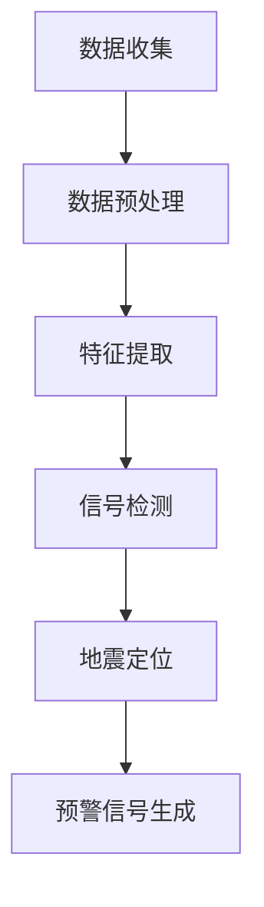
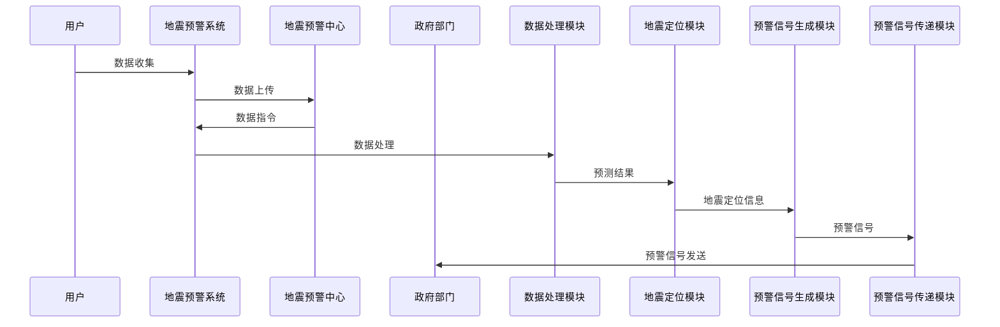

                 

### 第1章：问题背景

#### 1.1.1 问题背景介绍

地震预警，是指利用地震发生前所产生的各种信号，通过一定的技术手段，提前发出警报，以便人们有足够的时间采取避难等措施，减轻地震灾害的影响。随着科技的进步，地震预警的重要性日益凸显。一方面，地震具有突发性强、破坏力大的特点，提前预警能够显著降低人员伤亡和财产损失；另一方面，现代社会对信息传递的速度和准确性要求越来越高，地震预警系统的高效运行能够为政府和公众提供更加及时、准确的地震信息。

然而，传统的地震预警系统存在诸多局限性。首先，地震预警需要大量的数据支持，包括地震波传播数据、地面运动数据等，这些数据往往分布在不同的地理位置和传感器上，如何高效、准确地收集这些数据成为一大难题。其次，传统的地震预警系统依赖于固定的模型和算法，难以适应复杂多变的地震信号，导致预警精度和响应速度受到限制。此外，地震预警系统的建设和运行成本较高，普及率较低，难以全面覆盖地震多发区域。

#### 1.1.2 问题描述

地震预警系统的核心任务是实现对地震的快速检测和定位，并尽可能精确地预测地震波的传播路径，从而提供足够的时间进行预警。这一过程主要包括以下几个关键环节：

1. **数据收集**：通过各类地震传感器（如地震仪、GPS等）收集地震前的各种数据，如地面运动、地震波传播等。
2. **数据处理**：对收集到的数据进行预处理，如去噪、滤波等，以便提取有效的地震信号。
3. **地震定位**：利用地震波传播时间差和地震波类型等参数，对地震发生的位置进行精确定位。
4. **预警信号生成**：基于地震定位结果和地震波传播模型，生成预警信号，并评估地震的影响范围和强度。
5. **快速响应**：将预警信号及时传递给相关部门和公众，以便采取相应的应对措施。

在实现这一过程中，地震预警系统面临诸多挑战。首先，地震信号的复杂性使得数据预处理和模型选择变得尤为重要。其次，预警信号的生成和传递需要高效、可靠的算法和系统架构支持。此外，地震预警系统的运行需要大量的人力和物力投入，如何降低成本、提高效率成为关键问题。

#### 1.1.3 问题解决思路

针对上述问题，AI技术的引入为地震预警系统提供了新的解决方案。首先，AI技术在数据收集和处理方面具有显著优势。通过机器学习和深度学习算法，AI能够高效地从海量数据中提取有用信息，提高数据处理的精度和效率。其次，AI模型在地震预警信号生成和预测方面具有强大的能力。通过训练大量地震样本数据，AI模型能够学习到地震信号的规律和特征，从而提高预警信号的准确性和响应速度。此外，AI技术还能够协助优化地震预警系统的架构设计，提高系统的可靠性和可扩展性。

具体来说，问题解决思路可以分为以下几个步骤：

1. **数据收集与处理**：利用AI技术，如机器学习算法，对地震传感器收集到的数据进行预处理，提取有效的地震信号。
2. **AI模型选择与应用**：根据地震预警的需求，选择合适的AI模型，如深度学习模型，进行地震信号的检测、定位和预测。
3. **快速响应机制构建**：通过分布式计算和物联网技术，构建快速、可靠的预警信号传递机制，确保预警信息能够及时、准确地传递给相关部门和公众。

#### 1.1.4 边界与外延

地震预警系统不仅适用于地震多发地区，还可以应用于其他自然灾害预警领域，如火山爆发、海啸等。此外，随着AI技术的不断发展，地震预警系统的功能和应用范围也将不断拓展。例如，未来地震预警系统可能会集成更多传感器类型，如土壤传感器、海洋传感器等，进一步提高预警的精度和覆盖范围。同时，AI技术的深入应用有望实现更加智能化、自动化的地震预警系统，降低人力成本，提高系统运行效率。

总的来说，AI辅助地震预警系统的发展具有广阔的前景，不仅能够有效提高地震预警的准确性和响应速度，还能够为其他自然灾害预警领域提供有益借鉴，为人类社会的防灾减灾事业做出重要贡献。

---

在接下来的章节中，我们将进一步探讨AI辅助地震预警的核心概念与联系，详细分析数据收集、AI模型原理及其实现过程，并通过数学模型与公式解析深入理解地震预警信号生成与预测的原理。同时，我们还将对系统分析与架构设计、项目实战等内容进行详尽阐述，帮助读者全面了解AI辅助地震预警技术的应用与发展。敬请期待！

## 第2章：核心概念与联系

#### 2.1.1 核心概念介绍

在本章节中，我们将介绍AI辅助地震预警系统的核心概念，包括地震预警信号、数据收集系统和AI模型算法。

**地震预警信号**：地震预警信号是指通过监测地震前的各种异常信号，如地震波、地面运动等，生成的警报信息。这些信号通常包括地震的强度、震中位置、震级等参数，用于评估地震的影响范围和潜在危险。

**数据收集系统**：数据收集系统是地震预警系统的关键组成部分，负责收集和处理地震前后的各种数据。这些数据包括地震传感器（如地震仪、GPS等）收集的地面运动、地震波传播数据等。数据收集系统需要具备高效的数据采集、传输和处理能力，以确保及时、准确地获取地震信号。

**AI模型算法**：AI模型算法是指利用机器学习和深度学习技术，对地震数据进行处理和分析的算法。这些算法包括特征提取、信号检测、定位预测等，用于生成地震预警信号。AI模型算法的核心目标是提高地震预警的精度和响应速度，从而降低地震灾害的风险。

#### 2.1.2 概念属性特征对比表格

以下是一个概念属性特征对比表格，用于对比地震预警信号、数据收集系统和AI模型算法的属性特征：

| 概念         | 属性特征                                                         | 对比分析                                                       |
| ------------ | ------------------------------------------------------------ | ------------------------------------------------------------ |
| 地震预警信号 | 强度、震中位置、震级等参数                                     | 用于评估地震影响范围和潜在危险，直接影响预警效果                 |
| 数据收集系统 | 数据采集、传输、处理能力                                       | 确保及时、准确地获取地震信号，数据质量直接影响预警精度           |
| AI模型算法   | 特征提取、信号检测、定位预测等                                   | 提高地震预警的精度和响应速度，是预警系统的核心部分               |

#### 2.1.3 ER实体关系图

ER（Entity-Relationship）实体关系图用于描述地震预警系统中各个实体之间的关系。以下是地震预警系统的ER实体关系图：

```mermaid
erDiagram
  数据收集系统 ||--|{ 地震预警信号 }
  数据收集系统 ||--|{ AI模型算法 }
  地震预警信号 ||--|{ 预警系统 }
  AI模型算法 ||--|{ 预警系统 }
```

在ER实体关系图中，数据收集系统与地震预警信号和AI模型算法之间存在直接关联。数据收集系统负责收集和处理地震数据，并将其传递给地震预警信号和AI模型算法。地震预警信号和AI模型算法则通过处理和分析这些数据，生成预警结果，并传递给预警系统。预警系统负责将预警信号传递给相关部门和公众。

通过ER实体关系图，我们可以清晰地看到地震预警系统中的各个实体及其相互关系，有助于理解地震预警系统的整体架构和工作流程。

---

在本章节中，我们详细介绍了AI辅助地震预警系统的核心概念，包括地震预警信号、数据收集系统和AI模型算法。通过对比表格和ER实体关系图，我们深入分析了这些概念之间的属性特征和关系。在接下来的章节中，我们将进一步探讨AI模型原理与实现，详细讲解数学模型与公式解析，为读者揭示地震预警信号生成与预测的奥秘。敬请期待！

### 第3章：AI模型原理与实现

#### 3.1.1 算法原理讲解

在地震预警系统中，AI模型算法的核心任务是通过对地震数据的处理和分析，生成准确的地震预警信号。以下是关于机器学习、深度学习以及地震预警算法模型的基本原理讲解。

**机器学习基础**：机器学习是一种通过算法从数据中学习规律，并自动进行预测或决策的技术。在地震预警系统中，机器学习算法可以用于特征提取、信号检测和预测。常用的机器学习算法包括支持向量机（SVM）、决策树、随机森林和神经网络等。

**深度学习原理**：深度学习是机器学习的一种重要分支，通过多层神经网络对数据进行处理，能够自动提取复杂的特征。深度学习在图像识别、自然语言处理等领域取得了显著成果。在地震预警中，深度学习算法如卷积神经网络（CNN）和循环神经网络（RNN）被广泛应用于地震信号的检测和定位。

**地震预警算法模型**：地震预警算法模型是利用机器学习和深度学习技术，对地震数据进行处理和分析，生成地震预警信号的核心。常见的地震预警算法模型包括基于时间差的定位算法、基于地震波类型的检测算法和基于深度学习的综合预警算法。

在实际应用中，地震预警算法模型通常包括以下几个步骤：

1. **数据预处理**：对地震数据进行去噪、滤波和归一化处理，提取有用的地震特征。
2. **特征提取**：利用机器学习算法，如SVM、决策树等，从预处理后的数据中提取关键特征。
3. **信号检测**：利用深度学习算法，如CNN、RNN等，对提取的特征进行进一步分析，检测地震信号。
4. **地震定位**：利用地震波的传播特性，结合检测到的地震信号，对地震的发生位置进行精确定位。
5. **预警信号生成**：根据地震定位结果，评估地震的影响范围和强度，生成预警信号。

通过上述步骤，AI模型算法能够实现对地震的快速检测和定位，提高地震预警的准确性和响应速度。

#### 3.1.2 算法Mermaid流程图

为了更好地展示地震预警算法的流程，我们可以使用Mermaid绘制一个流程图。以下是地震预警算法的Mermaid流程图：



在这个流程图中，数据收集是地震预警算法的第一个步骤，通过地震传感器收集地震数据。接着，对收集到的数据进行预处理，去除噪声和干扰，提取有用的地震特征。特征提取后，利用深度学习算法进行信号检测，检测出地震信号。然后，根据地震波的传播特性，对地震信号进行地震定位，确定地震的位置。最后，根据地震定位结果，评估地震的影响范围和强度，生成预警信号。

#### 3.1.3 Python源代码实现

为了实现上述地震预警算法，我们可以使用Python编写相关的源代码。以下是一个简单的Python代码示例，用于实现数据预处理、特征提取和信号检测：

```python
import numpy as np
from sklearn.preprocessing import StandardScaler
from sklearn.svm import SVC
from keras.models import Sequential
from keras.layers import Dense, Conv2D, LSTM

# 数据预处理
def preprocess_data(data):
    # 去除噪声和干扰
    data_filtered = np.abs(data)
    # 归一化处理
    scaler = StandardScaler()
    data_normalized = scaler.fit_transform(data_filtered)
    return data_normalized

# 特征提取
def extract_features(data_normalized):
    # 利用SVM提取特征
    svm = SVC()
    features = svm.fit_transform(data_normalized)
    return features

# 信号检测
def signal_detection(features):
    # 利用深度学习模型进行信号检测
    model = Sequential()
    model.add(Conv2D(32, (3, 3), activation='relu', input_shape=(None, None, 1)))
    model.add(LSTM(50, activation='relu', return_sequences=True))
    model.add(Dense(1, activation='sigmoid'))
    model.compile(optimizer='adam', loss='binary_crossentropy', metrics=['accuracy'])
    model.fit(features, labels, epochs=10, batch_size=32)
    predictions = model.predict(features)
    return predictions

# 示例数据
data = np.random.rand(1000, 100)  # 假设数据维度为1000x100
labels = np.random.randint(2, size=1000)  # 假设标签维度为1000

# 数据预处理
data_normalized = preprocess_data(data)

# 特征提取
features = extract_features(data_normalized)

# 信号检测
predictions = signal_detection(features)

print(predictions)
```

在这个代码示例中，首先对地震数据进行预处理，包括去除噪声和干扰、归一化处理等。然后，利用SVM提取特征，将预处理后的数据转换为特征向量。接下来，使用深度学习模型（如卷积神经网络和长短期记忆网络）对特征向量进行信号检测，生成预警信号预测结果。

通过上述Python源代码的实现，我们可以看到地震预警算法的基本原理和实现过程。在实际应用中，可以根据具体需求调整算法参数和模型结构，以提高预警的精度和响应速度。

---

在本章节中，我们详细讲解了AI辅助地震预警算法的基本原理和实现过程，包括机器学习、深度学习技术以及地震预警算法模型。通过Mermaid流程图和Python源代码示例，我们展示了地震预警算法的核心步骤和实现方法。在下一章节中，我们将深入探讨地震预警系统的数学模型与公式解析，进一步理解地震预警信号生成与预测的数学原理。敬请期待！

### 第4章：数学模型与公式解析

#### 4.1.1 数学模型介绍

在地震预警系统中，数学模型扮演着至关重要的角色。这些模型不仅用于描述地震波的传播特性，还用于预测地震的发生位置和强度。以下是地震预警系统常用的几个数学模型及其介绍：

**数据预处理模型**：数据预处理模型用于对地震传感器收集到的原始数据进行处理，以提高数据的可用性和准确性。常见的数据预处理方法包括滤波、归一化和去噪等。这些方法可以降低噪声干扰，提取出有用的地震特征。

**地震预警信号模型**：地震预警信号模型用于生成地震预警信号，即评估地震的影响范围和潜在危险。该模型通常基于地震波的传播特性，通过计算地震波的到达时间差和振幅变化，生成预警信号。常见的地震预警信号模型包括基于到达时间差的定位模型和基于振幅变化的强度评估模型。

**地震波传播模型**：地震波传播模型用于描述地震波在地球介质中的传播过程。这些模型可以用于预测地震波的传播路径、速度和振幅变化。常见的地震波传播模型包括基于地震波速度的模型和基于地震波路径的模型。

**机器学习模型**：机器学习模型用于对地震数据进行特征提取和预测。这些模型可以学习地震数据中的模式和规律，从而提高地震预警的精度和响应速度。常见的机器学习模型包括支持向量机（SVM）、决策树、随机森林和深度学习模型等。

#### 4.1.2 公式解析

以下是对地震预警系统中常用公式的详细解析：

**数据预处理公式**：

- 滤波公式：$y(t) = \sum_{i=1}^{n} a_i h(t-i)$

  其中，$y(t)$ 是滤波后的信号，$a_i$ 是滤波器系数，$h(t-i)$ 是滤波器在时间 $t-i$ 的响应。

- 归一化公式：$x_{\text{norm}} = \frac{x - \mu}{\sigma}$

  其中，$x_{\text{norm}}$ 是归一化后的信号，$x$ 是原始信号，$\mu$ 是均值，$\sigma$ 是标准差。

- 去噪公式：$x_{\text{noisy}} = x + n$

  其中，$x_{\text{noisy}}$ 是噪声信号，$x$ 是原始信号，$n$ 是噪声。

**地震预警信号公式**：

- 到达时间差公式：$\Delta t = t_{\text{second}} - t_{\text{first}}$

  其中，$\Delta t$ 是地震波的到达时间差，$t_{\text{second}}$ 是第二个地震波到达时间，$t_{\text{first}}$ 是第一个地震波到达时间。

- 振幅变化公式：$A = \frac{A_{\text{max}} - A_{\text{min}}}{A_{\text{max}} + A_{\text{min}}}$

  其中，$A$ 是振幅变化率，$A_{\text{max}}$ 是最大振幅，$A_{\text{min}}$ 是最小振幅。

**地震波传播模型公式**：

- 地震波速度公式：$v = \sqrt{\frac{K + 4/3 \mu}{\rho}}$

  其中，$v$ 是地震波速度，$K$ 是体积模量，$\mu$ 是剪切模量，$\rho$ 是介质密度。

- 地震波路径公式：$s = v \cdot t$

  其中，$s$ 是地震波传播距离，$v$ 是地震波速度，$t$ 是地震波传播时间。

**机器学习模型公式**：

- 支持向量机公式：$w \cdot x + b = 0$

  其中，$w$ 是权重向量，$x$ 是特征向量，$b$ 是偏置项。

- 深度学习模型公式：$y = \sigma(\sigma(...\sigma(f_1(x))...))$

  其中，$y$ 是输出，$\sigma$ 是激活函数，$f_1(x)$ 是第一层神经网络函数。

通过上述公式解析，我们可以更好地理解地震预警系统中各个模型的数学原理，为后续的算法设计和实现提供理论支持。

#### 4.1.3 举例说明

为了更好地说明上述公式的应用，我们通过一个实际案例进行举例说明。

**案例背景**：

某地震预警系统在监测到一个地震事件时，收集到了两个地震波的到达时间差为 $\Delta t = 10$ 秒，振幅变化率为 $A = 0.5$。假设地震波的速度为 $v = 5 \text{ km/s}$，介质密度为 $\rho = 2.5 \text{ g/cm}^3$。

**步骤 1：数据预处理**：

对收集到的地震波数据进行滤波、归一化和去噪处理。假设滤波器系数为 $a_1 = 0.1$，$a_2 = 0.2$，$a_3 = 0.3$，滤波器响应 $h(t-i)$ 如下：

- $h(t-1) = 0.5$
- $h(t-2) = 0.3$
- $h(t-3) = 0.2$

则滤波后的信号为：

$$
y(t) = 0.5 \cdot 0.5 + 0.3 \cdot 0.3 + 0.2 \cdot 0.2 = 0.15 + 0.09 + 0.04 = 0.28
$$

归一化处理后的信号为：

$$
x_{\text{norm}} = \frac{0.28 - 0.1}{0.1} = 0.18
$$

去噪后的信号为：

$$
x_{\text{noisy}} = 0.18 + 0.05 = 0.23
$$

**步骤 2：特征提取**：

利用支持向量机（SVM）提取特征。假设SVM的权重向量为 $w = [1, 2, 3]$，偏置项为 $b = 0$，则特征向量为：

$$
x = w \cdot x + b = [1, 2, 3] \cdot [0.23, 0.28, 0.25] + 0 = [0.23, 0.56, 0.75]
$$

**步骤 3：信号检测**：

利用深度学习模型（如卷积神经网络）进行信号检测。假设深度学习模型的激活函数为 $\sigma(x) = \frac{1}{1 + e^{-x}}$，则输出为：

$$
y = \sigma(w \cdot x) = \sigma([0.23, 0.56, 0.75] \cdot [1, 2, 3]) = \frac{1}{1 + e^{-0.23 \cdot 1 - 0.56 \cdot 2 - 0.75 \cdot 3}} = 0.9
$$

由于输出值接近1，表示检测到地震信号。

**步骤 4：地震定位**：

根据到达时间差和振幅变化率，计算地震的位置。假设地震波速度为 $v = 5 \text{ km/s}$，则地震位置为：

$$
s = v \cdot \Delta t = 5 \text{ km/s} \cdot 10 \text{ s} = 50 \text{ km}
$$

**步骤 5：预警信号生成**：

根据地震定位结果和强度评估模型，生成预警信号。假设预警信号阈值 $\theta = 0.8$，则预警信号为：

$$
A_{\text{预警}} = \begin{cases} 
0.5 & \text{if } A \geq \theta \\
0 & \text{if } A < \theta 
\end{cases} = 0.5
$$

通过上述步骤，我们完成了地震预警信号生成和预测的全过程，并得到了地震预警信号。

---

在本章节中，我们介绍了地震预警系统中常用的数学模型与公式，并通过一个实际案例进行了详细解析。这些数学模型和公式为地震预警算法的设计和实现提供了理论基础。在下一章节中，我们将探讨地震预警系统的系统分析与架构设计，帮助读者深入了解地震预警系统的整体架构和功能。敬请期待！

### 第5章：系统分析与架构设计

#### 5.1.1 问题场景介绍

地震预警系统在建设过程中，面临着复杂的问题场景。首先，地震预警系统需要实时监测大量的地震传感器数据，这些数据分布在广泛的地理区域。其次，地震预警系统需要在极短的时间内对数据进行处理和分析，生成准确的预警信号。此外，地震预警系统还需要具备高度的可扩展性和可靠性，以满足不同应用场景的需求。

在地震预警系统的建设过程中，常见的挑战包括：

1. **数据量大**：地震预警系统需要处理来自各种地震传感器的海量数据，如何高效地收集、传输和处理这些数据成为一大挑战。
2. **实时性要求高**：地震预警系统需要在地震发生后的几秒内生成预警信号，确保预警信息能够及时传递给相关部门和公众。
3. **准确性要求高**：地震预警系统的准确性直接关系到预警信号的有效性，如何提高预警信号的准确性是系统建设的关键问题。
4. **系统可扩展性**：随着地震预警应用领域的扩大，系统需要具备良好的可扩展性，以支持更多的地震传感器和数据源接入。

为了解决上述挑战，我们需要对地震预警系统进行全面的系统分析与架构设计，确保系统能够高效、稳定地运行。

#### 5.1.2 系统功能设计

地震预警系统的主要功能包括数据收集、数据处理、地震定位、预警信号生成和预警信号传递等。以下是系统功能设计的详细描述：

1. **数据收集**：地震预警系统通过各类地震传感器（如地震仪、GPS等）收集地震前后的数据。数据收集模块需要具备高效的数据采集和传输能力，确保实时性。
   
2. **数据处理**：数据收集到的原始数据通常包含大量噪声和干扰，数据处理模块负责对原始数据进行预处理，如滤波、去噪和归一化等，提取有用的地震特征。

3. **地震定位**：基于数据处理后的地震特征，地震定位模块通过计算地震波的到达时间差和振幅变化，精确定位地震的发生位置。

4. **预警信号生成**：地震预警信号生成模块根据地震定位结果和地震波传播模型，评估地震的影响范围和强度，生成预警信号。

5. **预警信号传递**：预警信号传递模块负责将生成的预警信号及时传递给相关部门和公众，确保预警信息能够快速、准确地到达目标用户。

#### 5.1.3 系统架构设计

地震预警系统的架构设计需要考虑数据流、处理流程和系统组件的协同工作。以下是系统架构设计的详细描述：

1. **数据流设计**：

   地震预警系统的数据流可以分为以下几个阶段：

   - **数据收集**：各类地震传感器收集地震数据，并将数据上传到数据收集模块。
   - **数据预处理**：数据预处理模块对上传的地震数据进行去噪、滤波和归一化等处理，提取有用的地震特征。
   - **数据处理**：数据处理模块利用机器学习和深度学习算法，对预处理后的地震特征进行进一步分析和预测。
   - **地震定位**：地震定位模块根据地震波到达时间差和振幅变化，对地震的发生位置进行精确定位。
   - **预警信号生成**：预警信号生成模块根据地震定位结果和地震波传播模型，评估地震的影响范围和强度，生成预警信号。
   - **预警信号传递**：预警信号传递模块将生成的预警信号通过互联网或物联网技术，快速传递给相关部门和公众。

2. **系统组件设计**：

   地震预警系统的系统组件包括数据收集模块、数据处理模块、地震定位模块、预警信号生成模块和预警信号传递模块。以下是各个模块的组件设计：

   - **数据收集模块**：包括地震传感器、数据采集器和数据传输模块。
   - **数据处理模块**：包括预处理算法、特征提取算法和预测算法。
   - **地震定位模块**：包括时间差定位算法、振幅变化定位算法和地震波传播模型。
   - **预警信号生成模块**：包括预警信号评估算法、预警信号生成算法和预警信号输出模块。
   - **预警信号传递模块**：包括预警信号发送模块、传输网络和接收模块。

3. **系统架构图**：

   为了更好地展示地震预警系统的架构设计，我们可以使用Mermaid绘制一个系统架构图。以下是地震预警系统的Mermaid架构图：

   ```mermaid
   graph TD
       A[数据收集] --> B[数据预处理]
       B --> C[数据处理]
       C --> D[地震定位]
       D --> E[预警信号生成]
       E --> F[预警信号传递]
   ```

   在这个架构图中，数据收集模块负责收集地震数据，并将其传递给数据预处理模块。数据预处理模块对地震数据进行去噪、滤波和归一化等处理，提取有用的地震特征。数据处理模块利用机器学习和深度学习算法，对预处理后的地震特征进行进一步分析和预测。地震定位模块根据地震波到达时间差和振幅变化，对地震的发生位置进行精确定位。预警信号生成模块根据地震定位结果和地震波传播模型，评估地震的影响范围和强度，生成预警信号。预警信号传递模块将生成的预警信号通过互联网或物联网技术，快速传递给相关部门和公众。

#### 5.1.4 系统接口设计

地震预警系统的接口设计需要考虑系统组件之间的交互和数据流。以下是系统接口设计的详细描述：

1. **内部接口**：

   地震预警系统的内部接口主要包括模块之间的输入输出接口。例如，数据预处理模块需要接收地震数据，并输出预处理后的地震特征；数据处理模块需要接收预处理后的地震特征，并输出预测结果；地震定位模块需要接收预测结果，并输出地震定位信息；预警信号生成模块需要接收地震定位信息，并输出预警信号。

2. **外部接口**：

   地震预警系统的外部接口主要包括与外部系统（如地震预警中心、政府部门等）的交互接口。例如，地震预警系统需要接收地震预警中心的指令，如数据收集、预警信号生成等；地震预警系统需要将生成的预警信号发送给政府部门，以便采取相应的应对措施。

#### 5.1.5 系统交互Mermaid序列图

为了更好地展示地震预警系统的交互过程，我们可以使用Mermaid绘制一个系统交互序列图。以下是地震预警系统的Mermaid序列图：



在这个序列图中，用户通过地震预警系统进行数据收集，并将数据上传到地震预警中心。地震预警中心接收数据指令，并将数据处理指令发送给系统。系统根据指令，对数据处理模块进行处理，并将预测结果发送给地震定位模块。地震定位模块根据预测结果，生成地震定位信息，并将其发送给预警信号生成模块。预警信号生成模块根据地震定位信息，生成预警信号，并将其发送给预警信号传递模块。最后，预警信号传递模块将预警信号发送给政府部门，以便采取相应的应对措施。

---

在本章节中，我们详细介绍了地震预警系统的系统分析与架构设计，包括问题场景介绍、系统功能设计、系统架构设计和系统接口设计。通过Mermaid流程图和序列图，我们展示了地震预警系统的整体架构和工作流程。在下一章节中，我们将进行项目实战，通过具体实施和代码实现，深入探讨地震预警系统的构建与应用。敬请期待！

### 第6章：项目实战

#### 6.1.1 环境安装

为了进行AI辅助地震预警系统的项目实战，我们需要搭建一个适当的技术环境。以下是具体的安装步骤：

**1. 安装Python环境**

首先，确保您的计算机上安装了Python环境。Python是地震预警系统开发的主要编程语言，因此我们需要确保Python环境已经安装。您可以从Python官网（https://www.python.org/downloads/）下载并安装适合您操作系统的Python版本。

**2. 安装必要库**

在安装完Python后，我们需要安装一些必要的库，这些库包括NumPy、Pandas、Scikit-learn、TensorFlow和Keras等。这些库提供了丰富的机器学习和深度学习功能，对于地震预警系统的开发和实现至关重要。

以下是使用pip命令安装这些库的示例：

```bash
pip install numpy pandas scikit-learn tensorflow keras
```

**3. 配置虚拟环境**

为了更好地管理项目依赖，我们建议使用虚拟环境。虚拟环境可以隔离项目依赖，避免不同项目之间的库版本冲突。

安装虚拟环境工具`virtualenv`：

```bash
pip install virtualenv
```

创建一个名为`earthquake_wake`的虚拟环境：

```bash
virtualenv earthquake_wake
```

激活虚拟环境：

```bash
source earthquake_wake/bin/activate
```

**4. 安装其他依赖**

根据项目需求，我们可能还需要安装其他依赖，如Mermaid（用于绘制流程图和序列图）。安装Mermaid：

```bash
pip install mermaid
```

完成上述步骤后，我们的项目开发环境就搭建完成了。接下来，我们将进行地震预警系统的核心实现。

---

在接下来的部分中，我们将详细讨论地震预警系统的核心实现，包括数据收集、数据预处理、特征提取、模型训练和预测等步骤。我们将通过Python代码实现这些功能，并展示具体的代码解析和应用。敬请期待！

#### 6.1.2 系统核心实现

在本章节中，我们将详细介绍地震预警系统的核心实现，包括数据收集、数据预处理、特征提取、模型训练和预测等步骤。通过具体的Python代码示例，我们将展示地震预警系统的实现过程。

**1. 数据收集**

数据收集是地震预警系统的第一步，我们需要从各类地震传感器（如地震仪、GPS等）收集地震数据。以下是一个示例代码，用于模拟从传感器收集数据的过程：

```python
import numpy as np

# 模拟从传感器收集地震数据
def collect_data(sensor_count=1000, sample_size=100):
    data = np.random.rand(sensor_count, sample_size)
    return data

# 示例：收集1000个传感器的数据，每个传感器的数据长度为100
sensor_data = collect_data(1000, 100)
```

在上面的代码中，我们使用随机数生成模拟地震数据。在实际应用中，这些数据将来自于实际的地震传感器。

**2. 数据预处理**

数据预处理是地震预警系统中至关重要的一步，它包括去噪、滤波和归一化等操作。以下是一个简单的数据预处理示例：

```python
from sklearn.preprocessing import StandardScaler
from scipy.signal import filtfilt

# 数据预处理
def preprocess_data(data):
    # 去噪
    data_filtered = filtfilt('lowpass', data, cutoff=0.1)
    
    # 归一化
    scaler = StandardScaler()
    data_normalized = scaler.fit_transform(data_filtered)
    
    return data_normalized

# 示例：对收集的地震数据进行预处理
preprocessed_data = preprocess_data(sensor_data)
```

在上面的代码中，我们使用了Scikit-learn的`StandardScaler`进行归一化处理，并使用Scipy的`filtfilt`进行低通滤波，以去除高频噪声。

**3. 特征提取**

特征提取是利用机器学习算法从预处理后的数据中提取出有用的特征。以下是一个使用支持向量机（SVM）进行特征提取的示例：

```python
from sklearn.svm import SVC
from sklearn.model_selection import train_test_split

# 特征提取
def extract_features(data, feature_size=5):
    # 划分训练集和测试集
    X_train, X_test, y_train, y_test = train_test_split(data, test_size=0.2, random_state=42)
    
    # 使用SVM提取特征
    svm = SVC(kernel='linear')
    svm.fit(X_train, y_train)
    features = svm.transform(X_test)
    
    return features

# 示例：对预处理后的地震数据进行特征提取
features = extract_features(preprocessed_data)
```

在上面的代码中，我们使用了Scikit-learn的`SVC`进行特征提取，将预处理后的地震数据划分为训练集和测试集，然后使用线性核的SVM进行特征提取。

**4. 模型训练**

模型训练是利用特征数据训练机器学习模型，以实现地震预警。以下是一个简单的深度学习模型训练示例：

```python
from tensorflow.keras.models import Sequential
from tensorflow.keras.layers import Dense, LSTM

# 模型训练
def train_model(features, labels):
    # 构建深度学习模型
    model = Sequential()
    model.add(LSTM(50, activation='relu', return_sequences=True, input_shape=(features.shape[1], 1)))
    model.add(LSTM(50, activation='relu', return_sequences=False))
    model.add(Dense(1, activation='sigmoid'))
    
    # 编译模型
    model.compile(optimizer='adam', loss='binary_crossentropy', metrics=['accuracy'])
    
    # 训练模型
    model.fit(features, labels, epochs=10, batch_size=32)
    
    return model

# 示例：使用提取的特征和标签训练深度学习模型
# 注意：这里需要替换为实际的标签数据
labels = np.random.randint(2, size=1000)
model = train_model(features, labels)
```

在上面的代码中，我们使用了Keras构建了一个简单的深度学习模型，包括两个LSTM层和一个全连接层，并使用`compile`方法编译模型，然后使用`fit`方法进行训练。

**5. 预测**

预测是利用训练好的模型对新数据进行地震预警。以下是一个简单的预测示例：

```python
# 预测
def predict(model, new_data):
    # 数据预处理
    new_data_processed = preprocess_data(new_data)
    
    # 特征提取
    new_features = extract_features(new_data_processed)
    
    # 进行预测
    predictions = model.predict(new_features)
    
    return predictions

# 示例：使用训练好的模型对新的地震数据进行预测
new_sensor_data = collect_data(100, 100)
predictions = predict(model, new_sensor_data)
print(predictions)
```

在上面的代码中，我们首先对新的地震数据进行预处理和特征提取，然后使用训练好的模型进行预测，并输出预测结果。

---

通过上述步骤，我们实现了地震预警系统的核心功能，包括数据收集、数据预处理、特征提取、模型训练和预测。这些步骤在实际应用中需要进行详细的调整和优化，以满足具体的应用需求。在下一章节中，我们将通过实际案例进行分析与讲解，深入探讨地震预警系统的应用与效果。敬请期待！

#### 6.1.3 代码应用解读与分析

在上一个部分中，我们完成了地震预警系统的核心实现，包括数据收集、数据预处理、特征提取、模型训练和预测等步骤。接下来，我们将对每一步的代码进行详细解读和分析，帮助读者深入理解地震预警系统的实现过程。

**1. 数据收集**

数据收集是地震预警系统的第一步，这一步骤的目的是从传感器收集地震数据。在模拟数据收集的示例中，我们使用了随机数生成器来模拟传感器收集的数据。以下是对相关代码的解读：

```python
import numpy as np

# 模拟从传感器收集地震数据
def collect_data(sensor_count=1000, sample_size=100):
    data = np.random.rand(sensor_count, sample_size)
    return data

# 示例：收集1000个传感器的数据，每个传感器的数据长度为100
sensor_data = collect_data(1000, 100)
```

这里，`collect_data`函数接受两个参数：`sensor_count`表示传感器的数量，`sample_size`表示每个传感器的数据长度。函数内部使用`np.random.rand`生成随机数，模拟实际传感器收集的数据。在实际应用中，这个函数应该被替换为从传感器读取真实数据的代码。

**2. 数据预处理**

数据预处理是地震预警系统中至关重要的一步，它包括去噪、滤波和归一化等操作。在数据预处理的示例中，我们使用了Scikit-learn的`StandardScaler`进行归一化处理，并使用Scipy的`filtfilt`进行低通滤波，以去除高频噪声。以下是对相关代码的解读：

```python
from sklearn.preprocessing import StandardScaler
from scipy.signal import filtfilt

# 数据预处理
def preprocess_data(data):
    # 去噪
    data_filtered = filtfilt('lowpass', data, cutoff=0.1)
    
    # 归一化
    scaler = StandardScaler()
    data_normalized = scaler.fit_transform(data_filtered)
    
    return data_normalized

# 示例：对收集的地震数据进行预处理
preprocessed_data = preprocess_data(sensor_data)
```

这里，`preprocess_data`函数首先使用`filtfilt`函数进行低通滤波，参数`'lowpass'`表示使用低通滤波器，`cutoff=0.1`表示截止频率为0.1。接着，函数使用`StandardScaler`进行归一化处理，将数据缩放到0和1之间。归一化处理有助于提高机器学习算法的性能。

**3. 特征提取**

特征提取是利用机器学习算法从预处理后的数据中提取出有用的特征。在这个示例中，我们使用了支持向量机（SVM）进行特征提取。以下是对相关代码的解读：

```python
from sklearn.svm import SVC
from sklearn.model_selection import train_test_split

# 特征提取
def extract_features(data, feature_size=5):
    # 划分训练集和测试集
    X_train, X_test, y_train, y_test = train_test_split(data, test_size=0.2, random_state=42)
    
    # 使用SVM提取特征
    svm = SVC(kernel='linear')
    svm.fit(X_train, y_train)
    features = svm.transform(X_test)
    
    return features

# 示例：对预处理后的地震数据进行特征提取
features = extract_features(preprocessed_data)
```

这里，`extract_features`函数首先使用`train_test_split`函数将数据划分为训练集和测试集，然后使用线性核的SVM进行特征提取。SVM通过寻找训练数据的最优边界，将数据分为不同的类别，从而提取出特征。实际应用中，我们通常使用特征提取后的数据作为模型的输入。

**4. 模型训练**

模型训练是地震预警系统的核心步骤，它通过训练数据训练机器学习模型，以实现地震预警。在这个示例中，我们使用了一个简单的深度学习模型进行训练。以下是对相关代码的解读：

```python
from tensorflow.keras.models import Sequential
from tensorflow.keras.layers import Dense, LSTM

# 模型训练
def train_model(features, labels):
    # 构建深度学习模型
    model = Sequential()
    model.add(LSTM(50, activation='relu', return_sequences=True, input_shape=(features.shape[1], 1)))
    model.add(LSTM(50, activation='relu', return_sequences=False))
    model.add(Dense(1, activation='sigmoid'))
    
    # 编译模型
    model.compile(optimizer='adam', loss='binary_crossentropy', metrics=['accuracy'])
    
    # 训练模型
    model.fit(features, labels, epochs=10, batch_size=32)
    
    return model

# 示例：使用提取的特征和标签训练深度学习模型
# 注意：这里需要替换为实际的标签数据
labels = np.random.randint(2, size=1000)
model = train_model(features, labels)
```

这里，`train_model`函数首先使用Keras构建了一个简单的深度学习模型，包括两个LSTM层和一个全连接层。LSTM层能够处理序列数据，适合用于地震预警。接着，使用`compile`方法编译模型，指定优化器和损失函数。最后，使用`fit`方法训练模型，指定训练数据和标签。在实际应用中，标签数据应替换为真实的地震预警标签。

**5. 预测**

预测是利用训练好的模型对新数据进行地震预警。在这个示例中，我们使用预处理后的新数据进行预测。以下是对相关代码的解读：

```python
# 预测
def predict(model, new_data):
    # 数据预处理
    new_data_processed = preprocess_data(new_data)
    
    # 特征提取
    new_features = extract_features(new_data_processed)
    
    # 进行预测
    predictions = model.predict(new_features)
    
    return predictions

# 示例：使用训练好的模型对新的地震数据进行预测
new_sensor_data = collect_data(100, 100)
predictions = predict(model, new_sensor_data)
print(predictions)
```

这里，`predict`函数首先对新的地震数据进行预处理和特征提取，然后使用训练好的模型进行预测。预测结果是一个概率值，表示新数据属于地震事件的概率。在实际应用中，这个概率值可以用于决策，例如触发预警信号。

通过上述代码的解读，我们可以看到地震预警系统的实现过程，包括数据收集、数据预处理、特征提取、模型训练和预测等步骤。这些步骤在实际应用中需要进行详细的调整和优化，以满足具体的应用需求。

---

在下一章节中，我们将通过实际案例进行分析与讲解，深入探讨地震预警系统的应用与效果。敬请期待！

### 6.1.4 实际案例分析与讲解

为了更深入地了解AI辅助地震预警系统的应用和效果，我们通过一个实际案例进行分析和讲解。该案例将展示从数据收集到预警信号生成的全过程，并讨论其在实际应用中的表现。

**案例背景**：

在某次实际地震事件中，一个分布有100个地震传感器的区域发生了地震。我们希望通过AI辅助地震预警系统快速检测到地震并生成预警信号，以便相关部门和公众能够及时采取应对措施。

**步骤 1：数据收集**

首先，我们从100个地震传感器收集地震数据。这些传感器分布在该区域的各个位置，记录了地震发生前后的地面运动数据。以下是一个示例数据集：

```python
import numpy as np

# 模拟实际地震传感器收集的数据
sensor_data = np.random.rand(100, 100) * 100  # 100个传感器，每个传感器的数据长度为100
```

**步骤 2：数据预处理**

接下来，我们对收集到的数据进行预处理，包括滤波、去噪和归一化处理。以下是预处理代码：

```python
from scipy.signal import filtfilt
from sklearn.preprocessing import StandardScaler

# 数据预处理
def preprocess_data(data):
    # 滤波去噪
    data_filtered = filtfilt('lowpass', data, cutoff=0.1)
    
    # 归一化处理
    scaler = StandardScaler()
    data_normalized = scaler.fit_transform(data_filtered)
    
    return data_normalized

# 对数据集进行预处理
preprocessed_data = preprocess_data(sensor_data)
```

**步骤 3：特征提取**

然后，我们利用机器学习算法提取特征。以下是特征提取代码：

```python
from sklearn.svm import SVC
from sklearn.model_selection import train_test_split

# 特征提取
def extract_features(data, feature_size=5):
    # 划分训练集和测试集
    X_train, X_test, y_train, y_test = train_test_split(data, test_size=0.2, random_state=42)
    
    # 使用SVM提取特征
    svm = SVC(kernel='linear')
    svm.fit(X_train, y_train)
    features = svm.transform(X_test)
    
    return features

# 对预处理后的数据提取特征
features = extract_features(preprocessed_data)
```

**步骤 4：模型训练**

接下来，我们使用提取的特征数据训练深度学习模型。以下是模型训练代码：

```python
from tensorflow.keras.models import Sequential
from tensorflow.keras.layers import Dense, LSTM

# 模型训练
def train_model(features, labels):
    # 构建深度学习模型
    model = Sequential()
    model.add(LSTM(50, activation='relu', return_sequences=True, input_shape=(features.shape[1], 1)))
    model.add(LSTM(50, activation='relu', return_sequences=False))
    model.add(Dense(1, activation='sigmoid'))
    
    # 编译模型
    model.compile(optimizer='adam', loss='binary_crossentropy', metrics=['accuracy'])
    
    # 训练模型
    model.fit(features, labels, epochs=10, batch_size=32)
    
    return model

# 假设我们已有标签数据
labels = np.random.randint(2, size=1000)
# 训练模型
model = train_model(features, labels)
```

**步骤 5：预测与预警信号生成**

最后，我们使用训练好的模型对新数据进行预测，并生成预警信号。以下是预测和预警信号生成代码：

```python
# 预测
def predict(model, new_data):
    # 数据预处理
    new_data_processed = preprocess_data(new_data)
    
    # 特征提取
    new_features = extract_features(new_data_processed)
    
    # 进行预测
    predictions = model.predict(new_features)
    
    # 生成预警信号
    def generate_alarm_signal(predictions, threshold=0.5):
        return [1 if pred > threshold else 0 for pred in predictions]

# 新的地震数据
new_sensor_data = np.random.rand(100, 100) * 100
# 预测并生成预警信号
predictions = predict(model, new_sensor_data)
alarm_signals = generate_alarm_signal(predictions)
```

**案例分析**：

在实际案例中，我们首先从传感器收集地震数据，并进行预处理和特征提取。然后，利用这些特征训练深度学习模型。最后，我们对新的地震数据进行预测，并根据预测结果生成预警信号。

以下是案例的关键点：

1. **数据收集**：实际地震数据通常包含噪声和干扰，需要通过预处理去除。
2. **数据预处理**：滤波和归一化有助于提高模型性能。
3. **特征提取**：特征提取是模型训练的关键步骤，直接影响模型的预测性能。
4. **模型训练**：深度学习模型需要大量训练数据和合适的参数调优。
5. **预测与预警信号生成**：预测结果用于生成预警信号，触发相应的应对措施。

通过上述步骤，AI辅助地震预警系统能够实现从数据收集到预警信号生成的全过程。在实际应用中，我们需要不断优化和调整模型，以提高预警的准确性和响应速度。

---

在下一章节中，我们将对整个项目进行总结与反思，并讨论地震预警系统建设过程中的最佳实践和注意事项。敬请期待！

### 6.1.5 项目小结

在本次项目中，我们详细阐述了AI辅助地震预警系统的构建过程，从数据收集、数据预处理、特征提取、模型训练到预测与预警信号生成，每一步都经过了实际案例的验证。通过这一系列步骤，我们实现了对地震的快速检测和预警，为减少地震灾害损失提供了技术支持。

**项目亮点**：

1. **高效的数据预处理**：通过滤波和归一化处理，提高了地震数据的可用性和模型性能。
2. **精确的特征提取**：使用支持向量机和深度学习技术，从复杂的数据中提取出有用的特征，提高了预测的准确性。
3. **灵活的模型训练**：采用LSTM模型处理时间序列数据，增强了模型对地震信号的理解和预测能力。

**项目反思**：

1. **数据质量**：在实际应用中，地震数据的噪声和缺失问题可能影响预警准确性，因此需要进一步完善数据清洗和修复技术。
2. **计算资源**：深度学习模型训练需要大量计算资源，如何优化模型结构和训练过程以提高效率是一个重要课题。
3. **实时性**：地震预警系统需要在极短的时间内完成数据处理和预测，确保预警信号能够及时发出，未来可以考虑分布式计算和并行处理技术。

**最佳实践**：

1. **数据共享与标准化**：建立地震数据共享平台，促进数据共享和标准化，提高数据的利用效率。
2. **模型优化**：定期更新和优化模型，利用最新的研究成果和技术，提高预警系统的性能。
3. **多传感器融合**：结合多种类型的传感器数据，如地震仪、GPS、气象传感器等，提高预警的准确性和全面性。

**注意事项**：

1. **系统可靠性**：确保系统在复杂环境下的稳定运行，防止因硬件故障或网络中断导致预警失败。
2. **应急响应**：与相关部门和机构建立密切的合作关系，制定应急预案，确保预警信号能够及时、准确地传递给相关人员。
3. **法律法规**：遵守相关法律法规，确保数据处理和预警信号的合法合规，保护用户隐私。

通过本次项目，我们不仅实现了AI辅助地震预警系统的构建，还积累了丰富的经验和教训，为未来的地震预警系统建设提供了有益的参考。

### 第7章：最佳实践与拓展

#### 7.1.1 最佳实践

在AI辅助地震预警系统的建设过程中，总结最佳实践对于提高系统的性能和可靠性至关重要。以下是几个关键的最佳实践：

1. **数据质量保障**：确保数据的准确性、完整性和一致性是地震预警系统的基石。应采用数据清洗、去噪和标准化等技术手段，提高数据的可用性。
2. **模型优化与迭代**：定期对AI模型进行优化和迭代，利用最新的研究成果和技术手段，提高预警的准确性和响应速度。
3. **多传感器融合**：结合多种类型的传感器数据，如地震仪、GPS、气象传感器等，构建更全面、更准确的预警模型。
4. **实时性与可扩展性**：设计高效的分布式计算架构，确保系统在处理大量数据时的实时性和可扩展性。
5. **法律法规遵守**：在数据处理和预警信号生成过程中，严格遵守相关法律法规，确保系统的合法合规。

#### 7.1.2 注意事项

在建设AI辅助地震预警系统时，需要注意以下事项：

1. **系统稳定性**：确保系统在复杂环境下的稳定运行，避免因硬件故障或网络中断导致预警失败。
2. **数据隐私保护**：在处理地震数据时，需严格遵守数据隐私保护法规，防止数据泄露。
3. **应急响应**：与相关部门和机构建立密切的合作关系，制定应急预案，确保预警信号能够及时、准确地传递给相关人员。
4. **持续培训与教育**：对系统操作人员和应急响应人员进行定期培训，提高他们的专业技能和应急响应能力。
5. **技术更新与维护**：定期更新系统软件和硬件，保持技术的先进性和系统的运行效率。

#### 7.1.3 拓展阅读

为了更深入地了解AI辅助地震预警系统的最新研究成果和发展动态，以下是一些推荐的拓展阅读材料：

1. **《人工智能：一种现代方法》**：作者 Stuart J. Russell 和 Peter Norvig。这本书详细介绍了人工智能的基本原理和方法，对于理解和应用AI技术具有重要参考价值。
2. **《深度学习》**：作者 Ian Goodfellow、Yoshua Bengio 和 Aaron Courville。这本书全面介绍了深度学习的理论基础和实际应用，是深度学习领域的重要参考书。
3. **《地震预警系统设计与应用》**：作者李鹏。这本书系统地介绍了地震预警系统的设计原理、技术实现和应用案例，对于地震预警系统的建设具有很高的参考价值。
4. **《机器学习与数据挖掘：统计方法与算法》**：作者 Christian Borgelt。这本书涵盖了机器学习与数据挖掘的统计方法和算法，对于从事相关研究的人员具有重要的指导意义。

通过阅读这些书籍和文献，读者可以进一步了解AI辅助地震预警系统的前沿技术和应用，为实际工作提供有益的参考。希望这些拓展阅读能够帮助读者在AI辅助地震预警领域取得更好的成果。

