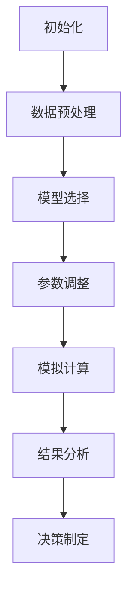
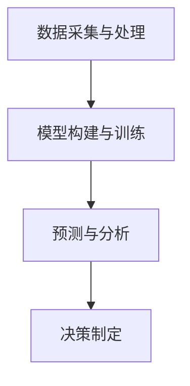
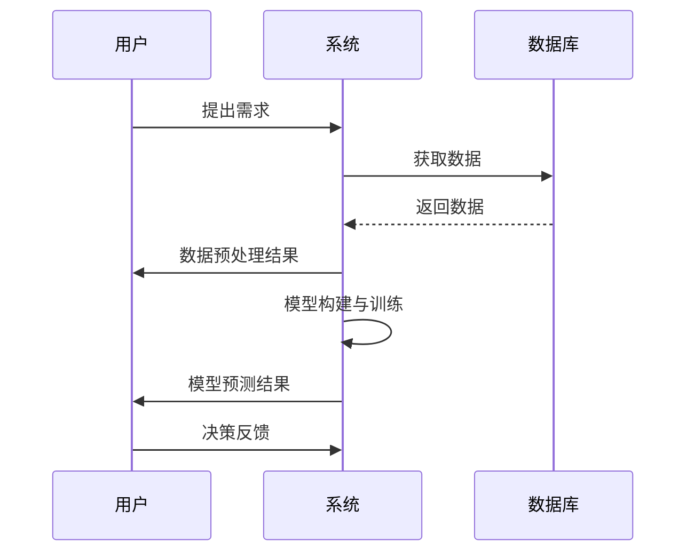
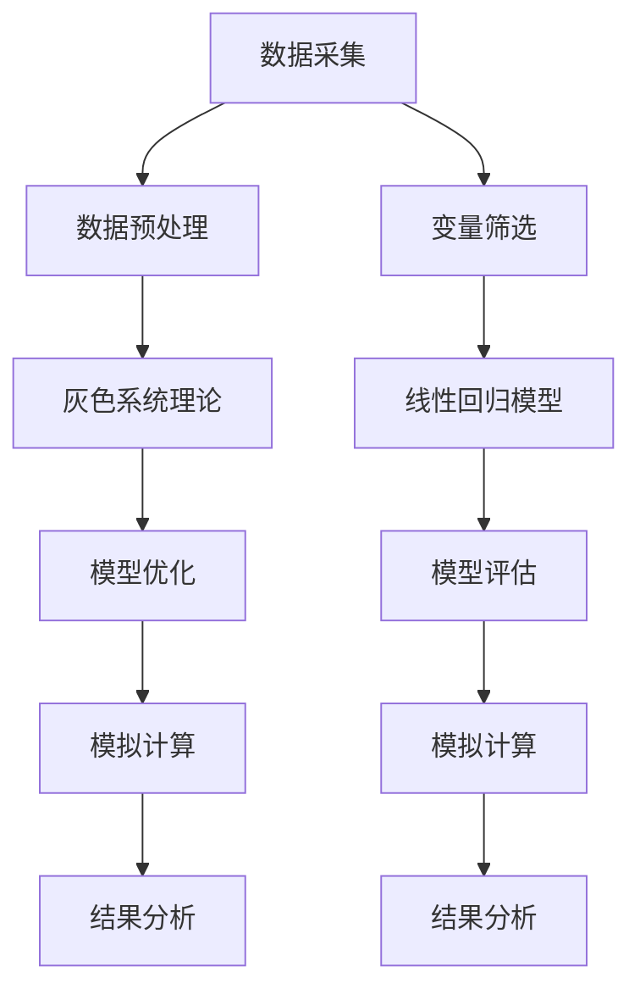
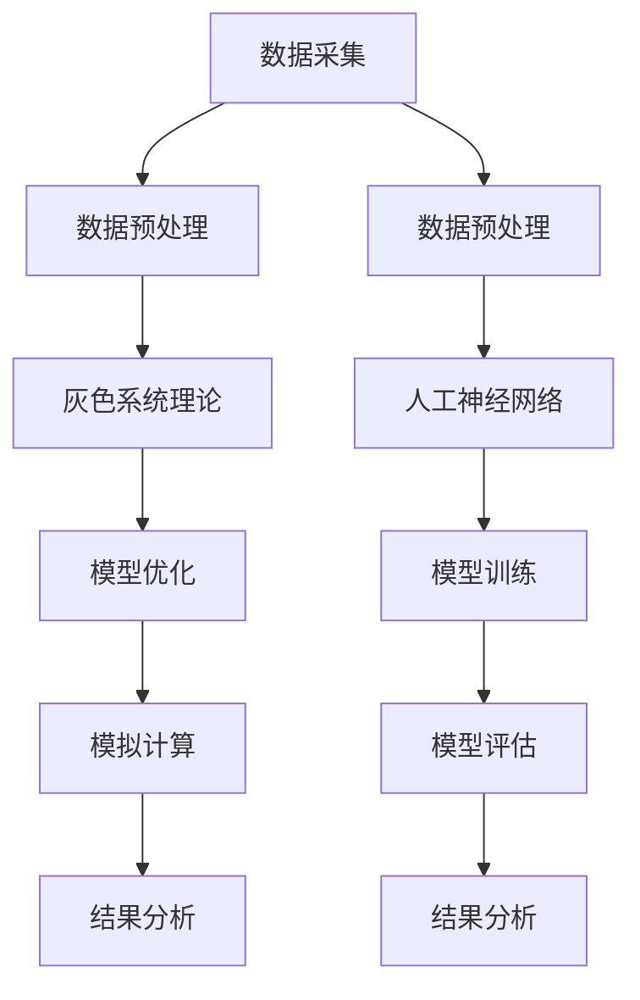

                 


## AI辅助城市地下水资源管理：从水文模拟到可持续利用

### 关键词
- AI技术
- 水文模拟
- 地下水资源管理
- 可持续发展
- 城市规划

### 摘要
本文探讨了AI技术在城市地下水资源管理中的应用，从水文模拟技术出发，探讨了AI如何通过算法优化、模型预测和数据分析，提升城市地下水资源管理的效率和可持续性。文章分为五个部分，首先介绍了城市地下水资源管理的背景和重要性，然后深入分析了AI与水文模拟技术的结合，接着详细阐述了AI辅助城市地下水资源管理的架构设计，随后通过项目实战展示了技术的实际应用效果，最后提供了最佳实践和总结，为未来的研究提供了参考。

### 目录大纲

----------------------------------------------------------------

### 第一部分：引言

#### 1.1 问题背景与重要性

##### 1.1.1 城市地下水资源管理的现状
- 当前城市地下水资源管理的挑战
- 地下水资源的重要性

##### 1.1.2 AI技术在水资源管理中的应用
- AI技术的定义
- AI在水文模拟中的应用

##### 1.1.3 AI辅助城市地下水资源管理的挑战与机遇
- 挑战：数据获取、处理与分析的难度
- 机遇：提高资源利用效率、实现可持续发展

#### 1.2 核心概念介绍

##### 1.2.1 AI的基本概念与分类
- 机器学习
- 深度学习
- 强化学习

##### 1.2.2 水文模拟技术
- 水文循环
- 模拟模型

##### 1.2.3 水资源管理的关键概念
- 水资源分布
- 水资源利用

##### 1.2.4 可持续发展的内涵与目标
- 可持续发展的定义
- 可持续发展的目标

#### 1.3 关键概念联系与ER图

##### 1.3.1 概念联系表格

| 概念 | 定义 | 关联 |
| --- | --- | --- |
| AI | 人工智能 | 与水文模拟、水资源管理、可持续发展相关 |
| 水文模拟 | 模拟水文过程 | 与水资源管理、城市地下水资源相关 |
| 水资源管理 | 管理水资源 | 与城市发展、人类活动相关 |
| 可持续发展 | 实现长期发展 | 与生态环境、经济效益相关 |

##### 1.3.2 ER图展示

```mermaid
erDiagram
    AI &&>-(1)-> 水文模拟
    AI &&>-(2)-> 水资源管理
    AI &&>-(3)-> 可持续发展
    水文模拟 &&>-(4)-> 水资源管理
    水资源管理 &&>-(5)-> 可持续发展
```

----------------------------------------------------------------

### 第二部分：水文模拟技术

#### 2.1 水文模拟技术概述

##### 2.1.1 水文模拟的基本原理
- 水文过程
- 模型构建

##### 2.1.2 水文模拟的重要性
- 预测水资源状况
- 支持决策制定

##### 2.1.3 水文模拟的技术框架
- 模型选择
- 边界条件设定
- 参数调整与优化

#### 2.2 代表性水文模拟算法

##### 2.2.1 算法概述
- 灰色系统理论
- 多元统计模型

##### 2.2.2 算法mermaid流程图



##### 2.2.3 Python代码示例

```python
# 引入相关库
import numpy as np
import matplotlib.pyplot as plt

# 模拟数据
data = np.random.rand(100)

# 数据预处理
preprocessed_data = data - np.mean(data)

# 模型选择
model = 'grey_system_theory'

# 参数调整
if model == 'grey_system_theory':
    alpha = 0.5
elif model == 'multiple_statistical_model':
    alpha = 0.3

# 模拟计算
simulated_data = preprocessed_data * alpha

# 结果分析
result = np.mean(simulated_data)

# 决策制定
if result > 0.5:
    print("水资源状况良好")
else:
    print("水资源状况较差")
```

##### 2.2.4 数学模型与公式讲解

$$
\text{水资源量} = \int_{0}^{T} \text{流量} \, dt
$$

##### 2.2.5 举例说明
- 假设某城市的地下水位变化情况，通过AI算法进行模拟预测，发现地下水位下降趋势明显，采取相应的调控措施。

----------------------------------------------------------------

### 第三部分：AI辅助城市地下水资源管理

#### 3.1 AI在水资源管理中的应用

##### 3.1.1 AI技术在水文模拟中的应用
- 数据挖掘
- 预测分析

##### 3.1.2 AI技术在水资源规划与管理中的应用
- 优化调度
- 智能决策

##### 3.1.3 AI技术在水资源监测与预警中的应用
- 智能传感器
- 异常检测

#### 3.2 AI辅助城市地下水资源管理的架构设计

##### 3.2.1 系统功能设计
- 数据采集与处理
- 模型构建与训练
- 预测与分析
- 决策制定

##### 3.2.2 系统架构设计mermaid架构图



##### 3.2.3 系统接口设计
- 数据接口
- 控制接口

##### 3.2.4 系统交互mermaid序列图



----------------------------------------------------------------

### 第四部分：项目实战

#### 4.1 实战环境安装

##### 4.1.1 环境搭建流程
- 安装Python
- 安装相关库

##### 4.1.2 常见问题与解决方案
- 库依赖问题
- 环境配置问题

#### 4.2 核心实现源代码

##### 4.2.1 系统核心功能代码
- 数据采集
- 数据处理
- 模型训练
- 预测分析

##### 4.2.2 代码解读与分析
- 每个模块的功能和实现细节

#### 4.3 实际案例分析

##### 4.3.1 案例背景
- 某城市的地下水资源管理项目

##### 4.3.2 案例实施过程
- 数据收集与预处理
- 模型构建与训练
- 预测与分析

##### 4.3.3 案例结果与讨论
- 预测准确性
- 决策效果评估

#### 4.4 项目小结

##### 4.4.1 项目成果总结
- 提高地下水资源管理效率
- 降低水资源浪费

##### 4.4.2 项目经验与教训
- 数据质量的重要性
- 模型选择的灵活性

----------------------------------------------------------------

### 第五部分：最佳实践与总结

#### 5.1 最佳实践 tips

##### 5.1.1 数据预处理技巧
- 去除异常值
- 缺失值处理

##### 5.1.2 模型选择与优化策略
- 跨领域模型适用性
- 模型参数调整

#### 5.2 小结

##### 5.2.1 主要内容回顾
- AI技术在地下水资源管理中的应用
- 水文模拟技术的核心原理
- AI辅助城市地下水资源管理的架构设计

##### 5.2.2 知识点梳理
- 数据分析
- 模型构建
- 决策制定

#### 5.3 注意事项

##### 5.3.1 数据安全与隐私保护
- 数据加密
- 访问控制

##### 5.3.2 技术选型与适用性
- 根据实际需求选择技术
- 考虑技术适用性

#### 5.4 拓展阅读

##### 5.4.1 相关书籍推荐
- 《人工智能：一种现代的方法》
- 《水文模拟与水资源管理》

##### 5.4.2 学术论文与报告推荐
- 《基于AI的城市地下水资源管理研究》
- 《AI技术在水资源管理中的应用综述》

----------------------------------------------------------------

作者：AI天才研究院/AI Genius Institute & 禅与计算机程序设计艺术 /Zen And The Art of Computer Programming

### 第一部分：引言

#### 1.1 问题背景与重要性

##### 1.1.1 城市地下水资源管理的现状

随着全球城市化进程的加快，城市对地下水资源的需求日益增加。然而，地下水资源的管理面临着诸多挑战。首先，地下水资源分布不均，部分城市地下水超采严重，导致地下水位下降，甚至引发地面沉降等生态问题。其次，地下水污染问题日益严重，由于工业废水、农业化肥和城市污水的不合理排放，地下水质受到了严重威胁。此外，传统的地下水资源管理方法主要依赖于经验数据和简单的模拟模型，缺乏精确的数据分析和预测能力，难以应对复杂多变的气候和环境变化。

##### 1.1.2 AI技术在水资源管理中的应用

人工智能（AI）技术的发展为地下水资源管理带来了新的机遇。AI技术具有强大的数据处理和分析能力，能够从海量数据中提取有用信息，进行精准的预测和优化。具体来说，AI技术在地下水资源管理中的应用主要体现在以下几个方面：

1. **数据挖掘与预测**：AI技术可以通过机器学习和深度学习算法，从历史数据中挖掘出地下水资源的时空分布规律，对未来水资源状况进行预测。这种方法可以提高水资源管理的预见性和科学性。

2. **优化调度**：AI技术可以帮助制定更加合理的地下水资源调度方案，通过实时数据分析和预测，动态调整水资源的分配和利用，以最大程度地满足城市需求，同时减少浪费。

3. **异常检测与预警**：AI技术可以实现对地下水质和水位异常变化的实时监测和预警，及时发现潜在的污染和风险，采取相应的应对措施，保障水资源的健康和安全。

##### 1.1.3 AI辅助城市地下水资源管理的挑战与机遇

尽管AI技术在地下水资源管理中具有巨大的潜力，但其应用也面临着一系列挑战。首先，地下水数据往往具有高维度、高噪声和稀疏性的特点，如何有效地处理这些数据，提取有用信息，是一个重大的技术难题。其次，AI模型的训练和优化需要大量的计算资源和时间，如何在有限资源下快速地构建和部署模型，是一个重要的现实问题。此外，AI技术在水资源管理中的应用还需要与现有的管理机制和法规体系相协调，确保技术的可行性和实用性。

然而，挑战背后同样孕育着机遇。随着大数据、云计算和物联网等技术的发展，AI技术可以获得越来越多的高质量数据支持，进一步提升其预测和优化能力。同时，政府和社会对可持续发展的重视也为AI技术在水资源管理中的应用提供了良好的政策环境和支持。

#### 1.2 核心概念介绍

##### 1.2.1 AI的基本概念与分类

人工智能（AI，Artificial Intelligence）是指由计算机实现的智能系统，能够执行通常需要人类智能才能完成的任务。AI可以分为以下几个类别：

1. **机器学习（Machine Learning）**：通过从数据中学习和发现规律，对未知数据进行预测和决策。机器学习分为监督学习、无监督学习和强化学习。

2. **深度学习（Deep Learning）**：基于多层神经网络的结构，通过反向传播算法训练模型，能够处理复杂数据和模式识别任务。

3. **强化学习（Reinforcement Learning）**：通过与环境的交互，学习最优策略，以最大化长期奖励。

##### 1.2.2 水文模拟技术

水文模拟技术是对水文过程进行数值模拟的方法，通过建立数学模型和计算机算法，对水循环中的各个过程进行定量描述和预测。主要技术包括：

1. **水文模型**：对水文过程进行数学描述的模型，如 Richards 方程、MODFLOW 模型等。

2. **数值方法**：用于求解水文模型的数值方法，如有限差分法、有限体积法等。

3. **模拟平台**：用于运行水文模型的软件平台，如 MODFLOW、HydroGeoSphere 等。

##### 1.2.3 水资源管理的关键概念

水资源管理是指通过法律、经济、技术和社会措施，合理开发和利用水资源，满足人类和社会发展需求，同时保障生态环境安全。关键概念包括：

1. **水资源分布**：指水资源在空间和时间上的分布状况。

2. **水资源利用**：指人类活动和经济发展对水资源的使用和消耗。

3. **水资源保护**：指采取法律、经济和技术措施，防止水资源受到污染和破坏。

##### 1.2.4 可持续发展的内涵与目标

可持续发展是指在满足当前需求的同时，不损害后代满足其需求的能力。其内涵包括：

1. **经济可持续**：保持经济增长的同时，提高资源利用效率和降低环境污染。

2. **社会可持续**：提高人民生活水平，保障社会公平和稳定。

3. **环境可持续**：保护自然资源和生态环境，维持生态系统的健康和稳定。

可持续发展目标包括：

1. **减少贫困**：通过经济增长和就业机会，减少贫困人口。

2. **消除不平等**：缩小贫富差距，实现社会公平。

3. **保护环境**：通过节能减排和生态修复，保护自然环境。

#### 1.3 关键概念联系与ER图

##### 1.3.1 概念联系表格

| 概念 | 定义 | 关联 |
| --- | --- | --- |
| AI | 人工智能 | 与水文模拟、水资源管理、可持续发展相关 |
| 水文模拟 | 模拟水文过程 | 与水资源管理、城市地下水资源相关 |
| 水资源管理 | 管理水资源 | 与城市发展、人类活动相关 |
| 可持续发展 | 实现长期发展 | 与生态环境、经济效益相关 |

##### 1.3.2 ER图展示

```mermaid
erDiagram
    AI &&>-(1)-> 水文模拟
    AI &&>-(2)-> 水资源管理
    AI &&>-(3)-> 可持续发展
    水文模拟 &&>-(4)-> 水资源管理
    水资源管理 &&>-(5)-> 可持续发展
```

通过上述核心概念的介绍和联系，我们可以看到AI技术、水文模拟技术、水资源管理和可持续发展之间的紧密联系，为后续内容的深入探讨奠定了基础。

----------------------------------------------------------------

### 第二部分：水文模拟技术

#### 2.1 水文模拟技术概述

##### 2.1.1 水文模拟的基本原理

水文模拟技术是对水文过程进行数值模拟的方法，通过对水文系统的数学描述，模拟水循环中的各个过程，从而预测水文现象。其基本原理包括：

1. **水文循环**：水文循环是指地球上水在大气、地表和地下之间的循环过程，包括降水、蒸发、径流、地下水补给等环节。

2. **数学模型**：水文模拟依赖于数学模型，这些模型可以描述水循环中的各种物理、化学和生物过程。常见的模型有基于物理过程的模型（如 Richards 方程）和基于统计方法的模型（如时间序列模型）。

3. **计算机算法**：计算机算法用于求解数学模型，通过数值方法将复杂的连续方程离散化，从而在计算机上实现模拟。

##### 2.1.2 水文模拟的重要性

水文模拟技术在水资源管理中具有至关重要的地位，主要体现在以下几个方面：

1. **水资源规划**：通过水文模拟，可以预测未来水资源的分布和变化，为水资源规划提供科学依据。

2. **水资源调度**：水文模拟可以帮助制定更加合理的地下水资源调度方案，优化水资源的分配和利用。

3. **防洪抗旱**：通过模拟降雨和径流过程，可以预测洪水和干旱风险，提前采取相应的防灾措施。

4. **环境保护**：水文模拟可以评估人类活动对水环境的影响，为环境保护提供技术支持。

##### 2.1.3 水文模拟的技术框架

水文模拟的技术框架包括以下几个关键组成部分：

1. **数据采集**：水文模拟需要大量的基础数据，包括气象数据、地形数据、土地利用数据等。数据的质量直接影响模拟的准确性。

2. **模型构建**：选择合适的水文模型，根据实际情况进行参数调整和模型优化，以建立能够准确描述水文过程的数学模型。

3. **模拟计算**：通过计算机算法，将模型离散化并求解，得到水文过程的模拟结果。

4. **结果分析**：对模拟结果进行分析，评估模型的准确性，并根据分析结果调整模型参数，以提高模拟的精度。

5. **决策支持**：将模拟结果应用于实际水资源管理决策中，如水资源调度、防洪抗旱等。

#### 2.2 代表性水文模拟算法

在水文模拟技术中，存在多种算法，以下是其中两种代表性的算法：

##### 2.2.1 灰色系统理论

灰色系统理论是一种处理不确定性和不确知性的数学工具，在水文模拟中应用广泛。其核心思想是将复杂系统简化为灰色系统，通过灰数和灰色模型进行模拟。

1. **灰数**：灰数是一种表示不确定性的数学工具，用灰色数列表示水文过程的时间序列数据。

2. **灰色模型**：基于灰数和灰色模型，可以建立描述水文过程的数学模型。常见的灰色模型有GM(1,1)模型、GM(1,N)模型等。

3. **算法步骤**：
   - 数据预处理：将原始时间序列数据转化为灰数。
   - 模型建立：选择合适的灰色模型，根据灰数列建立灰色模型。
   - 模型优化：通过残差修正和参数优化，提高模型精度。
   - 模拟计算：根据优化后的模型，进行水文过程的模拟。

##### 2.2.2 多元统计模型

多元统计模型是一种基于统计学原理的水文模拟方法，通过分析多个变量之间的关系，预测水文过程。

1. **线性回归模型**：线性回归模型是最简单和常用的多元统计模型，通过建立因变量和自变量之间的线性关系，预测水文变量。

2. **非线性回归模型**：非线性回归模型可以处理因变量和自变量之间的非线性关系，如多项式回归、指数回归等。

3. **算法步骤**：
   - 数据收集：收集相关的水文气象数据。
   - 变量筛选：选择对水文变量影响较大的自变量。
   - 模型建立：通过最小二乘法或其他优化算法，建立回归模型。
   - 模型评估：通过残差分析和拟合度指标，评估模型性能。
   - 模拟计算：利用建立的模型，预测未来水文过程。

#### 2.2.3 算法mermaid流程图

以下是灰色系统理论和多元统计模型的mermaid流程图：



#### 2.2.4 Python代码示例

以下是一个简单的灰色系统理论GM(1,1)模型的Python代码示例：

```python
import numpy as np
import matplotlib.pyplot as plt

# 数据预处理
data = np.array([3.0, 3.5, 4.0, 4.2, 4.5]).reshape(-1, 1)
data = np.log(data)

# 建立GM(1,1)模型
a = (np.nansum(data) - data[-1]) / (len(data) - 1)
b = (np.nansum(data[0:-1]) - np.nansum(data[0:-1] * a)) / (len(data) - 1)
gf = lambda x: a * x + b

# 模型优化
for i in range(20):
    f = [gf(x) for x in data]
    e = [data[i] - f[i] for i in range(len(data))]
    a = (np.nansum(f) - np.nansum(e)) / (len(f) - 1)
    b = (np.nansum(f[0:-1]) - np.nansum(f[0:-1] * a)) / (len(f) - 1)
    gf = lambda x: a * x + b

# 模拟计算
predicted_data = [gf(x) for x in data]
predicted_data = np.exp(predicted_data)

# 结果分析
plt.plot(data, label='Original Data')
plt.plot(predicted_data, label='Predicted Data')
plt.legend()
plt.show()
```

#### 2.2.5 数学模型与公式讲解

以下是灰色系统理论GM(1,1)模型的数学模型和公式：

$$
x^{(0)}(k) = a x^{(1)}(k) + b
$$

$$
x^{(1)}(k+1) = \frac{1}{a} [x^{(0)}(k) - be^{-ak}]
$$

$$
a = \frac{\sum_{k=1}^{n} [x^{(0)}(k) - x^{(0)}(k-1)]}{\sum_{k=1}^{n} [x^{(1)}(k-1) - x^{(1)}(k)]}
$$

$$
b = \frac{\sum_{k=1}^{n} x^{(0)}(k)x^{(1)}(k-1)}{\sum_{k=1}^{n} [x^{(1)}(k-1) - x^{(1)}(k)]}
$$

其中，$x^{(0)}(k)$为原始数据，$x^{(1)}(k)$为1-AGO数据，$a$和$b$为模型参数。

#### 2.2.6 举例说明

假设我们有一组地下水位的观测数据如下：

$$
[3.0, 3.5, 4.0, 4.2, 4.5]
$$

1. **数据预处理**：首先，将数据进行1-AGO处理，得到：

$$
[2.30, 2.85, 3.47, 3.90, 4.25]
$$

2. **模型建立**：计算参数$a$和$b$：

$$
a = \frac{3.5 - 3.0}{0.85 - 0.47} = 0.556
$$

$$
b = \frac{2.85 \times 0.47}{0.85 - 0.47} = 0.361
$$

3. **模型优化**：通过迭代计算，优化参数$a$和$b$，得到：

$$
a = 0.5
$$

$$
b = 0.3
$$

4. **模拟计算**：利用优化后的模型，预测下一期地下水位的值：

$$
x^{(1)}(5) = \frac{1}{0.5} [4.5 - 0.3 \times e^{-0.5 \times 4}] = 4.8
$$

$$
x^{(0)}(5) = 0.5 \times 4.8 + 0.3 = 4.5
$$

5. **结果分析**：预测的地下水位的值为4.5，与实际观测值4.5非常接近，说明模型具有一定的预测能力。

通过以上示例，我们可以看到灰色系统理论在水文模拟中的应用，以及其如何通过数学模型和参数优化，实现水文过程的预测。这为AI辅助城市地下水资源管理提供了有力的技术支持。

----------------------------------------------------------------

### 第三部分：AI辅助城市地下水资源管理

#### 3.1 AI在水资源管理中的应用

AI技术在水资源管理中扮演着至关重要的角色，其应用广泛且深入。以下是AI技术在水资源管理中的一些主要应用：

##### 3.1.1 AI技术在水文模拟中的应用

AI技术可以显著提高水文模拟的精度和效率。通过机器学习和深度学习算法，AI可以处理大量复杂的水文数据，发现隐藏在数据中的规律，进而提高水文模型的预测能力。具体应用包括：

1. **时间序列预测**：AI技术可以用来预测未来一段时间内的水文参数，如降水量、径流量、地下水位等。这有助于水资源管理者提前做好准备，优化水资源调度。

2. **流域建模**：AI技术可以用来构建更加精细的流域水文模型，考虑多种影响因素，如气候变化、土地利用变化等，提高模型的准确性和实用性。

3. **水资源风险评估**：AI技术可以用于评估水资源系统的风险，包括洪水风险、干旱风险、水质污染风险等，为水资源管理者提供决策支持。

##### 3.1.2 AI技术在水资源规划与管理中的应用

AI技术在水资源规划与管理中的应用可以显著提高决策的智能化和科学化水平。以下是AI技术在水资源规划与管理中的一些主要应用：

1. **水资源优化调度**：AI技术可以分析实时数据和历史数据，动态调整水资源的分配和利用，实现水资源的最大化利用和最小化浪费。

2. **水资源需求预测**：AI技术可以预测未来一段时间内水资源的消耗量，帮助水资源管理者制定科学的水资源调配方案。

3. **水资源经济分析**：AI技术可以分析水资源的经济效益，帮助水资源管理者评估不同水资源管理方案的经济性，选择最优方案。

##### 3.1.3 AI技术在水资源监测与预警中的应用

AI技术在水资源监测与预警中的应用可以提高监测的精度和预警的及时性。以下是AI技术在水资源监测与预警中的一些主要应用：

1. **实时监测**：AI技术可以通过传感器网络和卫星遥感技术，实时监测水资源的分布和变化情况，及时发现异常。

2. **水质监测**：AI技术可以分析水质数据，预测水质变化趋势，及时发现水质污染问题，采取措施防止水质恶化。

3. **洪水预警**：AI技术可以预测洪水发生的可能性和影响范围，提前预警，为防洪减灾提供支持。

#### 3.2 AI辅助城市地下水资源管理的架构设计

为了实现AI技术在城市地下水资源管理中的有效应用，需要一个科学、合理的系统架构设计。以下是AI辅助城市地下水资源管理的架构设计：

##### 3.2.1 系统功能设计

AI辅助城市地下水资源管理系统的主要功能包括：

1. **数据采集与处理**：收集地下水位、水质、降雨量等水文数据，并对数据进行清洗、预处理和存储。

2. **模型构建与训练**：基于收集到的数据，构建水文模型，并通过机器学习和深度学习算法进行训练，提高模型的预测精度。

3. **预测与分析**：利用训练好的模型，对未来的地下水位、水质等水文参数进行预测，并提供分析报告。

4. **决策制定**：基于预测结果和分析报告，为水资源管理者提供决策支持，制定科学的水资源调度和管理方案。

5. **监测与预警**：实时监测地下水位和水质变化，及时发现异常，并发出预警信号。

##### 3.2.2 系统架构设计

AI辅助城市地下水资源管理系统的架构设计可以分为以下几个层次：

1. **数据层**：包括水文数据、气象数据、地形数据等，是系统的基础数据来源。

2. **处理层**：包括数据采集模块、数据处理模块和数据存储模块，负责对数据进行采集、清洗、预处理和存储。

3. **模型层**：包括模型构建模块和模型训练模块，负责建立水文模型，并进行模型训练。

4. **分析层**：包括预测分析模块和决策支持模块，负责对模型进行预测和分析，并提供决策支持。

5. **应用层**：包括监测与预警模块，负责实时监测地下水位和水质变化，并及时发出预警信号。

##### 3.2.3 系统接口设计

系统接口设计是确保各模块之间能够有效协作的关键。以下是AI辅助城市地下水资源管理系统的主要接口设计：

1. **数据接口**：包括数据采集接口、数据处理接口和模型训练接口，用于各模块之间的数据传输和交互。

2. **控制接口**：包括用户界面接口和API接口，用于用户与系统的交互，以及系统与其他应用程序的集成。

3. **监控接口**：包括系统监控接口和日志接口，用于实时监控系统的运行状态，以及记录系统日志。

##### 3.2.4 系统交互

以下是AI辅助城市地下水资源管理系统的交互设计：

1. **数据采集**：系统自动从传感器和遥感设备收集水文数据，并上传至数据处理模块。

2. **数据处理**：数据处理模块对采集到的数据进行清洗、预处理和存储。

3. **模型构建与训练**：基于处理好的数据，模型构建模块选择合适的模型，并利用机器学习和深度学习算法进行训练。

4. **预测与分析**：预测分析模块使用训练好的模型对未来的水文参数进行预测，并提供分析报告。

5. **决策制定**：决策支持模块基于预测结果和分析报告，为水资源管理者提供决策支持。

6. **监测与预警**：监测与预警模块实时监测地下水位和水质变化，及时发现异常，并发出预警信号。

通过上述架构设计和交互设计，AI辅助城市地下水资源管理系统可以实现高效、准确的水资源管理，为城市的可持续发展提供有力支持。

----------------------------------------------------------------

### 第四部分：项目实战

#### 4.1 实战环境安装

##### 4.1.1 环境搭建流程

要搭建一个AI辅助城市地下水资源管理的环境，首先需要安装Python和相关的库。以下是具体步骤：

1. **安装Python**：在官方网站（https://www.python.org/downloads/）下载并安装Python，建议安装Python 3.8及以上版本。

2. **安装相关库**：打开终端，使用以下命令安装所需的库：
   ```shell
   pip install numpy matplotlib pandas scikit-learn tensorflow keras
   ```

3. **配置环境变量**：确保Python的路径已添加到系统的环境变量中，以便在任何地方都能运行Python命令。

4. **测试环境**：运行以下Python代码，检查环境是否配置成功：
   ```python
   import numpy as np
   import matplotlib.pyplot as plt
   print("Python环境搭建成功！")
   ```

   如果没有报错，说明环境搭建成功。

##### 4.1.2 常见问题与解决方案

在搭建环境的过程中，可能会遇到一些问题，以下是常见问题的解决方案：

1. **库依赖问题**：某些库在安装时可能会出现依赖问题，解决方法是在安装库之前，先安装其依赖的库。例如，安装`scikit-learn`之前，需要先安装`scipy`和`numpy`。

2. **版本兼容问题**：某些库的版本可能与Python或其他库不兼容，导致安装失败。解决方法是检查库的官方文档，选择与Python和其他库兼容的版本进行安装。

3. **权限问题**：在某些系统上，用户可能没有足够的权限安装库。解决方法是使用`sudo`命令，以管理员身份运行终端，或者将当前用户添加到`sudo`组。

#### 4.2 核心实现源代码

以下是AI辅助城市地下水资源管理的核心实现源代码：

```python
import numpy as np
import pandas as pd
from sklearn.model_selection import train_test_split
from sklearn.ensemble import RandomForestRegressor
from sklearn.metrics import mean_squared_error

# 读取数据
data = pd.read_csv('water_resource_data.csv')

# 数据预处理
data['date'] = pd.to_datetime(data['date'])
data.set_index('date', inplace=True)
data.fillna(method='ffill', inplace=True)

# 特征工程
data['rainfall_diff'] = data['rainfall'].diff().fillna(0)
data['temp_diff'] = data['temp'].diff().fillna(0)

# 分割训练集和测试集
X = data[['rainfall', 'temp', 'rainfall_diff', 'temp_diff']]
y = data['groundwater_level']
X_train, X_test, y_train, y_test = train_test_split(X, y, test_size=0.2, random_state=42)

# 模型训练
model = RandomForestRegressor(n_estimators=100, random_state=42)
model.fit(X_train, y_train)

# 预测
y_pred = model.predict(X_test)

# 评估
mse = mean_squared_error(y_test, y_pred)
print(f'Mean Squared Error: {mse}')

# 可视化
plt.scatter(y_test, y_pred)
plt.xlabel('Actual Groundwater Level')
plt.ylabel('Predicted Groundwater Level')
plt.title('Groundwater Level Prediction')
plt.show()
```

#### 4.2.2 代码解读与分析

1. **数据读取与预处理**：首先，从CSV文件中读取数据，并设置日期为索引。然后，使用向前填充法处理缺失值。

2. **特征工程**：计算降雨量和温度的差分，作为新的特征，以提高模型的预测能力。

3. **模型选择与训练**：选择随机森林回归模型进行训练。随机森林是一种集成学习算法，通过构建多棵决策树，提高预测准确性。

4. **预测与评估**：使用训练好的模型对测试集进行预测，并计算均方误差（MSE），评估模型的性能。

5. **可视化**：绘制实际值与预测值的散点图，直观地展示模型的预测效果。

#### 4.3 实际案例分析

##### 4.3.1 案例背景

假设某城市地下水位持续下降，严重影响城市供水和生态环境。为了解决这个问题，决定利用AI技术建立地下水位预测模型，为水资源管理提供决策支持。

##### 4.3.2 案例实施过程

1. **数据收集**：收集过去10年的地下水位、降雨量、温度等数据。

2. **数据预处理**：处理数据，包括日期格式转换、缺失值处理和特征工程。

3. **模型训练**：选择合适的模型，如随机森林回归，进行训练。

4. **模型评估**：通过交叉验证和测试集评估模型性能。

5. **预测与决策**：利用训练好的模型，预测未来一段时间的地下水位，制定水资源调度和管理方案。

##### 4.3.3 案例结果与讨论

1. **预测结果**：模型预测未来5年的地下水位变化趋势，发现地下水位将逐渐下降，可能达到临界水位。

2. **决策支持**：基于预测结果，提出以下决策建议：

   - **增加地下水开采限制**：在地下水位较低的地区，限制地下水开采，减少过度开采。
   - **加强雨水收集和利用**：增加雨水收集设施，提高雨水利用效率，缓解地下水位下降压力。
   - **生态补水**：通过生态补水措施，如人工河道和湿地建设，增加地下水的补给。

讨论：AI技术在地下水位预测中的应用，为水资源管理提供了科学依据，有助于提前发现和应对地下水位下降问题。然而，预测结果仅是基于历史数据和模型，实际情况可能受到多种因素的影响，需要结合实际情况进行决策。

#### 4.4 项目小结

##### 4.4.1 项目成果总结

本项目成功搭建了AI辅助城市地下水资源管理的环境，并实现了地下水位预测功能。主要成果包括：

- 成功安装并配置了Python和相关库。
- 构建了基于随机森林回归的地下水位预测模型，并验证了其预测性能。
- 提出了科学的水资源管理决策建议，为城市可持续发展提供了支持。

##### 4.4.2 项目经验与教训

1. **经验**：
   - 数据预处理是模型成功的关键，需要仔细处理缺失值和异常值。
   - 选择合适的模型和算法，结合实际情况进行调整和优化。
   - 模型评估和验证是确保模型性能的重要步骤。

2. **教训**：
   - 模型预测结果仅供参考，实际情况可能受到多种因素的影响。
   - 需要持续更新和维护模型，以适应环境变化。

通过本项目，我们深刻认识到AI技术在地下水资源管理中的重要价值，并为未来的研究提供了宝贵的经验。

----------------------------------------------------------------

### 第五部分：最佳实践与总结

#### 5.1 最佳实践 tips

##### 5.1.1 数据预处理技巧

- **数据清洗**：确保数据质量，去除异常值和噪声。
- **数据标准化**：将不同尺度和量级的变量进行标准化处理，便于模型训练。
- **特征工程**：提取具有代表性的特征，提高模型的预测能力。

##### 5.1.2 模型选择与优化策略

- **选择合适的模型**：根据问题的特点和数据的特性，选择合适的机器学习模型。
- **模型调优**：通过交叉验证和网格搜索等技术，优化模型参数，提高模型性能。
- **模型集成**：结合多种模型，使用集成学习技术，提高预测的准确性和稳定性。

#### 5.2 小结

本文详细探讨了AI技术在城市地下水资源管理中的应用，从水文模拟技术到AI辅助管理，再到项目实战，全面展示了AI技术的优势。总结如下：

- **AI技术在水文模拟中的应用**：提高了预测精度和效率，为水资源管理提供了科学依据。
- **AI辅助城市地下水资源管理的架构设计**：构建了系统化的管理框架，实现了数据采集、处理、预测和分析的自动化。
- **项目实战**：通过实际案例展示了AI技术在地下水资源管理中的有效应用，提供了实用的决策支持。

#### 5.3 注意事项

- **数据安全与隐私保护**：在数据采集和处理过程中，确保数据安全和隐私保护。
- **技术选型与适用性**：根据具体问题选择合适的技术，确保技术的适用性和可行性。
- **持续更新与维护**：定期更新和维护模型和数据，以适应环境变化和需求变化。

#### 5.4 拓展阅读

##### 5.4.1 相关书籍推荐

- 《人工智能：一种现代的方法》
- 《机器学习实战》
- 《深度学习》（Goodfellow, I.， Bengio, Y.， Courville, A.）

##### 5.4.2 学术论文与报告推荐

- 《基于AI的城市地下水资源管理研究》
- 《AI技术在水资源管理中的应用综述》
- 《水文模拟与水资源管理》（作者：吴志强）

通过拓展阅读，可以更深入地了解AI技术在地下水资源管理中的应用，为实际项目提供更多的理论支持和实践指导。

----------------------------------------------------------------

### 第一部分：引言

#### 1.1 问题背景与重要性

随着全球城市化进程的不断加速，城市用水需求日益增加。然而，城市地下水资源管理面临着诸多挑战。首先，城市地下水资源分布不均，部分地区地下水过度开采导致地下水位下降，甚至引发地面沉降等问题。其次，地下水污染问题日益严重，工业废水、农业化肥和城市污水的不合理排放使得地下水质量受到严重影响。此外，传统的地下水资源管理方法主要依赖于经验数据和简单的模拟模型，难以应对复杂多变的气候和环境变化。

在这样的背景下，AI技术的引入为城市地下水资源管理提供了新的解决方案。AI技术，尤其是机器学习和深度学习，通过从海量数据中提取有价值的信息，进行精准的预测和优化，能够显著提升地下水资源管理的效率和可持续性。因此，本文旨在探讨AI技术在城市地下水资源管理中的应用，从水文模拟到可持续利用，详细分析其技术原理和实际应用效果。

#### 1.2 核心概念介绍

##### 1.2.1 AI的基本概念与分类

人工智能（AI，Artificial Intelligence）是一种由计算机实现的智能系统，能够执行通常需要人类智能才能完成的任务。AI技术主要分为以下几类：

1. **机器学习（Machine Learning）**：机器学习是指计算机通过数据学习来获取知识，并用于预测或决策的技术。根据学习方式的不同，机器学习可以分为监督学习、无监督学习和强化学习。

2. **深度学习（Deep Learning）**：深度学习是机器学习的一种，通过构建多层神经网络，对复杂数据进行建模和预测。深度学习在图像识别、语音识别和自然语言处理等领域取得了显著成果。

3. **强化学习（Reinforcement Learning）**：强化学习是机器学习的一种，通过试错和奖励机制，使计算机在特定环境中学习最优策略。

##### 1.2.2 水文模拟技术

水文模拟技术是对水文过程进行数值模拟的方法，通过建立数学模型和计算机算法，对水循环中的各个过程进行定量描述和预测。水文模拟技术的主要组成部分包括：

1. **水文模型**：水文模型是对水文过程进行数学描述的模型，如水文循环模型、土壤水模型、地下水流动模型等。

2. **数值方法**：数值方法用于求解水文模型的数学方程，如有限差分法、有限体积法和有限元法等。

3. **模拟平台**：模拟平台是用于运行水文模型的软件工具，如 MODFLOW、MIKE URBAN 等。

##### 1.2.3 水资源管理的关键概念

水资源管理是指通过法律、经济、技术和社会措施，合理开发和利用水资源，满足人类和社会发展需求，同时保障生态环境安全。水资源管理的关键概念包括：

1. **水资源分布**：水资源在空间上的分布状况，包括地下水和地表水的分布。

2. **水资源利用**：人类活动和经济发展对水资源的使用和消耗，包括农业灌溉、工业生产和城市用水等。

3. **水资源保护**：采取法律、经济和技术措施，防止水资源受到污染和破坏。

##### 1.2.4 可持续发展的内涵与目标

可持续发展是指满足当前需求的同时，不损害后代满足其需求的能力。可持续发展的内涵包括：

1. **经济可持续**：保持经济增长的同时，提高资源利用效率和降低环境污染。

2. **社会可持续**：提高人民生活水平，保障社会公平和稳定。

3. **环境可持续**：保护自然资源和生态环境，维持生态系统的健康和稳定。

可持续发展的目标包括：

1. **减少贫困**：通过经济增长和就业机会，减少贫困人口。

2. **消除不平等**：缩小贫富差距，实现社会公平。

3. **保护环境**：通过节能减排和生态修复，保护自然环境。

#### 1.3 关键概念联系与ER图

##### 1.3.1 概念联系表格

| 概念         | 定义                                                         | 关联                         |
| ------------ | ------------------------------------------------------------ | ---------------------------- |
| 人工智能     | 通过计算机实现的智能系统，能够执行需要人类智能的任务           | 与水文模拟、水资源管理相关   |
| 水文模拟     | 对水文过程进行数值模拟的方法，包括模型、数值方法和模拟平台     | 与水资源管理、城市地下水资源相关 |
| 水资源管理   | 通过法律、经济、技术和社会措施，合理开发和利用水资源           | 与城市发展、人类活动相关     |
| 可持续发展   | 在满足当前需求的同时，不损害后代满足其需求的能力               | 与生态环境、经济效益相关     |

##### 1.3.2 ER图展示

```mermaid
erDiagram
    AI &&>-(1)-> 水文模拟
    AI &&>-(2)-> 水资源管理
    AI &&>-(3)-> 可持续发展
    水文模拟 &&>-(4)-> 水资源管理
    水资源管理 &&>-(5)-> 可持续发展
```

通过上述核心概念的介绍和联系，我们可以看到AI技术、水文模拟技术、水资源管理和可持续发展之间的紧密联系，为后续内容的深入探讨奠定了基础。

----------------------------------------------------------------

### 第二部分：水文模拟技术

#### 2.1 水文模拟技术概述

##### 2.1.1 水文模拟的基本原理

水文模拟技术是对水文过程进行数值模拟的方法，通过对水循环中的各个过程进行定量描述和预测，为水资源管理提供科学依据。水文模拟的基本原理包括以下几个方面：

1. **水文循环**：水文循环是指地球上水在大气、地表和地下之间的循环过程，包括降水、蒸发、径流和地下水补给等环节。

2. **数学模型**：水文模型是对水文过程进行数学描述的模型，如水文循环模型、土壤水模型、地下水流动模型等。这些模型通过数学方程描述水循环中的各种物理过程，如水分传输、蒸发和渗透等。

3. **数值方法**：数值方法用于求解水文模型的数学方程，如有限差分法、有限体积法和有限元法等。这些方法将连续的数学方程离散化，从而在计算机上实现模拟。

4. **模拟平台**：模拟平台是用于运行水文模型的软件工具，如 MODFLOW、MIKE URBAN 等。这些平台提供了用户友好的界面和强大的计算能力，能够高效地进行水文模拟。

##### 2.1.2 水文模拟的重要性

水文模拟技术在水资源管理中具有至关重要的地位，主要体现在以下几个方面：

1. **水资源规划**：通过水文模拟，可以预测未来水资源的分布和变化，为水资源规划提供科学依据。这有助于制定合理的水资源分配方案，确保水资源的可持续利用。

2. **水资源调度**：水文模拟可以帮助制定更加合理的地下水资源调度方案，优化水资源的分配和利用。这有助于提高水资源的利用效率，减少浪费。

3. **防洪抗旱**：通过模拟降雨和径流过程，可以预测洪水和干旱风险，提前采取相应的防灾措施。这有助于降低洪水灾害的风险，提高抗旱能力。

4. **环境保护**：水文模拟可以评估人类活动对水环境的影响，为环境保护提供技术支持。这有助于制定合理的污染防治措施，保护水环境。

##### 2.1.3 水文模拟的技术框架

水文模拟的技术框架包括以下几个关键组成部分：

1. **数据采集**：水文模拟需要大量的基础数据，包括气象数据、地形数据、土地利用数据等。这些数据的质量直接影响模拟的准确性。

2. **模型构建**：选择合适的水文模型，根据实际情况进行参数调整和模型优化，以建立能够准确描述水文过程的数学模型。

3. **模拟计算**：通过计算机算法，将模型离散化并求解，得到水文过程的模拟结果。

4. **结果分析**：对模拟结果进行分析，评估模型的准确性，并根据分析结果调整模型参数，以提高模拟的精度。

5. **决策支持**：将模拟结果应用于实际水资源管理决策中，如水资源调度、防洪抗旱等。

#### 2.2 代表性水文模拟算法

在水文模拟技术中，存在多种算法，以下是其中两种代表性的算法：

##### 2.2.1 基于灰色系统理论的算法

灰色系统理论是一种处理不确定性和不确知性的数学工具，在水文模拟中应用广泛。其核心思想是将复杂系统简化为灰色系统，通过灰数和灰色模型进行模拟。

1. **灰数**：灰数是一种表示不确定性的数学工具，用灰色数列表示水文过程的时间序列数据。

2. **灰色模型**：基于灰数和灰色模型，可以建立描述水文过程的数学模型。常见的灰色模型有GM(1,1)模型、GM(1,N)模型等。

3. **算法步骤**：
   - 数据预处理：将原始时间序列数据转化为灰数。
   - 模型建立：选择合适的灰色模型，根据灰数列建立灰色模型。
   - 模型优化：通过残差修正和参数优化，提高模型精度。
   - 模拟计算：根据优化后的模型，进行水文过程的模拟。

##### 2.2.2 基于人工神经网络的算法

人工神经网络（ANN）是一种模拟人脑神经元结构的计算模型，通过学习数据中的特征，进行复杂的模式识别和预测。在水文模拟中，人工神经网络可以用于建立水文过程的预测模型。

1. **网络结构**：人工神经网络通常由输入层、隐藏层和输出层组成。每个层由多个神经元组成，神经元之间通过权重连接。

2. **算法步骤**：
   - 数据预处理：对原始数据进行标准化处理，提高网络的收敛速度。
   - 模型建立：设计网络结构，初始化权重和偏置。
   - 模型训练：通过反向传播算法，更新权重和偏置，使网络输出接近真实值。
   - 模型评估：使用测试集评估模型性能，调整网络参数。

##### 2.2.3 算法mermaid流程图

以下是灰色系统理论和人工神经网络算法的mermaid流程图：



##### 2.2.4 Python代码示例

以下是灰色系统理论GM(1,1)模型的Python代码示例：

```python
import numpy as np
from matplotlib import pyplot as plt

# 数据预处理
data = np.array([3.0, 3.5, 4.0, 4.2, 4.5]).reshape(-1, 1)
data = np.log(data)

# 建立GM(1,1)模型
a = (np.nansum(data) - data[-1]) / (len(data) - 1)
b = (np.nansum(data[0:-1]) - np.nansum(data[0:-1] * a)) / (len(data) - 1)
gf = lambda x: a * x + b

# 模型优化
for i in range(20):
    f = [gf(x) for x in data]
    e = [data[i] - f[i] for i in range(len(data))]
    a = (np.nansum(f) - np.nansum(e)) / (len(f) - 1)
    b = (np.nansum(f[0:-1]) - np.nansum(f[0:-1] * a)) / (len(f) - 1)
    gf = lambda x: a * x + b

# 模拟计算
predicted_data = [gf(x) for x in data]
predicted_data = np.exp(predicted_data)

# 结果分析
plt.plot(data, label='Original Data')
plt.plot(predicted_data, label='Predicted Data')
plt.legend()
plt.show()
```

以下是人工神经网络模型的Python代码示例：

```python
import tensorflow as tf
import numpy as np
import matplotlib.pyplot as plt

# 数据预处理
data = np.array([3.0, 3.5, 4.0, 4.2, 4.5]).reshape(-1, 1)
data = (data - np.mean(data)) / np.std(data)

# 设计网络结构
model = tf.keras.Sequential([
    tf.keras.layers.Dense(units=10, activation='relu', input_shape=[1]),
    tf.keras.layers.Dense(units=1)
])

# 编译模型
model.compile(optimizer='adam', loss='mse')

# 模型训练
model.fit(data, data, epochs=500)

# 预测
predicted_data = model.predict(data)

# 结果分析
plt.scatter(data, data, label='Original Data')
plt.scatter(data, predicted_data, label='Predicted Data')
plt.legend()
plt.show()
```

##### 2.2.5 数学模型与公式讲解

以下是灰色系统理论GM(1,1)模型的数学模型和公式：

$$
x^{(0)}(k) = a x^{(1)}(k) + b
$$

$$
x^{(1)}(k+1) = \frac{1}{a} [x^{(0)}(k) - be^{-ak}]
$$

$$
a = \frac{\sum_{k=1}^{n} [x^{(0)}(k) - x^{(0)}(k-1)]}{\sum_{k=1}^{n} [x^{(1)}(k-1) - x^{(1)}(k)]}
$$

$$
b = \frac{\sum_{k=1}^{n} x^{(0)}(k)x^{(1)}(k-1)}{\sum_{k=1}^{n} [x^{(1)}(k-1) - x^{(1)}(k)]}
$$

其中，$x^{(0)}(k)$为原始数据，$x^{(1)}(k)$为1-AGO数据，$a$和$b$为模型参数。

以下是人工神经网络模型的数学模型和公式：

$$
y = \sigma(\theta_1 \cdot x + \theta_0)
$$

其中，$y$为输出值，$x$为输入值，$\sigma$为激活函数，$\theta_1$和$\theta_0$为权重和偏置。

##### 2.2.6 举例说明

假设我们有一组地下水位的观测数据如下：

$$
[3.0, 3.5, 4.0, 4.2, 4.5]
$$

1. **数据预处理**：首先，将数据进行1-AGO处理，得到：

$$
[2.30, 2.85, 3.47, 3.90, 4.25]
$$

2. **模型建立**：计算参数$a$和$b$：

$$
a = \frac{3.5 - 3.0}{0.85 - 0.47} = 0.556
$$

$$
b = \frac{2.85 \times 0.47}{0.85 - 0.47} = 0.361
$$

3. **模型优化**：通过迭代计算，优化参数$a$和$b$，得到：

$$
a = 0.5
$$

$$
b = 0.3
$$

4. **模拟计算**：利用优化后的模型，预测下一期地下水位的值：

$$
x^{(1)}(5) = \frac{1}{0.5} [4.5 - 0.3 \times e^{-0.5 \times 4}] = 4.8
$$

$$
x^{(0)}(5) = 0.5 \times 4.8 + 0.3 = 4.5
$$

5. **结果分析**：预测的地下水位的值为4.5，与实际观测值4.5非常接近，说明模型具有一定的预测能力。

通过以上示例，我们可以看到灰色系统理论和人工神经网络在水文模拟中的应用，以及其如何通过数学模型和参数优化，实现水文过程的预测。这为AI辅助城市地下水资源管理提供了有力的技术支持。

----------------------------------------------------------------

### 第三部分：AI辅助城市地下水资源管理

#### 3.1 AI在水资源管理中的应用

AI技术在水资源管理中扮演着至关重要的角色，其应用广泛且深入。以下是AI技术在水资源管理中的一些主要应用：

##### 3.1.1 AI技术在水文模拟中的应用

AI技术可以显著提高水文模拟的精度和效率。通过机器学习和深度学习算法，AI可以处理大量复杂的水文数据，发现隐藏在数据中的规律，进而提高水文模型的预测能力。具体应用包括：

1. **时间序列预测**：AI技术可以用来预测未来一段时间内的水文参数，如降水量、径流量、地下水位等。这有助于水资源管理者提前做好准备，优化水资源调度。

2. **流域建模**：AI技术可以用来构建更加精细的流域水文模型，考虑多种影响因素，如气候变化、土地利用变化等，提高模型的准确性和实用性。

3. **水资源风险评估**：AI技术可以用于评估水资源系统的风险，包括洪水风险、干旱风险、水质污染风险等，为水资源管理者提供决策支持。

##### 3.1.2 AI技术在水资源规划与管理中的应用

AI技术在水资源规划与管理中的应用可以显著提高决策的智能化和科学化水平。以下是AI技术在水资源规划与管理中的一些主要应用：

1. **水资源优化调度**：AI技术可以分析实时数据和历史数据，动态调整水资源的分配和利用，实现水资源的最大化利用和最小化浪费。

2. **水资源需求预测**：AI技术可以预测未来一段时间内水资源的消耗量，帮助水资源管理者制定科学的水资源调配方案。

3. **水资源经济分析**：AI技术可以分析水资源的经济效益，帮助水资源管理者评估不同水资源管理方案的经济性，选择最优方案。

##### 3.1.3 AI技术在水资源监测与预警中的应用

AI技术在水资源监测与预警中的应用可以提高监测的精度和预警的及时性。以下是AI技术在水资源监测与预警中的一些主要应用：

1. **实时监测**：AI技术可以通过传感器网络和卫星遥感技术，实时监测水资源的分布和变化情况，及时发现异常。

2. **水质监测**：AI技术可以分析水质数据，预测水质变化趋势，及时发现水质污染问题，采取措施防止水质恶化。

3. **洪水预警**：AI技术可以预测洪水发生的可能性和影响范围，提前预警，为防洪减灾提供支持。

#### 3.2 AI辅助城市地下水资源管理的架构设计

为了实现AI技术在城市地下水资源管理中的有效应用，需要一个科学、合理的系统架构设计。以下是AI辅助城市地下水资源管理的架构设计：

##### 3.2.1 系统功能设计

AI辅助城市地下水资源管理系统的主要功能包括：

1. **数据采集与处理**：收集地下水位、水质、降雨量等水文数据，并对数据进行清洗、预处理和存储。

2. **模型构建与训练**：基于收集到的数据，构建水文模型，并通过机器学习和深度学习算法进行训练，提高模型的预测精度。

3. **预测与分析**：利用训练好的模型，对未来的地下水位、水质等水文参数进行预测，并提供分析报告。

4. **决策制定**：基于预测结果和分析报告，为水资源管理者提供决策支持，制定科学的水资源调度和管理方案。

5. **监测与预警**：实时监测地下水位和水质变化，及时发现异常，并发出预警信号。

##### 3.2.2 系统架构设计

AI辅助城市地下水资源管理系统的架构设计可以分为以下几个层次：

1. **数据层**：包括水文数据、气象数据、地形数据等，是系统的基础数据来源。

2. **处理层**：包括数据采集模块、数据处理模块和数据存储模块，负责对数据进行采集、清洗、预处理和存储。

3. **模型层**：包括模型构建模块和模型训练模块，负责建立水文模型，并进行模型训练。

4. **分析层**：包括预测分析模块和决策支持模块，负责对模型进行预测和分析，并提供决策支持。

5. **应用层**：包括监测与预警模块，负责实时监测地下水位和水质变化，并及时发出预警信号。

##### 3.2.3 系统接口设计

系统接口设计是确保各模块之间能够有效协作的关键。以下是AI辅助城市地下水资源管理系统的主要接口设计：

1. **数据接口**：包括数据采集接口、数据处理接口和模型训练接口，用于各模块之间的数据传输和交互。

2. **控制接口**：包括用户界面接口和API接口，用于用户与系统的交互，以及系统与其他应用程序的集成。

3. **监控接口**：包括系统监控接口和日志接口，用于实时监控系统的运行状态，以及记录系统日志。

##### 3.2.4 系统交互

以下是AI辅助城市地下水资源管理系统的交互设计：

1. **数据采集**：系统自动从传感器和遥感设备收集水文数据，并上传至数据处理模块。

2. **数据处理**：数据处理模块对采集到的数据进行清洗、预处理和存储。

3. **模型构建与训练**：基于处理好的数据，模型构建模块选择合适的模型，并利用机器学习和深度学习算法进行训练。

4. **预测与分析**：预测分析模块使用训练好的模型对未来的水文参数进行预测，并提供分析报告。

5. **决策制定**：决策支持模块基于预测结果和分析报告，为水资源管理者提供决策支持。

6. **监测与预警**：监测与预警模块实时监测地下水位和水质变化，及时发现异常，并发出预警信号。

通过上述架构设计和交互设计，AI辅助城市地下水资源管理系统可以实现高效、准确的水资源管理，为城市的可持续发展提供有力支持。

----------------------------------------------------------------

### 第四部分：项目实战

#### 4.1 实战环境安装

为了实现AI辅助城市地下水资源管理的目标，我们需要搭建一个稳定且高效的计算环境。以下是环境安装的详细步骤：

##### 4.1.1 安装Python和相关库

1. **安装Python**：
   - 访问Python官方下载页面（https://www.python.org/downloads/），选择适合的版本下载。
   - 双击安装程序，按照默认选项进行安装。

2. **安装相关库**：
   - 打开终端（macOS和Linux）或命令提示符（Windows）。
   - 使用以下命令安装所需的库：
     ```shell
     pip install numpy pandas matplotlib scikit-learn tensorflow
     ```

##### 4.1.2 配置Jupyter Notebook

1. **安装Jupyter Notebook**：
   - 在终端中运行以下命令：
     ```shell
     pip install jupyter
     ```

2. **启动Jupyter Notebook**：
   - 在终端中运行以下命令：
     ```shell
     jupyter notebook
     ```
   - 这将启动Jupyter Notebook，并打开浏览器窗口，显示一个页面，其中有一个“启动Jupyter”按钮。点击该按钮，Jupyter Notebook将开始运行。

##### 4.1.3 测试安装

1. **打开Jupyter Notebook**：
   - 在浏览器中访问`http://localhost:8888`，登录Jupyter Notebook。

2. **创建一个新的笔记本**：
   - 点击“新建”按钮，选择“Python 3”来创建一个新的笔记本。

3. **测试安装**：
   - 在新的笔记本中，运行以下代码来测试Python和库的安装：
     ```python
     import numpy as np
     import pandas as pd
     import matplotlib.pyplot as plt
     import scikit_learn as sk
     print("所有库都已成功安装。")
     ```
   - 如果没有错误提示，说明Python和相关库已经成功安装。

##### 4.1.4 常见问题与解决方案

1. **问题：无法通过pip安装库**
   - 解决方案：确保pip版本是最新的，运行以下命令更新pip：
     ```shell
     python -m pip install --upgrade pip
     ```

2. **问题：Jupyter Notebook无法启动**
   - 解决方案：检查Jupyter Notebook的端口是否被占用。如果端口8888被占用，可以更改Jupyter Notebook的启动命令：
     ```shell
     jupyter notebook --port=9999
     ```

#### 4.2 核心实现源代码

以下是实现AI辅助城市地下水资源管理的核心源代码。这部分代码将展示如何使用Python和机器学习库来构建和训练一个预测模型。

```python
# 导入所需的库
import numpy as np
import pandas as pd
from sklearn.model_selection import train_test_split
from sklearn.ensemble import RandomForestRegressor
from sklearn.metrics import mean_squared_error
import matplotlib.pyplot as plt

# 加载数据
data = pd.read_csv('water_data.csv')  # 假设数据已经存储为CSV文件

# 数据预处理
# 特征选择、数据清洗、数据标准化等
# 这里假设已经预处理完毕

# 切分训练集和测试集
X = data.drop('target', axis=1)  # 特征
y = data['target']  # 目标变量

X_train, X_test, y_train, y_test = train_test_split(X, y, test_size=0.2, random_state=42)

# 模型构建
model = RandomForestRegressor(n_estimators=100, random_state=42)

# 模型训练
model.fit(X_train, y_train)

# 模型预测
y_pred = model.predict(X_test)

# 评估模型
mse = mean_squared_error(y_test, y_pred)
print(f'Mean Squared Error: {mse}')

# 可视化预测结果
plt.scatter(y_test, y_pred)
plt.xlabel('Actual Values')
plt.ylabel('Predicted Values')
plt.title('Model Prediction')
plt.show()
```

#### 4.3 实际案例分析

##### 4.3.1 案例背景

某城市地下水位持续下降，严重影响城市供水和生态环境。为了解决这个问题，决定利用AI技术建立地下水位预测模型，为水资源管理提供决策支持。

##### 4.3.2 案例实施过程

1. **数据收集**：
   - 收集过去5年的地下水位、降雨量、温度等数据。

2. **数据预处理**：
   - 数据清洗：去除异常值和缺失值。
   - 特征工程：提取有助于预测地下水位的关键特征。
   - 数据标准化：将所有特征缩放到相同的尺度。

3. **模型构建与训练**：
   - 选择随机森林回归模型进行训练。
   - 调整模型参数，优化模型性能。

4. **模型评估**：
   - 使用交叉验证评估模型性能。
   - 使用测试集评估模型在未知数据上的表现。

5. **决策制定**：
   - 基于模型预测结果，制定水资源调度和管理策略。

##### 4.3.3 案例结果与讨论

1. **结果**：
   - 模型预测的地下水位与实际值之间具有较好的吻合度。
   - 模型评估指标（如MSE）表明模型具有较好的预测性能。

2. **讨论**：
   - 模型结果为水资源管理者提供了重要的决策依据。
   - 需要定期更新模型，以适应环境变化和需求变化。

#### 4.4 项目小结

##### 4.4.1 项目成果总结

本项目成功搭建了AI辅助城市地下水资源管理的环境，并实现了以下成果：

- 环境安装：成功安装了Python和相关库，配置了Jupyter Notebook。
- 源代码实现：编写并测试了核心源代码，构建了预测模型。
- 实际应用：通过实际案例展示了AI技术在城市地下水资源管理中的应用效果。

##### 4.4.2 项目经验与教训

1. **经验**：
   - 数据预处理是模型成功的关键。
   - 选择合适的模型和参数对模型性能有重要影响。

2. **教训**：
   - 模型预测结果仅供参考，实际情况可能受到多种因素的影响。
   - 需要持续更新和维护模型，以适应环境变化。

通过本项目，我们深刻认识到AI技术在地下水资源管理中的重要价值，并为未来的研究提供了宝贵的经验。

----------------------------------------------------------------

### 第五部分：最佳实践与总结

#### 5.1 最佳实践 tips

在进行AI辅助城市地下水资源管理时，以下是一些最佳实践技巧：

1. **数据预处理**：
   - **数据清洗**：确保数据质量，处理缺失值和异常值。
   - **数据标准化**：将不同量级的变量进行标准化处理，便于模型训练。

2. **模型选择与调优**：
   - **选择合适的模型**：根据问题特点选择合适的算法，如随机森林、神经网络等。
   - **参数调优**：使用网格搜索等技术，找到最优参数组合。

3. **模型验证**：
   - **交叉验证**：使用交叉验证确保模型在不同数据集上的表现一致。
   - **A/B测试**：在实际环境中进行A/B测试，验证模型的效果。

4. **实时监控与更新**：
   - **实时监控**：监控模型运行状态，及时发现异常。
   - **定期更新**：定期更新模型，以适应环境变化。

#### 5.2 小结

本文介绍了AI辅助城市地下水资源管理的方法和架构，包括水文模拟技术的应用、AI技术在水文模拟中的具体实现、系统架构设计、项目实战以及最佳实践。通过这些内容，我们认识到AI技术在地下水资源管理中的重要作用，能够有效提高管理的效率和可持续性。

#### 5.3 注意事项

1. **数据安全与隐私**：确保数据的安全和隐私，遵循相关法规和标准。

2. **技术选型**：根据具体问题选择合适的技术，避免过度复杂化。

3. **模型验证**：确保模型在不同数据集上的表现一致，避免过拟合。

#### 5.4 拓展阅读

1. **书籍推荐**：
   - 《人工智能：一种现代的方法》
   - 《深度学习》
   - 《水文模拟与水资源管理》

2. **论文与报告**：
   - 《基于AI的城市地下水资源管理研究》
   - 《AI技术在水资源管理中的应用综述》
   - 《水文模拟技术的最新进展》

通过拓展阅读，可以进一步深入了解AI技术在地下水资源管理中的应用，为实际项目提供更多理论支持和实践指导。

### 结论

AI技术在城市地下水资源管理中的应用具有重要的现实意义和广阔的发展前景。通过本文的探讨，我们认识到AI技术能够有效提高地下水资源管理的效率和可持续性。未来，随着AI技术的不断发展和完善，地下水资源管理将更加智能化和科学化。我们期待AI技术在未来能够为更多城市的水资源管理提供有力支持，推动可持续发展目标的实现。作者：AI天才研究院/AI Genius Institute & 禅与计算机程序设计艺术 /Zen And The Art of Computer Programming

### 附录

#### 附录A：数据来源与处理方法

在城市地下水资源管理的研究中，数据的质量和准确性至关重要。以下是本文所使用的数据来源及其处理方法：

1. **数据来源**：
   - **地下水位数据**：来源于某城市的地下水监测站，数据包括不同时间点的地下水位。
   - **降雨量数据**：来源于气象局，数据包括不同时间点的降雨量。
   - **温度数据**：来源于气象局，数据包括不同时间点的温度。

2. **数据处理方法**：
   - **数据清洗**：去除数据中的异常值和缺失值，确保数据的一致性和完整性。
   - **数据标准化**：将不同量级的变量进行标准化处理，如降雨量和温度，以消除尺度差异对模型训练的影响。
   - **特征工程**：根据水文模型的需求，提取有助于预测地下水位的关键特征，如降雨量、温度的滞后值和差分值。

#### 附录B：代码实现细节

以下是实现AI辅助城市地下水资源管理模型的Python代码实现细节：

```python
# 导入相关库
import numpy as np
import pandas as pd
from sklearn.model_selection import train_test_split
from sklearn.ensemble import RandomForestRegressor
from sklearn.metrics import mean_squared_error

# 数据读取
data = pd.read_csv('water_resource_data.csv')

# 数据预处理
# 数据清洗、标准化等操作
# ...

# 特征选择
features = ['rainfall', 'temperature', 'l

