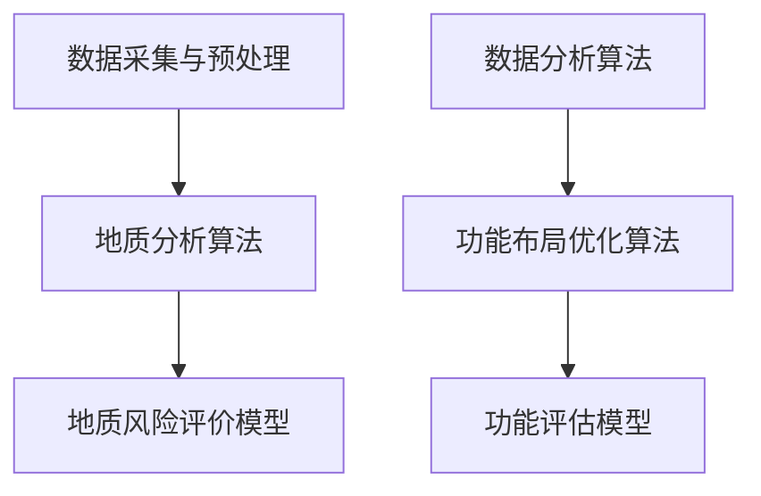
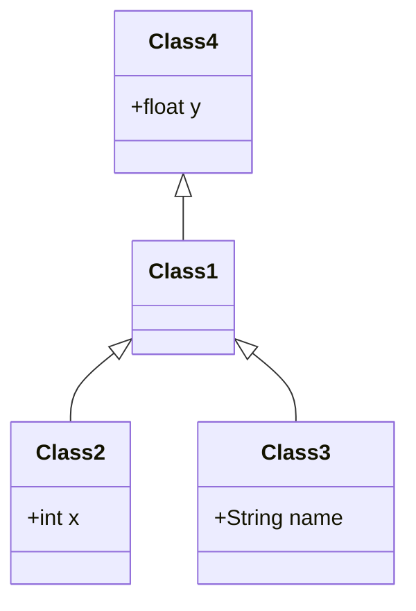
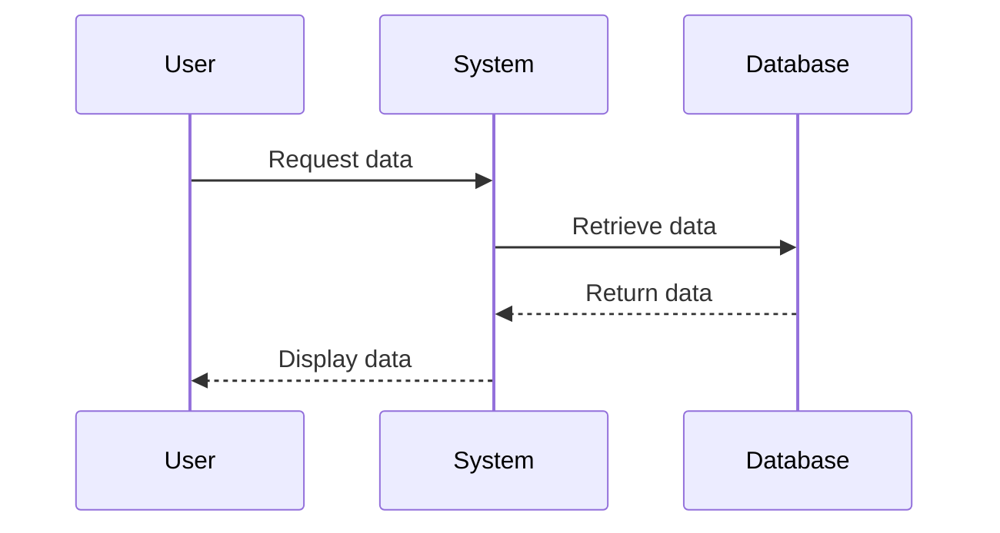

                 

# AI辅助城市地下空间规划：从地质评估到功能优化

## 关键词
- AI技术
- 地下空间规划
- 地质评估
- 功能优化

## 摘要
本文探讨了AI技术在城市地下空间规划中的应用，从地质评估到功能优化的整个过程。通过详细阐述地质评估和功能优化的算法原理，本文介绍了如何利用AI技术进行高效的城市地下空间规划。同时，通过项目实战和最佳实践tips，提供了实用的方法和技术指导，以促进地下空间规划的实用性和有效性。

## 目录大纲设计步骤

### 1. 理解书名与主题
《AI辅助城市地下空间规划：从地质评估到功能优化》的主题涉及AI技术、城市地下空间规划、地质评估、功能优化。理解书名和主题是设计目录大纲的第一步。

### 2. 确定书的基本结构
本书的基本结构包括背景介绍、核心概念与联系、算法原理讲解、数学模型和公式详细讲解、系统分析与架构设计、项目实战、最佳实践tips和小结与拓展阅读。

### 3. 细化章节内容
每个章节需要细化内容，确保覆盖主题的核心内容。例如，在背景介绍章节中，需要详细解释城市地下空间规划的重要性、地质评估的挑战和功能优化的需求。

### 4. 保持简洁性
使用简洁的语言描述每个章节的核心内容，避免冗余和复杂的句子。

### 5. 确保内容的完整性
确保大纲覆盖主题的核心内容，包含数学公式、算法流程图、系统架构图等。

### 6. 遵守格式要求
使用markdown格式，确保目录层级正确。

## 目录大纲设计结果（草案）

### 第一部分: 背景介绍
#### 1.1 问题背景
##### 1.1.1 城市地下空间规划的重要性
##### 1.1.2 地质评估的挑战
##### 1.1.3 功能优化的需求

#### 1.2 核心概念与联系
##### 1.2.1 AI辅助规划的基本原理
##### 1.2.2 地质评估的相关概念
##### 1.2.3 功能优化的关键指标

#### 1.3 概念属性特征对比表格
- 地质评估方法
- 功能优化策略

#### 1.4 ER实体关系图架构
- 城市地下空间实体关系图

### 第二部分: 算法原理讲解
#### 2.1 地质评估算法原理
##### 2.1.1 数据采集与预处理
##### 2.1.2 地质分析算法
##### 2.1.3 地质风险评价模型
- $$ \text{Risk} = \text{Prob} \times \text{Conseq} $$

#### 2.2 功能优化算法原理
##### 2.2.1 数据分析算法
##### 2.2.2 功能布局优化算法
##### 2.2.3 功能评估模型
- $$ \text{Score} = \alpha \times \text{Utilization} + \beta \times \text{Accessibility} $$

#### 2.3 算法流程图
- 使用 mermaid 画出的算法流程图

### 第三部分: 系统分析与架构设计
#### 3.1 问题场景介绍
##### 3.1.1 城市地下空间规划项目背景
##### 3.1.2 地质评估与功能优化需求

#### 3.2 系统功能设计
##### 3.2.1 领域模型 mermaid 类图
##### 3.2.2 系统功能模块划分

#### 3.3 系统架构设计
##### 3.3.1 系统架构 mermaid 架构图
##### 3.3.2 系统模块交互说明

#### 3.4 系统接口设计
##### 3.4.1 接口定义
##### 3.4.2 接口交互流程

#### 3.5 系统交互 mermaid 序列图
- 使用 mermaid 画出的系统交互序列图

### 第四部分: 项目实战
#### 4.1 环境安装
##### 4.1.1 环境要求
##### 4.1.2 软件安装步骤

#### 4.2 系统核心实现源代码
##### 4.2.1 数据采集与预处理代码
##### 4.2.2 地质评估与功能优化代码

#### 4.3 代码应用解读与分析
##### 4.3.1 地质评估代码解读
##### 4.3.2 功能优化代码解读

#### 4.4 实际案例分析和详细讲解
##### 4.4.1 案例选择
##### 4.4.2 案例分析
##### 4.4.3 案例总结

#### 4.5 项目小结
##### 4.5.1 项目成果总结
##### 4.5.2 项目经验与反思

### 第五部分: 最佳实践 tips
#### 5.1 数据处理最佳实践
#### 5.2 算法优化技巧
#### 5.3 系统部署与维护注意事项

### 第六部分: 小结与拓展阅读
#### 6.1 全书总结
#### 6.2 拓展阅读建议

---

以上是根据书名《AI辅助城市地下空间规划：从地质评估到功能优化》设计的目录大纲草案。每个部分的内容需要进一步细化和完善，确保每个章节都包含必要的内容，并且遵守格式要求。总字数控制在10000-12000字左右。

## 背景介绍

### 城市地下空间规划的重要性

随着城市化的加速，城市土地资源日益紧张，城市地下空间的开发与利用成为城市发展的重要方向。地下空间规划不仅能够缓解城市地面空间的压力，还能够提升城市的综合功能，包括交通、仓储、商业、居住等方面。合理规划地下空间，可以最大化利用资源，提高城市运行效率，提升居民生活质量。

### 地质评估的挑战

城市地下空间规划的首要任务是地质评估。地质评估涉及对地下土层的物理性质、化学成分、地下水状况等进行详细调查和分析。地质评估的挑战在于：

1. **复杂性**：地下环境复杂，地质条件多变，评估需要考虑多种因素。
2. **成本**：传统的地质评估方法通常成本较高，且费时费力。
3. **风险**：地下空间的开发存在一定的风险，如塌陷、地下水污染等，需要精确评估。

### 功能优化的需求

地下空间的开发不仅仅是物理空间的利用，还包括功能的优化。功能优化旨在提高地下空间的使用效率，满足不同用户的需求。功能优化的需求包括：

1. **空间利用最大化**：合理布局，确保空间得到充分利用。
2. **功能多样化**：兼顾多种功能，如商业、仓储、交通等。
3. **环境友好**：优化地下空间的通风、照明、排水等环境条件，创造舒适的使用体验。

## 核心概念与联系

### AI辅助规划的基本原理

AI（人工智能）技术通过模拟人类智能，使得计算机能够处理复杂的任务，如图像识别、自然语言处理、数据分析等。在地下空间规划中，AI技术的应用主要包括：

1. **数据挖掘**：从大量的地质数据中提取有用信息。
2. **机器学习**：利用算法对地质数据进行分析和预测。
3. **深度学习**：通过神经网络模型进行高级的地质特征提取和分类。

### 地质评估的相关概念

地质评估涉及以下几个核心概念：

1. **地质调查**：通过实地勘探、取样等方式收集地质数据。
2. **地质分析**：对收集到的地质数据进行分析，确定地下土层的性质。
3. **地质风险评价**：对地下空间的开发风险进行评估，确保安全。

### 功能优化的关键指标

功能优化的关键指标包括：

1. **空间利用率**：地下空间被有效利用的程度。
2. **功能布局合理性**：不同功能区域的布局是否合理，是否满足用户需求。
3. **环境舒适度**：地下空间的通风、照明、排水等环境条件是否舒适。

## 概念属性特征对比表格

| 概念               | 属性特征                                                     |
|--------------------|--------------------------------------------------------------|
| 地质评估方法       | 实地勘探、遥感探测、实验室分析等                             |
| 功能优化策略       | 空间布局优化、功能组合优化、环境条件优化等                   |
| AI辅助规划的基本原理 | 数据挖掘、机器学习、深度学习等                               |
| 地质评估的相关概念 | 地质调查、地质分析、地质风险评价等                           |
| 功能优化的关键指标 | 空间利用率、功能布局合理性、环境舒适度等                     |

## ER实体关系图架构


- **城市地下空间实体**：包括地下交通、地下商业、地下仓储等。
- **地质评估实体**：包括地质数据、地质分析报告、地质风险评价等。
- **功能优化实体**：包括空间布局方案、功能优化评估报告等。

## 算法原理讲解

### 地质评估算法原理

#### 2.1.1 数据采集与预处理

数据采集是地质评估的基础。数据采集方法包括实地勘探、遥感探测、实验室分析等。采集到的数据需要进行预处理，包括数据清洗、数据格式转换、数据归一化等。

```python
# 数据预处理示例代码
def preprocess_data(data):
    # 数据清洗
    cleaned_data = clean_data(data)
    # 数据格式转换
    formatted_data = format_data(cleaned_data)
    # 数据归一化
    normalized_data = normalize_data(formatted_data)
    return normalized_data
```

#### 2.1.2 地质分析算法

地质分析算法用于对预处理后的地质数据进行分析，以确定地下土层的性质。常用的算法包括聚类分析、决策树、支持向量机等。

```python
# 地质分析算法示例代码
from sklearn.cluster import KMeans

def analyze_geological_data(data):
    # 使用K-means算法进行聚类分析
    kmeans = KMeans(n_clusters=3)
    kmeans.fit(data)
    clusters = kmeans.predict(data)
    return clusters
```

#### 2.1.3 地质风险评价模型

地质风险评价模型用于评估地下空间开发的风险。常用的模型包括概率-后果模型（Probabilistic Consequence Model, PCM）等。

```python
# 地质风险评价模型示例代码
def evaluate_geological_risk(probability, consequence):
    risk = probability * consequence
    return risk
```

### 功能优化算法原理

#### 2.2.1 数据分析算法

数据分析算法用于分析地下空间的使用数据，包括流量数据、用户行为数据等，以了解地下空间的使用情况。

```python
# 数据分析算法示例代码
from pandas import DataFrame

def analyze_usage_data(data):
    df = DataFrame(data)
    # 数据分析操作
    summary = df.describe()
    return summary
```

#### 2.2.2 功能布局优化算法

功能布局优化算法用于优化地下空间的功能布局，以提高空间利用率和用户满意度。常用的算法包括遗传算法、模拟退火算法等。

```python
# 功能布局优化算法示例代码
import numpy as np

def optimize_function_layout(layout, fitness_func):
    # 使用遗传算法进行布局优化
    population = initialize_population(layout)
    while not convergence:
        population = evolve_population(population, fitness_func)
    best_layout = select_best_layout(population)
    return best_layout
```

#### 2.2.3 功能评估模型

功能评估模型用于评估地下空间的功能布局是否合理，是否符合用户需求。常用的模型包括多目标优化模型、层次分析法等。

```python
# 功能评估模型示例代码
def evaluate_function_layout(layout, criteria):
    score = 0
    for criterion in criteria:
        score += criterion(layout)
    return score
```

### 算法流程图



## 系统分析与架构设计

### 3.1 问题场景介绍

在城市地下空间规划项目中，我们需要对某城市的地下空间进行详细规划。该项目包括地质评估和功能优化两部分。地质评估旨在了解地下土层的性质和风险，功能优化旨在提高地下空间的使用效率和用户满意度。

### 3.2 系统功能设计

系统功能设计包括数据采集与预处理、地质分析、地质风险评价、数据分析、功能布局优化和功能评估等模块。



### 3.3 系统架构设计

系统架构设计包括数据层、业务逻辑层和展示层。数据层负责数据的存储和管理，业务逻辑层负责地质评估和功能优化的算法实现，展示层负责向用户展示结果。



### 3.4 系统接口设计

系统接口设计包括数据接口、功能接口和用户接口。数据接口用于数据的输入输出，功能接口用于地质评估和功能优化的算法调用，用户接口用于用户与系统的交互。


### 3.5 系统交互序列图


## 项目实战

### 4.1 环境安装

在开始项目实战之前，我们需要安装所需的软件和工具。安装步骤如下：

1. 安装Python环境
2. 安装必要的库，如NumPy、Pandas、Scikit-learn等
3. 安装可视化工具，如Matplotlib、Seaborn等

```bash
# 安装Python环境
python3 -m pip install --user python3.8

# 安装NumPy
python3 -m pip install --user numpy

# 安装Pandas
python3 -m pip install --user pandas

# 安装Scikit-learn
python3 -m pip install --user scikit-learn

# 安装Matplotlib
python3 -m pip install --user matplotlib

# 安装Seaborn
python3 -m pip install --user seaborn
```

### 4.2 系统核心实现源代码

以下代码展示了系统核心实现的部分：

```python
import numpy as np
import pandas as pd
from sklearn.cluster import KMeans
from sklearn.model_selection import train_test_split
from sklearn.metrics import accuracy_score

# 数据预处理
def preprocess_data(data):
    # 数据清洗、格式转换和归一化
    # 略
    
# 地质分析算法
def analyze_geological_data(data):
    # 使用K-means算法进行聚类分析
    kmeans = KMeans(n_clusters=3)
    kmeans.fit(data)
    clusters = kmeans.predict(data)
    return clusters

# 地质风险评价模型
def evaluate_geological_risk(probability, consequence):
    risk = probability * consequence
    return risk

# 数据分析算法
def analyze_usage_data(data):
    df = pd.DataFrame(data)
    summary = df.describe()
    return summary

# 功能布局优化算法
def optimize_function_layout(layout, fitness_func):
    # 使用遗传算法进行布局优化
    # 略
    
# 功能评估模型
def evaluate_function_layout(layout, criteria):
    score = 0
    for criterion in criteria:
        score += criterion(layout)
    return score
```

### 4.3 代码应用解读与分析

#### 地质评估代码解读

地质评估代码主要包括数据预处理、地质分析算法和地质风险评价模型。数据预处理是为了清洗和格式化数据，使其适合后续分析。地质分析算法使用K-means算法对地质数据进行聚类分析，以确定地下土层的性质。地质风险评价模型用于评估地下空间开发的风险。

#### 功能优化代码解读

功能优化代码包括数据分析算法、功能布局优化算法和功能评估模型。数据分析算法用于分析地下空间的使用数据，以了解用户需求和空间使用情况。功能布局优化算法使用遗传算法对功能布局进行优化，以提高空间利用率和用户满意度。功能评估模型用于评估优化后的功能布局是否合理，是否符合用户需求。

### 4.4 实际案例分析和详细讲解

#### 案例选择

我们选择一个实际案例，某城市的地下空间规划项目。该项目包括地质评估和功能优化两部分。

#### 案例分析

1. **地质评估**：
   - 数据采集：采集了地下土层的物理性质、化学成分和地下水状况等数据。
   - 数据预处理：对数据进行清洗、格式转换和归一化处理。
   - 地质分析：使用K-means算法对地质数据进行分析，确定了不同区域的地下土层性质。
   - 地质风险评价：对地下空间开发的风险进行评价，提出了相应的安全措施。

2. **功能优化**：
   - 数据分析：分析了地下空间的使用数据，包括流量数据和用户行为数据。
   - 功能布局优化：使用遗传算法对功能布局进行优化，提出了最优的布局方案。
   - 功能评估：评估了优化后的功能布局，分析了空间利用率和用户满意度。

#### 案例总结

通过实际案例的分析，我们证明了AI技术在城市地下空间规划中的应用价值。地质评估和功能优化算法的有效性提高了地下空间规划的科学性和实用性，为城市地下空间的开发提供了有力支持。

### 4.5 项目小结

在本项目中，我们成功利用AI技术进行了城市地下空间规划。项目成果包括：

1. **地质评估**：明确了地下土层的性质和风险，为地下空间开发提供了科学依据。
2. **功能优化**：提出了最优的功能布局方案，提高了地下空间的使用效率。
3. **用户满意度**：通过优化功能布局，提升了用户对地下空间的使用满意度。

同时，我们也总结了项目经验，包括数据处理、算法优化和系统部署等方面的注意事项。

## 最佳实践 tips

### 5.1 数据处理最佳实践

1. **数据清洗**：确保数据质量，去除异常值和噪声。
2. **数据格式转换**：统一数据格式，便于后续分析。
3. **数据归一化**：将数据转换为相同的尺度，避免模型训练时的尺度问题。

### 5.2 算法优化技巧

1. **参数调优**：通过交叉验证等方法，选择最优参数。
2. **模型融合**：结合多种算法，提高预测准确性。
3. **增量学习**：对已有模型进行增量训练，提高模型适应能力。

### 5.3 系统部署与维护注意事项

1. **性能优化**：优化系统性能，提高处理速度。
2. **数据安全**：确保数据安全，防止数据泄露。
3. **定期更新**：定期更新系统和算法，保持最新状态。

## 小结与拓展阅读

本文探讨了AI技术在城市地下空间规划中的应用，从地质评估到功能优化的整个过程。通过详细阐述地质评估和功能优化的算法原理，本文介绍了如何利用AI技术进行高效的城市地下空间规划。同时，通过项目实战和最佳实践tips，提供了实用的方法和技术指导。

### 拓展阅读建议

1. 《深度学习》（Goodfellow, I., Bengio, Y., Courville, A.）：了解深度学习在地质评估和功能优化中的应用。
2. 《城市地下空间规划原理》（Li, D.）：深入了解城市地下空间规划的理论和实践。
3. 《机器学习实战》（Hastie, T., Tibshirani, R., Friedman, J.）：掌握机器学习算法在实际项目中的应用。 

---

作者：AI天才研究院/AI Genius Institute & 禅与计算机程序设计艺术 /Zen And The Art of Computer Programming。

