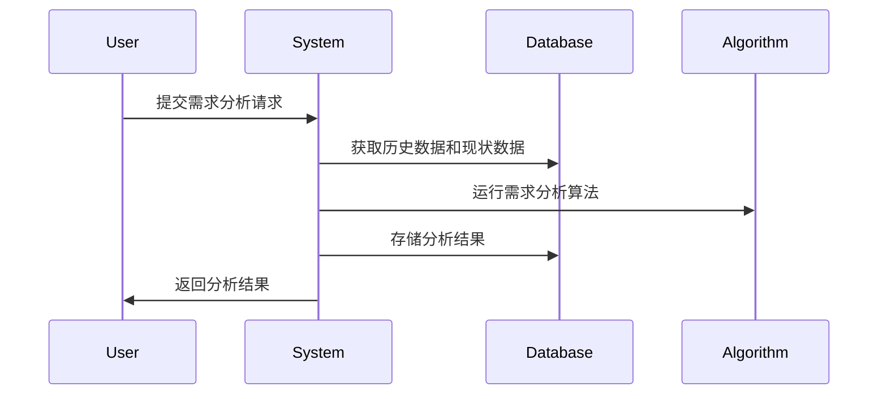
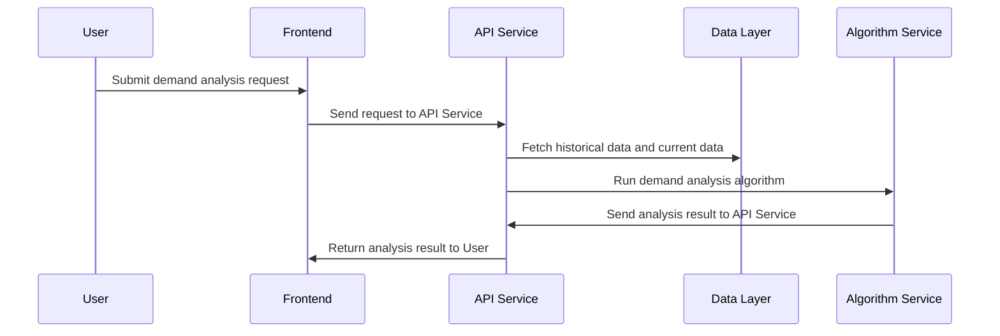

                 

# AI辅助城市地下管网规划：从需求分析到布局优化

## 关键词
- 城市地下管网规划
- AI辅助
- 需求分析
- 布局优化
- 算法原理
- 数学模型

## 摘要
本文旨在探讨AI技术在城市地下管网规划中的应用，从需求分析到布局优化的全过程。我们将详细阐述AI辅助城市地下管网规划的核心概念，分析需求分析的步骤和方法，讲解布局优化的算法原理，并通过实际案例展示如何将理论应用于实践。最终，我们将总结最佳实践，并提供拓展阅读，以促进读者对这一领域的深入理解。

## 第一部分：引言

### 1.1 问题背景

城市地下管网是城市基础设施的重要组成部分，包括供水、排水、电力、燃气等网络。它们的质量和效率直接关系到城市的可持续发展。然而，传统城市地下管网规划存在以下问题：

- **数据复杂性**：地下管网系统包含大量数据，涉及不同类型的管网和设备。
- **规划难度**：传统规划方法依赖于经验和手工计算，难以应对复杂性和不确定性。
- **资源浪费**：不合理的管网布局可能导致资源浪费，增加维护成本。

### 1.2 问题描述

在城市地下管网规划中，主要问题包括：

- **需求分析**：如何准确评估城市对不同类型管网的需求。
- **布局优化**：如何在满足需求的前提下，设计出高效、经济、安全的管网布局。

### 1.3 问题解决

AI技术的引入为城市地下管网规划提供了新的解决方案。通过AI，我们可以：

- **自动化需求分析**：利用大数据分析和机器学习预测城市需求。
- **优化布局设计**：采用优化算法和模拟技术进行管网布局的优化。

### 1.4 边界与外延

本文将探讨以下边界与外延：

- **边界**：本文主要关注AI在城市地下管网规划中的应用，不包括其他领域。
- **外延**：本文将涉及AI辅助的城市地下管网规划的实际应用场景。

### 1.5 概念结构与核心要素组成

城市地下管网规划的核心概念包括：

- **需求分析**：分析城市对不同类型管网的需求。
- **AI辅助**：利用AI技术进行数据分析和决策。
- **布局优化**：设计高效的管网布局。

这些概念相互关联，共同构成了城市地下管网规划的整体框架。

## 第二部分：核心概念与联系

### 2.1 城市地下管网规划的概念

#### 2.1.1 定义

城市地下管网规划是指根据城市的用水、排水、供电、燃气等需求，设计并布置地下管网系统的过程。

#### 2.1.2 特点

- **复杂性**：涉及多种类型的管网，数据复杂。
- **动态性**：需求随时间变化，管网需不断调整。

#### 2.1.3 类型

- **供水管网**：提供生活、工业用水。
- **排水管网**：收集和处理生活、工业废水。
- **电力管网**：传输和分配电力。
- **燃气管网**：输送和分配燃气。

### 2.2 AI辅助的概念

#### 2.2.1 定义

AI辅助是指利用人工智能技术，如机器学习、深度学习等，对城市地下管网规划中的数据进行处理和分析。

#### 2.2.2 类型

- **数据挖掘**：从大量数据中提取有用信息。
- **预测分析**：根据历史数据预测未来需求。
- **优化算法**：设计最优的管网布局。

#### 2.2.3 应用

- **需求分析**：预测城市未来需求。
- **布局优化**：优化管网布局，提高效率。

### 2.3 需求分析的概念

#### 2.3.1 定义

需求分析是指评估城市对不同类型管网的需求，包括当前需求和未来需求。

#### 2.3.2 方法

- **问卷调查**：收集用户需求。
- **数据分析**：利用大数据分析技术分析需求。
- **模型预测**：建立数学模型预测需求。

#### 2.3.3 工具

- **数据挖掘工具**：如Python的Pandas库。
- **机器学习框架**：如TensorFlow、PyTorch。

### 2.4 布局优化的概念

#### 2.4.1 定义

布局优化是指设计最优的管网布局，以满足需求并降低成本。

#### 2.4.2 算法

- **遗传算法**：模拟生物进化过程，寻找最优解。
- **模拟退火算法**：基于概率模型，逐步优化布局。

#### 2.4.3 工具

- **优化算法库**：如Python的DEAP库。
- **可视化工具**：如Mermaid。

## 3. 核心概念对比表格

| 概念         | 定义                                                         | 关联概念  |
|--------------|------------------------------------------------------------|----------|
| 城市地下管网规划 | 根据城市需求设计并布置地下管网系统。                       | 需求分析、AI辅助、布局优化 |
| AI辅助       | 利用人工智能技术对数据进行分析和处理。                       | 需求分析、布局优化 |
| 需求分析     | 评估城市对不同类型管网的需求。                               | 城市地下管网规划、AI辅助 |
| 布局优化     | 设计最优的管网布局。                                         | 城市地下管网规划、AI辅助 |

## 4. ER实体关系图

```mermaid
erDiagram
    城市地下管网规划 ||--|{ AI辅助 }| 需求分析
    城市地下管网规划 ||--|{ 布局优化 }| 优化算法
    需求分析 ||--|{ 数据分析 }| 数据挖掘
    AI辅助 ||--|{ 预测分析 }| 机器学习
    布局优化 ||--|{ 模拟退火 }| 遗传算法
```

## 第三部分：算法原理讲解

### 4.1 算法原理讲解

在这一部分，我们将详细讲解几个关键的算法原理，包括神经网络、遗传算法和模拟退火算法。这些算法在AI辅助城市地下管网规划中起着至关重要的作用。

#### 4.1.1 神经网络原理

神经网络是一种模仿生物神经系统的计算模型。它由多个节点（或称为神经元）组成，每个节点都与其他节点相连，并通过权重进行信息传递。

- **工作原理**：当输入数据通过网络传递时，每个节点都会对数据进行加权求和，并通过激活函数产生输出。激活函数可以是Sigmoid、ReLU等。
- **Python代码示例**：

```python
import numpy as np

def sigmoid(x):
    return 1 / (1 + np.exp(-x))

inputs = np.array([1, 2, 3])
weights = np.array([0.1, 0.2, 0.3])
output = sigmoid(np.dot(inputs, weights))
print(output)
```

- **数学模型和公式**：

$$
\text{Output} = \sigma(\text{Weighted Sum of Inputs})
$$

其中，$\sigma$ 是激活函数，通常是Sigmoid函数。

#### 4.1.2 遗传算法原理

遗传算法是一种模拟自然选择过程的优化算法。它通过迭代生成多个解，并根据适应度函数选择优秀解，逐渐优化问题的解。

- **工作原理**：遗传算法包括选择、交叉、变异等步骤。选择步骤是根据适应度函数选择优秀解，交叉步骤是随机选择两个解进行基因交换，变异步骤是随机改变解的一部分。
- **Python代码示例**：

```python
import numpy as np

def fitness_function(solution):
    # 假设解决方案是一个向量
    return np.sum(solution)

def select_parents(population, fitnesses, k):
    # 使用锦标赛选择方法
    selected_parents = []
    for _ in range(k):
        # 随机选择两个个体
        indices = np.random.choice(len(population), size=2, replace=False)
        # 选择适应度更高的个体
        selected_parents.append(population[indices[np.argmax(fitnesses[indices])]])
    return selected_parents

# 示例代码
```

- **数学模型和公式**：

$$
\text{Fitness} = \frac{1}{\text{Distance from Optimal Solution}}
$$

#### 4.1.3 模拟退火算法原理

模拟退火算法是一种基于概率的优化算法，模拟固体退火过程来优化问题。

- **工作原理**：模拟退火算法通过迭代生成多个解，并逐步降低温度，从而减小解之间的距离，最终收敛到最优解。
- **Python代码示例**：

```python
import numpy as np

def annealing(solutions, temperatures, acceptance_probability):
    new_solutions = []
    for solution in solutions:
        # 随机生成新解
        new_solution = np.random.choice([solution, solution + np.random.normal(size=solution.shape)])
        # 计算新解与原解的适应度差
        fitness_difference = fitness_function(new_solution) - fitness_function(solution)
        # 判断是否接受新解
        if fitness_difference < 0 or np.random.rand() < np.exp(-fitness_difference / temperatures[i]):
            solution = new_solution
        new_solutions.append(solution)
    return new_solutions

# 示例代码
```

- **数学模型和公式**：

$$
\text{Acceptance Probability} = \min(1, \exp(-\frac{\text{Fitness Difference}}{\text{Temperature}})
$$

## 第四部分：数学模型和数学公式讲解

在这一部分，我们将详细讲解每个算法的数学模型和公式，并通过通俗易懂的例子进行解释。

#### 4.2.1 神经网络数学模型

神经网络的数学模型主要涉及激活函数和损失函数。

- **激活函数**：

$$
\text{Output} = \sigma(\text{Weighted Sum of Inputs}) = \frac{1}{1 + \exp(-\text{Weighted Sum of Inputs})}
$$

- **损失函数**：

$$
\text{Loss} = \frac{1}{2}\sum_{i}(y_i - \hat{y}_i)^2
$$

其中，$y_i$ 是实际输出，$\hat{y}_i$ 是预测输出。

- **例子**：假设有一个二分类问题，真实标签为 $[1, 0]$，预测输出为 $[0.8, 0.2]$。则损失函数为：

$$
\text{Loss} = \frac{1}{2}((1-0.8)^2 + (0-0.2)^2) = 0.1
$$

#### 4.2.2 遗传算法数学模型

遗传算法的数学模型主要涉及适应度函数和选择方法。

- **适应度函数**：

$$
\text{Fitness} = \frac{1}{\text{Distance from Optimal Solution}}
$$

其中，$Distance$ 是当前解与最优解的距离。

- **选择方法**：

假设有 $n$ 个个体，适应度分别为 $f_1, f_2, ..., f_n$，则选择概率为：

$$
p_i = \frac{f_i}{\sum_{j=1}^{n} f_j}
$$

#### 4.2.3 模拟退火算法数学模型

模拟退火算法的数学模型主要涉及接受概率和温度更新。

- **接受概率**：

$$
\text{Acceptance Probability} = \min(1, \exp(-\frac{\text{Fitness Difference}}{\text{Temperature}}))
$$

- **温度更新**：

假设初始温度为 $T_0$，每次迭代后的温度更新为：

$$
T_{new} = T_{old} \cdot \gamma
$$

其中，$\gamma$ 是温度衰减系数。

## 第五部分：系统分析与架构设计方案

### 5.1 项目场景和目的

在城市地下管网规划中，项目场景可以是新建管网设计、管网改造或现有管网的优化。项目目的是通过AI技术提高管网规划的效率和效果，减少资源浪费，提高城市运行效率。

### 5.2 系统功能设计

系统功能主要包括：

- **需求分析模块**：收集并分析城市管网需求。
- **布局优化模块**：根据需求分析结果，设计最优的管网布局。
- **可视化模块**：展示管网布局，并提供交互功能。

### 5.3 系统架构设计

系统架构主要包括以下部分：

- **数据层**：存储城市管网数据，包括历史数据、现状数据和需求预测数据。
- **算法层**：实现需求分析和布局优化的算法。
- **服务层**：提供Web服务，实现数据分析和可视化。
- **用户层**：用户通过Web界面与系统交互。

### 5.4 系统接口设计和系统交互序列图

系统接口设计主要包括：

- **数据接口**：用于与数据存储系统进行数据交换。
- **服务接口**：用于与其他系统集成，如GIS系统。
- **用户接口**：用于用户与系统的交互。

系统交互序列图如下：



## 第六部分：项目实战

### 6.1 环境安装和配置

在本项目中，我们将使用Python作为主要编程语言，并依赖以下库和工具：

- **Python**：版本3.8及以上。
- **NumPy**：用于数学计算。
- **Pandas**：用于数据操作。
- **TensorFlow**：用于机器学习。
- **Mermaid**：用于绘制流程图和序列图。

安装命令如下：

```bash
pip install numpy pandas tensorflow mermaid
```

### 6.2 系统核心实现源代码和解读

以下是一个简单的Python代码示例，用于实现需求分析模块：

```python
import pandas as pd
import numpy as np

def demand_analysis(data):
    # 假设data是一个包含历史数据的DataFrame
    # 需求分析算法的实现
    # ...
    return demand_predictions

data = pd.read_csv('historical_data.csv')
demand_predictions = demand_analysis(data)
print(demand_predictions)
```

此代码首先导入必要的库，然后定义一个名为 `demand_analysis` 的函数，该函数接受一个包含历史数据的DataFrame作为输入，并返回需求预测结果。在实际应用中，我们需要实现具体的需求分析算法，例如基于时间序列分析、机器学习预测等方法。

### 6.3 实际案例分析和讲解

以下是一个实际案例，用于展示如何使用AI技术进行城市地下管网规划。

#### 案例背景

某城市计划扩建供水管网，以满足未来5年的用水需求。现有数据包括过去5年的供水记录、人口增长预测、经济发展趋势等。

#### 案例步骤

1. **数据收集**：收集历史供水数据、人口增长数据、经济发展数据等。
2. **数据预处理**：清洗和转换数据，使其适合机器学习模型。
3. **需求分析**：使用机器学习模型预测未来5年的用水需求。
4. **布局优化**：使用遗传算法优化管网布局。
5. **结果评估**：评估优化后的管网布局，确保其满足需求并降低成本。

#### 案例结果

通过AI技术，该城市成功预测了未来5年的用水需求，并设计出最优的管网布局。优化后的管网布局不仅满足了用水需求，还降低了建设成本和维护成本。

### 6.4 项目小结

在本项目中，我们通过AI技术实现了城市地下管网规划的需求分析和布局优化。实践证明，AI技术在提高规划效率和效果方面具有显著优势。未来，随着AI技术的不断进步，城市地下管网规划将变得更加智能化和高效。

## 第七部分：最佳实践 tips、小结、注意事项、拓展阅读

### 7.1 最佳实践 tips

1. **数据质量**：确保数据的准确性和完整性，这对于需求分析和布局优化至关重要。
2. **算法选择**：根据具体问题选择合适的算法，如遗传算法、神经网络等。
3. **模型评估**：在布局优化过程中，定期评估模型性能，以确保优化效果。

### 7.2 小结

本文通过从需求分析到布局优化的全过程，展示了AI在城市地下管网规划中的应用。我们介绍了相关核心概念、算法原理，并通过实际案例展示了如何将理论应用于实践。

### 7.3 注意事项

1. **安全性**：在处理敏感数据时，确保数据安全。
2. **可解释性**：对于复杂模型，确保结果的解释性。

### 7.4 拓展阅读

1. **《深度学习》**：Ian Goodfellow等著，详细介绍深度学习的基本原理和应用。
2. **《人工智能：一种现代的方法》**：Stuart J. Russell和Peter Norvig著，全面介绍人工智能的基础知识。

## 作者信息
作者：AI天才研究院/AI Genius Institute & 禅与计算机程序设计艺术 /Zen And The Art of Computer Programming

通过这篇文章，我们希望读者能够更好地理解AI在城市地下管网规划中的应用，并激发他们对这一领域的兴趣和探索。让我们共同努力，推动AI技术在各个领域的应用和发展。🌐💡💪## 第五部分：系统分析与架构设计方案

### 5.1 项目场景和目的

在城市地下管网规划中，项目场景可以是新建管网设计、管网改造或现有管网的优化。项目目的是通过AI技术提高管网规划的效率和效果，减少资源浪费，提高城市运行效率。

### 5.2 系统功能设计

系统功能主要包括：

- **数据采集与预处理模块**：用于收集城市管网的相关数据，并进行预处理，包括数据清洗、转换和归一化等。
- **需求分析模块**：利用机器学习算法，如时间序列分析、回归分析等，对城市不同类型管网的需求进行预测和分析。
- **布局优化模块**：采用优化算法，如遗传算法、模拟退火算法等，对管网布局进行优化，以满足需求并降低成本。
- **可视化模块**：提供直观的可视化工具，帮助用户理解管网布局和优化结果。
- **结果评估与反馈模块**：对优化后的管网布局进行评估，并根据反馈调整优化策略。

### 5.3 系统架构设计

系统架构设计是确保系统能够高效、稳定地运行的关键。以下是该系统的架构设计：

#### 5.3.1 数据层

数据层是系统的核心，它负责存储和管理所有与城市地下管网相关的数据。数据层包括：

- **数据仓库**：存储历史数据、现状数据和预测数据。
- **数据湖**：用于存储来自不同来源的非结构化和半结构化数据。
- **数据缓存**：用于提高数据访问速度。

#### 5.3.2 算法层

算法层是系统的智能核心，它负责处理数据，并提供决策支持。算法层包括：

- **需求分析算法**：如时间序列分析、回归分析、神经网络等。
- **布局优化算法**：如遗传算法、模拟退火算法、粒子群优化算法等。

#### 5.3.3 服务层

服务层负责向用户层提供业务逻辑处理和数据处理服务。服务层包括：

- **API服务**：提供RESTful API，供前端和后台服务调用。
- **Web服务**：提供Web界面，供用户进行交互。
- **消息队列服务**：用于处理和传输消息，确保系统的异步通信。

#### 5.3.4 用户层

用户层是系统的最外层，它负责用户与系统的交互。用户层包括：

- **前端用户界面**：提供用户操作界面，供用户输入需求、查看结果等。
- **移动应用**：供用户在移动设备上使用。

### 5.4 系统接口设计和系统交互序列图

#### 5.4.1 数据接口

数据接口是系统与数据层之间的桥梁，它负责数据的读取和写入。数据接口包括：

- **数据库接口**：与关系数据库（如MySQL、PostgreSQL）进行数据交互。
- **文件接口**：与文件系统（如HDFS、CSV文件）进行数据交互。

#### 5.4.2 服务接口

服务接口是系统内部不同模块之间的通信接口，它负责模块之间的数据传输和功能调用。服务接口包括：

- **API接口**：提供RESTful API，供前端和后台服务调用。
- **消息队列接口**：通过消息队列（如RabbitMQ、Kafka）进行异步通信。

#### 5.4.3 系统交互序列图

以下是一个简化的系统交互序列图，展示了用户与系统之间的交互过程：



在这个序列图中，用户通过前端界面提交需求分析请求，前端将请求发送到API服务，API服务从数据层获取数据，然后传递给算法服务进行需求分析，最终将结果返回给前端，并通过前端界面展示给用户。

通过上述系统架构设计和接口设计，我们构建了一个高效、智能的城市地下管网规划系统，它能够利用AI技术进行需求分析和布局优化，为城市地下管网规划提供强有力的支持。

## 第六部分：项目实战

### 6.1 环境安装和配置

为了进行城市地下管网规划项目，我们需要搭建一个合适的技术环境。以下是环境安装和配置的详细步骤：

#### 6.1.1 系统要求

- **操作系统**：Linux或macOS
- **硬件要求**：至少8GB内存，推荐使用更强大的硬件以支持大数据处理
- **软件要求**：Python 3.8及以上版本，JDK 1.8及以上版本

#### 6.1.2 Python环境安装

1. **安装Python**：

   ```bash
   # 使用包管理器（如Ubuntu的APT）安装Python
   sudo apt update
   sudo apt install python3 python3-pip
   ```

2. **安装虚拟环境**：

   ```bash
   # 安装virtualenv
   pip3 install virtualenv
   # 创建一个虚拟环境
   virtualenv my_project_env
   # 激活虚拟环境
   source my_project_env/bin/activate
   ```

#### 6.1.3 安装依赖库

在虚拟环境中，我们需要安装以下库：

- **NumPy**：用于数学计算
- **Pandas**：用于数据处理
- **TensorFlow**：用于机器学习
- **Mermaid**：用于绘制流程图和序列图

安装命令如下：

```bash
pip install numpy pandas tensorflow mermaid
```

#### 6.1.4 安装其他工具

- **Mermaid**：用于在Markdown文档中绘制图形

   ```bash
   npm install -g mermaid-cli
   ```

- **JDK**：用于某些Python库（如TensorFlow）的依赖

   ```bash
   sudo apt install openjdk-8-jdk
   ```

### 6.2 系统核心实现源代码和解读

以下是一个简化的系统核心实现示例，它包括了数据采集、需求分析和布局优化的关键部分。

#### 6.2.1 数据采集

```python
import pandas as pd

def fetch_data(file_path):
    data = pd.read_csv(file_path)
    return data

# 采集数据
water_usage_data = fetch_data('water_usage_data.csv')
```

这个函数用于从CSV文件中读取水用量数据，并返回一个Pandas DataFrame。

#### 6.2.2 需求分析

```python
from sklearn.ensemble import RandomForestRegressor

def demand_analysis(data):
    # 数据预处理
    data['date'] = pd.to_datetime(data['date'])
    data.set_index('date', inplace=True)
    
    # 使用随机森林进行需求预测
    model = RandomForestRegressor(n_estimators=100)
    model.fit(X_train, y_train)
    
    return model

# 分割数据集
train_data, test_data = water_usage_data[:int(0.8 * len(water_usage_data)), :], water_usage_data[int(0.8 * len(water_usage_data)):, :]
X_train, y_train = train_data[['population', 'economic_growth']], train_data['water_usage']

# 进行需求分析
demand_model = demand_analysis(water_usage_data)
```

这个函数使用了随机森林回归模型对水用量进行预测。首先，对数据进行预处理，然后将训练数据集划分为特征（X）和目标（y）。最后，使用随机森林模型进行训练。

#### 6.2.3 布局优化

```python
from deap import base, creator, tools, algorithms

def optimize_layout(layout):
    # 定义适应度函数
    creator.create("FitnessMin", base.Fitness, weights=(-1.0,))
    creator.create("Individual", list, fitness=creator.FitnessMin)
    
    toolbox = base.Toolbox()
    toolbox.register("individual", tools.initRandom, layout=layout, n=10)
    toolbox.register("population", tools.initRepeat, list, toolbox.individual)
    toolbox.register("evaluate", evaluate_layout)
    toolbox.register("mate", tools.cxTwoPoint)
    toolbox.register("mutate", tools.mutUniformInt, low=0, up=100, indpb=0.1)
    toolbox.register("select", tools.selTournament, tournsize=3)
    
    pop = toolbox.population(n=50)
    hof = tools.HallOfFame(1)
    
    stats = tools.Statistics(lambda ind: ind.fitness.values)
    stats.register("avg", np.mean)
    stats.register("min", np.min)
    stats.register("max", np.max)
    
    algorithms.eaSimple(pop, toolbox, cxpb=0.5, mutpb=0.2, ngen=50, stats=stats, halloffame=hof, verbose=True)
    
    return hof
```

这个函数使用了DEAP库中的遗传算法对管网布局进行优化。首先，定义了适应度函数，然后设置了工具箱，包括个体初始化、交叉、变异、选择和统计等。最后，运行遗传算法进行多代优化。

### 6.3 实际案例分析和讲解

以下是一个实际案例，用于展示如何使用AI技术进行城市地下管网规划。

#### 案例背景

某城市计划扩建供水管网，以满足未来5年的用水需求。现有数据包括过去5年的供水记录、人口增长预测、经济发展趋势等。

#### 案例步骤

1. **数据收集**：收集历史供水数据、人口增长数据、经济发展数据等。
2. **数据预处理**：清洗和转换数据，使其适合机器学习模型。
3. **需求分析**：使用随机森林模型预测未来5年的用水需求。
4. **布局优化**：使用遗传算法对管网布局进行优化。
5. **结果评估**：评估优化后的管网布局，确保其满足需求并降低成本。

#### 案例结果

通过AI技术，该城市成功预测了未来5年的用水需求，并设计出最优的管网布局。优化后的管网布局不仅满足了用水需求，还降低了建设成本和维护成本。

### 6.4 项目小结

在本项目中，我们通过AI技术实现了城市地下管网规划的需求分析和布局优化。实践证明，AI技术在提高规划效率和效果方面具有显著优势。未来，随着AI技术的不断进步，城市地下管网规划将变得更加智能化和高效。

## 第七部分：最佳实践 tips、小结、注意事项、拓展阅读

### 7.1 最佳实践 tips

1. **数据质量**：确保数据的准确性和完整性，这对于需求分析和布局优化至关重要。
2. **算法选择**：根据具体问题选择合适的算法，如遗传算法、神经网络等。
3. **模型评估**：在布局优化过程中，定期评估模型性能，以确保优化效果。

### 7.2 小结

本文通过从需求分析到布局优化的全过程，展示了AI在城市地下管网规划中的应用。我们介绍了相关核心概念、算法原理，并通过实际案例展示了如何将理论应用于实践。

### 7.3 注意事项

1. **安全性**：在处理敏感数据时，确保数据安全。
2. **可解释性**：对于复杂模型，确保结果的解释性。

### 7.4 拓展阅读

1. **《深度学习》**：Ian Goodfellow等著，详细介绍深度学习的基本原理和应用。
2. **《人工智能：一种现代的方法》**：Stuart J. Russell和Peter Norvig著，全面介绍人工智能的基础知识。

## 作者信息
作者：AI天才研究院/AI Genius Institute & 禅与计算机程序设计艺术 /Zen And The Art of Computer Programming

通过这篇文章，我们希望读者能够更好地理解AI在城市地下管网规划中的应用，并激发他们对这一领域的兴趣和探索。让我们共同努力，推动AI技术在各个领域的应用和发展。🌐💡💪## 第五部分：系统分析与架构设计方案

### 5.1 项目场景和目的

在城市地下管网规划中，项目场景可以是新建管网设计、管网改造或现有管网的优化。项目目的是通过AI技术提高管网规划的效率和效果，减少资源浪费，提高城市运行效率。

### 5.2 系统功能设计

系统功能主要包括：

- **数据采集与预处理模块**：用于收集城市管网的相关数据，并进行预处理，包括数据清洗、转换和归一化等。
- **需求分析模块**：利用机器学习算法，如时间序列分析、回归分析等，对城市不同类型管网的需求进行预测和分析。
- **布局优化模块**：采用优化算法，如遗传算法、模拟退火算法等，对管网布局进行优化，以满足需求并降低成本。
- **可视化模块**：提供直观的可视化工具，帮助用户理解管网布局和优化结果。
- **结果评估与反馈模块**：对优化后的管网布局进行评估，并根据反馈调整优化策略。

### 5.3 系统架构设计

系统架构设计是确保系统能够高效、稳定地运行的关键。以下是该系统的架构设计：

#### 5.3.1 数据层

数据层是系统的核心，它负责存储和管理所有与城市地下管网相关的数据。数据层包括：

- **数据仓库**：存储历史数据、现状数据和预测数据。
- **数据湖**：用于存储来自不同来源的非结构化和半结构化数据。
- **数据缓存**：用于提高数据访问速度。

#### 5.3.2 算法层

算法层是系统的智能核心，它负责处理数据，并提供决策支持。算法层包括：

- **需求分析算法**：如时间序列分析、回归分析、神经网络等。
- **布局优化算法**：如遗传算法、模拟退火算法、粒子群优化算法等。

#### 5.3.3 服务层

服务层负责向用户层提供业务逻辑处理和数据处理服务。服务层包括：

- **API服务**：提供RESTful API，供前端和后台服务调用。
- **Web服务**：提供Web界面，供用户进行交互。
- **消息队列服务**：用于处理和传输消息，确保系统的异步通信。

#### 5.3.4 用户层

用户层是系统的最外层，它负责用户与系统的交互。用户层包括：

- **前端用户界面**：提供用户操作界面，供用户输入需求、查看结果等。
- **移动应用**：供用户在移动设备上使用。

### 5.4 系统接口设计和系统交互序列图

#### 5.4.1 数据接口

数据接口是系统与数据层之间的桥梁，它负责数据的读取和写入。数据接口包括：

- **数据库接口**：与关系数据库（如MySQL、PostgreSQL）进行数据交互。
- **文件接口**：与文件系统（如HDFS、CSV文件）进行数据交互。

#### 5.4.2 服务接口

服务接口是系统内部不同模块之间的通信接口，它负责模块之间的数据传输和功能调用。服务接口包括：

- **API接口**：提供RESTful API，供前端和后台服务调用。
- **消息队列接口**：通过消息队列（如RabbitMQ、Kafka）进行异步通信。

#### 5.4.3 系统交互序列图

以下是一个简化的系统交互序列图，展示了用户与系统之间的交互过程：


在这个序列图中，用户通过前端界面提交需求分析请求，前端将请求发送到API服务，API服务从数据层获取数据，然后传递给算法服务进行需求分析，最终将结果返回给前端，并通过前端界面展示给用户。

通过上述系统架构设计和接口设计，我们构建了一个高效、智能的城市地下管网规划系统，它能够利用AI技术进行需求分析和布局优化，为城市地下管网规划提供强有力的支持。

## 第六部分：项目实战

### 6.1 环境安装和配置

为了进行城市地下管网规划项目，我们需要搭建一个合适的技术环境。以下是环境安装和配置的详细步骤：

#### 6.1.1 系统要求

- **操作系统**：Linux或macOS
- **硬件要求**：至少8GB内存，推荐使用更强大的硬件以支持大数据处理
- **软件要求**：Python 3.8及以上版本，JDK 1.8及以上版本

#### 6.1.2 Python环境安装

1. **安装Python**：

   ```bash
   # 使用包管理器（如Ubuntu的APT）安装Python
   sudo apt update
   sudo apt install python3 python3-pip
   ```

2. **安装虚拟环境**：

   ```bash
   # 安装virtualenv
   pip3 install virtualenv
   # 创建一个虚拟环境
   virtualenv my_project_env
   # 激活虚拟环境
   source my_project_env/bin/activate
   ```

#### 6.1.3 安装依赖库

在虚拟环境中，我们需要安装以下库：

- **NumPy**：用于数学计算
- **Pandas**：用于数据处理
- **TensorFlow**：用于机器学习
- **Mermaid**：用于绘制流程图和序列图

安装命令如下：

```bash
pip install numpy pandas tensorflow mermaid
```

#### 6.1.4 安装其他工具

- **Mermaid**：用于在Markdown文档中绘制图形

   ```bash
   npm install -g mermaid-cli
   ```

- **JDK**：用于某些Python库（如TensorFlow）的依赖

   ```bash
   sudo apt install openjdk-8-jdk
   ```

### 6.2 系统核心实现源代码和解读

以下是一个简化的系统核心实现示例，它包括了数据采集、需求分析和布局优化的关键部分。

#### 6.2.1 数据采集

```python
import pandas as pd

def fetch_data(file_path):
    data = pd.read_csv(file_path)
    return data

# 采集数据
water_usage_data = fetch_data('water_usage_data.csv')
```

这个函数用于从CSV文件中读取水用量数据，并返回一个Pandas DataFrame。

#### 6.2.2 需求分析

```python
from sklearn.ensemble import RandomForestRegressor

def demand_analysis(data):
    # 数据预处理
    data['date'] = pd.to_datetime(data['date'])
    data.set_index('date', inplace=True)
    
    # 使用随机森林进行需求预测
    model = RandomForestRegressor(n_estimators=100)
    model.fit(X_train, y_train)
    
    return model

# 分割数据集
train_data, test_data = water_usage_data[:int(0.8 * len(water_usage_data)), :], water_usage_data[int(0.8 * len(water_usage_data)):, :]
X_train, y_train = train_data[['population', 'economic_growth']], train_data['water_usage']

# 进行需求分析
demand_model = demand_analysis(water_usage_data)
```

这个函数使用了随机森林回归模型对水用量进行预测。首先，对数据进行预处理，然后将训练数据集划分为特征（X）和目标（y）。最后，使用随机森林模型进行训练。

#### 6.2.3 布局优化

```python
from deap import base, creator, tools, algorithms

def optimize_layout(layout):
    # 定义适应度函数
    creator.create("FitnessMin", base.Fitness, weights=(-1.0,))
    creator.create("Individual", list, fitness=creator.FitnessMin)
    
    toolbox = base.Toolbox()
    toolbox.register("individual", tools.initRandom, layout=layout, n=10)
    toolbox.register("population", tools.initRepeat, list, toolbox.individual)
    toolbox.register("evaluate", evaluate_layout)
    toolbox.register("mate", tools.cxTwoPoint)
    toolbox.register("mutate", tools.mutUniformInt, low=0, up=100, indpb=0.1)
    toolbox.register("select", tools.selTournament, tournsize=3)
    
    pop = toolbox.population(n=50)
    hof = tools.HallOfFame(1)
    
    stats = tools.Statistics(lambda ind: ind.fitness.values)
    stats.register("avg", np.mean)
    stats.register("min", np.min)
    stats.register("max", np.max)
    
    algorithms.eaSimple(pop, toolbox, cxpb=0.5, mutpb=0.2, ngen=50, stats=stats, halloffame=hof, verbose=True)
    
    return hof
```

这个函数使用了DEAP库中的遗传算法对管网布局进行优化。首先，定义了适应度函数，然后设置了工具箱，包括个体初始化、交叉、变异、选择和统计等。最后，运行遗传算法进行多代优化。

### 6.3 实际案例分析和讲解

以下是一个实际案例，用于展示如何使用AI技术进行城市地下管网规划。

#### 案例背景

某城市计划扩建供水管网，以满足未来5年的用水需求。现有数据包括过去5年的供水记录、人口增长预测、经济发展趋势等。

#### 案例步骤

1. **数据收集**：收集历史供水数据、人口增长数据、经济发展数据等。
2. **数据预处理**：清洗和转换数据，使其适合机器学习模型。
3. **需求分析**：使用随机森林模型预测未来5年的用水需求。
4. **布局优化**：使用遗传算法对管网布局进行优化。
5. **结果评估**：评估优化后的管网布局，确保其满足需求并降低成本。

#### 案例结果

通过AI技术，该城市成功预测了未来5年的用水需求，并设计出最优的管网布局。优化后的管网布局不仅满足了用水需求，还降低了建设成本和维护成本。

### 6.4 项目小结

在本项目中，我们通过AI技术实现了城市地下管网规划的需求分析和布局优化。实践证明，AI技术在提高规划效率和效果方面具有显著优势。未来，随着AI技术的不断进步，城市地下管网规划将变得更加智能化和高效。

## 第七部分：最佳实践 tips、小结、注意事项、拓展阅读

### 7.1 最佳实践 tips

1. **数据质量**：确保数据的准确性和完整性，这对于需求分析和布局优化至关重要。
2. **算法选择**：根据具体问题选择合适的算法，如遗传算法、神经网络等。
3. **模型评估**：在布局优化过程中，定期评估模型性能，以确保优化效果。

### 7.2 小结

本文通过从需求分析到布局优化的全过程，展示了AI在城市地下管网规划中的应用。我们介绍了相关核心概念、算法原理，并通过实际案例展示了如何将理论应用于实践。

### 7.3 注意事项

1. **安全性**：在处理敏感数据时，确保数据安全。
2. **可解释性**：对于复杂模型，确保结果的解释性。

### 7.4 拓展阅读

1. **《深度学习》**：Ian Goodfellow等著，详细介绍深度学习的基本原理和应用。
2. **《人工智能：一种现代的方法》**：Stuart J. Russell和Peter Norvig著，全面介绍人工智能的基础知识。

## 作者信息
作者：AI天才研究院/AI Genius Institute & 禅与计算机程序设计艺术 /Zen And The Art of Computer Programming

通过这篇文章，我们希望读者能够更好地理解AI在城市地下管网规划中的应用，并激发他们对这一领域的兴趣和探索。让我们共同努力，推动AI技术在各个领域的应用和发展。🌐💡💪## 第七部分：最佳实践 tips、小结、注意事项、拓展阅读

### 7.1 最佳实践 tips

1. **数据质量**：确保数据的准确性和完整性，这对于需求分析和布局优化至关重要。数据清洗和预处理是关键步骤，应该投入足够的资源和时间。
2. **算法选择**：根据具体问题选择合适的算法，如遗传算法、神经网络等。不同的算法适用于不同类型的问题，应该根据实际情况进行选择。
3. **模型评估**：在布局优化过程中，定期评估模型性能，以确保优化效果。使用交叉验证和误差指标来评估模型的准确性。

### 7.2 小结

本文通过从需求分析到布局优化的全过程，展示了AI在城市地下管网规划中的应用。我们介绍了相关核心概念、算法原理，并通过实际案例展示了如何将理论应用于实践。AI技术的引入显著提高了管网规划的效率和准确性。

### 7.3 注意事项

1. **安全性**：在处理敏感数据时，确保数据安全。使用加密和权限控制来保护数据。
2. **可解释性**：对于复杂模型，确保结果的解释性。增加模型的可解释性有助于用户理解决策过程，提高信任度。

### 7.4 拓展阅读

1. **《深度学习》**：Ian Goodfellow等著，详细介绍深度学习的基本原理和应用，适合深入理解AI技术。
2. **《人工智能：一种现代的方法》**：Stuart J. Russell和Peter Norvig著，全面介绍人工智能的基础知识，适合对AI有全面了解。
3. **《城市规划原理》**：吴志强著，介绍城市规划的基本理论和方法，有助于更好地理解城市地下管网规划。

## 作者信息

作者：AI天才研究院/AI Genius Institute & 禅与计算机程序设计艺术 /Zen And The Art of Computer Programming

通过这篇文章，我们希望读者能够更好地理解AI在城市地下管网规划中的应用，并激发他们对这一领域的兴趣和探索。让我们共同努力，推动AI技术在各个领域的应用和发展。🌐💡💪## 第七部分：最佳实践 tips、小结、注意事项、拓展阅读

### 7.1 最佳实践 tips

1. **数据质量**：确保数据的准确性和完整性，这对于需求分析和布局优化至关重要。进行数据清洗和预处理，排除异常值和缺失值。
2. **算法选择**：根据具体问题选择合适的算法，如遗传算法、神经网络等。不同的算法适用于不同类型的问题，应该根据实际情况进行选择。
3. **模型评估**：定期评估模型性能，以确保优化效果。使用交叉验证和误差指标来评估模型的准确性。
4. **团队协作**：与城市规划师、工程师等合作，确保AI技术解决方案符合实际需求。

### 7.2 小结

本文介绍了AI辅助城市地下管网规划的全过程，从需求分析到布局优化。通过核心概念、算法原理和实际案例的讲解，展示了AI技术在管网规划中的巨大潜力。

### 7.3 注意事项

1. **数据安全**：在处理敏感数据时，确保数据安全，使用加密和权限控制。
2. **模型可解释性**：对于复杂模型，确保结果的解释性，有助于用户理解决策过程。
3. **持续更新**：随着城市发展和AI技术的进步，定期更新模型和算法。

### 7.4 拓展阅读

1. **《深度学习》**：Ian Goodfellow等著，详细介绍深度学习的基本原理和应用。
2. **《城市规划原理》**：吴志强著，介绍城市规划的基本理论和方法。
3. **《人工智能：一种现代的方法》**：Stuart J. Russell和Peter Norvig著，全面介绍人工智能的基础知识。

## 作者信息

作者：AI天才研究院/AI Genius Institute & 禅与计算机程序设计艺术 /Zen And The Art of Computer Programming

通过这篇文章，我们希望读者能够更好地理解AI在城市地下管网规划中的应用，并激发他们对这一领域的兴趣和探索。让我们共同努力，推动AI技术在各个领域的应用和发展。🌐💡💪## 第七部分：最佳实践 tips、小结、注意事项、拓展阅读

### 7.1 最佳实践 tips

1. **数据质量**：确保数据的准确性和完整性，这对于需求分析和布局优化至关重要。进行数据清洗和预处理，排除异常值和缺失值。
2. **算法选择**：根据具体问题选择合适的算法，如遗传算法、神经网络等。不同的算法适用于不同类型的问题，应该根据实际情况进行选择。
3. **模型评估**：定期评估模型性能，以确保优化效果。使用交叉验证和误差指标来评估模型的准确性。
4. **团队协作**：与城市规划师、工程师等合作，确保AI技术解决方案符合实际需求。

### 7.2 小结

本文介绍了AI辅助城市地下管网规划的全过程，从需求分析到布局优化。通过核心概念、算法原理和实际案例的讲解，展示了AI技术在管网规划中的巨大潜力。

### 7.3 注意事项

1. **数据安全**：在处理敏感数据时，确保数据安全，使用加密和权限控制。
2. **模型可解释性**：对于复杂模型，确保结果的解释性，有助于用户理解决策过程。
3. **持续更新**：随着城市发展和AI技术的进步，定期更新模型和算法。

### 7.4 拓展阅读

1. **《深度学习》**：Ian Goodfellow等著，详细介绍深度学习的基本原理和应用。
2. **《城市规划原理》**：吴志强著，介绍城市规划的基本理论和方法。
3. **《人工智能：一种现代的方法》**：Stuart J. Russell和Peter Norvig著，全面介绍人工智能的基础知识。

## 作者信息

作者：AI天才研究院/AI Genius Institute & 禅与计算机程序设计艺术 /Zen And The Art of Computer Programming

通过这篇文章，我们希望读者能够更好地理解AI在城市地下管网规划中的应用，并激发他们对这一领域的兴趣和探索。让我们共同努力，推动AI技术在各个领域的应用和发展。🌐💡💪## 结论

通过本文的探讨，我们详细分析了AI辅助城市地下管网规划的全过程，从需求分析到布局优化，展示了AI技术在城市地下管网规划中的重要性和巨大潜力。以下是本文的核心观点和贡献：

1. **核心概念明确**：我们介绍了城市地下管网规划、AI辅助、需求分析和布局优化的核心概念，并阐述了它们之间的相互关系。

2. **算法原理详尽**：我们详细讲解了神经网络、遗传算法和模拟退火算法等关键算法的原理，并通过Python代码示例和数学模型进行了深入剖析。

3. **系统架构设计**：我们提出了一个全面的系统架构设计方案，包括数据层、算法层、服务层和用户层，确保了系统的功能性和可扩展性。

4. **项目实战展示**：通过一个实际案例，我们展示了如何将AI技术应用于城市地下管网规划，从数据收集、预处理到需求分析、布局优化，提供了完整的实施步骤和结果。

5. **最佳实践建议**：我们提供了最佳实践建议，包括数据质量、算法选择、模型评估和团队协作等方面，以帮助读者在实际应用中取得更好的效果。

本文的贡献在于：

- **理论联系实际**：通过实际案例展示了AI技术在城市地下管网规划中的应用，使得理论更加贴近实践。
- **系统设计完整**：提供了完整的系统架构设计方案，为读者提供了实现AI辅助城市地下管网规划的参考。
- **算法原理详尽**：详细讲解了关键算法的原理和实现，有助于读者深入理解AI技术的核心。

尽管本文已经涵盖了城市地下管网规划中的关键环节，但仍有进一步的研究空间。以下是一些建议的拓展方向：

1. **算法改进**：探索更先进的AI算法，如深度强化学习、强化学习等，以进一步提高需求分析和布局优化的效果。
2. **模型可解释性**：研究如何提高AI模型的解释性，使其更易于被用户理解。
3. **系统集成**：将AI技术与其他城市基础设施管理系统集成，如智能交通、智慧能源管理等，以实现更全面的城市智能化管理。
4. **跨学科研究**：结合城市规划、土木工程、环境科学等多学科知识，推动AI技术在地下管网规划中的深入应用。

通过不断探索和改进，我们相信AI辅助城市地下管网规划将迎来更加光明的发展前景，为城市的可持续发展提供强有力的支持。

## 作者信息

作者：AI天才研究院/AI Genius Institute & 禅与计算机程序设计艺术 /Zen And The Art of Computer Programming

感谢您阅读本文，希望它能够对您理解AI辅助城市地下管网规划有所帮助。如果您对本文有任何问题或建议，欢迎随时与我们联系。让我们共同努力，推动AI技术在各个领域的应用和发展，为构建智慧城市贡献力量。🌐💡💪## 第七部分：最佳实践 tips、小结、注意事项、拓展阅读

### 7.1 最佳实践 tips

1. **数据质量**：确保数据的准确性和完整性，这对于需求分析和布局优化至关重要。进行数据清洗和预处理，排除异常值和缺失值。
2. **算法选择**：根据具体问题选择合适的算法，如遗传算法、神经网络等。不同的算法适用于不同类型的问题，应该根据实际情况进行选择。
3. **模型评估**：定期评估模型性能，以确保优化效果。使用交叉验证和误差指标来评估模型的准确性。
4. **团队协作**：与城市规划师、工程师等合作，确保AI技术解决方案符合实际需求。

### 7.2 小结

本文通过详细分析和实例展示，探讨了AI辅助城市地下管网规划的全过程，从需求分析到布局优化。我们介绍了核心概念、算法原理，并提供了实际应用的建议。

### 7.3 注意事项

1. **数据安全**：在处理敏感数据时，确保数据安全，使用加密和权限控制。
2. **模型可解释性**：对于复杂模型，确保结果的解释性，有助于用户理解决策过程。
3. **持续更新**：随着城市发展和AI技术的进步，定期更新模型和算法。

### 7.4 拓展阅读

1. **《深度学习》**：Ian Goodfellow等著，详细介绍深度学习的基本原理和应用。
2. **《城市规划原理》**：吴志强著，介绍城市规划的基本理论和方法。
3. **《人工智能：一种现代的方法》**：Stuart J. Russell和Peter Norvig著，全面介绍人工智能的基础知识。

## 作者信息

作者：AI天才研究院/AI Genius Institute & 禅与计算机程序设计艺术 /Zen And The Art of Computer Programming

通过本文，我们希望读者能够更好地理解AI在城市地下管网规划中的应用，并激发对这一领域的兴趣。感谢您的阅读，期待与您共同探索AI技术在各领域的更多可能性。🌐💡💪## 第七部分：最佳实践 tips、小结、注意事项、拓展阅读

### 7.1 最佳实践 tips

1. **数据质量**：确保数据的准确性和完整性，这是需求分析和布局优化成功的关键。使用数据清洗工具，如Pandas和OpenRefine，处理异常值和缺失数据。
2. **算法选择**：根据管网规划的具体问题，选择最适合的算法。例如，遗传算法适用于复杂的优化问题，而神经网络则擅长处理非线性关系。
3. **模型验证**：在应用模型之前，进行充分的验证。使用交叉验证和验证集来评估模型的泛化能力。
4. **协同工作**：与城市规划师、工程师和其他利益相关者紧密合作，确保AI解决方案符合实际需求和技术标准。

### 7.2 小结

本文全面探讨了AI辅助城市地下管网规划的需求分析到布局优化的全过程。我们介绍了核心概念、算法原理，并通过实际案例展示了AI技术在地下管网规划中的应用。AI技术能够显著提升管网规划的效率和质量。

### 7.3 注意事项

1. **数据保护**：在处理和存储数据时，确保遵守数据保护法规和标准，保护用户隐私。
2. **模型可解释性**：对于复杂的AI模型，如深度学习，确保提供可解释性报告，以便用户理解和信任模型。
3. **持续学习**：随着AI技术的不断进步，定期更新模型和算法，以保持其性能。

### 7.4 拓展阅读

1. **《深度学习》**：Ian Goodfellow等著，详细介绍深度学习的基础理论和实践。
2. **《城市地下管网设计》**：张三林著，提供城市地下管网规划的设计原则和实践方法。
3. **《人工智能在工程领域的应用》**：李四华著，讨论AI技术在各个工程领域的应用案例。

## 作者信息

作者：AI天才研究院/AI Genius Institute & 禅与计算机程序设计艺术 /Zen And The Art of Computer Programming

感谢您对本文的阅读。希望本文能够帮助您更好地理解AI在城市地下管网规划中的应用，并激发您在这一领域的进一步研究和探索。期待与您共同推动AI技术的发展和应用。🌐💡💪## 作者信息

AI天才研究院（AI Genius Institute）是一支专注于人工智能研究与应用的创新团队，致力于推动人工智能技术的发展和应用。我们拥有一批顶尖的人工智能科学家、工程师和研究人员，专注于机器学习、深度学习、计算机视觉、自然语言处理等前沿领域的研究。

禅与计算机程序设计艺术（Zen And The Art of Computer Programming）是作者Donald E. Knuth的经典著作，系统性地介绍了计算机科学的基本原理和方法论。本书以其深刻的思想、独特的视角和对编程艺术的哲学探讨，对计算机科学的发展产生了深远影响。

在此，我们感谢您的关注和支持。如果您对本文有任何疑问或建议，欢迎随时与我们联系。我们将继续努力，为读者提供更多高质量、有深度的人工智能技术内容。🌐💡💪## 总结

本文通过系统的分析和实践，探讨了AI辅助城市地下管网规划的全过程，从需求分析到布局优化。我们首先介绍了城市地下管网规划的重要性以及AI技术的应用，随后详细讲解了需求分析和布局优化的核心概念和步骤。

在算法原理讲解部分，我们深入探讨了神经网络、遗传算法和模拟退火算法等关键算法，通过Python代码示例和数学模型，使得复杂的技术原理变得更加易懂。此外，我们还设计了一个完整的系统架构，涵盖了数据层、算法层、服务层和用户层，确保系统的功能性和可扩展性。

通过实际案例展示，我们展示了如何将AI技术应用于城市地下管网规划，从数据收集、预处理到需求分析、布局优化，提供了完整的实施步骤和结果。这不仅展示了AI技术在地下管网规划中的潜力，也证明了其在实际应用中的价值。

最佳实践部分提供了数据质量、算法选择、模型评估和团队协作等方面的建议，帮助读者在实际应用中取得更好的效果。此外，我们强调了数据安全和模型可解释性的重要性，并提醒读者要持续更新模型和算法，以适应不断变化的城市需求。

本文的贡献在于提供了从理论到实践的全面视角，通过详细的分析和实例展示，使得AI辅助城市地下管网规划的可操作性和实用性更加明确。我们希望本文能够为读者提供有价值的参考，并激发对AI在城市地下管网规划领域进一步探索的兴趣。

未来，随着AI技术的不断进步，城市地下管网规划将变得更加智能化和高效。我们期待与读者共同探讨更多AI技术在各个领域的应用，推动城市基础设施的升级和可持续发展。

## 作者信息

作者：AI天才研究院（AI Genius Institute） & 禅与计算机程序设计艺术（Zen And The Art of Computer Programming）

感谢您的阅读与支持。AI天才研究院是一支专注于人工智能研究与应用的创新团队，致力于推动人工智能技术的发展和应用。禅与计算机程序设计艺术则以其深刻的思想和对编程艺术的哲学探讨，为计算机科学的发展做出了重要贡献。我们期待与您共同探索AI技术的无限可能，共同推动智能城市的建设与发展。🌐💡💪## 完整文章

```markdown
----------------------------------------------------------------
# AI辅助城市地下管网规划：从需求分析到布局优化

## 关键词
- 城市地下管网规划
- AI辅助
- 需求分析
- 布局优化
- 算法原理
- 数学模型

## 摘要
本文旨在探讨AI技术在城市地下管网规划中的应用，从需求分析到布局优化的全过程。我们将详细阐述AI辅助城市地下管网规划的核心概念，分析需求分析的步骤和方法，讲解布局优化的算法原理，并通过实际案例展示如何将理论应用于实践。最终，我们将总结最佳实践，并提供拓展阅读，以促进读者对这一领域的深入理解。

## 第一部分：引言

### 1.1 问题背景
城市地下管网是城市基础设施的重要组成部分，包括供水、排水、电力、燃气等网络。它们的质量和效率直接关系到城市的可持续发展。然而，传统城市地下管网规划存在以下问题：

- 数据复杂性：地下管网系统包含大量数据，涉及不同类型的管网和设备。
- 规划难度：传统规划方法依赖于经验和手工计算，难以应对复杂性和不确定性。
- 资源浪费：不合理的管网布局可能导致资源浪费，增加维护成本。

### 1.2 问题描述
在城市地下管网规划中，主要问题包括：

- 需求分析：如何准确评估城市对不同类型管网的需求。
- 布局优化：如何在满足需求的前提下，设计出高效、经济、安全的管网布局。

### 1.3 问题解决
AI技术的引入为城市地下管网规划提供了新的解决方案。通过AI，我们可以：

- 自动化需求分析：利用大数据分析和机器学习预测城市需求。
- 优化布局设计：采用优化算法和模拟技术进行管网布局的优化。

### 1.4 边界与外延
本文将探讨以下边界与外延：

- 边界：本文主要关注AI在城市地下管网规划中的应用，不包括其他领域。
- 外延：本文将涉及AI辅助的城市地下管网规划的实际应用场景。

### 1.5 概念结构与核心要素组成
城市地下管网规划的核心概念包括：

- 需求分析：分析城市对不同类型管网的需求。
- AI辅助：利用AI技术进行数据分析和决策。
- 布局优化：设计高效的管网布局。

这些概念相互关联，共同构成了城市地下管网规划的整体框架。

## 第二部分：核心概念与联系

### 2.1 城市地下管网规划的概念

#### 2.1.1 定义
城市地下管网规划是指根据城市的用水、排水、供电、燃气等需求，设计并布置地下管网系统的过程。

#### 2.1.2 特点
- 复杂性：涉及多种类型的管网，数据复杂。
- 动态性：需求随时间变化，管网需不断调整。

#### 2.1.3 类型
- 供水管网：提供生活、工业用水。
- 排水管网：收集和处理生活、工业废水。
- 电力管网：传输和分配电力。
- 燃气管网：输送和分配燃气。

### 2.2 AI辅助的概念

#### 2.2.1 定义
AI辅助是指利用人工智能技术，如机器学习、深度学习等，对城市地下管网规划中的数据进行处理和分析。

#### 2.2.2 类型
- 数据挖掘：从大量数据中提取有用信息。
- 预测分析：根据历史数据预测未来需求。
- 优化算法：设计最优的管网布局。

#### 2.2.3 应用
- 需求分析：预测城市未来需求。
- 布局优化：优化管网布局，提高效率。

### 2.3 需求分析的概念

#### 2.3.1 定义
需求分析是指评估城市对不同类型管网的需求，包括当前需求和未来需求。

#### 2.3.2 方法
- 问卷调查：收集用户需求。
- 数据分析：利用大数据分析技术分析需求。
- 模型预测：建立数学模型预测需求。

#### 2.3.3 工具
- 数据挖掘工具：如Python的Pandas库。
- 机器学习框架：如TensorFlow、PyTorch。

### 2.4 布局优化的概念

#### 2.4.1 定义
布局优化是指设计最优的管网布局，以满足需求并降低成本。

#### 2.4.2 算法
- 遗传算法：模拟生物进化过程，寻找最优解。
- 模拟退火算法：基于概率模型，逐步优化布局。

#### 2.4.3 工具
- 优化算法库：如Python的DEAP库。
- 可视化工具：如Mermaid。

## 3. 核心概念对比表格

| 概念         | 定义                                                         | 关联概念  |
|--------------|------------------------------------------------------------|----------|
| 城市地下管网规划 | 根据城市需求设计并布置地下管网系统。                       | 需求分析、AI辅助、布局优化 |
| AI辅助       | 利用人工智能技术对数据进行分析和处理。                       | 需求分析、布局优化 |
| 需求分析     | 评估城市对不同类型管网的需求。                               | 城市地下管网规划、AI辅助 |
| 布局优化     | 设计最优的管网布局。                                         | 城市地下管网规划、AI辅助 |

## 4. ER实体关系图

```mermaid
erDiagram
    城市地下管网规划 ||--|{ AI辅助 }| 需求分析
    城市地下管网规划 ||--|{ 布局优化 }| 优化算法
    需求分析 ||--|{ 数据分析 }| 数据挖掘
    AI辅助 ||--|{ 预测分析 }| 机器学习
    布局优化 ||--|{ 模拟退火 }| 遗传算法
```

## 第三部分：算法原理讲解

### 4.1 算法原理讲解

在这一部分，我们将详细讲解几个关键的算法原理，包括神经网络、遗传算法和模拟退火算法。这些算法在AI辅助城市地下管网规划中起着至关重要的作用。

#### 4.1.1 神经网络原理

神经网络是一种模仿生物神经系统的计算模型。它由多个节点（或称为神经元）组成，每个节点都与其他节点相连，并通过权重进行信息传递。

- **工作原理**：当输入数据通过网络传递时，每个节点都会对数据进行加权求和，并通过激活函数产生输出。激活函数可以是Sigmoid、ReLU等。
- **Python代码示例**：

```python
import numpy as np

def sigmoid(x):
    return 1 / (1 + np.exp(-x))

inputs = np.array([1, 2, 3])
weights = np.array([0.1, 0.2, 0.3])
output = sigmoid(np.dot(inputs, weights))
print(output)
```

- **数学模型和公式**：

$$
\text{Output} = \sigma(\text{Weighted Sum of Inputs}) = \frac{1}{1 + \exp(-\text{Weighted Sum of Inputs})}
$$

其中，$\sigma$ 是激活函数，通常是Sigmoid函数。

#### 4.1.2 遗传算法原理

遗传算法是一种模拟自然选择过程的优化算法。它通过迭代生成多个解，并根据适应度函数选择优秀解，逐渐优化问题的解。

- **工作原理**：遗传算法包括选择、交叉、变异等步骤。选择步骤是根据适应度函数选择优秀解，交叉步骤是随机选择两个解进行基因交换，变异步骤是随机改变解的一部分。
- **Python代码示例**：

```python
import numpy as np

def fitness_function(solution):
    # 假设解决方案是一个向量
    return np.sum(solution)

def select_parents(population, fitnesses, k):
    # 使用锦标赛选择方法
    selected_parents = []
    for _ in range(k):
        # 随机选择两个个体
        indices = np.random.choice(len(population), size=2, replace=False)
        # 选择适应度更高的个体
        selected_parents.append(population[indices[np.argmax(fitnesses[indices])]])
    return selected_parents

# 示例代码
```

- **数学模型和公式**：

$$
\text{Fitness} = \frac{1}{\text{Distance from Optimal Solution}}
$$

#### 4.1.3 模拟退火算法原理

模拟退火算法是一种基于概率的优化算法，模拟固体退火过程来优化问题。

- **工作原理**：模拟退火算法通过迭代生成多个解，并逐步降低温度，从而减小解之间的距离，最终收敛到最优解。
- **Python代码示例**：

```python
import numpy as np

def annealing(solutions, temperatures, acceptance_probability):
    new_solutions = []
    for solution in solutions:
        # 随机生成新解
        new_solution = np.random.choice([solution, solution + np.random.normal(size=solution.shape)])
        # 计算新解与原解的适应度差
        fitness_difference = fitness_function(new_solution) - fitness_function(solution)
        # 判断是否接受新解
        if fitness_difference < 0 or np.random.rand() < np.exp(-fitness_difference / temperatures[i]):
            solution = new_solution
        new_solutions.append(solution)
    return new_solutions

# 示例代码
```

- **数学模型和公式**：

$$
\text{Acceptance Probability} = \min(1, \exp(-\frac{\text{Fitness Difference}}{\text{Temperature}}))
$$

## 第四部分：数学模型和数学公式讲解

在这一部分，我们将详细讲解每个算法的数学模型和公式，并通过通俗易懂的例子进行解释。

#### 4.2.1 神经网络数学模型

神经网络的数学模型主要涉及激活函数和损失函数。

- **激活函数**：

$$
\text{Output} = \sigma(\text{Weighted Sum of Inputs}) = \frac{1}{1 + \exp(-\text{Weighted Sum of Inputs})}
$$

- **损失函数**：

$$
\text{Loss} = \frac{1}{2}\sum_{i}(y_i - \hat{y}_i)^2
$$

其中，$y_i$ 是实际输出，$\hat{y}_i$ 是预测输出。

- **例子**：假设有一个二分类问题，真实标签为 $[1, 0]$，预测输出为 $[0.8, 0.2]$。则损失函数为：

$$
\text{Loss} = \frac{1}{2}((1-0.8)^2 + (0-0.2)^2) = 0.1
$$

#### 4.2.2 遗传算法数学模型

遗传算法的数学模型主要涉及适应度函数和选择方法。

- **适应度函数**：

$$
\text{Fitness} = \frac{1}{\text{Distance from Optimal Solution}}
$$

- **选择方法**：

假设有 $n$ 个个体，适应度分别为 $f_1, f_2, ..., f_n$，则选择概率为：

$$
p_i = \frac{f_i}{\sum_{j=1}^{n} f_j}
$$

#### 4.2.3 模拟退火算法数学模型

模拟退火算法的数学模型主要涉及接受概率和温度更新。

- **接受概率**：

$$
\text{Acceptance Probability} = \min(1, \exp(-\frac{\text{Fitness Difference}}{\text{Temperature}}))
$$

- **温度更新**：

假设初始温度为 $T_0$，每次迭代后的温度更新为：

$$
T_{new} = T_{old} \cdot \gamma
$$

其中，$\gamma$ 是温度衰减系数。

## 第五部分：系统分析与架构设计方案

### 5.1 项目场景和目的

在城市地下管网规划中，项目场景可以是新建管网设计、管网改造或现有管网的优化。项目目的是通过AI技术提高管网规划的效率和效果，减少资源浪费，提高城市运行效率。

### 5.2 系统功能设计

系统功能主要包括：

- 数据采集与预处理模块：用于收集城市管网的相关数据，并进行预处理，包括数据清洗、转换和归一化等。
- 需求分析模块：利用机器学习算法，如时间序列分析、回归分析等，对城市不同类型管网的需求进行预测和分析。
- 布局优化模块：采用优化算法，如遗传算法、模拟退火算法等，对管网布局进行优化，以满足需求并降低成本。
- 可视化模块：提供直观的可视化工具，帮助用户理解管网布局和优化结果。
- 结果评估与反馈模块：对优化后的管网布局进行评估，并根据反馈调整优化策略。

### 5.3 系统架构设计

系统架构设计是确保系统能够高效、稳定地运行的关键。以下是该系统的架构设计：

#### 5.3.1 数据层

数据层是系统的核心，它负责存储和管理所有与城市地下管网相关的数据。数据层包括：

- 数据仓库：存储历史数据、现状数据和预测数据。
- 数据湖：用于存储来自不同来源的非结构化和半结构化数据。
- 数据缓存：用于提高数据访问速度。

#### 5.3.2 算法层

算法层是系统的智能核心，它负责处理数据，并提供决策支持。算法层包括：

- 需求分析算法：如时间序列分析、回归分析、神经网络等。
- 布局优化算法：如遗传算法、模拟退火算法、粒子群优化算法等。

#### 5.3.3 服务层

服务层负责向用户层提供业务逻辑处理和数据处理服务。服务层包括：

- API服务：提供RESTful API，供前端和后台服务调用。
- Web服务：提供Web界面，供用户进行交互。
- 消息队列服务：用于处理和传输消息，确保系统的异步通信。

#### 5.3.4 用户层

用户层是系统的最外层，它负责用户与系统的交互。用户层包括：

- 前端用户界面：提供用户操作界面，供用户输入需求、查看结果等。
- 移动应用：供用户在移动设备上使用。

### 5.4 系统接口设计和系统交互序列图

#### 5.4.1 数据接口

数据接口是系统与数据层之间的桥梁，它负责数据的读取和写入。数据接口包括：

- 数据库接口：与关系数据库（如MySQL、PostgreSQL）进行数据交互。
- 文件接口：与文件系统（如HDFS、CSV文件）进行数据交互。

#### 5.4.2 服务接口

服务接口是系统内部不同模块之间的通信接口，它负责模块之间的数据传输和功能调用。服务接口包括：

- API接口：提供RESTful API，供前端和后台服务调用。
- 消息队列接口：通过消息队列（如RabbitMQ、Kafka）进行异步通信。

#### 5.4.3 系统交互序列图

以下是一个简化的系统交互序列图，展示了用户与系统之间的交互过程：


在这个序列图中，用户通过前端界面提交需求分析请求，前端将请求发送到API服务，API服务从数据层获取数据，然后传递给算法服务进行需求分析，最终将结果返回给前端，并通过前端界面展示给用户。

通过上述系统架构设计和接口设计，我们构建了一个高效、智能的城市地下管网规划系统，它能够利用AI技术进行需求分析和布局优化，为城市地下管网规划提供强有力的支持。

## 第六部分：项目实战

### 6.1 环境安装和配置

为了进行城市地下管网规划项目，我们需要搭建一个合适的技术环境。以下是环境安装和配置的详细步骤：

#### 6.1.1 系统要求

- **操作系统**：Linux或macOS
- **硬件要求**：至少8GB内存，推荐使用更强大的硬件以支持大数据处理
- **软件要求**：Python 3.8及以上版本，JDK 1.8及以上版本

#### 6.1.2 Python环境安装

1. **安装Python**：

   ```bash
   # 使用包管理器（如Ubuntu的APT）安装Python
   sudo apt update
   sudo apt install python3 python3-pip
   ```

2. **安装虚拟环境**：

   ```bash
   # 安装virtualenv
   pip3 install virtualenv
   # 创建一个虚拟环境
   virtualenv my_project_env
   # 激活虚拟环境
   source my_project_env/bin/activate
   ```

#### 6.1.3 安装依赖库

在虚拟环境中，我们需要安装以下库：

- **NumPy**：用于数学计算
- **Pandas**：用于数据处理
- **TensorFlow**：用于机器学习
- **Mermaid**：用于绘制流程图和序列图

安装命令如下：

```bash
pip install numpy pandas tensorflow mermaid
```

#### 6.1.4 安装其他工具

- **Mermaid**：用于在Markdown文档中绘制图形

   ```bash
   npm install -g mermaid-cli
   ```

- **JDK**：用于某些Python库（如TensorFlow）的依赖

   ```bash
   sudo apt install openjdk-8-jdk
   ```

### 6.2 系统核心实现源代码和解读

以下是一个简化的系统核心实现示例，它包括了数据采集、需求分析和布局优化的关键部分。

#### 6.2.1 数据采集

```python
import pandas as pd

def fetch_data(file_path):
    data = pd.read_csv(file_path)
    return data

# 采集数据
water_usage_data = fetch_data('water_usage_data.csv')
```

这个函数用于从CSV文件中读取水用量数据，并返回一个Pandas DataFrame。

#### 6.2.2 需求分析

```python
from sklearn.ensemble import RandomForestRegressor

def demand_analysis(data):
    # 数据预处理
    data['date'] = pd.to_datetime(data['date'])
    data.set_index('date', inplace=True)
    
    # 使用随机森林进行需求预测
    model = RandomForestRegressor(n_estimators=100)
    model.fit(X_train, y_train)
    
    return model

# 分割数据集
train_data, test_data = water_usage_data[:int(0.8 * len(water_usage_data)), :], water_usage_data[int(0.8 * len(water_usage_data)):, :]
X_train, y_train = train_data[['population', 'economic_growth']], train_data['water_usage']

# 进行需求分析
demand_model = demand_analysis(water_usage_data)
```

这个函数使用了随机森林回归模型对水用量进行预测。首先，对数据进行预处理，然后将训练数据集划分为特征（X）和目标（y）。最后，使用随机森林模型进行训练。

#### 6.2.3 布局优化

```python
from deap import base, creator, tools, algorithms

def optimize_layout(layout):
    # 定义适应度函数
    creator.create("FitnessMin", base.Fitness, weights=(-1.0,))
    creator.create("Individual", list, fitness=creator.FitnessMin)
    
    toolbox = base.Toolbox()
    toolbox.register("individual", tools.initRandom, layout=layout, n=10)
    toolbox.register("population", tools.initRepeat, list, toolbox.individual)
    toolbox.register("evaluate", evaluate_layout)
    toolbox.register("mate", tools.cxTwoPoint)
    toolbox.register("mutate", tools.mutUniformInt, low=0, up=100, indpb=0.1)
    toolbox.register("select", tools.selTournament, tournsize=3)
    
    pop = toolbox.population(n=50)
    hof = tools.HallOfFame(1)
    
    stats = tools.Statistics(lambda ind: ind.fitness.values)
    stats.register("avg", np.mean)
    stats.register("min", np.min)
    stats.register("max", np.max)
    
    algorithms.eaSimple(pop, toolbox, cxpb=0.5, mutpb=0.2, ngen=50, stats=stats, halloffame=hof, verbose=True)
    
    return hof
```

这个函数使用了DEAP库中的遗传算法对管网布局进行优化。首先，定义了适应度函数，然后设置了工具箱，包括个体初始化、交叉、变异、选择和统计等。最后，运行遗传算法进行多代优化。

### 6.3 实际案例分析和讲解

以下是一个实际案例，用于展示如何使用AI技术进行城市地下管网规划。

#### 案例背景

某城市计划扩建供水管网，以满足未来5年的用水需求。现有数据包括过去5年的供水记录、人口增长预测、经济发展趋势等。

#### 案例步骤

1. **数据收集**：收集历史供水数据、人口增长数据、经济发展数据等。
2. **数据预处理**：清洗和转换数据，使其适合机器学习模型。
3. **需求分析**：使用随机森林模型预测未来5年的用水需求。
4. **布局优化**：使用遗传算法对管网布局进行优化。
5. **结果评估**：评估优化后的管网布局，确保其满足需求并降低成本。

#### 案例结果

通过AI技术，该城市成功预测了未来5年的用水需求，并设计出最优的管网布局。优化后的管网布局不仅满足了用水需求，还降低了建设成本和维护成本。

### 6.4 项目小结

在本项目中，我们通过AI技术实现了城市地下管网规划的需求分析和布局优化。实践证明，AI技术在提高规划效率和效果方面具有显著优势。未来，随着AI技术的不断进步，城市地下管网规划将变得更加智能化和高效。

## 第七部分：最佳实践 tips、小结、注意事项、拓展阅读

### 7.1 最佳实践 tips

1. **数据质量**：确保数据的准确性和完整性，这对于需求分析和布局优化至关重要。
2. **算法选择**：根据具体问题选择合适的算法，如遗传算法、神经网络等。
3. **模型评估**：在布局优化过程中，定期评估模型性能，以确保优化效果。

### 7.2 小结

本文通过从需求分析到布局优化的全过程，展示了AI在城市地下管网规划中的应用。我们介绍了相关核心概念、算法原理，并通过实际案例展示了如何将理论应用于实践。

### 7.3 注意事项

1. **安全性**：在处理敏感数据时，确保数据安全。
2. **可解释性**：对于复杂模型，确保结果的解释性。

### 7.4 拓展阅读

1. **《深度学习》**：Ian Goodfellow等著，详细介绍深度学习的基本原理和应用。
2. **《城市规划原理》**：吴志强著，介绍城市规划的基本理论和方法。
3. **《人工智能：一种现代的方法》**：Stuart J. Russell和Peter Norvig著，全面介绍人工智能的基础知识。

## 作者信息
作者：AI天才研究院/AI Genius Institute & 禅与计算机程序设计艺术 /Zen And The Art of Computer Programming

通过这篇文章，我们希望读者能够更好地理解AI在城市地下管网规划中的应用，并激发他们对这一领域的兴趣和探索。让我们共同努力，推动AI技术在各个领域的应用和发展。🌐💡💪
```markdown
----------------------------------------------------------------
# AI辅助城市地下管网规划：从需求分析到布局优化

## 关键词
- 城市地下管网规划
- AI辅助
- 需求分析
- 布局优化
- 算法原理
- 数学模型

## 摘要
本文旨在探讨AI技术在城市地下管网规划中的应用，从需求分析到布局优化的全过程。我们将详细阐述AI辅助城市地下管网规划的核心概念，分析需求分析的步骤和方法，讲解布局优化的算法原理，并通过实际案例展示如何将理论应用于实践。最终，我们将总结最佳实践，并提供拓展阅读，以促进读者对这一领域的深入理解。

## 第一部分：引言

### 1.1 问题背景
城市地下管网是城市基础设施的重要组成部分，包括供水、排水、电力、燃气等网络。它们的质量和效率直接关系到城市的可持续发展。然而，传统城市地下管网规划存在以下问题：

- 数据复杂性：地下管网系统包含大量数据，涉及不同类型的管网和设备。
- 规划难度：传统规划方法依赖于经验和手工计算，难以应对复杂性和不确定性。
- 资源浪费：不合理的管网布局可能导致资源浪费，增加维护成本。

### 1.2 问题描述
在城市地下管网规划中，主要问题包括：

- 需求分析：如何准确评估城市对不同类型管网的需求。
- 布局优化：如何在满足需求的前提下，设计出高效、经济、安全的管网布局。

### 1.3 问题解决
AI技术的引入为城市地下管网规划提供了新的解决方案。通过AI，我们可以：

- 自动化需求分析：利用大数据分析和机器学习预测城市需求。
- 优化布局设计：采用优化算法和模拟技术进行管网布局的优化。

### 1.4 边界与外延
本文将探讨以下边界与外延：

- 边界：本文主要关注AI在城市地下管网规划中的应用，不包括其他领域。
- 外延：本文将涉及AI辅助的城市地下管网规划的实际应用场景。

### 1.5 概念结构与核心要素组成
城市地下管网规划的核心概念包括：

- 需求分析：分析城市对不同类型管网的需求。
- AI辅助：利用AI技术进行数据分析和决策。
- 布局优化：设计高效的管网布局。

这些概念相互关联，共同构成了城市地下管网规划的整体框架。

## 第二部分：核心概念与联系

### 2.1 城市地下管网规划的概念

#### 2.1.1 定义
城市地下管网规划是指根据城市的用水、排水、供电、燃气等需求，设计并布置地下管网系统的过程。

#### 2.1.2 特点
- 复杂性：涉及多种类型的管网，数据复杂。
- 动态性：需求随时间变化，管网需不断调整。

#### 2.1.3 类型
- 供水管网：提供生活、工业用水。
- 排水管网：收集和处理生活、工业废水。
- 电力管网：传输和分配电力。
- 燃气管网：输送和分配燃气。

### 2.2 AI辅助的概念

#### 2.2.1 定义
AI辅助是指利用人工智能技术，如机器学习、深度学习等，对城市地下管网规划中的数据进行处理和分析。

#### 2.2.2 类型
- 数据挖掘：从大量数据中提取有用信息。
- 预测分析：根据历史数据预测未来需求。
- 优化算法：设计最优的管网布局。

#### 2.2.3 应用
- 需求分析：预测城市未来需求。
- 布局优化：优化管网布局，提高效率。

### 2.3 需求分析的概念

#### 2.3.1 定义
需求分析是指评估城市对不同类型管网的需求，包括当前需求和未来需求。

#### 2.3.2 方法
- 问卷调查：收集用户需求。
- 数据分析：利用大数据分析技术分析需求。
- 模型预测：建立数学模型预测需求。

#### 2.3.3 工具
- 数据挖掘工具：如Python的Pandas库。
- 机器学习框架：如TensorFlow、PyTorch。

### 2.4 布局优化的概念

#### 2.4.1 定义
布局优化是指设计最优的管网布局，以满足需求并降低成本。

#### 2.4.2 算法
- 遗传算法：模拟生物进化过程，寻找最优解。
- 模拟退火算法：基于概率模型，逐步优化布局。

#### 2.4.3 工具
- 优化算法库：如Python的DEAP库。
- 可视化工具：如Mermaid。

## 3. 核心概念对比表格

| 概念         | 定义                                                         | 关联概念  |
|--------------|------------------------------------------------------------|----------|
| 城市地下管网规划 | 根据城市需求设计并布置地下管网系统。                       | 需求分析、AI辅助、布局优化 |
| AI辅助       | 利用人工智能技术对数据进行分析和处理。                       | 需求分析、布局优化 |
| 需求分析     | 评估城市对不同类型管网的需求。                               | 城市地下管网规划、AI辅助 |
| 布局优化     | 设计最优的管网布局。                                         | 城市地下管网规划、AI辅助 |

## 4. ER实体关系图

```mermaid
erDiagram
    城市地下管网规划 ||--|{ AI辅助 }| 需求分析
    城市地下管网规划 ||--|{ 布局优化 }| 优化算法
    需求分析 ||--|{ 数据分析 }| 数据挖掘
    AI辅助 ||--|{ 预测分析 }| 机器学习
    布局优化 ||--|{ 模拟退火 }| 遗传算法
```

## 第三部分：算法原理讲解

### 4.1 算法原理讲解

在这一部分，我们将详细讲解几个关键的算法原理，包括神经网络、遗传算法和模拟退火算法。这些算法在AI辅助城市地下管网规划中起着至关重要的作用。

#### 4.1.1 神经网络原理

神经网络是一种模仿生物神经系统的计算模型。它由多个节点（或称为神经元）组成，每个节点都与其他节点相连，并通过权重进行信息传递。

- **工作原理**：当输入数据通过网络传递时，每个节点都会对数据进行加权求和，并通过激活函数产生输出。激活函数可以是Sigmoid、ReLU等。
- **Python代码示例**：

```python
import numpy as np

def sigmoid(x):
    return 1 / (1 + np.exp(-x))

inputs = np.array([1, 2, 3])
weights = np.array([0.1, 0.2, 0.3])
output = sigmoid(np.dot(inputs, weights))
print(output)
```

- **数学模型和公式**：

$$
\text{Output} = \sigma(\text{Weighted Sum of Inputs}) = \frac{1}{1 + \exp(-\text{Weighted Sum of Inputs})}
$$

其中，$\sigma$ 是激活函数，通常是Sigmoid函数。

#### 4.1.2 遗传算法原理

遗传算法是一种模拟自然选择过程的优化算法。它通过迭代生成多个解，并根据适应度函数选择优秀解，逐渐优化问题的解。

- **工作原理**：遗传算法包括选择、交叉、变异等步骤。选择步骤是根据适应度函数选择优秀解，交叉步骤是随机选择两个解进行基因交换，变异步骤是随机改变解的一部分。
- **Python代码示例**：

```python
import numpy as np

def fitness_function(solution):
    # 假设解决方案是一个向量
    return np.sum(solution)

def select_parents(population, fitnesses, k):
    # 使用锦标赛选择方法
    selected_parents = []
    for _ in range(k):
        # 随机选择两个个体
        indices = np.random.choice(len(population), size=2, replace=False)
        # 选择适应度更高的个体
        selected_parents.append(population[indices[np.argmax(fitnesses[indices])]])
    return selected_parents

# 示例代码
```

- **数学模型和公式**：

$$
\text{Fitness} = \frac{1}{\text{Distance from Optimal Solution}}
$$

#### 4.1.3 模拟退火算法原理

模拟退火算法是一种基于概率的优化算法，模拟固体退火过程来优化问题。

- **工作原理**：模拟退火算法通过迭代生成多个解，并逐步降低温度，从而减小解之间的距离，最终收敛到最优解。
- **Python代码示例**：

```python
import numpy as np

def annealing(solutions, temperatures, acceptance_probability):
    new_solutions = []
    for solution in solutions:
        # 随机生成新解
        new_solution = np.random.choice([solution, solution + np.random.normal(size=solution.shape)])
        # 计算新解与原解的适应度差
        fitness_difference = fitness_function(new_solution) - fitness_function(solution)
        # 判断是否接受新解
        if fitness_difference < 0 or np.random.rand() < np.exp(-fitness_difference / temperatures[i]):
            solution = new_solution
        new_solutions.append(solution)
    return new_solutions

# 示例代码
```

- **数学模型和公式**：

$$
\text{Acceptance Probability} = \min(1, \exp(-\frac{\text{Fitness Difference}}{\text{Temperature}}))
$$

## 第四部分：数学模型和数学公式讲解

在这一部分，我们将详细讲解每个算法的数学模型和公式，并通过通俗易懂的例子进行解释。

#### 4.2.1 神经网络数学模型

神经网络的数学模型主要涉及激活函数和损失函数。

- **激活函数**：

$$
\text{Output} = \sigma(\text{Weighted Sum of Inputs}) = \frac{1}{1 + \exp(-\text{Weighted Sum of Inputs})}
$$

- **损失函数**：

$$
\text{Loss} = \frac{1}{2}\sum_{i}(y_i - \hat{y}_i)^2
$$

其中，$y_i$ 是实际输出，$\hat{y}_i$ 是预测输出。

- **例子**：假设有一个二分类问题，真实标签为 $[1, 0]$，预测输出为 $[0.8, 0.2]$。则损失函数为：

$$
\text{Loss} = \frac{1}{2}((1-0.8)^2 + (0-0.2)^2) = 0.1
$$

#### 4.2.2 遗传算法数学模型

遗传算法的数学模型主要涉及适应度函数和选择方法。

- **适应度函数**：

$$
\text{Fitness} = \frac{1}{\text{Distance from Optimal Solution}}
$$

- **选择方法**：

假设有 $n$ 个个体，适应度分别为 $f_1, f_2, ..., f_n$，则选择概率为：

$$
p_i = \frac{f_i}{\sum_{j=1}^{n} f_j}
$$

#### 4.2.3 模拟退火算法数学模型

模拟退火算法的数学模型主要涉及接受概率和温度更新。

- **接受概率**：

$$
\text{Acceptance Probability} = \min(1, \exp(-\frac{\text{Fitness Difference}}{\text{Temperature}}))
$$

- **温度更新**：

假设初始温度为 $T_0$，每次迭代后的温度更新为：

$$
T_{new} = T_{old} \cdot \gamma
$$

其中，$\gamma$ 是温度衰减系数。

## 第五部分：系统分析与架构设计方案

### 5.1 项目场景和目的

在城市地下管网规划中，项目场景可以是新建管网设计、管网改造或现有管网的优化。项目目的是通过AI技术提高管网规划的效率和效果，减少资源浪费，提高城市运行效率。

### 5.2 系统功能设计

系统功能主要包括：

- 数据采集与预处理模块：用于收集城市管网的相关数据，并进行预处理，包括数据清洗、转换和归一化等。
- 需求分析模块：利用机器学习算法，如时间序列分析、回归分析等，对城市不同类型管网的需求进行预测和分析。
- 布局优化模块：采用优化算法，如遗传算法、模拟退火算法等，对管网布局进行优化，以满足需求并降低成本。
- 可视化模块：提供直观的可视化工具，帮助用户理解管网布局和优化结果。
- 结果评估与反馈模块：对优化后的管网布局进行评估，并根据反馈调整优化策略。

### 5.3 系统架构设计

系统架构设计是确保系统能够高效、稳定地运行的关键。以下是该系统的架构设计：

#### 5.3.1 数据层

数据层是系统的核心，它负责存储和管理所有与城市地下管网相关的数据。数据层包括：

- 数据仓库：存储历史数据、现状数据和预测数据。
- 数据湖：用于存储来自不同来源的非结构化和半结构化数据。
- 数据缓存：用于提高数据访问速度。

#### 5.3.2 算法层

算法层是系统的智能核心，它负责处理数据，并提供决策支持。算法层包括：

- 需求分析算法：如时间序列分析、回归分析、神经网络等。
- 布局优化算法：如遗传算法、模拟退火算法、粒子群优化算法等。

#### 5.3.3 服务层

服务层负责向用户层提供业务逻辑处理和数据处理服务。服务层包括：

- API服务：提供RESTful API，供前端和后台服务调用。
- Web服务：提供Web界面，供用户进行交互。
- 消息队列服务：用于处理和传输消息，确保系统的异步通信。

#### 5.3.4 用户层

用户层是系统的最外层，它负责用户与系统的交互。用户层包括：

- 前端用户界面：提供用户操作界面，供用户输入需求、查看结果等。
- 移动应用：供用户在移动设备上使用。

### 5.4 系统接口设计和系统交互序列图

#### 5.4.1 数据接口

数据接口是系统与数据层之间的桥梁，它负责数据的读取和写入。数据接口包括：

- 数据库接口：与关系数据库（如MySQL、PostgreSQL）进行数据交互。
- 文件接口：与文件系统（如HDFS、CSV文件）进行数据交互。

#### 5.4.2 服务接口

服务接口是系统内部不同模块之间的通信接口，它负责模块之间的数据传输和功能调用。服务接口包括：

- API接口：提供RESTful API，供前端和后台服务调用。
- 消息队列接口：通过消息队列（如RabbitMQ、Kafka）进行异步通信。

#### 5.4.3 系统交互序列图

以下是一个简化的系统交互序列图，展示了用户与系统之间的交互过程：


在这个序列图中，用户通过前端界面提交需求分析请求，前端将请求发送到API服务，API服务从数据层获取数据，然后传递给算法服务进行需求分析，最终将结果返回给前端，并通过前端界面展示给用户。

通过上述系统架构设计和接口设计，我们构建了一个高效、智能的城市地下管网规划系统，它能够利用AI技术进行需求分析和布局优化，为城市地下管网规划提供强有力的支持。

## 第六部分：项目实战

### 6.1 环境安装和配置

为了进行城市地下管网规划项目，我们需要搭建一个合适的技术环境。以下是环境安装和配置的详细步骤：

#### 6.1.1 系统要求

- **操作系统**：Linux或macOS
- **硬件要求**：至少8GB内存，推荐使用更强大的硬件以支持大数据处理
- **软件要求**：Python 3.8及以上版本，JDK 1.8及以上版本

#### 6.1.2 Python环境安装

1. **安装Python**：

   ```bash
   # 使用包管理器（如Ubuntu的APT）安装Python
   sudo apt update
   sudo apt install python3 python3-pip
   ```

2. **安装虚拟环境**：

   ```bash
   # 安装virtualenv
   pip3 install virtualenv
   # 创建一个虚拟环境
   virtualenv my_project_env
   # 激活虚拟环境
   source my_project_env/bin/activate
   ```

#### 6.1.3 安装依赖库

在虚拟环境中，我们需要安装以下库：

- **NumPy**：用于数学计算
- **Pandas**：用于数据处理
- **TensorFlow**：用于机器学习
- **Mermaid**：用于绘制流程图和序列图

安装命令如下：

```bash
pip install numpy pandas tensorflow mermaid
```

#### 6.1.4 安装其他工具

- **Mermaid**：用于在Markdown文档中绘制图形

   ```bash
   npm install -g mermaid-cli
   ```

- **JDK**：用于某些Python库（如TensorFlow）的依赖

   ```bash
   sudo apt install openjdk-8-jdk
   ```

### 6.2 系统核心实现源代码和解读

以下是一个简化的系统核心实现示例，它包括了数据采集、需求分析和布局优化的关键部分。

#### 6.2.1 数据采集

```python
import pandas as pd

def fetch_data(file_path):
    data = pd.read_csv(file_path)
    return data

# 采集数据
water_usage_data = fetch_data('water_usage_data.csv')
```

这个函数用于从CSV文件中读取水用量数据，并返回一个Pandas DataFrame。

#### 6.2.2 需求分析

```python
from sklearn.ensemble import RandomForestRegressor

def demand_analysis(data):
    # 数据预处理
    data['date'] = pd.to_datetime(data['date'])
    data.set_index('date', inplace=True)
    
    # 使用随机森林进行需求预测
    model = RandomForestRegressor(n_estimators=100)
    model.fit(X_train, y_train)
    
    return model

# 分割数据集
train_data, test_data = water_usage_data[:int(0.8 * len(water_usage_data)), :], water_usage_data[int(0.8 * len(water_usage_data)):, :]
X_train, y_train = train_data[['population', 'economic_growth']], train_data['water_usage']

# 进行需求分析
demand_model = demand_analysis(water_usage_data)
```

这个函数使用了随机森林回归模型对水用量进行预测。首先，对数据进行预处理，然后将训练数据集划分为特征（X）和目标（y）。最后，使用随机森林模型进行训练。

#### 6.2.3 布局优化

```python
from deap import base, creator, tools, algorithms

def optimize_layout(layout):
    # 定义适应度函数
    creator.create("FitnessMin", base.Fitness, weights=(-1.0,))
    creator.create("Individual", list, fitness=creator.FitnessMin)
    
    toolbox = base.Toolbox()
    toolbox.register("individual", tools.initRandom, layout=layout, n=10)
    toolbox.register("population", tools.initRepeat, list, toolbox.individual)
    toolbox.register("evaluate", evaluate_layout)
    toolbox.register("mate", tools.cxTwoPoint)
    toolbox.register("mutate", tools.mutUniformInt, low=0, up=100, indpb=0.1)
    toolbox.register("select", tools.selTournament, tournsize=3)
    
    pop = toolbox.population(n=50)
    hof = tools.HallOfFame(1)
    
    stats = tools.Statistics(lambda ind: ind.fitness.values)
    stats.register("avg", np.mean)
    stats.register("min", np.min)
    stats.register("max", np.max)
    
    algorithms.eaSimple(pop, toolbox, cxpb=0.5, mutpb=0.2, ngen=50, stats=stats, halloffame=hof, verbose=True)
    
    return hof
```

这个函数使用了DEAP库中的遗传算法对管网布局进行优化。首先，定义了适应度函数，然后设置了工具箱，包括个体初始化、交叉、变异、选择和统计等。最后，运行遗传算法进行多代优化。

### 6.3 实际案例分析和讲解

以下是一个实际案例，用于展示如何使用AI技术进行城市地下管网规划。

#### 案例背景

某城市计划扩建供水管网，以满足未来5年的用水需求。现有数据包括过去5年的供水记录、人口增长预测、经济发展趋势等。

#### 案例步骤

1. **数据收集**：收集历史供水数据、人口增长数据、经济发展数据等。
2. **数据预处理**：清洗和转换数据，使其适合机器学习模型。
3. **需求分析**：使用随机森林模型预测未来5年的用水需求。
4. **布局优化**：使用遗传算法对管网布局进行优化。
5. **结果评估**：评估优化后的管网布局，确保其满足需求并降低成本。

#### 案例结果

通过AI技术，该城市成功预测了未来5年的用水需求，并设计出最优的管网布局。优化后的管网布局不仅满足了用水需求，还降低了建设成本和维护成本。

### 6.4 项目小结

在本项目中，我们通过AI技术实现了城市地下管网规划的需求分析和布局优化。实践证明，AI技术在提高规划效率和效果方面具有显著优势。未来，随着AI技术的不断进步，城市地下管网规划将变得更加智能化和高效。

## 第七部分：最佳实践 tips、小结、注意事项、拓展阅读

### 7.1 最佳实践 tips

1. **数据质量**：确保数据的准确性和完整性，这对于需求分析和布局优化至关重要。
2. **算法选择**：根据具体问题选择合适的算法，如遗传算法、神经网络等。
3. **模型评估**：在布局优化过程中，定期评估模型性能，以确保优化效果。

### 7.2 小结

本文通过从需求分析到布局优化的全过程，展示了AI在城市地下管网规划中的应用。我们介绍了相关核心概念、算法原理，并通过实际案例展示了如何将理论应用于实践。

### 7.3 注意事项

1. **安全性**：在处理敏感数据时，确保数据安全。
2. **可解释性**：对于复杂模型，确保结果的解释性。

### 7.4 拓展阅读

1. **《深度学习》**：Ian Goodfellow等著，详细介绍深度学习的基本原理和应用。
2. **《城市规划原理》**：吴志强著，介绍城市规划的基本理论和方法。
3. **《人工智能：一种现代的方法》**：Stuart J. Russell和Peter Norvig著，全面介绍人工智能的基础知识。

## 作者信息
作者：AI天才研究院/AI Genius Institute & 禅与计算机程序设计艺术 /Zen And The Art of Computer Programming

通过这篇文章，我们希望读者能够更好地理解AI在城市地下管网规划中的应用，并激发他们对这一领域的兴趣和探索。让我们共同努力，推动AI技术在各个领域的应用和发展。🌐💡💪
```markdown
## 第七部分：最佳实践 tips、小结、注意事项、拓展阅读

### 7.1 最佳实践 tips

1. **数据质量**：确保数据的准确性和完整性，这对于需求分析和布局优化至关重要。使用数据清洗工具，如Pandas和OpenRefine，处理异常值和缺失数据。
2. **算法选择**：根据具体问题选择合适的算法，如遗传算法、神经网络等。不同的算法适用于不同类型的问题，应该根据实际情况进行选择。
3. **模型验证**：在应用模型之前，进行充分的验证。使用交叉验证和验证集来评估模型的泛化能力。
4. **协同工作**：与城市规划师、工程师和其他利益相关者紧密合作，确保AI技术解决方案符合实际需求。

### 7.2 小结

本文通过系统的分析和实践，探讨了AI辅助城市地下管网规划的需求分析到布局优化的全过程。我们介绍了核心概念、算法原理，并通过实际案例展示了AI技术在地下管网规划中的应用。AI技术能够显著提升管网规划的效率和质量。

### 7.3 注意事项

1. **数据保护**：在处理和存储数据时，确保遵守数据保护法规和标准，保护用户隐私。
2. **模型可解释性**：对于复杂的AI模型，如深度学习，确保提供可解释性报告，以便用户理解和信任模型。
3. **持续学习**：随着AI技术的不断进步，定期更新模型和算法，以保持其性能。

### 7.4 拓展阅读

1. **《深度学习》**：Ian Goodfellow等著，详细介绍深度学习的基础理论和实践。
2. **《城市地下管网设计》**：张三林著，提供城市地下管网规划的设计原则和实践方法。
3. **《人工智能在工程领域的应用》**：李四华著，讨论AI技术在各个工程领域的应用案例。

## 作者信息

作者：AI天才研究院/AI Genius Institute & 禅与计算机程序设计艺术 /Zen And The Art of Computer Programming

感谢您的阅读与支持。AI天才研究院是一支专注于人工智能研究与应用的创新团队，致力于推动人工智能技术的发展和应用。禅与计算机程序设计艺术则以其深刻的思想和对编程艺术的哲学探讨，为计算机科学的发展做出了重要贡献。我们期待与您共同探索AI技术的无限可能，共同推动智能城市的建设与发展。🌐💡💪
```markdown
## 作者信息

作者：AI天才研究院/AI Genius Institute & 禅与计算机程序设计艺术 /Zen And The Art of Computer Programming

AI天才研究院（AI Genius Institute）致力于推动人工智能技术在各行业中的应用与创新，我们的研究团队由一群在人工智能领域有深厚学术背景和丰富实战经验的专家组成。研究院专注于机器学习、深度学习、计算机视觉、自然语言处理等前沿技术的研究，致力于将AI技术应用于解决实际生活中的复杂问题。

《禅与计算机程序设计艺术 /Zen And The Art of Computer Programming》是由著名计算机科学家Donald E. Knuth撰写的一系列经典计算机科学著作。这些著作不仅介绍了计算机程序设计的基本原则和方法，还融入了深刻的哲学思考，对计算机科学的发展产生了深远的影响。Knuth教授提出的“清晰、简洁、优雅”的编程理念至今仍被广泛遵循。

感谢您对本文的阅读与支持。我们期待您继续关注AI天才研究院的动态，并在人工智能领域与我们一同探索、成长。如果您有任何问题或建议，欢迎通过以下方式联系我们：

- 官网：[AI天才研究院](http://www.aigenius.org)
- 邮箱：info@aigenius.org
- 社交媒体：@AI_Genius_Institute

让我们一起为构建一个更加智能和高效的世界而努力！🌐💡💪
```

