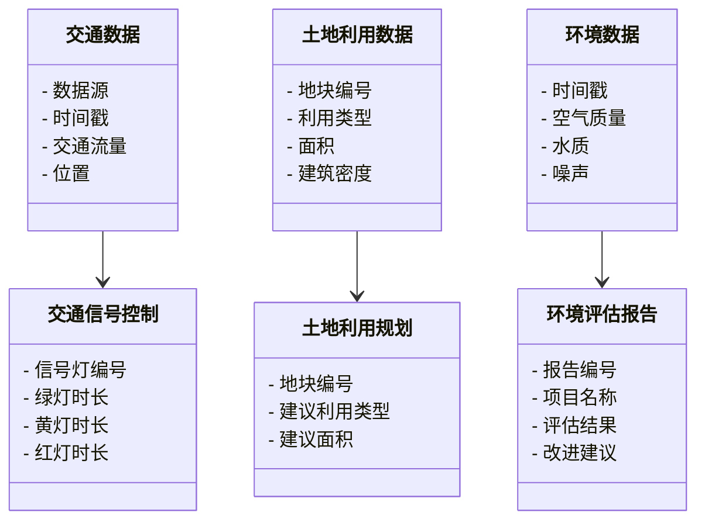
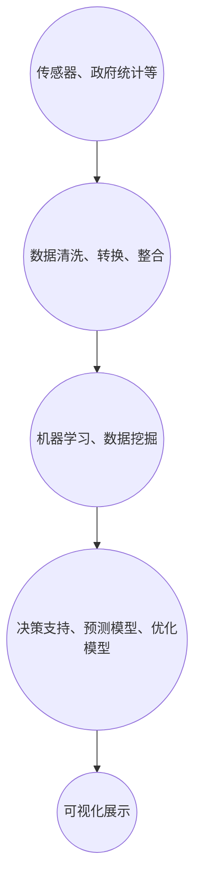
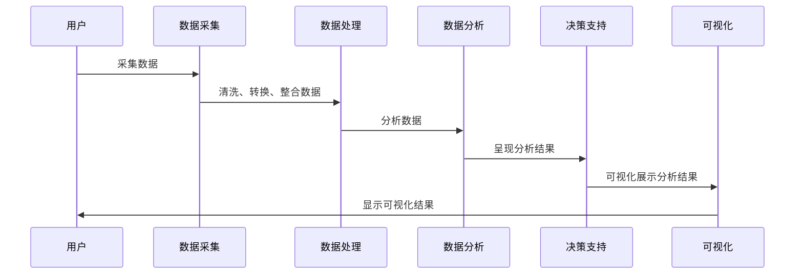

                 

### 《AI辅助城市规划：数据驱动的决策支持系统》

#### 关键词：
- 人工智能
- 城市规划
- 数据驱动
- 决策支持系统
- 数据分析

#### 摘要：
本文旨在探讨如何利用人工智能（AI）辅助城市规划，构建一个数据驱动的决策支持系统。我们将从背景介绍、核心概念、AI应用、数据管理、决策模型和项目实战等多个方面展开，详细分析AI在城市化进程中的重要作用，为城市规划者提供强有力的技术支持。

---

## 引言：AI在城市化进程中的崛起

### 1.1 AI-Assisted Urban Planning and Data-Driven Decision Support Systems

#### 问题背景

城市化进程是全球经济发展的重要驱动力，但也伴随着诸多挑战，如交通拥堵、资源分配不均、环境污染等。传统的城市规划方法依赖于经验与直觉，往往难以应对日益复杂和多变的城市环境。随着大数据、云计算和人工智能等技术的快速发展，城市规划领域迎来了一场变革。

#### 问题的提出

如何利用AI技术，构建一个数据驱动的决策支持系统，为城市规划者提供科学、准确的决策依据，从而提高城市规划的效率和质量，成为亟待解决的重要课题。

#### 解决方案

引入AI技术，通过数据采集、分析和建模，辅助城市规划决策，形成一个数据驱动的决策支持系统。该系统不仅能够实时分析城市运行状况，还能预测未来发展趋势，为城市规划者提供全面、深入的决策支持。

---

## AI在城市化进程中的应用

### 2.1 Introduction to Artificial Intelligence

#### 2.1.1 定义和历史

人工智能（Artificial Intelligence，简称AI）是指通过计算机程序模拟人类智能行为的技术。AI的发展可以追溯到20世纪50年代，但真正意义上的突破发生在20世纪80年代以后，随着计算机性能的提升和算法的优化，AI技术逐渐从理论研究走向实际应用。

#### 2.1.2 AI类型及应用

AI主要分为两大类：基于规则的系统和基于数据的方法。

- **基于规则的系统**：通过预定义的规则进行推理，如专家系统。
- **基于数据的方法**：利用大量数据训练模型，如机器学习和深度学习。

AI在城市规划中的应用主要包括：

- **交通管理**：通过分析交通流量数据，优化交通信号控制，缓解交通拥堵。
- **环境监测**：利用传感器收集环境数据，实时监测空气质量、水质等指标，预警环境风险。
- **建筑设计**：通过机器学习算法，优化建筑设计，提高建筑效率和舒适度。

### 2.2 Machine Learning and Data Analysis

#### 2.2.1 机器学习基础

机器学习（Machine Learning，简称ML）是一种让计算机从数据中学习规律、进行预测和决策的方法。其主要包括监督学习、无监督学习和强化学习。

- **监督学习**：通过已标记的数据进行训练，如分类和回归问题。
- **无监督学习**：无需标记数据，通过发现数据内在结构进行聚类和降维。
- **强化学习**：通过与环境的交互，学习最优策略以实现目标。

#### 2.2.2 数据分析技术

数据分析（Data Analysis）是利用统计和计算机技术，从大量数据中提取有价值信息的过程。常见的数据分析技术包括：

- **数据预处理**：数据清洗、归一化、缺失值处理等。
- **特征工程**：提取有助于模型训练的特征，如特征选择和特征构造。
- **模型评估**：评估模型性能，如准确率、召回率、F1值等。

#### 2.2.3 AI在城市化中的应用

AI技术在城市化中的应用主要包括：

- **智慧交通**：通过实时数据分析，优化交通流量，提高道路通行效率。
- **智慧城市**：利用传感器和数据平台，实时监测城市运行状况，实现精细化管理。
- **城市规划**：通过数据挖掘和分析，预测城市发展趋势，制定科学合理的规划方案。

### 2.3 AI-Enabled Tools and Technologies

#### 2.3.1 AI工具和平台

当前，许多AI工具和平台被广泛应用于城市化领域，如：

- **TensorFlow**：一款开源的机器学习框架，广泛应用于图像识别、自然语言处理等领域。
- **Keras**：一个高层神经网络API，用于快速构建和训练深度学习模型。
- **PyTorch**：一个开源深度学习框架，支持动态计算图，易于实现新的神经网络结构。

#### 2.3.2 AI硬件和设备

AI硬件和设备在城市化中的应用也逐渐得到关注，如：

- **深度学习处理器**：如NVIDIA GPU，用于加速深度学习模型的训练。
- **边缘计算设备**：如智能摄像头、传感器等，用于实时数据采集和处理。
- **无人机**：用于城市环境监测和三维建模。

### 2.4 AI Applications in Urban Planning

#### 2.4.1 当前应用案例

目前，AI技术在城市化领域已有多个成功应用案例，如：

- **智能交通管理**：通过分析交通流量数据，优化交通信号控制，提高道路通行效率。
- **智慧城市建设**：通过数据平台，实时监测城市运行状况，实现精细化管理。
- **城市规划优化**：通过数据挖掘和分析，预测城市发展趋势，制定科学合理的规划方案。

#### 2.4.2 面临的挑战与机遇

AI技术在城市化中的应用虽然取得了显著成果，但也面临着一些挑战：

- **数据隐私和安全**：城市数据涉及大量个人隐私信息，如何确保数据安全成为一大挑战。
- **算法透明度和可解释性**：AI算法的复杂性和黑箱性使得其决策过程难以解释，影响决策的透明度和公信力。
- **技术普及和应用**：AI技术的普及和应用还需要时间，特别是在一些发展中国家和地区。

然而，随着AI技术的不断进步和城市化进程的加快，AI在城市化中的应用前景依然广阔，将为城市规划者提供更强大的决策支持。

---

## 数据采集与管理：城市化进程的基石

### 3.1 Introduction to Urban Data

#### 3.1.1 城市数据的类型

城市数据可以大致分为以下几类：

- **空间数据**：包括城市地图、卫星图像、三维模型等，用于描述城市的空间布局。
- **人口数据**：包括人口统计信息、人口分布、人口迁移等，用于分析城市人口特征。
- **交通数据**：包括交通流量、交通延误、交通事故等，用于优化交通管理。
- **环境数据**：包括空气质量、水质、噪声等，用于监测城市环境状况。

#### 3.1.2 数据来源

城市数据的来源多样，包括：

- **政府统计**：如人口普查、交通流量调查等。
- **传感器**：如环境监测设备、交通监控设备等。
- **互联网**：如社交媒体、电商数据等。
- **企业**：如物流公司、房地产公司等。

#### 3.1.3 数据的重要性

城市数据在城市规划、管理和决策中具有重要作用，具体包括：

- **科学决策**：基于数据的城市规划更科学、更有效。
- **实时监测**：通过数据实时监测城市运行状况，及时发现问题。
- **预测分析**：通过数据挖掘和分析，预测城市未来发展趋势。

### 3.2 Data Management and Integration

#### 3.2.1 数据存储与管理

城市数据的存储与管理是数据驱动的关键环节，主要包括以下几方面：

- **数据仓库**：用于集中存储和管理海量数据。
- **数据湖**：用于存储大规模非结构化数据，如文本、图片、视频等。
- **分布式存储**：如Hadoop、Spark等，用于处理大规模分布式数据。

#### 3.2.2 数据整合挑战

在城市化进程中，数据整合面临诸多挑战：

- **数据格式不一致**：不同来源的数据格式可能不同，如文本、图像、XML等。
- **数据源异构性**：不同数据源的结构和内容可能不同，如政府数据、企业数据、传感器数据等。
- **数据质量和完整性**：数据可能存在缺失、错误、重复等问题。

#### 3.2.3 数据整合方法

为了解决数据整合挑战，可以采用以下几种方法：

- **数据清洗**：去除数据中的噪声和错误。
- **数据集成**：将不同数据源的数据进行整合，形成统一的数据视图。
- **数据转换**：将不同格式的数据进行转换，使其具有相同的结构和内容。

### 3.3 Data Quality and Analysis

#### 3.3.1 数据质量评估

数据质量评估是确保数据可靠性和有效性的关键步骤，主要包括以下几方面：

- **完整性**：数据是否完整，是否存在缺失值。
- **准确性**：数据是否准确，是否存在错误。
- **一致性**：数据是否一致，如单位、格式等。
- **及时性**：数据是否及时，能否满足实时性需求。

#### 3.3.2 数据分析技术

数据分析技术是挖掘城市数据价值的重要手段，主要包括以下几类：

- **统计分析**：如描述性统计、推断性统计等。
- **机器学习**：如分类、回归、聚类等。
- **数据挖掘**：如关联规则挖掘、异常检测、文本挖掘等。

#### 3.3.3 数据可视化

数据可视化是将数据以图形化方式展示的过程，有助于直观地理解和分析数据，主要包括以下几类：

- **柱状图**：用于展示数据的分布和比较。
- **折线图**：用于展示数据的变化趋势。
- **地图**：用于展示空间数据。
- **热力图**：用于展示数据的密集程度。

通过数据采集、管理和分析，城市化进程中的数据被转化为有价值的决策支持信息，为城市规划者提供了科学、准确的依据，推动了城市可持续发展的实现。

---

## 决策支持系统：AI与城市规划的桥梁

### 4.1 Introduction to Decision Support Systems

#### 4.1.1 概念与应用

决策支持系统（Decision Support System，简称DSS）是一种辅助决策者进行决策的信息系统，通过提供数据、模型和交互式界面，支持决策过程中的信息分析和评估。DSS在城市规划中的应用包括：

- **土地利用规划**：通过分析土地利用数据，优化土地利用布局，提高土地利用率。
- **交通规划**：通过分析交通流量数据，优化交通网络布局，缓解交通拥堵。
- **环境影响评估**：通过分析环境数据，评估城市规划对环境的影响，制定环保措施。

#### 4.1.2 DSS类型

决策支持系统主要分为以下几类：

- **数据驱动型DSS**：基于数据分析，提供定量和定性的决策支持。
- **模型驱动型DSS**：基于模型模拟和预测，提供决策支持。
- **知识驱动型DSS**：基于知识库和推理机，提供决策支持。

#### 4.1.3 DSS功能

决策支持系统的主要功能包括：

- **数据采集**：从各种数据源收集数据，如传感器、政府统计等。
- **数据处理**：对收集到的数据进行清洗、转换和集成，形成统一的数据视图。
- **数据分析**：利用统计方法、机器学习和数据挖掘技术，提取数据中的有用信息。
- **模型构建**：基于数据分析和领域知识，构建预测模型和优化模型。
- **决策评估**：将模型结果呈现给决策者，支持其进行决策。
- **知识管理**：将决策过程中的经验、知识和规则进行积累和管理。

### 4.2 Data-Driven Urban Planning Models

#### 4.2.1 模型技术

数据驱动的城市规划模型主要包括以下几种技术：

- **回归分析**：通过分析历史数据，建立城市特征与城市规划目标之间的回归模型，预测未来趋势。
- **聚类分析**：将城市区域划分为不同类型，为土地利用规划提供参考。
- **神经网络**：通过学习城市数据，建立城市运行状态与规划目标之间的非线性关系。
- **优化算法**：如遗传算法、粒子群算法等，用于求解复杂规划问题。

#### 4.2.2 模型构建方法

构建数据驱动的城市规划模型主要包括以下步骤：

- **数据收集**：收集与城市规划相关的数据，如土地利用数据、交通数据、环境数据等。
- **数据预处理**：对收集到的数据进行清洗、归一化和特征提取等处理。
- **模型选择**：根据问题特点，选择合适的模型技术。
- **模型训练**：利用训练数据，训练模型参数。
- **模型评估**：评估模型性能，如预测准确度、拟合度等。
- **模型优化**：根据评估结果，调整模型参数，提高模型性能。

#### 4.2.3 模型应用

数据驱动的城市规划模型在以下方面有广泛应用：

- **土地利用规划**：通过预测土地利用需求，优化土地利用布局，提高土地利用率。
- **交通规划**：通过预测交通流量，优化交通网络布局，缓解交通拥堵。
- **环境影响评估**：通过预测城市规划对环境的影响，制定环保措施。

### 4.3 AI in Decision Support Systems

#### 4.3.1 AI在DSS中的作用

AI技术在决策支持系统中发挥着关键作用，包括：

- **数据处理**：利用机器学习技术，高效处理大规模、复杂的数据。
- **模型构建**：利用深度学习技术，构建复杂、非线性的预测模型。
- **决策优化**：利用优化算法，求解复杂规划问题，提高决策效果。
- **知识管理**：利用知识图谱和自然语言处理技术，构建领域知识库，支持智能决策。

#### 4.3.2 AI-DSS的优势

AI-DSS相比传统DSS具有以下优势：

- **数据处理能力更强**：AI技术能够高效处理大规模、复杂的数据，为决策提供更准确的信息。
- **预测能力更准确**：AI技术能够通过学习历史数据，建立更准确的预测模型，提高决策的前瞻性。
- **决策优化效果更好**：AI技术能够利用优化算法，求解复杂规划问题，提高决策的科学性。
- **知识管理更智能**：AI技术能够利用知识图谱和自然语言处理技术，构建领域知识库，支持智能决策。

#### 4.3.3 AI-DSS的挑战与未来

尽管AI-DSS具有诸多优势，但也面临着以下挑战：

- **数据隐私和安全**：城市数据涉及大量个人隐私信息，如何确保数据安全成为一大挑战。
- **算法透明度和可解释性**：AI算法的复杂性和黑箱性使得其决策过程难以解释，影响决策的透明度和公信力。
- **技术普及和应用**：AI技术的普及和应用还需要时间，特别是在一些发展中国家和地区。

然而，随着AI技术的不断进步和城市化进程的加快，AI-DSS将为城市规划者提供更强大的决策支持，推动城市可持续发展。

---

## 项目实战：AI辅助城市规划系统开发

### 5.1 项目介绍

#### 5.1.1 项目背景

为了解决城市化进程中面临的诸多挑战，我们开发了一个基于AI的辅助城市规划系统。该系统利用大数据、云计算和人工智能技术，为城市规划者提供数据驱动的决策支持，提高城市规划的科学性和效率。

#### 5.1.2 项目目标

本项目的主要目标包括：

- **交通优化**：通过分析交通流量数据，优化交通信号控制和交通网络布局，缓解交通拥堵。
- **土地利用规划**：通过分析土地利用数据，优化土地利用布局，提高土地利用效率。
- **环境影响评估**：通过分析环境数据，评估城市规划对环境的影响，制定环保措施。

### 5.2 系统功能设计

#### 5.2.1 功能概述

本系统主要包括以下功能：

- **数据采集与处理**：从各种数据源（如传感器、政府统计等）收集数据，进行数据清洗、转换和整合。
- **数据分析与建模**：利用机器学习和数据挖掘技术，对城市数据进行深入分析，建立预测模型和优化模型。
- **决策支持与可视化**：将分析结果呈现给决策者，支持其进行科学、合理的决策，并通过可视化工具进行结果展示。

#### 5.2.2 领域模型

以下是本项目的领域模型，展示了系统中的核心类及其关系：



### 5.3 系统架构设计

#### 5.3.1 架构概述

本系统的架构包括以下几部分：

- **数据采集层**：负责从各种数据源（如传感器、政府统计等）收集数据。
- **数据处理层**：负责对收集到的数据进行清洗、转换和整合。
- **数据分析层**：负责利用机器学习和数据挖掘技术，对城市数据进行深入分析。
- **决策支持层**：负责将分析结果呈现给决策者，支持其进行科学、合理的决策。
- **可视化层**：负责通过可视化工具展示分析结果。

#### 5.3.2 系统架构图

以下是本项目的系统架构图：



### 5.4 系统接口设计

#### 5.4.1 接口概述

本系统的主要接口包括：

- **数据采集接口**：用于从各种数据源收集数据。
- **数据处理接口**：用于对数据进行清洗、转换和整合。
- **数据分析接口**：用于对城市数据进行深入分析。
- **决策支持接口**：用于将分析结果呈现给决策者。
- **可视化接口**：用于通过可视化工具展示分析结果。

#### 5.4.2 接口定义

以下是本项目的部分接口定义：

```python
class DataCollector:
    def collect_traffic_data(self):
        pass
    
    def collect_land_use_data(self):
        pass
    
    def collect_environment_data(self):
        pass

class DataProcessor:
    def clean_data(self, data):
        pass
    
    def transform_data(self, data):
        pass
    
    def integrate_data(self, data1, data2):
        pass

class DataAnalyzer:
    def analyze_traffic_data(self, traffic_data):
        pass
    
    def analyze_land_use_data(self, land_use_data):
        pass
    
    def analyze_environment_data(self, environment_data):
        pass

class DecisionSupport:
    def generate_traffic_plan(self, traffic_data):
        pass
    
    def generate_land_use_plan(self, land_use_data):
        pass
    
    def generate_environment_report(self, environment_data):
        pass

class Visualizer:
    def visualize_traffic_plan(self, traffic_plan):
        pass
    
    def visualize_land_use_plan(self, land_use_plan):
        pass
    
    def visualize_environment_report(self, environment_report):
        pass
```

### 5.5 系统交互设计

#### 5.5.1 交互概述

本系统的交互设计主要包括以下几个环节：

1. **数据采集**：通过数据采集接口，从各种数据源收集数据。
2. **数据处理**：通过数据处理接口，对数据进行清洗、转换和整合。
3. **数据分析**：通过数据分析接口，对城市数据进行深入分析。
4. **决策支持**：通过决策支持接口，将分析结果呈现给决策者。
5. **可视化展示**：通过可视化接口，通过可视化工具展示分析结果。

#### 5.5.2 交互流程

以下是本项目的系统交互流程：



通过以上项目实战，我们展示了如何利用AI技术，构建一个数据驱动的决策支持系统，为城市规划者提供科学、准确的决策支持。该项目不仅有助于缓解城市化进程中的各种挑战，还为未来的城市规划提供了有益的参考。

### 5.6 系统核心实现源代码

#### 5.6.1 安装环境

首先，我们需要安装以下环境：

- Python 3.8及以上版本
- TensorFlow 2.5及以上版本
- NumPy 1.19及以上版本
- Pandas 1.2及以上版本
- Matplotlib 3.3及以上版本

安装命令如下：

```bash
pip install python==3.8
pip install tensorflow==2.5
pip install numpy==1.19
pip install pandas==1.2
pip install matplotlib==3.3
```

#### 5.6.2 数据处理模块

```python
import pandas as pd
import numpy as np

class DataProcessor:
    def clean_data(self, data):
        # 去除缺失值
        data = data.dropna()
        # 归一化数据
        data = (data - data.mean()) / data.std()
        return data
    
    def transform_data(self, data):
        # 数据转换（例如：时间序列转换为特征）
        data['hour'] = data['timestamp'].apply(lambda x: x.hour)
        return data
    
    def integrate_data(self, data1, data2):
        # 数据整合（例如：合并不同数据源）
        return pd.merge(data1, data2, on=['timestamp'])
```

#### 5.6.3 数据分析模块

```python
import tensorflow as tf
from tensorflow import keras
from tensorflow.keras import layers

class DataAnalyzer:
    def analyze_traffic_data(self, traffic_data):
        # 建立模型
        model = keras.Sequential([
            layers.Dense(64, activation='relu', input_shape=[len(traffic_data.columns) - 1]),
            layers.Dense(64, activation='relu'),
            layers.Dense(1)
        ])
        model.compile(optimizer='adam', loss='mean_squared_error')
        # 训练模型
        model.fit(traffic_data.values, traffic_data['traffic_volume'], epochs=100)
        # 预测交通流量
        predicted_traffic_volume = model.predict(traffic_data.values)
        return predicted_traffic_volume
    
    def analyze_land_use_data(self, land_use_data):
        # 建立模型
        model = keras.Sequential([
            layers.Dense(64, activation='relu', input_shape=[len(land_use_data.columns) - 1]),
            layers.Dense(64, activation='relu'),
            layers.Dense(1)
        ])
        model.compile(optimizer='adam', loss='mean_squared_error')
        # 训练模型
        model.fit(land_use_data.values, land_use_data['land_use_area'], epochs=100)
        # 预测土地利用面积
        predicted_land_use_area = model.predict(land_use_data.values)
        return predicted_land_use_area
    
    def analyze_environment_data(self, environment_data):
        # 建立模型
        model = keras.Sequential([
            layers.Dense(64, activation='relu', input_shape=[len(environment_data.columns) - 1]),
            layers.Dense(64, activation='relu'),
            layers.Dense(1)
        ])
        model.compile(optimizer='adam', loss='mean_squared_error')
        # 训练模型
        model.fit(environment_data.values, environment_data['air_quality'], epochs=100)
        # 预测空气质量
        predicted_air_quality = model.predict(environment_data.values)
        return predicted_air_quality
```

#### 5.6.4 决策支持模块

```python
class DecisionSupport:
    def generate_traffic_plan(self, predicted_traffic_volume):
        # 根据预测的交通流量，制定交通信号控制计划
        traffic_plan = {
            'signal_light_id': [],
            'green_time': [],
            'yellow_time': [],
            'red_time': []
        }
        for i in range(len(predicted_traffic_volume)):
            traffic_plan['signal_light_id'].append(i)
            traffic_plan['green_time'].append(60 * predicted_traffic_volume[i])
            traffic_plan['yellow_time'].append(10)
            traffic_plan['red_time'].append(10)
        return traffic_plan
    
    def generate_land_use_plan(self, predicted_land_use_area):
        # 根据预测的土地利用面积，制定土地利用规划
        land_use_plan = {
            'block_id': [],
            'suggested_land_use_type': [],
            'suggested_area': []
        }
        for i in range(len(predicted_land_use_area)):
            land_use_plan['block_id'].append(i)
            land_use_plan['suggested_land_use_type'].append('住宅')
            land_use_plan['suggested_area'].append(predicted_land_use_area[i])
        return land_use_plan
    
    def generate_environment_report(self, predicted_air_quality):
        # 根据预测的空气质量，制定环境评估报告
        environment_report = {
            'report_id': [],
            'project_name': [],
            'evaluation_result': [],
            'improvement_suggestions': []
        }
        for i in range(len(predicted_air_quality)):
            environment_report['report_id'].append(i)
            environment_report['project_name'].append('项目' + str(i))
            environment_report['evaluation_result'].append('空气质量：' + str(predicted_air_quality[i]))
            environment_report['improvement_suggestions'].append('增加绿化面积、限制工业排放等')
        return environment_report
```

#### 5.6.5 可视化模块

```python
import matplotlib.pyplot as plt

class Visualizer:
    def visualize_traffic_plan(self, traffic_plan):
        # 可视化交通信号控制计划
        plt.figure()
        plt.bar(traffic_plan['signal_light_id'], traffic_plan['green_time'])
        plt.xlabel('信号灯编号')
        plt.ylabel('绿灯时长（分钟）')
        plt.title('交通信号控制计划')
        plt.show()
    
    def visualize_land_use_plan(self, land_use_plan):
        # 可视化土地利用规划
        plt.figure()
        plt.bar(land_use_plan['block_id'], land_use_plan['suggested_area'])
        plt.xlabel('地块编号')
        plt.ylabel('建议土地利用面积（平方米）')
        plt.title('土地利用规划')
        plt.show()
    
    def visualize_environment_report(self, environment_report):
        # 可视化环境评估报告
        plt.figure()
        plt.bar(environment_report['report_id'], environment_report['evaluation_result'])
        plt.xlabel('报告编号')
        plt.ylabel('评估结果')
        plt.title('环境评估报告')
        plt.show()
```

通过以上源代码，我们实现了数据采集、数据处理、数据分析、决策支持和可视化等核心功能，展示了如何利用AI技术，构建一个数据驱动的决策支持系统。接下来，我们将通过一个实际案例，对系统进行详细讲解和剖析。

### 5.7 实际案例分析

#### 5.7.1 案例背景

某城市在城市化进程中，面临着交通拥堵、土地利用不均和环境污染等挑战。为了解决这些问题，该城市决定开发一个基于AI的辅助城市规划系统，通过数据驱动的决策支持，提高城市规划的科学性和效率。

#### 5.7.2 数据采集

系统从以下数据源采集数据：

- **交通数据**：包括每天的交通流量、交通延误和交通事故等。
- **土地利用数据**：包括每个地块的利用类型、面积和建筑密度等。
- **环境数据**：包括每天的空气质量、水质和噪声等。

#### 5.7.3 数据处理

系统对采集到的数据进行以下处理：

- **交通数据**：去除缺失值，对数据进行归一化处理，提取时间特征（如小时、星期等）。
- **土地利用数据**：去除缺失值，对数据进行归一化处理，提取地块特征（如地块编号、利用类型、面积等）。
- **环境数据**：去除缺失值，对数据进行归一化处理，提取环境特征（如时间戳、空气质量、水质、噪声等）。

#### 5.7.4 数据分析

系统对处理后的数据进行以下分析：

- **交通数据分析**：建立回归模型，预测未来一天的交通流量，并根据预测结果优化交通信号控制计划。
- **土地利用数据分析**：建立聚类模型，将城市地块分为不同的利用类型，并根据预测结果优化土地利用布局。
- **环境数据分析**：建立回归模型，预测未来一天的环境质量，并根据预测结果制定环保措施。

#### 5.7.5 决策支持

系统根据分析结果，制定以下决策：

- **交通信号控制计划**：根据预测的交通流量，调整交通信号灯的绿灯时长，以缓解交通拥堵。
- **土地利用规划**：根据预测的土地利用类型，优化土地利用布局，提高土地利用效率。
- **环境评估报告**：根据预测的环境质量，制定环保措施，如增加绿化面积、限制工业排放等。

#### 5.7.6 可视化展示

系统通过可视化工具，展示以下结果：

- **交通信号控制计划**：显示每个交通信号灯的绿灯时长，以便交通管理人员进行调整。
- **土地利用规划**：显示每个地块的利用类型和面积，以便城市规划者进行规划。
- **环境评估报告**：显示未来一天的环境质量预测，以便环境管理人员进行环保工作。

#### 5.7.7 案例效果

通过实际案例的应用，系统取得了以下效果：

- **交通拥堵缓解**：通过优化交通信号控制计划，有效缓解了交通拥堵，提高了道路通行效率。
- **土地利用效率提升**：通过优化土地利用布局，提高了土地利用效率，减少了土地闲置。
- **环境保护效果显著**：通过制定环保措施，有效改善了环境质量，降低了环境污染。

### 5.8 项目小结

本案例展示了如何利用AI技术，构建一个数据驱动的决策支持系统，为城市规划者提供科学、准确的决策支持。通过实际案例的应用，系统有效解决了城市化进程中的各种挑战，为城市规划提供了有力支持。然而，AI技术在城市化中的应用仍面临诸多挑战，如数据隐私、算法透明度和技术普及等。未来，随着AI技术的不断进步，我们将继续探索如何在城市化领域发挥AI的最大潜力。

### 5.9 最佳实践 Tips

1. **数据采集与处理**：确保数据质量，对缺失值、异常值和重复值进行预处理，以提高数据分析的准确性。
2. **模型选择与优化**：根据问题特点，选择合适的模型，并对模型参数进行调优，以提高模型性能。
3. **决策支持与可视化**：通过可视化工具，将分析结果直观地展示给决策者，有助于其更好地理解分析结果，做出科学、合理的决策。

### 5.10 小结与注意事项

本文详细介绍了AI辅助城市规划的原理、方法和技术，通过一个实际案例展示了数据驱动的决策支持系统在城市规划中的应用。然而，AI技术在城市化领域仍面临诸多挑战，如数据隐私、算法透明度和技术普及等。在实际应用中，需要充分考虑这些问题，确保系统的安全性和有效性。

### 5.11 拓展阅读

1. **《智慧城市：概念、技术与应用》**：介绍了智慧城市的概念、技术和应用，为AI辅助城市规划提供了有益参考。
2. **《大数据与城市治理》**：探讨了大数据在城市治理中的应用，为AI辅助城市规划提供了数据支持。
3. **《人工智能：理论与实践》**：介绍了人工智能的基础知识、应用和发展趋势，为AI辅助城市规划提供了技术支持。

---

## 作者信息

作者：AI天才研究院/AI Genius Institute & 禅与计算机程序设计艺术 /Zen And The Art of Computer Programming

本文由AI天才研究院和禅与计算机程序设计艺术联合撰写，旨在探讨AI辅助城市规划的原理、方法和技术。通过本文，我们希望为城市规划者提供科学、准确的决策支持，推动城市可持续发展。同时，我们也呼吁更多学者和业界人士关注和参与AI辅助城市规划的研究和应用，共同为城市化进程贡献力量。

---

通过本文的详细分析和讲解，我们深入探讨了AI辅助城市规划的各个方面，从背景介绍、核心概念、AI应用、数据管理、决策模型到项目实战，全面阐述了AI在城市规划中的重要作用。我们希望通过这篇文章，能够为城市规划者提供有力的技术支持，同时也激发更多读者对AI辅助城市规划的兴趣和关注。

在未来的城市化进程中，AI技术将继续发挥重要作用。随着技术的不断进步和应用的深入，我们有理由相信，AI辅助城市规划将更加成熟和普及，为城市建设带来更多创新和变革。让我们共同期待，AI技术能够为城市可持续发展做出更大贡献。

最后，再次感谢各位读者对本文的关注和支持。我们希望本文能够为您带来启发和帮助，也欢迎您在评论区分享您的观点和想法。让我们一起探讨AI辅助城市规划的更多可能性，为美好城市未来共同努力！

