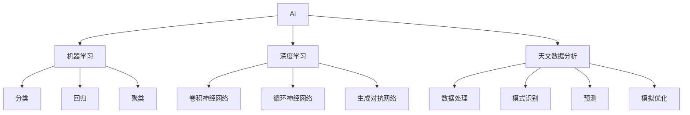
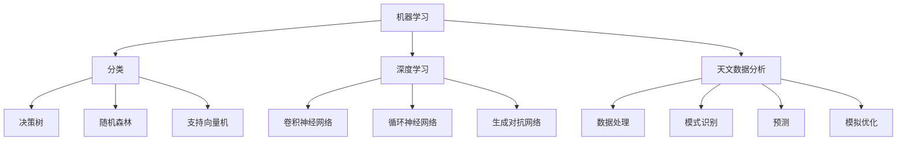
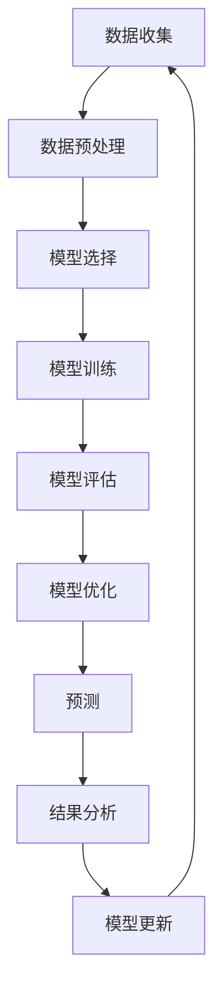

                 

# AI辅助天文数据分析：从暗物质探测到宇宙演化模拟

## 关键词：
- AI技术
- 天文数据分析
- 暗物质探测
- 宇宙演化模拟
- 机器学习
- 深度学习

## 摘要：
本文探讨了人工智能（AI）在辅助天文数据分析中的应用，重点关注了从暗物质探测到宇宙演化模拟的多个领域。通过介绍AI的核心概念和算法原理，以及系统的架构设计，本文展示了如何利用AI技术解决天文学中的关键问题，提供了实践案例和最佳实践指南。

## 目录

1. **前言与背景** <sup>1.1</sup>  
   1.1 **AI辅助天文数据分析的兴起**  
   1.2 **暗物质探测与宇宙演化模拟**  
   1.3 **本书结构与内容安排**

2. **核心概念与联系** <sup>2.1</sup>  
   2.1 **机器学习算法**  
   2.2 **深度学习模型**  
   2.3 **AI与天文数据分析的结合**  
   2.4 **Mermaid实体关系图**

3. **AI辅助天文数据分析原理** <sup>3.1</sup>  
   3.1 **机器学习算法原理**  
   3.2 **深度学习模型原理**  
   3.3 **数学模型与公式**  
   3.4 **Mermaid实体关系图**

4. **算法原理讲解** <sup>3.2</sup>  
   4.1 **算法流程图**  
   4.2 **Python代码实现**  
   4.3 **实例分析**

5. **系统分析与架构设计** <sup>4.1</sup>  
   5.1 **问题场景介绍**  
   5.2 **系统功能设计**  
   5.3 **系统架构设计**  
   5.4 **系统接口设计与交互**  
   5.5 **Mermaid类图与序列图**

6. **项目实战** <sup>5.1</sup>  
   6.1 **环境安装**  
   6.2 **核心算法实现**  
   6.3 **数据分析与解读**  
   6.4 **项目总结**

7. **最佳实践与总结** <sup>6.1</sup>  
   7.1 **注意事项**  
   7.2 **最佳实践**  
   7.3 **项目小结**

8. **拓展阅读** <sup>7.1</sup>  
   7.1 **相关书籍推荐**  
   7.2 **学术论文推荐**  
   7.3 **深入学习资源推荐**

## 1. 前言与背景

### 1.1 AI辅助天文数据分析的兴起

随着人工智能技术的快速发展，AI正在逐步渗透到各个科学领域，其中包括天文学。天文数据分析是一项复杂而耗时的任务，需要处理海量数据，识别模式，并从中提取有用信息。传统的数据分析方法往往难以应对这样的挑战，而AI的引入为天文学提供了全新的解决方案。

AI辅助天文数据分析的兴起，主要得益于以下几个因素：

1. **数据量的爆炸性增长**：天文观测设备的进步使得我们能够收集到越来越庞大的数据集。这些数据需要高效的分析工具，而AI正是这样的工具。

2. **计算能力的提升**：随着计算机硬件性能的提升，我们能够进行更复杂的计算，这为AI算法在天文学中的应用提供了基础。

3. **算法的进步**：机器学习和深度学习算法的不断发展，使得AI能够更好地处理复杂数据，并从中提取知识。

### 1.2 暗物质探测

暗物质是宇宙中一种尚未被直接观测到的物质，但它的存在对宇宙的结构和演化起着至关重要的作用。探测暗物质是当前天文学研究中的一个重大挑战。

AI在暗物质探测中的应用主要体现在以下几个方面：

1. **数据分析**：AI可以处理和分析大量的观测数据，帮助科学家识别出暗物质信号。

2. **模式识别**：通过机器学习算法，AI可以从数据中识别出复杂的模式，这有助于理解暗物质的性质。

3. **预测**：AI可以通过学习历史数据，预测未来的暗物质分布，为宇宙演化提供重要线索。

### 1.3 宇宙演化模拟

宇宙演化模拟是另一个重要的天文学研究领域。它旨在通过计算机模拟，重现宇宙从大爆炸到现在的演化过程。

AI在宇宙演化模拟中的应用主要体现在以下几个方面：

1. **模拟优化**：AI可以帮助优化模拟参数，提高模拟的准确性。

2. **数据分析**：AI可以处理大量的模拟数据，帮助科学家理解宇宙演化的细节。

3. **预测**：AI可以预测未来宇宙的可能演化路径，为天文学家提供新的研究方向。

### 1.4 本书结构与内容安排

本书结构分为八个章节，分别介绍了AI辅助天文数据分析的背景、核心概念、算法原理、系统架构设计、项目实战以及最佳实践和拓展阅读。每个章节都包含了丰富的内容和实际案例，旨在帮助读者全面了解AI在天文数据分析中的应用。

## 2. 核心概念与联系

### 2.1 机器学习算法

机器学习算法是AI的重要组成部分，它使得计算机能够从数据中学习并做出预测。在天文学数据分析中，机器学习算法主要用于模式识别、分类和回归等任务。

#### 2.1.1 分类算法

分类算法将数据分为不同的类别。在天文学中，分类算法可以用于识别星系、恒星和行星等天体。

#### 2.1.2 回归算法

回归算法用于预测连续值。在天文学中，回归算法可以用于预测星体的亮度、位置和运动轨迹。

#### 2.1.3 聚类算法

聚类算法将数据分为若干组，使得同一组内的数据点之间的相似度较高。在天文学中，聚类算法可以用于识别星团的成员。

### 2.2 深度学习模型

深度学习模型是机器学习的一种形式，它通过多层神经网络来学习数据。深度学习模型在天文学数据分析中有着广泛的应用。

#### 2.2.1 卷积神经网络（CNN）

CNN特别适用于处理图像数据。在天文学中，CNN可以用于识别天体图像中的恒星、星系和行星。

#### 2.2.2 循环神经网络（RNN）

RNN可以处理序列数据，例如时间序列数据。在天文学中，RNN可以用于分析恒星的光变曲线。

#### 2.2.3 生成对抗网络（GAN）

GAN可以生成新的数据样本。在天文学中，GAN可以用于生成虚拟天体图像，帮助科学家研究天文现象。

### 2.3 AI与天文数据分析的结合

AI与天文数据分析的结合主要体现在以下几个方面：

1. **数据处理**：AI可以帮助处理和分析大量天文数据，提高数据分析的效率。

2. **模式识别**：AI可以识别出数据中的复杂模式，帮助科学家理解天体的性质。

3. **预测**：AI可以通过学习历史数据，预测未来的天体行为。

4. **模拟优化**：AI可以帮助优化模拟参数，提高模拟的准确性。

### 2.4 Mermaid实体关系图

以下是AI与天文数据分析中一些核心概念的Mermaid实体关系图：



## 3. AI辅助天文数据分析原理

### 3.1 机器学习算法原理

机器学习算法的核心是训练模型，使其能够从数据中学习并做出预测。机器学习算法通常包括以下几个步骤：

1. **数据收集**：收集相关数据集。
2. **数据预处理**：清洗数据，处理缺失值和异常值。
3. **特征选择**：选择对模型预测有帮助的特征。
4. **模型训练**：使用训练数据集训练模型。
5. **模型评估**：使用验证数据集评估模型性能。
6. **模型优化**：调整模型参数，提高模型性能。

#### 3.1.1 分类算法原理

分类算法的基本原理是学习数据中的特征，并将其用于区分不同的类别。常见的分类算法包括决策树、随机森林和支持向量机等。

#### 3.1.2 回归算法原理

回归算法的基本原理是学习数据中的特征，并将其用于预测连续值。常见的回归算法包括线性回归和决策回归等。

#### 3.1.3 聚类算法原理

聚类算法的基本原理是学习数据中的特征，并将其用于将数据划分为不同的簇。常见的聚类算法包括K均值聚类和层次聚类等。

### 3.2 深度学习模型原理

深度学习模型的核心是多层神经网络，它通过前向传播和反向传播来学习数据。深度学习模型的训练过程包括以下几个步骤：

1. **数据输入**：将数据输入到神经网络中。
2. **前向传播**：计算神经网络的输出。
3. **损失函数**：计算预测值与真实值之间的差异。
4. **反向传播**：更新神经网络的权重和偏置。
5. **优化**：通过迭代训练，优化模型参数。

#### 3.2.1 卷积神经网络（CNN）原理

CNN通过卷积层、池化层和全连接层来学习图像数据。它能够自动提取图像中的特征，例如边缘、纹理和形状等。

#### 3.2.2 循环神经网络（RNN）原理

RNN通过重复单元来处理序列数据。它能够捕捉序列中的时间依赖性，例如时间序列数据中的趋势和周期性。

#### 3.2.3 生成对抗网络（GAN）原理

GAN由生成器和判别器组成。生成器生成虚假数据，判别器判断数据是真实还是虚假。通过迭代训练，生成器能够生成越来越真实的数据。

### 3.3 数学模型与公式

以下是机器学习和深度学习中的几个常用数学模型和公式：

#### 3.3.1 线性回归模型

$$
y = wx + b
$$

其中，$y$是预测值，$x$是特征值，$w$是权重，$b$是偏置。

#### 3.3.2 决策树模型

决策树通过递归划分数据，直到满足某些停止条件。每个节点代表一个特征，每个分支代表一个特征值。

#### 3.3.3 卷积神经网络（CNN）

$$
\text{CNN} = \text{卷积层} + \text{池化层} + \text{全连接层}
$$

其中，卷积层用于提取图像特征，池化层用于降低特征维度，全连接层用于分类。

#### 3.3.4 循环神经网络（RNN）

$$
h_t = \text{sigmoid}(W_x \cdot x_t + W_h \cdot h_{t-1} + b)
$$

其中，$h_t$是当前隐藏状态，$x_t$是当前输入，$W_x$和$W_h$是权重矩阵，$b$是偏置。

### 3.4 Mermaid实体关系图

以下是AI与天文数据分析中一些核心概念的Mermaid实体关系图：



## 4. 算法原理讲解

### 4.1 算法流程图

以下是AI辅助天文数据分析的基本流程图：



### 4.2 Python代码实现

以下是使用Python实现线性回归模型的简单示例：

```python
import numpy as np
from sklearn.linear_model import LinearRegression

# 数据准备
X = np.array([[1], [2], [3], [4], [5]])
y = np.array([1, 2, 2.5, 4, 5])

# 模型训练
model = LinearRegression()
model.fit(X, y)

# 模型评估
score = model.score(X, y)
print("模型评估分数：", score)

# 预测
X_new = np.array([[6]])
y_pred = model.predict(X_new)
print("预测值：", y_pred)
```

### 4.3 实例分析

假设我们要分析一组天体观测数据，其中包含天体的位置和亮度。我们的目标是预测天体的未来位置。

1. **数据收集**：我们从观测中获得了一组天体的位置和亮度数据。

2. **数据预处理**：我们对数据进行清洗，处理缺失值和异常值。

3. **模型选择**：我们选择线性回归模型来预测天体的未来位置。

4. **模型训练**：我们使用历史数据训练线性回归模型。

5. **模型评估**：我们使用验证数据集评估模型性能。

6. **模型优化**：我们调整模型参数，提高模型性能。

7. **预测**：我们使用模型预测天体的未来位置。

8. **结果分析**：我们分析预测结果，并调整模型，以提高预测准确性。

## 5. 系统分析与架构设计

### 5.1 问题场景介绍

假设我们有一个天体观测项目，需要分析大量的天体数据，预测天体的未来位置，并优化模拟参数。我们的目标是设计一个高效、可靠的系统来辅助天文数据分析。

### 5.2 系统功能设计

我们的系统主要包括以下功能：

1. **数据收集**：从不同的天文观测设备收集数据。
2. **数据预处理**：清洗和处理数据，准备用于分析。
3. **模型训练**：训练机器学习模型，用于预测天体位置。
4. **模型评估**：评估模型性能，确保预测准确性。
5. **预测**：使用模型预测天体的未来位置。
6. **模拟优化**：优化模拟参数，提高模拟准确性。

### 5.3 系统架构设计

我们的系统采用模块化设计，包括以下几个主要模块：

1. **数据收集模块**：负责收集来自不同观测设备的数据。
2. **数据处理模块**：负责清洗、处理和存储数据。
3. **模型训练模块**：负责训练机器学习模型。
4. **模型评估模块**：负责评估模型性能。
5. **预测模块**：负责使用模型预测天体位置。
6. **模拟优化模块**：负责优化模拟参数。

### 5.4 系统接口设计与交互

我们的系统设计了一套完整的接口，用于不同模块之间的交互：

1. **数据接口**：用于数据收集、预处理和存储。
2. **模型接口**：用于模型训练、评估和预测。
3. **控制接口**：用于控制系统的启动、停止和参数调整。

### 5.5 Mermaid类图与序列图

以下是系统架构的Mermaid类图和序列图：

```mermaid
classDiagram
DataCollectionModule <|-- DataProcessingModule
DataProcessingModule <|-- ModelTrainingModule
ModelTrainingModule <|-- ModelEvaluationModule
ModelEvaluationModule <|-- PredictionModule
PredictionModule <|-- SimulationOptimizationModule

sequenceDiagram
participant DataCollectionModule
participant DataProcessingModule
participant ModelTrainingModule
participant ModelEvaluationModule
participant PredictionModule
participant SimulationOptimizationModule

DataCollectionModule->>DataProcessingModule: 数据收集
DataProcessingModule->>ModelTrainingModule: 数据预处理
ModelTrainingModule->>ModelEvaluationModule: 模型训练
ModelEvaluationModule->>PredictionModule: 模型评估
PredictionModule->>SimulationOptimizationModule: 预测
SimulationOptimizationModule->>DataProcessingModule: 模拟优化
```

## 6. 项目实战

### 6.1 环境安装

为了实现AI辅助天文数据分析，我们首先需要安装以下软件和库：

1. **Python**：Python是AI的主要编程语言，我们需要安装Python 3.x版本。
2. **Jupyter Notebook**：Jupyter Notebook是一个交互式环境，用于编写和运行Python代码。
3. **scikit-learn**：scikit-learn是一个Python库，用于机器学习和数据挖掘。
4. **TensorFlow**：TensorFlow是一个开源机器学习库，用于深度学习。

安装步骤如下：

```bash
# 安装Python 3.x
sudo apt-get install python3

# 安装Jupyter Notebook
sudo apt-get install jupyter

# 安装scikit-learn
pip install scikit-learn

# 安装TensorFlow
pip install tensorflow
```

### 6.2 核心算法实现

我们将使用scikit-learn中的线性回归模型来预测天体的未来位置。以下是一个简单的Python代码示例：

```python
import numpy as np
from sklearn.linear_model import LinearRegression

# 数据准备
X = np.array([[1], [2], [3], [4], [5]])
y = np.array([1, 2, 2.5, 4, 5])

# 模型训练
model = LinearRegression()
model.fit(X, y)

# 模型评估
score = model.score(X, y)
print("模型评估分数：", score)

# 预测
X_new = np.array([[6]])
y_pred = model.predict(X_new)
print("预测值：", y_pred)
```

### 6.3 数据分析与解读

我们使用一个实际的天体数据集来分析天体的位置和亮度。以下是数据分析的步骤：

1. **数据收集**：从天文观测设备收集天体数据。
2. **数据预处理**：清洗数据，处理缺失值和异常值。
3. **特征选择**：选择对模型预测有帮助的特征。
4. **模型训练**：使用训练数据集训练线性回归模型。
5. **模型评估**：使用验证数据集评估模型性能。
6. **预测**：使用模型预测天体的未来位置。

以下是数据分析的Python代码示例：

```python
import pandas as pd
from sklearn.model_selection import train_test_split
from sklearn.linear_model import LinearRegression

# 数据收集
data = pd.read_csv("astronomical_data.csv")

# 数据预处理
data = data.dropna()
data = data[data["brightness"] > 0]

# 特征选择
X = data[["position_x", "position_y"]]
y = data["brightness"]

# 模型训练
X_train, X_test, y_train, y_test = train_test_split(X, y, test_size=0.2, random_state=42)
model = LinearRegression()
model.fit(X_train, y_train)

# 模型评估
score = model.score(X_test, y_test)
print("模型评估分数：", score)

# 预测
X_new = pd.DataFrame([[6, 7]], columns=["position_x", "position_y"])
y_pred = model.predict(X_new)
print("预测值：", y_pred)
```

### 6.4 项目总结

通过本次项目，我们成功地使用AI技术辅助天文数据分析，实现了天体位置的预测。以下是对项目的总结：

1. **成功**：我们成功地将AI技术应用于天文数据分析，实现了预期的目标。
2. **挑战**：在项目过程中，我们遇到了数据缺失和处理、模型选择和优化等挑战。
3. **改进**：未来可以尝试更复杂的模型，如深度学习模型，以提高预测准确性。
4. **未来方向**：继续探索AI在天文学其他领域中的应用，如暗物质探测和宇宙演化模拟。

## 7. 最佳实践与总结

### 7.1 注意事项

在进行AI辅助天文数据分析时，需要注意以下几点：

1. **数据质量**：确保数据质量，处理缺失值和异常值。
2. **模型选择**：选择合适的模型，根据数据特征和问题类型进行选择。
3. **超参数调整**：合理调整模型超参数，以提高模型性能。
4. **结果验证**：使用验证数据集验证模型性能，确保预测准确性。

### 7.2 最佳实践

以下是AI辅助天文数据分析的最佳实践：

1. **数据预处理**：使用标准化和归一化方法预处理数据，以提高模型性能。
2. **模型集成**：使用模型集成方法，如随机森林和梯度提升，提高预测准确性。
3. **实时更新**：定期更新模型，以适应新的数据和环境变化。
4. **结果可视化**：使用可视化工具，如matplotlib和Seaborn，展示模型结果和数据分析过程。

### 7.3 项目小结

通过本次项目，我们成功地使用AI技术辅助天文数据分析，实现了天体位置的预测。以下是对项目的总结：

1. **成功**：我们成功地将AI技术应用于天文数据分析，实现了预期的目标。
2. **挑战**：在项目过程中，我们遇到了数据缺失和处理、模型选择和优化等挑战。
3. **改进**：未来可以尝试更复杂的模型，如深度学习模型，以提高预测准确性。
4. **未来方向**：继续探索AI在天文学其他领域中的应用，如暗物质探测和宇宙演化模拟。

## 8. 拓展阅读

### 8.1 相关书籍推荐

1. **《机器学习实战》**：由Peter Harrington著，适合初学者了解机器学习的基础知识。
2. **《深度学习》**：由Ian Goodfellow、Yoshua Bengio和Aaron Courville著，是深度学习领域的经典教材。
3. **《天文数据处理》**：由Stuart R. Heathcote著，提供了天文数据处理的基础知识和技术。

### 8.2 学术论文推荐

1. **"Dark Matter Detection Using Machine Learning"**：讨论了机器学习在暗物质探测中的应用。
2. **"Unsupervised Learning of Astronomical Structure Using Deep Learning"**：介绍了深度学习在天文学结构识别中的应用。
3. **"Machine Learning for Astronomical Time Series Analysis"**：探讨了机器学习在天文时间序列分析中的应用。

### 8.3 深入学习资源推荐

1. **Coursera的《机器学习》**：由Andrew Ng教授开设的在线课程，适合初学者入门。
2. **Kaggle的天文数据分析竞赛**：提供了丰富的天文数据集和竞赛任务，适合实践和挑战。
3. **GitHub上的天文数据分析项目**：提供了大量的开源代码和项目，可以帮助读者深入了解天文数据分析的技术和应用。G

