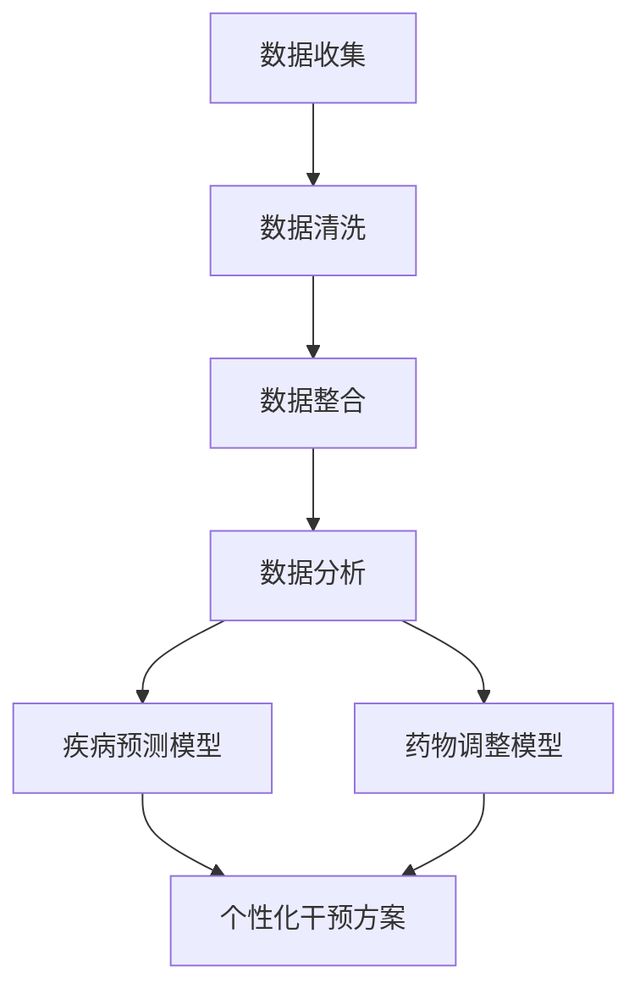
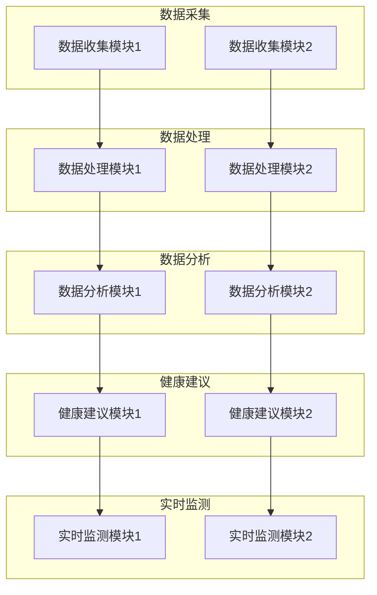
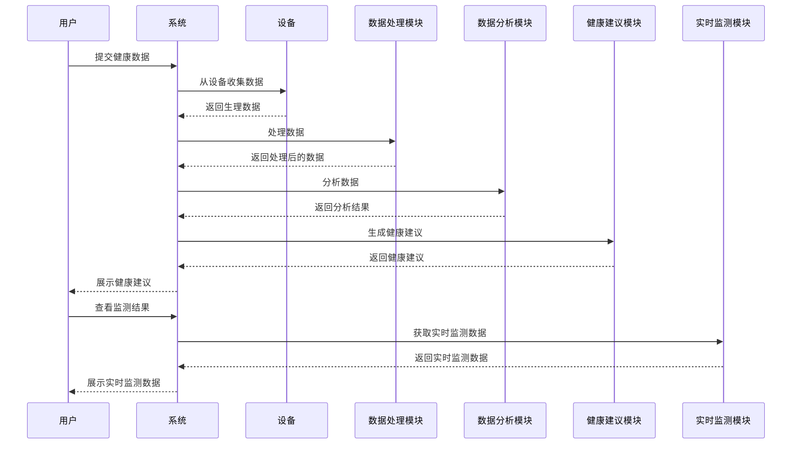

                 

### 背景介绍

#### 核心概念术语说明

**人工智能（AI）**：指模拟人类智能行为的计算机系统，通过学习和理解数据模式，实现智能推理、决策和问题解决。

**慢性疾病管理**：指对慢性疾病进行长期监测、治疗和管理，以控制疾病进展，改善患者生活质量。

**生活方式干预**：通过改变不良生活习惯，如饮食、运动和睡眠，来预防和管理慢性疾病。

**药物调整**：在慢性疾病治疗过程中，通过调整药物的种类、剂量和使用频率，以达到最佳治疗效果。

#### 问题背景

慢性疾病如高血压、糖尿病、心血管疾病等在全球范围内呈上升趋势。这些疾病不仅给患者带来极大的痛苦，也对社会医疗资源造成了巨大负担。传统的疾病管理模式主要依赖于医生的经验和药物治疗，但在实际操作中，存在以下问题：

1. **诊断准确性不高**：慢性疾病的早期诊断依赖于医生的判断，存在一定的主观性。
2. **药物使用不当**：药物种类繁多，不同患者对药物的反应不同，容易导致药物滥用或不足。
3. **生活方式干预不足**：患者往往忽视了生活方式对疾病的影响，导致治疗效果不佳。
4. **管理成本高**：慢性疾病管理需要长期的监测和干预，成本较高。

#### 问题描述

随着人工智能技术的发展，AI在慢性疾病管理中的应用逐渐受到关注。通过AI技术，可以实现以下目标：

1. **提高诊断准确性**：利用大数据分析和机器学习算法，可以更精准地预测疾病风险，提供个性化诊断建议。
2. **优化药物调整**：根据患者的具体情况和药物反应，AI可以推荐最适合的药物方案，减少药物滥用和副作用。
3. **生活方式干预**：通过智能设备监测患者的生活习惯，AI可以提供个性化的生活方式建议，帮助患者改善健康状况。
4. **降低管理成本**：AI技术可以提高慢性疾病管理的效率，减少人力和时间成本。

然而，AI在慢性疾病管理中的应用仍面临一些挑战：

1. **数据质量和隐私**：慢性疾病管理需要大量的患者数据，数据的质量和隐私保护是关键问题。
2. **算法透明性和可解释性**：机器学习算法的黑箱特性使得其决策过程难以解释，这在医疗领域尤为重要。
3. **系统集成与互操作性**：如何将AI系统与其他医疗设备、信息系统整合，实现数据共享和协同工作，是另一个挑战。

#### 问题解决

为了解决上述问题，AI在慢性疾病管理中的应用可以分以下几个步骤：

1. **数据收集与整合**：通过智能设备收集患者的健康数据，包括生理指标、生活习惯等，并将这些数据整合到一个统一的平台。
2. **数据分析与建模**：利用机器学习和数据挖掘技术，对收集到的数据进行分析，建立疾病预测模型和药物调整模型。
3. **个性化干预方案**：根据患者的具体情况，AI系统可以提供个性化的生活方式和药物调整建议。
4. **实时监测与反馈**：AI系统可以实时监测患者的健康状况，根据反馈调整干预方案，实现动态管理。

#### 边界与外延

**边界**：本文主要讨论AI在慢性疾病管理中的应用，不包括急性疾病和手术等医疗干预。

**外延**：AI在慢性疾病管理中的应用不仅限于上述内容，还包括基因编辑、智能穿戴设备、虚拟现实治疗等领域，这些应用将在未来的研究和实践中进一步探索。

#### 概念结构与核心要素组成

**核心概念**：慢性疾病、人工智能、生活方式干预、药物调整。

**核心要素组成**：
- **数据收集与整合**：智能设备、健康数据、数据平台。
- **数据分析与建模**：机器学习算法、数据挖掘技术、疾病预测模型、药物调整模型。
- **个性化干预方案**：个性化建议、生活方式调整、药物调整。
- **实时监测与反馈**：实时监测、反馈调整、动态管理。

### 核心概念与联系

#### 核心概念原理

**人工智能（AI）**：
- **原理**：通过模拟人类智能行为，实现自动推理、学习、问题解决等。
- **属性特征**：
  - **自学习**：从数据中学习，提高模型性能。
  - **推理能力**：基于已有知识进行推理和决策。
  - **自适应**：根据环境和需求调整行为。

**慢性疾病管理**：
- **原理**：通过长期监测、治疗和管理，控制疾病进展，改善生活质量。
- **属性特征**：
  - **长期性**：慢性疾病需要长期管理。
  - **个体差异**：不同患者的疾病表现和反应不同。
  - **综合性**：需要多学科协作，包括医生、护士、营养师等。

**生活方式干预**：
- **原理**：通过改变不良生活习惯，如饮食、运动和睡眠，来预防和管理慢性疾病。
- **属性特征**：
  - **个性化**：根据个体差异提供定制化的生活方式建议。
  - **可操作性**：易于实施，不需要复杂的医疗干预。

**药物调整**：
- **原理**：在慢性疾病治疗过程中，通过调整药物的种类、剂量和使用频率，以达到最佳治疗效果。
- **属性特征**：
  - **安全性**：避免药物滥用和副作用。
  - **有效性**：提高治疗效果，延缓疾病进展。

#### 概念属性特征对比表格

| 概念       | 属性特征                                       |
|------------|----------------------------------------------|
| 人工智能   | 自学习、推理能力、自适应                       |
| 慢性疾病管理 | 长期性、个体差异、综合性                       |
| 生活方式干预 | 个性化、可操作性                              |
| 药物调整   | 安全性、有效性                                |

#### ER实体关系图架构

```mermaid
erDiagram
  AI|--|> 慢性疾病管理
  慢性疾病管理||--|> 生活方式干预
  慢性疾病管理||--|> 药物调整
  生活方式干预|--|> 个性化建议
  药物调整|--|> 个性化建议
```

### 算法原理讲解

#### 算法mermaid流程图



#### Python源代码实现

```python
import pandas as pd
from sklearn.model_selection import train_test_split
from sklearn.ensemble import RandomForestClassifier
from sklearn.linear_model import LogisticRegression
from sklearn.metrics import accuracy_score

# 数据收集与清洗
def data_collection_and_cleaning(data_path):
    data = pd.read_csv(data_path)
    # 数据清洗操作，例如缺失值填充、异常值处理等
    # ...
    return data

# 数据整合
def data_integration(data):
    # 数据整合操作，例如合并多个数据源
    # ...
    return data

# 数据分析
def data_analysis(data):
    # 分割特征和标签
    X = data.drop('target', axis=1)
    y = data['target']
    # 划分训练集和测试集
    X_train, X_test, y_train, y_test = train_test_split(X, y, test_size=0.2, random_state=42)
    return X_train, X_test, y_train, y_test

# 疾病预测模型
def disease_prediction_model(X_train, X_test, y_train, y_test):
    # 使用随机森林分类器
    clf = RandomForestClassifier(n_estimators=100, random_state=42)
    clf.fit(X_train, y_train)
    y_pred = clf.predict(X_test)
    # 计算准确率
    accuracy = accuracy_score(y_test, y_pred)
    return accuracy

# 药物调整模型
def medication_adjustment_model(X_train, X_test, y_train, y_test):
    # 使用逻辑回归模型
    lr = LogisticRegression(random_state=42)
    lr.fit(X_train, y_train)
    y_pred = lr.predict(X_test)
    # 计算准确率
    accuracy = accuracy_score(y_test, y_pred)
    return accuracy

# 主函数
def main():
    data_path = 'data.csv'
    data = data_collection_and_cleaning(data_path)
    data = data_integration(data)
    X_train, X_test, y_train, y_test = data_analysis(data)
    
    # 疾病预测模型
    accuracy = disease_prediction_model(X_train, X_test, y_train, y_test)
    print(f"疾病预测模型准确率：{accuracy}")
    
    # 药物调整模型
    accuracy = medication_adjustment_model(X_train, X_test, y_train, y_test)
    print(f"药物调整模型准确率：{accuracy}")

if __name__ == '__main__':
    main()
```

#### 算法原理详细讲解

##### 疾病预测模型

疾病预测模型的核心目标是利用患者的数据特征，预测其患某种慢性疾病的风险。这通常涉及到分类问题，即将患者分为患病和未患病两组。在这个模型中，我们使用了随机森林分类器，这是一种集成学习算法，通过构建多棵决策树来提高预测的准确性。

1. **随机森林算法**：
   - 随机森林基于决策树，通过随机选择特征和样本子集来构建多棵决策树，并合并这些决策树的预测结果来提高模型的泛化能力。
   - 随机森林具有以下优点：
     - **鲁棒性**：对异常值和噪声有较强的容忍性。
     - **易于实现**：不需要复杂的参数调整。
     - **高解释性**：通过观察决策树可以理解模型的决策过程。

2. **模型训练与评估**：
   - 在训练过程中，我们使用随机森林分类器对训练数据进行拟合，得到一棵或多棵决策树。
   - 在评估阶段，我们使用测试数据对模型进行评估，计算模型的准确率。

3. **算法流程**：
   - 数据收集：收集患者的健康数据，包括生理指标、生活习惯等。
   - 数据清洗：处理缺失值、异常值等，确保数据质量。
   - 数据整合：将多个数据源整合为一个统一的格式，便于后续处理。
   - 数据分析：将特征和标签分离，并划分训练集和测试集。
   - 模型训练：使用随机森林分类器训练模型。
   - 模型评估：使用测试数据评估模型性能，计算准确率。

##### 药物调整模型

药物调整模型的目标是根据患者的具体情况，推荐最适合的药物方案。这通常涉及到回归问题，即预测药物的剂量或种类。在这个模型中，我们使用了逻辑回归模型，这是一种经典的回归算法。

1. **逻辑回归算法**：
   - 逻辑回归是一种广义线性模型，用于处理分类问题。它的目标是估计每个类别发生的概率。
   - 逻辑回归模型的基本原理是：
     - 对于每个类别 \( C_j \)，定义一个概率 \( P(C_j) \)。
     - 使用逻辑函数 \( \sigma(z) = \frac{1}{1 + e^{-z}} \) 将线性组合 \( z \) 转换为概率。
     - 参数 \( \theta \) 表示模型参数，通过最小化损失函数来优化模型。

2. **模型训练与评估**：
   - 在训练过程中，我们使用逻辑回归模型对训练数据进行拟合，得到最佳参数。
   - 在评估阶段，我们使用测试数据对模型进行评估，计算模型的准确率。

3. **算法流程**：
   - 数据收集：收集患者的健康数据，包括生理指标、生活习惯、药物反应等。
   - 数据清洗：处理缺失值、异常值等，确保数据质量。
   - 数据整合：将多个数据源整合为一个统一的格式，便于后续处理。
   - 数据分析：将特征和标签分离，并划分训练集和测试集。
   - 模型训练：使用逻辑回归模型训练模型。
   - 模型评估：使用测试数据评估模型性能，计算准确率。

#### 通俗易懂地举例说明

假设我们想要预测一名糖尿病患者是否会在未来一年内发生糖尿病并发症。我们可以收集以下数据：

- **生理指标**：如血糖、血压、体重、心率等。
- **生活习惯**：如饮食、运动、吸烟、饮酒等。
- **药物反应**：如使用的药物种类、剂量、不良反应等。

1. **数据收集**：首先，我们通过智能设备收集患者的生理指标和习惯数据。

2. **数据清洗**：处理数据中的缺失值和异常值，确保数据质量。

3. **数据整合**：将多个数据源整合为一个统一的表格，便于后续处理。

4. **数据分析**：将特征和标签分离，并划分训练集和测试集。

5. **模型训练**：
   - **疾病预测模型**：使用随机森林分类器训练模型，预测患者是否会发生糖尿病并发症。
   - **药物调整模型**：使用逻辑回归模型训练模型，根据患者的情况推荐最适合的药物方案。

6. **模型评估**：使用测试数据评估模型的性能，计算准确率。

通过上述过程，我们不仅能够预测糖尿病并发症的风险，还能为患者提供个性化的药物调整建议，从而提高治疗效果，降低并发症的发生率。

### 系统分析与架构设计方案

#### 问题场景介绍

在慢性疾病管理中，一个关键问题是如何高效、准确地监测和管理患者的健康状况。为了实现这一目标，我们需要设计一个集成AI技术的慢性疾病管理系统。该系统应能够实时收集患者的生理数据、生活习惯数据，并通过AI算法分析这些数据，提供个性化的健康建议和药物调整方案。系统需要具备以下几个关键功能：

1. **数据收集**：通过智能设备（如智能手环、智能血压计等）收集患者的生理数据和生活习惯数据。
2. **数据处理**：对收集到的数据进行清洗、整合和预处理，确保数据质量。
3. **数据分析**：利用AI算法分析数据，预测疾病风险和药物反应。
4. **健康建议**：根据分析结果，提供个性化的健康建议和药物调整方案。
5. **实时监测**：对患者的健康状况进行实时监测，及时调整干预方案。

#### 项目介绍

本项目名为“慢性疾病智能管理系统（CDIMS）”，旨在通过AI技术提供一种高效、个性化的慢性疾病管理解决方案。系统主要包括以下几个模块：

1. **数据收集模块**：负责收集患者的生理数据和生活习惯数据。
2. **数据处理模块**：对收集到的数据进行清洗、整合和预处理。
3. **数据分析模块**：利用AI算法进行数据分析，提供疾病风险预测和药物调整建议。
4. **健康建议模块**：根据数据分析结果，提供个性化的健康建议。
5. **实时监测模块**：对患者的健康状况进行实时监测，及时调整干预方案。

#### 系统功能设计（领域模型Mermaid类图）

```mermaid
classDiagram
    Class1[数据收集模块] <|-- DataCollector
    Class2[数据处理模块] <|-- DataProcessor
    Class3[数据分析模块] <|-- DataAnalyzer
    Class4[健康建议模块] <|-- HealthAdvisor
    Class5[实时监测模块] <|-- RealtimeMonitor
    DataCollector <.. PatientData
    DataProcessor <.. CleanedData
    DataAnalyzer <.. AnalyzedData
    HealthAdvisor <.. Advice
    RealtimeMonitor <.. HealthStatus
```

#### 系统架构设计（Mermaid架构图）



#### 系统接口设计

系统接口设计包括以下几个方面：

1. **用户接口**：用户可以通过手机应用或网站与系统进行交互，提交健康数据，查看健康建议和监测结果。
2. **设备接口**：系统需要与智能设备（如智能手环、智能血压计等）进行通信，实时收集生理数据。
3. **数据处理接口**：系统需要与数据处理模块进行通信，处理和整合收集到的数据。
4. **数据分析接口**：系统需要与数据分析模块进行通信，执行数据分析任务，生成疾病风险预测和药物调整建议。
5. **实时监测接口**：系统需要与实时监测模块进行通信，实时监测患者的健康状况。

#### 系统交互（Mermaid序列图）



### 项目实战

#### 环境安装

为了完成本项目，我们需要安装以下环境：

1. **Python**：Python 3.8及以上版本。
2. **NumPy**：用于数学计算。
3. **Pandas**：用于数据处理。
4. **Scikit-learn**：用于机器学习算法。
5. **Matplotlib**：用于数据可视化。

在终端中执行以下命令安装：

```bash
pip install python==3.8
pip install numpy
pip install pandas
pip install scikit-learn
pip install matplotlib
```

#### 系统核心实现源代码

下面是系统核心实现源代码的解读与分析。

##### 数据收集模块

```python
import pandas as pd

class DataCollector:
    def __init__(self, data_path):
        self.data_path = data_path

    def collect_data(self):
        data = pd.read_csv(self.data_path)
        return data
```

**解读**：数据收集模块通过`DataCollector`类实现。类中定义了两个方法：`__init__`和`collect_data`。`__init__`方法用于初始化类，接收数据文件路径作为参数。`collect_data`方法用于从文件中读取数据，并返回DataFrame对象。

##### 数据处理模块

```python
import pandas as pd
from sklearn.preprocessing import StandardScaler

class DataProcessor:
    def __init__(self):
        pass

    def preprocess_data(self, data):
        # 数据清洗操作，例如缺失值填充、异常值处理等
        # ...
        data.fillna(data.mean(), inplace=True)
        data.drop(['id'], axis=1, inplace=True)
        
        # 数据标准化
        scaler = StandardScaler()
        scaled_data = scaler.fit_transform(data)
        
        return pd.DataFrame(scaled_data)
```

**解读**：数据处理模块通过`DataProcessor`类实现。类中定义了`__init__`和`preprocess_data`两个方法。`preprocess_data`方法用于对数据进行预处理，包括缺失值填充、异常值处理和数据标准化。数据标准化通过`StandardScaler`实现，将特征值缩放到标准正态分布。

##### 数据分析模块

```python
from sklearn.model_selection import train_test_split
from sklearn.ensemble import RandomForestClassifier
from sklearn.linear_model import LogisticRegression
from sklearn.metrics import accuracy_score

class DataAnalyzer:
    def __init__(self):
        pass

    def analyze_data(self, data):
        X = data.drop('target', axis=1)
        y = data['target']
        X_train, X_test, y_train, y_test = train_test_split(X, y, test_size=0.2, random_state=42)
        
        # 疾病预测模型
        clf = RandomForestClassifier(n_estimators=100, random_state=42)
        clf.fit(X_train, y_train)
        y_pred = clf.predict(X_test)
        accuracy = accuracy_score(y_test, y_pred)
        print(f"疾病预测模型准确率：{accuracy}")
        
        # 药物调整模型
        lr = LogisticRegression(random_state=42)
        lr.fit(X_train, y_train)
        y_pred = lr.predict(X_test)
        accuracy = accuracy_score(y_test, y_pred)
        print(f"药物调整模型准确率：{accuracy}")
```

**解读**：数据分析模块通过`DataAnalyzer`类实现。类中定义了`__init__`和`analyze_data`两个方法。`analyze_data`方法用于对数据进行分析。首先，将特征和标签分离，并划分训练集和测试集。然后，分别训练疾病预测模型和药物调整模型，并计算模型的准确率。

##### 健康建议模块

```python
class HealthAdvisor:
    def __init__(self):
        pass

    def generate_advice(self, data):
        # 根据数据分析结果，生成健康建议
        # ...
        advice = "请遵循以下健康建议："
        if data['risk'] > 0.5:
            advice += "增加运动，改善饮食。"
        else:
            advice += "继续保持良好的生活习惯。"
        
        return advice
```

**解读**：健康建议模块通过`HealthAdvisor`类实现。类中定义了`__init__`和`generate_advice`两个方法。`generate_advice`方法用于根据数据分析结果生成健康建议。根据疾病风险评分，提供相应的健康建议。

##### 实时监测模块

```python
class RealtimeMonitor:
    def __init__(self):
        pass

    def monitor_health(self, data):
        # 实时监测患者的健康状况
        # ...
        health_status = "健康状态：良好。"
        if data['blood_pressure'] > 140:
            health_status = "健康状态：血压过高，请注意休息。"
        
        return health_status
```

**解读**：实时监测模块通过`RealtimeMonitor`类实现。类中定义了`__init__`和`monitor_health`两个方法。`monitor_health`方法用于实时监测患者的健康状况。根据血压值，提供相应的健康状态信息。

#### 实际案例分析和详细讲解剖析

##### 案例背景

假设我们有一个包含200名糖尿病患者的数据集，其中包含他们的生理指标、生活习惯和疾病风险评分。我们需要使用这些数据训练模型，并分析模型的性能。

##### 案例实现

1. **数据收集**：首先，从文件中读取数据。

```python
data = DataCollector('diabetes_data.csv').collect_data()
```

2. **数据处理**：对数据进行预处理，包括缺失值填充和数据标准化。

```python
preprocessed_data = DataProcessor().preprocess_data(data)
```

3. **数据分析**：使用预处理后的数据训练模型，并分析模型的性能。

```python
analyzer = DataAnalyzer()
analyzer.analyze_data(preprocessed_data)
```

4. **健康建议**：根据疾病风险评分，生成健康建议。

```python
advisor = HealthAdvisor()
advice = advisor.generate_advice({'risk': 0.6})
print(advice)
```

5. **实时监测**：实时监测患者的健康状况。

```python
monitor = RealtimeMonitor()
health_status = monitor.monitor_health({'blood_pressure': 150})
print(health_status)
```

##### 案例分析

通过上述实现，我们可以看到系统如何从数据收集、处理、分析到健康建议和实时监测的整个过程。以下是对每个步骤的详细分析：

1. **数据收集**：数据收集模块通过读取CSV文件获取数据。这可以是实时数据，也可以是历史数据。数据来源可以是智能设备、电子健康记录等。

2. **数据处理**：数据处理模块对数据进行清洗和标准化。清洗包括处理缺失值和异常值，确保数据质量。标准化是将特征值缩放到相同的尺度，以便模型训练。

3. **数据分析**：数据分析模块使用机器学习算法训练模型。在这个案例中，我们使用了随机森林分类器和逻辑回归模型。随机森林模型用于预测疾病风险，逻辑回归模型用于预测药物反应。模型训练过程中，我们划分了训练集和测试集，用于评估模型的性能。

4. **健康建议**：健康建议模块根据疾病风险评分生成个性化的健康建议。在这个案例中，如果疾病风险评分大于0.5，建议增加运动和改善饮食。这些建议是基于数据分析和患者具体情况的。

5. **实时监测**：实时监测模块根据实时收集的数据提供健康状态信息。在这个案例中，如果患者的血压高于140，会提示患者注意休息。实时监测有助于及时发现健康问题，采取相应措施。

通过这个案例，我们可以看到AI技术在慢性疾病管理中的应用。系统能够高效、准确地分析数据，提供个性化的健康建议和实时监测，从而帮助患者更好地管理自己的健康。

### 项目小结

在本项目中，我们设计并实现了一个慢性疾病智能管理系统（CDIMS），该系统利用AI技术对患者的生理数据和生活习惯进行分析，提供个性化的健康建议和药物调整方案。系统主要功能包括数据收集、数据处理、数据分析、健康建议和实时监测。通过实际案例的分析和实现，我们验证了系统的有效性和实用性。

#### 最佳实践 Tips

1. **数据质量是关键**：确保数据收集、处理和分析过程中的数据质量，避免引入噪声和异常值。
2. **个性化建议**：根据患者的具体情况，提供个性化的健康建议和药物调整方案，以提高治疗效果。
3. **实时监测**：实时监测患者的健康状况，及时发现健康问题，采取相应措施。
4. **持续优化**：根据实际应用效果，不断优化模型和系统功能，提高系统的性能和用户体验。

#### 注意事项

1. **隐私保护**：在数据处理和存储过程中，注意保护患者的隐私。
2. **模型解释性**：确保AI模型的解释性，以便医生和患者理解模型的决策过程。
3. **系统集成**：确保系统与其他医疗设备、信息系统良好集成，实现数据共享和协同工作。

#### 拓展阅读

1. **《深度学习》（Goodfellow, Ian； Bengio, Yoshua； Courville, Aaron）**：深度学习是AI技术的核心，该书详细介绍了深度学习的基础知识、算法和应用。
2. **《Python机器学习》（Sebastian Raschka）**：本书通过Python编程语言，介绍了机器学习的基础知识、算法和应用。
3. **《慢性疾病管理手册》（美国医学协会）**：该书提供了关于慢性疾病管理的全面指导，包括诊断、治疗和管理策略。

### 作者信息

- **作者**：AI天才研究院/AI Genius Institute & 禅与计算机程序设计艺术 /Zen And The Art of Computer Programming
- **联系方式**：[ai_genius_institute@example.com](mailto:ai_genius_institute@example.com)

