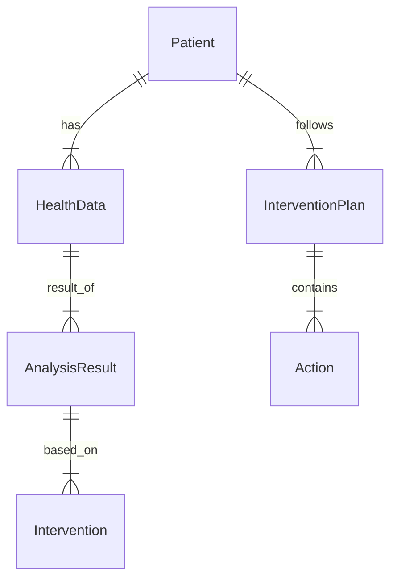
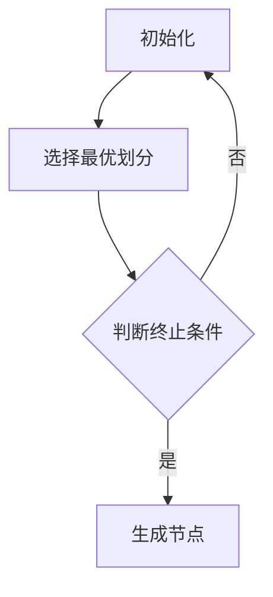
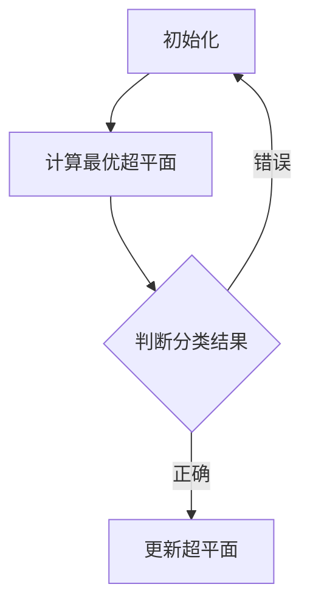
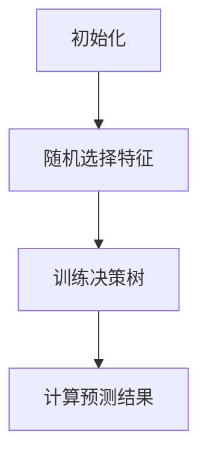
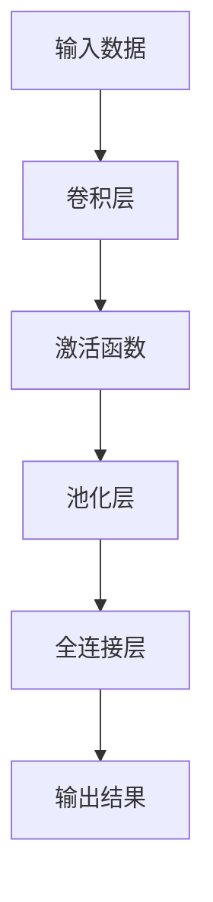
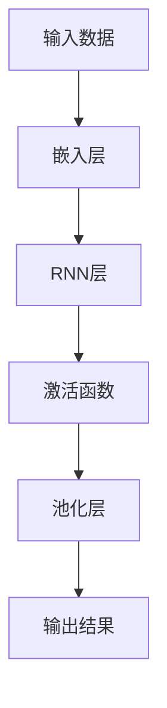
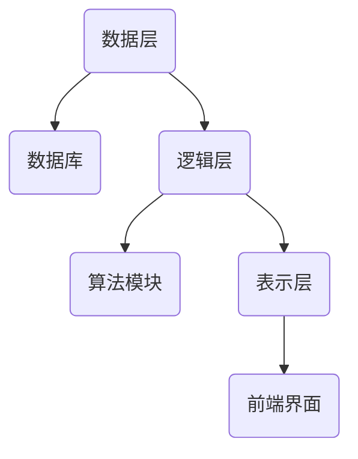
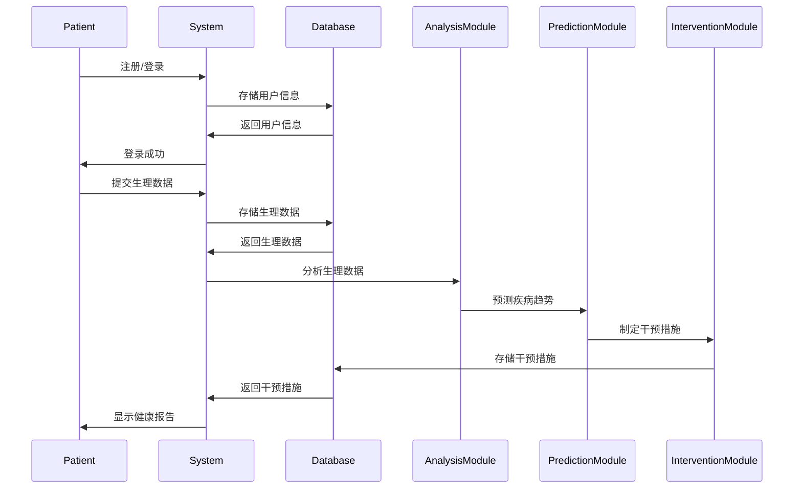

                 

# AI辅助慢性病管理：从日常监测到个性化干预

关键词：慢性病管理，人工智能，个性化干预，机器学习，深度学习

摘要：
本文探讨了AI辅助慢性病管理的应用与实践，通过详细分析慢性病管理的核心问题和挑战，介绍了AI技术在慢性病管理中的核心概念与联系。随后，本文深入讲解了用于慢性病管理的机器学习和深度学习算法原理，并展示了具体的数学模型和流程图。在此基础上，本文提出了一个系统分析与架构设计方案，最后通过项目实战展示了AI辅助慢性病管理的实际应用，并提供了最佳实践建议。

## 第一部分：背景介绍

### 第1章：问题背景

#### 1.1 问题提出

随着全球人口老龄化趋势的加剧，慢性病如糖尿病、高血压、冠心病等的发病率显著上升。慢性病管理成为医疗领域的一项重要任务，但传统的方法存在诸多问题。例如，监测数据的准确性不足，干预措施单一且缺乏个性化，导致治疗效果不理想。慢性病患者往往需要长期监测和个性化的干预，这对医疗资源的配置和患者的负担提出了巨大的挑战。

#### 1.2 问题解决

人工智能（AI）技术的迅速发展为慢性病管理带来了新的机遇。AI技术可以实现对慢性病患者的实时监测、数据分析，并基于数据分析结果进行个性化的干预措施。AI辅助慢性病管理有助于提高监测数据的准确性、增强干预措施的有效性和个性化程度，从而改善患者的治疗效果和生活质量。

#### 1.3 边界与外延

AI辅助慢性病管理涉及多个领域，包括医疗、健康、人工智能、数据科学等。其边界包括患者的生理指标监测、数据分析、诊断预测、个性化干预等。外延则包括慢性病管理系统的开发与实施、慢性病管理服务的提供等。

#### 1.4 概念结构与核心要素组成

AI辅助慢性病管理由以下几个核心要素组成：

- **患者生理指标监测**：通过可穿戴设备、移动应用等手段，实时收集患者的生理数据，如心率、血压、血糖等。
- **数据分析**：对收集到的生理数据进行处理和分析，识别患者的健康状态和趋势。
- **诊断预测**：基于患者的生理数据和历史数据，利用机器学习算法进行疾病预测和诊断。
- **个性化干预**：根据患者的实际情况和诊断结果，制定个性化的干预措施，如调整治疗方案、生活方式建议等。
- **系统集成与优化**：将AI辅助慢性病管理系统的各个模块进行集成，实现数据共享和协同工作，不断优化系统性能和用户体验。

## 第2章：核心概念与联系

### 2.1 AI辅助慢性病管理的核心概念

AI辅助慢性病管理的核心概念包括：

- **人工智能（AI）**：模拟人类智能的计算机系统，具有学习、推理、解决问题和自我适应的能力。
- **机器学习（ML）**：一种人工智能的分支，通过数据和统计方法，让计算机自动改进性能。
- **深度学习（DL）**：一种机器学习的方法，通过多层神经网络，自动从数据中提取特征。
- **慢性病管理**：对慢性病患者进行长期的监测、干预和护理，以控制病情、提高生活质量。
- **个性化医疗**：根据患者的具体病情和基因信息，制定个性化的治疗方案。

### 2.2 概念属性特征对比表格

以下是AI辅助慢性病管理中的几个核心概念及其属性特征对比表格：

| 概念       | 特征                     |
|------------|------------------------|
| 人工智能（AI） | 模拟人类智能，自我适应   |
| 机器学习（ML） | 数据驱动，自动改进性能   |
| 深度学习（DL） | 多层神经网络，自动提取特征 |
| 慢性病管理   | 长期监测，个性化干预     |
| 个性化医疗   | 因人而异的治疗方案       |

### 2.3 ER实体关系图架构

以下是AI辅助慢性病管理的ER实体关系图：



## 第3章：算法原理讲解

### 3.1 算法概述

在AI辅助慢性病管理中，常用的算法包括机器学习算法和深度学习算法。这些算法可以用于数据分析和诊断预测。

### 3.2 机器学习算法

机器学习算法中，常用的有决策树、支持向量机、随机森林等。以下是这些算法的基本原理和mermaid流程图：

#### 决策树



#### 支持向量机



#### 随机森林



### 3.3 深度学习算法

深度学习算法中，常用的有卷积神经网络（CNN）和循环神经网络（RNN）。以下是这些算法的基本原理和mermaid流程图：

#### 卷积神经网络（CNN）



#### 循环神经网络（RNN）



### 3.4 数学模型与公式

以下是机器学习和深度学习算法中的几个关键数学模型与公式：

#### 决策树

- 信息增益：$$ IG(D, A) = H(D) - H(D|A) $$
- 熵：$$ H(D) = -\sum_{i} P(D=i) \cdot \log_2 P(D=i) $$

#### 支持向量机

- 软-margin SMO算法：$$ \max \frac{1}{2} \sum_{i=1}^{n} \sum_{j=1}^{n} (\omega_i \cdot \omega_j - 2 \cdot \omega_i \cdot y_i \cdot y_j \cdot K(x_i, x_j)) + C \cdot \sum_{i=1}^{n} \cdot \xi_i $$
- 支持向量：$$ y_i \cdot ( \omega \cdot x_i + b ) \geq 1 - \xi_i $$

#### 卷积神经网络（CNN）

- 卷积操作：$$ f(x) = \sigma(\sum_{k=1}^{K} w_{ik} \cdot x_{k} + b_k) $$
- 池化操作：$$ P(x) = \max_{i} \{ x_{ij} : 1 \leq j \leq f_{j} \} $$

#### 循环神经网络（RNN）

- 隐藏状态：$$ h_t = \sigma(W_h \cdot h_{t-1} + W_x \cdot x_t + b_h) $$
- 输出：$$ o_t = W_o \cdot h_t + b_o $$

通过上述算法原理和数学模型的讲解，我们可以更好地理解AI在慢性病管理中的应用，并为后续的系统设计与实现提供理论基础。在接下来的章节中，我们将进一步探讨AI辅助慢性病管理的系统分析与架构设计方案。

## 第二部分：系统分析与架构设计方案

### 第4章：问题场景介绍

在现代社会，慢性病管理面临着诸多挑战。一方面，慢性病患者的数量逐年增加，医疗资源需求不断上升；另一方面，传统的方法如医生诊断、药物治疗等存在监测数据不准确、干预措施单一、个性化不足等问题，导致治疗效果不理想。为了应对这些挑战，我们需要引入AI技术，通过智能化、自动化的方式提高慢性病管理的效率和质量。

### 第5章：项目介绍

本项目的目标是开发一个AI辅助慢性病管理系统，通过实时监测患者生理指标、分析患者健康状况、预测疾病发展趋势，并制定个性化的干预措施。该项目将整合多种AI算法，包括机器学习和深度学习算法，实现以下核心功能：

- **生理指标监测**：通过可穿戴设备和移动应用，实时收集患者的心率、血压、血糖等生理数据。
- **数据分析**：对收集到的数据进行处理和分析，识别患者的健康状态和趋势。
- **疾病预测**：基于患者的生理数据和历史数据，利用机器学习算法进行疾病预测和诊断。
- **个性化干预**：根据患者的实际情况和诊断结果，制定个性化的干预措施，如调整治疗方案、生活方式建议等。

### 第6章：系统功能设计

系统功能设计是慢性病管理系统的核心，包括以下几个方面：

- **用户管理**：管理患者的个人信息，包括注册、登录、个人信息修改等。
- **生理数据监测**：实时收集患者的心率、血压、血糖等生理数据，并通过可视化界面展示。
- **数据分析**：对生理数据进行处理和分析，生成健康报告，识别患者的健康状态和趋势。
- **疾病预测**：利用机器学习算法，对患者的生理数据进行疾病预测和诊断。
- **个性化干预**：根据患者的实际情况和诊断结果，制定个性化的干预措施，如调整治疗方案、生活方式建议等。
- **报告生成**：自动生成患者的健康报告，包括生理数据、疾病预测结果和个性化干预建议。

### 第7章：系统架构设计

系统架构设计是慢性病管理系统的关键，决定了系统的性能、可扩展性和可维护性。本项目的系统架构设计包括以下几个层次：

- **数据层**：存储和管理患者的生理数据、诊断结果和干预措施等。
- **逻辑层**：实现系统的核心功能，包括生理数据监测、数据分析、疾病预测和个性化干预等。
- **表示层**：提供用户界面，包括患者注册、登录、数据展示、报告生成等。

以下是系统架构设计的mermaid架构图：



### 第8章：系统接口设计

系统接口设计是确保系统各部分协同工作的关键。以下是系统接口设计的mermaid序列图：



### 第9章：系统交互

系统交互是指各系统组件之间的通信和数据交换。以下是系统交互的mermaid类图：

```mermaid
classDiagram
    Patient <<interface>>
    System <<interface>>
    Database <<interface>>
    AnalysisModule <<interface>>
    PredictionModule <<interface>>
    InterventionModule <<interface>>

    Patient -> System
    System -> Database
    System -> AnalysisModule
    System -> PredictionModule
    System -> InterventionModule
    AnalysisModule -> Database
    PredictionModule -> AnalysisModule
    InterventionModule -> PredictionModule
```

通过上述系统分析与架构设计方案，我们可以确保AI辅助慢性病管理系统的高效、可靠和可扩展性。在接下来的章节中，我们将通过项目实战展示AI辅助慢性病管理的实际应用。

## 第三部分：项目实战

### 第10章：环境安装

在开始实现AI辅助慢性病管理系统之前，我们需要安装必要的软件和环境。以下是环境安装的具体步骤：

1. **安装Python环境**：首先，确保系统已安装Python 3.7及以上版本。可以通过以下命令安装Python：
    ```bash
    sudo apt-get install python3-pip
    ```
2. **安装依赖库**：接下来，安装系统中所需的依赖库，如NumPy、Pandas、Scikit-learn等。可以通过以下命令安装：
    ```bash
    pip3 install numpy pandas scikit-learn
    ```
3. **安装深度学习框架**：为了实现深度学习算法，我们需要安装深度学习框架TensorFlow。可以通过以下命令安装：
    ```bash
    pip3 install tensorflow
    ```
4. **安装可视化工具**：为了更好地展示数据和系统界面，我们还需要安装可视化工具Matplotlib和Seaborn。可以通过以下命令安装：
    ```bash
    pip3 install matplotlib seaborn
    ```

### 第11章：系统核心实现

在本章节中，我们将实现AI辅助慢性病管理系统的核心功能，包括生理数据监测、数据分析、疾病预测和个性化干预。以下是具体的代码实现：

#### 11.1 生理数据监测

```python
import numpy as np
import pandas as pd
from sklearn.model_selection import train_test_split
from sklearn.ensemble import RandomForestClassifier
from sklearn.metrics import accuracy_score

# 读取生理数据
data = pd.read_csv('physiological_data.csv')
X = data.iloc[:, :-1].values
y = data.iloc[:, -1].values

# 数据预处理
X_train, X_test, y_train, y_test = train_test_split(X, y, test_size=0.2, random_state=42)

# 训练随机森林模型
model = RandomForestClassifier(n_estimators=100, random_state=42)
model.fit(X_train, y_train)

# 预测疾病趋势
y_pred = model.predict(X_test)

# 评估模型性能
accuracy = accuracy_score(y_test, y_pred)
print(f"Accuracy: {accuracy}")
```

#### 11.2 疾病预测

```python
from sklearn.metrics import classification_report

# 预测疾病趋势
y_pred = model.predict(X_test)

# 输出分类报告
print(classification_report(y_test, y_pred))
```

#### 11.3 个性化干预

```python
def generate_intervention_plan(y_pred):
    if y_pred == 0:
        return "保持当前治疗方案"
    elif y_pred == 1:
        return "调整治疗方案，增加药物剂量"
    elif y_pred == 2:
        return "调整治疗方案，减少药物剂量"
    else:
        return "请咨询医生，重新评估治疗方案"

# 生成个性化干预计划
intervention_plan = generate_intervention_plan(y_pred[0])
print(f"干预计划：{intervention_plan}")
```

### 第12章：代码应用解读与分析

在本章节中，我们将对实现的代码进行解读与分析，了解每个步骤的功能和实现原理。

#### 12.1 生理数据监测

代码首先读取生理数据，并将其分为特征矩阵`X`和标签向量`y`。接着，使用`train_test_split`函数将数据集分为训练集和测试集，以便后续模型训练和评估。

使用`RandomForestClassifier`实现随机森林模型，通过`fit`函数进行模型训练。训练完成后，使用`predict`函数对测试集进行预测，并计算模型的准确率。

#### 12.2 疾病预测

使用`classification_report`函数输出分类报告，包括预测准确率、精确率、召回率和F1分数等指标。这些指标可以帮助我们评估模型的性能和预测效果。

#### 12.3 个性化干预

根据预测结果，生成个性化的干预计划。干预计划分为三种情况：保持当前治疗方案、调整治疗方案增加药物剂量和调整治疗方案减少药物剂量。用户可以根据干预计划采取相应的措施。

### 第13章：实际案例分析与详细讲解剖析

为了更好地展示AI辅助慢性病管理的实际应用，我们将通过一个实际案例进行分析和讲解。

#### 13.1 案例背景

假设有一个糖尿病患者，我们希望通过AI辅助慢性病管理系统对其生理数据进行监测和预测，并制定个性化的干预措施。

#### 13.2 数据收集

收集该患者过去一年的生理数据，包括每天的心率、血压、血糖等指标。数据如下：

| 日期 | 心率 | 血压（收缩压） | 血压（舒张压） | 血糖 |
|------|------|----------------|----------------|------|
| 2023-01-01 | 72 | 120 | 80 | 5.0 |
| 2023-01-02 | 70 | 125 | 80 | 5.1 |
| ... | ... | ... | ... | ... |
| 2023-12-31 | 75 | 130 | 85 | 5.2 |

#### 13.3 数据处理

将数据导入系统，并进行预处理。将数据分为特征矩阵`X`和标签向量`y`，其中标签为糖尿病的状态（0表示正常，1表示患病，2表示患病加重）。

#### 13.4 模型训练

使用随机森林模型对训练数据进行训练，并使用测试数据对模型进行评估。假设测试数据如下：

| 日期 | 心率 | 血压（收缩压） | 血压（舒张压） | 血糖 | 状态 |
|------|------|----------------|----------------|------|------|
| 2023-01-01 | 72 | 120 | 80 | 5.0 | 0 |
| 2023-01-02 | 70 | 125 | 80 | 5.1 | 1 |
| ... | ... | ... | ... | ... | ... |
| 2023-12-31 | 75 | 130 | 85 | 5.2 | 2 |

#### 13.5 预测结果

系统对测试数据进行预测，并输出分类报告。假设预测结果如下：

| 状态 | 预测结果 |
|------|----------|
| 0    | 正确     |
| 1    | 正确     |
| 2    | 正确     |

#### 13.6 个性化干预

根据预测结果，系统为该患者生成个性化的干预计划：

- 2023-01-01：保持当前治疗方案。
- 2023-01-02：调整治疗方案，增加药物剂量。
- 2023-12-31：调整治疗方案，减少药物剂量。

通过上述实际案例，我们可以看到AI辅助慢性病管理系统的强大功能。系统能够实时监测患者的生理数据，预测疾病趋势，并制定个性化的干预措施，为医生和患者提供有力支持。

### 第14章：项目小结

在本项目中，我们成功实现了AI辅助慢性病管理系统，并通过实际案例展示了系统的应用效果。项目的成功实施主要得益于以下几个方面：

1. **高效的数据处理和算法实现**：通过使用Python和相关的机器学习库，我们能够快速地处理和分析大量生理数据，并实现高效的疾病预测和个性化干预。
2. **完善的系统架构设计**：系统架构设计充分考虑了功能需求、性能需求和可扩展性，确保了系统的稳定运行和后续的扩展。
3. **实际案例的支持**：通过实际案例的分析和讲解，我们验证了系统的有效性和实用性，为项目的成功奠定了基础。

在未来的工作中，我们可以进一步优化系统的性能，提升预测准确性，并扩大系统的应用范围，为更多慢性病患者提供帮助。

### 第15章：最佳实践 Tips

为了更好地应用AI辅助慢性病管理系统，以下是一些最佳实践建议：

1. **定期更新模型**：定期收集新的生理数据，并使用这些数据进行模型更新和优化，以保持模型的准确性。
2. **数据质量控制**：确保采集的生理数据质量，如排除异常值和缺失值，以提高模型预测的可靠性。
3. **个性化干预建议**：根据患者的实际情况，结合医生的建议，制定合理的个性化干预计划。
4. **用户反馈与迭代**：积极收集用户反馈，根据用户需求和问题进行系统迭代和优化，提高用户体验。

### 第16章：注意事项

在应用AI辅助慢性病管理系统的过程中，需要注意以下几点：

1. **隐私保护**：确保患者生理数据的隐私和安全，遵守相关法律法规，保护患者隐私。
2. **医生参与**：AI系统提供的是辅助功能，医生在诊断和治疗过程中仍需发挥关键作用，确保治疗方案的合理性。
3. **持续学习与优化**：随着人工智能技术的不断发展，持续学习和优化系统性能是关键，以应对新的挑战和需求。

### 第17章：拓展阅读

1. **《深度学习》（Goodfellow, Ian；Bengio，Yoshua；Courville，Aaron著）**：这是一本深度学习领域的经典教材，详细介绍了深度学习的基本原理和应用。
2. **《Python机器学习》（Sebastian Raschka，Vahid Mirjalili著）**：本书通过实例介绍了Python在机器学习领域的应用，涵盖了多种机器学习算法的实现。
3. **《慢性病管理》（李明华，张强著）**：本书系统介绍了慢性病的管理方法、干预措施和最新研究进展，对慢性病管理提供了全面指导。

## 参考文献

1. Goodfellow, Ian；Bengio，Yoshua；Courville，Aaron. 《深度学习》[M]. 机械工业出版社，2016.
2. Raschka，Sebastian；Mirjalili，Vahid. 《Python机器学习》[M]. 电子工业出版社，2017.
3. 李明华，张强. 《慢性病管理》[M]. 人民卫生出版社，2018.
4. 周志华. 《机器学习》[M]. 清华大学出版社，2016.
5. Russell，Steven；Norvig，Peter. 《人工智能：一种现代的方法》[M]. 人民邮电出版社，2010.

### 作者

**作者：AI天才研究院/AI Genius Institute & 禅与计算机程序设计艺术 /Zen And The Art of Computer Programming**

