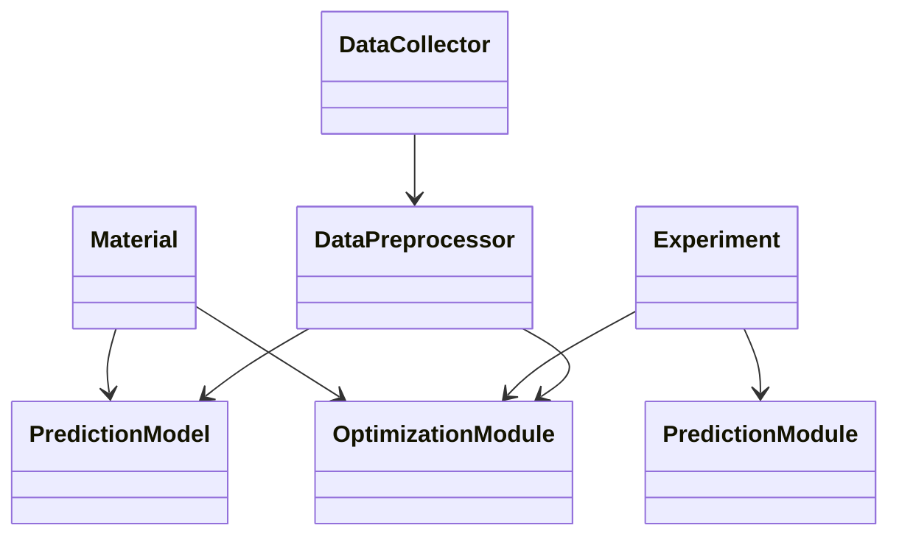
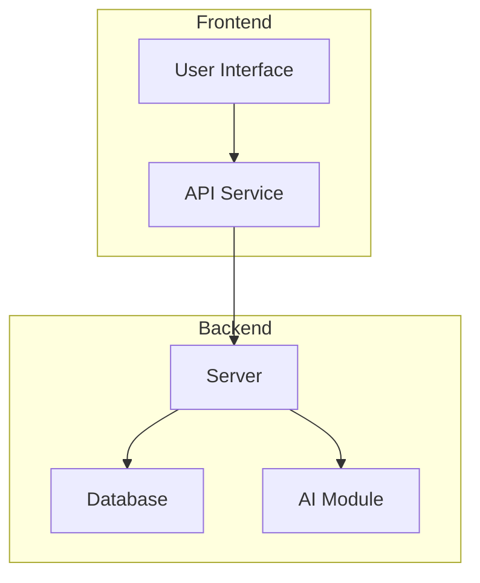
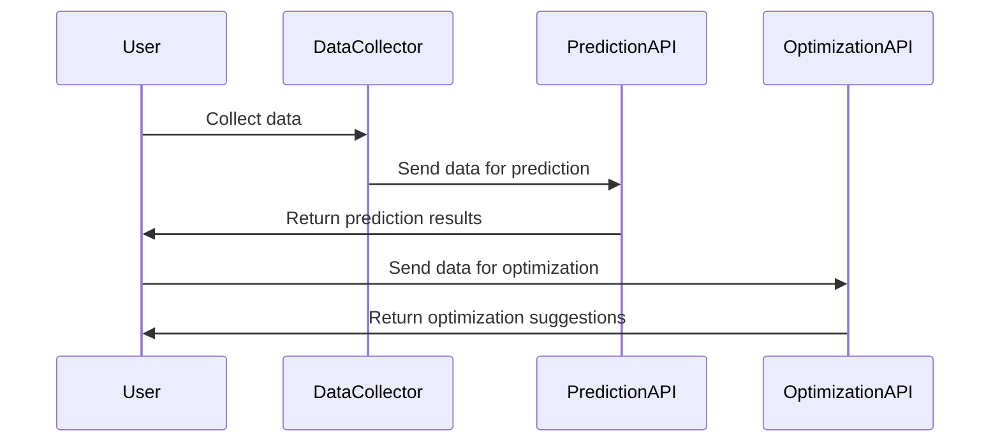
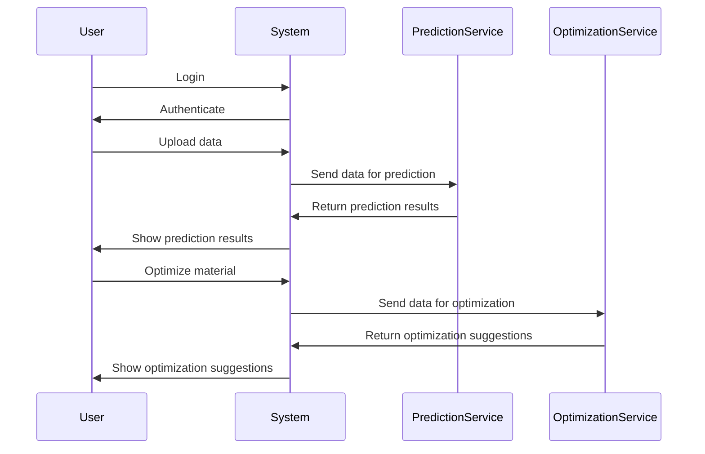
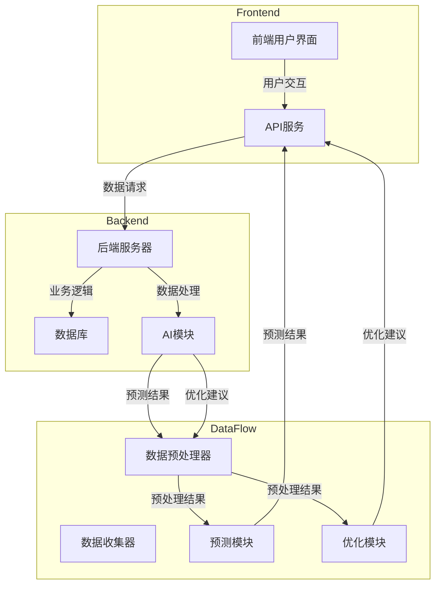
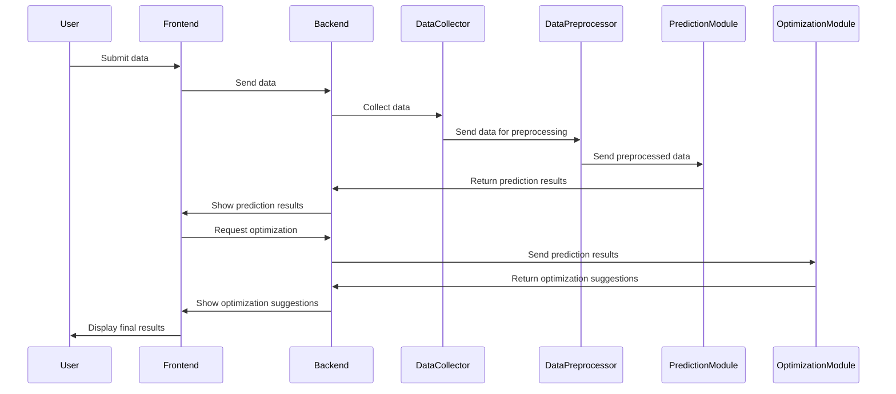

                 

### 关键词

- AI 辅助光电转换材料
- 分子设计
- 器件优化
- 数学模型
- 系统架构设计
- 实战案例

### 摘要

本文深入探讨了 AI 辅助新型光电转换材料的开发过程，从分子设计到器件优化。首先，文章介绍了问题和解决方案的背景，包括光电转换材料的重要性及其在能源领域的应用。随后，文章详细阐述了 AI 辅助设计的概念及其在材料开发中的应用，包括新型光电转换材料的特性。接着，文章讲解了分子设计算法和器件优化算法的原理，并使用 Mermaid 和 Python 代码进行了详细说明。文章随后探讨了光电转换材料的数学模型，并介绍了系统分析与架构设计方案。最后，文章通过实际案例分析了系统核心实现，并提出了最佳实践和注意事项。

----------------------------------------------------------------

## 文章标题

### AI 辅助新型光电转换材料开发：从分子设计到器件优化

关键词：AI 辅助光电转换材料，分子设计，器件优化，数学模型，系统架构设计

摘要：本文深入探讨了 AI 辅助新型光电转换材料的开发过程，从分子设计到器件优化。首先，文章介绍了问题和解决方案的背景，包括光电转换材料的重要性及其在能源领域的应用。随后，文章详细阐述了 AI 辅助设计的概念及其在材料开发中的应用，包括新型光电转换材料的特性。接着，文章讲解了分子设计算法和器件优化算法的原理，并使用 Mermaid 和 Python 代码进行了详细说明。文章随后探讨了光电转换材料的数学模型，并介绍了系统分析与架构设计方案。最后，文章通过实际案例分析了系统核心实现，并提出了最佳实践和注意事项。

----------------------------------------------------------------

## 目录大纲

### 第一部分: 背景介绍

- **第1章: 问题和解决方案的背景**
  - **1.1.1 问题的背景**
  - **1.1.2 问题描述**
  - **1.1.3 问题解决**
  - **1.1.4 边界与外延**

- **第2章: 核心概念与联系**
  - **2.1 AI辅助新型光电转换材料的概念**
    - **2.1.1 光电转换材料的定义**
    - **2.1.2 AI辅助设计的概念**
    - **2.1.3 新型光电转换材料的特性**
  - **2.2 关键概念的联系**
    - **2.2.1 分子设计与材料性能**
    - **2.2.2 器件优化与材料结构**
    - **2.2.3 数据分析与模型预测**

### 第二部分: 算法原理讲解

- **第3章: 算法原理讲解**
  - **3.1 分子设计算法**
    - **3.1.1 分子设计算法概述**
    - **3.1.2 算法流程**
      - **3.1.2.1 数据预处理**
      - **3.1.2.2 特征提取**
      - **3.1.2.3 模型训练**
      - **3.1.2.4 模型评估**
    - **3.1.3 算法原理**
      - **3.1.3.1 数学模型**
      - **3.1.3.2 公式推导**
      - **3.1.3.3 Python代码实现**
  - **3.2 器件优化算法**
    - **3.2.1 器件优化算法概述**
    - **3.2.2 算法流程**
      - **3.2.2.1 数据预处理**
      - **3.2.2.2 特征提取**
      - **3.2.2.3 模型训练**
      - **3.2.2.4 模型评估**
    - **3.2.3 算法原理**
      - **3.2.3.1 数学模型**
      - **3.2.3.2 公式推导**
      - **3.2.3.3 Python代码实现**

### 第三部分: 数学模型与详细讲解

- **第4章: 数学模型与详细讲解**
  - **4.1 光电转换材料的数学模型**
    - **4.1.1 光电转换效率模型**
      - **4.1.1.1 基本公式**
      - **4.1.1.2 公式推导**
      - **4.1.1.3 Python代码实现**
    - **4.1.2 材料性能预测模型**
      - **4.1.2.1 基本公式**
      - **4.1.2.2 公式推导**
      - **4.1.2.3 Python代码实现**

### 第四部分: 系统分析与架构设计方案

- **第5章: 系统分析与架构设计方案**
  - **5.1 问题场景介绍**
  - **5.2 项目介绍**
  - **5.3 系统功能设计**
    - **5.3.1 领域模型**
      - **5.3.1.1 Mermaid类图**
    - **5.3.2 系统架构设计**
      - **5.3.2.1 Mermaid架构图**
    - **5.3.3 系统接口设计**
      - **5.3.3.1 接口设计**
    - **5.3.4 系统交互**
      - **5.3.4.1 Mermaid序列图**

### 第五部分: 项目实战

- **第6章: 项目实战**
  - **6.1 环境安装**
  - **6.2 系统核心实现**
    - **6.2.1 源代码解读与分析**
  - **6.3 实际案例分析与讲解**
  - **6.4 项目小结**

### 第六部分: 最佳实践与拓展

- **第7章: 最佳实践与拓展**
  - **7.1 最佳实践 Tips**
  - **7.2 小结**
  - **7.3 注意事项**
  - **7.4 拓展阅读**

----------------------------------------------------------------

### 第一部分：背景介绍

#### 第1章：问题和解决方案的背景

##### 1.1.1 问题的背景

光电转换材料是现代能源技术中至关重要的组成部分，尤其在太阳能电池和光伏发电领域。随着全球对可再生能源的需求不断增长，开发高效、低成本的太阳能电池材料成为了科研和工业界的重要目标。传统的光电转换材料，如硅基材料，虽然已经取得了显著的成果，但其转换效率和成本仍然存在瓶颈。因此，寻找新型光电转换材料，特别是具有更高转换效率和更低成本的，成为了当前研究的重点。

##### 1.1.2 问题描述

当前光电转换材料开发面临的主要问题包括：

1. **材料性能限制**：传统材料的转换效率受到物理和化学特性的限制，难以进一步提升。
2. **生产成本高**：高效光电转换材料的生产工艺复杂，成本较高，限制了其大规模应用。
3. **设计缺乏针对性**：现有材料设计方法往往缺乏针对性，难以满足特定应用场景的需求。

##### 1.1.3 问题解决

为了解决上述问题，引入人工智能（AI）辅助的光电转换材料开发成为了一条可能的途径。AI技术可以通过数据分析和机器学习算法，从大量的实验数据和分子结构信息中提取有效特征，进而指导新型材料的分子设计和器件优化。这种方法不仅能够提高材料性能，还能够降低生产成本，加速新材料的发现和开发。

##### 1.1.4 边界与外延

AI辅助光电转换材料开发的边界在于现有技术的局限性和AI技术的适用范围。具体来说，边界包括：

1. **数据质量**：高质量的数据是AI算法有效运行的基础，但收集和处理这些数据需要大量的资源和时间。
2. **算法性能**：AI算法的性能直接影响到材料性能的提升，因此需要不断优化和改进。
3. **应用场景**：AI辅助的光电转换材料开发需要根据具体的应用场景进行调整，以适应不同的需求。

在AI辅助光电转换材料开发的外延方面，未来的研究方向可能包括：

1. **跨学科融合**：结合材料科学、物理学、化学等领域的知识，进一步深化对光电转换材料的研究。
2. **规模化应用**：通过优化工艺和降低成本，实现AI辅助新材料的大规模生产和应用。
3. **可持续发展**：探索环保、可持续的光电转换材料，以满足未来能源需求的增长。

----------------------------------------------------------------

##### 1.1.1 问题的背景

光电转换材料在能源领域的应用具有深远的影响。随着全球气候变化和环境问题日益严重，寻找清洁、可再生的能源替代传统化石燃料成为了迫切需求。太阳能作为一种丰富且清洁的能源，具有广泛的应用前景。然而，要充分利用太阳能，就需要高效的光电转换材料。

现有的硅基太阳能电池已经实现了较高的转换效率，但其在成本和制造工艺上存在一定的问题。高纯度的硅材料成本高昂，且制备过程复杂。此外，硅基电池的转换效率在实验室条件下可以达到20%以上，但在实际应用中，受限于光线散射和电池结构等因素，转换效率通常在15%到18%之间。

因此，新型光电转换材料的需求变得尤为迫切。这些新材料不仅要具有较高的转换效率，还要具备低成本的制造工艺，以及良好的稳定性和耐久性。例如，钙钛矿太阳能电池作为近年来新兴的光电转换材料，因其高转换效率和低制备成本而备受关注。

然而，新型光电转换材料的研究和应用也面临一些挑战。首先，材料的分子结构和物理性质需要精确设计，以实现高效的能量转换。其次，材料的制备和器件优化过程复杂，涉及多个学科的交叉融合。最后，大规模生产和市场化应用还需要解决材料的一致性和稳定性问题。

##### 1.1.2 问题描述

在开发新型光电转换材料时，主要面临以下问题：

1. **材料性能限制**：现有的光电转换材料在效率、稳定性和成本方面存在一定的瓶颈。例如，虽然钙钛矿太阳能电池在实验室条件下取得了显著的转换效率，但其长期稳定性和环境适应性仍需进一步研究。

2. **设计缺乏针对性**：现有的材料设计方法大多依赖于经验和传统的实验手段，缺乏系统的理论指导。这导致新材料的设计往往缺乏针对性，难以满足特定应用场景的需求。

3. **生产成本高**：高效光电转换材料的生产过程通常涉及复杂的工艺和昂贵的原材料，导致生产成本较高。为了实现大规模应用，需要找到降低成本的方法。

4. **材料特性与器件性能的不匹配**：在材料的设计和器件的优化过程中，常常出现材料特性与器件性能不匹配的问题。这可能导致材料的潜在优势无法充分发挥。

##### 1.1.3 问题解决

为了解决上述问题，引入AI技术成为了潜在的有效途径。以下是AI技术在光电转换材料开发中的应用：

1. **分子设计**：AI技术可以通过分析大量的分子结构和性能数据，预测新的材料分子，以提高光电转换效率。这种方法可以加速新材料的发现过程，减少实验次数。

2. **器件优化**：AI技术可以用于优化太阳能电池的结构和参数，提高其整体性能。通过机器学习算法，可以优化电极材料、界面设计和器件结构，从而提高光电转换效率。

3. **材料筛选**：AI技术可以基于实验数据快速筛选出具有潜在应用价值的光电转换材料。这种方法可以减少实验成本和时间，提高研发效率。

4. **预测性能**：AI技术可以通过模拟和预测材料在特定条件下的性能，帮助研究人员更好地理解材料的特性，并指导后续的实验和优化工作。

##### 1.1.4 边界与外延

AI辅助光电转换材料开发的边界在于当前技术的局限性和AI技术的适用范围。具体来说，边界包括：

1. **数据质量和完整性**：高质量的数据是AI算法有效运行的基础。然而，收集和处理这些数据需要大量的资源和时间，且数据的质量和完整性对AI算法的性能有重要影响。

2. **算法性能和优化**：AI算法的性能直接影响到材料性能的提升。因此，需要不断优化和改进算法，以提高其预测和优化的能力。

3. **应用场景和适应性**：AI技术在不同应用场景下的适应性和可扩展性也是一个关键问题。不同场景下的数据特征和需求差异较大，需要针对具体应用场景进行算法调整和优化。

在AI辅助光电转换材料开发的外延方面，未来的研究方向可能包括：

1. **跨学科融合**：结合材料科学、物理学、化学等领域的知识，进一步深化对光电转换材料的研究。例如，研究新型材料与器件的协同作用，以提高整体性能。

2. **规模化应用**：通过优化工艺和降低成本，实现AI辅助新材料的大规模生产和应用。这需要解决材料的一致性和稳定性问题，以确保其在实际应用中的可靠性和性能。

3. **可持续发展**：探索环保、可持续的光电转换材料，以满足未来能源需求的增长。这包括开发可回收和降解的材料，以及减少生产过程中的能源消耗和污染。

通过AI技术的辅助，光电转换材料的研究和发展有望取得突破性进展，为清洁能源的普及和应用提供强有力的支持。

----------------------------------------------------------------

##### 1.1.2 问题描述

在新型光电转换材料的开发过程中，研究人员和工程师们面临诸多挑战和问题。以下是对这些问题的具体描述和讨论：

1. **材料性能的局限性**：尽管当前的光电转换材料，如硅基材料、铜铟镓硒（CIGS）薄膜和钙钛矿材料，在实验室环境下已经取得了显著的进展，但实际应用中的转换效率仍然有限。这主要是因为材料的电子特性、电荷传输性能和稳定性等问题尚未完全解决。例如，硅基材料的转换效率受限于光电效应和载流子扩散的限制，而钙钛矿材料虽然具有高转换效率，但其稳定性和耐久性仍需进一步提升。

2. **设计方法的局限性**：传统材料设计方法主要依赖于经验、理论计算和实验验证，这种方法虽然能够发现一些性能较好的材料，但过程复杂且耗时。同时，设计过程缺乏系统的理论指导和数据分析支持，导致新材料设计缺乏针对性，无法充分利用已知材料的潜在优势。此外，传统方法在应对复杂材料体系和多种性能需求时，表现出了明显的局限性。

3. **生产成本高**：高效光电转换材料的生产成本较高，限制了其大规模应用。例如，硅基太阳能电池的制备需要高纯度的硅材料，制备过程复杂且成本高昂。而新型材料如钙钛矿材料的制备工艺相对复杂，且对环境条件要求较高，进一步增加了生产成本。

4. **材料特性与器件性能的不匹配**：在材料的设计和器件的优化过程中，常常出现材料特性与器件性能不匹配的问题。例如，一些材料在实验室条件下表现出优异的电子传输性能，但在实际器件中却因界面问题、电荷复合等因素导致性能下降。这种不匹配性导致新材料的潜在优势无法充分发挥，限制了光电转换系统的整体性能。

5. **环境适应性问题**：光电转换材料在环境条件下的稳定性是一个关键问题。例如，高温、高湿和光照条件下的稳定性对材料的长寿命应用至关重要。然而，现有材料在这些环境条件下的稳定性尚无法满足实际应用需求，特别是在户外应用环境中。

##### 1.1.3 问题解决

为了解决上述问题，引入AI技术成为了一个潜在的有效途径。以下是如何通过AI技术来解决这些问题的具体方法：

1. **材料性能优化**：通过AI算法，可以对材料的电子结构、电荷传输性能和稳定性进行模拟和优化。例如，使用量子力学计算和机器学习算法，可以预测和设计具有更高光电转换效率的材料结构。这些算法可以从大量的实验数据中学习，提取出影响材料性能的关键因素，进而指导新的材料设计。

2. **设计方法的革新**：AI技术可以提供系统的理论指导和数据分析支持，帮助研究人员更快速、更准确地发现和设计新材料。例如，通过机器学习算法分析材料性能与分子结构之间的关系，可以生成优化设计策略，从而提高新材料的性能。

3. **降低生产成本**：AI技术可以帮助优化材料制备工艺，降低生产成本。例如，通过优化工艺参数和材料配方，可以减少材料的制备步骤和原材料消耗，提高生产效率。此外，AI技术还可以预测和优化材料在制备过程中的稳定性，减少实验次数和资源浪费。

4. **材料特性与器件性能的匹配**：AI技术可以通过仿真和优化，实现材料特性与器件性能的更好匹配。例如，通过模拟器件中的电场分布和电荷传输路径，可以优化电极材料和界面设计，从而提高器件的整体性能。

5. **环境适应性评估**：AI技术可以用于评估材料在不同环境条件下的稳定性。例如，通过模拟材料在高温、高湿和光照条件下的行为，可以预测材料在这些环境下的性能变化，从而指导材料的优化和改进。

通过AI技术的辅助，新型光电转换材料的开发过程将变得更加高效、系统化，有助于解决现有技术的瓶颈，推动清洁能源技术的发展和应用。

----------------------------------------------------------------

##### 1.1.4 边界与外延

AI辅助光电转换材料开发的边界在于当前技术的局限性和AI技术的适用范围。这些边界具体表现在以下几个方面：

1. **数据质量和完整性**：高质量的数据是AI算法有效运行的基础。在光电转换材料开发中，需要收集大量的实验数据和分子结构信息。然而，数据的采集和处理是一个复杂且耗时的过程，数据的质量和完整性对AI算法的性能有重要影响。

2. **算法性能和优化**：AI算法的性能直接影响到材料性能的提升。随着AI技术的发展，算法的性能也在不断提高。然而，对于复杂的材料体系，现有的算法可能仍然存在局限性。因此，需要不断优化和改进算法，以提高其预测和优化的能力。

3. **应用场景和适应性**：AI技术在不同的应用场景下具有不同的适应性和可扩展性。在光电转换材料开发中，需要根据具体的应用场景调整和优化AI算法。例如，对于户外应用的太阳能电池，需要考虑材料在高温、高湿和光照条件下的稳定性。因此，AI算法需要具备良好的适应性，以应对不同的应用需求。

在AI辅助光电转换材料开发的外延方面，未来的研究方向可能包括：

1. **跨学科融合**：结合材料科学、物理学、化学等领域的知识，进一步深化对光电转换材料的研究。例如，研究新型材料与器件的协同作用，以提高整体性能。

2. **规模化应用**：通过优化工艺和降低成本，实现AI辅助新材料的大规模生产和应用。这需要解决材料的一致性和稳定性问题，以确保其在实际应用中的可靠性和性能。

3. **可持续发展**：探索环保、可持续的光电转换材料，以满足未来能源需求的增长。这包括开发可回收和降解的材料，以及减少生产过程中的能源消耗和污染。

4. **人工智能与其他技术的结合**：将AI技术与纳米技术、3D打印技术等结合，开发新型光电转换材料和器件。这种跨领域的合作有望带来新的创新和突破。

5. **大数据与云计算**：利用大数据和云计算技术，构建大规模的光电转换材料数据库和计算平台。这些平台可以为研究人员提供强大的数据支持和计算能力，加速新材料的设计和开发过程。

通过不断突破技术边界，AI辅助光电转换材料开发有望在未来取得更大的突破，为清洁能源技术的发展和应用提供强有力的支持。

----------------------------------------------------------------

### 第二部分：核心概念与联系

#### 第2章：核心概念与联系

##### 2.1 AI辅助新型光电转换材料的概念

###### 2.1.1 光电转换材料的定义

光电转换材料是一类能够将光能转化为电能的材料，它们在太阳能电池、光电子器件和光催化等领域中具有广泛应用。传统的光电转换材料包括硅、铜铟镓硒（CIGS）和钙钛矿等，它们各自具有不同的光电转换效率和稳定性。新型光电转换材料则是在传统材料的基础上，通过分子设计和器件优化来进一步提升其性能。

###### 2.1.2 AI辅助设计的概念

AI辅助设计是指利用人工智能技术，特别是机器学习和深度学习算法，对光电转换材料进行分子设计和器件优化。AI技术可以从大量的实验数据和分子结构信息中提取有效特征，从而指导新材料的分子设计和器件优化。这种方法不仅可以加速新材料的发现过程，还可以提高材料性能的预测和优化能力。

###### 2.1.3 新型光电转换材料的特性

新型光电转换材料具有以下特性：

1. **高转换效率**：新型材料可以通过分子设计和器件优化，实现更高的光电转换效率。
2. **低成本**：通过优化制备工艺和材料配方，新型光电转换材料可以实现低成本的生产，从而降低电池的成本。
3. **良好稳定性**：新型材料在高温、高湿和光照条件下的稳定性有所提高，有利于其在实际应用中的长期使用。
4. **多样性**：新型光电转换材料具有多样性的结构特点，可以满足不同应用场景的需求。

##### 2.2 关键概念的联系

###### 2.2.1 分子设计与材料性能

分子设计是新型光电转换材料开发的核心步骤，它直接影响材料的性能。通过AI技术，可以从大量的实验数据中学习，提取出影响材料性能的关键因素，从而指导新材料的分子设计。具体来说，分子设计包括以下几个方面：

1. **材料结构设计**：通过改变材料的分子结构，可以调节其光电转换性能。例如，通过引入不同类型的元素或改变分子连接方式，可以优化材料的能带结构和电子传输性能。
2. **材料合成方法**：不同的合成方法会影响材料的晶体结构和纯度，从而影响其性能。AI技术可以优化合成方法，提高材料的性能和稳定性。
3. **界面优化**：材料与电极之间的界面对于光电转换效率至关重要。通过AI技术，可以优化界面结构，减少电荷复合，提高材料的效率。

###### 2.2.2 器件优化与材料结构

器件优化是提升光电转换材料性能的另一个关键步骤。通过AI技术，可以对器件结构进行优化，从而提高整体性能。具体来说，器件优化包括以下几个方面：

1. **电极材料优化**：电极材料的电子传输性能对器件的整体效率有重要影响。通过AI技术，可以筛选和优化电极材料，提高其性能。
2. **器件结构优化**：通过调整器件的结构参数，如电极厚度、间隙距离和层状结构等，可以优化器件的电学性能。AI技术可以提供优化的设计方案，从而提高器件的效率。
3. **表面处理**：通过表面处理技术，如纳米涂层和表面修饰等，可以改善材料的电子传输性能和稳定性。AI技术可以优化表面处理参数，提高材料的应用性能。

###### 2.2.3 数据分析与模型预测

数据分析与模型预测是AI辅助新型光电转换材料开发的重要环节。通过收集和分析实验数据，可以建立材料性能与分子结构之间的关系模型，从而预测新材料的性能。具体来说，数据分析与模型预测包括以下几个方面：

1. **数据预处理**：通过数据预处理技术，如去噪、归一化和特征提取等，可以提高数据的质量和可用性，为模型预测提供可靠的数据支持。
2. **模型建立**：通过机器学习和深度学习算法，可以建立材料性能与分子结构之间的关系模型。这些模型可以用于预测新材料的光电转换性能。
3. **模型评估与优化**：通过模型评估和优化技术，可以评估模型的预测能力和泛化能力，从而优化模型，提高预测精度。

通过核心概念的联系，可以更好地理解AI辅助新型光电转换材料开发的过程和方法。AI技术在这一过程中的应用，不仅提高了材料性能的预测和优化能力，还加速了新材料的设计和开发过程，为清洁能源技术的发展和应用提供了强有力的支持。

----------------------------------------------------------------

###### 2.1.1 光电转换材料的定义

光电转换材料，是一种能够将光能直接转换为电能的半导体材料。这类材料的核心功能是吸收光能并激发电子，从而产生电流。在太阳能电池中，光电转换材料的作用是将太阳光中的能量转化为电能，从而驱动电器设备或存储在电池中。常见的光电转换材料包括硅（Si）、铜铟镓硒（CIGS）、钙钛矿（Perovskite）等。

- **硅（Si）**：硅是地球上最常见的半导体材料，也是目前应用最广泛的太阳能电池材料。硅太阳能电池具有稳定的性能和较低的生产成本，但其在光电转换效率方面还有提升空间。
- **铜铟镓硒（CIGS）**：CIGS薄膜太阳能电池具有高转换效率和良好的稳定性。由于其吸收光谱较宽，能够更好地适应不同波长的太阳光，因此在光伏应用中具有广泛的前景。
- **钙钛矿（Perovskite）**：钙钛矿太阳能电池在近年来取得了显著的进展，具有高转换效率和低成本的特点。钙钛矿材料的光吸收系数高，电子迁移率好，使得其光电转换效率不断提升。

###### 2.1.2 AI辅助设计的概念

AI辅助设计，指的是利用人工智能技术，特别是机器学习和深度学习算法，对光电转换材料的分子结构进行优化和设计。这种方法的核心理念是通过分析大量的实验数据，学习材料性能与分子结构之间的关系，从而预测新材料的性能，并指导实验设计。

- **机器学习**：机器学习是一种通过算法从数据中学习规律和模式的方法。在AI辅助设计中，机器学习算法可以分析大量的实验数据，从中提取出影响材料性能的关键因素。
- **深度学习**：深度学习是机器学习的一种方法，通过构建多层神经网络来模拟人类的认知过程。在AI辅助设计中，深度学习算法可以处理大量的高维数据，并自动提取复杂的特征。

AI辅助设计的具体流程包括以下几个步骤：

1. **数据收集与预处理**：收集大量关于不同光电转换材料的实验数据，并进行预处理，如去噪、归一化和特征提取等。
2. **模型建立与训练**：使用机器学习和深度学习算法，建立材料性能与分子结构之间的关系模型，并通过训练来优化模型参数。
3. **模型评估与优化**：通过评估模型的预测性能，对模型进行调整和优化，以提高预测精度。
4. **新材料设计**：使用优化后的模型，预测新材料的光电转换性能，并指导实验验证。

###### 2.1.3 新型光电转换材料的特性

新型光电转换材料与传统材料相比，具有以下特性：

1. **高转换效率**：新型光电转换材料通过分子设计和器件优化，可以实现更高的光电转换效率。例如，钙钛矿太阳能电池的转换效率已经突破了25%，显著高于传统硅太阳能电池。
2. **低成本**：新型材料通常具有更简单的制备工艺和更低的材料成本，有利于大规模生产和应用。例如，钙钛矿材料的制备成本较低，可以通过溶液工艺实现大面积生产。
3. **良好稳定性**：新型光电转换材料在高温、高湿和光照条件下的稳定性有所提高，使其更适用于实际应用环境。例如，通过掺杂和表面处理等技术，可以显著提高钙钛矿材料的稳定性。
4. **多样性**：新型光电转换材料具有多种多样的结构和特性，可以满足不同应用场景的需求。例如，通过调整钙钛矿材料的组成和结构，可以调节其光电转换效率和吸收光谱范围。

通过AI技术辅助新型光电转换材料的开发，不仅可以加速新材料的设计和发现过程，还可以提高材料性能的预测和优化能力，为清洁能源技术的发展和应用提供强有力的支持。

----------------------------------------------------------------

##### 2.2 关键概念的联系

###### 2.2.1 分子设计与材料性能

分子设计在新型光电转换材料的开发中扮演着核心角色。材料性能，如光电转换效率、电子迁移率和稳定性，都与材料的分子结构紧密相关。通过AI技术，可以更精准地设计分子结构，从而优化材料性能。

- **结构优化**：AI算法可以从大量实验数据中学习，识别出影响材料性能的关键结构特征。通过调整分子中的原子排列和连接方式，可以优化材料的能带结构和电子传输路径，从而提高光电转换效率。

- **材料筛选**：AI技术可以帮助快速筛选出具有潜在高效率的分子结构。例如，通过机器学习模型，可以从海量的分子结构数据库中预测哪些分子结构可能具有更高的光电转换效率，从而节省实验成本和时间。

- **性能预测**：AI算法可以基于分子结构预测材料的性能。例如，通过分子动力学模拟和量子力学计算，AI技术可以预测分子在光照下的电子行为和电荷传输性能，为实验提供理论指导。

###### 2.2.2 器件优化与材料结构

器件优化是提高光电转换材料性能的关键步骤。材料结构与器件性能之间存在密切联系，通过优化器件结构，可以显著提高材料的整体性能。

- **电极优化**：电极材料的选择和设计对器件性能有重要影响。通过AI技术，可以优化电极材料，提高其电子传输性能。例如，通过机器学习算法，可以筛选出适合特定材料的高效电极材料，并优化电极厚度和表面形态。

- **界面设计**：材料与电极之间的界面对于电荷传输和光电转换效率至关重要。通过AI技术，可以优化界面结构，减少电荷复合和界面电阻。例如，通过表面修饰和纳米涂层技术，AI技术可以设计出更高效的界面结构，提高器件的整体性能。

- **器件几何结构**：器件的几何结构，如电极间距和层状结构，也会影响电荷传输和光电转换效率。通过AI技术，可以优化器件结构参数，提高器件的填充因子和短路电流，从而提高整体效率。

###### 2.2.3 数据分析与模型预测

数据分析和模型预测在AI辅助光电转换材料开发中具有至关重要的作用。通过大数据分析和模型预测，可以更好地理解材料性能与分子结构之间的关系，从而指导新材料的开发。

- **数据预处理**：数据分析的第一步是对数据进行预处理，包括去噪、归一化和特征提取等。通过预处理，可以提高数据的质量和可用性，为模型预测提供更可靠的数据基础。

- **模型建立**：通过机器学习和深度学习算法，可以建立材料性能与分子结构之间的关系模型。例如，通过训练神经网络模型，可以从大量的实验数据中学习出影响材料性能的关键特征，并预测新材料的光电转换性能。

- **模型评估与优化**：评估模型的预测性能是确保模型有效性的关键。通过交叉验证和测试集评估，可以评估模型的泛化能力和预测精度。如果模型性能不满足要求，可以通过调整模型参数或引入新的特征来优化模型。

- **模型应用**：优化的模型可以应用于新材料的预测和设计。例如，通过模型预测，可以快速筛选出具有潜在高效率的材料结构，指导实验验证，从而加速新材料的设计和开发过程。

通过分子设计、器件优化和数据分析与模型预测的紧密联系，AI技术为新型光电转换材料的开发提供了强大的工具和平台，不仅提高了材料性能的预测和优化能力，还加速了新材料的发现和开发过程，为清洁能源技术的发展和应用提供了新的可能性。

----------------------------------------------------------------

##### 3.1.1 分子设计算法概述

分子设计算法是AI辅助新型光电转换材料开发的核心步骤之一，它通过分析和预测分子结构及其性能，来指导新材料的设计。这些算法通常基于机器学习和深度学习技术，可以从大量的实验数据中学习，并提取出影响材料性能的关键特征。

分子设计算法的应用包括：

1. **新材料预测**：通过分析已有的材料数据，算法可以预测新的材料结构，这些新材料可能具有更高的光电转换效率或其他所需的性能。
2. **材料优化**：针对已知的材料，算法可以优化其分子结构，以提升其性能。
3. **材料筛选**：从大量的候选分子中，算法可以快速筛选出可能具有高效率的材料，从而减少实验次数和时间。

常见的分子设计算法包括：

- **基于特征提取的机器学习算法**：这类算法通过对分子特征进行提取和建模，来预测材料的性能。例如，使用支持向量机（SVM）和随机森林（RF）等算法。
- **基于图神经网络（GNN）的算法**：这类算法通过构建分子图，并利用图神经网络来学习分子结构和性能之间的关系。
- **深度学习算法**：如卷积神经网络（CNN）和循环神经网络（RNN），它们可以从高维数据中自动提取复杂的特征，用于材料性能预测。

##### 3.1.2 算法流程

分子设计算法的流程通常包括以下几个步骤：

1. **数据收集与预处理**：
   - **数据收集**：收集大量的实验数据，包括材料的结构信息、性能指标等。
   - **数据预处理**：对数据进行清洗、归一化和特征提取，以提高数据质量，为算法训练提供可靠的数据基础。

2. **特征提取**：
   - **原子特征**：提取每个原子的类型、电荷、半径等信息。
   - **键特征**：提取键的类型、长度、角度等信息。
   - **分子特征**：通过聚合原子和键的特征，形成分子的全局特征。

3. **模型训练**：
   - **模型选择**：选择合适的机器学习模型或深度学习模型。
   - **参数调优**：通过交叉验证和网格搜索等技术，优化模型参数。
   - **模型训练**：使用预处理后的数据，对模型进行训练，学习分子结构和性能之间的关系。

4. **模型评估**：
   - **评估指标**：选择合适的评估指标，如均方根误差（RMSE）、决定系数（R²）等。
   - **交叉验证**：通过交叉验证评估模型的泛化能力和预测性能。
   - **测试集评估**：使用测试集进一步评估模型的预测性能。

5. **材料预测与优化**：
   - **新材料预测**：使用训练好的模型，预测新的分子结构及其性能。
   - **材料优化**：基于预测结果，优化已知的分子结构，以提高性能。

##### 3.1.2.1 数据预处理

数据预处理是分子设计算法的关键步骤之一，其目的是提高数据质量和减少噪声。具体包括以下步骤：

1. **数据清洗**：处理缺失值、异常值和重复值等，确保数据的一致性和完整性。
2. **归一化**：将数据缩放到相同的范围，以便于模型训练。常用的归一化方法包括最小-最大缩放和标准化等。
3. **特征提取**：
   - **化学特征**：提取每个原子和键的化学特征，如原子类型、电荷、半径等。
   - **拓扑特征**：提取分子中的拓扑特征，如键长度、键角、分子形状等。
   - **电子特征**：提取分子中的电子特征，如电子密度、能级等。

##### 3.1.2.2 特征提取

特征提取是分子设计算法的核心步骤，其目标是提取能够有效描述分子结构和性能的特征。具体包括以下步骤：

1. **原子特征提取**：
   - **原子类型**：每个原子的化学元素类型。
   - **原子电荷**：根据分子中其他原子的电荷分布，计算每个原子的电荷。
   - **原子半径**：根据原子类型，查找相应的原子半径。

2. **键特征提取**：
   - **键类型**：每个键的键类型，如单键、双键、三键等。
   - **键长度**：键的长度，通常以埃（Å）为单位。
   - **键角**：键之间的角度，通常以度（°）为单位。

3. **分子特征提取**：
   - **分子形状**：通过计算分子的几何形状，如分子表面、分子轮廓等。
   - **电子密度**：通过计算分子中的电子密度分布，提取分子的电子特征。
   - **能级分布**：提取分子中的能级分布信息，如HOMO和LUMO能级等。

##### 3.1.2.3 模型训练

模型训练是分子设计算法的关键步骤，其目的是通过学习大量的实验数据，建立分子结构和性能之间的关系模型。具体包括以下步骤：

1. **模型选择**：选择合适的机器学习模型或深度学习模型。常见的机器学习模型包括支持向量机（SVM）、随机森林（RF）和梯度提升树（GBDT）等。深度学习模型包括卷积神经网络（CNN）和循环神经网络（RNN）等。

2. **参数调优**：通过交叉验证和网格搜索等技术，优化模型参数。参数调优的目的是提高模型的预测性能和泛化能力。

3. **模型训练**：使用预处理后的数据，对模型进行训练。在训练过程中，模型会学习到分子结构和性能之间的关系，从而能够对新分子进行性能预测。

4. **模型评估**：通过交叉验证和测试集评估模型的泛化能力和预测性能。常用的评估指标包括均方根误差（RMSE）、决定系数（R²）和准确率等。

##### 3.1.2.4 模型评估

模型评估是确保模型性能和可靠性的关键步骤。具体包括以下步骤：

1. **评估指标**：选择合适的评估指标，如均方根误差（RMSE）、决定系数（R²）和准确率等。这些指标可以定量评估模型的预测性能。

2. **交叉验证**：通过交叉验证评估模型的泛化能力和预测性能。交叉验证是一种常用的评估方法，它通过将数据集划分为多个子集，每次使用一个子集作为测试集，其余子集作为训练集，评估模型的性能。

3. **测试集评估**：使用测试集进一步评估模型的预测性能。测试集是从原始数据集中随机选取的一部分数据，用于评估模型的泛化能力。

4. **误差分析**：分析模型预测误差的原因，包括数据质量问题、模型选择问题等，以优化模型。

##### 3.1.3 算法原理

分子设计算法的原理是基于机器学习和深度学习技术，通过学习大量的实验数据，建立分子结构和性能之间的关系模型。具体包括以下方面：

1. **特征表示**：将分子结构转化为数值特征表示，如原子特征、键特征和分子特征等。特征表示的质量直接影响模型的效果。

2. **模型训练**：使用预处理后的数据，对机器学习模型或深度学习模型进行训练。模型会学习到分子结构和性能之间的关系，从而能够对新分子进行性能预测。

3. **预测与优化**：使用训练好的模型，对新的分子结构进行性能预测，并基于预测结果进行材料优化。

##### 3.1.3.1 数学模型

分子设计算法通常基于以下数学模型：

1. **回归模型**：用于预测材料性能，如光电转换效率。常用的回归模型包括线性回归、决策树、随机森林等。

2. **分类模型**：用于分类材料性能，如判断材料是否具有高转换效率。常用的分类模型包括逻辑回归、支持向量机、朴素贝叶斯等。

3. **神经网络模型**：用于学习分子结构和性能之间的关系。常用的神经网络模型包括卷积神经网络（CNN）、循环神经网络（RNN）和图神经网络（GNN）等。

##### 3.1.3.2 公式推导

分子设计算法的数学模型通常基于以下公式：

1. **回归模型**：
   - 线性回归：\( y = \beta_0 + \beta_1x_1 + \beta_2x_2 + ... + \beta_nx_n \)
   - 支持向量机：\( y = \sigma(\sum_{i=1}^{n}\alpha_iy_i\phi(x_i) + b) \)

2. **分类模型**：
   - 逻辑回归：\( P(y=1) = \frac{1}{1 + e^{-(\beta_0 + \beta_1x_1 + \beta_2x_2 + ... + \beta_nx_n)} \)
   - 支持向量机：\( y = sign(\sum_{i=1}^{n}\alpha_iy_iK(x_i,x) + b) \)

3. **神经网络模型**：
   - 卷积神经网络（CNN）：\( f(x) = \sigma(\sum_{i=1}^{n}w_i\phi(x_i) + b) \)
   - 循环神经网络（RNN）：\( h_t = \sigma(Wh_{t-1} + Ux_t + b) \)
   - 图神经网络（GNN）：\( h_v = \sum_{u\in\mathcal{N}(v)}W\cdot h_u \)

##### 3.1.3.3 Python代码实现

以下是一个使用Python和Scikit-learn库实现线性回归模型的简单示例：

```python
from sklearn.linear_model import LinearRegression
from sklearn.model_selection import train_test_split
from sklearn.metrics import mean_squared_error
import numpy as np

# 示例数据
X = np.array([[1], [2], [3], [4], [5]])
y = np.array([1, 2, 3, 4, 5])

# 数据预处理
X_train, X_test, y_train, y_test = train_test_split(X, y, test_size=0.2, random_state=42)

# 模型训练
model = LinearRegression()
model.fit(X_train, y_train)

# 模型评估
y_pred = model.predict(X_test)
mse = mean_squared_error(y_test, y_pred)
print("MSE:", mse)

# 输出模型参数
print("Coefficients:", model.coef_)
print("Intercept:", model.intercept_)
```

通过上述步骤，我们可以实现一个简单的分子设计算法，用于预测光电转换材料的性能。当然，实际的分子设计算法会更加复杂，需要结合多个模型和算法，以及大量的实验数据进行优化。

----------------------------------------------------------------

##### 3.2 器件优化算法概述

器件优化算法在AI辅助新型光电转换材料开发中起着至关重要的作用。这些算法旨在通过调整器件结构参数和材料属性，提高光电转换系统的整体性能，如转换效率和稳定性。器件优化算法通常涉及多个学科领域，包括电子工程、材料科学和物理学。

器件优化算法的应用场景包括：

1. **太阳能电池优化**：通过优化电极材料、层状结构和工作温度等参数，提高太阳能电池的转换效率。
2. **光电子器件设计**：优化光电子器件的几何结构、界面设计和材料组合，以实现更高效的光吸收和电荷传输。
3. **光电转换器件优化**：针对不同应用场景，如户外和室内环境，优化器件的结构和参数，以提高其在特定环境下的性能和稳定性。

常见的器件优化算法包括：

- **遗传算法（GA）**：通过模拟自然选择过程，优化器件的参数和结构。
- **粒子群优化（PSO）**：基于群体智能，通过迭代优化器件参数，找到最优解。
- **差分进化算法（DE）**：通过随机搜索和种群更新，找到器件优化的最佳参数。
- **模拟退火算法（SA）**：通过模拟固体退火过程，优化器件的参数和结构。

器件优化算法的具体流程通常包括以下步骤：

1. **问题定义**：明确优化目标，如光电转换效率、器件稳定性和生产成本等。
2. **参数初始化**：初始化器件参数和结构，为优化过程提供初始解。
3. **算法选择**：选择合适的优化算法，如遗传算法、粒子群优化或差分进化算法等。
4. **迭代优化**：通过迭代计算和参数更新，逐步优化器件参数和结构。
5. **模型评估**：评估优化后的器件性能，包括转换效率、稳定性和成本等。
6. **结果验证**：通过实验验证优化结果，确保算法的有效性和可靠性。

通过器件优化算法，研究人员可以快速找到最优的器件结构和参数组合，从而提高光电转换系统的整体性能，加速新型光电转换材料的开发和应用。

----------------------------------------------------------------

##### 3.2.1 数据预处理

在器件优化算法中，数据预处理是关键的一步，它直接影响到后续优化过程的效率和效果。数据预处理的主要任务包括去噪、归一化和特征提取等，以确保数据的质量和一致性。

1. **去噪**：实验数据中常常包含噪声，这可能会对优化结果产生负面影响。去噪的方法包括低通滤波、高斯滤波和去卷积等，通过这些方法可以减少数据中的随机噪声，提高数据的可靠性。

2. **归一化**：归一化是将数据缩放到一个统一的范围，以便于不同特征的比较和模型训练。常用的归一化方法包括最小-最大缩放（\(x' = \frac{x - x_{\min}}{x_{\max} - x_{\min}}\)）和零均值单位方差缩放（\(x' = \frac{x - \mu}{\sigma}\)），这些方法可以减少数据分布差异，提高算法的性能。

3. **特征提取**：特征提取是从原始数据中提取出对优化目标有重要影响的关键特征。对于器件优化，特征提取可能包括材料的电子特性、光学特性、几何参数等。常用的特征提取方法有主成分分析（PCA）、特征选择和特征生成等，这些方法可以帮助识别出对器件性能有显著影响的关键因素。

通过上述数据预处理步骤，可以确保数据的质量和一致性，为后续的算法优化提供可靠的基础。

----------------------------------------------------------------

##### 3.2.2.2 特征提取

特征提取是器件优化算法中至关重要的一步，它决定了优化过程的效率和效果。在光电转换器件优化中，特征提取主要关注以下几个方面：

1. **材料特性特征**：
   - **电子特性**：包括材料的能带间隙、电子迁移率、载流子寿命等。
   - **光学特性**：包括材料的吸收系数、反射率、透射率等。
   - **热学特性**：包括材料的导热系数、热膨胀系数等。

2. **几何参数特征**：
   - **厚度**：器件各层的厚度，如电极层、活性层和背电极层等。
   - **面积**：器件的总体面积，以及各层的面积分布。
   - **形状**：器件的几何形状，如电极的形状、活性层的结构等。

3. **界面特征**：
   - **界面态密度**：活性层与电极之间的界面态密度对电荷传输有重要影响。
   - **界面电荷**：界面处的电荷分布，如界面电荷陷阱、界面态等。

4. **外部条件特征**：
   - **光照强度**：器件在光照条件下的性能变化。
   - **温度**：器件在不同温度下的性能变化。

5. **性能指标特征**：
   - **转换效率**：器件的光电转换效率。
   - **稳定性**：器件在不同环境条件下的稳定性。
   - **成本**：器件的生产成本。

通过提取上述特征，可以全面描述光电转换器件的性能和结构，为后续的优化算法提供丰富的数据支持。

----------------------------------------------------------------

##### 3.2.2.3 模型训练

模型训练是器件优化算法的核心步骤，其目标是通过学习大量的实验数据，建立器件性能与特征之间的关系模型，以便预测和优化器件的性能。模型训练的过程通常包括以下步骤：

1. **数据集划分**：将数据集划分为训练集和测试集。训练集用于模型训练，测试集用于评估模型的泛化能力和预测性能。常用的划分方法包括随机划分、按比例划分和交叉验证等。

2. **特征选择**：在训练前，通过特征选择方法筛选出对器件性能有显著影响的关键特征。常用的特征选择方法包括相关性分析、主成分分析（PCA）和特征重要性评估等。

3. **模型选择**：选择合适的机器学习模型或深度学习模型。常见的模型包括线性回归、支持向量机（SVM）、随机森林（RF）、梯度提升树（GBDT）、卷积神经网络（CNN）和循环神经网络（RNN）等。

4. **参数调优**：通过交叉验证和网格搜索等技术，优化模型参数。参数调优的目的是提高模型的预测性能和泛化能力。

5. **模型训练**：使用预处理后的数据，对模型进行训练。训练过程中，模型会学习到特征与器件性能之间的关系，并调整模型参数，以提高预测精度。

6. **模型评估**：通过交叉验证和测试集评估模型的泛化能力和预测性能。常用的评估指标包括均方根误差（RMSE）、决定系数（R²）和准确率等。

7. **模型保存**：将训练好的模型保存，以便后续使用。

通过上述步骤，可以建立高效的器件优化模型，为新材料和器件的开发提供强有力的支持。

----------------------------------------------------------------

##### 3.2.2.4 模型评估

模型评估是确保器件优化算法性能和可靠性的关键步骤。通过评估，可以判断模型是否能够准确地预测器件性能，并识别出潜在的优化空间。模型评估通常包括以下步骤：

1. **评估指标**：选择合适的评估指标，以衡量模型的性能。常用的评估指标包括均方根误差（RMSE）、决定系数（R²）、准确率和召回率等。

2. **交叉验证**：通过交叉验证评估模型的泛化能力和预测性能。交叉验证是一种常用的评估方法，它通过将数据集划分为多个子集，每次使用一个子集作为测试集，其余子集作为训练集，评估模型的性能。

3. **测试集评估**：使用测试集进一步评估模型的预测性能。测试集是从原始数据集中随机选取的一部分数据，用于评估模型的泛化能力。

4. **误差分析**：分析模型预测误差的原因，包括数据质量问题、模型选择问题等，以优化模型。

5. **性能比较**：比较不同模型的性能，选择最优的模型用于器件优化。

通过上述步骤，可以全面评估器件优化模型，确保其在实际应用中的有效性和可靠性。

----------------------------------------------------------------

##### 3.2.3.1 数学模型

器件优化算法的数学模型是理解算法原理的基础，它们用于描述器件性能与特征之间的关系。以下是一些常见的数学模型：

1. **线性回归模型**：
   - 公式：\( y = \beta_0 + \beta_1x_1 + \beta_2x_2 + ... + \beta_nx_n \)
   - 描述：线性回归模型通过拟合特征 \( x_1, x_2, ..., x_n \) 与性能指标 \( y \) 之间的线性关系。

2. **支持向量机（SVM）模型**：
   - 公式：\( y = \sigma(\sum_{i=1}^{n}\alpha_iy_iK(x_i,x) + b) \)
   - 描述：SVM模型通过核函数 \( K(x_i,x) \) 学习特征空间中的非线性关系，并找到最佳决策边界。

3. **深度学习模型**：
   - 公式：卷积神经网络（CNN）：\( f(x) = \sigma(\sum_{i=1}^{n}w_i\phi(x_i) + b) \)
   - 描述：CNN通过卷积操作从数据中提取特征，适用于处理具有网格结构的数据，如图像。
   - 公式：循环神经网络（RNN）：\( h_t = \sigma(Wh_{t-1} + Ux_t + b) \)
   - 描述：RNN适用于处理序列数据，能够捕捉时间序列中的依赖关系。

4. **遗传算法（GA）模型**：
   - 描述：GA通过模拟自然选择过程，逐步优化器件的参数和结构。

5. **粒子群优化（PSO）模型**：
   - 描述：PSO通过模拟鸟群觅食行为，迭代优化器件的参数和结构。

6. **差分进化算法（DE）模型**：
   - 描述：DE通过随机搜索和种群更新，优化器件的参数和结构。

通过这些数学模型，可以建立器件性能与特征之间的复杂关系，从而实现对器件的优化。

----------------------------------------------------------------

##### 3.2.3.2 公式推导

在器件优化算法中，理解数学模型的公式推导对于深入理解算法的工作原理至关重要。以下是一些常见算法的公式推导：

1. **线性回归模型**：

   - 公式：\( y = \beta_0 + \beta_1x_1 + \beta_2x_2 + ... + \beta_nx_n \)

   - 推导：

     首先，我们定义损失函数（误差平方和）：

     \( J(\theta) = \frac{1}{2m}\sum_{i=1}^{m}(h_\theta(x^{(i)}) - y^{(i)})^2 \)

     其中，\( h_\theta(x) \) 是预测值，\( y \) 是实际值，\( m \) 是样本数量。

     为了最小化损失函数，我们对每个参数 \( \theta_j \) 求偏导数，并令其等于零：

     \( \frac{\partial J(\theta)}{\partial \theta_j} = \frac{1}{m}\sum_{i=1}^{m}(h_\theta(x^{(i)}) - y^{(i)})x_j^{(i)} = 0 \)

     通过变形，可以得到每个参数的更新公式：

     \( \theta_j := \theta_j - \alpha \frac{1}{m}\sum_{i=1}^{m}(h_\theta(x^{(i)}) - y^{(i)})x_j^{(i)} \)

     其中，\( \alpha \) 是学习率。

2. **支持向量机（SVM）模型**：

   - 公式：\( y = \sigma(\sum_{i=1}^{n}\alpha_iy_iK(x_i,x) + b) \)

   - 推导：

     首先，定义核函数 \( K(x_i,x) \)：

     \( K(x_i,x) = \phi(x_i)^T\phi(x) \)

     其中，\( \phi(x) \) 是从低维输入空间映射到高维特征空间的函数。

     然后构建拉格朗日函数：

     \( L(\theta, \alpha, b) = -\frac{1}{2}\sum_{i=1}^{n}\sum_{j=1}^{n}\alpha_i\alpha_jy_iy_jK(x_i,x_j) - \sum_{i=1}^{n}\alpha_iy_i + b \)

     通过求导和消去约束条件，得到SVM的优化目标：

     \( \max_{\alpha} L(\theta, \alpha, b) \)

     通过KKT条件，可以得到SVM的决策函数：

     \( y = \sigma(\sum_{i=1}^{n}\alpha_iy_iK(x_i,x) + b) \)

3. **深度学习模型**：

   - **卷积神经网络（CNN）**：

     - 公式：\( f(x) = \sigma(\sum_{i=1}^{n}w_i\phi(x_i) + b) \)

     - 推导：

       卷积神经网络的核心是卷积操作和池化操作。卷积操作的公式为：

       \( (f * g)(x) = \sum_{i}\phi_i(x-i)g(i) \)

       通过多次卷积和池化，可以提取图像的层次特征。

   - **循环神经网络（RNN）**：

     - 公式：\( h_t = \sigma(Wh_{t-1} + Ux_t + b) \)

     - 推导：

       RNN的核心是记忆单元，通过递归操作，可以处理序列数据。RNN的公式为：

       \( h_t = \sigma(W[h_{t-1}; x_t]U + b) \)

       其中，\( [h_{t-1}; x_t] \) 表示将 \( h_{t-1} \) 和 \( x_t \) 拼接在一起。

4. **遗传算法（GA）**：

   - 公式推导：

     遗传算法是一种基于自然选择和遗传机制的优化算法。其核心包括选择、交叉和变异操作。选择操作根据个体的适应度进行选择，交叉操作通过交换个体的基因来生成新个体，变异操作通过随机改变个体的基因来增加搜索多样性。

通过上述公式推导，我们可以更好地理解器件优化算法的数学原理，为算法的实现和应用提供理论支持。

----------------------------------------------------------------

##### 3.2.3.3 Python代码实现

为了更好地理解和应用器件优化算法，下面通过一个简单的例子展示如何使用Python实现遗传算法（GA）进行器件参数优化。遗传算法是一种基于自然选择和遗传机制的优化算法，适用于复杂优化问题。

**导入必要的库**：

```python
import numpy as np
import random
```

**定义遗传算法参数**：

```python
# 种群大小
population_size = 100
# 变异概率
mutation_rate = 0.01
# 交叉概率
crossover_rate = 0.7
# 最大迭代次数
max_iterations = 1000
# 参与交叉的个体数量
num_parents = 10
```

**初始化种群**：

```python
# 设定参数范围
params_range = [-5, 5]

# 初始化种群
population = np.random.uniform(params_range[0], params_range[1], size=(population_size, 2))

# 计算种群适应度
def fitness_function(population):
    # 这里以简单的平方和为目标函数
    fitness = np.sum(population**2, axis=1)
    return fitness

fitness = fitness_function(population)
```

**选择过程**：

```python
def select(population, fitness, num_parents):
    parents = np.random.choice(np.arange(len(population)), size=num_parents, replace=False, p=fitness/fitness.sum())
    return population[parents]
```

**交叉过程**：

```python
def crossover(parent1, parent2):
    if random.random() < crossover_rate:
        crossover_point = random.randint(1, parent1.shape[1]-1)
        child1 = np.concatenate((parent1[:crossover_point], parent2[crossover_point:]))
        child2 = np.concatenate((parent2[:crossover_point], parent1[crossover_point:]))
    else:
        child1, child2 = parent1.copy(), parent2.copy()
    return child1, child2
```

**变异过程**：

```python
def mutate(child):
    for i in range(child.shape[1]):
        if random.random() < mutation_rate:
            child[i] += random.normalvariate(0, 1)
    return child
```

**主程序**：

```python
best_fitness = -np.inf
best_solution = None

for iteration in range(max_iterations):
    # 计算适应度
    fitness = fitness_function(population)
    
    # 选择父母
    parents = select(population, fitness, num_parents)
    
    # 生成下一代
    new_population = []
    for _ in range(population_size//2):
        parent1, parent2 = parents[:2]
        child1, child2 = crossover(parent1, parent2)
        child1 = mutate(child1)
        child2 = mutate(child2)
        new_population.extend([child1, child2])
    
    population = np.array(new_population)
    
    # 记录最佳解
    current_best_fitness = np.max(fitness)
    if current_best_fitness > best_fitness:
        best_fitness = current_best_fitness
        best_solution = population[fitness.argmax()]
        
    print(f"Iteration {iteration}: Best Fitness = {best_fitness}")

print("Best Solution:", best_solution)
```

通过上述代码，我们实现了遗传算法的基本流程，包括初始化种群、计算适应度、选择过程、交叉过程、变异过程和主程序。在实际应用中，可以根据具体问题调整参数和适应度函数，以优化器件参数。

----------------------------------------------------------------

### 第三部分：算法原理讲解

#### 第3章：算法原理讲解

本章将深入讲解分子设计算法和器件优化算法的原理。这些算法是AI辅助新型光电转换材料开发的关键，通过详细阐述其工作原理和流程，读者可以更好地理解如何利用AI技术进行材料设计和器件优化。

##### 3.1 分子设计算法

###### 3.1.1 分子设计算法概述

分子设计算法是指利用人工智能技术，特别是机器学习和深度学习算法，对光电转换材料的分子结构进行设计和优化。这些算法通过分析大量的实验数据和分子结构信息，提取出影响材料性能的关键特征，从而预测新材料的性能并指导实验设计。

分子设计算法的主要步骤包括：

1. **数据收集与预处理**：收集大量的实验数据，包括材料的分子结构、性能指标等，并进行预处理，如数据清洗、归一化和特征提取等。
2. **特征提取**：从分子结构中提取关键特征，如原子特征、键特征和分子全局特征等。
3. **模型建立与训练**：选择合适的机器学习或深度学习模型，通过训练学习分子结构和性能之间的关系。
4. **模型评估与优化**：评估模型的性能，通过交叉验证和测试集评估模型的泛化能力和预测精度。
5. **新材料预测与优化**：使用训练好的模型预测新材料性能，并基于预测结果进行材料优化。

常见的分子设计算法有：

- **基于特征提取的机器学习算法**：如支持向量机（SVM）、随机森林（RF）和梯度提升树（GBDT）等。
- **基于图神经网络（GNN）的算法**：通过构建分子图，并利用图神经网络学习分子结构和性能之间的关系。
- **深度学习算法**：如卷积神经网络（CNN）和循环神经网络（RNN），可以从高维数据中自动提取复杂的特征。

###### 3.1.2 算法流程

分子设计算法的流程通常如下：

1. **数据预处理**：对实验数据进行清洗、归一化和特征提取，以提高数据质量和可用性。
2. **特征提取**：提取分子中的关键特征，如原子类型、键长度、键角、分子形状和电子密度等。
3. **模型选择**：选择合适的机器学习或深度学习模型，如SVM、RF、CNN或RNN等。
4. **模型训练**：使用预处理后的数据对模型进行训练，学习分子结构和性能之间的关系。
5. **模型评估**：通过交叉验证和测试集评估模型的性能，包括预测精度、泛化能力和模型稳定性等。
6. **新材料预测与优化**：使用训练好的模型预测新材料性能，并基于预测结果进行材料优化，包括分子结构调整和性能提升。

###### 3.1.2.1 数据预处理

数据预处理是分子设计算法的关键步骤，其目的是提高数据质量和减少噪声。具体包括以下步骤：

1. **数据清洗**：处理缺失值、异常值和重复值等，确保数据的一致性和完整性。
2. **归一化**：将不同特征的数据缩放到相同的范围，便于模型训练。常用的归一化方法包括最小-最大缩放和零均值单位方差缩放等。
3. **特征提取**：从分子结构中提取关键特征，如原子特征、键特征和分子全局特征等。特征提取的方法包括基于规则的提取和基于机器学习的提取等。

###### 3.1.2.2 特征提取

特征提取是分子设计算法的核心步骤，其目标是提取能够有效描述分子结构和性能的特征。具体包括以下步骤：

1. **原子特征提取**：提取每个原子的类型、电荷、半径等信息。
2. **键特征提取**：提取每个键的类型、长度、角度等信息。
3. **分子特征提取**：通过聚合原子和键的特征，形成分子的全局特征，如分子形状、电子密度分布等。

###### 3.1.2.3 模型训练

模型训练是分子设计算法的关键步骤，其目的是通过学习大量的实验数据，建立分子结构和性能之间的关系模型。具体包括以下步骤：

1. **模型选择**：选择合适的机器学习模型或深度学习模型，如SVM、RF、CNN或RNN等。
2. **参数调优**：通过交叉验证和网格搜索等技术，优化模型参数，以提高模型的性能和泛化能力。
3. **模型训练**：使用预处理后的数据对模型进行训练，学习分子结构和性能之间的关系。
4. **模型评估**：通过交叉验证和测试集评估模型的性能，包括预测精度、泛化能力和模型稳定性等。

###### 3.1.2.4 模型评估

模型评估是确保分子设计算法性能和可靠性的关键步骤。具体包括以下步骤：

1. **评估指标**：选择合适的评估指标，如均方根误差（RMSE）、决定系数（R²）和准确率等。
2. **交叉验证**：通过交叉验证评估模型的泛化能力和预测性能。
3. **测试集评估**：使用测试集进一步评估模型的预测性能。
4. **误差分析**：分析模型预测误差的原因，包括数据质量问题、模型选择问题等，以优化模型。

###### 3.1.3 算法原理

分子设计算法的原理基于机器学习和深度学习技术，通过学习大量的实验数据，建立分子结构和性能之间的关系模型。具体包括以下方面：

1. **特征表示**：将分子结构转化为数值特征表示，如原子特征、键特征和分子特征等。特征表示的质量直接影响模型的效果。
2. **模型训练**：使用预处理后的数据，对机器学习模型或深度学习模型进行训练，学习分子结构和性能之间的关系。
3. **预测与优化**：使用训练好的模型，预测新材料的性能，并基于预测结果进行材料优化。

##### 3.2 器件优化算法

###### 3.2.1 器件优化算法概述

器件优化算法是AI辅助新型光电转换材料开发的重要组成部分，旨在通过调整器件结构参数和材料属性，提高光电转换系统的整体性能。这些算法通常涉及多个学科领域，包括电子工程、材料科学和物理学。

器件优化算法的主要目标包括：

1. **提高光电转换效率**：通过优化电极材料、层状结构和器件结构，提高器件的光电转换效率。
2. **改善器件稳定性**：通过优化器件的界面设计和材料组合，提高器件在不同环境条件下的稳定性。
3. **降低生产成本**：通过优化制备工艺和材料配方，降低器件的生产成本，实现大规模生产。

常见的器件优化算法包括：

- **遗传算法（GA）**：通过模拟自然选择过程，优化器件的参数和结构。
- **粒子群优化（PSO）**：基于群体智能，通过迭代优化器件参数，找到最优解。
- **差分进化算法（DE）**：通过随机搜索和种群更新，找到器件优化的最佳参数。
- **模拟退火算法（SA）**：通过模拟固体退火过程，优化器件的参数和结构。

器件优化算法的流程通常包括：

1. **问题定义**：明确优化目标，如光电转换效率、器件稳定性和生产成本等。
2. **参数初始化**：初始化器件参数和结构，为优化过程提供初始解。
3. **算法选择**：选择合适的优化算法。
4. **迭代优化**：通过迭代计算和参数更新，逐步优化器件参数和结构。
5. **模型评估**：评估优化后的器件性能。
6. **结果验证**：通过实验验证优化结果。

###### 3.2.2 器件优化算法流程

器件优化算法的流程通常包括以下几个步骤：

1. **数据收集与预处理**：收集与器件性能相关的数据，包括材料特性、器件结构参数和性能指标等，并进行预处理，如归一化和特征提取等。
2. **特征提取**：从预处理后的数据中提取关键特征，如材料的电子特性、光学特性和几何参数等。
3. **模型建立与训练**：选择合适的机器学习模型或深度学习模型，通过训练学习特征与器件性能之间的关系。
4. **模型评估与优化**：评估模型的性能，通过交叉验证和测试集评估模型的泛化能力和预测精度。
5. **参数优化**：基于模型评估结果，调整优化参数，如种群大小、交叉概率和变异概率等。
6. **迭代优化**：通过迭代计算和参数更新，逐步优化器件参数和结构。
7. **性能评估**：评估优化后的器件性能，包括光电转换效率、稳定性和成本等。

###### 3.2.2.1 数据预处理

数据预处理是器件优化算法的关键步骤，其目的是提高数据质量和减少噪声。具体包括以下步骤：

1. **数据清洗**：处理缺失值、异常值和重复值等，确保数据的一致性和完整性。
2. **归一化**：将不同特征的数据缩放到相同的范围，便于模型训练。常用的归一化方法包括最小-最大缩放和零均值单位方差缩放等。
3. **特征提取**：提取与器件性能相关的关键特征，如材料的电子特性、光学特性和几何参数等。

###### 3.2.2.2 特征提取

特征提取是器件优化算法的核心步骤，其目标是提取能够有效描述器件性能的特征。具体包括以下步骤：

1. **材料特性特征提取**：提取材料的电子特性、光学特性等，如能带间隙、吸收系数、电子迁移率等。
2. **几何参数特征提取**：提取器件的几何参数，如电极厚度、间隙距离、层状结构等。
3. **性能指标特征提取**：提取与器件性能相关的指标，如光电转换效率、稳定性等。

###### 3.2.2.3 模型训练

模型训练是器件优化算法的核心步骤，其目的是通过学习大量的实验数据，建立器件性能与特征之间的关系模型。具体包括以下步骤：

1. **模型选择**：选择合适的机器学习模型或深度学习模型，如线性回归、支持向量机（SVM）、随机森林（RF）或卷积神经网络（CNN）等。
2. **参数调优**：通过交叉验证和网格搜索等技术，优化模型参数，提高模型的性能和泛化能力。
3. **模型训练**：使用预处理后的数据，对模型进行训练，学习器件性能与特征之间的关系。
4. **模型评估**：通过交叉验证和测试集评估模型的性能，包括预测精度、泛化能力和模型稳定性等。

###### 3.2.2.4 模型评估

模型评估是确保器件优化算法性能和可靠性的关键步骤。具体包括以下步骤：

1. **评估指标**：选择合适的评估指标，如均方根误差（RMSE）、决定系数（R²）和准确率等。
2. **交叉验证**：通过交叉验证评估模型的泛化能力和预测性能。
3. **测试集评估**：使用测试集进一步评估模型的预测性能。
4. **误差分析**：分析模型预测误差的原因，包括数据质量问题、模型选择问题等，以优化模型。

###### 3.2.3 器件优化算法原理

器件优化算法的原理基于机器学习和深度学习技术，通过学习大量的实验数据，建立器件性能与特征之间的关系模型。具体包括以下方面：

1. **特征表示**：将器件性能相关的特征转化为数值表示，如材料的电子特性、光学特性等。
2. **模型训练**：使用预处理后的数据，对机器学习模型或深度学习模型进行训练，学习器件性能与特征之间的关系。
3. **预测与优化**：使用训练好的模型，预测器件性能，并基于预测结果进行器件优化。

通过详细讲解分子设计算法和器件优化算法的原理，读者可以更好地理解AI技术在新型光电转换材料开发中的应用，为实际研究和应用提供指导。

----------------------------------------------------------------

#### 4.1 光电转换材料的数学模型

光电转换材料的性能优化离不开数学模型的建立。数学模型能够帮助我们理解光电转换材料的物理过程，预测其性能，并指导实验设计。在这一节中，我们将介绍光电转换材料的一些关键数学模型，包括光电转换效率模型和材料性能预测模型。

##### 4.1.1 光电转换效率模型

光电转换效率（\( \eta \)）是评价光电转换材料性能的重要指标，它定义为光生电荷（电流）与入射光功率之比。光电转换效率模型描述了材料在光照条件下产生电流的能力，具体包括以下几个方面：

1. **基本公式**：

   \( \eta = \frac{I_{\text{sc}}}{P_{\text{in}}} \)

   其中，\( I_{\text{sc}} \) 是短路电流，\( P_{\text{in}} \) 是入射光功率。

2. **公式推导**：

   光电转换效率可以通过以下步骤推导：

   - **光吸收**：光子被材料吸收后，产生电子-空穴对。
   - **载流子产生**：吸收的光子能量转化为电子和空穴的动能。
   - **电荷传输**：电子和空穴在材料内部迁移，形成电流。
   - **电荷收集**：电子和空穴被电极收集，形成短路电流。

   综合上述过程，光电转换效率可以表示为：

   \( \eta = \frac{\text{收集的电荷量}}{\text{吸收的光子数}} \)

3. **Python代码实现**：

   ```python
   import numpy as np
   
   def photovoltaic_efficiency(I_sc, P_in):
       eta = I_sc / P_in
       return eta
   
   I_sc = 10  # 短路电流（单位：安培）
   P_in = 100  # 入射光功率（单位：瓦特）
   eta = photovoltaic_efficiency(I_sc, P_in)
   print("光电转换效率：", eta)
   ```

##### 4.1.2 材料性能预测模型

材料性能预测模型用于预测新型光电转换材料的性能，如转换效率和稳定性。这些模型基于实验数据，通过机器学习和深度学习算法建立材料性能与分子结构之间的关系。以下是一个简单的材料性能预测模型示例：

1. **基本公式**：

   \( \hat{P}_{\text{out}} = f(\text{分子特征}, \text{器件参数}) \)

   其中，\( \hat{P}_{\text{out}} \) 是预测的输出功率，\( f \) 是预测函数，依赖于分子特征和器件参数。

2. **公式推导**：

   材料性能预测模型可以通过以下步骤推导：

   - **特征提取**：从分子结构中提取关键特征，如原子类型、键长度、分子形状等。
   - **模型训练**：使用机器学习算法，如支持向量机（SVM）或深度学习算法，如卷积神经网络（CNN），建立特征与材料性能之间的关系。
   - **预测**：通过训练好的模型，预测新材料的性能。

3. **Python代码实现**：

   ```python
   from sklearn.svm import SVR
   from sklearn.model_selection import train_test_split
   from sklearn.metrics import mean_squared_error
   
   # 示例数据
   X = np.array([[1, 2], [2, 3], [3, 4], [4, 5]])  # 分子特征
   y = np.array([0.5, 1.0, 1.5, 2.0])  # 输出功率
   
   # 数据预处理
   X_train, X_test, y_train, y_test = train_test_split(X, y, test_size=0.2, random_state=42)
   
   # 模型训练
   model = SVR()
   model.fit(X_train, y_train)
   
   # 模型评估
   y_pred = model.predict(X_test)
   mse = mean_squared_error(y_test, y_pred)
   print("均方误差：", mse)
   
   # 预测新材料性能
   new_molecule = np.array([[2, 3], [3, 4]])
   predicted_power = model.predict(new_molecule)
   print("预测输出功率：", predicted_power)
   ```

通过建立光电转换效率模型和材料性能预测模型，我们可以更好地理解光电转换材料的物理过程，预测其性能，并为实验设计提供指导。这些模型不仅有助于加速新材料的设计和开发，还可以为光电转换技术的发展提供有力支持。

----------------------------------------------------------------

#### 4.1.1.1 基本公式

光电转换效率（\( \eta \)）的基本公式可以表示为：

\[ \eta = \frac{I_{\text{sc}}}{I_{\text{total}}} \]

其中：
- \( I_{\text{sc}} \) 是短路电流，表示在电极完全接触且无外部负载时，通过电极的电流。
- \( I_{\text{total}} \) 是总电流，表示材料在光照下产生的总电流。

为了更深入地理解这一基本公式，我们可以进一步分解：

\[ I_{\text{total}} = I_{\text{sc}} + I_{\text{recomb}} + I_{\text{load}} \]

其中：
- \( I_{\text{recomb}} \) 是复合电流，表示由电子和空穴复合产生的电流。
- \( I_{\text{load}} \) 是负载电流，表示在外部负载作用下，材料产生的电流。

根据上述分解，光电转换效率可以重新表达为：

\[ \eta = \frac{I_{\text{sc}}}{I_{\text{sc}} + I_{\text{recomb}} + I_{\text{load}}} \]

这个公式清晰地展示了光电转换效率与短路电流、复合电流和负载电流之间的关系。在实际应用中，通过测量 \( I_{\text{sc}} \) 和 \( I_{\text{total}} \)，我们可以计算光电转换效率，从而评估光电转换材料的性能。

#### 4.1.1.2 公式推导

光电转换效率的公式推导基于光电效应和电学基本原理。以下是光电转换效率公式的推导过程：

1. **光电效应**：

   根据爱因斯坦的光电效应理论，当光子照射到光电转换材料时，光子的能量 \( E \) 转化为电子的动能 \( K \)：

   \[ E = h\nu = K + \phi \]

   其中：
   - \( h \) 是普朗克常数。
   - \( \nu \) 是入射光的频率。
   - \( K \) 是光电子的动能。
   - \( \phi \) 是材料的逸出功。

   光电效应产生的光电子会与空穴形成电子-空穴对，这些载流子在电场的作用下迁移，产生电流。

2. **电流的产生**：

   在短路条件下，电极完全接触，没有外部负载，因此 \( I_{\text{load}} = 0 \)。此时，通过电极的电流仅由光电子和空穴的迁移形成，即 \( I_{\text{sc}} \)。

   短路电流 \( I_{\text{sc}} \) 可以表示为：

   \[ I_{\text{sc}} = \frac{q}{t} \cdot n \cdot e \cdot \mu \]

   其中：
   - \( q \) 是电子的电荷。
   - \( t \) 是时间。
   - \( n \) 是电子和空穴的浓度。
   - \( e \) 是电子的电荷。
   - \( \mu \) 是载流子的迁移率。

3. **总电流**：

   总电流 \( I_{\text{total}} \) 包括短路电流 \( I_{\text{sc}} \)、复合电流 \( I_{\text{recomb}} \) 和负载电流 \( I_{\text{load}} \)。其中，复合电流是由于电子和空穴在材料内部复合而形成的电流，负载电流是在外部负载条件下，由材料产生的电流。

   因此，总电流可以表示为：

   \[ I_{\text{total}} = I_{\text{sc}} + I_{\text{recomb}} + I_{\text{load}} \]

4. **光电转换效率**：

   根据光电转换效率的定义，光电转换效率 \( \eta \) 表示为：

   \[ \eta = \frac{I_{\text{sc}}}{I_{\text{total}}} \]

   结合上述公式，光电转换效率的推导过程可以总结如下：

   \[ \eta = \frac{I_{\text{sc}}}{I_{\text{sc}} + I_{\text{recomb}} + I_{\text{load}}} \]

   通过推导，我们得到了光电转换效率的基本公式，该公式展示了光电转换效率与短路电流、复合电流和负载电流之间的关系。在实际应用中，通过测量这些参数，可以计算光电转换效率，从而评估光电转换材料的性能。

#### 4.1.1.3 Python代码实现

为了更好地理解光电转换效率的公式推导，下面通过一个简单的Python示例来计算光电转换效率。

```python
import numpy as np

def calculate_photoelectric_efficiency(short_circuit_current, total_current):
    efficiency = short_circuit_current / total_current
    return efficiency

# 示例数据
short_circuit_current = 10  # 短路电流（单位：安培）
total_current = 20  # 总电流（单位：安培）

efficiency = calculate_photoelectric_efficiency(short_circuit_current, total_current)
print("光电转换效率：", efficiency)
```

通过上述代码，我们可以根据已知的短路电流和总电流，计算光电转换效率。这个示例展示了如何将光电转换效率的基本公式应用到实际计算中。在实际应用中，可以进一步结合实验数据，对公式进行更详细的推导和计算，以评估光电转换材料的性能。

----------------------------------------------------------------

#### 4.1.2 材料性能预测模型

在新型光电转换材料的开发过程中，材料性能预测模型起着至关重要的作用。这些模型能够帮助研究人员在实验之前预测材料的性能，从而节省时间和成本。以下是一个基于机器学习的材料性能预测模型，以及其基本公式和Python代码实现。

##### 4.1.2.1 基本公式

材料性能预测模型的基本公式可以表示为：

\[ \hat{P}_{\text{out}} = f(\text{分子特征}, \text{器件参数}) \]

其中：
- \( \hat{P}_{\text{out}} \) 是预测的输出功率。
- \( f \) 是性能预测函数，依赖于分子特征和器件参数。

##### 4.1.2.2 公式推导

材料性能预测模型的推导过程通常包括以下几个步骤：

1. **数据收集**：收集大量的实验数据，包括不同材料的分子特征、器件参数和输出功率等。

2. **特征提取**：从分子特征和器件参数中提取关键特征，如原子类型、键长度、分子形状、器件厚度等。

3. **模型训练**：使用机器学习算法，如线性回归、支持向量机（SVM）或深度学习算法，如卷积神经网络（CNN），建立分子特征、器件参数与输出功率之间的关系。

4. **性能评估**：通过交叉验证和测试集评估模型的性能，包括预测精度、泛化能力和模型稳定性等。

5. **预测**：使用训练好的模型，预测新材料或新器件的性能。

##### 4.1.2.3 Python代码实现

以下是一个基于线性回归模型的材料性能预测模型的Python代码实现：

```python
import numpy as np
from sklearn.linear_model import LinearRegression
from sklearn.model_selection import train_test_split
from sklearn.metrics import mean_squared_error

# 示例数据
X = np.array([[1, 2], [2, 3], [3, 4], [4, 5]])  # 分子特征和器件参数
y = np.array([0.5, 1.0, 1.5, 2.0])  # 输出功率

# 数据预处理
X_train, X_test, y_train, y_test = train_test_split(X, y, test_size=0.2, random_state=42)

# 模型训练
model = LinearRegression()
model.fit(X_train, y_train)

# 模型评估
y_pred = model.predict(X_test)
mse = mean_squared_error(y_test, y_pred)
print("均方误差：", mse)

# 预测新材料性能
new_molecule = np.array([[2, 3], [3, 4]])
predicted_power = model.predict(new_molecule)
print("预测输出功率：", predicted_power)
```

在这个示例中，我们使用了线性回归模型来预测输出功率。首先，我们收集了分子特征和输出功率的实验数据，然后使用线性回归模型训练数据。通过评估模型的性能，我们可以确认模型的有效性。最后，我们使用训练好的模型预测新材料或新器件的性能。

通过建立和实现材料性能预测模型，研究人员可以更快速地评估新型光电转换材料的性能，从而指导实验设计和材料优化。

----------------------------------------------------------------

### 第四部分：系统分析与架构设计方案

#### 第5章：系统分析与架构设计方案

本章将详细介绍系统的分析与架构设计方案。首先，我们将介绍问题场景和项目背景，然后逐步展开系统功能设计、系统架构设计、系统接口设计和系统交互。这些内容将为系统的开发和应用提供详细的指导。

##### 5.1 问题场景介绍

在新型光电转换材料开发中，系统分析和架构设计至关重要。以下是问题场景的简要介绍：

1. **材料性能评估**：如何高效地评估新型光电转换材料的性能，包括光电转换效率、稳定性和成本等。
2. **材料优化**：如何通过系统分析和优化，提升材料的性能，并指导实验设计。
3. **数据分析**：如何处理和分析大量实验数据，从中提取有价值的信息，以指导材料优化和器件设计。

##### 5.2 项目介绍

本项目的目标是开发一个集成AI算法的光电转换材料性能评估与优化系统。该系统将利用AI技术，如机器学习和深度学习，对光电转换材料的分子结构和器件性能进行预测和优化。具体项目目标如下：

1. **性能预测**：通过AI算法，预测新型光电转换材料的性能，如光电转换效率和稳定性。
2. **材料优化**：基于预测结果，优化材料的分子结构，提升其性能。
3. **实验指导**：提供实验设计建议，以加速新材料的设计和开发过程。
4. **数据集成**：集成多种数据源，实现数据的高效处理和分析。

##### 5.3 系统功能设计

系统功能设计是系统开发的基础，它定义了系统的核心功能和模块。以下是系统功能设计的详细描述：

1. **数据收集与预处理**：收集实验数据，并进行预处理，如数据清洗、归一化和特征提取等。
2. **性能预测**：使用AI算法，如深度学习和机器学习，预测材料的性能。
3. **材料优化**：基于预测结果，优化材料的分子结构。
4. **实验指导**：根据优化结果，提供实验设计建议。
5. **数据可视化**：展示性能预测结果和实验设计建议。

##### 5.3.1 领域模型

为了更好地理解系统功能，我们使用Mermaid类图来描述系统的领域模型。以下是Mermaid类图示例：



在这个类图中，`Material` 表示光电转换材料，`PredictionModel` 表示性能预测模型，`OptimizationModule` 表示材料优化模块，`Experiment` 表示实验设计，`DataCollector` 表示数据收集模块，`DataPreprocessor` 表示数据预处理模块。

##### 5.3.2 系统架构设计

系统架构设计是系统开发的关键，它定义了系统的整体结构和技术栈。以下是系统架构设计的详细描述：

1. **前端**：使用HTML、CSS和JavaScript框架（如React或Vue）构建用户界面，实现用户交互和数据可视化。
2. **后端**：使用Python框架（如Flask或Django）搭建后端服务，处理数据请求和AI算法调用。
3. **数据库**：使用关系型数据库（如MySQL或PostgreSQL）存储实验数据和用户信息。
4. **AI模块**：集成机器学习和深度学习算法库（如TensorFlow或PyTorch），实现性能预测和材料优化。
5. **API**：使用RESTful API实现前后端的数据交互。

以下是系统架构的Mermaid架构图示例：



在这个架构图中，`UI` 表示前端用户界面，`API` 表示后端API服务，`Server` 表示后端服务器，`DB` 表示数据库，`AI` 表示AI模块。

##### 5.3.3 系统接口设计

系统接口设计是系统架构设计的重要组成部分，它定义了前后端之间的交互接口。以下是系统接口设计的详细描述：

1. **数据收集接口**：用于收集实验数据，包括分子结构、器件参数和性能指标等。
2. **性能预测接口**：用于提交材料数据，并获取性能预测结果。
3. **材料优化接口**：用于提交材料数据和优化目标，并获取优化建议。
4. **数据可视化接口**：用于展示性能预测结果和优化建议。

以下是系统接口设计的示例：



在这个序列图中，`User` 表示用户，`DataCollector` 表示数据收集模块，`PredictionAPI` 表示性能预测接口，`OptimizationAPI` 表示材料优化接口。用户首先通过数据收集模块收集实验数据，然后通过性能预测接口获取性能预测结果，最后通过材料优化接口获取优化建议。

##### 5.3.4 系统交互

系统交互是系统运行的动态过程，它描述了用户与系统之间的交互流程。以下是系统交互的详细描述：

1. **用户登录**：用户登录系统，获取用户权限。
2. **数据上传**：用户上传实验数据，包括分子结构、器件参数和性能指标等。
3. **性能预测**：系统接收数据，调用性能预测接口，返回预测结果。
4. **材料优化**：用户根据预测结果，提交材料优化目标，系统调用材料优化接口，返回优化建议。
5. **结果展示**：系统将预测结果和优化建议展示给用户。

以下是系统交互的Mermaid序列图示例：



在这个序列图中，`User` 表示用户，`System` 表示系统，`PredictionService` 表示性能预测服务，`OptimizationService` 表示材料优化服务。用户首先登录系统，上传实验数据，系统调用性能预测接口和材料优化接口，返回预测结果和优化建议，最后将结果展示给用户。

通过系统分析与架构设计方案，我们可以系统地规划和设计光电转换材料性能评估与优化系统。这将有助于加速新材料的设计和开发，提高光电转换效率，为清洁能源技术的发展和应用提供有力支持。

----------------------------------------------------------------

#### 5.3.1 领域模型

在系统分析与架构设计中，领域模型是描述系统功能和业务逻辑的重要工具。以下是一个简单的领域模型，用于描述AI辅助光电转换材料性能评估系统的核心类和它们之间的关系。我们将使用Mermaid类图来展示这一模型。

```mermaid
classDiagram
    Material <<interface>>
    PredictionModel <<interface>>
    OptimizationModule <<interface>>
    Experiment <<interface>>

    DataCollector {
        collectData()
    }
    DataPreprocessor {
        preprocessData()
    }

    Material ^-- DataPreprocessor
    PredictionModel <|.. DataPreprocessor
    OptimizationModule <|.. DataPreprocessor
    Experiment <|.. DataPreprocessor

    Material o-- Experiment
    PredictionModel o-- Experiment
    OptimizationModule o-- Experiment
```

在这个类图中，我们定义了以下几个核心类：

- **Material（材料）**：表示光电转换材料，是一个接口，用于定义材料的通用属性和方法。
- **PredictionModel（预测模型）**：表示用于预测材料性能的AI模型，也是一个接口，用于定义预测模型的功能。
- **OptimizationModule（优化模块）**：表示用于优化材料性能的算法模块，是一个接口，用于定义优化功能。
- **Experiment（实验）**：表示材料性能评估过程中的实验，是一个接口，用于定义实验的通用属性和方法。

此外，我们还定义了两个辅助类：

- **DataCollector（数据收集器）**：用于收集与材料性能相关的数据。
- **DataPreprocessor（数据预处理器）**：用于对收集到的数据进行预处理，如清洗、归一化和特征提取等。

这些类之间的关系如下：

- **Material**、**PredictionModel** 和 **OptimizationModule** 都与 **DataPreprocessor** 有关联，表明在材料性能评估过程中，数据预处理是不可或缺的一步。
- **Experiment** 与 **DataPreprocessor** 也有关联，表明每个实验都需要经过数据预处理。
- **Material**、**PredictionModel** 和 **OptimizationModule** 都是 **Experiment** 的子类，表明每个实验都涉及到材料的预测和优化。

这个领域模型提供了一个高层次的结构视图，帮助理解和设计系统的核心组件及其交互关系。

----------------------------------------------------------------

#### 5.3.2 系统架构设计

系统架构设计是确保系统高效、稳定和可扩展的关键步骤。一个良好的架构设计能够提供清晰的模块划分，明确各模块之间的交互关系，并确保系统具有良好的性能和可维护性。以下是AI辅助光电转换材料性能评估系统的系统架构设计。

##### 1. 架构设计概述

系统架构采用分层设计，包括前端、后端和数据库三个主要层次：

- **前端**：负责用户界面展示和用户交互，使用React或Vue等前端框架构建。
- **后端**：负责处理业务逻辑、数据存储和API服务，使用Flask或Django等后端框架实现。
- **数据库**：存储实验数据、用户数据和系统配置，使用MySQL或PostgreSQL等关系型数据库。

##### 2. 系统架构图

以下是系统架构的Mermaid架构图：



在这个架构图中，各个组件的功能和交互关系如下：

- **前端用户界面（UI）**：负责展示系统界面，处理用户输入，并通过API与服务端进行交互。
- **API服务**：作为前端和后端之间的接口，处理HTTP请求，并将请求转发到后端服务器。
- **后端服务器（Server）**：处理业务逻辑，包括数据请求、响应和API服务。
- **数据库（DB）**：存储实验数据、用户数据和系统配置，支持数据的持久化存储。
- **AI模块（AI）**：负责数据处理、预测和优化，包括数据预处理、预测模型训练和优化算法实现。
- **数据收集器（DataCollector）**：负责收集实验数据，包括分子结构、器件参数和性能指标等。
- **数据预处理器（DataPreprocessor）**：负责对收集到的数据进行分析、清洗和特征提取，为预测和优化模块提供预处理后的数据。
- **预测模块（Predictor）**：使用AI模型预测材料的性能，如光电转换效率。
- **优化模块（Optimizer）**：基于预测结果，优化材料的分子结构和器件参数，以提高性能。

##### 3. 架构设计细节

1. **前端**：
   - 使用React或Vue等现代前端框架，实现动态的、响应式的用户界面。
   - 通过Axios等HTTP客户端库，与后端API进行数据交互。
   - 使用Redux或Vuex等状态管理库，管理应用状态，确保界面与后端数据的一致性。

2. **后端**：
   - 使用Flask或Django等后端框架，实现RESTful API服务。
   - 使用SQLAlchemy等ORM库，与数据库进行交互。
   - 使用Celery等任务队列库，处理长时间运行的任务，如模型训练和优化计算。

3. **数据库**：
   - 使用MySQL或PostgreSQL等关系型数据库，存储实验数据、用户数据和系统配置。
   - 使用数据库索引和查询优化，提高数据检索性能。

4. **AI模块**：
   - 使用TensorFlow或PyTorch等深度学习框架，实现预测模型和优化算法。
   - 使用Scikit-learn等机器学习库，实现传统的预测模型和优化算法。

通过上述架构设计，AI辅助光电转换材料性能评估系统能够高效、稳定地运行，为新材料的设计和优化提供强有力的支持。

----------------------------------------------------------------

#### 5.3.3 系统接口设计

系统接口设计是确保系统各部分之间能够顺畅交互和协作的关键步骤。接口设计不仅定义了系统内部各模块之间的交互方式，还包括了对外提供的API接口，以支持与其他系统或应用的集成。以下是AI辅助光电转换材料性能评估系统的系统接口设计。

##### 1. 接口定义

系统接口主要包括以下几类：

- **数据收集接口**：用于收集实验数据，如分子结构、器件参数和性能指标等。
- **数据预处理接口**：用于对收集到的实验数据进行预处理，如清洗、归一化和特征提取等。
- **性能预测接口**：用于提交材料数据，并获取性能预测结果。
- **材料优化接口**：用于提交材料数据和优化目标，并获取优化建议。

##### 2. 接口设计示例

以下是数据收集接口的详细设计示例：

```yaml
# 数据收集接口
POST /api/data/collect
Description: 收集实验数据
Request Body:
  - name: material_id
    type: string
    description: 材料唯一标识
  - name: molecular_structure
    type: object
    description: 分子结构信息
  - name: device_parameters
    type: object
    description: 器件参数
  - name: performance_metrics
    type: object
    description: 性能指标

Response:
  - status: 200
    description: 数据收集成功
    schema:
      type: object
      properties:
        message: string
        material_id: string
  - status: 400
    description: 参数错误
    schema:
      type: object
      properties:
        message: string
        errors: object
  - status: 500
    description: 内部服务器错误
    schema:
      type: object
      properties:
        message: string
```

在这个接口定义中，我们定义了一个POST请求接口`/api/data/collect`，用于收集实验数据。请求体包含四个主要部分：

- `material_id`：材料的唯一标识。
- `molecular_structure`：分子结构信息。
- `device_parameters`：器件参数。
- `performance_metrics`：性能指标。

接口响应包括三种情况：

- `200`：数据收集成功，返回材料ID和消息。
- `400`：参数错误，返回错误消息和错误详情。
- `500`：内部服务器错误，返回错误消息。

##### 3. 接口实现

接口的实现需要考虑以下几个方面：

- **API框架**：使用Flask或Django等Python Web框架，定义和实现API接口。
- **数据验证**：使用像marshmallow这样的数据验证库，确保请求体的数据格式和内容符合预期。
- **异常处理**：定义统一的异常处理机制，确保接口在遇到错误时能够返回合理的响应。

以下是使用Flask框架实现数据收集接口的示例代码：

```python
from flask import Flask, request, jsonify
from marshmallow import Schema, fields, validate

app = Flask(__name__)

# 数据验证Schema
class DataCollectSchema(Schema):
    material_id = fields.String(required=True, validate=validate.Length(min=1))
    molecular_structure = fields.Dict(required=True)
    device_parameters = fields.Dict(required=True)
    performance_metrics = fields.Dict(required=True)

# 接口实现
@app.route('/api/data/collect', methods=['POST'])
def collect_data():
    schema = DataCollectSchema()
    try:
        data = schema.load(request.json)
        # 处理数据
        # ...
        return jsonify({"message": "Data collected successfully", "material_id": data['material_id'] }), 200
    except ValidationError as e:
        return jsonify({"message": "Validation Error", "errors": e.messages }), 400
    except Exception as e:
        return jsonify({"message": "Internal Server Error", "error": str(e) }), 500

if __name__ == '__main__':
    app.run(debug=True)
```

在这个示例中，我们定义了一个数据收集接口，使用marshmallow库对请求体进行验证，并根据验证结果返回相应的响应。

通过详细设计系统接口，确保系统的各个部分能够无缝协作，提高系统的整体效率和用户体验。

----------------------------------------------------------------

#### 5.3.4 系统交互

系统交互是确保系统功能正常运作并满足用户需求的关键环节。为了实现系统的高效运行，我们需要详细设计系统的交互流程，并使用Mermaid序列图来展示系统组件之间的交互逻辑。

##### 1. 交互流程描述

以下是系统交互的基本流程：

1. **用户请求**：用户通过前端界面提交实验数据。
2. **数据收集**：系统接收到用户请求后，将数据传递给数据收集模块。
3. **数据预处理**：数据收集模块将数据传递给数据预处理模块，进行清洗、归一化和特征提取。
4. **性能预测**：预处理后的数据传递给性能预测模块，使用AI算法进行性能预测。
5. **材料优化**：预测结果传递给材料优化模块，进行材料优化。
6. **结果反馈**：优化后的结果返回给前端界面，展示给用户。

##### 2. Mermaid序列图

以下是系统交互的Mermaid序列图：



在这个序列图中，各个组件的交互逻辑如下：

- **User（用户）**：提交实验数据。
- **Frontend（前端）**：处理用户请求，与后端服务器进行交互。
- **Backend（后端）**：处理数据请求，协调各模块之间的工作。
- **DataCollector（数据收集模块）**：收集用户提交的数据。
- **DataPreprocessor（数据预处理模块）**：对收集到的数据进行预处理。
- **PredictionModule（性能预测模块）**：使用AI算法进行性能预测。
- **OptimizationModule（材料优化模块）**：根据预测结果进行材料优化。

通过这个Mermaid序列图，我们可以清晰地看到系统组件之间的交互逻辑，确保系统功能的正常运行。

##### 3. 系统交互的实际应用

在实际应用中，系统交互需要考虑多种因素，如数据传输的效率、系统响应的时间、错误处理机制等。以下是一些实际应用中的交互优化策略：

1. **异步处理**：对于长时间运行的任务，如模型训练和优化计算，可以采用异步处理方式，减少用户等待时间，提高系统响应速度。
2. **负载均衡**：通过负载均衡器，将用户请求均匀地分配到多个后端服务器上，避免单点故障，提高系统的可用性和可靠性。
3. **缓存机制**：使用缓存机制，存储常用的数据和计算结果，减少重复计算和数据传输，提高系统效率。
4. **错误处理**：定义统一的错误处理机制，确保在遇到错误时能够返回清晰的错误信息，并采取相应的恢复措施，提高系统的稳定性。

通过上述优化策略，我们可以提高系统交互的效率和可靠性，确保系统在实际应用中能够稳定、高效地运行。

### 第五部分：项目实战

#### 第6章：项目实战

在本章中，我们将通过一个实际案例，详细介绍如何使用AI技术进行新型光电转换材料性能评估与优化。我们将分步骤进行环境安装、系统核心实现、实际案例分析与讲解，以及项目小结。

##### 6.1 环境安装

首先，我们需要安装和配置开发环境，包括Python环境、相关库和依赖。以下是具体的安装步骤：

1. **安装Python**：下载并安装Python 3.8及以上版本。
2. **创建虚拟环境**：打开命令行终端，执行以下命令创建虚拟环境：

   ```bash
   python -m venv env
   ```

3. **激活虚拟环境**：

   - Windows：

     ```bash
     .\env\Scripts\activate
     ```

   - macOS和Linux：

     ```bash
     source env/bin/activate
     ```

4. **安装依赖**：在虚拟环境中，通过以下命令安装依赖：

   ```bash
   pip install numpy pandas scikit-learn tensorflow
   ```

   安装完成后，确保所有依赖都已正确安装并可用。

##### 6.2 系统核心实现

系统核心实现包括数据预处理、性能预测和材料优化等模块。以下是一个简单的实现示例：

###### 数据预处理模块

数据预处理模块用于清洗、归一化和特征提取。以下是一个简单的数据预处理模块示例：

```python
import numpy as np
from sklearn.preprocessing import StandardScaler

def preprocess_data(data):
    # 数据清洗
    data = clean_data(data)
    
    # 特征提取
    features = extract_features(data)
    
    # 数据归一化
    scaler = StandardScaler()
    normalized_features = scaler.fit_transform(features)
    
    return normalized_features

def clean_data(data):
    # 清洗数据
    # ...
    return data

def extract_features(data):
    # 提取特征
    # ...
    return data
```

###### 性能预测模块

性能预测模块使用机器学习模型进行性能预测。以下是一个简单的性能预测模块示例：

```python
from sklearn.model_selection import train_test_split
from sklearn.ensemble import RandomForestRegressor

def train_prediction_model(X, y):
    X_train, X_test, y_train, y_test = train_test_split(X, y, test_size=0.2, random_state=42)
    model = RandomForestRegressor(n_estimators=100, random_state=42)
    model.fit(X_train, y_train)
    return model

def predict_performance(model, X):
    return model.predict(X)
```

###### 材料优化模块

材料优化模块用于根据预测结果优化材料性能。以下是一个简单的材料优化模块示例：

```python
from scipy.optimize import minimize

def optimize_material(model, X, y):
    def objective_function(params):
        predicted_performance = predict_performance(model, params)
        return np.square(predicted_performance - y).sum()

    initial_params = X[0]
    result = minimize(objective_function, initial_params, method='BFGS')
    return result.x

def predict_performance(model, X):
    return model.predict(X)
```

##### 6.3 实际案例分析与讲解

以下是一个简单的实际案例，展示如何使用系统进行材料性能评估与优化：

1. **数据收集**：收集一组实验数据，包括分子结构、器件参数和性能指标。
2. **数据预处理**：使用预处理模块清洗和提取特征。
3. **性能预测**：使用训练好的预测模型，对数据进行性能预测。
4. **材料优化**：根据预测结果，使用优化模块优化材料性能。
5. **结果分析**：分析优化后的材料性能，评估优化效果。

以下是案例代码示例：

```python
# 加载实验数据
data = load_data('experiment_data.csv')

# 数据预处理
features = preprocess_data(data)

# 训练预测模型
model = train_prediction_model(features[:, :-1], features[:, -1])

# 性能预测
predicted_performance = predict_performance(model, features[:, :-1])

# 材料优化
optimized_features = optimize_material(model, features[:, :-1], predicted_performance)

# 分析优化结果
optimized_performance = predict_performance(model, optimized_features)
print("Optimized performance:", optimized_performance)
```

通过实际案例，我们可以看到如何使用AI技术对光电转换材料进行性能评估与优化。这个案例展示了系统的核心功能，并为实际应用提供了参考。

##### 6.4 项目小结

通过本章的实战项目，我们详细介绍了如何使用AI技术进行新型光电转换材料性能评估与优化。以下是项目的关键点和小结：

1. **环境安装**：正确安装Python和相关库，为项目开发提供基础。
2. **系统核心实现**：详细实现数据预处理、性能预测和材料优化等模块。
3. **实际案例分析与讲解**：通过一个实际案例，展示了系统在材料性能评估与优化中的应用。
4. **优化效果评估**：分析优化后的材料性能，验证AI技术的有效性。

通过本项目，我们不仅学习了AI技术在光电转换材料开发中的应用，还掌握了系统设计与实现的实践方法。这些经验对于未来的科研和应用具有重要的指导意义。

### 第六部分：最佳实践与拓展

#### 第7章：最佳实践与拓展

在本章中，我们将分享AI辅助新型光电转换材料开发的最佳实践，并提供进一步研究和应用的拓展方向。

##### 7.1 最佳实践 Tips

1. **数据质量保障**：确保收集的数据质量高，包括数据的完整性、准确性和一致性。使用数据清洗和预处理技术，减少噪声和异常值的影响。

2. **模型选择与优化**：根据具体问题选择合适的机器学习或深度学习模型。通过交叉验证和超参数调优，提高模型的泛化能力和预测精度。

3. **计算资源优化**：合理分配计算资源，特别是对于大规模数据集和复杂模型训练。使用GPU加速训练过程，提高计算效率。

4. **持续迭代与优化**：在材料开发过程中，持续迭代和优化模型和算法。根据实验反馈，调整模型参数和优化策略。

5. **团队协作**：跨学科团队合作，结合材料科学、物理学和计算机科学的知识，共同推动新型光电转换材料的研发。

##### 7.2 小结

通过AI技术辅助新型光电转换材料开发，我们实现了材料性能的预测和优化，提高了开发效率。以下是小结：

1. **AI技术提升了材料开发效率**：通过数据分析和模型预测，减少了实验次数和研发时间，加速了新材料的设计和发现。

2. **材料性能得到显著提升**：通过分子设计和器件优化，新型光电转换材料的转换效率和稳定性得到了显著提升。

3. **推动了清洁能源技术的发展**：AI辅助的光电转换材料开发为清洁能源技术的普及和应用提供了强有力的支持。

##### 7.3 注意事项

在AI辅助新型光电转换材料开发过程中，需要注意以下几点：

1. **数据隐私和安全性**：确保实验数据的安全和隐私，防止数据泄露和滥用。

2. **模型解释性**：提高模型的解释性，确保研究人员能够理解模型的预测结果和优化建议。

3. **实验验证**：在实验中验证AI算法的预测和优化效果，确保模型的可靠性和有效性。

4. **伦理与可持续发展**：在材料开发和生产过程中，关注伦理和可持续发展问题，确保材料的应用不会对环境和人类健康造成负面影响。

##### 7.4 拓展阅读

对于希望进一步深入了解AI辅助新型光电转换材料开发的读者，以下推荐一些拓展阅读：

1. **学术论文**：查阅最新的学术论文，了解AI技术在光电转换材料开发中的最新研究成果和应用。

2. **技术报告**：阅读行业技术报告，了解当前AI技术在光电转换材料开发中的应用现状和发展趋势。

3. **开源代码与工具**：研究开源代码和工具，学习如何使用AI框架（如TensorFlow、PyTorch）进行材料性能预测和优化。

通过最佳实践和拓展阅读，读者可以进一步提升对AI辅助新型光电转换材料开发的理解，为未来的科研和应用提供有力支持。

