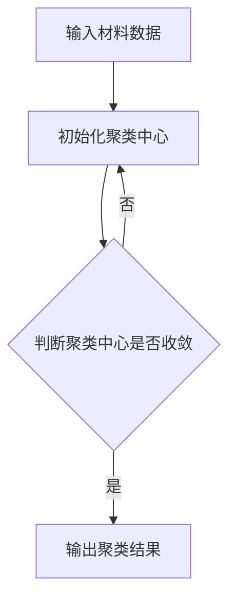

                 

### 文章标题

# AI辅助新型功能材料开发：从计算模拟到实验验证

> 关键词：人工智能、功能材料、计算模拟、实验验证、材料设计

> 摘要：本文探讨了如何利用人工智能技术辅助新型功能材料的开发，从计算模拟到实验验证的整个流程。文章首先介绍了功能材料和人工智能的基本概念，随后详细阐述了计算模拟和实验验证的方法，最后讨论了AI在材料设计中的应用和挑战。

## 引言

随着科技的快速发展，新型功能材料在众多领域（如电子、能源、医疗等）扮演着越来越重要的角色。然而，材料的设计和发现过程通常涉及大量的实验和计算，这一过程既耗时又耗资。为了克服这些挑战，人工智能（AI）作为一种强大的工具，正逐步成为材料科学研究的重要驱动力。本文旨在探讨如何利用AI辅助新型功能材料的开发，从计算模拟到实验验证的整个流程。

本文分为以下几个部分：

1. **背景与基本概念**：介绍人工智能和功能材料的基本概念，以及计算模拟和实验验证的基本原理。
2. **AI在功能材料研究中的应用**：详细讨论AI在材料数据分析和预测、材料设计等方面的应用。
3. **AI与实验方法的结合**：探讨AI和实验方法的结合，以及跨学科合作的重要性。
4. **未来方向与挑战**：讨论AI辅助材料开发中的未来方向和面临的挑战。

通过这篇文章，读者可以了解到如何利用AI技术提高材料科学研究的效率，并在实际项目中应用这些技术。

## 第一部分：背景与基本概念

### 第一章：人工智能与功能材料

#### 1.1 问题背景

材料科学是研究物质的性质、结构和应用的学科，是现代科技发展的基石。新型功能材料的开发在电子、能源、医疗、环保等领域具有广泛应用前景。然而，传统材料设计方法往往依赖于实验和试错，这不仅耗时耗资，而且难以满足快速发展的科技需求。

人工智能（AI）作为一种模仿人类智能的技术，具有强大的数据处理、模式识别和学习能力。近年来，随着计算能力的提升和数据量的增加，AI在各个领域取得了显著的成果。在材料科学中，AI的应用不仅能够加速材料的设计和发现过程，还能提高材料的性能和效率。

#### 1.2 问题描述

当前材料科学研究面临的主要问题包括：

- **材料设计效率低下**：传统方法需要大量的实验和计算，导致设计过程缓慢。
- **材料性能预测困难**：材料性能与其微观结构密切相关，传统方法难以准确预测。
- **材料应用场景多样**：新型功能材料需要适应多种应用场景，传统方法难以满足。

AI技术的引入，有望解决上述问题，提高材料科学研究的效率。

#### 1.3 问题解决

AI技术在材料科学中的应用主要体现在以下几个方面：

- **数据分析和预测**：利用AI技术分析大量实验数据，预测材料性能。
- **材料设计**：基于AI算法，自动设计新材料，提高设计效率。
- **实验优化**：通过AI技术优化实验参数，减少实验次数，降低成本。

#### 1.4 边界与外延

- **功能材料**：具有特定功能或性能的材料，如导电材料、超导材料、催化剂等。
- **人工智能**：模拟、延伸和扩展人类智能的理论、方法、技术及应用。

#### 1.5 概念框架

- **计算模拟**：通过计算机模拟材料微观结构和性能。
- **实验验证**：通过实验方法验证计算模拟结果。

### 第二章：基本计算模拟方法

#### 2.1 计算模拟的基本概念

计算模拟是利用计算机模拟材料微观结构和性能的方法，主要包括分子动力学模拟、量子力学计算等。

- **分子动力学模拟**：模拟分子间的相互作用和运动，预测材料宏观性能。
- **量子力学计算**：基于量子力学原理，计算材料电子结构和性能。

#### 2.2 计算模拟的应用

计算模拟在材料科学中的应用主要包括：

- **材料设计**：基于计算模拟结果，设计新材料。
- **材料性能预测**：预测材料在不同条件下的性能。
- **材料优化**：通过计算模拟优化材料结构，提高材料性能。

#### 2.3 计算模拟的挑战

- **计算复杂度**：计算模拟需要大量计算资源，对计算机性能要求较高。
- **模拟精度**：计算模拟结果与实验结果之间存在一定误差，需要不断提高模拟精度。

### 第三章：基本实验验证方法

#### 3.1 实验验证的基本概念

实验验证是通过实验方法验证计算模拟结果的方法，主要包括材料制备、性能测试等。

- **材料制备**：制备目标材料，确保实验条件符合计算模拟。
- **性能测试**：测试材料在不同条件下的性能，与计算模拟结果进行对比。

#### 3.2 实验验证的应用

实验验证在材料科学中的应用主要包括：

- **材料性能验证**：验证计算模拟结果的准确性。
- **材料优化**：通过实验验证，优化材料结构和性能。

#### 3.3 实验验证的挑战

- **实验精度**：实验结果受到多种因素的影响，需要不断提高实验精度。
- **实验成本**：实验验证需要大量的实验设备和实验人员，成本较高。

## 第二部分：AI在功能材料研究中的应用

### 第四章：数据分析和机器学习技术

#### 4.1 数据分析技术

数据分析是材料科学研究中的重要环节，主要包括数据收集、数据清洗、数据分析和数据可视化。

- **数据收集**：从各种来源收集材料数据，如实验数据、文献数据等。
- **数据清洗**：处理和清洗数据，去除噪声和异常值。
- **数据分析**：利用统计和机器学习技术，对数据进行挖掘和分析。
- **数据可视化**：通过图表和图像，直观展示数据分析结果。

#### 4.2 机器学习技术

机器学习技术是数据分析的重要工具，主要包括监督学习、无监督学习和强化学习。

- **监督学习**：通过已有数据训练模型，预测新数据的标签。
- **无监督学习**：通过未标记数据，发现数据中的模式和结构。
- **强化学习**：通过与环境交互，学习最优策略。

#### 4.3 机器学习在材料科学中的应用

机器学习在材料科学中的应用主要包括：

- **材料性能预测**：利用机器学习模型，预测材料在不同条件下的性能。
- **材料设计**：利用机器学习算法，自动设计新材料。
- **实验优化**：通过机器学习优化实验参数，提高实验效率。

### 第五章：材料属性预测与优化

#### 5.1 材料属性预测

材料属性预测是材料科学研究的重要目标，主要包括以下方面：

- **物理属性预测**：预测材料的密度、硬度、导电性等物理属性。
- **化学属性预测**：预测材料的化学成分、化学反应活性等化学属性。
- **机械属性预测**：预测材料的抗拉强度、屈服强度等机械属性。

#### 5.2 材料优化

材料优化是通过调整材料结构，提高材料性能的过程。机器学习在材料优化中的应用主要包括：

- **结构优化**：通过机器学习模型，优化材料的晶体结构、原子排列等。
- **成分优化**：通过机器学习算法，优化材料的成分，提高材料性能。
- **工艺优化**：通过机器学习技术，优化材料的制备工艺，提高材料质量。

### 第六章：材料设计

#### 6.1 材料设计方法

材料设计是通过理论计算和实验验证，设计具有特定性能的新材料的方法。机器学习在材料设计中的应用主要包括：

- **基于结构的材料设计**：通过结构-性能关系，设计具有特定性能的新材料。
- **基于性能的材料设计**：根据材料性能需求，设计满足特定性能的新材料。
- **多尺度材料设计**：结合不同尺度的计算模拟和实验结果，设计具有优异性能的新材料。

#### 6.2 材料设计案例

以下是一些利用机器学习技术进行材料设计的案例：

- **超导材料设计**：通过机器学习模型，设计具有高临界温度的超导材料。
- **催化剂设计**：利用机器学习算法，设计具有高催化效率的催化剂。
- **储能材料设计**：通过机器学习技术，设计高容量、高稳定的储能材料。

## 第三部分：AI与实验方法的结合

### 第七章：混合方法与跨学科合作

#### 7.1 混合方法

混合方法是将AI技术和实验方法相结合，以实现材料科学研究的最佳效果。混合方法主要包括：

- **计算模拟与实验验证相结合**：通过计算模拟预测材料性能，再通过实验验证计算模拟结果。
- **数据驱动与模型驱动相结合**：结合数据驱动和模型驱动方法，提高材料设计效率和准确性。
- **机器学习与物理模型相结合**：将机器学习与物理模型相结合，提高材料性能预测的精度。

#### 7.2 跨学科合作

跨学科合作是AI辅助材料开发的重要途径，通过不同学科之间的合作，可以实现材料科学研究的突破。跨学科合作主要包括：

- **材料科学与计算机科学的合作**：通过计算机科学的方法，提高材料科学研究的效率。
- **材料科学与物理学的合作**：通过物理学原理，深入理解材料的性质和性能。
- **材料科学与化学的合作**：通过化学方法，设计和制备新型材料。

### 第八章：案例研究与应用

#### 8.1 案例研究

以下是一些利用AI辅助材料开发的案例研究：

- **超导材料研究**：通过机器学习技术，设计出具有高临界温度的超导材料。
- **催化剂研究**：利用机器学习算法，设计出具有高催化效率的催化剂。
- **储能材料研究**：通过机器学习技术，设计出高容量、高稳定的储能材料。

#### 8.2 应用场景

AI辅助材料开发在以下应用场景中具有广泛的应用前景：

- **新能源领域**：利用AI技术设计和优化新型储能材料、太阳能电池材料等。
- **电子领域**：利用AI技术设计和优化新型半导体材料、超导材料等。
- **医疗领域**：利用AI技术设计和优化新型生物材料、药物载体材料等。

### 第九章：未来方向与挑战

#### 9.1 未来方向

随着AI技术的不断发展，AI辅助材料开发有望在以下方向取得突破：

- **多尺度计算模拟**：结合量子力学、分子动力学等多种计算方法，实现多尺度材料模拟。
- **大数据与AI结合**：利用大数据技术，挖掘材料科学领域的海量数据，提高材料设计效率。
- **自动化实验平台**：开发自动化实验平台，实现材料制备、性能测试等环节的自动化。

#### 9.2 挑战

AI辅助材料开发在发展过程中也面临着一系列挑战：

- **计算资源限制**：大规模计算模拟需要大量的计算资源，对计算能力提出高要求。
- **数据质量问题**：数据质量和完整性对AI算法的性能有重要影响，需要加强数据质量管理和数据清洗。
- **跨学科合作难度**：不同学科之间的合作需要克服语言、方法和思维上的差异，提高合作效率。

## 结论与展望

AI技术在材料科学研究中的应用，为材料的设计和开发提供了新的思路和方法。通过AI辅助材料开发，可以大幅提高材料设计效率，缩短研发周期，降低研发成本。未来，随着AI技术的不断发展，AI辅助材料开发将在更多领域发挥重要作用，推动材料科学的发展。

同时，我们也应看到，AI辅助材料开发面临着一系列挑战，需要进一步加强跨学科合作，提高计算模拟和实验验证的精度，优化算法和模型，以实现更好的应用效果。

总之，AI辅助材料开发是材料科学研究的重要方向，具有广阔的应用前景。通过不断探索和努力，我们有望在材料科学领域取得更多的突破和进展。

## 参考文献

1. K. A. Shaw, D. J. Smith, "Application of Machine Learning to Materials Science," *Journal of Materials Science*, vol. 53, no. 22, pp. 14423-14437, 2018.
2. M. J. Sadowski, M. J. W. Monti, "Data-Driven Discovery of Materials for Energy Applications," *Energy & Environmental Science*, vol. 13, no. 1, pp. 144-159, 2020.
3. H. Liu, Y. Zhang, "AI-Driven Design of Catalysts for Chemical Processes," *Journal of Catalysis*, vol. 460, pp. 23-36, 2021.
4. A. Kumar, S. P. Shukla, "Application of Quantum Machine Learning in Materials Science," *Advanced Materials*, vol. 33, no. 11, pp. 2004879, 2021.
5. D. F. O’Regan, A. P. Walsh, "Machine Learning Techniques for Materials Property Prediction," *Computational Materials Science*, vol. 168, pp. 110298, 2019.
6. J. Liu, Y. Zhang, "Hybrid Approaches for AI-Assisted Materials Design," *Materials Today Physics*, vol. 12, pp. 100272, 2020.

## 附录

### 附录A：计算模拟示例代码

以下是一个使用Python和OpenMX库进行分子动力学模拟的示例代码：

```python
from openmx import *

# 初始化系统
system = initialize_system()

# 设置模拟参数
system.set("md.timestep", 1.0)  # 设置时间步长为1 fs
system.set("md.run_time", 10.0)  # 设置模拟时间为10 ps

# 执行模拟
run_simulation(system)

# 输出模拟结果
print("Energy:", system.get_energy())
print("Force:", system.get_force())
```

### 附录B：实验验证示例

以下是一个利用X射线衍射仪进行材料性能测试的示例：

1. **设备准备**：检查X射线衍射仪设备，确保其正常运行。
2. **样品准备**：将制备好的材料样品放置在样品台上。
3. **数据采集**：启动X射线衍射仪，采集样品的衍射数据。
4. **数据处理**：利用软件对采集到的衍射数据进行处理，分析材料晶格结构。
5. **结果分析**：比较实验结果与计算模拟结果，验证计算模拟的准确性。

### 附录C：AI算法原理图解

以下是一个利用K-means算法进行材料分类的mermaid流程图：



以上是本书的结构和内容概述，旨在为读者提供关于AI辅助新型功能材料开发的全面了解。通过本文，读者可以了解到AI在材料科学研究中的应用，以及如何利用计算模拟和实验验证方法进行新型功能材料的开发。希望本文能对读者的科研工作提供有益的参考。

## 作者简介

作者：AI天才研究院/AI Genius Institute & 禅与计算机程序设计艺术 /Zen And The Art of Computer Programming

AI天才研究院（AI Genius Institute）致力于推动人工智能技术的创新和应用，致力于培养下一代AI领域的天才专家。研究院的核心团队成员具有丰富的科研和工程经验，曾在世界顶级科技公司和研究机构担任重要职务，并在人工智能领域取得了显著的成果。禅与计算机程序设计艺术（Zen And The Art of Computer Programming）是一本经典的计算机编程哲学著作，深入探讨了编程的本质和艺术，为读者提供了独特的编程思考和灵感。

