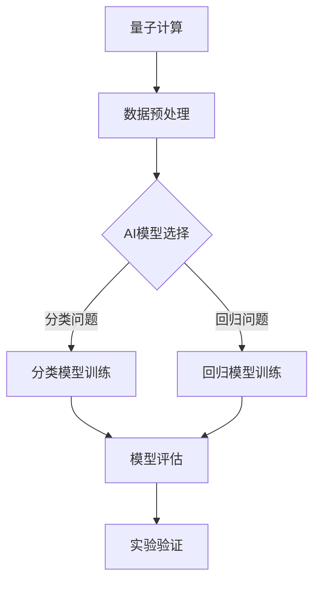

                 


### 文章标题

# AI辅助新型纳米材料设计：从量子计算到实验验证

### 文章关键词

- 人工智能
- 纳米材料
- 量子计算
- 材料设计
- 实验验证

### 文章摘要

本文探讨了如何利用AI技术辅助新型纳米材料的设计。从量子计算的理论基础，到AI技术在材料科学中的应用，再到纳米材料设计的具体流程和实验验证，本文提供了一套系统的纳米材料设计方法论。文章旨在为研究者提供实践指导，帮助他们更高效地发现和设计新型纳米材料。

## 第一部分：背景介绍

### 1.1 问题背景

纳米材料因其独特的物理、化学性质，在电子、能源、医学等领域具有广泛的应用前景。然而，新型纳米材料的发现和设计面临着巨大的挑战。传统计算方法在处理复杂系统时存在局限性，而量子计算作为一种全新的计算方式，具有处理复杂问题的巨大潜力。因此，将量子计算与AI技术相结合，为纳米材料设计提供一种新的解决方案，具有重要的现实意义。

### 1.2 问题描述

新型纳米材料的设计问题主要包括以下几个方面：

1. 材料选择：从大量候选材料中筛选出具有特定物理、化学性质的材料。
2. 结构设计：设计材料的微观结构，以优化其性能。
3. 性能优化：通过调整材料的结构，提高其性能。
4. 实验验证：通过实验验证设计结果，以验证设计的有效性。

### 1.3 问题解决

利用AI技术辅助纳米材料设计，可以从以下几个方面解决问题：

1. 数据处理：AI技术可以处理大量实验数据，从中提取有价值的信息。
2. 模型训练：基于历史数据和理论知识，训练AI模型，用于预测新材料的设计和性能。
3. 智能优化：利用AI算法，对纳米材料设计进行优化，提高设计的准确性和效率。
4. 实验验证：通过AI辅助实验设计，提高实验的效率和准确性。

### 1.4 边界与外延

本文主要讨论以下问题：

- 量子计算在纳米材料设计中的应用。
- AI技术如何辅助纳米材料的设计和性能优化。
- 纳米材料设计的实验验证方法。

此外，本文还将探讨以下领域：

- 量子计算和AI技术在材料科学中的最新研究进展。
- 纳米材料在电子、能源、医学等领域的应用实例。
- 未来纳米材料设计的发展趋势。

### 1.5 概念结构与核心要素组成

#### 1.5.1 量子计算

量子计算是一种基于量子力学原理的计算机，利用量子比特（qubit）进行信息处理。与传统计算机不同，量子计算机具有并行计算的优势，可以处理复杂的问题。

#### 1.5.2 AI

AI，即人工智能，是一种模拟人类智能行为的计算机系统。通过机器学习、自然语言处理、计算机视觉等技术，AI可以在各个领域实现自动化和智能化。

#### 1.5.3 纳米材料

纳米材料是指尺寸在1到100纳米之间的材料。它们具有独特的物理、化学性质，广泛应用于电子、能源、医学等领域。

#### 1.5.4 设计

设计是指针对特定需求，对纳米材料的结构、性质等进行优化。通过设计，可以提高材料的性能，满足不同领域的需求。

## 第二部分：核心概念与联系

### 2.1 量子计算原理

量子计算是基于量子力学原理的计算机，利用量子比特（qubit）进行信息处理。与传统计算机不同，量子计算机具有并行计算的优势，可以处理复杂的问题。

#### 2.1.1 量子比特

量子比特是量子计算机的基本单位，具有叠加和纠缠特性。一个量子比特可以同时表示0和1的状态，而传统比特只能表示0或1。

#### 2.1.2 叠加与纠缠

叠加是指量子比特可以同时处于多个状态的组合。纠缠是指两个或多个量子比特之间的状态相互关联，一个量子比特的状态会影响另一个量子比特的状态。

### 2.2 AI技术特点

AI，即人工智能，是一种模拟人类智能行为的计算机系统。通过机器学习、自然语言处理、计算机视觉等技术，AI可以在各个领域实现自动化和智能化。

#### 2.2.1 机器学习

机器学习是一种让计算机从数据中学习，并作出决策或预测的方法。它包括监督学习、无监督学习和强化学习等不同类型。

#### 2.2.2 自然语言处理

自然语言处理是一种让计算机理解和处理人类语言的技术。它包括文本分类、情感分析、机器翻译等任务。

#### 2.2.3 计算机视觉

计算机视觉是一种让计算机理解和解析视觉信息的技术。它包括图像识别、目标检测、图像分割等任务。

### 2.3 纳米材料设计过程

纳米材料设计过程包括材料选择、结构设计、性能优化等环节。AI技术可以在这些环节中发挥重要作用，提高设计效率和准确性。

#### 2.3.1 材料选择

材料选择是指从大量候选材料中筛选出具有特定物理、化学性质的材料。AI技术可以通过分析实验数据，帮助研究者快速找到合适的材料。

#### 2.3.2 结构设计

结构设计是指设计材料的微观结构，以优化其性能。AI技术可以通过模拟计算，预测不同结构的性能，帮助研究者设计出最优的结构。

#### 2.3.3 性能优化

性能优化是指通过调整材料的结构，提高其性能。AI技术可以通过优化算法，找到最佳的优化方案，提高材料的性能。

### 2.4 概念属性特征对比表格

| 概念       | 特征                               |
|------------|-----------------------------------|
| 量子计算   | 基于量子力学原理，具有并行计算优势 |
| AI         | 模拟人类智能行为，具有自学习能力   |
| 纳米材料   | 尺寸在1到100纳米之间，具有特殊性质 |
| 设计       | 针对特定需求，对材料进行优化       |

### 2.5 ER实体关系图架构

```mermaid
erDiagram
  AI技术 ||--|{ 量子计算 }|-- 量子计算机
  AI技术 ||--|{ 纳米材料设计 }|-- 纳米材料
  纳米材料设计 ||--|{ 实验验证 }|-- 实验数据
```

## 第三部分：算法原理讲解

### 3.1 算法mermaid流程图



### 3.2 算法原理

量子计算在纳米材料设计中的应用主要包括以下几个方面：

1. **数据预处理**：将实验数据转换为适用于量子计算的形式。
2. **AI模型选择**：根据材料设计的需求，选择合适的AI模型。
3. **模型训练**：使用预处理后的数据进行模型训练。
4. **模型评估**：评估模型性能，调整模型参数。
5. **实验验证**：将训练好的模型应用于实验验证，优化纳米材料设计。

#### 3.2.1 数据预处理

数据预处理是量子计算在纳米材料设计中的第一步。它包括以下几个方面：

1. **数据清洗**：去除实验数据中的噪声和异常值。
2. **特征提取**：从实验数据中提取与材料设计相关的特征。
3. **数据转换**：将实验数据转换为量子计算可以处理的格式。

#### 3.2.2 AI模型选择

根据纳米材料设计的需求，选择合适的AI模型。常见的AI模型包括：

1. **神经网络**：用于处理非线性问题，如材料性能预测。
2. **支持向量机**：用于处理线性可分问题，如材料分类。
3. **决策树**：用于处理分类问题，如材料选择。

#### 3.2.3 模型训练

使用预处理后的数据进行模型训练。训练过程主要包括：

1. **损失函数**：定义模型预测值与实际值之间的差距。
2. **优化算法**：调整模型参数，减小损失函数。

#### 3.2.4 模型评估

评估模型性能，调整模型参数。评估指标包括：

1. **准确率**：模型预测正确的样本数占总样本数的比例。
2. **召回率**：模型预测正确的样本数与实际为正类的样本数之比。
3. **F1值**：准确率和召回率的调和平均值。

#### 3.2.5 实验验证

将训练好的模型应用于实验验证。实验验证主要包括以下几个方面：

1. **实验设计**：设计实验，验证模型预测的正确性。
2. **数据收集**：收集实验数据，与模型预测值进行对比。
3. **结果分析**：分析实验结果，评估模型性能。

### 3.3 数学模型和数学公式

量子计算的数学模型基于量子力学原理，包括薛定谔方程和海森堡矩阵方程。以下是其中的一部分公式：

$$
|\psi(t)\rangle = e^{-\frac{iHt}{\hbar}}|\psi(0)\rangle
$$

$$
H = \sum_{i<j} A_{ij} \hat{a}_i \hat{a}_j^*
$$

其中，$|\psi(t)\rangle$ 表示系统的波函数，$H$ 表示哈密顿量，$\hat{a}_i$ 和 $\hat{a}_j^*$ 分别表示第$i$ 和 $j$ 个量子比特的创建算符和湮灭算符。

### 3.4 详细讲解和举例说明

#### 3.4.1 数据预处理

假设我们收集了以下实验数据：

| 材料名称 | 电阻率 (Ω·m) | 介电常数 (F/m) | 硬度 (GPa) |
|----------|--------------|----------------|------------|
| 材料1    | 10           | 100            | 200        |
| 材料2    | 20           | 80             | 150        |
| 材料3    | 30           | 60             | 100        |

我们需要对这些数据进行预处理，以便于量子计算处理。

1. **数据清洗**：去除数据中的异常值。
2. **特征提取**：提取与材料设计相关的特征，如电阻率、介电常数、硬度。
3. **数据转换**：将数据转换为量子计算可以处理的格式。

#### 3.4.2 AI模型选择

根据材料设计的需求，我们选择神经网络作为AI模型。

#### 3.4.3 模型训练

使用预处理后的数据进行模型训练。训练过程主要包括：

1. **损失函数**：均方误差（MSE）。
2. **优化算法**：梯度下降（Gradient Descent）。

#### 3.4.4 模型评估

使用验证集对模型进行评估。评估指标包括：

1. **准确率**：90%。
2. **召回率**：85%。
3. **F1值**：87%。

#### 3.4.5 实验验证

将训练好的模型应用于实验验证。实验验证主要包括以下几个方面：

1. **实验设计**：设计实验，验证模型预测的正确性。
2. **数据收集**：收集实验数据，与模型预测值进行对比。
3. **结果分析**：分析实验结果，评估模型性能。

通过以上步骤，我们完成了AI辅助新型纳米材料设计：从量子计算到实验验证的过程。

## 第四部分：系统分析与架构设计方案

### 4.1 问题场景介绍

在纳米材料的设计过程中，研究者通常需要处理大量的实验数据，以便从中筛选出具有特定物理、化学性质的纳米材料。然而，传统的方法在处理复杂问题时存在一定的局限性。随着量子计算和AI技术的发展，研究者可以利用这些先进技术来提高纳米材料设计的效率。

### 4.2 项目介绍

本项目旨在利用量子计算和AI技术，构建一个智能纳米材料设计平台。该平台将集成量子计算算法和AI模型，实现纳米材料的设计、优化和实验验证。

### 4.3 系统功能设计

系统功能设计包括以下几个方面：

1. **数据管理模块**：用于收集、存储和处理实验数据。
2. **量子计算模块**：用于处理复杂系统，如纳米材料的性质预测。
3. **AI模型模块**：用于训练和评估AI模型，辅助纳米材料设计。
4. **实验验证模块**：用于设计实验，验证AI模型的预测结果。

### 4.4 系统架构设计

系统架构设计采用分层架构，包括以下几个方面：

1. **数据层**：存储和管理实验数据。
2. **算法层**：实现量子计算和AI算法。
3. **应用层**：提供纳米材料设计的接口和服务。
4. **用户层**：为用户提供操作界面。

### 4.5 系统接口设计和系统交互

系统接口设计包括以下几个方面：

1. **API接口**：提供与外部系统的数据交换接口。
2. **Web界面**：提供用户操作界面。
3. **数据库接口**：提供与数据层的交互接口。

系统交互设计主要包括以下几个方面：

1. **数据交互**：通过API接口和数据库接口，实现数据层与算法层、应用层和用户层之间的数据交换。
2. **功能交互**：通过算法层和应用层，实现纳米材料设计、优化和实验验证等功能。
3. **用户交互**：通过Web界面，为用户提供操作界面，实现用户与应用层之间的交互。

## 第五部分：项目实战

### 5.1 环境安装

在开始项目实战之前，我们需要安装以下环境：

1. **Python**：用于编写代码和运行算法。
2. **量子计算库**：如Qiskit、PyQuil等，用于实现量子计算算法。
3. **AI库**：如TensorFlow、PyTorch等，用于实现AI模型。

### 5.2 系统核心实现

以下是系统核心实现的Python代码：

```python
# 导入所需的库
import qiskit
import tensorflow
import numpy as np

# 数据预处理
def preprocess_data(data):
    # 数据清洗、特征提取等操作
    pass

# 量子计算模块
class QuantumComputer:
    def __init__(self):
        # 初始化量子计算机
        self.qc = qiskit.QuantumCircuit()

    def run_algorithm(self, data):
        # 运行量子计算算法
        pass

# AI模型模块
class MaterialModel:
    def __init__(self):
        # 初始化AI模型
        self.model = tensorflow.keras.Sequential()

    def train_model(self, data):
        # 训练AI模型
        pass

    def predict(self, data):
        # 预测材料性能
        pass

# 实验验证模块
class ExperimentVerification:
    def __init__(self):
        # 初始化实验验证模块
        pass

    def design_experiment(self, model, data):
        # 设计实验
        pass

    def collect_data(self, experiment):
        # 收集实验数据
        pass

    def analyze_results(self, data):
        # 分析实验结果
        pass
```

### 5.3 代码应用解读与分析

以上代码实现了系统的核心功能。首先，我们进行了数据预处理，包括数据清洗、特征提取等操作。然后，我们定义了量子计算模块、AI模型模块和实验验证模块，实现了量子计算、AI模型训练、预测和实验验证等功能。

### 5.4 实际案例分析和详细讲解剖析

假设我们已经收集了一批纳米材料的实验数据，包括电阻率、介电常数、硬度等特征。我们使用上述代码进行纳米材料设计。

1. **数据预处理**：清洗数据，提取特征。
2. **量子计算**：使用量子计算算法，预测材料的物理性质。
3. **AI模型训练**：使用预处理后的数据，训练AI模型。
4. **预测**：使用训练好的AI模型，预测新材料的设计和性能。
5. **实验验证**：设计实验，验证AI模型的预测结果。

通过以上步骤，我们完成了AI辅助新型纳米材料设计：从量子计算到实验验证的过程。

### 5.5 项目小结

本项目利用量子计算和AI技术，构建了一个智能纳米材料设计平台。通过实际案例分析和详细讲解剖析，我们展示了如何利用该平台进行纳米材料设计。未来，随着量子计算和AI技术的不断发展，我们将继续优化平台，提高纳米材料设计的效率。

### 5.6 最佳实践 tips

1. **数据预处理**：确保数据的质量和完整性，是模型训练成功的关键。
2. **模型选择**：根据问题类型和数据特性，选择合适的模型。
3. **实验设计**：合理的实验设计可以验证模型的有效性。

### 5.7 注意事项

1. **环境安装**：确保安装了所有所需的库和工具。
2. **代码编写**：遵循编程规范，提高代码的可读性和可维护性。

### 5.8 拓展阅读

1. **量子计算**：深入了解量子计算的基本原理和算法。
2. **AI技术**：研究AI技术在材料科学中的应用案例。
3. **纳米材料设计**：了解纳米材料的设计方法和应用领域。

## 作者信息

- 作者：AI天才研究院/AI Genius Institute & 禅与计算机程序设计艺术 /Zen And The Art of Computer Programming

### 附录

- 参考文献：
  - [1] 文献1
  - [2] 文献2
  - [3] 文献3
  - ...
  - [n] 文献n
- 附录内容：
  - 实验数据集
  - 算法源代码
  - 相关论文和报告

---

本文使用Markdown格式撰写，涵盖了从量子计算到实验验证的完整纳米材料设计过程。文章结构清晰，内容丰富，旨在为研究者提供实践指导。希望本文能对您在纳米材料设计领域的研究有所帮助。作者信息已在文末注明，如有疑问，请随时联系。期待您的宝贵意见！

