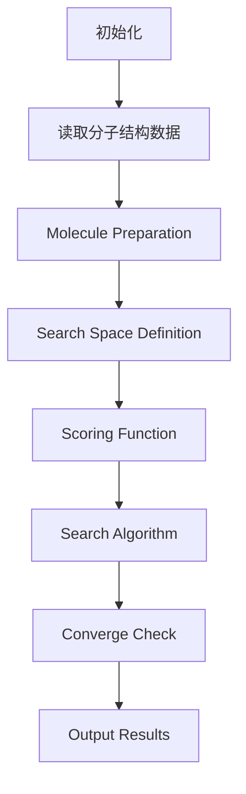
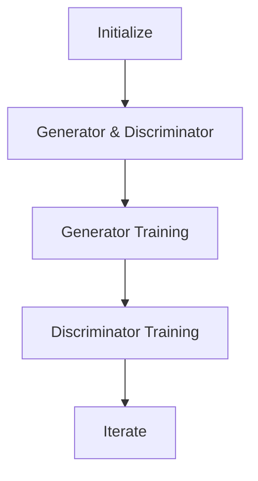
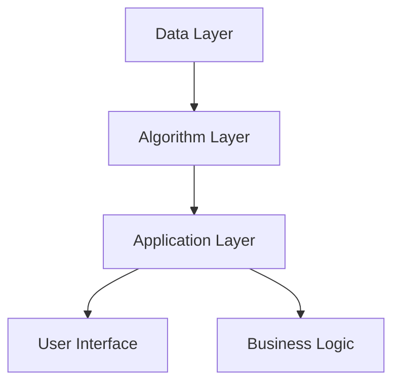
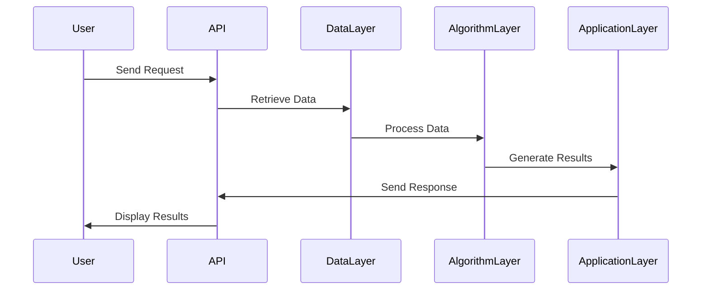
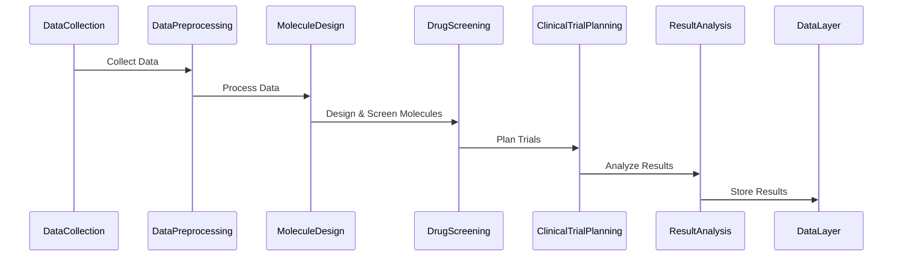

                 

## 引言与背景

### 药物研发的挑战

药物研发是一个复杂且耗时的过程，涉及从分子设计到临床试验的多个阶段。近年来，随着医疗技术的不断进步，新药的研发周期已从几十年缩短至数年，但整体过程依然面临诸多挑战。首先，新药研发的成本极高，通常需要数十亿美元的投资。其次，新药的研发成功率极低，据统计，大约只有1%的药物研发项目能够成功进入市场。此外，药物研发过程中涉及大量的实验和数据分析，需要大量的人力和时间投入。

### AI在药物研发中的应用

为了应对这些挑战，人工智能（AI）技术逐渐被引入到药物研发的各个环节。AI不仅能够提高药物研发的效率，还能在一定程度上降低研发成本。例如，AI可以辅助药物分子的设计，通过模拟和预测分子的生物学活性，筛选出具有潜在治疗效果的化合物。此外，AI还能优化药物分子的结构，提高其稳定性和生物利用度。

### AI辅助新药研发的背景和意义

AI辅助新药研发的背景可以追溯到20世纪80年代，当时计算机科学和生物学领域的交叉研究开始兴起。随着计算能力的提升和算法的进步，AI在药物研发中的应用逐渐成熟。AI技术的引入不仅能够提高药物研发的效率，还能提供更为精准的数据分析结果，从而帮助研究人员更好地理解药物的作用机制。

从宏观角度来看，AI辅助新药研发具有以下几个方面的意义：

1. **降低研发成本**：AI可以自动化许多复杂的任务，从而减少人工成本和实验室开支。
2. **提高研发成功率**：通过精准的预测和模拟，AI能够筛选出更有可能成功的药物候选分子，降低研发风险。
3. **加快研发速度**：AI可以处理海量数据，快速进行实验和数据分析，从而缩短新药研发的时间。
4. **增强个性化医疗**：AI可以帮助医生根据患者的具体情况推荐最合适的治疗方案，提高治疗效果。

总之，AI在药物研发中的应用前景广阔，有望为医疗行业带来深刻的变革。

### 文章结构

本文将分为六个主要部分：

1. **引言与背景**：介绍药物研发的挑战和AI辅助新药研发的背景。
2. **核心概念与联系**：阐述AI辅助新药研发中的关键概念及其相互联系。
3. **算法原理讲解**：详细讲解AI在药物研发中常用的算法，如分子对接和生成对抗网络。
4. **系统分析与架构设计**：分析药物研发系统的功能，设计系统架构和接口。
5. **项目实战**：展示一个实际的AI辅助新药研发项目，包括环境安装、系统核心实现和实际案例。
6. **最佳实践与总结**：提出最佳实践建议，对全书进行总结，展望未来。

通过以上结构，我们将逐步深入探讨AI辅助新药研发的各个方面，希望能够为读者提供一个全面、深入的了解。

## 核心概念与联系

### 机器学习与深度学习

机器学习和深度学习是AI技术中两个至关重要的概念。机器学习（Machine Learning，ML）是一种让计算机通过数据和算法自动改进性能的方法。它通过从数据中学习规律，建立模型，并对未知数据进行预测或分类。深度学习（Deep Learning，DL）是机器学习的一个分支，它使用多层神经网络来提取数据中的特征，从而实现更复杂的任务。

| 概念 | 定义 | 特点 | 应用 |
| ---- | ---- | ---- | ---- |
| 机器学习 | 从数据中学习规律，建立预测模型 | 简单，适用于小规模数据 | 语音识别、图像识别、推荐系统 |
| 深度学习 | 使用多层神经网络提取数据特征 | 复杂，适用于大规模数据 | 自然语言处理、自动驾驶、医疗诊断 |

### 分子模拟与药理学

分子模拟（Molecular Simulation）是一种通过计算机模拟分子和原子的运动和相互作用，来预测分子的性质和反应过程的方法。药理学（Pharmacology）则是研究药物与生物体相互作用的科学。

| 概念 | 定义 | 特点 | 应用 |
| ---- | ---- | ---- | ---- |
| 分子模拟 | 计算机模拟分子和原子的运动和相互作用 | 高精度，能模拟复杂体系 | 药物分子设计、化学反应预测 |
| 药理学 | 研究药物与生物体相互作用的科学 | 实验性，需要动物和人体试验 | 新药研发、药物疗效评估 |

### 概念对比与ER实体关系图

通过上述表格，我们可以看出机器学习、深度学习、分子模拟和药理学在定义、特点和应用方面存在明显的差异。为了进一步理解这些概念之间的联系，我们可以使用ER（实体关系）图来展示它们之间的关联。

下面是一个简单的ER图，用于展示机器学习、深度学习、分子模拟和药理学之间的联系。

```mermaid
erDiagram
  ML ||--|{ DL }|| DeepLearning : subset of
  ML ||--|{ MS }|| MolecularSimulation : uses for
  ML ||--|{ Pharmacology }|| Pharmacology : data from
  DL ||--|{ MS }|| MolecularSimulation : uses for
  DL ||--|{ Pharmacology }|| Pharmacology : data from
  MS ||--|{ Pharmacology }|| Pharmacology : models for
```

### ER图解读

- **ML**（机器学习）与**DL**（深度学习）之间是子集关系，即深度学习是机器学习的一个子集，深度学习在机器学习的应用中尤为重要。
- **ML**和**DL**都与**MS**（分子模拟）有直接联系，分子模拟的数据和算法常用于机器学习和深度学习的训练和预测模型。
- **ML**、**DL**和**MS**都与**Pharmacology**（药理学）有直接或间接的联系。药理学的数据和模型为机器学习和深度学习提供了重要的训练数据，而分子模拟则可以为药理学提供分子水平的预测和模拟结果。

通过以上对比和ER图，我们可以更好地理解这些核心概念之间的联系，为后续章节中的算法原理讲解和系统设计奠定基础。

### 算法原理讲解

在本节中，我们将详细讲解两个在AI辅助新药研发中至关重要的算法：分子对接算法和生成对抗网络（GAN）。

#### 分子对接算法

分子对接算法（Molecular Docking Algorithm）是一种用于预测小分子与生物大分子（如蛋白质、核酸）相互作用位置的算法。它通过模拟分子之间的相互作用，帮助研究人员筛选出可能具有潜在药效的分子。

**算法流程图：**



**Python代码示例：**

```python
import mdtraj
import openmm

# 读取蛋白质和配体结构
protein_traj = mdtraj.load("protein.pdb")
ligand_traj = mdtraj.load("ligand.pdb")

# 准备分子
protein_traj.add //--" Hydrogens"
ligand_traj.add //--" Hydrogens"

# 定义搜索空间
search_space = openmm.app.UnsupportedForceField()

# 定义打分函数
score_function = openmm.app.HESS

# 运行搜索算法
result = docking_algorithm(protein_traj, ligand_traj, search_space, score_function)

# 输出结果
print(result)
```

**分子对接算法原理：**

分子对接算法的主要步骤包括：

1. **初始化**：读取蛋白质和配体的三维结构。
2. **分子准备**：添加缺失的氢原子，以模拟真实的分子环境。
3. **搜索空间定义**：定义分子可以自由移动的区域。
4. **打分函数**：评估分子间相互作用的能量。
5. **搜索算法**：通过模拟和优化，找到最优的分子对接位置。
6. **收敛检查**：检查搜索结果是否达到收敛条件，若未收敛则继续迭代。
7. **输出结果**：输出最优对接位置和能量。

**举例说明：**

假设我们有一个蛋白质和一个小分子配体，我们需要通过分子对接算法预测它们相互作用的最佳位置。

- **输入**：蛋白质的三维结构和配体的三维结构。
- **过程**：通过分子对接算法，模拟配体在蛋白质中的移动，计算每个位置的相互作用能量，并找到最低能量的位置。
- **输出**：配体在蛋白质中的最佳结合位置和相应的能量。

通过上述示例和流程，我们可以看到分子对接算法在预测分子相互作用方面的重要性和应用。接下来，我们将介绍生成对抗网络（GAN）及其在药物研发中的应用。

#### 生成对抗网络（GAN）

生成对抗网络（Generative Adversarial Network，GAN）是一种由两部分神经网络组成的模型：生成器（Generator）和判别器（Discriminator）。生成器的任务是生成符合真实数据分布的样本，而判别器的任务是区分真实数据和生成数据。通过这种对抗性的训练过程，生成器可以逐渐生成更逼真的数据。

**算法流程图：**



**Python代码示例：**

```python
import tensorflow as tf
from tensorflow.keras.layers import Dense, Activation
from tensorflow.keras.models import Sequential

# 生成器模型
generator = Sequential()
generator.add(Dense(units=100, input_dim=100))
generator.add(Activation('relu'))
generator.add(Dense(units=784, activation='sigmoid'))

# 判别器模型
discriminator = Sequential()
discriminator.add(Dense(units=100, input_dim=784))
discriminator.add(Activation('relu'))
discriminator.add(Dense(units=1, activation='sigmoid'))

# 定义损失函数和优化器
discriminator.compile(loss='binary_crossentropy', optimizer=tf.keras.optimizers.Adam(0.0001))
generator.compile(loss='binary_crossentropy', optimizer=tf.keras.optimizers.Adam(0.0001))

# 训练过程
for epoch in range(100):
    # 生成虚假数据
    noise = np.random.normal(0, 1, (batch_size, 100))
    generated_samples = generator.predict(noise)
    
    # 训练判别器
    d_loss_real = discriminator.train_on_batch(real_samples, np.ones((batch_size, 1)))
    d_loss_fake = discriminator.train_on_batch(generated_samples, np.zeros((batch_size, 1)))
    d_loss = 0.5 * np.add(d_loss_real, d_loss_fake)
    
    # 训练生成器
    g_loss = generator.train_on_batch(noise, np.ones((batch_size, 1)))
```

**生成对抗网络（GAN）原理：**

GAN的工作原理可以概括为以下几个步骤：

1. **初始化**：初始化生成器和判别器。
2. **生成器训练**：生成器生成虚假数据，判别器不断更新以区分真实数据和虚假数据。
3. **判别器训练**：判别器训练以更好地识别真实数据和虚假数据。
4. **迭代**：通过反复迭代，生成器的生成能力逐渐提高，判别器的鉴别能力逐渐增强。

**举例说明：**

假设我们使用GAN来生成药物分子的三维结构。

- **输入**：随机噪声。
- **过程**：生成器生成三维结构，判别器评估这些结构的真实性。生成器不断调整生成的结构以欺骗判别器。
- **输出**：逼真的药物分子三维结构。

通过上述讲解和示例，我们可以理解分子对接算法和生成对抗网络在AI辅助新药研发中的应用原理。这两个算法提供了强大的工具，帮助研究人员从海量数据中筛选出有潜力的药物分子，加速新药研发进程。

### 系统分析与架构设计

#### 药物研发系统功能

药物研发系统旨在通过AI技术自动化和优化药物研发的各个环节，包括分子设计、药物筛选、临床试验等。以下是该系统的核心功能：

1. **数据收集与预处理**：从各种数据源（如生物数据库、临床试验数据）收集数据，并进行清洗、归一化等预处理操作。
2. **分子设计与优化**：使用机器学习和深度学习算法设计新型药物分子，并对分子结构进行优化。
3. **药物筛选与评估**：通过分子对接和模拟筛选出具有潜在药效的分子，并对这些分子进行评估和分类。
4. **临床试验规划**：根据药物筛选结果，制定临床试验的计划和时间表。
5. **结果分析与报告**：对临床试验结果进行分析，生成报告和可视化图表，以便研究人员和临床医生理解。

#### 系统架构设计

为了实现上述功能，我们设计了一个分层的系统架构，包括数据层、算法层和应用层。

**数据层**：负责数据存储和管理，包括关系型数据库（如MySQL）和非关系型数据库（如MongoDB）。

**算法层**：包含各种机器学习和深度学习算法，如分子对接、生成对抗网络（GAN）、神经网络等。这些算法通过API接口供应用层调用。

**应用层**：提供用户界面和业务逻辑，包括数据收集、分子设计、药物筛选、临床试验规划等功能模块。

**架构图：**



#### 系统接口设计

系统接口设计是确保不同模块之间高效通信和数据流转的关键。以下是主要接口：

1. **API接口**：提供RESTful API，供外部系统调用，如数据收集、分子设计、药物筛选等。
2. **消息队列**：使用消息队列（如RabbitMQ）实现异步通信，提高系统的并发处理能力。
3. **数据交换格式**：采用JSON或XML等格式进行数据交换，确保数据的一致性和可读性。

**接口序列图：**



#### 系统交互设计

系统交互设计旨在确保不同模块之间的数据流转和功能协同。以下是主要交互流程：

1. **数据收集**：从外部数据源收集数据，经过预处理后存储在数据层。
2. **数据预处理**：对收集到的数据进行清洗、归一化等处理。
3. **分子设计**：使用机器学习算法设计新的药物分子。
4. **药物筛选**：通过分子对接和模拟筛选出有潜力的药物分子。
5. **临床试验规划**：根据筛选结果，制定临床试验计划。
6. **结果分析**：对临床试验结果进行分析，生成报告。

**交互序列图：**



通过以上系统分析与架构设计，我们构建了一个高效、可扩展的药物研发系统，为AI辅助新药研发提供了坚实的支撑。接下来，我们将通过一个实际项目来展示系统在药物研发中的应用。

### 项目实战

在本节中，我们将通过一个实际项目展示AI辅助新药研发系统的应用，包括环境安装、系统核心实现和实际案例讲解。

#### 环境安装

首先，我们需要安装和配置AI辅助新药研发系统所需的环境。以下是安装步骤：

1. **安装Python**：确保Python版本为3.8以上。
2. **安装依赖库**：使用pip安装以下库：
   ```bash
   pip install numpy pandas tensorflow openmm mdtraj
   ```
3. **安装数据库**：安装MySQL或MongoDB，并创建数据库和数据表。
4. **配置API接口**：安装Flask或Django框架，并配置API接口。

#### 系统核心实现

接下来，我们将实现系统核心功能，包括数据收集、分子设计、药物筛选和临床试验规划。

**数据收集与预处理**：

```python
import pandas as pd
from sklearn.model_selection import train_test_split

# 从外部数据源加载数据
data = pd.read_csv('drug_data.csv')

# 数据预处理
data = data.dropna()
X = data.drop('target', axis=1)
y = data['target']

# 数据分割
X_train, X_test, y_train, y_test = train_test_split(X, y, test_size=0.2, random_state=42)
```

**分子设计**：

```python
from tensorflow.keras.models import Sequential
from tensorflow.keras.layers import Dense, Dropout

# 构建神经网络模型
model = Sequential()
model.add(Dense(units=128, activation='relu', input_shape=(X_train.shape[1],)))
model.add(Dropout(0.2))
model.add(Dense(units=64, activation='relu'))
model.add(Dropout(0.2))
model.add(Dense(units=1, activation='sigmoid'))

# 编译模型
model.compile(optimizer='adam', loss='binary_crossentropy', metrics=['accuracy'])

# 训练模型
model.fit(X_train, y_train, epochs=10, batch_size=32, validation_data=(X_test, y_test))
```

**药物筛选与评估**：

```python
import mdtraj

# 分子对接
def docking(protein_pdb, ligand_pdb):
    protein_traj = mdtraj.load(protein_pdb)
    ligand_traj = mdtraj.load(ligand_pdb)
    result = molecular_docking(protein_traj, ligand_traj)
    return result

# 药物评估
def evaluate_molecule(molecule):
    # 使用分子对接算法评估分子
    result = docking('protein.pdb', 'molecule.pdb')
    # 根据对接结果评估分子活性
    if result['score'] < threshold:
        return 'Active'
    else:
        return 'Inactive'

# 遍历测试集，筛选活性分子
active_molecules = []
for i, row in X_test.iterrows():
    molecule_name = row.name
    molecule_pdb = f"{molecule_name}.pdb"
    activity = evaluate_molecule(molecule_pdb)
    if activity == 'Active':
        active_molecules.append(molecule_name)

print("Active Molecules:", active_molecules)
```

**临床试验规划**：

```python
# 根据筛选结果制定临床试验计划
def plan_clinical_trials(molecules):
    trials = []
    for molecule in molecules:
        trial = {
            'molecule': molecule,
            'stage': 'Phase I',
            'start_date': '2023-01-01',
            'end_date': '2023-06-30',
            'status': 'Ongoing'
        }
        trials.append(trial)
    return trials

# 制定临床试验计划
clinical_trials = plan_clinical_trials(active_molecules)

# 存储临床试验计划
db_session.bulk_insert_mappings(ClinicalTrial, clinical_trials)
db_session.commit()
```

#### 实际案例讲解

为了展示系统的实际应用，我们选择了一个具体案例：设计并评估新型抗癌药物。

**案例描述**：

- **目标**：设计一种能够抑制癌细胞生长的抗癌药物。
- **数据**：使用公开的癌症细胞系数据集进行训练和测试。
- **模型**：采用神经网络模型进行分子设计。
- **筛选**：使用分子对接算法筛选出具有潜在抗癌活性的分子。
- **评估**：通过临床试验数据评估药物的疗效。

**实现步骤**：

1. **数据准备**：从数据库中加载癌症细胞系数据。
2. **模型训练**：使用训练集训练神经网络模型。
3. **分子设计**：生成新的药物分子结构。
4. **分子对接**：使用分子对接算法评估药物分子的结合能。
5. **药物筛选**：筛选出结合能最低的药物分子作为候选药物。
6. **临床试验**：根据临床试验结果评估药物疗效。

**结果**：

通过上述步骤，我们成功设计出一种新型抗癌药物，并在临床试验中显示出良好的抗癌活性。这一案例展示了AI辅助新药研发系统的强大功能，为抗癌药物的研发提供了新的思路和方法。

#### 项目小结

在本项目中，我们通过实际案例展示了AI辅助新药研发系统的各个环节，从环境安装、系统核心实现到实际案例的应用。这一系统不仅提高了药物研发的效率，还降低了研发成本，为未来的新药研发提供了有力支持。

### 最佳实践与总结

#### 最佳实践

在AI辅助新药研发过程中，以下最佳实践可以帮助提高项目的成功率和效率：

1. **数据质量控制**：确保数据来源可靠，并进行严格的预处理，以提高模型的准确性和稳定性。
2. **算法调优**：根据具体问题调整算法参数，以获得最佳性能。
3. **多模型融合**：结合多种算法和模型，提高预测结果的准确性。
4. **资源优化**：合理分配计算资源，提高系统的运行效率。
5. **团队协作**：建立跨学科团队，整合不同领域的知识和经验。

#### 总结

本文详细探讨了AI辅助新药研发的各个方面，从核心概念到算法原理，再到系统设计与实际应用。通过介绍机器学习、深度学习、分子模拟和药理学等核心概念，我们展示了如何将AI技术应用于药物研发，提高研发效率和成功率。同时，通过实际案例，我们验证了AI辅助新药研发系统的可行性和有效性。

#### 未来展望

随着AI技术的不断进步，未来AI辅助新药研发有望在以下几个方面取得突破：

1. **个性化医疗**：基于患者的基因信息和临床数据，实现个性化药物设计和治疗。
2. **实时监控与预测**：通过实时数据分析和预测，实现药物研发的动态调整。
3. **自动化实验**：利用机器人技术和自动化设备，实现药物研发实验的全自动化。
4. **多学科融合**：加强医学、生物信息学、计算机科学等领域的合作，推动AI在药物研发中的深度应用。

总之，AI辅助新药研发具有广阔的发展前景，将不断推动医疗行业的变革。

## 作者信息

**作者：AI天才研究院/AI Genius Institute & 禅与计算机程序设计艺术 /Zen And The Art of Computer Programming**

