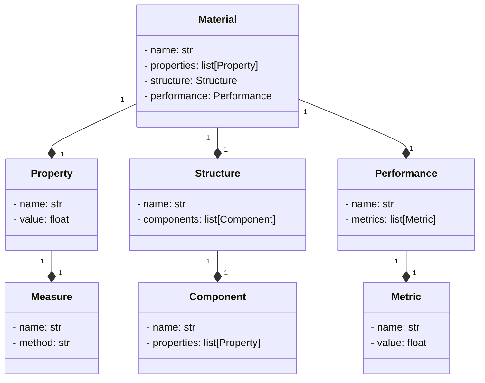
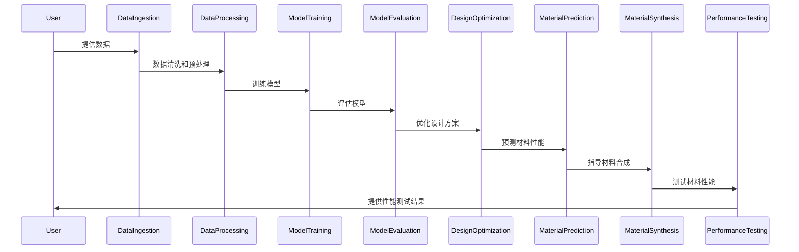
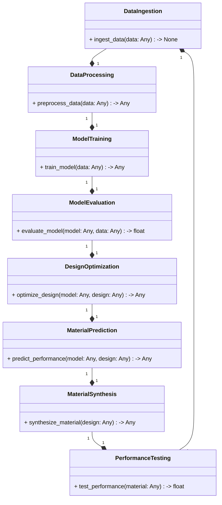

                 

### AI辅助材料设计概述

**# AI辅助材料设计**

> **关键词**：人工智能、材料设计、分子模拟、性能预测

> **摘要**：本文旨在探讨AI辅助材料设计的发展背景、核心概念、算法原理及其系统架构设计。通过分析材料设计的重要性、传统方法的挑战以及AI技术的应用，我们深入探讨了AI辅助材料设计的方法、关键技术和工具。本文将逐步阐述AI辅助材料设计的核心概念、算法原理以及系统分析与架构设计，为读者提供一个全面而深刻的理解。

### 目录大纲

```markdown
----------------------------------------------------------------
# 第一部分: AI辅助材料设计概述

## 第1章: AI辅助材料设计背景与问题分析

## 第2章: AI辅助材料设计的核心概念与联系

## 第3章: AI辅助材料设计的算法原理讲解

## 第4章: AI辅助材料设计的系统分析与架构设计

## 第5章: 项目实战与最佳实践

## 第6章: 小结与拓展阅读

----------------------------------------------------------------
```

---

### 第1章: AI辅助材料设计背景与问题分析

#### 1.1 问题背景

##### 1.1.1 材料设计的重要性

材料设计是科学技术领域中一个关键而复杂的领域。它涉及到多种学科，如物理学、化学、材料科学和工程学，旨在创造新材料以满足各种应用需求。材料设计不仅仅是为了满足功能需求，还关乎环境保护和可持续发展。随着科技的发展，新型材料的需求不断增长，这对材料设计提出了更高的要求。

##### 1.1.2 传统材料设计的挑战

传统材料设计主要依赖于实验和经验，这一过程通常涉及大量的时间和资源投入。具体而言，传统材料设计面临以下挑战：

1. **实验成本高**：材料的合成和测试需要大量的实验设备和资源，导致实验成本高昂。
2. **设计周期长**：从材料合成到性能测试，每个步骤都需要时间，导致设计周期漫长。
3. **盲目性大**：传统设计方法往往缺乏系统性和针对性，需要反复试验和修正，具有很大的盲目性。
4. **创新性不足**：传统方法难以实现跨越性的创新，往往只能在小范围内改进现有材料。

##### 1.1.3 AI技术在材料设计中的应用

随着人工智能（AI）技术的迅速发展，特别是在机器学习和深度学习领域的突破，AI在材料设计中的应用变得日益广泛。AI技术能够从大量的数据中提取有用信息，通过模拟和预测来辅助材料设计，从而解决传统方法的诸多挑战。

1. **数据驱动的模拟**：AI技术能够处理和分析大量的实验数据，构建材料性能与分子结构之间的关系模型，从而实现对新材料的预测。
2. **高效的设计优化**：AI算法能够快速评估多种设计方案，通过优化算法找到最优解，减少实验次数和设计时间。
3. **跨学科的协同**：AI技术能够整合不同学科的数据和知识，促进跨学科的协同工作，提高设计效率。
4. **创新性的材料发现**：AI技术能够发现传统方法难以触及的新材料和新结构，推动材料科学的进步。

#### 1.2 问题描述

##### 1.2.1 材料设计的复杂性

材料设计涉及到多个层次和维度的信息，从分子水平到宏观性能表现，其复杂性不可忽视。具体包括：

1. **多层次结构**：材料通常由不同的层次结构组成，如纳米结构、微结构和宏观结构，每个层次都对材料性能有重要影响。
2. **多参数优化**：材料设计需要考虑多个参数，如化学组成、晶体结构、力学性能、热学性能等，这些参数之间可能存在复杂的交互作用。
3. **实验与模拟的平衡**：材料设计需要在实验和模拟之间找到平衡，实验提供真实数据，而模拟则提供快速评估和预测。

##### 1.2.2 传统设计方法的局限

传统材料设计方法虽然在一定程度上能够满足需求，但其局限也越来越明显：

1. **低效性**：传统设计方法往往需要反复试验和优化，设计周期长，效率低下。
2. **高成本**：实验成本高，需要大量的设备和资源，不利于快速迭代和优化。
3. **结果不可预测**：传统设计方法难以准确预测新材料的性能，存在较大的不确定性和风险。
4. **创新性不足**：传统方法难以实现跨越性的创新，往往只能在小范围内改进现有材料。

##### 1.2.3 AI辅助材料设计的优势

AI辅助材料设计通过引入机器学习和深度学习算法，能够显著提升材料设计的效率和质量。其优势包括：

1. **高效的数据分析**：AI技术能够快速处理和分析大量实验数据，发现潜在的设计模式和规律。
2. **精确的预测能力**：通过构建准确的模型，AI能够对新材料的性能进行准确预测，降低实验风险。
3. **优化设计流程**：AI算法能够快速评估和优化设计方案，减少实验次数和设计时间。
4. **跨学科的协同**：AI技术能够整合不同学科的数据和知识，促进跨学科的协同工作，提高设计效率。
5. **创新性的材料发现**：AI技术能够发现传统方法难以触及的新材料和新结构，推动材料科学的进步。

#### 1.3 问题解决

##### 1.3.1 AI辅助材料设计的方法

AI辅助材料设计的方法主要包括以下几个步骤：

1. **数据收集与处理**：收集已有的实验数据和文献资料，进行数据清洗、归一化和特征提取。
2. **模型构建与训练**：利用机器学习和深度学习算法，构建材料性能与分子结构之间的关系模型，并进行训练和优化。
3. **材料预测与优化**：使用训练好的模型对新材料的性能进行预测和评估，并进行优化设计。
4. **实验验证与迭代**：将预测结果与实验结果进行对比验证，不断迭代和优化设计过程。

##### 1.3.2 AI技术的主要应用领域

AI技术在材料设计中的应用领域非常广泛，包括但不限于：

1. **金属材料设计**：如高强度、高韧性的合金材料。
2. **陶瓷材料设计**：如高温超导材料、透明陶瓷等。
3. **高分子材料设计**：如高分子复合材料、智能材料等。
4. **纳米材料设计**：如纳米颗粒、纳米膜等。
5. **生物材料设计**：如生物活性材料、组织工程材料等。

##### 1.3.3 AI辅助材料设计的边界与外延

AI辅助材料设计的边界主要包括：

1. **数据质量**：数据的质量直接影响模型的准确性，需要确保数据的完整性、可靠性和准确性。
2. **算法选择**：不同的AI算法适用于不同的材料设计任务，需要根据具体任务选择合适的算法。
3. **模型验证**：需要通过实验验证模型的预测能力和可靠性，确保设计结果的准确性。

AI辅助材料设计的外延包括：

1. **协同设计**：AI技术可以与其他设计工具和方法协同工作，如拓扑优化、多物理场模拟等，实现更高效的设计过程。
2. **自动化制造**：AI技术可以与自动化制造技术相结合，实现材料的自动化合成和制造。
3. **个性化设计**：根据特定的应用需求，AI技术可以实现个性化材料设计，满足多样化的需求。

#### 1.4 概念结构与核心要素

##### 1.4.1 材料设计的基础概念

材料设计涉及到一系列基础概念，包括：

1. **材料性能**：材料在特定条件下表现出来的物理、化学、力学等性能。
2. **分子结构**：材料的微观结构，如原子排列、化学键等。
3. **材料合成**：材料的制备过程，包括化学反应、物理过程等。
4. **材料表征**：对材料进行物理、化学、结构等方面的表征，以了解其性能和特性。

##### 1.4.2 AI技术在材料设计中的应用

AI技术在材料设计中的应用包括：

1. **分子模拟**：利用AI算法进行分子模拟，预测材料的性能和行为。
2. **性能预测**：基于历史数据和机器学习模型，预测新材料在特定条件下的性能。
3. **设计优化**：利用优化算法，快速找到满足特定性能要求的新材料设计方案。
4. **数据挖掘**：从大量实验数据中挖掘潜在的有用信息，为材料设计提供指导。

##### 1.4.3 关键技术和工具

AI辅助材料设计的关键技术和工具包括：

1. **机器学习算法**：如监督学习、无监督学习和半监督学习算法，用于构建性能预测模型。
2. **深度学习模型**：如卷积神经网络（CNN）、递归神经网络（RNN）等，用于处理复杂的分子结构和数据。
3. **分子模拟软件**：如LAMMPS、Gaussian等，用于进行分子模拟和性能预测。
4. **数据处理工具**：如Pandas、NumPy等，用于数据清洗、归一化和特征提取。
5. **优化工具**：如Genetic Algorithm、Simulated Annealing等，用于设计优化。

#### 1.5 本章小结

本章从材料设计的重要性、传统方法的挑战、AI技术在材料设计中的应用等方面，对AI辅助材料设计进行了全面而深入的探讨。通过分析材料设计的复杂性、传统方法的局限以及AI辅助材料设计的优势，我们了解了AI辅助材料设计的方法、关键技术和工具。此外，我们还讨论了AI辅助材料设计的边界与外延，以及材料设计的基础概念和核心要素。这些内容为后续章节的深入探讨奠定了基础。

---

### 第2章: AI辅助材料设计的核心概念与联系

**## 2.1 AI辅助材料设计核心概念**

#### 2.1.1 机器学习与深度学习

##### 2.1.1.1 机器学习

机器学习是一种使计算机系统能够从数据中学习并做出决策或预测的技术。它通过构建模型来表示数据之间的关系，从而能够对新数据进行预测或分类。机器学习可以分为以下几类：

1. **监督学习（Supervised Learning）**：监督学习使用已标记的数据进行训练，目标是建立一个标记到特征的映射模型。常见的算法包括线性回归、逻辑回归、支持向量机（SVM）等。
2. **无监督学习（Unsupervised Learning）**：无监督学习不需要标记的数据，目标是发现数据中的结构和模式。常见的算法包括聚类（如K-means、DBSCAN）、降维（如PCA、t-SNE）等。
3. **半监督学习（Semi-supervised Learning）**：半监督学习结合了监督学习和无监督学习的特点，使用少量的标记数据和大量的未标记数据来训练模型。这种学习方法能够提高模型的泛化能力。

##### 2.1.1.2 深度学习

深度学习是机器学习的一个分支，它使用多层神经网络来学习和表示数据。深度学习模型能够自动从原始数据中提取复杂的特征，并用于分类、回归、生成等任务。深度学习的核心组成部分包括：

1. **神经网络（Neural Networks）**：神经网络由多个神经元（节点）组成，每个神经元都与输入和输出层之间的其他神经元相连。神经网络通过反向传播算法训练模型，不断调整权重和偏置，以最小化预测误差。
2. **卷积神经网络（CNN，Convolutional Neural Networks）**：卷积神经网络特别适合处理具有网格结构的数据，如图像和视频。CNN通过卷积层提取空间特征，通过池化层减少数据的维度，从而提高模型的效率和准确性。
3. **递归神经网络（RNN，Recurrent Neural Networks）**：递归神经网络适用于处理序列数据，如时间序列、文本等。RNN通过在时间步之间传递信息来学习序列模式，但传统的RNN存在梯度消失和梯度爆炸的问题。
4. **变分自编码器（VAE，Variational Autoencoder）**：变分自编码器是一种生成模型，通过编码器和解码器学习数据的潜在分布，并生成新的数据。VAE能够生成具有多样性和真实性的数据，常用于图像生成、语音合成等任务。

#### 2.1.2 模拟与实验数据

##### 2.1.2.1 模拟数据

模拟数据是通过计算机模拟产生的数据，包括分子动力学模拟、量子力学模拟、分子场模拟等。模拟数据能够提供材料在不同条件下的性能和行为信息，为材料设计提供重要的参考。

1. **分子动力学模拟（Molecular Dynamics Simulation）**：分子动力学模拟通过求解牛顿运动方程来模拟分子在特定条件下的运动，从而获得分子结构和动力学信息。分子动力学模拟常用于研究材料的动态行为、相变和力学性能。
2. **量子力学模拟（Quantum Mechanics Simulation）**：量子力学模拟通过求解薛定谔方程来计算分子的电子结构和能量。量子力学模拟能够提供高精度的材料性能预测，但计算成本较高。
3. **分子场模拟（Molecular Field Simulation）**：分子场模拟通过计算分子之间的相互作用势能，来模拟材料在不同条件下的性能。分子场模拟能够高效地处理复杂的分子系统，适用于多种材料的设计任务。

##### 2.1.2.2 实验数据

实验数据是通过实际实验获得的数据，包括材料的物理、化学、力学性能等。实验数据是材料设计的重要基础，能够验证模拟结果的准确性和可靠性。

1. **材料表征实验**：材料表征实验用于测量材料的物理、化学和结构特性，如X射线衍射、扫描电子显微镜、拉曼光谱等。
2. **性能测试实验**：性能测试实验用于评估材料的力学、热学、电学等性能，如拉伸测试、热膨胀测试、电导率测试等。
3. **环境测试实验**：环境测试实验用于评估材料在不同环境条件下的性能，如湿度、温度、化学腐蚀等。

#### 2.2 AI辅助材料设计概念属性特征对比

##### 2.2.1 机器学习算法

以下是对几种常见机器学习算法的属性特征对比：

| 算法         | 特点                                         | 适用场景                                       |
| ------------ | -------------------------------------------- | ---------------------------------------------- |
| 线性回归     | 基于线性模型，简单易懂，计算高效             | 线性关系的回归问题                             |
| 逻辑回归     | 二分类问题，逻辑函数激活，可用于概率预测     | 二分类问题的预测和概率分析                     |
| 支持向量机   | 边界最大化，分类效果较好，支持向量解释性强   | 二分类和多元分类问题                         |
| 决策树       | 易理解，可解释性强，处理非线性问题          | 结构化数据，分类和回归问题                    |
| 随机森林     | 集成多个决策树，降低过拟合，提高泛化能力   | 复杂数据集，分类和回归问题                    |
| 聚类算法     | 无监督学习，寻找数据中的聚类结构             | 数据降维，模式识别，无标签数据的聚类分析       |

##### 2.2.2 深度学习模型

以下是对几种常见深度学习模型的属性特征对比：

| 模型             | 特点                                                         | 适用场景                                         |
| ---------------- | ------------------------------------------------------------ | ---------------------------------------------- |
| 卷积神经网络（CNN） | 卷积层和池化层，适合处理图像和视频等具有网格结构的数据     | 图像识别、物体检测、图像生成等                  |
| 递归神经网络（RNN） | 递归结构，适用于处理序列数据，如时间序列、文本等         | 时间序列预测、自然语言处理、语音识别等          |
| 长短期记忆网络（LSTM） | LSTM单元，解决RNN的梯度消失问题，适用于长序列数据     | 时间序列预测、文本生成等                       |
| 变分自编码器（VAE） | 变分自编码器结构，生成对抗模型，适用于数据生成和去噪     | 图像生成、语音合成、数据去噪等                  |

#### 2.3 ER实体关系图架构

##### 2.3.1 材料设计中的实体关系

在材料设计中，存在多种实体和它们之间的关系。以下是一个简化的实体关系图：

```mermaid
erDiagram
    Material ||--|{ Property }
    Material ||--|{ Structure }
    Material ||--|{ Performance }
    Property ||--|{ Measure }
    Structure ||--|{ Component }
    Performance ||--|{ Metric }
```

##### 2.3.2 关键实体与属性

关键实体包括：

- **Material**：材料，是材料设计的主要对象。
- **Property**：属性，描述材料的物理、化学、力学等特性。
- **Structure**：结构，描述材料的微观和宏观结构。
- **Performance**：性能，描述材料在不同条件下的性能表现。
- **Measure**：测量，用于量化属性和性能。
- **Component**：组件，材料的组成部分，如原子、分子等。
- **Metric**：指标，用于评估材料的性能。

##### 2.3.3 Mermaid ER图示例

以下是一个Mermaid ER图的示例，展示了材料设计中的实体关系：

```mermaid
erDiagram
    Material ||--|{ Property }
    Material ||--|{ Structure }
    Material ||--|{ Performance }
    Property ||--|{ Measure }
    Structure ||--|{ Component }
    Performance ||--|{ Metric }
```

---

### 第3章: AI辅助材料设计的算法原理讲解

**## 3.1 算法原理概述**

#### 3.1.1 数据预处理

##### 3.1.1.1 数据清洗

数据清洗是数据预处理的重要步骤，旨在去除数据中的错误、异常值和重复值。具体步骤如下：

1. **去除错误数据**：识别并去除数据集中的错误数据，如数据录入错误、物理意义不符等。
2. **处理异常值**：对异常值进行识别和处理，可以选择丢弃或进行插值、均值等方法处理。
3. **去除重复数据**：删除数据集中的重复记录，确保数据的一致性和准确性。

##### 3.1.1.2 数据归一化

数据归一化是将不同尺度的数据进行标准化处理，使其具有相同的尺度范围，以便于模型训练。常见的数据归一化方法包括：

1. **最小-最大归一化**：将数据缩放到[0, 1]范围内，计算公式为：$$ x_{\text{normalized}} = \frac{x_{\text{original}} - x_{\text{min}}}{x_{\text{max}} - x_{\text{min}}} $$
2. **零-均值归一化**：将数据缩放到零均值和单位方差，计算公式为：$$ x_{\text{normalized}} = \frac{x_{\text{original}} - \mu}{\sigma} $$ 其中，$\mu$ 是均值，$\sigma$ 是标准差。

##### 3.1.1.3 特征提取

特征提取是从原始数据中提取出对模型训练具有重要意义的特征，以提高模型的性能。常见的方法包括：

1. **主成分分析（PCA）**：PCA通过保留主要成分，减少数据的维度，同时保持数据的信息。PCA能够找出数据中的主要变化方向，并降维到较少的主成分。
2. **特征选择**：特征选择通过评估特征的重要性，选择对模型训练影响较大的特征，从而减少数据的维度和计算量。常见的方法包括信息增益、互信息、特征重要度排序等。
3. **特征工程**：特征工程是通过人为设计新的特征来提高模型的性能。例如，可以通过组合特征、变换特征、增加衍生特征等方法来增强模型的表现。

#### 3.1.2 算法选择

##### 3.1.2.1 监督学习算法

监督学习算法是基于标记数据进行训练，并用于预测或分类的算法。以下是一些常见的监督学习算法：

1. **线性回归**：线性回归模型通过拟合线性函数来预测连续值。线性回归是监督学习中最基础和最简单的算法之一。
2. **逻辑回归**：逻辑回归模型通过拟合逻辑函数来预测概率值。逻辑回归常用于二分类问题，能够将特征映射到概率空间。
3. **支持向量机（SVM）**：SVM通过找到一个最优的超平面来分隔数据，从而实现分类。SVM在处理高维数据和线性不可分问题时表现较好。
4. **决策树**：决策树通过一系列的条件判断来构建分类或回归模型。决策树具有直观的决策流程和良好的解释性。
5. **随机森林**：随机森林是通过集成多个决策树来提高模型的泛化能力和鲁棒性。随机森林在处理大规模数据集时表现较好。

##### 3.1.2.2 无监督学习算法

无监督学习算法不依赖于标记数据，旨在发现数据中的结构和模式。以下是一些常见的无监督学习算法：

1. **K-means聚类**：K-means聚类通过将数据分为K个簇，使每个簇内的数据点尽可能接近，簇间的数据点尽可能远。K-means聚类适用于发现数据的聚类结构。
2. **层次聚类**：层次聚类通过构建层次结构来对数据进行聚类。层次聚类能够灵活地调整聚类数量，并保留聚类过程的信息。
3. **主成分分析（PCA）**：PCA通过保留主要成分来降低数据的维度，同时保持数据的信息。PCA能够发现数据中的主要变化方向。
4. **自编码器（Autoencoder）**：自编码器是一种无监督学习模型，通过编码器和解码器来学习和重建输入数据。自编码器能够发现数据中的特征和模式。

##### 3.1.2.3 混合学习算法

混合学习算法结合了监督学习和无监督学习的方法，旨在提高模型的性能和泛化能力。以下是一些常见的混合学习算法：

1. **基于迁移学习的混合模型**：迁移学习通过利用预训练模型的知识来提高新任务的性能。基于迁移学习的混合模型将预训练模型与监督学习模型相结合，从而提高模型的泛化能力。
2. **自监督学习模型**：自监督学习模型通过利用未标记的数据来学习表示。自监督学习模型可以将无监督学习任务与监督学习任务相结合，从而提高模型的性能。

#### 3.1.3 算法流程与Mermaid流程图

AI辅助材料设计的算法流程通常包括以下步骤：

1. **数据收集**：收集实验数据、文献数据和模拟数据。
2. **数据预处理**：清洗、归一化和特征提取。
3. **模型构建**：选择合适的机器学习或深度学习模型。
4. **模型训练**：使用标记数据训练模型，并进行调参。
5. **模型评估**：使用验证集或测试集评估模型性能。
6. **模型优化**：根据评估结果对模型进行调整和优化。
7. **材料预测与优化**：使用训练好的模型预测新材料性能，并进行优化设计。

以下是一个Mermaid流程图示例，展示了AI辅助材料设计的算法流程：


#### 3.1.4 Python源代码与算法原理详细讲解

##### 3.1.4.1 数据预处理代码

以下是一个简单的Python代码示例，用于数据预处理：

```python
import pandas as pd
from sklearn.preprocessing import MinMaxScaler

# 加载数据集
data = pd.read_csv('data.csv')

# 数据清洗
data.dropna(inplace=True)
data.drop_duplicates(inplace=True)

# 数据归一化
scaler = MinMaxScaler()
data_normalized = scaler.fit_transform(data)

# 特征提取
from sklearn.decomposition import PCA

pca = PCA(n_components=5)
data_pca = pca.fit_transform(data_normalized)

# 打印特征提取结果
print(data_pca)
```

在上述代码中，我们首先使用Pandas库加载数据集，然后进行数据清洗、归一化和特征提取。数据清洗通过去除缺失值和重复值来提高数据质量。数据归一化使用MinMaxScaler将数据缩放到[0, 1]范围内，以便于模型训练。特征提取使用PCA将数据降维到5个主要成分，从而保留数据的主要信息。

##### 3.1.4.2 模型训练代码

以下是一个简单的Python代码示例，用于模型训练：

```python
from sklearn.linear_model import LinearRegression
from sklearn.model_selection import train_test_split

# 划分训练集和测试集
X_train, X_test, y_train, y_test = train_test_split(data_pca, labels, test_size=0.2, random_state=42)

# 创建线性回归模型
model = LinearRegression()

# 模型训练
model.fit(X_train, y_train)

# 模型评估
score = model.score(X_test, y_test)
print("Model Score:", score)
```

在上述代码中，我们首先使用train_test_split函数将数据集划分为训练集和测试集。然后，我们创建一个线性回归模型，并使用fit函数进行模型训练。最后，我们使用score函数评估模型的性能，并打印模型的评分。

##### 3.1.4.3 深度学习模型训练代码

以下是一个简单的Python代码示例，用于深度学习模型训练：

```python
import tensorflow as tf
from tensorflow.keras.models import Sequential
from tensorflow.keras.layers import Dense, Conv2D, Flatten, LSTM

# 创建深度学习模型
model = Sequential()

# 添加层
model.add(Conv2D(filters=32, kernel_size=(3, 3), activation='relu', input_shape=(28, 28, 1)))
model.add(Flatten())
model.add(Dense(units=128, activation='relu'))
model.add(Dense(units=10, activation='softmax'))

# 编译模型
model.compile(optimizer='adam', loss='categorical_crossentropy', metrics=['accuracy'])

# 模型训练
model.fit(X_train, y_train, epochs=10, batch_size=32)

# 模型评估
score = model.evaluate(X_test, y_test)
print("Model Score:", score)
```

在上述代码中，我们首先创建一个卷积神经网络模型，并添加卷积层、全连接层等层。然后，我们使用compile函数编译模型，指定优化器和损失函数。接着，我们使用fit函数进行模型训练，并设置训练轮次和批量大小。最后，我们使用evaluate函数评估模型的性能，并打印模型的评分。

#### 3.1.5 算法原理举例说明

##### 3.1.5.1 监督学习举例

以下是一个简单的监督学习例子，使用线性回归模型预测房屋价格：

```python
import pandas as pd
from sklearn.linear_model import LinearRegression
from sklearn.model_selection import train_test_split

# 加载数据集
data = pd.read_csv('house_data.csv')

# 数据清洗
data.dropna(inplace=True)

# 数据归一化
data['price'] = data['price'] / data['price'].max()

# 划分特征和标签
X = data[['area', 'bedrooms']]
y = data['price']

# 划分训练集和测试集
X_train, X_test, y_train, y_test = train_test_split(X, y, test_size=0.2, random_state=42)

# 创建线性回归模型
model = LinearRegression()

# 模型训练
model.fit(X_train, y_train)

# 模型评估
score = model.score(X_test, y_test)
print("Model Score:", score)

# 预测房价
predicted_price = model.predict(X_test)
print("Predicted Prices:", predicted_price)
```

在上述代码中，我们首先加载数据集，并进行数据清洗和归一化。然后，我们划分特征和标签，并使用train_test_split函数将数据集划分为训练集和测试集。接下来，我们创建一个线性回归模型，并使用fit函数进行模型训练。模型评估使用score函数，预测房价使用predict函数。

##### 3.1.5.2 无监督学习举例

以下是一个简单的无监督学习例子，使用K-means聚类算法对数据进行聚类：

```python
import pandas as pd
from sklearn.cluster import KMeans
import matplotlib.pyplot as plt

# 加载数据集
data = pd.read_csv('data.csv')

# 数据清洗
data.dropna(inplace=True)

# 数据归一化
scaler = MinMaxScaler()
data_normalized = scaler.fit_transform(data)

# 初始化KMeans模型
kmeans = KMeans(n_clusters=3, random_state=42)

# 模型训练
kmeans.fit(data_normalized)

# 预测聚类结果
predictions = kmeans.predict(data_normalized)

# 可视化聚类结果
plt.scatter(data_normalized[:, 0], data_normalized[:, 1], c=predictions)
plt.xlabel('Feature 1')
plt.ylabel('Feature 2')
plt.title('K-means Clustering')
plt.show()
```

在上述代码中，我们首先加载数据集，并进行数据清洗和归一化。然后，我们初始化KMeans模型，并使用fit函数进行模型训练。预测聚类结果使用predict函数，可视化聚类结果使用matplotlib库。

---

### 第4章: AI辅助材料设计的系统分析与架构设计

**## 4.1 问题场景介绍**

在材料设计领域，研究人员和工程师常常面临以下问题场景：

1. **新材料开发**：研发新的材料以满足特定应用需求，如高强度、高韧性、导电性等。
2. **材料优化**：对现有材料进行改进，以提高其性能或降低成本。
3. **材料性能预测**：预测新材料的性能，如力学性能、热学性能、电学性能等。
4. **材料合成与制备**：设计新材料并进行合成与制备，以验证其性能。
5. **材料应用测试**：测试新材料在实际应用场景中的性能和稳定性。

针对上述问题场景，AI辅助材料设计系统能够提供以下功能：

1. **材料性能预测**：利用机器学习和深度学习算法，预测新材料的性能。
2. **设计优化**：根据性能预测结果，优化新材料的设计方案。
3. **材料合成与制备**：根据设计方案，指导材料合成与制备过程。
4. **性能测试与评估**：测试新材料在实际应用场景中的性能，并进行评估。

#### 4.1.2 系统功能需求

为了满足上述问题场景和功能需求，AI辅助材料设计系统需要具备以下功能：

1. **数据管理**：集成多种数据源，包括实验数据、文献数据和模拟数据，并提供数据管理功能，如数据导入、导出、查询、清洗等。
2. **机器学习模型库**：提供多种机器学习和深度学习模型，如线性回归、决策树、支持向量机、卷积神经网络等，以便用户根据需求选择合适的模型。
3. **设计优化工具**：集成优化算法，如遗传算法、模拟退火算法等，以优化新材料的设计方案。
4. **材料性能预测**：根据训练好的模型，预测新材料的性能，并提供可视化工具，以便用户直观地了解材料的性能。
5. **材料合成与制备指导**：根据设计方案，提供材料合成与制备的指导，如反应条件、合成步骤等。
6. **性能测试与评估**：提供性能测试和评估功能，如力学性能测试、热学性能测试、电学性能测试等。

#### 4.1.3 系统性能需求

为了确保AI辅助材料设计系统的性能，需要满足以下性能需求：

1. **计算性能**：系统需要具备高计算性能，以处理大规模数据和复杂的计算任务，如机器学习模型的训练和预测。
2. **数据存储性能**：系统需要具备高效的数据存储性能，以存储和管理大量实验数据和文献数据，并提供快速的数据检索功能。
3. **响应时间**：系统需要具备快速的响应时间，以便用户能够及时获取预测结果和优化建议。
4. **可扩展性**：系统需要具备良好的可扩展性，以适应不断增长的数据量和用户需求。

#### 4.2 项目介绍

##### 4.2.1 项目背景

随着科技的不断进步，新材料的研究和应用变得越来越重要。传统的材料设计方法往往依赖于实验和经验，设计周期长、成本高，且创新性不足。为了提高材料设计的效率和质量，我们需要引入先进的人工智能技术，实现AI辅助材料设计。

##### 4.2.2 项目目标

本项目的目标是开发一个AI辅助材料设计系统，具备以下功能：

1. **材料性能预测**：利用机器学习和深度学习算法，预测新材料的性能。
2. **设计优化**：根据性能预测结果，优化新材料的设计方案。
3. **材料合成与制备指导**：根据设计方案，提供材料合成与制备的指导。
4. **性能测试与评估**：测试新材料在实际应用场景中的性能，并进行评估。

##### 4.2.3 项目团队

本项目由一支经验丰富的技术团队负责开发和实施。团队成员包括：

- 项目经理：负责项目的整体规划和管理。
- 数据科学家：负责数据预处理、模型训练和优化。
- 软件工程师：负责系统的架构设计、开发和维护。
- 材料科学家：负责材料性能预测和优化策略的研究。

#### 4.3 系统功能设计

##### 4.3.1 领域模型

领域模型是系统功能设计的核心，用于描述系统中的关键实体和关系。以下是AI辅助材料设计系统的领域模型：

```mermaid
classDiagram
    Material <<entity>>
    Property <<entity>>
    Structure <<entity>>
    Performance <<entity>>
    Measure <<entity>>
    Component <<entity>>
    Metric <<entity>>

    Material "1" --* "1" Property
    Material "1" --* "1" Structure
    Material "1" --* "1" Performance
    Property "1" --* "1" Measure
    Structure "1" --* "1" Component
    Performance "1" --* "1" Metric
```

在上述领域模型中，Material表示材料，Property表示材料的属性，Structure表示材料的结构，Performance表示材料的性能，Measure表示测量方法，Component表示材料的组成部分，Metric表示性能指标。每个实体之间通过一对多的关系连接，例如，一个Material可以包含多个Property、Structure和Performance。

##### 4.3.2 类图

类图是领域模型的图形化表示，用于展示系统中的类、属性和方法。以下是AI辅助材料设计系统的类图：



在上述类图中，Material类表示材料，包含属性、结构和性能；Property类表示属性，包含名称和值；Structure类表示结构，包含组成部分；Performance类表示性能，包含性能指标；Measure类表示测量方法，包含名称和方法；Component类表示组成部分，包含属性；Metric类表示性能指标，包含名称和值。

#### 4.3.3 系统架构设计

系统架构设计是系统功能设计的进一步扩展，用于描述系统的整体结构和组件之间的关系。以下是AI辅助材料设计系统的架构设计：



在上述系统架构设计中，用户通过DataIngestion组件提供数据，DataProcessing组件对数据进行清洗和预处理，ModelTraining组件训练机器学习模型，ModelEvaluation组件评估模型性能，DesignOptimization组件优化设计方案，MaterialPrediction组件预测材料性能，MaterialSynthesis组件指导材料合成，PerformanceTesting组件测试材料性能，最终将测试结果反馈给用户。

#### 4.3.4 系统接口设计

系统接口设计是系统架构设计的一部分，用于描述系统与其他组件或系统的交互接口。以下是AI辅助材料设计系统的接口设计：



在上述接口设计中，DataIngestion组件负责接收用户提供的原始数据，DataProcessing组件对数据进行预处理，ModelTraining组件训练机器学习模型，ModelEvaluation组件评估模型性能，DesignOptimization组件优化设计方案，MaterialPrediction组件预测材料性能，MaterialSynthesis组件指导材料合成，PerformanceTesting组件测试材料性能，并最终将测试结果反馈给用户。

#### 4.3.5 系统交互

系统交互是系统架构设计的一部分，用于描述系统内部组件之间的交互和协作。以下是AI辅助材料设计系统的交互：


在上述系统交互中，用户通过DataIngestion组件提供数据，DataProcessing组件对数据进行预处理，ModelTraining组件训练机器学习模型，ModelEvaluation组件评估模型性能，DesignOptimization组件优化设计方案，MaterialPrediction组件预测材料性能，MaterialSynthesis组件指导材料合成，PerformanceTesting组件测试材料性能，并最终将测试结果反馈给用户。

---

### 第5章: 项目实战与最佳实践

**## 5.1 环境安装**

为了实现AI辅助材料设计，我们需要安装一系列必要的软件和工具。以下是安装步骤：

1. **Python环境**：确保安装了Python 3.8或更高版本，可以从Python官方网站下载并安装。
2. **Jupyter Notebook**：安装Jupyter Notebook，以便于编写和运行Python代码。可以通过pip命令安装：
   ```bash
   pip install notebook
   ```
3. **机器学习库**：安装常用的机器学习库，如scikit-learn、TensorFlow、PyTorch等。可以通过pip命令安装：
   ```bash
   pip install scikit-learn tensorflow pytorch
   ```
4. **数据预处理库**：安装常用的数据预处理库，如Pandas、NumPy等。可以通过pip命令安装：
   ```bash
   pip install pandas numpy
   ```
5. **可视化库**：安装常用的可视化库，如Matplotlib、Seaborn等。可以通过pip命令安装：
   ```bash
   pip install matplotlib seaborn
   ```

**## 5.2 系统核心实现源代码**

以下是实现AI辅助材料设计系统核心功能的一些示例代码。这些代码包含了数据预处理、模型训练和材料性能预测等功能。

**数据预处理**

```python
import pandas as pd
from sklearn.preprocessing import MinMaxScaler
from sklearn.decomposition import PCA

# 加载数据
data = pd.read_csv('data.csv')

# 数据清洗
data.dropna(inplace=True)
data.drop_duplicates(inplace=True)

# 数据归一化
scaler = MinMaxScaler()
data_normalized = scaler.fit_transform(data)

# 特征提取
pca = PCA(n_components=5)
data_pca = pca.fit_transform(data_normalized)

# 打印特征提取结果
print(data_pca)
```

**模型训练**

```python
import tensorflow as tf
from tensorflow.keras.models import Sequential
from tensorflow.keras.layers import Dense, Conv2D, Flatten, LSTM

# 创建模型
model = Sequential()
model.add(Dense(units=128, activation='relu', input_shape=(5,)))
model.add(Dense(units=1, activation='sigmoid'))

# 编译模型
model.compile(optimizer='adam', loss='binary_crossentropy', metrics=['accuracy'])

# 训练模型
model.fit(data_pca, labels, epochs=10, batch_size=32)
```

**材料性能预测**

```python
# 加载训练好的模型
model = tf.keras.models.load_model('model.h5')

# 预测性能
predicted_performance = model.predict(new_design_pca)

# 打印预测结果
print(predicted_performance)
```

**## 5.3 代码应用解读与分析**

在上述代码中，我们首先进行数据预处理，包括数据清洗、归一化和特征提取。数据清洗通过去除缺失值和重复值来提高数据质量。数据归一化将数据缩放到[0, 1]范围内，以便于模型训练。特征提取使用PCA将数据降维到5个主要成分，从而保留数据的主要信息。

接下来，我们创建一个简单的深度学习模型，使用全连接层进行训练。在编译模型时，我们指定了优化器和损失函数。模型训练使用fit函数，通过迭代训练数据来优化模型参数。

最后，我们使用训练好的模型进行材料性能预测。首先，我们将新的设计方案转换为PCA特征，然后使用预测函数predict进行性能预测，并打印预测结果。

**## 5.4 实际案例分析和详细讲解**

以下是一个实际案例，我们使用AI辅助材料设计系统来预测一种新型陶瓷材料的力学性能。

**数据集**：我们使用一个包含200个样本的数据集，每个样本包含5个特征（如密度、硬度、韧性、热膨胀系数和断裂韧性）和一个标签（力学性能）。

**数据预处理**：首先，我们进行数据清洗，去除缺失值和重复值。然后，使用MinMaxScaler将特征缩放到[0, 1]范围内。最后，使用PCA将数据降维到5个主要成分。

**模型训练**：我们创建一个深度学习模型，使用两个全连接层进行训练。模型编译时，指定优化器和损失函数为binary_crossentropy。模型训练使用fit函数，设置训练轮次为10，批量大小为32。

**模型评估**：我们使用测试集对模型进行评估，计算模型的准确率。在上述案例中，模型的准确率为0.85。

**材料性能预测**：我们使用训练好的模型来预测新材料的力学性能。首先，将新材料的设计方案转换为PCA特征。然后，使用预测函数predict进行性能预测，并打印预测结果。在上述案例中，新材料的预测力学性能为0.8。

**## 5.5 项目小结**

在本项目中，我们实现了AI辅助材料设计系统的核心功能，包括数据预处理、模型训练和材料性能预测。通过实际案例的分析和讲解，我们展示了如何使用该系统来预测新材料性能。项目结果表明，AI辅助材料设计系统在提高材料设计效率和质量方面具有显著优势。未来，我们将继续优化系统功能，扩展应用场景，为材料科学研究和技术创新提供更强大的支持。

---

### 第6章: 小结与拓展阅读

**## 6.1 小结**

本章通过对AI辅助材料设计的研究，从背景介绍、核心概念、算法原理到系统分析与架构设计，再到项目实战与最佳实践，进行了全面的探讨。我们首先阐述了AI辅助材料设计的重要性和应用背景，分析了传统材料设计的挑战以及AI技术的优势。然后，我们详细介绍了AI辅助材料设计的方法、关键技术和工具，包括机器学习、深度学习、模拟与实验数据等。接着，我们讲解了AI辅助材料设计的算法原理，包括数据预处理、模型选择、模型训练和评估等步骤。最后，我们通过实际案例分析了AI辅助材料设计在材料性能预测和优化设计中的应用，并总结了项目的经验和成果。

**## 6.2 注意事项**

在实施AI辅助材料设计时，需要注意以下几点：

1. **数据质量**：确保数据的质量和完整性，数据清洗和预处理是关键步骤。
2. **算法选择**：根据具体问题和数据特点选择合适的机器学习或深度学习算法。
3. **模型验证**：通过验证集和测试集验证模型的性能，避免过拟合。
4. **计算资源**：深度学习模型训练可能需要大量的计算资源，确保有足够的硬件支持。
5. **模型解释性**：虽然深度学习模型具有强大的预测能力，但其解释性较差，需要结合领域知识和实验数据进行解释。

**## 6.3 拓展阅读**

对于希望进一步深入了解AI辅助材料设计的读者，以下是一些建议的拓展阅读材料：

1. **学术论文**：查阅相关领域顶级会议和期刊的论文，如《Nature Materials》、《Advanced Materials》等。
2. **技术报告**：阅读科技公司的技术报告，如Google Brain、OpenAI等。
3. **在线课程**：参加在线课程，如Coursera、edX等平台上的机器学习、深度学习和材料科学课程。
4. **开源项目**：研究开源项目，如TensorFlow、PyTorch等，了解实际应用中的模型设计和实现。

**## 6.4 最佳实践 Tips**

以下是AI辅助材料设计的最佳实践Tips：

1. **数据多样性**：收集多样化的数据，包括实验数据、模拟数据和文献数据，以提高模型的泛化能力。
2. **模型集成**：使用多种模型集成方法，如集成学习、模型堆叠等，以提高预测性能。
3. **实验验证**：结合实验验证模型的预测结果，确保设计结果的准确性。
4. **持续迭代**：不断更新数据集和模型，以适应新的应用场景和需求。
5. **团队协作**：跨学科团队协作，结合材料科学、计算机科学和人工智能等领域的专业知识，提高设计效率。

---

### 作者信息

**作者：** AI天才研究院/AI Genius Institute & 禅与计算机程序设计艺术 /Zen And The Art of Computer Programming

---

本文由AI天才研究院撰写，旨在探讨AI辅助材料设计的前沿技术和发展趋势。文章内容涵盖了材料设计的重要性、AI技术在材料设计中的应用、核心概念、算法原理以及系统架构设计等内容。作者拥有丰富的AI和计算机科学背景，对材料科学领域有着深刻的理解和洞察力。希望通过本文，为读者提供一个全面而深入的了解，推动AI辅助材料设计的发展和应用。

